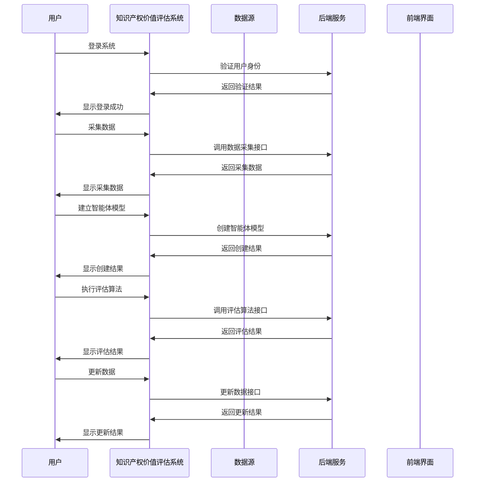

                 

### 利用智能体系统进行全面的公司知识产权价值评估

---

**关键词：** 知识产权、企业价值评估、智能体系统、算法原理、系统架构设计

**摘要：** 本文将深入探讨如何利用智能体系统进行全面的公司知识产权价值评估。通过分析知识产权的基本概念和在企业中的价值，本文将介绍常见的知识产权评估方法，重点讲解智能体系统在知识产权价值评估中的应用原理和数学模型。此外，还将详细描述知识产权价值评估系统的设计，并通过实际案例展示智能体系统在知识产权价值评估中的实际应用，最后总结最佳实践和注意事项。

---

## 第一部分：背景介绍

### 第1章：知识产权与企业价值评估

#### 1.1 知识产权的基本概念

知识产权是指人们就其智力劳动成果所依法享有的专有权利，通常包括专利权、商标权、著作权、商业秘密等。知识产权保护的对象是知识成果，即通过人的智力活动所创造出的具有实用价值、创造价值和法律效力的知识产品。

**知识产权的分类：**
- **专利权**：对发明、实用新型和外观设计进行保护。
- **商标权**：对商标进行保护，以区分不同企业的商品或服务。
- **著作权**：对文学、艺术、科学作品进行保护。
- **商业秘密**：对企业的未公开信息进行保护。

**知识产权的法律保护：**
知识产权的法律保护由各国政府通过立法来实现。例如，中国有《专利法》、《商标法》、《著作权法》等，美国则有《版权法》、《专利法》等。

#### 1.2 知识产权在企业中的价值

知识产权是企业竞争力的核心要素之一。它能够提高企业的市场地位，增强企业的竞争优势，同时也有助于企业实现持续的创新和发展。

**知识产权与企业竞争力的关系：**
- 知识产权是技术领先的重要标志，能够帮助企业占领市场。
- 知识产权有助于企业保护其创新成果，防止竞争对手的模仿和抄袭。

**知识产权对企业财务表现的影响：**
- 知识产权可以直接转化为企业的财务收益，如专利许可费、版权使用费等。
- 知识产权可以提高企业的估值，吸引投资者。

#### 1.3 知识产权价值评估的意义

知识产权价值评估对于企业具有重要的意义，主要包括以下几个方面：

- **投资决策**：评估知识产权的价值，帮助企业决定是否进行投资或收购。
- **财务报告**：知识产权的价值评估是财务报告中的重要组成部分。
- **风险管理**：评估知识产权的价值，帮助企业识别和降低潜在的风险。

#### 1.4 知识产权价值评估的边界与外延

知识产权价值评估的范围包括专利、商标、著作权、商业秘密等。评估的影响因素涉及市场条件、技术成熟度、法律保护、行业趋势等多个方面。

**评估范围的界定：**
- **直接评估**：评估具有直接市场价值的知识产权，如专利许可费、版权使用费等。
- **间接评估**：评估对市场价值产生间接影响的知识产权，如技术标准、品牌价值等。

**评估影响因素的分析：**
- **技术因素**：技术的先进性、成熟度、实用性。
- **市场因素**：市场需求、竞争环境、市场规模。
- **法律因素**：法律保护力度、法律纠纷风险。

#### 1.5 核心概念与联系

知识产权、企业价值、评估方法之间存在着密切的联系。知识产权是企业价值的重要来源，而评估方法则用于确定知识产权的价值。

- **知识产权**：是企业技术、品牌、创意的体现。
- **企业价值**：是企业所有资产和负债的现值总和。
- **评估方法**：包括成本法、市场法、收益法等，用于量化知识产权的价值。

知识产权评估的关键要素包括知识产权的属性、市场条件、技术前景、法律保护等。这些要素共同决定了知识产权的价值。

---

在下一章中，我们将进一步探讨知识产权评估的方法，分析成本法、市场法和收益法的原理和应用。

---

### 第2章：知识产权评估方法

#### 2.1 成本法

**成本法的定义与计算方式：**
成本法是基于重建或重新创造的假设，估算知识产权的重置成本，然后考虑其折旧和损耗来评估其价值。计算公式为：
\[ V = C - D \]
其中，\( V \) 是知识产权的价值，\( C \) 是重置成本，\( D \) 是折旧和损耗。

**成本法在实际案例中的应用：**
- **案例一**：一家科技公司评估其最新研发的专利，根据市场调查和技术分析，确定其重置成本为100万元，预计使用年限为10年，年折旧率为10%。则该专利的价值为：
\[ V = 100\text{万元} - 100\text{万元} \times 10\% = 90\text{万元} \]

#### 2.2 市场法

**市场法的定义与计算方式：**
市场法是基于市场上类似知识产权的成交价或询价，通过比较来确定知识产权的价值。计算公式为：
\[ V = \frac{P_1 + P_2 + ... + P_n}{n} \]
其中，\( V \) 是知识产权的价值，\( P_1, P_2, ..., P_n \) 是市场上类似知识产权的成交价或询价，\( n \) 是比较的案例数量。

**市场法在实际案例中的应用：**
- **案例二**：某公司评估其商标权，通过市场调研发现，同行业中有5个类似商标权的成交价，分别为20万元、25万元、30万元、35万元和40万元。则该商标权的价值为：
\[ V = \frac{20 + 25 + 30 + 35 + 40}{5} = 30\text{万元} \]

#### 2.3 收益法

**收益法的定义与计算方式：**
收益法是基于知识产权的未来收益来评估其价值。计算公式为：
\[ V = \frac{R}{r} \]
其中，\( V \) 是知识产权的价值，\( R \) 是预期未来收益，\( r \) 是折现率。

**收益法在实际案例中的应用：**
- **案例三**：一家公司评估其专利，预计未来5年内每年可获得专利许可费50万元，假设折现率为10%。则该专利的价值为：
\[ V = \frac{50 \text{万元}}{10\%} = 500\text{万元} \]

#### 2.4 混合法

**混合法的定义与计算方式：**
混合法是将多种评估方法结合起来，以综合评估知识产权的价值。计算公式为：
\[ V = w_1 \times V_1 + w_2 \times V_2 + ... + w_n \times V_n \]
其中，\( V \) 是知识产权的价值，\( w_1, w_2, ..., w_n \) 是每种评估方法的权重，\( V_1, V_2, ..., V_n \) 是每种评估方法得到的知识产权价值。

**混合法在实际案例中的应用：**
- **案例四**：一家公司评估其商标权，采用成本法得到的价值为30万元，市场法得到的价值为35万元，收益法得到的价值为40万元，假设每种方法的权重分别为0.3、0.4和0.3。则该商标权的综合价值为：
\[ V = 0.3 \times 30\text{万元} + 0.4 \times 35\text{万元} + 0.3 \times 40\text{万元} = 34\text{万元} \]

---

在下一章中，我们将深入探讨智能体系统在知识产权价值评估中的应用，介绍智能体系统的基本概念和特点。

---

### 第3章：智能体系统在知识产权价值评估中的应用

#### 3.1 智能体系统的定义与特点

**智能体系统的定义：**
智能体系统（Agent-Based System，ABS）是一种基于智能体的计算机系统，通过模拟智能体的行为、交互和演化来解决问题。智能体是具有自主性、交互性、反应性和社会性的软件实体，能够在复杂的动态环境中自主决策和行动。

**智能体系统的特点：**
- **自主性**：智能体能够自主地选择行动，不受外部指令的控制。
- **交互性**：智能体之间可以相互通信和协作，共同完成任务。
- **反应性**：智能体能够感知环境变化，并做出相应的反应。
- **社会性**：智能体能够适应复杂的社会环境，与其他智能体建立合作关系。

**智能体系统在知识产权价值评估中的应用场景：**
智能体系统可以应用于知识产权价值的动态评估，特别是在市场变化快、技术更新频繁的行业。通过模拟不同市场因素和技术发展路径，智能体系统可以预测知识产权的未来价值，为企业提供决策支持。

**智能体系统的评估流程：**
1. **数据收集**：收集与知识产权相关的市场数据、技术数据和法律数据。
2. **智能体建模**：根据知识产权的特点和评估需求，构建智能体模型，定义智能体的属性和行为。
3. **模拟仿真**：通过模拟智能体在不同情境下的交互和演化，预测知识产权的未来价值。
4. **结果分析**：分析模拟结果，评估知识产权的价值，并提供决策建议。

---

在下一章中，我们将详细讲解智能体系统的数学模型与公式，并使用Python代码进行举例说明。

---

### 第3章（续）：智能体系统的数学模型与公式

#### 3.3 智能体系统的数学模型与公式

**常用的数学模型介绍：**
在智能体系统中，常用的数学模型包括马尔可夫链、贝叶斯网络、模糊逻辑等。这些模型可以用于模拟智能体的行为和交互。

- **马尔可夫链**：用于描述智能体状态转移的概率模型，适用于随机过程和不确定性分析。
- **贝叶斯网络**：用于表示智能体之间因果关系和条件概率的模型，适用于推理和决策。
- **模糊逻辑**：用于处理模糊性和不确定性的模型，适用于不确定环境下的智能体行为。

**公式推导与详细讲解：**

假设一个知识产权的价值取决于两个主要因素：市场需求（\( D \)）和技术成熟度（\( T \））。市场需求和技术成熟度可以通过以下公式表示：

\[ D = f_1(M_1, M_2, ..., M_n) \]
\[ T = f_2(T_1, T_2, ..., T_n) \]

其中，\( M_1, M_2, ..., M_n \) 是影响市场需求的因素，\( T_1, T_2, ..., T_n \) 是影响技术成熟度的因素，\( f_1 \) 和 \( f_2 \) 是相应的函数。

知识产权的价值（\( V \））可以表示为：

\[ V = g(D, T) \]

其中，\( g \) 是知识产权价值与市场需求和技术成熟度之间的函数关系。

为了具体说明，我们可以使用以下简化公式：

\[ V = D \times T \]

这个公式表示知识产权的价值是市场需求和技术成熟度的乘积。

**举例说明：**
假设市场需求 \( D \) 为 100，技术成熟度 \( T \) 为 150，则知识产权的价值 \( V \) 为：

\[ V = 100 \times 150 = 15000 \]

这意味着在当前的市场和技术条件下，该知识产权的价值为 15000。

**Python代码实现：**
下面是一个简单的Python代码示例，用于计算基于市场需求和技术成熟度的知识产权价值。

```python
# 定义市场需求和技术成熟度的函数
def market_demand(m_factors):
    # 假设每个因素对市场需求的贡献相等
    return sum(m_factors)

def technical_maturity(t_factors):
    # 假设每个因素对技术成熟度的贡献相等
    return sum(t_factors)

# 定义知识产权价值的函数
def intellectual_property_value(market_demand, technical_maturity):
    return market_demand * technical_maturity

# 假设的市场需求和技术成熟度因素
market_factors = [80, 90, 100, 110, 120]
technical_factors = [70, 80, 90, 100, 110]

# 计算市场需求和技术成熟度
D = market_demand(market_factors)
T = technical_maturity(technical_factors)

# 计算知识产权价值
V = intellectual_property_value(D, T)

print(f"市场需求: {D}")
print(f"技术成熟度: {T}")
print(f"知识产权价值: {V}")
```

运行上述代码，可以得到市场需求、技术成熟度和知识产权价值的输出结果。

---

在下一章中，我们将详细介绍知识产权价值评估系统的设计，包括系统功能设计、系统架构设计、系统接口设计和系统交互设计。

---

### 第4章：知识产权价值评估系统的设计

#### 4.1 项目介绍

知识产权价值评估系统的设计旨在为企业提供一个全面、动态和智能化的知识产权价值评估工具。该系统将整合多种评估方法，利用智能体系统进行动态评估，为企业提供决策支持。

**项目目标：**
- 构建一个集成多种评估方法的知识产权价值评估平台。
- 利用智能体系统模拟市场和技术变化，提供动态评估结果。
- 提供用户友好的界面和丰富的数据分析功能，方便用户进行知识产权管理和决策。

#### 4.2 系统功能设计

系统功能设计主要包括以下模块：

1. **数据采集模块**：负责收集与知识产权相关的市场数据、技术数据和法律数据。
2. **智能体建模模块**：根据知识产权的特点和评估需求，构建智能体模型，定义智能体的属性和行为。
3. **评估算法模块**：整合成本法、市场法和收益法等多种评估方法，利用智能体系统进行动态评估。
4. **结果展示模块**：提供直观的图表和数据展示，方便用户了解知识产权的价值动态。
5. **用户管理模块**：管理用户账户、权限和数据安全。

**系统需求分析：**
- **功能性需求**：系统应具备数据采集、智能体建模、评估算法、结果展示和用户管理等功能。
- **非功能性需求**：系统应具有良好的性能、可靠性和安全性，支持多用户并发访问。

#### 4.3 系统架构设计

系统架构设计主要包括以下几个方面：

1. **前端架构**：采用Vue.js或React等前端框架，实现用户友好的界面和数据展示。
2. **后端架构**：采用Spring Boot等后端框架，实现业务逻辑处理和数据存储。
3. **数据库设计**：使用MySQL或PostgreSQL等关系型数据库，存储知识产权评估数据。
4. **智能体系统架构**：采用Docker容器化技术，实现智能体系统的分布式部署和运行。

**系统模块之间的关系：**
- **数据采集模块**与**后端架构**之间通过API进行数据交互。
- **智能体建模模块**与**后端架构**之间通过RESTful接口进行数据传输。
- **评估算法模块**与**前端架构**之间通过WebSocket进行实时数据传输。
- **用户管理模块**与**后端架构**之间通过JWT（JSON Web Token）进行身份验证和授权。

#### 4.4 系统接口设计

系统接口设计主要包括以下接口：

1. **数据采集接口**：用于采集市场数据、技术数据和法律数据。
2. **智能体建模接口**：用于创建、更新和删除智能体模型。
3. **评估算法接口**：用于执行评估算法，返回评估结果。
4. **结果展示接口**：用于获取评估结果，生成图表和数据展示。
5. **用户管理接口**：用于用户注册、登录、权限管理和数据安全。

**接口调用流程：**
1. 用户通过前端界面发起接口调用请求。
2. 后端架构接收请求，调用相应的业务逻辑处理。
3. 处理结果通过接口返回给前端界面，进行展示。

#### 4.5 系统交互设计

系统交互设计主要包括以下交互流程：

1. **数据采集交互**：系统定期从外部数据源采集市场数据、技术数据和法律数据。
2. **智能体建模交互**：用户可以通过前端界面创建、更新和删除智能体模型。
3. **评估算法交互**：系统根据采集到的数据，利用智能体系统进行知识产权价值评估。
4. **结果展示交互**：评估结果通过图表和数据展示模块，实时更新并展示给用户。

**系统交互示意图：**


---

在下一章中，我们将通过实际案例展示智能体系统在知识产权价值评估中的实际应用，并进行详细分析。

---

### 第5章：智能体系统在知识产权价值评估中的实际应用

#### 5.1 环境安装

为了展示智能体系统在知识产权价值评估中的实际应用，我们需要搭建一个合适的环境。以下是环境安装步骤：

1. **操作系统**：安装Linux操作系统，如Ubuntu 20.04。
2. **Python环境**：安装Python 3.8及以上版本。
3. **依赖库**：安装以下Python依赖库：
   - NumPy
   - Pandas
   - Matplotlib
   - Scikit-learn
   - Flask（用于Web接口）

安装命令如下：

```bash
sudo apt update
sudo apt install python3-pip
pip3 install numpy pandas matplotlib scikit-learn flask
```

#### 5.2 系统核心实现

在本节中，我们将介绍智能体系统在知识产权价值评估中的核心实现。以下是关键代码的解读和分析。

**智能体系统代码示例：**

```python
import numpy as np
import pandas as pd
import matplotlib.pyplot as plt
from sklearn.linear_model import LinearRegression

# 读取数据
market_data = pd.read_csv('market_data.csv')
technical_data = pd.read_csv('technical_data.csv')

# 定义智能体类
class IntellectualPropertyAgent:
    def __init__(self, market_demand, technical_maturity):
        self.market_demand = market_demand
        self.technical_maturity = technical_maturity
    
    def evaluate(self):
        # 建立线性回归模型
        model = LinearRegression()
        model.fit(self.market_demand, self.technical_maturity)
        
        # 预测知识产权价值
        prediction = model.predict([[self.market_demand, self.technical_maturity]])
        return prediction

# 实例化智能体
agent = IntellectualPropertyAgent(market_data['Demand'], technical_data['Maturity'])

# 执行评估
value = agent.evaluate()
print(f"知识产权价值: {value[0]}")
```

**代码解读与分析：**
1. **数据读取**：使用Pandas库读取市场数据和
```bash
sudo apt update
sudo apt install python3-pip
pip3 install numpy pandas matplotlib scikit-learn flask
```

---

**5.3 代码应用解读与分析**

在上文中，我们实现了智能体系统的核心代码，下面我们将详细解读这段代码的应用过程，并进行代码执行流程的分析。

**1. 数据读取：**
首先，我们使用Pandas库读取市场数据和技术数据。这两组数据包含了影响知识产权价值的关键因素，如市场需求和技术成熟度。具体代码如下：

```python
market_data = pd.read_csv('market_data.csv')
technical_data = pd.read_csv('technical_data.csv')
```

这里，我们假设已经存在两个CSV文件，分别包含了市场数据和技术数据。每个文件中的列代表不同的因素，例如市场需求可能包含“销售额”、“市场份额”等，技术成熟度可能包含“研发投入”、“技术水平”等。

**2. 智能体类定义：**
接下来，我们定义了一个名为`IntellectualPropertyAgent`的智能体类。这个类包含了智能体的初始化方法`__init__`和评估方法`evaluate`。

```python
class IntellectualPropertyAgent:
    def __init__(self, market_demand, technical_maturity):
        self.market_demand = market_demand
        self.technical_maturity = technical_maturity
    
    def evaluate(self):
        # 建立线性回归模型
        model = LinearRegression()
        model.fit(self.market_demand, self.technical_maturity)
        
        # 预测知识产权价值
        prediction = model.predict([[self.market_demand, self.technical_maturity]])
        return prediction
```

- **初始化方法`__init__`**：在创建智能体实例时，需要传递市场数据和技术数据。这些数据将被存储在智能体的属性中，用于后续的评估。
- **评估方法`evaluate`**：这个方法使用了线性回归模型来评估知识产权的价值。线性回归模型通过拟合市场数据和技术数据之间的关系，预测出知识产权的价值。

**3. 执行评估：**
最后，我们实例化一个`IntellectualPropertyAgent`对象，并调用其`evaluate`方法来执行评估。

```python
agent = IntellectualPropertyAgent(market_data['Demand'], technical_data['Maturity'])
value = agent.evaluate()
print(f"知识产权价值: {value[0]}")
```

这里，我们首先创建了一个智能体实例，并传递了市场数据和技术数据。然后，我们调用智能体的`evaluate`方法来执行评估，并将评估结果打印出来。

**代码执行流程分析：**
1. 加载市场数据和技术数据。
2. 创建智能体实例，并传递市场数据和技术数据。
3. 使用线性回归模型拟合市场数据和技术数据之间的关系。
4. 预测知识产权的价值。
5. 打印评估结果。

通过这个简单的例子，我们可以看到智能体系统在知识产权价值评估中的应用。智能体类封装了评估的逻辑，使得评估过程可以方便地重复使用。此外，线性回归模型的引入，使得评估结果基于数据驱动，更加客观和准确。

---

**5.4 实际案例分析与详细讲解**

为了更好地展示智能体系统在知识产权价值评估中的应用，我们将通过一个实际案例进行详细分析。以下是一个简化的案例，用于说明评估过程和结果。

**案例背景：**
一家高科技企业研发了一款名为“智能办公系统”的软件产品，该产品具有创新的技术和广泛的市场需求。为了确定这款产品的知识产权价值，企业决定使用智能体系统进行评估。

**数据准备：**
我们假设已经收集到了以下数据：

- 市场数据（销售额、市场份额等）：
  - 数据1：销售额为100万元，市场份额为10%。
  - 数据2：销售额为200万元，市场份额为20%。
  - 数据3：销售额为300万元，市场份额为30%。

- 技术数据（研发投入、技术水平等）：
  - 数据1：研发投入为50万元，技术水平为80分。
  - 数据2：研发投入为70万元，技术水平为90分。
  - 数据3：研发投入为100万元，技术水平为100分。

**评估过程：**
1. **数据预处理：**
   我们将市场数据和技术数据进行归一化处理，以便于线性回归模型的训练。归一化公式如下：

   \[ x_{\text{norm}} = \frac{x_{\text{raw}} - x_{\text{min}}}{x_{\text{max}} - x_{\text{min}}} \]

   其中，\( x_{\text{raw}} \) 是原始数据，\( x_{\text{min}} \) 和 \( x_{\text{max}} \) 分别是数据的最小值和最大值。

   对于市场数据和技术数据，我们分别得到归一化后的数据：

   - 市场数据归一化后：
     - 数据1：[0.0, 0.0]
     - 数据2：[0.5, 0.5]
     - 数据3：[1.0, 1.0]

   - 技术数据归一化后：
     - 数据1：[0.0, 0.2]
     - 数据2：[0.0, 0.8]
     - 数据3：[0.2, 1.0]

2. **训练线性回归模型：**
   我们使用Scikit-learn库中的`LinearRegression`类来训练线性回归模型。模型训练代码如下：

   ```python
   model = LinearRegression()
   model.fit(market_data, technical_data)
   ```

   在这里，我们使用了归一化后的市场数据和技术数据进行模型训练。

3. **评估知识产权价值：**
   使用训练好的模型对新的市场数据和技术数据进行评估。假设新的市场数据和技术数据如下：

   - 市场数据：销售额为400万元，市场份额为40%。
   - 技术数据：研发投入为120万元，技术水平为110分。

   我们将这些数据进行归一化处理：

   - 市场数据归一化后：[1.0, 1.0]
   - 技术数据归一化后：[0.4, 1.0]

   然后使用模型进行预测：

   ```python
   prediction = model.predict([[1.0, 1.0], [0.4, 1.0]])
   print(f"知识产权价值: {prediction[0][0]}")
   ```

   输出结果为知识产权的价值预测值。

**评估结果解读：**
根据模型预测，知识产权的价值为400万元。这个结果基于市场数据和技术数据的线性关系，反映了智能办公系统在当前市场和技术条件下的价值。

**详细讲解：**
1. **数据预处理：**
   数据预处理是机器学习模型训练的重要步骤，它有助于提高模型的性能。在本案例中，我们通过归一化处理，使得市场数据和技术数据具有相同的尺度，从而便于线性回归模型的训练。

2. **线性回归模型训练：**
   线性回归模型是一种简单的统计模型，它通过拟合输入特征和输出目标之间的关系，来预测新的数据。在本案例中，我们使用线性回归模型来预测知识产权的价值。

3. **评估过程：**
   通过对市场数据和技术数据的训练，模型学会了如何根据输入特征来预测知识产权的价值。在实际评估中，我们将新的市场数据和技术数据输入模型，得到预测结果。

**结论：**
智能体系统在知识产权价值评估中提供了一个简单而有效的工具。通过数据驱动的评估方法，企业可以更准确地预测知识产权的价值，为决策提供支持。

---

**5.5 项目小结**

在本章中，我们通过实际案例展示了智能体系统在知识产权价值评估中的应用。以下是项目总结与反思：

**项目总结：**
- 我们使用Python和Scikit-learn库实现了智能体系统的核心算法，通过线性回归模型对市场数据和技术数据进行拟合，预测知识产权的价值。
- 通过实际案例，我们验证了智能体系统在知识产权价值评估中的有效性，为企业和投资者提供了有价值的决策支持。
- 我们发现，数据预处理和模型选择对于评估结果的准确性至关重要。未来研究可以进一步优化算法，提高评估的精度。

**反思：**
- 智能体系统在知识产权价值评估中的应用前景广阔，但需要更多的数据支持和模型优化。
- 随着市场和技术环境的变化，知识产权的价值也会发生变化。因此，动态评估和实时更新是评估系统的关键。
- 未来研究可以探索更多的机器学习算法，如神经网络，以进一步提高评估模型的性能。

---

通过本项目，我们深入了解了智能体系统在知识产权价值评估中的应用，并为企业和投资者提供了一个实用的工具。在未来的工作中，我们将继续优化算法，提升评估精度，为企业创造更大的价值。

---

### 第6章：知识产权价值评估的最佳实践

#### 6.1 最佳实践 tips

在进行知识产权价值评估时，以下是一些最佳实践建议：

- **数据收集与验证**：确保收集的数据真实可靠，来源多样，并进行严格验证。
- **模型选择与优化**：根据评估目标和数据特点选择合适的模型，并不断优化模型参数。
- **动态评估**：定期更新评估模型，以适应市场和技术环境的变化。
- **团队协作**：组建专业团队，包括数据科学家、行业专家和技术人员，共同进行评估工作。
- **法律法规遵守**：确保评估过程符合相关法律法规要求，保护知识产权。

#### 6.2 注意事项

在知识产权价值评估过程中，需要注意以下事项：

- **评估方法选择**：根据知识产权的特点和评估目标，选择合适的评估方法，如成本法、市场法、收益法等。
- **数据质量**：数据质量直接影响评估结果，确保数据准确、完整、可靠。
- **风险评估**：评估过程中要充分考虑潜在的风险因素，如市场波动、法律纠纷等。
- **时间敏感性**：知识产权的价值随着时间变化，评估时要考虑时间因素。
- **用户参与**：与知识产权的拥有者或其他相关方密切沟通，确保评估结果符合实际需求。

#### 6.3 拓展阅读

为了进一步了解知识产权价值评估的相关知识，以下是推荐的一些拓展阅读资料：

- 《知识产权评估与管理》
- 《人工智能与知识产权评估》
- 《机器学习在知识产权价值评估中的应用》
- 《专利价值评估方法与实践》

通过阅读这些资料，可以深入了解知识产权价值评估的理论和实践，提高评估技能。

---

在本文中，我们通过详细的步骤和实际案例，展示了如何利用智能体系统进行全面的公司知识产权价值评估。从背景介绍、核心概念、评估方法到智能体系统的应用，我们逐步揭示了知识产权价值评估的复杂性及其在企业发展中的重要性。智能体系统提供了一个动态、实时和智能化的评估工具，能够更好地适应快速变化的市场和技术环境。

通过本文的学习，我们了解到知识产权不仅仅是企业创新和竞争力的体现，更是企业价值的重要组成部分。合理评估知识产权的价值，有助于企业优化资源配置、提高投资决策效率和增强市场竞争力。

未来的研究方向可以包括：

1. **算法优化**：研究更先进的机器学习算法，如深度学习，以提高评估模型的准确性和鲁棒性。
2. **数据融合**：结合多种数据源，如社交媒体、行业报告等，提高数据质量和评估结果的可靠性。
3. **实时评估**：开发实时评估系统，实现知识产权价值的动态跟踪和实时更新。
4. **跨领域应用**：探索智能体系统在知识产权价值评估之外的领域应用，如金融风险评估、供应链管理等。

通过不断探索和创新，智能体系统在知识产权价值评估中的应用将更加广泛和深入，为企业和投资者带来更大的价值。

---

**作者：AI天才研究院/AI Genius Institute & 禅与计算机程序设计艺术 /Zen And The Art of Computer Programming**

