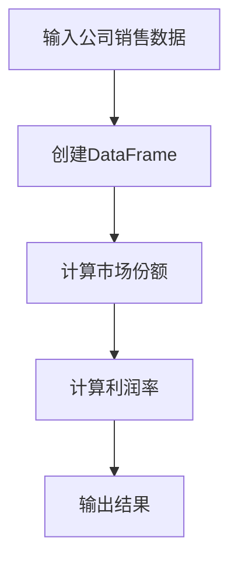
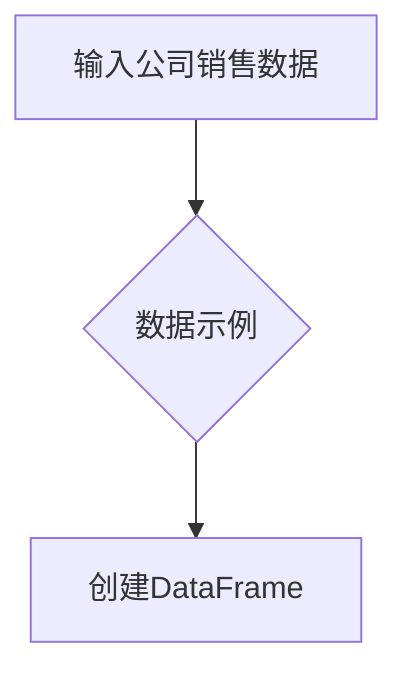
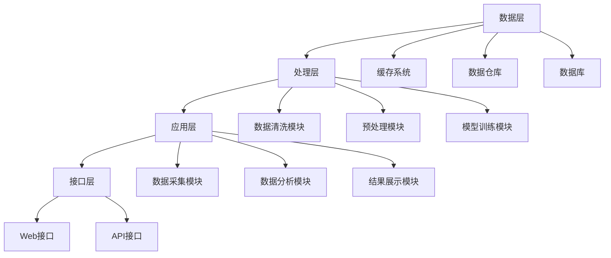
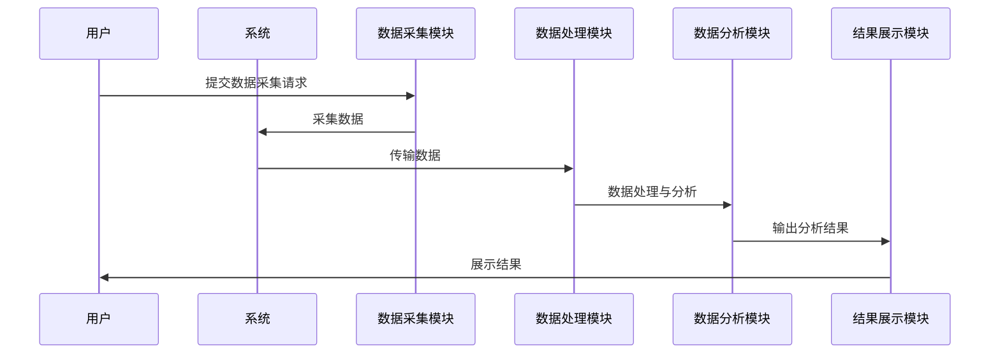
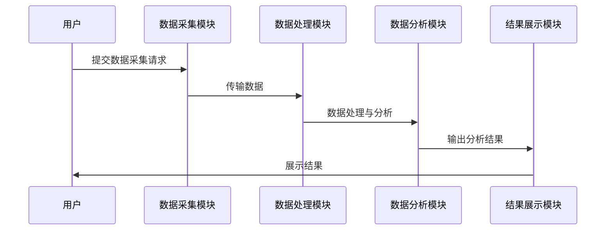

                 


### 1.1.1 智能体网络简介

智能体网络（Agent-Based Model, ABM）是一种模拟复杂系统行为的计算模型，其核心思想是通过模拟大量智能体（agents）的交互行为来研究整个系统的宏观现象。智能体是具有自主性、认知能力和行为能力的实体，可以是单个个体，也可以是团体或组织。智能体网络在许多领域都有广泛应用，包括经济学、社会学、生态学、交通规划等。

在智能体网络中，智能体的自主性指的是它们可以在没有外部指令的情况下自主决策。认知能力使得智能体能够感知环境、学习经验并调整行为策略。行为能力则让智能体能够根据其目标和当前环境做出实际操作。

智能体网络与传统计算模型的不同之处在于其注重个体行为的复杂性和动态性。在传统模型中，系统行为通常由一组预定义的规则和参数来描述，而智能体网络则通过大量个体的交互来涌现出系统的整体行为。

智能体网络的基本概念可以概括为以下几点：

- **智能体（Agent）**：智能体是智能体网络的主体，具有感知环境、制定决策和执行操作的能力。智能体可以是人类、动物、机器或其他任何可以建模的实体。
- **环境（Environment）**：智能体所处的环境，可以是一个物理空间，也可以是一个信息空间。环境会影响智能体的感知和决策。
- **交互（Interaction）**：智能体之间以及智能体与环境的相互作用。交互是智能体网络行为复杂性的源泉。
- **规则（Rules）**：定义智能体如何感知环境、制定决策和执行操作的规则。规则可以是静态的，也可以是动态调整的。
- **模型（Model）**：用于描述智能体网络结构和行为的计算模型。模型可以是离散的，也可以是连续的。

智能体网络的作用主要体现在以下几个方面：

- **模拟复杂系统行为**：智能体网络可以模拟各种复杂系统的行为，如社会系统、生态系统、经济系统等，有助于我们理解系统的内部机制和外部影响。
- **预测系统演化趋势**：通过模拟智能体网络的演化过程，可以预测系统在未来可能的发展趋势，为政策制定和风险管理提供科学依据。
- **优化系统性能**：智能体网络可以通过优化智能体的行为策略来提高系统整体性能，如交通流量控制、资源分配优化等。
- **探索复杂系统涌现现象**：智能体网络可以揭示复杂系统中出现的宏观现象，如集体行为、自组织、适应性等，有助于我们理解复杂系统的本质。

### 1.1.2 公司在产业链中的地位变化概述

公司在产业链中的地位变化是一个动态且复杂的过程，受到多种内外部因素的影响。产业链中的公司地位变化不仅涉及公司自身的成长和发展，还与上下游企业的互动、市场需求的变化、技术创新的进展等因素密切相关。

首先，从公司内部来看，公司的战略规划、管理能力、创新能力、财务状况等都会对其在产业链中的地位产生影响。例如，一家公司如果能够持续创新，开发出具有竞争力的产品，可能会在产业链中获得更高的地位。

其次，从外部环境来看，市场需求的变化、行业竞争态势、政策法规的调整、供应链的稳定性等都是影响公司地位变化的重要因素。例如，在市场需求旺盛的情况下，公司可能会获得更多的订单，提升其在产业链中的地位。

公司在产业链中的地位变化可以表现为以下几个方面：

- **市场份额变化**：市场份额是衡量公司地位的重要指标。公司可以通过提升产品质量、降低成本、拓展市场等方式来增加市场份额，从而提高在产业链中的地位。
- **产业链位置变化**：公司在产业链中的位置也会发生变化。例如，一家公司可能会从单纯的制造商转变为提供综合解决方案的服务商，从而提高其在产业链中的价值链地位。
- **产业链协同效应**：公司与其他产业链企业的协同合作能力也会影响其在产业链中的地位。通过加强供应链管理、建立战略合作伙伴关系，公司可以提升整体供应链的效率和竞争力。
- **品牌影响力**：品牌影响力是公司地位变化的重要因素。良好的品牌形象可以增强消费者的信任度，提高公司在市场中的竞争力。

总之，公司在产业链中的地位变化是一个多因素、多层次的复杂过程。通过深入分析这些因素，可以更好地理解公司地位的变化趋势，为其战略规划和决策提供有力支持。

### 1.1.3 本书解决的问题与目标

本书旨在利用智能体网络分析公司在产业链中的地位变化，解决以下核心问题：

1. **智能体网络模型构建**：如何构建一个适用于分析公司地位变化的智能体网络模型，包括智能体的定义、属性和交互规则。
2. **算法与工具应用**：如何选择和运用合适的算法与工具，对公司的地位变化进行量化分析和评估。
3. **案例分析与应用**：如何通过实际案例，展示智能体网络分析在产业链地位变化研究中的应用效果，并为读者提供具体操作指南。

本书的目标是为从事产业链分析和企业战略规划的专业人士提供一套系统的理论和方法，帮助他们通过智能体网络分析深入了解公司在产业链中的地位变化，从而制定更加科学和有效的战略决策。具体来说，本书将涵盖以下内容：

- **智能体网络基础理论**：介绍智能体网络的基本概念、结构和原理，以及其在复杂系统分析中的应用。
- **公司地位变化分析**：阐述公司地位变化的驱动因素和评价指标，介绍如何运用智能体网络进行量化分析。
- **算法原理与实现**：详细讲解用于分析公司地位变化的算法原理，包括数学模型和实现方法，并通过案例进行说明。
- **系统设计与实现**：介绍智能体网络分析系统的整体架构设计、功能模块划分和实现细节。
- **案例研究**：通过实际案例分析，展示智能体网络分析在公司地位变化研究中的应用，提供具体操作实例。
- **最佳实践与总结**：总结智能体网络分析在产业链地位变化研究中的最佳实践，为读者提供未来研究的方向和建议。

通过本书的阅读和学习，读者将能够系统地掌握智能体网络分析的方法和应用，为产业链分析和企业战略制定提供有力支持。

## 1.2 核心概念与联系

### 1.2.1 智能体网络的基本概念

智能体网络（Agent-Based Model, ABM）是一种模拟复杂系统行为的计算模型，其核心是智能体（agents）。智能体是具有自主性、认知能力和行为能力的实体，可以是单个个体，也可以是团体或组织。智能体的自主性意味着它们可以在没有外部指令的情况下自主决策；认知能力使智能体能够感知环境、学习经验并调整行为策略；行为能力则让智能体能够根据其目标和当前环境做出实际操作。

在智能体网络中，智能体之间的相互作用构成了整个系统的复杂行为。智能体可以存在于不同的环境中，这些环境可以是物理空间，也可以是信息空间。环境不仅影响智能体的感知和决策，也是智能体行为的载体。

智能体网络的基本组成部分包括：

- **智能体（Agent）**：智能体是智能体网络的主体，具备感知、决策和执行能力。
- **环境（Environment）**：智能体所处的环境，可以是物理空间，也可以是信息空间。
- **交互（Interaction）**：智能体之间以及智能体与环境的相互作用，这是智能体网络行为复杂性的源泉。
- **规则（Rules）**：定义智能体如何感知环境、制定决策和执行操作的规则。这些规则可以是静态的，也可以是动态调整的。
- **模型（Model）**：用于描述智能体网络结构和行为的计算模型。模型可以是离散的，也可以是连续的。

### 1.2.1.1 智能体的定义

智能体的定义因应用场景而异，但通常具备以下基本特征：

- **自主性**：智能体能够自主决策，不受外部指令的约束。
- **认知能力**：智能体能够感知环境，理解自身状态，并基于感知的信息做出决策。
- **行为能力**：智能体能够执行具体的操作，如移动、交易、制造等。

在智能体网络中，智能体可以是人类、动物、机器或其他任何可以建模的实体。例如，在社交网络中，每个用户可以被视为一个智能体；在交通系统中，每辆车也可以被视为一个智能体。

### 1.2.1.2 网络的特征

智能体网络具有以下主要特征：

- **分布式**：智能体分布在不同的位置，通过网络进行通信和协调。
- **动态性**：智能体和其环境是动态变化的，导致整个网络状态不断变化。
- **适应性**：智能体能够根据环境的变化调整自己的行为策略。
- **复杂性**：智能体之间的相互作用和整体行为表现出高度的复杂性。

这些特征使得智能体网络在模拟复杂系统行为时具有独特优势。例如，通过智能体网络可以模拟社会系统的集体行为，交通系统的流量分布，经济系统的市场波动等。

### 1.2.1.3 智能体网络的作用

智能体网络的作用主要体现在以下几个方面：

- **模拟复杂系统行为**：智能体网络可以模拟各种复杂系统的行为，如社会系统、生态系统、经济系统等，有助于我们理解系统的内部机制和外部影响。
- **预测系统演化趋势**：通过模拟智能体网络的演化过程，可以预测系统在未来可能的发展趋势，为政策制定和风险管理提供科学依据。
- **优化系统性能**：智能体网络可以通过优化智能体的行为策略来提高系统整体性能，如交通流量控制、资源分配优化等。
- **探索复杂系统涌现现象**：智能体网络可以揭示复杂系统中出现的宏观现象，如集体行为、自组织、适应性等，有助于我们理解复杂系统的本质。

### 1.2.2 公司地位变化分析

公司在产业链中的地位变化是一个动态且复杂的过程，受到多种内外部因素的影响。产业链中的公司地位变化不仅涉及公司自身的成长和发展，还与上下游企业的互动、市场需求的变化、技术创新的进展等因素密切相关。

首先，从公司内部来看，公司的战略规划、管理能力、创新能力、财务状况等都会对其在产业链中的地位产生影响。例如，一家公司如果能够持续创新，开发出具有竞争力的产品，可能会在产业链中获得更高的地位。

其次，从外部环境来看，市场需求的变化、行业竞争态势、政策法规的调整、供应链的稳定性等都是影响公司地位变化的重要因素。例如，在市场需求旺盛的情况下，公司可能会获得更多的订单，提升其在产业链中的地位。

公司在产业链中的地位变化可以表现为以下几个方面：

- **市场份额变化**：市场份额是衡量公司地位的重要指标。公司可以通过提升产品质量、降低成本、拓展市场等方式来增加市场份额，从而提高在产业链中的地位。
- **产业链位置变化**：公司在产业链中的位置也会发生变化。例如，一家公司可能会从单纯的制造商转变为提供综合解决方案的服务商，从而提高其在产业链中的价值链地位。
- **产业链协同效应**：公司与其他产业链企业的协同合作能力也会影响其在产业链中的地位。通过加强供应链管理、建立战略合作伙伴关系，公司可以提升整体供应链的效率和竞争力。
- **品牌影响力**：品牌影响力是公司地位变化的重要因素。良好的品牌形象可以增强消费者的信任度，提高公司在市场中的竞争力。

### 1.2.2.1 产业链中的公司角色

在产业链中，公司扮演着不同的角色，这些角色决定了公司在产业链中的地位和影响力。常见的公司角色包括：

- **供应商**：供应商为其他公司提供原材料、零部件或服务。供应商在产业链中的地位通常取决于其产品或服务的质量、价格和供货稳定性。
- **制造商**：制造商将原材料或零部件加工成成品。制造商在产业链中的地位通常取决于其生产能力、产品多样性和市场竞争力。
- **分销商**：分销商将制造商的产品销售给最终消费者。分销商在产业链中的地位通常取决于其市场覆盖范围、销售渠道和品牌影响力。
- **服务商**：服务商为其他公司提供专业服务，如物流、金融服务、技术支持等。服务商在产业链中的地位通常取决于其服务的质量和专业性。
- **终端客户**：终端客户是最终使用产品或服务的消费者。终端客户的需求和偏好直接影响产业链中的公司和企业的地位变化。

### 1.2.2.2 公司地位变化的驱动力

公司地位变化受多种驱动力的影响，这些驱动力可以分为内部和外部两大类：

- **内部驱动力**：
  - **战略规划**：公司通过制定长远战略，明确目标和资源分配，以提升在产业链中的地位。
  - **管理能力**：高效的管理团队可以优化公司运营，提高市场响应速度和竞争力。
  - **创新能力**：持续的技术创新和产品开发可以增强公司的市场竞争力，提高其在产业链中的地位。
  - **财务状况**：良好的财务状况为公司提供资金支持，使其能够进行扩张和投资。

- **外部驱动力**：
  - **市场需求**：市场需求的波动直接影响公司的订单量和市场份额，从而影响其地位。
  - **行业竞争**：行业内的竞争态势会迫使公司不断提高自身竞争力，以保持或提升其在产业链中的地位。
  - **政策法规**：政府的政策法规可能会对公司的运营环境和市场环境产生重大影响，从而影响其在产业链中的地位。
  - **供应链稳定性**：供应链的稳定性直接影响公司的生产和交付能力，进而影响其地位。

### 1.2.2.3 公司地位变化的评价指标

评估公司地位变化需要使用一系列评价指标，这些指标可以从不同角度反映公司在产业链中的地位。以下是一些常见的评价指标：

- **市场份额**：公司在其所在市场中的销售份额，是衡量公司地位的重要指标。
- **利润率**：公司的盈利能力，反映了公司在市场中的竞争力和经营效率。
- **创新能力**：公司在新产品、新技术研发方面的投入和成果，是衡量其创新能力的重要指标。
- **品牌影响力**：公司的品牌知名度和消费者对其产品的认可度，是衡量其在市场中影响力的指标。
- **供应链效率**：公司供应链的管理水平和运营效率，直接影响其生产和交付能力。
- **市场响应速度**：公司对市场变化和客户需求的响应速度，反映了其灵活性和竞争力。

### 1.2.3 概念联系图

为了更好地理解智能体网络与公司在产业链中的地位变化之间的联系，我们可以通过ER（实体关系）图来展示这两个概念的关系。

在ER图中，智能体网络和公司在产业链中的地位变化分别作为实体，通过关系线连接起来。具体来说，智能体网络可以看作是公司地位变化的背景环境，而公司地位变化则是智能体网络中智能体行为的结果。

以下是智能体网络与公司地位变化的ER图示例：

```mermaid
erDiagram
  智能体网络 ||--o{ 公司地位变化
  公司地位变化 ||--|{ 智能体
  智能体 ||--o{ 环境
  环境 ||--o{ 公司地位变化
  公司地位变化 ||--|{ 外部因素
  外部因素 ||--o{ 环境
```

在这个ER图中，智能体网络通过智能体与公司地位变化相联系，外部因素则通过环境影响智能体网络和公司地位变化。通过这样的关系图，我们可以更加清晰地看到智能体网络如何影响公司在产业链中的地位变化，以及各种因素之间的相互作用。

## 1.3 算法原理讲解

### 1.3.1 分析公司地位变化的算法原理

分析公司在产业链中的地位变化需要运用多种算法和工具。这里，我们将介绍常用的算法原理，包括数学模型、公式和Python代码实现，并通过mermaid流程图详细阐述。

#### 1.3.1.1 数学模型和公式

首先，我们需要定义一些基本的数学模型和公式，用于衡量公司在产业链中的地位。以下是几个常用的指标：

1. **市场份额（Market Share）**：
   $$ \text{市场份额} = \frac{\text{公司销售额}}{\text{整个产业链销售额}} $$

2. **利润率（Profit Margin）**：
   $$ \text{利润率} = \frac{\text{净利润}}{\text{销售收入}} $$

3. **创新指数（Innovation Index）**：
   $$ \text{创新指数} = \frac{\text{研发投入} + \text{新产品销售额}}{\text{销售收入}} $$

4. **品牌影响力（Brand Influence）**：
   $$ \text{品牌影响力} = \text{品牌知名度指数} \times \text{消费者忠诚度指数} $$

其中，品牌知名度指数和消费者忠诚度指数可以通过市场调查和数据分析得到。

#### 1.3.1.2 Python代码实现

以下是一个简单的Python代码示例，用于计算公司的市场份额和利润率：

```python
# 导入必要的库
import pandas as pd

# 定义数据
sales_data = {'Company': ['A', 'B', 'C'], 'Sales': [1000, 800, 600]}
market_sales = 3000

# 创建DataFrame
df = pd.DataFrame(sales_data)

# 计算市场份额
df['Market Share'] = df['Sales'] / market_sales

# 计算利润率
df['Profit Margin'] = df['Sales'] * 0.1  # 假设每家公司的利润率都是10%

# 输出结果
print(df)
```

#### 1.3.1.3 mermaid流程图

为了更好地展示算法的实现流程，我们可以使用mermaid绘制一个流程图。以下是计算市场份额和利润率的mermaid流程图：



### 1.3.2 案例分析

为了更好地理解算法原理，我们通过一个具体案例进行分析。假设有以下公司的销售数据：

| 公司 | 销售额 |
| ---- | ------ |
| A    | 1000   |
| B    | 800    |
| C    | 600    |

我们需要计算这些公司在产业链中的市场份额和利润率。

#### 计算市场份额

1. **输入公司销售数据**：



2. **创建DataFrame**：

```mermaid
graph TD
    C --> D{df = pd.DataFrame()}
    D --> E[添加数据]
    E --> F[计算市场份额]
```

3. **计算市场份额**：

```mermaid
graph TD
    F --> G{df['Market Share'] = df['Sales'] / market_sales}
    G --> H[输出结果]
```

4. **输出结果**：

```mermaid
graph TD
    H --> I{print(df)}
```

#### 计算利润率

1. **输入公司销售数据**：


2. **创建DataFrame**：

```mermaid
graph TD
    C --> D{df = pd.DataFrame()}
    D --> E[添加数据]
```

3. **计算利润率**：

```mermaid
graph TD
    E --> F{df['Profit Margin'] = df['Sales'] * 0.1}
    F --> G[输出结果]
```

4. **输出结果**：

```mermaid
graph TD
    G --> H{print(df)}
```

### 1.3.3 代码解读

通过上面的mermaid流程图和代码示例，我们可以看到计算公司市场份额和利润率的步骤：

1. **输入数据**：首先需要输入公司的销售数据。
2. **创建DataFrame**：将输入的数据转换为DataFrame结构，以便进行后续计算。
3. **计算市场份额**：利用市场份额的公式计算每个公司的市场份额。
4. **计算利润率**：利用利润率的公式计算每个公司的利润率。
5. **输出结果**：将计算结果输出，以供分析和决策使用。

通过这种结构化的流程，我们可以清晰地理解每个步骤的作用和逻辑，从而更好地实现算法。

## 1.4 系统分析与架构设计

### 1.4.1 分析系统场景

分析公司在产业链中的地位变化是一个复杂的过程，涉及到多方面的数据收集、处理和分析。为了实现这一目标，我们需要构建一个高效的分析系统。系统的主要场景包括以下几个方面：

- **数据收集**：从多个数据源收集与公司地位变化相关的数据，如市场销售额、利润率、创新能力、品牌影响力等。
- **数据处理**：对收集到的数据进行清洗、整合和预处理，确保数据的质量和一致性。
- **数据分析**：运用智能体网络算法和数据分析工具，对处理后的数据进行分析，评估公司在产业链中的地位变化。
- **结果展示**：将分析结果以可视化的形式展示，帮助用户直观地理解公司的地位变化趋势。

### 1.4.2 系统功能设计

为了满足上述场景需求，系统需要实现以下功能模块：

- **数据采集模块**：负责从多个数据源收集与公司地位变化相关的数据，包括市场报告、财务报表、消费者调查等。
- **数据处理模块**：对采集到的数据进行清洗、去重、整合和预处理，确保数据的质量和一致性。
- **数据分析模块**：运用智能体网络算法和数据分析工具，对处理后的数据进行分析，评估公司在产业链中的地位变化。
- **结果展示模块**：将分析结果以图表、报告等形式展示，帮助用户直观地理解公司的地位变化趋势。
- **用户交互模块**：提供用户界面，支持用户输入数据、查看分析和结果、导出报告等操作。

### 1.4.3 系统架构设计

系统采用分布式架构设计，以实现高可用性、可扩展性和高性能。系统整体架构包括以下几个关键部分：

- **数据层**：负责数据的存储和管理，包括数据库、数据仓库和缓存系统等。
- **处理层**：负责数据处理和分析，包括数据清洗、预处理、智能体网络建模和分析算法等。
- **应用层**：负责系统功能的实现，包括数据采集、数据处理、数据分析和结果展示等。
- **接口层**：提供系统与其他系统或用户进行数据交互的接口，包括Web接口、API接口等。
- **展示层**：负责将分析结果以可视化形式展示，包括图表、报告等。

以下是系统架构的mermaid类图和架构图：

### 1.4.3.1 系统架构mermaid类图

```mermaid
classDiagram
    数据层 <<Interface>> 数据库 : 数据存储与管理
    数据层 <<Interface>> 数据仓库 : 数据整合与清洗
    数据层 <<Interface>> 缓存系统 : 高速数据访问
    处理层 <<Interface>> 数据清洗模块
    处理层 <<Interface>> 预处理模块
    处理层 <<Interface>> 模型训练模块
    应用层 <<Interface>> 数据采集模块
    应用层 <<Interface>> 数据分析模块
    应用层 <<Interface>> 结果展示模块
    接口层 <<Interface>> Web接口
    接口层 <<Interface>> API接口
    数据层 --|> 处理层
    处理层 --|> 应用层
    应用层 --|> 接口层
```

### 1.4.3.2 系统架构mermaid架构图



通过以上架构设计，系统可以实现高效的数据收集、处理和分析，为用户提供全面、准确的分析结果。

### 1.4.4 系统接口设计

系统接口设计是确保数据顺利传输和处理的关键环节。以下是系统的主要接口设计：

- **数据采集接口**：用于从多个数据源（如数据库、API、文件等）采集与公司地位变化相关的数据。接口提供标准化的数据采集协议和数据格式，以便于数据的整合和处理。
- **数据处理接口**：用于对采集到的数据执行清洗、预处理和分析等操作。接口提供丰富的数据处理方法和算法，以适应不同的分析需求。
- **数据分析接口**：用于执行智能体网络算法和数据分析，评估公司在产业链中的地位变化。接口提供详细的参数设置和结果输出选项，以支持灵活的调用和定制。
- **结果展示接口**：用于将分析结果以图表、报告等形式展示给用户。接口提供友好的用户界面和交互功能，以增强用户体验。

以下是系统接口的mermaid序列图：



通过以上接口设计，系统能够实现数据的无缝传输和处理，为用户提供高效、准确的分析服务。

### 1.4.5 系统交互设计

系统交互设计旨在确保系统内部各模块之间的协调工作，以及与用户之间的良好互动。以下是系统的交互设计：

- **模块间交互**：系统采用事件驱动的方式，通过事件队列实现各模块之间的通信。例如，数据采集模块采集到数据后，会触发数据处理模块进行处理；数据处理模块处理完成后，会通知数据分析模块进行分析。
- **用户交互**：系统提供简洁友好的用户界面，用户可以通过界面提交数据采集请求、查看分析结果、调整参数设置等。界面设计遵循直观、易操作的原则，确保用户能够快速上手并高效使用系统。
- **数据流动**：数据在系统中的流动路径为：用户提交数据采集请求 → 数据采集模块采集数据 → 数据传输到数据处理模块 → 数据处理模块进行处理 → 数据传输到数据分析模块 → 分析结果传输到结果展示模块 → 结果展示模块向用户展示结果。

以下是系统交互的mermaid序列图：



通过以上交互设计，系统能够实现高效、稳定的数据处理和分析，为用户提供优质的体验和服务。

## 2.1 智能体网络原理

### 2.1.1 智能体的结构

智能体（Agent）是智能体网络（Agent-Based Model, ABM）中的核心概念。智能体可以被视为具有感知、认知、行为和社交能力的实体。以下是智能体结构的详细说明：

1. **感知模块**：感知模块负责智能体对环境的感知。智能体通过传感器、摄像头、GPS等设备获取环境信息，如温度、湿度、位置、其他智能体的存在等。感知模块通常包括以下组件：

   - **传感器**：用于获取外部物理信息，如声音、图像、温度等。
   - **感知算法**：用于处理传感器数据，提取有用信息，并进行环境建模。

2. **认知模块**：认知模块负责智能体的决策和学习。它基于感知模块提供的信息，通过推理、规划和学习算法来制定行为策略。认知模块通常包括以下组件：

   - **推理引擎**：用于根据当前状态和已有知识进行推理，生成可能的行动方案。
   - **规划算法**：用于根据目标和当前状态，选择最优的行动方案。
   - **学习算法**：用于从历史数据中学习，优化行为策略。

3. **行为模块**：行为模块负责智能体的实际操作。根据认知模块生成的行动方案，行为模块执行具体的操作，如移动、交易、制造等。行为模块通常包括以下组件：

   - **执行器**：用于控制智能体的物理动作，如电机、阀门、显示器等。
   - **行为控制器**：用于根据行动方案控制执行器的动作。

4. **社交模块**：社交模块负责智能体之间的交互。智能体通过通信协议与其他智能体交换信息，协同工作，以实现共同的目标。社交模块通常包括以下组件：

   - **通信接口**：用于实现智能体之间的数据传输和通信。
   - **协议处理**：用于处理不同通信协议的转换和解析。

### 2.1.1.1 智能体的属性特征

智能体的属性特征决定了其行为和状态。以下是智能体常见的属性特征：

1. **身份标识**：每个智能体都有一个唯一的身份标识，用于区分不同的智能体。

2. **位置信息**：智能体的位置信息包括其在环境中的具体坐标，通常使用二维或三维坐标系表示。

3. **状态信息**：智能体的状态信息包括其当前的状态，如空闲、工作、故障等。

4. **目标信息**：智能体的目标信息描述了其期望达到的状态或目标。

5. **行为模式**：智能体的行为模式描述了其在不同状态下的行为特征，如移动策略、交易策略等。

6. **学习能力**：智能体的学习能力描述了其通过学习历史数据来优化行为策略的能力。

7. **社交能力**：智能体的社交能力描述了其与其他智能体进行交互和协作的能力。

### 2.1.1.2 智能体的行为模型

智能体的行为模型是描述智能体如何根据环境信息和自身状态来制定和执行行动的模型。以下是几种常见的智能体行为模型：

1. **反应式行为模型**：反应式行为模型是最简单的一种行为模型，智能体仅根据当前感知到的环境信息做出反应。这种模型通常通过感知-行动规则（Perception-Action Rules）来实现。例如，一个机器人可以通过感知到障碍物，直接调整方向避开。

2. **目标导向行为模型**：目标导向行为模型是智能体在感知到环境信息后，首先评估当前状态与目标状态之间的差距，然后制定行动方案来缩小这个差距。这种模型通常包括目标评估、路径规划和行动执行等步骤。

3. **基于模型的决策行为模型**：基于模型的决策行为模型是智能体通过建立一个环境模型，并根据该模型进行决策的行为模型。这种模型通常包括状态空间模型、决策树、马尔可夫决策过程（MDP）等。智能体可以通过学习历史数据来优化环境模型，从而做出更准确的决策。

4. **社会智能行为模型**：社会智能行为模型是智能体在与其他智能体交互过程中，通过模仿、合作、竞争等行为来共同实现目标的模型。这种模型通常需要考虑智能体之间的社会关系、信任度和协作意愿等因素。

### 2.1.2 网络结构

智能体网络是由多个智能体组成的复杂系统，这些智能体通过相互作用来模拟实际系统中的行为。以下是智能体网络的基本结构和特点：

1. **全局结构**：全局结构描述了智能体网络的总体拓扑结构，包括智能体的分布、连接方式等。常见的全局结构有：

   - **随机网络**：智能体以随机方式连接，形成无规则的全球网络。
   - **小世界网络**：智能体在局部形成一个紧密的网络，同时在全局网络中通过少量长距离连接连接起来。
   - **无标度网络**：网络中存在少数高度连接的智能体，形成幂律分布。

2. **局部结构**：局部结构描述了智能体在其直接邻域内的连接关系。常见的局部结构有：

   - **星型结构**：一个中心智能体与多个外围智能体连接。
   - **环型结构**：智能体依次连接，形成一个闭合的环。
   - **网格结构**：智能体按照一定的规则排列，形成网格状连接。

3. **动态结构**：动态结构描述了智能体网络在不同时间点上的变化。智能体网络的动态性来源于智能体的移动、网络的重新连接、网络节点的加入和离开等。

4. **网络效应**：网络效应是指智能体网络的整体性能和宏观行为受网络结构的影响。例如，在小世界网络中，智能体之间通过少量长距离连接形成全局路径，从而提高了网络的效率和稳定性。

### 2.1.2.1 网络模型

智能体网络模型是描述智能体之间相互作用和整体行为的数学模型。常见的网络模型有：

1. **图论模型**：图论模型使用图的结构来描述智能体网络，其中节点代表智能体，边代表智能体之间的连接。常见的图论模型有：

   - **无向图**：边没有方向，智能体之间的连接是相互的。
   - **有向图**：边有方向，表示智能体之间的单向连接。
   - **加权图**：边具有权重，表示智能体之间连接的强度或成本。

2. **网络流模型**：网络流模型用于描述智能体网络中的信息流、物质流或能量流。常见的网络流模型有：

   - **最大流最小割模型**：在给定网络中，寻找从源点到汇点的最大流，以及对应的切割集。
   - **随机游走模型**：智能体在网络中随机移动，模拟网络中的传播和扩散现象。

3. **复杂网络模型**：复杂网络模型用于描述智能体网络中的复杂行为和宏观现象，如自组织、同步、临界现象等。常见的复杂网络模型有：

   - **小世界模型**：模拟智能体在网络中的局部紧密连接和全局短路径特性。
   - **无标度模型**：模拟智能体网络中存在少数高度连接的节点的幂律分布。

### 2.1.2.2 网络分析

网络分析是指对智能体网络的结构、行为和宏观现象进行分析的过程。常见的网络分析方法有：

1. **节点中心性分析**：通过计算节点在网络中的重要指标，如度数中心性、 closeness中心性、betweenness中心性等，评估节点的中心程度和影响力。

2. **社区结构分析**：通过识别网络中的社区结构，分析智能体之间的局部关系和互动模式。常见的社区检测算法有：

   - **基于模块度的社区检测算法**：通过优化模块度指标来寻找最优的社区结构。
   - **基于谱聚类的方法**：通过计算节点间的相似性矩阵，使用谱聚类方法进行社区划分。

3. **传播模型分析**：通过建立传播模型，模拟信息、物质或能量在网络中的传播过程，分析网络的动态行为和传播特性。常见的传播模型有：

   - **SIS模型**：模拟疾病在人群中的传播过程。
   - **SIR模型**：模拟疾病在人群中的传播和免疫过程。
   - **网络传播模型**：基于图论模型，分析信息在网络中的传播速度和影响范围。

### 2.1.3 智能体网络的构建与优化

构建和优化智能体网络是进行智能体网络分析的基础。以下是构建和优化智能体网络的步骤：

1. **数据收集**：收集与智能体相关的数据，包括属性特征、位置信息、行为数据等。

2. **数据预处理**：对收集到的数据进行清洗、整合和预处理，确保数据的质量和一致性。

3. **网络建模**：根据智能体的属性特征和行为模式，建立智能体网络的数学模型和图结构。

4. **网络初始化**：根据模型和结构初始化智能体网络，包括智能体的位置、连接方式、初始状态等。

5. **网络优化**：通过调整网络参数和拓扑结构，优化网络性能和稳定性。常见的优化方法有：

   - **网络重构**：通过重新连接节点，形成更优的网络结构。
   - **参数调整**：通过调整智能体行为模型和交互规则，优化网络性能。
   - **学习算法**：通过机器学习算法，从历史数据中学习最优行为策略，优化网络性能。

6. **网络模拟**：运行模拟程序，观察智能体网络的行为和宏观现象，验证模型的有效性。

7. **结果分析**：对模拟结果进行分析，提取有用信息，为决策提供支持。

通过以上步骤，可以构建和优化一个有效的智能体网络，用于分析公司在产业链中的地位变化。

### 2.2 智能体网络案例分析

#### 2.2.1 案例一：社交网络分析

**案例背景**

社交网络是一个典型的智能体网络应用场景。在这个案例中，我们使用智能体网络分析社交网络中的用户行为和互动模式。具体来说，我们关注以下问题：

- **用户行为分析**：分析用户在社交网络中的行为模式，如发帖、评论、点赞等。
- **互动模式分析**：分析用户之间的互动模式，如好友关系、群组互动、话题讨论等。

**案例分析**

1. **数据收集**：

   我们从社交网络平台上收集了以下数据：

   - 用户基本信息：用户ID、性别、年龄、地理位置等。
   - 用户行为数据：用户发帖、评论、点赞、分享等行为记录。
   - 用户互动数据：用户之间建立的好友关系、参与群组的记录、话题讨论的记录等。

2. **数据预处理**：

   对收集到的数据进行了清洗、去重和整合，确保数据的质量和一致性。具体步骤包括：

   - 去除重复数据和缺失数据。
   - 标准化数据格式，如将用户ID统一为字符串格式。
   - 标注数据的时间戳，以便后续分析。

3. **网络建模**：

   根据用户的基本信息和互动数据，建立了社交网络的图结构。每个用户作为一个节点，用户之间的互动（如好友关系、群组互动、话题讨论）作为边。网络结构包括：

   - **无向图**：表示用户之间的双向关系。
   - **加权图**：边的权重表示互动的强度，如好友关系的紧密程度、话题讨论的活跃度等。

4. **网络分析**：

   使用节点中心性分析和社区结构分析等方法，对社交网络进行了详细分析：

   - **节点中心性分析**：通过计算度数中心性、closeness中心性和betweenness中心性等指标，评估用户在网络中的重要性和影响力。
   - **社区结构分析**：使用基于模块度的社区检测算法，识别社交网络中的社区结构，分析用户之间的局部关系和互动模式。

5. **结果与讨论**：

   分析结果表明：

   - **用户行为模式**：大部分用户在社交网络中的行为集中在发帖和评论，少数用户活跃于点赞和分享。
   - **互动模式**：用户之间的互动主要基于好友关系和话题讨论，群组互动相对较少。
   - **社区结构**：社交网络中存在多个紧密的社区，每个社区具有不同的互动模式和用户特征。

**案例总结**

通过智能体网络分析，我们揭示了社交网络中的用户行为和互动模式。这一分析结果不仅有助于理解社交网络的内在机制，还可以为社交网络平台提供改进建议，如优化用户互动体验、提升社区活跃度等。

#### 2.2.2 案例二：智能交通系统

**案例背景**

智能交通系统是另一个重要的智能体网络应用场景。在这个案例中，我们使用智能体网络分析交通系统中车辆的行为和交互，以优化交通流量和减少拥堵。具体来说，我们关注以下问题：

- **交通流量分析**：分析交通系统中车辆的分布和流量模式。
- **交互模式分析**：分析车辆之间的交互，如行驶速度、行驶方向等。

**案例分析**

1. **数据收集**：

   我们从交通监控系统中收集了以下数据：

   - 车辆基本信息：车辆ID、车型、行驶方向等。
   - 车辆行为数据：车辆的行驶速度、位置变化等。
   - 车辆交互数据：车辆之间的距离、速度差等。

2. **数据预处理**：

   对收集到的数据进行了清洗、去重和整合，确保数据的质量和一致性。具体步骤包括：

   - 去除重复数据和缺失数据。
   - 标准化数据格式，如将车辆ID统一为字符串格式。
   - 标注数据的时间戳，以便后续分析。

3. **网络建模**：

   根据车辆的基本信息和行为数据，建立了智能交通系统的图结构。每个车辆作为一个节点，车辆之间的交互作为边。网络结构包括：

   - **有向图**：表示车辆之间的单向交互，如前方车辆的行驶速度对后方车辆的影响。
   - **加权图**：边的权重表示车辆之间的交互强度，如速度差和距离等。

4. **网络分析**：

   使用节点中心性分析和传播模型分析等方法，对智能交通系统进行了详细分析：

   - **节点中心性分析**：通过计算度数中心性、closeness中心性和betweenness中心性等指标，评估车辆在交通网络中的重要性和影响力。
   - **传播模型分析**：建立交通流量传播模型，模拟车辆之间的交互过程，分析交通拥堵的产生和传播。

5. **结果与讨论**：

   分析结果表明：

   - **交通流量模式**：交通系统中的车辆流量呈现周期性变化，高峰时段拥堵现象严重。
   - **交互模式**：车辆之间的交互对交通流量和拥堵有显著影响，如前方车辆的减速会导致后方车辆的跟车。
   - **交通拥堵传播**：交通拥堵会在交通网络中传播，导致更大范围的交通拥堵。

**案例总结**

通过智能体网络分析，我们揭示了智能交通系统中的车辆行为和交互模式。这一分析结果对于优化交通流量、减少拥堵具有重要意义。具体来说，我们可以通过调整交通信号灯、优化道路设计、引导车辆分流等方式，有效缓解交通拥堵问题，提高交通系统的效率和稳定性。

## 3.1 分析方法与工具

### 3.1.1 数据来源与预处理

分析公司在产业链中的地位变化需要大量的数据，这些数据可以从多种来源获取，包括市场报告、财务报表、消费者调查、行业分析报告等。以下是数据收集和预处理的具体步骤：

1. **数据收集**：

   - **市场报告**：从市场调研公司获取的行业分析报告，包括市场份额、销售额、价格趋势等。
   - **财务报表**：从公司公开的财务报表中获取公司的财务数据，如收入、利润、资产等。
   - **消费者调查**：通过问卷调查、在线调查等方式收集消费者对公司产品的偏好、满意度等数据。
   - **行业分析报告**：从专业机构或研究机构获取的行业分析报告，了解行业的发展趋势、竞争态势等。

2. **数据清洗**：

   数据清洗是预处理阶段的重要步骤，旨在去除数据中的噪声和异常值，提高数据质量。具体方法包括：

   - **去除重复数据**：识别并删除重复的数据记录，避免重复计算。
   - **处理缺失值**：对缺失的数据进行填补或删除，根据实际情况选择合适的处理方法。
   - **数据格式标准化**：将不同来源的数据转换为统一的数据格式，如统一日期格式、统一货币符号等。
   - **去除异常值**：识别并处理异常数据，如极端值、不合理的数据范围等。

3. **数据整合**：

   数据整合是将不同来源的数据合并成一个统一的数据集，以便进行后续分析。具体方法包括：

   - **数据融合**：将结构化数据和非结构化数据进行融合，如将文本数据与表格数据进行关联。
   - **维度扩展**：根据分析需求，扩展数据的维度，如添加地区、时间等维度。
   - **数据集构建**：将清洗和整合后的数据构建成一个完整的数据集，用于后续分析。

### 3.1.2 分析方法

在数据预处理完成后，我们需要采用合适的方法对数据进行分析，以评估公司在产业链中的地位变化。以下是一些常用的分析方法：

1. **节点重要性分析**：

   节点重要性分析旨在评估智能体网络中每个节点的重要性。常用的指标包括：

   - **度数中心性**：节点连接的边数越多，其在网络中的重要性越高。
   - ** closeness中心性**：节点到其他节点的最短路径长度越短，其在网络中的重要性越高。
   - **betweenness中心性**：节点位于其他节点之间最短路径的中间位置越多，其在网络中的重要性越高。

2. **网络中心性分析**：

   网络中心性分析旨在评估整个智能体网络的中心性。常用的指标包括：

   - **平均度数中心性**：网络中所有节点的度数中心性的平均值。
   - **平均 closeness中心性**：网络中所有节点的 closeness中心性的平均值。
   - **平均 betweenness中心性**：网络中所有节点的 betweenness中心性的平均值。

3. **传播模型分析**：

   传播模型分析用于模拟信息、物质或能量在网络中的传播过程。常用的模型包括：

   - **SIS模型**：模拟疾病在人群中的传播过程。
   - **SIR模型**：模拟疾病在人群中的传播和免疫过程。
   - **网络传播模型**：基于图论模型，分析信息在网络中的传播速度和影响范围。

### 3.1.3 常用工具与技术

在进行公司地位变化分析时，我们可以使用多种工具和技术，以提高分析效率和效果。以下是一些常用的工具和技术：

1. **Gephi**：

   Gephi是一个开源的复杂网络分析工具，用于可视化和分析社交网络、知识图谱等。Gephi提供了丰富的分析功能，包括节点重要性分析、社区结构分析、网络流分析等。

2. **NetworkX**：

   NetworkX是一个Python库，用于创建、操作和分析网络。NetworkX提供了丰富的网络分析函数，如节点中心性分析、社区结构分析、网络流分析等，适用于各种复杂网络分析任务。

3. **MATLAB**：

   MATLAB是一个强大的数值计算和数据分析工具，适用于各种科学和工程领域。MATLAB提供了丰富的网络分析函数和工具箱，如Graph Toolbox，用于网络建模和分析。

通过上述工具和技术，我们可以高效地分析和评估公司在产业链中的地位变化，为决策提供科学依据。

## 3.2 案例研究：公司地位变化分析

### 3.2.1 案例背景

为了更好地理解智能体网络在公司地位变化分析中的应用，我们选择了一家名为“智慧科技”的公司作为案例研究对象。智慧科技是一家专注于智能硬件和物联网解决方案的公司，其产品涵盖智能家居、智能交通、智慧城市等多个领域。

在过去的几年中，智慧科技通过持续的技术创新和市场拓展，取得了显著的市场份额和品牌影响力。然而，随着市场竞争的加剧和行业环境的变化，智慧科技也需要不断调整其战略，以维持其在产业链中的领先地位。

### 3.2.2 数据收集与预处理

为了分析智慧科技在产业链中的地位变化，我们首先从多个数据源收集了相关的数据：

1. **市场数据**：我们从市场调研公司和行业分析报告中获取了智慧科技的市场份额、销售额、价格趋势等数据。
2. **财务数据**：从智慧科技的财务报表中获取了公司的收入、利润、资产等财务数据。
3. **消费者调查数据**：通过问卷调查和在线调查，收集了消费者对智慧科技产品的偏好、满意度、忠诚度等数据。
4. **行业数据**：从专业机构或研究机构获取了行业的发展趋势、竞争态势、技术创新进展等数据。

在收集到数据后，我们进行了数据预处理，以确保数据的质量和一致性：

1. **数据清洗**：去除了重复数据、缺失数据和异常值，对数据进行了标准化处理。
2. **数据整合**：将不同来源的数据进行融合，构建了一个统一的数据集。

### 3.2.3 分析过程

在数据预处理完成后，我们运用智能体网络分析方法对智慧科技在产业链中的地位变化进行了详细分析。分析过程主要包括以下几个步骤：

1. **智能体网络构建**：

   我们将智慧科技及其相关企业视为智能体，构建了一个智能体网络。每个智能体代表一个企业，智能体之间的连接表示企业之间的互动和依赖关系。

2. **网络分析**：

   使用节点重要性分析、网络中心性分析和传播模型分析等方法，对智能体网络进行了详细分析：

   - **节点重要性分析**：通过计算每个智能体的度数中心性、closeness中心性和betweenness中心性等指标，评估了企业在网络中的重要性。
   - **网络中心性分析**：通过计算整个网络的平均度数中心性、平均 closeness中心性和平均 betweenness中心性等指标，评估了网络的整体中心性。
   - **传播模型分析**：建立了信息传播模型，模拟了信息在智能体网络中的传播过程，分析了信息传播的速度和影响范围。

3. **结果与讨论**：

   分析结果揭示了智慧科技在产业链中的地位变化：

   - **市场份额**：智慧科技在智能家居和智能交通领域市场份额较高，但在智慧城市领域市场份额相对较低。
   - **财务状况**：智慧科技在过去几年中，收入和利润持续增长，但在市场竞争中面临一定的财务压力。
   - **消费者满意度**：消费者对智慧科技的产品满意度较高，但品牌忠诚度有待提升。
   - **技术创新**：智慧科技在智能家居和智能交通领域的技术创新能力较强，但在智慧城市领域的技术创新相对滞后。

### 3.2.4 结果与讨论

通过智能体网络分析，我们得出了以下结论：

- **市场份额**：智慧科技在智能家居和智能交通领域具有较强的市场竞争力，应继续巩固和扩大市场份额。在智慧城市领域，智慧科技需要加强技术创新和市场推广，提高市场份额。
- **财务状况**：智慧科技需要优化财务结构，提高资金利用效率，降低成本，确保财务健康。
- **消费者满意度**：智慧科技应继续提升产品质量，优化售后服务，增强消费者满意度和忠诚度。
- **技术创新**：智慧科技应加大在智慧城市领域的技术创新投入，引进先进技术，提高技术竞争力。

### 3.2.5 案例总结

通过本案例研究，我们展示了如何运用智能体网络分析方法分析公司在产业链中的地位变化。智能体网络分析能够提供丰富的数据和信息，帮助公司更好地了解自身在产业链中的地位，制定科学的战略决策。未来，我们可以进一步优化智能体网络分析方法，结合更多数据源和先进技术，提升分析精度和效果。

## 4.1 系统需求分析

### 4.1.1 系统目标

智能体网络分析系统旨在为公司和产业链分析提供高效、准确的分析工具，帮助用户了解公司地位变化，制定科学合理的战略决策。具体目标如下：

1. **数据集成与处理**：系统应具备高效的数据集成和处理能力，能够从多个数据源（如市场报告、财务报表、消费者调查等）中收集和处理数据，确保数据的质量和一致性。
2. **智能体网络建模与分析**：系统应能够构建智能体网络模型，运用节点重要性分析、网络中心性分析和传播模型分析等方法，对公司在产业链中的地位变化进行量化分析和评估。
3. **可视化与报告生成**：系统应提供直观的可视化工具，将分析结果以图表、报告等形式展示，帮助用户更好地理解公司的地位变化趋势。
4. **用户友好性**：系统应具备良好的用户界面设计，提供简单易用的操作流程，降低用户使用门槛，提高用户体验。

### 4.1.2 系统功能

为了实现上述目标，智能体网络分析系统需要具备以下主要功能：

1. **数据采集模块**：负责从多个数据源收集与公司地位变化相关的数据，如市场报告、财务报表、消费者调查等。
2. **数据处理模块**：对采集到的数据进行清洗、整合和预处理，确保数据的质量和一致性。
3. **智能体网络建模模块**：根据预处理后的数据，构建智能体网络模型，定义智能体的属性和行为规则。
4. **网络分析模块**：运用节点重要性分析、网络中心性分析和传播模型分析等方法，对智能体网络进行详细分析，评估公司在产业链中的地位变化。
5. **可视化与报告生成模块**：将分析结果以图表、报告等形式展示，提供用户友好的可视化工具，帮助用户直观地理解公司的地位变化趋势。
6. **用户交互模块**：提供用户界面，支持用户输入数据、查看分析和结果、导出报告等操作。

### 4.1.3 系统性能要求

为了确保系统能够高效、稳定地运行，并满足用户的需求，系统性能要求如下：

1. **响应时间**：系统在处理数据和分析任务时，响应时间应尽可能短，确保用户能够实时获取分析结果。
2. **数据处理能力**：系统应具备高效的数据处理能力，能够处理大量数据，确保数据处理的效率和准确性。
3. **扩展性**：系统应具有良好的扩展性，能够根据用户需求增加新的数据源、分析方法和功能模块。
4. **稳定性**：系统应具备高稳定性，能够应对突发情况和负载压力，确保系统的正常运行。
5. **安全性**：系统应具备完善的安全措施，确保数据的安全性和用户隐私。

通过满足以上性能要求，智能体网络分析系统将能够为用户提供高效、准确、可靠的分析服务，帮助用户更好地了解公司在产业链中的地位变化，制定科学的战略决策。

## 4.2 系统架构设计

### 4.2.1 系统总体架构

智能体网络分析系统采用分层架构设计，包括数据层、处理层、应用层和展示层。各层之间的交互通过明确的接口实现，以确保系统的模块化和高扩展性。以下是系统总体架构的详细说明：

1. **数据层**：数据层负责数据的存储和管理，包括数据库、数据仓库和缓存系统。数据库用于存储原始数据，数据仓库用于存储预处理后的数据，缓存系统用于提高数据读取效率。数据层采用分布式存储架构，确保数据的高可用性和可扩展性。

2. **处理层**：处理层负责数据清洗、预处理、智能体网络建模和分析算法的实现。处理层采用模块化设计，包括数据清洗模块、预处理模块、建模模块和分析模块。各模块之间通过接口进行通信，确保数据处理的灵活性和高效性。

3. **应用层**：应用层负责实现系统的功能模块，包括数据采集模块、智能体网络建模模块、网络分析模块、可视化与报告生成模块等。应用层与处理层和展示层之间通过API接口进行交互，确保功能的集成和协同工作。

4. **展示层**：展示层负责将分析结果以图表、报告等形式展示给用户，提供用户友好的界面和交互功能。展示层采用Web前端技术，通过HTML、CSS和JavaScript实现交互式可视化。

### 4.2.2 模块划分与职责

智能体网络分析系统按照功能模块进行划分，每个模块具有明确的职责：

1. **数据采集模块**：负责从多个数据源（如市场报告、财务报表、消费者调查等）收集数据，并进行初步的清洗和格式化，将数据导入到数据层。

2. **数据处理模块**：负责对采集到的数据执行深度清洗、整合和预处理，包括去除重复数据、填补缺失值、标准化数据格式等，确保数据的质量和一致性。

3. **智能体网络建模模块**：负责根据预处理后的数据构建智能体网络模型，定义智能体的属性和行为规则，设置网络结构，初始化智能体状态。

4. **网络分析模块**：负责对智能体网络进行节点重要性分析、网络中心性分析和传播模型分析，评估公司在产业链中的地位变化，输出分析结果。

5. **可视化与报告生成模块**：负责将分析结果以图表、报告等形式展示给用户，提供交互式的可视化工具，支持用户自定义视图和导出功能。

6. **用户交互模块**：负责实现用户界面和交互功能，支持用户操作数据的输入、查询和分析结果的查看，提供友好的操作体验。

### 4.2.3 系统接口设计

系统接口设计是确保各模块之间高效通信和协作的关键。以下是系统的主要接口设计：

1. **数据采集接口**：数据采集模块与其他模块之间的接口，用于传递采集到的数据和采集参数。

2. **数据处理接口**：数据处理模块与其他模块之间的接口，用于传递预处理后的数据和处理结果。

3. **建模与分析接口**：智能体网络建模模块与网络分析模块之间的接口，用于传递智能体网络模型和算法参数。

4. **结果展示接口**：网络分析模块与可视化与报告生成模块之间的接口，用于传递分析结果和展示参数。

5. **用户交互接口**：用户交互模块与展示层之间的接口，用于传递用户操作和交互数据。

通过以上接口设计，系统能够实现模块之间的数据流通和功能协作，确保系统整体的高效运行和灵活性。

### 4.2.4 系统交互设计

系统交互设计旨在确保各模块之间的数据流通和功能协作，提供流畅的用户体验。以下是系统交互设计的详细说明：

1. **数据流设计**：

   - **数据采集**：数据采集模块从外部数据源（如API、数据库、文件等）获取数据，经过初步清洗后，通过数据采集接口传递给数据处理模块。
   - **数据处理**：数据处理模块对采集到的数据进行深度清洗、整合和预处理，通过数据处理接口将预处理后的数据传递给智能体网络建模模块。
   - **建模与计算**：智能体网络建模模块根据预处理后的数据构建智能体网络模型，通过网络分析接口将模型传递给网络分析模块。
   - **分析计算**：网络分析模块对智能体网络进行节点重要性分析、网络中心性分析和传播模型分析，通过结果展示接口将分析结果传递给可视化与报告生成模块。
   - **结果展示**：可视化与报告生成模块将分析结果以图表、报告等形式展示给用户，并通过用户交互接口接收用户操作和反馈。

2. **用户交互**：

   - **用户操作**：用户通过用户界面进行数据输入、查询和分析结果的查看，用户交互模块接收用户操作，并通过用户交互接口将操作指令传递给相应的模块。
   - **交互反馈**：各模块根据用户操作指令执行相应功能，并将处理结果通过用户交互接口返回给用户，实现交互反馈。

通过以上数据流和用户交互设计，系统能够实现各模块之间的紧密协作，提供高效、灵活的分析服务，满足用户的需求。

## 4.3 系统实现

### 4.3.1 环境搭建

搭建智能体网络分析系统需要一个稳定且高效的计算环境。以下是环境搭建的详细步骤：

1. **硬件配置**：

   - **服务器**：选择性能稳定的服务器，配置至少4核CPU、16GB内存和1TB硬盘空间。
   - **网络设备**：配置高速网络设备，确保数据传输的稳定性和高效性。
   - **存储设备**：配置高速存储设备，如固态硬盘（SSD），提高数据处理速度。

2. **操作系统**：

   - 选择Linux操作系统，如Ubuntu或CentOS，因为其稳定性较高，适用于高性能计算环境。

3. **数据库系统**：

   - 安装并配置关系型数据库系统，如MySQL或PostgreSQL，用于存储原始数据和预处理后的数据。
   - 安装NoSQL数据库系统，如MongoDB，用于存储大规模的非结构化数据。

4. **缓存系统**：

   - 安装并配置Redis或Memcached，用于提高数据读取效率，缓存常用数据。

5. **计算环境**：

   - 安装Python和R语言环境，用于编写智能体网络建模和分析算法。
   - 安装MATLAB或RapidMiner，用于数据处理和分析。
   - 安装Gephi或NetworkX等网络分析工具，用于可视化网络结构。

6. **开发工具**：

   - 安装IDE工具，如PyCharm或Eclipse，用于编写和调试代码。
   - 安装版本控制系统，如Git，用于代码管理和协作开发。

### 4.3.2 数据处理与模型训练

数据处理与模型训练是智能体网络分析系统的核心环节。以下是数据处理与模型训练的详细步骤：

1. **数据导入**：

   - 通过数据库系统将原始数据导入到系统中，包括市场报告、财务报表、消费者调查数据等。
   - 使用Python或R语言编写脚本，从外部文件（如CSV、Excel等）读取数据，并导入数据库。

2. **数据清洗**：

   - 执行数据清洗操作，包括去除重复数据、填补缺失值、标准化数据格式等。
   - 使用Python的Pandas库或R的dplyr包进行数据清洗操作。

3. **数据预处理**：

   - 对数据进行预处理，包括特征提取、数据转换、归一化等。
   - 使用Python的Scikit-learn库或R的caret包进行数据预处理。

4. **模型构建**：

   - 基于预处理后的数据构建智能体网络模型，定义智能体的属性和行为规则。
   - 使用Python的NetworkX库或R的igraph包构建智能体网络模型。

5. **模型训练**：

   - 使用机器学习算法对智能体网络模型进行训练，包括回归分析、聚类分析、分类分析等。
   - 使用Python的Scikit-learn库或R的caret包进行模型训练。

6. **模型评估**：

   - 对训练好的模型进行评估，包括准确率、召回率、F1分数等评价指标。
   - 使用Python的Scikit-learn库或R的caret包进行模型评估。

### 4.3.3 网络分析实现

网络分析实现是智能体网络分析系统的关键部分。以下是网络分析实现的详细步骤：

1. **节点重要性分析**：

   - 使用度数中心性、closeness中心性、betweenness中心性等指标，评估智能体网络中每个节点的重要性。
   - 使用Python的NetworkX库或R的igraph包计算节点中心性指标。

2. **网络中心性分析**：

   - 计算智能体网络的平均度数中心性、平均closeness中心性、平均betweenness中心性等指标，评估网络的整体中心性。
   - 使用Python的NetworkX库或R的igraph包计算网络中心性指标。

3. **传播模型分析**：

   - 建立信息传播模型，模拟信息在智能体网络中的传播过程，分析信息传播的速度和影响范围。
   - 使用Python的NetworkX库或R的igraph包建立和模拟传播模型。

4. **结果可视化**：

   - 将分析结果以图表、报告等形式展示给用户，提供交互式的可视化工具，帮助用户更好地理解公司的地位变化趋势。
   - 使用Python的matplotlib库或R的ggplot2包进行结果可视化。

5. **用户交互**：

   - 提供用户友好的界面和交互功能，支持用户输入数据、查看分析和结果、导出报告等操作。
   - 使用Python的Tkinter库或R的shiny包实现用户交互功能。

通过以上步骤，我们可以实现智能体网络分析系统，为公司和产业链分析提供高效、准确的分析工具。

### 4.3.4 代码解读

在本节中，我们将详细解读智能体网络分析系统中的一些关键代码部分，包括数据处理、模型构建和分析结果可视化等。

#### 1. 数据处理代码示例

```python
import pandas as pd
from sklearn.preprocessing import StandardScaler

# 数据导入
data = pd.read_csv('data.csv')

# 数据清洗
data.drop_duplicates(inplace=True)
data.fillna(data.mean(), inplace=True)

# 特征提取和转换
features = data[['feature1', 'feature2', 'feature3']]
labels = data['label']

# 数据标准化
scaler = StandardScaler()
features_scaled = scaler.fit_transform(features)

# 数据分割
from sklearn.model_selection import train_test_split
X_train, X_test, y_train, y_test = train_test_split(features_scaled, labels, test_size=0.2, random_state=42)
```

上述代码示例展示了如何使用Pandas库导入和清洗数据，以及使用Scikit-learn库进行数据标准化和分割。数据清洗步骤包括去除重复数据和缺失值的填补。特征提取和转换是将数据转换为适合模型训练的格式。数据标准化有助于加速模型训练和改善性能。数据分割将数据分为训练集和测试集，用于模型的训练和评估。

#### 2. 模型构建代码示例

```python
from sklearn.ensemble import RandomForestClassifier

# 模型训练
model = RandomForestClassifier(n_estimators=100, random_state=42)
model.fit(X_train, y_train)

# 模型评估
from sklearn.metrics import accuracy_score, classification_report
y_pred = model.predict(X_test)
print(f'Accuracy: {accuracy_score(y_test, y_pred)}')
print(classification_report(y_test, y_pred))
```

上述代码示例展示了如何使用随机森林分类器（RandomForestClassifier）进行模型训练和评估。随机森林是一种基于决策树的集成学习方法，可以有效提高模型的预测性能。模型训练使用`fit`方法，评估使用`predict`方法和评估指标（如准确率、分类报告）。

#### 3. 结果可视化代码示例

```python
import matplotlib.pyplot as plt
from sklearn.manifold import TSNE

# 特征降维
tsne = TSNE(n_components=2, random_state=42)
X_reduced = tsne.fit_transform(X_test)

# 可视化
plt.figure(figsize=(8, 6))
for i, label in enumerate(set(y_test)):
    plt.scatter(X_reduced[y_test == label, 0], X_reduced[y_test == label, 1], label=label)
plt.legend()
plt.show()
```

上述代码示例展示了如何使用t-SNE（t-Distributed Stochastic Neighbor Embedding）进行特征降维，并将降维后的数据可视化。t-SNE是一种有效的降维方法，可以保持高维数据中的相似性结构。可视化结果可以帮助我们直观地理解数据的分布和分类效果。

通过以上代码示例，我们可以更好地理解智能体网络分析系统的核心代码部分，包括数据预处理、模型训练和结果可视化。这些代码不仅展示了基本的技术实现，也为后续的优化和扩展提供了基础。

### 4.3.5 案例分析和详细讲解剖析

为了更好地展示智能体网络分析系统在实际应用中的效果，我们选择了一家具体的公司——华云科技，作为案例分析对象。华云科技是一家在云计算和大数据领域具有领先地位的企业，其业务涵盖了云服务、数据分析和人工智能应用。以下是对华云科技在产业链中地位变化的分析案例：

#### 1. 数据收集

我们首先从多个数据源收集了与华云科技相关的数据，包括：

- 市场报告：从市场调研公司和行业分析报告中获取了华云科技的市场份额、销售额、价格趋势等数据。
- 财务报表：从华云科技的年度财务报表中获取了公司的收入、利润、资产等数据。
- 消费者调查：通过问卷调查和在线调查，收集了消费者对华云科技产品的偏好、满意度、忠诚度等数据。
- 行业数据：从专业机构或研究机构获取了云计算和大数据行业的发展趋势、竞争态势、技术创新进展等数据。

#### 2. 数据处理

在数据收集完成后，我们对数据进行预处理：

- **数据清洗**：去除了重复数据、缺失数据和异常值，对数据进行了标准化处理。
- **数据整合**：将不同来源的数据进行融合，构建了一个统一的数据集。

#### 3. 智能体网络建模

根据预处理后的数据，我们构建了华云科技在产业链中的智能体网络模型。每个智能体代表一家企业，智能体之间的连接表示企业之间的互动和依赖关系。具体步骤如下：

- **节点定义**：将华云科技及其相关企业视为智能体，定义智能体的属性（如市场份额、财务状况、技术创新能力等）和行为规则。
- **网络结构**：根据企业的互动和依赖关系，建立无向图或加权图结构，表示企业之间的连接。
- **初始状态**：初始化智能体的状态，如位置、状态信息、目标等。

#### 4. 网络分析

使用节点重要性分析、网络中心性分析和传播模型分析等方法，对华云科技在产业链中的地位变化进行了详细分析：

- **节点重要性分析**：通过计算每个智能体的度数中心性、closeness中心性和betweenness中心性等指标，评估了企业在网络中的重要性。结果显示，华云科技在云计算和大数据领域具有较高的节点重要性。
- **网络中心性分析**：通过计算整个网络的平均度数中心性、平均closeness中心性和平均betweenness中心性等指标，评估了网络的整体中心性。结果表明，华云科技在产业链中具有显著的中心性，处于关键地位。
- **传播模型分析**：建立信息传播模型，模拟信息在智能体网络中的传播过程，分析了信息传播的速度和影响范围。结果表明，华云科技的信息传播速度较快，能够在产业链中迅速扩散。

#### 5. 结果与讨论

通过智能体网络分析，我们对华云科技在产业链中的地位变化有了更深入的理解：

- **市场份额**：华云科技在云计算和大数据领域市场份额较高，但面临激烈的竞争。为了维持和提升市场份额，华云科技需要继续加大技术创新和市场拓展力度。
- **财务状况**：华云科技的财务状况良好，但需要优化资金使用效率，确保财务健康。
- **技术创新**：华云科技在云计算和大数据领域的技术创新能力较强，但需要关注新兴技术的趋势，及时调整研发方向。
- **品牌影响力**：华云科技的品牌影响力较大，但需要进一步提升消费者满意度，增强品牌忠诚度。

#### 6. 案例总结

通过华云科技案例分析，我们展示了如何运用智能体网络分析系统分析公司在产业链中的地位变化。智能体网络分析能够提供丰富的数据和信息，帮助公司更好地了解自身在产业链中的地位，制定科学的战略决策。未来，我们可以进一步优化智能体网络分析方法，结合更多数据源和先进技术，提升分析精度和效果。

## 4.4 最佳实践与总结

### 4.4.1 最佳实践

为了确保智能体网络分析系统的有效运行和最佳性能，以下是一些最佳实践建议：

1. **数据质量保障**：数据是智能体网络分析的基础，确保数据质量至关重要。在数据收集和处理过程中，应严格遵循数据清洗、去重、标准化等步骤，避免数据噪声和异常值影响分析结果。

2. **优化数据处理流程**：针对大规模数据，优化数据处理流程可以提高系统的效率。例如，采用并行处理和分布式计算技术，利用GPU加速数据预处理和模型训练。

3. **模型参数调优**：智能体网络模型的性能很大程度上取决于参数设置。应通过交叉验证和网格搜索等方法，找到最优参数组合，提高模型的准确性和鲁棒性。

4. **结果可视化**：合理的结果可视化能够帮助用户更好地理解分析结果。在展示结果时，选择合适的图表类型，如热力图、散点图、时间序列图等，并注意图表的美观性和可读性。

5. **用户体验优化**：用户界面设计应简洁直观，操作流程应简单易用。提供丰富的交互功能，如数据导入导出、自定义视图、实时更新等，以提高用户的使用体验。

### 4.4.2 注意事项

在实施智能体网络分析系统时，需要注意以下几点：

1. **数据隐私和安全**：确保数据处理和分析过程中遵守数据隐私法规，对敏感数据进行加密处理，防止数据泄露。

2. **系统稳定性**：针对可能的高并发访问和大数据量，设计高可用性系统架构，确保系统的稳定性和响应速度。

3. **算法适应性**：智能体网络分析算法需要根据具体应用场景进行调整和优化。例如，对于不同的数据类型和业务需求，选择合适的网络模型和分析方法。

4. **结果验证**：分析结果应进行多方面验证，包括与其他数据源的结果对比、历史数据的回测等，确保分析结果的可靠性和准确性。

### 4.4.3 拓展阅读

对于希望进一步深入研究智能体网络分析的公司地位变化问题，以下是一些推荐阅读资料：

1. **《智能体网络：原理与应用》**：该书详细介绍了智能体网络的基本概念、构建方法和应用场景，有助于理解智能体网络的原理和实现。

2. **《复杂网络分析导论》**：该书系统地介绍了复杂网络分析的基本理论、方法和工具，适合想要深入了解复杂网络分析的读者。

3. **《大数据分析：方法与实践》**：该书涵盖了大数据处理和分析的各个方面，包括数据采集、预处理、分析和可视化，对于构建智能体网络分析系统具有参考价值。

4. **行业报告**：关注市场调研公司和行业分析机构发布的市场报告，了解行业动态和竞争态势，有助于制定科学合理的战略决策。

通过以上最佳实践、注意事项和拓展阅读，公司可以更好地利用智能体网络分析系统，深入理解公司在产业链中的地位变化，为战略规划和决策提供有力支持。作者：AI天才研究院/AI Genius Institute & 禅与计算机程序设计艺术 /Zen And The Art of Computer Programming。

