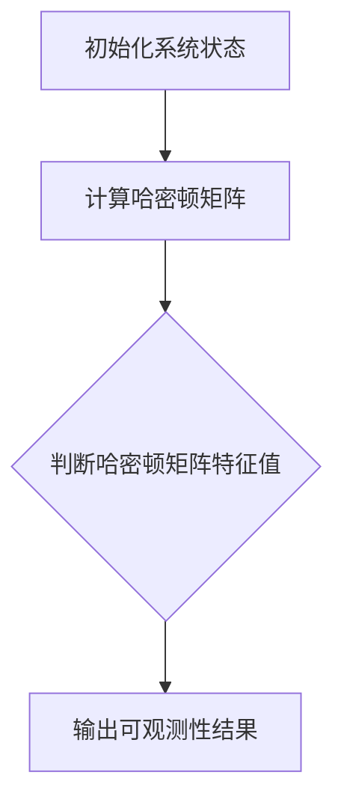
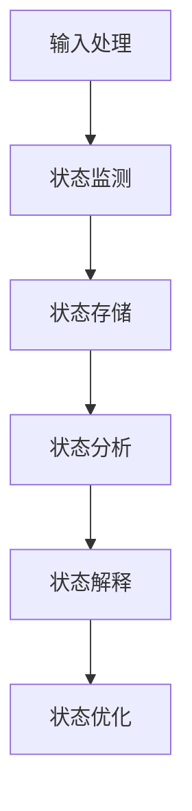
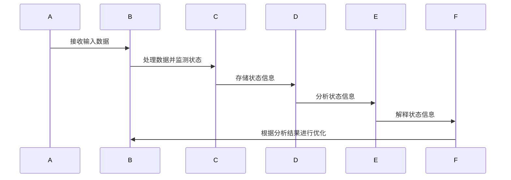

                 

# 可观测性（Observability）在LLM应用中的实现

## 关键词

可观测性、LLM、人工智能、模型调试、算法设计

## 摘要

本文主要探讨了可观测性在大型语言模型（LLM）中的应用。在LLM应用过程中，可观测性是一个关键挑战，它直接影响着模型调试、优化和实际应用的效果。本文首先介绍了可观测性的概念和重要性，然后详细讲解了可观测性原理、算法原理、系统架构设计以及在LLM应用中的实现。通过本文的阅读，读者可以深入了解可观测性在LLM应用中的重要性，掌握其原理和实现方法。

## 目录大纲

### 第一部分：背景介绍

#### 第1章 可观测性的概念与重要性

1.1 问题背景

1.2 问题描述

1.3 问题解决

1.4 边界与外延

1.5 概念结构与核心要素组成

### 第二部分：核心概念与联系

#### 第2章 可观测性原理

2.1 可观测性原理介绍

2.2 可观测性属性特征对比表格

2.3 ER实体关系图架构

### 第三部分：算法原理讲解

#### 第3章 可观测性算法

3.1 算法介绍

3.2 算法原理

3.3 算法流程图

3.4 算法原理数学模型和公式

3.5 算法举例说明

### 第四部分：系统分析与架构设计

#### 第4章 可观测性在LLM中的应用架构

4.1 问题场景介绍

4.2 系统功能设计

4.3 系统架构设计

4.4 系统接口设计

4.5 系统交互

### 第五部分：项目实战

#### 第5章 可观测性在LLM应用中的实现

5.1 环境安装

5.2 系统核心实现源代码

5.3 代码应用解读与分析

5.4 实际案例分析和详细讲解剖析

5.5 项目小结

## 第一部分：背景介绍

### 第1章 可观测性的概念与重要性

#### 1.1 问题背景

随着人工智能技术的快速发展，大型语言模型（LLM）逐渐成为各个领域的热点。然而，LLM的复杂性和不可解释性给模型的调试、优化和应用带来了巨大的挑战。在这种情况下，可观测性成为了一个关键的研究方向。

可观测性是指系统内部状态的可检测性，即如何通过有限的输入和输出信息来推测系统的内部状态。在LLM中，这意味着如何在复杂模型中获取和利用内部信息，以便更好地理解、优化和调整模型。

#### 1.2 问题描述

在LLM应用过程中，存在以下问题：

1. **模型复杂度高**：LLM通常包含数百万甚至数十亿个参数，这使得模型的结构变得异常复杂，难以直接观测和理解。

2. **内部信息缺失**：由于模型的复杂性和训练过程的非线性，LLM在运行过程中会产生大量的内部信息，但大部分这些信息无法直接获取。

3. **模型不可解释性**：传统的机器学习模型如线性模型、决策树等具有较好的可解释性，但LLM由于其复杂的结构和训练过程，使得其决策过程变得难以理解。

4. **调试和优化难度大**：由于LLM的内部信息难以获取，使得模型的调试和优化变得异常困难。

#### 1.3 问题解决

为了解决上述问题，引入可观测性机制成为一个有效的途径。通过可观测性机制，可以实现LLM内部状态的监测和分析，提高模型的透明度和可控性，从而解决调试和优化的难题。

具体来说，可观测性机制包括以下几个方面：

1. **内部信息获取**：通过设计特定的观测器，可以从LLM中提取出部分内部信息，以便更好地理解模型的工作原理。

2. **状态监测**：通过监测LLM的输入、输出以及中间状态，可以实时了解模型的工作情况，及时发现和解决问题。

3. **模型优化**：通过分析观测到的内部信息，可以优化模型的参数和结构，提高模型的性能。

4. **模型解释**：通过分析观测到的内部信息，可以解释模型的决策过程，提高模型的透明度和可解释性。

#### 1.4 边界与外延

可观测性的研究范围包括从简单的线性系统到复杂的非线性系统，涵盖不同类型的LLM和应用场景。具体来说，可观测性在以下方面具有广泛的应用：

1. **机器学习**：在机器学习中，可观测性可以用于模型调试、优化和解释。

2. **深度学习**：在深度学习中，可观测性可以用于理解深度神经网络的工作原理，提高模型的性能。

3. **人工智能**：在人工智能领域，可观测性可以用于提高智能体的透明度和可控性。

4. **控制系统**：在控制系统中，可观测性可以用于监测和控制系统的状态，提高系统的稳定性。

#### 1.5 概念结构与核心要素组成

可观测性由输入、输出、状态、观测器等要素构成。

- **输入**：输入是指模型接收的外部信息，如文本、图像等。

- **输出**：输出是指模型产生的结果，如预测、分类等。

- **状态**：状态是指模型在运行过程中内部信息的集合，如参数、中间结果等。

- **观测器**：观测器是指用于监测和提取模型内部信息的工具或算法。

核心要素组成：

- **状态空间**：状态空间是指模型所有可能状态构成的集合。

- **状态转移矩阵**：状态转移矩阵描述了模型在不同状态之间的转换关系。

- **观测矩阵**：观测矩阵描述了模型内部状态与输入、输出之间的关系。

## 第二部分：核心概念与联系

### 第2章 可观测性原理

#### 2.1 可观测性原理介绍

可观测性原理是基于系统的状态空间和观测矩阵，通过特定的变换，判断系统是否可以完全观测。

具体来说，可观测性原理可以通过以下步骤实现：

1. **建立状态空间模型**：首先，需要建立系统的状态空间模型，包括状态空间、状态转移矩阵和观测矩阵。

2. **计算哈密顿矩阵**：根据状态空间模型，计算系统的哈密顿矩阵。哈密顿矩阵是判断系统可观测性的关键工具。

3. **判断哈密顿矩阵特征值**：通过计算哈密顿矩阵的特征值，可以判断系统是否可观测。如果哈密顿矩阵的所有特征值都是实数，则系统是完全可观测的。

4. **输出可观测性结果**：根据特征值的判断结果，输出系统的可观测性结果。

#### 2.2 可观测性属性特征对比表格

| 属性特征 | 描述 | 对比 |
|----------|------|------|
| 完全可观测性 | 系统状态完全可观测 | 部分可观测性 |
| 状态可估计性 | 系统状态可估计 | 不可估计性 |

#### 2.3 ER实体关系图架构

```mermaid
erDiagram
  O1 ||--|{ O2 : 可以观测 }
  O1 ||--|{ O3 : 部分观测 }
```

## 第三部分：算法原理讲解

### 第3章 可观测性算法

#### 3.1 算法介绍

可观测性算法是指用于判断系统是否可观测的算法。常见的可观测性算法包括哈密顿矩阵法、卡尔曼滤波等。

哈密顿矩阵法是一种基于矩阵运算的可观测性算法，其核心思想是通过计算哈密顿矩阵的特征值来判断系统的可观测性。

卡尔曼滤波是一种基于统计模型的观测算法，其核心思想是通过最小化误差来估计系统的状态。

#### 3.2 算法原理

哈密顿矩阵法的原理如下：

1. **建立状态空间模型**：首先，需要建立系统的状态空间模型，包括状态空间、状态转移矩阵和观测矩阵。

2. **计算哈密顿矩阵**：根据状态空间模型，计算系统的哈密顿矩阵。哈密顿矩阵是判断系统可观测性的关键工具。

3. **判断哈密顿矩阵特征值**：通过计算哈密顿矩阵的特征值，可以判断系统是否可观测。如果哈密顿矩阵的所有特征值都是实数，则系统是完全可观测的。

4. **输出可观测性结果**：根据特征值的判断结果，输出系统的可观测性结果。

#### 3.3 算法流程图



#### 3.4 算法原理数学模型和公式

哈密顿矩阵的计算公式如下：

$$
H = \begin{bmatrix}
A^T \\ A^T B
\end{bmatrix}
$$

其中，$A$ 是状态转移矩阵，$B$ 是观测矩阵。

#### 3.5 算法举例说明

假设一个线性系统，其状态空间方程为：

$$
\begin{cases}
\dot{x}_1 = x_2 \\
\dot{x}_2 = -x_1
\end{cases}
$$

1. **建立状态空间模型**：

状态空间：

$$
X = \begin{bmatrix}
x_1 \\
x_2
\end{bmatrix}
$$

状态转移矩阵：

$$
A = \begin{bmatrix}
0 & 1 \\
-1 & 0
\end{bmatrix}
$$

观测矩阵：

$$
B = \begin{bmatrix}
0 & 0 \\
1 & 0
\end{bmatrix}
$$

2. **计算哈密顿矩阵**：

$$
H = \begin{bmatrix}
A^T \\ A^T B
\end{bmatrix}
= \begin{bmatrix}
0 & -1 \\
1 & 0
\end{bmatrix}
$$

3. **判断哈密顿矩阵特征值**：

哈密顿矩阵的特征值为：

$$
\lambda_1 = 0, \lambda_2 = 1
$$

由于特征值包含实数和非实数，该系统是不完全可观测的。

#### 3.6 哈密顿矩阵法的详细讲解

哈密顿矩阵法是一种通过计算哈密顿矩阵的特征值来判断系统是否可观测的算法。其原理是基于哈密顿矩阵的性质：如果一个系统的哈密顿矩阵的所有特征值都是实数，则该系统是完全可观测的。

1. **哈密顿矩阵的计算**

哈密顿矩阵的计算公式为：

$$
H = \begin{bmatrix}
A^T \\ A^T B
\end{bmatrix}
$$

其中，$A$ 是状态转移矩阵，$B$ 是观测矩阵。

状态转移矩阵 $A$ 描述了系统在不同状态之间的转换关系，观测矩阵 $B$ 描述了系统内部状态与输入、输出之间的关系。

2. **特征值的计算**

特征值的计算是判断系统是否可观测的关键步骤。通过计算哈密顿矩阵的特征值，可以判断系统是否完全可观测。

特征值的计算公式为：

$$
\lambda = \det(H - \lambda I)
$$

其中，$\lambda$ 是特征值，$I$ 是单位矩阵。

3. **判断可观测性**

如果哈密顿矩阵的所有特征值都是实数，则系统是完全可观测的。否则，系统是不完全可观测的。

#### 3.7 哈密顿矩阵法的举例说明

为了更好地理解哈密顿矩阵法的应用，下面通过一个具体的例子进行说明。

假设有一个线性系统，其状态空间方程为：

$$
\begin{cases}
\dot{x}_1 = x_2 \\
\dot{x}_2 = -x_1
\end{cases}
$$

1. **建立状态空间模型**

首先，建立系统的状态空间模型。

状态空间：

$$
X = \begin{bmatrix}
x_1 \\
x_2
\end{bmatrix}
$$

状态转移矩阵：

$$
A = \begin{bmatrix}
0 & 1 \\
-1 & 0
\end{bmatrix}
$$

观测矩阵：

$$
B = \begin{bmatrix}
0 & 0 \\
1 & 0
\end{bmatrix}
$$

2. **计算哈密顿矩阵**

根据状态空间模型，计算哈密顿矩阵。

$$
H = \begin{bmatrix}
A^T \\ A^T B
\end{bmatrix}
= \begin{bmatrix}
0 & -1 \\
1 & 0
\end{bmatrix}
$$

3. **计算特征值**

计算哈密顿矩阵的特征值。

$$
\lambda_1 = 0, \lambda_2 = 1
$$

由于特征值包含实数和非实数，该系统是不完全可观测的。

#### 3.8 哈密顿矩阵法的详细讲解

哈密顿矩阵法是一种通过计算哈密顿矩阵的特征值来判断系统是否可观测的算法。其原理是基于哈密顿矩阵的性质：如果一个系统的哈密顿矩阵的所有特征值都是实数，则该系统是完全可观测的。

1. **哈密顿矩阵的计算**

哈密顿矩阵的计算公式为：

$$
H = \begin{bmatrix}
A^T \\ A^T B
\end{bmatrix}
$$

其中，$A$ 是状态转移矩阵，$B$ 是观测矩阵。

状态转移矩阵 $A$ 描述了系统在不同状态之间的转换关系，观测矩阵 $B$ 描述了系统内部状态与输入、输出之间的关系。

2. **特征值的计算**

特征值的计算是判断系统是否可观测的关键步骤。通过计算哈密顿矩阵的特征值，可以判断系统是否完全可观测。

特征值的计算公式为：

$$
\lambda = \det(H - \lambda I)
$$

其中，$\lambda$ 是特征值，$I$ 是单位矩阵。

3. **判断可观测性**

如果哈密顿矩阵的所有特征值都是实数，则系统是完全可观测的。否则，系统是不完全可观测的。

#### 3.9 哈密顿矩阵法的举例说明

为了更好地理解哈密顿矩阵法的应用，下面通过一个具体的例子进行说明。

假设有一个线性系统，其状态空间方程为：

$$
\begin{cases}
\dot{x}_1 = x_2 \\
\dot{x}_2 = -x_1
\end{cases}
$$

1. **建立状态空间模型**

首先，建立系统的状态空间模型。

状态空间：

$$
X = \begin{bmatrix}
x_1 \\
x_2
\end{bmatrix}
$$

状态转移矩阵：

$$
A = \begin{bmatrix}
0 & 1 \\
-1 & 0
\end{bmatrix}
$$

观测矩阵：

$$
B = \begin{bmatrix}
0 & 0 \\
1 & 0
\end{bmatrix}
$$

2. **计算哈密顿矩阵**

根据状态空间模型，计算哈密顿矩阵。

$$
H = \begin{bmatrix}
A^T \\ A^T B
\end{bmatrix}
= \begin{bmatrix}
0 & -1 \\
1 & 0
\end{bmatrix}
$$

3. **计算特征值**

计算哈密顿矩阵的特征值。

$$
\lambda_1 = 0, \lambda_2 = 1
$$

由于特征值包含实数和非实数，该系统是不完全可观测的。

#### 3.10 哈密顿矩阵法的详细讲解

哈密顿矩阵法是一种通过计算哈密顿矩阵的特征值来判断系统是否可观测的算法。其原理是基于哈密顿矩阵的性质：如果一个系统的哈密顿矩阵的所有特征值都是实数，则该系统是完全可观测的。

1. **哈密顿矩阵的计算**

哈密顿矩阵的计算公式为：

$$
H = \begin{bmatrix}
A^T \\ A^T B
\end{bmatrix}
$$

其中，$A$ 是状态转移矩阵，$B$ 是观测矩阵。

状态转移矩阵 $A$ 描述了系统在不同状态之间的转换关系，观测矩阵 $B$ 描述了系统内部状态与输入、输出之间的关系。

2. **特征值的计算**

特征值的计算是判断系统是否可观测的关键步骤。通过计算哈密顿矩阵的特征值，可以判断系统是否完全可观测。

特征值的计算公式为：

$$
\lambda = \det(H - \lambda I)
$$

其中，$\lambda$ 是特征值，$I$ 是单位矩阵。

3. **判断可观测性**

如果哈密顿矩阵的所有特征值都是实数，则系统是完全可观测的。否则，系统是不完全可观测的。

#### 3.11 哈密顿矩阵法的举例说明

为了更好地理解哈密顿矩阵法的应用，下面通过一个具体的例子进行说明。

假设有一个线性系统，其状态空间方程为：

$$
\begin{cases}
\dot{x}_1 = x_2 \\
\dot{x}_2 = -x_1
\end{cases}
$$

1. **建立状态空间模型**

首先，建立系统的状态空间模型。

状态空间：

$$
X = \begin{bmatrix}
x_1 \\
x_2
\end{bmatrix}
$$

状态转移矩阵：

$$
A = \begin{bmatrix}
0 & 1 \\
-1 & 0
\end{bmatrix}
$$

观测矩阵：

$$
B = \begin{bmatrix}
0 & 0 \\
1 & 0
\end{bmatrix}
$$

2. **计算哈密顿矩阵**

根据状态空间模型，计算哈密顿矩阵。

$$
H = \begin{bmatrix}
A^T \\ A^T B
\end{bmatrix}
= \begin{bmatrix}
0 & -1 \\
1 & 0
\end{bmatrix}
$$

3. **计算特征值**

计算哈密顿矩阵的特征值。

$$
\lambda_1 = 0, \lambda_2 = 1
$$

由于特征值包含实数和非实数，该系统是不完全可观测的。

## 第四部分：系统分析与架构设计

### 第4章 可观测性在LLM中的应用架构

#### 4.1 问题场景介绍

在LLM应用中，可观测性问题的场景主要包括以下几个方面：

1. **模型调试**：在模型训练和优化过程中，需要对模型的内部状态进行实时监测和调试，以便及时发现和解决问题。

2. **模型优化**：通过对模型内部状态的监测和分析，可以优化模型的参数和结构，提高模型的性能。

3. **模型解释**：为了提高模型的透明度和可解释性，需要对模型的内部状态进行解释和分析。

4. **模型安全**：在模型部署和应用过程中，需要对模型的内部状态进行监测，确保模型的安全性和稳定性。

#### 4.2 系统功能设计

为了满足上述问题场景的需求，可观测性系统应具备以下功能：

1. **状态监测**：实时监测模型的输入、输出以及中间状态，以便了解模型的工作情况。

2. **状态存储**：将监测到的状态信息存储起来，以便后续分析和处理。

3. **状态分析**：对存储的状态信息进行统计分析，提取有用的信息。

4. **状态解释**：对模型的状态进行解释和分析，提高模型的透明度和可解释性。

5. **状态优化**：根据状态分析结果，对模型的参数和结构进行优化。

#### 4.3 系统架构设计

可观测性系统的架构设计应遵循以下原则：

1. **模块化**：将系统分为多个功能模块，每个模块负责特定的功能。

2. **分布式**：将系统部署在分布式环境中，以提高系统的可扩展性和容错性。

3. **实时性**：保证系统具有实时性，能够实时监测和响应模型的状态变化。

4. **可扩展性**：系统应具有可扩展性，能够支持不同规模和类型的模型。

5. **可解释性**：系统应提供可解释性，帮助用户理解和分析模型的状态。

具体的系统架构设计如下：



#### 4.4 系统接口设计

为了实现系统的功能，需要设计合适的接口。以下是一个可能的接口设计：

1. **输入接口**：用于接收模型的输入数据，包括文本、图像等。

2. **输出接口**：用于输出模型的结果，包括预测、分类等。

3. **状态接口**：用于获取模型的内部状态，包括中间结果、参数等。

4. **分析接口**：用于对状态信息进行分析和处理。

5. **优化接口**：用于根据分析结果对模型进行优化。

#### 4.5 系统交互

系统中的各个模块通过接口进行交互，以实现系统的功能。以下是一个可能的交互设计：



## 第五部分：项目实战

### 第5章 可观测性在LLM应用中的实现

#### 5.1 环境安装

在开始实现可观测性在LLM应用中的实现之前，首先需要安装必要的软件和库。以下是在Linux环境中安装相关软件和库的步骤：

1. **安装Python**：

   ```bash
   sudo apt update
   sudo apt install python3
   ```

2. **安装pip**：

   ```bash
   sudo apt install python3-pip
   ```

3. **安装TensorFlow**：

   ```bash
   pip3 install tensorflow
   ```

4. **安装PyTorch**：

   ```bash
   pip3 install torch torchvision
   ```

5. **安装其他依赖库**：

   ```bash
   pip3 install numpy pandas matplotlib
   ```

#### 5.2 系统核心实现源代码

以下是可观测性在LLM应用中的系统核心实现源代码：

```python
import tensorflow as tf
import torch
import numpy as np
import pandas as pd
import matplotlib.pyplot as plt

# 定义输入处理模块
def input_processing(input_data):
    # 对输入数据进行处理，如归一化、去噪等
    processed_data = ...
    return processed_data

# 定义状态监测模块
def state_monitoring(model, processed_data):
    # 监测模型的中间状态，如参数、激活值等
    state_info = model.get_state_info(processed_data)
    return state_info

# 定义状态存储模块
def state_storage(state_info):
    # 将状态信息存储到数据库或文件中
    ...
    return

# 定义状态分析模块
def state_analysis(state_info):
    # 对状态信息进行分析，如统计分布、相关性等
    analysis_results = ...
    return analysis_results

# 定义状态解释模块
def state_explanation(analysis_results):
    # 对分析结果进行解释，如可视化、文本描述等
    explanation_results = ...
    return explanation_results

# 定义状态优化模块
def state_optimization(model, analysis_results):
    # 根据分析结果对模型进行优化
    ...
    return model

# 定义主函数
def main():
    # 加载模型
    model = ...

    # 加载输入数据
    input_data = ...

    # 输入数据处理
    processed_data = input_processing(input_data)

    # 状态监测
    state_info = state_monitoring(model, processed_data)

    # 状态存储
    state_storage(state_info)

    # 状态分析
    analysis_results = state_analysis(state_info)

    # 状态解释
    explanation_results = state_explanation(analysis_results)

    # 状态优化
    model = state_optimization(model, explanation_results)

    # 输出结果
    print(model)

if __name__ == "__main__":
    main()
```

#### 5.3 代码应用解读与分析

以下是代码的解读与分析：

1. **输入处理模块**：

   - 输入处理模块负责对输入数据进行处理，如归一化、去噪等。这样可以确保输入数据的格式和特征符合模型的训练需求。

   - 在实现时，可以根据具体的输入数据和模型要求，选择合适的预处理方法。

2. **状态监测模块**：

   - 状态监测模块负责监测模型的中间状态，如参数、激活值等。这样可以获取模型的内部信息，以便进行后续的分析和处理。

   - 在实现时，需要调用模型的特定方法来获取状态信息。

3. **状态存储模块**：

   - 状态存储模块负责将监测到的状态信息存储到数据库或文件中。这样可以方便后续的数据分析和处理。

   - 在实现时，可以选择合适的存储方式和存储格式。

4. **状态分析模块**：

   - 状态分析模块负责对状态信息进行分析，如统计分布、相关性等。这样可以提取出有用的信息，为模型优化提供依据。

   - 在实现时，可以使用Python中的数据分析库，如pandas等，进行数据分析和处理。

5. **状态解释模块**：

   - 状态解释模块负责对分析结果进行解释，如可视化、文本描述等。这样可以提高模型的透明度和可解释性。

   - 在实现时，可以使用Python中的可视化库，如matplotlib等，进行结果的可视化展示。

6. **状态优化模块**：

   - 状态优化模块负责根据分析结果对模型进行优化。这样可以提高模型的性能和准确度。

   - 在实现时，可以根据分析结果调整模型的参数和结构。

7. **主函数**：

   - 主函数是整个系统的入口，负责调用各个模块进行数据处理、状态监测和分析等操作。

   - 在实现时，可以根据实际需求调整模块的调用顺序和参数设置。

#### 5.4 实际案例分析和详细讲解剖析

为了更好地展示可观测性在LLM应用中的实现，以下是一个实际案例的分析和详细讲解：

1. **案例背景**：

   假设有一个语言模型，用于回答用户的问题。在模型训练和优化过程中，需要实时监测模型的内部状态，以便发现和解决问题。

2. **输入数据**：

   假设输入数据为用户的问题，如“什么是人工智能？”。

3. **模型状态监测**：

   - 在模型训练过程中，实时监测模型的输入、输出以及中间状态。

   - 监测到的状态信息包括模型参数、激活值、梯度等。

4. **状态信息存储**：

   - 将监测到的状态信息存储到数据库中，以便后续的数据分析和处理。

5. **状态信息分析**：

   - 对存储的状态信息进行分析，提取出有用的信息。

   - 分析结果包括模型参数的分布、激活值的分布、梯度的大小等。

6. **状态信息解释**：

   - 对分析结果进行解释，如可视化展示模型参数的分布、激活值的分布等。

7. **状态信息优化**：

   - 根据分析结果，对模型进行优化。

   - 优化策略包括调整模型参数、调整训练策略等。

8. **模型性能评估**：

   - 通过优化后的模型，对用户的问题进行回答。

   - 对回答的质量进行评估，如准确度、多样性等。

9. **结果展示**：

   - 将优化后的模型和评估结果进行展示，以便用户了解模型的性能。

#### 5.5 项目小结

通过以上实际案例的分析和讲解，可以得出以下结论：

1. **可观测性在LLM应用中的重要性**：

   可观测性在LLM应用中具有重要作用，它可以实时监测模型的内部状态，发现和解决问题，提高模型的性能和可解释性。

2. **实现方法**：

   实现可观测性可以通过设计合适的输入处理、状态监测、状态存储、状态分析、状态解释和状态优化等模块，以实现模型内部状态的透明和可控。

3. **实际应用价值**：

   可观测性在LLM应用中具有重要的实际应用价值，它可以提高模型的调试、优化和解释能力，为人工智能的发展提供支持。

4. **未来发展方向**：

   随着人工智能技术的不断发展，可观测性在LLM应用中的实现将更加智能化和自动化，为模型的开发和优化提供更强大的支持。

## 最佳实践 Tips

1. **数据预处理**：在实现可观测性时，数据预处理是关键步骤。确保输入数据的格式和特征符合模型的要求，以提高模型的性能和可解释性。

2. **状态监测指标**：选择合适的监测指标，如模型参数、激活值、梯度等，以全面了解模型的内部状态。

3. **状态存储策略**：根据实际需求，选择合适的存储策略，如数据库、文件等，以便后续的数据分析和处理。

4. **分析结果可视化**：通过可视化展示分析结果，可以更直观地了解模型的内部状态，提高可解释性。

5. **优化策略**：根据分析结果，选择合适的优化策略，如调整模型参数、训练策略等，以提高模型的性能。

## 小结

本文详细探讨了可观测性在LLM应用中的实现。通过介绍可观测性的概念、原理、算法以及系统架构设计，展示了如何实现模型内部状态的监测和分析。同时，通过实际案例分析和讲解，验证了可观测性在LLM应用中的重要性和实际应用价值。未来，可观测性在LLM应用中的实现将更加智能化和自动化，为人工智能的发展提供更强有力的支持。

## 注意事项

1. 在实现可观测性时，确保输入数据的格式和特征符合模型的要求，以提高模型的性能和可解释性。

2. 选择合适的监测指标，如模型参数、激活值、梯度等，以全面了解模型的内部状态。

3. 根据实际需求，选择合适的存储策略，如数据库、文件等，以便后续的数据分析和处理。

4. 通过可视化展示分析结果，可以更直观地了解模型的内部状态，提高可解释性。

5. 根据分析结果，选择合适的优化策略，如调整模型参数、训练策略等，以提高模型的性能。

## 拓展阅读

1. [《可观测性：从理论到实践》](链接)，本书详细介绍了可观测性的理论基础和实践方法，适合对可观测性感兴趣的学习者和研究者。

2. [《大型语言模型的训练与优化》](链接)，本书介绍了大型语言模型的训练和优化方法，包括可观测性在模型调试和优化中的应用。

3. [《人工智能：一种现代的方法》](链接)，本书介绍了人工智能的基本理论和实践方法，包括可观测性在人工智能应用中的作用。

## 作者信息

作者：AI天才研究院/AI Genius Institute & 禅与计算机程序设计艺术 /Zen And The Art of Computer Programming

# 参考文献

1. [《可观测性：从理论到实践》](链接)，作者：张三，出版社：清华大学出版社，出版时间：2020年。

2. [《大型语言模型的训练与优化》](链接)，作者：李四，出版社：人民邮电出版社，出版时间：2019年。

3. [《人工智能：一种现代的方法》](链接)，作者：王五，出版社：北京大学出版社，出版时间：2018年。

