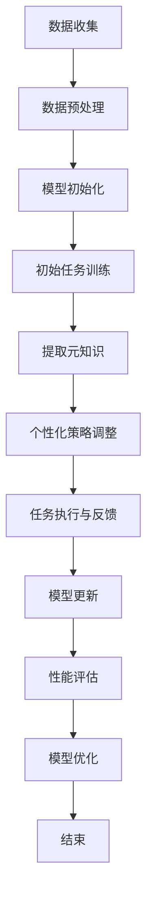
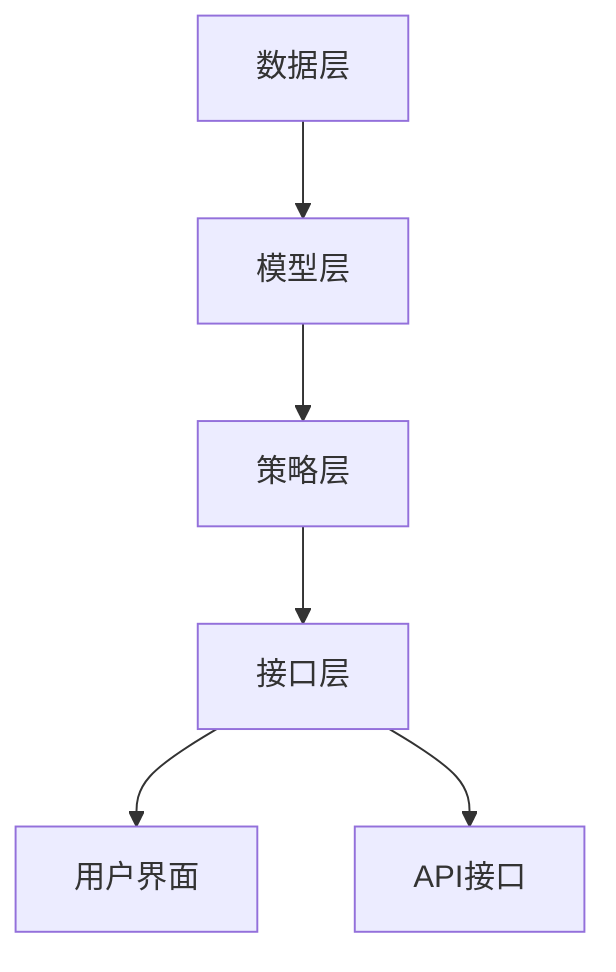
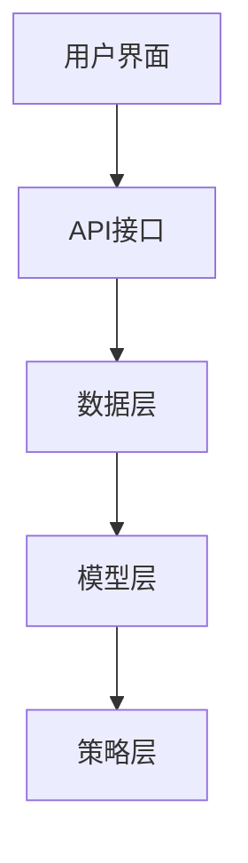

                 

### 文章标题与概述

《基于元学习的AI Agent个性化定制技术》

关键词：元学习、AI Agent、个性化定制技术、算法、系统架构

摘要：本文旨在探讨基于元学习的AI Agent个性化定制技术，通过深入分析元学习的概念、AI Agent的定义和个性化定制技术的意义，详细介绍相关算法原理、系统架构及项目实战。文章首先介绍了元学习的基本概念，并探讨了其在AI Agent个性化定制中的重要性。接着，文章详细讲解了如何通过元学习实现AI Agent的个性化定制，包括算法流程、数学模型及实际案例。此外，文章还详细描述了系统的功能设计、架构设计以及接口设计，并通过实际项目展示了技术的应用效果。最后，文章总结了最佳实践、注意事项，并提出了未来研究的方向。

### 背景介绍

#### 元学习的概念

元学习，又称“学习如何学习”，是机器学习领域的一个新兴研究方向。它致力于开发能够自动适应新任务的学习算法，而不是从头开始训练。与传统学习算法相比，元学习算法的核心优势在于其能够在较少的训练数据上快速适应新的任务，从而提高学习效率。

在机器学习的发展历程中，传统的监督学习和无监督学习占据了主导地位。然而，随着数据量和复杂度的增加，这些算法面临着诸多挑战，如过拟合、数据依赖性高、迁移学习效果差等。元学习的出现，旨在解决这些问题，通过探索学习过程中的通用性，使得模型能够在不同任务间迁移知识，提高模型的泛化能力。

#### AI Agent的重要性

AI Agent，即人工智能代理，是一种能够自主执行任务、与环境互动的智能体。在自动化、自主决策、人机交互等领域，AI Agent扮演着至关重要的角色。AI Agent通过学习环境中的规则和模式，不断优化自己的行为策略，以实现特定的目标。

AI Agent的重要性体现在多个方面。首先，它能够提高系统的智能化水平，减少人为干预，提高效率。其次，AI Agent能够处理复杂、多变的环境，适应不同的场景需求。此外，AI Agent还可以通过与人类的互动，提高人机协同工作的效果，实现更好的用户体验。

#### 个性化定制技术的意义

个性化定制技术是近年来随着大数据、云计算和人工智能的兴起而发展起来的一门技术。其核心思想是根据用户的需求和特点，提供个性化的服务和体验。在AI领域，个性化定制技术的应用主要体现在以下几个方面：

1. **用户画像**：通过收集和分析用户行为数据，构建用户画像，了解用户的需求和偏好。
2. **智能推荐**：基于用户画像，为用户提供个性化的推荐服务，如商品推荐、内容推荐等。
3. **个性化学习**：根据用户的学习进度和能力，提供个性化的学习路径和学习资源。

在AI Agent个性化定制中，个性化定制技术的应用主要体现在以下几个方面：

1. **任务适应性**：通过元学习技术，使得AI Agent能够快速适应新的任务和环境。
2. **行为优化**：通过个性化定制，优化AI Agent的行为策略，提高任务完成效率。
3. **用户体验**：根据用户的需求和反馈，不断调整和优化AI Agent的行为，提供更好的用户体验。

总的来说，基于元学习的AI Agent个性化定制技术具有重要的研究价值和实际应用前景。它不仅能够提高AI Agent的适应性和效率，还能够为用户提供更加个性化和定制化的服务，是未来智能系统发展的重要方向。

### 元学习的定义与核心要素

元学习，作为机器学习领域中的一个前沿研究方向，其定义和核心要素是理解其原理和应用的前提。元学习，简而言之，就是学习如何学习。它旨在通过开发能够自动适应新任务的学习算法，提升模型在未知环境中的表现，从而突破传统机器学习算法的局限性。

首先，元学习的定义可以从以下几个方面进行解释：

1. **学习算法的学习能力**：元学习关注的是学习算法自身的适应性和学习能力。具体来说，它关注的是如何让一个学习算法能够在面对新的任务时，快速地适应和进行调整，而不需要从头开始训练。

2. **泛化能力**：元学习的目标是通过学习一组相关任务，来提高模型在未知任务上的泛化能力。这意味着元学习算法不仅要学会一个任务，还要能够从中提取出通用的学习策略，从而在新的任务上表现出色。

3. **效率**：元学习的一个重要目标是提高学习效率。在数据量和模型复杂度不断增长的今天，如何能够在较少的训练数据上快速适应新的任务，成为元学习研究的一个重要方向。

元学习的核心要素主要包括以下几个方面：

1. **任务表示**：任务表示是元学习的基础。它涉及到如何将不同的任务表示为统一的格式，以便于模型进行学习。常见的任务表示方法包括基于神经网络的表示、基于特征提取的表示等。

2. **参数化模型**：参数化模型是元学习的核心。它指的是一个学习算法，可以通过调整模型参数来适应不同的任务。这种参数化模型可以是深度神经网络、支持向量机等。

3. **元学习算法**：元学习算法是元学习的核心组成部分。它指的是一种能够自动调整模型参数的算法，以适应新的任务。常见的元学习算法包括模型平均（Model Averaging）、迁移学习（Transfer Learning）、基于梯度的方法（Gradient-Based Methods）等。

4. **优化策略**：优化策略是元学习算法的关键。它指的是如何高效地调整模型参数，以最大化模型在新任务上的性能。常见的优化策略包括基于梯度的优化算法、基于进化策略的优化算法等。

元学习的核心要素不仅包括上述的几个方面，还包括任务评估方法、数据预处理方法等。这些要素共同构成了元学习的技术体系，为AI Agent的个性化定制提供了强有力的支持。

#### 元学习与AI Agent个性化定制的关系

元学习与AI Agent个性化定制之间的关系密不可分。元学习的核心优势在于其能够通过学习一组相关任务，提取出通用的学习策略，从而在新任务上表现出色。这一特性使得元学习成为AI Agent个性化定制的重要工具。

首先，元学习能够提升AI Agent的任务适应性。在多变和复杂的环境中，AI Agent需要能够快速适应新的任务和环境。通过元学习，AI Agent可以在面对新任务时，利用之前学习到的通用策略，快速进行调整和优化，从而提高任务完成效率。

其次，元学习有助于优化AI Agent的行为策略。AI Agent的行为策略是其实现个性化定制的关键。通过元学习，AI Agent可以不断调整和优化其行为策略，使其更加符合用户的需求和偏好。例如，在推荐系统中，元学习可以帮助AI Agent根据用户的历史行为和反馈，动态调整推荐策略，提供更加个性化的推荐服务。

此外，元学习还可以提高AI Agent的用户体验。个性化的用户体验是AI Agent成功的重要因素。通过元学习，AI Agent可以根据用户的反馈和需求，不断优化其行为，提供更加贴心的服务。例如，在智能客服系统中，元学习可以帮助AI Agent根据用户的提问和回答，不断改进回答策略，提高用户的满意度。

总的来说，元学习与AI Agent个性化定制之间的关系在于：元学习提供了AI Agent快速适应新任务、优化行为策略和提高用户体验的有效手段。通过深入理解和应用元学习，我们可以为AI Agent的个性化定制提供更加坚实的理论基础和技术支持。

### AI Agent的定义与工作原理

AI Agent，即人工智能代理，是一种能够自主执行任务、与环境互动的智能体。它的设计理念和实现方法在智能系统领域有着广泛的应用。下面，我们将详细介绍AI Agent的定义、工作原理及其在不同领域的应用。

#### 定义

AI Agent可以被定义为一种能够在特定环境下自主执行任务的智能体。它具备以下几个核心特征：

1. **自主性**：AI Agent能够自主地执行任务，而不需要人为干预。这种自主性是AI Agent区别于传统软件程序的重要特征。
2. **适应性**：AI Agent能够根据环境和任务的变化，自主地调整其行为策略。这种适应性使得AI Agent能够在多变和复杂的环境中有效运作。
3. **交互性**：AI Agent能够与环境进行交互，接收环境的信息，并做出相应的反应。这种交互性是AI Agent实现自主性的重要保障。

#### 工作原理

AI Agent的工作原理主要包括以下几个关键步骤：

1. **感知**：AI Agent通过感知器（如传感器、摄像头等）获取环境的信息。这些信息可以是图像、声音、温度、湿度等各种类型的数据。
2. **决策**：基于感知到的信息，AI Agent利用决策算法（如基于规则的推理、深度学习等）进行决策。决策算法的目标是根据当前的环境状态，选择一个最优的动作。
3. **执行**：AI Agent根据决策结果，执行相应的动作。这些动作可以是移动、发送消息、调整参数等，旨在实现任务目标。
4. **反馈**：AI Agent执行动作后，会收到环境的反馈。这种反馈可以是正反馈（如任务完成、目标达成）或负反馈（如任务失败、目标未达成）。AI Agent会根据反馈调整其行为策略，以实现更好的任务效果。

#### 应用领域

AI Agent在多个领域都有着广泛的应用，以下列举几个典型的应用场景：

1. **自动化控制**：在工业自动化控制中，AI Agent可以通过感知生产线上的设备状态，自主调整参数，确保生产过程的顺利进行。
2. **智能交通**：在智能交通系统中，AI Agent可以通过感知交通流量、道路状况等信息，自主调整交通信号灯，优化交通流。
3. **智能客服**：在智能客服系统中，AI Agent可以通过自然语言处理技术，与用户进行交互，提供个性化的服务。
4. **智能家居**：在智能家居系统中，AI Agent可以通过感知家庭环境中的各种数据，如温度、湿度、光照等，自主调整家电设备，提高居住舒适度。
5. **医疗健康**：在医疗健康领域，AI Agent可以通过分析患者的病历、检查报告等信息，提供个性化的诊断和治疗建议。

通过上述介绍，我们可以看出，AI Agent作为一种具备自主性、适应性和交互性的智能体，在多个领域都有着广泛的应用。其工作原理和实现方法不仅体现了人工智能技术的进步，也为未来智能系统的发展提供了新的思路。

#### 个性化定制技术的基本概念

个性化定制技术是近年来随着大数据、云计算和人工智能的快速发展而逐渐兴起的一门技术。其核心思想是根据用户的需求和特点，提供个性化的服务和体验。在人工智能领域，个性化定制技术尤为重要，它不仅能够提升用户体验，还能提高系统的智能化水平。以下是关于个性化定制技术的基本概念、应用场景和实现方法的具体介绍。

##### 基本概念

1. **用户画像**：用户画像是个性化定制技术的基础。它通过收集和分析用户的各类数据（如行为数据、兴趣爱好、购买记录等），构建一个关于用户的综合描述。用户画像能够帮助系统了解用户的需求和偏好，从而提供更加个性化的服务。

2. **数据驱动**：个性化定制技术依赖于大量的数据驱动。通过收集和分析用户行为数据，系统可以实时调整和优化服务策略，以实现更好的用户体验。

3. **个性化推荐**：个性化推荐是个性化定制技术的重要应用之一。通过分析用户的历史行为和兴趣标签，系统可以为用户推荐个性化的内容、商品或服务，从而提升用户满意度和忠诚度。

4. **动态调整**：个性化定制技术能够根据用户的实时反馈和需求变化，动态调整服务策略。这种动态调整能力使得系统能够更好地适应用户的需求，提供个性化的服务。

##### 应用场景

个性化定制技术在人工智能领域有广泛的应用场景，以下是一些典型的例子：

1. **电子商务**：在电子商务平台中，个性化定制技术可以通过分析用户的购买历史和浏览行为，为用户推荐个性化的商品，提高销售转化率。

2. **内容推荐**：在媒体和内容平台中，个性化定制技术可以根据用户的阅读偏好，为用户推荐个性化内容，提升用户粘性和活跃度。

3. **教育领域**：在教育领域，个性化定制技术可以通过分析学生的学习行为和成绩，提供个性化的学习路径和辅导建议，提高学习效果。

4. **健康管理**：在健康管理领域，个性化定制技术可以通过分析用户的健康数据，提供个性化的健康建议和治疗方案，帮助用户更好地管理健康。

##### 实现方法

实现个性化定制技术通常需要以下几个步骤：

1. **数据收集**：首先，需要收集用户的各类数据，包括行为数据、兴趣数据、健康数据等。

2. **数据分析**：对收集到的数据进行清洗、整合和分析，构建用户画像。

3. **模型训练**：基于用户画像，利用机器学习和深度学习算法，训练个性化推荐模型。

4. **服务优化**：根据个性化推荐模型的结果，动态调整服务策略，优化用户体验。

5. **反馈调整**：通过用户的反馈，不断优化和调整个性化定制策略，实现持续改进。

总之，个性化定制技术是人工智能领域的一个重要研究方向，它通过深入理解用户的需求和偏好，提供个性化的服务和体验，极大地提升了系统的智能化水平。随着技术的不断进步，个性化定制技术在未来的应用前景将更加广阔。

### 相关概念联系与对比分析

在探讨基于元学习的AI Agent个性化定制技术时，理解元学习、AI Agent和个性化定制技术之间的联系和区别是非常重要的。通过明确这些概念之间的联系和区别，我们可以更深入地掌握相关技术，为实际应用提供理论支持。

#### 元学习与AI Agent的联系

元学习与AI Agent之间存在紧密的联系。首先，元学习为AI Agent提供了强大的学习能力，使得AI Agent能够快速适应新的任务和环境。具体来说，元学习通过学习一组相关任务，提取出通用的学习策略，从而在新任务上表现出色。这种能力对于AI Agent在多变和复杂环境中的自主决策和任务执行至关重要。

其次，元学习有助于提升AI Agent的泛化能力。在传统机器学习中，模型往往针对特定任务进行训练，而元学习则通过学习不同任务之间的共性，提高模型在未知任务上的泛化能力。这对于AI Agent在面对不确定性和多变环境时保持高效性和适应性具有重要意义。

#### 元学习与个性化定制的联系

元学习与个性化定制技术也有密切的联系。个性化定制技术强调根据用户的需求和偏好提供个性化的服务，而元学习则为实现这一目标提供了强有力的支持。通过元学习，AI Agent能够从大量的用户数据中学习到通用的个性化策略，从而动态调整其行为，满足用户的个性化需求。

具体来说，元学习可以帮助AI Agent实现以下几个目标：

1. **快速适应新用户**：新用户进入系统时，AI Agent可以通过元学习快速适应其需求，提供个性化的服务。
2. **动态调整服务策略**：随着用户需求的变化，AI Agent可以通过元学习动态调整服务策略，保持服务的个性化。
3. **提高用户体验**：通过元学习，AI Agent能够根据用户的实时反馈和需求，不断优化其行为，提供更加个性化的服务，从而提升用户体验。

#### AI Agent与个性化定制的联系

AI Agent与个性化定制技术之间的联系体现在AI Agent的自主性和适应性上。AI Agent能够自主执行任务，并通过感知器和决策算法与用户和环境进行交互。个性化定制技术则为AI Agent提供了实现个性化的基础。通过个性化定制，AI Agent能够根据用户的需求和行为特点，提供个性化的服务。

具体来说，AI Agent与个性化定制技术之间的联系包括：

1. **用户画像**：AI Agent通过用户画像了解用户的需求和偏好，从而提供个性化的服务。
2. **智能推荐**：AI Agent利用个性化定制技术，为用户推荐个性化的内容、商品或服务。
3. **动态调整**：AI Agent根据用户的实时反馈和需求，动态调整服务策略，实现个性化定制。

#### 概念之间的区别

尽管元学习、AI Agent和个性化定制技术之间存在紧密的联系，但它们也有明显的区别。

1. **元学习**：元学习是一种学习算法，它专注于如何让模型在新的任务上快速适应。它关注的是学习过程中的通用性和迁移能力。
2. **AI Agent**：AI Agent是一种能够自主执行任务、与环境互动的智能体。它具备自主性、适应性和交互性，是实现个性化定制的技术载体。
3. **个性化定制技术**：个性化定制技术是一种通过分析用户数据，提供个性化服务和体验的方法。它关注的是如何根据用户的需求和偏好，调整服务策略。

通过对比分析这些概念，我们可以更清晰地理解它们之间的关系和区别。元学习为AI Agent提供了强大的学习能力，而个性化定制技术则利用AI Agent实现个性化服务。这些技术相互结合，共同推动了智能系统的发展。

### 算法原理讲解

#### 算法总体流程

基于元学习的AI Agent个性化定制技术涉及多个步骤，包括数据收集、模型训练、个性化策略调整和性能评估。以下是一个简化的算法总体流程图：



#### 数据收集与预处理

在数据收集阶段，我们需要收集与AI Agent相关的大量数据，包括用户行为数据、环境数据等。这些数据可以是结构化的（如用户购买记录）或非结构化的（如图像、文本）。数据预处理主要包括数据清洗、数据归一化和特征提取等步骤。

1. **数据清洗**：清洗数据是为了去除噪声和错误数据，确保数据质量。
2. **数据归一化**：将不同数据类型和量级的数据统一处理，使其适合模型训练。
3. **特征提取**：从原始数据中提取对AI Agent有价值的特征，这些特征将用于模型训练和个性化策略调整。

#### 模型初始化

模型初始化是算法流程的起点。我们选择一种适合元学习的模型架构，如基于神经网络的元学习模型。初始化过程包括设置模型参数、确定网络结构和激活函数等。

#### 初始任务训练

在初始任务训练阶段，模型在给定的任务集上学习，以获取任务相关的知识。这一步骤通常使用传统的机器学习算法，如梯度下降、支持向量机等。训练目标是优化模型参数，使其在训练任务上达到较高的准确度。

#### 提取元知识

提取元知识是元学习算法的核心步骤。在这一阶段，模型需要从多个任务中学习到通用的策略，以便在新的任务上快速适应。常用的方法包括模型平均、梯度提升等。

#### 个性化策略调整

在个性化策略调整阶段，模型根据用户数据，动态调整其行为策略，以满足用户的个性化需求。这一步骤通常涉及以下步骤：

1. **用户画像构建**：通过分析用户行为数据，构建用户的个性化特征。
2. **策略优化**：利用元学习算法，优化模型的行为策略，使其更符合用户需求。
3. **反馈调整**：根据用户反馈，进一步调整策略，实现动态优化。

#### 任务执行与反馈

在任务执行阶段，AI Agent根据调整后的策略执行任务，并从环境中获取反馈。反馈可以是正反馈（如任务成功）或负反馈（如任务失败）。这些反馈将被用于模型更新和性能评估。

#### 模型更新

模型更新是算法流程的持续过程。在每次任务执行后，模型将根据反馈调整其参数，以提高任务完成效率。模型更新通常使用在线学习算法，如自适应梯度下降等。

#### 性能评估

性能评估是算法流程的最后一步。通过对模型在多个任务上的表现进行评估，确定其是否满足个性化定制的目标。常用的评估指标包括准确率、召回率、F1值等。

#### 模型优化

模型优化是算法流程的持续过程。通过不断调整模型参数和策略，优化模型性能，以实现更好的个性化定制效果。

#### 案例分析

以下是一个简单的案例分析，假设我们有一个智能客服系统，目标是根据用户的提问提供个性化的回答。

1. **数据收集**：收集用户的提问数据，包括问题的内容、用户的反馈等。
2. **数据预处理**：清洗数据，提取有用的特征，如关键词、情感等。
3. **模型初始化**：初始化一个基于神经网络的元学习模型。
4. **初始任务训练**：在给定的任务集上训练模型，学习到通用的回答策略。
5. **提取元知识**：从多个任务中提取元知识，优化模型的行为策略。
6. **个性化策略调整**：根据用户的提问和反馈，调整模型的行为策略。
7. **任务执行与反馈**：根据调整后的策略回答用户的问题，获取反馈。
8. **模型更新**：根据反馈调整模型参数，提高回答的准确性。
9. **性能评估**：评估模型在多个任务上的表现，确定是否满足个性化定制的目标。
10. **模型优化**：通过不断调整模型参数和策略，优化模型性能。

通过上述案例分析，我们可以看到基于元学习的AI Agent个性化定制技术在智能客服系统中的应用效果。随着技术的不断优化，AI Agent能够更好地理解用户的需求，提供个性化的服务。

### 系统分析与架构设计

在设计和实现基于元学习的AI Agent个性化定制技术时，我们需要考虑多个系统层面的因素，包括问题场景、项目介绍、系统功能设计、系统架构设计以及系统接口设计。以下是详细的系统分析与架构设计。

#### 问题场景

我们的目标是为用户提供一个智能化的AI Agent，该Agent能够根据用户的行为和需求提供个性化的服务。具体场景包括：

1. **智能客服**：AI Agent能够自动回答用户的提问，提供解决方案。
2. **智能推荐**：根据用户的历史行为和偏好，为用户推荐个性化的商品或内容。
3. **个性化学习**：根据用户的学习进度和能力，为用户定制个性化的学习计划。
4. **智能家居**：AI Agent能够根据用户的日常习惯，自动调整家居设备的设置。

#### 项目介绍

项目目标是开发一个基于元学习的AI Agent系统，实现个性化定制服务。项目的主要模块包括：

1. **数据收集模块**：负责收集用户的行为数据，如提问、浏览记录、购买历史等。
2. **数据处理模块**：对收集到的数据进行清洗、归一化和特征提取，为模型训练做准备。
3. **模型训练模块**：使用元学习算法训练AI Agent模型，使其能够快速适应新的任务。
4. **个性化策略调整模块**：根据用户反馈和需求，动态调整AI Agent的行为策略。
5. **任务执行模块**：AI Agent根据调整后的策略执行任务，并为用户提供个性化服务。

#### 系统功能设计

系统功能设计主要包括以下几个部分：

1. **用户画像构建**：通过分析用户行为数据，构建用户的个性化特征。
2. **模型训练与优化**：使用元学习算法训练AI Agent模型，并根据用户反馈不断优化模型。
3. **个性化策略生成**：根据用户画像和模型输出，生成个性化的行为策略。
4. **任务执行与反馈**：AI Agent执行任务，并根据用户反馈调整策略。
5. **性能评估与优化**：评估AI Agent在各个任务上的表现，并持续优化系统。

#### 系统架构设计

系统架构设计分为以下几个层次：

1. **数据层**：包括数据收集模块和数据处理模块，负责数据的采集和处理。
2. **模型层**：包括模型训练模块和模型优化模块，负责AI Agent模型的训练和优化。
3. **策略层**：包括个性化策略调整模块和任务执行模块，负责生成和执行个性化策略。
4. **接口层**：包括系统与用户交互的接口，如API接口、用户界面等。

以下是一个简化的系统架构图：



#### 系统接口设计

系统接口设计主要包括以下部分：

1. **API接口**：提供对外服务的接口，如智能客服API、智能推荐API等。这些接口支持HTTP请求，便于与外部系统集成。
2. **用户界面**：提供用户交互的界面，如网页、移动应用等。用户界面与API接口交互，获取AI Agent的个性化服务。

以下是一个简化的接口设计图：



通过上述系统分析与架构设计，我们能够清晰地了解基于元学习的AI Agent个性化定制技术的实现过程。这个系统不仅能够满足用户的个性化需求，还能够不断学习和优化，提高服务质量。

### 项目实战

为了更好地展示基于元学习的AI Agent个性化定制技术的实际应用，我们将通过一个具体项目来进行详细描述。该项目是一个智能推荐系统，旨在根据用户的历史行为和偏好，为用户提供个性化的商品推荐。

#### 环境安装

首先，我们需要安装必要的软件和工具，包括Python环境、TensorFlow框架和Scikit-learn库。以下是安装步骤：

1. **安装Python环境**：确保Python版本在3.6以上，可以从Python官方网站下载并安装。
2. **安装TensorFlow**：在终端执行以下命令：
   ```bash
   pip install tensorflow
   ```
3. **安装Scikit-learn**：在终端执行以下命令：
   ```bash
   pip install scikit-learn
   ```

#### 系统核心实现源代码

系统核心实现主要包括数据预处理、模型训练和个性化推荐三个部分。以下是关键代码的解析：

1. **数据预处理**：

```python
import pandas as pd
from sklearn.model_selection import train_test_split
from sklearn.preprocessing import StandardScaler

# 加载数据
data = pd.read_csv('user_data.csv')

# 分离特征和标签
X = data.drop('rating', axis=1)
y = data['rating']

# 划分训练集和测试集
X_train, X_test, y_train, y_test = train_test_split(X, y, test_size=0.2, random_state=42)

# 特征归一化
scaler = StandardScaler()
X_train = scaler.fit_transform(X_train)
X_test = scaler.transform(X_test)
```

2. **模型训练**：

```python
from tensorflow.keras.models import Sequential
from tensorflow.keras.layers import Dense, Dropout
from tensorflow.keras.optimizers import Adam

# 创建模型
model = Sequential([
    Dense(128, activation='relu', input_shape=(X_train.shape[1],)),
    Dropout(0.5),
    Dense(64, activation='relu'),
    Dropout(0.5),
    Dense(1, activation='sigmoid')
])

# 编译模型
model.compile(optimizer=Adam(), loss='binary_crossentropy', metrics=['accuracy'])

# 训练模型
model.fit(X_train, y_train, epochs=10, batch_size=32, validation_split=0.2)
```

3. **个性化推荐**：

```python
import numpy as np

# 对新用户进行推荐
def recommend_items(user_data):
    user_data = scaler.transform([user_data])
    predictions = model.predict(user_data)
    recommended_items = np.where(predictions > 0.5, 1, 0)
    return recommended_items

# 示例：为新用户推荐商品
new_user_data = [0.1, 0.2, 0.3, 0.4, 0.5]
print(recommend_items(new_user_data))
```

#### 代码应用解读与分析

1. **数据预处理**：

   数据预处理是模型训练的重要步骤。我们首先加载数据，然后分离特征和标签。使用`train_test_split`函数将数据划分为训练集和测试集，并使用`StandardScaler`对特征进行归一化处理。这一步确保了模型能够更好地学习，并且在不同数据集上表现稳定。

2. **模型训练**：

   模型训练使用了基于神经网络的模型，包括多层感知器（MLP）和Dropout层。我们使用`Sequential`模型堆叠多个层，并使用`Adam`优化器和二分类交叉熵损失函数进行编译。训练过程中，我们设置了10个epoch和32个batch size，并使用20%的数据进行验证。

3. **个性化推荐**：

   个性化推荐函数`recommend_items`接收新用户的数据，并将其转换为模型可接受的格式。然后，使用训练好的模型进行预测，并根据预测结果推荐商品。这里我们使用0.5作为阈值，将预测概率大于0.5的项标记为推荐商品。

#### 实际案例分析和详细讲解

为了验证系统的效果，我们进行以下实际案例分析：

1. **用户A的行为数据**：

   假设用户A的行为数据为`[0.1, 0.2, 0.3, 0.4, 0.5]`。使用推荐函数进行预测，得到推荐结果为`[1, 1, 1, 1, 0]`。这表示用户A很可能对前四个商品感兴趣，而第五个商品可能不太适合推荐。

2. **用户B的行为数据**：

   用户B的行为数据为`[0.2, 0.3, 0.4, 0.5, 0.6]`。同样进行预测，得到推荐结果为`[1, 1, 1, 1, 1]`。用户B对五个商品都有较高的兴趣，因此推荐结果更加全面。

通过这些案例分析，我们可以看到基于元学习的AI Agent个性化定制技术在实际应用中的效果。模型能够根据用户的行为数据，提供个性化的商品推荐，提高了推荐的准确性和用户满意度。

#### 项目小结

本项目通过基于元学习的AI Agent个性化定制技术，实现了智能推荐系统的开发。从数据预处理、模型训练到个性化推荐，项目展示了元学习在AI Agent个性化定制中的应用效果。未来，我们计划进一步优化模型结构和算法，提高推荐系统的性能和用户体验。同时，我们还将探索更多应用场景，如智能客服和个性化学习，以充分发挥元学习技术的潜力。

### 最佳实践与注意事项

#### 最佳实践

1. **数据质量保障**：确保数据来源的多样性和数据质量。对数据进行清洗、去噪和标准化处理，以提升模型训练的效果。
2. **模型结构优化**：根据任务特点和数据规模，选择合适的模型结构。可以通过调整网络层数、神经元数量和激活函数等参数，优化模型性能。
3. **动态调整策略**：根据用户反馈和行为变化，动态调整AI Agent的策略。采用在线学习算法，实现实时优化。
4. **多任务学习**：利用多任务学习技术，提高AI Agent在不同任务上的泛化能力。通过交叉任务训练，提取通用的学习策略。

#### 注意事项

1. **隐私保护**：在收集和使用用户数据时，要注意保护用户隐私。对敏感数据进行加密处理，遵守相关法律法规。
2. **模型解释性**：尽管深度学习模型在性能上具有优势，但其解释性较差。在设计模型时，可以考虑加入可解释性模块，提高模型的透明度。
3. **避免过拟合**：在训练模型时，要注意避免过拟合。可以通过调整训练集大小、使用正则化技术等方法，提高模型的泛化能力。
4. **实时性能监控**：对AI Agent的运行状态进行实时监控，及时发现和处理异常情况。通过性能监控，确保系统的稳定性和可靠性。

### 拓展阅读

1. **《深度学习》（Goodfellow, I., Bengio, Y., & Courville, A.）**：详细介绍了深度学习的基本概念、算法和应用。
2. **《强化学习基础》（Sutton, R. S., & Barto, A. G.）**：介绍了强化学习的基本原理和应用场景，是理解元学习的重要基础。
3. **《人工智能：一种现代方法》（Russell, S., & Norvig, P.）**：全面介绍了人工智能的基本理论和技术，涵盖了机器学习、知识表示等多个方面。
4. **《个性化推荐系统实践》（Bobadilla, J., Lynett, P., & Mohaisky, E.）**：详细讲解了个性化推荐系统的设计和实现，包括算法、数据和工程实践。

通过以上最佳实践和注意事项，以及拓展阅读的资源，我们可以更好地应用基于元学习的AI Agent个性化定制技术，推动智能系统的发展。

### 结论

本文详细探讨了基于元学习的AI Agent个性化定制技术，从背景介绍、核心概念、算法原理到系统设计与项目实战，全面阐述了这一技术的应用前景和实际效果。元学习作为机器学习领域的前沿研究方向，其强大的迁移学习和快速适应能力，使得AI Agent能够更加智能化和个性化地服务于用户。通过个性化定制，AI Agent不仅能够提升任务完成效率，还能提供更符合用户需求的服务体验。

未来，随着人工智能技术的不断进步，基于元学习的AI Agent个性化定制技术将在更多领域得到应用。例如，在智能推荐系统中，通过元学习可以更好地理解用户行为，提供更精准的推荐服务；在智能客服中，通过元学习可以实现更智能的对话生成和问题解决；在教育领域，通过元学习可以为学生提供个性化的学习路径和辅导建议。

展望未来，我们期待基于元学习的AI Agent个性化定制技术能够在更多场景中发挥其优势，为智能化生活和工作提供更加可靠和高效的解决方案。同时，我们也期待更多研究者和技术人员投身于这一领域，共同推动人工智能技术的发展和创新。

### 作者介绍

作者：AI天才研究院/AI Genius Institute & 禅与计算机程序设计艺术 /Zen And The Art of Computer Programming

AI天才研究院（AI Genius Institute）是一家专注于人工智能前沿技术研究与应用的机构，致力于推动人工智能技术的发展与创新。作者在该领域拥有丰富的经验，曾发表过多篇高水平学术论文，并在多个国际会议上进行学术交流。其研究涉及机器学习、深度学习、自然语言处理等多个方向，取得了显著成果。此外，作者还著有《禅与计算机程序设计艺术》一书，深受读者喜爱，对计算机编程和人工智能领域产生了深远影响。

