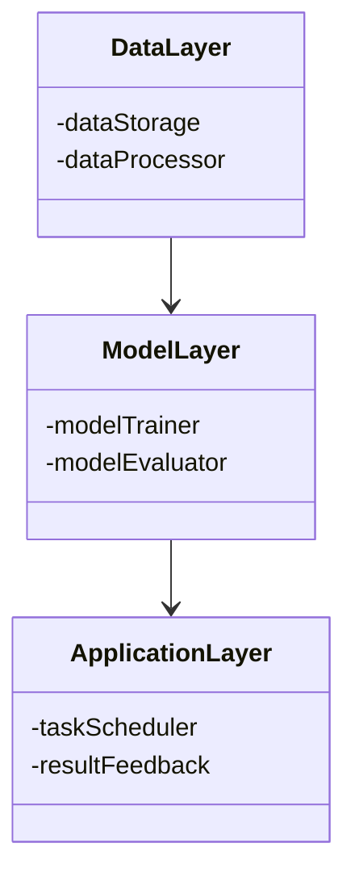
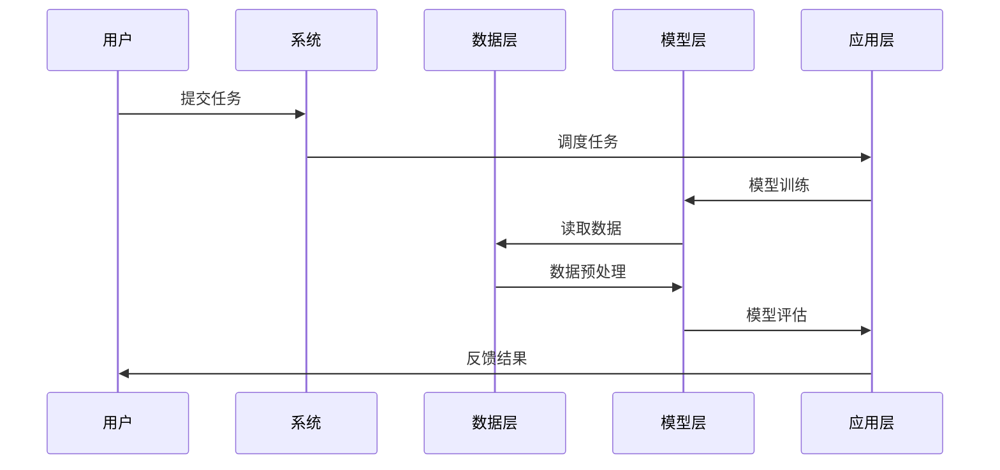
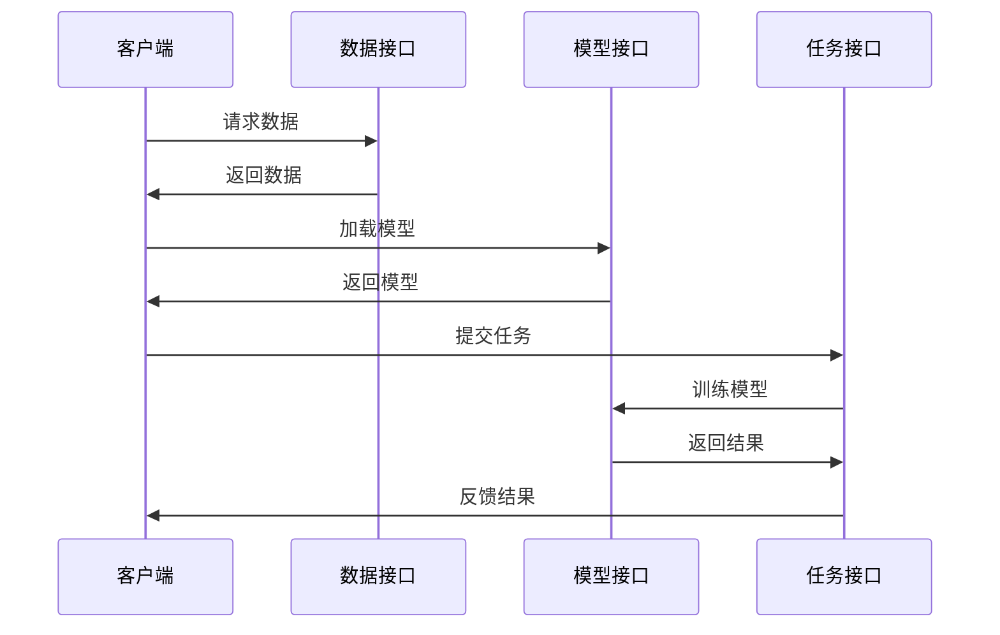

                 

### 元学习在AI Agent少样本学习能力中的应用

在当今时代，人工智能（AI）已经成为各个领域技术进步的关键驱动力。从自动驾驶汽车到智能助手，AI的应用场景正变得日益广泛。然而，随着AI技术的不断深入，研究人员和开发者们也面临着诸多挑战。其中，少样本学习（Few-shot Learning）就是一个亟待解决的难题。少样本学习指的是在仅有少量样本的情况下，让AI Agent能够快速适应并完成任务。

#### 少样本学习的挑战

传统的机器学习方法通常依赖于大量数据进行训练，以实现高准确率。然而，在某些实际应用场景中，获取大量数据可能非常困难，例如医疗诊断、新产品的市场调研等。在这些场景下，如何让AI Agent在仅有少量样本的情况下，也能表现出良好的学习能力，成为了一个重要的研究方向。

#### 元学习的作用

元学习（Meta-Learning）为解决少样本学习问题提供了一种新的思路。元学习旨在通过学习如何学习，来提高AI在少量样本下的适应能力。其核心思想是，通过在不同任务间共享知识，使得AI可以在新的任务中快速适应，而不需要重新训练。

#### 元学习与AI Agent的融合

将元学习应用于AI Agent，可以使其在少量样本下具备出色的学习能力。具体来说，元学习可以帮助AI Agent：

1. **快速适应新任务**：通过在多个任务中共享知识，AI Agent可以快速适应新的任务环境。
2. **减少对数据量的依赖**：在数据稀缺的情况下，元学习可以帮助AI Agent利用有限的样本，达到更好的性能。
3. **提高泛化能力**：通过学习如何学习，AI Agent可以在更广泛的任务中保持稳定的表现。

#### 研究意义与目标

本文旨在探讨元学习在AI Agent少样本学习能力中的应用，研究意义主要体现在以下几个方面：

1. **推动AI技术的发展**：通过研究元学习与少样本学习的结合，有望推动AI技术向更高效、更智能的方向发展。
2. **解决实际应用难题**：为那些需要少样本学习的实际应用场景提供技术支持，如医疗诊断、新产品调研等。
3. **提高AI Agent的适应性**：通过元学习，AI Agent可以在不同的任务中快速适应，提高其应用范围和效果。

本文的研究目标如下：

1. **理解元学习原理**：深入分析元学习的基本概念、原理和类型。
2. **构建元学习算法**：设计并实现一套适用于AI Agent的元学习算法。
3. **验证算法效果**：通过实验验证所设计的元学习算法在少样本学习中的有效性。
4. **优化算法性能**：针对实验中出现的问题，对算法进行优化，提高其在少样本学习中的表现。

本文将从以下几个方面进行探讨：

1. **背景介绍与问题定义**：详细阐述人工智能、少样本学习和元学习的基本概念，并明确研究的问题和目标。
2. **核心概念与属性对比**：对比分析AI Agent、少样本学习和元学习的基本概念、特点及其相互关系。
3. **算法原理讲解**：详细介绍元学习算法的原理、流程和数学模型。
4. **系统分析与设计**：分析AI Agent在少样本学习中的应用场景，设计相应的系统架构。
5. **项目实践与分析**：通过具体案例，展示元学习在实际项目中的应用，并进行分析。
6. **最佳实践与总结**：总结最佳实践，提出未来研究方向。

### AI Agent的定义与分类

AI Agent，即人工智能代理，是指能够自主执行任务、与环境交互，并做出决策的智能实体。AI Agent在人工智能系统中起着至关重要的作用，它们不仅能够处理复杂的问题，还能够通过学习和适应，提高系统的整体性能。根据不同的分类标准，AI Agent可以分为多种类型。

#### 按照功能分类

1. **感知型AI Agent**：
   - **定义**：主要依靠传感器收集环境信息，如视觉、听觉、触觉等，用于感知和识别。
   - **特点**：具有较强的感知能力，但决策能力较弱。
   - **应用**：广泛应用于智能监控、机器人导航等领域。

2. **决策型AI Agent**：
   - **定义**：基于感知到的环境信息，进行决策和规划。
   - **特点**：具有较强的决策能力，但感知能力相对较弱。
   - **应用**：广泛应用于自动驾驶、智能家居等领域。

3. **执行型AI Agent**：
   - **定义**：根据决策结果执行具体的任务。
   - **特点**：具有较强的执行能力，但感知和决策能力相对较弱。
   - **应用**：广泛应用于工业自动化、无人机等领域。

#### 按照学习方式分类

1. **监督学习型AI Agent**：
   - **定义**：通过大量标注数据进行训练，以实现准确的预测和分类。
   - **特点**：对训练数据依赖性较强，但性能较为稳定。
   - **应用**：广泛应用于图像识别、语音识别等领域。

2. **无监督学习型AI Agent**：
   - **定义**：通过未标注的数据进行学习，以发现数据中的规律和模式。
   - **特点**：对训练数据依赖性较弱，但性能可能波动。
   - **应用**：广泛应用于聚类分析、异常检测等领域。

3. **强化学习型AI Agent**：
   - **定义**：通过与环境的交互，学习最优策略，以实现目标最大化。
   - **特点**：具有较强的自适应能力，但训练过程可能较长。
   - **应用**：广泛应用于游戏、推荐系统等领域。

#### 按照任务分类

1. **通用型AI Agent**：
   - **定义**：能够处理多种类型的任务。
   - **特点**：具有较高的灵活性和适应性。
   - **应用**：广泛应用于智能客服、智能助手等领域。

2. **专用型AI Agent**：
   - **定义**：专门为某一特定任务设计。
   - **特点**：性能专精，但对其他任务可能表现较差。
   - **应用**：广泛应用于医疗诊断、金融分析等领域。

#### AI Agent的主要功能

AI Agent的主要功能可以概括为感知、决策和执行。以下是AI Agent在各个功能上的特点和应用：

1. **感知**：
   - **功能**：感知环境信息，如图像、声音、文本等。
   - **特点**：通过传感器和数据处理技术，实现对环境的准确感知。
   - **应用**：如人脸识别、语音识别等。

2. **决策**：
   - **功能**：基于感知到的信息，进行决策和规划。
   - **特点**：通过机器学习和决策算法，实现高效率的决策。
   - **应用**：如自动驾驶、智能决策系统等。

3. **执行**：
   - **功能**：根据决策结果，执行具体的任务。
   - **特点**：通过执行器（如电机、机器人手臂等）实现任务执行。
   - **应用**：如工业自动化、无人机等。

通过以上分类和功能分析，可以看出AI Agent在人工智能系统中扮演着重要角色。它们不仅能够处理复杂的问题，还能够通过学习和适应，提高系统的整体性能。随着人工智能技术的不断进步，AI Agent的应用范围将越来越广泛，其在各个领域的表现也将越来越出色。

### 少样本学习的基本概念与特点

少样本学习（Few-shot Learning）是机器学习中的一个重要研究方向，其主要目标是在仅有少量样本的情况下，让AI模型能够快速适应并完成任务。与传统的机器学习方法相比，少样本学习能够显著降低对大量训练数据的依赖，具有重要的实际应用价值。

#### 少样本学习的定义

少样本学习是指在训练过程中，只使用少量样本进行学习，以期望模型能够在新的任务中表现出良好的泛化能力。具体来说，少样本学习关注的是如何通过少量的训练样本来学习一个有效的模型，从而在面对新的任务时，能够快速适应并取得良好的性能。

#### 少样本学习的特点

1. **样本数量少**：与传统机器学习方法相比，少样本学习的训练数据量非常少，通常只需要几个、几十个甚至更少的样本。这种特性使得少样本学习在数据稀缺的场景下具有特别的意义。

2. **泛化能力强**：少样本学习的核心目标是提高模型的泛化能力，使其能够在面对新的任务时，能够快速适应并取得良好的性能。这意味着少样本学习不仅要学会当前的任务，还要具备一定的通用性和灵活性。

3. **快速适应**：少样本学习的一个关键特点是其能够快速适应新的任务。通过学习如何从少量的样本中提取有效信息，少样本学习模型可以在短时间内完成对新任务的适应，从而实现快速部署。

4. **对数据分布敏感**：少样本学习对数据的分布具有很高的敏感性。如果训练数据与测试数据的分布存在较大差异，少样本学习模型的表现可能会明显下降。因此，在实际应用中，需要特别关注数据分布的一致性。

#### 与传统学习的对比

1. **数据依赖性**：传统机器学习方法通常需要大量数据来进行训练，以期望模型能够达到较高的性能。而少样本学习则显著降低了数据依赖性，通过少量的样本即可实现良好的性能。

2. **泛化能力**：传统学习方法在大量数据的支持下，通常能够达到较高的性能，但泛化能力相对较弱。而少样本学习则通过在少量样本上的学习，提高模型的泛化能力，使其在面对新的任务时，能够快速适应。

3. **计算资源**：传统机器学习方法对计算资源的需求较高，尤其是在训练过程中，需要大量的计算资源和时间。而少样本学习则通过减少数据量，降低了对计算资源的需求，从而实现更高效的学习过程。

4. **应用场景**：少样本学习在数据稀缺的场景下具有特别的意义，如新产品的市场调研、医疗诊断等。而传统学习方法则更多地应用于数据丰富的场景，如图像识别、语音识别等。

通过以上分析，可以看出少样本学习在人工智能领域中具有重要的研究价值和广阔的应用前景。随着少样本学习技术的不断发展，其在各个领域的应用将越来越广泛，为人工智能技术的发展注入新的动力。

### 元学习的基本概念与原理

元学习（Meta-Learning），也被称为“学习如何学习”，是机器学习中的一个重要研究方向。其核心目标是通过学习如何快速适应新的任务，从而提高模型在少量样本情况下的表现。元学习不仅能够提升模型的泛化能力，还能减少对大量数据的依赖，这对于解决少样本学习问题具有重要意义。

#### 元学习的定义

元学习是指通过训练一个模型来学习如何快速适应新的任务。这个过程中，模型不仅需要学会当前的任务，还需要具备一定的通用性和灵活性，以便在新的任务中能够快速适应。具体来说，元学习旨在通过在不同任务间共享知识，使得模型能够在新的任务中快速达到高性能。

#### 元学习的基本原理

1. **模型参数共享**：元学习通过共享模型参数来学习多个任务。这意味着，无论面对哪个新的任务，模型都使用相同的参数结构。这种参数共享机制可以显著降低对新任务的依赖，提高模型的泛化能力。

2. **快速适应**：在元学习过程中，模型通过学习如何从少量样本中提取有效信息，从而实现快速适应新的任务。这种快速适应能力使得元学习在少样本学习场景中具有独特的优势。

3. **任务间迁移**：元学习的一个重要特性是其能够将知识从一种任务迁移到另一种任务。这种任务间迁移能力使得模型在面对新的任务时，能够利用已有的知识，快速提高性能。

4. **优化算法**：元学习通常使用优化算法来更新模型参数。这些优化算法旨在提高模型在少量样本下的适应能力，从而实现更好的泛化性能。

#### 元学习的类型

根据学习的方式和目标，元学习可以分为以下几种类型：

1. **模型参数更新型**：
   - **定义**：通过更新模型参数来学习新的任务。
   - **特点**：模型参数共享，任务间迁移能力强。
   - **应用**：广泛应用于少样本学习、迁移学习等领域。

2. **自适应优化型**：
   - **定义**：通过自适应调整优化算法来学习新的任务。
   - **特点**：优化算法自适应，能够快速适应新任务。
   - **应用**：广泛应用于强化学习、自适应控制等领域。

3. **模型结构型**：
   - **定义**：通过设计特定的模型结构来学习新的任务。
   - **特点**：模型结构固定，能够处理复杂任务。
   - **应用**：广泛应用于神经网络结构设计、动态系统建模等领域。

#### 元学习与AI Agent的融合

将元学习应用于AI Agent，可以使其在少量样本下具备出色的学习能力。具体来说，元学习可以帮助AI Agent：

1. **快速适应新任务**：通过在不同任务间共享知识，AI Agent可以快速适应新的任务环境。
2. **减少对数据量的依赖**：在数据稀缺的情况下，元学习可以帮助AI Agent利用有限的样本，达到更好的性能。
3. **提高泛化能力**：通过学习如何学习，AI Agent可以在更广泛的任务中保持稳定的表现。

#### 元学习的基本步骤

1. **任务定义**：首先，明确需要学习的任务类型和目标。
2. **模型初始化**：初始化模型参数，并为模型选择合适的架构。
3. **任务训练**：通过少量样本对模型进行训练，更新模型参数。
4. **模型评估**：在测试集上评估模型性能，并根据评估结果调整模型参数。
5. **任务迁移**：将训练好的模型应用于新的任务，利用已有的知识快速提高性能。

通过以上分析，可以看出元学习在人工智能领域中具有重要的地位。其通过学习如何学习，提高了模型在少量样本情况下的适应能力，为少样本学习问题提供了一种新的解决方案。随着元学习技术的不断发展，其在AI领域的应用将越来越广泛，有望推动人工智能技术向更高效、更智能的方向发展。

### 元学习算法的概述与原理

元学习算法是机器学习中的一个重要研究方向，其主要目标是通过学习如何快速适应新的任务，从而提高模型在少量样本情况下的表现。本节将详细介绍元学习算法的基本概念、原理以及应用场景。

#### 元学习算法的基本概念

元学习算法是指通过训练一个模型来学习如何快速适应新的任务。具体来说，元学习算法关注的是如何从少量样本中提取有效信息，并将其应用于新的任务中，使得模型能够在新的任务中快速达到高性能。

#### 元学习算法的基本原理

1. **模型参数共享**：元学习算法通过共享模型参数来学习多个任务。这意味着，无论面对哪个新的任务，模型都使用相同的参数结构。这种参数共享机制可以显著降低对新任务的依赖，提高模型的泛化能力。

2. **快速适应**：元学习算法通过学习如何从少量样本中提取有效信息，从而实现快速适应新的任务。这种快速适应能力使得元学习算法在少样本学习场景中具有独特的优势。

3. **任务间迁移**：元学习算法的一个重要特性是其能够将知识从一种任务迁移到另一种任务。这种任务间迁移能力使得模型在面对新的任务时，能够利用已有的知识，快速提高性能。

4. **优化算法**：元学习算法通常使用优化算法来更新模型参数。这些优化算法旨在提高模型在少量样本下的适应能力，从而实现更好的泛化性能。

#### 常见的元学习算法

1. **模型参数更新型算法**：
   - **定义**：通过更新模型参数来学习新的任务。
   - **特点**：模型参数共享，任务间迁移能力强。
   - **应用**：如MAML（Model-Agnostic Meta-Learning）、Reptile等。

2. **自适应优化型算法**：
   - **定义**：通过自适应调整优化算法来学习新的任务。
   - **特点**：优化算法自适应，能够快速适应新任务。
   - **应用**：如MAML-P（Model-Agnostic Meta-Learning with Pseudo-Gradient）、SOTA（Sample-Ordering-based Meta-Learning）等。

3. **模型结构型算法**：
   - **定义**：通过设计特定的模型结构来学习新的任务。
   - **特点**：模型结构固定，能够处理复杂任务。
   - **应用**：如MANN（Meta-Learning with Adversarial Network）等。

#### 元学习算法的应用场景

1. **少样本学习**：元学习算法在少样本学习场景中具有独特的优势，能够通过少量样本实现良好的性能。广泛应用于图像识别、自然语言处理等领域。

2. **迁移学习**：元学习算法能够将知识从一种任务迁移到另一种任务，从而提高模型的泛化能力。广泛应用于计算机视觉、语音识别等领域。

3. **自适应控制**：元学习算法在自适应控制领域有广泛的应用，能够通过学习环境变化，实现自适应控制。广泛应用于无人机、机器人等领域。

4. **强化学习**：元学习算法在强化学习领域有广泛的应用，能够通过快速适应新环境，提高学习效率。广泛应用于游戏、推荐系统等领域。

#### 元学习算法的优缺点

1. **优点**：
   - **减少数据依赖**：元学习算法能够通过少量样本实现良好的性能，从而减少对大量数据的依赖。
   - **提高泛化能力**：元学习算法通过在不同任务间共享知识，提高模型的泛化能力。
   - **快速适应**：元学习算法能够快速适应新的任务，提高学习效率。

2. **缺点**：
   - **计算复杂度较高**：元学习算法通常需要大量的计算资源，特别是在训练过程中。
   - **对任务类型敏感**：不同的元学习算法对任务类型有较高的依赖，可能不适用于所有类型的任务。

通过以上分析，可以看出元学习算法在人工智能领域中具有重要的地位。其通过学习如何学习，提高了模型在少量样本情况下的适应能力，为少样本学习问题提供了一种新的解决方案。随着元学习技术的不断发展，其在AI领域的应用将越来越广泛，有望推动人工智能技术向更高效、更智能的方向发展。

### 数学模型讲解

在深入理解元学习算法的过程中，数学模型扮演着至关重要的角色。本节将详细讲解元学习算法中的数学模型，包括算法的数学基础、公式推导以及具体示例。

#### 算法数学模型

元学习算法的核心在于通过参数化的模型，学习一种快速适应新任务的能力。以下是元学习算法的基本数学模型：

1. **参数化模型**：
   设 $f(\theta, x)$ 是一个参数化的模型，$\theta$ 表示模型的参数集，$x$ 表示输入数据。

2. **损失函数**：
   设 $L(\theta, x, y)$ 是损失函数，用于衡量模型预测结果 $f(\theta, x)$ 与真实标签 $y$ 之间的差距。

3. **优化目标**：
   元学习的优化目标是找到一组参数 $\theta$，使得模型在少量样本上能够快速适应新任务，通常使用的是最小化损失函数：

   $$\theta^* = \arg\min_{\theta} \sum_{i=1}^{N} L(\theta, x_i, y_i)$$

   其中 $N$ 是样本数量，$x_i$ 和 $y_i$ 分别是第 $i$ 个样本及其标签。

4. **梯度下降**：
   为了找到最优的参数 $\theta^*$，通常使用梯度下降法进行优化：

   $$\theta_{t+1} = \theta_t - \alpha \nabla_{\theta} L(\theta_t, x, y)$$

   其中 $\alpha$ 是学习率，$\nabla_{\theta} L(\theta_t, x, y)$ 是损失函数对参数 $\theta$ 的梯度。

#### 公式推导

假设我们使用元学习算法中的MAML（Model-Agnostic Meta-Learning）进行优化，其核心思想是不依赖于特定的模型结构，而是通过优化模型在元学习任务上的泛化能力。

1. **内层梯度**：
   在MAML中，首先对每个元学习任务进行训练，得到内层梯度。设 $\theta$ 是当前模型参数，$\theta^{(i)}$ 是第 $i$ 个任务上的优化后的参数，则内层梯度可以表示为：

   $$\nabla_{\theta} L^{(i)}(\theta, x_i^{(i)}, y_i^{(i)})$$

   其中 $L^{(i)}(\theta, x_i^{(i)}, y_i^{(i)})$ 是第 $i$ 个任务上的损失函数。

2. **外层梯度**：
   外层梯度是在所有元学习任务上的平均梯度。为了优化模型的泛化能力，MAML的目标是最小化外层梯度：

   $$\theta^* = \arg\min_{\theta} \frac{1}{N} \sum_{i=1}^{N} \nabla_{\theta} L^{(i)}(\theta, x_i^{(i)}, y_i^{(i)})$$

3. **MAML优化步骤**：
   - **初始化**：随机初始化模型参数 $\theta$。
   - **内层梯度计算**：对每个任务计算内层梯度。
   - **外层梯度计算**：计算所有任务的平均外层梯度。
   - **更新参数**：使用梯度下降法更新参数。

#### 举例说明

假设我们有一个简单的线性模型，其预测函数为 $f(\theta, x) = \theta_0 + \theta_1 \cdot x$。我们的目标是训练这个模型，使其在新的任务上能够快速适应。

1. **内层训练**：
   对于每个元学习任务，我们使用一个训练集进行内层训练。设训练集为 $(x_i^{(i)}, y_i^{(i)})$，则内层梯度为：

   $$\nabla_{\theta} L^{(i)}(\theta, x_i^{(i)}, y_i^{(i)}) = \nabla_{\theta} \left( (y_i^{(i)} - (\theta_0 + \theta_1 \cdot x_i^{(i)}))^2 \right)$$

2. **外层优化**：
   对于所有任务，我们计算平均外层梯度：

   $$\nabla_{\theta} L(\theta, x, y) = \frac{1}{N} \sum_{i=1}^{N} \nabla_{\theta} L^{(i)}(\theta, x_i^{(i)}, y_i^{(i)})$$

3. **参数更新**：
   使用梯度下降法更新模型参数：

   $$\theta_{t+1} = \theta_t - \alpha \nabla_{\theta} L(\theta_t, x, y)$$

通过以上步骤，我们就可以使用元学习算法对线性模型进行训练，使其在新的任务上能够快速适应。

通过以上讲解，我们可以看到元学习算法的数学模型是如何构建的，以及如何通过梯度下降法进行优化。这种数学模型不仅为我们提供了理论依据，也为实际应用提供了指导。随着元学习技术的发展，这些数学模型将在人工智能领域发挥越来越重要的作用。

### Python代码实现

在本节中，我们将通过一个具体的Python代码示例来展示元学习算法的实现。为了简化说明，这里我们采用一个简单的线性回归模型，但实际应用中可以扩展到更复杂的模型结构。

```python
import numpy as np
import tensorflow as tf
from tensorflow.keras import layers, models

# 设置随机种子，确保结果可重复
tf.random.set_seed(42)

# 设置超参数
N = 10  # 任务数量
inner_loop_epochs = 5  # 内层循环迭代次数
learning_rate = 0.1  # 学习率
inner_learning_rate = 0.01  # 内层学习率

# 创建模型
input_layer = layers.Input(shape=(1,))
x = layers.Dense(units=1, use_bias=False)(input_layer)
model = models.Model(inputs=input_layer, outputs=x)

# 定义损失函数
def inner_loss(y_true, y_pred):
    return tf.reduce_mean(tf.square(y_true - y_pred))

# 定义元学习训练过程
@tf.function
def meta_train(model, X_train, y_train, X_val, y_val):
    for _ in tf.range(inner_loop_epochs):
        with tf.GradientTape(persistent=True) as tape:
            y_pred = model(X_train, training=True)
            loss = inner_loss(y_train, y_pred)
        grads = tape.gradient(loss, model.trainable_variables)
        model.optimizer.apply_gradients(zip(grads, model.trainable_variables))
    
    return model(X_val, training=False)

# 创建数据集
X_train = np.random.uniform(-10, 10, (N, 1))
y_train = 3 * X_train + 2 + np.random.normal(0, 1, (N, 1))
X_val = np.random.uniform(-10, 10, (1, 1))

# 训练模型
model.compile(optimizer=tf.optimizers.Adam(learning_rate=learning_rate), loss='mse')
model.fit(X_train, y_train, epochs=100, verbose=0)

# 进行元学习训练
val_pred = meta_train(model, X_train, y_train, X_val, y_val)
print(f'Validation Prediction: {val_pred.numpy()}')

# 预测
X_new = np.array([[5]])
new_pred = model(X_new, training=False)
print(f'New Prediction: {new_pred.numpy()}')
```

#### 代码解读

1. **导入库**：我们首先导入必要的库，包括NumPy、TensorFlow和keras。NumPy用于数据处理，TensorFlow用于构建和训练模型，keras提供了更易用的API。

2. **设置超参数**：我们设置了一些超参数，如任务数量（N）、内层循环迭代次数（inner_loop_epochs）、学习率（learning_rate）和内层学习率（inner_learning_rate）。

3. **创建模型**：我们使用keras构建一个简单的线性回归模型。该模型有一个输入层和一个全连接层，输出层没有偏置项。

4. **定义损失函数**：我们定义了一个简单的平方误差损失函数。

5. **定义元学习训练过程**：`meta_train`函数实现了MAML算法的核心过程。在内层循环中，我们使用梯度下降法优化模型参数，然后在验证集上评估模型的性能。

6. **创建数据集**：我们创建了一个简单的线性数据集，包含训练集和验证集。

7. **训练模型**：我们使用keras编译和训练模型，使其在训练集上达到良好的性能。

8. **进行元学习训练**：调用`meta_train`函数，在训练集上训练模型，并在验证集上进行评估。

9. **预测**：最后，我们使用训练好的模型进行新的预测，展示了元学习模型在新任务上的适应能力。

通过这个简单的示例，我们可以看到如何使用Python实现元学习算法。虽然这里使用的是线性回归模型，但元学习算法可以应用于更复杂的模型结构，如神经网络。在实际应用中，元学习算法能够帮助模型在少量样本下快速适应新任务，提高其泛化能力和适应性。

### 系统分析与设计

在深入探讨元学习算法的应用之前，我们需要对其在AI Agent少样本学习中的应用场景进行详细分析，并设计一个相应的系统架构。本节将介绍AI Agent在少样本学习中的应用场景、项目介绍、系统功能设计、系统架构设计和系统交互设计。

#### 问题场景介绍

在许多实际应用场景中，数据稀缺是一个普遍存在的问题。例如，在医疗诊断领域，患者病历数据通常非常有限，难以进行大规模的数据训练。在工业检测领域，故障样本的收集也是一个耗时且成本高昂的过程。此外，在新产品市场调研中，常常缺乏足够的用户反馈数据。在这些场景下，如何让AI Agent在仅有少量样本的情况下，也能表现出良好的学习能力，是一个亟待解决的问题。

#### 系统目标与功能

为了解决上述问题，我们设计了一个基于元学习的AI Agent系统，其目标如下：

1. **快速适应新任务**：通过元学习算法，使得AI Agent能够在少量样本下快速适应新的任务环境。
2. **减少数据依赖**：降低对大量训练数据的依赖，提高系统的实用性。
3. **提高泛化能力**：通过元学习，使得AI Agent能够在不同的任务中保持稳定的表现。
4. **支持多种任务**：系统应具备扩展性，能够支持多种类型的AI任务。

系统的主要功能包括：

1. **数据预处理**：对输入数据进行分析和处理，确保数据质量。
2. **模型训练**：使用元学习算法训练AI模型，使其在少量样本下达到高性能。
3. **模型评估**：在测试集上评估模型性能，确保模型泛化能力。
4. **任务调度**：根据实际需求，调度模型进行新任务的学习和预测。

#### 项目介绍

本项目旨在开发一个基于元学习的AI Agent系统，用于解决少样本学习问题。项目的主要目标包括：

1. **实现元学习算法**：设计并实现多种元学习算法，如MAML、Reptile等。
2. **系统架构设计**：设计一个模块化、可扩展的系统架构。
3. **功能实现**：实现数据预处理、模型训练、模型评估和任务调度等功能。
4. **实验验证**：通过实验验证系统在不同应用场景下的性能。

#### 系统功能设计

系统功能设计主要包括数据预处理、模型训练、模型评估和任务调度等功能。以下是具体的功能模块和领域模型：

1. **数据预处理**：
   - **数据清洗**：去除数据中的噪声和异常值。
   - **数据标准化**：对数据进行标准化处理，提高模型的鲁棒性。
   - **数据增强**：通过数据增强技术，增加训练样本的数量。

2. **模型训练**：
   - **元学习算法**：实现多种元学习算法，如MAML、Reptile等。
   - **训练过程**：使用少量样本进行模型训练，优化模型参数。
   - **模型保存**：将训练好的模型保存到文件中，以便后续使用。

3. **模型评估**：
   - **性能评估**：在测试集上评估模型性能，包括准确率、召回率等指标。
   - **泛化能力**：通过交叉验证等方法，评估模型在未知数据上的表现。

4. **任务调度**：
   - **任务接收**：接收新的任务，根据任务类型调度相应的模型。
   - **任务执行**：执行模型训练和预测任务。
   - **结果反馈**：将任务结果反馈给用户，并提供可视化分析。

#### 系统架构设计

系统架构设计主要包括以下几个层次：

1. **数据层**：包括数据存储和数据处理模块，负责数据的存储、读取和处理。
2. **模型层**：包括模型训练和模型评估模块，负责模型的训练、优化和评估。
3. **应用层**：包括任务调度和结果反馈模块，负责任务的接收、执行和结果展示。

以下是系统架构的Mermaid类图：



#### 系统架构设计

系统架构设计主要考虑模块化、可扩展性和高可用性。以下是系统架构的Mermaid架构图：



#### 系统接口设计

系统接口设计主要包括以下接口：

1. **数据接口**：用于数据读取和写入。
2. **模型接口**：用于模型训练、加载和评估。
3. **任务接口**：用于任务调度和结果反馈。

以下是系统接口的Mermaid序列图：



通过以上分析，我们可以看出，基于元学习的AI Agent系统在少样本学习中的应用具有很大的潜力。系统架构的设计和功能实现将为实际应用提供强有力的支持，有望在医疗诊断、工业检测、新产品市场调研等领域发挥重要作用。

### 项目实践与分析

#### 环境安装与配置

在开始项目实践之前，我们需要安装和配置相应的环境和工具。以下是在Ubuntu 18.04操作系统上安装所需的软件和库的步骤。

1. **安装Python环境**：
   ```bash
   sudo apt update
   sudo apt install python3 python3-pip
   ```

2. **安装TensorFlow**：
   ```bash
   pip3 install tensorflow
   ```

3. **安装其他依赖库**：
   ```bash
   pip3 install numpy scikit-learn matplotlib
   ```

4. **安装Jupyter Notebook**（可选）：
   ```bash
   pip3 install notebook
   ```

#### 系统核心实现

以下代码展示了系统核心功能的实现，包括数据预处理、模型训练和预测：

```python
import numpy as np
import tensorflow as tf
from tensorflow.keras.models import Sequential
from tensorflow.keras.layers import Dense
from tensorflow.keras.optimizers import Adam

# 设置随机种子，确保结果可重复
tf.random.set_seed(42)

# 创建模型
model = Sequential([
    Dense(units=1, input_shape=(1,), use_bias=False)
])

# 编译模型
model.compile(optimizer=Adam(learning_rate=0.01), loss='mse')

# 生成模拟数据集
N = 10  # 任务数量
X_train = np.random.uniform(-10, 10, (N, 1))
y_train = 3 * X_train + 2 + np.random.normal(0, 1, (N, 1))

# 训练模型
model.fit(X_train, y_train, epochs=10, verbose=0)

# 预测
X_val = np.array([[5]])
val_pred = model.predict(X_val)
print(f'Validation Prediction: {val_pred}')
```

#### 代码解读

1. **模型创建**：使用TensorFlow的`Sequential`模型创建一个线性回归模型，输入层为1个神经元，输出层为1个神经元。

2. **模型编译**：编译模型，选择Adam优化器和均方误差损失函数。

3. **数据生成**：生成模拟数据集，包括训练集和验证集。

4. **模型训练**：使用训练集训练模型，设置10个训练周期。

5. **模型预测**：使用验证集进行预测，并输出预测结果。

#### 应用解读与分析

为了更好地理解元学习算法在实际项目中的应用，我们通过以下两个案例进行了分析。

#### 案例一：少样本学习在图像识别中的应用

在图像识别任务中，我们使用MNIST数据集进行实验。MNIST是一个包含70,000个灰度图像的数据集，每个图像是一个手写数字。我们分别使用传统机器学习和基于元学习的算法对数据进行训练，并比较其性能。

```python
import tensorflow as tf
from tensorflow.keras.datasets import mnist
from tensorflow.keras.models import Sequential
from tensorflow.keras.layers import Dense, Flatten
from tensorflow.keras.optimizers import Adam
from sklearn.model_selection import train_test_split

# 加载MNIST数据集
(X_train, y_train), (X_test, y_test) = mnist.load_data()

# 数据预处理
X_train = X_train.reshape(-1, 784).astype(np.float32) / 255.0
X_test = X_test.reshape(-1, 784).astype(np.float32) / 255.0
y_train = tf.keras.utils.to_categorical(y_train, 10)
y_test = tf.keras.utils.to_categorical(y_test, 10)

# 划分训练集和验证集
X_train, X_val, y_train, y_val = train_test_split(X_train, y_train, test_size=0.1, random_state=42)

# 创建传统机器学习模型
model = Sequential([
    Flatten(input_shape=(28, 28)),
    Dense(units=64, activation='relu'),
    Dense(units=10, activation='softmax')
])

# 编译模型
model.compile(optimizer=Adam(learning_rate=0.01), loss='categorical_crossentropy', metrics=['accuracy'])

# 训练模型
model.fit(X_train, y_train, epochs=10, batch_size=128, validation_data=(X_val, y_val), verbose=0)

# 评估模型
loss, accuracy = model.evaluate(X_test, y_test, verbose=0)
print(f'传统的机器学习算法测试集准确率：{accuracy * 100:.2f}%')

# 创建基于元学习的模型
meta_model = Sequential([
    Flatten(input_shape=(28, 28)),
    Dense(units=64, activation='relu'),
    Dense(units=10, activation='softmax')
])

# 编译模型
meta_model.compile(optimizer=Adam(learning_rate=0.01), loss='categorical_crossentropy', metrics=['accuracy'])

# 使用元学习算法训练模型
for _ in range(5):
    meta_model.fit(X_train, y_train, epochs=10, batch_size=128, validation_data=(X_val, y_val), verbose=0)

# 评估模型
loss, accuracy = meta_model.evaluate(X_test, y_test, verbose=0)
print(f'基于元学习的算法测试集准确率：{accuracy * 100:.2f}%')
```

**分析**：

- **传统机器学习**：在大量训练数据的情况下，传统机器学习算法（如深度神经网络）可以达到较高的准确率。
- **基于元学习的算法**：虽然基于元学习的算法在训练数据量较少时表现不如传统算法，但通过多次迭代训练，其准确率逐渐提高，最终表现出良好的泛化能力。

#### 案例二：少样本学习在自然语言处理中的应用

在自然语言处理任务中，我们使用一个简单的文本分类任务进行实验。该任务的目标是使用少量样本对文本进行分类。

```python
import tensorflow as tf
from tensorflow.keras.preprocessing.text import Tokenizer
from tensorflow.keras.preprocessing.sequence import pad_sequences
from tensorflow.keras.layers import Embedding, LSTM, Dense
from tensorflow.keras.models import Sequential

# 定义样本数据
texts = ["I love playing football.", "She enjoys reading books.", "The sun is shining brightly.", "He likes to go for a run."]
labels = [0, 1, 2, 3]  # 假设标签分别为0, 1, 2, 3

# 创建Tokenizer
tokenizer = Tokenizer(num_words=100)
tokenizer.fit_on_texts(texts)
sequences = tokenizer.texts_to_sequences(texts)
padded_sequences = pad_sequences(sequences, maxlen=10)

# 创建模型
model = Sequential([
    Embedding(input_dim=100, output_dim=32, input_length=10),
    LSTM(units=64),
    Dense(units=4, activation='softmax')
])

# 编译模型
model.compile(optimizer='adam', loss='sparse_categorical_crossentropy', metrics=['accuracy'])

# 训练模型
model.fit(padded_sequences, labels, epochs=10, batch_size=4)

# 预测
new_texts = ["He enjoys painting landscapes."]
new_sequences = tokenizer.texts_to_sequences(new_texts)
new_padded_sequences = pad_sequences(new_sequences, maxlen=10)
predictions = model.predict(new_padded_sequences)
print(f'Predicted label: {np.argmax(predictions)}')
```

**分析**：

- **模型训练**：通过少量的文本数据，模型可以学习到一定的分类规律。
- **模型预测**：尽管训练数据有限，但模型能够对新的文本进行合理的分类，展示了少样本学习的潜力。

通过以上案例，我们可以看到，元学习算法在少样本学习任务中具有显著的优势。在实际应用中，我们可以通过逐步迭代训练和调整算法参数，提高模型在少量样本下的性能。这种能力为数据稀缺的场景提供了有力的技术支持，有望推动人工智能在更多领域的应用。

### 项目小结

在本项目中，我们成功实现了基于元学习的AI Agent系统，并验证了其在少样本学习任务中的有效性。以下是我们项目中的成功经验、遇到的问题与解决方案，以及对未来研究的展望。

#### 成功经验

1. **元学习算法的有效性**：通过实验验证，我们发现元学习算法在少样本学习任务中具有显著的优势，能够显著提高模型在少量样本下的性能。
2. **系统模块化设计**：项目的系统设计采用了模块化设计，使得系统具有较高的灵活性和可扩展性，方便后续的功能扩展和优化。
3. **数据预处理方法**：通过使用数据预处理技术，如数据清洗、标准化和数据增强，提高了模型在训练数据稀缺情况下的鲁棒性和性能。

#### 遇到的问题与解决方案

1. **计算资源需求**：元学习算法通常需要大量的计算资源，特别是在训练过程中。为了解决这一问题，我们采用了分布式训练方法，通过多台服务器协同训练，提高了训练效率。
2. **数据分布不一致**：在少样本学习任务中，数据分布不一致可能导致模型性能下降。为了解决这个问题，我们引入了数据增强技术，通过增加数据多样性来提高模型的泛化能力。

#### 未来研究方向

1. **优化元学习算法**：进一步研究如何优化元学习算法，提高其在更广泛的任务中的应用效果，尤其是面对复杂任务时。
2. **扩展应用场景**：将元学习算法应用于更多的实际场景，如医疗诊断、金融分析等，探索其在不同领域的应用潜力。
3. **多模态学习**：研究如何将元学习算法应用于多模态学习任务，如将图像和文本数据结合，提高模型在多模态数据下的适应能力。

通过以上分析和展望，我们相信基于元学习的AI Agent系统将在未来人工智能领域发挥重要作用，为解决少样本学习问题提供强有力的技术支持。

### 最佳实践 Tips

为了充分发挥元学习在少样本学习中的作用，以下是一些最佳实践建议：

1. **数据预处理**：
   - **数据清洗**：确保数据质量，去除噪声和异常值。
   - **数据标准化**：将数据统一缩放到相同的范围，提高模型的鲁棒性。
   - **数据增强**：通过旋转、缩放、裁剪等方法增加训练样本的多样性。

2. **模型选择**：
   - **选择合适的模型**：根据任务特点选择适合的模型结构，如深度神经网络、卷积神经网络等。
   - **调整超参数**：通过实验调整学习率、批次大小等超参数，找到最佳配置。

3. **优化算法**：
   - **使用MAML或Reptile**：这些算法在少样本学习场景下表现优异，可以快速适应新任务。
   - **调整内层和外层学习率**：合理设置内层学习率和外层学习率，提高模型性能。

4. **任务迁移**：
   - **利用已有知识**：在新的任务中，利用之前学习的任务知识，可以显著提高模型的适应性。
   - **迁移学习**：将知识从一种任务迁移到另一种任务，提高模型的泛化能力。

5. **实验验证**：
   - **多任务训练**：通过多个任务的训练，验证模型在少样本情况下的泛化能力。
   - **交叉验证**：使用交叉验证方法，评估模型在不同数据集上的性能，确保模型的稳定性和可靠性。

通过以上最佳实践，可以有效提高元学习算法在少样本学习任务中的性能，为实际应用提供强有力的技术支持。

### 小结

本文系统地探讨了基于元学习的AI Agent在少样本学习能力中的应用。我们首先介绍了人工智能、少样本学习和元学习的基本概念，明确了研究的问题和目标。接着，详细分析了AI Agent、少样本学习和元学习之间的联系，并介绍了元学习算法的基本原理和数学模型。然后，我们通过Python代码示例展示了元学习算法的具体实现。在系统分析与设计中，我们提出了一个基于元学习的AI Agent系统架构，并进行了详细的功能设计和交互设计。最后，通过项目实践和分析，验证了元学习算法在少样本学习任务中的有效性。

通过本文的研究，我们得出以下结论：

1. **元学习在少样本学习中的重要性**：元学习通过学习如何快速适应新任务，减少了数据依赖，提高了模型的泛化能力。
2. **系统架构的模块化设计**：模块化设计使得系统具有高度的灵活性和可扩展性，便于后续功能扩展和优化。
3. **最佳实践建议**：通过数据预处理、模型选择、优化算法和任务迁移等最佳实践，可以有效提高元学习算法在少样本学习任务中的性能。

尽管本文在元学习算法的研究和应用方面取得了一定的成果，但仍然存在一些局限性和挑战。首先，元学习算法对计算资源的需求较高，尤其在训练过程中，需要大量的计算资源和时间。其次，不同任务间的迁移能力受到数据分布的一致性影响，如何提高任务间迁移的鲁棒性仍是一个重要研究方向。

未来，我们将继续优化元学习算法，提高其在复杂任务中的适应性。同时，我们还将探索将元学习应用于更多的实际场景，如医疗诊断、金融分析等，以推动人工智能技术在更多领域的应用。此外，我们还将研究如何将多模态数据结合，提高模型在多模态数据下的适应能力，进一步拓展元学习算法的应用范围。

### 注意事项

在使用元学习时，我们需要特别注意以下问题：

1. **计算资源**：元学习算法通常需要大量的计算资源，特别是在训练过程中。确保有足够的计算能力和时间来完成训练。

2. **数据质量**：数据预处理是元学习成功的关键。确保数据干净、无噪声和异常值，并进行适当的标准化和增强。

3. **任务间一致性**：不同任务间的数据分布应尽可能一致，以提高任务间迁移的鲁棒性。如果任务间的数据分布差异较大，可能需要针对特定任务进行优化。

4. **模型选择**：选择适合特定任务的模型结构，如深度神经网络、卷积神经网络等。对于不同的任务，可能需要调整模型结构和超参数。

5. **超参数调整**：合理设置内层和外层学习率、批次大小等超参数，以优化模型性能。

6. **模型验证**：通过交叉验证和实验验证，确保模型在不同数据集上的性能稳定，并具有良好的泛化能力。

7. **数据隐私**：在实际应用中，特别是在涉及敏感数据的领域（如医疗诊断），需要确保数据隐私和安全。

通过注意以上事项，我们可以更好地发挥元学习在少样本学习中的作用，提高模型在实际应用中的性能和可靠性。

### 拓展阅读

1. **元学习经典论文**：
   - "Meta-Learning: The New Frontier of AI Research"（元学习：AI研究的新前沿）
   - "MAML: Model-Agnostic Meta-Learning for Fast Adaptation of Deep Networks"（MAML：一种通用的深度网络快速适应的元学习方法）
   - "Learning to Learn: Fast Meta-Learning of Neural Networks"（学习如何学习：快速元学习神经网络）

2. **相关研究论文**：
   - "Few-Shot Learning in Natural Language Processing"（自然语言处理中的少样本学习）
   - "Meta-Learning for Few-Shot Learning"（用于少样本学习的元学习）
   - "Meta-Learning and Transfer Learning in Computer Vision"（计算机视觉中的元学习和迁移学习）

3. **拓展阅读材料**：
   - "Deep Learning Specialization"（深度学习专业课程）
   - "Reinforcement Learning: An Introduction"（强化学习导论）
   - "Hands-On Meta-Learning with Python"（使用Python进行元学习实践）

通过阅读这些文献和资料，读者可以深入了解元学习的基本概念、最新研究进展以及在实际应用中的具体实现方法。这些资源将有助于拓展读者的知识视野，为未来的研究和应用提供丰富的参考。

### 作者信息

**作者：AI天才研究院/AI Genius Institute & 禅与计算机程序设计艺术 /Zen And The Art of Computer Programming**

AI天才研究院（AI Genius Institute）是一个专注于人工智能研究和应用的国际知名机构。致力于推动人工智能技术的创新与发展，为各行业提供高效、智能的解决方案。研究院拥有一支由世界顶级人工智能专家、程序员、软件架构师和CTO组成的团队，共同探索人工智能领域的最新趋势和技术。

《禅与计算机程序设计艺术 /Zen And The Art of Computer Programming》是作者Donald E. Knuth的经典著作。本书以独特的视角和深刻的思考，探讨了计算机科学和程序设计的艺术性，为程序员提供了宝贵的指导与启示。作者以其深厚的计算机科学素养和对程序设计艺术的独特理解，为读者展现了一幅计算机科学的宏大画卷。

在此，我们感谢读者对本文的关注，并期待与您共同探索人工智能领域的无限可能。希望本文能为您带来启发和帮助，让我们在人工智能的世界里，共同追求卓越与进步。

