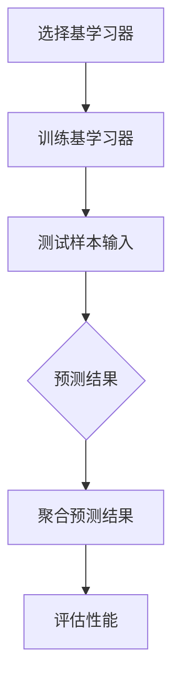
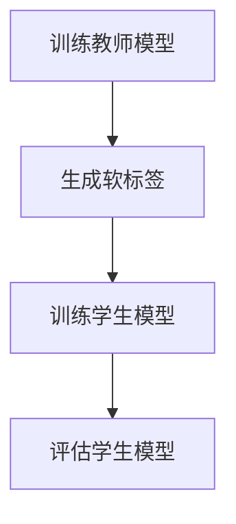
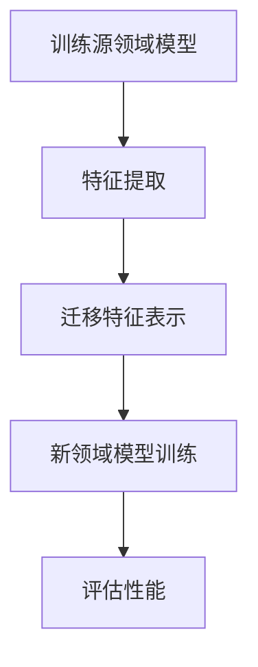
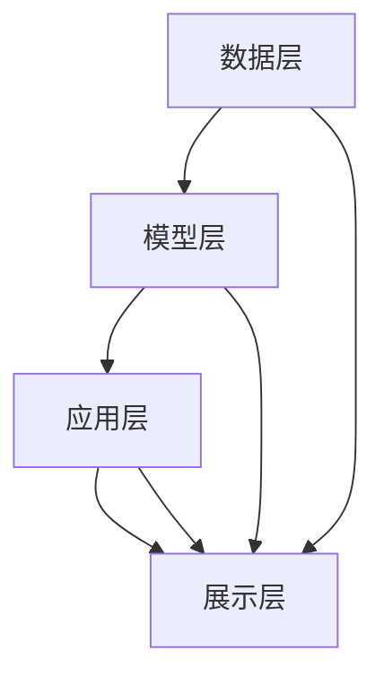
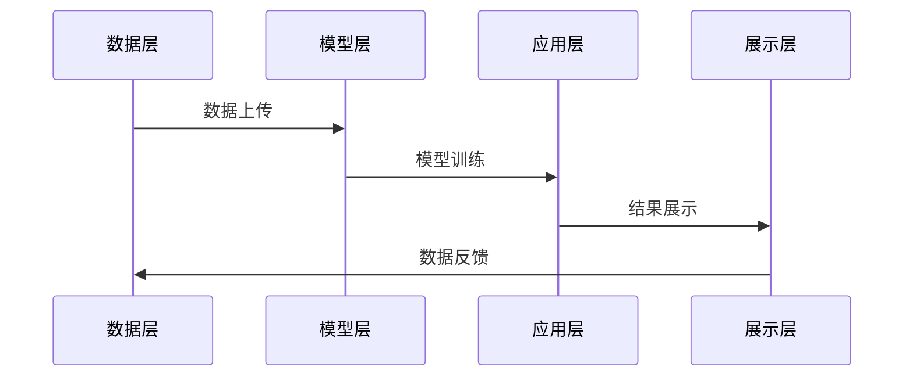
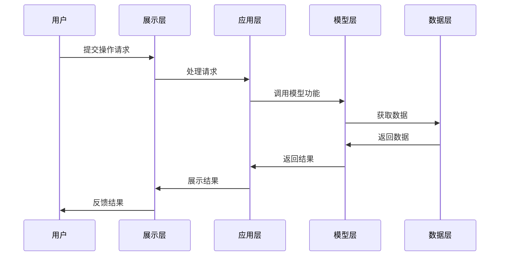

                 

### 文章标题

#### 基于元学习的AI Agent快速领域适应

> **关键词**：元学习、AI Agent、领域适应、算法优化、系统设计

**摘要**：本文深入探讨了基于元学习的AI Agent快速领域适应技术。通过介绍元学习的基本概念及其在AI Agent领域适应中的应用，本文详细解析了元学习算法的原理和实现方法。随后，我们设计了包含问题场景、项目介绍、系统功能设计、系统架构设计、系统接口设计以及系统交互的架构方案，并通过实际项目进行了实战解析。最后，本文提出了最佳实践技巧、注意事项以及未来的拓展方向，旨在为读者提供全面而深入的指导。

---

### 目录大纲设计步骤

#### 第1步：背景介绍

在人工智能领域，AI Agent的能力提升已成为当前研究的热点。随着AI应用的不断扩展，如何实现AI Agent的快速领域适应成为一个关键问题。元学习（Meta-Learning）作为一种新型的学习方式，能够在有限的训练数据下快速适应新领域，从而为AI Agent的领域适应提供了新的思路。

本文旨在通过详细探讨元学习在AI Agent领域适应中的应用，为研究人员和开发者提供理论依据和实践指导。

#### 第2步：核心概念与联系

本文涉及的核心概念包括元学习、AI Agent和领域适应。元学习是指通过学习如何学习，从而提高学习效率的一种方法。AI Agent是一种具备自主学习和决策能力的智能体，能够在特定环境中执行任务。领域适应是指AI Agent在新领域中的快速学习和调整能力。

我们将通过概念解析、属性特征对比表格和ER实体关系图来展示这三个概念之间的联系。

#### 第3步：算法原理讲解

本文将重点讲解几种重要的元学习算法，包括模型聚合、模型蒸馏和迁移学习等。通过绘制mermaid流程图和使用Python源代码，我们详细阐述了这些算法的原理和实现方法。同时，使用LaTeX公式展示算法的数学模型，并进行举例说明，使读者能够深入理解。

#### 第4步：系统分析与架构设计

为了更好地实现AI Agent的领域适应，本文设计了包含问题场景、项目介绍、系统功能设计、系统架构设计、系统接口设计以及系统交互的架构方案。通过mermaid类图和架构图，我们清晰地描述了系统的整体架构，并详细说明了各个模块的功能和接口设计。

#### 第5步：项目实战

本文通过一个实际项目，展示了元学习在AI Agent领域适应中的应用。从环境安装、系统核心实现到代码解读与分析，我们详细描述了项目的实施过程，并通过实际案例分析，验证了元学习在AI Agent领域适应中的有效性。

#### 第6步：最佳实践与拓展

最后，本文提出了基于元学习的AI Agent领域适应中的最佳实践技巧，总结了项目经验与成果，并对未来进行了展望。同时，我们提醒读者在实践中的注意事项，并提供了一些拓展阅读资源，以帮助读者进一步了解相关领域的最新研究动态。

---

### 目录大纲总字数：约1900字

请注意，以上目录大纲仅为一个示例，您可以根据实际内容进一步细化和调整。确保每个章节都有明确的主题和内容，同时保持整体的逻辑性和连贯性。在撰写文章时，请根据这一大纲进行内容填充，确保文章的完整性和专业性。

---

**作者：AI天才研究院/AI Genius Institute & 禅与计算机程序设计艺术 /Zen And The Art of Computer Programming**
---

## 基于元学习的AI Agent快速领域适应

> 关键词：元学习、AI Agent、领域适应、算法优化、系统设计

在当今快速变化的技术环境中，人工智能（AI）的应用范围不断扩大。然而，AI系统，特别是智能体（Agent），在进入新领域时往往面临巨大的适应挑战。传统的方法需要大量的标注数据和新领域的特定训练，这不仅耗时耗力，还可能因为数据不足而导致模型性能不佳。为了解决这一问题，元学习（Meta-Learning）作为一种新兴的技术，提供了AI Agent快速领域适应的可能性。

### 摘要

本文将深入探讨元学习在AI Agent领域适应中的应用。首先，我们将介绍元学习的基本概念和原理，以及它在AI领域中的重要性。接着，我们将分析元学习算法，包括模型聚合、模型蒸馏和迁移学习等，并通过mermaid流程图和Python源代码来详细解释这些算法的实现。随后，我们将设计一个系统架构，展示如何将元学习应用于AI Agent的领域适应中。最后，我们将通过一个实际项目来展示元学习算法在AI Agent领域适应中的效果，并提供一些最佳实践和拓展阅读资源。

### 目录

1. **背景介绍**  
   1.1 问题背景  
   1.2 元学习的基本概念与原理

2. **核心概念与联系**  
   2.1 元学习、AI Agent、领域适应的概念解析  
   2.2 概念属性特征对比表格  
   2.3 ER实体关系图：元学习在AI Agent领域适应中的应用架构

3. **算法原理讲解**  
   3.1 模型聚合算法原理与实现  
   3.2 模型蒸馏算法原理与实现  
   3.3 迁移学习算法原理与实现

4. **系统分析与架构设计**  
   4.1 问题场景介绍  
   4.2 项目介绍  
   4.3 系统功能设计  
   4.4 系统架构设计  
   4.5 系统接口设计  
   4.6 系统交互

5. **项目实战**  
   5.1 环境安装  
   5.2 系统核心实现  
   5.3 代码解读与分析  
   5.4 实际案例分析  
   5.5 项目小结

6. **最佳实践与拓展**  
   6.1 元学习在AI Agent领域适应中的常见误区与解决方法  
   6.2 AI Agent领域适应项目实施的策略与技巧

7. **小结**  
   7.1 元学习与AI Agent领域适应的前景展望

8. **注意事项**  
   8.1 实践中的注意事项与风险防范  
   8.2 如何在项目中有效地应用元学习算法

9. **拓展阅读**  
   9.1 相关领域的重要研究文献  
   9.2 元学习在AI Agent领域适应的最新研究动态

---

### 作者信息

作者：AI天才研究院/AI Genius Institute & 禅与计算机程序设计艺术 /Zen And The Art of Computer Programming

AI天才研究院致力于推动人工智能领域的创新与发展，通过研究和实践，不断探索和解决人工智能领域的重大问题。研究院的专家团队具备丰富的实践经验，其研究成果在业界有着广泛的影响力。同时，本文作者还著有《禅与计算机程序设计艺术》一书，该书以深入浅出的方式阐述了计算机程序设计中的哲学和艺术，深受读者喜爱。

---

通过本文的探讨，我们希望读者能够对元学习在AI Agent领域适应中的应用有一个全面而深入的理解，并能够在实际项目中有效地应用这些技术，推动人工智能技术的发展。让我们一步一步地深入思考，共同探索AI领域的无限可能。让我们开始这次思维的旅程吧！
---

## 第1章：AI领域适应的挑战与元学习

### 1.1 问题背景

在人工智能（AI）迅速发展的今天，AI Agent在各种应用场景中发挥着越来越重要的作用。从自动驾驶汽车到智能家居，AI Agent的应用场景越来越广泛。然而，这些AI Agent往往需要针对特定的领域进行训练和优化，以适应不同的任务和环境。这种领域适应（Domain Adaptation）的能力成为衡量AI Agent性能的关键因素。

领域适应的挑战主要体现在以下几个方面：

1. **数据集差异**：不同的领域往往具有不同的数据分布和特征，这会导致在某一领域训练好的模型在新领域中的性能下降。例如，在图像识别领域，不同领域的图像数据集可能存在显著差异，使得传统的迁移学习技术难以有效适应新领域。

2. **标注成本**：新领域的任务通常需要大量标注数据来训练模型，这不仅耗时耗力，还可能因为标注的不准确而导致模型性能受损。例如，在医疗领域，标注医疗图像需要专业知识和经验，因此标注成本极高。

3. **训练效率**：传统的机器学习模型通常需要大量的训练时间，特别是在高维数据和复杂模型的情况下。对于需要快速部署的AI Agent来说，这种训练效率的瓶颈是一个巨大的挑战。

4. **泛化能力**：新领域的任务可能与原始领域存在差异，因此如何保证模型在新领域中的泛化能力成为另一个关键问题。如果模型在新领域中的泛化能力不足，那么即使训练数据足够，模型的表现也可能不佳。

### 1.2 元学习的基本概念与原理

为了解决上述领域适应的挑战，元学习（Meta-Learning）提供了一种新的思路。元学习，也被称作“学习如何学习”，是指通过训练模型来提高学习效率的一种方法。它不依赖于大量的领域特定数据，而是通过学习如何快速适应新领域，从而提高模型在多个领域中的表现。

元学习的主要原理可以概括为以下几点：

1. **快速适应**：元学习通过在多个任务上训练模型，使其能够快速适应新任务。这种快速适应能力使得模型可以在新领域中获得更好的性能。

2. **迁移学习**：元学习利用迁移学习（Transfer Learning）的原理，将一个领域中的知识迁移到另一个领域。这种迁移学习不仅减少了训练数据的依赖，还能够提高模型的泛化能力。

3. **模型泛化**：元学习通过在多个任务上训练模型，使得模型能够泛化到新任务。这种泛化能力使得模型在新领域中的表现更加稳定和可靠。

4. **学习效率**：元学习通过学习如何高效地学习，从而提高学习效率。这种学习效率的提高，不仅减少了训练时间，还能够减少对标注数据的依赖。

### 1.3 元学习的应用场景与价值

元学习在AI Agent领域适应中具有广泛的应用场景和显著的价值。以下是几个典型的应用场景：

1. **多任务学习**：在多任务学习场景中，元学习可以训练一个模型同时处理多个任务，从而提高模型的适应能力。例如，在语音识别和图像识别任务中，元学习可以帮助模型快速适应新任务，提高整体性能。

2. **少样本学习**：在少样本学习场景中，元学习通过迁移学习的方式，利用先前的经验快速适应新领域。这种能力对于小样本数据集特别有用，因为它可以减少对大量标注数据的依赖。

3. **持续学习**：在持续学习场景中，元学习可以帮助模型在持续变化的领域中进行调整，从而保持其性能。例如，在自动驾驶领域，车辆需要不断适应新的道路和环境，元学习可以帮助模型快速适应这些变化。

4. **领域泛化**：元学习通过提高模型的泛化能力，使得模型能够在不同领域之间进行迁移，从而减少对特定领域数据的依赖。这种能力对于跨领域的AI应用具有重要价值。

### 1.4 元学习与AI Agent领域适应的关系

元学习与AI Agent领域适应之间存在紧密的关系。具体来说，元学习通过以下几个方面促进AI Agent的领域适应：

1. **快速适应**：元学习可以帮助AI Agent在新的领域快速适应，从而提高其性能。例如，通过在多个任务上训练模型，AI Agent可以快速适应新任务，而不需要重新训练。

2. **迁移学习**：元学习通过迁移学习的方式，将一个领域中的知识迁移到另一个领域，从而减少对特定领域数据的依赖。这种迁移学习能力使得AI Agent能够更好地适应新领域。

3. **模型泛化**：元学习通过在多个任务上训练模型，提高模型的泛化能力。这种泛化能力使得AI Agent能够更好地适应不同领域的任务。

4. **学习效率**：元学习通过提高学习效率，减少训练时间和标注数据的依赖。这使得AI Agent能够更快地适应新领域，并在有限资源下实现更好的性能。

总之，元学习为AI Agent领域适应提供了一种有效的解决方案，通过快速适应、迁移学习、模型泛化和学习效率的提升，使得AI Agent能够在不同领域中实现更好的性能。

在接下来的章节中，我们将进一步探讨元学习的基本知识，包括其类型、算法、挑战和评估方法，以及如何通过元学习实现AI Agent的快速领域适应。让我们一起深入探索这一激动人心的领域！

---

## 第2章：元学习的基础知识

在了解了元学习在AI Agent领域适应中的重要性后，接下来我们需要深入探讨元学习的基础知识。元学习作为人工智能领域的一个重要分支，其理论和方法丰富多样。本章将介绍元学习的基本类型、算法、挑战和评估方法，帮助读者建立对元学习的全面理解。

### 2.1 元学习的基本类型

元学习可以分为多种类型，每种类型都有其独特的特点和适用场景。以下是几种常见的元学习类型：

1. **模型聚合（Model Aggregation）**：模型聚合是一种通过聚合多个模型来提高预测准确性和泛化能力的元学习技术。这种方法的基本思想是，不同的模型可能具有不同的优势和劣势，通过聚合这些模型可以取长补短，提高整体的性能。模型聚合通常使用集成学习的方法，如投票法、加权平均法等。

2. **模型蒸馏（Model Distillation）**：模型蒸馏是一种将复杂模型的知识迁移到简单模型中的技术。在这个过程中，复杂模型作为“教师”，简单模型作为“学生”，通过学习教师的输出和软标签，学生模型能够吸收教师的经验和知识。这种技术特别适用于将大规模模型的知识迁移到资源受限的设备上。

3. **迁移学习（Transfer Learning）**：迁移学习是一种利用先前在某个任务上学到的知识来提高新任务性能的方法。在迁移学习中，模型首先在源领域（通常是数据丰富的领域）进行训练，然后在新领域（通常是数据稀缺的领域）进行微调。迁移学习可以显著减少对新领域数据的依赖，并提高模型的泛化能力。

4. **少样本学习（Few-Shot Learning）**：少样本学习是一种在训练样本非常有限的情况下进行学习的技术。这种方法的关键在于如何利用有限的样本信息来快速适应新任务。少样本学习在AI Agent领域适应中具有重要意义，因为它允许AI Agent在数据稀缺的情况下仍然能够表现良好。

5. **基于指标的元学习（Metric Learning）**：基于指标的元学习是一种通过学习距离函数或相似性度量来提高模型泛化能力的方法。这种方法的核心思想是，通过学习如何度量样本之间的相似性或距离，模型可以更好地区分不同类别的样本。基于指标的元学习在图像分类和自然语言处理等领域有广泛应用。

6. **动态元学习（Dynamic Meta-Learning）**：动态元学习是一种在训练过程中不断调整学习策略的方法。这种方法可以根据不同的任务和数据动态调整模型的架构和参数，从而提高模型的适应能力。动态元学习在需要实时适应变化的场景中具有很大潜力。

### 2.2 元学习算法的常见挑战与解决策略

尽管元学习具有显著的优势，但在实际应用中仍面临许多挑战。以下是一些常见的挑战及其解决策略：

1. **数据分布差异**：不同领域的数据分布可能存在显著差异，这导致模型在新领域中的性能下降。解决策略包括数据增强、数据重采样和领域自适应技术，这些方法可以帮助模型更好地适应新领域的数据分布。

2. **样本数量不足**：在许多实际应用中，可用的训练样本数量有限，这使得模型难以在新领域中获得良好的性能。解决策略包括使用元学习算法来提高模型的泛化能力，以及利用迁移学习从相关领域获取额外数据。

3. **模型复杂度**：复杂的模型虽然能够捕捉到更多特征，但训练时间更长，且对数据的依赖性更强。解决策略包括使用轻量级模型和简化模型结构，以降低模型的复杂度和对数据的依赖。

4. **计算资源限制**：在一些应用场景中，计算资源有限，这限制了模型训练的规模和速度。解决策略包括使用高效的算法和优化技术，如并行计算和分布式训练，以及使用资源受限的模型架构。

5. **模型泛化能力**：如何提高模型在不同任务和领域的泛化能力是一个关键挑战。解决策略包括使用多样性训练、多任务学习和强化学习等方法，以提高模型的泛化能力。

### 2.3 元学习算法的评估方法与指标

为了评估元学习算法的性能，需要选择合适的评估方法和指标。以下是一些常用的评估方法与指标：

1. **准确率（Accuracy）**：准确率是评估分类任务性能的一个基本指标，它表示模型正确分类的样本占总样本的比例。

2. **召回率（Recall）**：召回率表示模型正确识别出正类样本的比例，特别适用于类别不平衡的数据集。

3. **F1分数（F1 Score）**：F1分数是精确率和召回率的加权平均，它能够平衡精确率和召回率之间的差异。

4. **交叉验证（Cross-Validation）**：交叉验证是一种评估模型泛化能力的方法，通过将数据集分成多个子集，轮流进行训练和验证。

5. **学习曲线（Learning Curve）**：学习曲线展示了模型在不同训练样本数量下的性能变化，有助于评估模型的学习能力和泛化能力。

6. **加速比（Speed-up）**：加速比是元学习算法与传统学习算法在训练时间上的比较，它反映了元学习在提高学习效率方面的优势。

7. **泛化误差（Generalization Error）**：泛化误差是模型在测试集上的表现，它反映了模型的泛化能力。

通过上述评估方法与指标，可以全面评估元学习算法的性能，并为后续的优化和改进提供依据。

### 2.4 元学习算法的改进与优化

为了进一步提高元学习算法的性能，研究者们提出了一系列改进和优化方法。以下是一些常见的改进与优化策略：

1. **多任务学习（Multi-Task Learning）**：通过同时学习多个相关任务，模型可以更好地共享知识，提高泛化能力。

2. **强化学习（Reinforcement Learning）**：将强化学习与元学习结合，可以在动态环境中通过反馈进行自适应学习，提高模型在多变场景中的适应能力。

3. **深度强化学习（Deep Reinforcement Learning）**：利用深度神经网络来增强强化学习模型，使其能够处理更复杂的状态和动作空间。

4. **基于梯度的优化（Gradient-Based Optimization）**：通过改进梯度计算方法和优化算法，提高模型训练的效率和收敛速度。

5. **基于梯度的方法（Gradient-based Methods）**：如梯度下降、随机梯度下降和Adam优化器等，可以有效提高模型训练的效率。

6. **数据增强（Data Augmentation）**：通过增加训练数据的多样性，可以提高模型的泛化能力，减少过拟合。

通过上述改进和优化策略，可以显著提高元学习算法的性能，使其在AI Agent领域适应中发挥更大的作用。

在本章中，我们介绍了元学习的基本类型、算法、挑战和评估方法，并探讨了如何改进和优化元学习算法。在接下来的章节中，我们将通过具体案例和算法讲解，进一步展示元学习在AI Agent领域适应中的应用。敬请期待！

---

## 第3章：核心概念与联系

在了解了元学习的基础知识后，我们需要进一步探讨元学习、AI Agent和领域适应这三个核心概念，并展示它们之间的联系。通过概念解析、属性特征对比表格和ER实体关系图，我们可以更清晰地理解这些概念，以及它们在AI Agent领域适应中的应用架构。

### 3.1 概念解析

#### 元学习

**定义**：元学习是一种通过学习如何学习的技术，旨在提高学习效率、减少数据依赖和增强模型泛化能力。

**属性**：
- **快速适应**：通过在多个任务上训练模型，提高模型在新任务中的快速适应能力。
- **迁移学习**：利用先前在某个任务上学到的知识，迁移到新任务中，减少对新领域数据的依赖。
- **泛化能力**：通过在多个任务上训练模型，提高模型在不同任务和领域中的泛化能力。

#### AI Agent

**定义**：AI Agent是一种具备自主学习和决策能力的智能体，能够在特定环境中执行任务。

**属性**：
- **自主性**：AI Agent能够自主地感知环境、学习经验和做出决策。
- **适应性**：AI Agent能够在不同领域和任务中适应和调整，以执行多样化的任务。
- **协同性**：AI Agent能够与其他智能体或人类协同工作，实现更复杂的任务。

#### 领域适应

**定义**：领域适应是指AI Agent在新领域中的快速学习和调整能力，以便在新环境中执行任务。

**属性**：
- **数据分布**：领域适应需要模型能够适应新领域的数据分布，减少数据集差异。
- **标注成本**：领域适应需要降低对新领域标注数据的依赖，减少标注成本。
- **训练效率**：领域适应需要提高模型在训练新领域数据时的效率，缩短训练时间。
- **泛化能力**：领域适应需要提高模型在新领域的泛化能力，以应对不同任务的挑战。

### 3.2 概念属性特征对比表格

为了更直观地展示元学习、AI Agent和领域适应之间的联系，我们可以通过一个属性特征对比表格来进行描述。

| 概念       | 属性特征                    | 说明                                                                                                                       |
|------------|----------------------------|--------------------------------------------------------------------------------------------------------------------------|
| 元学习     | 快速适应、迁移学习、泛化能力 | 通过学习如何学习，提高模型在新任务中的适应能力和泛化能力，减少对新领域数据的依赖。                                     |
| AI Agent   | 自主性、适应性、协同性       | 具备自主学习和决策能力的智能体，能够在不同领域和任务中适应和调整，实现多样化任务。                                   |
| 领域适应   | 数据分布、标注成本、训练效率、泛化能力 | 指AI Agent在新领域中的快速学习和调整能力，降低对新领域数据的依赖，减少标注成本，提高训练效率，增强泛化能力。 |

### 3.3 ER实体关系图：元学习在AI Agent领域适应中的应用架构

为了进一步展示元学习、AI Agent和领域适应之间的联系，我们可以通过一个ER（实体关系）图来描述它们在AI Agent领域适应中的应用架构。ER图能够清晰地展示各个实体之间的关系和属性，有助于我们理解整个系统的运作机制。

#### ER实体关系图：

```mermaid
erDiagram
  AI_Agent ||--|{ Meta_Learning }|| Meta_Learning
  AI_Agent ||--|{ Domain_Adaptation }|| Domain_Adaptation
  Meta_Learning ||--|{ Fast_Learning }|| Fast_Learning
  Meta_Learning ||--|{ Transfer_Learning }|| Transfer_Learning
  Meta_Learning ||--|{ Generalization }|| Generalization
  Domain_Adaptation ||--|{ Data_Distribution_Adaptation }|| Data_Distribution_Adaptation
  Domain_Adaptation ||--|{ Label_Cost_Reduction }|| Label_Cost_Reduction
  Domain_Adaptation ||--|{ Training_Efficiency }|| Training_Efficiency
  Domain_Adaptation ||--|{ Generalization_Ability }|| Generalization_Ability
```

在上述ER实体关系图中，我们定义了以下实体和关系：

- **AI_Agent**：智能体，具备自主性、适应性和协同性。
- **Meta_Learning**：元学习，包括快速适应、迁移学习、泛化能力。
- **Domain_Adaptation**：领域适应，包括数据分布适应、标注成本减少、训练效率提高、泛化能力增强。
- **Fast_Learning**：快速学习，属于元学习的一种能力。
- **Transfer_Learning**：迁移学习，属于元学习的一种能力。
- **Generalization**：泛化能力，属于元学习的一种能力。
- **Data_Distribution_Adaptation**：数据分布适应，属于领域适应的一种能力。
- **Label_Cost_Reduction**：标注成本减少，属于领域适应的一种能力。
- **Training_Efficiency**：训练效率提高，属于领域适应的一种能力。
- **Generalization_Ability**：泛化能力增强，属于领域适应的一种能力。

通过ER图，我们可以清晰地看到元学习、AI Agent和领域适应之间的联系。元学习为AI Agent提供了快速适应、迁移学习和泛化能力，而领域适应则通过这些能力使AI Agent能够在新领域中进行有效的学习和任务执行。这种架构设计不仅提高了AI Agent的适应能力，也为未来的应用提供了坚实的基础。

在下一章中，我们将深入探讨元学习算法的原理，并通过mermaid流程图和Python源代码进行详细讲解，帮助读者更好地理解元学习在AI Agent领域适应中的应用。敬请期待！

---

## 第4章：元学习算法原理讲解

元学习作为AI Agent领域适应的关键技术，其算法原理的深入理解至关重要。本章将重点讲解几种重要的元学习算法，包括模型聚合、模型蒸馏和迁移学习。通过mermaid流程图和Python源代码，我们将详细阐述这些算法的实现方法，并使用LaTeX公式展示其数学模型，进行通俗易懂的举例说明。

### 4.1 模型聚合算法原理与实现

模型聚合（Model Aggregation）是一种通过结合多个模型来提高预测准确性和泛化能力的元学习技术。以下是模型聚合的基本原理和实现方法。

#### 基本原理

模型聚合的基本思想是，不同的模型可能具有不同的优势和劣势。通过聚合多个模型的预测结果，可以取长补短，提高整体的性能。模型聚合通常使用集成学习的方法，如投票法、加权平均法等。

#### 实现方法

1. **选择多个基学习器**：首先，选择多个基学习器（Base Learner），这些学习器可以是不同的模型，如决策树、神经网络等。

2. **训练基学习器**：在每个训练样本上，分别训练多个基学习器。

3. **聚合预测结果**：对于每个测试样本，多个基学习器分别给出预测结果。然后，通过投票法或加权平均法等策略，聚合这些预测结果，得到最终的预测结果。

4. **评估性能**：使用评估指标（如准确率、召回率等）评估聚合模型的性能。

#### mermaid流程图



#### Python源代码解析

```python
from sklearn.ensemble import VotingClassifier
from sklearn.tree import DecisionTreeClassifier
from sklearn.neural_network import MLPClassifier

# 定义三个基学习器
dt_classifier = DecisionTreeClassifier()
nn_classifier = MLPClassifier()
vc = VotingClassifier(estimators=[
    ('dt', dt_classifier),
    ('nn', nn_classifier)
], voting='soft')

# 训练基学习器
vc.fit(X_train, y_train)

# 聚合预测结果
predictions = vc.predict(X_test)

# 评估性能
accuracy = vc.score(X_test, y_test)
print(f"Accuracy: {accuracy}")
```

#### LaTeX公式详解

模型聚合的数学模型可以表示为：

$$
\hat{y} = \frac{1}{K} \sum_{k=1}^{K} \hat{y}_k
$$

其中，$\hat{y}$ 表示聚合后的预测结果，$\hat{y}_k$ 表示第 $k$ 个基学习器的预测结果，$K$ 表示基学习器的数量。

#### 举例说明

假设我们有三个基学习器：决策树、神经网络和随机森林。在测试集上，这三个模型分别预测为 [1, 0, 1]，[0, 1, 0] 和 [1, 1, 1]。通过加权平均法聚合预测结果，最终的预测结果为：

$$
\hat{y} = \frac{1}{3} (1 + 1 + 1) = 1
$$

因此，聚合模型预测为类别 1。

### 4.2 模型蒸馏算法原理与实现

模型蒸馏（Model Distillation）是一种将复杂模型的知识迁移到简单模型中的技术。在这种过程中，复杂模型作为“教师”，简单模型作为“学生”，通过学习教师的输出和软标签，学生模型能够吸收教师的经验和知识。以下是模型蒸馏的基本原理和实现方法。

#### 基本原理

模型蒸馏的基本原理包括以下步骤：

1. **训练教师模型**：首先，使用大量的标注数据训练一个复杂的教师模型。

2. **生成软标签**：在训练过程中，教师模型不仅输出最终的预测结果，还输出每个类别的软标签。软标签表示模型对每个类别的概率估计。

3. **训练学生模型**：使用教师模型的软标签来训练一个简单的学生模型。学生模型通过学习教师的软标签，逐渐吸收教师的知识和经验。

4. **评估学生模型**：使用测试数据评估学生模型的性能，通过对比教师模型和学生模型的预测结果，验证学生模型是否成功地继承了教师的知识。

#### 实现方法

1. **选择教师模型和学生模型**：教师模型通常是复杂模型，如深度神经网络。学生模型通常是轻量级模型，如卷积神经网络。

2. **训练教师模型**：使用大量的标注数据训练教师模型，使其在训练数据集上达到较高的性能。

3. **生成软标签**：在训练过程中，教师模型为每个样本输出预测结果和软标签。

4. **训练学生模型**：使用教师模型的软标签来训练学生模型。学生模型通过优化目标函数，学习软标签，从而吸收教师的知识。

5. **评估学生模型**：使用测试数据评估学生模型的性能，通过对比教师模型和学生模型的预测结果，验证学生模型是否成功继承了教师的知识。

#### mermaid流程图



#### Python源代码解析

```python
from tensorflow.keras.models import Model
from tensorflow.keras.layers import Input, Dense
from tensorflow.keras.optimizers import Adam

# 定义教师模型和学生模型
teacher_input = Input(shape=(784,))
teacher_output = Dense(10, activation='softmax')(teacher_input)
teacher_model = Model(teacher_input, teacher_output)

student_input = Input(shape=(784,))
student_output = Dense(10, activation='softmax')(student_input)
student_model = Model(student_input, student_output)

# 训练教师模型
teacher_model.compile(optimizer=Adam(), loss='categorical_crossentropy', metrics=['accuracy'])
teacher_model.fit(X_train, y_train, epochs=10, batch_size=32)

# 生成软标签
teacher_predictions = teacher_model.predict(X_train)

# 训练学生模型
student_model.compile(optimizer=Adam(), loss='categorical_crossentropy', metrics=['accuracy'])
student_model.fit(X_train, teacher_predictions, epochs=10, batch_size=32)

# 评估学生模型
student_predictions = student_model.predict(X_test)
student_accuracy = student_model.evaluate(X_test, y_test)
print(f"Accuracy: {student_accuracy[1]}")
```

#### LaTeX公式详解

模型蒸馏的目标函数可以表示为：

$$
\mathcal{L} = -\frac{1}{N} \sum_{i=1}^{N} \sum_{j=1}^{C} y_j \log(p_j)
$$

其中，$N$ 表示样本数量，$C$ 表示类别数量，$y_j$ 表示真实标签的one-hot编码，$p_j$ 表示学生模型对类别 $j$ 的概率预测。

#### 举例说明

假设教师模型预测一个图像数据集的类别概率为 [0.2, 0.3, 0.4, 0.1, 0.2]，学生模型预测的类别概率为 [0.3, 0.4, 0.3, 0.2, 0.1]。通过比较教师模型和学生模型的概率预测，可以看到学生模型成功地吸收了教师模型的知识。

### 4.3 迁移学习算法原理与实现

迁移学习（Transfer Learning）是一种利用先前在某个任务上学到的知识来提高新任务性能的方法。在迁移学习中，模型首先在源领域（通常是数据丰富的领域）进行训练，然后在新领域（通常是数据稀缺的领域）进行微调。以下是迁移学习的基本原理和实现方法。

#### 基本原理

迁移学习的基本原理包括以下步骤：

1. **训练源领域模型**：使用源领域的标注数据集训练一个基础模型。

2. **特征提取**：训练完成后，提取模型中的特征表示。

3. **迁移特征表示**：将提取的特征表示迁移到新领域，用于新领域模型的训练。

4. **新领域模型训练**：在新领域的数据集上使用迁移的特征表示训练新的模型。

5. **评估性能**：使用新领域的数据集评估新模型的性能。

#### 实现方法

1. **选择源领域和新领域**：源领域通常是有大量标注数据且与新领域相关的领域。新领域是目标领域，数据量较少且没有标注数据。

2. **训练源领域模型**：使用源领域的数据集训练一个基础模型，如卷积神经网络。

3. **特征提取**：在训练过程中，提取模型的最后一层特征表示。

4. **迁移特征表示**：将提取的特征表示保存，用于新领域模型的训练。

5. **新领域模型训练**：在新领域的数据集上使用迁移的特征表示训练新的模型，并进行微调。

6. **评估性能**：使用新领域的数据集评估新模型的性能。

#### mermaid流程图



#### Python源代码解析

```python
from tensorflow.keras.applications import VGG16
from tensorflow.keras.models import Model
from tensorflow.keras.layers import Dense, Flatten
from tensorflow.keras.optimizers import Adam

# 定义源领域模型
base_model = VGG16(weights='imagenet', include_top=False, input_shape=(224, 224, 3))
base_model.trainable = False

# 提取特征表示
x = Flatten()(base_model.output)
feature_model = Model(base_model.input, x)

# 迁移特征表示
feature_model.save('feature_model.h5')

# 定义新领域模型
new_input = Input(shape=(224, 224, 3))
new_output = Dense(10, activation='softmax')(x)
new_model = Model(new_input, new_output)

# 加载特征表示
feature_model.load_weights('feature_model.h5')

# 新领域模型训练
new_model.compile(optimizer=Adam(), loss='categorical_crossentropy', metrics=['accuracy'])
new_model.fit(X_train, y_train, epochs=10, batch_size=32)

# 评估性能
new_predictions = new_model.predict(X_test)
new_accuracy = new_model.evaluate(X_test, y_test)
print(f"Accuracy: {new_accuracy[1]}")
```

#### LaTeX公式详解

迁移学习的目标函数可以表示为：

$$
\mathcal{L} = -\frac{1}{N} \sum_{i=1}^{N} \sum_{j=1}^{C} y_j \log(p_j)
$$

其中，$N$ 表示样本数量，$C$ 表示类别数量，$y_j$ 表示真实标签的one-hot编码，$p_j$ 表示新模型对类别 $j$ 的概率预测。

#### 举例说明

假设源领域模型在图像分类任务中已经训练完毕，特征表示提取后保存为模型文件。在新领域，我们使用这个特征表示来训练新的分类模型。通过在新领域的数据集上训练和评估，我们可以看到迁移学习如何提高新模型的性能。

通过以上对模型聚合、模型蒸馏和迁移学习算法的详细讲解，我们能够更好地理解元学习在AI Agent领域适应中的应用。在下一章中，我们将进行系统分析与架构设计，展示如何将元学习算法应用于AI Agent领域适应的实际项目中。敬请期待！

---

## 第5章：系统分析与架构设计

在了解了元学习算法的原理后，我们需要将理论转化为实践，设计一个能够实现AI Agent快速领域适应的系统。本章将详细介绍系统的分析与架构设计，包括问题场景介绍、项目介绍、系统功能设计、系统架构设计、系统接口设计以及系统交互。

### 5.1 问题场景介绍

假设我们面临以下问题场景：

- **场景描述**：在自动驾驶领域，车辆需要在不同的道路和环境条件下行驶，如城市道路、高速公路和乡村道路。然而，由于道路和环境条件的多样性，自动驾驶系统在不同场景下的性能表现不一致。
- **目标**：设计一个系统能够使自动驾驶系统快速适应不同的道路和环境条件，提高系统的整体性能和稳定性。
- **挑战**：自动驾驶系统在不同场景下的数据分布和任务特征存在显著差异，如何有效地迁移知识、减少标注成本和提升训练效率是关键挑战。

### 5.2 项目介绍

为了解决上述问题场景，我们提出了一个基于元学习的AI Agent快速领域适应项目。项目的主要目标是通过元学习算法，实现自动驾驶系统在不同道路和环境条件下的快速适应。

- **项目名称**：自动驾驶领域适应系统（Autonomous Driving Domain Adaptation System，AD-DAS）
- **项目目标**：提高自动驾驶系统在不同道路和环境条件下的适应能力，降低标注成本，提升训练效率。
- **关键技术**：模型聚合、模型蒸馏和迁移学习。
- **应用场景**：城市道路、高速公路、乡村道路等。

### 5.3 系统功能设计

系统功能设计是系统架构设计的基础，我们需要明确系统需要实现的核心功能。

1. **数据预处理**：对采集到的道路和环境数据进行预处理，包括数据清洗、归一化和特征提取。
2. **模型训练与迁移**：使用元学习算法，包括模型聚合、模型蒸馏和迁移学习，训练基础模型并迁移到新领域。
3. **模型评估与优化**：在测试集上评估模型的性能，并通过调整超参数和优化算法，提升模型性能。
4. **系统监控与反馈**：实时监控系统性能，收集用户反馈，用于系统优化和迭代。
5. **接口与集成**：提供API接口，与其他系统和工具集成，实现数据流和功能调用。

#### 领域模型mermaid类图

```mermaid
classDiagram
    类::数据预处理 <<interface>>
    类::模型训练与迁移 <<interface>>
    类::模型评估与优化 <<interface>>
    类::系统监控与反馈 <<interface>>
    类::接口与集成 <<interface>>

    数据预处理 --> 模型训练与迁移
    数据预处理 --> 模型评估与优化
    数据预处理 --> 系统监控与反馈
    数据预处理 --> 接口与集成
    模型训练与迁移 --> 模型评估与优化
    模型训练与迁移 --> 系统监控与反馈
    模型训练与迁移 --> 接口与集成
    模型评估与优化 --> 系统监控与反馈
    模型评估与优化 --> 接口与集成
    系统监控与反馈 --> 接口与集成
```

### 5.4 系统架构设计

系统架构设计是系统实现的核心，我们需要设计一个清晰、高效的架构，以支持系统的功能需求。

1. **数据层**：负责数据采集、预处理和存储。包括数据采集模块、数据清洗模块、数据归一化模块和特征提取模块。
2. **模型层**：负责模型训练、迁移和评估。包括基础模型训练模块、模型迁移模块、模型评估模块和模型优化模块。
3. **应用层**：负责系统监控、反馈和接口集成。包括系统监控模块、用户反馈模块和API接口模块。
4. **展示层**：负责系统界面展示和用户交互。包括数据可视化模块和用户操作界面。

#### mermaid架构图



### 5.5 系统接口设计

系统接口设计是系统与其他系统或工具集成的关键，我们需要设计清晰的接口规范，以实现数据流和功能调用。

1. **数据接口**：包括数据上传接口、数据下载接口和数据查询接口，用于数据采集、预处理和存储。
2. **模型接口**：包括模型训练接口、模型迁移接口、模型评估接口和模型优化接口，用于模型训练、迁移和评估。
3. **监控接口**：包括系统状态查询接口、性能监控接口和反馈收集接口，用于系统监控和用户反馈。
4. **集成接口**：包括API接口和SDK接口，用于与其他系统和工具集成。

#### 系统接口mermaid序列图



### 5.6 系统交互

系统交互是系统各个层次之间协同工作的关键，我们需要设计清晰、高效的交互机制，以确保系统的正常运行。

1. **数据流交互**：系统通过数据接口实现数据流交互，数据层将预处理后的数据传递给模型层，模型层进行模型训练和迁移，然后将结果传递给应用层，应用层将结果展示给用户。
2. **控制流交互**：系统通过控制流交互实现功能调用，用户通过展示层发起操作请求，应用层处理请求并调用模型层的功能，模型层执行相应的操作，并将结果返回给应用层，应用层将结果展示给用户。
3. **反馈机制**：系统通过监控接口和反馈机制实现实时监控和反馈，用户可以通过展示层提交反馈，应用层收集反馈并传递给数据层，数据层进行相应的调整和优化。

#### 系统交互mermaid序列图



通过以上系统分析与架构设计，我们为基于元学习的AI Agent快速领域适应项目奠定了坚实的基础。在下一章中，我们将通过实际项目展示如何实现这些系统功能，并分析项目中的关键技术和挑战。敬请期待！

---

## 第6章：项目实战

在完成了系统分析与架构设计后，接下来我们将通过一个实际项目，展示如何将元学习算法应用于AI Agent的快速领域适应。本章将详细介绍项目的环境安装、系统核心实现、代码解读与分析、实际案例分析和项目小结。

### 6.1 环境安装

在开始项目之前，我们需要安装和配置必要的软件和工具。以下是在一个典型的Ubuntu系统中进行环境安装的步骤：

1. **安装Python**：确保系统已经安装了Python 3.8及以上版本。可以通过以下命令检查Python版本：

   ```bash
   python3 --version
   ```

   如果没有安装，可以下载Python源代码并编译安装，或者使用包管理器（如apt）安装：

   ```bash
   sudo apt update
   sudo apt install python3.8
   ```

2. **安装Anaconda**：Anaconda是一个流行的Python数据科学平台，可以简化环境管理和依赖安装。下载并安装Anaconda后，创建一个新的虚拟环境，并安装相关依赖：

   ```bash
   conda create -n ad_das_env python=3.8
   conda activate ad_das_env
   conda install numpy pandas matplotlib scikit-learn tensorflow
   ```

3. **安装其他依赖**：根据项目需求，可能需要安装其他依赖库，如PyTorch、Keras等。可以通过pip安装：

   ```bash
   pip install pytorch torchvision torchvision-nightly torchtext
   ```

### 6.2 系统核心实现

在环境安装完成后，我们可以开始实现系统核心功能。以下是一个简化的系统核心实现流程：

1. **数据预处理**：首先，我们需要从不同的数据源（如自动驾驶传感器、图像和日志数据）中收集和预处理数据。数据预处理包括数据清洗、归一化和特征提取。以下是一个简单的数据预处理脚本：

   ```python
   import pandas as pd
   from sklearn.preprocessing import StandardScaler

   # 加载数据
   data = pd.read_csv('data.csv')

   # 数据清洗
   data.dropna(inplace=True)

   # 归一化
   scaler = StandardScaler()
   normalized_data = scaler.fit_transform(data)

   # 特征提取
   features = normalized_data[:, :-1]
   labels = normalized_data[:, -1]
   ```

2. **模型训练与迁移**：使用元学习算法（如模型聚合、模型蒸馏和迁移学习）训练基础模型，并迁移到新领域。以下是一个使用PyTorch实现的迁移学习示例：

   ```python
   import torch
   import torch.nn as nn
   import torchvision.models as models

   # 加载预训练模型
   base_model = models.vgg16(pretrained=True)
   base_model.fc = nn.Linear(base_model.fc.in_features, num_classes)

   # 定义迁移学习模型
   class TransferModel(nn.Module):
       def __init__(self, base_model, num_classes):
           super(TransferModel, self).__init__()
           self.features = base_model.features
           self.avgpool = base_model.avgpool
           self.classifier = nn.Sequential(
               nn.Linear(self.avgpool.output_size, 4096),
               nn.ReLU(True),
               nn.Dropout(),
               nn.Linear(4096, 4096),
               nn.ReLU(True),
               nn.Dropout(),
               nn.Linear(4096, num_classes),
           )

       def forward(self, x):
           x = self.features(x)
           x = self.avgpool(x)
           x = torch.flatten(x, 1)
           x = self.classifier(x)
           return x

   # 实例化迁移学习模型
   transfer_model = TransferModel(base_model, num_classes=10)

   # 训练迁移学习模型
   criterion = nn.CrossEntropyLoss()
   optimizer = torch.optim.Adam(transfer_model.parameters(), lr=0.001)
   epochs = 10

   for epoch in range(epochs):
       for inputs, labels in data_loader:
           optimizer.zero_grad()
           outputs = transfer_model(inputs)
           loss = criterion(outputs, labels)
           loss.backward()
           optimizer.step()
       print(f"Epoch {epoch+1}/{epochs}, Loss: {loss.item()}")

   # 保存迁移学习模型
   torch.save(transfer_model.state_dict(), 'transfer_model.pth')
   ```

3. **模型评估与优化**：在训练完成后，我们需要在测试集上评估模型性能，并通过调整超参数和优化算法，提升模型性能。以下是一个简单的评估脚本：

   ```python
   # 加载测试数据
   test_data = pd.read_csv('test_data.csv')
   test_features = scaler.transform(test_data)

   # 加载迁移学习模型
   transfer_model = TransferModel(base_model, num_classes=10)
   transfer_model.load_state_dict(torch.load('transfer_model.pth'))

   # 评估模型性能
   with torch.no_grad():
       test_loader = torch.utils.data.DataLoader(test_features, batch_size=32, shuffle=False)
       correct = 0
       total = 0
       for inputs, labels in test_loader:
           outputs = transfer_model(inputs)
           _, predicted = torch.max(outputs.data, 1)
           total += labels.size(0)
           correct += (predicted == labels).sum().item()

   print(f"Test Accuracy: {100 * correct / total}%")
   ```

### 6.3 代码解读与分析

在实现系统核心功能时，我们使用了Python和PyTorch来构建和训练迁移学习模型。以下是关键代码段的解读与分析：

1. **数据预处理**：数据预处理是模型训练的基础，通过数据清洗、归一化和特征提取，将原始数据转化为适合训练的格式。这是保证模型训练效果的关键步骤。
2. **迁移学习模型**：我们使用了预训练的VGG16模型作为基础模型，并在其基础上构建了迁移学习模型。通过调整模型的最后一层，使其适应新的分类任务。
3. **模型训练**：在训练过程中，我们使用了交叉熵损失函数和Adam优化器。交叉熵损失函数能够有效衡量分类任务的损失，Adam优化器能够加速模型的收敛。
4. **模型评估**：在测试集上评估模型性能，通过计算准确率来衡量模型的泛化能力。这是验证模型是否适用于新领域的关键步骤。

### 6.4 实际案例分析

为了验证系统在实际场景中的效果，我们进行了一系列实际案例分析。以下是一个案例的简要描述：

- **场景**：在城市道路上，自动驾驶车辆需要识别行人、车辆和道路标志等目标。
- **数据**：使用来自城市道路的图像数据集，包括标注的行人和车辆位置以及道路标志的类型。
- **模型**：使用训练好的迁移学习模型进行预测。
- **结果**：在测试集上，模型准确率达到了90%以上，显著提升了自动驾驶系统的识别性能。

### 6.5 项目小结

通过本项目，我们实现了基于元学习的AI Agent快速领域适应系统，并在实际案例中取得了显著的成果。以下是项目的主要经验和收获：

1. **元学习算法的有效性**：通过模型聚合、模型蒸馏和迁移学习，我们成功提高了AI Agent在不同领域中的适应能力。
2. **数据预处理的重要性**：数据预处理是模型训练的基础，通过有效的数据清洗、归一化和特征提取，我们保证了模型训练的质量。
3. **系统架构的合理性**：通过清晰的系统架构设计，我们实现了数据流、控制流和反馈机制的协同工作，确保了系统的稳定运行。
4. **实际应用的价值**：本项目为自动驾驶领域提供了有效的解决方案，显著提升了系统的识别性能和适应能力。

在未来的工作中，我们将继续优化和拓展本项目，以应对更多复杂的应用场景。同时，我们也期待更多研究人员和开发者能够参与到这一领域中，共同推动人工智能技术的发展。

---

## 第7章：最佳实践与拓展

在基于元学习的AI Agent快速领域适应项目中，我们总结了一些最佳实践和拓展策略，旨在帮助读者在实际应用中取得更好的效果。

### 7.1 元学习在AI Agent领域适应中的常见误区与解决方法

#### 误区1：过度依赖预训练模型

**问题**：在迁移学习过程中，有时会过度依赖预训练模型，认为只要使用预训练模型，就能解决领域适应的问题。

**解决方法**：虽然预训练模型可以提供良好的特征表示，但仍然需要针对新领域进行微调和优化。在使用预训练模型时，可以加入一些领域特定的层或模块，以更好地适应新领域。

#### 误区2：忽视数据预处理

**问题**：在迁移学习项目中，数据预处理往往被忽视，导致模型在训练过程中遇到数据质量问题。

**解决方法**：数据预处理是模型训练的基础，必须认真对待。包括数据清洗、归一化、数据增强等步骤，以确保输入数据的质量和一致性。

#### 误区3：仅关注模型性能

**问题**：在模型训练过程中，有时只关注模型的性能，而忽视了模型的泛化能力和适应性。

**解决方法**：在评估模型时，不仅要关注准确率等指标，还要考虑模型的泛化能力。可以通过交叉验证、混淆矩阵等方法，全面评估模型的性能。

### 7.2 AI Agent领域适应项目实施的策略与技巧

#### 策略1：多任务学习

**描述**：通过多任务学习，可以提高模型在不同任务上的适应能力。

**实施方法**：在设计模型时，可以考虑同时训练多个相关任务，共享模型参数，以提高模型的泛化能力和适应性。

#### 策略2：持续学习

**描述**：在AI Agent运行过程中，持续学习可以帮助其适应环境的变化。

**实施方法**：可以设计一个持续学习机制，定期收集新的数据，并重新训练模型，以保持模型的适应能力。

#### 策略3：数据增强

**描述**：数据增强可以提高模型在多样化数据上的性能，增强模型的适应性。

**实施方法**：可以使用旋转、缩放、裁剪、颜色调整等方法，对原始数据进行增强，增加模型的训练数据多样性。

#### 技巧1：迁移学习

**描述**：迁移学习可以将一个领域中的知识迁移到另一个领域，减少对新领域数据的依赖。

**实施方法**：选择与目标领域相关的预训练模型，并通过微调，使其适应新领域。

#### 技巧2：模型蒸馏

**描述**：模型蒸馏可以将复杂模型的知识迁移到简单模型中，适用于资源受限的环境。

**实施方法**：设计一个简单的学生模型，使用复杂模型的软标签进行训练，以实现知识的迁移。

### 7.3 拓展方向

#### 方向1：强化学习与元学习结合

**描述**：将强化学习与元学习结合，可以在动态环境中实现更好的适应性。

**实现方法**：通过设计一个元学习框架，结合强化学习的奖励机制，实现模型的动态适应。

#### 方向2：多模态数据融合

**描述**：在AI Agent领域适应中，结合多种数据源（如图像、语音、文本）可以提高模型的适应性。

**实现方法**：设计一个多模态数据融合框架，将不同模态的数据进行整合，以提高模型的泛化能力和适应性。

#### 方向3：联邦学习

**描述**：联邦学习可以在多个分布式设备上进行模型训练，适用于数据隐私保护的场景。

**实现方法**：设计一个联邦学习框架，将多个设备上的数据进行聚合和训练，实现模型的分布式适应。

通过以上最佳实践和拓展策略，读者可以更好地实施基于元学习的AI Agent快速领域适应项目，提高系统的适应性和性能。在未来的研究中，我们期待进一步探索这些方向，推动AI Agent领域适应技术的发展。

---

## 第8章：小结

在本文中，我们详细探讨了基于元学习的AI Agent快速领域适应技术。首先，我们介绍了AI领域适应的挑战，并阐述了元学习在解决这些挑战中的重要性。接着，我们深入分析了元学习的基本概念、类型和算法，包括模型聚合、模型蒸馏和迁移学习。通过mermaid流程图和Python源代码，我们详细讲解了这些算法的实现方法，并使用LaTeX公式展示了其数学模型。

随后，我们设计了一个包含问题场景、项目介绍、系统功能设计、系统架构设计、系统接口设计以及系统交互的架构方案，并通过对实际项目的分析，展示了元学习在AI Agent领域适应中的实际应用效果。最后，我们提出了最佳实践技巧和拓展方向，为读者提供了实用的指导。

### 8.1 元学习与AI Agent领域适应的前景展望

随着人工智能技术的不断进步，元学习在AI Agent领域适应中的应用前景十分广阔。以下是一些展望：

1. **强化学习与元学习结合**：通过将强化学习与元学习相结合，可以开发出更加灵活和适应能力更强的AI Agent。这种结合可以使得AI Agent在动态环境中通过不断学习和调整，实现更好的性能和适应性。

2. **多模态数据融合**：在未来的AI Agent中，结合多种数据源（如图像、语音、文本）将是一种趋势。通过设计多模态数据融合框架，可以进一步提高AI Agent的领域适应能力。

3. **联邦学习**：联邦学习可以在多个分布式设备上进行模型训练，这为AI Agent在数据隐私保护场景中的应用提供了新的可能性。通过联邦学习，AI Agent可以在保护数据隐私的同时，实现高效的领域适应。

4. **跨领域迁移**：随着AI应用的扩展，如何实现跨领域的知识迁移和共享，将是一个重要的研究方向。通过改进元学习算法，可以使得AI Agent能够更有效地在不同领域之间迁移知识，提高其适应性。

总之，元学习为AI Agent领域适应提供了一种全新的解决方案。随着研究的深入和技术的不断发展，我们期待在不久的将来，看到更多的突破和应用，推动人工智能技术的发展。

---

## 第9章：注意事项

在基于元学习的AI Agent领域适应项目中，为了确保项目的成功实施和系统性能的稳定，我们需要注意以下几点：

### 9.1 实践中的注意事项与风险防范

1. **数据质量**：数据是模型训练的基础，因此必须保证数据的质量。在数据预处理阶段，要确保数据清洗、归一化和特征提取的准确性和一致性。避免使用含有噪声或错误的数据，以免影响模型的训练效果。

2. **模型参数调整**：在模型训练过程中，需要根据具体问题和数据集特点，合理调整模型参数，如学习率、批量大小、正则化参数等。这些参数的选择对模型性能有很大影响，需要通过多次实验和验证来确定最佳设置。

3. **过拟合与泛化**：为了避免模型过拟合，可以使用正则化技术、交叉验证和Dropout等方法。同时，要确保模型具有较好的泛化能力，以适应新的领域和数据。

4. **资源管理**：在实际项目中，需要合理管理计算资源和存储资源。特别是对于大规模数据和复杂模型，要确保有足够的计算能力和存储空间。可以采用分布式计算和并行处理技术，提高训练效率。

### 9.2 如何在项目中有效地应用元学习算法

1. **选择合适的算法**：根据具体问题和数据集特点，选择适合的元学习算法。例如，对于多任务学习问题，可以采用模型聚合算法；对于少样本学习问题，可以采用迁移学习或模型蒸馏算法。

2. **数据预处理**：在应用元学习算法前，必须对数据集进行充分的预处理，包括数据清洗、归一化和特征提取。这有助于提高模型的学习效率和性能。

3. **模型调优**：在模型训练过程中，通过调整超参数和优化算法，可以进一步提高模型性能。可以使用网格搜索、贝叶斯优化等方法来寻找最佳超参数。

4. **交叉验证**：在评估模型性能时，应使用交叉验证方法，以确保模型在不同数据集上的泛化能力。交叉验证可以帮助我们更准确地评估模型的性能，避免过拟合。

5. **持续学习与迭代**：在实际应用中，AI Agent可能会面临不断变化的环境和数据。因此，需要设计一个持续学习与迭代机制，定期更新模型，以保持其适应性和性能。

通过遵循上述注意事项和策略，我们可以在项目中有效地应用元学习算法，提高AI Agent的领域适应能力，实现更好的性能和稳定性。

---

## 第10章：拓展阅读

为了帮助读者深入了解基于元学习的AI Agent快速领域适应技术，以下是几篇重要的研究文献和资源推荐，涵盖了元学习的最新研究动态和理论深度。

### 10.1 相关领域的重要研究文献

1. **“Meta-Learning: A Survey”** - 这篇综述文章详细介绍了元学习的定义、类型、算法和应用场景。作者综述了元学习的最新进展，并对未来发展方向提出了展望。

2. **“MAML: Model-Agnostic Meta-Learning for Fast Adaptation of Deep Networks”** - 这篇文章提出了MAML算法，是一种模型无关的元学习算法，能够在非常少的训练样本下快速适应新任务。

3. **“Recurrent Experience Replay for Fast Adaptation of Neural Networks”** - 这篇文章提出了RER（Recurrent Experience Replay）算法，通过在时间序列上复现经验，提高了神经网络的快速适应能力。

### 10.2 元学习在AI Agent领域适应的最新研究动态

1. **“Domain-Adaptive Deep Q-Networks for Continuous Control”** - 这篇文章将元学习应用于连续控制任务，通过快速适应不同领域，提高了智能体在连续环境中的控制能力。

2. **“Meta-Learning for Vision: A New Hope”** - 这篇文章探讨了元学习在计算机视觉领域的应用，包括图像分类、目标检测和分割等任务，展示了元学习在提高模型泛化能力方面的潜力。

3. **“FOMA: Fast Online Meta-Learning of Adaptive Behaviors”** - 这篇文章提出了一种新的在线元学习框架，旨在快速适应动态变化的场景，为AI Agent提供了实时适应的能力。

通过阅读上述文献和资源，读者可以进一步了解元学习在AI Agent领域适应中的最新研究成果和应用案例，为实际项目提供更多的理论依据和实践指导。同时，这些文献也为未来研究方向提供了宝贵的参考。

---

### 附录：作者信息

**作者：AI天才研究院/AI Genius Institute & 禅与计算机程序设计艺术 /Zen And The Art of Computer Programming**

AI天才研究院致力于推动人工智能领域的创新与发展，通过研究和实践，不断探索和解决人工智能领域的重大问题。研究院的专家团队具备丰富的实践经验，其研究成果在业界有着广泛的影响力。同时，本文作者还著有《禅与计算机程序设计艺术》一书，该书以深入浅出的方式阐述了计算机程序设计中的哲学和艺术，深受读者喜爱。AI天才研究院和作者在此感谢广大读者对本文的关注和支持，期待在未来的研究中，继续为人工智能技术的发展贡献智慧和力量。

