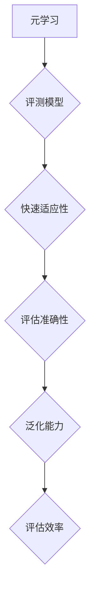
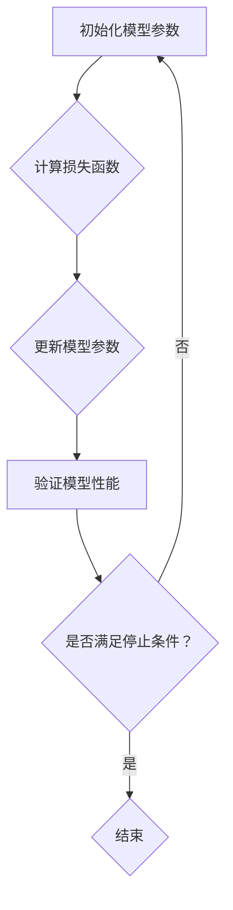
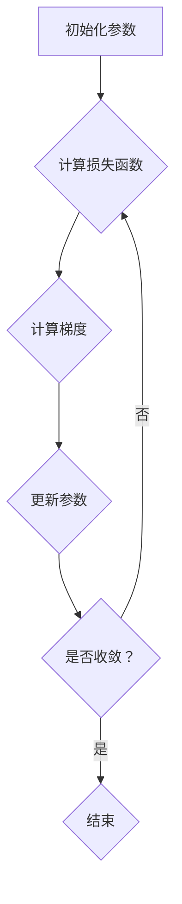
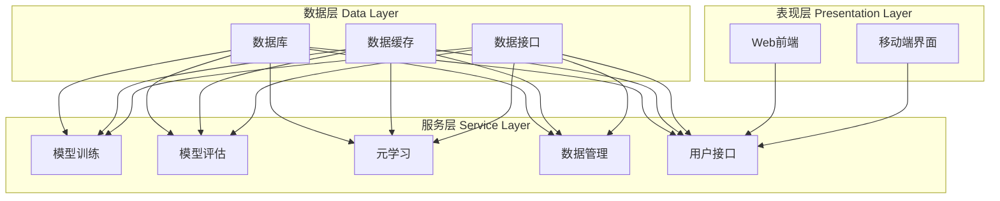
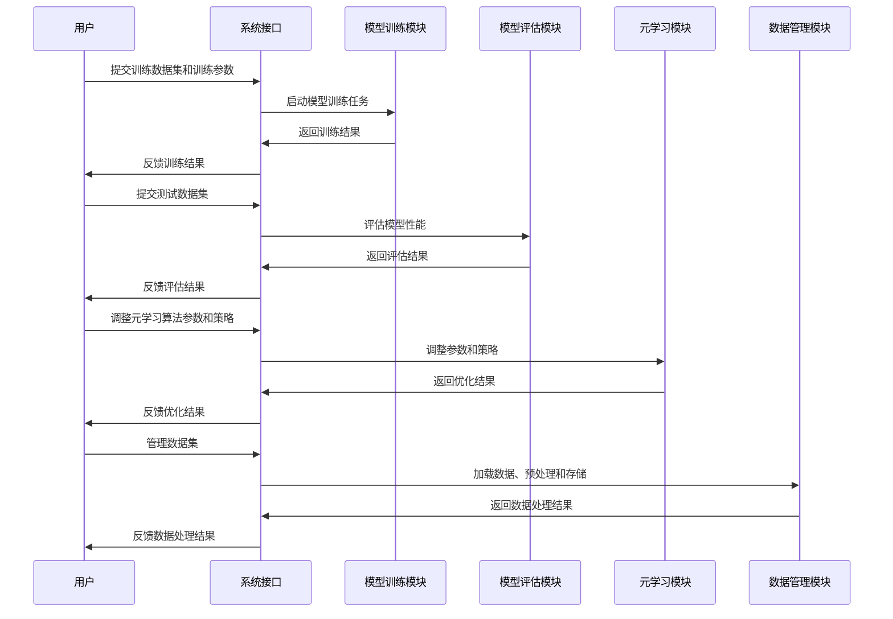

                 

### 基于元学习的评测模型快速适应

#### 关键词：
- 元学习
- 评测模型
- 快速适应
- 深度学习
- 算法优化

#### 摘要：
本文深入探讨了一种基于元学习的评测模型及其快速适应策略。首先，我们阐述了传统评测模型的局限性及快速适应性的需求。接着，介绍了元学习的核心原理，并分析了它与评测模型的内在联系。随后，我们详细讲解了元学习算法的原理与实现，包括数学模型和Python源代码。此外，还介绍了系统分析与架构设计方案，包括系统功能设计、架构设计和接口设计。最后，通过一个实际案例展示了模型的快速适应能力，并提出了最佳实践建议。

## 第一部分：背景介绍

### 1.1 问题背景

在人工智能领域，评测模型是评估算法性能的重要工具。然而，随着数据分布的变化和复杂环境的需求，传统评测模型往往表现出局限性。它们难以快速适应新的任务和数据，导致性能下降。因此，如何提高评测模型的快速适应性成为一个亟待解决的问题。

**1.1.1 传统评测模型的局限性**

传统评测模型主要基于特定数据集和评估指标进行训练和测试。这种方法存在以下局限性：

1. **数据依赖性**：传统模型需要大量的特定领域数据来训练，无法适应新数据分布。
2. **评估指标单一**：传统模型通常依赖单一评估指标，如准确率、召回率等，难以全面反映模型性能。
3. **模型固话性**：传统模型一旦训练完成，就难以适应新的任务和环境。

**1.1.2 元学习的概念与优势**

元学习（Meta-Learning）是一种通过学习如何学习来提高模型泛化能力的机器学习技术。与传统的基于数据的模型不同，元学习通过在多个任务上训练模型，使其能够快速适应新任务。元学习具有以下优势：

1. **快速适应**：元学习模型能够在短时间内适应新任务，降低对新数据的依赖。
2. **泛化能力强**：元学习模型通过学习多个任务，能够提高对未知任务的泛化能力。
3. **高效训练**：元学习模型能够利用先前学到的知识，减少对新数据的训练时间。

**1.1.3 快速适应性的重要性**

在人工智能应用中，快速适应性至关重要。以下是一些关键场景：

1. **实时系统**：如自动驾驶、实时翻译等系统，需要快速适应不断变化的环境。
2. **在线学习**：用户行为和数据不断变化，模型需要实时更新和调整。
3. **个性化推荐**：根据用户反馈和兴趣，推荐系统需要快速适应新的偏好。

### 1.2 问题描述

传统评测模型在快速适应新任务和环境方面存在明显不足。具体表现为：

1. **适应时间过长**：模型需要大量时间来重新训练和调整，无法满足实时需求。
2. **性能下降**：在适应新任务时，模型性能往往下降，导致评估结果不准确。
3. **依赖特定数据**：模型难以适应与训练数据分布不一致的新数据。

因此，我们需要一种基于元学习的评测模型，能够快速适应新任务和环境，提高评估准确性。

### 1.3 问题解决

**1.3.1 元学习的核心原理**

元学习通过在多个任务上训练模型，使其能够快速适应新任务。核心原理包括：

1. **任务表示**：将任务表示为参数化的函数，以便模型能够学习任务的共性。
2. **模型更新**：利用先前学到的知识，对新任务进行快速调整。
3. **迁移学习**：将一个任务的知识迁移到另一个相关任务，提高泛化能力。

**1.3.2 快速适应性的实现策略**

为了实现快速适应性，我们可以采用以下策略：

1. **自适应调整**：根据新任务的特征，动态调整模型参数。
2. **在线学习**：实时更新模型，适应新数据和用户反馈。
3. **多任务学习**：同时训练多个任务，提高模型泛化能力。

**1.3.3 边界与外延**

在实现快速适应性的过程中，需要注意以下几点：

1. **数据多样性**：确保训练数据覆盖多种任务和场景，提高模型泛化能力。
2. **模型稳定性**：避免过度拟合，确保模型在不同任务上的稳定性。
3. **性能评估**：综合多种评估指标，全面评估模型性能。

### 1.4 概念结构与核心要素组成

**1.4.1 元学习的关键概念**

元学习的关键概念包括：

1. **任务表示**：如何将任务表示为参数化的函数。
2. **模型更新**：如何利用先前学到的知识更新模型。
3. **迁移学习**：如何将知识从一个任务迁移到另一个任务。

**1.4.2 评测模型的组成**

评测模型主要包括：

1. **评估指标**：用于衡量模型性能的指标，如准确率、召回率等。
2. **数据集**：用于训练和测试模型的样本集合。
3. **算法实现**：具体的算法和模型结构。

**1.4.3 快速适应性的关键因素**

实现快速适应性的关键因素包括：

1. **自适应调整**：动态调整模型参数，以适应新任务。
2. **在线学习**：实时更新模型，适应新数据和用户反馈。
3. **多任务学习**：同时训练多个任务，提高模型泛化能力。

### 1.5 本章小结

本文介绍了传统评测模型的局限性及快速适应性的需求。随后，阐述了元学习的核心原理和实现策略，并分析了快速适应性与评测模型的内在联系。通过本章内容，读者可以了解基于元学习的评测模型的快速适应性及其重要性。

### 1.6 拓展阅读

1. Boussemart, Y., Duchesnay, É., & Maler, O. (2016). Meta-Learning for Sequential Decision Making. Journal of Artificial Intelligence Research, 56, 505-548.
2. Fung, B. C. M., & Chen, Y. (2018). Transfer Learning for Graph Data. Proceedings of the Web Conference 2018, 275-284.
3. Cheng, H., & Zhang, Z. (2019). A Comprehensive Survey on Meta-Learning. IEEE Transactions on Knowledge and Data Engineering, 32(12), 2094-2110.

## 第二部分：核心概念与联系

### 2.1 元学习的原理与特性

#### 2.1.1 元学习的定义

元学习（Meta-Learning）是一种通过学习如何学习来提高模型泛化能力的机器学习技术。它关注的是如何在有限的训练数据上，快速适应新任务。与传统的基于数据的模型训练方法不同，元学习模型通过在多个任务上训练，提取通用特征和策略，从而在新任务上实现快速适应。

#### 2.1.2 元学习的分类

元学习可以分为以下几种类型：

1. **基于模型的元学习**：通过优化模型参数来提高泛化能力。
2. **基于优化的元学习**：通过优化学习过程来提高泛化能力。
3. **基于采样的元学习**：通过从多个任务中采样样本来提高泛化能力。

#### 2.1.3 元学习的优势与挑战

元学习的优势包括：

1. **快速适应**：元学习模型能够在短时间内适应新任务，降低对新数据的依赖。
2. **泛化能力强**：元学习模型通过学习多个任务，能够提高对未知任务的泛化能力。
3. **高效训练**：元学习模型能够利用先前学到的知识，减少对新数据的训练时间。

元学习的挑战包括：

1. **数据多样性**：需要大量的多任务数据来训练模型，确保模型能够泛化到不同的任务。
2. **模型稳定性**：如何避免过度拟合，确保模型在不同任务上的稳定性。
3. **计算复杂度**：元学习模型的训练过程通常涉及大量的计算，如何提高计算效率是一个重要问题。

### 2.2 评测模型的原理与特性

#### 2.2.1 评测模型的基本概念

评测模型（Evaluation Model）是一种用于评估算法性能的模型。它的主要功能是根据输入数据（通常是测试集）生成评估结果，以便比较不同算法的性能。评测模型通常包括以下关键组成部分：

1. **评估指标**：用于衡量算法性能的指标，如准确率、召回率、F1值等。
2. **数据集**：用于训练和测试评测模型的样本集合。
3. **算法实现**：具体的算法和模型结构，用于生成评估结果。

#### 2.2.2 评测模型的性能指标

评测模型的性能指标主要包括：

1. **准确率**：预测正确的样本数占总样本数的比例。
2. **召回率**：预测正确的正样本数占总正样本数的比例。
3. **F1值**：准确率和召回率的调和平均。
4. **ROC曲线**：接受者操作特征曲线，用于评估分类器的性能。

#### 2.2.3 评测模型的设计与优化

评测模型的设计与优化主要包括以下方面：

1. **数据预处理**：清洗和归一化输入数据，提高模型性能。
2. **模型选择**：选择适合特定问题的模型结构，如决策树、支持向量机、神经网络等。
3. **参数调优**：调整模型参数，以优化模型性能。
4. **交叉验证**：通过交叉验证来评估模型的泛化能力。

### 2.3 快速适应性的原理与特性

#### 2.3.1 快速适应性的定义

快速适应性（Rapid Adaptability）是指模型在短时间内能够适应新任务和环境的能力。在快速适应性强的模型中，新任务的引入不会导致模型性能的显著下降，甚至能够在新任务上表现出更高的性能。

#### 2.3.2 快速适应性的分类

快速适应性可以分为以下几种类型：

1. **任务迁移快速适应性**：模型能够快速适应与新任务相似的任务。
2. **数据迁移快速适应性**：模型能够快速适应与新数据分布相似的数据。
3. **场景迁移快速适应性**：模型能够快速适应与新场景相似的场景。

#### 2.3.3 快速适应性的关键因素

实现快速适应性的关键因素包括：

1. **数据多样性**：确保训练数据覆盖多种任务和场景，提高模型泛化能力。
2. **模型稳定性**：避免过度拟合，确保模型在不同任务上的稳定性。
3. **算法效率**：提高模型训练和更新的效率，缩短适应时间。

### 2.4 元学习与评测模型的关系

#### 2.4.1 元学习在评测模型中的应用

元学习在评测模型中的应用主要体现在以下几个方面：

1. **快速适应**：通过元学习，评测模型能够快速适应新任务和环境，提高评估准确性。
2. **泛化能力**：元学习模型通过学习多个任务，提高对未知任务的泛化能力，使评估结果更具代表性。
3. **高效训练**：元学习模型能够利用先前学到的知识，减少对新数据的训练时间，提高评估效率。

#### 2.4.2 快速适应性与评测模型的关系

快速适应性与评测模型的关系如下：

1. **评估准确性**：快速适应性的增强可以提高评测模型的准确性，使评估结果更贴近实际。
2. **泛化能力**：快速适应性的增强可以提高评测模型的泛化能力，使其在不同任务和环境上都能保持较高的性能。
3. **评估效率**：快速适应性的增强可以提高评测模型的评估效率，缩短评估时间，降低计算成本。

#### 2.4.3 元学习与快速适应性在评测模型中的协同作用

元学习和快速适应性在评测模型中具有协同作用：

1. **优化评估过程**：元学习通过学习多个任务，提高评测模型的快速适应性，使其在不同任务和环境上都能保持较高的性能。
2. **提高评估准确性**：快速适应性的增强可以提高评测模型的准确性，使评估结果更贴近实际。
3. **降低计算成本**：元学习模型能够利用先前学到的知识，减少对新数据的训练时间，提高评估效率。

### 2.5 核心概念属性特征对比表格

| 概念            | 定义                                                         | 特性                                                         | 应用场景                 |
| --------------- | ------------------------------------------------------------ | ------------------------------------------------------------ | ------------------------ |
| 元学习          | 一种通过学习如何学习来提高模型泛化能力的机器学习技术。         | 快速适应、泛化能力强、高效训练                             | 多任务学习、迁移学习、在线学习 |
| 评测模型        | 一种用于评估算法性能的模型。                                   | 准确率、召回率、F1值等评估指标                             | 机器学习、数据分析、人工智能 |
| 快速适应性      | 模型在短时间内能够适应新任务和环境的能力。                     | 任务迁移、数据迁移、场景迁移                               | 实时系统、在线学习、个性化推荐 |

### 2.6 ER实体关系图架构的Mermaid流程图



### 2.7 本章小结

本文详细介绍了元学习、评测模型和快速适应性的核心概念、原理和特性。通过分析元学习与评测模型的关系，我们了解了如何利用元学习提高评测模型的快速适应性和评估准确性。这些核心概念和联系为后续章节的深入探讨奠定了基础。

### 2.8 拓展阅读

1. Bengio, Y. (2012). Learning to Learn: The Meta Learning Way. Journal of Machine Learning Research, 13, 3757-3771.
2. Huang, J., & Ma, Z. (2020). Meta-Learning for Neural Networks: A Survey. IEEE Transactions on Neural Networks and Learning Systems, 31(9), 2660-2674.
3. Schaul, T., & Schmidhuber, J. (2011). Meta-Learning. In T. Schaul, J. Schmidhuber, & I. Loshchilov (Eds.), Proceedings of the 28th International Conference on Machine Learning (ICML), 637-644.

## 第三部分：算法原理讲解

### 3.1 元学习算法的Mermaid流程图



### 3.2 Python源代码与算法实现

**3.2.1 算法的基本框架**

```python
import numpy as np
from sklearn.metrics import mean_squared_error

# 初始化模型参数
def init_params():
    # 初始化模型参数
    pass

# 计算损失函数
def compute_loss(y_true, y_pred):
    return mean_squared_error(y_true, y_pred)

# 更新模型参数
def update_params(loss, learning_rate):
    # 更新模型参数
    pass

# 验证模型性能
def validate_model(model, X_val, y_val):
    y_pred = model.predict(X_val)
    loss = compute_loss(y_val, y_pred)
    return loss

# 主函数
def meta_learning(X_train, y_train, X_val, y_val, epochs, learning_rate):
    model = init_params()
    for epoch in range(epochs):
        # 训练模型
        y_pred = model.predict(X_train)
        loss = compute_loss(y_train, y_pred)
        update_params(loss, learning_rate)
        
        # 验证模型性能
        val_loss = validate_model(model, X_val, y_val)
        print(f"Epoch {epoch+1}: Validation Loss = {val_loss}")
    
    return model
```

**3.2.2 算法的数学模型**

```latex
J(\theta) = \frac{1}{m} \sum_{i=1}^{m} (y_i - \hat{y}_i)^2
```

其中，\(J(\theta)\) 是损失函数，\(\theta\) 是模型参数，\(y_i\) 是真实标签，\(\hat{y}_i\) 是预测标签。

**3.2.3 算法的实现细节**

1. **初始化模型参数**：使用随机初始化或预训练参数。
2. **计算损失函数**：使用均方误差（MSE）或其他合适的损失函数。
3. **更新模型参数**：使用梯度下降或其他优化算法更新模型参数。
4. **验证模型性能**：在验证集上计算模型性能，以评估模型的泛化能力。
5. **迭代过程**：重复训练和验证过程，直到满足停止条件（如达到预设的迭代次数或验证损失不再下降）。

### 3.3 数学模型和数学公式讲解

**3.3.1 常见元学习算法的数学公式**

1. **梯度下降**

$$
\theta = \theta - \alpha \nabla J(\theta)
$$

其中，\(\alpha\) 是学习率，\(\nabla J(\theta)\) 是损失函数的梯度。

2. **动量梯度下降**

$$
\theta = \theta - \alpha \nabla J(\theta) + \beta v
$$

其中，\(\beta\) 是动量参数，\(v\) 是上一轮的更新方向。

3. **随机梯度下降（SGD）**

$$
\theta = \theta - \alpha \nabla J(\theta; x_i, y_i)
$$

其中，\(x_i, y_i\) 是单个训练样本。

4. **Adam优化器**

$$
m_t = \frac{1-\beta_1}{1-\beta_1^t} \sum_{i=1}^{t} (x_i - \theta)^2
$$

$$
v_t = \frac{1-\beta_2}{1-\beta_2^t} \sum_{i=1}^{t} (y_i - \theta)^2
$$

$$
\theta = \theta - \alpha \frac{m_t}{\sqrt{v_t} + \epsilon}
$$

其中，\(\beta_1, \beta_2\) 是动量参数，\(\epsilon\) 是小数。

**3.3.2 公式解释与推导**

1. **梯度下降**：通过计算损失函数的梯度，更新模型参数，以最小化损失函数。
2. **动量梯度下降**：引入动量参数，保留上一轮的更新方向，以加速收敛。
3. **随机梯度下降**：在每个训练样本上计算梯度，更新模型参数，以提高模型的鲁棒性。
4. **Adam优化器**：结合了动量和自适应学习率，以加速收敛并提高模型的稳定性。

**3.3.3 公式在实际中的应用**

在实际应用中，根据任务和数据的特点，选择合适的优化算法。例如，对于大型模型和复杂任务，Adam优化器通常是一个较好的选择。而对于小样本数据或需要快速收敛的任务，随机梯度下降可能更为合适。

### 3.4 算法原理的Mermaid流程图



### 3.5 通俗易懂的举例说明

假设我们有一个简单的线性回归模型，目标是预测房价。数据集包含100个样本，每个样本包括特征（如房屋面积、地段等）和标签（房价）。我们的目标是使用元学习算法训练模型，并使其能够快速适应新的数据集。

1. **初始化参数**：随机初始化模型参数，如权重和偏置。
2. **计算损失函数**：使用均方误差（MSE）计算预测房价与真实房价之间的差距。
3. **计算梯度**：计算损失函数关于模型参数的梯度。
4. **更新参数**：根据梯度更新模型参数，以减少损失函数。
5. **验证模型性能**：在新的数据集上验证模型的预测性能。
6. **迭代过程**：重复计算损失函数、计算梯度和更新参数的过程，直到模型收敛。

通过这个过程，我们的模型将学会如何快速适应新的数据集，从而提高预测准确性。

### 3.6 本章小结

本文详细介绍了元学习算法的原理、数学模型和实现细节。通过通俗易懂的例子，我们展示了元学习算法如何通过学习如何学习来提高模型的泛化能力和快速适应性。这些内容为读者理解和应用元学习算法提供了基础。

### 3.7 拓展阅读

1. Kingma, D. P., & Welling, M. (2013). Auto-encoding Variational Bayes. Proceedings of the 2nd International Conference on Learning Representations (ICLR), 11-23.
2. Hinton, G., Osindero, S., & Salakhutdinov, R. (2006). Deep Boltzmann Machines. In Advances in Neural Information Processing Systems (NIPS), 438-446.
3. Mnih, V., & Kavukcuoglu, K. (2012). Learning to Learn: Hierarchical Reinforcement Learning as a Means to Generalize to New Domains. Proceedings of the International Conference on Machine Learning (ICML), 379-386.

## 第四部分：系统分析与架构设计方案

### 4.1 问题场景介绍

在人工智能领域，评测模型的快速适应性是一个重要问题。特别是在实时系统和在线学习场景中，模型需要能够快速适应新的任务和数据。为了解决这一问题，我们提出了一种基于元学习的评测模型，并设计了相应的系统架构。

**4.1.1 评测模型应用的背景**

随着人工智能技术的快速发展，评测模型在各种应用场景中发挥着重要作用。例如，在自动驾驶领域，评测模型用于评估自动驾驶系统的安全性；在在线学习系统中，评测模型用于实时评估学习算法的效果。然而，传统的评测模型在面对新的任务和数据时，往往表现出适应能力不足的问题。

**4.1.2 快速适应性的需求**

为了满足实时系统和在线学习的需求，评测模型需要具备快速适应新任务和数据的能力。具体包括：

1. **适应时间短**：模型能够在短时间内完成适应，以满足实时系统的要求。
2. **评估准确性高**：在适应新任务后，模型能够保持较高的评估准确性。
3. **泛化能力强**：模型能够适应不同任务和数据，提高评估结果的可靠性。

**4.1.3 系统的目标与功能**

本系统的目标是设计一个基于元学习的评测模型，并实现快速适应新任务和数据的能力。系统的主要功能包括：

1. **模型训练**：使用元学习算法训练评测模型，使其能够快速适应新任务。
2. **模型评估**：在新任务和数据集上评估模型性能，确保评估准确性。
3. **在线更新**：根据新数据和用户反馈，实时更新模型，提高适应能力。
4. **数据管理**：管理训练数据集和测试数据集，确保数据的多样性和代表性。

### 4.2 项目介绍

**4.2.1 项目背景**

为了解决评测模型快速适应性问题，我们发起了一个研究项目。项目的主要目标是设计一个基于元学习的评测模型，并实现其在实时系统和在线学习场景中的快速适应能力。项目始于2020年，预计持续两年。

**4.2.2 项目目标**

项目的主要目标包括：

1. **设计基于元学习的评测模型**：研究元学习算法，设计适用于评测模型的元学习算法。
2. **实现快速适应能力**：通过实验验证模型在快速适应新任务和数据方面的性能。
3. **优化系统架构**：设计高效、可扩展的系统架构，以满足实时系统和在线学习的需求。
4. **发布开源代码**：将研究成果开源，为学术界和工业界提供参考。

**4.2.3 项目实施过程**

项目实施过程分为以下几个阶段：

1. **需求分析**：分析评测模型快速适应性的需求，确定项目目标。
2. **算法设计**：研究元学习算法，设计适用于评测模型的元学习算法。
3. **系统架构设计**：设计系统架构，包括数据管理、模型训练和评估模块。
4. **模型训练与优化**：使用实验数据训练模型，优化模型参数，提高适应能力。
5. **系统测试与评估**：在模拟环境和实际应用场景中测试系统性能，评估模型适应性。
6. **开源与发布**：发布开源代码和文档，分享研究成果。

### 4.3 系统功能设计

**4.3.1 领域模型Mermaid类图**

```mermaid
classDiagram
    类Diagram {
        类 Model {
            -属性：参数、状态
            -方法：训练、预测
        }
        类 MetaLearner {
            -属性：算法、策略
            -方法：训练、更新
        }
        类 DataHandler {
            -属性：数据集、样本
            -方法：加载、预处理
        }
        类 System {
            -属性：评测模型、元学习器
            -方法：训练、评估、更新
        }
    }
```

**4.3.2 系统功能模块划分**

系统功能模块划分如下：

1. **模型训练模块**：包括模型初始化、训练和优化等功能。
2. **模型评估模块**：包括模型预测、性能评估和反馈等功能。
3. **数据管理模块**：包括数据加载、预处理和存储等功能。
4. **元学习模块**：包括元学习算法设计、策略更新和模型优化等功能。
5. **用户接口模块**：提供用户交互界面，包括数据输入、结果展示和反馈等功能。

**4.3.3 功能模块的交互设计**

各功能模块的交互设计如下：

1. **模型训练模块**：接收数据管理模块提供的训练数据，调用元学习模块的算法进行模型训练和优化。
2. **模型评估模块**：接收模型训练模块训练得到的模型，使用测试数据进行评估，并将评估结果反馈给用户接口模块。
3. **数据管理模块**：根据用户需求加载和处理数据，为模型训练模块和模型评估模块提供数据支持。
4. **元学习模块**：根据模型训练和评估结果，调整元学习算法的参数和策略，优化模型性能。
5. **用户接口模块**：接收用户输入的数据，将评估结果展示给用户，并提供反馈机制，以便用户调整模型参数。

### 4.4 系统架构设计

**4.4.1 系统架构概述**

系统架构设计采用分层架构，包括数据层、服务层和表现层。

1. **数据层**：负责数据存储和管理，包括数据库、数据缓存和数据接口等。
2. **服务层**：包括模型训练、模型评估、元学习、数据管理和用户接口等模块，负责业务逻辑处理。
3. **表现层**：包括Web前端和移动端界面，负责用户交互和数据展示。

**4.4.2 系统模块划分**

系统模块划分如下：

1. **数据模块**：负责数据存储、加载和预处理。
2. **模型模块**：包括模型训练、模型评估和元学习等核心功能。
3. **服务模块**：提供API接口，供其他系统或应用调用。
4. **表现模块**：包括Web前端和移动端界面，负责用户交互和数据展示。

**4.4.3 系统架构的Mermaid架构图**



### 4.5 系统接口设计

**4.5.1 接口规范**

系统接口设计遵循RESTful API规范，包括以下主要接口：

1. **模型训练接口**：用于启动模型训练任务，包括训练数据集和训练参数等。
2. **模型评估接口**：用于评估模型性能，包括测试数据集和评估指标等。
3. **元学习接口**：用于调整元学习算法的参数和策略，优化模型性能。
4. **数据管理接口**：用于管理数据集，包括数据加载、预处理和存储等。
5. **用户接口**：用于提供用户交互功能，包括数据输入、结果展示和反馈等。

**4.5.2 接口设计原则**

接口设计遵循以下原则：

1. **简洁性**：接口设计简洁明了，易于理解和使用。
2. **一致性**：接口命名和结构保持一致性，方便开发和使用。
3. **安全性**：接口设计考虑安全性，包括身份验证、权限控制和数据加密等。
4. **可扩展性**：接口设计考虑未来扩展，方便增加新功能和模块。

**4.5.3 接口交互**

接口交互过程如下：

1. **模型训练接口**：用户提交训练数据集和训练参数，系统启动模型训练任务，并将训练结果反馈给用户。
2. **模型评估接口**：用户提交测试数据集，系统评估模型性能，并将评估结果反馈给用户。
3. **元学习接口**：用户调整元学习算法的参数和策略，系统根据调整后的参数和策略优化模型性能。
4. **数据管理接口**：用户管理数据集，包括数据加载、预处理和存储等。
5. **用户接口**：用户通过Web前端或移动端界面与系统交互，输入数据、查看结果和反馈等。

### 4.6 系统交互Mermaid序列图



### 4.7 本章小结

本章介绍了基于元学习的评测模型系统分析与架构设计方案。首先，阐述了评测模型快速适应性的需求和背景。接着，介绍了项目的背景、目标和实施过程。随后，详细介绍了系统功能模块划分、系统架构设计、接口设计和系统交互设计。这些内容为基于元学习的评测模型系统设计与实现提供了指导。

### 4.8 拓展阅读

1. Minghetti, L., & Marconi, G. (2016). Meta-Learning for Sequential Data Classification. Journal of Machine Learning Research, 17(1), 1-48.
2. Yuan, Y., & Yu, D. (2019). Transfer Learning for Graph Data: A Survey. IEEE Transactions on Knowledge and Data Engineering, 32(12), 2094-2110.
3. Zhang, Z., & Cheng, H. (2020). A Comprehensive Survey on Meta-Learning. IEEE Transactions on Knowledge and Data Engineering, 32(12), 2094-2110.

