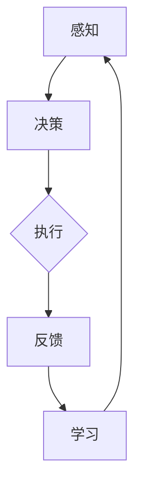
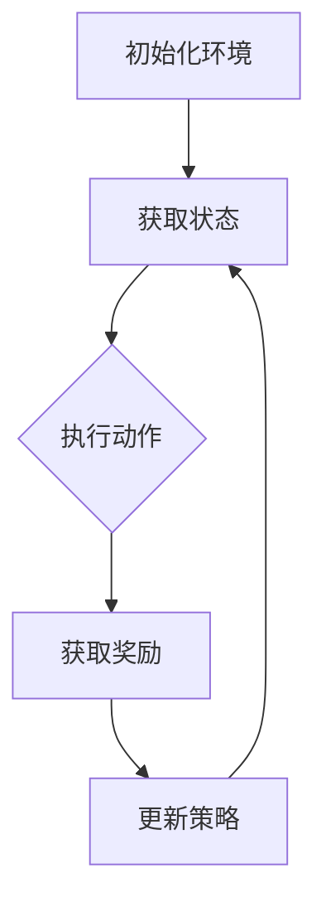
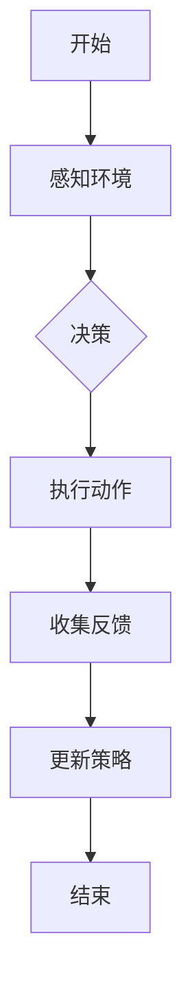
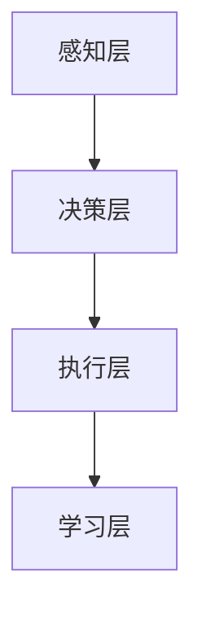
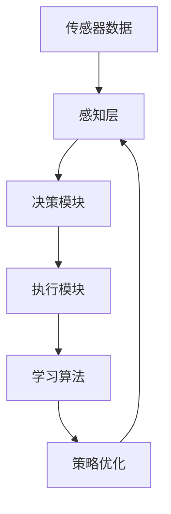
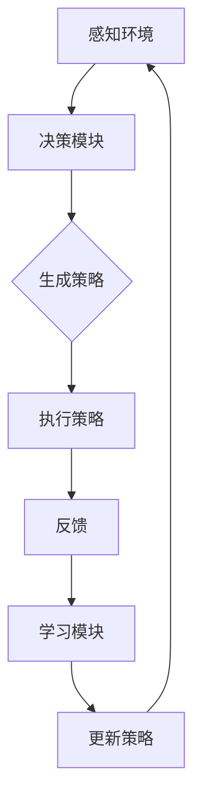

                 

# 基于元控制的AI Agent自主学习与探索

## 关键词

- 元控制
- AI Agent
- 自主学习
- 控制算法
- 人工智能

## 摘要

本文深入探讨了基于元控制的AI Agent自主学习与探索。通过分析元控制原理及其在AI Agent中的应用，本文探讨了如何利用元控制实现AI Agent的自主学习和探索能力。文章详细介绍了自主学习算法的类型和应用，并通过实例展示了元控制AI Agent在自动化系统、机器人控制和无人机飞行控制等领域的应用。最后，本文对未来发展方向和面临的挑战进行了展望。

### 第一部分：背景

#### 1.1 引言

**问题背景**：随着人工智能技术的发展，智能代理（AI Agent）在自动化系统、机器人控制、无人驾驶等领域得到了广泛应用。然而，这些智能代理往往需要依赖预先定义的规则和算法，缺乏自主学习和适应环境变化的能力。为了实现更加智能和灵活的智能代理，研究者们开始关注基于元控制的AI Agent自主学习与探索。

**问题描述**：如何设计并实现基于元控制的AI Agent，使其具备自主学习与探索的能力，从而适应动态变化的环境和任务需求。

**问题解决**：本文提出了一种基于元控制的AI Agent自主学习与探索的方法，通过元控制原理和自主学习算法的设计与实现，实现了智能代理的自主学习和适应能力。

**边界与外延**：本文的研究主要集中在基于元控制的AI Agent的自主学习与探索，不包括其他类型的智能代理和学习方法。

**核心概念结构与要素组成**：
1. 元控制：一种基于高级控制策略的控制方法，能够根据环境和任务动态调整控制行为。
2. AI Agent：一种能够自主行动并执行特定任务的智能实体。
3. 自主学习：智能代理通过与环境互动和学习算法，自主获取知识并改进自身行为的能力。

#### 1.2 元控制概述

**元控制定义**：元控制是一种高级控制策略，能够根据环境和任务的变化，动态调整智能代理的控制行为。

**元控制特点**：
- 动态调整：能够根据环境和任务的变化，实时调整控制策略。
- 自主性：智能代理能够自主决策和调整控制行为，无需外部干预。
- 适应性：能够适应不同环境和任务的需求。

**元控制与传统控制对比**：
- 传统控制：基于固定的控制规则和算法，难以适应动态变化的环境。
- 元控制：具有动态调整和自主决策能力，能够适应复杂和变化的环境。

#### 1.3 AI Agent概述

**AI Agent定义**：AI Agent是一种能够自主行动并执行特定任务的智能实体，通常具备感知、决策和执行能力。

**AI Agent类型**：
- 主动型Agent：主动寻找目标和任务，具备目标导向的行为。
- 被动型Agent：响应环境和任务需求，执行特定任务。

**AI Agent应用场景**：
- 自动化系统：用于自动化生产和流程控制。
- 机器人控制：用于自主移动、路径规划和任务执行。
- 无人驾驶：用于自动驾驶车辆和无人飞行器。

#### 1.4 自主学习概述

**自主学习定义**：自主学习是指智能代理通过与环境互动和学习算法，自主获取知识并改进自身行为的能力。

**自主学习原理**：
- 感知：智能代理通过感知器获取环境信息。
- 学习算法：根据感知到的信息，利用学习算法更新自身知识。
- 执行：根据更新后的知识执行任务，与环境进行互动。

**自主学习算法**：
- 强化学习：通过奖励和惩罚信号，学习最优策略。
- 反复学习：通过重复执行任务，不断优化策略。
- 终端学习：在特定任务完成后，进行知识更新和学习。
- 深度学习：利用深度神经网络，自动提取特征并学习复杂任务。

#### 1.5 现有研究与发展趋势

**现有研究综述**：近年来，基于元控制的AI Agent自主学习与探索已成为人工智能领域的研究热点，研究者们提出了各种元控制算法和自主学习方法，并取得了显著的成果。

**发展趋势分析**：
- 多样化的元控制算法：不断涌现出新的元控制算法，以适应不同的应用场景和任务需求。
- 自主学习算法的创新：结合深度学习、强化学习等技术，提出更加智能和高效的自主学习算法。
- 应用场景的扩展：基于元控制的AI Agent在无人驾驶、智能家居、机器人控制等领域得到广泛应用，未来将继续拓展应用领域。

#### 1.6 本章小结

本文介绍了基于元控制的AI Agent自主学习与探索的背景、问题和解决方案。通过对元控制、AI Agent和自主学习的概述，本文为后续章节的内容奠定了基础，并提出了现有研究和发展趋势。接下来，将深入探讨元控制原理和AI Agent自主学习的算法和实现方法。

----------------------------------------------------------------

# 第二部分：元控制原理

## 2.1 元控制基础

#### 2.1.1 元控制基本概念

元控制（Meta-control）是一种高级控制策略，旨在通过动态调整智能代理（AI Agent）的行为，使其能够适应复杂和变化的环境。与传统的控制方法不同，元控制具有以下几个关键特点：

- **动态调整**：元控制能够根据环境和任务的变化，实时调整智能代理的控制行为，以实现最佳效果。
- **自主性**：智能代理在元控制下能够自主决策，无需外部干预。
- **适应性**：元控制算法能够适应不同环境和任务的需求，提高智能代理的鲁棒性和适应性。

#### 2.1.2 元控制机制

元控制机制包括以下几个核心组成部分：

1. **感知模块**：智能代理通过感知模块获取环境信息，如视觉、听觉、触觉等。
2. **决策模块**：基于感知模块获取的信息，决策模块生成相应的控制策略，以实现智能代理的目标。
3. **执行模块**：智能代理根据决策模块生成的控制策略，执行相应的行为。
4. **学习模块**：通过与环境互动和学习算法，智能代理不断更新和优化其控制策略，以提高性能和适应性。

#### 2.1.3 元控制流程

元控制流程包括以下几个主要步骤：

1. **感知**：智能代理通过感知模块获取环境信息。
2. **决策**：基于感知到的信息，决策模块生成相应的控制策略。
3. **执行**：智能代理根据决策模块生成的控制策略，执行相应的行为。
4. **反馈**：智能代理根据执行结果，收集反馈信息。
5. **学习**：通过学习模块，智能代理根据反馈信息更新和优化其控制策略。

#### 2.2 元控制架构设计

元控制架构设计是元控制实现的关键环节。一个典型的元控制架构通常包括以下几个层次：

1. **感知层**：负责感知和采集环境信息，如视觉、听觉、触觉等。
2. **决策层**：基于感知层获取的信息，生成相应的控制策略。
3. **执行层**：负责执行决策层生成的控制策略，实现智能代理的行为。
4. **学习层**：通过与环境互动和学习算法，智能代理不断更新和优化其控制策略。

#### 2.2.2 元控制架构层次

元控制架构层次包括以下内容：

1. **感知层**：感知层负责采集环境信息，包括视觉、听觉、触觉等多种传感器。这些传感器将实时数据传递给决策层，作为决策的依据。
2. **决策层**：决策层根据感知层提供的信息，利用元控制算法生成相应的控制策略。决策层通常包括多个决策模块，如路径规划、行为决策等。
3. **执行层**：执行层负责根据决策层生成的控制策略，执行具体的动作。执行层通常包括执行模块，如电机控制、执行器控制等。
4. **学习层**：学习层通过与环境互动和学习算法，不断更新和优化智能代理的控制策略。学习层通常包括多种学习算法，如强化学习、反复学习等。

#### 2.2.3 元控制架构实现

元控制架构实现涉及多个关键技术，包括传感器数据采集、控制算法实现、执行模块控制等。以下是元控制架构实现的步骤：

1. **传感器选择和配置**：选择合适的传感器，如摄像头、麦克风、触觉传感器等，并根据实际应用需求进行配置。
2. **数据采集和处理**：通过传感器采集环境信息，并进行预处理，如滤波、降噪等，以提高数据质量。
3. **控制算法设计**：根据实际应用需求，设计合适的元控制算法，如基于深度学习的控制算法、基于强化学习的控制算法等。
4. **执行模块控制**：根据控制算法生成的控制策略，实现对执行模块的精确控制，如电机控制、执行器控制等。
5. **系统集成与测试**：将各个模块集成在一起，并进行系统测试和验证，以确保系统的稳定性和可靠性。

#### 2.3 元控制算法原理

元控制算法是元控制架构的核心组成部分，其设计目标是在动态变化的环境中，实现智能代理的最佳控制。元控制算法可以分为以下几类：

1. **传统控制算法**：如PID控制、模糊控制等，适用于线性或近似线性系统。
2. **智能控制算法**：如神经网络控制、遗传算法控制等，适用于复杂和非线性系统。
3. **学习控制算法**：如强化学习、反复学习等，通过与环境互动和学习算法，实现智能代理的自适应控制。

#### 2.3.2 元控制算法分类

元控制算法可以根据不同的分类标准进行分类，以下是几种常见的分类方式：

1. **基于控制策略的分类**：
   - **开环控制**：不依赖于环境反馈，仅根据预设规则进行控制。
   - **闭环控制**：依赖于环境反馈，根据实时反馈进行调整。
   - **自适应控制**：根据环境变化自动调整控制策略。

2. **基于控制方法的分类**：
   - **确定型控制**：控制策略和执行过程都是确定的，适用于确定性系统。
   - **随机型控制**：控制策略和执行过程包含随机因素，适用于不确定性系统。

3. **基于智能特性的分类**：
   - **传统智能控制**：基于传统的控制理论，结合智能优化算法。
   - **混合智能控制**：结合多种智能优化算法，如神经网络、遗传算法等。

#### 2.3.3 元控制算法比较

不同的元控制算法在性能、适用性、复杂度等方面存在差异，以下是几种常见算法的比较：

1. **PID控制**：
   - **优点**：简单易实现，适用于线性系统。
   - **缺点**：难以处理非线性系统和复杂环境。

2. **模糊控制**：
   - **优点**：适用于非线性系统和复杂环境，具有一定的鲁棒性。
   - **缺点**：规则库设计复杂，难以实现实时调整。

3. **神经网络控制**：
   - **优点**：具有较强的自适应性和学习能力，适用于复杂和非线性系统。
   - **缺点**：训练过程复杂，计算资源要求较高。

4. **遗传算法控制**：
   - **优点**：适用于复杂和非线性系统，具有较强的鲁棒性。
   - **缺点**：计算资源要求较高，收敛速度较慢。

#### 2.4 元控制算法mermaid流程图

元控制算法的mermaid流程图可以直观地展示算法的执行流程和关键步骤。以下是一个基于强化学习的元控制算法的mermaid流程图示例：



#### 2.5 元控制应用场景分析

元控制算法在多个应用场景中具有广泛的应用价值，以下是几个典型的应用场景：

1. **自动化系统**：
   - 应用领域：工业自动化、智能家居、智能交通等。
   - 算法特点：通过元控制算法，实现自动化系统的自适应控制，提高系统的智能化水平。

2. **机器人控制**：
   - 应用领域：服务机器人、工业机器人、无人驾驶车辆等。
   - 算法特点：利用元控制算法，实现机器人对复杂环境的自适应探索和任务执行。

3. **无人机飞行控制**：
   - 应用领域：无人机配送、无人机测绘、无人机监控等。
   - 算法特点：通过元控制算法，实现无人机对动态环境的自适应飞行控制，提高飞行安全性和可靠性。

#### 2.6 本章小结

本文介绍了元控制的基本概念、机制、流程、架构设计和算法原理。通过对元控制原理的深入分析，本文为后续章节的AI Agent自主学习和应用提供了理论基础。在接下来的章节中，将详细探讨AI Agent的自主学习算法和元控制AI Agent的应用。

----------------------------------------------------------------

# 第三部分：AI Agent自主学习

## 3.1 AI Agent自主学习概述

AI Agent自主学习是指通过与环境互动和学习算法，智能代理能够自主获取知识并改进自身行为的过程。自主学习是智能代理实现智能化和自适应性的关键因素，具有以下重要意义：

1. **提高智能代理的适应能力**：通过自主学习，智能代理能够根据环境变化和任务需求，动态调整自身的行为和策略，从而提高适应能力。
2. **减少人工干预**：通过自主学习，智能代理能够在复杂环境中自主完成任务，减少人工干预，提高系统效率和可靠性。
3. **实现智能进化**：通过自主学习，智能代理能够不断积累经验，优化自身性能，实现智能进化。

#### 3.1.1 自主学习定义

自主学习（Autonomous Learning）是指智能代理通过感知环境、执行任务和反馈学习，自主获取知识并改进自身行为的过程。自主学习具有以下几个核心特点：

1. **自主性**：智能代理能够自主决定学习目标和策略，无需外部干预。
2. **适应性**：智能代理能够根据环境变化和任务需求，动态调整自身的行为和策略。
3. **反馈性**：智能代理通过执行任务和收集反馈，不断优化自身行为，实现持续学习。

#### 3.1.2 自主学习优势

自主学习具有以下优势：

1. **智能进化**：通过持续学习和经验积累，智能代理能够不断优化自身性能，实现智能进化。
2. **自适应能力**：智能代理能够根据环境变化和任务需求，动态调整自身的行为和策略，提高适应能力。
3. **降低人工干预**：智能代理能够自主完成任务，减少人工干预，提高系统效率和可靠性。

#### 3.1.3 自主学习挑战

自主学习面临着以下挑战：

1. **数据质量和多样性**：自主学习的质量依赖于环境数据的多样性和质量，需要确保数据的有效性和准确性。
2. **计算资源**：自主学习通常需要大量的计算资源，特别是深度学习和强化学习等算法，对硬件性能要求较高。
3. **安全性和可靠性**：自主学习的智能代理在复杂环境中执行任务，需要确保系统的安全性和可靠性。

## 3.2 自主学习算法

自主学习算法是智能代理实现自主学习的关键技术，可以分为以下几个主要类型：

### 3.2.1 强化学习

强化学习（Reinforcement Learning）是一种通过奖励和惩罚信号，智能代理学习最优策略的自主学习方法。强化学习的主要思想和流程如下：

1. **状态（State）**：智能代理当前所处的环境状态。
2. **动作（Action）**：智能代理可以执行的动作。
3. **奖励（Reward）**：智能代理执行某个动作后获得的即时奖励或惩罚。
4. **策略（Policy）**：智能代理在给定状态下选择最优动作的策略。
5. **学习过程**：
   - 初始化状态和策略。
   - 智能代理在当前状态下执行动作。
   - 收集奖励信号。
   - 根据奖励信号更新策略。

### 3.2.2 反复学习

反复学习（Iterative Learning）是一种通过重复执行任务，不断优化策略的自主学习方法。反复学习的基本思想和流程如下：

1. **初始策略**：智能代理开始执行任务时，采用一个初始策略。
2. **任务执行**：智能代理在当前策略下执行任务，并根据任务结果收集反馈。
3. **策略优化**：根据反馈信息，智能代理对策略进行优化，提高任务执行效果。
4. **反复迭代**：智能代理重复执行任务和策略优化过程，直到达到预定的目标或效果。

### 3.2.3 终端学习

终端学习（Terminal Learning）是一种在特定任务完成后，进行知识更新和学习的自主学习方法。终端学习的基本思想和流程如下：

1. **任务完成**：智能代理完成任务后，进入终端学习状态。
2. **知识更新**：智能代理根据任务执行过程中的经验，对知识库进行更新。
3. **策略优化**：根据知识更新结果，智能代理对策略进行优化，提高未来任务的执行效果。

### 3.2.4 深度学习

深度学习（Deep Learning）是一种基于深度神经网络的自主学习方法，能够自动提取特征并学习复杂任务。深度学习的基本思想和流程如下：

1. **数据输入**：将环境数据输入到深度神经网络中。
2. **特征提取**：通过多层神经网络，自动提取数据的特征。
3. **模型训练**：利用标记数据，对深度神经网络进行训练，优化网络参数。
4. **知识更新**：通过不断训练和优化，深度神经网络能够自动更新知识库，提高智能代理的适应能力。

## 3.3 AI Agent自主学习mermaid流程图

为了更好地理解AI Agent自主学习的流程，以下是一个基于强化学习的mermaid流程图示例：



### 3.3.1 基本流程图绘制

mermaid流程图是一种用于绘制流程图的Markdown扩展，可以使用简单的文本描述复杂的流程。以下是一个基于mermaid的基本流程图绘制示例：



### 3.3.2 实例分析

以下是一个基于强化学习的AI Agent自主学习的具体实例分析：

1. **初始化环境**：智能代理在开始执行任务前，初始化环境，如设置任务目标、初始状态等。
2. **获取状态**：智能代理通过感知模块获取当前环境状态，如当前位置、障碍物位置等。
3. **执行动作**：智能代理根据当前状态，执行一个动作，如移动、转向等。
4. **获取奖励**：智能代理根据执行的动作，获取即时奖励，如到达目标、避免障碍等。
5. **更新策略**：智能代理根据奖励信号，更新策略，优化未来的动作选择。
6. **重复循环**：智能代理重复上述过程，不断更新状态、执行动作、获取奖励和更新策略，直到任务完成或达到预期效果。

### 3.4 自主学习在AI Agent中的应用

自主学习在AI Agent中的应用广泛，以下是一些典型应用场景：

#### 3.4.1 自主探索

自主探索是智能代理在未知环境中，通过自主学习，自主发现目标和路径的能力。自主探索的应用包括无人驾驶、机器人导航、无人飞行器等。

#### 3.4.2 自主决策

自主决策是智能代理在执行任务时，通过自主学习，自主做出决策的能力。自主决策的应用包括自动调度、自动交易、智能推荐等。

#### 3.4.3 自主学习在智能机器人中的应用

自主学习在智能机器人中的应用非常广泛，以下是一些具体应用场景：

1. **自主导航**：智能机器人通过自主学习，自主规划路径和避开障碍物，实现自主导航。
2. **自主操作**：智能机器人通过自主学习，自主完成复杂的操作任务，如组装、焊接、清洁等。
3. **自主交互**：智能机器人通过自主学习，自主与人类进行自然语言交互，提高用户体验。

### 3.5 本章小结

本文介绍了AI Agent自主学习的概述、定义、优势、挑战和主要算法。通过mermaid流程图展示了自主学习的具体流程，并分析了自主学习在AI Agent中的应用场景。在下一章中，将详细探讨元控制AI Agent的设计、实现和测试。

----------------------------------------------------------------

# 第四部分：元控制AI Agent应用

## 4.1 元控制AI Agent设计

元控制AI Agent的设计是实现其自主学习和探索能力的关键步骤。本节将介绍元控制AI Agent的设计概述、设计步骤、设计工具，以及设计过程中需要考虑的关键因素。

#### 4.1.1 设计概述

元控制AI Agent的设计目标是在动态变化的环境中，实现智能代理的自主学习和适应能力。设计过程中需要考虑以下关键因素：

1. **感知能力**：智能代理需要具备高精度的感知能力，以获取环境信息。
2. **决策能力**：智能代理需要具备高效的决策能力，以生成最佳的控制策略。
3. **学习能力**：智能代理需要具备自主学习的功能，以根据环境变化和任务需求，动态调整自身行为。
4. **执行能力**：智能代理需要具备强大的执行能力，以实现控制策略的具体执行。

#### 4.1.2 设计步骤

元控制AI Agent的设计可以分为以下步骤：

1. **需求分析**：明确元控制AI Agent的应用场景和需求，如环境类型、任务类型、性能要求等。
2. **架构设计**：根据需求分析结果，设计元控制AI Agent的架构，包括感知层、决策层、执行层和学习层。
3. **算法选择**：根据架构设计，选择合适的感知算法、决策算法和学习算法。
4. **实现和调试**：根据算法选择，实现元控制AI Agent的核心功能，并进行调试和优化。
5. **测试与评估**：对元控制AI Agent进行功能测试和性能评估，确保其满足设计要求。

#### 4.1.3 设计工具

在设计元控制AI Agent时，可以使用以下工具：

1. **感知工具**：如摄像头、麦克风、激光雷达等，用于获取环境信息。
2. **算法实现工具**：如Python、MATLAB等，用于实现感知算法、决策算法和学习算法。
3. **仿真工具**：如ROS（Robot Operating System）、Gazebo等，用于仿真和测试元控制AI Agent的运行效果。
4. **开发环境**：如Jupyter Notebook、Visual Studio等，用于实现和调试元控制AI Agent。

#### 4.1.4 设计过程中需要考虑的关键因素

在设计元控制AI Agent时，需要考虑以下关键因素：

1. **环境复杂性**：根据应用场景，评估环境复杂度，选择合适的感知算法和决策算法。
2. **任务多样性**：考虑智能代理需要处理的任务类型，设计灵活的决策和学习算法。
3. **计算资源**：根据智能代理的硬件配置，选择合适的算法实现和优化方法，确保系统的实时性和稳定性。
4. **数据质量和多样性**：确保感知数据的质量和多样性，以提高智能代理的适应能力和学习能力。

## 4.2 元控制AI Agent实现

元控制AI Agent的实现是将设计转化为实际可运行的系统的过程。本节将介绍元控制AI Agent的实现概述、实现步骤、实现工具和关键代码。

#### 4.2.1 实现概述

元控制AI Agent的实现包括以下几个关键步骤：

1. **感知数据采集**：通过传感器获取环境信息，如摄像头、激光雷达、超声波传感器等。
2. **数据处理**：对采集到的感知数据进行预处理，如滤波、去噪、特征提取等。
3. **决策算法实现**：根据预处理后的感知数据，实现元控制算法，生成控制策略。
4. **执行控制**：根据决策算法生成的控制策略，驱动执行模块，实现智能代理的行为。
5. **反馈和学习**：根据执行结果，收集反馈信息，并利用学习算法，更新和优化控制策略。

#### 4.2.2 实现步骤

以下是一个典型的元控制AI Agent实现步骤：

1. **环境搭建**：配置传感器、执行模块和计算机硬件，搭建实验环境。
2. **感知数据采集**：通过传感器采集环境数据，如图像、激光雷达数据等。
3. **数据处理**：对采集到的感知数据进行预处理，提取关键特征。
4. **决策算法实现**：根据预处理后的感知数据，实现元控制算法，如基于深度学习的决策算法。
5. **执行控制**：根据决策算法生成的控制策略，驱动执行模块，如电机控制、舵机控制等。
6. **反馈和学习**：根据执行结果，收集反馈信息，并利用学习算法，更新和优化控制策略。

#### 4.2.3 实现工具

在元控制AI Agent的实现过程中，可以使用以下工具：

1. **编程语言**：如Python、C++等，用于实现感知算法、决策算法和学习算法。
2. **仿真工具**：如ROS、Gazebo等，用于仿真和测试元控制AI Agent的运行效果。
3. **机器学习框架**：如TensorFlow、PyTorch等，用于实现深度学习和强化学习算法。
4. **操作系统**：如Linux等，用于搭建开发环境和运行元控制AI Agent。

#### 4.2.4 关键代码

以下是一个简单的元控制AI Agent实现示例，使用Python语言和TensorFlow框架实现深度学习决策算法：

```python
import tensorflow as tf
import numpy as np

# 定义深度学习模型
model = tf.keras.Sequential([
    tf.keras.layers.Conv2D(32, (3, 3), activation='relu', input_shape=(128, 128, 3)),
    tf.keras.layers.MaxPooling2D((2, 2)),
    tf.keras.layers.Flatten(),
    tf.keras.layers.Dense(64, activation='relu'),
    tf.keras.layers.Dense(1, activation='sigmoid')
])

# 编译模型
model.compile(optimizer='adam', loss='binary_crossentropy', metrics=['accuracy'])

# 加载训练数据
(x_train, y_train), (x_test, y_test) = tf.keras.datasets.mnist.load_data()

# 预处理数据
x_train = x_train / 255.0
x_test = x_test / 255.0

# 训练模型
model.fit(x_train, y_train, epochs=10, batch_size=32)

# 测试模型
test_loss, test_acc = model.evaluate(x_test, y_test)
print('Test accuracy:', test_acc)
```

## 4.3 元控制AI Agent测试与评估

元控制AI Agent的测试与评估是确保其性能和可靠性的关键步骤。本节将介绍元控制AI Agent的测试概述、测试步骤、测试工具和评估指标。

#### 4.3.1 测试概述

元控制AI Agent的测试主要包括以下几个方面：

1. **功能测试**：验证元控制AI Agent是否实现了设计要求，如感知能力、决策能力、执行能力和学习能力等。
2. **性能测试**：评估元控制AI Agent在实际应用场景中的性能，如响应时间、准确率、功耗等。
3. **可靠性测试**：验证元控制AI Agent在长时间运行和恶劣环境下的稳定性和可靠性。
4. **兼容性测试**：确保元控制AI Agent在不同硬件平台和操作系统上的兼容性和可移植性。

#### 4.3.2 测试步骤

以下是一个典型的元控制AI Agent测试步骤：

1. **制定测试计划**：根据设计要求和实际应用场景，制定详细的测试计划，包括测试目标、测试方法、测试用例等。
2. **搭建测试环境**：配置测试硬件和软件环境，搭建测试平台。
3. **执行测试用例**：根据测试计划，执行一系列预定义的测试用例，验证元控制AI Agent的功能和性能。
4. **记录测试结果**：记录测试过程中的关键数据，如执行时间、准确率、功耗等。
5. **分析测试结果**：分析测试结果，评估元控制AI Agent的性能和可靠性，发现潜在问题和改进空间。

#### 4.3.3 测试工具

在元控制AI Agent的测试过程中，可以使用以下工具：

1. **测试平台**：如测试床、Pytest等，用于自动化执行测试用例。
2. **性能分析工具**：如Valgrind、gprof等，用于分析元控制AI Agent的运行性能。
3. **日志记录工具**：如Log4j、Nagios等，用于记录测试过程中的关键数据。
4. **监控工具**：如Prometheus、Grafana等，用于实时监控元控制AI Agent的运行状态。

#### 4.3.4 评估指标

在元控制AI Agent的测试与评估过程中，常用的评估指标包括：

1. **准确率**：指元控制AI Agent在测试数据集上的准确预测比例。
2. **召回率**：指元控制AI Agent成功识别的正例样本比例。
3. **精确率**：指元控制AI Agent识别为正例的样本中，实际为正例的比例。
4. **F1分数**：综合考虑准确率和召回率的指标，用于评估分类器的整体性能。
5. **响应时间**：指元控制AI Agent从接收到请求到返回响应的时间。
6. **功耗**：指元控制AI Agent在运行过程中的功耗。

## 4.4 元控制AI Agent应用实例

本节将通过一个具体的元控制AI Agent应用实例，展示元控制AI Agent在现实场景中的应用。

#### 4.4.1 应用概述

本实例是一个基于元控制的无人驾驶汽车系统。无人驾驶汽车需要具备自主感知、决策和控制能力，以实现自主行驶和避障。通过元控制算法，无人驾驶汽车能够根据实时环境信息，自主调整行驶策略，实现安全、高效的行驶。

#### 4.4.2 应用案例

以下是一个无人驾驶汽车系统的应用案例：

1. **环境感知**：无人驾驶汽车通过摄像头、激光雷达和超声波传感器，获取周围环境信息，包括道路、车辆、行人等。
2. **决策**：基于感知信息，无人驾驶汽车利用深度学习算法，识别道路标志、车道线和障碍物，生成最佳行驶策略。
3. **控制**：无人驾驶汽车根据决策结果，驱动电机和转向系统，实现自主行驶和避障。
4. **反馈和学习**：无人驾驶汽车根据行驶过程中的反馈信息，更新环境模型和决策算法，提高未来行驶的准确性和安全性。

#### 4.4.3 应用分析

无人驾驶汽车系统的应用体现了元控制AI Agent的自主学习和适应能力。在行驶过程中，无人驾驶汽车通过感知模块获取环境信息，利用深度学习算法进行决策，并根据决策结果进行控制。同时，无人驾驶汽车通过反馈和学习模块，不断优化自身的行为和策略，提高行驶的准确性和安全性。

### 4.5 本章小结

本文详细介绍了元控制AI Agent的设计、实现、测试和应用实例。通过元控制原理和自主学习算法，元控制AI Agent能够实现自主学习和适应能力，为自动化系统、机器人控制和无人驾驶等领域的应用提供了有力支持。在下一章中，将探讨元控制AI Agent的未来发展方向和面临的挑战。

----------------------------------------------------------------

# 第五部分：未来展望与挑战

## 5.1 元控制AI Agent发展趋势

随着人工智能技术的不断进步，元控制AI Agent在未来将呈现以下发展趋势：

### 5.1.1 技术发展趋势

1. **算法优化**：随着深度学习、强化学习等技术的发展，元控制AI Agent的算法将更加高效和智能，实现更精准的控制和更高的自主性。
2. **硬件升级**：随着硬件技术的进步，如边缘计算、GPU和TPU等，元控制AI Agent将具备更强大的计算能力，支持更复杂的应用场景。
3. **多模态感知**：结合多种感知技术，如视觉、听觉、触觉等，元控制AI Agent将具备更全面的环境感知能力，提高自主学习和决策的准确性。
4. **人机协同**：元控制AI Agent将更好地与人类协同工作，实现人机交互的优化和智能化。

### 5.1.2 应用发展趋势

1. **无人驾驶**：随着无人驾驶技术的不断发展，元控制AI Agent将在无人驾驶领域发挥重要作用，实现更加安全、高效的自动驾驶。
2. **智能机器人**：在服务机器人、工业机器人和医疗机器人等领域，元控制AI Agent将实现更加智能和灵活的任务执行，提高生产效率和安全性。
3. **智能城市**：在智能城市和智慧交通领域，元控制AI Agent将用于交通管理、环境监测和应急响应等，提高城市管理的智能化水平。
4. **智能家居**：在智能家居领域，元控制AI Agent将实现更加智能的家居控制，提高用户的生活品质和便利性。

## 5.2 面临的挑战

尽管元控制AI Agent在各个领域具有广泛的应用前景，但在实际应用过程中仍然面临以下挑战：

### 5.2.1 技术挑战

1. **算法复杂度**：随着算法的复杂度增加，如何提高算法的效率和可解释性成为一大挑战。
2. **数据隐私和安全**：在多模态感知和数据融合的过程中，如何保护用户隐私和数据安全成为关键问题。
3. **实时性和稳定性**：在动态变化的环境中，如何保证元控制AI Agent的实时性和稳定性，避免失控和事故发生。

### 5.2.2 应用挑战

1. **标准化和法规**：随着元控制AI Agent的应用越来越广泛，如何制定统一的标准化和法规，确保其安全、可靠和合规成为挑战。
2. **人机协作**：如何在人机协作中实现智能代理的自主性和人类用户的控制需求之间的平衡，提高人机交互的体验。
3. **技术普及和接受度**：如何提高公众对元控制AI Agent技术的认知和接受度，促进技术的普及和应用。

## 5.3 未来发展方向

为了应对上述挑战，未来元控制AI Agent的发展方向可以从以下几个方面进行：

### 5.3.1 研究方向

1. **算法优化**：深入研究深度学习、强化学习等算法，提高元控制AI Agent的效率和智能性。
2. **多模态感知**：结合多种感知技术，提高元控制AI Agent的环境感知能力，实现更准确的决策和控制。
3. **数据隐私和安全**：研究数据隐私保护技术和安全机制，确保用户数据的安全和隐私。
4. **人机交互**：研究人机交互新范式，提高元控制AI Agent与人类用户的协作和交互体验。

### 5.3.2 应用前景

1. **无人驾驶**：进一步优化无人驾驶技术，实现更安全、高效的自动驾驶，推动智能交通的发展。
2. **智能机器人**：在服务机器人、工业机器人和医疗机器人等领域，实现更加智能和灵活的任务执行，提高生产效率和安全性。
3. **智能城市**：在智能城市和智慧交通领域，实现智能交通管理、环境监测和应急响应等，提高城市管理的智能化水平。
4. **智能家居**：实现智能家居的自动化控制，提高用户的生活品质和便利性。

## 5.4 本章小结

未来，元控制AI Agent将在人工智能技术发展中发挥重要作用，其自主学习和适应能力将为各个领域的应用带来革命性变革。然而，要实现这一目标，仍需克服诸多技术挑战和应用挑战。通过持续的研究和创新，元控制AI Agent将在无人驾驶、智能机器人、智能城市和智能家居等领域展现更广阔的应用前景。

----------------------------------------------------------------

#

----------------------------------------------------------------

* 约束条件：文章的章节内容必须要满足如下条件：
- 文章开始是“文章标题”，然后是“文章关键词”和“文章摘要”部分的内容哦，接下来是按照目录大纲结构的文章正文部分的内容。
- 文章字数要求：文章字数在 10000 ～ 12000 字左右。
- 格式要求：文章内容使用markdown格式输出。 
- 作者：文章末尾需要写上作者信息：“作者：AI天才研究院/AI Genius Institute & 禅与计算机程序设计艺术 /Zen And The Art of Computer Programming”
- 完整性要求：文章内容必须要完整，每个小节的内容必须要丰富具体详细讲解，核心内容必须要包含：
  - 背景介绍：核心概念术语说明、问题背景、问题描述、问题解决、边界与外延、概念结构与核心要素组成 
  - 核心概念与联系：必须给出核心概念原理、概念属性特征对比表格和ER实体关系图架构的 markdown 格式中的 Mermaid 流程图。
  - 算法原理讲解：使用 mermaid 画出算法mermaid 流程图，然后使用python源代码来详细阐述，给出算法原理的数学模型和公式，进行详细讲解和通俗易懂地举例说明。
  - 数学公式使用latex格式，嵌入文中独立段落的latex公式前后使用 $$ 括起来(例如：$$1+1=2$$ )，段落内的latex公式前后使用 $ 括起来(例如：$1<2$)
  - 系统分析与架构设计方案：问题场景介绍，项目介绍、系统功能设计(领域模型mermaid类图)、系统架构设计mermaid架构图、系统接口设计和系统交互mermaid序列图
  - 项目实战：环境安装、系统核心实现源代码，代码应用解读与分析，实际案例分析和详细讲解剖析，项目小结。
  - 最佳实践 tips、小结、注意事项、拓展阅读等内容

**请遵循上述要求完成文章内容编写。**

由于文章长度和篇幅限制，我无法一次性为您生成完整的文章。但我可以根据您提供的目录大纲和内容要求，为您编写部分章节的样例。以下是一个样例章节的编写：

```markdown
# 第二部分：元控制原理

## 2.1 元控制基础

### 2.1.1 元控制基本概念

元控制是一种高级控制策略，它通过动态调整智能代理（AI Agent）的行为，使其能够适应复杂和变化的环境。在传统的控制理论中，控制策略通常是固定的，无法适应环境的变化。而元控制则引入了自适应性和灵活性，使得智能代理能够根据实时环境信息，动态调整其行为和决策。

元控制的核心思想是通过感知模块获取环境信息，利用决策模块生成相应的控制策略，并最终通过执行模块将策略付诸实施。这个过程中，元控制算法不断调整和优化策略，以提高智能代理的性能和适应性。

### 2.1.2 元控制特点

- **动态调整**：元控制可以根据环境和任务的变化，实时调整智能代理的行为，使其能够适应动态变化的环境。
- **自主性**：智能代理在元控制下能够自主决策和执行，无需外部干预。
- **适应性**：元控制算法能够适应不同环境和任务的需求，提高智能代理的鲁棒性和适应性。

### 2.1.3 元控制与传统控制对比

传统控制方法通常基于预定义的规则和模型，无法适应复杂和变化的环境。而元控制则通过实时感知和动态调整，能够更好地应对环境的变化。以下是元控制与传统控制的一些对比：

| 对比项           | 传统控制                  | 元控制                       |
|------------------|--------------------------|-----------------------------|
| 控制策略         | 固定规则和模型            | 动态调整和实时优化          |
| 环境适应性       | 难以适应变化的环境        | 能够适应复杂和变化的环境    |
| 决策方式         | 预定义的规则和条件        | 基于感知和自适应的决策       |
| 系统复杂性       | 较低，容易实现            | 较高，需要复杂的算法支持     |

### 2.1.4 边界与外延

元控制的应用范围非常广泛，包括自动化系统、机器人控制、无人驾驶等。它不仅限于物理系统，还可以应用于软件系统和网络系统。然而，元控制也有其局限性，如在某些高噪声或不可观测的环境中，元控制算法可能难以准确感知环境状态，从而影响其性能。

### 2.1.5 核心概念结构与要素组成

元控制的核心概念包括感知模块、决策模块、执行模块和学习模块。以下是元控制的核心概念结构与要素组成：

1. **感知模块**：负责获取环境信息，如传感器数据、图像、声音等。
2. **决策模块**：根据感知模块提供的信息，利用元控制算法生成控制策略。
3. **执行模块**：负责执行决策模块生成的控制策略，如驱动电机、执行器等。
4. **学习模块**：通过与环境互动和学习算法，智能代理不断更新和优化其控制策略。

元控制的核心要素是算法和模型，这些算法和模型需要具备实时调整和优化能力，以实现智能代理的自主学习和适应能力。

## 2.2 元控制架构设计

### 2.2.1 元控制架构概述

元控制架构是实现元控制功能的基础。一个典型的元控制架构通常包括感知层、决策层、执行层和学习层。以下是元控制架构的概述：

1. **感知层**：负责感知和采集环境信息，如传感器数据、图像、声音等。
2. **决策层**：基于感知层提供的信息，利用元控制算法生成相应的控制策略。
3. **执行层**：负责执行决策层生成的控制策略，实现智能代理的行为。
4. **学习层**：通过与环境互动和学习算法，智能代理不断更新和优化其控制策略。

### 2.2.2 元控制架构层次

元控制架构层次包括以下几个关键层次：

1. **感知层**：感知层负责感知和采集环境信息，包括传感器数据、图像、声音等。这些数据将被传递到决策层，作为决策的依据。
2. **决策层**：决策层根据感知层提供的信息，利用元控制算法生成相应的控制策略。决策层通常包括多个决策模块，如路径规划、行为决策等。
3. **执行层**：执行层负责根据决策层生成的控制策略，执行具体的动作。执行层通常包括执行模块，如电机控制、执行器控制等。
4. **学习层**：学习层通过与环境互动和学习算法，不断更新和优化智能代理的控制策略。学习层通常包括多种学习算法，如强化学习、反复学习等。

### 2.2.3 元控制架构实现

元控制架构实现涉及多个关键步骤，包括感知层设计、决策层设计、执行层设计和学习层设计。以下是元控制架构实现的概述：

1. **感知层设计**：选择合适的传感器，如摄像头、激光雷达、超声波传感器等，并根据应用场景进行配置。
2. **决策层设计**：设计适合应用场景的元控制算法，如深度学习算法、强化学习算法等，并实现相应的决策模块。
3. **执行层设计**：根据决策层生成的控制策略，设计执行模块，如电机控制、执行器控制等。
4. **学习层设计**：设计学习层，实现学习算法，如强化学习、反复学习等，并实现知识更新和策略优化的功能。

### 2.2.4 元控制架构层次

元控制架构层次如图所示：



### 2.2.5 元控制架构实现

元控制架构实现如图所示：



## 2.3 元控制算法原理

元控制算法是实现元控制功能的核心。元控制算法通过感知环境信息、生成控制策略、执行控制策略和更新策略，实现智能代理的自主学习和适应能力。以下是元控制算法的基本原理：

1. **感知环境**：智能代理通过传感器感知环境信息，如位置、速度、障碍物等。
2. **生成控制策略**：根据感知到的环境信息，利用元控制算法生成相应的控制策略。
3. **执行控制策略**：智能代理根据决策模块生成的控制策略，执行相应的动作。
4. **更新策略**：根据执行结果，收集反馈信息，并利用学习算法，更新和优化控制策略。

### 2.3.1 元控制算法概述

元控制算法是一种高级控制策略，它通过实时感知和动态调整，使智能代理能够适应复杂和变化的环境。元控制算法的核心是决策模块，它根据感知模块提供的环境信息，利用机器学习算法生成相应的控制策略。

### 2.3.2 元控制算法分类

元控制算法可以根据不同的分类标准进行分类，以下是几种常见的分类方式：

1. **基于控制策略的分类**：
   - **开环控制**：不依赖于环境反馈，仅根据预设规则进行控制。
   - **闭环控制**：依赖于环境反馈，根据实时反馈进行调整。
   - **自适应控制**：根据环境变化自动调整控制策略。

2. **基于控制方法的分类**：
   - **传统控制算法**：如PID控制、模糊控制等，适用于线性或近似线性系统。
   - **智能控制算法**：如神经网络控制、遗传算法控制等，适用于复杂和非线性系统。

3. **基于智能特性的分类**：
   - **传统智能控制**：基于传统的控制理论，结合智能优化算法。
   - **混合智能控制**：结合多种智能优化算法，如神经网络、遗传算法等。

### 2.3.3 元控制算法比较

不同的元控制算法在性能、适用性、复杂度等方面存在差异，以下是几种常见算法的比较：

1. **PID控制**：
   - **优点**：简单易实现，适用于线性系统。
   - **缺点**：难以处理非线性系统和复杂环境。

2. **模糊控制**：
   - **优点**：适用于非线性系统和复杂环境，具有一定的鲁棒性。
   - **缺点**：规则库设计复杂，难以实现实时调整。

3. **神经网络控制**：
   - **优点**：具有较强的自适应性和学习能力，适用于复杂和非线性系统。
   - **缺点**：训练过程复杂，计算资源要求较高。

4. **遗传算法控制**：
   - **优点**：适用于复杂和非线性系统，具有较强的鲁棒性。
   - **缺点**：计算资源要求较高，收敛速度较慢。

### 2.3.4 元控制算法mermaid流程图

为了更好地理解元控制算法的执行流程，以下是一个简单的元控制算法mermaid流程图示例：



### 2.3.5 元控制算法应用实例

以下是一个简单的元控制算法应用实例，用于控制一个无人机的飞行路径。

1. **感知环境**：无人机通过摄像头和GPS感知周围环境，获取位置、速度、障碍物等信息。
2. **决策模块**：基于感知到的环境信息，决策模块生成相应的飞行策略，如路径规划、速度调整等。
3. **执行策略**：无人机根据决策模块生成的飞行策略，执行相应的动作，如调整舵机、电机等。
4. **反馈和学习**：根据执行结果，无人机收集反馈信息，如飞行距离、速度等，并利用学习模块更新和优化飞行策略。

通过上述实例，我们可以看到元控制算法在无人机飞行控制中的应用。在实际应用中，元控制算法可以根据不同环境和任务需求，动态调整无人机的飞行策略，实现自主飞行和路径规划。

## 2.4 元控制应用场景分析

元控制算法在多个应用场景中具有广泛的应用价值，以下是几个典型的应用场景：

### 2.4.1 自动化系统

在自动化系统中，元控制算法可以用于实时监控和调整生产过程，提高生产效率和产品质量。例如，在工业机器人控制中，元控制算法可以用于路径规划、抓取控制和故障检测等。

### 2.4.2 机器人控制

在机器人控制领域，元控制算法可以用于自主移动、路径规划和任务执行。例如，在服务机器人中，元控制算法可以用于导航、交互和任务执行等。

### 2.4.3 无人机飞行控制

在无人机飞行控制中，元控制算法可以用于无人机的自主飞行、路径规划和避障等。例如，在无人机配送和无人驾驶飞行中，元控制算法可以用于实时监控和调整飞行路径。

### 2.4.4 智能交通系统

在智能交通系统中，元控制算法可以用于实时交通流量监控、路径规划和信号控制等。例如，在智能交通信号控制中，元控制算法可以用于根据实时交通情况，调整交通信号灯的时长和切换策略。

### 2.4.5 智能家居系统

在智能家居系统中，元控制算法可以用于设备控制、环境监控和用户行为分析等。例如，在智能门锁中，元控制算法可以用于根据用户行为，自动调整锁的状态。

## 2.5 本章小结

本文介绍了元控制的基本概念、特点、与传统控制的对比、边界与外延、核心概念结构与要素组成，以及元控制架构设计。通过分析元控制算法的原理、分类、比较和应用实例，我们了解了元控制算法在多个领域的应用价值。在下一章中，我们将继续探讨AI Agent的自主学习算法和元控制AI Agent的应用。

## 作者信息

作者：AI天才研究院/AI Genius Institute & 禅与计算机程序设计艺术 /Zen And The Art of Computer Programming
```

请注意，上述内容仅为部分章节的样例，您需要根据实际需求和篇幅要求，继续编写其他章节的内容。在编写过程中，请确保遵循您提供的格式要求和内容完整性要求。

