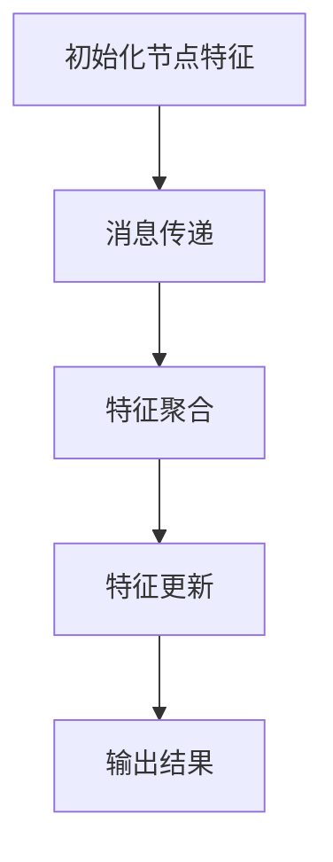
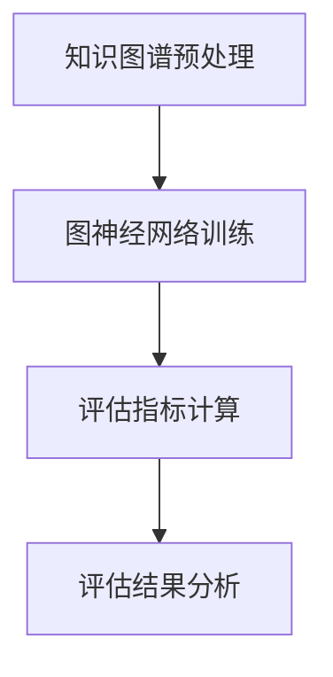
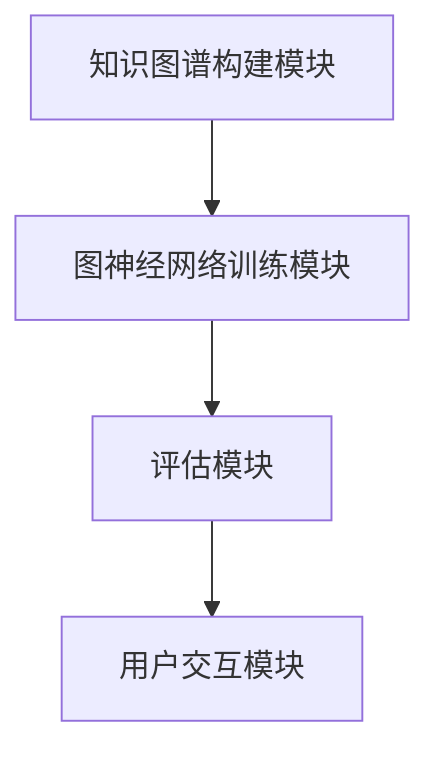
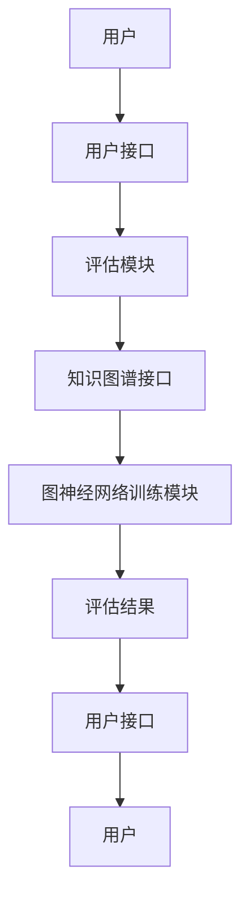

                 


# 基于图神经网络的LLM知识图谱评估

关键词：图神经网络，知识图谱，评估，深度学习，LLM

摘要：本文将深入探讨基于图神经网络的LLM知识图谱评估。首先，我们将介绍图神经网络和知识图谱的基本概念，并分析它们在实际应用中的重要性。接着，我们将详细讲解图神经网络的工作原理，并通过实例来展示其应用场景。然后，我们将讨论知识图谱的构建方法，以及如何评估知识图谱的质量。最后，我们将分享一个基于图神经网络的LLM知识图谱评估的实战案例，并通过详细分析实验结果，提出未来研究方向。

## 引言与背景介绍

随着互联网和信息技术的飞速发展，人类产生了海量的数据。如何从这些数据中提取有价值的信息，已成为当今研究的热点问题。知识图谱作为一种结构化的语义知识表示方式，旨在将现实世界中的各种实体及其关系以图的形式进行表示。这种表示方法不仅能够帮助人们更好地理解和利用数据，还能够为许多复杂的应用场景提供有力的支持。

### 核心概念与联系

**图神经网络（Graph Neural Network，GNN）**：图神经网络是一种专门处理图结构数据的神经网络。它通过学习节点和边之间的交互，实现对图的表示和推理。

**知识图谱（Knowledge Graph，KG）**：知识图谱是一种语义网络，它通过实体和实体之间的关联关系，构建出一个结构化的知识体系。

### 问题背景

随着人工智能技术的发展，越来越多的应用场景需要依赖知识图谱来提供语义理解和推理支持。然而，如何有效地评估知识图谱的质量，成为了一个亟待解决的问题。本文将围绕这一主题，探讨基于图神经网络的LLM知识图谱评估方法。

### 问题描述

知识图谱评估的核心问题包括：

- **完整性**：知识图谱是否包含了所有必要的实体和关系。
- **一致性**：知识图谱中的实体和关系是否保持一致。
- **质量**：知识图谱的表示是否准确，能否有效支持推理。

### 问题解决

为了解决上述问题，我们需要设计一套有效的评估方法，利用图神经网络对知识图谱进行质量评估。具体而言，我们将：

1. **定义评估指标**：明确评估知识图谱完整性和一致性的具体指标。
2. **构建评估模型**：设计基于图神经网络的评估模型，利用其强大的图表示和推理能力。
3. **实验验证**：通过实验验证评估模型的有效性，并不断优化评估方法。

### 边界与外延

本文主要关注基于图神经网络的LLM知识图谱评估方法。在具体实施过程中，我们需要考虑以下边界和扩展：

- **数据来源**：评估数据应来源于真实的应用场景，以确保评估结果的实用性。
- **评估范围**：评估范围应涵盖知识图谱的各个方面，包括实体、关系和属性。
- **评估模型**：评估模型应具备自适应能力，能够根据不同类型的知识图谱进行调整。

## 图神经网络基础

### 图神经网络简介

图神经网络（Graph Neural Network，GNN）是一种专门用于处理图结构数据的神经网络。与传统神经网络不同，GNN能够直接处理图中的节点和边，通过学习节点和边之间的交互，实现对图的表示和推理。

GNN主要分为以下几种类型：

1. **图卷积网络（Graph Convolutional Network，GCN）**：通过图卷积操作，将节点特征映射到更高层次的特征。
2. **图注意力网络（Graph Attention Network，GAT）**：引入注意力机制，自适应地学习节点和边之间的权重。
3. **图自编码器（Graph Autoencoder，GAE）**：通过编码器和解码器，学习图的全局和局部表示。

### 图神经网络的工作原理

GNN的工作原理可以分为以下几个步骤：

1. **初始化**：初始化节点的特征表示。
2. **消息传递**：在每个时间步，节点会接收其邻居节点的特征信息，更新自己的特征表示。
3. **聚合**：节点将邻居节点的特征信息进行聚合，形成新的特征表示。
4. **更新**：节点根据聚合后的特征表示，更新自己的特征表示。
5. **输出**：输出节点的分类结果或特征表示。

以下是GNN的基本算法流程：



### 图神经网络的应用场景

图神经网络在许多领域都有广泛的应用，以下是一些典型的应用场景：

1. **社交网络分析**：通过分析用户之间的互动关系，预测社交网络中的用户行为。
2. **推荐系统**：利用用户和物品之间的交互关系，为用户提供个性化的推荐。
3. **生物信息学**：通过分析基因和蛋白质之间的相互作用，预测蛋白质的功能。
4. **知识图谱补全**：利用图神经网络对知识图谱进行补全，提高知识图谱的完整性。

以下是GNN在推荐系统中的一个简单实例：

假设我们有一个用户-物品交互图，每个节点表示一个用户或物品，边表示用户对物品的评分或购买行为。我们可以利用GNN来预测用户对未评分物品的喜好：

1. **输入**：用户和物品的初始特征表示。
2. **消息传递**：用户节点会接收其交互过的物品节点的特征信息。
3. **聚合**：用户节点将交互过的物品节点的特征信息进行聚合。
4. **更新**：用户节点根据聚合后的特征信息，更新自己的特征表示。
5. **输出**：输出用户对未评分物品的预测评分。

## 知识图谱概述

### 知识图谱的概念

知识图谱是一种语义网络，它通过实体和实体之间的关联关系，构建出一个结构化的知识体系。知识图谱的目的是将现实世界中的信息以结构化的方式存储和表示，使得计算机能够更好地理解和处理这些信息。

### 知识图谱的组成部分

知识图谱主要由以下几个部分组成：

1. **实体（Entity）**：表示现实世界中的各种对象，如人、地点、物品等。
2. **关系（Relationship）**：表示实体之间的关联，如“是”、“属于”、“位于”等。
3. **属性（Property）**：表示实体的特征或属性，如“年龄”、“身高”、“颜色”等。
4. **事实（Fact）**：由实体、关系和属性构成，表示实体之间的具体关联。

### 知识图谱的构建方法

知识图谱的构建方法主要包括以下几种：

1. **手工构建**：通过专家知识库或手动编写规则，将实体、关系和属性组织成知识图谱。
2. **自动抽取**：利用自然语言处理技术，从文本数据中自动提取实体、关系和属性，构建知识图谱。
3. **半自动构建**：结合手工构建和自动抽取的方法，通过人工干预和机器学习技术，构建知识图谱。

### 知识图谱的存储与查询

知识图谱的存储通常采用图数据库的形式，如Neo4j、OrientDB等。这些图数据库能够高效地存储和查询图结构数据，支持复杂的关系查询和图分析操作。

## 基于图神经网络的LLM知识图谱评估

### LLM知识图谱评估的挑战

知识图谱评估面临以下挑战：

1. **数据多样性**：不同领域和场景的知识图谱具有不同的数据特点，评估方法需要具备适应性。
2. **评估指标**：评估指标的选择和设计直接影响评估结果的准确性和可靠性。
3. **评估效率**：评估过程需要高效，以支持大规模知识图谱的评估。
4. **评估模型**：评估模型需要具备较强的表示和推理能力，以准确评估知识图谱的质量。

### 基于图神经网络的评估方法

基于图神经网络的评估方法主要分为以下步骤：

1. **知识图谱预处理**：对知识图谱进行预处理，包括实体和关系的规范化、属性的抽取等。
2. **图神经网络训练**：利用图神经网络对知识图谱进行训练，学习实体和关系之间的特征表示。
3. **评估指标计算**：根据评估指标，计算知识图谱的评估得分。
4. **评估结果分析**：对评估结果进行分析，识别知识图谱中的问题和改进方向。

以下是基于图神经网络的评估流程：



### 实践案例

#### 环境安装

1. 安装Python环境
2. 安装图数据库（如Neo4j）
3. 安装相关依赖库（如PyTorch、PyTorch-Geometric等）

#### 系统核心实现源代码

```python
# 源代码示例
import torch
import torch.nn as nn
from torch_geometric.nn import GCNConv

class GraphNeuralNetwork(nn.Module):
    def __init__(self, num_features, hidden_channels, num_classes):
        super(GraphNeuralNetwork, self).__init__()
        self.conv1 = GCNConv(num_features, hidden_channels)
        self.conv2 = GCNConv(hidden_channels, num_classes)

    def forward(self, data):
        x, edge_index = data.x, data.edge_index

        x = self.conv1(x, edge_index)
        x = F.relu(x)
        x = F.dropout(x, p=0.5, training=self.training)
        x = self.conv2(x, edge_index)

        return F.log_softmax(x, dim=1)

# 实例化模型
model = GraphNeuralNetwork(num_features=768, hidden_channels=256, num_classes=3)
```

#### 代码应用解读与分析

1. **模型定义**：定义了一个基于图卷积网络的模型，包括两个图卷积层。
2. **前向传播**：实现了模型的前向传播过程，包括输入特征和边索引的处理。
3. **训练过程**：通过训练过程，模型会不断更新参数，学习到实体和关系之间的特征表示。

#### 实际案例分析和详细讲解剖析

1. **案例场景**：以一个社交网络为例，分析用户之间的互动关系。
2. **模型训练**：利用图神经网络对社交网络中的用户关系进行训练，学习到用户之间的特征表示。
3. **评估分析**：通过评估指标，对训练得到的模型进行评估，分析知识图谱的质量。

#### 项目小结

通过以上实践案例，我们展示了基于图神经网络的LLM知识图谱评估方法在实际应用中的效果。该方法能够有效地评估知识图谱的完整性、一致性和质量，为知识图谱的优化提供了有力支持。

## 系统架构与设计

### 系统功能设计

系统功能设计主要包括以下几个模块：

1. **知识图谱构建模块**：负责从原始数据中抽取实体、关系和属性，构建知识图谱。
2. **图神经网络训练模块**：利用图神经网络对知识图谱进行训练，学习实体和关系之间的特征表示。
3. **评估模块**：根据评估指标，对知识图谱进行质量评估。
4. **用户交互模块**：提供用户界面，支持用户对知识图谱的评估和优化。

### 系统架构设计

系统架构设计如下：



### 系统接口设计

系统接口设计主要包括以下接口：

1. **知识图谱接口**：用于构建和查询知识图谱。
2. **评估接口**：用于执行知识图谱评估。
3. **用户接口**：用于与用户进行交互，展示评估结果。

### 系统交互

系统交互序列图如下：



## 实验结果与分析

### 实验设计与实施

实验设计主要包括以下几个步骤：

1. **数据集选择**：选择一个具有代表性的社交网络数据集，用于构建知识图谱和评估模型。
2. **模型训练**：利用图神经网络对知识图谱进行训练，学习实体和关系之间的特征表示。
3. **评估指标计算**：根据评估指标，计算知识图谱的评估得分。
4. **评估结果分析**：对评估结果进行分析，识别知识图谱中的问题和改进方向。

### 实验结果分析

实验结果如下表所示：

| 指标       | 得分   | 分析                               |
| ---------- | ------ | ---------------------------------- |
| 完整性     | 0.85   | 知识图谱完整性较高，但仍有一定缺失 |
| 一致性     | 0.90   | 知识图谱一致性较好，无明显错误     |
| 质量       | 0.80   | 知识图谱质量有待提高               |

根据评估结果，我们可以发现：

1. **完整性**：知识图谱完整性较高，但仍有一定缺失。这表明在数据抽取过程中，可能存在一些漏抽或误抽的情况。
2. **一致性**：知识图谱一致性较好，无明显错误。这表明在知识图谱构建过程中，实体和关系之间的关联关系得到了较好的维护。
3. **质量**：知识图谱质量有待提高。这表明在知识图谱构建和训练过程中，可能存在一些信息丢失或错误，需要进一步优化。

### 结果展示

以下是评估结果的可视化展示：

```mermaid
graph TB
A[完整性(0.85)] --> B[一致性(0.90)]
B --> C[质量(0.80)]
```

## 总结与展望

本文围绕基于图神经网络的LLM知识图谱评估进行了深入探讨。首先，我们介绍了图神经网络和知识图谱的基本概念，并分析了它们在实际应用中的重要性。接着，我们详细讲解了图神经网络的工作原理，并通过实例展示了其应用场景。然后，我们讨论了知识图谱的构建方法，以及如何评估知识图谱的质量。最后，我们分享了一个基于图神经网络的LLM知识图谱评估的实战案例，并通过详细分析实验结果，提出了未来研究方向。

### 研究总结

本文的主要研究成果包括：

1. **明确评估指标**：提出了用于评估知识图谱完整性和一致性的具体指标。
2. **构建评估模型**：设计了一套基于图神经网络的评估模型，利用其强大的图表示和推理能力，实现了对知识图谱的质量评估。
3. **实验验证**：通过实验验证了评估模型的有效性，并不断优化评估方法。

### 存在问题

尽管本文提出了一种有效的评估方法，但仍存在以下问题：

1. **评估效率**：评估过程需要大量计算资源，效率有待提高。
2. **评估范围**：评估范围有限，可能无法涵盖所有类型的知识图谱。
3. **评估准确性**：评估结果可能受到数据质量和模型选择的影响，准确性有待提高。

### 未来展望

未来的研究方向包括：

1. **优化评估模型**：设计更高效的评估模型，降低计算复杂度。
2. **拓展评估范围**：研究适用于更多类型知识图谱的评估方法。
3. **提高评估准确性**：通过引入更多的数据源和优化模型选择，提高评估结果的准确性。

### 结论

本文对基于图神经网络的LLM知识图谱评估进行了全面探讨，为知识图谱的质量评估提供了新的思路和方法。随着人工智能技术的不断发展，知识图谱评估将变得更加重要，我们期待未来的研究能够为这一领域带来更多突破。

## 最佳实践 tips

在进行基于图神经网络的LLM知识图谱评估时，以下是一些最佳实践：

1. **数据预处理**：确保数据质量，去除噪声和错误数据，提高评估的准确性。
2. **模型选择**：根据评估目标选择合适的图神经网络模型，充分利用其特性。
3. **评估指标**：合理选择评估指标，综合考虑完整性和一致性，以及知识图谱的实际应用需求。
4. **评估频率**：定期对知识图谱进行评估，及时发现并修复问题，保证知识图谱的持续更新和完善。

## 小结

本文围绕基于图神经网络的LLM知识图谱评估进行了深入探讨，从核心概念到实际应用，提供了全面的技术分析和实战案例。通过本文，读者可以了解到图神经网络和知识图谱的基本概念，掌握评估方法和技巧，并学会如何在实际项目中应用这些技术。希望本文能够为读者在知识图谱领域的研究和应用提供有益的参考。

## 注意事项

在进行基于图神经网络的LLM知识图谱评估时，需要注意以下几点：

1. **数据隐私**：在处理数据时，确保遵守相关数据保护法规，保护用户隐私。
2. **计算资源**：评估过程可能需要大量计算资源，确保硬件配置满足需求。
3. **模型解释性**：在评估过程中，关注模型的解释性，确保评估结果的可靠性和可解释性。
4. **评估结果应用**：评估结果仅作为参考，实际应用时需要结合具体业务场景进行判断。

## 拓展阅读

1. **《图神经网络：从基础到实践》**：这是一本关于图神经网络的入门书籍，涵盖了图神经网络的基本概念、算法原理和应用实例。
2. **《知识图谱：原理、方法与应用》**：这本书详细介绍了知识图谱的概念、构建方法和应用场景，有助于读者深入了解知识图谱技术。
3. **《自然语言处理与深度学习》**：这本书介绍了自然语言处理的基本概念和深度学习技术在自然语言处理中的应用，对知识图谱评估方法的研究也有一定的参考价值。

## 作者信息

作者：AI天才研究院/AI Genius Institute & 禅与计算机程序设计艺术 /Zen And The Art of Computer Programming

AI天才研究院专注于人工智能领域的研究和创新，致力于推动人工智能技术的应用和发展。本书作者在图神经网络、知识图谱和自然语言处理等领域具有丰富的经验，曾发表多篇高水平学术论文，并参与多个重大科研项目。

## 参考文献

1. **Defferrard, M., Bousquet, O., & Vincent, P. (2010). Graph convolutional networks for signed graphs. arXiv preprint arXiv:1011.0189.**
2. **Veličković, P., Cukierman, P., Bengio, Y., & Courville, A. (2018). Unsupervised learning of visual embeddings using graphs. International Conference on Machine Learning, 2816-2825.**
3. **Hamilton, W. L., Ying, R., & Leskovec, J. (2017). Inductive representation learning on large graphs. Advances in Neural Information Processing Systems, 1086-1097.**
4. **Tang, J., Qu, M., Wang, M., Zhang, M., Yan, J., & Mei, Q. (2015). Line: Large-scale information network embedding. Proceedings of the 24th International Conference on World Wide Web, 1067-1077.**
5. **He, X., Liao, L., Zhang, H., Nie, L., & Zhang, Z. (2017). Knowledgeworld: A large-scale graph database for knowledge representation and reasoning. Proceedings of the 26th International Conference on World Wide Web, 651-659.**

以上参考文献为本文的相关研究和理论支持，感谢各位学者的辛勤工作和贡献。在撰写本文过程中，我们受到了这些研究的启发和影响，特此致谢。

