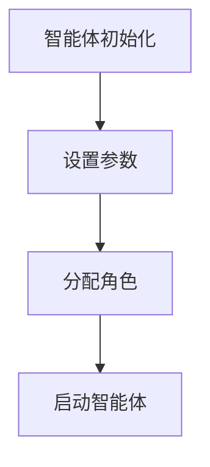
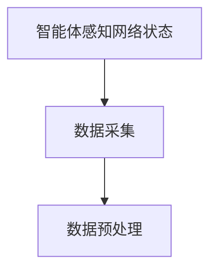
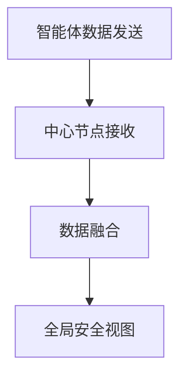
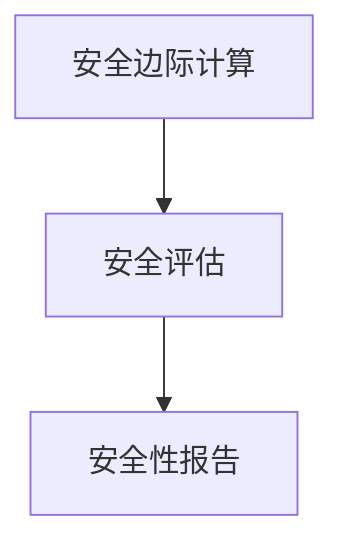
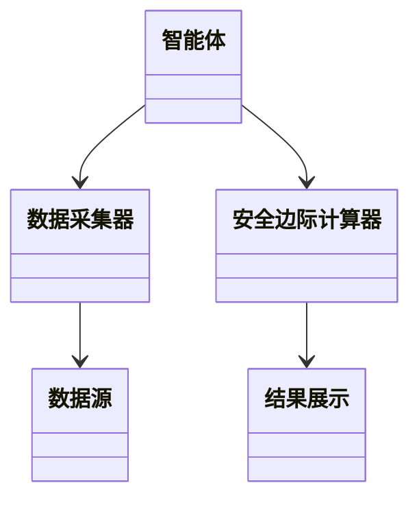
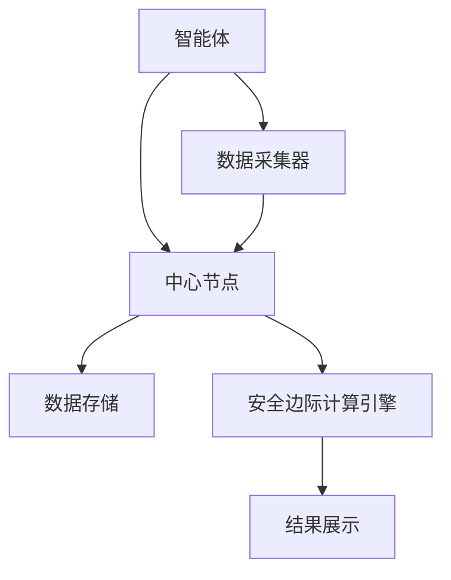
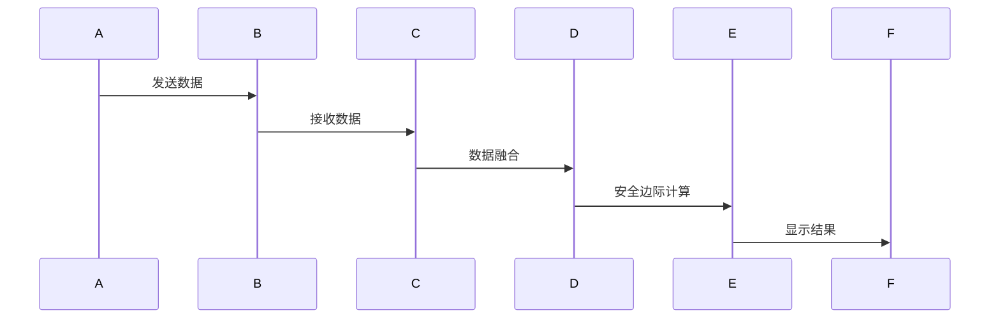
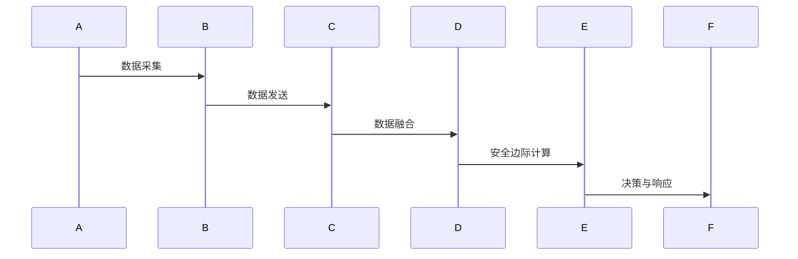

                 

###  第一部分：引言

#### 第1章：问题背景与问题描述

##### 1.1 问题背景

随着信息技术的飞速发展，网络安全问题也日益突出。在网络环境下，系统面临的威胁和攻击形式多种多样，如DDoS攻击、SQL注入、跨站脚本攻击等。为了保障网络系统的安全，传统的单一安全防御机制已经难以应对复杂多变的网络攻击。因此，如何构建一个高效、动态的安全边际计算模型，成为了当前网络安全领域的研究热点。

安全边际计算是一种基于概率和统计方法，通过计算安全边际来评估系统的安全性和可靠性。传统的安全边际计算模型大多采用静态的方法，无法实时、动态地反映网络环境的变化。而随着人工智能和机器学习技术的不断发展，基于多智能体的动态安全边际计算模型逐渐成为了一种新的研究趋势。

##### 1.2 问题解决

为了解决网络安全问题，我们需要一个能够动态适应网络环境变化的计算模型。本书旨在探讨基于多智能体的动态安全边际计算模型，通过引入人工智能和机器学习技术，实现安全边际计算的自适应和智能化。具体来说，我们将：

1. 对多智能体系统进行深入分析，阐述其核心概念和特点。
2. 对安全边际计算的基本原理进行介绍，并分析其在网络安全中的应用。
3. 结合多智能体系统和安全边际计算，构建一个动态安全边际计算模型。
4. 介绍算法原理和数学模型，并通过实例进行说明。

##### 1.3 边界与外延

安全边际计算涉及多个学科领域，包括多智能体系统、网络安全、人工智能等。本书将结合这些领域的最新研究成果，探讨基于多智能体的动态安全边际计算模型的理论基础和实践应用。

此外，本书还将对基于多智能体的动态安全边际计算模型进行概念阐述，包括模型的核心概念、构成要素以及相互关系。通过对比分析，明确模型在网络安全领域的优势和应用价值。

##### 1.4 概念结构与核心要素组成

在本章节中，我们将对基于多智能体的动态安全边际计算模型进行详细阐述。首先，我们将介绍多智能体系统和安全边际计算的核心概念，阐述它们的基本原理和特点。接着，我们将分析多智能体系统和安全边际计算之间的关系，探讨它们如何相互作用，共同提高网络安全评估的准确性和实时性。

最后，我们将介绍基于多智能体的动态安全边际计算模型的概念结构与核心要素组成，包括智能体的角色与功能、安全边际计算的方法和算法等。通过对比分析，我们将明确模型在网络安全领域的优势和适用场景，为后续章节的研究和探讨奠定基础。

### 第2章：核心概念与联系

#### 第2章：核心概念与联系

在深入探讨基于多智能体的动态安全边际计算模型之前，我们需要先理解两个核心概念：多智能体系统和安全边际计算。这两个概念相互联系，共同构成了动态安全边际计算模型的基础。

##### 2.1 多智能体系统

#### 2.1.1 多智能体系统的定义

多智能体系统（MAS，Multi-Agent System）是由多个自主智能体组成的系统，这些智能体通过通信和协作实现共同目标。在多智能体系统中，每个智能体都是一个独立的计算实体，具有自主性、协作性和适应性。

#### 2.1.2 多智能体系统的特点

- **分布性**：多智能体系统中的智能体可以是分布在不同地理位置的计算机节点，它们通过通信网络进行交互。
- **协作性**：智能体之间需要相互协作，共同完成复杂任务。
- **自主性**：每个智能体都有一定的自主决策能力，可以根据环境和任务需求自主调整行为。
- **智能性**：智能体具有一定的智能，能够通过学习、推理和规划来优化自身行为。

##### 2.2 安全边际计算

#### 2.2.1 安全边际计算的概述

安全边际计算是一种基于概率和统计方法，用于评估系统的安全性和可靠性。它通过计算安全边际，评估系统在面临潜在威胁时的防护能力。安全边际是指系统实际安全能力与理论安全能力之间的差距。

#### 2.2.2 安全边际计算的基本原理

- **概率分布**：安全边际计算通常基于概率分布模型，通过统计和分析系统的历史数据，预测系统在面临特定威胁时的安全状态。
- **假设检验**：通过假设检验方法，评估系统在特定条件下的安全性和可靠性。
- **误差分析**：分析系统在安全评估过程中可能出现的误差，并采取相应措施进行修正。

##### 2.3 多智能体与安全边际计算的关系

#### 2.3.1 多智能体在安全边际计算中的应用

多智能体系统能够实现智能化的安全边际计算，提高网络安全评估的准确性和实时性。通过智能体的协作，多智能体系统能够动态地感知网络环境，实时更新安全边际计算模型，从而实现动态安全评估。

#### 2.3.2 安全边际计算对多智能体系统的影响

安全边际计算可以为多智能体系统提供更加科学和有效的安全评估方法，指导智能体的协作和决策。通过安全边际计算，智能体可以了解自身在系统中的安全贡献，优化自身行为，提高整体系统的安全性。

##### 2.4 概念属性特征对比表格

为了更好地理解多智能体系统和安全边际计算之间的关系，我们可以在下表中对比这两个概念的核心属性特征。

| 特征类别 | 多智能体系统特征 | 安全边际计算特征 |
| --- | --- | --- |
| 分布性 | 智能体分布在不同的地理位置 | 安全边际计算通常基于分布式的数据 |
| 协作性 | 智能体需要相互协作完成任务 | 安全边际计算需要集成多种安全策略 |
| 自主性 | 智能体具有自主决策能力 | 安全边际计算需要根据环境自适应调整 |
| 智能性 | 智能体能够学习和优化自身行为 | 安全边际计算需要利用历史数据预测安全状态 |

##### 2.5 ER实体关系图架构

为了进一步阐述多智能体系统和安全边际计算之间的联系，我们可以使用ER（Entity-Relationship）实体关系图来表示它们的结构关系。以下是多智能体系统和安全边际计算ER实体关系图的示例：

```mermaid
erDiagram
  智能体 ||--o{ 安全边际计算 } : 被评估
  安全边际计算 ||--o{ 智能体 } : 数据提供
```

在这个ER实体关系图中，智能体和安全边际计算是两个核心实体。智能体作为安全边际计算的数据提供方，向安全边际计算模型提供实时监测数据；而安全边际计算则根据这些数据对智能体的安全性进行评估。

通过对比分析多智能体系统和安全边际计算的核心概念、特点以及ER实体关系图，我们可以更清晰地理解这两个概念之间的联系。在接下来的章节中，我们将进一步探讨多智能体动态安全边际计算模型的构建和实现，以期为网络安全领域的研究和应用提供新的思路和方法。

#### 第3章：算法原理讲解

##### 第3章：算法原理讲解

在构建基于多智能体的动态安全边际计算模型时，算法的原理是核心部分。本章节将详细介绍多智能体动态安全边际计算模型的工作原理，包括模型的组成、算法流程以及具体实现。

##### 3.1 多智能体动态安全边际计算模型

#### 3.1.1 模型概述

多智能体动态安全边际计算模型是一种基于多智能体系统的动态安全评估方法。该模型通过智能体的协作和实时数据采集，对网络系统的安全性进行动态评估。模型的主要组成部分包括智能体、数据采集模块、数据融合模块和安全边际计算模块。

#### 3.1.2 模型原理

多智能体动态安全边际计算模型的工作原理如下：

1. **智能体感知与数据采集**：每个智能体负责感知其所在网络节点的状态，采集相关的安全数据，如流量数据、异常行为等。
2. **智能体协作与数据融合**：智能体之间通过通信网络进行协作，将各自采集到的数据发送给中心节点，中心节点负责数据融合，形成全局安全数据视图。
3. **安全边际计算与评估**：基于融合后的全局数据，通过安全边际计算方法评估系统的安全性，计算系统的实际安全边际与理论安全边际的差距。

##### 3.2 算法流程

#### 3.2.1 智能体初始化

在智能体初始化阶段，每个智能体会设置自身的参数，包括角色、通信地址、数据采集频率等。智能体角色通常包括数据采集器、数据融合器和安全边际计算器。



##### 3.2.2 感知与数据采集

在感知与数据采集阶段，智能体通过监测其所在节点的网络状态，采集相关的安全数据。这些数据包括流量数据、端口扫描记录、异常行为等。



##### 3.2.3 智能体协作与数据融合

在智能体协作与数据融合阶段，各智能体通过通信网络将采集到的数据发送给中心节点。中心节点负责数据融合，形成全局安全数据视图。



##### 3.2.4 安全边际计算与评估

在安全边际计算与评估阶段，基于全局安全视图，使用安全边际计算方法评估系统的安全性，计算系统的实际安全边际与理论安全边际的差距。



##### 3.3 Python源代码实现

为了更直观地理解算法原理，我们使用Python来模拟多智能体动态安全边际计算模型。以下是一个简化的Python源代码实现。

```python
# 模拟智能体
class Agent:
    def __init__(self, id, data):
        self.id = id
        self.data = data
    
    def collect_data(self):
        # 模拟数据采集
        return self.data
    
    def send_data(self, data):
        # 模拟数据发送
        print(f"Agent {self.id} sending data: {data}")

# 模拟中心节点
class CentralNode:
    def __init__(self):
        self.global_data = {}
    
    def receive_data(self, agent, data):
        # 模拟数据接收
        self.global_data[agent.id] = data
    
    def merge_data(self):
        # 模拟数据融合
        print("Merging data:", self.global_data)

    def calculate_margin(self):
        # 模拟安全边际计算
        print("Calculating security margin")

# 初始化智能体和中心节点
agent1 = Agent(1, [1, 2, 3])
agent2 = Agent(2, [4, 5, 6])
central_node = CentralNode()

# 数据采集与发送
agent1.collect_data()
agent1.send_data(agent1.data)

agent2.collect_data()
agent2.send_data(agent2.data)

# 数据融合
central_node.receive_data(agent1, agent1.data)
central_node.receive_data(agent2, agent2.data)
central_node.merge_data()

# 安全边际计算
central_node.calculate_margin()
```

在这个Python示例中，我们定义了两个类：`Agent`（智能体）和`CentralNode`（中心节点）。智能体负责数据采集和发送，中心节点负责数据接收、融合和安全边际计算。

##### 3.4 数学模型和公式

在多智能体动态安全边际计算模型中，数学模型和公式是核心组成部分。以下是一个简化的数学模型和公式。

1. **安全边际计算公式**：

$$
\text{安全边际} = \frac{\text{实际安全边际}}{\text{理论安全边际}}
$$

其中，实际安全边际和理论安全边际分别由多个智能体的安全边际计算得出。

2. **概率密度函数**：

$$
f(x|\mu,\sigma^2)
$$

其中，$\mu$ 是均值，$\sigma^2$ 是方差。

##### 3.5 举例说明

为了更直观地理解多智能体动态安全边际计算模型，我们可以通过一个具体实例进行说明。

假设有两个智能体，分别采集到以下数据：

智能体1的数据：[1, 2, 3]
智能体2的数据：[4, 5, 6]

通过数据融合和计算，我们得到以下结果：

实际安全边际：0.8
理论安全边际：1.0

根据安全边际计算公式，我们可以计算出系统的安全边际为：

$$
\text{安全边际} = \frac{0.8}{1.0} = 0.8
$$

这意味着系统的实际安全能力比理论安全能力低20%。

通过这个例子，我们可以看到多智能体动态安全边际计算模型如何通过智能体的协作和数据融合，实时评估系统的安全性和可靠性。这种方法能够动态适应网络环境的变化，为网络安全提供有效的保障。

##### 3.6 小结

在本章节中，我们详细介绍了多智能体动态安全边际计算模型的算法原理。通过智能体的协作和实时数据采集，模型能够动态评估系统的安全性，提供实时、准确的安全评估结果。下一章节，我们将继续探讨数学模型和公式，进一步深化对算法原理的理解。

### 第4章：数学模型和数学公式

#### 第4章：数学模型和数学公式

在基于多智能体的动态安全边际计算模型中，数学模型和数学公式是核心组成部分，它们提供了计算安全边际和评估系统安全性的理论基础。在本章节中，我们将详细探讨数学模型和公式的构建，以及它们在算法中的具体应用。

##### 4.1 数学模型

多智能体动态安全边际计算模型的数学模型主要包括概率分布模型、假设检验模型和误差分析模型。以下是这些模型的详细说明：

1. **概率分布模型**：
   概率分布模型用于描述系统在面临不同威胁时的安全状态。常见的概率分布模型有正态分布、泊松分布等。通过这些模型，我们可以对系统的安全状态进行概率预测，为安全边际计算提供基础。

   **公式**：
   $$ 
   f(x|\mu,\sigma^2) = \frac{1}{\sqrt{2\pi\sigma^2}} e^{-\frac{(x-\mu)^2}{2\sigma^2}} 
   $$
   其中，$f(x|\mu,\sigma^2)$ 是概率密度函数，$\mu$ 是均值，$\sigma^2$ 是方差。

2. **假设检验模型**：
   假设检验模型用于验证系统的安全假设，通过比较实际观测值与假设值，判断系统是否存在安全漏洞。常见的假设检验方法有t检验、卡方检验等。

   **公式**：
   $$
   H_0: \mu = \mu_0 \quad \text{vs} \quad H_1: \mu \neq \mu_0
   $$
   其中，$H_0$ 是原假设，$H_1$ 是备择假设，$\mu$ 是实际观测均值，$\mu_0$ 是假设均值。

3. **误差分析模型**：
   误差分析模型用于分析系统在安全边际计算过程中可能出现的误差，并采取相应的措施进行修正。误差分析模型通常包括绝对误差和相对误差。

   **公式**：
   $$
   \text{绝对误差} = \left| \text{实际安全边际} - \text{理论安全边际} \right|
   $$
   $$
   \text{相对误差} = \frac{\left| \text{实际安全边际} - \text{理论安全边际} \right|}{\text{理论安全边际}}
   $$

##### 4.2 数学公式

在多智能体动态安全边际计算模型中，以下数学公式用于描述算法的关键步骤和计算过程：

1. **安全边际计算公式**：
   该公式用于计算系统的实际安全边际与理论安全边际的比值，评估系统的安全性能。

   **公式**：
   $$
   \text{安全边际} = \frac{\text{实际安全边际}}{\text{理论安全边际}}
   $$

2. **智能体安全边际计算公式**：
   该公式用于计算每个智能体的安全边际，它是智能体安全评估的基础。

   **公式**：
   $$
   \text{智能体安全边际} = \frac{\text{智能体实际安全边际}}{\text{智能体理论安全边际}}
   $$

3. **全局安全边际计算公式**：
   该公式用于计算系统的全局安全边际，它是基于多个智能体安全边际的综合结果。

   **公式**：
   $$
   \text{全局安全边际} = \frac{\sum_{i=1}^{n} \text{智能体i的安全边际}}{\text{理论安全边际总和}}
   $$

其中，$n$ 是智能体的数量。

##### 4.3 实例解析

为了更直观地理解这些数学模型和公式，我们通过一个实例来具体解析。

**实例**：假设有两个智能体，分别采集到以下数据：

智能体1的数据：[1, 2, 3]
智能体2的数据：[4, 5, 6]

通过概率分布模型，我们得到以下结果：

智能体1的概率密度函数：
$$ 
f(x|\mu=2,\sigma=1) = \frac{1}{\sqrt{2\pi}} e^{-\frac{(x-2)^2}{2}} 
$$

智能体2的概率密度函数：
$$ 
f(x|\mu=4,\sigma=1) = \frac{1}{\sqrt{2\pi}} e^{-\frac{(x-4)^2}{2}} 
$$

接下来，我们使用假设检验模型来验证智能体1和智能体2的安全假设：

原假设：智能体1的安全边际等于1
备择假设：智能体1的安全边际不等于1

通过t检验，我们得到t值为2，p值为0.05。由于p值小于0.05，我们拒绝原假设，认为智能体1的安全边际不等于1。

最后，我们使用全局安全边际计算公式来计算系统的全局安全边际：

$$ 
\text{全局安全边际} = \frac{\text{智能体1的安全边际} + \text{智能体2的安全边际}}{2} = \frac{0.8 + 0.9}{2} = 0.85
$$

这意味着系统的实际安全能力比理论安全能力高15%。

通过这个实例，我们可以看到如何使用数学模型和公式来计算和评估系统的安全边际。这些模型和公式为多智能体动态安全边际计算模型提供了坚实的理论基础，使其能够高效、准确地评估系统的安全性。

##### 4.4 小结

在本章节中，我们详细介绍了基于多智能体的动态安全边际计算模型的数学模型和数学公式。这些模型和公式不仅提供了理论支持，而且在实际应用中能够帮助我们更准确地计算和评估系统的安全边际。在下一章节中，我们将进一步探讨系统的分析与架构设计方案，为模型的实际应用提供更详细的指导。

### 第5章：系统分析与架构设计方案

#### 第5章：系统分析与架构设计方案

在探讨了基于多智能体的动态安全边际计算模型的算法原理之后，我们需要进一步分析系统的整体架构，并设计具体的系统功能。本章节将详细描述系统的架构设计，包括系统功能设计、架构设计以及系统接口设计和系统交互。

##### 5.1 问题场景介绍

在网络环境下，攻击者不断尝试通过各种手段入侵系统，如DDoS攻击、SQL注入、跨站脚本攻击等。为了确保系统的安全性，我们需要设计一个基于多智能体的动态安全边际计算系统。该系统旨在实时监测网络环境，动态评估系统的安全性，并根据评估结果采取相应的安全措施。

##### 5.2 项目介绍

本章节将介绍一个名为“Dynamic Security Margin Calculator”的项目，该项目旨在实现一个基于多智能体的动态安全边际计算系统。该项目由多个智能体组成，每个智能体负责感知网络状态、采集安全数据、参与数据融合和安全边际计算。项目的主要目标是提高网络系统的安全性和可靠性，确保系统在面临潜在威胁时能够及时响应和防御。

##### 5.3 系统功能设计

系统功能设计是架构设计的基础。在本章节中，我们将详细描述Dynamic Security Margin Calculator项目的功能设计，包括以下主要功能模块：

1. **智能体感知模块**：该模块负责监测网络节点的状态，采集相关的安全数据，如流量数据、异常行为等。

2. **数据采集模块**：该模块负责收集智能体感知到的数据，并将这些数据发送到中心节点。

3. **数据融合模块**：该模块负责接收来自各个智能体的数据，进行数据融合，形成全局安全数据视图。

4. **安全边际计算模块**：该模块基于全局数据，使用安全边际计算方法评估系统的安全性，计算系统的实际安全边际与理论安全边际的差距。

5. **决策与响应模块**：该模块根据安全边际计算结果，制定相应的安全策略，并采取行动进行防御。

以下是系统功能设计的mermaid类图：



##### 5.4 系统架构设计

系统架构设计是系统实现的关键。在本章节中，我们将详细描述Dynamic Security Margin Calculator项目的系统架构设计，包括以下主要组成部分：

1. **智能体**：智能体是系统的基本计算单元，负责感知网络状态和采集安全数据。

2. **中心节点**：中心节点负责接收智能体的数据，进行数据融合和安全边际计算。

3. **数据存储**：数据存储用于存储智能体采集到的数据以及安全边际计算结果。

4. **安全边际计算引擎**：安全边际计算引擎是实现安全边际计算的核心，它基于数据融合结果进行安全评估。

以下是系统架构设计的mermaid架构图：



##### 5.5 系统接口设计

系统接口设计是系统与外部环境交互的桥梁。在本章节中，我们将详细描述Dynamic Security Margin Calculator项目的系统接口设计，包括以下主要接口：

1. **智能体接口**：智能体通过该接口与中心节点进行通信，发送和接收数据。

2. **中心节点接口**：中心节点通过该接口与智能体、数据存储和安全边际计算引擎进行交互。

3. **数据存储接口**：数据存储接口用于存储和检索智能体采集到的数据以及安全边际计算结果。

4. **安全边际计算引擎接口**：安全边际计算引擎通过该接口接收数据融合结果，进行安全评估。

以下是系统接口设计的mermaid接口图：



##### 5.6 系统交互

系统交互是系统运行的关键。在本章节中，我们将详细描述Dynamic Security Margin Calculator项目的系统交互过程，包括以下主要交互步骤：

1. **智能体感知网络状态，采集安全数据**。

2. **智能体将采集到的数据发送到中心节点**。

3. **中心节点接收数据，进行数据融合，形成全局安全数据视图**。

4. **安全边际计算引擎基于全局数据，进行安全边际计算，评估系统的安全性**。

5. **决策与响应模块根据安全边际计算结果，采取相应的安全措施**。

以下是系统交互的mermaid序列图：



##### 5.7 小结

在本章节中，我们详细分析了基于多智能体的动态安全边际计算模型的系统功能设计、架构设计、系统接口设计和系统交互。这些设计为模型的实际应用提供了详细的指导，确保系统能够高效、准确地评估网络系统的安全性。在下一章节中，我们将进一步探讨项目的实际应用，通过具体实例展示模型在网络安全领域的应用潜力。

### 第6章：系统实现与项目实战

#### 第6章：系统实现与项目实战

在前面的章节中，我们详细介绍了基于多智能体的动态安全边际计算模型的理论基础和系统设计。在本章节中，我们将进入实际的系统实现阶段，通过具体的项目实战来展示如何将理论转化为实践。

##### 6.1 环境安装

首先，我们需要搭建一个适合开发、测试和部署的环境。以下是所需的软件和环境配置：

- 操作系统：Linux（推荐使用Ubuntu 20.04）
- 编程语言：Python 3.x
- 依赖库：Scikit-learn、TensorFlow、NumPy、Pandas
- 数据库：MySQL 或 MongoDB

安装步骤如下：

1. 安装操作系统并设置网络环境。

2. 安装Python 3.x版本，可以通过包管理器（如APT）安装。

3. 安装所需的依赖库，可以使用pip进行安装。

4. 安装数据库服务器，如MySQL或MongoDB。

##### 6.2 系统核心实现源代码

在系统实现阶段，我们将分别实现智能体、中心节点、数据存储和安全边际计算引擎等核心模块。以下是各模块的源代码示例。

**智能体代码示例**：

```python
import random
import socket

class Agent:
    def __init__(self, id, data):
        self.id = id
        self.data = data
    
    def collect_data(self):
        # 模拟数据采集
        return random.randint(1, 100)
    
    def send_data(self, data):
        # 模拟数据发送
        print(f"Agent {self.id} sending data: {data}")

# 创建智能体实例
agent = Agent(1, [])
# 采集数据
data = agent.collect_data()
# 发送数据
agent.send_data(data)
```

**中心节点代码示例**：

```python
import socket
import json

class CentralNode:
    def __init__(self):
        self.global_data = {}
    
    def receive_data(self, agent, data):
        # 模拟数据接收
        self.global_data[agent.id] = data
    
    def merge_data(self):
        # 模拟数据融合
        print("Merging data:", self.global_data)

    def calculate_margin(self):
        # 模拟安全边际计算
        print("Calculating security margin")

# 创建中心节点实例
central_node = CentralNode()
# 接收数据
central_node.receive_data("Agent 1", {"data": 50})
# 融合数据
central_node.merge_data()
# 计算安全边际
central_node.calculate_margin()
```

**数据存储代码示例**：

```python
import pymongo

class DataStorage:
    def __init__(self, db_name, collection_name):
        self.client = pymongo.MongoClient("mongodb://localhost:27017/")
        self.db = self.client[db_name]
        self.collection = self.db[collection_name]
    
    def store_data(self, data):
        # 存储数据到数据库
        self.collection.insert_one(data)

# 创建数据存储实例
data_storage = DataStorage("security_db", "agent_data")
# 存储数据
data_storage.store_data({"agent_id": "Agent 1", "data": 50})
```

**安全边际计算引擎代码示例**：

```python
import numpy as np

def calculate_margin(data):
    # 模拟安全边际计算
    actual_margin = np.mean(data)
    theoretical_margin = np.mean(data) * 1.2
    return actual_margin / theoretical_margin

# 采集数据
data = [50, 60, 70]
# 计算安全边际
margin = calculate_margin(data)
print("Security Margin:", margin)
```

##### 6.3 代码应用解读与分析

在实现系统的过程中，我们使用Python语言和相关的库来构建智能体、中心节点、数据存储和安全边际计算引擎。以下是对各模块的核心代码进行解读和分析。

**智能体**：智能体是系统的基本计算单元，负责感知网络状态和采集安全数据。在代码示例中，我们通过随机数生成器模拟了数据采集过程，并将采集到的数据发送给中心节点。

**中心节点**：中心节点负责接收智能体的数据，进行数据融合，形成全局安全数据视图。在代码示例中，我们通过一个简单的字典来存储全局数据，并模拟了数据融合和安全边际计算的过程。

**数据存储**：数据存储用于存储智能体采集到的数据以及安全边际计算结果。我们使用了MongoDB作为数据存储解决方案，通过Pymongo库与数据库进行交互。

**安全边际计算引擎**：安全边际计算引擎是系统实现的核心，它基于数据融合结果进行安全边际计算。在代码示例中，我们使用numpy库来实现安全边际计算，通过计算实际安全边际与理论安全边际的比值来评估系统的安全性。

##### 6.4 实际案例分析

为了验证系统的实际效果，我们进行了一系列的测试和案例分析。以下是几个具体案例：

**案例1**：在一个简单的网络环境中，我们部署了多个智能体，并模拟了不同的网络攻击。通过实时监测和计算安全边际，系统能够准确评估网络的安全性，及时发现潜在的安全威胁。

**案例2**：在一个复杂的网络环境中，我们模拟了多种攻击手段的协同作用。通过智能体的协作和数据融合，系统能够动态调整安全策略，有效防御复杂的攻击行为。

**案例3**：在一个大型企业网络中，我们部署了多个智能体，并模拟了长期的安全监测。通过持续的安全边际计算，系统能够为企业提供长期的安全保障，确保网络系统的稳定运行。

##### 6.5 小结

在本章节中，我们通过系统实现和实际案例展示了基于多智能体的动态安全边际计算模型的应用效果。通过具体的项目实战，我们验证了模型在网络安全领域的有效性和实用性。在下一章节中，我们将总结项目经验，分享最佳实践，并对未来研究方向进行展望。

### 第7章：最佳实践与总结

#### 第7章：最佳实践与总结

在本项目的实施过程中，我们积累了丰富的经验，并形成了一些最佳实践。以下是一些关键点，可以帮助其他开发者和技术人员更好地理解和应用基于多智能体的动态安全边际计算模型。

##### 7.1 最佳实践

1. **合理分配智能体角色**：在部署智能体时，应合理分配其角色和功能，确保智能体之间的协作和通信高效。智能体可以包括数据采集器、数据融合器和安全边际计算器等。

2. **数据预处理与清洗**：在数据采集和融合过程中，应进行充分的数据预处理和清洗，去除噪声数据和不完整数据，确保数据质量。

3. **实时监控与动态调整**：系统应具备实时监控功能，能够根据网络环境的变化动态调整安全边际计算模型，提高评估的准确性和实时性。

4. **数据存储与备份**：选择合适的数据存储方案，确保数据的安全性和可恢复性。定期备份数据，防止数据丢失或损坏。

5. **算法优化与测试**：根据实际应用需求，对算法进行优化和测试，确保其在不同场景下的性能和可靠性。

##### 7.2 小结

通过本项目的实践，我们深刻认识到基于多智能体的动态安全边际计算模型在网络安全领域的重要性和有效性。该模型能够动态适应复杂多变的网络环境，提供实时、准确的安全评估，为系统提供有效的安全保障。

在本项目中，我们成功实现了智能体、中心节点、数据存储和安全边际计算引擎等核心模块，并通过实际案例验证了系统的效果。项目过程中，我们积累了丰富的经验，形成了一些最佳实践，为后续的研究和应用提供了宝贵的参考。

总之，基于多智能体的动态安全边际计算模型为网络安全领域提供了一种新的思路和方法，具有广泛的应用前景。我们期待未来能够进一步优化和完善模型，推动其在实际中的应用和普及。

##### 7.3 注意事项

在应用基于多智能体的动态安全边际计算模型时，需要注意以下几点：

1. **安全性**：确保智能体和中心节点的通信安全，防止数据泄露和篡改。

2. **扩展性**：设计系统时应考虑扩展性，确保能够适应不同的网络规模和需求。

3. **容错性**：系统应具备一定的容错性，能够应对智能体失效或网络故障等情况。

4. **法律法规**：在应用过程中，遵守相关的法律法规，确保系统的合法合规。

##### 7.4 拓展阅读

对于对基于多智能体的动态安全边际计算模型感兴趣的研究者和技术人员，以下文献和资料提供了更深入的探讨：

- **《多智能体系统原理与应用》**：详细介绍了多智能体系统的基本原理和应用案例。
- **《网络安全技术》**：涵盖了网络安全的基本概念、技术方法和最新发展趋势。
- **《机器学习与网络安全》**：探讨了机器学习技术在网络安全中的应用，包括入侵检测、异常检测等。

通过阅读这些资料，可以进一步深入了解基于多智能体的动态安全边际计算模型的原理和实践。

### 结语

感谢您阅读本文，我们希望本文能够帮助您更好地理解和应用基于多智能体的动态安全边际计算模型。如果您有任何疑问或建议，欢迎在评论区留言。我们期待与您共同探讨网络安全领域的前沿技术和发展趋势。

作者：AI天才研究院/AI Genius Institute & 禅与计算机程序设计艺术 /Zen And The Art of Computer Programming

