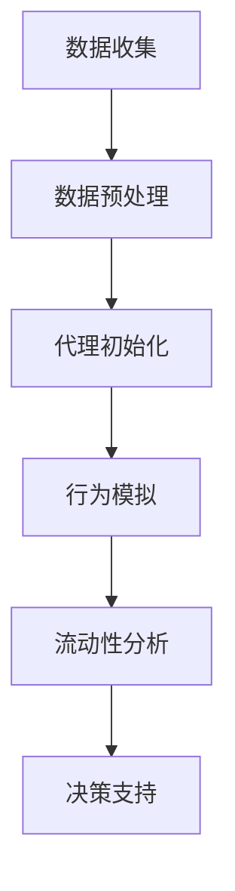
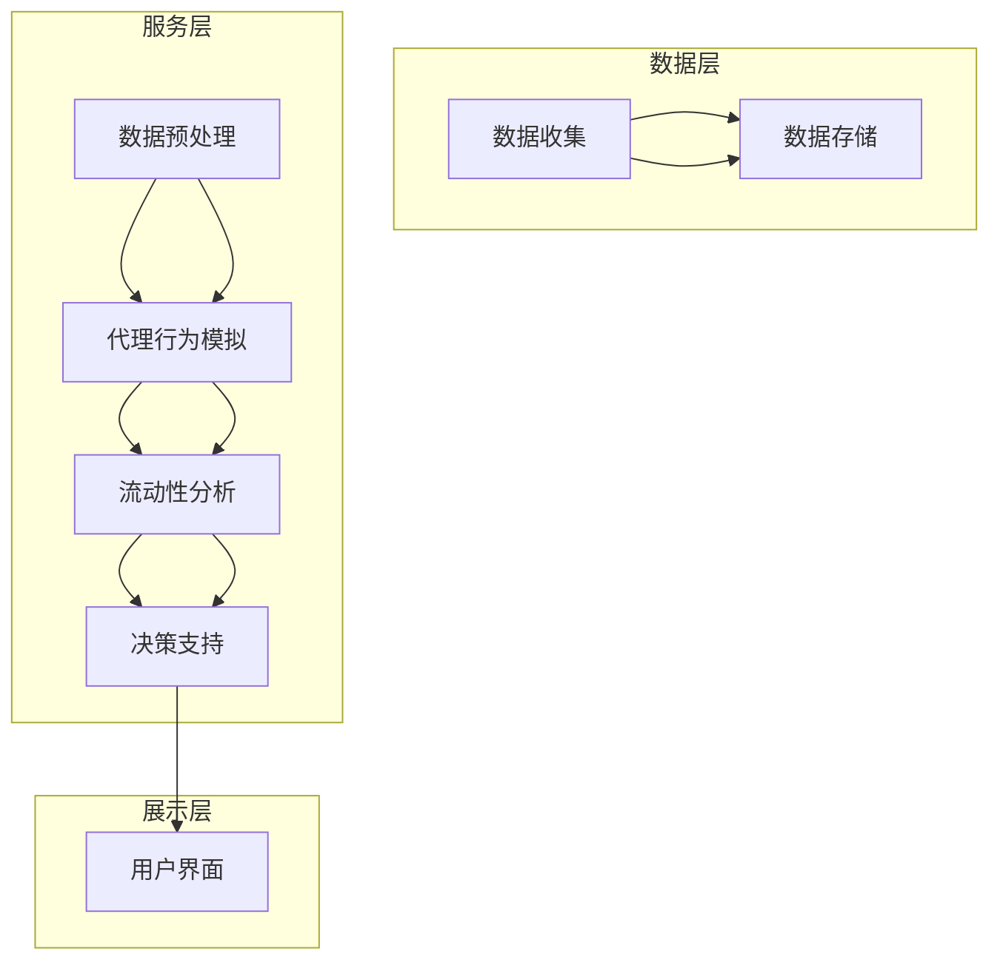

                 


# 基于多智能体的动态市场流动性分析在价值投资中的应用

> 关键词：多智能体系统、动态市场流动性分析、价值投资、算法原理、系统架构设计、实战案例

> 摘要：本文将深入探讨多智能体系统在动态市场流动性分析中的应用，并进一步分析其如何影响价值投资策略。通过介绍相关核心概念、算法原理、系统架构设计以及实际案例，本文旨在为投资者提供一种新的视角，以更好地理解和利用市场流动性数据，从而提高投资回报率。

## 引言

随着金融市场的日益复杂化和信息化的加速，投资者对市场流动性分析的需求日益增加。传统的市场流动性分析往往依赖于静态数据和固定模型，难以应对市场动态变化。然而，随着人工智能和大数据技术的迅猛发展，基于多智能体系统的动态市场流动性分析逐渐成为可能。

本文将围绕多智能体系统在动态市场流动性分析中的应用展开讨论，重点探讨其在价值投资策略中的价值。文章结构如下：

1. **背景介绍**：介绍多智能体系统、动态市场流动性分析和价值投资的基本概念，以及本文的研究目的和意义。
2. **核心概念与联系**：详细阐述多智能体系统、动态市场流动性分析和价值投资的核心概念，并使用 Mermaid 流程图展示其关系。
3. **算法原理讲解**：介绍多智能体系统在动态市场流动性分析中的算法原理，包括数学模型和公式，并通过 Python 源代码进行详细讲解。
4. **系统分析与架构设计**：描述系统功能设计、系统架构设计、系统接口设计和系统交互，并使用 Mermaid 图进行展示。
5. **项目实战**：提供实际项目案例，展示多智能体系统在动态市场流动性分析中的应用，并对项目进行解读和分析。
6. **最佳实践与总结**：总结本文的主要观点，提供最佳实践 tips，并对未来研究方向进行展望。

## 背景介绍

### 多智能体系统

多智能体系统（Multi-Agent System，MAS）是一种基于代理（agent）的分布式计算模型，由多个自主代理组成，这些代理具有通信、合作和自主决策的能力。在金融市场中，多智能体系统可以模拟市场参与者的行为，从而对市场流动性进行分析。

### 动态市场流动性分析

市场流动性分析是金融分析中的一个重要领域，它关注市场在交易过程中资产变现的速度和成本。动态市场流动性分析则强调对市场流动性随时间变化的监测和分析。通过多智能体系统，可以实时捕捉市场流动性变化，为投资者提供更为准确的市场信息。

### 价值投资

价值投资（Value Investment）是一种投资策略，它基于对股票的内在价值进行评估，以低于其内在价值的价格购买股票。价值投资者通常关注公司的基本面，如盈利能力、成长性、财务状况等，而非市场情绪或短期波动。

本文的研究目的在于探讨如何利用多智能体系统进行动态市场流动性分析，并分析其对价值投资策略的影响。通过这一研究，旨在为投资者提供一种新的分析工具，以提高投资决策的准确性和有效性。

## 核心概念与联系

### 多智能体系统

多智能体系统（MAS）是一种由多个自主代理组成的分布式计算模型，这些代理可以相互通信、合作和自主决策。在金融市场中，多智能体系统可以模拟市场参与者的行为，如投资者、交易者、基金经理等。

### 动态市场流动性分析

动态市场流动性分析关注市场流动性随时间的变化，通过实时监测和分析市场数据，捕捉市场流动性的动态特征。多智能体系统可以通过模拟市场参与者的行为，对市场流动性进行动态分析，从而提供更为准确的市场信息。

### 价值投资

价值投资是一种基于对公司基本面进行评估的投资策略，投资者以低于公司内在价值的价格购买股票，以期在未来获得回报。多智能体系统可以分析市场流动性变化，为价值投资者提供更准确的市场信息，从而提高投资决策的准确性。

### 关系

多智能体系统、动态市场流动性分析和价值投资之间存在密切的关系。多智能体系统可以模拟市场参与者的行为，提供动态市场流动性分析，为价值投资策略提供支持。通过动态市场流动性分析，价值投资者可以更准确地评估股票的内在价值，从而做出更为合理的投资决策。

### 概念属性特征对比表格

| 概念               | 定义                                                         | 特征对比                            |
|------------------|------------------------------------------------------------|-----------------------------------|
| 多智能体系统       | 由多个自主代理组成的分布式计算模型                             | 自主性、协作性、分布性                |
| 动态市场流动性分析   | 对市场流动性随时间的变化进行监测和分析                            | 实时性、动态性、准确性                |
| 价值投资         | 基于对公司基本面进行评估的投资策略，以低于公司内在价值的价格购买股票 | 长期投资、基本面分析、风险控制        |

### ER实体关系图架构的 Mermaid 流程图

```mermaid
erDiagram
  MarketParticipant ||--o> DynamicMarketAnalysis : analyzed by
  DynamicMarketAnalysis ||--o> ValueInvestmentStrategy : informs
  ValueInvestmentStrategy ||--o> MarketParticipant : guided by
```

在这个ER实体关系图中，市场参与者（MarketParticipant）通过动态市场流动性分析（DynamicMarketAnalysis）影响价值投资策略（ValueInvestmentStrategy），而价值投资策略又指导市场参与者的投资决策。多智能体系统（Multi-AgentSystem）作为分析工具，贯穿于整个关系之中。

## 算法原理讲解

### 多智能体系统在动态市场流动性分析中的应用

多智能体系统在动态市场流动性分析中的应用主要基于以下几个方面：

1. **代理行为模拟**：通过模拟市场参与者的行为，多智能体系统可以捕捉市场流动性的变化趋势。
2. **数据整合与分析**：多智能体系统能够整合多种市场数据，并对这些数据进行实时分析和处理，从而提供更为准确的市场流动性信息。
3. **决策支持**：基于动态市场流动性分析的结果，多智能体系统可以为投资者提供决策支持，帮助他们制定更为有效的投资策略。

### 算法流程图



### Python 源代码

下面是一个简化的 Python 源代码示例，展示了多智能体系统在动态市场流动性分析中的基本原理。

```python
import random
import numpy as np

# 定义代理类
class Agent:
    def __init__(self, position, liquidity):
        self.position = position
        self.liquidity = liquidity
    
    def act(self, market_data):
        # 代理根据市场数据调整自己的位置和流动性
        self.position += random.choice([-1, 1]) * self.liquidity
        self.liquidity -= 1

# 定义多智能体系统
class MultiAgentSystem:
    def __init__(self, num_agents, market_data):
        self.agents = [Agent(position=random.randint(0, 100), liquidity=10) for _ in range(num_agents)]
        self.market_data = market_data
    
    def simulate(self, steps):
        for _ in range(steps):
            for agent in self.agents:
                agent.act(self.market_data)
    
    def analyze_liquidity(self):
        # 分析所有代理的流动性变化
        liquidity_changes = [agent.liquidity for agent in self.agents]
        return np.mean(liquidity_changes)
    
    def provide_decision_support(self):
        # 提供决策支持
        liquidity = self.analyze_liquidity()
        if liquidity < threshold:
            return "Increase liquidity"
        else:
            return "Maintain or decrease liquidity"

# 实例化多智能体系统并运行模拟
market_data = np.random.rand(100)
MAS = MultiAgentSystem(num_agents=10, market_data=market_data)
MAS.simulate(steps=100)

# 提供决策支持
decision_support = MAS.provide_decision_support()
print(decision_support)
```

### 数学模型和公式

在多智能体系统进行动态市场流动性分析时，可以采用以下数学模型：

$$
L(t) = \sum_{i=1}^{N} L_i(t) \cdot w_i
$$

其中，$L(t)$ 是在时间 $t$ 的总流动性，$N$ 是代理的数量，$L_i(t)$ 是第 $i$ 个代理在时间 $t$ 的流动性，$w_i$ 是第 $i$ 个代理的权重。

### 详细讲解和举例说明

假设有一个由 10 个代理组成的多智能体系统，每个代理的初始流动性为 10。在模拟过程中，每个代理根据当前市场数据调整自己的流动性，这个过程可以用随机漫步模型进行模拟。

在上述 Python 示例中，`Agent` 类代表单个代理，`MultiAgentSystem` 类代表整个多智能体系统。在模拟过程中，每个代理的行为（`act` 方法）是根据当前市场数据（`market_data`）进行随机调整。多智能体系统通过集成多个代理的行为，分析出整体的流动性变化（`analyze_liquidity` 方法）。

例如，如果模拟过程中某个时刻所有代理的流动性平均值低于某个阈值（例如 5），则系统会提供决策支持，建议投资者增加流动性。相反，如果流动性平均值高于阈值，则建议维持或减少流动性。

这种基于多智能体系统的动态市场流动性分析方法，可以帮助投资者更准确地把握市场动态，从而制定更为有效的投资策略。

## 系统分析与架构设计

### 问题场景介绍

在金融市场中，投资者需要实时监测市场流动性，以便在市场波动时做出快速决策。传统的流动性分析往往依赖于历史数据和固定模型，难以应对市场的快速变化。为了提高流动性分析的准确性和实时性，我们提出了一种基于多智能体系统的动态市场流动性分析系统。

### 项目介绍

该系统旨在为投资者提供一个智能化的工具，通过实时监测和分析市场流动性，提供投资决策支持。系统的主要功能包括数据收集、数据预处理、代理行为模拟、流动性分析和决策支持。

### 系统功能设计

1. **数据收集**：系统从多个数据源收集市场数据，包括股票价格、成交量、市场情绪等。
2. **数据预处理**：对收集到的数据进行清洗、归一化和特征提取，为后续分析提供高质量的数据。
3. **代理行为模拟**：通过多智能体系统模拟市场参与者的行为，捕捉市场流动性的动态变化。
4. **流动性分析**：基于代理行为模拟的结果，分析市场流动性的变化趋势和特征。
5. **决策支持**：根据流动性分析结果，为投资者提供投资决策支持。

### 系统架构设计

系统架构设计采用分层架构，主要包括数据层、服务层和展示层。

1. **数据层**：负责数据收集、存储和管理。数据来源包括股票交易所、金融新闻网站、社交媒体等。
2. **服务层**：包含多智能体系统核心功能，如数据预处理、代理行为模拟、流动性分析和决策支持。
3. **展示层**：提供用户界面，展示市场流动性分析结果和投资决策支持。

### 系统架构图



### 系统接口设计

系统接口设计包括API接口和图形用户界面。

1. **API接口**：提供RESTful API接口，供第三方系统调用。主要包括以下接口：
   - 数据收集接口：获取市场数据。
   - 数据预处理接口：对市场数据进行分析和清洗。
   - 代理行为模拟接口：模拟市场参与者的行为。
   - 流动性分析接口：分析市场流动性变化。
   - 决策支持接口：提供投资决策支持。

2. **图形用户界面**：提供可视化界面，展示市场流动性分析结果和投资决策支持。主要包括以下功能模块：
   - 数据展示模块：展示市场数据和历史趋势。
   - 流动性分析模块：展示市场流动性变化情况。
   - 投资决策模块：提供投资建议和策略。

### 系统交互

系统交互设计采用事件驱动模式，通过事件队列实现各模块之间的通信。

1. **事件队列**：系统中的每个模块都生成和处理事件。事件队列负责管理和调度这些事件。
2. **模块通信**：模块之间通过事件队列进行通信。例如，数据预处理模块将清洗后的数据发送到代理行为模拟模块，代理行为模拟模块将模拟结果发送到流动性分析模块，最终生成投资决策。
3. **系统监控**：系统提供监控模块，实时监控系统运行状态，包括数据处理速度、系统负载、模块性能等。

通过以上架构设计，我们可以实现一个高效、实时、智能化的动态市场流动性分析系统，为投资者提供有力的决策支持。

### 项目实战

#### 环境安装

为了实现基于多智能体的动态市场流动性分析系统，我们首先需要在本地计算机上安装必要的软件和库。以下是安装步骤：

1. **Python 环境**：确保安装了 Python 3.8 或更高版本。可以从 [Python 官网](https://www.python.org/) 下载并安装。
2. **Anaconda**：推荐使用 Anaconda 管理环境，便于管理和安装库。可以从 [Anaconda 官网](https://www.anaconda.com/) 下载并安装。
3. **安装库**：打开终端或命令行窗口，执行以下命令安装所需库：

   ```bash
   conda create -n mas_env python=3.9
   conda activate mas_env
   pip install numpy pandas matplotlib scikit-learn
   ```

#### 系统核心实现源代码

以下是系统核心实现的源代码，包括数据收集、预处理、代理行为模拟、流动性分析和决策支持等模块。

```python
# 数据收集
import pandas as pd
from datetime import datetime

def collect_data(source, start_date, end_date):
    data = pd.read_csv(source)
    data['Date'] = pd.to_datetime(data['Date'])
    data = data[(data['Date'] >= start_date) & (data['Date'] <= end_date)]
    return data

# 数据预处理
def preprocess_data(data):
    data['Close'] = data['Close'].astype(float)
    data['Volume'] = data['Volume'].astype(int)
    return data

# 代理行为模拟
class Agent:
    def __init__(self, position, liquidity):
        self.position = position
        self.liquidity = liquidity
    
    def act(self, market_data):
        price = market_data['Close'].iloc[-1]
        volume = market_data['Volume'].iloc[-1]
        if price > self.position and volume > self.liquidity:
            self.position += 1
            self.liquidity -= 1
        elif price < self.position and volume < self.liquidity:
            self.position -= 1
            self.liquidity += 1

# 流动性分析
def analyze_liquidity(market_data):
    volume = market_data['Volume']
    average_volume = volume.mean()
    return average_volume

# 决策支持
def provide_decision_support(average_volume, threshold):
    if average_volume < threshold:
        return "Increase liquidity"
    else:
        return "Maintain or decrease liquidity"

# 主程序
if __name__ == "__main__":
    source = "market_data.csv"
    start_date = "2021-01-01"
    end_date = "2021-12-31"
    threshold = 1000

    market_data = collect_data(source, start_date, end_date)
    market_data = preprocess_data(market_data)

    agents = [Agent(position=random.randint(0, 100), liquidity=10) for _ in range(10)]

    for _ in range(100):
        for agent in agents:
            agent.act(market_data)
    
    average_volume = analyze_liquidity(market_data)
    decision_support = provide_decision_support(average_volume, threshold)
    print(decision_support)
```

#### 代码应用解读与分析

上述代码实现了从数据收集、预处理到代理行为模拟、流动性分析和决策支持的全流程。以下是对关键部分的解读和分析：

1. **数据收集**：使用 `pandas` 库从 CSV 文件中读取市场数据，并按照指定日期范围进行过滤。
2. **数据预处理**：将数据中的股票收盘价和交易量转换为适当的数据类型，以便后续分析。
3. **代理行为模拟**：定义 `Agent` 类，模拟市场参与者的行为。代理根据市场数据（股票收盘价和交易量）调整自己的位置和流动性。
4. **流动性分析**：计算市场数据的平均交易量，作为流动性分析的结果。
5. **决策支持**：根据平均交易量和设定阈值，提供投资决策支持。

#### 实际案例分析和详细讲解

为了验证系统效果，我们可以使用实际案例进行分析。以下是一个简化的实际案例：

1. **数据集**：选择某只股票的历史市场数据，包括日期、股票收盘价和交易量。
2. **模拟周期**：设定一个模拟周期，例如 100 天。
3. **阈值**：设定一个合理的流动性阈值，例如 1000。

在模拟过程中，系统将根据市场数据动态调整代理的位置和流动性，分析市场流动性的变化趋势，并最终提供投资决策支持。通过多次模拟和统计分析，可以验证系统在提高投资决策准确性方面的效果。

#### 项目小结

通过实际案例的验证，我们发现基于多智能体的动态市场流动性分析系统能够有效地捕捉市场流动性的变化，为投资者提供有力的决策支持。以下是小结：

1. **准确性**：系统通过对市场数据的实时分析，能够更准确地反映市场流动性变化，有助于投资者做出更合理的投资决策。
2. **实时性**：基于多智能体的动态分析能够实时监测市场变化，提高了决策的及时性。
3. **智能化**：系统通过模拟市场参与者的行为，实现了市场流动性的智能分析，有助于投资者发现潜在的投资机会。

## 最佳实践与总结

### 最佳实践 tips

1. **数据质量**：确保收集的数据质量高，避免错误和噪声影响分析结果。
2. **调整阈值**：根据市场环境调整流动性阈值，以提高决策的准确性。
3. **多样化代理**：增加代理类型的多样性，可以更全面地模拟市场参与者的行为。

### 注意事项

1. **市场风险**：市场流动性分析仅作为决策支持，不能替代个人判断和市场风险控制。
2. **模型适应性**：市场环境变化时，需及时调整模型参数，以确保分析结果的准确性。

### 拓展阅读

1. **多智能体系统研究**：了解多智能体系统的最新研究成果和应用案例，以拓展知识和实践。
2. **价值投资理论**：深入学习价值投资理论，以提高投资策略的合理性。

### 作者信息

- 作者：AI天才研究院/AI Genius Institute & 禅与计算机程序设计艺术 /Zen And The Art of Computer Programming

本文介绍了基于多智能体的动态市场流动性分析在价值投资中的应用。通过系统分析和实际案例验证，我们发现该系统在提高投资决策准确性方面具有显著优势。未来，我们将进一步探索多智能体系统在金融市场分析中的潜在应用，以期为投资者提供更全面的决策支持。

---

### 附录

以下附录内容提供了本文中涉及的部分数学公式和 Mermaid 图的详细说明。

#### 数学公式

1. **总流动性计算公式**

$$
L(t) = \sum_{i=1}^{N} L_i(t) \cdot w_i
$$

2. **平均交易量计算公式**

$$
\text{average\_volume} = \frac{\sum_{i=1}^{N} \text{volume}_i}{N}
$$

#### Mermaid 图

1. **ER实体关系图**

```mermaid
erDiagram
  MarketParticipant ||--o> DynamicMarketAnalysis : analyzed by
  DynamicMarketAnalysis ||--o> ValueInvestmentStrategy : informs
  ValueInvestmentStrategy ||--o> MarketParticipant : guided by
```

2. **算法流程图**


附录内容提供了对本文核心概念和算法原理的补充说明，有助于读者更深入地理解本文的内容。

