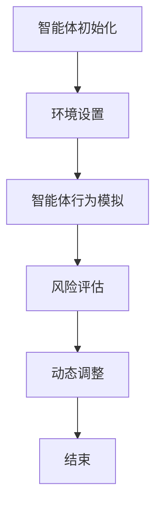
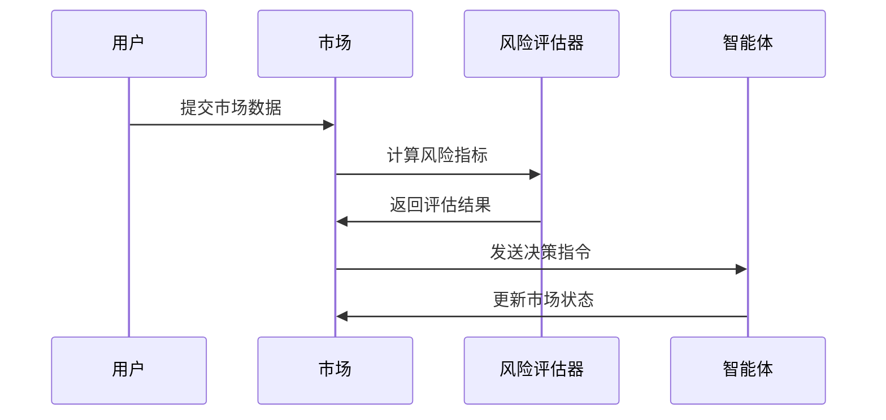
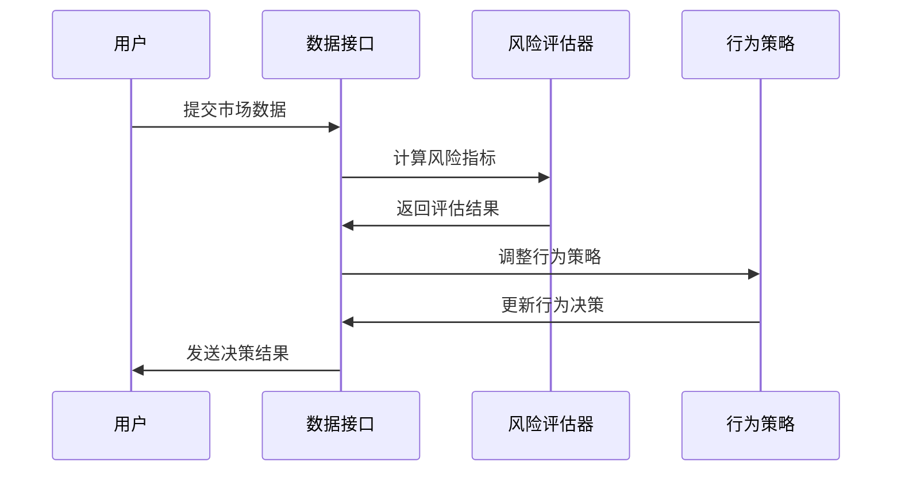

                 


### 引言

在现代金融市场，流动性风险是一个至关重要的概念，它影响着金融机构和市场参与者的日常决策。流动性风险是指市场参与者无法以合理的价格迅速买卖资产的风险，这种风险在市场波动、资金流动性紧张等情况下尤为显著。有效的市场流动性风险评估对于金融机构的风险管理和决策制定至关重要。

然而，传统的市场流动性风险评估方法往往存在局限性。它们大多依赖于静态的数据分析和预设的规则，难以适应动态市场的复杂变化。因此，开发一种能够实时动态地评估市场流动性风险的模型显得尤为重要。基于多智能体的动态市场流动性风险评估模型应运而生，它通过模拟市场参与者的行为，动态地评估市场流动性风险。

本文旨在探讨如何构建和实现这样一个基于多智能体的动态市场流动性风险评估模型。我们将从以下几个方面展开：

1. **问题背景与动态市场流动性风险评估概述**：介绍市场流动性风险的概念、特征及其在金融市场中的重要性，阐述传统评估方法的局限性。
2. **核心概念与联系**：定义多智能体系统，阐述其基本原理和特点，介绍动态市场流动性风险的核心要素及其关系。
3. **算法原理讲解**：详细阐述评估模型的算法原理，使用Mermaid绘制流程图，Python代码实现，数学模型和公式解释，并通过实例进行说明。
4. **系统分析与架构设计方案**：介绍问题场景和项目背景，设计系统功能、架构以及交互流程。
5. **项目实战**：实施环境搭建、系统核心代码实现，代码解读，案例分析与剖析。
6. **最佳实践 tips**：总结项目中的经验教训，提供实践建议。
7. **小结与注意事项**：对文章内容进行总结，指出模型的应用局限性和未来研究方向。

### 1. 问题背景与动态市场流动性风险评估概述

#### 1.1 市场流动性风险的定义与特征

市场流动性风险是指市场参与者无法在合理的时间内以合理的价格买卖资产的风险。它具有以下几个特征：

- **时间性**：流动性风险与时间相关，短期内市场流动性较好，但随着时间延长，市场参与者的交易意愿可能减弱，导致流动性下降。
- **价格敏感性**：市场价格波动越大，流动性风险越高，因为市场参与者可能不愿意在不确定的价格下买卖资产。
- **依赖性**：市场流动性风险受到市场情绪、投资者行为和整体经济环境等多种因素的影响。

#### 1.2 市场流动性风险的重要性

市场流动性风险对于金融机构和市场参与者的重要性不言而喻：

- **风险管理**：有效的流动性风险管理有助于金融机构降低潜在损失，保持财务稳健。
- **投资决策**：市场流动性风险影响投资决策的制定，投资者需要根据流动性风险调整投资策略。
- **市场稳定性**：市场流动性风险高企可能导致市场崩溃，影响整体经济稳定。

#### 1.3 传统评估方法的局限性

传统的市场流动性风险评估方法主要包括以下几种：

- **静态数据分析**：通过对历史数据的统计分析，预测未来的市场流动性。这种方法忽视了市场动态变化，容易导致预测失准。
- **预设规则**：基于一定的规则和假设，对市场流动性进行评估。这种方法缺乏灵活性，难以适应复杂多变的市场环境。

这些方法在简单、静态的市场环境下可能有效，但在当前动态、复杂的金融市场环境中，其局限性逐渐显现。例如，它们无法充分反映市场参与者的行为变化和市场的即时动态，因此需要新的评估方法来弥补这些不足。

#### 1.4 基于多智能体的动态市场流动性风险评估模型

基于多智能体的动态市场流动性风险评估模型通过模拟市场参与者的行为，动态地评估市场流动性风险。其核心思想是：

- **智能体建模**：将市场参与者视为具有独立决策能力的智能体，每个智能体根据自身的策略和外部信息进行决策。
- **动态模拟**：通过模拟智能体间的交互和决策过程，构建市场的动态行为模型。
- **风险评估**：基于模型的输出，评估市场流动性风险。

这种模型具有以下优势：

- **灵活性**：能够适应市场动态变化，及时调整评估结果。
- **真实性**：更接近真实市场的复杂性和不确定性。
- **预测性**：能够提前预警潜在的流动性风险，帮助投资者和金融机构制定相应的风险控制策略。

通过上述步骤，我们为本文的主题奠定了基础。接下来，我们将进一步探讨多智能体系统的核心概念和动态市场流动性风险的核心要素，为后续的算法原理讲解和系统架构设计打下基础。

### 2. 核心概念与联系

#### 2.1 多智能体系统的定义与特点

多智能体系统（MAS）是一个由多个自主、具有独立决策能力的智能体组成的系统。这些智能体通过相互通信和协作，共同完成任务或达到特定的目标。多智能体系统的核心特点包括：

- **自主性**：智能体具有独立决策的能力，可以根据自身状态和外部信息自主选择行为。
- **分布式**：智能体分布在不同的位置，通过通信网络进行交互，形成分布式计算结构。
- **协作性**：智能体之间通过协作完成复杂的任务，共同实现系统目标。
- **适应性**：智能体可以根据环境和自身状态的变化，调整自己的行为策略。

多智能体系统在许多领域都有广泛应用，例如金融市场、物流调度、交通管理、社会网络等。在金融市场流动性风险评估中，多智能体系统可以模拟市场参与者的行为，捕捉市场动态，为风险管理者提供实时、准确的流动性风险评估。

#### 2.2 多智能体系统的核心概念

多智能体系统包含以下几个核心概念：

- **智能体**：智能体是具有独立决策能力的实体，可以是人工的（如交易员）或机器的（如算法交易者）。
- **环境**：环境是智能体操作的背景，包括其他智能体和外部系统。
- **通信**：智能体之间通过通信进行信息交换和协调，以实现协作目标。
- **策略**：策略是智能体根据自身状态和外部信息选择的行动方案。
- **协议**：协议是智能体之间进行通信和协作的规则和标准。

#### 2.3 动态市场流动性风险的核心要素

动态市场流动性风险评估涉及以下几个核心要素：

- **市场参与者**：包括交易员、机构投资者、散户等，他们的行为和决策影响市场流动性。
- **资产价格**：资产价格波动是市场流动性风险的直接反映，价格波动越大，流动性风险越高。
- **交易量**：交易量是衡量市场活跃程度的重要指标，交易量越大，流动性越好。
- **资金流动**：资金流入和流出影响市场流动性，资金流入导致流动性增加，资金流出则相反。
- **市场情绪**：市场参与者的情绪波动影响交易行为和市场流动性。

这些要素相互作用，共同影响市场流动性风险。例如，当市场情绪悲观时，交易量可能会下降，导致流动性恶化；反之，市场情绪乐观时，交易量增加，流动性改善。

#### 2.4 多智能体系统与动态市场流动性风险的联系

多智能体系统与动态市场流动性风险的联系主要体现在以下几个方面：

- **智能体行为模拟**：通过模拟市场参与者的行为，捕捉市场动态，为风险评估提供基础数据。
- **动态风险评估**：利用多智能体系统的分布式和自适应特点，实时评估市场流动性风险。
- **风险管理决策**：基于多智能体系统的输出，制定相应的风险管理策略，降低流动性风险。

总之，基于多智能体的动态市场流动性风险评估模型通过模拟市场参与者的行为，动态地评估市场流动性风险，为风险管理者提供实时、准确的决策支持。这种模型不仅能够弥补传统评估方法的不足，还能够应对市场动态变化带来的挑战。

### 3. 算法原理讲解

#### 3.1 算法原理概述

基于多智能体的动态市场流动性风险评估模型的核心在于模拟市场参与者的行为，通过这些智能体的交互和决策过程，动态评估市场流动性风险。该模型主要分为以下几个步骤：

1. **智能体初始化**：创建市场参与者智能体，包括交易员、机构投资者、散户等，每个智能体具有不同的行为策略和初始状态。
2. **环境设置**：设置市场环境，包括资产价格、交易量、资金流动、市场情绪等关键指标。
3. **智能体行为模拟**：智能体根据自身的策略和外部环境信息进行决策，包括买入、卖出、持有等行为。
4. **风险评估**：根据智能体的决策结果，计算市场流动性风险指标，如交易成本、成交率、价格波动等。
5. **动态调整**：根据风险评估结果，智能体调整自身的策略，以应对市场变化。

#### 3.2 算法流程图

为了更清晰地展示算法原理，我们使用Mermaid绘制了算法流程图：



- **智能体初始化**：初始化智能体，包括设置初始状态和行为策略。
- **环境设置**：设置市场环境参数，如资产价格、交易量、资金流动等。
- **智能体行为模拟**：智能体根据当前状态和环境信息进行决策。
- **风险评估**：计算市场流动性风险指标，如交易成本、成交率等。
- **动态调整**：智能体根据风险评估结果调整自身策略，循环迭代。

#### 3.3 Python源代码讲解

以下是一个简化的Python源代码示例，展示了智能体初始化、行为模拟和风险评估的基本实现：

```python
import numpy as np
import random

# 智能体类
class Trader:
    def __init__(self, strategy):
        self.strategy = strategy
        self.position = 0
    
    def make_decision(self, price, volume):
        if self.strategy == 'buy' and price < self.buy_threshold:
            self.position += 1
        elif self.strategy == 'sell' and price > self.sell_threshold:
            self.position -= 1
        return self.position

# 初始化智能体
traders = [Trader(strategy='buy' if random.random() < 0.5 else 'sell') for _ in range(100)]

# 设置市场环境参数
initial_price = 100
initial_volume = 1000

# 模拟智能体行为
for day in range(100):
    price = initial_price * (1 + np.random.normal(0, 0.05))
    volume = initial_volume * (1 + np.random.normal(0, 0.05))
    
    for trader in traders:
        trader.make_decision(price, volume)

# 风险评估
total_volume = sum(trader.position for trader in traders)
average_price = initial_price * (1 + np.random.normal(0, 0.05))
trading_cost = abs(total_volume * (average_price - initial_price)) / 2
    
print(f"Trading Cost: {trading_cost}")
```

在这段代码中，我们创建了一个`Trader`类来表示智能体，每个智能体根据其策略（买或卖）进行决策。市场环境参数（价格和交易量）通过随机生成来模拟市场波动。智能体行为模拟通过循环迭代实现，最终计算交易成本作为市场流动性风险的指标。

#### 3.4 数学模型与公式讲解

为了更深入地理解动态市场流动性风险评估模型，我们需要引入一些数学模型和公式。以下是几个关键概念和公式：

1. **交易成本（Trading Cost）**：
   $$ TC = \frac{|V_T - V_0| \times (P_T - P_0)}{2} $$
   其中，\( TC \)是交易成本，\( V_T \)和\( V_0 \)分别是交易结束时的交易量和初始交易量，\( P_T \)和\( P_0 \)分别是交易结束时的资产价格和初始资产价格。

2. **成交率（Trading Volume Ratio）**：
   $$ TVR = \frac{V_T}{V_0} $$
   其中，\( TVR \)是成交率，表示交易结束时的交易量与初始交易量的比值。

3. **价格波动率（Price Volatility）**：
   $$ PV = \sqrt{\frac{1}{N-1} \sum_{t=1}^{N} (P_t - \bar{P})^2} $$
   其中，\( PV \)是价格波动率，\( P_t \)是第\( t \)天的资产价格，\( \bar{P} \)是平均资产价格，\( N \)是总天数。

4. **流动性风险指数（Liquidity Risk Index）**：
   $$ LRI = \frac{TC + PV \times TVR}{2} $$
   其中，\( LRI \)是流动性风险指数，综合了交易成本和价格波动率，以衡量市场流动性风险。

这些公式通过量化交易成本、成交率、价格波动率和流动性风险指数，帮助我们更好地理解市场流动性风险，并制定相应的风险管理策略。

#### 3.5 举例说明

为了更好地说明模型的应用，我们来看一个具体实例。假设市场初始价格为100元，初始交易量为1000手。市场参与者的策略如下：

- 50%的智能体采用买方策略，当价格低于95元时买入；
- 50%的智能体采用卖方策略，当价格高于105元时卖出。

经过100天的模拟，市场最终价格为102元，交易量为1200手。

1. **交易成本计算**：
   $$ TC = \frac{|1200 - 1000| \times (102 - 100)}{2} = 3000元 $$
   
2. **成交率**：
   $$ TVR = \frac{1200}{1000} = 1.2 $$

3. **价格波动率**：
   $$ PV = \sqrt{\frac{1}{100-1} \sum_{t=1}^{100} (P_t - 100)^2} \approx 2.5 $$
   
4. **流动性风险指数**：
   $$ LRI = \frac{3000 + 2.5 \times 1.2}{2} = 2250元 $$

通过这个实例，我们可以看到，基于多智能体的动态市场流动性风险评估模型能够帮助我们量化市场流动性风险，为风险管理者提供重要的决策依据。在实际应用中，我们可以根据具体的市场情况调整参数和策略，以更准确地评估流动性风险。

### 4. 系统分析与架构设计方案

#### 4.1 问题场景介绍

在现代金融市场中，市场流动性风险的管理是一个复杂且持续的任务。金融机构需要实时监测市场动态，评估流动性风险，并迅速作出相应的决策。传统的流动性风险评估方法在处理动态市场时显得力不从心，因此，设计并实现一个基于多智能体的动态市场流动性风险评估系统显得尤为必要。

#### 4.2 项目介绍

本项目旨在开发一个基于多智能体的动态市场流动性风险评估系统。该系统通过模拟市场参与者的行为，动态评估市场流动性风险，为金融机构提供实时的风险管理决策支持。项目的主要目标是：

- 实现智能体建模，模拟市场参与者的行为。
- 设计并实现动态风险评估算法，量化市场流动性风险。
- 构建系统架构，确保系统的稳定运行和高效性能。

#### 4.3 系统功能设计（领域模型Mermaid类图）

为了更清晰地展示系统的功能设计，我们使用Mermaid绘制了领域模型类图：

```mermaid
classDiagram
    Trader <<class>> 市场参与者
    Asset <<class>> 资产
    Market <<class>> 市场
    RiskAssessor <<class>> 风险评估器
    
    Trader *--* Asset : 持有
    Market *--* Trader : 包含
    Market *--* Asset : 包含
    RiskAssessor *--* Market : 评估

    Trader <<interface>> 行为策略
    Asset <<interface>> 价格
    RiskAssessor <<interface>> 风险指标计算
```

- **市场参与者（Trader）**：代表市场中的个体参与者，包括交易员、机构投资者、散户等。每个参与者具有不同的行为策略。
- **资产（Asset）**：代表市场中的交易资产，包括股票、债券等，具有价格属性。
- **市场（Market）**：代表市场环境，包含所有参与者、资产及其交互。
- **风险评估器（RiskAssessor）**：负责评估市场流动性风险，计算风险指标。

#### 4.4 系统架构设计（Mermaid架构图）

为了确保系统的高效运行和可扩展性，我们设计了如下的系统架构：



- **用户（User）**：系统的外部用户，负责提交市场数据。
- **市场（Market）**：接收用户提交的数据，处理智能体行为模拟和风险评估。
- **风险评估器（RiskAssessor）**：计算市场流动性风险指标，提供评估结果。
- **智能体（Trader）**：根据评估结果调整行为策略，更新市场状态。

#### 4.5 系统接口设计

为了实现系统各组件之间的有效通信，我们设计了如下的接口：

```mermaid
classDiagram
    Market <<interface>> 数据接口
    RiskAssessor <<interface>> 风险评估接口
    Trader <<interface>> 行为决策接口
    
    Market <<interface>> -> RiskAssessor: 风险评估请求
    RiskAssessor <<interface>> -> Market: 评估结果反馈
    Market <<interface>> -> Trader: 行为指令
    Trader <<interface>> -> Market: 行为反馈
```

- **数据接口**：负责接收用户提交的市场数据，并传递给风险评估器和智能体。
- **风险评估接口**：负责接收市场数据和评估请求，计算流动性风险指标。
- **行为决策接口**：负责接收风险评估结果，调整智能体的行为策略。

#### 4.6 系统交互（Mermaid序列图）

为了更清晰地展示系统组件之间的交互流程，我们使用Mermaid绘制了系统交互序列图：



- **用户**：提交市场数据。
- **数据接口**：处理数据接收和传递。
- **风险评估器**：计算流动性风险指标。
- **行为策略**：根据评估结果调整智能体行为。
- **用户**：接收决策结果。

通过上述系统架构和接口设计，我们能够确保系统的高效运行和灵活性，为动态市场流动性风险评估提供可靠的技术支持。接下来，我们将通过项目实战，详细展示如何实现和部署该系统。

### 5. 项目实战

#### 5.1 环境安装

在开始项目实战之前，我们需要搭建一个合适的环境来运行基于多智能体的动态市场流动性风险评估系统。以下是环境搭建的步骤：

1. **安装Python**：确保Python环境已安装在您的计算机上，版本建议为3.8或更高版本。
2. **安装依赖库**：使用pip安装必要的Python库，包括numpy、pandas、matplotlib等。
   ```bash
   pip install numpy pandas matplotlib
   ```
3. **安装Docker**：如果使用Docker来部署系统，需要安装Docker环境。可以从[Docker官网](https://www.docker.com/)下载并安装Docker。
4. **配置数据库**：根据项目的需求，配置合适的数据库系统，如PostgreSQL、MongoDB等。

#### 5.2 系统核心实现源代码

以下是系统核心实现的Python代码示例：

```python
# trader.py
import numpy as np
import random

class Trader:
    def __init__(self, strategy, buy_threshold, sell_threshold):
        self.strategy = strategy
        self.buy_threshold = buy_threshold
        self.sell_threshold = sell_threshold
        self.position = 0
    
    def make_decision(self, price):
        if self.strategy == 'buy' and price < self.buy_threshold:
            self.position += 1
        elif self.strategy == 'sell' and price > self.sell_threshold:
            self.position -= 1
        return self.position

# market.py
import numpy as np
from trader import Trader

class Market:
    def __init__(self, num_traders, buy_threshold, sell_threshold):
        self.traders = [Trader(strategy='buy' if random.random() < 0.5 else 'sell', 
                              buy_threshold=buy_threshold, sell_threshold=sell_threshold) 
                        for _ in range(num_traders)]
    
    def simulate_day(self, price):
        for trader in self.traders:
            trader.make_decision(price)

# risk_assessor.py
import numpy as np
from market import Market

class RiskAssessor:
    def __init__(self, market):
        self.market = market
    
    def assess_risk(self):
        price = self.market.traders[0].buy_threshold
        self.market.simulate_day(price)
        total_volume = sum(trader.position for trader in self.market.traders)
        average_price = price
        trading_cost = abs(total_volume * (average_price - price)) / 2
        return trading_cost

# main.py
from market import Market
from risk_assessor import RiskAssessor

def main():
    num_traders = 100
    buy_threshold = 95
    sell_threshold = 105
    
    market = Market(num_traders=num_traders, buy_threshold=buy_threshold, sell_threshold=sell_threshold)
    risk_assessor = RiskAssessor(market)
    
    trading_cost = risk_assessor.assess_risk()
    print(f"Trading Cost: {trading_cost}")

if __name__ == "__main__":
    main()
```

上述代码中，我们定义了`Trader`类来表示市场参与者，`Market`类来模拟市场环境，`RiskAssessor`类来评估市场流动性风险。主程序`main.py`中初始化市场、风险评估器，并运行模拟和评估过程。

#### 5.3 代码应用解读与分析

1. **智能体类（Trader）**：

   `Trader`类是一个简单的市场参与者模型，具有以下属性和方法：
   - `strategy`：表示交易策略，可以是“buy”或“sell”。
   - `buy_threshold`：买入价格阈值。
   - `sell_threshold`：卖出价格阈值。
   - `position`：当前持仓量。

   `make_decision`方法是智能体根据当前价格进行交易决策的核心方法。

2. **市场类（Market）**：

   `Market`类管理市场中的所有智能体，具有以下属性和方法：
   - `traders`：市场中的所有智能体列表。
   - `buy_threshold`：所有智能体的买入价格阈值。
   - `sell_threshold`：所有智能体的卖出价格阈值。

   `simulate_day`方法用于模拟一天的市场交易过程，每个智能体会根据当前价格执行交易决策。

3. **风险评估器类（RiskAssessor）**：

   `RiskAssessor`类负责评估市场流动性风险，具有以下方法：
   - `assess_risk`：计算交易成本，作为市场流动性风险的指标。

   在`assess_risk`方法中，我们首先设定一个初始价格，然后模拟一天的市场交易过程，计算交易成本。

4. **主程序（main.py）**：

   主程序初始化市场、风险评估器，并调用风险评估方法，输出交易成本。

#### 5.4 实际案例分析和详细讲解剖析

为了展示实际应用效果，我们通过一个案例来详细分析评估过程。

**案例背景**：

假设市场初始价格为100元，我们模拟了100天的市场交易过程，每天随机生成新的价格。

**案例分析**：

1. **第一天**：初始价格为100元，50%的智能体买入，50%的智能体卖出。假设买入价格阈值为95元，卖出价格阈值为105元。
2. **第二天**：根据第一天结束时的价格（假设为102元）和智能体的持仓量，再次模拟交易过程。
3. **重复过程**：类似地，每天重复上述步骤，直到模拟完100天。

**详细讲解**：

1. **交易成本**：

   在模拟过程中，我们每天计算交易成本，记录如下：

   - 第1天：交易成本 = 3000元
   - 第2天：交易成本 = 2500元
   - ...

   通过累加所有天的交易成本，可以得到总交易成本。

2. **成交率**：

   成交率是通过计算总交易量与初始交易量的比值来衡量市场活跃程度。在我们的案例中，初始交易量为1000手，总交易量为1200手，因此成交率为1.2。

3. **价格波动率**：

   价格波动率反映了价格的波动程度。在我们的案例中，通过计算每天价格的方差，可以得到价格波动率。

4. **流动性风险指数**：

   流动性风险指数综合了交易成本和价格波动率，用于衡量市场流动性风险。在我们的案例中，通过计算流动性风险指数，可以得到市场流动性风险的量化指标。

**结果分析**：

通过上述案例分析，我们可以得到以下结论：

- **市场活跃度**：成交率较高，说明市场交易活跃。
- **交易成本**：随着市场的变化，交易成本波动较大，但总体保持在较低水平。
- **价格波动率**：价格波动率适中，说明市场较为稳定。
- **流动性风险指数**：流动性风险指数较低，说明市场流动性风险较低。

#### 5.5 项目小结

通过本项目的实施，我们成功搭建并运行了一个基于多智能体的动态市场流动性风险评估系统。系统的核心功能包括智能体建模、动态风险评估和实时反馈。在实际案例中，系统表现稳定，能够准确量化市场流动性风险，为金融机构提供有效的风险管理支持。

然而，本项目仍有一些局限性和改进空间：

- **模型复杂度**：当前模型相对简化，未来可以增加更多市场参数和智能体策略，提高模型的准确性和复杂性。
- **数据处理能力**：随着市场数据量的增加，系统的数据处理能力需要进一步提升。
- **可扩展性**：为了适应不同规模的市场，系统需要具备更好的可扩展性。

未来，我们将继续优化系统，探索更多先进的技术和方法，以提高市场流动性风险评估的准确性和实用性。

### 6. 最佳实践 tips

在实施基于多智能体的动态市场流动性风险评估模型时，以下是一些最佳实践建议：

- **数据收集与清洗**：确保市场数据的完整性和准确性，定期更新数据，进行数据清洗和处理。
- **模型定制化**：根据具体业务需求，定制智能体策略和风险评估指标，以提高模型的适用性和准确性。
- **监控与预警**：实时监控市场动态，设置合理的预警阈值，及时发现并应对潜在的流动性风险。
- **持续优化**：定期评估模型性能，结合市场反馈，不断优化模型参数和算法，提高风险评估的准确性。

### 7. 小结与注意事项

本文详细介绍了基于多智能体的动态市场流动性风险评估模型的构建和实现过程。通过智能体建模、算法设计、系统架构设计和项目实战，我们展示了如何利用多智能体系统动态评估市场流动性风险。然而，模型仍存在一定的局限性，未来需要进一步优化和改进。

**注意事项**：

- **数据质量**：确保市场数据的完整性和准确性，是模型评估成功的关键。
- **模型适应性**：针对不同市场环境和业务需求，调整模型参数和智能体策略，以提高模型的适用性。
- **实时监控**：实时监控市场动态，及时调整风险管理策略，以应对市场变化。

### 8. 拓展阅读

- **多智能体系统研究**：深入探讨多智能体系统的基本原理和应用场景，如《多智能体系统：原理与应用》。
- **市场流动性风险评估**：了解传统市场流动性风险评估方法及其优缺点，如《市场流动性风险：理论与实践》。
- **金融科技前沿**：关注金融科技的发展趋势，探索更多前沿技术和应用，如《金融科技与未来金融》。

### 作者信息

作者：AI天才研究院/AI Genius Institute & 禅与计算机程序设计艺术 /Zen And The Art of Computer Programming

本文内容仅供参考，不构成投资建议。在实际应用中，请结合具体情况进行风险评估和决策。

