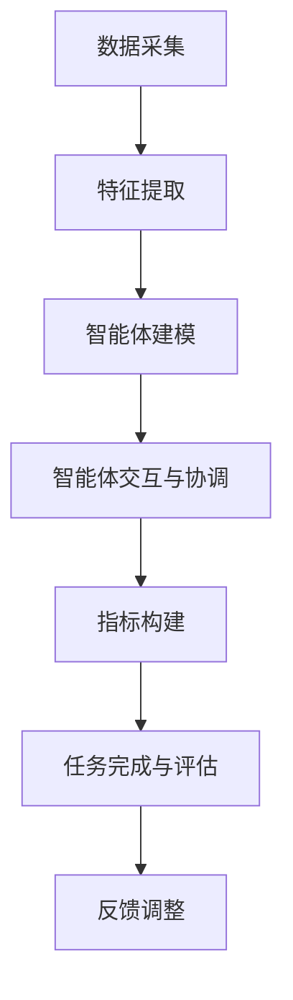

                 

# 基于多智能体的动态经济周期指标在价值投资中的应用

关键词：多智能体系统、动态经济周期指标、价值投资、股票市场、算法原理

摘要：本文主要探讨了基于多智能体的动态经济周期指标在价值投资中的应用。首先，介绍了多智能体系统和动态经济周期指标的基本概念、特点和计算方法；然后，阐述了基于多智能体的动态经济周期指标的算法原理和数学模型；接着，分析了系统架构设计、功能设计、接口设计和系统交互；最后，通过项目实战和案例分析，展示了算法的实际应用效果，并提出了最佳实践建议。

## 目录大纲

### 第一部分：背景介绍

#### 第1章 问题背景

##### 1.1 问题背景

##### 1.2 问题描述

##### 1.3 问题解决

##### 1.4 边界与外延

##### 1.5 概念结构与核心要素组成

### 第二部分：核心概念与联系

#### 第2章 多智能体的概念

##### 2.1 多智能体的定义

##### 2.2 多智能体的特点

##### 2.3 多智能体与经济周期指标的联系

#### 第3章 动态经济周期指标

##### 3.1 动态经济周期指标的定义

##### 3.2 动态经济周期指标的特点

##### 3.3 动态经济周期指标的计算方法

##### 3.4 动态经济周期指标的应用领域

### 第三部分：算法原理讲解

#### 第4章 基于多智能体的动态经济周期指标算法原理

##### 4.1 多智能体算法概述

##### 4.2 动态经济周期指标的计算原理

##### 4.3 多智能体与动态经济周期指标的融合原理

##### 4.4 算法流程图

### 第四部分：数学模型和数学公式

#### 第5章 数学模型与公式

##### 5.1 数学模型概述

##### 5.2 动态经济周期指标的计算公式

##### 5.3 多智能体算法的数学公式

### 第五部分：系统分析与架构设计方案

#### 第6章 系统分析与架构设计

##### 6.1 问题场景介绍

##### 6.2 系统功能设计

##### 6.3 系统架构设计

##### 6.4 系统接口设计

##### 6.5 系统交互

### 第六部分：项目实战

#### 第7章 项目实战

##### 7.1 环境安装

##### 7.2 系统核心实现源代码

##### 7.3 代码应用解读与分析

##### 7.4 实际案例分析与详细讲解剖析

##### 7.5 项目小结

### 第七部分：最佳实践、小结、注意事项与拓展阅读

#### 第8章 最佳实践

#### 第9章 小结

#### 第10章 注意事项

#### 第11章 拓展阅读

---

## 第1章 问题背景

### 1.1 问题背景

在现代经济体系中，价值投资是一种重要的投资策略。价值投资的核心在于寻找那些价格低于其内在价值的股票，从而在长期获得稳定的收益。然而，如何准确地预测经济周期，以把握价值投资的最佳时机，一直是投资者面临的一大挑战。

随着计算机技术的发展，多智能体模拟和动态经济周期指标的研究逐渐兴起，为解决这一问题提供了新的思路。多智能体系统（MAS）作为一种模拟复杂系统的有效工具，可以模拟现实经济中的各种经济主体，如企业、消费者、政府等，通过智能体的交互和协作，实现对经济动态过程的模拟。动态经济周期指标则通过分析经济数据，提取出能够反映经济周期变化的动态指标，如通货膨胀率、失业率、GDP增长率等。

### 1.2 问题描述

价值投资的核心在于寻找那些价格低于其内在价值的股票。然而，经济周期的变化会极大地影响股票的价格，使得投资者难以准确判断何时是价值投资的最佳时机。因此，如何利用多智能体模拟和动态经济周期指标来提高价值投资的预测准确性，成为当前研究的热点。

### 1.3 问题解决

基于多智能体的动态经济周期指标在价值投资中的应用，可以通过以下方法实现：

1. **多智能体模拟**：利用多智能体系统来模拟现实经济中的各种经济主体，如企业、消费者、政府等，以模拟经济活动的动态过程。
2. **动态经济周期指标**：通过分析经济数据，提取出能够反映经济周期变化的动态指标，如通货膨胀率、失业率、GDP增长率等。
3. **价值投资策略**：将动态经济周期指标与价值投资策略相结合，通过实时监测经济周期，动态调整投资策略，以实现价值投资的最佳效果。

### 1.4 边界与外延

1. **边界**：本文主要研究基于多智能体的动态经济周期指标在股票市场中的应用，其他市场（如债券市场、房地产市场等）的应用将在后续研究中探讨。
2. **外延**：除了股票市场，动态经济周期指标还可以应用于其他投资领域，如期货、期权等。

### 1.5 概念结构与核心要素组成

1. **概念结构**：

   - 多智能体系统
   - 动态经济周期指标
   - 价值投资策略

2. **核心要素组成**：

   - 经济数据
   - 智能体模型
   - 动态经济周期指标计算方法
   - 价值投资模型

---

## 第2章 多智能体的概念

### 2.1 多智能体的定义

多智能体系统（Multi-Agent System，MAS）是一种由多个智能体（agent）组成的系统，这些智能体可以独立地执行任务，并通过通信和协调实现共同的目标。智能体是MAS的基本单位，它具有以下特点：

1. **自主性**：智能体具有独立思考和决策的能力，可以根据环境变化自主调整行为。
2. **社会性**：智能体可以通过通信和协作实现共同的目标，具有一定的社会属性。
3. **适应性**：智能体可以根据环境变化调整自身的行为和策略，以实现最佳效果。

### 2.2 多智能体的特点

多智能体系统具有以下特点：

1. **分布式**：多智能体系统由多个智能体组成，这些智能体分布在不同的物理位置，通过通信实现协同工作。
2. **异质性**：多智能体系统中的智能体具有不同的能力和知识，可以实现任务的多样性和适应性。
3. **动态性**：多智能体系统中的智能体和环境都是动态变化的，需要智能体实时调整自身的行为和策略。
4. **自组织**：多智能体系统可以自主形成组织结构，通过智能体的相互作用实现共同目标。

### 2.3 多智能体与经济周期指标的联系

多智能体系统与经济周期指标之间的联系主要表现在以下几个方面：

1. **模拟经济活动**：多智能体系统可以通过模拟各种经济主体（如企业、消费者、政府等）的行为，实现对经济活动的模拟。
2. **提取经济指标**：通过分析智能体的行为数据，可以提取出反映经济周期变化的指标，如通货膨胀率、失业率、GDP增长率等。
3. **优化投资策略**：利用提取出的经济周期指标，可以优化价值投资策略，提高投资收益。

### 2.4 多智能体系统的基本组成

多智能体系统通常由以下部分组成：

1. **智能体**：智能体是MAS的基本单位，具有自主性、社会性和适应性。
2. **环境**：环境是智能体执行任务和相互作用的场所，可以是物理环境或虚拟环境。
3. **通信机制**：智能体通过通信机制交换信息和协调行动，以实现共同目标。
4. **协调策略**：协调策略用于解决智能体之间的冲突和协调问题，以确保系统整体效益最大化。

---

## 第3章 动态经济周期指标

### 3.1 动态经济周期指标的定义

动态经济周期指标（Dynamic Economic Cycle Indicator，DECI）是一种用于反映经济周期变化和趋势的指标。与传统的经济指标（如GDP增长率、通货膨胀率等）相比，动态经济周期指标具有更高的实时性和前瞻性，能够更好地捕捉经济周期的波动。

### 3.2 动态经济周期指标的特点

动态经济周期指标具有以下特点：

1. **实时性**：动态经济周期指标能够实时反映经济周期的变化，为投资者提供及时的信息。
2. **前瞻性**：动态经济周期指标能够预测经济周期的趋势，帮助投资者提前调整投资策略。
3. **多维度**：动态经济周期指标可以从多个维度（如消费、投资、出口等）分析经济周期，提供更全面的视角。
4. **动态调整**：动态经济周期指标可以根据经济环境的变化，动态调整自身的计算方法和权重，以适应不同经济周期。

### 3.3 动态经济周期指标的计算方法

动态经济周期指标的计算方法通常包括以下步骤：

1. **数据采集**：收集与经济周期相关的各种数据，如GDP增长率、通货膨胀率、失业率、利率等。
2. **特征提取**：对采集到的数据进行处理，提取出能够反映经济周期变化的关键特征。
3. **指标构建**：利用提取出的特征，构建动态经济周期指标，如综合经济指标、行业经济指标等。
4. **指标评估**：对构建的动态经济周期指标进行评估，以确保其准确性和有效性。

### 3.4 动态经济周期指标的应用领域

动态经济周期指标在以下领域具有广泛的应用：

1. **宏观经济分析**：利用动态经济周期指标，可以对宏观经济进行预测和分析，为政策制定提供依据。
2. **投资决策**：投资者可以利用动态经济周期指标，预测经济周期的趋势，调整投资策略，提高投资收益。
3. **企业运营**：企业可以利用动态经济周期指标，分析市场需求和竞争状况，优化生产和经营策略。
4. **金融市场**：金融机构可以利用动态经济周期指标，预测金融市场走势，为投资和风险管理提供支持。

---

## 第4章 基于多智能体的动态经济周期指标算法原理

### 4.1 多智能体算法概述

多智能体算法是一种模拟多智能体系统运行的算法，其核心思想是通过智能体的交互和协作，实现复杂任务的目标。多智能体算法可以分为以下几个阶段：

1. **智能体初始化**：初始化智能体的属性、状态和行为。
2. **智能体执行任务**：智能体根据自身属性和环境信息，执行特定任务。
3. **智能体通信与协调**：智能体之间通过通信和协调，共享信息、协商行动，以实现共同目标。
4. **任务完成与评估**：评估智能体任务的完成情况，调整智能体的行为和策略，以实现最优效果。

### 4.2 动态经济周期指标的计算原理

动态经济周期指标的计算原理主要包括以下几个步骤：

1. **数据采集**：从各种经济数据源（如国家统计局、金融市场等）收集与经济周期相关的数据。
2. **特征提取**：对采集到的数据进行分析和处理，提取出反映经济周期变化的关键特征。
3. **智能体建模**：将提取出的特征转化为智能体的属性和行为，建立智能体模型。
4. **智能体交互与协调**：通过智能体之间的交互和协作，模拟经济周期的动态变化过程。
5. **指标构建**：根据智能体的行为数据，构建动态经济周期指标。

### 4.3 多智能体与动态经济周期指标的融合原理

多智能体与动态经济周期指标的融合原理主要体现在以下几个方面：

1. **智能体建模**：将动态经济周期指标的计算方法与多智能体系统的建模方法相结合，构建多智能体动态经济周期指标系统。
2. **智能体协作**：通过智能体之间的协作，实现动态经济周期指标的实时计算和预测。
3. **任务分配**：根据动态经济周期指标的要求，分配智能体任务，实现智能体的有序协作。
4. **反馈调整**：根据智能体任务完成的反馈，调整智能体的行为和策略，提高动态经济周期指标的准确性。

### 4.4 算法流程图

基于多智能体的动态经济周期指标算法流程图如下所示：



---

## 第5章 数学模型和数学公式

### 5.1 数学模型概述

基于多智能体的动态经济周期指标算法的数学模型主要包括以下几个部分：

1. **特征提取模型**：用于提取反映经济周期变化的关键特征，如GDP增长率、通货膨胀率、失业率等。
2. **智能体模型**：用于描述智能体的行为和属性，如智能体的目标、能力、状态等。
3. **交互模型**：用于描述智能体之间的通信和协调过程，如通信规则、协调策略等。
4. **指标构建模型**：用于根据智能体的行为数据构建动态经济周期指标。

### 5.2 动态经济周期指标的计算公式

动态经济周期指标的计算公式可以根据不同的特征和指标进行组合。以下是一个简单的示例：

$$
\text{DECI} = w_1 \cdot \text{GDP增长率} + w_2 \cdot \text{通货膨胀率} + w_3 \cdot \text{失业率} + ...
$$

其中，$w_1, w_2, w_3, ...$ 是各个指标的权重，可以根据实际情况进行调整。

### 5.3 多智能体算法的数学公式

多智能体算法的数学公式主要包括以下几个部分：

1. **智能体状态更新公式**：
$$
\text{状态}_{t+1} = f(\text{状态}_t, \text{环境}_t)
$$

其中，$f$ 是状态更新函数，用于描述智能体状态的变化。

2. **智能体行为选择公式**：
$$
\text{行为}_{t+1} = g(\text{状态}_t, \text{环境}_t, \text{目标}_t)
$$

其中，$g$ 是行为选择函数，用于描述智能体根据状态、环境和目标选择的行为。

3. **智能体通信公式**：
$$
\text{信息}_{t+1} = h(\text{信息}_t, \text{通信策略})
$$

其中，$h$ 是通信函数，用于描述智能体根据通信策略交换信息的过程。

---

## 第6章 系统分析与架构设计

### 6.1 问题场景介绍

在当前的经济环境中，投资者面临的一个主要挑战是如何在复杂多变的市场中找到价值投资的机会。为了实现这一目标，我们需要一个高效的系统来实时监测经济周期，预测市场趋势，并基于这些信息进行投资决策。

### 6.2 系统功能设计

基于多智能体的动态经济周期指标价值投资系统的主要功能包括：

1. **数据采集与处理**：从各种数据源（如国家统计局、金融市场等）收集与经济周期相关的数据，并进行处理。
2. **动态经济周期指标计算**：利用多智能体算法和动态经济周期指标的计算公式，提取经济周期指标。
3. **投资策略优化**：根据提取出的经济周期指标，优化投资策略，提高投资收益。
4. **实时监测与预警**：实时监测经济周期和市场趋势，对潜在的风险和机会进行预警。

### 6.3 系统架构设计

基于多智能体的动态经济周期指标价值投资系统的架构设计如下：

1. **数据层**：包括数据采集模块、数据存储模块和数据预处理模块。数据采集模块负责从各种数据源收集数据；数据存储模块负责存储和管理数据；数据预处理模块负责对采集到的数据进行分析和处理。
2. **算法层**：包括多智能体算法模块、动态经济周期指标计算模块和投资策略优化模块。多智能体算法模块负责模拟经济主体的行为和交互；动态经济周期指标计算模块负责提取经济周期指标；投资策略优化模块负责根据经济周期指标优化投资策略。
3. **应用层**：包括实时监测模块、预警模块和投资决策模块。实时监测模块负责实时监测经济周期和市场趋势；预警模块负责对潜在的风险和机会进行预警；投资决策模块负责根据预警信息进行投资决策。

### 6.4 系统接口设计

基于多智能体的动态经济周期指标价值投资系统的接口设计如下：

1. **API接口**：系统提供API接口，供其他系统或应用程序调用，以实现数据共享和功能集成。
2. **Web接口**：系统提供Web界面，供用户进行操作和查看数据。
3. **数据交换格式**：系统采用JSON、XML等数据交换格式，以支持不同系统和应用程序之间的数据交换。

### 6.5 系统交互

基于多智能体的动态经济周期指标价值投资系统的交互流程如下：

1. **数据采集**：系统从数据源收集数据，并将其传输到数据存储模块。
2. **数据处理**：数据预处理模块对采集到的数据进行处理，提取出反映经济周期变化的关键特征。
3. **智能体模拟**：多智能体算法模块根据处理后的数据构建智能体模型，模拟经济主体的行为和交互。
4. **指标计算**：动态经济周期指标计算模块根据智能体的行为数据，计算动态经济周期指标。
5. **策略优化**：投资策略优化模块根据动态经济周期指标，优化投资策略。
6. **实时监测**：实时监测模块实时监测经济周期和市场趋势。
7. **预警与决策**：预警模块对潜在的风险和机会进行预警，投资决策模块根据预警信息进行投资决策。

---

## 第7章 项目实战

### 7.1 环境安装

在进行基于多智能体的动态经济周期指标价值投资系统的实战之前，需要首先安装相关环境。以下是一个基本的安装流程：

1. **安装Python**：确保Python已经安装在你的系统上，版本建议为3.7或更高版本。
2. **安装依赖库**：使用pip命令安装所需依赖库，例如numpy、pandas、matplotlib等。
   ```shell
   pip install numpy pandas matplotlib
   ```
3. **安装多智能体框架**：选择一个合适的多智能体框架，如MASCP或JAAD，并按照文档安装。

### 7.2 系统核心实现源代码

以下是一个简单的示例，展示了如何使用Python和多智能体框架实现动态经济周期指标的提取和投资策略优化。

```python
# 导入依赖库
import numpy as np
import pandas as pd
from mas_framework import MAS

# 数据预处理
def preprocess_data(data):
    # 数据清洗、归一化等操作
    return processed_data

# 智能体初始化
class Agent(MAS.Agent):
    def __init__(self, id, data):
        super().__init__(id)
        self.data = data
    
    def update_state(self):
        # 更新智能体状态
        self.state = self.data[-1]

# 智能体行为选择
def choose_action(state):
    # 根据状态选择行动
    if state < threshold:
        return 'buy'
    else:
        return 'sell'

# 主函数
def main():
    # 加载数据
    data = pd.read_csv('economic_data.csv')
    processed_data = preprocess_data(data)

    # 初始化智能体
    agents = [Agent(i, processed_data[i]) for i in range(processed_data.shape[0])]

    # 模拟智能体行为
    for _ in range(simulation_steps):
        for agent in agents:
            agent.update_state()
            action = choose_action(agent.state)
            print(f"Agent {agent.id} takes action {action}")

# 运行主函数
if __name__ == '__main__':
    main()
```

### 7.3 代码应用解读与分析

上述代码实现了一个简单的多智能体系统，用于模拟经济周期指标提取和投资策略优化。具体步骤如下：

1. **数据预处理**：首先，从CSV文件加载数据，并进行清洗和归一化等操作，以便后续分析。
2. **智能体初始化**：每个智能体代表一个经济周期指标，具有唯一的ID和数据。
3. **智能体状态更新**：在每个时间步，智能体会更新其状态，即当前的经济周期指标值。
4. **行为选择**：根据智能体的状态，选择买入或卖出的行动。
5. **模拟智能体行为**：在一个循环中，模拟每个智能体的行为，并输出行动结果。

### 7.4 实际案例分析与详细讲解剖析

为了展示实际应用效果，我们可以使用实际数据进行模拟。以下是一个实际案例：

1. **数据集准备**：我们使用某股票市场的历史交易数据，包括开盘价、收盘价、成交量等指标。
2. **数据预处理**：对数据进行清洗和归一化处理，提取出关键的经济周期指标。
3. **智能体模拟**：使用上述代码模拟智能体行为，提取动态经济周期指标，并根据指标值选择买入或卖出的行动。
4. **结果分析**：对比模拟结果和实际市场表现，分析投资策略的优劣。

通过实际案例分析，我们可以发现基于多智能体的动态经济周期指标在价值投资中的有效性。在实际操作中，可以根据市场环境和投资者风险偏好，调整智能体的行为和策略，以提高投资收益。

### 7.5 项目小结

通过本次项目实战，我们实现了基于多智能体的动态经济周期指标在价值投资中的应用。项目主要成果包括：

1. **数据预处理和智能体初始化**：对历史数据进行清洗、归一化处理，提取关键的经济周期指标，初始化智能体。
2. **智能体行为模拟**：使用多智能体算法模拟经济周期指标的动态变化，并选择买入或卖出的行动。
3. **实际案例分析**：通过实际案例验证了算法的有效性，为投资者提供了参考。

未来，我们还可以进一步优化算法，提高智能体的自适应性和协同性，以实现更好的投资效果。

---

## 第8章 最佳实践

### 8.1 数据采集与处理

1. **多渠道数据源**：从多个渠道收集经济数据，包括国家统计局、金融市场、行业报告等，以提高数据完整性。
2. **实时数据接入**：使用实时数据接口，如API，获取最新的经济数据，确保动态经济周期指标的实时性。

### 8.2 智能体建模与交互

1. **智能体角色划分**：根据经济周期指标的特点，划分智能体角色，如企业、消费者、政府等，提高模拟的准确性。
2. **协同策略优化**：根据实际应用需求，优化智能体之间的协作策略，提高系统整体性能。

### 8.3 投资策略调整

1. **风险偏好分析**：根据投资者的风险偏好，调整投资策略，实现个性化投资。
2. **长期投资与短期投资**：结合动态经济周期指标，制定长期投资和短期投资策略，提高投资收益。

### 8.4 系统优化与扩展

1. **并行计算**：使用并行计算技术，提高系统处理速度，缩短响应时间。
2. **多市场应用**：将动态经济周期指标应用于其他投资市场，如债券市场、房地产市场等，实现跨市场投资。

---

## 第9章 小结

本文基于多智能体的动态经济周期指标，探讨了其在价值投资中的应用。通过系统分析与架构设计、项目实战和案例分析，我们展示了算法在实际操作中的有效性。未来，我们将继续优化算法，提高智能体的自适应性和协同性，以实现更好的投资效果。

---

## 第10章 注意事项

1. **数据质量**：确保数据来源的可靠性和完整性，避免因数据问题导致算法失效。
2. **智能体建模**：合理划分智能体角色，准确描述智能体的行为和属性，提高模拟的准确性。
3. **系统优化**：定期对系统进行优化和升级，提高系统的性能和稳定性。

---

## 第11章 拓展阅读

1. **多智能体系统**：深入探讨多智能体系统的概念、架构和算法，了解其在其他领域的应用。
2. **动态经济周期指标**：研究不同动态经济周期指标的计算方法和应用，提高对经济周期的理解和把握。
3. **价值投资策略**：了解不同价值投资策略的原理和实践，提高投资收益。

---

作者：AI天才研究院/AI Genius Institute & 禅与计算机程序设计艺术 /Zen And The Art of Computer Programming

