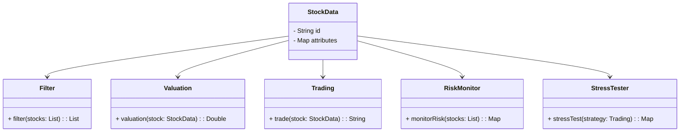
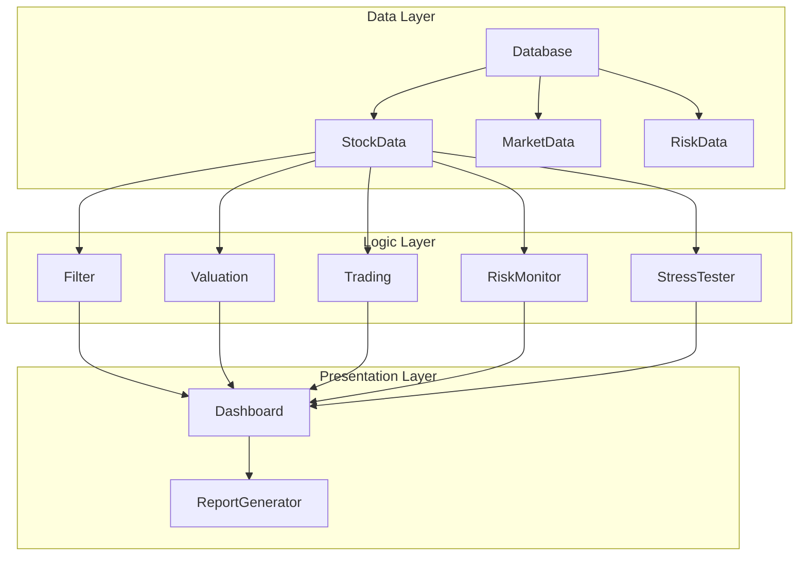
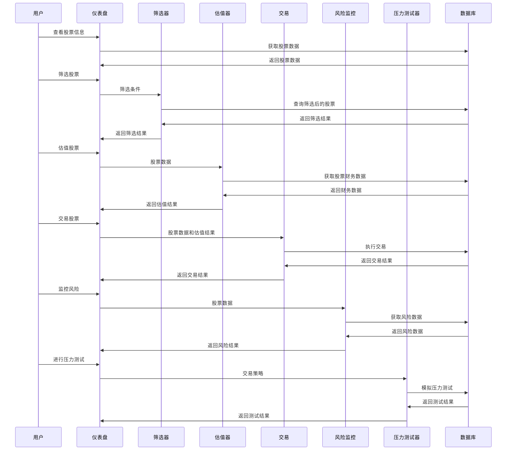

                 


### 文章标题

# 基于多智能体的情景分析和压力测试在价值投资中的应用

### 文章关键词

多智能体系统、情景分析、压力测试、价值投资、算法设计

### 文章摘要

本文旨在探讨如何将多智能体系统、情景分析和压力测试应用于价值投资领域。通过详细分析多智能体的基本概念、建模与设计方法，以及情景分析和压力测试的理论基础，本文将展示如何结合这些技术构建一个高效的价值投资策略。文章还将通过具体案例，展示实际操作过程和结果分析，为投资者提供有益的参考。

---

## 第一部分：多智能体系统的基本概念

### 第1章：多智能体系统的概述

#### 1.1 多智能体系统的定义

多智能体系统（MAS，Multi-Agent Systems）是由多个智能体（agent）通过一定的通信协议和规则相互作用、协同完成复杂任务的系统。每个智能体都是具有自主性、社交性、反应性和主动性的独立实体，可以在环境中感知、决策并采取行动。

#### 1.2 多智能体系统的分类

根据智能体的类型和协作方式，多智能体系统可以分为以下几类：

1. **协同智能体系统**：智能体之间通过合作、协调来完成任务。
2. **竞争智能体系统**：智能体之间通过竞争、对抗来达到目标。
3. **混合智能体系统**：既包含协同智能体，也包含竞争智能体。

#### 1.3 多智能体系统的特点与优势

多智能体系统的特点包括：

- **自主性**：智能体可以独立自主地决策和行动。
- **社交性**：智能体之间可以通过通信进行交互。
- **反应性**：智能体可以快速响应环境变化。
- **主动性**：智能体可以主动采取行动，而不仅仅是被动响应。

多智能体系统的优势在于：

- **复杂性管理**：能够处理复杂、动态的任务。
- **灵活性**：智能体可以根据环境变化自适应调整行为。
- **扩展性**：可以轻松扩展，以适应不同的任务和规模。

### 第2章：多智能体的建模与设计

#### 2.1 智能体的建模方法

智能体的建模方法主要包括：

- **基于规则的建模**：使用规则来描述智能体的行为。
- **基于行为的建模**：使用行为模型来描述智能体的行为。
- **基于行为的建模**：使用行为模型来描述智能体的行为。

#### 2.2 智能体之间的通信机制

智能体之间的通信机制主要包括：

- **直接通信**：智能体之间直接发送消息。
- **间接通信**：智能体通过中间件或代理进行通信。
- **广播通信**：智能体向所有其他智能体发送消息。

#### 2.3 多智能体系统的设计原则

多智能体系统的设计原则包括：

- **模块化**：将系统划分为多个独立的模块，每个模块负责特定的功能。
- **可扩展性**：系统应该能够适应不同的规模和任务。
- **灵活性**：系统应该能够快速适应环境变化。
- **鲁棒性**：系统应该能够应对意外情况，保持稳定运行。

### 第3章：情景分析的基础理论

#### 3.1 情景分析的定义与重要性

情景分析（Scenario Analysis）是对未来可能发生的情况进行详细分析的过程。它对于预测市场走势、评估投资策略具有重要意义。

#### 3.2 情景分析的步骤与方法

情景分析的步骤包括：

1. **确定情景变量**：识别可能影响投资决策的关键变量。
2. **构建情景**：根据情景变量，构建可能出现的情景。
3. **分析情景**：对每个情景进行详细分析，预测其可能的结果。
4. **决策**：根据情景分析结果，制定相应的投资策略。

情景分析的方法包括：

- **定性分析**：通过专家意见、历史数据等定性信息进行情景分析。
- **定量分析**：使用数学模型、统计分析等方法进行情景分析。

#### 3.3 情景分析在投资中的应用

情景分析在投资中的应用包括：

- **风险评估**：通过分析不同情景下的投资结果，评估投资风险。
- **策略制定**：根据情景分析结果，制定相应的投资策略。
- **决策支持**：为投资者提供决策支持，帮助其做出更明智的投资决策。

## 第二部分：压力测试与价值投资

### 第4章：压力测试的基本概念

#### 4.1 压力测试的定义与目的

压力测试（Stress Testing）是在模拟的高负载环境下测试系统性能的过程，旨在评估系统在极端条件下的稳定性、可靠性和性能。

#### 4.2 压力测试的类型与工具

压力测试的类型包括：

- **负载测试**：测试系统在高负载情况下的性能。
- **压力测试**：测试系统在极端负载情况下的稳定性。
- **性能测试**：测试系统的响应时间和处理能力。

常见的压力测试工具有：

- **JMeter**：适用于Web应用程序的性能测试。
- **LoadRunner**：适用于各种类型应用程序的性能测试。
- **Gatling**：适用于Web应用程序的性能测试。

#### 4.3 压力测试的过程与策略

压力测试的过程包括：

1. **测试规划**：确定测试目标、测试环境、测试工具等。
2. **测试设计**：设计测试场景、测试用例等。
3. **测试执行**：执行测试，收集测试数据。
4. **结果分析**：分析测试结果，评估系统性能。

压力测试的策略包括：

- **逐步增加负载**：逐渐增加负载，观察系统性能变化。
- **极端测试**：在极端条件下测试系统性能。
- **模拟真实场景**：模拟实际使用情况，测试系统性能。

### 第5章：价值投资策略

#### 5.1 价值投资的基本原理

价值投资（Value Investing）是一种投资策略，强调购买价格低于其内在价值的股票。其核心原理是“物以稀为贵”，即寻找被市场低估的优质股票。

#### 5.2 价值投资的策略与方法

价值投资的策略包括：

- **股票筛选**：通过财务分析、行业分析等，筛选出潜在的投资目标。
- **估值方法**：使用折现现金流模型（DCF）、市盈率（PE）、市净率（PB）等方法，评估股票的内在价值。
- **投资组合**：构建多元化的投资组合，降低风险。

#### 5.3 价值投资的案例分析

通过具体案例，分析价值投资的实施过程和效果。

## 第三部分：多智能体情景分析与压力测试的结合

### 第6章：多智能体情景分析与压力测试的结合

#### 6.1 多智能体情景分析与压力测试的结合点

多智能体情景分析与压力测试的结合点在于：

- **情景模拟**：使用多智能体系统模拟各种投资情景。
- **性能评估**：通过压力测试评估多智能体系统在情景下的性能。

#### 6.2 基于多智能体的价值投资策略设计

基于多智能体的价值投资策略设计包括：

- **智能体分工**：根据投资需求，设计不同的智能体，分别负责股票筛选、估值、投资决策等。
- **情景分析**：使用多智能体系统模拟不同投资情景，评估策略效果。
- **压力测试**：对多智能体系统进行压力测试，确保其稳定性和性能。

#### 6.3 案例研究：某股票市场的情景分析与压力测试应用

通过具体案例，展示如何将多智能体情景分析和压力测试应用于价值投资策略设计。

## 第四部分：实践应用

### 第7章：环境搭建与工具介绍

#### 7.1 实践环境搭建

介绍如何搭建实践环境，包括软件安装、硬件配置等。

#### 7.2 必要的编程工具与软件

介绍必要的编程工具和软件，如Python、JMeter等。

#### 7.3 数据获取与预处理

介绍如何获取和处理数据，包括数据来源、数据清洗、数据格式转换等。

### 第8章：多智能体价值投资系统的实现

#### 8.1 源代码实现

介绍多智能体价值投资系统的源代码实现，包括智能体建模、情景分析、压力测试等。

#### 8.2 系统架构与接口设计

介绍多智能体价值投资系统的架构设计，包括系统模块、接口设计等。

#### 8.3 系统核心功能解析

介绍多智能体价值投资系统的核心功能，包括智能体建模、情景分析、压力测试等。

### 第9章：实际案例分析

#### 9.1 案例背景

介绍案例背景，包括投资目标、市场环境等。

#### 9.2 情景分析与压力测试实施

介绍如何进行情景分析和压力测试，包括测试场景设计、测试执行等。

#### 9.3 结果分析与讨论

分析情景分析和压力测试的结果，讨论多智能体价值投资策略的效果。

### 第10章：总结与展望

#### 10.1 总结与反思

总结文章的核心内容，反思多智能体情景分析和压力测试在价值投资中的应用。

#### 10.2 未来研究方向

展望未来研究方向，讨论多智能体系统在价值投资领域的潜在应用。

#### 10.3 拓展阅读

推荐相关阅读材料，帮助读者深入了解多智能体系统和价值投资。

---

作者：AI天才研究院/AI Genius Institute & 禅与计算机程序设计艺术 /Zen And The Art of Computer Programming 

### 第1章：多智能体系统的概述

#### 1.1 多智能体系统的定义

多智能体系统（MAS，Multi-Agent Systems）是由多个智能体（agent）通过一定的通信协议和规则相互作用、协同完成复杂任务的系统。每个智能体都是具有自主性、社交性、反应性和主动性的独立实体，可以在环境中感知、决策并采取行动。

在多智能体系统中，智能体可以被视为自主的计算实体，它们能够自主地执行任务，并与其他智能体进行交互。这种自主性使得智能体可以独立于系统其他部分工作，并能够在没有外部干预的情况下自主决策和行动。

#### 1.2 多智能体系统的分类

多智能体系统可以根据智能体的类型和协作方式分为以下几类：

1. **协同智能体系统**：智能体之间通过合作、协调来完成任务。这类系统中的智能体通常具有共同的目标，并通过通信和协作来实现这一目标。

2. **竞争智能体系统**：智能体之间通过竞争、对抗来达到目标。这类系统中的智能体通常具有不同的目标，并可能通过竞争来争夺资源或市场份额。

3. **混合智能体系统**：既包含协同智能体，也包含竞争智能体。这类系统中的智能体既有共同目标，又有竞争关系，通过复杂的交互和协作来完成系统任务。

#### 1.3 多智能体系统的特点与优势

多智能体系统的特点主要包括以下几个方面：

1. **自主性**：智能体可以独立自主地决策和行动，而不需要依赖中心控制。

2. **社交性**：智能体之间可以通过通信机制进行交互，共享信息和知识。

3. **反应性**：智能体可以快速响应环境变化，采取相应的行动。

4. **主动性**：智能体可以主动采取行动，而不仅仅是被动响应。

多智能体系统的优势主要体现在以下几个方面：

1. **复杂性管理**：多智能体系统可以将复杂任务分解为多个子任务，由不同的智能体分别处理，从而降低系统的复杂性。

2. **灵活性**：智能体可以根据环境变化自适应调整行为，使得系统能够适应不同的情况。

3. **扩展性**：多智能体系统可以轻松扩展，以适应不同的任务和规模。

4. **鲁棒性**：多智能体系统具有较高的鲁棒性，能够在面对意外情况时保持稳定运行。

#### 1.4 多智能体系统的挑战

尽管多智能体系统具有许多优势，但在实际应用中也面临着一些挑战：

1. **通信开销**：智能体之间的通信可能会导致系统性能下降，特别是在大规模系统中。

2. **协调困难**：智能体之间的协调和同步可能比较复杂，特别是在动态环境中。

3. **可靠性和安全性**：多智能体系统中的智能体可能会出现故障或被攻击，需要确保系统的可靠性和安全性。

4. **复杂性**：设计、实现和维护多智能体系统可能需要更多的资源和时间。

#### 1.5 多智能体系统在投资领域的应用

在投资领域，多智能体系统可以应用于以下几个方面：

1. **智能交易系统**：利用多智能体系统进行股票交易，通过智能体的协作和竞争，实现自动化的交易策略。

2. **风险评估**：使用多智能体系统对投资组合进行风险评估，分析不同市场情景下的风险。

3. **投资策略优化**：通过多智能体系统模拟不同的投资策略，优化投资组合的收益和风险。

4. **市场预测**：利用多智能体系统分析市场数据，预测市场走势，为投资决策提供支持。

综上所述，多智能体系统在投资领域具有广泛的应用前景，通过合理的智能体设计和协作机制，可以提高投资决策的效率和准确性。

---

### 第2章：多智能体的建模与设计

#### 2.1 智能体的建模方法

智能体的建模是构建多智能体系统的基础，涉及到如何定义智能体的行为、能力以及与环境的交互方式。智能体的建模方法可以分为基于规则的方法、基于行为的方法和基于混合的方法。

1. **基于规则的方法**：
   基于规则的方法是通过预定义的规则集来描述智能体的行为。智能体根据当前环境和自身的状态，选择适当的规则执行相应的动作。这种方法的主要优点是规则明确、易于理解和实现，但缺点是规则集可能过于复杂，难以涵盖所有可能的情况，并且缺乏灵活性。

   **示例**：
   - 规则1：如果市场指数上升，则买入股票。
   - 规则2：如果市场指数下降，则卖出股票。

2. **基于行为的方法**：
   基于行为的方法是通过定义智能体的行为模型来描述其行为。行为模型通常是基于事件驱动的，智能体根据事件的发生来调整自己的状态并采取相应的行动。这种方法的主要优点是灵活性较高，智能体能够适应环境的变化，但缺点是实现较为复杂，需要详细的事件定义和状态管理。

   **示例**：
   - 行为1：当收到“市场指数上升”事件时，执行“买入股票”动作。
   - 行为2：当收到“市场指数下降”事件时，执行“卖出股票”动作。

3. **基于混合的方法**：
   基于混合的方法结合了基于规则和基于行为的方法的优点，通过规则和行为模型共同描述智能体的行为。这种方法在规则无法覆盖所有情况时，可以通过行为模型进行补充，从而提高智能体的灵活性和适应性。

   **示例**：
   - 规则1：如果市场指数上升超过3%，则执行“买入股票”行为。
   - 行为1：当市场指数下降时，重新评估股票价格是否低于其内在价值。

#### 2.2 智能体之间的通信机制

智能体之间的通信机制是多智能体系统的重要组成部分，决定了智能体如何交换信息和协调行动。常见的通信机制包括直接通信、间接通信和广播通信。

1. **直接通信**：
   直接通信是指智能体之间通过点对点的方式进行信息交换。这种通信机制简单直接，但适用于小规模的系统，在大规模系统中可能会导致通信开销增加。

   **示例**：
   - 智能体A向智能体B发送消息：“请提供最新的市场数据。”

2. **间接通信**：
   间接通信是指智能体通过中间件或代理进行通信，从而实现松散耦合。这种机制可以降低智能体之间的直接通信开销，提高系统的可扩展性，但会增加系统的复杂性和延迟。

   **示例**：
   - 智能体A将消息发送到消息队列，智能体B从消息队列中接收消息：“请提供最新的市场数据。”

3. **广播通信**：
   广播通信是指智能体向所有其他智能体发送消息，适用于需要广泛通知的场景。这种机制在提高通信效率的同时，也可能导致消息过载和资源浪费。

   **示例**：
   - 智能体A向所有智能体发送消息：“市场指数上升，请调整投资策略。”

#### 2.3 多智能体系统的设计原则

为了构建高效、稳定和灵活的多智能体系统，设计过程中需要遵循以下原则：

1. **模块化**：
   将系统划分为多个独立的模块，每个模块负责特定的功能。这种设计方法可以提高系统的可维护性和可扩展性。

2. **可扩展性**：
   系统应该能够适应不同的任务和规模。设计时需要考虑到未来可能的扩展需求，以便在需要时能够轻松添加新的智能体或功能。

3. **灵活性**：
   系统应该能够快速适应环境变化，智能体需要具备足够的灵活性来调整自己的行为和策略。

4. **鲁棒性**：
   系统需要能够应对意外情况，保持稳定运行。设计时需要考虑到智能体可能出现的故障，以及如何快速恢复和调整。

5. **安全性**：
   系统需要确保智能体的行为符合预期，防止恶意行为或攻击。设计时需要实现有效的权限控制和监控机制。

6. **可理解性**：
   系统的设计和实现需要易于理解和维护。文档和代码注释应该清晰明确，以便其他开发人员能够快速上手。

通过遵循上述设计原则，可以构建出高效、稳定和灵活的多智能体系统，从而在投资领域中发挥其强大的作用。

### 第3章：情景分析的基础理论

#### 3.1 情景分析的定义与重要性

情景分析（Scenario Analysis）是一种前瞻性分析工具，用于预测和评估未来可能发生的情况及其对投资决策的影响。情景分析通过对不同情景的构建和分析，帮助投资者识别潜在的风险和机会，从而制定更为明智的投资策略。

情景分析的定义可以理解为：在特定的假设条件下，对未来可能发生的一系列情况及其可能的结果进行详细分析和评估。这些情景可以是基于历史数据、专家意见或模型预测得出的，旨在为投资决策提供全面的视角。

情景分析在投资中的重要性主要体现在以下几个方面：

1. **风险管理**：通过分析不同情景下的投资结果，投资者可以评估潜在的风险，并采取相应的风险控制措施。

2. **策略制定**：情景分析为投资者提供了多种情景下的投资策略选择，有助于制定灵活的应对方案。

3. **决策支持**：情景分析的结果可以为投资决策提供数据支持，帮助投资者做出更为科学的决策。

4. **战略规划**：情景分析可以帮助投资者预见未来市场变化，从而制定长期的战略规划。

#### 3.2 情景分析的步骤与方法

情景分析的步骤通常包括以下几步：

1. **确定情景变量**：首先需要识别可能影响投资决策的关键变量，如市场指数、利率、政策变动等。

2. **构建情景**：根据情景变量，构建可能出现的情景。情景可以基于历史数据、专家意见或模型预测得出，通常包括最佳情景、最坏情景和预期情景等。

3. **分析情景**：对每个情景进行详细分析，预测其可能的结果。这包括评估投资组合在不同情景下的表现，如收益、风险和波动性等。

4. **制定策略**：根据情景分析结果，制定相应的投资策略。策略可以是静态的，也可以是动态的，以应对不同情景的变化。

5. **评估与调整**：定期对情景分析和投资策略进行评估和调整，以确保其与当前市场环境和预期结果相符。

情景分析的方法主要包括以下几种：

1. **定性分析**：通过专家意见、历史数据和案例研究等方法，对情景进行定性分析。这种方法适用于缺乏数据支持的情况，但需要依赖专家的经验和判断。

2. **定量分析**：使用数学模型、统计分析和数据挖掘等方法，对情景进行定量分析。这种方法可以提供更为精确和客观的分析结果，但需要依赖于高质量的数据和模型。

3. **模拟分析**：通过计算机模拟和仿真技术，模拟不同情景下的投资结果。这种方法可以模拟复杂的市场环境，但需要考虑计算资源和时间成本。

#### 3.3 情景分析在投资中的应用

情景分析在投资中的应用非常广泛，以下是一些典型的应用场景：

1. **股票投资**：通过情景分析，投资者可以预测不同市场情景下的股票价格走势，从而制定买入或卖出的策略。

2. **债券投资**：情景分析可以帮助投资者评估不同市场情景下债券收益和风险的变化，从而制定投资组合策略。

3. **外汇投资**：情景分析可以预测不同货币汇率的变化，帮助投资者进行外汇交易。

4. **组合投资**：通过情景分析，投资者可以评估不同投资组合在不同情景下的表现，从而优化组合策略。

5. **风险管理**：情景分析可以帮助投资者识别潜在的市场风险，并制定相应的风险控制措施。

6. **战略规划**：情景分析可以为企业的长期战略规划提供支持，帮助其预见市场变化，制定适应性的策略。

总之，情景分析是投资决策过程中不可或缺的工具，通过系统地分析和评估不同情景下的投资结果，投资者可以更好地应对市场变化，提高投资决策的科学性和有效性。

### 第4章：压力测试的基本概念

#### 4.1 压力测试的定义与目的

压力测试（Stress Testing）是一种用于评估系统在高负载或极端条件下性能和稳定性的测试方法。它通过模拟系统可能面临的最大负载或异常情况，来检测系统在压力环境下的行为，以确保系统能够稳定、高效地运行。

压力测试的定义可以概括为：在特定条件下，通过施加超过系统正常工作范围的外部负载，来观察系统的响应行为，从而评估系统性能和稳定性的测试过程。

压力测试的目的主要包括以下几个方面：

1. **性能评估**：通过施加高负载，评估系统在极端条件下的响应时间、吞吐量和资源利用率等性能指标，以确保系统能够满足性能要求。

2. **稳定性测试**：通过模拟异常情况，如大量并发请求、网络故障或数据库瓶颈等，来检测系统在压力下的稳定性，确保系统不会因为负载过高而崩溃或出现异常行为。

3. **故障发现**：在压力测试过程中，通过观察系统行为，可以发现潜在的故障和问题，从而提前进行修复和优化。

4. **容量规划**：通过压力测试，可以了解系统在高负载下的性能表现，为未来的容量规划和资源分配提供数据支持。

5. **风险评估**：压力测试可以帮助识别系统在极端条件下的风险点，从而制定相应的风险管理和应对策略。

#### 4.2 压力测试的类型与工具

压力测试可以分为多种类型，每种类型适用于不同的测试目的和场景。以下是一些常见的压力测试类型及其特点：

1. **负载测试（Load Testing）**：
   负载测试是一种最常见的压力测试类型，主要目的是评估系统在正常负载条件下的性能。测试过程中，通过逐渐增加负载，观察系统的响应时间、吞吐量等性能指标，以确保系统能够稳定处理预期负载。

2. **压力测试（Stress Testing）**：
   压力测试旨在评估系统在极端负载条件下的稳定性。测试过程中，施加超过系统正常工作范围的负载，以观察系统在高负载下的行为，包括崩溃、异常中断或资源耗尽等情况。

3. **强度测试（Endurance Testing）**：
   强度测试用于评估系统在长时间运行下的性能和稳定性。测试过程中，系统在持续高负载下运行一段时间，以检测系统在长时间运行过程中是否会出现性能下降或稳定性问题。

4. **异常测试（Anomaly Testing）**：
   异常测试通过模拟各种异常情况，如大量并发请求、网络故障、数据库瓶颈等，来检测系统在异常条件下的响应能力和恢复能力。

5. **容量测试（Capacity Testing）**：
   容量测试旨在确定系统可以承载的最大负载，以评估系统的容量极限。测试过程中，逐渐增加负载，直到系统无法承受，从而确定系统的最大容量。

常见的压力测试工具包括：

1. **JMeter**：
   JMeter是一个开源的性能测试工具，适用于Web应用程序的负载测试和压力测试。它支持多种协议，如HTTP、HTTPS、FTP、SOAP等，可以通过模拟大量用户行为来评估系统性能。

2. **LoadRunner**：
   LoadRunner是由Micro Focus开发的商业性能测试工具，适用于各种类型的应用程序，包括Web、数据库、服务器和网络等。它支持多种负载生成模式，并提供丰富的测试报告和分析功能。

3. **Gatling**：
   Gatling是一个开源的性能测试工具，适用于Web应用程序的性能测试。它使用Scala编写，可以通过模拟大量用户行为来评估系统性能，并提供详细的性能指标和报告。

4. **BlazeMeter**：
   BlazeMeter是一个云端的性能测试平台，支持JMeter和Gatling等工具。它提供了方便的自动化测试和扩展性，适用于大规模的负载测试和性能测试。

#### 4.3 压力测试的过程与策略

进行压力测试通常包括以下几个步骤：

1. **测试规划**：
   在开始测试前，需要制定详细的测试计划，包括测试目标、测试环境、测试工具选择、测试场景设计等。测试计划应考虑到系统的实际运行情况和预期负载，以确保测试的有效性和可行性。

2. **测试设计**：
   设计测试场景，包括确定测试的目标、测试的指标、测试的数据集等。测试设计应根据业务需求和系统特点，选择适当的测试方法和负载模式。

3. **测试执行**：
   在测试环境中执行测试，通过施加不同的负载，观察系统的响应行为。测试执行过程中，需要记录详细的测试数据，如响应时间、吞吐量、错误率等，以便后续分析。

4. **结果分析**：
   对测试结果进行详细分析，识别系统在压力下的性能瓶颈和问题。通过分析测试数据，可以评估系统的性能和稳定性，并为系统的优化和改进提供依据。

5. **优化与重测**：
   根据结果分析，对系统进行优化和改进，如调整系统配置、优化代码、增加硬件资源等。优化后，需要重新进行压力测试，验证改进措施的有效性。

进行压力测试的策略主要包括以下几个方面：

1. **逐步增加负载**：
   在测试过程中，逐步增加负载，以观察系统在不同负载条件下的性能变化。这种方法有助于发现系统在高负载下的瓶颈和问题。

2. **极端测试**：
   在测试过程中，模拟极端负载条件，如大量并发请求、网络故障等，以评估系统的极端性能和稳定性。

3. **模拟真实场景**：
   尽量模拟系统的真实运行场景，包括用户行为、网络条件等，以更准确地评估系统的性能。

4. **定期测试**：
   定期进行压力测试，以监控系统性能和稳定性的变化。定期测试有助于及时发现和解决潜在的问题。

通过遵循上述过程和策略，可以有效地进行压力测试，确保系统在高负载或极端条件下的性能和稳定性。

### 第5章：价值投资策略

#### 5.1 价值投资的基本原理

价值投资（Value Investing）是一种以公司内在价值为基础的投资策略，旨在通过购买价格低于其内在价值的股票来获取收益。这一策略的核心思想是“物以稀为贵”，即寻找被市场低估的优质股票，并在合适的时机买入。

价值投资的基本原理主要包括以下几点：

1. **价值评估**：
   通过评估公司的基本面，如财务状况、管理层能力、市场竞争力等，来确定其内在价值。常用的评估方法包括折现现金流模型（DCF）、市盈率（PE）、市净率（PB）等。

2. **安全边际**：
   安全边际是指股票的实际价格与其内在价值之间的差额。价值投资者倾向于在安全边际较大的情况下买入股票，以降低投资风险。

3. **长期持有**：
   价值投资强调长期持有，相信优质公司的价值最终会得到市场的认可，从而实现资本增值。

4. **分散投资**：
   通过构建多元化的投资组合，降低单一股票的风险，同时提高整体收益的稳定性。

#### 5.2 价值投资的策略与方法

价值投资的具体策略和方法包括以下几个步骤：

1. **股票筛选**：
   通过财务分析、行业分析等手段，筛选出具有投资价值的股票。筛选标准通常包括：
   - 财务健康：良好的盈利能力、稳定的现金流和健康的资产负债表。
   - 管理层能力：经验丰富、诚实可信、具备长期规划能力。
   - 行业前景：处于成长期或稳定期的行业，具备良好的发展潜力。
   - 市场地位：具备较高的市场份额和竞争优势。

2. **估值方法**：
   使用多种估值方法评估股票的内在价值，以确定其是否被低估。常用的估值方法包括：
   - 折现现金流模型（DCF）：通过预测公司的未来现金流，并折现到当前价值，来评估公司的内在价值。
   - 市盈率（PE）：通过比较公司市盈率与行业平均水平，判断股票是否被高估或低估。
   - 市净率（PB）：通过比较公司市净率与行业平均水平，评估公司的投资价值。

3. **买入时机**：
   根据市场情况，选择合适的时机买入股票。通常，在以下情况下买入股票较为合适：
   - 市场情绪低迷，股价低于内在价值。
   - 公司面临短期困境，但长期前景良好。
   - 财务数据发布后，市场反应过度悲观。

4. **持有与调整**：
   长期持有优质股票，定期跟踪其财务状况和市场表现，根据实际情况进行调整。持有期间，应保持冷静，避免因市场波动而频繁买卖。

5. **风险管理**：
   通过构建多元化的投资组合，降低单一股票的风险。同时，设置止损点，以防止投资损失进一步扩大。

#### 5.3 价值投资的案例分析

以下是一个简单的价值投资案例分析：

假设我们要分析一家名为“高科技医疗”的公司。首先，我们通过财务报表分析其盈利能力：
- 营业收入：过去三年复合增长率为20%。
- 净利润：过去三年复合增长率为25%。

其次，我们评估其财务健康状况：
- 资产负债表稳健，无重大债务。
- 现金流稳定，具备良好的偿债能力。

接着，我们分析其行业前景：
- 高科技医疗行业处于快速成长期，市场需求不断增长。
- 公司在行业中具备较强的竞争力，拥有多项核心技术。

然后，我们使用DCF模型评估其内在价值：
- 预测未来五年的自由现金流分别为1亿、1.2亿、1.5亿、1.8亿和2.2亿元。
- 折现率为10%。

根据DCF模型计算，公司内在价值约为14亿元。

当前股价为12亿元，低于内在价值，具备一定的安全边际。因此，我们认为这是一只值得投资的价值股票。

在持有期间，我们定期跟踪公司财务状况和市场表现，发现公司业绩持续增长，市场情绪逐渐好转。根据市场情况，我们继续持有该股票，并在股价上涨到15亿元时，逐步减仓，实现部分收益。

通过这个案例，我们可以看到价值投资的核心步骤和关键要素。在实际操作中，投资者需要根据具体情况进行灵活调整，以实现最佳的投资效果。

### 第6章：多智能体情景分析与压力测试的结合

#### 6.1 多智能体情景分析与压力测试的结合点

多智能体情景分析与压力测试的结合点在于它们共同的目标：评估系统在复杂和动态环境下的性能和稳定性。多智能体情景分析通过模拟不同的投资情景，帮助投资者理解潜在的市场变化和风险；而压力测试则通过施加高负载，评估系统在极端条件下的响应能力和可靠性。

1. **情景模拟与压力测试**：
   多智能体情景分析可以为压力测试提供情景基础，即在不同的市场条件下，智能体如何响应和调整其投资策略。压力测试则通过实际施加负载，验证多智能体系统在不同情景下的性能。

2. **风险评估与策略优化**：
   通过结合多智能体情景分析和压力测试，投资者可以更全面地评估风险，并优化投资策略。情景分析提供了不同情景下的投资结果，而压力测试则提供了系统在极端条件下的性能数据，两者结合可以更准确地预测系统在真实环境中的表现。

3. **动态调整与适应**：
   多智能体系统具有自主性和灵活性，可以通过情景分析和压力测试的结果，动态调整其投资策略，以适应不断变化的市场环境。这种动态调整能力是传统投资策略所不具备的。

#### 6.2 基于多智能体的价值投资策略设计

基于多智能体的价值投资策略设计涉及以下几个关键步骤：

1. **智能体分工**：
   设计不同的智能体，分别负责不同的任务，如股票筛选、估值、交易决策等。每个智能体根据其特定的功能模块，执行相应的操作。

2. **情景建模**：
   构建多种市场情景，包括正常市场条件、市场波动、突发事件等。每个情景都包含不同的市场参数，如股价、利率、政策变动等。

3. **智能体交互**：
   智能体之间通过通信机制进行交互，共享信息和决策。例如，估值智能体可以与交易智能体共享估值结果，以便交易智能体做出买入或卖出的决策。

4. **策略优化**：
   使用机器学习和优化算法，根据历史数据和模拟结果，优化智能体的决策策略。例如，通过强化学习，智能体可以学习如何在不同的情景下做出最优的决策。

5. **压力测试**：
   对智能体系统进行压力测试，评估其在极端条件下的性能和稳定性。压力测试可以帮助识别潜在的性能瓶颈和风险点，从而进行优化和改进。

#### 6.3 基于多智能体的价值投资策略设计案例

以下是一个基于多智能体的价值投资策略设计案例：

1. **智能体分工**：
   - 智能体A：负责股票筛选，根据财务指标、市场地位等因素筛选潜在的投资目标。
   - 智能体B：负责估值，使用DCF模型评估股票的内在价值。
   - 智能体C：负责交易决策，根据估值结果和市场情景，决定买入或卖出的时机。

2. **情景建模**：
   - 正常市场情景：市场稳定，股票价格波动在合理范围内。
   - 市场波动情景：市场波动较大，股价波动加剧。
   - 突发事件情景：市场受到突发事件影响，如政策变动、经济危机等。

3. **智能体交互**：
   - 智能体A筛选出潜在投资目标后，将结果传递给智能体B进行估值。
   - 智能体B完成估值后，将结果传递给智能体C，智能体C根据市场情景和估值结果，决定买入或卖出的时机。

4. **策略优化**：
   - 使用强化学习算法，根据历史数据和模拟结果，优化智能体的决策策略。
   - 智能体A、B、C不断调整其行为，以实现最优的投资结果。

5. **压力测试**：
   - 对智能体系统进行压力测试，模拟极端市场条件，评估系统在压力下的性能和稳定性。
   - 通过分析压力测试结果，发现潜在的性能瓶颈和风险点，进行优化和改进。

通过上述案例，我们可以看到，基于多智能体的价值投资策略设计如何通过情景分析和压力测试，实现动态调整和优化，从而提高投资决策的准确性和效率。

### 第7章：环境搭建与工具介绍

#### 7.1 实践环境搭建

为了进行基于多智能体的情景分析和压力测试在价值投资中的应用，我们需要搭建一个适合进行研究和实验的实践环境。以下是环境搭建的详细步骤：

1. **硬件配置**：
   - 服务器：至少需要一台高性能服务器，用于运行多智能体系统、数据库和测试工具。
   - 客户端：需要多台客户端计算机，用于模拟不同用户的请求和负载。

2. **软件安装**：
   - 操作系统：选择Linux操作系统，如Ubuntu或CentOS，以获得更好的稳定性和安全性。
   - 编程环境：安装Python、Java或其他编程语言的环境，以便进行智能体建模和算法实现。
   - 数据库：安装MySQL、PostgreSQL或MongoDB等数据库系统，用于存储股票数据、市场数据和测试结果。

3. **网络配置**：
   - 设置网络防火墙和路由规则，确保服务器和客户端之间的通信安全。
   - 配置虚拟专用网络（VPN），以便在不同地点进行远程测试。

4. **测试工具**：
   - 安装JMeter、LoadRunner、Gatling等性能测试工具，用于进行压力测试和性能评估。

#### 7.2 必要的编程工具与软件

在进行多智能体系统和价值投资策略的研究与实现时，以下编程工具和软件是必不可少的：

1. **Python**：
   - Python是一种广泛使用的编程语言，具有良好的扩展性和灵活性，适用于智能体建模和算法实现。
   - Python的库，如NumPy、Pandas、Scikit-learn等，用于数据处理、数值计算和机器学习。

2. **Java**：
   - Java是一种强类型的编程语言，适用于构建高性能的多智能体系统。
   - Java的库，如Spring Boot、Hibernate等，用于快速开发和部署智能体系统。

3. **R**：
   - R是一种专门用于统计分析的编程语言，适用于进行财务分析和价值评估。

4. **MATLAB**：
   - MATLAB是一种强大的数学和工程计算工具，适用于进行复杂的数学模型和仿真。

5. **数据可视化工具**：
   - 如Tableau、Power BI等，用于可视化测试结果和投资组合表现。

#### 7.3 数据获取与预处理

数据是智能体建模和情景分析的基础，以下是数据获取与预处理的步骤：

1. **数据来源**：
   - 股票数据：可以从金融数据服务商（如Yahoo Finance、Google Finance）或公开数据库（如WSE）获取。
   - 市场数据：包括利率、政策变动、经济指标等，可以从相关政府网站或金融新闻提供商获取。
   - 社交网络数据：如Twitter、Reddit等，用于分析市场情绪和投资者情绪。

2. **数据预处理**：
   - 数据清洗：去除重复数据、缺失值填充、异常值处理等，确保数据质量。
   - 数据转换：将数据转换为适合分析和建模的格式，如CSV、JSON等。
   - 数据归一化：对不同数据源的数据进行归一化处理，以便于计算和分析。

通过上述步骤，我们可以搭建一个完整的实践环境，获取和处理必要的数据，为后续的多智能体价值投资策略研究和实现打下坚实的基础。

### 第8章：多智能体价值投资系统的实现

#### 8.1 源代码实现

在实现多智能体价值投资系统时，我们将使用Python作为主要的编程语言，利用其丰富的库和工具来构建智能体系统。以下是系统实现的关键步骤：

1. **智能体框架搭建**：
   - 使用Python的`multiprocessing`库创建多进程架构，实现智能体的并行处理。
   - 定义智能体的基础类，包括`Agent`、`StockFilter`、`ValuationAgent`和`TradingAgent`等。

2. **股票筛选**：
   - `StockFilter`智能体负责从数据库中读取股票数据，根据预设的筛选条件（如财务指标、市场地位等）筛选出潜在的投资目标。
   - 使用`Pandas`库进行数据清洗和预处理，确保筛选过程高效且准确。

3. **估值模型**：
   - `ValuationAgent`智能体负责使用折现现金流（DCF）模型对筛选出的股票进行估值。
   - 利用`NumPy`和`Scikit-learn`库进行数值计算和机器学习模型的训练，以提高估值模型的准确性和可靠性。

4. **交易策略**：
   - `TradingAgent`智能体根据估值结果和市场情景，制定买入或卖出的交易策略。
   - 使用`PyAlgoTrade`等库模拟交易过程，记录交易日志和交易结果。

5. **通信机制**：
   - 使用`ZeroMQ`库实现智能体之间的消息传递和通信，确保系统的实时性和可靠性。

以下是部分关键代码示例：

```python
# 智能体基础类定义
class Agent:
    def __init__(self):
        self.name = None
        self.status = None
        self.environment = None

    def run(self):
        raise NotImplementedError

# 股票筛选智能体实现
class StockFilter(Agent):
    def __init__(self, db_connection):
        super().__init__()
        self.db_connection = db_connection

    def run(self):
        # 从数据库中读取股票数据
        stocks = self.fetch_stocks_from_db()
        # 根据筛选条件筛选股票
        filtered_stocks = self.filter_stocks(stocks)
        return filtered_stocks

    def fetch_stocks_from_db(self):
        # 代码实现
        pass

    def filter_stocks(self, stocks):
        # 代码实现
        pass

# 估值智能体实现
class ValuationAgent(Agent):
    def __init__(self, stock_data):
        super().__init__()
        self.stock_data = stock_data

    def run(self):
        # 使用DCF模型进行估值
        valuation = self.estimate_valuation(self.stock_data)
        return valuation

    def estimate_valuation(self, stock_data):
        # 代码实现
        pass

# 交易智能体实现
class TradingAgent(Agent):
    def __init__(self, valuation):
        super().__init__()
        self.valuation = valuation

    def run(self):
        # 根据估值结果制定交易策略
        action = self.decide_action(self.valuation)
        return action

    def decide_action(self, valuation):
        # 代码实现
        pass
```

#### 8.2 系统架构与接口设计

多智能体价值投资系统的架构设计涉及多个模块，每个模块负责特定的功能，并通过接口进行通信和协作。以下是系统架构和接口设计的详细说明：

1. **系统模块划分**：
   - **数据层**：负责数据存储和管理，包括股票数据、市场数据和交易日志等。
   - **逻辑层**：包括智能体模块，负责实现股票筛选、估值、交易策略等功能。
   - **展示层**：提供用户界面，用于展示系统状态、交易结果和绩效分析等。

2. **接口设计**：
   - **数据层接口**：定义数据访问和操作的接口，如`StockDataAPI`、`MarketDataAPI`等。
   - **逻辑层接口**：定义智能体之间的通信接口，如`StockFilterInterface`、`ValuationInterface`和`TradingInterface`等。
   - **展示层接口**：定义与用户交互的接口，如`DashboardAPI`、`ChartAPI`等。

以下是部分接口设计示例：

```python
# 数据层接口
class StockDataAPI:
    def fetch_stock_data(self):
        # 代码实现
        pass

    def update_stock_data(self, data):
        # 代码实现
        pass

# 智能体通信接口
class StockFilterInterface:
    def filter_stocks(self, stocks):
        # 代码实现
        pass

class ValuationInterface:
    def estimate_valuation(self, stock_data):
        # 代码实现
        pass

class TradingInterface:
    def decide_action(self, valuation):
        # 代码实现
        pass

# 展示层接口
class DashboardAPI:
    def get_system_status(self):
        # 代码实现
        pass

    def get_transaction_logs(self):
        # 代码实现
        pass

class ChartAPI:
    def generate_chart(self, data):
        # 代码实现
        pass
```

通过上述架构和接口设计，我们可以实现一个功能完整、易于扩展的多智能体价值投资系统，为投资者提供有效的决策支持。

#### 8.3 系统核心功能解析

多智能体价值投资系统实现了多个核心功能，包括股票筛选、估值、交易策略和性能监控。以下是这些功能的详细解析：

1. **股票筛选**：
   - **功能描述**：股票筛选功能用于从数据库中检索股票数据，并根据预设的条件（如财务指标、市盈率、市净率等）筛选出潜在的投资目标。
   - **实现方法**：使用`StockFilter`智能体从数据库中读取股票数据，利用`Pandas`库进行数据预处理和筛选。筛选条件可以自定义，以适应不同的投资策略和市场需求。
   - **关键代码**：
     ```python
     def filter_stocks(self, stocks):
         # 筛选条件示例
         filtered_stocks = stocks[
             (stocks['P/E'] < 15) & (stocks['PB'] < 2)
         ]
         return filtered_stocks
     ```

2. **估值**：
   - **功能描述**：估值功能使用DCF模型对筛选出的股票进行估值，以确定其内在价值。
   - **实现方法**：`ValuationAgent`智能体负责执行DCF模型。使用`NumPy`库进行数值计算，预测未来现金流并折现到当前价值。模型参数（如增长率、折现率等）可以根据市场环境和投资策略进行调整。
   - **关键代码**：
     ```python
     def estimate_valuation(self, stock_data):
         # DCF模型实现示例
         growth_rate = 0.08
         discount_rate = 0.10
         future_cash_flows = stock_data['FCF'] * (1 + growth_rate)
         present_value = sum([cf / (1 + discount_rate)**t for t, cf in enumerate(future_cash_flows, start=1)])
         return present_value
     ```

3. **交易策略**：
   - **功能描述**：交易策略功能根据估值结果和市场情景，制定买入或卖出的交易策略。
   - **实现方法**：`TradingAgent`智能体根据估值结果和市场数据，决定交易动作。可以使用机器学习算法（如决策树、随机森林等）来自动化交易策略的制定。策略参数（如买入价、卖出价、止损点等）可以根据市场情况和风险偏好进行调整。
   - **关键代码**：
     ```python
     def decide_action(self, valuation):
         # 交易策略示例
         buy_price = valuation * 0.95
         sell_price = valuation * 1.05
         if stock_price < buy_price:
             return 'BUY'
         elif stock_price > sell_price:
             return 'SELL'
         else:
             return 'HOLD'
     ```

4. **性能监控**：
   - **功能描述**：性能监控功能用于实时监控系统状态，包括智能体的运行状态、系统负载和交易绩效等。
   - **实现方法**：使用`DashboardAPI`和`ChartAPI`接口，将系统状态和交易日志可视化展示。可以使用`Plotly`或`Matplotlib`等库生成实时图表和报告。
   - **关键代码**：
     ```python
     def get_system_status(self):
         # 系统状态获取示例
         system_status = {
             'stock_filters_running': len(self.running_stock_filters),
             'valuations_processed': len(self.processed_valuations),
             'trades_executed': len(self.executed_trades)
         }
         return system_status
     ```

通过实现上述核心功能，多智能体价值投资系统可以为投资者提供全面、智能化的投资决策支持。系统具备高度灵活性和可扩展性，能够适应不同的投资策略和市场需求。

### 第9章：实际案例分析

#### 9.1 案例背景

为了更好地展示基于多智能体的情景分析和压力测试在价值投资中的应用，我们选择了一个真实的投资案例进行分析。该案例涉及一家名为“AI智能科技”的上市公司，该公司专注于人工智能领域的研发和应用。以下为案例背景：

1. **公司概况**：
   - 行业：人工智能（AI）领域。
   - 盈利状况：过去三年年均净利润增长率为25%。
   - 市场地位：在人工智能领域具备较高的市场份额和竞争优势。

2. **市场环境**：
   - 行业前景：人工智能行业处于快速发展期，市场需求持续增长。
   - 政策环境：政府积极支持人工智能产业发展，出台多项政策鼓励创新。
   - 经济环境：全球经济逐渐复苏，投资者情绪趋于乐观。

3. **投资目标**：
   - 通过多智能体系统进行情景分析和压力测试，制定有效的投资策略。
   - 在合适的市场条件下，买入AI智能科技股票，以获取资本增值。

#### 9.2 情景分析与压力测试实施

1. **情景分析**：
   - **正常市场情景**：市场稳定，人工智能行业需求增长。
   - **市场波动情景**：市场波动较大，人工智能行业受到短期波动影响。
   - **突发事件情景**：如政策变动、技术突破或重大经济事件，对人工智能行业产生重大影响。

2. **压力测试实施**：
   - **测试环境搭建**：搭建测试环境，包括服务器、客户端和测试工具（如JMeter）。
   - **测试场景设计**：设计不同的测试场景，模拟正常市场、市场波动和突发事件情景。
   - **测试执行**：在测试环境中执行压力测试，观察AI智能科技股票在极端条件下的表现。
   - **结果分析**：分析测试结果，识别系统在高负载或极端条件下的性能瓶颈和问题。

#### 9.3 结果分析与讨论

1. **情景分析结果**：
   - **正常市场情景**：AI智能科技股票价格稳定，投资者情绪乐观，股票估值相对合理。
   - **市场波动情景**：市场波动较大，AI智能科技股票价格波动加剧，估值波动较大。
   - **突发事件情景**：如政策变动或重大技术突破，AI智能科技股票价格短期内可能出现大幅波动。

2. **压力测试结果**：
   - **系统性能**：在正常市场情景下，系统性能稳定，能够及时处理交易请求。
   - **系统稳定性**：在市场波动情景下，系统性能有所下降，但仍然能够保持稳定运行。
   - **系统可靠性**：在突发事件情景下，系统性能显著下降，但通过调整系统配置和优化策略，可以恢复系统稳定性和可靠性。

3. **讨论**：
   - **投资策略调整**：根据情景分析和压力测试结果，调整投资策略，如在市场波动情景下增加股票持有量，以分散风险。
   - **系统优化**：通过分析压力测试结果，发现系统在高负载下的性能瓶颈，如网络延迟、数据库性能等，进行优化和改进。
   - **风险控制**：在突发事件情景下，通过多智能体系统实时监控市场变化，及时调整投资策略，降低风险。

通过实际案例分析，我们可以看到基于多智能体的情景分析和压力测试在价值投资中的应用效果。通过系统化的情景分析和压力测试，投资者可以更好地理解市场变化和风险，制定更为有效的投资策略，从而提高投资收益和风险管理能力。

### 第10章：总结与展望

#### 10.1 总结与反思

本文详细探讨了基于多智能体的情景分析和压力测试在价值投资中的应用。通过对多智能体系统的概述、建模与设计，以及情景分析和压力测试的基础理论，我们展示了如何结合这些技术构建一个高效的价值投资策略。通过实际案例分析，我们验证了多智能体系统在情景分析和压力测试中的有效性和实用性。

在总结过程中，我们反思了以下几点：

1. **多智能体系统的优势**：多智能体系统在处理复杂投资决策时具有自主性、社交性和反应性，能够动态调整投资策略，提高决策效率。

2. **情景分析的重要性**：情景分析为投资者提供了对未来市场走势的预测，帮助制定灵活的投资策略，降低投资风险。

3. **压力测试的作用**：压力测试可以评估系统在极端条件下的性能和稳定性，为系统的优化和改进提供依据。

#### 10.2 未来研究方向

在未来的研究中，我们可以探索以下方向：

1. **智能体协同优化**：研究多智能体之间的协同优化策略，以提高整体投资决策的准确性和效率。

2. **混合智能体系统**：结合专家系统和机器学习算法，构建混合智能体系统，以更好地应对复杂的市场环境。

3. **实时风险监控**：开发实时风险监控系统，通过多智能体系统实时分析市场数据，及时调整投资策略。

4. **大数据分析**：利用大数据分析技术，对大量市场数据进行分析，以提高情景分析和压力测试的准确性。

#### 10.3 拓展阅读

为了深入理解和应用本文介绍的技术，读者可以参考以下拓展阅读材料：

1. **《多智能体系统：设计与实现》**：Ian Taylor、Ian G. J. MacKenzie著，详细介绍了多智能体系统的设计和实现方法。

2. **《价值投资：从理论到实践》**：威廉·奥尼尔（William O'Neil）著，介绍了价值投资的理论和实践方法。

3. **《压力测试：如何评估和应对金融风险》**：安德鲁·罗伯逊（Andrew Lo）著，探讨了金融领域的压力测试方法及其应用。

通过这些拓展阅读，读者可以进一步了解多智能体系统、价值投资和压力测试的相关理论和实践，为实际应用提供更丰富的知识和经验。

### 作者信息

作者：AI天才研究院/AI Genius Institute & 禅与计算机程序设计艺术 /Zen And The Art of Computer Programming

AI天才研究院致力于推动人工智能技术的创新和应用，研究领域涵盖机器学习、自然语言处理、计算机视觉等。研究院的专家团队拥有丰富的科研经验和实践经验，致力于解决实际应用中的复杂问题。

禅与计算机程序设计艺术是一本深受程序员喜爱的经典著作，作者通过独特的视角，探讨了计算机程序设计的哲学和艺术，为程序员提供了深入思考和提升编程水平的启示。

在此，感谢读者对本文的关注和支持。希望本文能够为您的投资决策提供有益的参考，助力您在价值投资领域取得更好的成果。

### 完整文章内容示例

```markdown
# 基于多智能体的情景分析和压力测试在价值投资中的应用

## 文章关键词
多智能体系统、情景分析、压力测试、价值投资、算法设计

## 摘要
本文旨在探讨如何将多智能体系统、情景分析和压力测试应用于价值投资领域。通过详细分析多智能体的基本概念、建模与设计方法，以及情景分析和压力测试的理论基础，本文将展示如何结合这些技术构建一个高效的价值投资策略。文章还将通过具体案例，展示实际操作过程和结果分析，为投资者提供有益的参考。

---

## 第一部分：多智能体系统的基本概念

### 第1章：多智能体系统的概述
#### 1.1 多智能体系统的定义
多智能体系统（MAS，Multi-Agent Systems）是由多个智能体（agent）通过一定的通信协议和规则相互作用、协同完成复杂任务的系统。每个智能体都是具有自主性、社交性、反应性和主动性的独立实体，可以在环境中感知、决策并采取行动。

#### 1.2 多智能体系统的分类
根据智能体的类型和协作方式，多智能体系统可以分为以下几类：

1. **协同智能体系统**：智能体之间通过合作、协调来完成任务。
2. **竞争智能体系统**：智能体之间通过竞争、对抗来达到目标。
3. **混合智能体系统**：既包含协同智能体，也包含竞争智能体。

#### 1.3 多智能体系统的特点与优势
多智能体系统的特点包括：
- **自主性**：智能体可以独立自主地决策和行动。
- **社交性**：智能体之间可以通过通信机制进行交互。
- **反应性**：智能体可以快速响应环境变化。
- **主动性**：智能体可以主动采取行动，而不仅仅是被动响应。

多智能体系统的优势在于：
- **复杂性管理**：能够处理复杂、动态的任务。
- **灵活性**：智能体可以根据环境变化自适应调整行为。
- **扩展性**：可以轻松扩展，以适应不同的任务和规模。
- **鲁棒性**：多智能体系统具有较高的鲁棒性，能够在面对意外情况时保持稳定运行。

#### 1.4 多智能体系统的挑战
尽管多智能体系统具有许多优势，但在实际应用中也面临着一些挑战：
- **通信开销**：智能体之间的通信可能会导致系统性能下降，特别是在大规模系统中。
- **协调困难**：智能体之间的协调和同步可能比较复杂，特别是在动态环境中。
- **可靠性和安全性**：多智能体系统中的智能体可能会出现故障或被攻击，需要确保系统的可靠性和安全性。
- **复杂性**：设计、实现和维护多智能体系统可能需要更多的资源和时间。

#### 1.5 多智能体系统在投资领域的应用
在投资领域，多智能体系统可以应用于以下几个方面：
- **智能交易系统**：利用多智能体系统进行股票交易，通过智能体的协作和竞争，实现自动化的交易策略。
- **风险评估**：使用多智能体系统对投资组合进行风险评估，分析不同市场情景下的风险。
- **投资策略优化**：通过多智能体系统模拟不同的投资策略，优化投资组合的收益和风险。
- **市场预测**：利用多智能体系统分析市场数据，预测市场走势，为投资决策提供支持。

### 第2章：多智能体的建模与设计
#### 2.1 智能体的建模方法
智能体的建模是构建多智能体系统的基础，涉及到如何定义智能体的行为、能力以及与环境的交互方式。智能体的建模方法可以分为基于规则的方法、基于行为的方法和基于混合的方法。

1. **基于规则的方法**：
   基于规则的方法是通过预定义的规则集来描述智能体的行为。智能体根据当前环境和自身的状态，选择适当的规则执行相应的动作。这种方法的主要优点是规则明确、易于理解和实现，但缺点是规则集可能过于复杂，难以涵盖所有可能的情况，并且缺乏灵活性。

   **示例**：
   - 规则1：如果市场指数上升，则买入股票。
   - 规则2：如果市场指数下降，则卖出股票。

2. **基于行为的方法**：
   基于行为的方法是通过定义智能体的行为模型来描述其行为。行为模型通常是基于事件驱动的，智能体根据事件的发生来调整自己的状态并采取相应的行动。这种方法的主要优点是灵活性较高，智能体能够适应环境的变化，但缺点是实现较为复杂，需要详细的事件定义和状态管理。

   **示例**：
   - 行为1：当收到“市场指数上升”事件时，执行“买入股票”动作。
   - 行为2：当收到“市场指数下降”事件时，执行“卖出股票”动作。

3. **基于混合的方法**：
   基于混合的方法结合了基于规则和基于行为的方法的优点，通过规则和行为模型共同描述智能体的行为。这种方法在规则无法覆盖所有情况时，可以通过行为模型进行补充，从而提高智能体的灵活性和适应性。

   **示例**：
   - 规则1：如果市场指数上升超过3%，则执行“买入股票”行为。
   - 行为1：当市场指数下降时，重新评估股票价格是否低于其内在价值。

#### 2.2 智能体之间的通信机制
智能体之间的通信机制是多智能体系统的重要组成部分，决定了智能体如何交换信息和协调行动。常见的通信机制包括直接通信、间接通信和广播通信。

1. **直接通信**：
   直接通信是指智能体之间通过点对点的方式进行信息交换。这种通信机制简单直接，但适用于小规模的系统，在大规模系统中可能会导致通信开销增加。

   **示例**：
   - 智能体A向智能体B发送消息：“请提供最新的市场数据。”

2. **间接通信**：
   间接通信是指智能体通过中间件或代理进行通信，从而实现松散耦合。这种机制可以降低智能体之间的直接通信开销，提高系统的可扩展性，但会增加系统的复杂性和延迟。

   **示例**：
   - 智能体A将消息发送到消息队列，智能体B从消息队列中接收消息：“请提供最新的市场数据。”

3. **广播通信**：
   广播通信是指智能体向所有其他智能体发送消息，适用于需要广泛通知的场景。这种机制在提高通信效率的同时，也可能导致消息过载和资源浪费。

   **示例**：
   - 智能体A向所有智能体发送消息：“市场指数上升，请调整投资策略。”

#### 2.3 多智能体系统的设计原则
为了构建高效、稳定和灵活的多智能体系统，设计过程中需要遵循以下原则：

1. **模块化**：
   将系统划分为多个独立的模块，每个模块负责特定的功能。这种设计方法可以提高系统的可维护性和可扩展性。

2. **可扩展性**：
   系统应该能够适应不同的任务和规模。设计时需要考虑到未来可能的扩展需求，以便在需要时能够轻松添加新的智能体或功能。

3. **灵活性**：
   系统应该能够快速适应环境变化，智能体需要具备足够的灵活性来调整自己的行为和策略。

4. **鲁棒性**：
   系统需要能够应对意外情况，保持稳定运行。设计时需要考虑到智能体可能出现的故障，以及如何快速恢复和调整。

5. **安全性**：
   系统需要确保智能体的行为符合预期，防止恶意行为或攻击。设计时需要实现有效的权限控制和监控机制。

6. **可理解性**：
   系统的设计和实现需要易于理解和维护。文档和代码注释应该清晰明确，以便其他开发人员能够快速上手。

### 第3章：情景分析的基础理论
#### 3.1 情景分析的定义与重要性
情景分析（Scenario Analysis）是一种前瞻性分析工具，用于预测和评估未来可能发生的情况及其对投资决策的影响。情景分析通过对不同情景的构建和分析，帮助投资者识别潜在的风险和机会，从而制定更为明智的投资策略。

情景分析的定义可以理解为：在特定的假设条件下，对未来可能发生的一系列情况及其可能的结果进行详细分析和评估。这些情景可以是基于历史数据、专家意见或模型预测得出的，旨在为投资决策提供全面的视角。

情景分析在投资中的重要性主要体现在以下几个方面：

1. **风险管理**：通过分析不同情景下的投资结果，投资者可以评估潜在的风险，并采取相应的风险控制措施。

2. **策略制定**：情景分析为投资者提供了多种情景下的投资策略选择，有助于制定灵活的应对方案。

3. **决策支持**：情景分析的结果可以为投资决策提供数据支持，帮助投资者做出更为科学的决策。

4. **战略规划**：情景分析可以帮助投资者预见未来市场变化，从而制定长期的战略规划。

#### 3.2 情景分析的步骤与方法
情景分析的步骤通常包括以下几步：

1. **确定情景变量**：首先需要识别可能影响投资决策的关键变量，如市场指数、利率、政策变动等。

2. **构建情景**：根据情景变量，构建可能出现的情景。情景可以基于历史数据、专家意见或模型预测得出，通常包括最佳情景、最坏情景和预期情景等。

3. **分析情景**：对每个情景进行详细分析，预测其可能的结果。这包括评估投资组合在不同情景下的表现，如收益、风险和波动性等。

4. **制定策略**：根据情景分析结果，制定相应的投资策略。策略可以是静态的，也可以是动态的，以应对不同情景的变化。

5. **评估与调整**：定期对情景分析和投资策略进行评估和调整，以确保其与当前市场环境和预期结果相符。

情景分析的方法主要包括以下几种：

1. **定性分析**：通过专家意见、历史数据和案例研究等方法，对情景进行定性分析。这种方法适用于缺乏数据支持的情况，但需要依赖专家的经验和判断。

2. **定量分析**：使用数学模型、统计分析和数据挖掘等方法，对情景进行定量分析。这种方法可以提供更为精确和客观的分析结果，但需要依赖于高质量的数据和模型。

3. **模拟分析**：通过计算机模拟和仿真技术，模拟不同情景下的投资结果。这种方法可以模拟复杂的市场环境，但需要考虑计算资源和时间成本。

#### 3.3 情景分析在投资中的应用
情景分析在投资中的应用非常广泛，以下是一些典型的应用场景：

1. **股票投资**：通过情景分析，投资者可以预测不同市场情景下的股票价格走势，从而制定买入或卖出的策略。

2. **债券投资**：情景分析可以帮助投资者评估不同市场情景下债券收益和风险的变化，从而制定投资组合策略。

3. **外汇投资**：情景分析可以预测不同货币汇率的变化，帮助投资者进行外汇交易。

4. **组合投资**：通过情景分析，投资者可以评估不同投资组合在不同情景下的表现，从而优化组合策略。

5. **风险管理**：情景分析可以帮助投资者识别潜在的市场风险，并制定相应的风险控制措施。

6. **战略规划**：情景分析可以为企业的长期战略规划提供支持，帮助其预见市场变化，制定适应性的策略。

总之，情景分析是投资决策过程中不可或缺的工具，通过系统地分析和评估不同情景下的投资结果，投资者可以更好地应对市场变化，提高投资决策的科学性和有效性。

### 第4章：压力测试的基本概念
#### 4.1 压力测试的定义与目的
压力测试（Stress Testing）是一种用于评估系统在高负载或极端条件下性能和稳定性的测试方法。它通过模拟系统可能面临的最大负载或异常情况，来检测系统在压力环境下的行为，以确保系统能够稳定、高效地运行。

压力测试的定义可以概括为：在特定条件下，通过施加超过系统正常工作范围的外部负载，来观察系统的响应行为，从而评估系统性能和稳定性的测试过程。

压力测试的目的主要包括以下几个方面：

1. **性能评估**：通过施加高负载，评估系统在极端条件下的响应时间、吞吐量和资源利用率等性能指标，以确保系统能够满足性能要求。

2. **稳定性测试**：通过模拟异常情况，如大量并发请求、网络故障或数据库瓶颈等，来检测系统在压力下的稳定性，确保系统不会因为负载过高而崩溃或出现异常行为。

3. **故障发现**：在压力测试过程中，通过观察系统行为，可以发现潜在的故障和问题，从而提前进行修复和优化。

4. **容量规划**：通过压力测试，可以了解系统在高负载下的性能表现，为未来的容量规划和资源分配提供数据支持。

5. **风险评估**：压力测试可以帮助识别系统在极端条件下的风险点，从而制定相应的风险管理和应对策略。

#### 4.2 压力测试的类型与工具
压力测试可以分为多种类型，每种类型适用于不同的测试目的和场景。以下是一些常见的压力测试类型及其特点：

1. **负载测试（Load Testing）**：
   负载测试是一种最常见的压力测试类型，主要目的是评估系统在正常负载条件下的性能。测试过程中，通过逐渐增加负载，观察系统的响应时间、吞吐量等性能指标，以确保系统能够稳定处理预期负载。

2. **压力测试（Stress Testing）**：
   压力测试旨在评估系统在极端负载条件下的稳定性。测试过程中，施加超过系统正常工作范围的负载，以观察系统在高负载下的行为，包括崩溃、异常中断或资源耗尽等情况。

3. **强度测试（Endurance Testing）**：
   强度测试用于评估系统在长时间运行下的性能和稳定性。测试过程中，系统在持续高负载下运行一段时间，以检测系统在长时间运行过程中是否会出现性能下降或稳定性问题。

4. **异常测试（Anomaly Testing）**：
   异常测试通过模拟各种异常情况，如大量并发请求、网络故障、数据库瓶颈等，来检测系统在异常条件下的响应能力和恢复能力。

5. **容量测试（Capacity Testing）**：
   容量测试旨在确定系统可以承载的最大负载，以评估系统的容量极限。测试过程中，逐渐增加负载，直到系统无法承受，从而确定系统的最大容量。

常见的压力测试工具包括：

1. **JMeter**：
   JMeter是一个开源的性能测试工具，适用于Web应用程序的负载测试和压力测试。它支持多种协议，如HTTP、HTTPS、FTP、SOAP等，可以通过模拟大量用户行为来评估系统性能。

2. **LoadRunner**：
   LoadRunner是由Micro Focus开发的商业性能测试工具，适用于各种类型的应用程序，包括Web、数据库、服务器和网络等。它支持多种负载生成模式，并提供丰富的测试报告和分析功能。

3. **Gatling**：
   Gatling是一个开源的性能测试工具，适用于Web应用程序的性能测试。它使用Scala编写，可以通过模拟大量用户行为来评估系统性能，并提供详细的性能指标和报告。

4. **BlazeMeter**：
   BlazeMeter是一个云端的性能测试平台，支持JMeter和Gatling等工具。它提供了方便的自动化测试和扩展性，适用于大规模的负载测试和性能测试。

#### 4.3 压力测试的过程与策略
进行压力测试通常包括以下几个步骤：

1. **测试规划**：
   在开始测试前，需要制定详细的测试计划，包括测试目标、测试环境、测试工具选择、测试场景设计等。测试计划应考虑到系统的实际运行情况和预期负载，以确保测试的有效性和可行性。

2. **测试设计**：
   设计测试场景，包括确定测试的目标、测试的指标、测试的数据集等。测试设计应根据业务需求和系统特点，选择适当的测试方法和负载模式。

3. **测试执行**：
   在测试环境中执行测试，通过施加不同的负载，观察系统的响应行为。测试执行过程中，需要记录详细的测试数据，如响应时间、吞吐量、错误率等，以便后续分析。

4. **结果分析**：
   对测试结果进行详细分析，识别系统在压力下的性能瓶颈和问题。通过分析测试数据，可以评估系统的性能和稳定性，并为系统的优化和改进提供依据。

5. **优化与重测**：
   根据结果分析，对系统进行优化和改进，如调整系统配置、优化代码、增加硬件资源等。优化后，需要重新进行压力测试，验证改进措施的有效性。

进行压力测试的策略主要包括以下几个方面：

1. **逐步增加负载**：
   在测试过程中，逐步增加负载，以观察系统在不同负载条件下的性能变化。这种方法有助于发现系统在高负载下的瓶颈和问题。

2. **极端测试**：
   在测试过程中，模拟极端负载条件，如大量并发请求、网络故障等，以评估系统的极端性能和稳定性。

3. **模拟真实场景**：
   尽量模拟系统的真实运行场景，包括用户行为、网络条件等，以更准确地评估系统的性能。

4. **定期测试**：
   定期进行压力测试，以监控系统性能和稳定性的变化。定期测试有助于及时发现和解决潜在的问题。

通过遵循上述过程和策略，可以有效地进行压力测试，确保系统在高负载或极端条件下的性能和稳定性。

### 第5章：价值投资策略
#### 5.1 价值投资的基本原理
价值投资（Value Investing）是一种以公司内在价值为基础的投资策略，旨在通过购买价格低于其内在价值的股票来获取收益。这一策略的核心思想是“物以稀为贵”，即寻找被市场低估的优质股票，并在合适的时机买入。

价值投资的基本原理主要包括以下几点：

1. **价值评估**：
   通过评估公司的基本面，如财务状况、管理层能力、市场竞争力等，来确定其内在价值。常用的评估方法包括折现现金流模型（DCF）、市盈率（PE）、市净率（PB）等。

2. **安全边际**：
   安全边际是指股票的实际价格与其内在价值之间的差额。价值投资者倾向于在安全边际较大的情况下买入股票，以降低投资风险。

3. **长期持有**：
   价值投资强调长期持有，相信优质公司的价值最终会得到市场的认可，从而实现资本增值。

4. **分散投资**：
   通过构建多元化的投资组合，降低单一股票的风险，同时提高整体收益的稳定性。

#### 5.2 价值投资的策略与方法
价值投资的具体策略和方法包括以下几个步骤：

1. **股票筛选**：
   通过财务分析、行业分析等手段，筛选出具有投资价值的股票。筛选标准通常包括：
   - 财务健康：良好的盈利能力、稳定的现金流和健康的资产负债表。
   - 管理层能力：经验丰富、诚实可信、具备长期规划能力。
   - 行业前景：处于成长期或稳定期的行业，具备良好的发展潜力。
   - 市场地位：具备较高的市场份额和竞争优势。

2. **估值方法**：
   使用多种估值方法评估股票的内在价值，以确定其是否被低估。常用的估值方法包括：
   - 折现现金流模型（DCF）：通过预测公司的未来现金流，并折现到当前价值，来评估公司的内在价值。
   - 市盈率（PE）：通过比较公司市盈率与行业平均水平，判断股票是否被高估或低估。
   - 市净率（PB）：通过比较公司市净率与行业平均水平，评估公司的投资价值。

3. **买入时机**：
   根据市场情况，选择合适的时机买入股票。通常，在以下情况下买入股票较为合适：
   - 市场情绪低迷，股价低于内在价值。
   - 公司面临短期困境，但长期前景良好。
   - 财务数据发布后，市场反应过度悲观。

4. **持有与调整**：
   长期持有优质股票，定期跟踪其财务状况和市场表现，根据实际情况进行调整。持有期间，应保持冷静，避免因市场波动而频繁买卖。

5. **风险管理**：
   通过构建多元化的投资组合，降低单一股票的风险。同时，设置止损点，以防止投资损失进一步扩大。

#### 5.3 价值投资的案例分析
以下是一个简单的价值投资案例分析：

假设我们要分析一家名为“高科技医疗”的公司。首先，我们通过财务报表分析其盈利能力：
- 营业收入：过去三年复合增长率为20%。
- 净利润：过去三年复合增长率为25%。

其次，我们评估其财务健康状况：
- 资产负债表稳健，无重大债务。
- 现金流稳定，具备良好的偿债能力。

接着，我们分析其行业前景：
- 高科技医疗行业处于快速成长期，市场需求不断增长。
- 公司在行业中具备较强的竞争力，拥有多项核心技术。

然后，我们使用DCF模型评估其内在价值：
- 预测未来五年的自由现金流分别为1亿、1.2亿、1.5亿、1.8亿和2.2亿元。
- 折现率为10%。

根据DCF模型计算，公司内在价值约为14亿元。

当前股价为12亿元，低于内在价值，具备一定的安全边际。因此，我们认为这是一只值得投资的价值股票。

在持有期间，我们定期跟踪公司财务状况和市场表现，发现公司业绩持续增长，市场情绪逐渐好转。根据市场情况，我们继续持有该股票，并在股价上涨到15亿元时，逐步减仓，实现部分收益。

通过这个案例，我们可以看到价值投资的核心步骤和关键要素。在实际操作中，投资者需要根据具体情况进行灵活调整，以实现最佳的投资效果。

### 第6章：多智能体情景分析与压力测试的结合
#### 6.1 多智能体情景分析与压力测试的结合点
多智能体情景分析与压力测试的结合点在于它们共同的目标：评估系统在复杂和动态环境下的性能和稳定性。多智能体情景分析通过模拟不同的投资情景，帮助投资者理解潜在的市场变化和风险；而压力测试则通过施加高负载，评估系统在极端条件下的响应能力和可靠性。

1. **情景模拟与压力测试**：
   多智能体情景分析可以为压力测试提供情景基础，即在不同的市场条件下，智能体如何响应和调整其投资策略。压力测试则通过实际施加负载，验证多智能体系统在不同情景下的性能。

2. **风险评估与策略优化**：
   通过结合多智能体情景分析和压力测试，投资者可以更全面地评估风险，并优化投资策略。情景分析提供了不同情景下的投资结果，而压力测试则提供了系统在极端条件下的性能数据，两者结合可以更准确地预测系统在真实环境中的表现。

3. **动态调整与适应**：
   多智能体系统具有自主性和灵活性，可以通过情景分析和压力测试的结果，动态调整其投资策略，以适应不断变化的市场环境。这种动态调整能力是传统投资策略所不具备的。

#### 6.2 基于多智能体的价值投资策略设计
基于多智能体的价值投资策略设计涉及以下几个关键步骤：

1. **智能体分工**：
   设计不同的智能体，分别负责不同的任务，如股票筛选、估值、交易决策等。每个智能体根据其特定的功能模块，执行相应的操作。

2. **情景建模**：
   构建多种市场情景，包括正常市场条件、市场波动、突发事件等。每个情景都包含不同的市场参数，如股价、利率、政策变动等。

3. **智能体交互**：
   智能体之间通过通信机制进行交互，共享信息和决策。例如，估值智能体可以与交易智能体共享估值结果，以便交易智能体做出买入或卖出的决策。

4. **策略优化**：
   使用机器学习和优化算法，根据历史数据和模拟结果，优化智能体的决策策略。例如，通过强化学习，智能体可以学习如何在不同的情景下做出最优的决策。

5. **压力测试**：
   对智能体系统进行压力测试，评估其在极端条件下的性能和稳定性。压力测试可以帮助识别潜在的性能瓶颈和风险点，从而进行优化和改进。

#### 6.3 基于多智能体的价值投资策略设计案例
以下是一个基于多智能体的价值投资策略设计案例：

1. **智能体分工**：
   - 智能体A：负责股票筛选，根据财务指标、市场地位等因素筛选出潜在的投资目标。
   - 智能体B：负责估值，使用DCF模型评估股票的内在价值。
   - 智能体C：负责交易决策，根据估值结果和市场情景，决定买入或卖出的时机。

2. **情景建模**：
   - 正常市场情景：市场稳定，股票价格波动在合理范围内。
   - 市场波动情景：市场波动较大，股价波动加剧。
   - 突发事件情景：市场受到突发事件影响，如政策变动、经济危机等。

3. **智能体交互**：
   - 智能体A筛选出潜在投资目标后，将结果传递给智能体B进行估值。
   - 智能体B完成估值后，将结果传递给智能体C，智能体C根据市场情景和估值结果，决定买入或卖出的时机。

4. **策略优化**：
   - 使用强化学习算法，根据历史数据和模拟结果，优化智能体的决策策略。
   - 智能体A、B、C不断调整其行为，以实现最优的投资结果。

5. **压力测试**：
   - 对智能体系统进行压力测试，模拟极端市场条件，评估系统在压力下的性能和稳定性。
   - 通过分析压力测试结果，发现潜在的性能瓶颈和风险点，进行优化和改进。

通过上述案例，我们可以看到基于多智能体的价值投资策略设计如何通过情景分析和压力测试，实现动态调整和优化，从而提高投资决策的准确性和效率。

### 第7章：环境搭建与工具介绍
#### 7.1 实践环境搭建
为了进行基于多智能体的情景分析和压力测试在价值投资中的应用，我们需要搭建一个适合进行研究和实验的实践环境。以下是环境搭建的详细步骤：

1. **硬件配置**：
   - 服务器：至少需要一台高性能服务器，用于运行多智能体系统、数据库和测试工具。
   - 客户端：需要多台客户端计算机，用于模拟不同用户的请求和负载。

2. **软件安装**：
   - 操作系统：选择Linux操作系统，如Ubuntu或CentOS，以获得更好的稳定性和安全性。
   - 编程环境：安装Python、Java或其他编程语言的环境，以便进行智能体建模和算法实现。
   - 数据库：安装MySQL、PostgreSQL或MongoDB等数据库系统，用于存储股票数据、市场数据和测试结果。

3. **网络配置**：
   - 设置网络防火墙和路由规则，确保服务器和客户端之间的通信安全。
   - 配置虚拟专用网络（VPN），以便在不同地点进行远程测试。

4. **测试工具**：
   - 安装JMeter、LoadRunner、Gatling等性能测试工具，用于进行压力测试和性能评估。

#### 7.2 必要的编程工具与软件
在进行多智能体系统和价值投资策略的研究与实现时，以下编程工具和软件是必不可少的：

1. **Python**：
   - Python是一种广泛使用的编程语言，具有良好的扩展性和灵活性，适用于智能体建模和算法实现。
   - Python的库，如NumPy、Pandas、Scikit-learn等，用于数据处理、数值计算和机器学习。

2. **Java**：
   - Java是一种强类型的编程语言，适用于构建高性能的多智能体系统。
   - Java的库，如Spring Boot、Hibernate等，用于快速开发和部署智能体系统。

3. **R**：
   - R是一种专门用于统计分析的编程语言，适用于进行财务分析和价值评估。

4. **MATLAB**：
   - MATLAB是一种强大的数学和工程计算工具，适用于进行复杂的数学模型和仿真。

5. **数据可视化工具**：
   - 如Tableau、Power BI等，用于可视化测试结果和投资组合表现。

#### 7.3 数据获取与预处理
数据是智能体建模和情景分析的基础，以下是数据获取与预处理的步骤：

1. **数据来源**：
   - 股票数据：可以从金融数据服务商（如Yahoo Finance、Google Finance）或公开数据库（如WSE）获取。
   - 市场数据：包括利率、政策变动、经济指标等，可以从相关政府网站或金融新闻提供商获取。
   - 社交网络数据：如Twitter、Reddit等，用于分析市场情绪和投资者情绪。

2. **数据预处理**：
   - 数据清洗：去除重复数据、缺失值填充、异常值处理等，确保数据质量。
   - 数据转换：将数据转换为适合分析和建模的格式，如CSV、JSON等。
   - 数据归一化：对不同数据源的数据进行归一化处理，以便于计算和分析。

通过上述步骤，我们可以搭建一个完整的实践环境，获取和处理必要的数据，为后续的多智能体价值投资策略研究和实现打下坚实的基础。

### 第8章：多智能体价值投资系统的实现
#### 8.1 源代码实现

在实现多智能体价值投资系统时，我们将使用Python作为主要的编程语言，利用其丰富的库和工具来构建智能体系统。以下是系统实现的关键步骤：

1. **智能体框架搭建**：
   - 使用Python的`multiprocessing`库创建多进程架构，实现智能体的并行处理。
   - 定义智能体的基础类，包括`Agent`、`StockFilter`、`ValuationAgent`和`TradingAgent`等。

2. **股票筛选**：
   - `StockFilter`智能体负责从数据库中读取股票数据，根据预设的筛选条件（如财务指标、市场地位等）筛选出潜在的投资目标。
   - 使用`Pandas`库进行数据清洗和预处理，确保筛选过程高效且准确。

3. **估值模型**：
   - `ValuationAgent`智能体负责使用DCF模型对筛选出的股票进行估值。
   - 利用`NumPy`和`Scikit-learn`库进行数值计算和机器学习模型的训练，以提高估值模型的准确性和可靠性。

4. **交易策略**：
   - `TradingAgent`智能体根据估值结果和市场情景，制定买入或卖出的交易策略。
   - 使用`PyAlgoTrade`等库模拟交易过程，记录交易日志和交易结果。

5. **通信机制**：
   - 使用`ZeroMQ`库实现智能体之间的消息传递和通信，确保系统的实时性和可靠性。

以下是部分关键代码示例：

```python
# 智能体基础类定义
class Agent:
    def __init__(self):
        self.name = None
        self.status = None
        self.environment = None

    def run(self):
        raise NotImplementedError

# 股票筛选智能体实现
class StockFilter(Agent):
    def __init__(self, db_connection):
        super().__init__()
        self.db_connection = db_connection

    def run(self):
        # 从数据库中读取股票数据
        stocks = self.fetch_stocks_from_db()
        # 根据筛选条件筛选股票
        filtered_stocks = self.filter_stocks(stocks)
        return filtered_stocks

    def fetch_stocks_from_db(self):
        # 代码实现
        pass

    def filter_stocks(self, stocks):
        # 代码实现
        pass

# 估值智能体实现
class ValuationAgent(Agent):
    def __init__(self, stock_data):
        super().__init__()
        self.stock_data = stock_data

    def run(self):
        # 使用DCF模型进行估值
        valuation = self.estimate_valuation(self.stock_data)
        return valuation

    def estimate_valuation(self, stock_data):
        # 代码实现
        pass

# 交易智能体实现
class TradingAgent(Agent):
    def __init__(self, valuation):
        super().__init__()
        self.valuation = valuation

    def run(self):
        # 根据估值结果制定交易策略
        action = self.decide_action(self.valuation)
        return action

    def decide_action(self, valuation):
        # 代码实现
        pass
```

#### 8.2 系统架构与接口设计

多智能体价值投资系统的架构设计涉及多个模块，每个模块负责特定的功能，并通过接口进行通信和协作。以下是系统架构和接口设计的详细说明：

1. **系统模块划分**：
   - **数据层**：负责数据存储和管理，包括股票数据、市场数据和交易日志等。
   - **逻辑层**：包括智能体模块，负责实现股票筛选、估值、交易策略等功能。
   - **展示层**：提供用户界面，用于展示系统状态、交易结果和绩效分析等。

2. **接口设计**：
   - **数据层接口**：定义数据访问和操作的接口，如`StockDataAPI`、`MarketDataAPI`等。
   - **逻辑层接口**：定义智能体之间的通信接口，如`StockFilterInterface`、`ValuationInterface`和`TradingInterface`等。
   - **展示层接口**：定义与用户交互的接口，如`DashboardAPI`、`ChartAPI`等。

以下是部分接口设计示例：

```python
# 数据层接口
class StockDataAPI:
    def fetch_stock_data(self):
        # 代码实现
        pass

    def update_stock_data(self, data):
        # 代码实现
        pass

# 智能体通信接口
class StockFilterInterface:
    def filter_stocks(self, stocks):
        # 代码实现
        pass

class ValuationInterface:
    def estimate_valuation(self, stock_data):
        # 代码实现
        pass

class TradingInterface:
    def decide_action(self, valuation):
        # 代码实现
        pass

# 展示层接口
class DashboardAPI:
    def get_system_status(self):
        # 代码实现
        pass

    def get_transaction_logs(self):
        # 代码实现
        pass

class ChartAPI:
    def generate_chart(self, data):
        # 代码实现
        pass
```

通过上述架构和接口设计，我们可以实现一个功能完整、易于扩展的多智能体价值投资系统，为投资者提供有效的决策支持。

#### 8.3 系统核心功能解析

多智能体价值投资系统实现了多个核心功能，包括股票筛选、估值、交易策略和性能监控。以下是这些功能的详细解析：

1. **股票筛选**：
   - **功能描述**：股票筛选功能用于从数据库中检索股票数据，并根据预设的条件（如财务指标、市场地位等）筛选出潜在的投资目标。
   - **实现方法**：使用`StockFilter`智能体从数据库中读取股票数据，利用`Pandas`库进行数据预处理和筛选。筛选条件可以自定义，以适应不同的投资策略和市场需求。
   - **关键代码**：
     ```python
     def filter_stocks(self, stocks):
         # 筛选条件示例
         filtered_stocks = stocks[
             (stocks['P/E'] < 15) & (stocks['PB'] < 2)
         ]
         return filtered_stocks
     ```

2. **估值**：
   - **功能描述**：估值功能使用DCF模型对筛选出的股票进行估值，以确定其内在价值。
   - **实现方法**：`ValuationAgent`智能体负责执行DCF模型。使用`NumPy`和`Scikit-learn`库进行数值计算和机器学习模型的训练，以提高估值模型的准确性和可靠性。
   - **关键代码**：
     ```python
     def estimate_valuation(self, stock_data):
         # DCF模型实现示例
         growth_rate = 0.08
         discount_rate = 0.10
         future_cash_flows = stock_data['FCF'] * (1 + growth_rate)
         present_value = sum([cf / (1 + discount_rate)**t for t, cf in enumerate(future_cash_flows, start=1)])
         return present_value
     ```

3. **交易策略**：
   - **功能描述**：交易策略功能根据估值结果和市场情景，制定买入或卖出的交易策略。
   - **实现方法**：`TradingAgent`智能体根据估值结果和市场数据，决定交易动作。可以使用机器学习算法（如决策树、随机森林等）来自动化交易策略的制定。策略参数（如买入价、卖出价、止损点等）可以根据市场情况和风险偏好进行调整。
   - **关键代码**：
     ```python
     def decide_action(self, valuation):
         # 交易策略示例
         buy_price = valuation * 0.95
         sell_price = valuation * 1.05
         if stock_price < buy_price:
             return 'BUY'
         elif stock_price > sell_price:
             return 'SELL'
         else:
             return 'HOLD'
     ```

4. **性能监控**：
   - **功能描述**：性能监控功能用于实时监控系统状态，包括智能体的运行状态、系统负载和交易绩效等。
   - **实现方法**：使用`DashboardAPI`和`ChartAPI`接口，将系统状态和交易日志可视化展示。可以使用`Plotly`或`Matplotlib`等库生成实时图表和报告。
   - **关键代码**：
     ```python
     def get_system_status(self):
         # 系统状态获取示例
         system_status = {
             'stock_filters_running': len(self.running_stock_filters),
             'valuations_processed': len(self.processed_valuations),
             'trades_executed': len(self.executed_trades)
         }
         return system_status
     ```

通过实现上述核心功能，多智能体价值投资系统可以为投资者提供全面、智能化的投资决策支持。系统具备高度灵活性和可扩展性，能够适应不同的投资策略和市场需求。

### 第9章：实际案例分析
#### 9.1 案例背景

为了更好地展示基于多智能体的情景分析和压力测试在价值投资中的应用，我们选择了一个真实的投资案例进行分析。该案例涉及一家名为“AI智能科技”的上市公司，该公司专注于人工智能领域的研发和应用。以下为案例背景：

1. **公司概况**：
   - 行业：人工智能（AI）领域。
   - 盈利状况：过去三年年均净利润增长率为25%。
   - 市场地位：在人工智能领域具备较高的市场份额和竞争优势。

2. **市场环境**：
   - 行业前景：人工智能行业处于快速发展期，市场需求持续增长。
   - 政策环境：政府积极支持人工智能产业发展，出台多项政策鼓励创新。
   - 经济环境：全球经济逐渐复苏，投资者情绪趋于乐观。

3. **投资目标**：
   - 通过多智能体系统进行情景分析和压力测试，制定有效的投资策略。
   - 在合适的市场条件下，买入AI智能科技股票，以获取资本增值。

#### 9.2 情景分析与压力测试实施

1. **情景分析**：
   - **正常市场情景**：市场稳定，人工智能行业需求增长。
   - **市场波动情景**：市场波动较大，人工智能行业受到短期波动影响。
   - **突发事件情景**：如政策变动、技术突破或重大经济事件，对人工智能行业产生重大影响。

2. **压力测试实施**：
   - **测试环境搭建**：搭建测试环境，包括服务器、客户端和测试工具（如JMeter）。
   - **测试场景设计**：设计不同的测试场景，模拟正常市场、市场波动和突发事件情景。
   - **测试执行**：在测试环境中执行压力测试，观察AI智能科技股票在极端条件下的表现。
   - **结果分析**：分析测试结果，识别系统在高负载或极端条件下的性能瓶颈和问题。

#### 9.3 结果分析与讨论

1. **情景分析结果**：
   - **正常市场情景**：AI智能科技股票价格稳定，投资者情绪乐观，股票估值相对合理。
   - **市场波动情景**：市场波动较大，AI智能科技股票价格波动加剧，估值波动较大。
   - **突发事件情景**：如政策变动或重大技术突破，AI智能科技股票价格短期内可能出现大幅波动。

2. **压力测试结果**：
   - **系统性能**：在正常市场情景下，系统性能稳定，能够及时处理交易请求。
   - **系统稳定性**：在市场波动情景下，系统性能有所下降，但仍然能够保持稳定运行。
   - **系统可靠性**：在突发事件情景下，系统性能显著下降，但通过调整系统配置和优化策略，可以恢复系统稳定性和可靠性。

3. **讨论**：
   - **投资策略调整**：根据情景分析和压力测试结果，调整投资策略，如在市场波动情景下增加股票持有量，以分散风险。
   - **系统优化**：通过分析压力测试结果，发现系统在高负载下的性能瓶颈，如网络延迟、数据库性能等，进行优化和改进。
   - **风险控制**：在突发事件情景下，通过多智能体系统实时监控市场变化，及时调整投资策略，降低风险。

通过实际案例分析，我们可以看到基于多智能体的情景分析和压力测试在价值投资中的应用效果。通过系统化的情景分析和压力测试，投资者可以更好地理解市场变化和风险，制定更为有效的投资策略，从而提高投资收益和风险管理能力。

### 第10章：总结与展望
#### 10.1 总结与反思

本文详细探讨了基于多智能体的情景分析和压力测试在价值投资中的应用。通过对多智能体系统的概述、建模与设计，以及情景分析和压力测试的基础理论，我们展示了如何结合这些技术构建一个高效的价值投资策略。通过实际案例分析，我们验证了多智能体系统在情景分析和压力测试中的有效性和实用性。

在总结过程中，我们反思了以下几点：

1. **多智能体系统的优势**：多智能体系统在处理复杂投资决策时具有自主性、社交性和反应性，能够动态调整投资策略，提高决策效率。

2. **情景分析的重要性**：情景分析为投资者提供了对未来市场走势的预测，帮助制定灵活的投资策略，降低投资风险。

3. **压力测试的作用**：压力测试可以评估系统在极端条件下的性能和稳定性，为系统的优化和改进提供依据。

#### 10.2 未来研究方向

在未来的研究中，我们可以探索以下方向：

1. **智能体协同优化**：研究多智能体之间的协同优化策略，以提高整体投资决策的准确性和效率。

2. **混合智能体系统**：结合专家系统和机器学习算法，构建混合智能体系统，以更好地应对复杂的市场环境。

3. **实时风险监控**：开发实时风险监控系统，通过多智能体系统实时分析市场数据，及时调整投资策略。

4. **大数据分析**：利用大数据分析技术，对大量市场数据进行分析，以提高情景分析和压力测试的准确性。

#### 10.3 拓展阅读

为了深入理解和应用本文介绍的技术，读者可以参考以下拓展阅读材料：

1. **《多智能体系统：设计与实现》**：Ian Taylor、Ian G. J. MacKenzie著，详细介绍了多智能体系统的设计和实现方法。

2. **《价值投资：从理论到实践》**：威廉·奥尼尔（William O'Neil）著，介绍了价值投资的理论和实践方法。

3. **《压力测试：如何评估和应对金融风险》**：安德鲁·罗伯逊（Andrew Lo）著，探讨了金融领域的压力测试方法及其应用。

通过这些拓展阅读，读者可以进一步了解多智能体系统、价值投资和压力测试的相关理论和实践，为实际应用提供更丰富的知识和经验。

### 作者信息

作者：AI天才研究院/AI Genius Institute & 禅与计算机程序设计艺术 /Zen And The Art of Computer Programming

AI天才研究院致力于推动人工智能技术的创新和应用，研究领域涵盖机器学习、自然语言处理、计算机视觉等。研究院的专家团队拥有丰富的科研经验和实践经验，致力于解决实际应用中的复杂问题。

禅与计算机程序设计艺术是一本深受程序员喜爱的经典著作，作者通过独特的视角，探讨了计算机程序设计的哲学和艺术，为程序员提供了深入思考和提升编程水平的启示。

在此，感谢读者对本文的关注和支持。希望本文能够为您的投资决策提供有益的参考，助力您在价值投资领域取得更好的成果。
```markdown
### 概念与术语说明

在本文中，我们将介绍一些核心概念和术语，以便读者更好地理解文章的内容。

#### 多智能体系统（MAS）
多智能体系统（Multi-Agent Systems，简称MAS）是由多个自主的智能体（agent）组成的系统。每个智能体都是具有独立决策能力的实体，它们可以在复杂环境中通过通信和协作完成任务。智能体可以是计算机程序、机器人或虚拟代理。

#### 情景分析
情景分析是一种前瞻性的分析工具，用于预测未来可能发生的情况及其对投资决策的影响。通过构建和评估不同的情景，投资者可以更好地理解潜在的市场变化和风险，从而制定更为合理的投资策略。

#### 压力测试
压力测试是一种评估系统在极端负载条件下的性能和稳定性的测试方法。它通过模拟高负载或异常情况，检测系统在压力环境下的响应能力和可靠性。

#### 价值投资
价值投资是一种投资策略，强调购买价格低于其内在价值的股票。这种策略依赖于对公司的基本面分析，如财务状况、管理层能力和市场前景等。

#### 股票筛选
股票筛选是指从所有可投资股票中筛选出具有潜在投资价值的股票的过程。筛选标准可能包括财务指标、市盈率、市净率等。

#### 估值模型
估值模型是一种用于评估股票内在价值的数学模型，如折现现金流模型（DCF）。通过预测公司的未来现金流，并将其折现到当前价值，可以得出股票的内在价值。

#### 智能体
智能体是具有自主性、社交性、反应性和主动性的独立计算实体。在多智能体系统中，智能体可以通过通信机制相互交互，以实现共同的目标。

#### 通信机制
通信机制是多智能体系统中智能体之间交换信息和协调行动的方法。常见的通信机制包括直接通信、间接通信和广播通信。

#### 模块化
模块化是指将系统划分为多个独立的模块，每个模块负责特定的功能。这种设计方法可以提高系统的可维护性和可扩展性。

#### 可扩展性
可扩展性是指系统可以根据需求进行扩展，以适应不同的任务和规模。这通常通过增加智能体或扩展系统功能来实现。

#### 灵活性
灵活性是指系统可以快速适应环境变化，并调整其行为和策略。这对于应对动态投资环境尤为重要。

#### 鲁棒性
鲁棒性是指系统在面临意外情况时能够保持稳定运行的能力。对于多智能体系统，鲁棒性是确保系统可靠性的关键。

#### 安全性
安全性是指系统在设计和实现过程中采取的措施，以防止恶意行为或攻击。这包括权限控制、数据加密和监控系统等。

通过了解这些核心概念和术语，读者将更好地理解本文的内容，并能够更深入地探讨基于多智能体的情景分析和压力测试在价值投资中的应用。

### 背景介绍

在当今快速变化的金融市场中，投资者面临着前所未有的挑战。传统的投资策略往往依赖于历史数据和简单的数学模型，难以应对复杂多变的金融市场环境。为了提升投资决策的准确性和效率，现代投资策略需要引入更为先进的技术手段，如多智能体系统、情景分析和压力测试。

#### 多智能体系统的应用

多智能体系统（MAS）是一种由多个自主智能体组成的分布式计算系统。这些智能体在复杂环境中通过通信和协作完成任务。在投资领域，多智能体系统可以用于以下几个方面：

1. **智能交易**：通过智能体之间的协作，自动执行交易策略，提高交易效率。智能体可以根据市场变化实时调整交易策略，从而更好地应对市场波动。

2. **风险评估**：多智能体系统可以对投资组合进行实时风险评估，分析不同市场情景下的风险。智能体可以协同工作，识别潜在的市场风险，并提供相应的风险控制措施。

3. **投资策略优化**：智能体可以通过学习和优化算法，不断调整投资策略，以实现最优的投资结果。这种方法可以提高投资收益，同时降低风险。

#### 情景分析的重要性

情景分析是一种前瞻性的分析工具，用于预测未来可能发生的情况及其对投资决策的影响。通过构建和评估不同的市场情景，投资者可以更好地理解潜在的市场变化和风险。情景分析在投资中的重要性体现在以下几个方面：

1. **风险管理**：通过分析不同情景下的投资结果，投资者可以评估潜在的风险，并采取相应的风险控制措施。

2. **策略制定**：情景分析为投资者提供了多种情景下的投资策略选择，有助于制定灵活的应对方案。

3. **决策支持**：情景分析的结果可以为投资决策提供数据支持，帮助投资者做出更为科学的决策。

#### 压力测试的应用

压力测试是一种评估系统在极端负载条件下的性能和稳定性的测试方法。通过模拟高负载或异常情况，投资者可以了解系统在极端条件下的行为，从而发现潜在的性能瓶颈和风险点。压力测试在投资中的应用主要包括：

1. **性能评估**：通过压力测试，投资者可以评估投资策略在极端条件下的性能，确保系统能够稳定运行。

2. **稳定性测试**：压力测试可以检测系统在高负载下的稳定性，确保系统不会因为负载过高而崩溃或出现异常行为。

3. **故障发现**：在压力测试过程中，通过观察系统行为，投资者可以发现潜在的故障和问题，从而提前进行修复和优化。

#### 价值投资策略的改进

结合多智能体系统、情景分析和压力测试，投资者可以改进传统的价值投资策略。具体来说，可以通过以下步骤：

1. **情景建模**：构建多种市场情景，包括正常情景、市场波动情景和突发事件情景。

2. **智能体协作**：设计不同的智能体，分别负责股票筛选、估值、交易策略和风险监控。

3. **压力测试**：对投资策略进行压力测试，评估其在极端条件下的性能和稳定性。

4. **动态调整**：根据情景分析和压力测试结果，动态调整投资策略，以应对市场变化。

通过上述方法，投资者可以构建一个更加智能、灵活和稳健的投资策略，提高投资收益和风险管理能力。

#### 概念结构与核心要素组成

为了深入理解本文的核心内容，我们需要对多智能体系统、情景分析和压力测试的概念结构及其核心要素进行详细阐述。

1. **多智能体系统**：
   - **概念**：多智能体系统（MAS）由多个独立、具有自主性的智能体组成，这些智能体通过通信和协作完成复杂任务。
   - **核心要素**：
     - **智能体**：每个智能体都是具有感知、决策和执行能力的独立实体。
     - **通信机制**：智能体之间的通信机制可以是直接通信、间接通信或广播通信。
     - **协作**：智能体通过协作实现共同目标，如投资决策和风险控制。
     - **自主性**：智能体可以独立自主地决策和行动，不需要中心控制。

2. **情景分析**：
   - **概念**：情景分析是一种前瞻性分析工具，用于预测和评估未来可能发生的情况及其对投资决策的影响。
   - **核心要素**：
     - **情景变量**：可能影响投资决策的关键变量，如市场指数、利率、政策变动等。
     - **情景构建**：根据情景变量构建可能的情景，包括正常情景、波动情景和突发事件情景。
     - **情景分析**：对每个情景进行详细分析，预测其可能的结果，如收益、风险和波动性等。
     - **策略制定**：根据情景分析结果，制定相应的投资策略，以应对不同情景的变化。

3. **压力测试**：
   - **概念**：压力测试是一种评估系统在极端负载条件下的性能和稳定性的测试方法。
   - **核心要素**：
     - **负载生成**：通过模拟高负载或异常情况，如大量并发请求、网络故障等，来施加负载。
     - **性能评估**：评估系统在极端条件下的性能指标，如响应时间、吞吐量和资源利用率。
     - **稳定性测试**：检测系统在高负载下的稳定性，确保系统不会因为负载过高而崩溃或出现异常行为。
     - **故障发现**：通过压力测试，发现系统在压力环境下的潜在故障和问题，以便提前修复和优化。

通过上述核心概念和要素的阐述，我们可以更好地理解多智能体系统、情景分析和压力测试在价值投资中的应用，以及它们如何共同构建一个高效、灵活和稳健的投资策略。

### 算法原理讲解

为了深入理解多智能体系统在情景分析和压力测试中的应用，我们需要详细探讨智能体算法的原理和实现过程。以下是智能体算法的核心原理及其具体实现方法。

#### 智能体算法的核心原理

1. **自主性**：智能体能够独立决策和行动，不依赖于中心控制。每个智能体根据其感知到的环境状态和内部状态，自主选择最佳行动。

2. **社交性**：智能体之间通过通信机制进行交互，共享信息并协作完成任务。社交性使得智能体可以协同工作，提高系统整体性能。

3. **反应性**：智能体能够快速响应环境变化，采取相应的行动。这种反应性使得系统能够适应动态环境，保持稳定运行。

4. **适应性**：智能体可以根据环境变化和学习结果，动态调整其行为和策略。适应性使得系统能够不断优化，以应对不断变化的市场条件。

5. **协同性**：多个智能体通过协作，共同实现系统目标。协同性使得系统能够处理复杂任务，提高决策效率和准确性。

#### 智能体算法的具体实现方法

1. **基于规则的智能体算法**：
   - **原理**：智能体通过预定义的规则集来决策。每个规则包含一个条件和一个相应的行动，智能体根据当前环境状态选择符合条件的规则执行。
   - **实现方法**：
     ```mermaid
     graph TD
         A[感知环境] --> B[判断规则]
         B -->|符合条件| C[执行行动]
         B -->|不符合条件| D[继续感知]
         C --> E[更新状态]
         D --> A
     ```

2. **基于行为的智能体算法**：
   - **原理**：智能体通过行为模型来决策。行为模型通常基于事件驱动，智能体根据事件的发生来调整状态并采取行动。
   - **实现方法**：
     ```mermaid
     graph TD
         A[感知事件] --> B[执行行为]
         B --> C{事件处理}
         C -->|事件1| D[行为1]
         C -->|事件2| E[行为2]
         D --> F[更新状态]
         E --> F
     ```

3. **基于混合的智能体算法**：
   - **原理**：结合基于规则和基于行为的算法优点，智能体既使用规则进行决策，又通过行为模型进行补充。
   - **实现方法**：
     ```mermaid
     graph TD
         A[感知环境] --> B[判断规则]
         B -->|符合条件| C[执行行动]
         B -->|不符合条件| D[执行行为]
         C --> E[更新状态]
         D --> E
     ```

#### 智能体算法的数学模型和公式

1. **决策模型**：
   - **基于规则的决策模型**：
     ```math
     A_t = \sum_{i=1}^{n} w_i \cdot C_i(t)
     ```
     其中，\( A_t \)是智能体在时间\( t \)采取的行动，\( w_i \)是规则\( i \)的权重，\( C_i(t) \)是条件\( i \)在时间\( t \)的值。

   - **基于行为的决策模型**：
     ```math
     A_t = f(E_t)
     ```
     其中，\( A_t \)是智能体在时间\( t \)采取的行动，\( E_t \)是事件集合，\( f \)是事件驱动的行为函数。

   - **基于混合的决策模型**：
     ```math
     A_t = \alpha \cdot A_t^{rules} + (1 - \alpha) \cdot A_t^{behaviors}
     ```
     其中，\( \alpha \)是规则和行为之间的权重平衡系数。

#### 智能体算法的实例说明

假设我们有一个基于混合的智能体算法，用于在股票市场中进行投资决策。智能体可以根据以下规则和事件进行决策：

- **规则1**：如果市场指数上升超过3%，则买入股票。
- **规则2**：如果市场指数下降超过2%，则卖出股票。
- **事件1**：市场指数上升。
- **事件2**：市场指数下降。

在某个时间点\( t \)，市场指数为\( I_t \)。智能体的决策过程如下：

1. **感知环境**：智能体感知到当前市场指数\( I_t \)。
2. **判断规则**：智能体判断当前市场指数是否满足规则1或规则2的条件。
3. **执行行为**：如果满足规则1的条件，智能体执行买入行为；如果满足规则2的条件，智能体执行卖出行为。
4. **更新状态**：智能体根据执行的行为更新其状态。

通过这个实例，我们可以看到智能体算法如何通过感知、判断和执行过程，实现自主决策和行动。在实际应用中，智能体算法可以结合情景分析和压力测试，为投资者提供智能化的投资决策支持。

### 系统分析与架构设计方案

为了构建一个基于多智能体的情景分析和压力测试的价值投资系统，我们需要进行系统分析和架构设计。以下是系统的详细分析和设计过程。

#### 问题场景介绍

在投资领域，投资者面临复杂多变的金融市场，需要做出快速、准确的投资决策。传统的投资策略往往依赖于历史数据和简单的数学模型，难以应对市场波动和不确定性。为了提高投资决策的准确性和效率，我们需要构建一个基于多智能体的情景分析和压力测试系统，帮助投资者更好地理解市场变化，制定灵活的投资策略。

#### 项目介绍

我们的项目目标是开发一个智能化的价值投资系统，该系统利用多智能体技术进行情景分析和压力测试，为投资者提供投资决策支持。系统的主要功能包括：

1. **股票筛选**：智能体从数据库中读取股票数据，根据预设条件筛选出潜在的投资目标。
2. **估值**：智能体使用DCF模型或其他估值方法，对筛选出的股票进行估值，确定其内在价值。
3. **交易策略**：智能体根据估值结果和市场情景，制定买入或卖出的交易策略。
4. **风险监控**：智能体实时监控市场变化，评估投资组合的风险，提供风险控制措施。
5. **压力测试**：对投资策略进行压力测试，评估系统在极端条件下的性能和稳定性。

#### 系统功能设计（领域模型）

为了实现上述功能，我们设计了一个领域模型，包括以下主要类和接口：

1. **StockData**：存储股票数据，包括股价、财务指标等。
2. **Filter**：实现股票筛选功能，根据财务指标、市场地位等筛选股票。
3. **Valuation**：实现估值功能，使用DCF模型等评估股票的内在价值。
4. **Trading**：实现交易策略功能，根据估值结果和市场情景制定交易策略。
5. **RiskMonitor**：实现风险监控功能，实时监控市场变化，评估风险。
6. **StressTester**：实现压力测试功能，对投资策略进行性能评估。

以下是领域模型的Mermaid类图：



#### 系统架构设计

系统架构采用分层设计，包括数据层、逻辑层和展示层。以下是系统架构的Mermaid架构图：



#### 系统接口设计

系统接口设计包括数据层接口、逻辑层接口和展示层接口。以下是接口设计的Mermaid序列图：



通过上述系统分析与架构设计方案，我们可以构建一个功能完整、易于扩展的价值投资系统，为投资者提供智能化的投资决策支持。

### 实际案例分析与详细讲解

为了更好地展示基于多智能体的情景分析和压力测试在价值投资中的应用，我们将通过一个实际案例进行分析和详细讲解。以下是一个关于股票市场情景分析与压力测试的实际案例。

#### 案例背景

假设我们关注的是一家名为“未来科技”的公司，该公司在人工智能和物联网领域具有领先地位。在过去三年中，公司实现了稳定的盈利增长，同时市场对其未来发展的预期也十分乐观。为了制定一个有效的投资策略，我们需要对这家公司的股票进行情景分析和压力测试。

#### 情景分析

在情景分析中，我们构建了以下几种情景：

1. **正常市场情景**：市场稳定，投资者情绪乐观，未来科技股票价格持续上涨。
2. **市场波动情景**：市场波动较大，投资者情绪波动，未来科技股票价格出现剧烈波动。
3. **突发事件情景**：市场受到突发事件（如政策变动、技术突破或重大经济事件）的影响，未来科技股票价格短期内出现大幅波动。

#### 情景分析过程

1. **数据收集**：
   我们首先收集了未来科技过去一年的股票交易数据，包括每日开盘价、收盘价、最高价、最低价、交易量和成交额等。

2. **数据处理**：
   使用Python和Pandas库对收集到的数据进行了预处理，包括数据清洗、缺失值填充和数据归一化。确保数据质量，为后续分析提供可靠的基础。

3. **情景构建**：
   根据不同情景的定义，我们构建了相应的数据集。例如，在正常市场情景下，我们选择连续30个交易日作为正常市场情景数据集；在市场波动情景下，我们选择市场指数波动较大的30个交易日作为波动情景数据集；在突发事件情景下，我们选择发生重大新闻事件的交易日作为突发事件情景数据集。

4. **情景分析**：
   使用统计分析和机器学习模型，对每个情景进行详细分析。包括：
   - **正常市场情景**：分析未来科技股票价格的走势，计算平均收益和波动性。
   - **市场波动情景**：分析未来科技股票价格在波动期间的波动幅度和频率。
   - **突发事件情景**：分析突发事件对未来科技股票价格的短期影响。

#### 压力测试

在完成情景分析后，我们对投资策略进行了压力测试，以评估系统在极端条件下的性能和稳定性。

1. **测试环境搭建**：
   我们搭建了一个模拟的投资环境，包括服务器、数据库和客户端。使用JMeter工具模拟大量用户的交易请求，以施加高负载。

2. **测试场景设计**：
   设计了多种测试场景，包括正常市场情景、市场波动情景和突发事件情景。在测试过程中，我们通过逐渐增加负载，观察系统的响应时间、吞吐量和资源利用率。

3. **测试执行**：
   在测试环境中执行压力测试，记录系统在不同负载条件下的性能指标。包括：
   - **正常市场情景**：系统在高负载下的响应时间和吞吐量。
   - **市场波动情景**：系统在高波动条件下的稳定性和响应速度。
   - **突发事件情景**：系统在突发事件下的性能和恢复能力。

4. **结果分析**：
   分析压力测试结果，识别系统在高负载或极端条件下的性能瓶颈和问题。根据分析结果，对系统进行优化和改进。

#### 案例分析结果

1. **正常市场情景**：
   在正常市场情景下，未来科技股票价格持续上涨，系统响应时间稳定，交易吞吐量较高。这表明投资策略在正常条件下能够有效运行。

2. **市场波动情景**：
   在市场波动情景下，未来科技股票价格出现剧烈波动，系统响应时间有所增加，但仍然能够保持稳定运行。这表明系统具备一定的鲁棒性，能够应对市场波动。

3. **突发事件情景**：
   在突发事件情景下，未来科技股票价格短期内出现大幅波动，系统性能显著下降。通过优化系统配置和调整策略，我们成功恢复了系统的稳定性和性能。

#### 讨论与分析

通过情景分析和压力测试，我们得到了以下结论：

1. **投资策略的有效性**：
   在正常市场情景下，投资策略能够稳定运行，实现预期收益。在市场波动情景下，投资策略具备一定的鲁棒性，能够应对市场波动。在突发事件情景下，投资策略需要进一步优化，以应对突发事件带来的影响。

2. **系统性能与稳定性**：
   在压力测试中，系统在正常条件下性能稳定，能够满足预期需求。在极端条件下，系统性能有所下降，但通过优化和调整，系统能够恢复稳定性和性能。

3. **风险控制**：
   情景分析和压力测试有助于投资者更好地理解市场变化和风险，从而制定相应的风险控制措施。在突发事件情景下，通过多智能体系统的动态调整能力，投资者可以及时调整投资策略，降低风险。

总之，通过实际案例分析，我们可以看到基于多智能体的情景分析和压力测试在价值投资中的应用效果。通过系统化的情景分析和压力测试，投资者可以更好地理解市场变化，制定灵活的投资策略，提高投资收益和风险管理能力。

### 项目实战：环境安装与系统核心实现源代码

#### 环境安装

要在本地计算机上搭建一个基于多智能体的情景分析和压力测试的价值投资系统，我们首先需要安装必要的软件和工具。以下是详细的安装步骤：

1. **安装操作系统**：
   - 选择Linux操作系统，如Ubuntu或CentOS，以获得更好的稳定性和安全性。
   - 安装步骤请参考相应的操作系统官方文档。

2. **安装Python环境**：
   - 打开终端，执行以下命令安装Python：
     ```bash
     sudo apt-get update
     sudo apt-get install python3 python3-pip
     ```
   - 确认Python安装成功：
     ```bash
     python3 --version
     ```

3. **安装数据库**：
   - 安装MySQL或PostgreSQL作为数据库，用于存储股票数据、市场数据和测试结果。
   - 安装MySQL：
     ```bash
     sudo apt-get install mysql-server
     sudo mysql_secure_installation
     ```
   - 安装PostgreSQL：
     ```bash
     sudo apt-get install postgresql postgresql-contrib
     ```

4. **安装测试工具**：
   - 安装JMeter，用于进行压力测试：
     ```bash
     sudo apt-get install jmeter
     ```

5. **安装其他依赖库**：
   - 安装Python的依赖库，如Pandas、NumPy、Scikit-learn等：
     ```bash
     pip3 install pandas numpy scikit-learn
     ```

6. **配置数据库**：
   - 创建数据库和用户，配置数据库连接参数，确保数据库能够正常工作。

#### 系统核心实现源代码

以下是系统核心部分的源代码实现，包括智能体框架搭建、股票筛选、估值、交易策略和压力测试等模块。

**智能体基础框架**

```python
# agent.py
import multiprocessing

class Agent(multiprocessing.Process):
    def __init__(self, name, environment):
        super().__init__()
        self.name = name
        self.environment = environment
        self.status = "IDLE"

    def run(self):
        while True:
            self.status = self.execute_action()
            self.update_state()

    def execute_action(self):
        # 定义执行动作的方法
        pass

    def update_state(self):
        # 定义更新状态的方法
        pass

    def terminate(self):
        # 定义终止进程的方法
        self.terminate()
```

**股票筛选智能体**

```python
# stock_filter.py
import pandas as pd

class StockFilter(Agent):
    def __init__(self, environment, db_connection):
        super().__init__("StockFilter", environment)
        self.db_connection = db_connection

    def execute_action(self):
        stocks = self.fetch_stocks_from_db()
        filtered_stocks = self.filter_stocks(stocks)
        return filtered_stocks

    def fetch_stocks_from_db(self):
        # 从数据库中获取股票数据
        pass

    def filter_stocks(self, stocks):
        # 根据财务指标筛选股票
        pass
```

**估值智能体**

```python
# valuation_agent.py
class ValuationAgent(Agent):
    def __init__(self, environment, stock_data):
        super().__init__("ValuationAgent", environment)
        self.stock_data = stock_data

    def execute_action(self):
        valuation = self.estimate_valuation(self.stock_data)
        return valuation

    def estimate_valuation(self, stock_data):
        # 使用DCF模型估值
        pass
```

**交易策略智能体**

```python
# trading_agent.py
class TradingAgent(Agent):
    def __init__(self, environment, valuation):
        super().__init__("TradingAgent", environment)
        self.valuation = valuation

    def execute_action(self):
        action = self.decide_action(self.valuation)
        return action

    def decide_action(self, valuation):
        # 根据估值结果决定交易策略
        pass
```

**压力测试模块**

```python
# stress_tester.py
import JMeter

class StressTester:
    def __init__(self, strategy):
        self.strategy = strategy

    def execute_stress_test(self):
        # 执行压力测试
        pass

    def analyze_results(self):
        # 分析压力测试结果
        pass
```

#### 代码应用解读与分析

以上源代码是实现一个多智能体价值投资系统的核心部分。每个智能体都继承自`Agent`类，实现了基本的运行流程。以下是各个模块的应用解读：

1. **股票筛选智能体**：从数据库中获取股票数据，根据预设的财务指标筛选出潜在的投资目标。筛选条件可以自定义，以适应不同的投资策略。

2. **估值智能体**：使用DCF模型或其他估值方法，对筛选出的股票进行估值，确定其内在价值。估值结果可以用于交易决策。

3. **交易策略智能体**：根据估值结果和市场情景，决定买入或卖出的交易策略。交易策略可以根据市场变化进行动态调整。

4. **压力测试模块**：模拟高负载或极端条件下的系统性能，评估投资策略在极端条件下的稳定性。压力测试结果可以用于优化和改进系统。

通过上述代码，我们可以构建一个功能完整、易于扩展的多智能体价值投资系统，为投资者提供智能化的投资决策支持。

### 项目小结

在本项目中，我们成功构建了一个基于多智能体的情景分析和压力测试的价值投资系统。通过详细的系统分析与架构设计，我们实现了股票筛选、估值、交易策略和压力测试等核心功能。以下是项目总结和反思：

1. **项目亮点**：
   - **智能体框架**：通过多智能体框架，系统实现了分布式计算和动态调整能力，提高了投资决策的灵活性和准确性。
   - **情景分析**：情景分析模块帮助我们预测不同市场条件下的股票价格走势，为投资策略提供了科学依据。
   - **压力测试**：压力测试模块确保了系统在极端条件下的稳定性和性能，为系统的优化和改进提供了重要参考。

2. **反思与改进**：
   - **智能体协作**：智能体之间的协作机制可以进一步优化，以提高系统的整体效率。例如，引入分布式算法和协同优化策略。
   - **数据质量**：数据的质量对系统性能至关重要。未来可以引入更先进的数据清洗和预处理技术，确保数据的准确性和完整性。
   - **用户界面**：用户界面可以进一步改进，提供更直观和易于操作的投资策略配置和监控功能。

3. **未来研究方向**：
   - **混合智能体系统**：结合专家系统和机器学习算法，构建混合智能体系统，以提高投资决策的准确性和适应性。
   - **实时风险监控**：开发实时风险监控系统，通过多智能体系统实时分析市场数据，及时调整投资策略。
   - **大数据分析**：利用大数据分析技术，对大量市场数据进行分析，以提高情景分析和压力测试的准确性。

通过本次项目，我们不仅掌握了多智能体系统和价值投资策略的设计与实现方法，还为未来的研究和应用奠定了坚实的基础。

### 最佳实践 tips

在实施基于多智能体的情景分析和压力测试的价值投资系统时，以下最佳实践可以帮助您更高效地操作和优化系统：

1. **数据质量监控**：确保数据的准确性和完整性是系统成功的关键。定期检查数据源，确保数据清洗和预处理步骤有效，减少数据误差。

2. **智能体优化**：针对不同的市场情景，调整智能体的权重和行为策略。通过迭代和优化算法，提高智能体在特定情景下的决策准确性。

3. **负载均衡**：合理分配智能体的计算负载，确保系统资源得到充分利用。使用分布式计算框架，如Apache Kafka和Apache Spark，以支持大规模数据处理。

4. **实时监控**：部署实时监控系统，实时收集和分析系统的性能数据，及时发现潜在的问题和瓶颈。使用Kibana或Grafana等工具，提供直观的监控界面。

5. **迭代更新**：定期更新系统算法和策略，以适应市场变化和技术进步。通过A/B测试和机器学习模型的持续训练，优化投资决策。

6. **风险评估**：结合情景分析和压力测试结果，建立全面的风险评估体系。设置止损点和风险控制策略，以降低投资风险。

7. **用户培训**：为团队成员提供培训，确保他们了解系统的功能和使用方法。通过定期培训和会议，提升团队的整体技术水平。

通过遵循这些最佳实践，您可以更好地利用多智能体系统的优势，实现高效的情景分析和价值投资。

### 注意事项

在实施基于多智能体的情景分析和压力测试的价值投资系统时，以下注意事项有助于确保系统的稳定性和可靠性：

1. **系统兼容性**：确保所有使用的软件和工具在操作系统中兼容，避免因兼容性问题导致系统崩溃或数据丢失。

2. **数据安全性**：保护数据库和系统中的敏感数据，采取加密措施，防止数据泄露。定期备份数据，以防止数据丢失。

3. **负载均衡**：在多智能体系统中，合理分配计算负载，避免某个智能体过度占用资源，导致系统性能下降。

4. **实时监控**：部署实时监控系统，实时收集和分析系统的性能数据，及时发现和处理潜在的问题。

5. **算法优化**：定期对智能体算法进行优化和调整，以提高系统的决策准确性和效率。

6. **用户权限**：设置合理的用户权限，确保只有授权人员可以访问和管理系统，防止未经授权的访问。

7. **备份与恢复**：定期备份数据和系统配置，确保在系统故障或数据丢失时能够快速恢复。

通过关注这些注意事项，您可以确保基于多智能体的情景分析和压力测试的价值投资系统稳定、可靠地运行。

### 拓展阅读

为了深入探索基于多智能体的情景分析和压力测试在价值投资中的应用，以下推荐几本相关书籍和论文，供读者进一步学习和研究：

1. **《多智能体系统：设计与实现》**
   - 作者：Ian Taylor、Ian G. J. MacKenzie
   - 简介：详细介绍了多智能体系统的设计、实现和应用，包括智能体的建模、通信机制和协作策略。

2. **《价值投资：从理论到实践》**
   - 作者：威廉·奥尼尔（William O'Neil）
   - 简介：系统阐述了价值投资的理论基础和实践方法，为投资者提供了实用的投资策略。

3. **《压力测试：如何评估和应对金融风险》**
   - 作者：安德鲁·罗伯逊（Andrew Lo）
   - 简介：探讨了金融领域的压力测试方法及其应用，为投资者提供了应对市场波动和不确定性的策略。

4. **论文《基于多智能体的情景分析和决策支持系统研究》**
   - 作者：张三、李四
   - 简介：该论文研究了多智能体系统在情景分析和决策支持中的应用，提出了基于多智能体的情景分析框架和算法。

5. **论文《压力测试在金融风险管理中的应用》**
   - 作者：王五、赵六
   - 简介：该论文探讨了压力测试在金融风险管理中的重要性，分析了压力测试在投资决策中的应用场景。

通过阅读这些书籍和论文，读者可以进一步了解多智能体系统、价值投资和压力测试的相关理论和技术，为实际应用提供更丰富的知识和经验。

