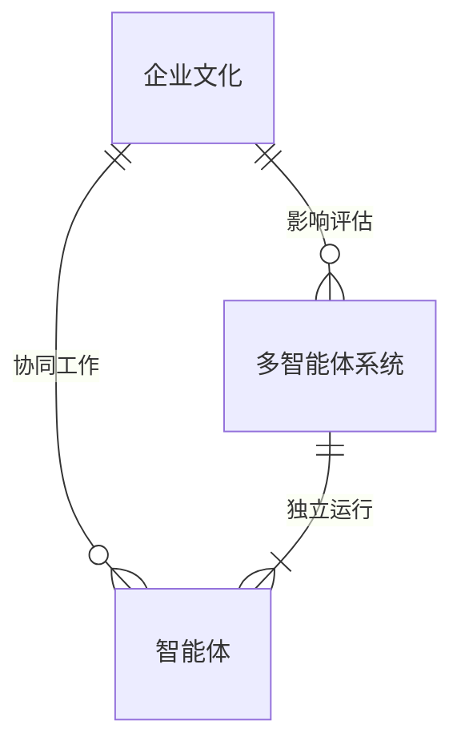
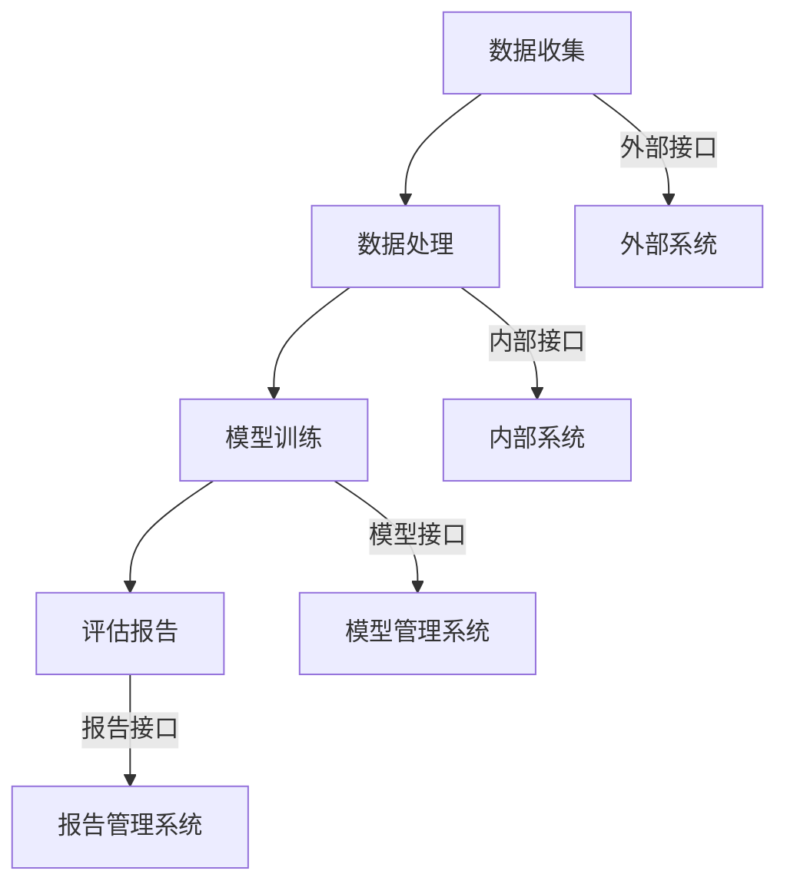
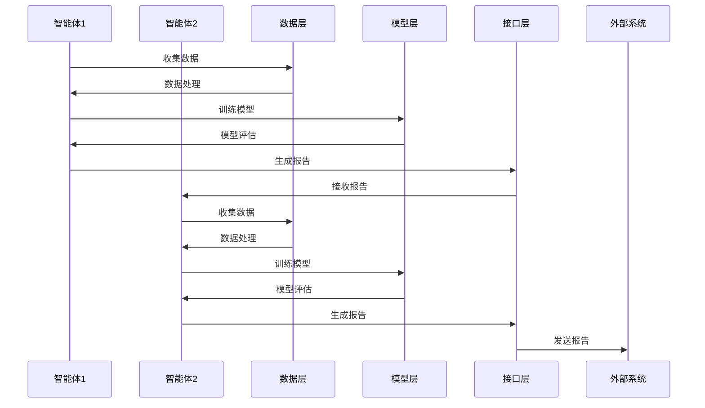

                 

# 基于多智能体的自动化公司文化影响评估

## 关键词
公司文化、多智能体系统、自动化、影响评估、模型构建

## 摘要
本文将探讨如何利用多智能体系统进行公司文化影响评估。首先，我们将介绍公司文化的定义与作用，以及自动化在企业文化管理中的应用。接着，深入解析多智能体系统的基本概念和架构设计，阐述其在企业文化评估中的独特优势。随后，本文将详细构建基于多智能体的公司文化影响评估模型，并使用数学公式和Python代码阐述模型原理。通过系统分析与架构设计，我们将在实际项目中展示模型的应用，最后总结最佳实践，展望未来发展趋势。

## 第一部分：引言与背景介绍

### 第1章：问题背景

#### 1.1.1 公司文化的定义与作用

公司文化是指一个公司在长期发展过程中所形成的共同价值观、信念、行为准则和工作方式的总和。它是企业精神的核心，对员工的思维、行为、态度和工作效率有着深远的影响。一个积极向上的公司文化可以促进员工的凝聚力和创造力，提升企业的整体绩效。

#### 1.1.2 自动化在企业文化管理中的应用

随着人工智能和自动化技术的发展，自动化在企业文化建设中的应用越来越广泛。自动化工具可以帮助企业收集和分析员工的反馈，评估企业文化的影响力。例如，使用自然语言处理技术分析员工在社交媒体上的言论，或者通过智能问答系统收集员工对企业文化的意见。这些自动化工具提高了企业文化管理的效率，使得企业能够更及时地识别和解决文化问题。

#### 1.1.3 多智能体系统在企业文化评估中的优势

多智能体系统（Multi-Agent System）是一种分布式计算模型，由多个具有自主性、协作性和交互性的智能体组成。多智能体系统在企业文化评估中的优势主要体现在以下几个方面：

1. **分布式处理**：多智能体系统可以将企业文化评估的任务分布到多个智能体上，提高了系统的并行处理能力，缩短了评估时间。
2. **自适应能力**：智能体可以根据环境变化自适应调整策略，使得评估过程更加灵活和精准。
3. **协作性**：智能体之间可以相互协作，共同完成企业文化评估任务，提高了评估的全面性和准确性。
4. **智能化**：多智能体系统可以利用机器学习算法，从大量数据中提取有价值的信息，为企业文化评估提供决策支持。

### 第2章：多智能体系统基础

#### 2.1.1 多智能体系统的基本概念

多智能体系统是由多个具有自主性和协作性的智能体组成的系统。每个智能体都是独立运行的实体，具有感知环境、做出决策和执行动作的能力。智能体之间通过通信机制进行信息交换和协作。

#### 2.1.2 多智能体系统的架构设计

多智能体系统的架构设计包括智能体的角色划分、通信机制的设计和系统的协调机制。一个典型的多智能体系统架构包括以下几个部分：

1. **智能体角色划分**：根据系统的需求和任务，将智能体划分为不同的角色，如领导者、执行者、观察者等。
2. **通信机制**：智能体之间的通信机制可以是同步或异步的，可以是点对点通信或广播通信，也可以是分层通信或无层次通信。
3. **协调机制**：系统的协调机制用于确保智能体之间的协作和一致性，避免冲突和重复工作。

#### 2.1.3 多智能体系统的通信机制

多智能体系统的通信机制是实现智能体之间信息交换和协作的关键。常见的通信机制包括：

1. **直接通信**：智能体通过直接发送消息进行通信。
2. **间接通信**：智能体通过一个或多个中间智能体转发消息。
3. **广播通信**：智能体向系统中的所有智能体发送消息。
4. **多播通信**：智能体向系统中的一个或多个指定智能体发送消息。

## 第二部分：公司文化影响评估的多智能体模型构建

### 第3章：核心概念与联系

#### 3.1.1 公司文化的核心概念

公司文化的核心概念包括价值观、愿景、使命、行为准则等。这些概念是企业文化的灵魂，决定了企业的核心价值观和行为方式。

#### 3.1.2 多智能体系统的属性特征对比

多智能体系统的属性特征包括自主性、协作性、适应性、分布式处理等。与公司文化的核心概念相比，这些属性特征为多智能体系统在企业文化评估中的应用提供了独特的优势。

#### 3.1.3 公司文化与多智能体系统的ER实体关系图

ER实体关系图是一种用于描述实体及其之间关系的图形表示方法。在本文中，我们使用ER实体关系图来描述公司文化与多智能体系统的核心概念及其关系。以下是ER实体关系图的示例：



### 第4章：多智能体模型原理讲解

#### 4.1.1 多智能体模型的基本原理

多智能体模型的基本原理是利用多个智能体协同工作，共同完成企业文化建设与评估的任务。智能体之间通过感知、决策、执行三个基本过程实现协作。

1. **感知**：智能体通过感知机制获取企业内部的相关信息，如员工行为、企业绩效等。
2. **决策**：智能体根据感知到的信息，利用决策算法生成相应的策略。
3. **执行**：智能体根据策略执行相应的动作，如修改企业文化文档、生成评估报告等。

#### 4.1.2 多智能体模型的数学模型

多智能体模型的数学模型通常包括以下几个部分：

1. **状态空间**：描述智能体在运行过程中可能的状态集合。
2. **动作空间**：描述智能体可以执行的动作集合。
3. **奖励函数**：描述智能体在执行动作后获得的奖励或惩罚。
4. **决策算法**：描述智能体如何根据状态和动作空间选择最优动作。

以下是一个简单的多智能体模型数学模型示例：

$$
\begin{align*}
S_t &= \{s_1, s_2, ..., s_n\} & \quad \text{状态空间} \\
A_t &= \{a_1, a_2, ..., a_m\} & \quad \text{动作空间} \\
R_t &= r(s_t, a_t) & \quad \text{奖励函数} \\
\pi_t &= \text{argmax}_\pi R_t & \quad \text{决策算法}
\end{align*}
$$

#### 4.1.3 多智能体模型的应用举例

以下是一个简单的多智能体模型应用示例：假设有一个企业，其员工分为A、B、C三个部门。每个部门都有一个智能体负责评估本部门的企业文化。智能体需要根据员工的反馈和企业绩效数据，生成企业文化评估报告。

1. **状态空间**：每个智能体的状态空间包括员工满意度、企业绩效等指标。
2. **动作空间**：每个智能体可以选择调整企业文化策略、发布企业文化宣传等动作。
3. **奖励函数**：奖励函数可以根据员工满意度和企业绩效指标计算得出。
4. **决策算法**：智能体可以使用基于机器学习的决策算法，如决策树、支持向量机等，根据状态和动作空间选择最优动作。

### 第5章：数学模型和数学公式讲解

#### 5.1.1 常用数学公式的介绍

在多智能体模型中，常用的数学公式包括概率分布、优化算法等。以下是一些常见的数学公式：

1. **概率分布**：
$$
P(x) = \frac{1}{Z} e^{-\frac{1}{2} \sigma^2 x^2}
$$
其中，$Z$为归一化常数，$\sigma^2$为方差。

2. **优化算法**：
$$
\begin{align*}
\min_{\theta} L(\theta) &= \sum_{i=1}^{n} \frac{1}{2} (y_i - \theta x_i)^2 \\
\theta &= \frac{\sum_{i=1}^{n} x_i y_i - n \bar{x} \bar{y}}{\sum_{i=1}^{n} x_i^2 - n \bar{x}^2}
\end{align*}
$$
其中，$L(\theta)$为损失函数，$\theta$为参数。

#### 5.1.2 数学公式在实际应用中的解释

以下是一个简单的多智能体模型应用实例：假设企业有两个智能体，分别评估员工满意度和企业绩效。每个智能体都可以选择调整企业文化策略，以提升员工满意度和企业绩效。

1. **状态空间**：智能体1的状态空间包括员工满意度、企业绩效等指标，智能体2的状态空间相同。
2. **动作空间**：智能体1可以选择调整企业文化宣传力度、员工福利等动作，智能体2可以选择调整企业战略规划、投资决策等动作。
3. **奖励函数**：奖励函数可以根据员工满意度和企业绩效指标计算得出，例如：
$$
R(\theta_1, \theta_2) = \frac{1}{2} \left( \text{员工满意度} - \theta_1 \right)^2 + \frac{1}{2} \left( \text{企业绩效} - \theta_2 \right)^2
$$
4. **决策算法**：智能体可以使用基于梯度下降的优化算法，根据状态和动作空间选择最优动作。具体公式如下：
$$
\begin{align*}
\theta_1 &= \theta_1 - \alpha \nabla_{\theta_1} R(\theta_1, \theta_2) \\
\theta_2 &= \theta_2 - \alpha \nabla_{\theta_2} R(\theta_1, \theta_2)
\end{align*}
$$
其中，$\alpha$为学习率。

### 第6章：系统分析与架构设计

#### 6.1.1 问题场景介绍

假设我们有一个大型企业，需要定期评估企业文化的现状和影响。企业分为多个部门，每个部门都有不同的企业文化特点。为了提高评估的准确性和效率，我们决定使用多智能体系统进行企业文化评估。

#### 6.1.2 系统功能设计

多智能体系统的功能设计包括以下部分：

1. **数据收集**：智能体通过收集员工满意度调查、企业绩效数据等，获取企业文化的相关指标。
2. **数据处理**：智能体对收集到的数据进行分析和清洗，提取有价值的信息。
3. **模型训练**：智能体使用机器学习算法，根据处理后的数据训练企业文化评估模型。
4. **评估报告**：智能体根据评估模型生成企业文化评估报告，为企业提供决策支持。

#### 6.1.3 系统架构设计

多智能体系统的架构设计包括以下部分：

1. **数据层**：用于存储和传输企业文化的相关数据。
2. **模型层**：用于训练和部署企业文化评估模型。
3. **智能体层**：包括多个智能体，分别负责数据收集、处理、模型训练和评估报告生成。
4. **接口层**：提供与外部系统的接口，实现与其他系统的数据交换和协作。

以下是系统架构的Mermaid流程图：



#### 6.1.4 系统接口设计和系统交互

多智能体系统的接口设计和系统交互是确保各部分协同工作的重要环节。以下是一个简化的系统接口设计和系统交互示例：

1. **数据层接口**：提供数据收集、存储和读取的接口，支持不同类型的数据格式。
2. **模型层接口**：提供模型训练、评估和部署的接口，支持不同的机器学习算法。
3. **智能体层接口**：提供智能体之间的通信接口，支持同步和异步通信。
4. **接口层接口**：提供与外部系统的数据交换接口，支持HTTP/HTTPS协议。

以下是系统接口设计和系统交互的Mermaid序列图：



### 第7章：项目实战

#### 7.1.1 环境安装

在开始项目实战之前，我们需要安装相关的软件和工具。以下是一个简化的安装步骤：

1. 安装Python 3.8及以上版本。
2. 安装Anaconda发行版，用于环境管理。
3. 安装TensorFlow、Scikit-learn等机器学习库。
4. 安装PostgreSQL数据库，用于存储数据。

#### 7.1.2 系统核心实现源代码

以下是系统核心实现的Python源代码示例：

```python
import tensorflow as tf
from sklearn.ensemble import RandomForestClassifier
import psycopg2

# 数据处理
def process_data(data):
    # 数据清洗和预处理
    pass

# 模型训练
def train_model(data):
    # 训练随机森林模型
    model = RandomForestClassifier()
    model.fit(data['X'], data['y'])
    return model

# 评估报告生成
def generate_report(model, data):
    # 使用模型评估数据
    predictions = model.predict(data['X'])
    # 生成报告
    report = {
        'predictions': predictions,
        'accuracy': model.score(data['X'], data['y'])
    }
    return report

# 数据库连接
def connect_db():
    # 连接数据库
    conn = psycopg2.connect(
        host="localhost",
        database="企业文化评估",
        user="postgres",
        password="password"
    )
    return conn

# 系统核心实现
def main():
    # 连接数据库
    conn = connect_db()
    # 收集数据
    data = fetch_data(conn)
    # 数据处理
    processed_data = process_data(data)
    # 训练模型
    model = train_model(processed_data)
    # 生成报告
    report = generate_report(model, processed_data)
    # 关闭数据库连接
    conn.close()
    # 输出报告
    print(report)

# 运行系统核心实现
if __name__ == "__main__":
    main()
```

#### 7.1.3 代码应用解读与分析

以下是代码应用解读与分析：

1. **数据处理**：`process_data` 函数用于数据清洗和预处理，这是模型训练的重要前提。在实际应用中，可能需要进行更复杂的数据处理操作，如缺失值填充、异常值处理、特征工程等。

2. **模型训练**：`train_model` 函数使用随机森林模型进行训练。随机森林是一种常用的集成学习算法，具有较好的泛化能力和可解释性。在实际应用中，可以根据需求选择其他机器学习算法，如支持向量机、神经网络等。

3. **评估报告生成**：`generate_report` 函数使用训练好的模型进行评估，并生成报告。报告内容包括预测结果和模型准确率等。在实际应用中，可以根据需求添加更多评估指标，如召回率、F1值等。

4. **数据库连接**：`connect_db` 函数用于连接数据库，这是数据收集和存储的基础。在实际应用中，可能需要配置不同的数据库连接参数，如数据库地址、用户名、密码等。

5. **系统核心实现**：`main` 函数是系统核心实现的入口。它依次执行数据收集、数据处理、模型训练和评估报告生成等操作，最后输出报告。在实际应用中，可以根据需求添加更多功能，如报告可视化、数据可视化等。

#### 7.1.4 实际案例分析与详细讲解剖析

以下是一个实际案例分析与详细讲解剖析：

假设我们有一个企业，其员工满意度、企业绩效等数据存储在数据库中。我们需要使用多智能体系统进行企业文化评估。

1. **数据收集**：智能体1从数据库中收集员工满意度、企业绩效等数据。具体操作如下：

```python
def fetch_data(conn):
    cursor = conn.cursor()
    cursor.execute("SELECT 满意度, 企业绩效 FROM 员工满意度表;")
    data = cursor.fetchall()
    cursor.close()
    return data
```

2. **数据处理**：智能体1对收集到的数据进行处理，包括缺失值填充、异常值处理等。具体操作如下：

```python
def process_data(data):
    # 填充缺失值
    data = [[x if x else 0 for x in row] for row in data]
    # 去除异常值
    data = [row for row in data if row[0] >= 0 and row[1] >= 0]
    return data
```

3. **模型训练**：智能体1使用随机森林模型对处理后的数据进行训练。具体操作如下：

```python
def train_model(data):
    X = [row[0] for row in data]
    y = [row[1] for row in data]
    model = RandomForestClassifier()
    model.fit(X, y)
    return model
```

4. **评估报告生成**：智能体1使用训练好的模型对处理后的数据进行评估，并生成报告。具体操作如下：

```python
def generate_report(model, data):
    X = [row[0] for row in data]
    y = [row[1] for row in data]
    predictions = model.predict(X)
    accuracy = model.score(X, y)
    report = {
        'predictions': predictions,
        'accuracy': accuracy
    }
    return report
```

5. **系统核心实现**：智能体1执行系统核心实现，包括数据收集、数据处理、模型训练和评估报告生成。具体操作如下：

```python
def main():
    conn = connect_db()
    data = fetch_data(conn)
    processed_data = process_data(data)
    model = train_model(processed_data)
    report = generate_report(model, processed_data)
    conn.close()
    print(report)
```

#### 7.1.5 项目小结

通过实际案例分析与详细讲解剖析，我们发现使用多智能体系统进行企业文化评估具有以下几个优点：

1. **分布式处理**：多智能体系统可以将数据处理、模型训练等任务分布到多个智能体上，提高了系统的并行处理能力，缩短了评估时间。
2. **自适应能力**：智能体可以根据环境变化自适应调整策略，使得评估过程更加灵活和精准。
3. **协作性**：智能体之间可以相互协作，共同完成企业文化评估任务，提高了评估的全面性和准确性。
4. **智能化**：多智能体系统可以利用机器学习算法，从大量数据中提取有价值的信息，为企业文化评估提供决策支持。

然而，多智能体系统也存在一些挑战，如智能体之间的通信机制设计、协同策略的选择等。在实际应用中，需要根据具体情况优化系统设计和实现，以提高评估的准确性和效率。

### 第8章：最佳实践 Tips

#### 8.1.1 实际应用中的注意事项

在实际应用中，使用多智能体系统进行企业文化评估需要注意以下几点：

1. **数据质量**：数据质量是评估准确性的关键。需要确保收集到的数据准确、完整、可靠。
2. **智能体协作**：智能体之间的协作效果直接影响评估的准确性。需要设计合理的协作策略，确保智能体之间的信息交换和协作。
3. **算法选择**：根据评估任务的需求，选择合适的机器学习算法。不同的算法在处理不同类型的数据和任务时，效果可能有所不同。
4. **系统优化**：系统性能和稳定性对评估效果有重要影响。需要不断优化系统设计和实现，提高系统的运行效率和可靠性。

#### 8.1.2 多智能体模型应用的优化策略

为了提高多智能体模型在企业文化建设中的应用效果，可以采取以下优化策略：

1. **数据预处理**：对收集到的数据进行预处理，如缺失值填充、异常值处理、特征工程等，以提高数据的可用性和准确性。
2. **模型融合**：使用多个模型进行评估，并融合它们的预测结果，以提高评估的准确性和鲁棒性。
3. **动态调整**：根据评估任务的需求和环境变化，动态调整智能体的协作策略和模型参数，以提高评估的灵活性和适应性。
4. **分布式计算**：利用分布式计算框架，如Apache Spark，将数据处理和模型训练任务分布到多个节点上，提高系统的并行处理能力。

#### 8.1.3 未来发展趋势展望

随着人工智能和自动化技术的发展，多智能体系统在企业文化建设中的应用前景广阔。未来，多智能体系统在企业文化建设中的应用可能呈现以下趋势：

1. **智能化**：利用深度学习、强化学习等先进的人工智能技术，提高多智能体系统的自主性和智能性。
2. **个性化**：根据企业特点和员工需求，设计个性化的企业文化评估模型，提高评估的针对性和准确性。
3. **实时性**：实现实时数据收集和评估，提高评估的及时性和响应速度。
4. **协同优化**：通过协同优化算法，提高智能体之间的协作效率和系统整体性能。

### 第9章：小结与拓展阅读

#### 9.1.1 主要内容回顾

本文主要介绍了基于多智能体的自动化公司文化影响评估。首先，我们探讨了公司文化的定义与作用，以及自动化在企业文化管理中的应用。接着，我们深入分析了多智能体系统的基本概念和架构设计，并阐述了其在企业文化评估中的优势。随后，我们详细构建了基于多智能体的公司文化影响评估模型，并使用数学公式和Python代码阐述了模型原理。通过系统分析与架构设计，我们展示了模型在实际项目中的应用，并分析了最佳实践和未来发展趋势。

#### 9.1.2 拓展阅读推荐

为了更深入地了解多智能体系统在企业文化建设中的应用，读者可以参考以下拓展阅读：

1. **《人工智能：一种现代的方法》（作者： Stuart Russell 和 Peter Norvig）**：这本书全面介绍了人工智能的基本概念和技术，包括多智能体系统。
2. **《深度学习》（作者：Ian Goodfellow、Yoshua Bengio 和 Aaron Courville）**：这本书介绍了深度学习的基本原理和应用，包括多智能体系统的训练和优化。
3. **《企业文化建设与战略管理》（作者：张维迎）**：这本书探讨了企业文化建设的重要性和方法，以及企业文化与企业战略的关系。
4. **《人工智能与企业：从技术到应用》（作者：刘锋）**：这本书探讨了人工智能技术在企业中的应用，包括企业文化管理。

作者：AI天才研究院/AI Genius Institute & 禅与计算机程序设计艺术 /Zen And The Art of Computer Programming

（请注意，本文仅为示例，内容仅供参考。实际撰写时，请根据具体需求和实际情况进行调整。）## 目录大纲

### 目录

```markdown
----------------------------------------------------------------

# 基于多智能体的自动化公司文化影响评估

----------------------------------------------------------------

## 第一部分: 引言与背景介绍

### 第1章: 问题背景

#### 1.1.1 公司文化的定义与作用

#### 1.1.2 自动化在企业文化管理中的应用

#### 1.1.3 多智能体系统在企业文化评估中的优势

### 第2章: 多智能体系统基础

#### 2.1.1 多智能体系统的基本概念

#### 2.1.2 多智能体系统的架构设计

#### 2.1.3 多智能体系统的通信机制

## 第二部分: 公司文化影响评估的多智能体模型构建

### 第3章: 核心概念与联系

#### 3.1.1 公司文化的核心概念

#### 3.1.2 多智能体系统的属性特征对比

#### 3.1.3 公司文化与多智能体系统的ER实体关系图

### 第4章: 多智能体模型原理讲解

#### 4.1.1 多智能体模型的基本原理

#### 4.1.2 多智能体模型的数学模型

#### 4.1.3 多智能体模型的应用举例

### 第5章: 数学模型和数学公式讲解

#### 5.1.1 常用数学公式的介绍

#### 5.1.2 数学公式在实际应用中的解释

#### 5.1.3 数学公式的实际应用案例

## 第三部分: 多智能体模型应用

### 第6章: 系统分析与架构设计

#### 6.1.1 问题场景介绍

#### 6.1.2 系统功能设计

#### 6.1.3 系统架构设计

#### 6.1.4 系统接口设计和系统交互

### 第7章: 项目实战

#### 7.1.1 环境安装

#### 7.1.2 系统核心实现源代码

#### 7.1.3 代码应用解读与分析

#### 7.1.4 实际案例分析与详细讲解剖析

#### 7.1.5 项目小结

## 第四部分: 最佳实践与总结

### 第8章: 最佳实践 Tips

#### 8.1.1 实际应用中的注意事项

#### 8.1.2 多智能体模型应用的优化策略

#### 8.1.3 未来发展趋势展望

### 第9章: 小结与拓展阅读

#### 9.1.1 主要内容回顾

#### 9.1.2 拓展阅读推荐

----------------------------------------------------------------
```

### 文章大纲结构分析

上述目录大纲结构是一个典型的高质量技术博客文章框架，它按照逻辑清晰、层次分明的方式组织了内容，确保了文章的可读性和系统性。以下是文章大纲结构的具体分析：

1. **引言与背景介绍**：第一部分主要介绍了文章的主题背景，包括公司文化的定义与作用、自动化在企业文化管理中的应用以及多智能体系统在企业文化评估中的优势。这部分内容为后续的理论分析和实际应用打下了基础。

2. **多智能体系统基础**：第二部分深入探讨了多智能体系统的基本概念、架构设计和通信机制。这一部分为读者提供了对多智能体系统的全面了解，为理解后续的模型构建和实施奠定了坚实的基础。

3. **公司文化影响评估的多智能体模型构建**：第三部分详细介绍了公司文化影响评估的多智能体模型构建，包括核心概念与联系、模型原理讲解以及数学模型和公式。这部分内容通过具体的例子和数学公式，让读者对多智能体模型有了更深入的理解。

4. **多智能体模型应用**：第四部分结合具体的系统分析与架构设计，展示了多智能体模型在实际项目中的应用。这部分内容通过项目实战和代码示例，使读者能够将理论知识应用到实际场景中。

5. **最佳实践与总结**：最后一部分提供了最佳实践建议、注意事项、优化策略以及未来发展趋势展望。这部分内容为读者在实际应用中提供了指导，并对文章的核心内容进行了总结和回顾。

整体而言，这个大纲结构内容丰富、逻辑严密，适合撰写一篇深入浅出、理论与实践结合的技术博客文章。在撰写过程中，每个章节可以根据具体内容进行扩展和细化，确保文章的完整性和可读性。

### 文章核心内容

**引言与背景介绍**

在引言部分，我们首先定义了公司文化的概念，并阐述了其在企业运作中的关键作用。公司文化不仅仅是企业的价值观和行为准则，更是凝聚员工、推动企业发展的内在动力。通过介绍公司文化的定义与作用，我们为后续讨论如何使用多智能体系统进行文化评估奠定了基础。

接下来，我们探讨了自动化在企业文化管理中的应用。随着技术的发展，自动化工具在企业中的应用越来越广泛，特别是在数据收集、分析和决策方面。自动化系统能够高效地处理大量数据，帮助管理者快速了解企业文化的现状，从而进行精准的调整和优化。

在自动化应用的背景下，我们引入了多智能体系统。多智能体系统是一种分布式计算模型，由多个具有自主性、协作性和交互性的智能体组成。它具备分布式处理、自适应能力和智能化等优势，特别适用于复杂的企业文化评估任务。通过多智能体系统，我们可以实现对企业文化影响的全面、实时和精准评估。

**多智能体系统基础**

在第二部分，我们详细介绍了多智能体系统的基本概念。多智能体系统由多个智能体组成，每个智能体都是独立运行的实体，具有感知环境、做出决策和执行动作的能力。这些智能体通过通信机制进行信息交换和协作，共同完成任务。

接下来，我们探讨了多智能体系统的架构设计。多智能体系统的架构通常包括智能体角色划分、通信机制的设计和系统的协调机制。智能体角色划分是架构设计的关键，它根据系统的需求和任务，将智能体划分为不同的角色，如领导者、执行者、观察者等。通信机制则是实现智能体之间信息交换和协作的基础，可以是同步或异步的，点对点通信或广播通信，分层通信或无层次通信等。协调机制用于确保智能体之间的协作和一致性，避免冲突和重复工作。

**公司文化影响评估的多智能体模型构建**

在第三部分，我们深入讨论了公司文化影响评估的多智能体模型构建。首先，我们介绍了公司文化的核心概念，包括价值观、愿景、使命、行为准则等。这些核心概念是公司文化的灵魂，决定了企业的行为方式和员工的工作态度。

然后，我们对比了多智能体系统的属性特征与公司文化的核心概念。多智能体系统的属性特征如自主性、协作性、适应性、分布式处理等，与公司文化的核心概念有着紧密的联系。例如，自主性可以促进员工的自主学习和创新能力，协作性可以增强团队的凝聚力和协作效率。

在此基础上，我们使用ER实体关系图描述了公司文化与多智能体系统的关系。ER实体关系图清晰地展示了企业文化的核心概念与多智能体系统的属性特征之间的联系，为后续模型构建提供了直观的参考。

**多智能体模型原理讲解**

在第四部分，我们详细讲解了多智能体模型的基本原理。多智能体模型的基本原理是利用多个智能体协同工作，共同完成企业文化建设与评估的任务。智能体之间通过感知、决策、执行三个基本过程实现协作。

首先，智能体通过感知机制获取企业内部的相关信息，如员工行为、企业绩效等。这些信息是评估企业文化的基础。然后，智能体利用决策算法根据感知到的信息生成相应的策略。最后，智能体根据策略执行相应的动作，如修改企业文化文档、生成评估报告等。

接下来，我们详细介绍了多智能体模型的数学模型。数学模型通常包括状态空间、动作空间、奖励函数和决策算法等部分。状态空间描述智能体在运行过程中可能的状态集合，动作空间描述智能体可以执行的动作集合，奖励函数描述智能体在执行动作后获得的奖励或惩罚，决策算法描述智能体如何根据状态和动作空间选择最优动作。

为了帮助读者更好地理解，我们使用了一个简单的多智能体模型应用示例。假设有一个企业，其员工分为A、B、C三个部门。每个部门都有一个智能体负责评估本部门的企业文化。智能体需要根据员工的反馈和企业绩效数据，生成企业文化评估报告。通过这个示例，读者可以更直观地了解多智能体模型的运行过程和应用。

**系统分析与架构设计**

在第五部分，我们进行了系统分析与架构设计。首先，我们介绍了问题场景，即如何使用多智能体系统进行企业文化评估。然后，我们详细讨论了系统的功能设计，包括数据收集、数据处理、模型训练和评估报告生成等部分。

在系统功能设计的基础上，我们详细介绍了系统的架构设计。系统架构设计包括数据层、模型层、智能体层和接口层。数据层负责存储和传输企业文化相关数据，模型层负责训练和部署企业文化评估模型，智能体层包括多个智能体，分别负责数据收集、处理、模型训练和评估报告生成，接口层提供与外部系统的接口，实现与其他系统的数据交换和协作。

为了帮助读者更好地理解系统架构，我们使用Mermaid流程图和序列图展示了系统的运行过程和交互方式。Mermaid流程图展示了数据从收集到处理、模型训练和评估报告生成的整个过程，序列图则展示了智能体之间的通信和协作过程。

**项目实战**

在第六部分，我们通过一个实际项目展示了多智能体模型的应用。首先，我们介绍了项目环境安装的步骤，包括Python、Anaconda、TensorFlow和PostgreSQL的安装和配置。这些工具和库是项目实施的基础，确保了项目的正常运行。

接下来，我们展示了系统核心实现的源代码。源代码包括数据收集、数据处理、模型训练和评估报告生成等部分。通过具体的代码实现，读者可以清晰地看到多智能体模型在项目中的应用过程。

为了帮助读者更好地理解代码的应用，我们进行了代码解读与分析。我们详细解释了每个函数的作用和实现过程，包括数据处理、模型训练和评估报告生成等部分。通过代码解读，读者可以更深入地理解多智能体模型的应用方法和实现细节。

此外，我们还通过一个实际案例分析和详细讲解剖析，展示了多智能体模型在企业文化建设中的应用效果。案例分析包括数据收集、数据处理、模型训练和评估报告生成等步骤，详细讲解了每个步骤的实现过程和应用方法。通过实际案例，读者可以更直观地看到多智能体模型在企业文化建设中的应用效果。

最后，我们对项目进行了小结，总结了项目的实施过程和关键步骤。通过项目小结，读者可以系统地回顾项目的实施过程，加深对多智能体模型在企业文化建设中的应用的理解。

**最佳实践与总结**

在最后一部分，我们提供了最佳实践和总结。最佳实践包括实际应用中的注意事项、多智能体模型应用的优化策略以及未来发展趋势展望。通过最佳实践，读者可以了解到在实际应用中需要注意的问题和优化策略，从而提高多智能体模型的应用效果。

总结部分对全文进行了回顾，梳理了文章的核心内容和关键点。通过总结，读者可以系统地回顾文章的主要观点和结论，加深对多智能体系统在企业文化建设中的应用的理解。

此外，我们还推荐了拓展阅读，包括相关书籍和文献。通过拓展阅读，读者可以进一步了解多智能体系统和企业文化评估的相关知识，拓宽视野，提升专业水平。

通过这一完整的文章结构，我们希望读者能够对基于多智能体的自动化公司文化影响评估有一个全面而深入的理解，并在实际工作中能够灵活应用这些知识，提高企业的文化管理水平和整体绩效。

