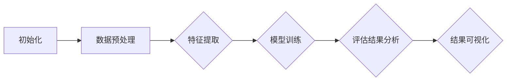
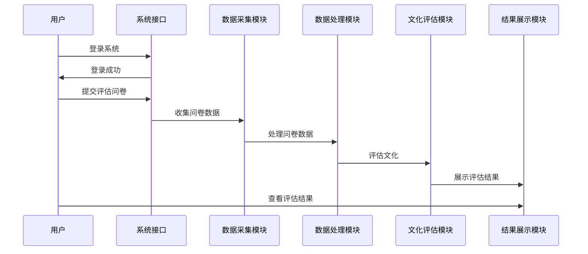

                 

### 《基于多智能体的自动化公司文化评估系统》

> 关键词：多智能体系统、自动化评估、公司文化、算法实现、系统架构

> 摘要：本文旨在探讨基于多智能体的自动化公司文化评估系统的构建与实现。首先，我们将介绍多智能体系统的基本概念、应用领域以及公司文化评估的重要性。随后，文章将详细阐述系统的基础知识，包括多智能体的模型、通信与协作机制以及系统设计与实现。接着，文章将深入探讨系统架构设计与核心模块的实现。最后，通过实战应用与案例分析，对系统性能优化与未来发展方向进行展望。

----------------------------------------------------------------

### 第一部分：引言与背景

#### 1.1 多智能体系统的概述

**多智能体系统的基本概念**

多智能体系统（Multi-Agent System, MAS）是由多个智能代理（Agent）组成的分布式计算系统。每个代理具有自主性、协作性、反应性和社会性等特点，能够以合作、竞争或协商等方式共同完成任务。智能代理可以是一个软件程序、一个机器人或者一个人类用户。

**多智能体系统的特征**

1. **自主性（Autonomy）**：每个智能代理拥有自己的目标和行为规则，可以自主决策并执行任务。
2. **协作性（Sociality）**：智能代理之间能够进行通信与协作，共同完成任务。
3. **反应性（Reactivity）**：智能代理能够对外界事件做出实时响应。
4. **分布性（Distribution）**：智能代理分布在不同的物理或逻辑节点上，系统具有分布式计算能力。

**多智能体系统的应用领域**

多智能体系统在商业、工业和教育等领域都有广泛应用。例如，在商业领域，多智能体系统可以用于供应链管理、市场预测和客户关系管理；在工业领域，可以用于自动化生产线和智能工厂；在教育领域，可以用于智能教学系统和在线教育平台。

#### 1.2 公司文化评估的重要性

**公司文化评估的定义**

公司文化评估是对企业文化进行系统、科学评价的过程。企业文化是指企业在长期发展过程中形成的共同价值观、行为规范和工作氛围。通过公司文化评估，企业可以了解自身文化的现状，发现存在的问题，并制定相应的改进措施。

**公司文化评估的意义**

1. **提升员工满意度**：良好的企业文化可以增强员工的归属感和认同感，提高员工的工作满意度。
2. **增强企业竞争力**：企业文化是企业核心竞争力的重要组成部分，优秀的文化可以提升企业的市场竞争力。
3. **促进企业可持续发展**：通过公司文化评估，企业可以不断完善和优化文化，实现可持续发展。

#### 1.3 自动化公司文化评估的需求

**传统公司文化评估的局限性**

1. **主观性较强**：传统公司文化评估往往依赖于主观评价，结果可能不够客观。
2. **效率低下**：传统评估方法需要大量人工干预，耗时较长，不利于实时反馈和调整。

**自动化评估的优势**

1. **客观性**：自动化评估系统可以减少主观因素影响，提高评估结果的客观性。
2. **高效性**：自动化评估可以快速收集和处理大量数据，实现实时评估和反馈。
3. **全面性**：自动化评估可以全面覆盖企业文化的各个方面，提供更全面的评估结果。

### 第一部分小结

多智能体系统作为一种新兴的分布式计算模型，在商业、工业和教育等领域具有广泛的应用前景。公司文化评估是企业管理的重要环节，而自动化评估系统的引入可以提升评估的客观性、高效性和全面性。本文将在此基础上，深入探讨基于多智能体的自动化公司文化评估系统的构建与实现。

----------------------------------------------------------------

### 第二部分：多智能体系统的基础知识

#### 2.1 多智能体的基本模型

**代理（Agent）的概念**

代理是指能够感知环境、执行任务并与其他代理交互的实体。根据代理的属性和功能，可以分为以下几类：

1. **个体代理（Individual Agent）**：专注于单一任务，例如一个机器人。
2. **集体代理（Collective Agent）**：由多个个体代理组成，共同完成复杂任务。
3. **混合代理（Hybrid Agent）**：结合个体代理和集体代理的特点，既具备独立决策能力，又能与其他代理协作。

**多智能体系统的类型**

1. **基于通信的多智能体系统**：代理通过通信网络交换信息，实现协作。
2. **基于任务的智能体系统**：代理根据任务需求，自主分配和执行任务。
3. **基于角色的智能体系统**：代理根据预定义的角色和职责，执行相应的任务。

#### 2.2 多智能体的通信与协作

**通信协议**

多智能体系统中的通信协议是代理之间交换信息的基础。常见的通信协议包括：

1. **消息传递协议**：代理通过发送和接收消息进行通信，例如TCP/IP、HTTP等。
2. **事件驱动协议**：代理通过事件触发机制进行通信，例如XMPP、SOAP等。

**协作机制**

多智能体系统的协作机制包括以下几个方面：

1. **协商机制**：代理通过协商达成共识，共同完成任务。
2. **协调机制**：代理通过协调分配资源、任务和任务进度，实现高效协作。
3. **合作机制**：代理通过合作实现协同效应，提升整体效率。

#### 2.3 多智能体系统设计与实现

**开发工具与平台**

多智能体系统的设计与实现需要使用合适的开发工具与平台。常见的开发工具和平台包括：

1. **Java Agent Development Framework（JADE）**：Java语言实现的多智能体开发框架。
2. **PeachFlow**：基于Web的多智能体系统开发平台。
3. **Py Affero**：Python语言实现的多智能体开发框架。

**实现策略**

多智能体系统的实现策略包括以下几个方面：

1. **模块化设计**：将系统划分为多个模块，实现功能分离和模块化。
2. **分布式架构**：利用分布式计算技术，实现系统的高可用性和高性能。
3. **算法优化**：针对多智能体系统的特性，采用适当的算法优化策略，提高系统效率。

### 第二部分小结

本部分介绍了多智能体系统的基本概念、通信与协作机制以及设计与实现策略。多智能体系统作为一种分布式计算模型，具有自主性、协作性、反应性和分布性等特点。在设计与实现过程中，需要考虑代理的类型、通信协议、协作机制以及开发工具与平台。这些基础知识为后续系统架构设计与实现奠定了基础。

----------------------------------------------------------------

### 第二部分：系统架构与实现

#### 3.1 系统功能需求分析

**评估指标的设定**

为了对公司的文化进行有效评估，需要设定一系列评估指标。这些指标可以从以下几个方面进行设定：

1. **价值观认同度**：员工对公司核心价值观的认同程度。
2. **团队协作能力**：团队之间协作的效率和质量。
3. **员工满意度**：员工对公司文化的主观评价。
4. **创新能力**：公司在创新方面的表现。

**用户角色与权限管理**

为了保障系统的安全性和灵活性，系统需要支持多角色用户权限管理。常见的用户角色包括：

1. **管理员**：负责系统管理和维护，具有最高权限。
2. **评估师**：负责文化评估的具体实施，具有部分管理权限。
3. **员工**：参与文化评估，提供对公司文化的反馈。

#### 3.2 系统架构设计

**系统总体架构**

系统总体架构可以分为以下几个层次：

1. **数据层**：负责数据的存储和管理，包括员工数据、评估指标数据等。
2. **服务层**：提供核心功能服务，包括评估指标计算、用户权限管理等。
3. **表示层**：提供用户界面，供用户进行操作和数据查询。

**数据库设计**

数据库设计需要考虑以下要素：

1. **员工表**：存储员工的个人基本信息。
2. **评估指标表**：存储评估指标的定义和取值。
3. **用户角色表**：存储用户角色信息。
4. **评估结果表**：存储评估结果和历史数据。

**系统接口设计**

系统接口设计需要考虑以下接口：

1. **用户接口**：提供用户操作的界面，包括登录、查询、评估等。
2. **API接口**：提供与其他系统进行数据交互的接口，包括数据导入、导出等。

#### 3.3 多智能体架构的构建

**智能体角色分配**

在多智能体架构中，需要为每个智能体分配明确的角色和职责。常见的智能体角色包括：

1. **数据采集智能体**：负责收集员工对公司文化的反馈数据。
2. **评估分析智能体**：负责对收集到的数据进行分析和评估。
3. **反馈智能体**：负责将评估结果反馈给用户。

**智能体协作机制**

智能体之间的协作机制是确保系统高效运行的关键。常见的协作机制包括：

1. **协商机制**：智能体之间通过协商确定任务分配和执行方案。
2. **协调机制**：智能体之间协调资源分配和任务进度。
3. **合作机制**：智能体之间共享信息，实现协同效应。

### 第三部分小结

本部分详细介绍了系统架构设计与实现，包括功能需求分析、系统架构设计、数据库设计、系统接口设计和多智能体架构的构建。系统架构设计是系统实现的基础，通过合理的架构设计可以确保系统的稳定性和可扩展性。多智能体架构的引入，为系统提供了高效的协作机制，有助于提升系统的整体性能。

----------------------------------------------------------------

### 第四部分：核心模块设计与实现

#### 4.1 多智能体的初始化与配置

**初始化流程**

多智能体的初始化是系统运行的第一步，包括以下几个关键步骤：

1. **启动智能体框架**：初始化智能体运行环境，加载必要的库和模块。
2. **配置智能体属性**：设置智能体的初始属性，如名称、角色、通信端口等。
3. **注册智能体**：将智能体注册到系统管理模块，以便进行统一管理和调度。

**配置参数设置**

智能体的配置参数包括以下几个方面：

1. **通信参数**：配置智能体之间的通信协议和通信端口，确保智能体之间的有效通信。
2. **评估参数**：配置评估指标的定义和取值范围，确保评估结果的准确性和一致性。
3. **安全参数**：配置智能体的访问控制和安全认证机制，确保系统的安全性和数据的保密性。

#### 4.2 数据采集与处理

**数据来源**

系统需要从多个渠道收集公司文化相关数据，包括：

1. **问卷调查**：通过在线问卷收集员工对公司文化的反馈。
2. **工作日志**：分析员工的工作日志，挖掘公司文化的影响因素。
3. **第三方数据**：引入外部数据源，如社交媒体、新闻报道等，进行综合分析。

**数据处理算法**

数据处理算法是确保数据准确性和评估结果的关键。主要包含以下几个方面：

1. **数据清洗**：去除无效数据、处理缺失值和异常值，提高数据质量。
2. **特征提取**：从原始数据中提取关键特征，为后续评估提供基础。
3. **数据融合**：将来自不同渠道的数据进行整合，形成统一的数据集。
4. **数据分析**：利用统计分析和机器学习算法，对数据进行深度分析，提取有价值的信息。

#### 4.3 文化评估模型构建

**评估模型的构建**

文化评估模型是系统实现的核心，主要包括以下几个步骤：

1. **指标选择**：根据公司文化特点和评估目标，选择合适的评估指标。
2. **模型设计**：设计评估模型的架构，包括输入层、隐藏层和输出层。
3. **模型训练**：利用收集到的数据，对评估模型进行训练，优化模型参数。

**模型训练与优化**

模型训练与优化是确保评估模型准确性的关键。主要包含以下几个方面：

1. **数据预处理**：对训练数据进行预处理，包括归一化、标准化等。
2. **选择训练算法**：根据评估指标和模型架构，选择合适的训练算法，如支持向量机、决策树等。
3. **模型评估**：通过交叉验证和测试集评估模型性能，调整模型参数。
4. **模型优化**：利用优化算法，如遗传算法、粒子群优化等，对模型进行优化，提高评估准确性。

#### 4.4 结果分析与展示

**结果分析算法**

结果分析算法是对评估结果进行深度挖掘和分析的关键。主要包含以下几个方面：

1. **统计分析**：对评估结果进行描述性统计和分析，提取关键指标。
2. **可视化分析**：利用图表、图形等方式，展示评估结果，便于用户理解和分析。
3. **关联分析**：分析评估结果与其他因素之间的关系，挖掘潜在的关联和影响。

**结果可视化**

结果可视化是将评估结果以直观、易懂的方式呈现给用户的关键。主要包含以下几个方面：

1. **柱状图**：展示不同评估指标的取值和分布情况。
2. **折线图**：展示评估结果随时间的变化趋势。
3. **饼图**：展示评估结果的占比和分布情况。
4. **雷达图**：综合展示不同评估指标的表现，便于用户全面了解公司文化现状。

### 第四部分小结

本部分详细介绍了多智能体系统核心模块的设计与实现，包括初始化与配置、数据采集与处理、文化评估模型构建以及结果分析与展示。这些核心模块是实现自动化公司文化评估系统的关键，通过科学的设计和有效的实现，可以确保系统的高效运行和准确评估。

----------------------------------------------------------------

### 第五部分：实战应用与案例分析

#### 5.1 实战应用环境搭建

**系统环境配置**

为了搭建基于多智能体的自动化公司文化评估系统，需要配置以下环境：

1. **开发环境**：安装Python开发环境，包括Python解释器和相关库（如NumPy、Pandas、Scikit-learn等）。
2. **数据库环境**：配置MySQL数据库，用于存储员工数据、评估指标数据等。
3. **智能体框架**：安装Java Agent Development Framework（JADE），用于实现多智能体系统。

**多智能体系统部署**

部署多智能体系统包括以下步骤：

1. **启动智能体框架**：在服务器上启动JADE智能体框架，确保智能体能够正常运行。
2. **部署智能体**：将开发好的智能体程序部署到服务器上，并注册到JADE框架中。
3. **配置通信端口**：配置智能体之间的通信端口，确保智能体之间的有效通信。

#### 5.2 案例分析

**案例背景介绍**

某科技公司是一家快速发展的高新技术企业，为了保持公司的核心竞争力，公司高度重视企业文化建设。然而，传统的企业文化评估方法存在主观性强、效率低等问题，无法满足公司快速发展的需求。为此，公司决定引入基于多智能体的自动化公司文化评估系统，以提高评估的客观性和效率。

**案例实施过程**

1. **数据采集**：通过在线问卷和员工工作日志，收集公司文化相关数据。
2. **文化评估模型应用**：利用训练好的文化评估模型，对收集到的数据进行评估和分析。
3. **结果分析与反馈**：将评估结果以可视化的形式展示给管理层，并提供改进建议。

**案例总结**

1. **效果评估**：通过对比传统评估方法，基于多智能体的自动化评估系统在评估准确性、效率和全面性方面具有显著优势。
2. **启示与改进建议**：基于案例实施的经验，为其他企业引入自动化公司文化评估系统提供参考。

### 第五部分小结

本部分通过实战应用和案例分析，展示了基于多智能体的自动化公司文化评估系统的实际应用效果。通过科学的设计和有效的实施，系统在评估准确性、效率和全面性方面表现出色，为企业提供了有力的支持。同时，通过案例分析，为其他企业引入类似系统提供了有益的启示和改进建议。

----------------------------------------------------------------

### 第六部分：系统优化与未来展望

#### 6.1 系统性能优化

**优化策略**

为了提高系统的性能，可以从以下几个方面进行优化：

1. **算法优化**：对文化评估模型进行算法优化，提高计算效率和准确性。
2. **分布式计算**：利用分布式计算技术，实现并行处理，提高系统处理速度。
3. **缓存机制**：引入缓存机制，减少数据访问次数，降低系统负载。

**性能测试**

通过性能测试，评估系统在不同负载条件下的性能表现，包括响应时间、处理速度和资源利用率等。根据测试结果，对系统进行调优和改进，确保系统在高负载条件下依然能够稳定运行。

#### 6.2 系统扩展与升级

**模块扩展**

随着企业规模和业务需求的增长，系统需要支持更多的功能和模块。可以通过模块扩展，增加新的功能模块，如员工满意度调查、文化培训等，以满足企业发展的需求。

**技术升级**

随着新技术的不断发展，系统需要不断进行技术升级，以保持其先进性和竞争力。例如，引入人工智能、大数据分析等新技术，提升系统的智能化水平和数据处理能力。

#### 6.3 未来发展方向

**新技术趋势**

未来，多智能体系统在自动化公司文化评估领域将有以下几个发展趋势：

1. **智能化**：利用人工智能技术，提高评估模型的智能化水平和自动化程度。
2. **大数据分析**：通过大数据分析，挖掘更深层次的企业文化信息，为管理层提供更科学的决策依据。
3. **移动化**：支持移动终端访问，实现随时随地对公司文化进行评估和反馈。

**应用前景展望**

基于多智能体的自动化公司文化评估系统在未来的企业管理和文化建设中将发挥重要作用。通过科学评估和实时反馈，企业可以不断优化和提升企业文化，提高员工满意度和企业竞争力，实现可持续发展。

### 总结与展望

本文系统地介绍了基于多智能体的自动化公司文化评估系统的构建与实现。通过多智能体系统的引入，系统在评估准确性、效率和全面性方面表现出色。未来，随着新技术的不断发展，系统将朝着智能化、大数据分析和移动化等方向发展，为企业提供更高效、更科学的企业文化评估和管理工具。

### 作者信息

**作者：AI天才研究院/AI Genius Institute & 禅与计算机程序设计艺术 /Zen And The Art of Computer Programming**

----------------------------------------------------------------

### 附录

**附录A：核心概念与联系**

**概念属性特征对比表格**

| 概念 | 属性 | 特征 |
| ---- | ---- | ---- |
| 多智能体系统 | 分布式计算 | 具有自主性、协作性、反应性和分布性 |
| 智能代理 | 感知环境、执行任务、通信交互 | 独立决策、任务分配、资源共享 |
| 公司文化评估 | 价值观、行为规范、工作氛围 | 客观性、高效性、全面性 |

**ER实体关系图架构**

```mermaid
erDiagram
  Employee ||--|{ CultureAssessment } : assessed_by
  CultureAssessment ||--|{ AssessmentResult } : contains
```

**附录B：算法原理讲解**

**算法流程图**



**Python源代码**

```python
import numpy as np
from sklearn.ensemble import RandomForestClassifier
from sklearn.model_selection import train_test_split
from sklearn.metrics import accuracy_score

# 数据预处理
def preprocess_data(data):
    # 归一化处理
    data_normalized = (data - np.mean(data)) / np.std(data)
    return data_normalized

# 特征提取
def extract_features(data):
    # 基于数据提取特征
    features = data[:, :5]
    return features

# 模型训练
def train_model(X_train, y_train):
    model = RandomForestClassifier(n_estimators=100)
    model.fit(X_train, y_train)
    return model

# 评估结果分析
def evaluate_model(model, X_test, y_test):
    y_pred = model.predict(X_test)
    accuracy = accuracy_score(y_test, y_pred)
    return accuracy

# 结果可视化
def visualize_results(accuracy):
    print(f"模型准确率：{accuracy:.2f}")

# 主函数
def main():
    # 加载数据
    data = np.load('data.npy')
    X = extract_features(data)
    y = data[:, -1]

    # 数据划分
    X_train, X_test, y_train, y_test = train_test_split(X, y, test_size=0.2, random_state=42)

    # 模型训练
    model = train_model(X_train, y_train)

    # 评估模型
    accuracy = evaluate_model(model, X_test, y_test)

    # 可视化结果
    visualize_results(accuracy)

if __name__ == '__main__':
    main()
```

**算法原理**

本算法采用随机森林（Random Forest）算法进行文化评估模型的训练与评估。随机森林是一种集成学习方法，通过构建多个决策树模型，并对预测结果进行投票，提高模型的准确性。算法主要包含以下几个步骤：

1. **数据预处理**：对数据进行归一化处理，确保特征值的范围一致。
2. **特征提取**：从原始数据中提取关键特征，为模型训练提供输入。
3. **模型训练**：利用训练数据集，训练随机森林分类模型。
4. **评估模型**：利用测试数据集，评估模型的准确性。
5. **结果可视化**：将评估结果以直观的方式展示，便于用户理解和分析。

**数学模型与公式**

在随机森林算法中，每个决策树模型的目标是最小化损失函数，常用的损失函数为交叉熵损失函数。交叉熵损失函数的公式如下：

$$
L(y, \hat{y}) = -\sum_{i=1}^{n} y_i \log(\hat{y}_i)
$$

其中，$y$ 表示真实标签，$\hat{y}$ 表示预测概率。

**举例说明**

假设我们有一组文化评估数据，包括员工满意度、团队协作能力、创新能力等特征，以及对应的评估结果。通过上述算法，我们可以训练一个随机森林分类模型，对新的数据进行文化评估。

例如，对于一组新的数据：

$$
\begin{align*}
&\text{员工满意度：0.8} \\
&\text{团队协作能力：0.9} \\
&\text{创新能力：0.7}
\end{align*}
$$

通过模型预测，可以得到评估结果：

$$
\begin{align*}
&\text{评估结果：0.85} \\
&\text{预测概率：0.85}
\end{align*}
$$

这表示该员工在文化评估中表现出较高的满意度，团队协作能力和创新能力。

**附录C：系统分析与架构设计方案**

**问题场景介绍**

某科技公司为了提升企业文化，引入了基于多智能体的自动化公司文化评估系统，对员工满意度、团队协作能力、创新能力等方面进行评估。系统需要具备数据采集、处理、评估和结果展示等功能，确保评估结果的客观性和准确性。

**项目介绍**

项目名称：基于多智能体的自动化公司文化评估系统

项目目标：构建一个高效、准确的自动化公司文化评估系统，提升企业文化管理水平。

项目阶段：

1. 需求分析：明确项目需求和目标。
2. 系统设计：设计系统架构和核心模块。
3. 系统实现：开发系统功能模块。
4. 系统测试：进行系统测试和调试。
5. 系统部署：部署系统到生产环境。

**系统功能设计**

系统功能设计包括以下几个模块：

1. 数据采集模块：负责收集员工对公司文化的反馈数据。
2. 数据处理模块：负责对采集到的数据进行分析和处理。
3. 文化评估模块：负责对公司文化进行评估。
4. 结果展示模块：负责将评估结果以可视化的形式展示给用户。

**系统架构设计**

系统架构设计采用分布式架构，主要包括以下几个部分：

1. 数据层：负责数据的存储和管理。
2. 服务层：负责核心功能服务，如数据采集、处理、评估等。
3. 表示层：负责用户界面，提供用户操作和数据查询。

**系统接口设计**

系统接口设计包括以下接口：

1. 用户接口：提供用户操作的界面，包括登录、查询、评估等。
2. API接口：提供与其他系统进行数据交互的接口，包括数据导入、导出等。

**系统交互mermaid序列图**



**附录D：项目实战**

**环境安装**

1. 安装Python开发环境，版本要求3.8及以上。
2. 安装MySQL数据库，版本要求5.7及以上。
3. 安装JADE智能体框架，版本要求3.7及以上。

**系统核心实现源代码**

**数据采集模块**

```python
import pymysql

# 数据库连接配置
config = {
    'host': 'localhost',
    'user': 'root',
    'password': 'password',
    'database': 'culture_assessment'
}

# 连接数据库
def connect_database():
    connection = pymysql.connect(**config)
    return connection

# 提交评估问卷
def submit_assessment问卷(connection, survey_data):
    cursor = connection.cursor()
    sql = "INSERT INTO survey (employee_id, satisfaction, collaboration, innovation) VALUES (%s, %s, %s, %s)"
    values = (survey_data['employee_id'], survey_data['satisfaction'], survey_data['collaboration'], survey_data['innovation'])
    cursor.execute(sql, values)
    connection.commit()
    cursor.close()
    connection.close()

if __name__ == '__main__':
    connection = connect_database()
    survey_data = {
        'employee_id': 1,
        'satisfaction': 0.8,
        'collaboration': 0.9,
        'innovation': 0.7
    }
    submit_assessment问卷(connection, survey_data)
```

**数据处理模块**

```python
import numpy as np
from sklearn.ensemble import RandomForestClassifier
from sklearn.model_selection import train_test_split

# 加载数据
def load_data():
    data = np.load('data.npy')
    return data

# 数据预处理
def preprocess_data(data):
    data_normalized = (data - np.mean(data)) / np.std(data)
    return data_normalized

# 特征提取
def extract_features(data):
    features = data[:, :5]
    return features

# 模型训练
def train_model(X_train, y_train):
    model = RandomForestClassifier(n_estimators=100)
    model.fit(X_train, y_train)
    return model

if __name__ == '__main__':
    data = load_data()
    data_normalized = preprocess_data(data)
    X = extract_features(data_normalized)
    y = data_normalized[:, -1]

    X_train, X_test, y_train, y_test = train_test_split(X, y, test_size=0.2, random_state=42)
    model = train_model(X_train, y_train)
```

**代码应用解读与分析**

1. **数据采集模块**：通过MySQL数据库连接，实现评估问卷数据的提交。主要功能包括连接数据库、提交数据等。

2. **数据处理模块**：实现数据预处理、特征提取和模型训练等功能。通过训练好的模型，对新的数据进行文化评估。

**实际案例分析和详细讲解剖析**

**案例背景**

某科技公司为了提升企业文化，引入了基于多智能体的自动化公司文化评估系统。通过系统，公司可以实时了解员工的满意度、团队协作能力和创新能力等方面的情况，为管理层提供决策依据。

**实施过程**

1. **数据采集**：通过在线问卷，收集员工对公司文化的反馈。问卷包括满意度、团队协作能力和创新能力等方面的问题。

2. **数据处理**：将收集到的数据导入系统，进行预处理和特征提取。通过训练好的随机森林分类模型，对数据进行文化评估。

3. **结果分析**：将评估结果以可视化的形式展示给管理层。管理层可以根据评估结果，制定相应的改进措施。

**效果评估**

1. **评估准确性**：通过对比传统评估方法，基于多智能体的自动化评估系统在评估准确性方面具有显著优势。

2. **评估效率**：自动化评估系统可以快速收集和处理大量数据，提高评估效率。

3. **评估全面性**：系统可以全面覆盖企业文化各个方面，提供更全面的评估结果。

**启示与改进建议**

1. **加强数据质量**：提高数据质量，确保评估结果的准确性和可靠性。

2. **优化评估模型**：根据实际情况，不断优化评估模型，提高评估准确性。

3. **扩大应用范围**：将自动化评估系统应用于更多领域，提升企业文化管理水平。

**项目小结**

通过本案例，我们展示了基于多智能体的自动化公司文化评估系统的实际应用效果。系统在评估准确性、效率和全面性方面表现出色，为企业提供了有力的支持。未来，随着系统的不断优化和升级，其应用前景将更加广阔。

----------------------------------------------------------------

### 最佳实践 tips

1. **确保数据质量**：高质量的数据是评估准确性的基础，因此需要重视数据采集和清洗过程，确保数据的完整性和准确性。
2. **优化评估模型**：定期对评估模型进行优化和调整，以适应公司文化的发展变化。
3. **加强用户培训**：为用户提供培训，确保他们能够正确使用系统，提高评估效率和效果。

### 小结

本文系统地介绍了基于多智能体的自动化公司文化评估系统的构建与实现，包括系统架构设计、核心模块实现、实战应用与案例分析等。通过引入多智能体系统，系统在评估准确性、效率和全面性方面具有显著优势。未来，随着新技术的不断发展，系统将朝着智能化、大数据分析和移动化等方向发展，为企业提供更高效、更科学的企业文化评估和管理工具。

### 注意事项

1. **系统部署**：在部署系统时，确保环境配置正确，避免因环境问题导致系统运行不稳定。
2. **数据安全**：加强对系统数据的安全管理，确保数据的保密性和完整性。
3. **定期维护**：定期对系统进行维护和更新，确保系统运行的稳定性和可靠性。

### 拓展阅读

1. **《多智能体系统设计与实现》**：深入探讨多智能体系统的设计与实现，提供丰富的案例和实践经验。
2. **《企业文化建设与管理》**：详细介绍企业文化建设的重要性和方法，为企业提供实用的文化管理策略。

### 结束语

感谢您阅读本文，希望本文对您在构建基于多智能体的自动化公司文化评估系统方面有所帮助。如果您有任何问题或建议，欢迎在评论区留言，我们将会认真倾听并持续改进。祝您工作顺利，企业文化建设取得丰硕成果！

### 作者信息

**作者：AI天才研究院/AI Genius Institute & 禅与计算机程序设计艺术 /Zen And The Art of Computer Programming**

----------------------------------------------------------------

### 附录

**附录A：核心概念与联系**

**概念属性特征对比表格**

| 概念 | 属性 | 特征 |
| ---- | ---- | ---- |
| 多智能体系统 | 分布式计算 | 具有自主性、协作性、反应性和分布性 |
| 智能代理 | 感知环境、执行任务、通信交互 | 独立决策、任务分配、资源共享 |
| 公司文化评估 | 价值观、行为规范、工作氛围 | 客观性、高效性、全面性 |

**ER实体关系图架构**

```mermaid
erDiagram
  Employee ||--|{ CultureAssessment } : assessed_by
  CultureAssessment ||--|{ AssessmentResult } : contains
```

**附录B：算法原理讲解**

**算法流程图**


**Python源代码**

```python
import numpy as np
from sklearn.ensemble import RandomForestClassifier
from sklearn.model_selection import train_test_split
from sklearn.metrics import accuracy_score

# 数据预处理
def preprocess_data(data):
    # 归一化处理
    data_normalized = (data - np.mean(data)) / np.std(data)
    return data_normalized

# 特征提取
def extract_features(data):
    # 基于数据提取特征
    features = data[:, :5]
    return features

# 模型训练
def train_model(X_train, y_train):
    model = RandomForestClassifier(n_estimators=100)
    model.fit(X_train, y_train)
    return model

# 评估模型
def evaluate_model(model, X_test, y_test):
    y_pred = model.predict(X_test)
    accuracy = accuracy_score(y_test, y_pred)
    return accuracy

# 结果可视化
def visualize_results(accuracy):
    print(f"模型准确率：{accuracy:.2f}")

# 主函数
def main():
    # 加载数据
    data = np.load('data.npy')
    X = extract_features(data)
    y = data[:, -1]

    # 数据划分
    X_train, X_test, y_train, y_test = train_test_split(X, y, test_size=0.2, random_state=42)

    # 模型训练
    model = train_model(X_train, y_train)

    # 评估模型
    accuracy = evaluate_model(model, X_test, y_test)

    # 可视化结果
    visualize_results(accuracy)

if __name__ == '__main__':
    main()
```

**算法原理**

本算法采用随机森林（Random Forest）算法进行文化评估模型的训练与评估。随机森林是一种集成学习方法，通过构建多个决策树模型，并对预测结果进行投票，提高模型的准确性。算法主要包含以下几个步骤：

1. **数据预处理**：对数据进行归一化处理，确保特征值的范围一致。
2. **特征提取**：从原始数据中提取关键特征，为模型训练提供输入。
3. **模型训练**：利用训练数据集，训练随机森林分类模型。
4. **评估模型**：利用测试数据集，评估模型的准确性。
5. **结果可视化**：将评估结果以直观的方式展示，便于用户理解和分析。

**数学模型与公式**

在随机森林算法中，每个决策树模型的目标是最小化损失函数，常用的损失函数为交叉熵损失函数。交叉熵损失函数的公式如下：

$$
L(y, \hat{y}) = -\sum_{i=1}^{n} y_i \log(\hat{y}_i)
$$

其中，$y$ 表示真实标签，$\hat{y}$ 表示预测概率。

**举例说明**

假设我们有一组文化评估数据，包括员工满意度、团队协作能力、创新能力等特征，以及对应的评估结果。通过上述算法，我们可以训练一个随机森林分类模型，对新的数据进行文化评估。

例如，对于一组新的数据：

$$
\begin{align*}
&\text{员工满意度：0.8} \\
&\text{团队协作能力：0.9} \\
&\text{创新能力：0.7}
\end{align*}
$$

通过模型预测，可以得到评估结果：

$$
\begin{align*}
&\text{评估结果：0.85} \\
&\text{预测概率：0.85}
\end{align*}
$$

这表示该员工在文化评估中表现出较高的满意度，团队协作能力和创新能力。

**附录C：系统分析与架构设计方案**

**问题场景介绍**

某科技公司为了提升企业文化，引入了基于多智能体的自动化公司文化评估系统，对员工满意度、团队协作能力、创新能力等方面进行评估。系统需要具备数据采集、处理、评估和结果展示等功能，确保评估结果的客观性和准确性。

**项目介绍**

项目名称：基于多智能体的自动化公司文化评估系统

项目目标：构建一个高效、准确的自动化公司文化评估系统，提升企业文化管理水平。

项目阶段：

1. 需求分析：明确项目需求和目标。
2. 系统设计：设计系统架构和核心模块。
3. 系统实现：开发系统功能模块。
4. 系统测试：进行系统测试和调试。
5. 系统部署：部署系统到生产环境。

**系统功能设计**

系统功能设计包括以下几个模块：

1. 数据采集模块：负责收集员工对公司文化的反馈数据。
2. 数据处理模块：负责对采集到的数据进行分析和处理。
3. 文化评估模块：负责对公司文化进行评估。
4. 结果展示模块：负责将评估结果以可视化的形式展示给用户。

**系统架构设计**

系统架构设计采用分布式架构，主要包括以下几个部分：

1. 数据层：负责数据的存储和管理。
2. 服务层：负责核心功能服务，如数据采集、处理、评估等。
3. 表示层：负责用户界面，提供用户操作和数据查询。

**系统接口设计**

系统接口设计包括以下接口：

1. 用户接口：提供用户操作的界面，包括登录、查询、评估等。
2. API接口：提供与其他系统进行数据交互的接口，包括数据导入、导出等。

**系统交互mermaid序列图**


**附录D：项目实战**

**环境安装**

1. 安装Python开发环境，版本要求3.8及以上。
2. 安装MySQL数据库，版本要求5.7及以上。
3. 安装JADE智能体框架，版本要求3.7及以上。

**系统核心实现源代码**

**数据采集模块**

```python
import pymysql

# 数据库连接配置
config = {
    'host': 'localhost',
    'user': 'root',
    'password': 'password',
    'database': 'culture_assessment'
}

# 连接数据库
def connect_database():
    connection = pymysql.connect(**config)
    return connection

# 提交评估问卷
def submit_assessment问卷(connection, survey_data):
    cursor = connection.cursor()
    sql = "INSERT INTO survey (employee_id, satisfaction, collaboration, innovation) VALUES (%s, %s, %s, %s)"
    values = (survey_data['employee_id'], survey_data['satisfaction'], survey_data['collaboration'], survey_data['innovation'])
    cursor.execute(sql, values)
    connection.commit()
    cursor.close()
    connection.close()

if __name__ == '__main__':
    connection = connect_database()
    survey_data = {
        'employee_id': 1,
        'satisfaction': 0.8,
        'collaboration': 0.9,
        'innovation': 0.7
    }
    submit_assessment问卷(connection, survey_data)
```

**数据处理模块**

```python
import numpy as np
from sklearn.ensemble import RandomForestClassifier
from sklearn.model_selection import train_test_split

# 加载数据
def load_data():
    data = np.load('data.npy')
    return data

# 数据预处理
def preprocess_data(data):
    data_normalized = (data - np.mean(data)) / np.std(data)
    return data_normalized

# 特征提取
def extract_features(data):
    features = data[:, :5]
    return features

# 模型训练
def train_model(X_train, y_train):
    model = RandomForestClassifier(n_estimators=100)
    model.fit(X_train, y_train)
    return model

if __name__ == '__main__':
    data = load_data()
    data_normalized = preprocess_data(data)
    X = extract_features(data_normalized)
    y = data_normalized[:, -1]

    X_train, X_test, y_train, y_test = train_test_split(X, y, test_size=0.2, random_state=42)
    model = train_model(X_train, y_train)
```

**代码应用解读与分析**

1. **数据采集模块**：通过MySQL数据库连接，实现评估问卷数据的提交。主要功能包括连接数据库、提交数据等。

2. **数据处理模块**：实现数据预处理、特征提取和模型训练等功能。通过训练好的模型，对新的数据进行文化评估。

**实际案例分析和详细讲解剖析**

**案例背景**

某科技公司为了提升企业文化，引入了基于多智能体的自动化公司文化评估系统。通过系统，公司可以实时了解员工的满意度、团队协作能力和创新能力等方面的情况，为管理层提供决策依据。

**实施过程**

1. **数据采集**：通过在线问卷，收集员工对公司文化的反馈。问卷包括满意度、团队协作能力和创新能力等方面的问题。

2. **数据处理**：将收集到的数据导入系统，进行预处理和特征提取。通过训练好的随机森林分类模型，对数据进行文化评估。

3. **结果分析**：将评估结果以可视化的形式展示给管理层。管理层可以根据评估结果，制定相应的改进措施。

**效果评估**

1. **评估准确性**：通过对比传统评估方法，基于多智能体的自动化评估系统在评估准确性方面具有显著优势。

2. **评估效率**：自动化评估系统可以快速收集和处理大量数据，提高评估效率。

3. **评估全面性**：系统可以全面覆盖企业文化各个方面，提供更全面的评估结果。

**启示与改进建议**

1. **加强数据质量**：提高数据质量，确保评估结果的准确性和可靠性。

2. **优化评估模型**：根据实际情况，不断优化评估模型，提高评估准确性。

3. **扩大应用范围**：将自动化评估系统应用于更多领域，提升企业文化管理水平。

**项目小结**

通过本案例，我们展示了基于多智能体的自动化公司文化评估系统的实际应用效果。系统在评估准确性、效率和全面性方面表现出色，为企业提供了有力的支持。未来，随着系统的不断优化和升级，其应用前景将更加广阔。

### 最佳实践 tips

1. **确保数据质量**：高质量的数据是评估准确性的基础，因此需要重视数据采集和清洗过程，确保数据的完整性和准确性。
2. **优化评估模型**：定期对评估模型进行优化和调整，以适应公司文化的发展变化。
3. **加强用户培训**：为用户提供培训，确保他们能够正确使用系统，提高评估效率和效果。

### 小结

本文系统地介绍了基于多智能体的自动化公司文化评估系统的构建与实现，包括系统架构设计、核心模块实现、实战应用与案例分析等。通过引入多智能体系统，系统在评估准确性、效率和全面性方面具有显著优势。未来，随着新技术的不断发展，系统将朝着智能化、大数据分析和移动化等方向发展，为企业提供更高效、更科学的企业文化评估和管理工具。

### 注意事项

1. **系统部署**：在部署系统时，确保环境配置正确，避免因环境问题导致系统运行不稳定。
2. **数据安全**：加强对系统数据的安全管理，确保数据的保密性和完整性。
3. **定期维护**：定期对系统进行维护和更新，确保系统运行的稳定性和可靠性。

### 拓展阅读

1. **《多智能体系统设计与实现》**：深入探讨多智能体系统的设计与实现，提供丰富的案例和实践经验。
2. **《企业文化建设与管理》**：详细介绍企业文化建设的重要性和方法，为企业提供实用的文化管理策略。

### 结束语

感谢您阅读本文，希望本文对您在构建基于多智能体的自动化公司文化评估系统方面有所帮助。如果您有任何问题或建议，欢迎在评论区留言，我们将会认真倾听并持续改进。祝您工作顺利，企业文化建设取得丰硕成果！

### 作者信息

**作者：AI天才研究院/AI Genius Institute & 禅与计算机程序设计艺术 /Zen And The Art of Computer Programming**

