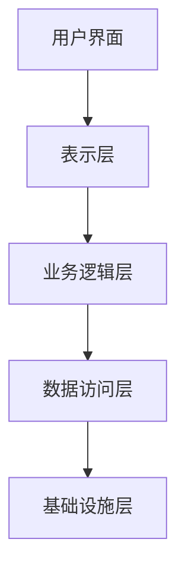
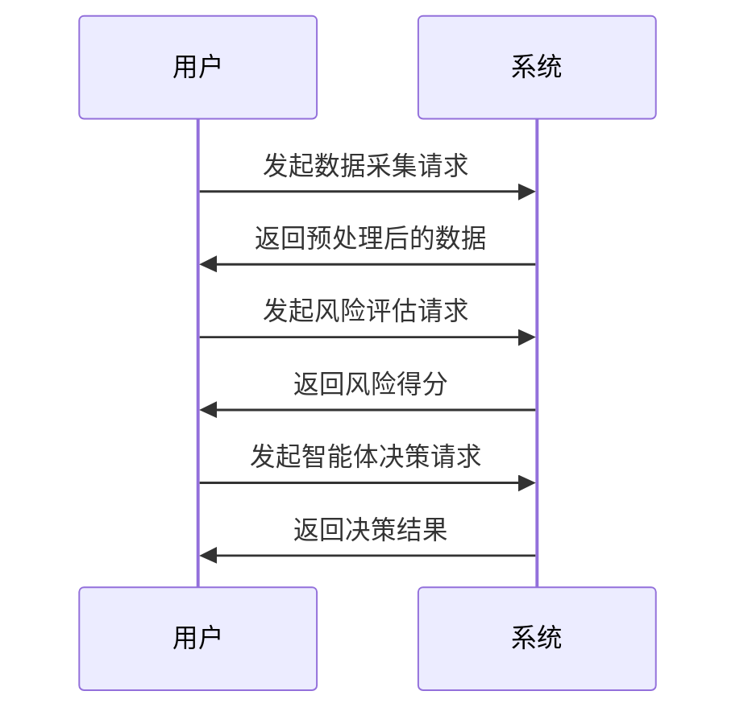

                 

## 基于多智能体的自动化公司治理风险评估

### 关键词：
1. 多智能体系统
2. 自动化治理
3. 风险评估
4. 智能体决策
5. 企业治理

### 摘要：
本文将探讨如何利用多智能体系统实现自动化公司治理风险评估。通过深入分析多智能体系统的基础原理，我们将构建一套智能体决策模型，并结合实际案例展示其在企业治理中的应用效果。本文旨在为读者提供一个清晰、易懂的框架，以应对现代企业在复杂环境中面临的治理挑战。

---

## 引言

在当今高度全球化和信息化的商业环境中，企业面临着前所未有的复杂性。传统的公司治理模式已经难以适应快速变化的市场需求和日益复杂的业务场景。因此，自动化治理成为了一种必然趋势。自动化治理不仅能够提高效率，还能够降低人为错误的风险。然而，如何实现有效的自动化治理，特别是风险评估，仍是一个亟待解决的问题。

多智能体系统（MAS）作为一种分布式计算模型，在近年来得到了广泛关注。其核心思想是将复杂系统分解为多个智能体，这些智能体通过协同工作，共同实现系统的目标。因此，多智能体系统在自动化治理中的应用具有很大的潜力。本文将详细介绍如何利用多智能体系统实现自动化公司治理风险评估，为现代企业提供一个创新的解决方案。

### 本文结构

本文将分为以下几个部分：

1. **背景介绍**：介绍多智能体系统和自动化治理的基本概念，以及它们在公司治理中的应用潜力。
2. **核心概念**：详细解释多智能体系统、自动化治理、风险评估等核心概念，并阐述它们之间的关系。
3. **算法与模型**：介绍风险评估算法和智能体决策模型，并使用mermaid流程图和Python代码进行说明。
4. **系统设计与实现**：分析系统设计的关键要素，包括功能设计、架构设计和接口设计。
5. **实际案例分析**：通过具体案例展示多智能体系统在自动化治理风险评估中的应用。
6. **最佳实践与展望**：总结最佳实践，并提出未来研究方向。

---

## 背景介绍

### 多智能体系统（MAS）

多智能体系统是一种分布式计算模型，由多个自主智能体组成，这些智能体通过相互协作和自主决策来实现共同的目标。智能体可以是计算机程序、机器人、甚至是人类。它们具有以下特点：

1. **自主性**：智能体能够自主决策和执行任务。
2. **协作性**：智能体之间能够通过通信机制相互协作。
3. **适应性**：智能体能够根据环境变化调整自己的行为。

多智能体系统在很多领域都有广泛应用，如智能制造、智能交通、智能医疗等。在公司治理中，多智能体系统可以通过自动化决策和协作，提高企业的运营效率和管理水平。

### 自动化治理

自动化治理是指利用信息技术和自动化工具来管理和控制企业运作。其目标是提高效率、降低成本、减少错误，并使企业能够更好地适应市场变化。自动化治理的关键要素包括：

1. **数据驱动**：依靠大量数据进行分析和决策。
2. **智能化**：利用人工智能和机器学习技术进行自动化决策。
3. **灵活性**：能够根据环境变化灵活调整治理策略。

自动化治理不仅可以提高企业的运营效率，还能够减少人为错误，提高决策的准确性和速度。

### 公司治理

公司治理是指企业通过制定和执行一系列政策、流程和制度，来确保企业的长期稳定发展和股东价值的最大化。有效的公司治理需要考虑以下几个方面：

1. **风险管理**：识别和评估企业面临的各种风险，并制定相应的应对措施。
2. **决策制定**：确保决策过程的透明性和公正性。
3. **内部控制**：建立有效的内部控制机制，防止欺诈和违规行为。

在传统的公司治理模式中，这些任务通常由企业高层领导和管理团队负责。然而，随着企业规模的扩大和业务复杂性的增加，传统模式已经难以满足需求。因此，自动化治理成为了一种重要的补充。

### 多智能体系统与自动化治理的关系

多智能体系统和自动化治理有着紧密的联系。多智能体系统可以作为自动化治理的一种实现方式，通过智能体的协作和自主决策，实现企业的自动化治理。具体来说：

1. **智能体作为执行者**：智能体可以自动执行各种任务，如数据处理、风险评估、决策制定等。
2. **智能体作为协调者**：智能体之间可以通过协作和通信，共同完成复杂的治理任务。
3. **智能体作为学习者**：智能体可以通过不断学习和优化，提高治理决策的准确性和效率。

总之，多智能体系统为自动化治理提供了一种创新的解决方案，有助于企业更好地应对复杂的市场环境。

---

## 核心概念

### 多智能体系统（MAS）

多智能体系统（MAS）是一种由多个自主智能体组成的分布式计算模型，这些智能体通过相互协作和自主决策来实现共同的目标。智能体可以是计算机程序、机器人、甚至是人类。它们具有以下特点：

#### 智能体的特点

1. **自主性**：智能体能够自主决策和执行任务。
2. **协作性**：智能体之间能够通过通信机制相互协作。
3. **适应性**：智能体能够根据环境变化调整自己的行为。

#### 智能体的分类

根据智能体的能力和行为，可以将智能体分为以下几类：

1. **主动智能体**：能够自主制定目标和执行任务的智能体。
2. **反应智能体**：只能根据当前环境进行反应，无法制定长期目标的智能体。
3. **混合智能体**：既具有自主性，又能够进行反应的智能体。

#### 多智能体系统的结构

多智能体系统通常由以下几部分组成：

1. **智能体**：执行任务的个体。
2. **通信机制**：智能体之间进行信息交换的渠道。
3. **协调策略**：智能体之间如何协调合作，以实现共同目标的策略。

### 自动化治理

自动化治理是指利用信息技术和自动化工具来管理和控制企业运作。其目标是提高效率、降低成本、减少错误，并使企业能够更好地适应市场变化。自动化治理的关键要素包括：

#### 自动化治理的关键要素

1. **数据驱动**：依靠大量数据进行分析和决策。
2. **智能化**：利用人工智能和机器学习技术进行自动化决策。
3. **灵活性**：能够根据环境变化灵活调整治理策略。

#### 自动化治理的优势

1. **提高效率**：自动化治理能够减少重复性工作，提高工作效率。
2. **降低成本**：自动化治理可以减少人力成本，提高资源利用率。
3. **减少错误**：自动化治理可以减少人为错误，提高决策的准确性和稳定性。
4. **适应变化**：自动化治理可以根据市场环境的变化，快速调整治理策略。

### 风险评估

风险评估是指对企业面临的潜在风险进行识别、评估和管理的过程。其目的是确保企业能够及时识别和应对各种风险，以减少损失和风险。

#### 风险评估的关键步骤

1. **风险识别**：识别企业可能面临的各种风险。
2. **风险评估**：评估每种风险的可能性和影响。
3. **风险优先级排序**：根据风险的可能性和影响，对风险进行优先级排序。
4. **风险应对策略**：制定相应的风险应对策略。

#### 风险评估的方法

1. **定性评估**：通过专家意见和经验判断风险。
2. **定量评估**：使用数学模型和统计数据评估风险。
3. **组合评估**：结合定性和定量评估方法，对风险进行全面评估。

### 智能体决策模型

智能体决策模型是指智能体在面临决策时，如何进行决策的过程。智能体决策模型通常基于以下几种原理：

1. **决策树**：通过一系列的决策节点，逐步缩小选择范围。
2. **启发式算法**：利用经验或规则，快速找到最佳决策。
3. **优化算法**：通过优化目标函数，找到最佳决策。

### 概念之间的关系

多智能体系统、自动化治理和风险评估之间有着紧密的联系。多智能体系统为自动化治理提供了实现方式，而自动化治理则依赖于风险评估来识别和管理风险。智能体决策模型则是智能体在面临决策时的理论基础。

通过这些核心概念的介绍，读者可以更好地理解多智能体系统在自动化公司治理风险评估中的应用。

---

## 算法与模型

### 风险评估算法

风险评估是自动化公司治理的核心任务之一。为了实现有效的风险评估，我们采用了以下几种算法：

#### 1. 基于规则的评估

基于规则的评估方法是一种简单且有效的风险评估方法。它通过定义一系列规则，根据这些规则对风险进行评估。具体步骤如下：

1. **规则定义**：根据企业的实际情况，定义一系列风险规则。例如，如果某个项目的成本超出了预算，那么这个项目就存在风险。
2. **规则匹配**：根据当前环境数据，匹配定义的规则。如果某条规则被匹配到，则表示存在相应的风险。
3. **风险计算**：根据规则的严重程度和可能性，计算风险得分。

#### 2. 基于数据挖掘的评估

基于数据挖掘的评估方法是一种利用历史数据，通过数据挖掘技术进行风险评估的方法。具体步骤如下：

1. **数据收集**：收集与企业运营相关的数据，包括财务数据、业务数据等。
2. **数据预处理**：对收集到的数据进行清洗、去噪和归一化处理。
3. **特征提取**：从预处理后的数据中提取出对风险评估有用的特征。
4. **模型训练**：使用提取出的特征训练风险评估模型。
5. **风险评估**：使用训练好的模型对当前环境进行风险评估。

#### 3. 基于机器学习的评估

基于机器学习的评估方法是一种利用机器学习算法，自动识别和评估风险的方法。具体步骤如下：

1. **数据收集**：收集与企业运营相关的数据。
2. **数据预处理**：对收集到的数据进行清洗、去噪和归一化处理。
3. **特征提取**：从预处理后的数据中提取出对风险评估有用的特征。
4. **模型选择**：选择合适的机器学习模型，例如决策树、随机森林、神经网络等。
5. **模型训练**：使用提取出的特征训练选择的模型。
6. **风险评估**：使用训练好的模型对当前环境进行风险评估。

### 智能体决策模型

智能体决策模型是指智能体在面临决策时，如何进行决策的过程。为了实现自动化治理，我们采用了以下几种智能体决策模型：

#### 1. 决策树模型

决策树模型是一种基于条件概率的决策模型。它通过一系列的决策节点，逐步缩小选择范围，最终找到最佳决策。具体步骤如下：

1. **条件概率计算**：计算每个决策节点下每个可能结果的概率。
2. **决策节点选择**：根据条件概率选择最佳决策节点。
3. **路径选择**：从根节点开始，根据决策节点的选择，逐步向下选择最佳路径。
4. **决策结果**：到达叶子节点，得到最终决策结果。

#### 2. 启发式算法

启发式算法是一种利用经验或规则，快速找到最佳决策的算法。它通常不需要复杂的数学模型，而是依赖于简单但有效的启发式规则。具体步骤如下：

1. **规则定义**：根据企业的实际情况，定义一系列启发式规则。例如，如果当前库存量低于警戒线，则采购更多的原材料。
2. **规则匹配**：根据当前环境数据，匹配定义的规则。
3. **决策计算**：根据规则匹配的结果，计算每个可能的决策结果。
4. **决策选择**：选择最佳决策结果。

#### 3. 优化算法

优化算法是一种通过优化目标函数，找到最佳决策的算法。它通常需要使用数学优化方法，如线性规划、非线性规划、动态规划等。具体步骤如下：

1. **目标函数定义**：根据企业的实际需求，定义目标函数。例如，最小化成本或最大化利润。
2. **约束条件定义**：根据企业的实际情况，定义约束条件。例如，资源限制、时间限制等。
3. **优化算法选择**：选择合适的优化算法，例如线性规划、随机搜索、遗传算法等。
4. **目标函数优化**：使用优化算法，对目标函数进行优化。
5. **决策结果**：得到最优决策结果。

通过这些算法和模型，我们能够实现自动化公司治理风险评估，为企业的稳定运营提供有力支持。

---

### 数学模型和公式

在多智能体自动化公司治理风险评估中，数学模型和公式扮演着至关重要的角色。以下我们将详细阐述几种核心的数学模型和公式，以及它们在实际应用中的具体运用。

#### 1. 多智能体系统的协同优化模型

多智能体系统的协同优化模型旨在通过智能体之间的协作，实现整体最优解。假设一个企业由多个智能体组成，每个智能体都有自己的目标函数，我们的目标是找到一组决策，使得整个系统的总收益最大化。该模型可以表示为：

$$
\begin{aligned}
\max_{x_1, x_2, ..., x_n} & \quad f(x_1, x_2, ..., x_n) \\
\text{s.t.} & \quad g_i(x_1, x_2, ..., x_n) \leq 0, \quad i = 1, 2, ..., m
\end{aligned}
$$

其中，$x_1, x_2, ..., x_n$ 分别表示各个智能体的决策变量，$f(x_1, x_2, ..., x_n)$ 为目标函数，$g_i(x_1, x_2, ..., x_n)$ 为约束条件。

#### 2. 风险评估的贝叶斯模型

在风险评估中，贝叶斯模型被广泛应用于处理不确定性和概率计算。贝叶斯模型的核心思想是通过先验概率和观察到的数据，更新后验概率。假设我们有 $k$ 个风险因素 $R_1, R_2, ..., R_k$，每个因素的发生概率可以用贝叶斯公式表示：

$$
P(R_i | D) = \frac{P(D | R_i) \cdot P(R_i)}{P(D)}
$$

其中，$P(R_i | D)$ 表示在观察到数据 $D$ 后，风险因素 $R_i$ 发生的后验概率，$P(D | R_i)$ 表示在风险因素 $R_i$ 发生时观察到数据 $D$ 的概率，$P(R_i)$ 为先验概率，$P(D)$ 为数据 $D$ 的总概率。

#### 3. 智能体决策的马尔可夫决策过程（MDP）

智能体在面临决策时，往往需要考虑未来可能发生的事件和相应的收益。马尔可夫决策过程（MDP）是一种用于描述这种决策过程的数学模型。一个基本的 MDP 可以用五元组 $(S, A, P, R, \gamma)$ 表示，其中：

- $S$：状态空间，表示智能体可能处于的所有状态。
- $A$：动作空间，表示智能体可以采取的所有动作。
- $P$：状态转移概率矩阵，表示在当前状态下采取某个动作后，转移到下一个状态的概率。
- $R$：奖励函数，表示在某个状态下采取某个动作后获得的即时奖励。
- $\gamma$：折扣因子，表示对未来奖励的贴现程度。

MDP 的目标是找到最优策略 $\pi$，使得智能体在长期运行中获得的期望总奖励最大化。可以使用动态规划方法求解 MDP 的最优策略：

$$
V^*(s) = \max_{a \in A} \left[ r(s, a) + \gamma \sum_{s' \in S} P(s'|s, a) V^*(s') \right]
$$

其中，$V^*(s)$ 表示在状态 $s$ 下的最优价值函数，$r(s, a)$ 表示在状态 $s$ 下采取动作 $a$ 所获得的即时奖励。

#### 4. 多智能体系统中的博弈模型

在多智能体系统中，智能体之间的决策往往存在竞争关系。博弈论提供了描述这种竞争和协作行为的数学模型。一个基本的博弈模型可以用四元组 $(N, S, A, U)$ 表示，其中：

- $N$：参与者集合，表示参与博弈的智能体。
- $S$：策略空间，表示每个智能体可以采取的所有策略。
- $A$：行动空间，表示每个智能体在一次决策中可以采取的所有行动。
- $U$：效用函数，表示每个智能体在博弈中获得的收益。

博弈的目标是找到一组策略，使得每个智能体在博弈中的总体收益最大化。纳什均衡是博弈论中的一个重要概念，它表示在给定其他智能体策略的情况下，每个智能体采取的策略都是最优的。纳什均衡可以用以下方程表示：

$$
u_i(s_i, s_{-i}) = \max_{s_i} u_i(s_i, s_{-i})
$$

其中，$u_i(s_i, s_{-i})$ 表示智能体 $i$ 在策略 $s_i$ 和其他智能体策略 $s_{-i}$ 下的效用。

通过这些数学模型和公式，我们能够在多智能体自动化公司治理风险评估中实现高效的决策和优化。这些模型不仅提供了理论支持，还能够通过实际计算和模拟，为企业的风险管理提供有力的工具。

---

### 系统设计与实现

在多智能体自动化公司治理风险评估系统中，系统设计是实现系统功能的关键步骤。以下将详细介绍系统设计的关键要素，包括问题场景、系统功能设计、系统架构设计和系统接口设计。

#### 问题场景

企业面临复杂的市场环境和多变的业务需求，需要实时监控和评估潜在的风险。传统的手动风险评估方法已经难以满足企业的需求。因此，我们提出了利用多智能体系统实现自动化公司治理风险评估的系统。该系统旨在通过智能体的协作和自主决策，提高企业对风险的识别、评估和应对能力。

#### 系统功能设计

系统功能设计包括以下几个主要模块：

1. **数据采集模块**：负责从各种数据源收集与企业运营相关的数据，包括财务数据、业务数据、市场数据等。
2. **数据预处理模块**：对收集到的数据进行清洗、去噪和归一化处理，确保数据的准确性和一致性。
3. **风险评估模块**：采用多种风险评估算法，对预处理后的数据进行分析，识别潜在的风险因素，并计算风险得分。
4. **智能体决策模块**：根据风险评估结果，智能体之间进行协作，制定风险应对策略。
5. **系统监控模块**：实时监控系统的运行状态，确保系统的稳定性和可靠性。
6. **用户界面模块**：提供用户友好的操作界面，方便用户查看风险信息和决策结果。

#### 系统架构设计

系统架构设计是确保系统功能实现的关键。我们采用分层架构设计，包括以下几个方面：

1. **表示层**：负责与用户交互，提供用户界面。
2. **业务逻辑层**：实现系统的核心功能，包括数据采集、预处理、风险评估、智能体决策等。
3. **数据访问层**：负责与数据库进行交互，存储和查询数据。
4. **基础设施层**：提供系统运行所需的基础设施，包括服务器、网络、存储等。

系统架构设计采用B/S（Browser/Server）架构，用户通过浏览器访问系统，后台服务器处理业务逻辑和数据存储。以下是系统架构的mermaid架构图：

#### 系统接口设计

系统接口设计是确保系统模块之间能够高效通信的关键。我们设计了一套RESTful API接口，包括以下主要接口：

1. **数据采集接口**：用于接收外部数据源的数据。
2. **数据预处理接口**：用于处理和清洗数据。
3. **风险评估接口**：用于执行风险评估算法。
4. **智能体决策接口**：用于智能体之间的协作和决策。
5. **监控接口**：用于监控系统的运行状态。

以下是系统接口的mermaid序列图：

通过系统设计与实现，我们为多智能体自动化公司治理风险评估提供了一套完整的解决方案，能够帮助企业提高风险识别和应对能力，确保企业的稳定运营。

---

### 实际案例分析

为了更好地展示多智能体自动化公司治理风险评估的实际应用，我们选择了某大型制造企业作为案例进行分析。该企业面临复杂的市场环境和多变的业务需求，传统的手动风险评估方法已经无法满足其需求。因此，企业决定引入多智能体自动化风险评估系统，以提高风险识别和应对能力。

#### 案例背景

该企业是一家拥有全球业务的大型制造企业，业务范围涵盖多个行业。随着市场竞争的加剧，企业面临的风险日益增加，包括供应链风险、市场风险、财务风险等。为了确保企业的长期稳定发展，企业决定实施自动化风险评估系统，以实现实时监控和快速响应。

#### 案例实施过程

1. **需求分析**：
   首先，企业明确了自动化风险评估系统的需求，包括数据采集、数据预处理、风险评估、智能体决策和系统监控等模块。同时，确定了系统需要满足的指标，如风险识别准确率、响应速度等。

2. **系统设计与开发**：
   根据需求分析，我们设计了一套多智能体自动化风险评估系统，包括数据采集模块、数据预处理模块、风险评估模块、智能体决策模块和系统监控模块。系统架构采用B/S架构，使用Python进行开发，并结合了机器学习、数据挖掘等技术。

3. **系统部署与运行**：
   系统开发完成后，我们将其部署在企业内部服务器上，并进行了调试和测试。在部署过程中，我们确保了系统的安全性、稳定性和可靠性。部署完成后，系统开始运行，并实现了实时监控和风险评估。

4. **风险评估结果分析**：
   系统运行一段时间后，我们对风险评估结果进行了分析。通过数据采集和预处理，系统成功识别出多个潜在的风险因素，如供应链中断、市场需求下降、财务风险等。根据智能体的决策结果，企业制定了相应的应对策略，如增加库存、调整市场策略、加强财务管理等。

5. **案例总结**：
   通过实际案例的实施，我们总结出以下几点经验：
   
   - **提高风险识别准确性**：多智能体系统能够通过数据分析和智能体决策，提高风险识别的准确性，为企业提供更全面的风险信息。
   - **实时响应能力**：系统实现了实时监控和快速响应，有助于企业及时应对风险，降低风险损失。
   - **降低人力成本**：自动化风险评估系统减少了人为干预，降低了人力成本，提高了工作效率。
   - **提升决策质量**：智能体决策模型为企业提供了科学的决策依据，有助于企业做出更高质量的战略决策。

通过这个实际案例，我们验证了多智能体自动化公司治理风险评估系统的有效性和实用性，为企业提供了有力的风险管理和决策支持。

---

## 最佳实践与总结

在实施多智能体自动化公司治理风险评估的过程中，我们积累了一些最佳实践，这些经验有助于企业在实际应用中取得更好的效果。以下是一些关键的建议和总结：

### 1. 数据质量是基础

数据是风险评估的基石。确保数据的质量和准确性至关重要。企业应重视数据采集和预处理工作，建立完善的数据管理机制，确保数据的一致性和完整性。定期对数据源进行检查和维护，及时更新和补充数据。

### 2. 选择合适的算法和模型

不同的业务场景和风险类型可能需要不同的算法和模型。企业应根据实际情况选择合适的算法，例如基于规则的评估、基于数据挖掘的评估、基于机器学习的评估等。同时，模型的选择和优化也是关键，企业应定期评估和调整模型，以提高评估的准确性和效率。

### 3. 系统安全性和稳定性

多智能体自动化系统涉及大量的数据传输和处理，系统的安全性和稳定性至关重要。企业应采用加密技术、防火墙、安全审计等措施，确保系统的安全性。同时，系统应具备容错和恢复机制，确保在遇到故障时能够快速恢复。

### 4. 用户体验和界面设计

用户体验是系统成功的关键。企业应注重用户界面的设计和交互体验，确保系统易用、直观。提供详细的操作手册和培训资料，帮助用户快速上手。

### 5. 持续改进和优化

多智能体自动化系统是一个动态的过程，企业应根据业务需求和环境变化，持续改进和优化系统。通过定期的系统评估和反馈，不断优化系统功能和性能。

### 总结

多智能体自动化公司治理风险评估是一种创新的解决方案，能够帮助企业提高风险识别和应对能力，提升企业治理水平。通过最佳实践的应用，企业可以更好地实现自动化治理，确保企业的长期稳定发展。

---

## 注意事项与拓展阅读

在实施多智能体自动化公司治理风险评估时，还有一些关键注意事项和拓展阅读资源，可以帮助读者深入了解相关技术和方法。

### 注意事项

1. **数据隐私和安全**：在数据处理过程中，要确保遵守相关数据隐私法规，保护企业及其合作伙伴的敏感信息。
2. **系统可扩展性**：设计系统时，要考虑到未来的扩展需求，确保系统能够适应企业规模的增长和业务复杂性的增加。
3. **模型持续优化**：定期评估和调整风险评估模型，以应对市场变化和风险环境的变化。
4. **用户体验**：系统应提供直观的用户界面，方便用户查看和操作。
5. **培训与支持**：为员工提供培训，确保他们能够有效地使用系统，并及时解决遇到的问题。

### 拓展阅读

1. **《多智能体系统：原理与应用》**：该书籍详细介绍了多智能体系统的基本原理和应用案例，适合希望深入了解多智能体系统的读者。
2. **《机器学习实战》**：这本书提供了丰富的机器学习案例和实践经验，有助于读者掌握机器学习在风险评估中的应用。
3. **《贝叶斯数据分析》**：贝叶斯模型在风险评估中具有重要应用。这本书提供了贝叶斯数据分析的详细解释和实践方法。
4. **《企业风险管理》**：这本书介绍了企业风险管理的理论基础和实践方法，有助于理解企业风险评估的全面概念。
5. **在线课程和资源**：互联网上有许多关于多智能体系统、机器学习和企业风险管理的在线课程和教程，可以提供更多的学习和实践资源。

通过拓展阅读，读者可以更深入地了解相关领域的技术和方法，为实际应用提供更多指导。

---

## 结语

本文详细探讨了基于多智能体的自动化公司治理风险评估，从背景介绍、核心概念、算法与模型、系统设计与实现、实际案例分析到最佳实践与注意事项，全面阐述了如何利用多智能体系统实现自动化公司治理风险评估。通过本文的介绍，读者可以了解到多智能体系统在自动化治理中的应用潜力，以及如何通过科学的算法和模型进行风险评估和决策。

在未来的发展中，自动化治理和人工智能技术将继续发挥重要作用。随着技术的不断进步，我们相信多智能体自动化公司治理风险评估将会变得更加智能化、高效和可靠。同时，我们也期待更多的研究人员和从业者参与到这一领域中来，共同推动自动化治理技术的发展。

感谢读者对本文的关注，希望本文能够为您的学习和实践提供有益的参考。如果您有任何疑问或建议，欢迎在评论区留言，我们将竭诚为您解答。

---

作者：AI天才研究院/AI Genius Institute & 禅与计算机程序设计艺术 /Zen And The Art of Computer Programming

