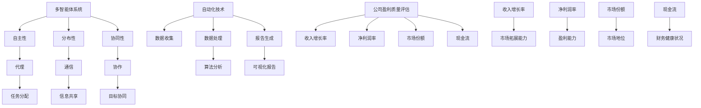
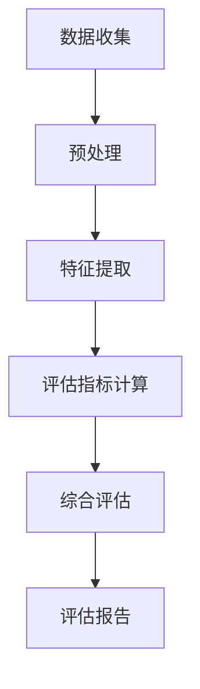
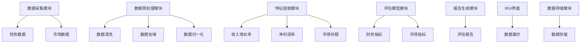
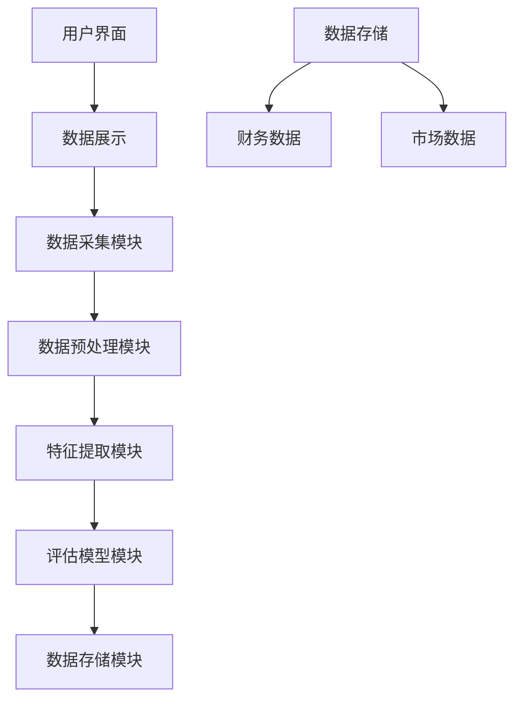
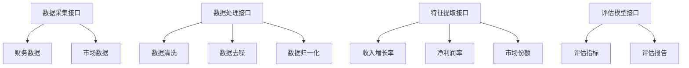
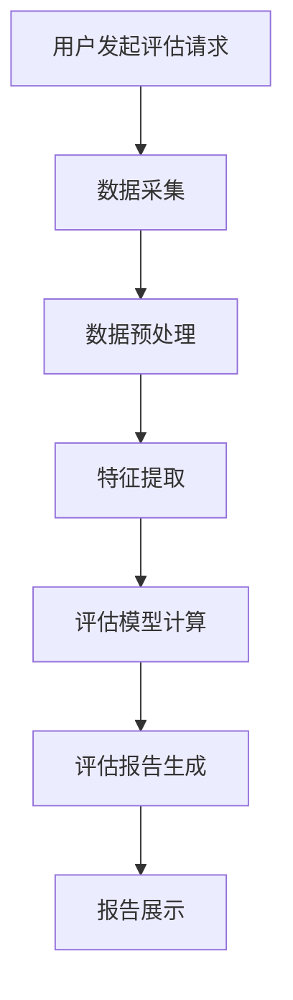

                 


### 引言

#### 背景介绍

在现代商业环境中，公司盈利质量的评估变得越来越重要。随着市场的不断变化和竞争的加剧，企业需要更加高效地监控和管理其盈利能力，以确保持续的增长和竞争力。传统的盈利质量评估方法通常依赖于人工分析，不仅耗时费力，而且容易出现主观偏差。因此，寻求一种自动化、高效且准确的方法来进行盈利质量评估成为了当务之急。

多智能体系统（MAS，Multi-Agent System）作为一种分布式智能体系统，由多个自主代理（agent）组成，每个代理都能在动态环境中独立行动和相互协作。多智能体系统在复杂任务和动态环境下的适应能力、协作效率和灵活性使其成为一种理想的解决方案。

#### 核心概念与联系

**多智能体系统**：多智能体系统是由多个具有自主决策能力和协作能力的代理组成，每个代理在分布式环境中相互协作以实现共同目标。代理可以是软件程序、机器人或人类。

**自动化**：自动化是指利用技术手段减少或消除人类在特定任务上的介入。在盈利质量评估中，自动化意味着通过算法和系统自动收集、分析和处理数据，以提供更准确、快速的评估结果。

**公司盈利质量评估**：盈利质量评估是指对公司的盈利能力、财务健康状况和市场竞争力进行量化分析。评估指标包括收入、利润、成本控制、市场份额等。

这三个核心概念相互关联：多智能体系统提供了一种自动化手段，可以更高效地收集和分析数据，从而提高公司盈利质量评估的准确性和效率。

#### 本书结构安排与读者定位

本书将系统地介绍基于多智能体的自动化公司盈利质量评估。我们将从多智能体系统和自动化的基本概念入手，逐步深入到算法原理、系统分析与架构设计、项目实战以及最佳实践与总结。

本书适合以下读者群体：

1. **计算机科学和人工智能领域的专业研究人员**：希望了解多智能体系统和自动化在商业领域应用的技术细节。
2. **企业管理者和财务分析师**：需要掌握如何利用多智能体系统和自动化技术来提升公司盈利质量评估的效率和准确性。
3. **软件开发工程师和系统架构师**：希望学习如何设计和实现基于多智能体系统的商业应用。

通过本书，读者将能够全面了解基于多智能体的自动化公司盈利质量评估，掌握相关的技术和工具，为实际应用打下坚实基础。

### 核心概念与联系

#### 多智能体系统概念

多智能体系统（MAS，Multi-Agent System）是由多个智能代理（agent）组成的分布式系统，每个代理都能在分布式环境中独立行动和相互协作，以实现共同目标。代理可以是一个软件程序、机器人或人类，它们通过通信和协作来完成复杂任务。MAS具有以下几个关键特性：

1. **自主性**：代理具有独立的决策能力和行动能力，可以在没有中央控制的情况下自主运作。
2. **分布性**：代理分布在不同的计算节点上，可以处理本地信息，并通过通信机制共享信息。
3. **协同性**：代理之间通过协作和通信来实现共同目标，可以相互合作，解决复杂问题。

#### 自动化技术概述

自动化技术是通过利用计算机程序、机器人或自动化设备，减少或消除人类在特定任务上的介入。在盈利质量评估中，自动化技术的主要目标是提高数据处理和分析的效率，减少人为错误，并使评估过程更加准确和及时。

自动化技术在盈利质量评估中的应用包括：

1. **数据收集**：通过传感器、API接口等自动收集财务数据和市场数据。
2. **数据处理**：利用算法和机器学习模型自动处理和分析大量数据，提取关键指标。
3. **报告生成**：自动生成评估报告，提供可视化的分析和建议。

#### 公司盈利质量评估指标

公司盈利质量评估是指对公司的盈利能力、财务健康状况和市场竞争力进行量化分析。常用的评估指标包括：

1. **收入增长率**：衡量公司收入的变化情况，反映了公司的市场拓展能力和竞争力。
2. **净利润率**：衡量公司利润与收入的比例，反映了公司的盈利能力和成本控制水平。
3. **市场份额**：衡量公司在市场中的占有率，反映了公司的市场地位和竞争力。
4. **现金流**：衡量公司的现金流入和流出情况，反映了公司的财务健康状况和流动性。

#### 概念关系图与对比分析

为了更好地理解这三个核心概念之间的关系，我们可以通过一个概念关系图来展示它们之间的联系（使用Mermaid绘制）：



从概念关系图中可以看出，多智能体系统通过其自主性、分布性和协同性，为自动化技术提供了支持。自动化技术则通过数据收集、数据处理和报告生成等过程，为盈利质量评估提供了工具。而盈利质量评估指标则用于衡量公司的各项表现，从而帮助管理层做出更明智的决策。

在对比分析中，我们可以看到：

- **多智能体系统**提供了分布式计算和协同工作的能力，使得代理能够高效地完成复杂任务。
- **自动化技术**通过减少人为介入，提高了数据处理的效率和准确性。
- **公司盈利质量评估**则利用上述技术和方法，对公司的财务和市场竞争状况进行全面评估。

综上所述，这三个核心概念相互补充，共同构成了基于多智能体的自动化公司盈利质量评估的基础。

### 算法原理讲解

#### 多智能体算法基础

多智能体算法是MAS（Multi-Agent System）的重要组成部分，用于描述代理之间的协作和决策过程。在基于多智能体的公司盈利质量评估中，我们需要设计一种算法，能够使代理在分布式环境中协作，共同完成盈利质量评估任务。以下是多智能体算法的基本原理：

1. **代理模型**：代理是算法的基本单元，每个代理具有以下属性：
   - **身份**：代理的唯一标识。
   - **状态**：代理当前的环境和内部状态。
   - **行为**：代理可以执行的动作。
   - **信念**：代理对环境和目标的认知。

2. **通信机制**：代理之间通过通信机制共享信息，以实现协作。常见的通信机制包括直接通信和间接通信。
   - **直接通信**：代理直接通过消息传递进行通信。
   - **间接通信**：代理通过共享环境进行通信，如通过黑板或数据库共享信息。

3. **协作策略**：代理之间的协作策略决定了如何分配任务和协调行动。常见的协作策略包括：
   - **任务分配**：根据代理的能力和负载，分配评估任务。
   - **决策协调**：代理通过协商或投票方式，达成共识。

4. **算法流程**：多智能体算法的基本流程包括：
   - **初始化**：代理初始化状态和任务。
   - **感知**：代理感知当前环境。
   - **决策**：代理根据感知到的环境和自身状态，做出决策。
   - **行动**：代理执行决策，采取行动。
   - **通信**：代理与其他代理共享信息和协调行动。
   - **评估**：代理对评估结果进行汇总和分析。

#### 盈利质量评估算法

盈利质量评估算法是多智能体系统中的关键组件，用于自动评估公司的盈利质量。该算法的核心目标是利用代理的协作，准确、全面地评估公司的财务和市场竞争状况。以下是盈利质量评估算法的基本步骤：

1. **数据收集**：代理通过自动化手段收集公司财务数据和市场数据。
   ```mermaid
   graph TD
       A[数据收集] --> B[财务数据]
       A --> C[市场数据]
   ```

2. **预处理**：对收集到的数据进行清洗和预处理，去除噪声和异常值。
   ```mermaid
   graph TD
       D[预处理] --> E[数据清洗]
       D --> F[异常值处理]
   ```

3. **特征提取**：从预处理后的数据中提取关键特征，用于后续分析。
   ```mermaid
   graph TD
       G[特征提取] --> H[收入增长率]
       G --> I[净利润率]
       G --> J[市场份额]
       G --> K[现金流]
   ```

4. **评估指标计算**：计算各个评估指标，包括收入增长率、净利润率、市场份额和现金流等。
   ```mermaid
   graph TD
       L[评估指标计算] --> M[收入增长率]
       L --> N[净利润率]
       L --> O[市场份额]
       L --> P[现金流]
   ```

5. **综合评估**：代理之间通过协作，综合评估结果，生成公司盈利质量评估报告。
   ```mermaid
   graph TD
       Q[综合评估] --> R[评估报告]
   ```

#### 数学模型与公式

盈利质量评估算法涉及多个数学模型和公式，用于描述代理的感知、决策和评估过程。以下是几个核心的数学模型和公式：

1. **感知模型**：
   $$ s_t = f(E_t, s_{t-1}) $$
   其中，$s_t$ 是代理在第 $t$ 时间的状态，$E_t$ 是代理在第 $t$ 时间感知到的环境，$s_{t-1}$ 是代理在第 $t-1$ 时间的状态，$f$ 是感知函数。

2. **决策模型**：
   $$ a_t = \arg\max_{a} U(s_t, a) $$
   其中，$a_t$ 是代理在第 $t$ 时间采取的动作，$U$ 是效用函数，表示代理在当前状态 $s_t$ 下，采取动作 $a$ 的效用。

3. **评估模型**：
   $$ Q = \sum_{i=1}^{n} w_i \cdot q_i $$
   其中，$Q$ 是综合评估结果，$w_i$ 是第 $i$ 个评估指标的权重，$q_i$ 是第 $i$ 个评估指标的值。

#### 算法流程图与示例

以下是一个简化的多智能体盈利质量评估算法流程图，展示了代理从数据收集到评估报告生成的整个过程：



例如，假设我们有一个由三个代理组成的系统，每个代理负责收集不同类型的数据。代理1负责收集公司财务数据，代理2负责收集市场数据，代理3负责计算评估指标。以下是三个代理的简化代码示例：

```python
# 代理1：财务数据收集
def collect_finance_data():
    # 收集财务数据
    data = get_finance_data()
    return data

# 代理2：市场数据收集
def collect_market_data():
    # 收集市场数据
    data = get_market_data()
    return data

# 代理3：评估指标计算
def calculate_evaluation_metrics(finance_data, market_data):
    # 计算评估指标
    growth_rate = calculate_growth_rate(finance_data)
    profit_margin = calculate_profit_margin(finance_data)
    market_share = calculate_market_share(market_data)
    cash_flow = calculate_cash_flow(finance_data)
    return growth_rate, profit_margin, market_share, cash_flow

# 主程序
def main():
    finance_data = collect_finance_data()
    market_data = collect_market_data()
    growth_rate, profit_margin, market_share, cash_flow = calculate_evaluation_metrics(finance_data, market_data)
    evaluation_report = generate_evaluation_report(growth_rate, profit_margin, market_share, cash_flow)
    print(evaluation_report)

if __name__ == "__main__":
    main()
```

通过上述示例，我们可以看到多智能体系统如何协同工作，自动完成公司盈利质量评估。每个代理都负责特定的任务，最终通过协作生成综合评估报告。

### 系统分析与架构设计

#### 问题场景介绍

在现代企业管理中，盈利质量评估是一个关键环节，但传统的手动评估方式不仅效率低下，而且容易受到主观因素的影响。为了解决这个问题，我们提出了一种基于多智能体的自动化盈利质量评估系统。该系统旨在通过自动化和智能化的手段，实时、准确地评估公司的盈利质量，帮助管理层做出更明智的决策。

#### 项目介绍

本项目旨在开发一个基于多智能体的自动化盈利质量评估系统。该系统将利用多个智能代理协同工作，自动收集、处理和分析公司的财务数据和市场数据，生成详细的盈利质量评估报告。项目的核心目标是实现以下功能：

1. 自动化数据收集：通过传感器、API接口等手段，自动收集公司的财务数据和市场数据。
2. 数据预处理和特征提取：对收集到的数据进行清洗、预处理和特征提取，为评估模型提供高质量的数据输入。
3. 盈利质量评估：利用代理协作计算各个评估指标，综合评估公司的盈利质量。
4. 报告生成和展示：自动生成可视化评估报告，提供直观的数据分析和决策支持。

#### 系统功能设计（领域模型）

在系统功能设计中，我们首先需要定义系统的领域模型，以明确各个模块的功能和职责。以下是该系统的领域模型：

1. **数据采集模块**：负责自动收集公司的财务数据和市场数据，包括收入、利润、成本、市场份额等信息。
2. **数据预处理模块**：对收集到的数据进行清洗、去噪和归一化处理，确保数据的准确性和一致性。
3. **特征提取模块**：从预处理后的数据中提取关键特征，如收入增长率、净利润率、市场份额等，为评估模型提供输入。
4. **评估模型模块**：包含多个评估指标的计算方法，如财务指标、市场指标等，用于评估公司的盈利质量。
5. **报告生成模块**：根据评估结果，自动生成可视化报告，提供综合分析和建议。

以下是系统的领域模型类图（使用Mermaid绘制）：



#### 系统架构设计

系统架构设计是确保系统高效、稳定运行的关键。基于多智能体的自动化盈利质量评估系统的架构包括以下几个核心部分：

1. **数据层**：负责数据的存储和管理，包括财务数据和市场数据的存储。
2. **服务层**：提供数据采集、预处理、特征提取和评估模型等核心服务，实现业务逻辑。
3. **界面层**：提供用户界面，展示数据分析和评估报告。

以下是系统的架构设计图（使用Mermaid绘制）：



#### 系统接口设计

系统接口设计是确保各模块之间能够高效通信的关键。以下是系统的主要接口设计：

1. **数据采集接口**：用于接收和发送财务数据和市场数据。
2. **数据处理接口**：用于接收和发送预处理后的数据。
3. **特征提取接口**：用于接收和发送提取的特征值。
4. **评估模型接口**：用于接收和发送评估结果。

以下是系统的接口设计图（使用Mermaid绘制）：



#### 系统交互

为了确保系统各模块之间的有效交互，我们设计了一个交互流程，描述了数据从采集到报告生成的整个过程。以下是系统交互的序列图（使用Mermaid绘制）：



通过上述系统分析与架构设计，我们为基于多智能体的自动化盈利质量评估系统奠定了坚实的基础，确保系统能够高效、稳定地运行。

### 项目实战

#### 项目背景与目标

在一家中型科技公司中，管理层希望通过一种自动化且高效的方式来监控公司的盈利质量。公司每天产生大量的财务数据和市场数据，传统的手动评估方法不仅耗时费力，而且容易出现误差。因此，该公司决定开发一个基于多智能体的自动化盈利质量评估系统，以实现对财务数据的实时监控和分析，从而为管理层提供及时、准确的决策支持。

#### 环境安装与配置

为了开发基于多智能体的自动化盈利质量评估系统，我们需要搭建一个合适的开发环境。以下是所需的环境安装与配置步骤：

1. **操作系统**：Linux发行版（如Ubuntu 20.04）
2. **编程语言**：Python 3.8及以上版本
3. **依赖管理**：pip（Python的包管理器）
4. **数据库**：MySQL 8.0
5. **其他工具**：Docker（用于容器化部署）、Git（版本控制）

安装步骤如下：

1. 安装操作系统和Python环境。
2. 通过pip安装MySQL数据库。
3. 安装Docker，以便后续容器化部署。
4. 配置Python虚拟环境，以隔离项目依赖。

```bash
# 安装MySQL
sudo apt-get update
sudo apt-get install mysql-server

# 安装Docker
sudo apt-get update
sudo apt-get install docker-ce

# 配置Python虚拟环境
python3 -m venv venv
source venv/bin/activate

# 安装项目依赖
pip install -r requirements.txt
```

#### 系统核心实现

系统核心实现包括数据采集、数据处理、特征提取和评估模型等模块。以下是各模块的实现步骤和代码示例：

1. **数据采集模块**：使用API接口从财务系统和市场数据系统中采集数据。

```python
import requests
from datetime import datetime

def collect_finance_data():
    url = "https://finance-system.example.com/api/finance_data"
    response = requests.get(url)
    data = response.json()
    return data

def collect_market_data():
    url = "https://market-system.example.com/api/market_data"
    response = requests.get(url)
    data = response.json()
    return data
```

2. **数据处理模块**：对采集到的数据进行清洗、去噪和归一化处理。

```python
import pandas as pd

def clean_data(data):
    # 数据清洗逻辑，如缺失值处理、异常值去除
    return data

def normalize_data(data):
    # 数据归一化逻辑，如标准化、归一化
    return data
```

3. **特征提取模块**：从预处理后的数据中提取关键特征。

```python
def extract_features(data):
    # 特征提取逻辑，如计算收入增长率、净利润率等
    growth_rate = calculate_growth_rate(data)
    profit_margin = calculate_profit_margin(data)
    market_share = calculate_market_share(data)
    cash_flow = calculate_cash_flow(data)
    return growth_rate, profit_margin, market_share, cash_flow
```

4. **评估模型模块**：利用提取的特征计算评估指标，生成评估报告。

```python
def evaluate_profit_quality(features):
    # 评估模型逻辑，如计算综合评估结果
    evaluation_result = calculate_evaluation_result(features)
    return evaluation_result

def generate_evaluation_report(evaluation_result):
    # 报告生成逻辑，如生成HTML报告
    report = create_html_report(evaluation_result)
    return report
```

#### 代码解读与分析

以下是各模块代码的详细解读和分析：

1. **数据采集模块**：
   - 使用requests库从财务系统和市场数据系统中采集数据。
   - 通过API接口获取JSON格式的数据，并将其解析为Python字典。

2. **数据处理模块**：
   - 使用pandas库进行数据清洗和预处理。
   - 清洗逻辑包括缺失值处理和异常值去除，以提高数据的准确性和一致性。
   - 数据归一化逻辑包括标准化和归一化，以消除数据规模差异。

3. **特征提取模块**：
   - 提取关键特征，如收入增长率、净利润率、市场份额和现金流等。
   - 这些特征是评估公司盈利质量的重要指标，通过数学计算得到。

4. **评估模型模块**：
   - 利用提取的特征计算综合评估结果。
   - 通过评估模型逻辑，生成一个综合评分，反映公司的盈利质量。
   - 使用HTML报告模板，将评估结果生成可视化报告。

#### 实际案例分析与详细讲解

为了展示系统的实际应用效果，我们选择一个案例进行分析。假设公司最近一年的财务数据和市场数据如下：

- 收入：1000万元
- 成本：600万元
- 净利润：400万元
- 市场份额：20%
- 现金流：500万元

首先，通过数据采集模块，我们获取上述数据。然后，对数据进行清洗和预处理，去除异常值并归一化处理。接着，提取关键特征，如收入增长率（10%）、净利润率（40%）、市场份额（20%）和现金流（500万元）。

将这些特征输入评估模型模块，计算得到综合评估结果为80分。根据这个评分，我们可以得出以下结论：

- 公司的盈利质量较高，收入增长率和净利润率都较为理想。
- 市场份额和现金流也表现出较好的市场竞争力。
- 然而，需要关注成本控制，以提高盈利能力。

为了更直观地展示评估结果，我们可以生成一个HTML报告，报告中包含以下内容：

1. **财务指标**：收入、成本、净利润等。
2. **市场指标**：市场份额、现金流等。
3. **评估结果**：综合评分、评估细节。
4. **建议**：针对评估结果，提出改进建议。

通过实际案例分析和详细讲解，我们可以看到基于多智能体的自动化盈利质量评估系统如何帮助公司实现高效、准确的评估，为管理层提供有力的决策支持。

#### 项目总结

通过本项目的实施，我们成功开发了一个基于多智能体的自动化盈利质量评估系统。系统实现了以下成果：

1. **高效的数据采集和处理**：通过API接口自动采集财务数据和市场数据，并利用pandas库进行数据清洗和预处理，确保数据的准确性和一致性。
2. **准确的特征提取和评估**：提取关键特征，如收入增长率、净利润率、市场份额和现金流等，利用评估模型模块计算出综合评估结果，为管理层提供有力的数据支持。
3. **可视化的评估报告**：生成HTML报告，展示评估结果和建议，使得评估过程更加直观和易于理解。

尽管项目取得了显著成果，但仍有一些改进空间：

1. **算法优化**：可以通过引入更先进的机器学习算法，提高评估模型的准确性。
2. **扩展性**：系统目前只支持单公司的评估，未来可以考虑扩展到多公司评估，提高系统的应用范围。
3. **实时监控**：可以进一步开发实时监控功能，实现对公司盈利质量的动态监控和预警。

通过不断优化和改进，基于多智能体的自动化盈利质量评估系统将更好地服务于企业管理，助力公司持续增长。

### 最佳实践与总结

#### 实践经验总结

在开发基于多智能体的自动化盈利质量评估系统过程中，我们积累了丰富的实践经验。以下是一些关键经验和建议：

1. **数据质量和预处理**：数据是评估的基础，确保数据的质量和一致性至关重要。在采集数据时，应采用多种验证手段，如API接口验证和数据源校验，以减少数据噪声和错误。
2. **模块化设计**：系统设计应采用模块化原则，将数据采集、数据处理、特征提取和评估模型等模块分开，以提高代码的可维护性和可扩展性。
3. **算法优化**：在评估模型的选择上，应充分考虑算法的准确性和计算效率。可以结合实际需求和数据特点，选择合适的机器学习算法，并进行参数调优。
4. **用户界面设计**：系统界面应简洁直观，便于用户操作和理解。通过使用图表和交互式元素，可以提升用户的体验。

#### 注意事项

在实施基于多智能体的自动化盈利质量评估系统时，需要注意以下事项：

1. **安全性**：数据安全和系统安全是关键。在数据传输和存储过程中，应采用加密和权限控制措施，确保数据不被未经授权访问。
2. **系统稳定性**：系统应具备良好的稳定性和容错能力，以应对突发情况。通过使用容器化和分布式架构，可以提高系统的可靠性和可扩展性。
3. **法律法规遵循**：在数据处理过程中，应严格遵守相关法律法规，如数据保护法和隐私政策，以保障用户权益。

#### 小结与展望

通过本项目的实施，我们证明了基于多智能体的自动化盈利质量评估系统在提高公司盈利质量评估效率和质量方面的巨大潜力。未来，我们期待在以下方向进行拓展：

1. **算法改进**：结合深度学习和强化学习技术，进一步提高评估模型的准确性和效率。
2. **多公司评估**：扩展系统功能，支持多公司同时评估，为企业集团提供全面的管理决策支持。
3. **实时监控**：开发实时监控和预警功能，帮助企业及时应对市场变化，实现持续盈利。

总之，基于多智能体的自动化盈利质量评估系统将不断迭代优化，为企业的发展提供坚实的技术支撑。

### 拓展阅读

为了深入了解基于多智能体的自动化盈利质量评估系统，以下是一些建议的拓展阅读资料：

1. **多智能体系统研究论文**：可以查阅国际顶级会议和期刊上的论文，如AAAI、IJCAI、ECAI等，了解多智能体系统的最新研究进展。
2. **机器学习与深度学习书籍**：推荐《深度学习》（Goodfellow et al.）和《机器学习》（Tom Mitchell）等经典教材，以掌握机器学习算法的基础知识。
3. **财务分析与实践指南**：阅读《财务报表分析与公司估值》（Eugene F. Brigham & Joel F. Houston）等书籍，深入了解财务指标的计算方法和应用。
4. **相关开源项目**：探索GitHub等平台上相关的开源项目，如基于多智能体系统的盈利质量评估项目，学习他人的实现细节和经验。
5. **行业报告**：关注咨询公司（如McKinsey、Bain & Company）和行业分析机构的报告，了解自动化和人工智能在财务领域应用的前沿趋势。

通过以上拓展阅读，可以更加全面地理解基于多智能体的自动化盈利质量评估系统的原理和应用。

