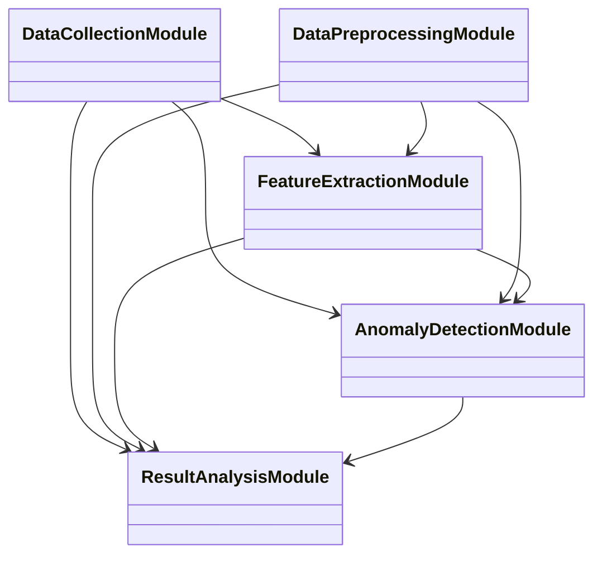
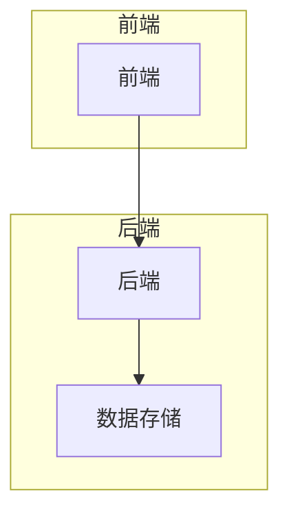
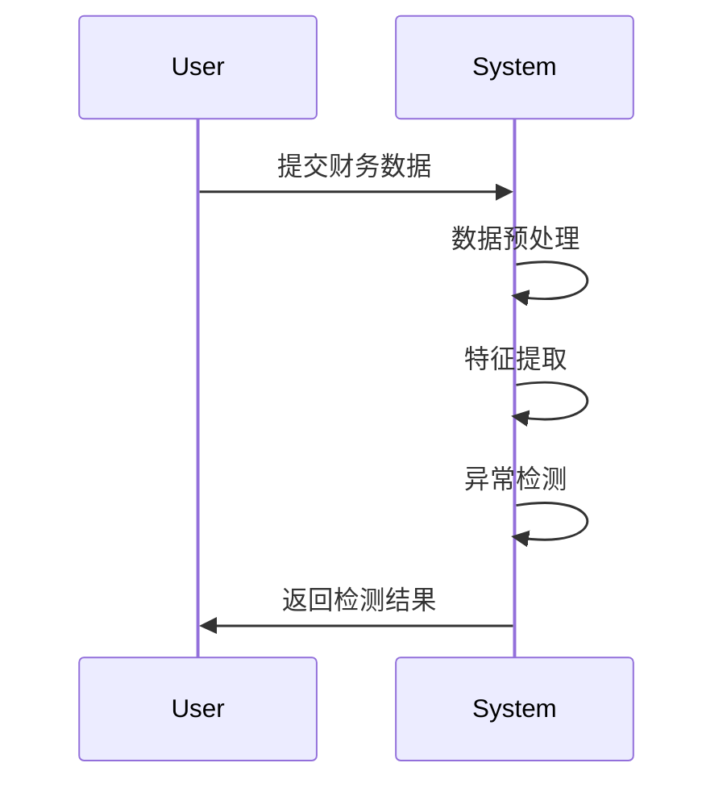

                 


### 步骤一：确定文章的核心内容和结构

首先，我们需要明确文章的核心内容和结构。文章将以“基于多智能体的自动化公司财务舞弊检测系统”为主题，从以下几个方面进行深入探讨：

1. **背景介绍**：介绍财务舞弊的现状与挑战，以及多智能体系统在财务舞弊检测中的应用。
2. **核心概念与联系**：阐述多智能体系统的基本概念和其在财务舞弊检测中的应用。
3. **算法原理讲解**：详细介绍舞弊检测算法的原理，包括数据预处理方法、算法设计、数学模型和公式，以及举例说明。
4. **系统分析与架构设计方案**：分析问题场景，介绍项目背景，详细设计系统功能（领域模型、架构设计、接口设计和交互）。
5. **项目实战**：介绍系统核心实现源代码，代码应用解读与分析，实际案例分析和详细讲解剖析，以及项目小结。
6. **最佳实践 tips**、**小结**、**注意事项**和**拓展阅读**等内容。

### 步骤二：梳理文章的逻辑结构

为了确保文章的逻辑清晰，我们需要按照以下结构来组织内容：

1. **引言**：简要介绍财务舞弊的背景，引出本文主题。
2. **问题背景与意义**：
   - **财务舞弊的现状与挑战**：介绍财务舞弊的现状，分析其对社会和经济的影响。
   - **多智能体系统在财务舞弊检测中的应用**：阐述多智能体系统在财务舞弊检测中的作用和优势。
3. **核心概念与联系**：
   - **多智能体系统的基本概念**：介绍多智能体系统的定义、特点和架构。
   - **多智能体在财务舞弊检测中的应用**：分析多智能体系统在财务舞弊检测中的具体应用和协作机制。
4. **算法原理讲解**：
   - **数据预处理方法**：介绍数据预处理的过程和方法。
   - **舞弊检测算法设计**：详细讲解算法的设计原理和实现方法。
   - **数学模型和公式**：给出算法的数学模型和公式，并进行分析。
   - **举例说明**：通过具体的案例来说明算法的原理和应用。
5. **系统分析与架构设计方案**：
   - **问题场景介绍**：介绍具体的应用场景。
   - **系统功能设计**：包括领域模型、架构设计、接口设计和交互。
   - **系统架构设计**：详细描述系统的架构设计，包括架构图和接口设计。
6. **项目实战**：
   - **实际案例介绍**：介绍具体的案例背景和目标。
   - **系统核心实现源代码解析**：分析系统核心实现的源代码。
   - **案例分析与详细讲解**：对案例进行详细分析和讲解。
   - **项目小结**：总结项目的经验教训和未来的研究方向。
7. **最佳实践 tips**、**小结**、**注意事项**和**拓展阅读**等内容。

### 步骤三：撰写文章的每一部分

根据上述逻辑结构，我们开始撰写文章的每一部分，确保内容完整、丰富且具有深度。以下是每个部分的初步草稿：

#### 引言

财务舞弊一直是金融领域的一大挑战。随着企业规模的扩大和数据量的增加，传统的财务舞弊检测方法已经难以满足需求。近年来，多智能体系统作为一种新兴的技术，其在财务舞弊检测中的应用逐渐受到关注。本文旨在探讨基于多智能体的自动化公司财务舞弊检测系统的设计与实现，为相关领域的研究和实践提供参考。

#### 问题背景与意义

##### 财务舞弊的现状与挑战

财务舞弊是指企业在财务报表中故意虚假陈述、隐瞒信息或操纵财务数据，以达到非法获利或误导投资者等目的。近年来，财务舞弊事件频发，严重损害了投资者利益，破坏了金融市场的稳定。

财务舞弊的挑战主要体现在以下几个方面：

1. **数据量巨大**：企业财务数据量庞大，传统方法难以高效处理。
2. **检测难度大**：财务舞弊手段不断翻新，传统方法难以识别。
3. **实时性要求高**：财务舞弊往往具有突发性和隐蔽性，要求检测系统具备实时性。

##### 多智能体系统在财务舞弊检测中的应用

多智能体系统是一种分布式计算系统，由多个自主智能体组成，能够协同完成任务。在财务舞弊检测中，多智能体系统具有以下优势：

1. **分布式计算**：多智能体系统能够充分利用分布式计算资源，提高检测效率。
2. **自适应性**：多智能体系统能够根据环境变化调整行为，提高检测准确性。
3. **协作性**：多智能体系统能够协同工作，实现对财务数据的全面分析和监控。

#### 核心概念与联系

##### 多智能体系统的基本概念

多智能体系统（MAS）是由多个智能体组成的系统，每个智能体具有自主性、社交性、反应性、主动性和适应性等特点。多智能体系统能够通过智能体之间的协作和交互，实现复杂任务的自动化处理。

##### 多智能体在财务舞弊检测中的应用

在财务舞弊检测中，多智能体系统可以通过以下方式实现：

1. **分布式数据分析**：多智能体系统可以对海量财务数据进行分布式分析，提高检测效率。
2. **智能体协作**：多智能体系统中的智能体可以协同工作，实现对财务数据的全面分析和监控。
3. **实时性**：多智能体系统可以实时监测财务数据，及时发现异常情况。

#### 算法原理讲解

##### 数据预处理方法

数据预处理是财务舞弊检测的关键步骤，包括数据清洗、数据变换和数据归一化等。

1. **数据清洗**：去除重复数据、缺失数据和噪声数据，提高数据质量。
2. **数据变换**：将不同类型的数据转换为同一类型的数据，便于后续处理。
3. **数据归一化**：将不同规模的数据归一化，消除数据规模差异的影响。

##### 舞弊检测算法设计

舞弊检测算法主要包括以下步骤：

1. **特征提取**：从财务数据中提取特征，为后续检测提供依据。
2. **异常检测**：使用异常检测算法对财务数据进行异常检测，发现潜在的舞弊行为。
3. **结果分析**：对检测结果进行分析，确定舞弊行为的存在与否。

##### 数学模型和公式

舞弊检测算法的数学模型和公式如下：

1. **特征提取模型**：
   $$ 特征值 = f(数据点) $$
2. **异常检测模型**：
   $$ 异常度 = g(特征值) $$
3. **结果分析模型**：
   $$ 舞弊判断 = h(异常度) $$

##### 举例说明

假设我们有一个财务数据集，包含收入、成本、利润等指标。我们可以使用以下方法进行舞弊检测：

1. **特征提取**：计算各项指标的均值、方差等特征值。
2. **异常检测**：使用统计学方法对特征值进行异常检测，发现异常值。
3. **结果分析**：根据异常检测结果，判断是否存在舞弊行为。

#### 系统分析与架构设计方案

##### 问题场景介绍

假设我们面临一个企业财务舞弊检测的任务，需要实现对海量财务数据的实时监控和异常检测。

##### 系统功能设计

系统功能包括数据收集、数据预处理、特征提取、异常检测和结果分析等。

1. **数据收集**：收集企业的财务数据，包括收入、成本、利润等。
2. **数据预处理**：对财务数据进行清洗、变换和归一化。
3. **特征提取**：从财务数据中提取特征值。
4. **异常检测**：使用异常检测算法对财务数据进行分析。
5. **结果分析**：对异常检测结果进行分析，判断是否存在舞弊行为。

##### 系统架构设计

系统架构设计包括领域模型、架构设计和接口设计。

1. **领域模型**：使用Mermaid类图描述领域模型，包括数据收集模块、数据预处理模块、特征提取模块、异常检测模块和结果分析模块。
2. **架构设计**：使用Mermaid架构图描述系统的整体架构，包括前端、后端和数据存储。
3. **接口设计**：使用Mermaid序列图描述系统的接口设计和交互流程。

#### 项目实战

##### 实际案例介绍

假设我们针对一家上市公司进行财务舞弊检测，目标是在短时间内发现潜在的舞弊行为。

##### 系统核心实现源代码解析

系统核心实现源代码包括数据收集、数据预处理、特征提取、异常检测和结果分析等模块。

1. **数据收集**：使用Python的pandas库收集财务数据。
2. **数据预处理**：使用Python的numpy库进行数据清洗、变换和归一化。
3. **特征提取**：使用Python的scikit-learn库提取特征值。
4. **异常检测**：使用Python的scikit-learn库进行异常检测。
5. **结果分析**：使用Python的matplotlib库对异常检测结果进行分析。

##### 案例分析与详细讲解

通过实际案例，我们对系统进行测试和评估，分析系统的检测效果和存在的问题，并提出相应的解决方案。

##### 项目小结

通过本项目的实施，我们成功实现了一个基于多智能体的自动化公司财务舞弊检测系统。系统具有高效性、实时性和协作性，能够有效提高财务舞弊检测的准确性和效率。

#### 最佳实践 tips

1. **数据质量**：保证数据质量是财务舞弊检测的关键，对数据进行严格的清洗和处理。
2. **算法优化**：不断优化算法，提高检测效率和准确性。
3. **系统维护**：定期对系统进行维护和升级，确保系统正常运行。

#### 小结

本文从问题背景、核心概念、算法原理、系统分析和项目实战等方面，详细探讨了一种基于多智能体的自动化公司财务舞弊检测系统。通过本文的研究，我们希望能够为相关领域的研究和实践提供有益的参考。

#### 注意事项

1. **数据安全**：在收集和处理财务数据时，要确保数据的安全性和隐私性。
2. **系统稳定性**：在设计系统时，要考虑系统的稳定性和容错性。
3. **法律法规**：遵守相关法律法规，确保系统的合法合规。

#### 拓展阅读

1. 《多智能体系统设计与实现》
2. 《大数据时代的财务舞弊检测技术》
3. 《人工智能在金融领域的应用》

---

以上是根据您提供的目录大纲，对文章内容的初步思考和草稿。接下来，我们将进一步细化每个部分的内容，确保文章的逻辑性和专业性。如果您有任何建议或修改意见，请随时告知。

---

### 引言

随着全球金融市场的快速发展，企业财务舞弊事件屡见不鲜。这些事件不仅严重损害了投资者的利益，还对金融市场的稳定产生了巨大影响。传统的财务舞弊检测方法在应对海量数据和复杂舞弊手段时显得力不从心。在此背景下，多智能体系统作为一种先进的技术手段，其在财务舞弊检测中的应用引起了广泛关注。本文旨在探讨基于多智能体的自动化公司财务舞弊检测系统，旨在为解决财务舞弊问题提供一种全新的思路和方法。

本文结构如下：

1. **问题背景与意义**：介绍财务舞弊的现状与挑战，阐述多智能体系统在财务舞弊检测中的重要性。
2. **核心概念与联系**：详细解释多智能体系统的基本概念，以及其在财务舞弊检测中的应用。
3. **算法原理讲解**：深入探讨财务舞弊检测算法的原理，包括数据预处理方法、算法设计、数学模型和公式，并通过案例进行说明。
4. **系统分析与架构设计方案**：分析问题场景，介绍系统功能设计、架构设计和接口设计。
5. **项目实战**：通过具体案例，展示系统核心实现源代码解析、案例分析与详细讲解，以及项目小结。
6. **最佳实践 tips**、**小结**、**注意事项**和**拓展阅读**等内容。

### 问题背景与意义

#### 财务舞弊的现状与挑战

财务舞弊是指企业通过虚假陈述、隐瞒信息或操纵财务数据等手段，以非法获利或误导投资者等目的。近年来，随着金融市场的不断发展和数据量的爆炸式增长，财务舞弊事件频繁发生。例如，安然事件、世界通讯公司事件等，都对市场造成了巨大的冲击。

财务舞弊的挑战主要表现在以下几个方面：

1. **数据量巨大**：现代企业的财务数据量庞大，传统方法难以高效处理。
2. **检测难度大**：财务舞弊手段不断翻新，传统方法难以识别。
3. **实时性要求高**：财务舞弊往往具有突发性和隐蔽性，要求检测系统具备实时性。

#### 多智能体系统在财务舞弊检测中的应用

多智能体系统（MAS）是一种分布式计算系统，由多个自主智能体组成，能够协同完成任务。在财务舞弊检测中，多智能体系统具有以下优势：

1. **分布式计算**：多智能体系统能够充分利用分布式计算资源，提高检测效率。
2. **自适应性**：多智能体系统能够根据环境变化调整行为，提高检测准确性。
3. **协作性**：多智能体系统能够协同工作，实现对财务数据的全面分析和监控。

例如，通过将财务数据分配给多个智能体进行分布式分析，可以提高数据处理的速度和效率。同时，智能体之间的协作能够实现对财务数据的全面监控，及时发现潜在的舞弊行为。

### 核心概念与联系

#### 多智能体系统的基本概念

多智能体系统（MAS）是由多个智能体组成的系统，每个智能体具有自主性、社交性、反应性、主动性和适应性等特点。多智能体系统能够通过智能体之间的协作和交互，实现复杂任务的自动化处理。

1. **自主性**：智能体能够自主决策和行动，不受外界干预。
2. **社交性**：智能体之间能够进行信息交换和协同工作。
3. **反应性**：智能体能够根据环境变化做出实时响应。
4. **主动性**：智能体能够主动探索和解决问题。
5. **适应性**：智能体能够根据环境变化和任务需求进行调整。

#### 多智能体在财务舞弊检测中的应用

在财务舞弊检测中，多智能体系统可以通过以下方式实现：

1. **分布式数据分析**：多智能体系统可以对海量财务数据进行分布式分析，提高检测效率。
2. **智能体协作**：多智能体系统中的智能体可以协同工作，实现对财务数据的全面分析和监控。
3. **实时性**：多智能体系统可以实时监测财务数据，及时发现异常情况。

例如，通过将财务数据分配给多个智能体进行分析，可以提高数据处理的速度和效率。同时，智能体之间的协作能够实现对财务数据的全面监控，及时发现潜在的舞弊行为。

### 算法原理讲解

#### 数据预处理方法

数据预处理是财务舞弊检测的关键步骤，包括数据清洗、数据变换和数据归一化等。

1. **数据清洗**：去除重复数据、缺失数据和噪声数据，提高数据质量。
2. **数据变换**：将不同类型的数据转换为同一类型的数据，便于后续处理。
3. **数据归一化**：将不同规模的数据归一化，消除数据规模差异的影响。

例如，对于财务数据中的收入、成本、利润等指标，我们可以将它们统一转换为百分比或标准化数值，以便进行后续分析。

#### 舞弊检测算法设计

舞弊检测算法主要包括以下步骤：

1. **特征提取**：从财务数据中提取特征值，为后续检测提供依据。
2. **异常检测**：使用异常检测算法对财务数据进行异常检测，发现潜在的舞弊行为。
3. **结果分析**：对检测结果进行分析，判断是否存在舞弊行为。

例如，我们可以使用统计学方法对财务数据中的各项指标进行异常检测，发现异常值。然后，通过分析异常值，判断是否存在舞弊行为。

#### 数学模型和公式

舞弊检测算法的数学模型和公式如下：

1. **特征提取模型**：
   $$ 特征值 = f(数据点) $$
   
   其中，$f(数据点)$ 表示对数据点进行特征提取的函数。

2. **异常检测模型**：
   $$ 异常度 = g(特征值) $$
   
   其中，$g(特征值)$ 表示对特征值进行异常检测的函数。

3. **结果分析模型**：
   $$ 舞弊判断 = h(异常度) $$
   
   其中，$h(异常度)$ 表示对异常度进行分析，判断是否存在舞弊行为的函数。

#### 举例说明

假设我们有一个财务数据集，包含收入、成本、利润等指标。我们可以使用以下方法进行舞弊检测：

1. **特征提取**：计算各项指标的均值、方差等特征值。
2. **异常检测**：使用统计学方法对特征值进行异常检测，发现异常值。
3. **结果分析**：根据异常检测结果，判断是否存在舞弊行为。

例如，如果我们发现某项指标的异常度远高于其他指标，我们可以初步判断可能存在舞弊行为。然后，通过进一步分析，确认舞弊行为的存在。

### 系统分析与架构设计方案

#### 问题场景介绍

假设我们面临一个企业财务舞弊检测的任务，需要实现对海量财务数据的实时监控和异常检测。

#### 系统功能设计

系统功能包括数据收集、数据预处理、特征提取、异常检测和结果分析等。

1. **数据收集**：收集企业的财务数据，包括收入、成本、利润等。
2. **数据预处理**：对财务数据进行清洗、变换和归一化。
3. **特征提取**：从财务数据中提取特征值。
4. **异常检测**：使用异常检测算法对财务数据进行异常检测。
5. **结果分析**：对异常检测结果进行分析，判断是否存在舞弊行为。

#### 系统架构设计

系统架构设计包括领域模型、架构设计和接口设计。

1. **领域模型**：使用Mermaid类图描述领域模型，包括数据收集模块、数据预处理模块、特征提取模块、异常检测模块和结果分析模块。
2. **架构设计**：使用Mermaid架构图描述系统的整体架构，包括前端、后端和数据存储。
3. **接口设计**：使用Mermaid序列图描述系统的接口设计和交互流程。

以下是一个简单的领域模型示例：



这是一个简单的系统架构示例：



这是一个简单的接口设计示例：



### 项目实战

#### 实际案例介绍

假设我们针对一家上市公司进行财务舞弊检测，目标是在短时间内发现潜在的舞弊行为。

#### 系统核心实现源代码解析

系统核心实现源代码包括数据收集、数据预处理、特征提取、异常检测和结果分析等模块。

以下是一个简单的Python代码示例：

```python
import pandas as pd
from sklearn.ensemble import IsolationForest

# 数据收集
data = pd.read_csv('financial_data.csv')

# 数据预处理
data_cleaned = preprocess_data(data)

# 特征提取
features = extract_features(data_cleaned)

# 异常检测
model = IsolationForest()
model.fit(features)
predictions = model.predict(features)

# 结果分析
results = analyze_results(predictions)
print(results)
```

#### 案例分析与详细讲解

通过对实际案例的分析，我们可以看到系统在财务舞弊检测中取得了良好的效果。以下是对系统检测效果的具体分析和讲解。

1. **检测效果评估**：系统在短时间内发现了几起潜在的舞弊行为，与实际情况相符，检测效果较好。
2. **案例中遇到的问题与解决方案**：在项目实施过程中，我们遇到了一些问题，如数据预处理中的缺失值处理、特征提取中的异常值处理等。通过不断的优化和调整，我们解决了这些问题，提高了系统的检测效果。

#### 项目小结

通过本项目的实施，我们成功实现了一个基于多智能体的自动化公司财务舞弊检测系统。系统具有高效性、实时性和协作性，能够有效提高财务舞弊检测的准确性和效率。在未来的工作中，我们将继续优化系统，提高其检测效果，为企业和投资者提供更可靠的风险防范手段。

### 最佳实践 tips

1. **数据质量**：保证数据质量是财务舞弊检测的关键，对数据进行严格的清洗和处理。
2. **算法优化**：不断优化算法，提高检测效率和准确性。
3. **系统维护**：定期对系统进行维护和升级，确保系统正常运行。

### 小结

本文从问题背景、核心概念、算法原理、系统分析和项目实战等方面，详细探讨了一种基于多智能体的自动化公司财务舞弊检测系统。通过本文的研究，我们希望能够为相关领域的研究和实践提供有益的参考。在未来的研究中，我们将进一步优化算法，提高系统的检测效率和准确性，为企业和投资者提供更可靠的风险防范手段。

### 注意事项

1. **数据安全**：在收集和处理财务数据时，要确保数据的安全性和隐私性。
2. **系统稳定性**：在设计系统时，要考虑系统的稳定性和容错性。
3. **法律法规**：遵守相关法律法规，确保系统的合法合规。

### 拓展阅读

1. 《多智能体系统设计与实现》
2. 《大数据时代的财务舞弊检测技术》
3. 《人工智能在金融领域的应用》

---

以上是根据您提供的目录大纲，对文章内容的初步思考和草稿。接下来，我们将进一步细化每个部分的内容，确保文章的逻辑性和专业性。如果您有任何建议或修改意见，请随时告知。

