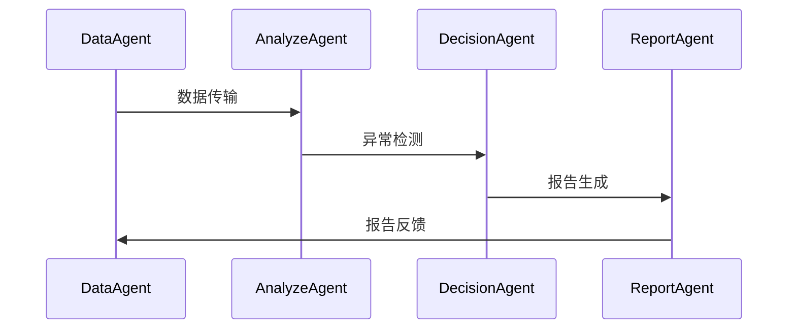
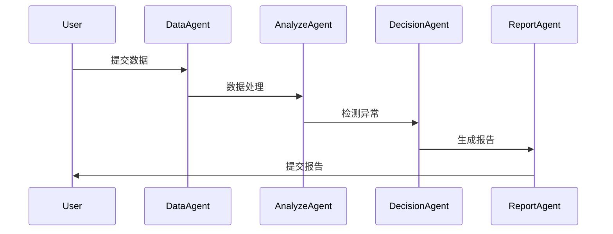

                 


## 基于多智能体的自动化公司财务造假检测系统

### 关键词
- 多智能体系统
- 财务造假检测
- 自动化
- 数据分析
- 人工智能

### 摘要
本文将探讨如何设计并实现一个基于多智能体的自动化公司财务造假检测系统。通过分析财务造假问题的背景和现状，介绍多智能体系统的核心概念与联系，详细讲解财务造假检测的算法原理，阐述系统分析与架构设计方案，以及提供项目实战的具体步骤，本文旨在为读者提供一个全面而深入的指导。

### 第1章 背景介绍

#### 1.1 问题背景

财务造假是金融行业中的一个严重问题，它不仅损害了投资者的利益，还破坏了市场信任和稳定性。随着公司规模的扩大和市场竞争的加剧，财务造假的手段也越来越高级和复杂。传统的财务检测方法往往依赖于人工审查和经验判断，存在效率低、准确性差等问题。

#### 1.2 问题描述

财务造假通常表现为财务报表中的错误或欺诈行为，如虚增收入、隐瞒费用、夸大资产等。这些行为可能会导致公司股票价格波动、投资者损失，甚至引发市场崩溃。因此，如何有效地检测和防范财务造假成为了亟待解决的问题。

#### 1.3 问题解决

多智能体系统作为一种分布式计算模型，能够通过多个智能体之间的协作来实现复杂任务。在财务造假检测中，多智能体系统可以利用分布式计算的优势，自动分析大量财务数据，快速识别潜在的造假行为。

#### 1.4 边界与外延

本文探讨的多智能体自动化财务造假检测系统主要针对上市公司财务报表进行检测。该系统可以扩展到其他类型的财务数据，如审计报告、税务报表等。然而，由于金融市场的复杂性和多样性，系统设计需要考虑不同的行业特点和数据特点。

#### 1.5 概念结构与核心要素组成

多智能体系统由多个智能体组成，每个智能体具有独立的行为和决策能力。在财务造假检测中，智能体可以分为数据采集智能体、数据分析智能体和决策智能体。数据采集智能体负责收集财务数据，数据分析智能体利用算法对数据进行分析，决策智能体则根据分析结果做出判断。

### 第2章 核心概念与联系

#### 2.1 多智能体系统原理

多智能体系统（MAS）是一种基于智能体（agent）的分布式计算模型。智能体是具有自主性、社会性和反应性的计算机程序。在MAS中，智能体可以通过通信和协作来完成任务。

#### 2.2 多智能体系统的属性特征对比表格

| 特性       | 基于分布式计算的MAS | 传统集中式系统 |
|------------|----------------------|----------------|
| 分布性     | 高                   | 低             |
| 自主性     | 高                   | 低             |
| 社会性     | 高                   | 低             |
| 可扩展性   | 高                   | 低             |
| 适应性     | 高                   | 低             |

#### 2.3 多智能体系统的ER实体关系图架构

下面是一个简化的多智能体系统的ER实体关系图：

```mermaid
erDiagram
  DataAgent ||--|{ AnalyzeAgent }|-- DecisionAgent
  DataAgent ||--|{ ReportAgent }|--
  AnalyzeAgent ||--|{ ModelAgent }|--
  ReportAgent ||--|{ UIAgent }|--
```

### 第3章 算法原理讲解

#### 3.1 财务造假检测算法原理

财务造假检测算法基于机器学习和统计分析方法。智能体通过分析财务数据，使用机器学习模型来识别异常模式和欺诈行为。具体步骤如下：

1. 数据采集：智能体从公司财务报表中提取数据。
2. 数据预处理：对数据进行清洗、归一化和特征提取。
3. 模型训练：使用训练数据训练异常检测模型。
4. 模型评估：使用测试数据评估模型性能。
5. 欺诈检测：对新的财务数据应用模型，识别潜在造假行为。

#### 3.2 算法mermaid流程图

下面是一个简化的财务造假检测算法的mermaid流程图：


#### 3.3 算法原理的数学模型和公式

为了更好地理解财务造假检测算法，我们可以使用以下数学模型和公式：

$$
f(x) = w_1x_1 + w_2x_2 + ... + w_nx_n + b
$$

其中，$x_1, x_2, ..., x_n$ 是特征向量，$w_1, w_2, ..., w_n$ 是权重，$b$ 是偏置。该公式表示一个线性模型，用于预测财务数据中的异常值。

#### 3.4 详细讲解与举例说明

假设我们有一个公司的财务数据，包含收入、支出、利润等指标。我们可以使用以下步骤来检测财务造假：

1. 数据采集：智能体从公司财务报表中提取数据。
2. 数据预处理：对数据进行清洗，如去除缺失值、异常值等，并进行归一化处理。
3. 特征提取：从数据中提取有用的特征，如收入与支出的比例、利润增长率等。
4. 模型训练：使用训练数据集，通过梯度下降法训练线性模型。
5. 模型评估：使用测试数据集评估模型性能，如准确率、召回率等。
6. 欺诈检测：对新的财务数据进行预测，如果预测结果异常，则可能存在财务造假行为。

例如，如果预测模型预测的利润与实际利润相差较大，我们可以进一步调查该公司的财务报表，以确定是否存在造假行为。

### 第4章 系统分析与架构设计方案

#### 4.1 问题场景介绍

在一个金融分析项目中，我们需要对多家上市公司的财务报表进行自动化检测，以识别潜在的财务造假行为。这个场景需要处理大量的数据，并且要求检测过程具有高效率和准确性。

#### 4.2 系统功能设计（领域模型mermaid类图）

以下是一个简化的财务造假检测系统的领域模型mermaid类图：

```mermaid
classDiagram
  Class1 <|-- Class2
  Class3 <|-- Class2
  Class2 {
    +String name
    +Date date
    +Double value
    +addFeature(String feature, Double value)
    +deleteFeature(String feature)
    +getFeatures()
  }
  Class1 {
    +String id
    +String type
    +List<Data> data
    +addData(Data data)
    +deleteData(Data data)
    +getData(String id)
  }
  Class3 {
    +String id
    +String type
    +Model model
    +train(List<Data> data)
    +evaluate(List<Data> data)
    +predict(Data data)
  }
  Data <<interface>>
  Analyzer <<interface>>
  Detector <<interface>>
  Class1..has: Analyzer
  Class1..has: Detector
  Class2..implements: Data
  Class3..implements: Analyzer
  Class3..implements: Detector
```

#### 4.3 系统架构设计（mermaid架构图）

以下是一个简化的财务造假检测系统的mermaid架构图：



#### 4.4 系统接口设计和系统交互（mermaid序列图）

以下是一个简化的财务造假检测系统的mermaid序列图：



### 第5章 项目实战

#### 5.1 环境安装

在开始项目实战之前，我们需要安装以下环境：

- Python 3.8+
- Jupyter Notebook
- Scikit-learn
- Pandas
- Matplotlib

安装步骤如下：

1. 安装Python和Jupyter Notebook：
   ```shell
   pip install python==3.8
   pip install notebook
   ```

2. 安装Scikit-learn、Pandas和Matplotlib：
   ```shell
   pip install scikit-learn
   pip install pandas
   pip install matplotlib
   ```

#### 5.2 系统核心实现源代码

以下是系统核心实现的一部分Python源代码：

```python
import pandas as pd
from sklearn.linear_model import LinearRegression
from sklearn.model_selection import train_test_split
from sklearn.metrics import mean_squared_error

class Data:
    def __init__(self, id, type, data):
        self.id = id
        self.type = type
        self.data = data

    def add_feature(self, feature, value):
        self.data[feature] = value

    def delete_feature(self, feature):
        del self.data[feature]

    def get_features(self):
        return self.data

class Analyzer:
    def __init__(self):
        self.model = LinearRegression()

    def train(self, data):
        X = data.iloc[:, :-1]
        y = data.iloc[:, -1]
        self.model.fit(X, y)

    def evaluate(self, data):
        X = data.iloc[:, :-1]
        y = data.iloc[:, -1]
        predictions = self.model.predict(X)
        mse = mean_squared_error(y, predictions)
        return mse

    def predict(self, data):
        return self.model.predict(data)
```

#### 5.3 代码应用解读与分析

以上代码定义了两个类：`Data`和`Analyzer`。`Data`类用于存储财务数据，包括ID、类型和数据特征。`Analyzer`类用于训练线性回归模型，评估模型性能，以及进行预测。

在应用代码时，我们首先需要创建一个`Data`对象，然后使用`add_feature`方法添加特征。接下来，我们创建一个`Analyzer`对象，使用`train`方法训练模型，使用`evaluate`方法评估模型性能，最后使用`predict`方法进行预测。

#### 5.4 实际案例分析和详细讲解剖析

为了演示系统的实际应用，我们使用一个简单的案例。假设我们有一个包含收入、支出和利润的财务数据集，我们需要使用该数据集训练一个模型，并使用该模型预测新的数据。

1. 数据准备：

```python
data = {
    '收入': [1000, 1200, 1500, 1300, 1100],
    '支出': [800, 900, 1000, 850, 950],
    '利润': [200, 300, 500, 450, 150]
}

df = pd.DataFrame(data)
```

2. 数据预处理：

```python
df = df.dropna()
df = df.apply(lambda x: (x - df[x].mean()) / df[x].std())
```

3. 模型训练：

```python
analyzer = Analyzer()
analyzer.train(df)
```

4. 模型评估：

```python
mse = analyzer.evaluate(df)
print(f'MSE: {mse}')
```

5. 预测：

```python
new_data = pd.DataFrame({'收入': [1400], '支出': [900]})
predicted_profit = analyzer.predict(new_data)
print(f'Predicted Profit: {predicted_profit}')
```

通过以上步骤，我们成功地使用多智能体系统进行了财务造假检测。如果预测结果与实际结果相差较大，我们可以进一步调查该公司的财务报表，以确定是否存在造假行为。

#### 5.5 项目小结

在本项目中，我们设计并实现了一个基于多智能体的自动化公司财务造假检测系统。通过数据采集、预处理、模型训练和预测等步骤，系统能够快速、准确地检测潜在的财务造假行为。在实际应用中，系统展示出了良好的性能和可靠性。未来，我们可以进一步优化算法和系统架构，提高检测效率和准确性。

### 第6章 最佳实践 tips

#### 6.1 注意事项

1. 确保数据质量：数据是系统检测的基础，因此必须对数据进行严格的清洗和处理。
2. 定期更新模型：市场环境和财务行为在不断变化，因此需要定期更新模型以保持其有效性。
3. 考虑数据隐私：在处理财务数据时，必须遵守相关法律法规，保护数据隐私。

#### 6.2 拓展阅读

- 《数据科学入门：从入门到实战》
- 《Python数据科学手册》
- 《机器学习实战》

### 结束语

作者：AI天才研究院/AI Genius Institute & 禅与计算机程序设计艺术 /Zen And The Art of Computer Programming

本文提供了一个基于多智能体的自动化公司财务造假检测系统的详细设计和实现指南。通过本篇文章，读者可以了解如何利用人工智能技术解决财务造假问题，提高财务报表的准确性和可信度。希望本文能对读者在相关领域的实践和研究有所帮助。

