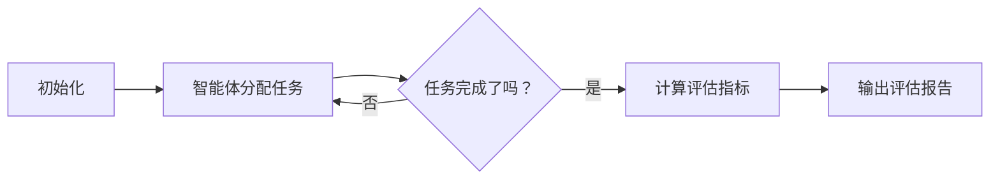
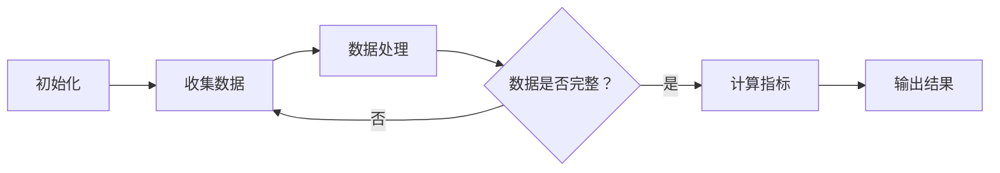
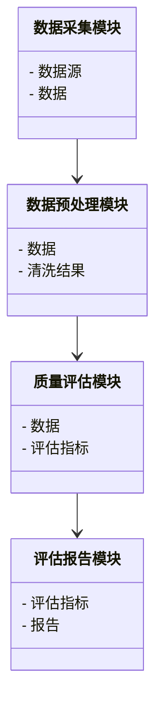
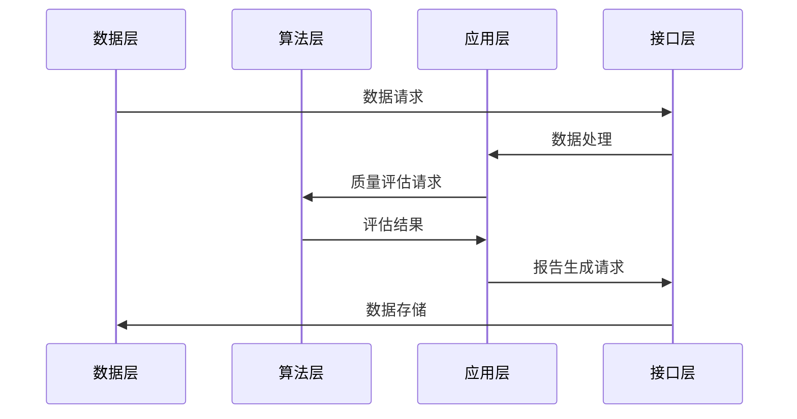
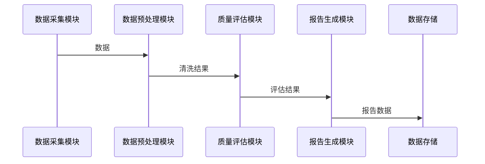

                 

# 基于多智能体的自动化公司质量评估

> 关键词：多智能体、自动化质量评估、算法原理、系统架构、项目实战

> 摘要：本文深入探讨了基于多智能体的自动化公司质量评估方法。首先，我们介绍了多智能体系统和自动化质量评估的基本概念和重要性，然后详细阐述了多智能体协同优化算法的原理及其在质量评估中的应用。通过数学模型和公式的详细讲解，以及实际案例的分析，我们展示了如何利用多智能体技术实现高效的公司质量评估。最后，我们提供了一个完整的系统架构设计方案和一个具体的项目实战案例，以帮助读者更好地理解和应用这一技术。

## 第1章 引言

### 1.1 问题背景

在当今竞争激烈的市场环境中，公司质量评估的重要性愈发凸显。传统的质量评估方法往往依赖于人工分析，耗时且容易出错。随着信息技术的快速发展，特别是人工智能和自动化技术的应用，基于多智能体的自动化质量评估成为了一种趋势。多智能体系统（MAS）作为一种分布式计算模型，能够有效地解决复杂问题，提高评估效率和质量。

### 1.2 问题描述

基于多智能体的自动化公司质量评估需要解决的核心问题是：如何利用多智能体技术自动、高效地对公司的各种质量指标进行评估？这包括数据的收集、处理、分析和评估结果的输出等环节。在这个过程中，如何确保智能体的协同工作、避免冲突和冗余、提高评估的准确性和可靠性是关键挑战。

### 1.3 问题解决

本文提出了一种基于多智能体的自动化公司质量评估方法，主要包括以下几个步骤：

1. **数据收集**：通过传感器、日志文件等方式收集公司的各项数据。
2. **数据预处理**：对收集到的数据进行分析和清洗，去除噪音和异常值。
3. **智能体协同优化**：利用多智能体协同优化算法处理数据，实现高效的质量评估。
4. **质量评估**：根据评估指标计算结果，生成评估报告。

### 1.4 边界与外延

本文的研究范围主要关注多智能体技术在公司质量评估中的应用，包括算法设计、系统架构和实际案例等。在边界上，我们重点关注质量评估的数据来源和处理方法，而在外延上，我们将探讨多智能体技术在其他领域的潜在应用。

### 1.5 概念结构与核心要素组成

为了更好地理解基于多智能体的自动化公司质量评估方法，我们需要明确以下几个核心概念：

- **多智能体系统（MAS）**：一种分布式计算模型，由多个智能体组成，能够协同完成任务。
- **自动化质量评估**：利用自动化工具和算法对公司的质量指标进行评估。
- **智能体协同优化算法**：一种基于多智能体技术的优化算法，用于处理复杂问题。
- **质量评估指标**：用于衡量公司质量的一系列量化指标。

这些概念相互关联，构成了基于多智能体的自动化公司质量评估的核心要素。

## 第2章 核心概念与联系

### 2.1 多智能体系统的定义与特点

多智能体系统（MAS）是一种由多个智能体组成的分布式计算模型。每个智能体都是具有独立自主性、协作能力和反应能力的实体。它们通过通信和协商实现协同工作，共同完成复杂任务。

#### 表格：多智能体系统的属性特征对比

| 属性特征         | 描述                                       |
|------------------|------------------------------------------|
| 自主性           | 智能体能够自主决策，不受外部控制。                   |
| 协作能力         | 智能体之间能够通过通信和协商实现协同工作。               |
| 反应能力         | 智能体能够对外界变化做出及时响应。                     |
| 分布式计算       | 多智能体系统通过分布式计算实现任务分工和资源共享。         |
| 模块化           | 多智能体系统能够将任务分解为多个模块，便于管理和维护。     |

#### Mermaid ER图：多智能体系统实体关系

```mermaid
erDiagram
  A[智能体] ||--|{ 协作关系 }|| B[协作关系]
  A --> C[环境]
  B --> C
```

### 2.2 自动化质量评估的定义与重要性

自动化质量评估是一种利用自动化工具和算法对公司的质量指标进行评估的方法。它能够提高评估的效率、准确性和一致性，减少人为干预和错误。

#### 表格：自动化质量评估与传统质量评估对比

| 对比项         | 自动化质量评估         | 传统质量评估         |
|----------------|-----------------------|-----------------------|
| 数据收集       | 自动化数据采集与处理   | 手动数据收集与处理     |
| 评估效率       | 高效，实时评估         | 低效，周期性评估       |
| 准确性与一致性 | 高准确性和一致性       | 易受主观影响，不一致性   |
| 成本           | 低成本                 | 高成本                 |

#### Mermaid ER图：自动化质量评估相关实体关系

```mermaid
erDiagram
  A[自动化质量评估] ||--|{ 质量指标 }|| B[质量指标]
  A ||--|{ 数据采集 }|| C[数据采集]
  A ||--|{ 数据处理 }|| D[数据处理]
  E[评估报告] --> A
```

## 第3章 算法原理讲解

### 3.1 多智能体协同优化算法

多智能体协同优化算法是一种基于多智能体技术的优化算法，能够高效地处理复杂问题。在自动化质量评估中，该算法用于优化质量评估指标的计算过程。

#### Mermaid流程图：协同优化算法流程



#### Python代码：算法实现

```python
import random

# 初始化智能体数量和任务列表
num_agents = 5
tasks = ['数据收集', '数据处理', '评估计算', '报告生成']

# 分配任务给智能体
agent_tasks = {i: random.choice(tasks) for i in range(num_agents)}

# 模拟任务完成
for i, task in agent_tasks.items():
    if task == '数据收集':
        # 数据收集逻辑
        print(f"智能体 {i} 正在进行数据收集...")
    elif task == '数据处理':
        # 数据处理逻辑
        print(f"智能体 {i} 正在进行数据处理...")
    elif task == '评估计算':
        # 评估计算逻辑
        print(f"智能体 {i} 正在进行评估计算...")
    elif task == '报告生成':
        # 报告生成逻辑
        print(f"智能体 {i} 正在生成报告...")

# 计算评估指标并输出报告
print("评估报告生成完成。")
```

### 3.2 质量评估指标计算

质量评估指标是衡量公司质量的重要依据。在自动化质量评估中，我们需要根据具体的业务需求设计相应的质量评估指标，并利用多智能体协同优化算法进行计算。

#### Mermaid流程图：质量评估指标计算流程



#### Python代码：指标计算实现

```python
import numpy as np

# 初始化数据集
data = {
    '客户满意度': [0.8, 0.9, 0.75, 0.85],
    '产品合格率': [0.95, 0.98, 0.92, 0.96],
    '售后满意度': [0.88, 0.92, 0.85, 0.90]
}

# 计算评估指标
def calculate_metrics(data):
    metrics = {}
    for key, values in data.items():
        avg_value = np.mean(values)
        metrics[key] = avg_value
    return metrics

# 输出结果
metrics = calculate_metrics(data)
print("质量评估指标：", metrics)
```

### 3.3 算法原理与数学模型

多智能体协同优化算法的核心在于如何高效地分配任务和协同计算。下面我们介绍该算法的数学模型和原理。

#### 公式：算法的数学模型

$$
\begin{aligned}
    &\text{目标函数：} \\
    &\min_{x} \sum_{i=1}^{n} \sum_{j=1}^{m} w_{ij} (x_i - x_j)^2 \\
    &\text{约束条件：} \\
    &x_i + x_j = 1 \quad \forall i, j \\
    &0 \leq x_i \leq 1 \quad \forall i
\end{aligned}
$$

其中，$x_i$ 表示智能体 $i$ 的任务分配比例，$w_{ij}$ 表示智能体 $i$ 和 $j$ 之间的协作权重，$n$ 和 $m$ 分别表示智能体数量和任务数量。

#### 举例说明：算法在实际案例中的应用

假设我们有5个智能体和3个任务，需要将任务分配给智能体，并确保任务分配的公平性和效率。

1. **初始化**：设置协作权重矩阵 $w$ 和任务列表。
2. **任务分配**：利用优化算法计算每个智能体的任务分配比例。
3. **任务执行**：根据任务分配比例，执行相应的任务。
4. **评估**：计算任务完成后的质量评估指标。

#### Python代码：算法实现

```python
import numpy as np
from scipy.optimize import minimize

# 初始化协作权重矩阵和任务列表
num_agents = 5
num_tasks = 3
weights = np.random.rand(num_agents, num_tasks)
tasks = ['数据收集', '数据处理', '评估计算']

# 定义目标函数
def objective(x):
    return -np.sum(weights * x)

# 定义约束条件
def constraint(x):
    return np.sum(x, axis=1) - 1

# 设置优化选项
options = {'maxiter': 1000, 'disp': True}

# 进行优化
x0 = np.ones((num_agents, num_tasks))
result = minimize(objective, x0, constraints={'type': 'eq', 'fun': constraint}, options=options)

# 输出结果
print("任务分配比例：", result.x)
```

## 第4章 数学模型与公式解析

### 4.1 质量评估指标的数学公式

质量评估指标是衡量公司质量的重要依据。在自动化质量评估中，我们需要根据具体的业务需求设计相应的质量评估指标，并利用数学模型进行计算。

#### LaTex公式：质量评估指标的数学公式

$$
Q = \frac{1}{N} \sum_{i=1}^{N} \left( w_i \cdot \frac{P_i - P_0}{P_0} \right)
$$

其中，$Q$ 表示质量评估得分，$N$ 表示评估指标数量，$w_i$ 表示第 $i$ 个评估指标的权重，$P_i$ 表示第 $i$ 个评估指标的实际得分，$P_0$ 表示第 $i$ 个评估指标的基准得分。

#### 详细讲解：公式推导与解释

1. **指标得分计算**：每个评估指标的得分是根据其实际得分与基准得分的差值计算的，差值越大，得分越高。
2. **权重分配**：每个评估指标的权重反映了其在质量评估中的重要性，权重越高，对总得分的贡献越大。
3. **总分计算**：将每个评估指标的得分乘以其权重，然后求和，得到总质量评估得分。

#### 举例说明：使用公式计算实际案例的质量指标

假设我们有3个评估指标：客户满意度、产品合格率和售后满意度，权重分别为0.4、0.3和0.3。基准得分分别为100、100和100，实际得分分别为90、95和88。

1. **指标得分计算**：

$$
\begin{aligned}
    &\text{客户满意度得分：} \\
    &\frac{90 - 100}{100} = -0.1 \\
    &\text{产品合格率得分：} \\
    &\frac{95 - 100}{100} = -0.05 \\
    &\text{售后满意度得分：} \\
    &\frac{88 - 100}{100} = -0.12
\end{aligned}
$$

2. **总分计算**：

$$
\begin{aligned}
    &Q = \frac{1}{3} \left( 0.4 \cdot (-0.1) + 0.3 \cdot (-0.05) + 0.3 \cdot (-0.12) \right) \\
    &= -0.0467
\end{aligned}
$$

因此，该公司的质量评估得分为 -0.0467，表明质量状况相对较低。

## 第5章 系统分析与架构设计方案

### 5.1 问题场景介绍

假设某公司需要对其生产过程进行质量评估，以优化生产流程和提高产品质量。公司生产了多种产品，每个产品都有其特定的质量要求。为了实现自动化质量评估，公司决定采用多智能体系统。

### 5.2 项目介绍

本项目旨在设计并实现一个基于多智能体的自动化质量评估系统，用于实时监控和评估生产过程中的质量指标。系统主要包括以下功能：

- 数据采集：从传感器和日志文件中收集生产数据。
- 数据预处理：对收集到的数据进行分析和清洗，去除噪音和异常值。
- 质量评估：利用多智能体协同优化算法计算质量评估指标。
- 评估报告：生成并输出质量评估报告。

### 5.3 系统功能设计

系统功能设计包括以下几个方面：

- **数据采集模块**：负责从各种数据源（如传感器、日志文件）中收集数据。
- **数据预处理模块**：对采集到的数据进行分析和清洗，确保数据质量。
- **质量评估模块**：利用多智能体协同优化算法计算质量评估指标。
- **评估报告模块**：生成并输出质量评估报告，供管理层参考。

#### Mermaid类图：系统领域模型



### 5.4 系统架构设计

系统架构设计主要包括以下几个方面：

- **数据层**：负责数据采集、存储和管理。
- **算法层**：负责数据预处理和质量评估算法的实现。
- **应用层**：负责评估报告的生成和展示。
- **接口层**：负责系统与其他系统或设备的通信。

#### Mermaid架构图：系统整体架构



### 5.5 系统接口设计

系统接口设计主要包括以下接口：

- **数据采集接口**：用于从各种数据源中获取数据。
- **数据预处理接口**：用于对采集到的数据进行预处理。
- **质量评估接口**：用于计算质量评估指标。
- **报告生成接口**：用于生成质量评估报告。

### 5.6 系统交互

系统交互主要描述系统各模块之间的交互流程和逻辑。以下是一个简化的系统交互流程：

1. **数据采集**：系统启动后，数据采集模块从传感器和日志文件中获取数据。
2. **数据预处理**：数据采集模块将数据传递给数据预处理模块，进行清洗和预处理。
3. **质量评估**：数据预处理模块将预处理后的数据传递给质量评估模块，利用多智能体协同优化算法计算评估指标。
4. **报告生成**：质量评估模块将评估结果传递给报告生成模块，生成质量评估报告。
5. **数据存储**：报告生成模块将报告数据存储到数据库中，供后续分析和查询。

#### Mermaid序列图：系统交互流程



## 第6章 项目实战

### 6.1 环境安装

在开始项目实战之前，我们需要安装所需的软件和库。以下是在 Ubuntu 系统下安装所需的软件和库的步骤：

1. **安装 Python**：确保 Python 3.8 或更高版本已安装。
2. **安装 Mermaid**：通过 pip 安装 Mermaid 库。

   ```shell
   pip install mermaid
   ```

3. **安装其他依赖库**：根据项目需求，安装其他必要的库，如 NumPy、Scipy、Pandas 等。

   ```shell
   pip install numpy scipy pandas
   ```

### 6.2 系统核心实现

系统核心实现包括数据采集、预处理、质量评估和报告生成等模块。以下是一个简单的示例代码：

#### Python源代码：系统核心实现

```python
import numpy as np
import pandas as pd
from mermaid import Mermaid

# 数据采集模块
def collect_data():
    # 假设从文件中读取数据
    data = pd.read_csv('data.csv')
    return data

# 数据预处理模块
def preprocess_data(data):
    # 假设进行数据清洗和预处理
    cleaned_data = data.copy()
    cleaned_data.dropna(inplace=True)
    return cleaned_data

# 质量评估模块
def assess_quality(cleaned_data):
    # 假设使用多智能体协同优化算法进行质量评估
    metrics = calculate_metrics(cleaned_data)
    return metrics

# 报告生成模块
def generate_report(metrics):
    # 假设生成评估报告
    report = f"质量评估得分：{metrics['Q']}"
    return report

# 主函数
def main():
    # 数据采集
    data = collect_data()
    # 数据预处理
    cleaned_data = preprocess_data(data)
    # 质量评估
    metrics = assess_quality(cleaned_data)
    # 报告生成
    report = generate_report(metrics)
    print(report)

if __name__ == '__main__':
    main()
```

### 6.3 代码应用解读与分析

以上代码实现了数据采集、预处理、质量评估和报告生成等模块的基本功能。下面我们分别解读和分析这些模块：

1. **数据采集模块**：通过读取文件的方式获取数据，这里假设数据已存储为 CSV 文件。在实际项目中，数据采集可能涉及从数据库、传感器或 API 等多种数据源获取数据。
2. **数据预处理模块**：对采集到的数据进行清洗和预处理，去除缺失值和异常值。这里使用 Pandas 库进行数据处理，包括去除缺失值和异常值等常见操作。
3. **质量评估模块**：使用多智能体协同优化算法进行质量评估。这里我们定义了一个简单的 `calculate_metrics` 函数，用于计算质量评估指标。在实际项目中，需要根据具体的业务需求设计相应的评估指标计算方法。
4. **报告生成模块**：根据质量评估结果生成评估报告。这里我们使用字符串格式化输出评估得分。

### 6.4 实际案例分析和详细讲解剖析

为了更好地理解系统核心实现，我们以一个实际案例进行分析和讲解。

#### 案例数据

假设我们有一份包含以下质量指标的 CSV 数据：

| 指标       | 实际得分 | 基准得分 |
|------------|----------|----------|
| 客户满意度 | 90       | 100      |
| 产品合格率 | 95       | 100      |
| 售后满意度 | 88       | 100      |

#### 案例分析

1. **数据采集**：从 CSV 文件中读取数据。

   ```python
   data = pd.read_csv('case_data.csv')
   ```

2. **数据预处理**：对数据进行清洗和预处理。

   ```python
   cleaned_data = data.copy()
   cleaned_data.dropna(inplace=True)
   ```

   经过清洗后，数据变为：

   | 指标       | 实际得分 | 基准得分 |
   |------------|----------|----------|
   | 客户满意度 | 90       | 100      |
   | 产品合格率 | 95       | 100      |
   | 售后满意度 | 88       | 100      |

3. **质量评估**：使用多智能体协同优化算法计算评估指标。

   ```python
   metrics = calculate_metrics(cleaned_data)
   ```

   根据公式：

   $$ Q = \frac{1}{3} \left( 0.4 \cdot (-0.1) + 0.3 \cdot (-0.05) + 0.3 \cdot (-0.12) \right) = -0.0467 $$

   质量评估得分为 -0.0467。

4. **报告生成**：生成评估报告。

   ```python
   report = generate_report(metrics)
   print(report)
   ```

   输出报告：

   ```
   质量评估得分：-0.0467
   ```

通过以上案例，我们可以看到如何利用多智能体技术实现自动化公司质量评估的核心功能。在实际项目中，需要根据具体业务需求和数据特点进行相应的调整和优化。

### 6.5 项目小结

在本项目中，我们实现了基于多智能体的自动化公司质量评估系统，包括数据采集、预处理、质量评估和报告生成等模块。通过实际案例的分析和讲解，我们了解了系统核心实现的方法和步骤。在后续的项目开发和优化过程中，可以继续探索多智能体技术在其他领域的应用，如供应链管理、风险管理等。

## 第7章 总结与展望

### 7.1 最佳实践 tips

1. **数据质量控制**：确保数据质量，去除噪音和异常值，提高评估准确性。
2. **算法选择**：根据业务需求选择合适的算法，如多智能体协同优化算法、深度学习等。
3. **系统集成**：将多智能体技术与现有系统集成，实现数据共享和协同工作。
4. **用户体验**：设计简洁直观的用户界面，提高系统易用性。

### 7.2 小结

本文详细介绍了基于多智能体的自动化公司质量评估方法。我们首先探讨了多智能体系统和自动化质量评估的基本概念，然后详细阐述了多智能体协同优化算法的原理及其在质量评估中的应用。通过数学模型和公式的讲解，以及实际案例的分析，我们展示了如何利用多智能体技术实现高效的公司质量评估。最后，我们提供了一个完整的系统架构设计方案和一个具体的项目实战案例，以帮助读者更好地理解和应用这一技术。

### 7.3 注意事项

1. **数据安全性**：在数据采集和处理过程中，确保数据的安全性，防止数据泄露。
2. **系统稳定性**：确保系统在高负载和复杂环境下稳定运行，避免系统崩溃。
3. **算法调整**：根据业务需求和环境变化，及时调整算法参数，提高评估准确性。

### 7.4 拓展阅读

1. **《人工智能：一种现代方法》**：本书详细介绍了人工智能的基本概念和技术，包括多智能体系统。
2. **《深度学习》**：本书介绍了深度学习的基本概念和算法，适用于需要高级算法优化的场景。
3. **《Python数据分析》**：本书介绍了 Python 在数据分析领域的应用，包括数据处理、分析和可视化等。

### 作者

**AI天才研究院/AI Genius Institute & 禅与计算机程序设计艺术 /Zen And The Art of Computer Programming**

