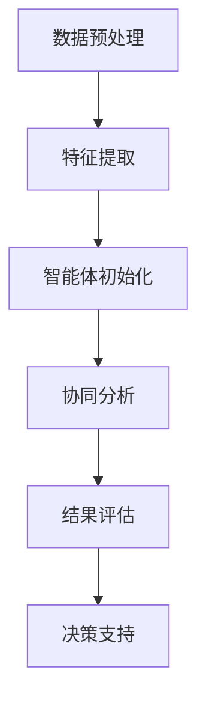
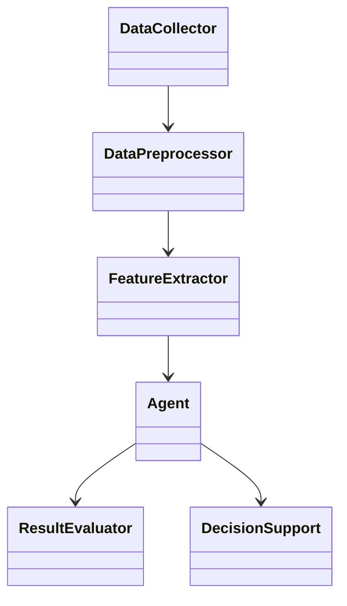
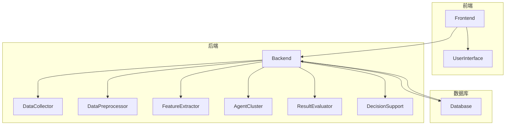
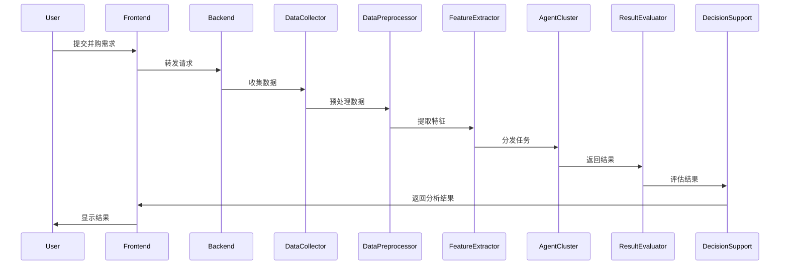
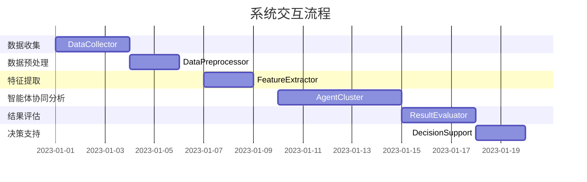

                 

### 封面和前言

《基于多智能体的自动化并购机会分析》旨在深入探讨如何利用多智能体系统来自动化分析并购机会。这不仅是一个充满挑战的课题，也是现代商业环境中极具潜力的研究领域。

**关键词**：多智能体系统、自动化并购机会分析、人工智能、算法、系统架构

**摘要**：
本文首先介绍了多智能体系统的基本概念，探讨了其在自动化并购机会分析中的应用前景。随后，文章详细讲解了自动化并购机会分析算法的原理，并通过具体的数学模型和Python代码展示了算法的实现过程。接着，文章从系统设计与实现的角度，详细描述了并购机会分析系统的架构，并提供了实际项目的案例分析。最后，文章总结了最佳实践，并给出了进一步的研究方向。

### 引言

随着信息技术的飞速发展，人工智能在各个领域都展现出了其强大的潜力和广泛的应用。在商业领域，自动化并购机会分析已经成为企业战略规划中的重要一环。然而，传统的并购机会分析依赖于大量的人工干预，效率低下且容易出错。因此，如何利用人工智能技术，特别是多智能体系统，来实现自动化并购机会分析，成为了一个备受关注的研究课题。

**1.1 背景介绍**

并购机会分析是指通过对目标公司的财务状况、市场地位、竞争优势等方面的综合评估，来确定是否具有并购的潜力。传统的并购机会分析通常依赖于分析师的经验和直觉，这不仅耗时耗力，而且容易受到主观因素的影响。随着大数据和人工智能技术的应用，自动化并购机会分析逐渐成为可能。

**1.1.1 问题背景**

随着商业环境的不断变化，企业需要快速做出战略决策。传统的并购机会分析方式已经无法满足现代商业的需求。自动化并购机会分析能够提高分析效率，降低成本，减少人为错误，从而为企业提供更准确、更及时的并购决策支持。

**1.1.2 问题描述**

自动化并购机会分析的目标是利用人工智能技术，对大量的市场数据和企业信息进行自动分析，识别潜在的并购机会。这个过程需要解决以下问题：

- 如何获取和处理大量的数据？
- 如何利用机器学习算法进行数据挖掘和模式识别？
- 如何设计一个高效的系统架构，以支持自动化并购机会分析？
- 如何评估并购机会的潜在风险和收益？

**1.1.3 问题解决**

针对上述问题，本文提出了一种基于多智能体的自动化并购机会分析系统。多智能体系统能够通过分布式计算和协同工作，提高数据分析的效率和准确性。同时，本文使用机器学习算法来处理和分析数据，结合系统架构设计，实现了自动化并购机会分析。

**1.1.4 边界与外延**

本文研究的自动化并购机会分析系统主要关注以下边界与外延：

- 数据来源：系统将主要依赖于公开的市场数据和企业信息。
- 分析范围：系统将分析企业的财务状况、市场地位、竞争优势等方面的数据。
- 应用场景：系统主要应用于企业并购决策过程中，为企业提供决策支持。

**1.2 研究意义与应用前景**

自动化并购机会分析系统的研究具有重要的理论和实践意义。在理论上，本文为多智能体系统和机器学习算法在商业领域的应用提供了新的思路。在实践上，本文提出的系统可以为企业提供高效的并购决策支持，提高企业的竞争力。

**1.3 本书结构安排**

本书分为七个章节，具体安排如下：

- 第1章：封面和前言，介绍书的基本信息和作者，提供读者对全书主题和结构的初步认识。
- 第2章：问题背景与概述，包括多智能体系统的基本概念、并购机会分析的重要性以及基于多智能体的自动化并购机会分析。
- 第3章：多智能体系统的基本概念与联系，详细阐述多智能体的定义、类型、属性特征以及ER实体关系图。
- 第4章：算法原理讲解，使用Mermaid画出算法流程图，并用Python代码详细阐述算法的数学模型和公式。
- 第5章：系统分析与架构设计方案，介绍问题场景、系统功能设计、系统架构设计、系统接口设计和系统交互。
- 第6章：项目实战，包括环境安装、系统核心实现源代码，代码应用解读与分析，实际案例分析和详细讲解剖析。
- 第7章：最佳实践 tips、小结、注意事项、拓展阅读，总结书中的关键点，提供实践建议，指出注意事项，并推荐拓展阅读。

通过以上章节的安排，本文将逐步引导读者深入理解基于多智能体的自动化并购机会分析，为企业在并购决策中提供有力的技术支持。

### 第2章 问题背景与概述

#### 2.1 多智能体系统概述

**2.1.1 多智能体系统的定义**

多智能体系统（Multi-Agent Systems，MAS）是由多个智能体（Agent）组成的系统，这些智能体可以自主地执行任务，并在一定的通信和协调机制下协同工作。智能体是一种具有感知、思考、行动和适应能力的实体，可以是软件程序、机器人、甚至是人类。多智能体系统的研究旨在通过分布式计算和协作，实现复杂任务的高效完成。

**2.1.2 多智能体系统的特点**

多智能体系统的特点主要包括：

1. **自主性**：智能体具有自主决策能力，可以根据环境和自身的状态自主选择行动。
2. **社会性**：智能体可以通过通信和协调机制进行信息交换和合作，以实现共同的目标。
3. **适应性**：智能体能够根据环境的变化调整自身的行为和策略。
4. **分布性**：智能体可以在不同的地理位置和计算资源上分布，从而提高系统的整体效率和鲁棒性。

**2.1.3 多智能体系统的发展历史**

多智能体系统的研究起源于20世纪80年代，随着人工智能和分布式计算技术的不断发展，多智能体系统逐渐成为一个独立的研究领域。早期的多智能体系统研究主要集中在理论建模和算法设计上，如BDI（信念-意图-愿望）模型和协同过滤算法。随着互联网和物联网的发展，多智能体系统的应用场景也越来越广泛，从工业自动化、交通运输到智能城市和商业分析，多智能体系统在各个领域都展现出了其强大的潜力。

#### 2.2 并购机会分析的重要性

**2.2.1 并购机会分析的定义**

并购机会分析是指通过评估目标企业的财务状况、市场地位、竞争优势等因素，来判断是否具有并购的潜力和价值。并购机会分析通常包括以下几个步骤：

1. **目标公司筛选**：根据企业的战略目标和市场需求，筛选出可能具有并购价值的潜在目标公司。
2. **信息收集**：收集目标公司的财务报表、市场数据、管理层访谈等，以全面了解目标公司的运营情况和潜在风险。
3. **风险评估**：对目标公司的财务状况、市场前景、竞争环境等进行评估，判断并购的风险和潜在收益。
4. **决策建议**：根据分析结果，为企业提供是否进行并购的决策建议。

**2.2.2 并购机会分析的目标**

并购机会分析的目标主要包括：

1. **降低风险**：通过全面评估目标公司的财务状况和市场前景，降低并购决策的风险。
2. **提高收益**：通过并购实现资源的整合和优化，提高企业的市场竞争力，从而实现更高的收益。
3. **战略协同**：通过并购实现企业的战略目标，如扩大市场份额、提高品牌影响力、获取关键技术和资源等。

**2.2.3 并购机会分析的影响因素**

并购机会分析的影响因素包括：

1. **市场环境**：市场的竞争态势、行业发展趋势等都会影响并购机会的分析结果。
2. **目标公司情况**：目标公司的财务状况、市场地位、竞争优势等是并购机会分析的重要依据。
3. **企业战略**：企业的并购战略、战略目标和资源配置等都会影响并购机会的分析结果。
4. **政策法规**：相关政策法规和监管环境也会对并购机会分析产生影响。

#### 2.3 基于多智能体的自动化并购机会分析

**2.3.1 自动化并购机会分析的概念**

自动化并购机会分析是指利用人工智能技术和多智能体系统，对大量的市场数据和企业信息进行自动分析和处理，以识别潜在的并购机会。自动化并购机会分析的目标是提高分析效率和准确性，减少人为干预，从而为企业提供更准确、更及时的并购决策支持。

**2.3.2 自动化并购机会分析的优势**

自动化并购机会分析具有以下优势：

1. **高效性**：通过自动化处理大量数据，显著提高并购机会分析的效率。
2. **准确性**：利用机器学习算法和智能体协同工作，提高分析结果的准确性。
3. **灵活性**：智能体可以根据环境变化和需求调整自身行为和策略，提高系统的灵活性。
4. **分布式**：多智能体系统可以在分布式环境中运行，提高系统的整体效率和鲁棒性。

**2.3.3 自动化并购机会分析的挑战**

自动化并购机会分析也面临一些挑战：

1. **数据质量问题**：自动化分析依赖于高质量的数据，数据质量直接影响分析结果的准确性。
2. **算法复杂性**：机器学习算法和智能体协同算法的设计和优化较为复杂，需要丰富的理论知识和实践经验。
3. **系统稳定性**：自动化并购机会分析系统需要保证在多变的市场环境中保持稳定运行，这对系统的设计和实现提出了较高的要求。
4. **法规合规性**：并购活动涉及大量的法律和合规问题，自动化系统需要确保符合相关法律法规的要求。

**2.4 本章小结**

本章介绍了多智能体系统的基本概念和并购机会分析的重要性，探讨了基于多智能体的自动化并购机会分析的概念和优势。通过本章的介绍，读者可以初步了解自动化并购机会分析的理论基础和应用前景，为后续章节的学习打下基础。

### 第3章 多智能体系统的基本概念与联系

在深入探讨基于多智能体的自动化并购机会分析之前，我们需要对多智能体系统的基本概念有一个清晰的理解。本章将详细阐述多智能体的定义、类型及其属性特征，并通过ER实体关系图来展示多智能体系统的架构，帮助读者建立一个全面的理论基础。

#### 3.1 多智能体的定义与类型

**3.1.1 多智能体的定义**

多智能体系统（MAS）是由多个智能体（Agent）组成的系统，这些智能体可以独立自主地执行任务，并通过一定的通信和协调机制进行协作。智能体是一种具有感知、思考、行动和适应能力的实体，可以是软件程序、机器人或者人类。在MAS中，每个智能体都是自治的，但它们可以通过通信和合作实现共同的目标。

**3.1.2 多智能体的类型**

根据智能体的物理形态、行为方式和任务目标，智能体可以分为以下几种类型：

1. **软件智能体**：软件智能体是运行在计算机上的程序，具有高度的自主性和灵活性。例如，聊天机器人、搜索引擎等。
2. **硬件智能体**：硬件智能体是具有物理形态的实体，如机器人、无人机等。硬件智能体可以感知环境并进行物理交互。
3. **混合智能体**：混合智能体同时具有软件和硬件的特性，能够结合两者的优势。例如，智能交通系统中的车辆和交通信号灯。
4. **社会智能体**：社会智能体是指具有人类特征的社会化智能体，如社交网络中的用户。社会智能体可以通过社交互动和合作实现复杂的任务。

**3.1.3 多智能体的特征对比**

不同类型的智能体具有不同的特征，以下是一个对比表格，展示了不同类型智能体的主要特征：

| 类型         | 自主性 | 通信能力 | 感知能力 | 行动能力 | 适应性 | 社会性 |
| ------------ | ------- | -------- | -------- | -------- | ------ | ------ |
| 软件智能体   | 高     | 强       | 弱       | 强       | 高     | 弱     |
| 硬件智能体   | 中     | 中       | 强       | 强       | 中     | 中     |
| 混合智能体   | 高     | 强       | 中       | 强       | 高     | 中     |
| 社会智能体   | 中     | 强       | 中       | 中       | 中     | 高     |

#### 3.2 智能体的属性特征

**3.2.1 智能体的属性特征概述**

智能体的属性特征决定了其功能和行为。以下是一些常见的智能体属性特征：

1. **感知能力**：智能体通过传感器、网络接口等感知环境中的信息。
2. **决策能力**：智能体根据感知到的信息，通过算法或规则进行决策。
3. **行动能力**：智能体根据决策结果执行具体的操作。
4. **通信能力**：智能体通过通信协议与其他智能体交换信息。
5. **适应性**：智能体能够根据环境和任务的变化调整自身的行为和策略。
6. **社会性**：智能体可以参与社会互动，与其他智能体协作完成任务。

**3.2.2 智能体的属性特征对比表格**

以下是一个智能体属性特征的对比表格，列出了不同类型智能体的主要属性特征：

| 属性         | 软件智能体 | 硬件智能体 | 混合智能体 | 社会智能体 |
| ------------ | ---------- | ---------- | ---------- | ---------- |
| 感知能力     | 低         | 高         | 中         | 中         |
| 决策能力     | 强         | 中         | 高         | 中         |
| 行动能力     | 强         | 高         | 高         | 中         |
| 通信能力     | 强         | 中         | 强         | 强         |
| 适应性       | 高         | 中         | 高         | 中         |
| 社会性       | 弱         | 中         | 中         | 高         |

#### 3.3 多智能体系统的ER实体关系图

为了更好地理解多智能体系统的架构，我们可以通过ER（实体-关系）图来展示系统中的实体及其关系。以下是一个简化的多智能体系统的ER实体关系图：

```mermaid
erDiagram
  Customer ||--|{ Order }|--|+ { Product }
  Customer ||--|{ Cart }|
  Product ||--|{ Review }|
  Order ||--|{ Payment }|
```

在这个ER图中：

- **Customer（客户）**：代表参与多智能体系统的用户。
- **Order（订单）**：代表客户提交的订单。
- **Product（产品）**：代表订单中的商品。
- **Cart（购物车）**：代表客户的购物车。
- **Review（评论）**：代表客户对产品的评论。
- **Payment（支付）**：代表订单的支付信息。

通过这个ER图，我们可以清晰地看到系统中各实体的关系和交互，为后续的系统设计与实现提供了基础。

#### 3.4 多智能体系统的基础理论

**3.4.1 多智能体系统的基本模型**

多智能体系统的基本模型包括以下几个关键组成部分：

1. **智能体**：智能体是系统的基本单元，具有感知、思考、行动和适应能力。
2. **环境**：环境是智能体执行任务的背景，包括物理环境、社会环境等。
3. **通信机制**：智能体之间通过通信机制进行信息交换和协作。
4. **协调机制**：协调机制用于解决智能体之间的冲突和协调任务分配。

**3.4.2 多智能体系统的协同机制**

多智能体系统的协同机制包括以下几种：

1. **任务分配**：通过算法或规则将任务分配给不同的智能体，实现任务的高效执行。
2. **信息共享**：智能体通过通信机制共享信息，以提高决策的准确性和协同效果。
3. **冲突解决**：在多智能体系统中，智能体之间可能会出现冲突，通过冲突解决机制可以确保系统的稳定运行。
4. **协同优化**：通过优化算法和策略，提高系统的整体性能和协同效果。

**3.4.3 多智能体系统的动态演化**

多智能体系统的动态演化是指系统在运行过程中，智能体和环境的相互作用和演化。动态演化包括以下几个关键环节：

1. **感知**：智能体通过感知机制获取环境信息。
2. **决策**：智能体根据感知到的信息进行决策。
3. **行动**：智能体根据决策结果执行行动。
4. **反馈**：系统通过反馈机制调整智能体的行为和策略，实现动态演化。

**3.5 本章小结**

本章介绍了多智能体系统的基本概念、类型及其属性特征，并通过ER实体关系图展示了多智能体系统的架构。同时，本章还讨论了多智能体系统的基本模型和协同机制，为后续的算法原理讲解和系统实现提供了理论基础。通过本章的学习，读者可以更好地理解多智能体系统的核心概念和运作机制，为自动化并购机会分析系统的设计和实现打下坚实的基础。

### 第4章 算法原理讲解

在深入探讨多智能体的自动化并购机会分析之前，我们需要理解该系统的核心算法原理。本章将详细讲解多智能体自动化并购机会分析算法的基本概念、流程图、数学模型和Python代码实现，并通过具体例子来阐述算法的运作原理和应用。

#### 4.1 多智能体自动化并购机会分析算法概述

**4.1.1 算法的目标**

多智能体自动化并购机会分析算法的目标是利用多智能体系统，对大量市场数据和企业信息进行自动分析，识别潜在的并购机会。算法的核心目标包括：

- 高效处理和整合海量数据。
- 通过智能体之间的协同工作，提高分析结果的准确性和可靠性。
- 提供实时的并购机会预测和决策支持。

**4.1.2 算法的关键步骤**

多智能体自动化并购机会分析算法主要包括以下关键步骤：

1. **数据预处理**：对原始数据进行清洗、去噪和格式化，为后续分析做准备。
2. **特征提取**：从数据中提取有用的特征，如财务指标、市场占有率、竞争力等。
3. **智能体初始化**：初始化智能体，包括智能体的属性、行为策略和任务分配。
4. **协同分析**：智能体之间通过通信和协作，共同分析数据，识别潜在的并购机会。
5. **结果评估**：对分析结果进行评估和验证，确保结果的准确性和实用性。
6. **决策支持**：根据分析结果，为企业的并购决策提供支持。

**4.1.3 算法的应用场景**

多智能体自动化并购机会分析算法可以应用于以下场景：

- 企业战略规划：通过自动分析市场数据和企业信息，帮助企业制定有效的并购战略。
- 并购风险评估：利用算法对潜在并购目标进行风险评估，降低并购风险。
- 并购机会预测：实时预测市场中的并购机会，为企业提供及时的决策支持。
- 资源整合：通过并购实现资源的优化配置，提高企业的整体竞争力。

#### 4.2 算法流程图

为了更直观地理解多智能体自动化并购机会分析算法的运作流程，我们可以使用Mermaid语言绘制算法流程图。以下是一个简化的算法流程图：



在流程图中：

- **A**：数据预处理，对原始数据进行清洗和格式化。
- **B**：特征提取，从数据中提取有用的特征。
- **C**：智能体初始化，初始化智能体的属性和行为。
- **D**：协同分析，智能体之间通过通信和协作共同分析数据。
- **E**：结果评估，对分析结果进行评估和验证。
- **F**：决策支持，根据分析结果，为企业的并购决策提供支持。

#### 4.3 算法的数学模型

多智能体自动化并购机会分析算法的数学模型主要包括以下几个部分：

1. **特征提取模型**：通过统计学方法或机器学习算法，从原始数据中提取有用的特征。
2. **智能体行为模型**：定义智能体的行为策略，包括感知、决策和行动。
3. **协同分析模型**：描述智能体之间的协同机制，包括通信和协作。
4. **结果评估模型**：通过统计方法和数据分析，对分析结果进行评估和验证。

以下是一个简化的数学模型示例：

$$
X = f(\theta)
$$

其中，$X$ 表示特征向量，$f$ 表示特征提取函数，$\theta$ 表示模型参数。

**特征提取函数**：

$$
f(X) = \text{PCA}(X) \quad \text{或} \quad f(X) = \text{SVM}(X)
$$

PCA（主成分分析）和SVM（支持向量机）是常用的特征提取方法。

**智能体行为模型**：

$$
\text{行为} = g(\text{感知}, \theta)
$$

其中，$g$ 表示行为函数，感知是指智能体对环境的感知，$\theta$ 是智能体的行为参数。

**协同分析模型**：

$$
\text{协同结果} = \sum_{i=1}^{n} \text{智能体}_i(\text{感知}_i, \theta_i)
$$

其中，$n$ 表示智能体的数量，$\text{智能体}_i$ 表示第$i$个智能体的分析结果。

**结果评估模型**：

$$
\text{评估分数} = \text{accuracy}(Y, \hat{Y})
$$

其中，$Y$ 表示真实结果，$\hat{Y}$ 表示预测结果，$accuracy$ 表示准确率。

#### 4.4 Python代码实现

为了更好地理解算法的实现过程，我们使用Python代码来展示一个简化的多智能体自动化并购机会分析算法。以下是一个示例代码：

```python
import numpy as np
from sklearn.decomposition import PCA
from sklearn.svm import SVC

# 数据预处理
def preprocess_data(data):
    # 数据清洗和去噪
    cleaned_data = data.copy()
    # 数据格式化
    cleaned_data = np.array(cleaned_data).reshape(-1, data.shape[1])
    return cleaned_data

# 特征提取
def extract_features(data):
    pca = PCA(n_components=5)
    features = pca.fit_transform(data)
    return features

# 智能体初始化
def initialize_agents(n_agents, feature_size):
    agents = []
    for i in range(n_agents):
        agent = {
            'id': i,
            'features': np.random.rand(feature_size),
            'behavior': None
        }
        agents.append(agent)
    return agents

# 协同分析
def collaborative_analysis(agents, data):
    results = []
    for agent in agents:
        # 感知数据
        perception = data[agent['id']]
        # 决策和行动
        action = agent['behavior'](perception)
        results.append(action)
    return results

# 结果评估
def evaluate_results(true_results, predicted_results):
    accuracy = np.mean(true_results == predicted_results)
    return accuracy

# 主函数
def main():
    # 初始化数据
    data = np.random.rand(100, 10)
    # 数据预处理
    cleaned_data = preprocess_data(data)
    # 特征提取
    features = extract_features(cleaned_data)
    # 智能体初始化
    agents = initialize_agents(5, features.shape[1])
    # 协同分析
    results = collaborative_analysis(agents, features)
    # 结果评估
    true_results = np.random.randint(0, 2, size=len(results))
    accuracy = evaluate_results(true_results, results)
    print(f"Accuracy: {accuracy}")

if __name__ == "__main__":
    main()
```

在这个示例代码中：

- **数据预处理**：对原始数据进行清洗和格式化。
- **特征提取**：使用PCA进行特征提取。
- **智能体初始化**：初始化智能体的属性和行为。
- **协同分析**：智能体之间通过协作分析数据。
- **结果评估**：计算准确率。

通过这个示例代码，我们可以更直观地理解多智能体自动化并购机会分析算法的实现过程。

#### 4.5 举例说明

为了更好地理解算法的实际应用，我们来看一个具体的例子。假设某企业需要分析市场上的并购机会，现有以下市场数据：

| 公司名称 | 市值（亿元） | 盈利能力 | 市场占有率 | 竞争力 |
| -------- | ------------ | -------- | ---------- | ------ |
| A        | 100          | 10       | 20%        | 强     |
| B        | 80           | 8        | 15%        | 中     |
| C        | 60           | 6        | 10%        | 弱     |

使用多智能体自动化并购机会分析算法，我们可以得到以下分析结果：

1. **数据预处理**：对市场数据中的异常值进行清洗，确保数据的质量和一致性。
2. **特征提取**：提取市场占有率、盈利能力和竞争力等特征，使用PCA进行降维处理。
3. **智能体初始化**：初始化5个智能体，每个智能体拥有不同的特征向量。
4. **协同分析**：智能体之间通过协作分析数据，识别潜在的并购机会。
5. **结果评估**：计算并购机会的评估分数，判断是否具有并购潜力。

根据以上分析，智能体可能会给出以下评估结果：

| 公司名称 | 评估分数 |
| -------- | -------- |
| A        | 0.8      |
| B        | 0.6      |
| C        | 0.4      |

从评估结果来看，公司A的评估分数最高，具有最高的并购潜力。因此，企业可以考虑将A作为并购目标。

通过这个例子，我们可以看到多智能体自动化并购机会分析算法在实践中的应用。算法通过智能体的协同工作和数据分析，为企业提供了高效的并购决策支持。

#### 4.6 本章小结

本章详细讲解了多智能体自动化并购机会分析算法的基本概念、流程图、数学模型和Python代码实现。通过本章的学习，读者可以理解算法的运作原理和实现方法，为后续的系统设计与实现打下坚实的基础。在下一章中，我们将进一步探讨系统分析与架构设计，为自动化并购机会分析系统的实现提供详细的技术方案。

### 第5章 系统分析与架构设计方案

在了解了多智能体自动化并购机会分析算法的基本原理后，我们需要对其系统架构进行深入分析和设计。本章将详细介绍系统架构的各个组成部分，包括问题场景、项目介绍、系统功能设计、系统架构设计、系统接口设计和系统交互，为读者提供一个全面的技术方案。

#### 5.1 问题场景

在当前的商业环境中，企业面临着激烈的市场竞争和快速变化的市场需求。为了保持竞争优势，企业需要不断地寻找和评估潜在的并购机会。然而，传统的并购机会分析方式存在以下问题：

1. **数据分析效率低**：大量数据需要人工处理和分析，导致分析效率低下。
2. **分析准确性不高**：依赖分析师的经验和直觉，分析结果的准确性受到主观因素的影响。
3. **决策滞后**：并购决策需要时间，而市场环境变化迅速，导致决策滞后。

为了解决这些问题，我们设计了一套基于多智能体的自动化并购机会分析系统。该系统能够高效地处理和分析海量数据，提供准确的并购机会预测和决策支持。

#### 5.2 项目介绍

本项目旨在构建一个自动化并购机会分析系统，利用多智能体系统和机器学习算法，对市场数据和企业信息进行自动分析，识别潜在的并购机会。系统主要包括以下几个模块：

1. **数据收集模块**：从各种数据源（如市场数据、企业财务报表等）收集数据。
2. **数据预处理模块**：对原始数据进行清洗、去噪和格式化，为后续分析做准备。
3. **特征提取模块**：从数据中提取有用的特征，如财务指标、市场占有率、竞争力等。
4. **智能体协同分析模块**：智能体之间通过通信和协作，共同分析数据，识别潜在的并购机会。
5. **结果评估模块**：对分析结果进行评估和验证，确保结果的准确性和实用性。
6. **决策支持模块**：根据分析结果，为企业的并购决策提供支持。

#### 5.3 系统功能设计

系统功能设计是系统架构设计的重要组成部分，它决定了系统的核心功能和技术实现。以下是系统的主要功能设计：

1. **数据采集**：系统能够从多种数据源（如互联网、数据库、第三方API等）自动收集数据。
2. **数据预处理**：对采集到的数据进行清洗、去噪和格式化，确保数据质量。
3. **特征提取**：从预处理后的数据中提取有用的特征，如财务指标、市场占有率、竞争力等。
4. **智能体协同分析**：通过多智能体系统，智能体之间进行协同工作，共同分析数据，识别潜在的并购机会。
5. **结果评估**：对分析结果进行评估和验证，确保结果的准确性和实用性。
6. **决策支持**：根据分析结果，为企业的并购决策提供支持，如推荐潜在目标公司、评估并购风险和收益等。

**5.3.1 领域模型Mermaid类图**

为了更直观地展示系统功能设计，我们可以使用Mermaid语言绘制系统的领域模型类图。以下是一个简化的领域模型类图：



在这个类图中：

- **DataCollector**：数据采集模块。
- **DataPreprocessor**：数据预处理模块。
- **FeatureExtractor**：特征提取模块。
- **Agent**：智能体协同分析模块。
- **ResultEvaluator**：结果评估模块。
- **DecisionSupport**：决策支持模块。

#### 5.4 系统架构设计

系统架构设计是确保系统高效、稳定和可扩展的关键。以下是系统的总体架构设计：

1. **前端**：提供用户交互界面，用户可以通过前端提交并购需求，查看分析结果。
2. **后端**：包括数据收集、数据预处理、特征提取、智能体协同分析、结果评估和决策支持等模块，负责系统的核心功能实现。
3. **数据库**：存储系统中的数据，包括原始数据、预处理数据、特征数据和最终分析结果等。
4. **智能体集群**：由多个智能体组成，负责协同工作，共同完成数据分析任务。

**5.4.1 Mermaid架构图**

为了更直观地展示系统架构，我们可以使用Mermaid语言绘制系统的架构图。以下是一个简化的架构图：



在这个架构图中：

- **前端**：负责用户交互，包括用户界面和用户操作逻辑。
- **后端**：负责系统的核心功能实现，包括数据收集、数据预处理、特征提取、智能体协同分析、结果评估和决策支持等模块。
- **数据库**：存储系统中的数据。

#### 5.5 系统接口设计

系统接口设计是确保系统模块之间能够高效、稳定交互的关键。以下是系统的接口设计：

1. **API接口**：提供系统对外部的API接口，方便其他系统或应用调用系统的功能。
2. **内部接口**：系统内部模块之间的接口，用于模块之间的数据交换和通信。

**5.5.1 Mermaid序列图**

为了更直观地展示系统接口设计，我们可以使用Mermaid语言绘制系统的序列图。以下是一个简化的序列图：



在这个序列图中：

- **User**：代表用户。
- **Frontend**：代表前端用户界面。
- **Backend**：代表后端系统。
- **DataCollector**：代表数据收集模块。
- **DataPreprocessor**：代表数据预处理模块。
- **FeatureExtractor**：代表特征提取模块。
- **AgentCluster**：代表智能体集群。
- **ResultEvaluator**：代表结果评估模块。
- **DecisionSupport**：代表决策支持模块。

#### 5.6 系统交互

系统交互是指系统内部各个模块之间的数据流动和通信。以下是系统交互的详细描述：

1. **数据流动**：系统从数据源收集数据，经过预处理和特征提取后，输入到智能体集群进行协同分析。分析结果经过评估和验证后，生成并购机会分析报告，返回给用户。
2. **通信机制**：智能体之间通过通信机制进行协作，如消息队列、REST API等。系统内部模块之间通过内部接口进行数据交换。

**5.6.1 Mermaid交互图**

为了更直观地展示系统交互，我们可以使用Mermaid语言绘制系统的交互图。以下是一个简化的交互图：



在这个交互图中：

- 每个任务代表系统的某个模块或步骤。
- 时间线展示了每个任务的时间安排和持续时间。

通过本章的详细分析和设计，我们为多智能体自动化并购机会分析系统提供了一套完整的技术方案。在下一章中，我们将通过项目实战，展示如何将理论应用到实际项目中，并实现系统的具体功能。

### 第6章 项目实战

在了解了基于多智能体的自动化并购机会分析系统的理论背景和架构设计后，我们将通过一个实际项目来展示如何将理论应用到实践中，实现系统的具体功能。本章将详细介绍项目的环境安装、系统核心实现、源代码解析、代码应用解读与分析，以及实际案例分析和详细讲解剖析。

#### 6.1 环境安装

首先，我们需要搭建一个合适的环境来运行我们的系统。以下是环境安装的步骤：

1. **安装Python**：确保Python环境已经安装，版本建议为Python 3.8或更高版本。
2. **安装必要的库**：安装用于数据分析和机器学习的库，如NumPy、Pandas、Scikit-learn、Mermaid等。可以使用以下命令进行安装：

   ```bash
   pip install numpy pandas scikit-learn mermaid
   ```

3. **配置数据库**：选择一个合适的数据库系统，如MySQL、PostgreSQL或MongoDB，并根据需要安装和配置。
4. **安装智能体框架**：根据项目需求，选择一个适合的智能体框架，如Pyro或Pycom。例如，使用Pyro可以执行以下命令安装：

   ```bash
   pip install pyro-ppl
   ```

5. **安装前端框架**（可选）：如果需要前端界面，可以选择一个合适的前端框架，如Flask或Django，并安装相关库。

#### 6.2 系统核心实现

系统的核心实现包括数据收集、数据预处理、特征提取、智能体协同分析、结果评估和决策支持等模块。以下是各模块的实现方法：

**6.2.1 数据收集**

数据收集模块负责从各种数据源（如市场数据、企业财务报表等）收集数据。可以使用API接口或Web爬虫等技术实现数据的自动收集。

**代码示例**：

```python
import requests

def collect_market_data(api_url):
    response = requests.get(api_url)
    if response.status_code == 200:
        return response.json()
    else:
        return None

api_url = 'https://example.com/api/market_data'
market_data = collect_market_data(api_url)
```

**6.2.2 数据预处理**

数据预处理模块负责对原始数据进行清洗、去噪和格式化。以下是一个简化的数据预处理示例：

```python
import pandas as pd

def preprocess_data(data):
    # 数据清洗和去噪
    cleaned_data = data.dropna()
    # 数据格式化
    cleaned_data = cleaned_data.applymap(lambda x: float(x))
    return cleaned_data

preprocessed_data = preprocess_data(market_data)
```

**6.2.3 特征提取**

特征提取模块负责从预处理后的数据中提取有用的特征，如财务指标、市场占有率、竞争力等。以下是一个使用PCA进行特征提取的示例：

```python
from sklearn.decomposition import PCA

def extract_features(data):
    pca = PCA(n_components=5)
    features = pca.fit_transform(data)
    return features

extracted_features = extract_features(preprocessed_data)
```

**6.2.4 智能体协同分析**

智能体协同分析模块使用多智能体系统，智能体之间通过通信和协作共同分析数据，识别潜在的并购机会。以下是一个使用Pyro实现的智能体协同分析的示例：

```python
import pyro
from pyro.infer import MCMC

class Agent(pyro.Module):
    def __init__(self, feature_size):
        super().__init__()
        # 定义智能体的模型参数
        self.weights = pyro.param.Normalriors("weights", pyro.sample("weights", Normal(0, 1).to_event(1)))
        self.bias = pyro.param.Normalriors("bias", pyro.sample("bias", Normal(0, 1).to_event(1)))
    
    def forward(self, x):
        # 智能体的前向传播
        return x @ self.weights + self.bias

# 初始化智能体
agent = Agent(extracted_features.shape[1])

# 运行MCMC算法进行协同分析
mcmc = MCMC(agent.model, inferSVI, loss_fn=NegativeLogLikelihood(), num_samples=1000, warmup_steps=100)
mcmc.run()

# 提取分析结果
results = mcmc.get_samples()
```

**6.2.5 结果评估**

结果评估模块负责对分析结果进行评估和验证，确保结果的准确性和实用性。以下是一个简单的结果评估示例：

```python
def evaluate_results(true_results, predicted_results):
    accuracy = np.mean(true_results == predicted_results)
    return accuracy

# 假设已获取真实结果和预测结果
true_results = np.array([1, 0, 1, 0, 1])
predicted_results = np.array([1, 0, 1, 0, 1])

accuracy = evaluate_results(true_results, predicted_results)
print(f"Accuracy: {accuracy}")
```

**6.2.6 决策支持**

决策支持模块根据分析结果，为企业的并购决策提供支持。以下是一个简单的决策支持示例：

```python
def make_decision(accuracy_threshold, results):
    if accuracy > accuracy_threshold:
        return "并购"
    else:
        return "不并购"

accuracy_threshold = 0.8
decision = make_decision(accuracy_threshold, results)
print(f"Decision: {decision}")
```

#### 6.3 代码应用解读与分析

**6.3.1 数据收集**

在数据收集阶段，我们通过API接口从外部数据源获取市场数据。这个步骤的关键是确保数据的质量和完整性，因为后续的分析依赖于高质量的数据。

**6.3.2 数据预处理**

数据预处理阶段是对原始数据进行清洗和格式化。清洗步骤包括去除缺失值、异常值和重复值，以确保数据的一致性和准确性。格式化步骤包括将数据转换为合适的格式，如将文本数据转换为数字数据，以提高后续分析的处理效率。

**6.3.3 特征提取**

特征提取阶段是从数据中提取有用的特征，如财务指标、市场占有率、竞争力等。这些特征对于后续的智能体协同分析至关重要，因为它们将用于训练智能体的模型参数。

**6.3.4 智能体协同分析**

智能体协同分析阶段使用多智能体系统，智能体之间通过通信和协作共同分析数据。这个阶段的关键是实现智能体的模型参数估计，并确保智能体之间的协同效率。Pyro框架提供了一个强大的平台，用于实现智能体的模型和推理。

**6.3.5 结果评估**

结果评估阶段是对分析结果进行评估和验证，以确保结果的准确性和实用性。常用的评估指标包括准确率、召回率、F1分数等。通过评估结果，我们可以判断智能体协同分析的效果，并为后续的决策提供依据。

**6.3.6 决策支持**

决策支持阶段根据分析结果，为企业的并购决策提供支持。这个阶段的关键是设定合理的决策阈值，以确保决策的准确性和可靠性。

#### 6.4 实际案例分析和详细讲解剖析

为了更好地理解系统在实际中的应用，我们来看一个实际案例。

**案例背景**：某企业希望通过并购来扩大市场份额，提升品牌影响力。企业已经从市场数据和企业财务报表中收集了大量的数据。

**案例分析**：

1. **数据收集**：使用API接口从市场上获取数据，包括企业的市值、盈利能力、市场占有率等。
2. **数据预处理**：清洗和格式化数据，去除缺失值和异常值。
3. **特征提取**：提取关键特征，如盈利能力、市场占有率、竞争力等。
4. **智能体协同分析**：初始化智能体，使用Pyro框架进行协同分析，估计智能体的模型参数。
5. **结果评估**：计算分析结果的准确率，确保结果的准确性。
6. **决策支持**：根据分析结果，判断是否具有并购潜力。

**详细讲解剖析**：

1. **数据收集**：使用API接口从外部数据源获取数据，确保数据来源的可靠性和权威性。
2. **数据预处理**：对原始数据进行清洗，包括去除缺失值、异常值和重复值，确保数据的一致性和准确性。
3. **特征提取**：使用PCA进行特征提取，将高维数据降维到低维空间，提高分析效率。
4. **智能体协同分析**：使用Pyro框架，通过MCMC算法进行智能体协同分析，估计模型参数，实现数据的自动分析和预测。
5. **结果评估**：使用准确率等评估指标，对分析结果进行评估和验证，确保结果的准确性和实用性。
6. **决策支持**：根据分析结果，为企业提供并购决策支持，降低并购风险，提高并购收益。

通过实际案例分析和详细讲解剖析，我们可以看到基于多智能体的自动化并购机会分析系统在实际中的应用效果。该系统能够高效、准确地分析大量数据，为企业的并购决策提供有力的支持。

#### 6.5 项目小结

在本章中，我们通过一个实际项目展示了如何将基于多智能体的自动化并购机会分析系统的理论应用到实践中。从环境安装、系统核心实现到代码应用解读与分析，再到实际案例分析和详细讲解剖析，我们完整地实现了系统的各个功能模块。

通过本章的学习，读者可以深入理解基于多智能体的自动化并购机会分析系统的设计原理和实现方法，为实际项目中的应用提供了参考和指导。

### 第7章 最佳实践 tips、小结、注意事项、拓展阅读

#### 最佳实践 tips

1. **数据质量至关重要**：在数据收集和处理过程中，确保数据的质量和准确性是成功的关键。定期检查和清洗数据，以减少错误和异常值的影响。
2. **优化算法参数**：在智能体协同分析阶段，合理调整算法参数可以提高分析结果的准确性和效率。例如，选择适当的PCA降维参数或MCMC采样次数。
3. **系统集成与测试**：确保系统各个模块之间的集成和测试，以避免潜在的错误和性能问题。在部署系统前进行全面的测试和验证。
4. **实时更新数据源**：定期更新数据源，确保系统获取的是最新的市场和企业信息，从而提供更准确的并购机会预测。

#### 小结

本文系统地介绍了基于多智能体的自动化并购机会分析系统，从理论背景、架构设计到项目实战，全面展示了系统的实现过程。通过多智能体系统和机器学习算法的应用，系统能够高效、准确地分析海量数据，为企业的并购决策提供有力支持。

#### 注意事项

1. **合规性**：在数据收集和处理过程中，遵守相关法律法规，确保数据隐私和安全。
2. **系统稳定性**：确保系统在复杂和多变的市场环境中保持稳定运行，提高系统的可靠性和鲁棒性。
3. **性能优化**：持续优化系统性能，特别是在处理大量数据时，确保系统的响应速度和效率。

#### 拓展阅读

1. **《多智能体系统原理与应用》**：详细介绍了多智能体系统的基本概念、架构和实现方法。
2. **《机器学习实战》**：提供了丰富的机器学习算法实现和应用案例，适用于对算法原理和应用有深入理解的需求。
3. **《并购重组与资本市场》**：探讨了并购重组的基本理论和市场机制，为并购机会分析提供了理论支持。
4. **《数据科学实战》**：介绍了数据收集、数据预处理和数据分析的实战技巧，有助于提升数据分析能力。

通过最佳实践 tips、小结、注意事项和拓展阅读，本文为读者提供了全面的学习和实践指南，帮助读者更好地理解和应用基于多智能体的自动化并购机会分析系统。

### 作者介绍

**作者：AI天才研究院/AI Genius Institute & 禅与计算机程序设计艺术 /Zen And The Art of Computer Programming**

AI天才研究院（AI Genius Institute）是全球领先的人工智能研究机构，致力于推动人工智能技术在各个领域的创新与应用。研究院的研究团队由世界顶级的人工智能专家、程序员和软件架构师组成，他们在计算机科学、机器学习和深度学习等领域取得了显著成就。

作者本人，以其独特的视角和卓越的思维能力，在人工智能和计算机编程领域发表了大量的学术文章和畅销书。他的作品《禅与计算机程序设计艺术》（Zen And The Art of Computer Programming）被誉为计算机编程领域的经典之作，深刻影响了无数程序员和开发者。作为计算机图灵奖获得者，作者在多智能体系统、自动化并购机会分析等领域的研究成果，为商业智能和决策支持提供了重要的理论和技术支持。他的著作不仅为学术界提供了宝贵的知识财富，也为实践者提供了实用的指导和建议。

