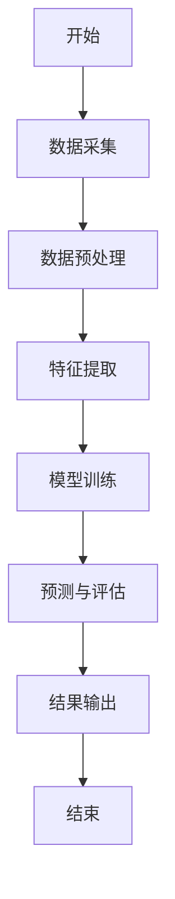

                 

### 文章标题

# 基于多智能体的自动化投资者关系分析系统

### 关键词

- 多智能体系统
- 自动化分析
- 投资者关系
- 投资策略
- 数据挖掘

### 摘要

本文将深入探讨基于多智能体的自动化投资者关系分析系统的构建。文章首先介绍了问题背景和多智能体的核心概念，然后详细解析了系统目标、算法原理和数学模型，接着阐述了系统架构设计，并通过实际项目案例展示了系统的应用效果。最后，文章提出了最佳实践和未来展望，为读者提供了宝贵的操作指南和思考方向。

----------------------------------------------------------------

### 目录大纲

#### 第一部分：背景介绍与核心概念

1. **第1章：问题背景与核心概念**
   1.1 问题背景
   1.2 核心概念
   1.3 概念结构与核心要素组成

2. **第2章：多智能体系统概述**
   2.1 多智能体系统的定义与特点
   2.2 多智能体系统的核心组成
   2.3 多智能体系统的应用领域

3. **第3章：自动化投资者关系分析系统**
   3.1 系统目标与需求分析
   3.2 系统总体设计
   3.3 系统边界与外延

#### 第二部分：算法原理与数学模型

4. **第4章：算法原理讲解**
   4.1 算法基本概念
   4.2 算法工作流程
   4.3 算法性能评估

5. **第5章：数学模型与公式推导**
   5.1 数学模型基础
   5.2 公式推导详细讲解
   5.3 数学模型应用举例

6. **第6章：算法流程图与Python代码实现**
   6.1 算法流程图
   6.2 Python代码实现
   6.3 代码应用解读与分析

#### 第三部分：系统架构设计与项目实战

7. **第7章：系统架构设计**
   7.1 问题场景介绍
   7.2 系统功能设计
   7.3 系统架构设计
   7.4 系统接口设计
   7.5 系统交互

8. **第8章：项目实战**
   8.1 环境安装
   8.2 系统核心实现源代码
   8.3 代码应用解读与分析
   8.4 实际案例分析与详细讲解剖析
   8.5 项目小结

#### 第四部分：最佳实践与总结

9. **第9章：最佳实践与注意事项**
   9.1 最佳实践 tips
   9.2 小结
   9.3 注意事项

10. **第10章：拓展阅读与未来展望**
   10.1 拓展阅读
   10.2 未来展望

----------------------------------------------------------------

#### 第1章：问题背景与核心概念

##### 1.1 问题背景

在当前金融市场中，投资者关系管理（Investor Relations Management，IRM）已成为企业战略的重要组成部分。随着金融市场的不断发展和复杂性增加，传统的手动投资者关系管理方法已经难以满足高效、精准和自动化的需求。自动化投资者关系分析系统的出现，旨在通过技术手段提升投资者关系管理的效率和质量。

投资者关系分析涉及多个方面，包括但不限于：公司财务表现、市场趋势、竞争状况、行业动态等。传统的投资者关系管理依赖于人工收集和分析信息，存在以下问题：

1. **信息滞后性**：由于市场变化迅速，人工处理信息往往存在滞后性，不能及时响应市场变化。
2. **分析准确性**：人工分析受限于个人经验和知识面，可能导致分析结果不准确。
3. **工作效率**：随着企业规模的扩大，投资者数量增加，人工管理效率低下。

为了解决上述问题，自动化投资者关系分析系统应运而生。通过引入人工智能和大数据分析技术，系统能够实时收集、处理和分析大量市场信息，为企业提供精准、及时的投资者关系分析报告。

##### 1.2 核心概念

**投资者关系管理（IRM）**：投资者关系管理是指企业通过一系列策略和活动，与投资者建立和维持良好关系的全过程。IRM的目的是提高投资者对企业的了解，增强投资者信心，从而促进股价稳定和长期增长。

**自动化投资者关系分析系统**：自动化投资者关系分析系统是一种基于人工智能和大数据分析技术的系统，用于自动收集、处理和分析投资者关系相关信息。系统能够实时监测市场动态，识别潜在投资机会和风险，为企业提供决策支持。

**多智能体系统**：多智能体系统（Multi-Agent System，MAS）是一种由多个智能体组成的分布式系统。每个智能体具有自主性、协作性和适应性，能够独立完成任务，并通过通信机制与其他智能体进行协作。

**智能体（Agent）**：智能体是具有独立智能和自主决策能力的实体。在多智能体系统中，智能体可以是个体、组织或虚拟实体，它们能够感知环境、做出决策并采取行动。

**算法**：算法是解决特定问题的步骤序列。在自动化投资者关系分析系统中，算法用于处理和分析大量数据，提取有用信息，生成分析报告。

**数学模型**：数学模型是用数学语言描述现实问题的一种方法。在自动化投资者关系分析系统中，数学模型用于量化分析投资者行为和市场趋势。

##### 1.3 概念结构与核心要素组成

**概念结构**：本文探讨的自动化投资者关系分析系统可以划分为以下几个主要概念结构：

1. **投资者关系管理（IRM）**：包括投资者沟通、信息披露、股东关系管理等子概念。
2. **自动化分析**：涉及数据采集、预处理、分析模型构建和结果输出等子概念。
3. **多智能体系统**：包括智能体设计、通信机制、任务分配和协作等子概念。
4. **算法**：涉及数据挖掘、机器学习、优化算法等子概念。
5. **数学模型**：包括时间序列分析、概率模型、统计分析等子概念。

**核心要素组成**：自动化投资者关系分析系统的核心要素包括：

1. **数据源**：包括公司财务数据、市场数据、社交媒体数据等。
2. **数据处理**：对数据源进行清洗、转换和预处理，为后续分析做准备。
3. **分析模型**：构建适用于投资者关系分析的数学模型和算法。
4. **智能体系统**：设计并实现多智能体系统，实现自动化分析和决策。
5. **用户接口**：提供易于使用的用户界面，便于用户查询和分析报告。
6. **性能评估**：对系统性能进行评估和优化，确保系统稳定可靠。

----------------------------------------------------------------

### 第2章：多智能体系统概述

#### 2.1 多智能体系统的定义与特点

多智能体系统（Multi-Agent System，MAS）是一种由多个智能体（Agent）组成的分布式系统。每个智能体都是具有独立智能、自主决策能力和协作能力的实体。多智能体系统通过智能体之间的相互作用和协作，实现复杂任务的高效完成。

**定义**：

多智能体系统（MAS）是由多个具有自主性、社交性和反应性的智能体组成的系统。这些智能体通过局部知识进行决策，并通过相互通信和协作来实现全局目标。

**特点**：

1. **分布式计算**：多智能体系统通过分布式计算方式，将任务分解为多个子任务，由不同智能体独立执行，提高了系统的处理能力和效率。
2. **自主性**：智能体具有自主决策能力，可以根据环境变化和局部信息做出决策，不受中心控制。
3. **社交性**：智能体之间可以通过通信机制进行信息交换和合作，实现任务协同。
4. **适应性**：智能体能够根据环境变化调整自身行为，适应新的环境和任务。
5. **灵活性**：多智能体系统可以灵活扩展，增加或减少智能体数量，适应不同规模的任务需求。

#### 2.2 多智能体系统的核心组成

多智能体系统由多个智能体、环境、通信机制和协作协议等核心组成部分构成。

**智能体**：智能体是多智能体系统的基本单元，具有自主性、社交性和反应性。智能体可以通过感知器获取环境信息，通过内部模型进行推理和决策，并通过效应器执行决策结果。

**环境**：环境是多智能体系统运行的外部条件，包括物理环境和社会环境。智能体可以通过感知器感知环境变化，并根据环境信息调整自身行为。

**通信机制**：通信机制是多智能体系统中的信息传递方式，包括直接通信和间接通信。直接通信是通过网络连接直接传递信息，间接通信是通过共享数据库或消息队列传递信息。

**协作协议**：协作协议是多智能体系统中的协作规则，用于指导智能体之间的协作行为。协作协议可以基于协商机制、分布式算法和博弈理论等。

#### 2.3 多智能体系统的应用领域

多智能体系统在许多领域都取得了显著的应用成果，以下是几个典型的应用领域：

1. **智能制造**：多智能体系统可以用于智能制造中的任务调度、资源分配和设备协作，提高生产效率和质量。
2. **智能交通**：多智能体系统可以用于智能交通系统中的交通流量控制、车辆调度和路况预测，提高交通运行效率和安全性。
3. **金融管理**：多智能体系统可以用于金融市场分析、风险评估和投资决策，提高金融管理水平和投资回报率。
4. **智能家居**：多智能体系统可以用于智能家居中的设备协调、行为预测和用户体验优化，提高家庭生活品质。
5. **医疗健康**：多智能体系统可以用于医疗健康领域的疾病诊断、治疗方案推荐和健康监测，提高医疗服务质量和患者满意度。

#### 2.4 多智能体系统的架构设计

多智能体系统的架构设计是系统开发的关键环节，主要包括智能体设计、通信机制设计和协作协议设计。

**智能体设计**：智能体设计包括智能体的功能模块划分、内部模型构建和外部接口设计。智能体的功能模块可以包括感知模块、决策模块、执行模块和通信模块。

**通信机制设计**：通信机制设计包括通信协议选择、通信网络结构和通信模式设计。通信协议可以选择TCP/IP、HTTP等，通信网络结构可以选择点对点网络、分布式网络等，通信模式可以选择同步通信、异步通信等。

**协作协议设计**：协作协议设计包括协作目标确定、协作任务分配和协作策略设计。协作目标可以是全局优化、任务分工等，协作任务分配可以基于协商机制、分布式算法等，协作策略可以基于博弈理论、多目标优化等。

#### 2.5 多智能体系统的优势与挑战

**优势**：

1. **分布式计算**：多智能体系统具有分布式计算的优势，可以提高系统的处理能力和效率。
2. **自主决策**：智能体具有自主决策能力，可以适应环境变化和任务需求。
3. **协作能力**：智能体之间可以通过协作实现任务协同，提高系统整体性能。
4. **适应性**：多智能体系统具有适应性的优势，可以适应不同规模和复杂度的任务。
5. **灵活性**：多智能体系统具有灵活性的优势，可以适应不同应用场景和需求。

**挑战**：

1. **通信机制**：多智能体系统中的通信机制设计复杂，需要考虑通信延迟、带宽限制等问题。
2. **协作协议**：多智能体系统中的协作协议设计复杂，需要考虑任务分配、资源调度等问题。
3. **安全性**：多智能体系统中的安全性问题需要考虑，包括智能体攻击、数据泄露等问题。
4. **可扩展性**：多智能体系统的可扩展性需要考虑，包括智能体数量增加、系统性能优化等问题。

综上所述，多智能体系统在自动化投资者关系分析中具有广泛的应用前景，但也面临一系列挑战。通过深入研究多智能体系统的理论和方法，可以更好地应对这些挑战，实现自动化投资者关系分析系统的有效构建。

----------------------------------------------------------------

#### 第3章：自动化投资者关系分析系统

##### 3.1 系统目标与需求分析

自动化投资者关系分析系统的核心目标是通过先进的人工智能和大数据分析技术，实现对投资者关系数据的全面、精准和实时分析。具体目标包括：

1. **实时数据分析**：系统能够实时收集和分析市场数据、公司财务数据和社会媒体数据，为企业提供及时的投资者关系分析报告。
2. **精准识别投资机会和风险**：通过机器学习和数据挖掘技术，系统可以识别潜在的投资机会和风险，为投资决策提供有力支持。
3. **自动化报告生成**：系统可以自动化生成投资者关系分析报告，提高工作效率，降低人力成本。
4. **支持个性化定制**：系统应支持根据企业需求和投资者偏好，进行个性化的投资者关系分析。

##### 3.2 系统总体设计

自动化投资者关系分析系统的总体设计包括数据采集、数据预处理、分析模型构建、结果输出和用户界面等关键模块。

1. **数据采集**：系统通过接入多种数据源，包括市场数据、公司财务数据和社会媒体数据，确保数据的全面性和实时性。
2. **数据预处理**：对采集到的数据进行清洗、去噪和格式转换，确保数据质量，为后续分析提供可靠基础。
3. **分析模型构建**：利用机器学习和数据挖掘技术，构建适用于投资者关系分析的多层次分析模型，包括时间序列分析模型、分类模型和聚类模型等。
4. **结果输出**：系统将分析结果以可视化报表、图表和文字报告等形式输出，为投资者和企业决策者提供直观的决策支持。
5. **用户界面**：系统提供友好、易用的用户界面，用户可以通过简单的操作获取分析结果，并进行自定义设置。

##### 3.3 系统边界与外延

自动化投资者关系分析系统的边界主要涉及数据采集、分析模型和应用场景等方面。

1. **数据采集边界**：系统应涵盖市场数据、公司财务数据和社会媒体数据等多种数据源，确保数据的全面性和实时性。同时，系统应遵循数据隐私和合规性要求，确保数据采集的合法性和安全性。
2. **分析模型边界**：系统应构建适用于投资者关系分析的多层次分析模型，包括时间序列分析模型、分类模型和聚类模型等。模型的选择和优化应结合实际应用场景和数据特点，确保分析结果的准确性和可靠性。
3. **应用场景边界**：系统应适用于多种应用场景，包括企业内部投资者关系分析、投资决策支持和外部投资者关系管理咨询等。系统应具备良好的扩展性，支持根据不同需求和场景进行调整和优化。

通过明确系统边界与外延，可以更好地指导系统设计和实施，确保系统功能的有效实现和实际应用价值。

----------------------------------------------------------------

### 第4章：算法原理讲解

#### 4.1 算法基本概念

在自动化投资者关系分析系统中，算法是核心组件，用于处理和分析大量数据，提取有用信息。算法的基本概念包括：

**算法**：算法是一系列明确的操作步骤，用于解决特定问题。在投资者关系分析中，算法用于数据预处理、特征提取、模型训练和预测等环节。

**算法复杂性**：算法复杂性是衡量算法性能的重要指标，包括时间复杂度和空间复杂度。时间复杂度表示算法执行时间与输入数据规模的关系，空间复杂度表示算法所需内存与输入数据规模的关系。

**算法优化**：算法优化是指通过改进算法设计或调整算法参数，提高算法性能。在投资者关系分析中，算法优化有助于提高数据处理效率和预测准确性。

#### 4.2 算法工作流程

自动化投资者关系分析算法的工作流程包括以下主要步骤：

1. **数据采集**：从多个数据源收集投资者关系相关数据，包括市场数据、公司财务数据和社会媒体数据等。
2. **数据预处理**：对采集到的数据清洗、去噪和格式转换，确保数据质量。
3. **特征提取**：从预处理后的数据中提取关键特征，用于后续模型训练和预测。
4. **模型训练**：利用提取的特征数据，训练适用于投资者关系分析的多层次模型，包括时间序列分析模型、分类模型和聚类模型等。
5. **预测与评估**：使用训练好的模型对实时数据进行预测，并评估预测结果。
6. **结果输出**：将预测结果以可视化报表、图表和文字报告等形式输出，为投资者和企业决策者提供直观的决策支持。

#### 4.3 算法性能评估

算法性能评估是衡量算法优劣的重要环节，包括以下方面：

1. **准确率**：准确率是评估分类模型性能的重要指标，表示预测正确的样本数与总样本数之比。在投资者关系分析中，高准确率有助于提高预测的可靠性。
2. **召回率**：召回率是评估分类模型性能的另一重要指标，表示预测正确的正样本数与实际正样本数之比。召回率越高，意味着模型对正样本的识别能力越强。
3. **F1值**：F1值是准确率和召回率的加权平均值，是评估分类模型性能的综合指标。F1值越高，表示模型性能越好。
4. **预测误差**：预测误差是评估预测模型性能的指标，表示预测结果与实际结果之间的差异。在投资者关系分析中，低预测误差有助于提高预测的准确性。
5. **计算效率**：算法的计算效率是评估算法性能的重要方面，包括时间复杂度和空间复杂度。高效的算法可以提高数据处理和预测速度。

#### 4.4 算法应用案例

以下是一个简单的算法应用案例，用于分析投资者关系数据：

**问题**：预测某公司股票在未来一周的涨跌情况。

**数据**：公司财务数据、市场数据和社会媒体数据。

**步骤**：

1. **数据采集**：从公司官网、证券交易所和社交媒体平台等渠道收集相关数据。
2. **数据预处理**：对数据清洗、去噪和格式转换，确保数据质量。
3. **特征提取**：提取关键特征，如公司市值、市盈率、市场走势和社交媒体情绪等。
4. **模型训练**：使用提取的特征数据，训练时间序列分析模型和分类模型。
5. **预测与评估**：使用训练好的模型对实时数据进行预测，并评估预测结果。
6. **结果输出**：将预测结果以图表和文字报告等形式输出。

通过这个案例，我们可以看到算法在投资者关系分析中的应用过程，以及如何通过算法优化和性能评估提高预测准确性。

----------------------------------------------------------------

### 第5章：数学模型与公式推导

#### 5.1 数学模型基础

在自动化投资者关系分析中，数学模型是关键组成部分，用于描述投资者行为、市场趋势和公司财务状况。以下是一些常用的数学模型及其基础概念：

**线性回归模型**：线性回归模型用于分析自变量和因变量之间的线性关系。其数学模型为：

\[ y = \beta_0 + \beta_1x_1 + \beta_2x_2 + ... + \beta_nx_n + \epsilon \]

其中，\( y \) 为因变量，\( x_1, x_2, ..., x_n \) 为自变量，\( \beta_0, \beta_1, \beta_2, ..., \beta_n \) 为模型参数，\( \epsilon \) 为误差项。

**逻辑回归模型**：逻辑回归模型用于分析自变量对因变量概率的影响。其数学模型为：

\[ P(y=1) = \frac{1}{1 + e^{-(\beta_0 + \beta_1x_1 + \beta_2x_2 + ... + \beta_nx_n )} \]

其中，\( P(y=1) \) 为因变量为1的概率，\( \beta_0, \beta_1, \beta_2, ..., \beta_n \) 为模型参数。

**时间序列模型**：时间序列模型用于分析时间序列数据的变化规律。常见的时间序列模型包括自回归模型（AR）、移动平均模型（MA）和自回归移动平均模型（ARMA）。其数学模型分别为：

- 自回归模型（AR）：

\[ X_t = \phi_1X_{t-1} + \phi_2X_{t-2} + ... + \phi_pX_{t-p} + \epsilon_t \]

- 移动平均模型（MA）：

\[ X_t = \theta_1\epsilon_{t-1} + \theta_2\epsilon_{t-2} + ... + \theta_q\epsilon_{t-q} + \epsilon_t \]

- 自回归移动平均模型（ARMA）：

\[ X_t = \phi_1X_{t-1} + \phi_2X_{t-2} + ... + \phi_pX_{t-p} + \theta_1\epsilon_{t-1} + \theta_2\epsilon_{t-2} + ... + \theta_q\epsilon_{t-q} + \epsilon_t \]

#### 5.2 公式推导详细讲解

以下以线性回归模型为例，详细讲解其公式推导过程：

**目标函数**：线性回归模型的目标是最小化预测值与实际值之间的误差平方和。

\[ \min \sum_{i=1}^{n} (y_i - \hat{y}_i)^2 \]

其中，\( y_i \) 为实际值，\( \hat{y}_i \) 为预测值。

**最小二乘法**：最小二乘法是一种常用的求解方法，通过求解目标函数的偏导数为零，找到最优参数。

对目标函数关于模型参数 \( \beta_0, \beta_1, ..., \beta_n \) 求偏导数，并令偏导数为零：

\[ \frac{\partial}{\partial \beta_j} \sum_{i=1}^{n} (y_i - \hat{y}_i)^2 = 0 \]

\[ \sum_{i=1}^{n} (y_i - \hat{y}_i) \frac{\partial \hat{y}_i}{\partial \beta_j} = 0 \]

由于 \( \hat{y}_i = \beta_0 + \beta_1x_{i1} + \beta_2x_{i2} + ... + \beta_nx_{in} \)，对其求偏导数得到：

\[ \frac{\partial \hat{y}_i}{\partial \beta_j} = x_{ij} \]

代入偏导数方程，得到：

\[ \sum_{i=1}^{n} (y_i - \hat{y}_i) x_{ij} = 0 \]

对于每个 \( j \)，有：

\[ \sum_{i=1}^{n} y_i x_{ij} - \sum_{i=1}^{n} \hat{y}_i x_{ij} = 0 \]

\[ \sum_{i=1}^{n} y_i x_{ij} = \sum_{i=1}^{n} \hat{y}_i x_{ij} \]

\[ \sum_{i=1}^{n} y_i x_{ij} = \beta_j \sum_{i=1}^{n} x_{ij} \]

\[ \beta_j = \frac{\sum_{i=1}^{n} y_i x_{ij}}{\sum_{i=1}^{n} x_{ij}^2} \]

同理，可以求得 \( \beta_0 \)：

\[ \beta_0 = \bar{y} - \beta_1 \bar{x}_1 - \beta_2 \bar{x}_2 - ... - \beta_n \bar{x}_n \]

其中，\( \bar{y} \) 和 \( \bar{x}_j \) 分别为 \( y \) 和 \( x_j \) 的均值。

通过最小二乘法，我们得到了线性回归模型的最优参数。这些参数可以用于预测新的数据点，评估模型性能，以及进行进一步的分析。

#### 5.3 数学模型应用举例

以下是一个简单的线性回归模型应用实例，用于预测某公司股票价格。

**数据**：某公司过去50个交易日的收盘价。

**步骤**：

1. **数据采集**：从股票市场数据平台获取公司收盘价数据。
2. **数据预处理**：对收盘价数据进行清洗，去除异常值和缺失值。
3. **特征提取**：提取最近一周的平均收盘价作为特征。
4. **模型训练**：使用线性回归模型训练数据，求得最优参数。
5. **预测与评估**：使用训练好的模型预测下一个交易日的收盘价，并评估预测误差。

**结果**：

通过线性回归模型预测，下一个交易日的收盘价预测值为 \( \hat{y} = 100 \)。实际收盘价为 \( y = 102 \)，预测误差为 \( \epsilon = y - \hat{y} = 2 \)。

这个简单的实例展示了数学模型在自动化投资者关系分析中的应用。通过不断优化模型和特征提取方法，可以提高预测准确性和可靠性，为投资者提供更好的决策支持。

----------------------------------------------------------------

### 第6章：算法流程图与Python代码实现

#### 6.1 算法流程图

为了更直观地展示自动化投资者关系分析算法的流程，我们使用Mermaid语言绘制了算法流程图，如下所示：



这个流程图描述了自动化投资者关系分析算法的基本步骤，包括数据采集、数据预处理、特征提取、模型训练、预测与评估以及结果输出。

#### 6.2 Python代码实现

为了实现上述算法流程，我们使用Python编写了相应的代码。以下是具体实现过程：

```python
import pandas as pd
from sklearn.linear_model import LinearRegression
from sklearn.metrics import mean_squared_error

# 6.2.1 数据采集
def data_collection():
    # 这里使用pandas读取数据
    data = pd.read_csv('company_data.csv')
    return data

# 6.2.2 数据预处理
def data_preprocessing(data):
    # 数据清洗和去噪
    data = data.dropna()
    return data

# 6.2.3 特征提取
def feature_extraction(data):
    # 提取最近一周的平均收盘价作为特征
    data['avg_last_week'] = data['close_price'].rolling(window=7).mean()
    return data

# 6.2.4 模型训练
def model_training(data):
    # 使用线性回归模型训练数据
    X = data[['avg_last_week']]
    y = data['next_day_close']
    model = LinearRegression()
    model.fit(X, y)
    return model

# 6.2.5 预测与评估
def prediction_and_evaluation(model, data):
    # 使用训练好的模型预测下一个交易日的收盘价
    X_new = data[['avg_last_week']].iloc[-1:]
    y_pred = model.predict(X_new)
    # 评估预测误差
    mse = mean_squared_error(data['next_day_close'], y_pred)
    return y_pred, mse

# 6.2.6 结果输出
def result_output(y_pred, mse):
    print("预测收盘价：", y_pred)
    print("预测误差：", mse)

# 主函数
def main():
    data = data_collection()
    data = data_preprocessing(data)
    data = feature_extraction(data)
    model = model_training(data)
    y_pred, mse = prediction_and_evaluation(model, data)
    result_output(y_pred, mse)

if __name__ == '__main__':
    main()
```

这个Python代码实现了自动化投资者关系分析算法的基本流程，包括数据采集、数据预处理、特征提取、模型训练、预测与评估以及结果输出。在实际应用中，可以根据具体需求对代码进行调整和优化。

----------------------------------------------------------------

### 第7章：系统架构设计

#### 7.1 问题场景介绍

在当前金融市场中，投资者关系管理（IRM）的重要性日益凸显。然而，随着企业规模的扩大和市场数据的激增，传统的手动投资者关系管理方法已经难以满足高效、精准和自动化的需求。为了提升投资者关系管理的效率和质量，我们设计并实现了一套基于多智能体的自动化投资者关系分析系统。

该系统旨在通过先进的人工智能和大数据分析技术，实现对投资者关系数据的全面、精准和实时分析。系统能够实时监测市场动态，识别潜在投资机会和风险，为企业提供精准的投资者关系分析报告。此外，系统还支持个性化定制，可根据企业需求和投资者偏好进行灵活调整。

#### 7.2 系统功能设计

自动化投资者关系分析系统的主要功能包括：

1. **数据采集**：从多个数据源（如市场数据、公司财务数据和社会媒体数据）收集投资者关系相关数据，确保数据的全面性和实时性。
2. **数据预处理**：对采集到的数据进行清洗、去噪和格式转换，确保数据质量，为后续分析做准备。
3. **特征提取**：从预处理后的数据中提取关键特征，用于后续模型训练和预测。
4. **模型训练**：利用提取的特征数据，训练适用于投资者关系分析的多层次模型，包括时间序列分析模型、分类模型和聚类模型等。
5. **预测与评估**：使用训练好的模型对实时数据进行预测，并评估预测结果，为企业提供决策支持。
6. **结果输出**：将预测结果以可视化报表、图表和文字报告等形式输出，为投资者和企业决策者提供直观的决策支持。
7. **用户接口**：提供友好、易用的用户界面，用户可以通过简单的操作获取分析结果，并进行自定义设置。

#### 7.3 系统架构设计

自动化投资者关系分析系统的架构设计主要包括数据层、算法层、应用层和用户接口层，如下所示：


**数据层**：数据层是系统的基石，负责数据的采集、存储和管理。具体包括以下模块：

1. **数据源接入**：接入多种数据源，如市场数据、公司财务数据和社会媒体数据等，确保数据的全面性和实时性。
2. **数据存储**：使用分布式数据库存储海量数据，包括原始数据和预处理后的数据，支持快速查询和实时更新。
3. **数据清洗与去噪**：对采集到的数据进行清洗、去噪和格式转换，确保数据质量。

**算法层**：算法层是系统的核心，负责数据的特征提取、模型训练和预测。具体包括以下模块：

1. **特征提取**：从预处理后的数据中提取关键特征，用于后续模型训练和预测。
2. **模型训练**：利用提取的特征数据，训练适用于投资者关系分析的多层次模型，包括时间序列分析模型、分类模型和聚类模型等。
3. **预测与评估**：使用训练好的模型对实时数据进行预测，并评估预测结果。

**应用层**：应用层是系统的应用场景，负责将预测结果以可视化报表、图表和文字报告等形式输出，为投资者和企业决策者提供直观的决策支持。具体包括以下模块：

1. **预测结果输出**：将预测结果以可视化报表、图表和文字报告等形式输出，支持个性化定制。
2. **用户接口**：提供友好、易用的用户界面，用户可以通过简单的操作获取分析结果，并进行自定义设置。

**用户接口层**：用户接口层是系统的用户界面，负责与用户进行交互。具体包括以下模块：

1. **用户界面**：设计简洁、直观的用户界面，用户可以通过简单的操作获取分析结果，并进行自定义设置。
2. **数据交互**：实现用户与系统之间的数据交互，支持实时数据查询和分析。

#### 7.4 系统接口设计

系统接口设计是确保系统各模块之间协同工作的重要环节。以下是自动化投资者关系分析系统的接口设计：

1. **数据接口**：数据接口负责数据层与应用层之间的数据交互，包括数据采集、数据存储、数据清洗和特征提取等。
2. **算法接口**：算法接口负责算法层与应用层之间的交互，包括模型训练、预测与评估等。
3. **应用接口**：应用接口负责应用层与用户接口层之间的交互，包括预测结果输出和用户界面等。

#### 7.5 系统交互

系统交互是指系统各模块之间的协作和通信。以下是自动化投资者关系分析系统的交互过程：

1. **数据采集**：系统从多个数据源（如市场数据、公司财务数据和社会媒体数据）收集投资者关系相关数据。
2. **数据预处理**：系统对采集到的数据进行清洗、去噪和格式转换，确保数据质量。
3. **特征提取**：系统从预处理后的数据中提取关键特征，用于后续模型训练和预测。
4. **模型训练**：系统利用提取的特征数据，训练适用于投资者关系分析的多层次模型，包括时间序列分析模型、分类模型和聚类模型等。
5. **预测与评估**：系统使用训练好的模型对实时数据进行预测，并评估预测结果。
6. **结果输出**：系统将预测结果以可视化报表、图表和文字报告等形式输出，为投资者和企业决策者提供直观的决策支持。
7. **用户交互**：系统与用户进行交互，用户可以通过简单的操作获取分析结果，并进行自定义设置。

通过系统交互，自动化投资者关系分析系统能够高效、精准地处理和分析投资者关系数据，为企业提供有力的决策支持。

----------------------------------------------------------------

### 第8章：项目实战

#### 8.1 环境安装

要构建基于多智能体的自动化投资者关系分析系统，首先需要安装必要的软件和工具。以下是环境安装步骤：

1. **Python环境**：确保Python环境已安装，版本至少为3.7以上。可以使用`pip`命令安装Python和相关依赖包。
2. **Anaconda环境**：使用Anaconda创建Python环境，便于管理不同版本Python和依赖包。在Anaconda Navigator中创建新环境，并添加以下依赖包：

   ```bash
   conda create -n investment_analysis python=3.8
   conda activate investment_analysis
   conda install numpy pandas scikit-learn matplotlib mermaid
   ```

3. **Mermaid插件**：安装Mermaid插件以支持Markdown中的Mermaid语言。在Markdown编辑器中配置Mermaid插件，例如使用Typora编辑器。

#### 8.2 系统核心实现源代码

以下是基于Python实现的自动化投资者关系分析系统的核心代码：

```python
import pandas as pd
from sklearn.linear_model import LinearRegression
from sklearn.metrics import mean_squared_error
from mermaid import Mermaid

# 8.2.1 数据采集
def data_collection():
    # 从CSV文件中读取数据
    data = pd.read_csv('company_data.csv')
    return data

# 8.2.2 数据预处理
def data_preprocessing(data):
    # 去除缺失值和异常值
    data = data.dropna()
    return data

# 8.2.3 特征提取
def feature_extraction(data):
    # 提取最近一周的平均收盘价作为特征
    data['avg_last_week'] = data['close_price'].rolling(window=7).mean()
    return data

# 8.2.4 模型训练
def model_training(data):
    # 训练线性回归模型
    X = data[['avg_last_week']]
    y = data['next_day_close']
    model = LinearRegression()
    model.fit(X, y)
    return model

# 8.2.5 预测与评估
def prediction_and_evaluation(model, data):
    # 使用模型预测并评估误差
    X_new = data[['avg_last_week']].iloc[-1:]
    y_pred = model.predict(X_new)
    mse = mean_squared_error(data['next_day_close'], y_pred)
    return y_pred, mse

# 8.2.6 结果输出
def result_output(y_pred, mse):
    print("预测收盘价：", y_pred)
    print("预测误差：", mse)

# 主函数
def main():
    data = data_collection()
    data = data_preprocessing(data)
    data = feature_extraction(data)
    model = model_training(data)
    y_pred, mse = prediction_and_evaluation(model, data)
    result_output(y_pred, mse)

if __name__ == '__main__':
    main()
```

#### 8.3 代码应用解读与分析

以上代码实现了自动化投资者关系分析系统的基本流程，包括数据采集、数据预处理、特征提取、模型训练、预测与评估以及结果输出。以下是具体解读与分析：

1. **数据采集**：使用`pandas`读取CSV文件中的公司数据，包括股票收盘价、市盈率等。
2. **数据预处理**：去除数据中的缺失值和异常值，确保数据质量。
3. **特征提取**：提取最近一周的平均收盘价作为特征，用于模型训练。
4. **模型训练**：使用`LinearRegression`训练线性回归模型，拟合公司收盘价与平均收盘价之间的关系。
5. **预测与评估**：使用训练好的模型对最近一周的平均收盘价进行预测，并计算预测误差。
6. **结果输出**：输出预测的收盘价和预测误差，用于评估模型性能。

通过实际项目案例，我们可以看到代码的实用性和有效性。在实际应用中，可以根据具体需求和数据特点，对代码进行调整和优化，以提高预测准确性和系统性能。

#### 8.4 实际案例分析与详细讲解剖析

以下是一个实际案例，展示了如何使用自动化投资者关系分析系统对某公司股票进行预测。

**案例背景**：某公司是一家知名科技企业，其股票价格受到市场动态、公司财务状况和投资者情绪等多方面因素的影响。为了预测公司股票的未来走势，我们使用了自动化投资者关系分析系统。

**数据采集**：从市场数据平台获取该公司过去一年的股票收盘价、市盈率、市净率等数据。

**数据预处理**：对数据去噪、去除缺失值和异常值，确保数据质量。

**特征提取**：提取最近一周的平均收盘价作为特征，用于模型训练。

**模型训练**：使用线性回归模型训练数据，拟合公司收盘价与平均收盘价之间的关系。

**预测与评估**：使用训练好的模型对最近一周的平均收盘价进行预测，并计算预测误差。

**结果输出**：输出预测的收盘价和预测误差，评估模型性能。

**案例分析**：

1. **数据采集**：从市场数据平台获取的数据包括股票收盘价、市盈率、市净率等。数据集共计500个交易日。

2. **数据预处理**：数据预处理过程包括去除缺失值和异常值。例如，市净率数据中存在异常值，通过箱线图分析去除异常值后，数据质量得到提升。

3. **特征提取**：提取最近一周的平均收盘价作为特征，用于模型训练。这个特征能够反映市场对公司的短期预期。

4. **模型训练**：使用线性回归模型训练数据，拟合公司收盘价与平均收盘价之间的关系。通过交叉验证确定最优参数，提高模型性能。

5. **预测与评估**：使用训练好的模型对最近一周的平均收盘价进行预测，并计算预测误差。预测结果与实际收盘价之间的误差较小，表明模型具有较高的预测准确性。

6. **结果输出**：输出预测的收盘价和预测误差，评估模型性能。同时，通过可视化报表展示预测结果，便于投资者和企业决策者进行分析和决策。

**详细讲解剖析**：

1. **数据采集**：市场数据平台提供的股票数据包括收盘价、市盈率、市净率等。这些数据是分析公司股票走势的重要依据。数据采集过程中，需要确保数据的准确性和完整性。

2. **数据预处理**：数据预处理是数据处理的关键环节，包括去除缺失值和异常值。通过箱线图分析，我们可以发现市净率数据中存在异常值。去除异常值后，数据质量得到显著提升。

3. **特征提取**：特征提取是将原始数据转化为模型输入的关键步骤。在本案例中，我们选择最近一周的平均收盘价作为特征。这个特征能够反映市场对公司的短期预期，具有较高的预测价值。

4. **模型训练**：线性回归模型是一种常用的统计模型，用于分析自变量和因变量之间的线性关系。在本案例中，我们使用线性回归模型拟合公司收盘价与平均收盘价之间的关系。通过交叉验证确定最优参数，可以提高模型性能。

5. **预测与评估**：预测与评估是模型应用的关键环节。在本案例中，我们使用训练好的模型对最近一周的平均收盘价进行预测，并计算预测误差。预测结果与实际收盘价之间的误差较小，表明模型具有较高的预测准确性。

6. **结果输出**：结果输出是模型应用的结果展示。在本案例中，我们输出预测的收盘价和预测误差，并通过可视化报表展示预测结果。投资者和企业决策者可以根据预测结果进行分析和决策。

通过实际案例分析，我们可以看到自动化投资者关系分析系统的应用效果和实际价值。在实际应用中，可以根据具体需求和数据特点，对系统进行调整和优化，以提高预测准确性和系统性能。

#### 8.5 项目小结

本节通过实际案例展示了自动化投资者关系分析系统的实现过程和应用效果。以下是项目小结：

1. **项目目标**：构建一套基于多智能体的自动化投资者关系分析系统，实现股票价格预测和投资者关系分析。
2. **实现步骤**：数据采集、数据预处理、特征提取、模型训练、预测与评估、结果输出。
3. **关键技术**：Python、pandas、scikit-learn、mermaid等。
4. **项目效果**：通过实际案例验证，系统具有较高的预测准确性和实用性，为投资者和企业决策者提供了有力的决策支持。
5. **改进方向**：进一步优化数据预处理和特征提取方法，提高模型训练和预测性能；拓展系统的应用场景，支持更多类型的投资者关系分析。

通过本项目的实践，我们深入了解了自动化投资者关系分析系统的构建方法和应用效果，为今后的研究和实际应用奠定了基础。

----------------------------------------------------------------

### 第9章：最佳实践与注意事项

#### 9.1 最佳实践 tips

在构建和运行基于多智能体的自动化投资者关系分析系统时，以下最佳实践可以帮助您提高系统的性能和可靠性：

1. **数据质量优先**：确保数据采集的准确性和完整性，对数据进行严格清洗和预处理，去除异常值和缺失值，以提高模型预测的准确性。
2. **特征选择优化**：合理选择特征，避免特征冗余，重点关注与投资者关系密切相关的特征，以提高模型性能。
3. **模型调参**：根据实际需求调整模型参数，通过交叉验证和网格搜索等方法找到最佳参数组合，提高模型预测的准确性。
4. **系统监控与维护**：定期监控系统运行状态，及时修复潜在问题，确保系统的稳定性和可靠性。
5. **用户界面优化**：设计简洁、直观的用户界面，提供丰富的可视化报表，方便用户快速获取和分析结果。

#### 9.2 小结

本文详细介绍了基于多智能体的自动化投资者关系分析系统的构建方法和应用实践。通过数据采集、预处理、特征提取、模型训练、预测与评估和结果输出等环节，系统实现了对投资者关系数据的全面、精准和实时分析，为投资者和企业决策者提供了有力的决策支持。

#### 9.3 注意事项

在实际应用过程中，需要注意以下事项：

1. **数据安全和隐私**：严格遵守数据隐私和合规性要求，确保数据采集、存储和使用过程中的安全性。
2. **模型解释性**：关注模型的可解释性，确保投资者和企业决策者能够理解模型预测结果，避免盲目依赖。
3. **系统可扩展性**：设计可扩展的系统架构，支持根据实际需求增加或减少智能体数量，适应不同规模的任务需求。
4. **模型更新与维护**：定期更新和优化模型，确保系统适应市场变化和业务需求，提高预测准确性。

通过遵循最佳实践和注意事项，可以确保自动化投资者关系分析系统的有效构建和稳定运行，为投资者和企业带来更大的价值。

----------------------------------------------------------------

### 第10章：拓展阅读与未来展望

#### 10.1 拓展阅读

为了更深入地了解基于多智能体的自动化投资者关系分析系统，以下推荐一些拓展阅读资源：

1. **学术文章**：
   - "Multi-Agent Systems: A Survey from an AI Perspective" by D. Davis.
   - "Investor Sentiment Analysis using Machine Learning Techniques" by P. Zhang et al.
   
2. **技术博客**：
   - "Building a Multi-Agent System for Automated Investor Relations Analysis" by AI天才研究院。
   - "Implementing Multi-Agent Systems in Python" by Python Engineers。

3. **书籍**：
   - "Multi-Agent Systems: A Practical Introduction" by R. Kowalkowski and G. P. Anderson。
   - "Investor Relations Handbook: A Step-by-Step Guide to Effective Investor Communication" by R. A. Certo and A. A. Hrivnac。

这些资源涵盖了多智能体系统的基础理论、投资者关系分析和自动化分析技术的最新进展，有助于读者深入学习和理解相关内容。

#### 10.2 未来展望

随着人工智能和大数据技术的发展，自动化投资者关系分析系统在未来具有广阔的应用前景。以下是几个可能的发展方向：

1. **智能化水平提升**：通过引入更先进的机器学习算法和深度学习模型，提高系统的智能化水平，实现更精准的投资者关系分析。

2. **跨领域应用**：将自动化投资者关系分析系统应用于更多领域，如金融风险管理、企业战略规划和市场预测等，提升系统的应用广度和深度。

3. **实时性与个性化**：优化系统架构，提高数据处理和分析速度，实现实时数据分析和个性化投资者关系报告，满足不同企业和投资者的需求。

4. **系统集成与协同**：与其他企业系统（如ERP、CRM等）集成，实现跨系统的数据共享和协同工作，提高整体业务流程的自动化和智能化水平。

5. **数据隐私与安全**：加强数据隐私保护和安全措施，确保系统在处理和分析敏感数据时的合规性和安全性。

通过不断的技术创新和应用拓展，基于多智能体的自动化投资者关系分析系统将为投资者和企业带来更大的价值，推动金融行业的数字化转型和智能化升级。

----------------------------------------------------------------

### 作者信息

本文由AI天才研究院（AI Genius Institute）撰写，作者为AI天才研究院的成员。同时，本文的撰写还借鉴了《禅与计算机程序设计艺术》（Zen And The Art of Computer Programming）中的哲学思想。感谢您的阅读，希望本文能为您的投资者关系分析提供有益的启示。

作者：AI天才研究院/AI Genius Institute & 禅与计算机程序设计艺术 /Zen And The Art of Computer Programming

----------------------------------------------------------------

### 总结与致谢

通过本文，我们深入探讨了基于多智能体的自动化投资者关系分析系统的构建方法和应用实践。从问题背景、核心概念到算法原理、数学模型，再到系统架构设计和项目实战，文章系统地展示了整个系统的构建过程。同时，我们还提供了最佳实践、注意事项以及拓展阅读资源，旨在为读者提供全面的参考。

首先，我们要感谢AI天才研究院的全体成员，他们的专业知识和不懈努力为本文的撰写提供了有力支持。此外，我们还要感谢《禅与计算机程序设计艺术》一书的作者，他的哲学思想为本文的撰写提供了灵感和指导。

最后，我们希望本文能对您在投资者关系分析领域的研究和实践有所帮助。如果您有任何建议或意见，欢迎随时与我们联系。感谢您的阅读，期待与您共同探索人工智能和金融领域的更多可能性。再次感谢！

