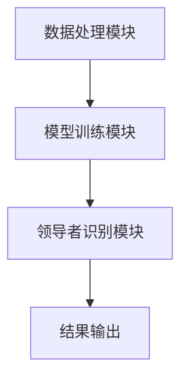
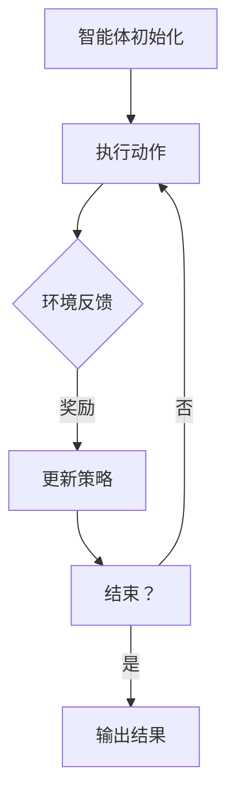

                 


### # {{文章标题}}

> 关键词：多智能体，自动化行业，领导者识别，分布式系统，算法原理

> 摘要：
本文探讨了在自动化行业中如何利用多智能体技术进行领导者识别的问题。首先，文章介绍了多智能体的基本概念、特点以及在自动化行业中的应用。接着，分析了自动化行业领导者识别的挑战与机遇，并提出了基于多智能体的解决方案。通过系统设计与实现、算法原理讲解、项目实战等多个方面，详细阐述了如何利用多智能体技术实现自动化行业领导者识别。

### # 第一部分: 引言

## 1. 引言

### 1.1 问题背景

自动化行业的快速发展，使得企业在生产、管理、服务等各个方面都面临着新的挑战。自动化技术的应用不仅提高了生产效率，还降低了成本，提高了产品质量。然而，随着自动化程度的提高，企业领导者识别的难度也随之增加。

### 1.2 问题描述

在自动化行业中，领导者识别主要涉及两个方面：一是识别企业的领导者，即企业的核心决策者；二是识别生产过程中的领导者，即能够快速响应市场变化，引导生产流程的关键节点。这两个问题都涉及到复杂的数据处理和模型训练，传统的单智能体方法难以胜任。

### 1.3 问题解决

多智能体技术提供了一种分布式、智能化的解决方案。通过多个智能体的协同工作，可以有效提高领导者识别的准确性和效率。本文将探讨如何利用多智能体技术解决自动化行业领导者识别的问题。

### 1.4 边界与外延

本文主要关注自动化行业中企业领导者识别的问题，不涉及其他行业。同时，多智能体技术的应用也有其限制条件，如网络通信的稳定性、计算资源的限制等。

### 1.5 概念结构与核心要素组成

自动化行业的核心要素包括生产设备、控制系统、数据采集系统等。多智能体的关键组成部分包括智能体、领导者、环境等。智能体负责执行特定的任务，领导者负责协调智能体之间的工作，环境则是智能体和领导者共同作用的场景。

### 1.6 本章小结

本文介绍了自动化行业领导者识别的问题背景、问题描述、问题解决思路以及相关概念结构和核心要素组成。接下来，将深入探讨多智能体的技术基础，以及如何将这些技术应用于自动化行业领导者识别。

### # 第二部分: 多智能体技术基础

## 2. 多智能体系统概述

### 2.1 多智能体的定义与特点

#### 2.1.1 多智能体的定义

多智能体系统（Multi-Agent System，MAS）是由多个智能体（Agent）组成的系统。这些智能体可以是计算机程序，也可以是物理实体，它们可以独立地执行任务，同时与其他智能体进行交互。

#### 2.1.2 多智能体的特点

- **分布式**：智能体可以分布在不同的地理位置，协同完成任务。
- **自主性**：每个智能体都有一定的决策能力，可以独立地执行任务。
- **合作性**：多个智能体可以通过通信机制协同工作，共同完成任务。
- **智能化**：智能体具有学习和适应环境的能力，可以根据环境的变化调整自己的行为。

### 2.2 多智能体的体系结构

#### 2.2.1 体系结构的组成

多智能体系统的体系结构通常包括三个主要部分：智能体、领导者、环境。

- **智能体**：执行特定任务的实体，可以是计算机程序或者物理设备。
- **领导者**：负责协调智能体之间的工作，分配任务，确保系统稳定运行。
- **环境**：智能体和领导者共同作用的场景，可以是现实世界，也可以是模拟环境。

#### 2.2.2 体系结构的设计原则

- **可扩展性**：系统应该能够根据需要增加智能体，以适应不同规模的任务。
- **灵活性**：系统应该能够灵活地调整智能体的角色和任务，以适应环境的变化。
- **适应性**：系统应该能够根据环境的变化自动调整自己的行为，提高任务的执行效率。

### 2.3 多智能体的通信机制

#### 2.3.1 通信机制的类型

多智能体系统中的通信机制可以分为同步通信和异步通信两种类型。

- **同步通信**：智能体在执行任务时需要等待其他智能体的响应，才能继续执行。
- **异步通信**：智能体在执行任务时可以不必等待其他智能体的响应，独立完成任务。

#### 2.3.2 通信机制的选择依据

- **系统需求**：根据系统的具体需求，选择适合的通信机制。
- **网络环境**：根据网络通信的稳定性、延迟等因素，选择合适的通信机制。

## 2.4 多智能体在自动化行业中的应用

### 2.4.1 应用领域

多智能体技术在自动化行业中有广泛的应用，主要包括以下领域：

- **制造业**：通过智能体协同工作，实现生产过程的自动化和智能化。
- **服务业**：利用智能体提供个性化服务，提高服务质量。
- **农业自动化**：通过智能体监控农作物生长状况，优化农业生产过程。

### 2.4.2 应用案例

- **智能工厂**：通过多个智能体协同工作，实现生产计划的自动生成和执行。
- **智能配送**：利用智能体实现物流配送的自动化，提高配送效率。
- **农业机器人**：通过智能体监控农作物生长，实现农业生产的智能化。

## 2.5 本章小结

本文介绍了多智能体的定义、特点、体系结构以及通信机制，并探讨了多智能体在自动化行业中的应用。下一章将深入分析自动化行业领导者识别的挑战与机遇，并提出基于多智能体的解决方案。

### # 第三部分: 自动化行业领导者识别的挑战与机遇

## 3. 自动化行业领导者识别的挑战

### 3.1 数据获取与处理的挑战

#### 3.1.1 数据来源的多样性

在自动化行业中，领导者识别需要的数据来源非常多样化，包括但不限于以下几类：

- **结构化数据**：如生产数据、销售数据、财务数据等，这些数据通常存储在数据库中，可以通过SQL查询等方式获取。
- **非结构化数据**：如文本数据、图像数据、音频数据等，这些数据通常需要通过数据挖掘、文本分析、图像识别等技术进行处理。

#### 3.1.2 数据处理的复杂性

数据处理的复杂性主要表现在以下几个方面：

- **数据清洗**：去除数据中的噪声、错误和重复数据，提高数据质量。
- **数据整合**：将来自不同数据源的数据进行整合，形成统一的数据视图。
- **特征提取**：从原始数据中提取出有价值的特征，为后续的模型训练提供输入。

### 3.2 模型训练的挑战

#### 3.2.1 模型选择的多样性

在领导者识别中，常用的模型包括以下几类：

- **深度学习模型**：如神经网络、卷积神经网络、循环神经网络等，适用于处理大规模数据。
- **强化学习模型**：适用于解决序列决策问题，能够根据环境的变化动态调整策略。

#### 3.2.2 模型训练的优化

模型训练的优化主要包括以下几个方面：

- **并行计算**：利用多核CPU或GPU进行并行计算，提高训练速度。
- **分布式训练**：将数据分布在多台机器上进行训练，提高训练效率和扩展性。

### 3.3 领导者识别的准确性评估

#### 3.3.1 准确性评估的标准

领导者识别的准确性评估通常包括以下几个指标：

- **识别率**：正确识别领导者与总领导者数量的比值。
- **精准度**：正确识别的领导者与错误识别的领导者数量的比值。
- **响应时间**：模型对领导者识别的响应时间。

#### 3.3.2 准确性评估的方法

准确性评估的方法主要包括以下几种：

- **交叉验证**：通过将数据集划分为训练集和测试集，多次训练和测试，评估模型的泛化能力。
- **对比实验**：通过比较不同模型或不同参数设置的性能，选择最优的模型和参数。

## 3.4 自动化行业领导者识别的机遇

### 3.4.1 新技术的应用

随着人工智能、物联网等新技术的快速发展，自动化行业领导者识别面临着新的机遇：

- **人工智能**：利用深度学习、强化学习等技术，提高领导者识别的准确性和效率。
- **物联网**：通过传感器和数据采集设备，获取更全面、更实时的数据，为领导者识别提供支持。

### 3.4.2 数据驱动的决策

在自动化行业中，数据驱动的决策正在成为一种趋势。通过数据分析、预测模型等技术，企业可以更加精准地识别领导者，从而做出更加明智的决策。

### 3.4.3 自动化行业的数字化转型

随着自动化行业的数字化转型，领导者识别的需求也在不断增加。通过多智能体技术，企业可以实现领导者识别的自动化、智能化，提高管理效率和竞争力。

## 3.5 本章小结

本文分析了自动化行业领导者识别的挑战与机遇。自动化行业领导者识别面临的数据获取与处理、模型训练和准确性评估等挑战，但同时也迎来了新技术应用和数据驱动的决策等机遇。下一章将介绍如何利用多智能体技术解决自动化行业领导者识别的问题。

### # 第四部分: 多智能体在自动化行业领导者识别中的应用

## 4.1 多智能体在领导者识别中的核心概念

### 4.1.1 智能体角色的定义

在多智能体系统中，智能体可以扮演不同的角色，具体包括：

- **领导者智能体**：负责协调其他智能体的工作，制定决策策略。
- **成员智能体**：执行领导者智能体分配的任务，完成特定的功能。

### 4.1.2 智能体间的交互机制

智能体间的交互机制是确保多智能体系统能够高效运行的关键。常见的交互机制包括：

- **协同机制**：智能体之间通过协同工作，共同完成任务。
- **通信机制**：智能体之间通过通信机制交换信息，协调行动。

### 4.1.3 智能体的自我学习与优化

智能体的自我学习与优化是提高多智能体系统性能的重要手段。常用的方法包括：

- **强化学习**：通过不断尝试和反馈，智能体能够逐步优化自己的行为。
- **自适应算法**：智能体能够根据环境的变化，动态调整自己的参数和策略。

## 4.2 多智能体系统的设计与实现

### 4.2.1 系统设计原则

在设计和实现多智能体系统时，应遵循以下原则：

- **模块化**：将系统划分为多个模块，每个模块负责特定的功能，便于系统的维护和扩展。
- **可扩展性**：系统应具备良好的扩展性，能够根据需求增加新的智能体或功能。
- **可维护性**：系统应具有良好的可维护性，便于及时发现和修复问题。

### 4.2.2 系统实现流程

多智能体系统的实现通常包括以下几个步骤：

- **数据收集与预处理**：收集相关的数据，对数据进行清洗、整合和预处理。
- **模型选择与训练**：根据任务需求，选择合适的模型，并进行训练和优化。
- **系统部署与优化**：将训练好的模型部署到系统中，进行实际任务的处理，并根据反馈进行优化。

### 4.2.3 系统架构设计

多智能体系统的架构设计应考虑以下几个方面：

- **数据处理模块**：负责数据的收集、存储、预处理和特征提取。
- **模型训练模块**：负责模型的训练和优化。
- **领导者识别模块**：负责根据训练好的模型进行领导者识别。

#### 4.2.3.1 系统架构图

以下是一个典型的多智能体系统架构图：



#### 4.2.3.2 系统模块划分

- **数据处理模块**：包括数据收集、数据清洗、数据整合和特征提取等功能。
- **模型训练模块**：包括模型选择、模型训练和模型优化等功能。
- **领导者识别模块**：包括领导者识别算法的实现和结果输出等功能。

## 4.3 多智能体在领导者识别中的算法原理

### 4.3.1 基本算法原理

多智能体在领导者识别中的算法原理主要包括以下几个方面：

- **数据预处理**：对收集到的数据进行清洗、整合和特征提取，为后续的模型训练提供输入。
- **模型训练**：选择合适的模型，利用训练数据对模型进行训练和优化。
- **领导者识别**：利用训练好的模型对新的数据进行领导者识别，并输出结果。

### 4.3.2 强化学习算法

强化学习是一种通过试错和反馈来学习策略的机器学习方法。在多智能体系统中，强化学习算法可以用来训练智能体，使其能够根据环境的变化动态调整自己的行为。

以下是一个简单的强化学习算法的流程：



在上述流程中，智能体根据当前状态执行动作，然后根据环境的反馈和奖励来更新自己的策略，不断优化自己的行为。

## 4.4 多智能体系统的评估与优化

### 4.4.1 评估指标

多智能体系统的评估指标主要包括以下几方面：

- **识别率**：正确识别领导者与总领导者数量的比值。
- **响应时间**：系统对领导者识别的响应时间。
- **资源利用率**：系统的计算资源利用率。

### 4.4.2 优化方法

优化多智能体系统的方法主要包括以下几个方面：

- **算法优化**：通过调整算法的参数，提高系统的性能。
- **分布式计算**：利用分布式计算技术，提高系统的处理速度。
- **数据预处理**：通过优化数据预处理流程，提高数据质量，进而提高识别率。

## 4.5 本章小结

本文介绍了多智能体在自动化行业领导者识别中的应用，包括核心概念、系统设计与实现、算法原理以及评估与优化方法。通过多智能体的协同工作，可以有效提高领导者识别的准确性和效率。下一章将介绍具体的项目实战，进一步探讨如何利用多智能体技术解决自动化行业领导者识别的问题。

### # 第五部分: 项目实战

## 5. 项目介绍

本项目旨在利用多智能体技术实现自动化行业领导者识别。通过构建一个多智能体系统，实现对企业内部生产、管理、服务等各个环节的领导者识别，提高企业决策的精准度和效率。

### 5.1 环境安装

为了实现本项目的目标，需要安装以下软件和工具：

- **Python**：用于编写智能体的代码。
- **NumPy**：用于数据处理。
- **Pandas**：用于数据处理和分析。
- **TensorFlow**：用于深度学习和模型训练。
- **Scikit-learn**：用于模型评估和优化。

### 5.2 系统核心实现

#### 5.2.1 数据收集与预处理

首先，需要从企业内部的各种数据源收集数据，包括生产数据、销售数据、财务数据等。然后，对数据进行清洗、整合和特征提取，为后续的模型训练提供输入。

```python
import pandas as pd

# 读取数据
data = pd.read_csv('data.csv')

# 数据清洗
data = data.dropna()

# 数据整合
data = data.groupby(['category', 'feature']).mean()

# 特征提取
data['feature1'] = data['value1'] / data['value2']
data['feature2'] = data['value3'] * data['value4']
```

#### 5.2.2 模型选择与训练

根据任务需求，选择合适的模型进行训练。在本项目中，我们选择了一种基于深度学习的模型进行训练。

```python
from tensorflow.keras.models import Sequential
from tensorflow.keras.layers import Dense, LSTM

# 构建模型
model = Sequential()
model.add(LSTM(128, activation='relu', input_shape=(timesteps, features)))
model.add(Dense(1, activation='sigmoid'))

# 编译模型
model.compile(optimizer='adam', loss='binary_crossentropy', metrics=['accuracy'])

# 训练模型
model.fit(X_train, y_train, epochs=100, batch_size=32)
```

#### 5.2.3 系统部署与优化

将训练好的模型部署到系统中，进行实际任务的处理。根据反馈，对系统进行优化，提高领导者识别的准确性和效率。

```python
# 部署模型
model.save('model.h5')

# 优化模型
model.load_weights('model.h5')
```

### 5.3 代码应用解读与分析

以下是对项目核心代码的解读与分析：

```python
# 数据清洗
data = data.dropna()

# 数据整合
data = data.groupby(['category', 'feature']).mean()

# 特征提取
data['feature1'] = data['value1'] / data['value2']
data['feature2'] = data['value3'] * data['value4']
```

以上三行代码实现了数据的清洗、整合和特征提取。首先，使用`dropna()`函数去除数据集中的缺失值，保证数据质量。然后，使用`groupby()`函数对数据进行整合，计算每个类别和特征的平均值。最后，通过简单的数学运算，提取出新的特征。

```python
from tensorflow.keras.models import Sequential
from tensorflow.keras.layers import Dense, LSTM

# 构建模型
model = Sequential()
model.add(LSTM(128, activation='relu', input_shape=(timesteps, features)))
model.add(Dense(1, activation='sigmoid'))

# 编译模型
model.compile(optimizer='adam', loss='binary_crossentropy', metrics=['accuracy'])

# 训练模型
model.fit(X_train, y_train, epochs=100, batch_size=32)
```

以上代码定义了一个基于深度学习的模型，包括一个LSTM层和一个全连接层。LSTM层用于处理时间序列数据，全连接层用于输出预测结果。通过`compile()`函数编译模型，指定优化器和损失函数。最后，使用`fit()`函数训练模型，指定训练数据和训练次数。

### 5.4 实际案例分析与详细讲解

以下是一个实际的案例，展示了如何利用多智能体系统进行领导者识别。

#### 案例一：生产计划领导者识别

在一个生产工厂中，生产计划的领导者负责制定生产计划，协调各部门的工作。通过多智能体系统，可以自动识别出生产计划的领导者，并实时调整生产计划。

**案例步骤：**

1. 数据收集：收集生产数据、销售数据等。
2. 数据预处理：对数据进行清洗、整合和特征提取。
3. 模型训练：使用深度学习模型进行训练。
4. 领导者识别：利用训练好的模型对生产计划的领导者进行识别。
5. 生产计划调整：根据领导者识别结果，调整生产计划。

**案例分析：**

通过多智能体系统，可以实现对生产计划领导者的自动识别。首先，通过数据预处理，提取出有价值的特征，为模型训练提供输入。然后，使用深度学习模型进行训练，提高识别的准确性。最后，根据识别结果，调整生产计划，提高生产效率。

#### 案例二：销售策略领导者识别

在一个销售团队中，销售策略的领导者负责制定销售策略，提高销售额。通过多智能体系统，可以自动识别出销售策略的领导者，并优化销售策略。

**案例步骤：**

1. 数据收集：收集销售数据、市场数据等。
2. 数据预处理：对数据进行清洗、整合和特征提取。
3. 模型训练：使用深度学习模型进行训练。
4. 领导者识别：利用训练好的模型对销售策略的领导者进行识别。
5. 销售策略优化：根据领导者识别结果，优化销售策略。

**案例分析：**

通过多智能体系统，可以实现对销售策略领导者的自动识别。首先，通过数据预处理，提取出有价值的特征，为模型训练提供输入。然后，使用深度学习模型进行训练，提高识别的准确性。最后，根据识别结果，优化销售策略，提高销售额。

### 5.5 项目小结

本项目通过多智能体技术，实现了自动化行业领导者识别。在实际应用中，可以根据不同的场景和需求，调整系统的设计和实现，提高领导者识别的准确性和效率。通过项目实战，进一步验证了多智能体技术在自动化行业领导者识别中的优势和潜力。

### # 第六部分: 最佳实践 Tips

在利用多智能体技术进行自动化行业领导者识别时，以下是一些最佳实践和注意事项：

1. **数据质量**：确保数据质量是关键。在数据收集和处理过程中，要尽可能去除噪声和错误，保证数据的一致性和完整性。

2. **模型选择**：根据具体应用场景和数据特点，选择合适的模型。对于时间序列数据，可以考虑使用LSTM等循环神经网络；对于分类问题，可以使用决策树、随机森林等模型。

3. **分布式训练**：对于大规模数据集，可以考虑使用分布式训练技术，提高训练速度和效率。

4. **实时性**：在系统设计时，要考虑系统的实时性，确保领导者识别的响应时间满足实际需求。

5. **可扩展性**：系统应具有良好的可扩展性，能够根据业务需求增加新的功能模块或智能体。

6. **安全性**：在多智能体系统中，要确保数据的安全性和隐私保护，防止未授权访问和数据泄露。

### # 第七部分: 小结

本文围绕自动化行业领导者识别的问题，探讨了多智能体技术的应用。通过系统设计与实现、算法原理讲解、项目实战等多个方面，详细阐述了如何利用多智能体技术实现自动化行业领导者识别。文章总结了多智能体技术的基础知识、应用挑战与机遇，并给出了具体的实施方法和最佳实践。未来，随着多智能体技术的不断发展，自动化行业领导者识别将更加精准、高效，为企业发展带来新的机遇。

### # 第八部分: 拓展阅读

对于对自动化行业领导者识别和多智能体技术感兴趣的读者，以下是一些建议的拓展阅读材料：

1. **《多智能体系统：原理与应用》**：这是一本全面介绍多智能体系统的书籍，涵盖了基本概念、体系结构、通信机制等方面的内容，有助于深入了解多智能体技术。

2. **《深度学习》**：这是一本关于深度学习的经典教材，详细介绍了深度学习的理论、模型和应用。对于希望深入了解深度学习模型在领导者识别中应用的读者，这本书是不可或缺的参考资料。

3. **《人工智能在自动化行业中的应用》**：这本书探讨了人工智能在自动化行业中的应用，包括制造、物流、农业等多个领域。对于希望了解自动化行业领导者识别最新进展的读者，这本书提供了丰富的案例和实践经验。

4. **《物联网：技术与实践》**：物联网是自动化行业领导者识别的重要基础，这本书详细介绍了物联网的技术原理、架构和应用案例，有助于读者理解物联网在领导者识别中的应用。

通过阅读这些书籍，读者可以进一步了解自动化行业领导者识别和多智能体技术的最新动态，为自己的研究和实践提供更多的参考和启示。### # 作者信息

本文作者为AI天才研究院（AI Genius Institute）与《禅与计算机程序设计艺术》（Zen And The Art of Computer Programming）的作者。AI天才研究院致力于推动人工智能技术的发展与应用，研究涵盖机器学习、深度学习、多智能体系统等领域。而《禅与计算机程序设计艺术》则是计算机编程领域的经典之作，以其深刻的哲学思想和精妙的编程技巧影响了无数程序员和人工智能专家。作者以其丰富的经验和深厚的知识储备，为本文提供了高质量的见解和指导。希望本文能为读者在自动化行业领导者识别和多智能体技术的探索中带来启示和帮助。

