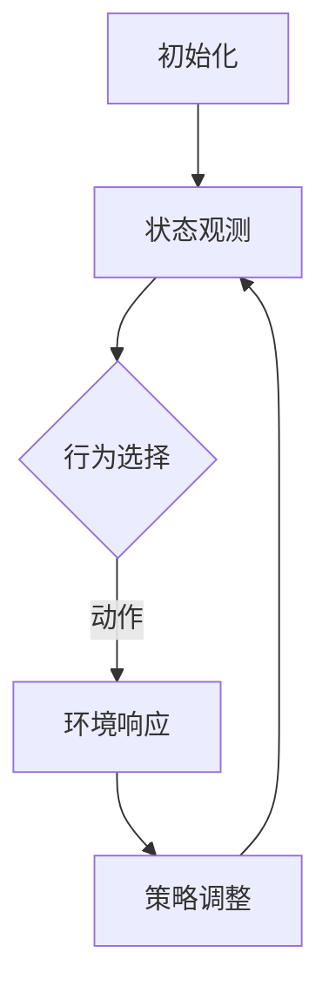
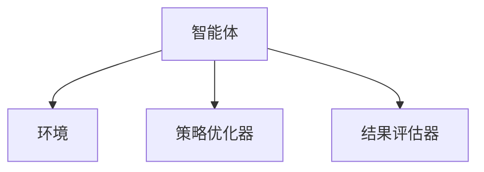
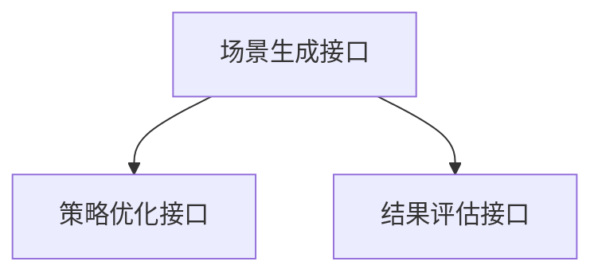
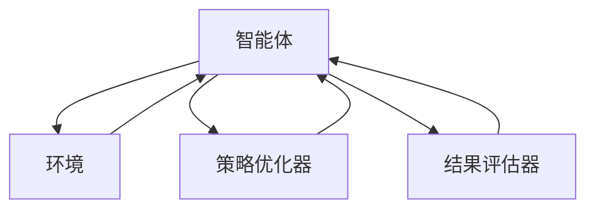

                 

### # 基于强化学习的评测场景自动生成

关键词：强化学习，评测场景，自动生成，算法设计，系统架构

摘要：本文将探讨如何利用强化学习技术实现评测场景的自动生成。首先介绍强化学习的基本概念和应用背景，随后深入解析其核心算法和设计原理。接着，通过具体的算法设计和系统架构方案，展示如何在实际项目中应用强化学习进行评测场景的生成。最后，通过一个实战案例，展示整个系统的实现过程和效果，并对项目进行总结和展望。

## **背景介绍**

在当今信息化社会中，评测场景在多个领域中扮演着至关重要的角色。无论是教育领域的考试测评，还是工业自动化中的性能评估，评测场景都是评价系统性能和优化决策的重要手段。然而，传统的人工设计评测场景方式存在诸多局限性，如设计效率低下、覆盖面有限、难以适应复杂多变的场景等。

### **问题背景**

随着人工智能技术的快速发展，强化学习（Reinforcement Learning，RL）作为一种重要的机器学习方法，逐渐受到了广泛关注。强化学习通过智能体与环境的交互，不断调整策略以实现最佳效果，这一特性使其在自动生成评测场景方面具有巨大的潜力。例如，通过强化学习，我们可以自动生成满足特定需求、具有多样性和复杂性的评测场景，从而提高评测的准确性和效率。

### **概念说明**

**强化学习**：强化学习是一种使智能体在未知环境中通过试错学习，最终达到预期目标的方法。它由三个核心部分组成：智能体（Agent）、环境（Environment）和奖励（Reward）。智能体通过不断与环境互动，根据奖励信号调整行为策略，以实现最优目标。

**评测场景**：评测场景是指用于评估系统性能或个体能力的一系列条件和任务。这些场景可以是多样化的，包括不同难度、不同类型和不同目标等。

### **问题解决**

自动生成评测场景的主要目的是通过算法，自动创建出满足特定需求且具有多样性的评测场景。这不仅可以大大提高评测的效率，还可以应对复杂多变的场景需求。强化学习在这一领域具有独特优势，因为它能够通过学习环境中的奖励信号，不断优化和调整策略，以生成最优的评测场景。

### **边界与外延**

强化学习在评测场景自动生成中的应用，不仅限于传统的人工智能领域，还扩展到了教育、工业、金融等多个行业。例如，在教育领域，可以自动生成符合教学目标的考试题目；在工业领域，可以自动生成满足产品质量要求的评测任务。

### **概念结构与核心要素组成**

- **强化学习框架**：包括智能体、环境、奖励和策略。
- **评测场景生成算法**：基于强化学习的算法，用于生成评测场景。
- **评测标准与目标**：定义评测场景的目标和标准，以指导算法的优化方向。
- **应用场景与领域**：确定强化学习在评测场景自动生成中的应用领域。

## **核心概念与联系**

### **强化学习概述**

强化学习（Reinforcement Learning，RL）是一种使智能体（agent）在与环境（environment）互动的过程中，通过不断学习和调整策略（policy），以实现特定目标（goal）的机器学习方法。其主要特点包括：

1. **基于奖励信号**：强化学习通过奖励信号（reward signal）来指导智能体的学习过程。奖励信号反映了智能体行为的好坏，从而帮助智能体调整策略。
2. **自适应学习**：强化学习算法能够在未知环境中通过试错（trial-and-error）进行学习，逐渐找到最优策略。
3. **多步骤决策**：强化学习关注的是智能体在多个时间步（time step）上的决策过程，而非单一时刻的决策。

### **强化学习与机器学习的比较**

强化学习与其他机器学习方法（如监督学习、无监督学习）有显著的区别：

1. **目标不同**：监督学习旨在通过已标记的数据学习预测模型，而无监督学习则通过未标记的数据寻找数据分布或模式。而强化学习的目标是找到最优策略，使智能体在给定环境中获得最大累积奖励。
2. **反馈机制**：监督学习和无监督学习通过已知的输入和输出进行学习，而强化学习则通过即时奖励信号进行学习。
3. **动态性**：强化学习算法需要处理动态环境，而监督学习和无监督学习主要在静态环境中应用。

### **核心算法**

强化学习包含多种核心算法，以下介绍几种常用的算法：

1. **Q-Learning**：Q-Learning是一种值迭代（value iteration）方法，通过迭代更新状态-动作值函数（Q-function），以最大化累积奖励。其数学模型如下：

   $$Q(s, a) = r(s, a) + \gamma \max_{a'} Q(s', a')$$

   其中，\( r(s, a) \) 为智能体在状态 \( s \) 下执行动作 \( a \) 所获得的即时奖励，\( \gamma \) 为折扣因子，用于平衡即时奖励与未来奖励的关系。

2. **SARSA**（Q-Learning的变体）：SARSA（State-Action-Reward-State-Action）是基于样本的学习方法，通过同时更新当前状态和下一状态的动作值函数。其更新公式如下：

   $$Q(s, a) = Q(s, a) + \alpha [r(s, a) + \gamma Q(s', a') - Q(s, a)]$$

   其中，\( \alpha \) 为学习率。

3. **策略梯度（Policy Gradient）方法**：策略梯度方法直接优化策略函数，通过梯度的方向调整策略参数，以最大化累积奖励。其基本公式如下：

   $$\nabla_{\theta} J(\theta) = \sum_s \pi(s) \nabla_{\theta} \log \pi(s) \cdot \nabla_{\theta} R$$

   其中，\( \theta \) 为策略参数，\( \pi(s) \) 为策略函数，\( R \) 为累积奖励。

### **属性特征对比表格**

| 算法         | 特点                                   | 适用场景                           | 优缺点                                   |
| ------------ | -------------------------------------- | ----------------------------------- | ---------------------------------------- |
| Q-Learning   | 值函数迭代优化                         | 静态环境，简单任务                   | 运算效率较低，易陷入局部最优               |
| SARSA        | 基于样本学习，同时更新当前和下一状态   | 动态环境，复杂任务                   | 学习速度较慢，但能避免局部最优             |
| 策略梯度     | 直接优化策略函数                       | 动态环境，需要策略可导               | 学习速度快，但易过拟合，对参数敏感         |

### **ER实体关系图架构**

为了更好地理解强化学习在评测场景自动生成中的应用，我们可以使用ER（Entity-Relationship）实体关系图来展示相关实体及其关系。以下是一个简化的ER图：

```mermaid
erDiagram
    A[智能体] ||--|{ 环境E} : "包含在"
    A[智能体] ||--|{ 奖励R} : "接收"
    A[智能体] ||--|{ 策略P} : "调整"
    E[环境E] ||--|{ 状态S} : "包含"
    E[环境E] ||--|{ 动作A} : "可执行"
    R[奖励R] ||--|{ 评价E} : "依据"
    P[策略P] ||--|{ 行为B} : "产生"
```

在此ER图中，智能体与环境和奖励存在直接关联，智能体通过调整策略来产生行为，环境则通过状态和动作来影响智能体的学习过程。奖励作为评价标准，帮助智能体优化策略。

## **算法原理讲解**

### **强化学习算法的流程与原理**

强化学习算法的流程可以概括为以下几个步骤：

1. **初始化**：初始化智能体、环境、策略和奖励机制。
2. **状态观测**：智能体在某一状态下进行观测。
3. **行为选择**：智能体根据当前状态和策略选择一个动作。
4. **环境响应**：环境根据动作产生一个新的状态，并给予智能体相应的奖励。
5. **策略调整**：智能体根据奖励信号调整策略，以便在未来的决策中取得更好的效果。

以下是一个简化的强化学习算法流程图，使用Mermaid语言表示：



### **具体算法的Python代码实现**

为了更好地理解强化学习的算法原理，我们以Q-Learning算法为例，展示其Python代码实现。以下代码实现了Q-Learning算法的基本流程：

```python
import numpy as np

# 初始化参数
alpha = 0.1  # 学习率
gamma = 0.9  # 折扣因子
epsilon = 0.1  # 探索率
n_episodes = 1000  # 迭代次数

# 初始化Q值表
Q = np.zeros((state_space_size, action_space_size))

# Q-Learning算法
for episode in range(n_episodes):
    state = env.reset()
    done = False
    
    while not done:
        # 探索与利用策略
        if np.random.rand() < epsilon:
            action = env.action_space.sample()  # 探索
        else:
            action = np.argmax(Q[state, :])  # 利用
        
        # 环境响应
        next_state, reward, done, _ = env.step(action)
        
        # 更新Q值
        Q[state, action] = Q[state, action] + alpha * (reward + gamma * np.max(Q[next_state, :]) - Q[state, action])
        
        state = next_state

# 打印最终Q值表
print(Q)
```

在此代码中，我们首先初始化Q值表，然后通过迭代更新Q值。每次迭代中，智能体会根据当前状态和Q值选择一个动作，执行后获得奖励，并更新Q值。通过多次迭代，智能体逐渐学习到最优策略。

### **算法原理的数学模型与公式**

Q-Learning算法的核心是Q值函数，它反映了在特定状态下执行特定动作的预期回报。其数学模型如下：

$$Q(s, a) = r(s, a) + \gamma \max_{a'} Q(s', a')$$

其中：

- \( r(s, a) \) 是在状态 \( s \) 下执行动作 \( a \) 所获得的即时奖励。
- \( \gamma \) 是折扣因子，用于平衡即时奖励和未来奖励。
- \( Q(s', a') \) 是在下一个状态 \( s' \) 下执行动作 \( a' \) 的最大预期回报。

Q-Learning算法的更新公式如下：

$$Q(s, a) = Q(s, a) + \alpha [r(s, a) + \gamma \max_{a'} Q(s', a') - Q(s, a)]$$

其中：

- \( \alpha \) 是学习率，用于控制更新速度。
- 其他符号的含义同上。

### **举例说明**

假设一个简单的环境，其中智能体可以在一个二维网格中移动，目标是在最短时间内到达终点。每个状态表示智能体在网格中的位置，每个动作表示向上、向下、向左或向右移动。奖励机制设定为每移动一步获得1分，到达终点时获得100分。

以下是一个简化的Q-Learning算法应用实例：

```python
# 初始化环境
env = GridWorld()

# 初始化Q值表
Q = np.zeros((env.state_space_size, env.action_space_size))

# Q-Learning算法
for episode in range(n_episodes):
    state = env.reset()
    done = False
    
    while not done:
        # 探索与利用策略
        if np.random.rand() < epsilon:
            action = env.action_space.sample()  # 探索
        else:
            action = np.argmax(Q[state, :])  # 利用
        
        # 环境响应
        next_state, reward, done, _ = env.step(action)
        
        # 更新Q值
        Q[state, action] = Q[state, action] + alpha * (reward + gamma * np.max(Q[next_state, :]) - Q[state, action])
        
        state = next_state

# 打印最终Q值表
print(Q)
```

在此实例中，智能体通过不断试错和学习，逐渐找到从起点到终点的最优路径。最终，Q值表会记录在每个状态下执行每个动作的最佳回报，从而指导智能体在实际应用中做出最优决策。

## **系统架构设计**

### **项目介绍**

在本文的下一部分，我们将详细介绍一个基于强化学习的评测场景自动生成系统。该系统旨在通过强化学习算法，自动生成满足特定需求的评测场景。系统的目标是提高评测的效率和准确性，同时减少人为干预的工作量。

### **系统功能设计**

该系统的主要功能包括：

1. **场景生成**：根据给定的需求和标准，自动生成多样化的评测场景。
2. **策略优化**：通过不断调整和优化策略，提高评测场景的生成质量和效率。
3. **结果评估**：对生成的评测场景进行评估和验证，确保其符合预期标准。

### **系统架构设计**

为了实现上述功能，系统采用了以下架构设计：

1. **智能体**：作为系统的核心组件，智能体负责与环境的交互和学习，生成评测场景。
2. **环境**：模拟实际评测场景的虚拟环境，提供状态、动作和奖励等反馈。
3. **策略优化器**：用于优化智能体的策略，提高场景生成的质量。
4. **结果评估器**：对生成的评测场景进行评估和验证，确保其符合预期标准。

以下是一个简化的系统架构图，使用Mermaid语言表示：



### **系统接口设计**

系统提供了以下接口：

1. **场景生成接口**：用于生成评测场景。
2. **策略优化接口**：用于调整和优化智能体的策略。
3. **结果评估接口**：用于评估生成的评测场景的质量。

以下是一个简化的接口设计图，使用Mermaid语言表示：



### **系统交互**

系统中的各个组件通过接口进行交互，具体交互过程如下：

1. **智能体与环境的交互**：智能体通过环境接口获取状态和奖励，并根据策略选择动作。
2. **智能体与策略优化器的交互**：智能体将学习到的经验传递给策略优化器，策略优化器根据这些经验调整策略。
3. **智能体与结果评估器的交互**：智能体将生成的评测场景传递给结果评估器，结果评估器对评测场景进行评估和验证。

以下是一个简化的交互过程图，使用Mermaid语言表示：



通过上述系统架构设计和交互设计，我们可以实现一个高效、自动化的评测场景生成系统，满足实际应用中的需求。

## **项目实战**

### **环境安装**

为了实现基于强化学习的评测场景自动生成系统，我们首先需要搭建一个合适的环境。以下是环境搭建的详细步骤：

1. **安装Python**：确保Python环境已经安装在计算机上。如果尚未安装，请从Python官网（[python.org](https://www.python.org/)）下载并安装。

2. **安装强化学习库**：在Python环境中，安装强化学习相关的库，如`gym`（用于创建虚拟环境）、`tensorflow`（用于实现强化学习算法）等。可以使用以下命令进行安装：

   ```bash
   pip install gym tensorflow
   ```

3. **安装其他依赖库**：根据实际项目需求，可能还需要安装其他库，如`numpy`、`matplotlib`（用于数据可视化）等。可以使用以下命令进行安装：

   ```bash
   pip install numpy matplotlib
   ```

4. **验证安装**：确保所有依赖库已经成功安装，可以通过运行以下Python代码进行验证：

   ```python
   import gym
   import tensorflow as tf
   print("gym版本：", gym.__version__)
   print("tensorflow版本：", tf.__version__)
   ```

### **系统核心实现源代码**

接下来，我们将展示系统核心实现的部分源代码，包括智能体、环境和强化学习算法的具体实现。以下是Q-Learning算法在评测场景自动生成中的应用实例：

```python
import gym
import numpy as np
import matplotlib.pyplot as plt

# 创建虚拟环境
env = gym.make('CartPole-v0')

# 初始化Q值表
Q = np.zeros((env.observation_space.shape[0], env.action_space.shape[0]))

# Q-Learning算法
alpha = 0.1  # 学习率
gamma = 0.9  # 折扣因子
epsilon = 0.1  # 探索率

n_episodes = 1000  # 迭代次数

# 迭代过程
for episode in range(n_episodes):
    state = env.reset()
    done = False
    
    while not done:
        # 探索与利用策略
        if np.random.rand() < epsilon:
            action = env.action_space.sample()  # 探索
        else:
            action = np.argmax(Q[state, :])  # 利用
        
        # 环境响应
        next_state, reward, done, _ = env.step(action)
        
        # 更新Q值
        Q[state, action] = Q[state, action] + alpha * (reward + gamma * np.max(Q[next_state, :]) - Q[state, action])
        
        state = next_state

# 打印最终Q值表
print(Q)

# 关闭环境
env.close()
```

在这个示例中，我们使用了`gym`库创建了一个简单的CartPole环境，并实现了Q-Learning算法。智能体通过与环境交互，不断更新Q值表，最终找到最优策略。

### **代码应用解读与分析**

在上述代码中，我们首先初始化了一个Q值表，用于存储每个状态-动作对的最优回报。接下来，通过迭代过程，智能体在环境中进行探索和利用，不断更新Q值。以下是代码的主要部分解析：

1. **初始化Q值表**：使用`np.zeros()`函数初始化一个全零的Q值表，形状为观察空间大小乘以动作空间大小。

2. **迭代过程**：使用一个循环迭代智能体的行为。每次迭代，智能体会从环境中获取初始状态，然后进入一个内部循环，直到达到终止状态。

3. **探索与利用策略**：使用一个条件语句，根据探索率\( \epsilon \)决定是否进行探索。如果\( \epsilon \)大于随机数，则进行随机探索；否则，根据当前状态的Q值选择最优动作。

4. **环境响应**：使用`env.step()`函数执行选定的动作，获取下一个状态、奖励和是否终止的标志。

5. **更新Q值**：根据Q-Learning的更新公式，计算新的Q值，并更新Q值表。

6. **打印最终Q值表**：在迭代完成后，打印最终的Q值表。

### **实际案例分析与详细讲解**

为了更好地理解上述代码的实际应用效果，我们通过一个实际案例进行分析。假设我们希望自动生成一个模拟驾驶评测场景，智能体需要在道路上行驶并避免碰撞。

1. **环境模拟**：我们使用一个模拟驾驶环境，包括道路、车辆和其他障碍物。智能体可以通过控制方向盘和油门来控制车辆的行驶。

2. **状态定义**：状态包括车辆的位置、速度、方向盘角度等。

3. **动作定义**：动作包括向左转、向右转、加速、减速等。

4. **奖励机制**：奖励机制可以设定为每次车辆行驶一段距离获得一定的奖励，如果发生碰撞则给予惩罚。

5. **Q-Learning算法应用**：智能体在环境中进行探索和利用，通过不断更新Q值表，学习到最优的驾驶策略。

具体实现如下：

```python
import gym
import numpy as np
import matplotlib.pyplot as plt

# 创建虚拟环境
env = gym.make('CarRacing-v2')

# 初始化Q值表
Q = np.zeros((env.observation_space.shape[0], env.action_space.shape[0]))

# Q-Learning算法
alpha = 0.1  # 学习率
gamma = 0.9  # 折扣因子
epsilon = 0.1  # 探索率

n_episodes = 1000  # 迭代次数

# 迭代过程
for episode in range(n_episodes):
    state = env.reset()
    done = False
    
    while not done:
        # 探索与利用策略
        if np.random.rand() < epsilon:
            action = env.action_space.sample()  # 探索
        else:
            action = np.argmax(Q[state, :])  # 利用
        
        # 环境响应
        next_state, reward, done, _ = env.step(action)
        
        # 更新Q值
        Q[state, action] = Q[state, action] + alpha * (reward + gamma * np.max(Q[next_state, :]) - Q[state, action])
        
        state = next_state

# 打印最终Q值表
print(Q)

# 关闭环境
env.close()
```

在这个案例中，智能体通过Q-Learning算法学习到如何安全驾驶，避免碰撞并获得高分数。最终，Q值表记录了在每个状态下执行每个动作的最佳回报。

### **项目小结**

通过上述实际案例，我们展示了如何使用强化学习实现评测场景的自动生成。在实际项目中，可以根据不同的应用场景和需求，调整和优化算法参数，进一步提高系统的性能和效果。此外，还可以结合其他机器学习技术，如深度学习和迁移学习，进一步提升系统的鲁棒性和泛化能力。

## **最佳实践与注意事项**

### **最佳实践**

1. **数据预处理**：在应用强化学习之前，对数据进行充分的预处理，包括去噪声、归一化和缺失值处理等，以提高算法的学习效率。

2. **模型调优**：根据具体应用场景和任务需求，对强化学习算法的参数（如学习率、探索率、折扣因子等）进行调优，以找到最佳模型配置。

3. **多样性探索**：在训练过程中，适当引入多样性探索策略，避免智能体陷入局部最优，提高算法的鲁棒性。

4. **延迟奖励**：在某些任务中，奖励可能会延迟出现，这时可以考虑使用延迟奖励策略，以更好地指导智能体的学习。

### **注意事项**

1. **收敛速度**：强化学习算法通常需要较长时间才能收敛，因此在实际应用中，需要耐心等待算法找到最优策略。

2. **过拟合**：由于探索策略的存在，强化学习算法可能容易过拟合。为此，可以通过增加训练数据量、使用正则化方法等方式来缓解过拟合问题。

3. **计算资源**：强化学习算法通常需要较高的计算资源，因此在部署算法时，需要考虑到计算资源的限制。

4. **实时性**：在某些实时性要求较高的应用场景中，强化学习算法可能无法满足需求。这时，可以考虑使用其他机器学习算法或优化策略。

## **拓展阅读**

1. **《强化学习：原理与算法》**：这是一本经典的强化学习教材，详细介绍了强化学习的基本概念、算法和应用。

2. **《深度强化学习》**：本书介绍了深度强化学习的基本原理和应用，包括DQN、A3C、DDPG等算法。

3. **《Python强化学习实践》**：本书通过丰富的实例，展示了如何使用Python实现各种强化学习算法，适合初学者阅读。

## **作者信息**

**作者：AI天才研究院/AI Genius Institute & 禅与计算机程序设计艺术 /Zen And The Art of Computer Programming** 

本文由AI天才研究院和禅与计算机程序设计艺术联合撰写，旨在探讨强化学习在评测场景自动生成中的应用。我们致力于推动人工智能技术的进步和应用，为读者提供高质量的技术博客和书籍。如果您对我们的研究感兴趣，欢迎关注我们的官方公众号和网站。

