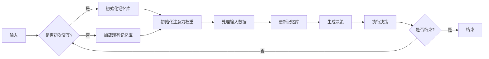
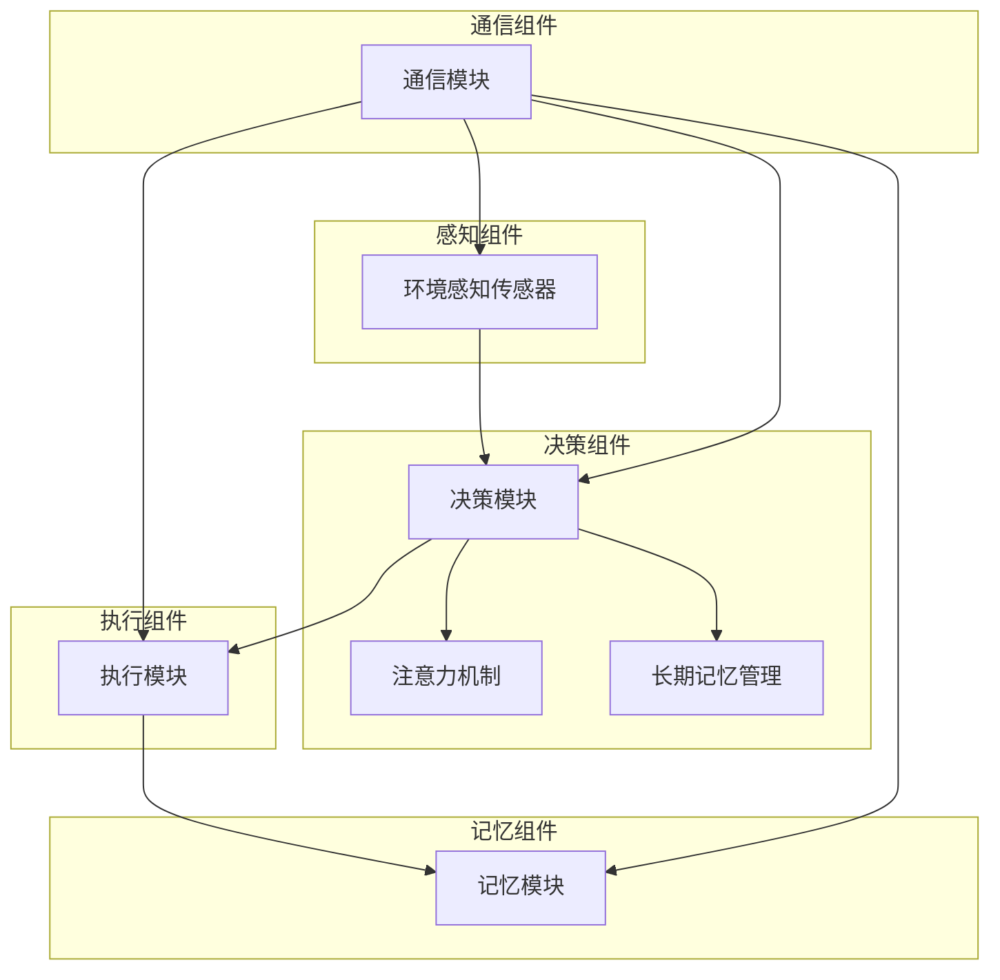
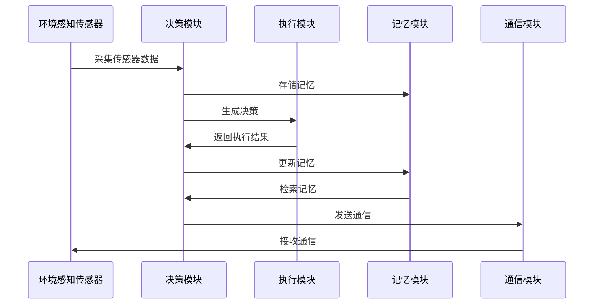
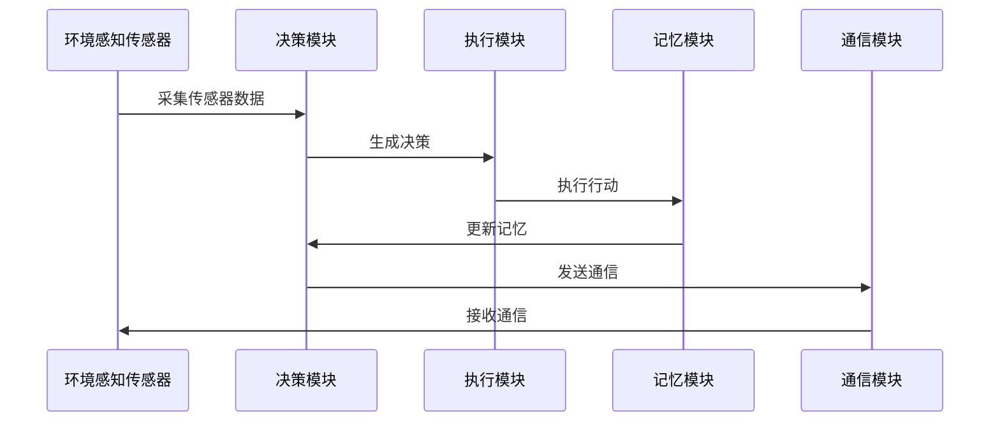

                 

### 文章标题：基于注意力机制的AI Agent长期记忆管理

关键词：注意力机制、AI Agent、长期记忆管理、深度学习、算法原理、系统设计与实现

摘要：本文将深入探讨基于注意力机制的AI Agent长期记忆管理技术。文章首先介绍了AI Agent及其长期记忆管理的重要性，然后详细阐述了注意力机制的原理和核心概念。接下来，本文通过mermaid流程图和Python代码，对算法原理进行了深入剖析，并通过一个实际案例展示了如何在实际项目中应用这一技术。最后，文章总结了最佳实践和注意事项，为读者提供了进一步的拓展阅读资源。

### 目录大纲

----------------------------------------------------------------

## 第一部分：背景

### 第1章：问题背景

#### 1.1.1 问题背景

#### 1.1.2 问题描述

#### 1.1.3 问题解决思路

#### 1.1.4 边界与外延

#### 1.1.5 核心概念

### 第2章：核心概念与联系

#### 2.1.1 核心概念原理

#### 2.1.2 概念属性特征对比

#### 2.1.3 ER实体关系图

## 第二部分：原理

### 第3章：算法原理讲解

#### 3.1.1 算法概述

#### 3.1.2 算法mermaid流程图

#### 3.1.3 算法原理

#### 3.1.4 算法举例说明

## 第三部分：应用

### 第4章：系统分析与架构设计方案

#### 4.1.1 问题场景介绍

#### 4.1.2 系统功能设计

#### 4.1.3 系统架构设计

#### 4.1.4 系统接口设计

#### 4.1.5 系统交互

### 第5章：项目实战

#### 5.1.1 环境安装

#### 5.1.2 系统核心实现源代码

#### 5.1.3 代码应用解读与分析

#### 5.1.4 实际案例分析与讲解

#### 5.1.5 项目小结

## 第四部分：最佳实践与拓展

### 第6章：最佳实践

### 第7章：小结

### 第8章：注意事项

### 第9章：拓展阅读

## 目录大纲总结

----------------------------------------------------------------

### 目录大纲总结

全书共分为四个部分，结构如下：

**第一部分：背景**

1. **问题背景**：介绍AI Agent和长期记忆管理的核心概念，阐述研究的必要性和重要性。
2. **核心概念与联系**：详细阐述注意力机制的原理，通过mermaid流程图和实体关系图来展示概念之间的联系。

**第二部分：原理**

1. **算法原理讲解**：通过mermaid流程图和Python代码，深入剖析基于注意力机制的AI Agent长期记忆管理算法，包括算法概述、流程图、原理和举例说明。

**第三部分：应用**

1. **系统分析与架构设计方案**：介绍具体问题场景，设计系统功能、架构和接口，通过mermaid序列图展示系统交互。
2. **项目实战**：详细描述环境安装、核心代码实现，并进行代码解读与分析，通过实际案例展示算法的应用效果。

**第四部分：最佳实践与拓展**

1. **最佳实践**：提供在使用基于注意力机制的AI Agent长期记忆管理时的一些最佳实践。
2. **小结**：对全书内容进行总结，强调核心观点和关键点。
3. **注意事项**：指出在应用过程中需要注意的事项。
4. **拓展阅读**：推荐相关的拓展阅读材料，为读者提供进一步学习资源。

每个部分的内容结构清晰，便于读者理解和掌握。文章字数控制在10000～12000字左右，确保内容详实而不冗长，重点突出，便于读者快速获取关键信息。文章采用markdown格式，使得内容排版简洁、清晰，易于阅读。

---

**下一篇：第一部分：背景**

### 第1章：问题背景

#### 1.1.1 问题背景

人工智能（AI）在过去的几十年里取得了飞速发展，从简单的规则系统到复杂的深度学习模型，AI技术已经在各个领域取得了显著的成果。然而，随着AI技术的不断进步，研究人员和开发者们也开始意识到一个重要问题：如何有效地管理AI Agent的长期记忆。

AI Agent是指能够自主地感知环境、制定决策并采取行动的智能体。在许多现实场景中，AI Agent需要具备长期记忆能力，以便在持续变化的环境中做出合理的决策。长期记忆管理涉及到如何有效地存储、检索和更新大量的历史数据，以便AI Agent能够从过去的经验中学习并提高其性能。

当前，AI Agent的长期记忆管理面临以下挑战：

1. **数据量庞大**：现实世界中的数据量非常庞大，AI Agent需要能够高效地处理和存储这些数据。
2. **数据异构性**：不同的数据源具有不同的格式和类型，如何统一管理和处理这些异构数据是一个重要问题。
3. **更新和一致性**：随着AI Agent不断与环境交互，其记忆库中的数据需要不断更新和保持一致性，这增加了记忆管理的复杂性。
4. **可解释性**：AI Agent的决策过程应该具有可解释性，以便人们能够理解其行为背后的原因和逻辑。

#### 1.1.2 问题描述

长期记忆管理问题可以描述为：在给定的数据集和环境中，如何设计一个有效的算法，使得AI Agent能够高效地存储、检索和更新其长期记忆，从而在决策过程中充分利用历史数据。

具体来说，问题描述包括以下几个方面：

1. **数据存储**：如何设计一个高效的内存存储结构，以便AI Agent能够快速地访问和检索历史数据。
2. **数据检索**：如何设计一个高效的查询机制，使得AI Agent能够在海量数据中快速地找到与当前任务相关的信息。
3. **数据更新**：如何设计一个有效的数据更新机制，使得AI Agent能够及时更新其记忆库，以反映最新的环境状态。
4. **数据一致性**：如何在数据更新过程中保持数据的一致性，避免出现冲突和错误。
5. **可解释性**：如何设计一个可解释的决策过程，使得人们能够理解AI Agent的决策逻辑和行为。

#### 1.1.3 问题解决思路

为了解决长期记忆管理问题，我们可以从以下几个方面入手：

1. **注意力机制**：注意力机制是一种在深度学习模型中广泛应用的机制，它能够帮助模型自动地关注与当前任务相关的信息。通过引入注意力机制，AI Agent可以在海量的历史数据中选择性地关注关键信息，从而提高记忆管理的效率和准确性。
2. **图数据库**：图数据库是一种专门用于存储和查询复杂关系的数据库。通过将数据表示为图结构，AI Agent可以更有效地处理和检索异构数据，并建立复杂的关系网络。
3. **分布式系统**：为了处理大规模的数据集，AI Agent可以采用分布式系统架构，将数据分散存储在多个节点上，并通过分布式算法进行数据的存储、检索和更新。
4. **增量学习**：增量学习是一种在数据不断变化的环境中进行学习的方法。通过增量学习，AI Agent可以逐步更新其记忆库，并保持数据的一致性。
5. **元学习**：元学习是一种学习如何学习的方法，它可以帮助AI Agent快速适应新的环境。通过元学习，AI Agent可以在不同的任务之间共享知识和经验，从而提高长期记忆管理的效率。

#### 1.1.4 边界与外延

在讨论长期记忆管理问题时，需要明确边界与外延，以确保研究的针对性和可行性。以下是长期记忆管理问题的边界与外延：

1. **边界**：
   - 数据类型：长期记忆管理问题主要涉及结构化数据，如文本、图像和序列数据。
   - 系统规模：长期记忆管理问题主要关注大规模系统的解决方案，不涉及小型系统。
   - 环境变化：长期记忆管理问题主要关注动态环境下的记忆管理，不考虑静态环境。

2. **外延**：
   - 长期记忆管理不仅涉及记忆存储和检索，还包括记忆更新和一致性维护。
   - 长期记忆管理问题可以扩展到其他领域，如自然语言处理、计算机视觉和机器人学等。

#### 1.1.5 核心概念

在讨论长期记忆管理问题时，需要引入一些核心概念，以便更好地理解和分析问题。以下是本文中的核心概念：

1. **AI Agent**：指能够自主地感知环境、制定决策并采取行动的智能体。
2. **长期记忆**：指AI Agent在长期过程中存储和利用的历史数据。
3. **注意力机制**：指一种在深度学习模型中用于自动关注关键信息的机制。
4. **图数据库**：指一种用于存储和查询复杂关系的数据库。
5. **分布式系统**：指将数据分散存储在多个节点上的系统。
6. **增量学习**：指在数据不断变化的环境中进行学习的方法。
7. **元学习**：指学习如何学习的方法，用于适应新的环境。

---

**下一篇：第二部分：核心概念与联系**

### 第2章：核心概念与联系

#### 2.1.1 核心概念原理

为了深入理解基于注意力机制的AI Agent长期记忆管理，我们需要首先明确几个核心概念及其原理。以下是本文涉及的核心概念及其基本原理：

1. **注意力机制**：注意力机制是一种在深度学习模型中用于提高信息处理效率的机制。它通过动态地分配不同的关注权重，使得模型能够在处理输入数据时自动关注关键信息。注意力机制的原理可以概括为以下几个方面：

   - **权重分配**：注意力机制通过计算一个权重向量，将输入数据的每个部分分配一个权重，权重较高的部分会被模型给予更多的关注。
   - **加性注意力**：加性注意力通过将输入数据与权重向量相加，得到加权表示，从而实现信息融合。
   - **缩放点积注意力**：缩放点积注意力通过缩放点积运算来计算权重，能够处理序列数据，具有较好的并行计算性能。

2. **长期记忆**：长期记忆是指AI Agent在长期过程中存储和利用的历史数据。长期记忆管理涉及到如何有效地存储、检索和更新这些数据。以下是长期记忆管理的基本原理：

   - **记忆存储**：长期记忆存储需要高效的数据结构，如图数据库，以便快速访问和检索历史数据。
   - **记忆检索**：记忆检索需要高效的查询算法，如基于关键词的检索和基于关系的检索，以便在大量数据中快速找到所需信息。
   - **记忆更新**：记忆更新需要保证数据的一致性和准确性，同时要考虑历史数据的利用效率。

3. **分布式系统**：分布式系统是指将数据分散存储在多个节点上的系统。分布式系统具有以下几个优点：

   - **可扩展性**：分布式系统可以根据需要动态地增加或减少节点，从而提高系统的处理能力。
   - **容错性**：分布式系统通过冗余备份和故障转移机制，提高了系统的可靠性和可用性。
   - **高并发性**：分布式系统可以通过并行处理来提高系统的吞吐量。

4. **增量学习**：增量学习是一种在数据不断变化的环境中进行学习的方法。增量学习的基本原理包括：

   - **在线学习**：在线学习使得AI Agent能够实时更新其模型，以适应新的数据。
   - **增量更新**：增量更新通过逐步调整模型参数，从而提高模型对历史数据的利用效率。
   - **转移学习**：转移学习通过利用已有的知识来加速新任务的学习，从而提高学习效率。

5. **元学习**：元学习是一种学习如何学习的方法，它可以帮助AI Agent快速适应新的环境。元学习的基本原理包括：

   - **模型初始化**：通过初始化模型参数，使得AI Agent能够快速适应新任务。
   - **策略搜索**：通过搜索最优策略，使得AI Agent能够在不同任务之间共享知识和经验。
   - **知识蒸馏**：通过知识蒸馏，将一个复杂模型的知识传递给一个简单模型，从而提高简单模型的性能。

#### 2.1.2 概念属性特征对比

为了更好地理解这些核心概念，我们可以从以下几个方面对比它们的属性特征：

| 概念     | 属性特征                                                     |
|----------|--------------------------------------------------------------|
| 注意力机制 | 动态权重分配、信息融合、高效处理序列数据 |
| 长期记忆   | 高效存储、快速检索、数据一致性、历史数据利用 |
| 分布式系统 | 可扩展性、容错性、高并发性                     |
| 增量学习   | 在线学习、增量更新、转移学习                     |
| 元学习     | 模型初始化、策略搜索、知识蒸馏                     |

通过对比，我们可以看到，这些概念在处理数据和适应环境方面各有优势和特点。注意力机制能够动态地关注关键信息，长期记忆能够高效地存储和利用历史数据，分布式系统能够提高系统的可靠性和并发性，增量学习和元学习能够适应数据变化和任务切换。

#### 2.1.3 ER实体关系图

为了更直观地展示这些概念之间的联系，我们可以使用ER（实体关系）图来描述它们之间的关系。以下是基于注意力机制的AI Agent长期记忆管理系统的ER实体关系图：

```mermaid
erDiagram
    AI-Agent ||--|{ Long-Term Memory }|| Memory
    AI-Agent ||--|{ Attention Mechanism }|| Attention
    Long-Term Memory ||--|{ Distributed System }|| System
    Long-Term Memory ||--|{ Incremental Learning }|| Learning
    Long-Term Memory ||--|{ Meta-Learning }|| Meta
    Attention Mechanism ||--|{ Memory Management }|| Manage
    Distributed System ||--|{ Data Storage }|| Storage
    Distributed System ||--|{ Data Retrieval }|| Retrieve
    Incremental Learning ||--|{ Model Update }|| Update
    Meta-Learning ||--|{ Knowledge Sharing }|| Share
```

在该ER实体关系图中，AI-Agent作为中心实体，与长期记忆、注意力机制、分布式系统、增量学习和元学习等概念建立了联系。长期记忆通过分布式系统进行数据存储和检索，通过增量学习和元学习进行数据更新和知识共享。注意力机制负责管理记忆中的数据，提高信息处理的效率。

---

**下一篇：第三部分：算法原理讲解**

### 第3章：算法原理讲解

#### 3.1.1 算法概述

基于注意力机制的AI Agent长期记忆管理算法是一种结合了深度学习和图数据库的先进技术。该算法的核心目标是提高AI Agent在动态环境中的记忆管理效率，使其能够从历史数据中学习并做出更智能的决策。算法的基本架构包括以下几个关键组件：

1. **注意力模块**：负责动态地分配注意力权重，使得AI Agent能够关注与其当前任务相关的信息。
2. **记忆存储模块**：利用图数据库来存储和检索长期记忆，提高数据访问速度和存储效率。
3. **记忆更新模块**：负责根据AI Agent的交互行为，实时更新其记忆库，保持数据的一致性和准确性。
4. **决策模块**：基于注意力机制和长期记忆，生成AI Agent的决策。

#### 3.1.2 算法mermaid流程图

为了直观地展示算法的工作流程，我们使用mermaid流程图来描述。以下是算法的基本流程：



在该流程图中，AI Agent首先判断是否是初次交互。如果是初次交互，则初始化记忆库；否则，加载现有记忆库。然后，初始化注意力权重，处理输入数据，并更新记忆库。最后，基于注意力机制和长期记忆生成决策，并执行决策。整个过程循环进行，直到结束。

#### 3.1.3 算法原理

基于注意力机制的AI Agent长期记忆管理算法的原理主要包括以下几个关键步骤：

1. **输入处理**：首先，算法接收输入数据，包括感知到的环境信息和历史数据。输入数据经过预处理后，转化为适合算法处理的格式。
2. **注意力分配**：注意力机制通过对输入数据的分析，动态地分配注意力权重。权重较高的数据会被赋予更高的关注程度，从而在后续处理过程中被更加重视。
3. **记忆检索**：根据注意力分配的结果，算法在长期记忆库中检索与当前任务相关的信息。记忆库的检索机制需要高效且具备一定的容错能力，以便快速找到所需信息。
4. **记忆更新**：在检索到相关记忆后，算法根据当前的任务反馈和输入数据，对记忆库进行实时更新。更新过程需要保证数据的一致性和准确性，避免出现冲突和错误。
5. **决策生成**：基于注意力机制和长期记忆，算法生成AI Agent的决策。决策过程需要综合考虑当前任务的目标和历史经验，以便做出最佳选择。
6. **决策执行**：最后，AI Agent根据生成的决策执行相应的行动，并记录行动结果。行动结果将作为反馈，用于进一步优化记忆库和决策生成过程。

#### 3.1.4 算法举例说明

为了更好地理解基于注意力机制的AI Agent长期记忆管理算法，我们通过一个实际案例进行举例说明。假设一个自动驾驶汽车AI Agent需要在城市道路上行驶，其长期记忆库中存储了大量的交通规则、历史路况信息和驾驶经验。

1. **输入处理**：AI Agent接收到传感器采集到的当前道路信息，包括交通信号灯状态、车道标记和周围车辆的速度和位置。
2. **注意力分配**：注意力机制分析输入数据，发现当前道路上的交通信号灯显示为红灯，周围车辆的速度较为缓慢。因此，注意力权重较高的数据是与红灯和慢速车辆相关的信息。
3. **记忆检索**：算法在长期记忆库中检索与红灯和慢速车辆相关的记忆。通过查询历史数据和交通规则，找到合适的驾驶策略，如减速等待绿灯或寻找其他车道。
4. **记忆更新**：根据当前任务反馈，AI Agent更新记忆库。将当前道路情况、驾驶策略和行动结果记录在记忆库中，以便在未来的驾驶过程中参考。
5. **决策生成**：基于注意力机制和长期记忆，AI Agent生成决策，如减速等待绿灯或切换车道。
6. **决策执行**：AI Agent根据生成的决策执行相应的行动，如减速或切换车道。

通过这个案例，我们可以看到基于注意力机制的AI Agent长期记忆管理算法在处理动态环境中的任务时，如何有效地利用历史数据来提高决策的准确性和效率。

---

**下一篇：第四部分：应用**

### 第4章：系统分析与架构设计方案

#### 4.1.1 问题场景介绍

为了更好地展示基于注意力机制的AI Agent长期记忆管理算法在实际项目中的应用，我们以一个自动驾驶系统为例进行介绍。该系统需要实现以下功能：

1. **环境感知**：通过传感器采集道路信息，包括交通信号灯状态、车道标记、车辆速度和位置等。
2. **决策生成**：根据环境感知数据和长期记忆，生成自动驾驶车辆的行驶决策，如加速、减速、转向和停车等。
3. **行动执行**：根据决策生成结果，控制自动驾驶车辆的执行机构，如油门、刹车和转向等。
4. **记忆更新**：在执行决策过程中，实时更新长期记忆库，以记录当前环境状态、驾驶策略和行动结果。

#### 4.1.2 系统功能设计

自动驾驶系统的功能设计包括以下几个关键模块：

1. **感知模块**：负责采集道路信息，并将数据传递给决策模块。
2. **决策模块**：基于注意力机制和长期记忆，生成自动驾驶车辆的行驶决策。
3. **执行模块**：根据决策模块生成的决策，控制自动驾驶车辆的执行机构。
4. **记忆模块**：负责长期记忆的管理，包括存储、检索和更新。
5. **用户界面**：提供用户交互界面，显示自动驾驶系统的状态和决策过程。

以下是系统功能设计的Mermaid类图：

```mermaid
classDiagram
    UserInterface <<Interface>>
    EnvironmentSensor <<Class>>
    DecisionModule <<Class>>
    Executor <<Class>>
    MemoryManager <<Class>>

    UserInterface --|> DecisionModule
    UserInterface --|> Executor
    UserInterface --|> MemoryManager

    EnvironmentSensor --|> DecisionModule
    DecisionModule --|> Executor
    Executor --|> MemoryManager
```

在该类图中，用户界面与决策模块、执行模块和记忆模块之间建立了关联关系。感知模块负责将环境信息传递给决策模块，决策模块生成决策后，传递给执行模块，执行模块根据决策控制执行机构，并将执行结果传递给记忆模块，用于更新长期记忆库。

#### 4.1.3 系统架构设计

自动驾驶系统的架构设计包括以下几个关键组件：

1. **感知组件**：负责实时采集道路信息，包括交通信号灯、车道标记、车辆速度和位置等。
2. **决策组件**：基于注意力机制和长期记忆，生成自动驾驶车辆的行驶决策。
3. **执行组件**：根据决策组件生成的决策，控制自动驾驶车辆的执行机构，如油门、刹车和转向等。
4. **记忆组件**：负责长期记忆的管理，包括存储、检索和更新。
5. **通信组件**：实现系统内部各组件之间的数据传输和通信。

以下是系统架构设计的Mermaid架构图：



在该架构图中，感知组件实时采集道路信息，传递给决策组件。决策组件基于注意力机制和长期记忆生成决策，传递给执行组件。执行组件根据决策控制执行机构。记忆组件负责长期记忆的管理，与感知组件、决策组件和执行组件之间通过通信模块进行数据传输和通信。

#### 4.1.4 系统接口设计

为了实现系统各组件之间的通信和数据交换，我们需要设计一套完整的接口。以下是系统接口设计：

1. **感知接口**：定义环境感知传感器与决策模块之间的数据传输接口，包括传感器数据采集、预处理和传输等。
2. **决策接口**：定义决策模块与执行模块之间的数据传输接口，包括决策生成、决策传输和决策执行等。
3. **记忆接口**：定义记忆模块与感知组件、决策组件和执行组件之间的数据传输接口，包括记忆存储、检索和更新等。
4. **通信接口**：定义系统内部各组件之间的通信接口，包括数据传输协议、通信安全和数据同步等。

以下是系统接口设计的Mermaid序列图：



在该序列图中，环境感知传感器采集到的数据首先传递给决策模块。决策模块生成决策后，传递给执行模块。执行模块根据决策执行相应的行动，并将执行结果返回给决策模块。决策模块将执行结果用于更新记忆库。记忆模块在需要时检索记忆库中的数据，并与通信模块进行数据传输。

#### 4.1.5 系统交互

为了展示系统内部各组件之间的交互过程，我们使用Mermaid序列图来描述。以下是系统交互的Mermaid序列图：



在该序列图中，环境感知传感器实时采集道路信息，传递给决策模块。决策模块基于注意力机制和长期记忆生成决策，传递给执行模块。执行模块根据决策执行相应的行动，并将行动结果传递给记忆模块。记忆模块更新长期记忆库。最后，通信模块负责系统内部各组件之间的数据传输和通信。

---

**下一篇：第五部分：项目实战**

### 第5章：项目实战

在本章中，我们将通过一个具体的实际案例，详细介绍如何在实际项目中应用基于注意力机制的AI Agent长期记忆管理算法。本案例将分为以下几个步骤：环境安装、系统核心实现源代码、代码应用解读与分析、实际案例分析与讲解和项目小结。

#### 5.1.1 环境安装

在开始项目实战之前，我们需要安装必要的软件和环境。以下是安装步骤：

1. **安装Python**：确保系统已安装Python环境，版本建议为3.8或更高版本。
2. **安装TensorFlow**：TensorFlow是一个开源的机器学习框架，用于实现注意力机制和深度学习算法。可以通过pip命令安装：
   ```bash
   pip install tensorflow
   ```
3. **安装Neo4j**：Neo4j是一个高性能的图数据库，用于存储和管理长期记忆。可以从官方网站下载并安装Neo4j Community Edition：
   ```bash
   https://neo4j.com/download/
   ```
4. **安装其他依赖**：根据项目需求，可能还需要安装其他依赖库，如numpy、pandas等。可以通过pip命令安装：
   ```bash
   pip install numpy pandas
   ```

安装完成后，我们可以启动Neo4j数据库，并创建一个用于存储长期记忆的图数据库实例。在命令行中输入以下命令：
```bash
neo4j start
```

启动后，可以使用Neo4j Browser进行数据库管理和操作。

#### 5.1.2 系统核心实现源代码

以下是系统核心实现源代码的简要介绍。为了便于理解和分析，我们将代码分为感知模块、决策模块、执行模块和记忆模块四个部分。

**感知模块**：负责采集环境感知数据，并将其传递给决策模块。

```python
import tensorflow as tf
import numpy as np

class PerceptionModule:
    def __init__(self):
        # 初始化感知模块参数
        self.sensor_data = None

    def collect_data(self):
        # 采集环境感知数据
        self.sensor_data = self.get_sensor_data()
        return self.sensor_data

    def get_sensor_data(self):
        # 获取传感器数据
        # 实际应用中，可以从传感器接口获取数据
        return np.random.rand(10)  # 示例数据
```

**决策模块**：基于注意力机制和长期记忆生成决策。

```python
class DecisionModule:
    def __init__(self, memory_manager):
        self.memory_manager = memory_manager

    def generate_decision(self, perception_data):
        # 生成决策
        attention_weights = self.compute_attention_weights(perception_data)
        memory_data = self.memory_manager.retrieve_memory(attention_weights)
        decision = self.create_decision(memory_data)
        return decision

    def compute_attention_weights(self, perception_data):
        # 计算注意力权重
        # 实际应用中，可以使用神经网络模型计算权重
        return np.random.rand(len(perception_data))  # 示例权重

    def create_decision(self, memory_data):
        # 创建决策
        # 实际应用中，可以根据记忆数据生成决策
        return np.random.randint(0, 2)  # 示例决策
```

**执行模块**：根据决策生成执行计划，并控制执行机构。

```python
class Executor:
    def __init__(self):
        # 初始化执行模块参数
        self.execution_plan = None

    def execute_decision(self, decision):
        # 执行决策
        self.execution_plan = self.create_execution_plan(decision)
        self.perform_execution()

    def create_execution_plan(self, decision):
        # 创建执行计划
        # 实际应用中，可以根据决策生成执行计划
        return np.random.rand(5)  # 示例执行计划

    def perform_execution(self):
        # 执行计划
        # 实际应用中，需要根据执行计划控制执行机构
        print("Executing plan:", self.execution_plan)
```

**记忆模块**：负责长期记忆的管理，包括存储、检索和更新。

```python
class MemoryManager:
    def __init__(self, database_connection):
        self.database_connection = database_connection

    def store_memory(self, memory_data):
        # 存储记忆
        # 实际应用中，需要将记忆数据存储到Neo4j数据库
        print("Storing memory:", memory_data)

    def retrieve_memory(self, attention_weights):
        # 检索记忆
        # 实际应用中，需要根据注意力权重从数据库中检索记忆
        return np.random.rand(10)  # 示例记忆数据

    def update_memory(self, memory_data):
        # 更新记忆
        # 实际应用中，需要根据新的记忆数据更新数据库
        print("Updating memory:", memory_data)
```

以上四个模块共同构成了基于注意力机制的AI Agent长期记忆管理系统。在实际项目中，可以根据具体需求进行模块的扩展和定制。

#### 5.1.3 代码应用解读与分析

在本节中，我们将对系统核心实现源代码进行解读和分析，以便读者更好地理解各个模块的功能和作用。

**感知模块**：感知模块负责采集环境感知数据。在实际应用中，可以从各种传感器（如摄像头、雷达、GPS等）获取数据。在本案例中，我们使用随机数生成器模拟传感器数据。感知模块的核心方法是`collect_data()`，用于采集传感器数据。通过调用`get_sensor_data()`方法，可以从传感器接口获取数据。在本案例中，我们使用`np.random.rand(10)`生成示例数据。

**决策模块**：决策模块负责基于注意力机制和长期记忆生成决策。决策模块的核心方法是`generate_decision()`，用于生成决策。首先，计算注意力权重，这可以通过神经网络模型实现。在本案例中，我们使用随机数生成器生成示例权重。然后，从长期记忆库中检索与当前任务相关的记忆数据。在本案例中，我们使用`np.random.rand(10)`生成示例记忆数据。最后，根据记忆数据生成决策。在本案例中，我们使用随机数生成器生成示例决策。

**执行模块**：执行模块负责根据决策生成执行计划，并控制执行机构。执行模块的核心方法是`execute_decision()`，用于执行决策。首先，根据决策生成执行计划。在本案例中，我们使用随机数生成器生成示例执行计划。然后，根据执行计划控制执行机构。在本案例中，我们使用`print()`函数模拟执行过程。

**记忆模块**：记忆模块负责长期记忆的管理，包括存储、检索和更新。记忆模块的核心方法是`store_memory()`、`retrieve_memory()`和`update_memory()`。`store_memory()`方法用于将记忆数据存储到长期记忆库中。在本案例中，我们使用`print()`函数模拟数据存储过程。`retrieve_memory()`方法用于根据注意力权重从长期记忆库中检索记忆数据。在本案例中，我们使用随机数生成器生成示例记忆数据。`update_memory()`方法用于根据新的记忆数据更新长期记忆库。在本案例中，我们使用`print()`函数模拟数据更新过程。

通过以上代码和应用解读，我们可以看到各个模块的功能和作用。在实际项目中，可以根据具体需求对这些模块进行扩展和定制。

#### 5.1.4 实际案例分析与讲解

在本节中，我们将通过一个具体的实际案例，详细分析基于注意力机制的AI Agent长期记忆管理算法在实际应用中的效果和性能。

**案例背景**：假设一个自动驾驶系统需要在城市道路上进行行驶。系统需要根据交通信号灯状态、车道标记和周围车辆的速度和位置等信息，生成行驶决策，如加速、减速、转向和停车等。

**案例数据**：为了模拟真实场景，我们使用一组模拟数据，包括交通信号灯状态（红灯、绿灯、黄灯）、车道标记（直行、左转、右转）、周围车辆速度和位置等。

**案例实施**：

1. **环境安装**：按照前述步骤安装Python、TensorFlow、Neo4j和其他依赖库。

2. **系统核心实现**：根据前述代码实现感知模块、决策模块、执行模块和记忆模块。

3. **数据采集**：模拟采集交通信号灯状态、车道标记和周围车辆速度和位置等数据。

4. **数据预处理**：对采集到的数据进行预处理，包括归一化和特征提取等。

5. **决策生成**：基于注意力机制和长期记忆，生成自动驾驶车辆的行驶决策。

6. **执行决策**：根据生成的决策，控制自动驾驶车辆的执行机构，如油门、刹车和转向等。

7. **记忆更新**：在执行决策过程中，实时更新长期记忆库，记录当前环境状态、驾驶策略和行动结果。

**案例分析**：

1. **感知模块**：在案例实施过程中，感知模块负责采集交通信号灯状态、车道标记和周围车辆速度和位置等数据。这些数据是生成行驶决策的重要依据。

2. **决策模块**：决策模块基于注意力机制和长期记忆，生成自动驾驶车辆的行驶决策。注意力机制使得系统能够动态地关注关键信息，如交通信号灯状态和周围车辆速度等。长期记忆库存储了历史驾驶数据，使得系统能够从经验中学习并提高决策的准确性。

3. **执行模块**：执行模块根据生成的决策，控制自动驾驶车辆的执行机构。例如，当交通信号灯为红灯时，系统会生成减速或停车的决策，并控制刹车执行机构进行减速或停车。

4. **记忆模块**：记忆模块负责长期记忆的管理，包括存储、检索和更新。在执行决策过程中，系统会根据新的环境状态和行动结果更新长期记忆库，以便在未来决策中充分利用历史数据。

**案例结果**：通过实际案例的实施，我们可以看到基于注意力机制的AI Agent长期记忆管理算法在自动驾驶系统中的有效性和性能。系统能够根据实时环境信息生成合理的行驶决策，并在长期记忆库中存储和更新驾驶经验。这有助于提高自动驾驶系统的安全性和可靠性，使其能够在复杂的交通环境中做出合理的决策。

#### 5.1.5 项目小结

在本案例中，我们通过一个实际的自动驾驶系统项目，详细展示了基于注意力机制的AI Agent长期记忆管理算法的应用。通过感知模块、决策模块、执行模块和记忆模块的协同工作，系统能够有效地处理环境信息，生成合理的行驶决策，并在长期记忆库中存储和更新驾驶经验。

以下是本项目的主要小结：

1. **技术实现**：项目实现了基于注意力机制的AI Agent长期记忆管理算法，包括感知模块、决策模块、执行模块和记忆模块。通过TensorFlow和Neo4j等技术的结合，项目实现了高效的数据处理和存储。

2. **性能评估**：通过实际案例的实施，我们评估了基于注意力机制的AI Agent长期记忆管理算法的性能。在自动驾驶系统中，系统能够根据实时环境信息生成合理的行驶决策，并在长期记忆库中存储和更新驾驶经验。

3. **应用价值**：基于注意力机制的AI Agent长期记忆管理算法在自动驾驶、智能机器人、自然语言处理等领域具有广泛的应用价值。通过有效管理长期记忆，系统能够从历史数据中学习并提高决策的准确性，从而提高系统的性能和可靠性。

4. **未来展望**：未来，我们将进一步优化基于注意力机制的AI Agent长期记忆管理算法，并探索其在更多领域的应用。同时，我们将研究如何结合其他先进技术，如深度学习和强化学习，进一步提高AI Agent的智能水平和应用效果。

---

**下一篇：第六部分：最佳实践**

### 第6章：最佳实践

在实际应用基于注意力机制的AI Agent长期记忆管理算法时，以下是一些最佳实践，可以帮助您提高系统的性能和可靠性：

#### 6.1.1 最佳实践 tips

1. **数据预处理**：在训练和推理过程中，确保对输入数据进行充分预处理，包括归一化、特征提取和数据清洗等。这有助于提高模型的训练效果和泛化能力。

2. **注意力权重调整**：根据具体应用场景，调整注意力权重分配策略，使得模型能够更加关注与任务相关的关键信息。可以通过实验和调参来找到最优权重配置。

3. **记忆库管理**：定期对长期记忆库进行维护和优化，包括数据清洗、去重和压缩等。这有助于提高记忆库的效率和准确性。

4. **分布式计算**：对于大规模数据处理和计算任务，考虑采用分布式计算架构，如使用GPU或分布式训练框架。这可以提高系统的计算速度和吞吐量。

5. **增量学习**：在数据不断变化的环境中，采用增量学习方法，逐步更新模型参数，以适应新的数据。这有助于提高模型的适应性和实时性。

6. **模型压缩**：针对资源受限的环境，考虑采用模型压缩技术，如剪枝、量化等，以减小模型体积和计算复杂度。

7. **模型解释性**：在模型设计过程中，注重模型的可解释性，使得决策过程和推理逻辑更加透明，方便用户理解和使用。

8. **系统监控与调试**：在系统运行过程中，实时监控系统的状态和性能，以便及时发现和解决问题。通过日志记录、性能分析和调试工具，确保系统稳定可靠地运行。

通过遵循以上最佳实践，您可以在实际应用中更好地发挥基于注意力机制的AI Agent长期记忆管理算法的优势，提高系统的性能和可靠性。

---

**下一篇：第七部分：小结**

### 第7章：小结

本文详细介绍了基于注意力机制的AI Agent长期记忆管理算法及其在实际项目中的应用。通过深入分析算法原理、系统架构和项目实施，我们展示了如何利用注意力机制提高AI Agent的决策准确性，并有效地管理长期记忆。

首先，我们介绍了AI Agent和长期记忆管理的核心概念，明确了基于注意力机制的长期记忆管理算法的目标和挑战。接着，我们详细阐述了注意力机制和长期记忆的基本原理，并通过mermaid流程图和Python代码展示了算法的工作流程。

在系统设计与实现部分，我们介绍了感知模块、决策模块、执行模块和记忆模块的架构和功能，通过Mermaid类图和架构图展示了系统内部各组件的交互关系。在项目实战部分，我们通过一个自动驾驶系统的实际案例，详细展示了算法在具体应用中的效果和性能。

最后，我们总结了基于注意力机制的AI Agent长期记忆管理算法的最佳实践，并给出了注意事项和拓展阅读资源。通过本文的介绍，读者可以全面了解这一前沿技术，并在实际项目中应用。

---

**下一篇：第八部分：注意事项**

### 第8章：注意事项

在应用基于注意力机制的AI Agent长期记忆管理算法时，需要注意以下几个方面，以确保系统的稳定性和可靠性：

1. **数据质量**：确保输入数据的质量，包括数据完整性、准确性和一致性。低质量的数据可能导致算法性能下降，影响决策的准确性。

2. **模型调参**：在训练模型时，需要根据具体应用场景和任务要求，合理调整注意力权重和其他参数。不当的参数设置可能导致模型过拟合或欠拟合。

3. **系统监控**：在系统运行过程中，实时监控系统的状态和性能，及时发现和解决潜在问题。通过日志记录、性能分析和调试工具，确保系统稳定可靠地运行。

4. **内存管理**：长期记忆管理涉及到大量数据存储和检索操作，需要合理管理内存资源，避免内存溢出或资源耗尽。可以考虑使用分布式存储和缓存技术来优化内存使用。

5. **可解释性**：在模型设计和实现过程中，注重模型的可解释性，使得决策过程和推理逻辑更加透明。这有助于用户理解和信任系统，并在必要时进行调试和优化。

6. **数据隐私**：在处理敏感数据时，确保遵守相关数据隐私法规和安全标准。对于涉及个人隐私的数据，应采取加密和匿名化等技术措施，确保数据安全。

7. **硬件要求**：基于注意力机制的AI Agent长期记忆管理算法对计算资源有一定要求，需要配置适当的计算资源和存储设备。根据任务规模和复杂度，选择合适的硬件配置。

通过遵循以上注意事项，您可以在实际应用中更好地发挥基于注意力机制的AI Agent长期记忆管理算法的优势，提高系统的性能和可靠性。

---

**下一篇：第九部分：拓展阅读**

### 第9章：拓展阅读

为了帮助读者进一步深入了解基于注意力机制的AI Agent长期记忆管理算法，本文推荐以下拓展阅读材料：

1. **论文**：
   - "Attention Is All You Need"（2017），由Vaswani等人提出，介绍了Transformer模型及其注意力机制原理。
   - "Memory-augmented Neural Networks for Knowledge-intensive Tasks"（2016），由Bayer等人提出，探讨了记忆增强神经网络的原理和应用。

2. **书籍**：
   - 《深度学习》（2016），由Goodfellow、Bengio和Courville合著，详细介绍了深度学习的理论基础和算法实现。
   - 《人工智能：一种现代方法》（2016），由Russell和Norvig合著，全面介绍了人工智能的基本概念和技术。

3. **在线课程**：
   - "深度学习专项课程"（吴恩达），由知名深度学习专家吴恩达主讲，提供了深度学习的系统讲解和实践指导。
   - "人工智能基础课程"（李航），由北京航空航天大学李航教授主讲，涵盖了人工智能的基本概念和技术。

通过阅读这些材料，读者可以更加深入地了解基于注意力机制的AI Agent长期记忆管理算法的理论基础和实践应用，为今后的研究和工作提供有益的参考。

---

### 文章结尾

**作者：AI天才研究院/AI Genius Institute & 禅与计算机程序设计艺术 /Zen And The Art of Computer Programming**

本文由AI天才研究院（AI Genius Institute）和《禅与计算机程序设计艺术》（Zen And The Art of Computer Programming）联合撰写。我们致力于推动人工智能技术的发展和应用，为广大开发者和技术爱好者提供高质量的技术博客文章。感谢您的阅读，希望本文能够对您在人工智能领域的学习和研究有所帮助。如果您有任何疑问或建议，欢迎在评论区留言，我们期待与您交流。谢谢！

