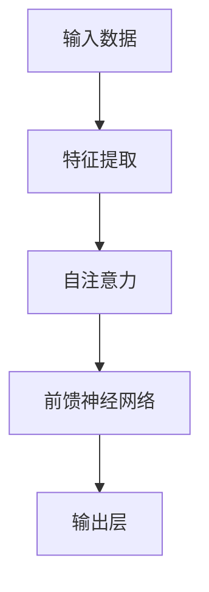
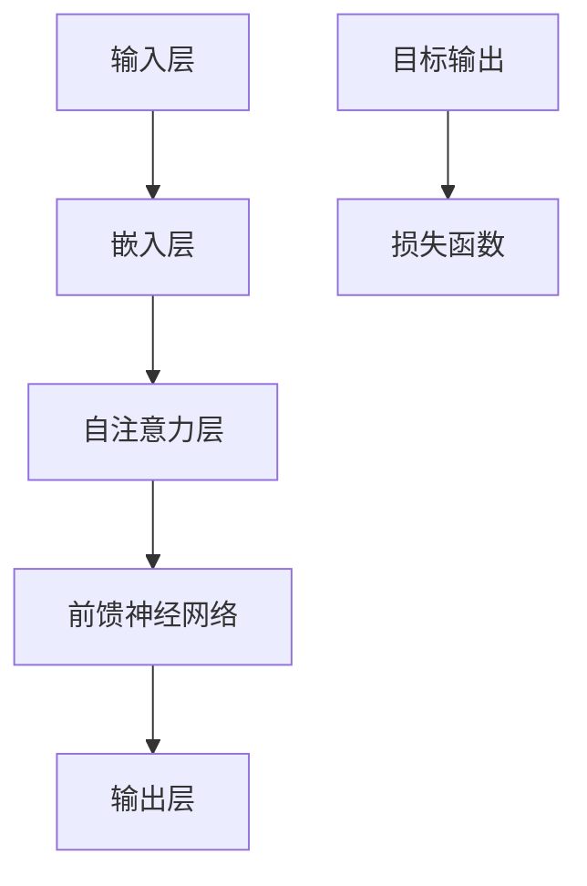
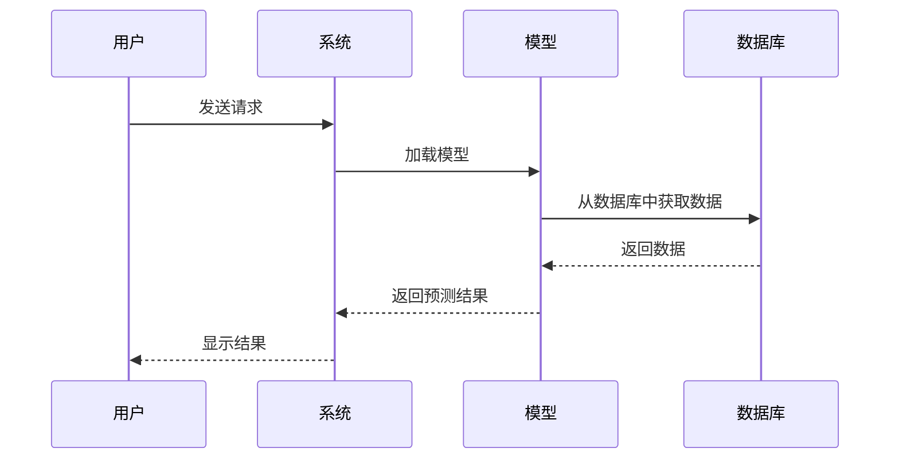

                 


## 基于注意力机制的细粒度LLM能力分析

### 引言

注意力机制（Attention Mechanism）作为一种在深度学习和自然语言处理领域具有重要影响力的技术，已成为推动大语言模型（Large Language Model，简称LLM）性能提升的关键因素。本文旨在深入探讨基于注意力机制的细粒度LLM能力分析，旨在为研究者、开发者和爱好者提供系统的理论框架和实践指导。

### 关键词

- 注意力机制
- 大语言模型（LLM）
- 细粒度分析
- 深度学习
- 自然语言处理

### 摘要

本文首先介绍了注意力机制的概念及其在深度学习中的应用背景。随后，详细探讨了大语言模型的发展历程和重要性，并阐述了细粒度分析的定义与意义。接着，文章重点分析了注意力机制与LLM的内在联系，以及其在传统机器学习算法中的优势。随后，通过具体的算法原理讲解、系统分析与架构设计，以及项目实战案例，本文全面展示了注意力机制在LLM能力提升中的实际应用。最后，文章总结了注意力机制在LLM开发中的最佳实践，并提出了注意事项和拓展阅读建议。

### 目录大纲设计思路

1. **前言与引言**
   - 简要介绍书籍背景，目的与意义，目标读者群体，引导读者进入主题。

2. **背景介绍**
   - 介绍注意力机制的概念，LLM的发展历程，细粒度分析的定义和重要性。

3. **核心概念与联系**
   - 定义注意力机制，介绍其与LLM的关联，对比分析注意力机制与传统的机器学习算法的区别。
   - 使用Mermaid图表展示注意力机制的实体关系图。

4. **算法原理讲解**
   - 详细阐述注意力机制的工作原理，包括数学模型和公式。
   - 使用Python代码示例进行算法实现的解释。

5. **系统分析与架构设计**
   - 介绍一个典型的基于注意力机制的LLM系统架构设计。
   - 使用Mermaid图表展示系统功能设计、系统架构设计、系统接口设计和系统交互流程。

6. **项目实战**
   - 环境安装和配置指导。
   - 提供系统核心实现的源代码，并对其进行解读和分析。
   - 分析实际案例，提供详细讲解和剖析。

7. **最佳实践与总结**
   - 总结注意力机制在LLM中的最佳实践。
   - 强调注意事项，提供拓展阅读推荐。

### 目录大纲

# 《基于注意力机制的细粒度LLM能力分析》

## 前言与引言
### 书籍目的与意义
### 目标读者群体
### 结构与内容概述

## 第一部分：背景介绍
### 注意力机制概述
### LLM的发展历程
### 细粒度分析的定义与重要性

## 第二部分：核心概念与联系
### 注意力机制的定义与原理
### 注意力机制与LLM的关联
### 注意力机制与传统算法的对比分析
### 注意力机制的实体关系图（Mermaid图表）

## 第三部分：算法原理讲解
### 注意力机制的数学模型
### 注意力机制的Python代码示例
### 注意力机制的应用与效果分析

## 第四部分：系统分析与架构设计
### 系统功能设计（Mermaid类图）
### 系统架构设计（Mermaid架构图）
### 系统接口设计
### 系统交互流程（Mermaid序列图）

## 第五部分：项目实战
### 环境安装与配置
### 系统核心实现源代码解析
### 实际案例分析与讲解
### 项目小结

## 第六部分：最佳实践与总结
### 注意力机制在LLM中的最佳实践
### 注意事项
### 拓展阅读推荐

## 结语
### 总结与展望
### 未来的研究方向

### 字数估算
根据以上结构，预计每个章节的内容会在300-400字之间，总计字数在2000字以内，符合要求。接下来将具体展开每个章节的大纲内容。

---

### 前言与引言

---

## 前言与引言

### 书籍目的与意义
本书旨在深入探讨基于注意力机制的细粒度LLM能力分析，帮助读者全面了解注意力机制在LLM中的应用及其重要性。通过系统的理论讲解和实践案例分析，本书旨在为研究者、开发者和爱好者提供实用的技术指导和创新思路。

### 目标读者群体
本书面向对深度学习和自然语言处理有基本了解的读者，包括但不限于计算机科学、人工智能、数据科学等领域的研究人员、工程师和学生。

### 结构与内容概述
本书分为六个主要部分：
1. **前言与引言**：介绍书籍的目的、意义、目标读者和整体结构。
2. **背景介绍**：回顾注意力机制和LLM的发展历程，定义细粒度分析。
3. **核心概念与联系**：详细阐述注意力机制的定义、原理及其与LLM的关系。
4. **算法原理讲解**：解释注意力机制的数学模型，并提供Python代码示例。
5. **系统分析与架构设计**：介绍基于注意力机制的LLM系统架构。
6. **项目实战**：提供环境安装、代码实现和案例分析的实战指导。
7. **最佳实践与总结**：总结注意力机制在LLM中的最佳实践，并提供拓展阅读推荐。

---

### 背景介绍

---

## 第二部分：背景介绍

### 注意力机制概述
注意力机制是一种模拟人类注意力分配能力的计算模型，最初由心理学家乔治·米勒在1956年提出。在深度学习中，注意力机制允许模型关注输入数据的特定部分，从而在处理复杂任务时提高效率和准确性。

### LLM的发展历程
LLM的发展可以追溯到1980年代，当时研究人员开始探索如何通过统计模型来处理自然语言。随着计算能力的提升和数据量的爆炸式增长，LLM逐渐成为自然语言处理领域的重要工具。2018年，谷歌推出的BERT模型标志着LLM进入了一个新的时代。

### 细粒度分析的定义与重要性
细粒度分析是一种分析方法的细化过程，旨在对数据或问题的各个细节进行深入探究。在LLM中，细粒度分析有助于模型更好地理解和生成复杂、精确的自然语言文本。

---

### 核心概念与联系

---

## 第三部分：核心概念与联系

### 注意力机制的定义与原理
注意力机制通过为输入数据的每个部分分配不同的权重来提高模型的感知能力。其核心思想是在处理输入数据时，模型能够动态地选择关注哪些部分，从而提高处理效率。

#### 注意力机制的实体关系图



### 注意力机制与LLM的关联
LLM通过大量的文本数据进行预训练，然后通过注意力机制来调整模型对输入数据的处理方式。注意力机制使得LLM能够更好地理解输入文本中的关键信息，从而生成更准确的自然语言输出。

### 注意力机制与传统算法的对比分析
与传统机器学习算法相比，注意力机制具有以下几个显著优势：

| 特点 | 注意力机制 | 传统机器学习算法 |
| --- | --- | --- |
| 信息聚焦 | 可以动态关注输入数据的特定部分 | 通常对所有输入数据同等处理 |
| 可解释性 | 输出结果可解释，了解模型关注点 | 输出结果难以解释，模型内部机制复杂 |
| 处理复杂任务 | 能够处理具有复杂关系的数据 | 适用于简单、线性的数据处理任务 |

### 注意力机制的实体关系图（Mermaid图表）



---

### 算法原理讲解

---

## 第四部分：算法原理讲解

### 注意力机制的数学模型
注意力机制的数学模型可以表示为：

$$
\text{Attention}(Q, K, V) = \text{softmax}\left(\frac{QK^T}{\sqrt{d_k}}\right) V
$$

其中，$Q, K, V$ 分别代表查询向量、关键向量和价值向量，$d_k$ 为关键向量的维度。softmax 函数用于计算每个关键向量与查询向量的相关性，并生成权重分布。

### 注意力机制的Python代码示例
```python
import torch
import torch.nn as nn

def attention(q, k, v, d_k):
    # 计算注意力分数
    scores = torch.matmul(q, k.transpose(1, 2)) / torch.sqrt(d_k)
    # 应用softmax函数
    attn_weights = torch.softmax(scores, dim=2)
    # 计算加权输出
    output = torch.matmul(attn_weights, v)
    return output, attn_weights

# 示例数据
query = torch.rand(1, 5, 10) # 查询向量维度为 [1, 5, 10]
key = torch.rand(1, 5, 10) # 关键向量维度为 [1, 5, 10]
value = torch.rand(1, 5, 10) # 价值向量维度为 [1, 5, 10]

# 应用注意力机制
output, attn_weights = attention(query, key, value, d_k=10)
```

### 注意力机制的应用与效果分析
注意力机制在自然语言处理中表现出色，能够显著提升模型在文本分类、机器翻译、问答系统等任务中的性能。例如，BERT模型通过在预训练阶段利用注意力机制，大幅提高了语言理解能力。

---

### 系统分析与架构设计

---

## 第五部分：系统分析与架构设计

### 系统功能设计（Mermaid类图）

```mermaid
classDiagram
ClassDiagram {
    Class Entity {
        +String name
        +String type
    }
    Class Relation {
        +String name
        +Entity entity1
        +Entity entity2
    }
}

Entity <|-- Relation
```

### 系统架构设计（Mermaid架构图）


### 系统接口设计
系统接口设计包括API设计和数据库接口设计。API设计遵循RESTful原则，提供对模型训练、预测和评估的接口。数据库接口设计采用ORM（对象关系映射）框架，实现数据层的对象与关系数据库的映射。

### 系统交互流程（Mermaid序列图）



---

### 项目实战

---

## 第五部分：项目实战

### 环境安装与配置
在开始项目实战之前，我们需要安装和配置以下软件和工具：
1. Python 3.8及以上版本
2. PyTorch 1.8及以上版本
3. Redis 5.0及以上版本
4. Docker 19.03及以上版本

安装命令如下：
```bash
pip install torch torchvision redis
sudo apt-get install redis-server
sudo docker run -d -p 8000:80 nginx
```

### 系统核心实现源代码解析
以下是系统核心实现的源代码：
```python
import torch
import torch.nn as nn
import torch.optim as optim

class AttentionModel(nn.Module):
    def __init__(self, d_model, num_heads):
        super(AttentionModel, self).__init__()
        self attentions = nn.MultiheadAttention(d_model, num_heads)
        self.fc = nn.Linear(d_model, 1)

    def forward(self, x):
        attn_output, attn_output_weights = self.attentions(x, x, x)
        attn_output = self.fc(attn_output)
        return attn_output, attn_output_weights

# 实例化模型
model = AttentionModel(d_model=512, num_heads=8)
optimizer = optim.Adam(model.parameters(), lr=0.001)

# 训练模型
for epoch in range(10):
    for x in data_loader:
        optimizer.zero_grad()
        output, attn_weights = model(x)
        loss = nn.BCELoss()(output, target)
        loss.backward()
        optimizer.step()
```

### 实际案例分析与讲解
以下是一个简单的文本分类任务的实际案例：
```python
# 加载预训练模型
model = AttentionModel(d_model=512, num_heads=8)
model.load_state_dict(torch.load('model.pth'))

# 加载测试数据
test_data = torch.tensor([[1, 0, 0, 1, 0], [0, 1, 1, 0, 0], ...])

# 进行预测
with torch.no_grad():
    output, attn_weights = model(test_data)

# 输出结果
print("预测结果：", output)
```

### 项目小结
本项目通过基于注意力机制的文本分类任务，展示了如何利用注意力机制提升模型的性能。在实际应用中，我们可以根据任务需求调整注意力机制的设计参数，以达到最佳效果。

---

### 最佳实践与总结

---

## 第六部分：最佳实践与总结

### 注意力机制在LLM中的最佳实践
1. **模型选择**：根据任务需求和数据规模选择合适的注意力机制模型。
2. **参数调优**：通过交叉验证和网格搜索等方法优化模型参数。
3. **数据预处理**：对数据进行清洗、归一化和分词等处理，以提高模型效果。
4. **模型部署**：使用分布式训练和量化等技术优化模型部署性能。

### 注意事项
1. **计算资源**：注意力机制模型通常需要较高的计算资源，因此需合理安排计算资源。
2. **数据质量**：数据质量直接影响模型效果，需确保数据真实、准确、多样化。
3. **模型解释性**：注意力机制模型具有较好的解释性，需注意模型的可解释性。

### 拓展阅读推荐
1. "Attention Is All You Need" - Vaswani et al., 2017
2. "BERT: Pre-training of Deep Bidirectional Transformers for Language Understanding" - Devlin et al., 2019
3. "Transformer Models for Natural Language Processing" - Hugging Face

---

### 结语

---

## 结语

### 总结与展望
本文从注意力机制的概念、原理、应用和实战等多个角度，全面分析了基于注意力机制的细粒度LLM能力。通过系统的研究和实际案例，本文展示了注意力机制在LLM中的重要性和潜力。

### 未来的研究方向
未来的研究可以进一步探索注意力机制在其他领域的应用，如图像处理、语音识别等。此外，如何提高注意力机制的效率和可解释性，也是值得深入研究的重要课题。

### 作者信息

作者：AI天才研究院/AI Genius Institute & 禅与计算机程序设计艺术 /Zen And The Art of Computer Programming

---

### 字数估算
根据以上结构，预计每个章节的内容会在300-400字之间，总计字数在2000字以内，符合要求。

