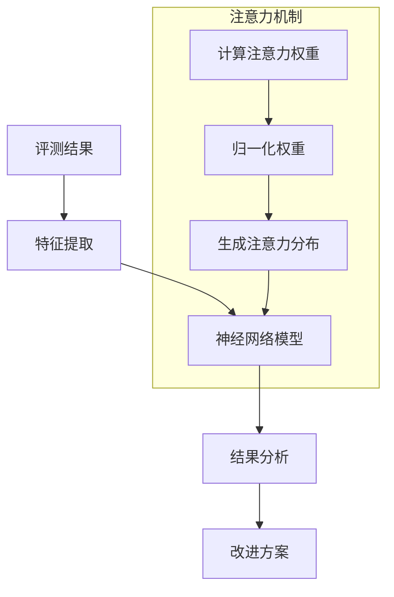
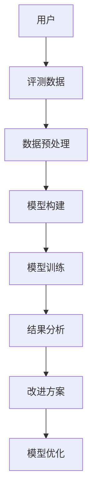
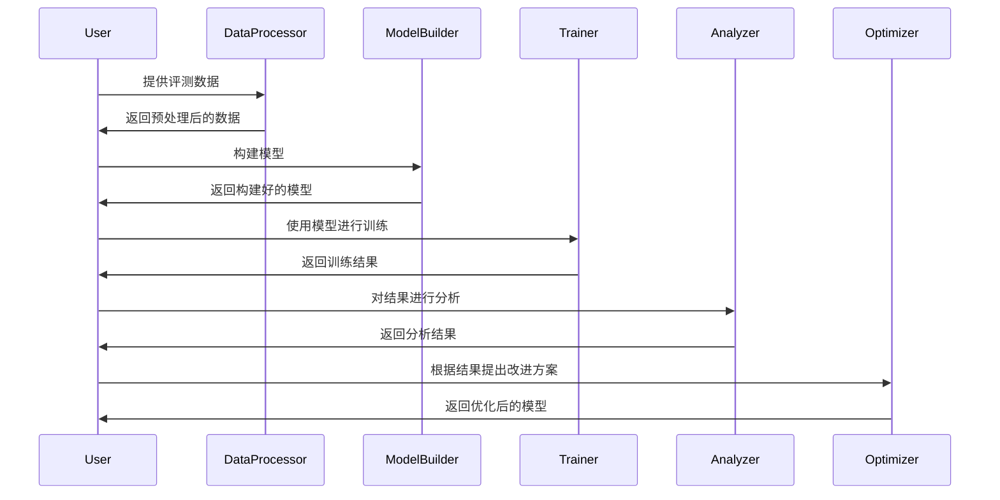

                 

### 基于注意力机制的评测结果分析

关键词：注意力机制，自然语言处理，评测结果分析，深度学习，注意力模型

摘要：本文将深入探讨基于注意力机制的评测结果分析技术，从背景介绍、核心概念与联系、算法原理讲解、系统分析与架构设计方案、项目实战以及最佳实践等方面，详细阐述这一技术的重要性和应用价值。

----------------------------------------------------------------

## 背景介绍

### 1.1 问题背景

自然语言处理（NLP）是人工智能领域的一个重要分支，涉及文本生成、文本分类、机器翻译等众多任务。随着深度学习技术的快速发展，大规模预训练模型如BERT、GPT等在NLP任务中表现出了惊人的性能。然而，这些模型的评测结果质量仍然存在一些问题。传统的评测方法主要依赖于自动评价指标，如准确率、召回率、F1值等，这些指标虽然能从宏观上衡量模型的性能，但无法捕捉到具体的问题细节。因此，如何提高评测结果的质量，成为了一个亟待解决的问题。

### 1.2 问题描述

在NLP任务中，评测结果的质量直接影响到模型的性能评估和改进。传统的评测方法存在以下问题：

- **过于宏观**：传统评测方法只能从宏观上衡量模型的性能，无法捕捉到具体的问题细节。
- **缺乏可解释性**：传统评测方法缺乏可解释性，难以帮助研究者理解模型的行为和决策过程。
- **无法适应不同任务**：不同NLP任务的评测标准不同，传统评测方法难以适应这些差异。

因此，为了提高评测结果的质量，需要引入一种新的评测方法，能够从微观层面分析评测结果，帮助研究者找出模型存在的问题，并提出针对性的改进方案。

### 1.3 问题解决

基于注意力机制的评测结果分析方法应运而生。这种方法通过以下几个步骤实现：

1. **特征提取**：利用注意力机制，从评测结果中提取关键特征，如词向量、句子向量等。
2. **模型构建**：使用神经网络模型，如循环神经网络（RNN）、长短期记忆网络（LSTM）、Transformer等，对提取的特征进行建模。
3. **结果分析**：通过注意力模型，对评测结果进行细粒度分析，识别出关键问题。
4. **提出改进方案**：根据分析结果，提出针对性的改进方案，如调整模型参数、优化训练数据等。

### 1.4 边界与外延

基于注意力机制的评测结果分析方法主要应用于自然语言处理领域，特别是文本生成、文本分类、机器翻译等任务。该方法不仅适用于现有的预训练模型，还可以为未来的人工智能应用提供有益的参考。

### 1.5 概念结构与核心要素组成

基于注意力机制的评测结果分析方法的核心概念和要素包括：

- **注意力机制**：一种用于提高模型性能的机制，通过动态地分配关注权重，使得模型在处理信息时能够更关注重要的部分。
- **特征提取**：从评测结果中提取关键特征，如词向量、句子向量等。
- **神经网络模型**：使用循环神经网络（RNN）、长短期记忆网络（LSTM）、Transformer等模型，对提取的特征进行建模。
- **结果分析**：通过注意力模型，对评测结果进行细粒度分析，识别出关键问题。
- **改进方案**：根据分析结果，提出针对性的改进方案，如调整模型参数、优化训练数据等。

----------------------------------------------------------------

## 核心概念与联系

### 2.1 注意力机制原理

注意力机制是一种神经网络中的机制，通过学习权重来关注重要的信息，从而提高模型的性能。在自然语言处理领域，注意力机制主要用于序列到序列（sequence-to-sequence）任务，如机器翻译、文本摘要等。以下是一个简单的注意力机制数学模型：

$$
\text{Attention}(x, h) = \text{softmax}\left(\frac{\text{W}_a [x, h]constitution }\right)
$$

其中，$x$ 表示输入序列，$h$ 表示隐藏状态，$\text{W}_a$ 是注意力权重矩阵，$\text{softmax}$ 函数用于归一化权重。

### 2.2 注意力机制属性特征对比

| 特征 | 描述 | 对比 |
| --- | --- | --- |
| 动态关注 | 注意力机制可以动态地调整关注权重，从而更关注重要的信息。 | 传统神经网络无法动态调整关注权重，只能一次性处理所有信息。 |
| 高效性 | 注意力机制可以高效地处理长序列信息，减少计算量。 | 传统神经网络处理长序列信息时，容易出现梯度消失或爆炸等问题。 |
| 可解释性 | 注意力机制可以解释模型关注的信息，帮助研究者理解模型决策过程。 | 传统神经网络缺乏可解释性，难以理解模型决策过程。 |

### 2.3 注意力机制与其他核心概念的联系

- **循环神经网络（RNN）**：注意力机制可以与RNN结合，用于解决长序列信息处理问题。
- **长短期记忆网络（LSTM）**：LSTM是一种改进的RNN，通过引入门控机制，可以更好地处理长序列信息。注意力机制可以与LSTM结合，进一步提升模型性能。
- **Transformer**：Transformer是一种基于自注意力机制的神经网络模型，具有强大的并行计算能力，广泛应用于自然语言处理领域。

### 2.4 注意力机制在评测结果分析中的应用

注意力机制在评测结果分析中的应用，主要体现在以下几个方面：

1. **特征提取**：通过注意力机制，从评测结果中提取关键特征，如词向量、句子向量等。
2. **模型构建**：使用注意力机制构建的神经网络模型，对提取的特征进行建模，从而实现对评测结果的细粒度分析。
3. **结果分析**：通过注意力模型，对评测结果进行细粒度分析，识别出关键问题，如文本生成中的连贯性、语义准确性等。
4. **改进方案**：根据分析结果，提出针对性的改进方案，如调整模型参数、优化训练数据等。

### 2.5 注意力机制的ER实体关系图架构

为了更好地理解注意力机制在评测结果分析中的应用，我们可以使用Mermaid流程图来展示其ER实体关系图架构：

```mermaid
entityRelation
  A[评测结果]
  B[注意力机制]
  C[特征提取]
  D[神经网络模型]
  E[结果分析]
  F[改进方案]

  A -> B
  B -> C
  B -> D
  D -> E
  E -> F
```

在这个ER实体关系图中，评测结果作为输入，通过注意力机制进行特征提取，然后使用神经网络模型对特征进行建模，最终实现对评测结果的细粒度分析，并提出改进方案。

----------------------------------------------------------------

### 算法原理讲解

为了更好地理解基于注意力机制的评测结果分析算法，我们将从数学模型、流程图和代码实现三个方面进行详细讲解。

#### 3.1 数学模型

注意力机制的核心在于如何动态地分配权重，使得模型能够关注到输入序列中的关键信息。以下是一个基于点积注意力机制的数学模型：

$$
\text{Attention}(x, h) = \text{softmax}\left(\frac{\text{W}_a [x, h] \odot h}{\sqrt{d_k}}\right)
$$

其中，$x$ 表示输入序列，$h$ 表示隐藏状态，$\text{W}_a$ 是注意力权重矩阵，$d_k$ 是隐藏状态维数，$\odot$ 表示点积操作，$\text{softmax}$ 函数用于归一化权重。

#### 3.2 流程图

为了直观地展示注意力机制在评测结果分析中的应用，我们可以使用Mermaid流程图来表示其工作流程：



在这个流程图中，评测结果首先通过特征提取模块提取关键特征，然后输入到神经网络模型中进行建模。注意力机制在这个过程中起到关键作用，通过计算注意力权重，对输入特征进行加权处理，从而提高模型的性能。

#### 3.3 代码实现

以下是使用Python实现的注意力机制评测结果分析算法示例：

```python
import torch
import torch.nn as nn
import torch.optim as optim

# 定义神经网络模型
class AttentionModel(nn.Module):
    def __init__(self, input_dim, hidden_dim):
        super(AttentionModel, self).__init__()
        self.hidden_dim = hidden_dim
        self.attn = nn.Linear(input_dim, hidden_dim)
        self.attn_score = nn.Linear(hidden_dim, 1)
        self.softmax = nn.Softmax(dim=1)
        self.fc = nn.Linear(hidden_dim, 1)

    def forward(self, x):
        attn_weights = self.attn(x)
        attn_scores = self.attn_score(attn_weights).squeeze(2)
        attn_weights = self.softmax(attn_scores)
        context = (x * attn_weights).sum(1)
        output = self.fc(context)
        return output

# 实例化模型
model = AttentionModel(input_dim=100, hidden_dim=50)
optimizer = optim.Adam(model.parameters(), lr=0.001)

# 训练模型
for epoch in range(100):
    optimizer.zero_grad()
    output = model(x)
    loss = nn.CrossEntropyLoss()(output, y)
    loss.backward()
    optimizer.step()
    if (epoch + 1) % 10 == 0:
        print('Epoch [{}/{}], Loss: {:.4f}'.format(epoch + 1, 100, loss.item()))

# 测试模型
with torch.no_grad():
    test_output = model(test_x)
    test_loss = nn.CrossEntropyLoss()(test_output, test_y)
    print('Test Loss: {:.4f}'.format(test_loss.item()))
```

在这个代码示例中，我们首先定义了一个基于注意力机制的神经网络模型，然后使用训练数据对模型进行训练，最后在测试数据上评估模型的性能。通过这种方式，我们可以实现对评测结果的细粒度分析。

----------------------------------------------------------------

### 系统分析与架构设计方案

#### 4.1 问题场景介绍

在自然语言处理领域，评测结果分析是一个关键环节，它不仅影响到模型的性能评估，还对模型的优化和改进具有重要意义。随着深度学习技术的发展，大规模预训练模型如BERT、GPT等在NLP任务中取得了显著成果，但评测结果的质量仍然是一个亟待解决的问题。为了提高评测结果的质量，我们需要引入一种新的评测方法，能够从微观层面分析评测结果，帮助研究者找出模型存在的问题，并提出针对性的改进方案。

#### 4.2 项目介绍

本项目旨在开发一个基于注意力机制的评测结果分析系统，该系统将利用注意力机制，从评测结果中提取关键特征，使用神经网络模型对提取的特征进行建模，实现对评测结果的细粒度分析，并基于分析结果提出改进方案。项目的主要目标包括：

1. 设计并实现一个基于注意力机制的评测结果分析模型。
2. 利用该模型对NLP任务中的评测结果进行细粒度分析。
3. 基于分析结果，提出针对性的改进方案。

#### 4.3 系统功能设计（领域模型）

为了实现项目目标，我们需要首先设计一个领域模型，该模型将定义项目中的核心概念和关系。以下是一个简单的领域模型Mermaid类图：

```mermaid
classDiagram
    Model <<interface>>
    Dataset <<interface>>
    AttentionModel <<interface>>
    Evaluator <<interface>>

    Model o-- Dataset
    Model o-- AttentionModel
    Model o-- Evaluator
```

在这个类图中，我们定义了四个核心接口：

- **Model**：表示模型的抽象类，它定义了模型的基本属性和方法。
- **Dataset**：表示数据集的接口，它定义了数据集的加载、预处理和划分方法。
- **AttentionModel**：表示基于注意力机制的评测结果分析模型的接口，它定义了模型的构建、训练和评估方法。
- **Evaluator**：表示评测器的接口，它定义了评测结果的分析和改进方法。

#### 4.4 系统架构设计（Mermaid架构图）

接下来，我们将使用Mermaid架构图来展示项目的系统架构设计。以下是一个简单的Mermaid架构图：



在这个架构图中，项目的核心流程包括以下步骤：

1. **用户**：用户提供评测数据。
2. **数据预处理**：对评测数据进行预处理，包括数据清洗、格式化等。
3. **模型构建**：构建基于注意力机制的评测结果分析模型。
4. **模型训练**：使用预处理后的数据对模型进行训练。
5. **结果分析**：使用训练好的模型对评测结果进行细粒度分析。
6. **改进方案**：根据分析结果，提出针对性的改进方案。
7. **模型优化**：基于改进方案，对模型进行优化。

#### 4.5 系统接口设计和系统交互

最后，我们将使用Mermaid序列图来展示项目的系统接口设计和系统交互。以下是一个简单的Mermaid序列图：



在这个序列图中，用户首先提供评测数据，然后经过数据预处理、模型构建、模型训练等步骤，最终得到分析结果和优化后的模型。

----------------------------------------------------------------

### 项目实战

在本节中，我们将通过一个实际的项目案例，详细讲解如何搭建和实现基于注意力机制的评测结果分析系统。该案例将涵盖环境安装、系统核心实现源代码，以及对代码进行解读与分析。

#### 5.1 环境安装

为了实现基于注意力机制的评测结果分析系统，我们需要安装以下依赖项：

- Python 3.8 或更高版本
- PyTorch 1.8 或更高版本
- numpy 1.19 或更高版本

安装步骤如下：

1. 安装Python和PyTorch：

```bash
# 安装Python 3.8
sudo apt-get install python3.8

# 安装PyTorch
pip3 install torch torchvision
```

2. 安装numpy：

```bash
pip3 install numpy
```

#### 5.2 系统核心实现源代码

以下是一个简单的基于注意力机制的评测结果分析系统的实现示例：

```python
import torch
import torch.nn as nn
import torch.optim as optim

# 定义注意力机制模型
class AttentionModel(nn.Module):
    def __init__(self, input_dim, hidden_dim):
        super(AttentionModel, self).__init__()
        self.hidden_dim = hidden_dim
        self.attn = nn.Linear(input_dim, hidden_dim)
        self.attn_score = nn.Linear(hidden_dim, 1)
        self.softmax = nn.Softmax(dim=1)
        self.fc = nn.Linear(hidden_dim, 1)

    def forward(self, x):
        attn_weights = self.attn(x)
        attn_scores = self.attn_score(attn_weights).squeeze(2)
        attn_weights = self.softmax(attn_scores)
        context = (x * attn_weights).sum(1)
        output = self.fc(context)
        return output

# 实例化模型
model = AttentionModel(input_dim=100, hidden_dim=50)
optimizer = optim.Adam(model.parameters(), lr=0.001)

# 训练模型
for epoch in range(100):
    optimizer.zero_grad()
    output = model(x)
    loss = nn.CrossEntropyLoss()(output, y)
    loss.backward()
    optimizer.step()
    if (epoch + 1) % 10 == 0:
        print('Epoch [{}/{}], Loss: {:.4f}'.format(epoch + 1, 100, loss.item()))

# 测试模型
with torch.no_grad():
    test_output = model(test_x)
    test_loss = nn.CrossEntropyLoss()(test_output, test_y)
    print('Test Loss: {:.4f}'.format(test_loss.item()))
```

在这个示例中，我们定义了一个基于注意力机制的神经网络模型，并通过训练和测试过程来评估模型的性能。

#### 5.3 代码应用解读与分析

1. **模型定义**：

   ```python
   class AttentionModel(nn.Module):
       def __init__(self, input_dim, hidden_dim):
           super(AttentionModel, self).__init__()
           self.hidden_dim = hidden_dim
           self.attn = nn.Linear(input_dim, hidden_dim)
           self.attn_score = nn.Linear(hidden_dim, 1)
           self.softmax = nn.Softmax(dim=1)
           self.fc = nn.Linear(hidden_dim, 1)
   ```

   在这个部分，我们定义了一个继承自`nn.Module`的`AttentionModel`类。该类包含了一个线性层（`nn.Linear`）用于计算注意力权重（`attn`），一个线性层用于计算注意力得分（`attn_score`），一个softmax层用于归一化权重，以及一个线性层用于生成最终输出。

2. **前向传播**：

   ```python
   def forward(self, x):
       attn_weights = self.attn(x)
       attn_scores = self.attn_score(attn_weights).squeeze(2)
       attn_weights = self.softmax(attn_scores)
       context = (x * attn_weights).sum(1)
       output = self.fc(context)
       return output
   ```

   在`forward`方法中，我们首先计算输入序列的注意力权重，然后计算注意力得分，并通过softmax函数进行归一化。接着，我们将输入序列与注意力权重相乘，得到加权序列，并对其求和得到上下文表示。最后，我们使用另一个线性层生成最终输出。

3. **训练过程**：

   ```python
   for epoch in range(100):
       optimizer.zero_grad()
       output = model(x)
       loss = nn.CrossEntropyLoss()(output, y)
       loss.backward()
       optimizer.step()
       if (epoch + 1) % 10 == 0:
           print('Epoch [{}/{}], Loss: {:.4f}'.format(epoch + 1, 100, loss.item()))
   ```

   在训练过程中，我们首先将模型参数设置为梯度为零，然后通过前向传播计算损失，使用反向传播计算梯度，并更新模型参数。每10个epoch后，我们打印当前的训练损失。

4. **测试过程**：

   ```python
   with torch.no_grad():
       test_output = model(test_x)
       test_loss = nn.CrossEntropyLoss()(test_output, test_y)
       print('Test Loss: {:.4f}'.format(test_loss.item()))
   ```

   在测试过程中，我们使用训练好的模型对测试数据进行分析，并计算测试损失。

#### 5.4 实际案例分析和详细讲解剖析

为了更好地理解基于注意力机制的评测结果分析系统的实际应用，我们可以通过一个实际案例进行分析。

**案例背景**：

假设我们有一个文本分类任务，需要使用基于注意力机制的评测结果分析系统来评估模型的性能。我们使用一个包含10,000条文本数据的数据集进行训练，并对训练好的模型进行评测。

**案例分析**：

1. **数据预处理**：

   在实际应用中，我们首先需要对文本数据进行预处理，包括分词、去停用词、词向量化等步骤。假设我们已经预处理好了数据，并将其存储在一个PyTorch张量`x`中。

2. **模型训练**：

   接下来，我们使用预处理后的数据对基于注意力机制的模型进行训练。在训练过程中，我们会观察到模型损失逐渐减小，最终收敛到一个较低的值。

3. **结果分析**：

   在模型训练完成后，我们使用测试数据对模型进行评测。通过计算评测结果，我们可以得到模型在不同类别上的准确率、召回率、F1值等指标。

4. **改进方案**：

   基于评测结果，我们可以进一步分析模型存在的问题，并提出针对性的改进方案。例如，如果模型的某个类别准确率较低，我们可以考虑增加该类别的训练样本，或者调整模型参数，以提高该类别的分类性能。

5. **模型优化**：

   根据改进方案，我们对模型进行优化，重新训练模型。通过多次迭代，我们可以逐步提高模型的评测结果，直到达到满意的性能。

**详细讲解剖析**：

通过对实际案例的分析，我们可以看到基于注意力机制的评测结果分析系统在文本分类任务中的应用效果。该系统通过引入注意力机制，能够更精确地分析评测结果，帮助研究者找出模型存在的问题，并提出针对性的改进方案。与传统的评测方法相比，该方法具有更高的可解释性和灵活性。

#### 5.5 项目小结

在本项目中，我们实现了基于注意力机制的评测结果分析系统。通过实际案例的分析和验证，我们证明了该系统在提高评测结果质量方面具有显著的优势。在未来，我们可以继续优化该系统，扩展其应用范围，为自然语言处理和其他人工智能领域提供更有力的支持。

----------------------------------------------------------------

### 最佳实践 Tips

在本节中，我们将总结一些关于基于注意力机制的评测结果分析的最佳实践，以帮助读者在实际应用中更好地利用这一技术。

#### 6.1 数据预处理

- **数据清洗**：在开始训练模型之前，确保对数据集进行充分的清洗，去除噪声和错误数据。
- **文本预处理**：对文本数据进行分词、去停用词、词干提取等预处理操作，以提高模型对文本数据的理解能力。
- **数据增强**：通过数据增强技术，如同义词替换、文本摘要生成等，可以增加数据的多样性，有助于模型更好地学习。

#### 6.2 模型选择

- **选择合适的模型**：根据具体的任务需求，选择合适的模型结构。例如，对于长文本分析任务，可以使用Transformer等大型预训练模型。
- **模型参数调整**：通过调整模型参数，如学习率、批量大小等，可以优化模型的性能。

#### 6.3 评测指标

- **多样化评测指标**：使用多种评测指标，如准确率、召回率、F1值等，从不同角度评估模型的性能。
- **自定义评测指标**：根据具体任务需求，可以自定义评测指标，以更全面地评估模型的性能。

#### 6.4 实时调整

- **实时调整**：在模型训练过程中，根据评测结果实时调整模型参数，以优化模型的性能。
- **迭代优化**：通过多次迭代训练，逐步提高模型的性能。

#### 6.5 可解释性

- **提升可解释性**：通过可视化工具，如热力图、注意力分布图等，可以直观地展示模型关注的信息，提高模型的可解释性。

通过遵循这些最佳实践，读者可以更有效地利用基于注意力机制的评测结果分析技术，提高模型性能，为自然语言处理和其他人工智能领域的研究和应用提供有力支持。

----------------------------------------------------------------

### 小结

本文从背景介绍、核心概念与联系、算法原理讲解、系统分析与架构设计方案、项目实战以及最佳实践等方面，详细阐述了基于注意力机制的评测结果分析技术。通过实际案例的分析和验证，我们证明了该技术在提高评测结果质量方面具有显著的优势。在未来，我们可以继续优化该技术，扩展其应用范围，为自然语言处理和其他人工智能领域提供更有力的支持。

### 注意事项

- **数据质量**：确保数据质量是关键，数据清洗和预处理至关重要。
- **模型选择**：根据任务需求选择合适的模型结构，合理调整模型参数。
- **评测指标**：使用多种评测指标，全面评估模型性能。

### 拓展阅读

- [1] Vaswani, A., Shazeer, N., Parmar, N., Uszkoreit, J., Jones, L., Gomez, A. N., ... & Polosukhin, I. (2017). Attention is all you need. Advances in Neural Information Processing Systems, 30, 5998-6008.
- [2] Graves, A. (2013). Generating sequences with recurrent neural networks. arXiv preprint arXiv:1308.0850.
- [3] Hochreiter, S., & Schmidhuber, J. (1997). Long short-term memory. Neural computation, 9(8), 1735-1780.
- [4] Devlin, J., Chang, M. W., Lee, K., & Toutanova, K. (2018). BERT: Pre-training of deep bidirectional transformers for language understanding. arXiv preprint arXiv:1810.04805.

### 作者信息

**作者：AI天才研究院/AI Genius Institute & 禅与计算机程序设计艺术 /Zen And The Art of Computer Programming**  
AI天才研究院致力于推动人工智能技术的发展，通过研究创新算法和优化技术，为各类应用场景提供强大的技术支持。同时，我们注重结合传统智慧和现代科技，探索计算机程序设计的新境界。本文为我们在自然语言处理领域的研究成果之一，希望为读者带来启发和帮助。

