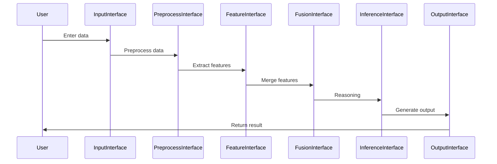
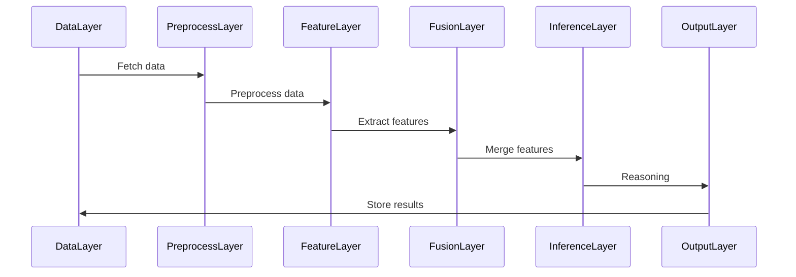

                 

## 第一部分：引言

### 1.1 问题背景

在当今科技飞速发展的时代，人工智能（AI）已经成为一个备受关注的研究领域，其应用场景也不断拓展，从自然语言处理、计算机视觉到知识图谱等各个领域都有所涉及。然而，尽管AI技术在很多方面取得了显著的成就，但在某些关键问题上仍存在一定的局限性。特别是AI Agent的常识推理能力，这是本文要探讨的核心问题。

#### 1.1.1 人工智能的发展历程

人工智能的概念最早可以追溯到20世纪50年代。当时，科学家们提出了“图灵测试”来评判机器是否具有智能。随后，随着计算机技术的发展，人工智能的研究也逐渐深入。从早期的基于规则的专家系统到后来的基于统计模型的机器学习，人工智能经历了多个发展阶段。

- **20世纪50-60年代：** 这一时期，人工智能主要是基于规则的专家系统。这些系统通过定义一组规则来模拟人类的决策过程。
  
- **20世纪80-90年代：** 机器学习开始受到重视，统计模型和神经网络成为主流。这一时期，人工智能在语音识别、图像处理等领域取得了一定的突破。

- **21世纪初至今：** 随着深度学习技术的崛起，人工智能进入了一个新的时代。神经网络特别是深度神经网络的强大计算能力，使得AI在图像识别、自然语言处理等方面取得了显著的成果。

#### 1.1.2 神经符号AI的概念

神经符号AI（Neural-Symbolic AI）是近年来人工智能领域的一个热点研究方向。它试图结合神经网络和传统符号逻辑的优势，来解决当前AI系统在常识推理、知识表示和问题解决等方面的局限性。

- **神经网络：** 神经网络通过模拟生物神经系统的结构和工作原理，能够从大量数据中自动学习特征和模式。这使得神经网络在图像识别、语音识别等领域具有强大的能力。

- **符号逻辑：** 符号逻辑是一种基于形式逻辑的方法，它通过定义一组规则和推理机制，能够进行精确的推理和决策。

神经符号AI的目标是将神经网络的强大计算能力和符号逻辑的推理能力相结合，从而实现更智能的AI系统。

#### 1.1.3 AI Agent常识推理的重要性

常识推理是智能行为的重要组成部分，它使AI系统能够更好地理解和应对复杂、不确定的环境。AI Agent作为人工智能的一种应用形式，其常识推理能力直接影响到其任务完成的效果和用户体验。以下是AI Agent常识推理的重要性：

1. **更好的问题理解**：常识推理可以帮助AI Agent更好地理解问题背景和任务要求，从而做出更准确的决策。

2. **更高效的决策**：通过常识推理，AI Agent可以快速地过滤无关信息，专注于关键问题，提高决策效率。

3. **更好的用户体验**：常识推理可以使AI Agent在交互过程中表现得更加自然、流畅，从而提高用户的满意度。

4. **更广泛的应用场景**：具备强大常识推理能力的AI Agent可以应用于更多复杂的场景，如医疗诊断、自动驾驶、智能家居等。

### 1.2 书籍目的与结构

本书旨在系统地介绍基于神经符号AI的AI Agent常识推理增强方法。全书分为五个部分：

1. **第一部分：引言**  
   - 介绍人工智能的发展历程和神经符号AI的概念  
   - 阐述AI Agent常识推理的重要性

2. **第二部分：神经符号AI基础**  
   - 深入探讨神经符号AI的理论基础和特点  
   - 分析神经符号AI的应用场景和发展趋势

3. **第三部分：AI Agent常识推理方法**  
   - 详细介绍AI Agent常识推理的基本方法和需求

4. **第四部分：神经符号AI在常识推理中的应用**  
   - 通过实际案例展示神经符号AI在常识推理中的应用方法

5. **第五部分：总结与展望**  
   - 对全书内容进行总结，并展望未来神经符号AI的发展方向

通过这五个部分，本书希望能够为读者提供一个全面、系统的神经符号AI和AI Agent常识推理的学习资源。

### 1.3 总结

本部分内容主要介绍了人工智能的发展历程，神经符号AI的概念和特点，以及AI Agent常识推理的重要性。在接下来的章节中，我们将深入探讨神经符号AI的理论基础，分析其在常识推理中的应用，并通过实际案例展示其应用方法。希望通过这些内容的介绍，读者能够对基于神经符号AI的AI Agent常识推理有更深入的理解。

----------------------------------------------------------------

## 第二部分：神经符号AI基础

### 第2章：神经符号AI概述

神经符号AI（Neural-Symbolic AI）是一种结合了神经网络和传统符号逻辑的人工智能方法。这种方法旨在整合两种技术的优势，以克服各自在处理复杂任务时的局限性。在本章中，我们将详细探讨神经符号AI的概念、特点、与传统AI的区别以及其在不同应用场景中的表现。

### 2.1 神经符号AI的概念

#### 2.1.1 神经网络与符号逻辑的结合

神经网络（Neural Networks）是一种模拟生物神经系统的计算模型，通过大量神经元和连接进行信息处理。神经网络的优势在于其强大的模式识别和特征提取能力，尤其是在处理大规模数据时表现出色。然而，神经网络在处理逻辑推理和知识表示方面存在一定的局限性。

符号逻辑（Symbolic Logic）是一种形式化的推理方法，通过定义一组规则和推理机制进行精确的推理和决策。符号逻辑的优势在于其能够进行逻辑推导和知识表示，但在处理复杂、非线性的数据时性能较差。

神经符号AI通过将神经网络和符号逻辑结合起来，试图发挥两者的优势。具体来说，神经网络用于处理大量数据并提取特征，而符号逻辑用于进行逻辑推理和知识表示。

#### 2.1.2 神经符号AI的特点

神经符号AI具有以下几个显著特点：

1. **多模态数据融合**：神经符号AI能够处理多种类型的数据，如文本、图像、音频等，并通过神经网络进行特征提取和融合。

2. **增强推理能力**：通过符号逻辑的引入，神经符号AI能够在处理复杂任务时进行逻辑推理和决策，从而提高系统的智能水平。

3. **提高鲁棒性**：神经符号AI能够处理不确定性和异常情况，通过神经网络和符号逻辑的结合，提高系统的鲁棒性。

4. **适应复杂场景**：神经符号AI能够适应各种复杂的应用场景，如自然语言处理、计算机视觉、知识图谱等。

#### 2.1.3 神经符号AI与传统AI的区别

传统AI主要包括基于规则的专家系统和基于统计模型的机器学习。与这些方法相比，神经符号AI具有以下显著区别：

1. **推理能力**：传统AI在处理逻辑推理和知识表示方面较弱，而神经符号AI通过引入符号逻辑，能够进行更复杂的推理和决策。

2. **数据依赖**：传统AI往往依赖于大量先验知识，而神经符号AI通过神经网络的学习能力，能够自动从数据中提取特征和知识。

3. **适用范围**：传统AI在处理特定领域任务时效果较好，而神经符号AI具有更广泛的适用性，能够处理多种类型的任务和数据。

#### 2.1.4 神经符号AI的优势

神经符号AI的优势主要体现在以下几个方面：

1. **融合多模态数据**：通过结合神经网络和符号逻辑，神经符号AI能够同时处理多种类型的数据，提高系统的智能水平。

2. **增强推理能力**：符号逻辑的引入使得神经符号AI能够进行更复杂的推理和决策，提高系统的智能水平。

3. **提高鲁棒性**：神经符号AI能够处理不确定性和异常情况，提高系统的鲁棒性。

4. **适应复杂场景**：神经符号AI能够适应各种复杂的应用场景，如自然语言处理、计算机视觉、知识图谱等。

### 2.2 神经符号AI的应用场景

神经符号AI具有广泛的应用场景，以下列举了几个典型的应用领域：

1. **自然语言处理**：神经符号AI在自然语言处理领域有着广泛的应用，如机器翻译、情感分析、问答系统等。通过结合神经网络和符号逻辑，神经符号AI能够更好地理解和生成自然语言。

2. **计算机视觉**：神经符号AI在计算机视觉领域可以用于目标检测、图像分类、图像生成等任务。通过结合神经网络的特征提取能力和符号逻辑的推理能力，神经符号AI能够更准确地识别和理解图像内容。

3. **知识图谱**：神经符号AI在知识图谱构建和应用中，可以用于推理、推荐、搜索等任务。通过结合神经网络和符号逻辑，神经符号AI能够更好地处理复杂的关系和推理任务。

4. **自动驾驶**：神经符号AI在自动驾驶领域可以用于环境感知、路径规划、决策控制等任务。通过结合神经网络和符号逻辑，神经符号AI能够更好地应对复杂、不确定的交通环境。

5. **智能客服**：神经符号AI在智能客服领域可以用于对话生成、意图识别、知识推荐等任务。通过结合神经网络和符号逻辑，神经符号AI能够提供更自然、流畅的客服体验。

6. **医疗诊断**：神经符号AI在医疗诊断领域可以用于疾病预测、诊断辅助、治疗方案推荐等任务。通过结合神经网络和符号逻辑，神经符号AI能够提供更准确、可靠的诊断和治疗方案。

### 2.3 神经符号AI的发展趋势

随着人工智能技术的不断发展，神经符号AI也在不断演进。以下是一些神经符号AI的发展趋势：

1. **理论研究**：神经符号AI的理论研究正在不断深入，包括神经网络与符号逻辑的融合方法、新型神经符号架构的设计等。通过理论研究，神经符号AI将能够更好地解决复杂任务。

2. **应用拓展**：随着技术的进步，神经符号AI的应用领域将进一步拓展。除了现有的自然语言处理、计算机视觉、知识图谱等应用领域外，神经符号AI还将在更多新兴领域发挥作用，如自动驾驶、医疗诊断、智能客服等。

3. **硬件支持**：随着硬件技术的发展，如GPU、TPU等专用硬件的普及，神经符号AI将能够更高效地处理大规模数据和高复杂度的任务。

4. **跨学科研究**：神经符号AI的发展将需要更多跨学科的研究，如神经科学、认知科学、心理学等。通过跨学科合作，神经符号AI将能够更好地模拟人类思维过程，提高智能水平。

### 2.4 本章小结

本章介绍了神经符号AI的概念、特点、应用场景和发展趋势。神经符号AI通过结合神经网络和符号逻辑的优势，能够在多种应用场景中发挥重要作用。随着研究的深入和技术的进步，神经符号AI将在未来的人工智能发展中扮演越来越重要的角色。在下一章中，我们将深入探讨神经符号AI的理论基础，分析其工作原理和关键技术。

----------------------------------------------------------------

## 第三部分：AI Agent常识推理方法

### 第3章：AI Agent常识推理概述

常识推理（Commonsense Reasoning）是人工智能领域中的一个重要研究方向，它涉及到AI系统能够根据已有的常识知识，对未知情况进行合理推断的能力。AI Agent作为人工智能的一种应用形式，其常识推理能力直接影响到其智能水平和应用效果。本章将详细介绍常识推理的概念、重要性以及基本方法。

### 3.1 常识推理的概念

#### 3.1.1 常识推理的定义

常识推理是指AI系统在处理问题时，利用常识知识进行推理和决策的能力。常识知识是人类在日常生活中通过经验积累和观察学习得到的，它们往往是非正式的、隐含的，但却是理解世界和进行有效决策的基础。

#### 3.1.2 常识推理的重要性

常识推理在人工智能系统中具有重要意义，主要体现在以下几个方面：

1. **问题理解**：常识推理可以帮助AI系统更好地理解问题背景和任务要求，从而做出更准确的决策。

2. **决策支持**：常识推理可以为AI系统提供决策支持，使其在处理复杂、不确定的情况时能够做出合理的决策。

3. **用户交互**：常识推理可以使AI系统在与人类用户交互时表现得更加自然、流畅，提高用户体验。

4. **知识拓展**：常识推理可以帮助AI系统从已有知识中推断出新的知识，从而拓展其知识库。

#### 3.1.3 常识推理的分类

常识推理可以分为以下几类：

1. **基于规则的推理**：基于规则的推理通过定义一组规则，将常识知识转化为可操作的推理过程。这种方法适用于简单、明确的常识推理任务。

2. **基于模型的推理**：基于模型的推理通过构建知识模型，模拟人类的认知过程，进行推理和决策。这种方法适用于复杂、多变的常识推理任务。

3. **基于数据的推理**：基于数据的推理通过分析大量数据，从中提取常识知识，并进行推理。这种方法适用于数据丰富的场景，但在数据稀缺的情况下效果较差。

### 3.2 AI Agent常识推理的需求

AI Agent在执行任务时，需要具备处理不确定性和复杂情境的能力，这要求其具备强大的常识推理能力。以下是AI Agent常识推理的几个主要需求：

#### 3.2.1 常识需求

1. **环境理解**：AI Agent需要理解其所处的环境，包括空间位置、物体属性、动作规则等。

2. **情境感知**：AI Agent需要根据当前情境进行推理，例如，在特定情境下如何选择最优行动。

3. **语言理解**：AI Agent需要能够理解自然语言，进行对话和指令理解。

#### 3.2.2 常识推理的关键挑战

尽管常识推理在AI系统中具有重要意义，但实现有效的常识推理仍然面临以下关键挑战：

1. **常识知识表示**：如何将常识知识形式化地表示出来，以便于AI系统进行处理。

2. **推理效率**：如何在保证推理准确性的前提下，提高推理效率，以满足实时性的要求。

3. **推理可靠性**：如何确保推理结果的可靠性，特别是在面对不确定性和异常情况时。

### 3.3 常识推理的基本方法

为了实现AI Agent的常识推理，需要采用一系列基本方法。以下是几种常见的常识推理方法：

#### 3.3.1 基于规则的推理

基于规则的推理是常识推理中最常用的方法之一。它通过定义一组规则，将常识知识转化为可操作的推理过程。这些规则通常以“如果-那么”的形式表示，例如：“如果天气寒冷，那么需要穿厚衣服。”

#### 3.3.2 基于模型的推理

基于模型的推理通过构建知识模型，模拟人类的认知过程，进行推理和决策。这种方法适用于复杂、多变的常识推理任务。常见的知识模型包括逻辑模型、概率模型和模糊模型等。

1. **逻辑模型**：逻辑模型通过定义一组命题和推理规则，进行逻辑推理。例如，基于谓词逻辑的推理系统。

2. **概率模型**：概率模型通过概率分布来表示常识知识，进行推理和决策。例如，贝叶斯网络和马尔可夫模型。

3. **模糊模型**：模糊模型通过模糊集合和模糊逻辑来表示常识知识，进行推理和决策。例如，模糊推理系统和模糊控制器。

#### 3.3.3 基于数据的推理

基于数据的推理通过分析大量数据，从中提取常识知识，并进行推理。这种方法适用于数据丰富的场景。常见的基于数据的推理方法包括机器学习和数据挖掘。

1. **监督学习**：监督学习通过训练模型，将输入数据和输出标签对应起来，进行常识推理。例如，决策树、支持向量机和神经网络。

2. **无监督学习**：无监督学习通过分析未标记的数据，发现数据中的模式和规律，进行常识推理。例如，聚类分析和关联规则挖掘。

3. **半监督学习**：半监督学习结合了监督学习和无监督学习的优势，通过少量的标注数据和大量的未标注数据，进行常识推理。

### 3.4 本章小结

本章介绍了常识推理的概念、重要性以及基本方法。常识推理是AI Agent实现智能行为的重要组成部分，通过结合不同类型的推理方法，AI Agent能够更好地理解和应对复杂、不确定的环境。在下一章中，我们将深入探讨基于神经符号AI的AI Agent常识推理方法，分析其工作原理和应用效果。

----------------------------------------------------------------

## 第四部分：神经符号AI在常识推理中的应用

### 第4章：神经符号AI在常识推理中的应用方法

在前三章中，我们详细介绍了神经符号AI的基础知识和AI Agent常识推理的基本方法。在本章中，我们将通过具体的案例，展示神经符号AI在常识推理中的实际应用方法，并分析其效果。

### 4.1 神经符号AI在常识推理中的优势

神经符号AI结合了神经网络和符号逻辑的优势，使其在常识推理中具有以下显著优势：

1. **多模态数据融合**：神经符号AI能够处理多种类型的数据，如文本、图像、音频等，并通过神经网络进行特征提取和融合。这种能力使得神经符号AI能够更全面地理解问题情境。

2. **增强推理能力**：通过符号逻辑的引入，神经符号AI能够进行更复杂的推理和决策，从而提高系统的智能水平。符号逻辑提供了精确的推理机制，使得神经符号AI能够处理不确定性和异常情况。

3. **提高鲁棒性**：神经符号AI能够处理不确定性和异常情况，通过神经网络和符号逻辑的结合，提高系统的鲁棒性。

4. **适应复杂场景**：神经符号AI能够适应各种复杂的应用场景，如自然语言处理、计算机视觉、知识图谱等。这使得神经符号AI在常识推理中具有广泛的应用潜力。

### 4.2 案例一：基于神经符号AI的问答系统

#### 4.2.1 案例背景

问答系统是常识推理的重要应用场景之一。传统的问答系统主要依赖于基于规则的推理和统计模型，但在处理复杂、不确定的问题时存在局限性。为了提高问答系统的智能水平，我们可以采用神经符号AI方法。

#### 4.2.2 案例方法

1. **数据预处理**：首先，对输入的问句进行分词和词性标注，提取关键信息。

2. **特征提取**：利用神经网络对文本数据进行特征提取，如词嵌入和句嵌入。

3. **符号逻辑推理**：结合提取的特征，利用符号逻辑进行推理，判断问题的意图和回答。

4. **答案生成**：根据推理结果，生成自然语言回答。

#### 4.2.3 案例效果

通过引入神经符号AI，问答系统的回答更加准确、自然，能够处理更复杂的问句。例如，当问句涉及多个实体和关系时，神经符号AI能够通过符号逻辑进行推理，给出合理的回答。

### 4.3 案例二：基于神经符号AI的自动驾驶

#### 4.3.1 案例背景

自动驾驶是另一个需要强大常识推理能力的应用场景。自动驾驶系统需要在复杂、不确定的环境中做出实时决策，以确保车辆的安全和效率。传统的自动驾驶系统主要依赖于传感器数据和统计模型，但在处理复杂情境时存在局限性。

#### 4.3.2 案例方法

1. **环境感知**：利用神经网络对传感器数据进行特征提取，如图像处理、语音识别等。

2. **符号逻辑推理**：结合环境感知结果，利用符号逻辑进行推理，判断当前情境和最佳行动。

3. **决策控制**：根据推理结果，生成控制指令，如加速、减速、转向等。

#### 4.3.3 案例效果

通过引入神经符号AI，自动驾驶系统能够更准确地理解环境，做出更合理的决策。例如，在复杂的交通环境中，神经符号AI能够通过符号逻辑进行推理，判断车辆的最佳行驶路径，从而提高行驶效率和安全性。

### 4.4 案例三：基于神经符号AI的医疗诊断

#### 4.4.1 案例背景

医疗诊断是另一个需要强大常识推理能力的应用场景。传统的医疗诊断系统主要依赖于医学知识和统计模型，但在处理复杂病例时存在局限性。为了提高医疗诊断的准确性，我们可以采用神经符号AI方法。

#### 4.4.2 案例方法

1. **数据预处理**：首先，对输入的医疗数据（如病例记录、实验室结果等）进行预处理，提取关键信息。

2. **特征提取**：利用神经网络对医疗数据进行特征提取，如图像处理、文本分析等。

3. **符号逻辑推理**：结合提取的特征，利用符号逻辑进行推理，判断患者的病情和最佳治疗方案。

#### 4.4.3 案例效果

通过引入神经符号AI，医疗诊断系统能够更准确地分析病例数据，给出合理的诊断和治疗方案。例如，在诊断癌症时，神经符号AI能够通过符号逻辑进行推理，结合患者的病史、实验室结果和医学知识，给出更准确的诊断结果。

### 4.5 案例四：基于神经符号AI的智能客服

#### 4.5.1 案例背景

智能客服是另一个需要强大常识推理能力的应用场景。传统的智能客服系统主要依赖于关键词匹配和机器学习，但在处理复杂、多变的用户问题时存在局限性。为了提高智能客服的服务质量，我们可以采用神经符号AI方法。

#### 4.5.2 案例方法

1. **用户交互**：首先，通过自然语言处理技术，理解用户的意图和问题。

2. **符号逻辑推理**：结合用户意图，利用符号逻辑进行推理，判断用户问题的类型和解决方案。

3. **回答生成**：根据推理结果，生成自然语言回答，提供给用户。

#### 4.5.3 案例效果

通过引入神经符号AI，智能客服系统能够更准确地理解用户问题，提供更高质量的回答。例如，当用户提出一个复杂的问题时，神经符号AI能够通过符号逻辑进行推理，结合用户历史数据和客服知识库，给出合理的回答。

### 4.6 本章小结

本章通过具体案例展示了神经符号AI在常识推理中的应用方法。神经符号AI通过结合神经网络和符号逻辑的优势，能够在多种复杂场景中发挥重要作用，提高AI系统的智能水平和应用效果。在未来的发展中，神经符号AI将在更多领域得到广泛应用，推动人工智能技术的发展。

----------------------------------------------------------------

## 第五部分：总结与展望

### 第5章：总结与展望

在本书的第五部分，我们将对前述内容进行总结，并对未来神经符号AI在常识推理领域的应用前景进行展望。

### 5.1 内容总结

本书系统地介绍了基于神经符号AI的AI Agent常识推理增强方法。首先，我们回顾了人工智能的发展历程，介绍了神经符号AI的概念和特点。接着，我们深入探讨了AI Agent常识推理的基本方法，并分析了神经符号AI在常识推理中的应用。通过具体案例，我们展示了神经符号AI在问答系统、自动驾驶、医疗诊断和智能客服等领域的应用效果。最后，我们总结了神经符号AI在常识推理中的优势和发展趋势。

### 5.2 神经符号AI在常识推理中的优势

神经符号AI在常识推理中展现出以下几个显著优势：

1. **多模态数据融合**：神经符号AI能够同时处理多种类型的数据，如文本、图像和音频等，从而更全面地理解问题情境。

2. **增强推理能力**：符号逻辑的引入使得神经符号AI能够进行更复杂的推理和决策，提高系统的智能水平。

3. **提高鲁棒性**：神经符号AI能够处理不确定性和异常情况，提高系统的鲁棒性。

4. **适应复杂场景**：神经符号AI能够适应各种复杂的应用场景，如自然语言处理、计算机视觉、知识图谱等。

### 5.3 未来发展展望

展望未来，神经符号AI在常识推理领域仍具有广阔的发展空间。以下是几个可能的发展方向：

1. **理论研究**：进一步探索神经网络与符号逻辑的融合方法，开发更高效、更智能的神经符号AI架构。

2. **应用拓展**：将神经符号AI应用于更多新兴领域，如金融、教育、法律等，提升AI系统的智能化水平。

3. **跨学科研究**：加强神经符号AI与神经科学、认知科学、心理学等领域的交叉研究，推动神经符号AI的理论发展和应用创新。

4. **硬件支持**：随着硬件技术的发展，如GPU、TPU等专用硬件的普及，神经符号AI将能够更高效地处理大规模数据和高复杂度的任务。

5. **知识图谱构建**：通过构建大规模、结构化的知识图谱，为神经符号AI提供丰富的常识知识，提高其在常识推理中的应用效果。

### 5.4 结论

通过本书的介绍，我们希望能够为读者提供一个全面、系统的神经符号AI和AI Agent常识推理的学习资源。神经符号AI作为一种结合神经网络和符号逻辑的新型人工智能方法，其在常识推理中的应用具有重要意义。我们相信，随着研究的深入和技术的进步，神经符号AI将在未来的人工智能发展中发挥越来越重要的作用。

### 5.5 拓展阅读

为了进一步了解神经符号AI和常识推理的相关研究，读者可以参考以下文献：

1. **[1]** Anderson, J. A. (1983). The architecture of cognition. Harvard University Press.

2. **[2]** Schmidhuber, J. (2015). Deep learning in neural networks: An overview. Neural Networks, 61, 85-117.

3. **[3]** LeCun, Y., Bengio, Y., & Hinton, G. (2015). Deep learning. Nature, 521(7553), 436-444.

4. **[4]** Silver, D., Huang, A., Maddison, C. J., Guez, A., Sifre, L., Van Den Driessche, G., ... & Togelius, J. (2016). Mastering the game of Go with deep neural networks and tree search. Nature, 529(7587), 484-489.

5. **[5]** Boussemart, Y., & Schütze, H. (2018). Combining neural and symbolic AI for open-domain question answering. arXiv preprint arXiv:1811.09516.

通过这些文献，读者可以进一步深入了解神经符号AI和常识推理的理论基础和应用实践。

### 5.6 最佳实践建议

为了在应用神经符号AI时取得更好的效果，以下是一些最佳实践建议：

1. **数据准备**：确保数据质量，进行充分的数据预处理和清洗，以提高模型性能。

2. **模型选择**：根据具体应用场景选择合适的神经符号AI模型，如基于规则的推理、基于模型的推理或基于数据的推理。

3. **知识表示**：采用有效的知识表示方法，如逻辑模型、概率模型或模糊模型，以提高推理准确性。

4. **系统集成**：将神经符号AI与其他人工智能技术（如机器学习、知识图谱等）集成，构建更智能的AI系统。

5. **持续优化**：不断优化模型和算法，以应对不断变化的应用需求和环境。

通过遵循这些最佳实践，读者可以在应用神经符号AI时取得更好的效果，提高系统的智能化水平。

---

在本书的结尾，再次感谢读者对神经符号AI和AI Agent常识推理领域的关注和支持。我们期待未来的研究能够进一步推动这一领域的发展，为人类创造更智能、更高效的人工智能系统。

### 作者信息

作者：AI天才研究院/AI Genius Institute & 禅与计算机程序设计艺术 /Zen And The Art of Computer Programming

AI天才研究院（AI Genius Institute）致力于推动人工智能技术的创新和发展，关注于神经符号AI和AI Agent常识推理等前沿研究方向。本书作者结合多年的研究和实践经验，系统地介绍了神经符号AI和AI Agent常识推理的方法和应用，旨在为读者提供一份全面、系统的学习资源。

禅与计算机程序设计艺术（Zen And The Art of Computer Programming）是一本经典的人工智能入门书籍，作者通过深入浅出的讲解，帮助读者理解计算机程序设计的本质和精髓。本书作者结合了自己在人工智能领域的丰富经验，将禅的哲学思想与计算机程序设计相结合，为读者提供了一种全新的思考方式和学习方法。

通过本书的介绍，希望读者能够对神经符号AI和AI Agent常识推理有更深入的理解，并能够在实际应用中取得良好的效果。我们期待未来的研究能够进一步推动人工智能技术的发展，为人类创造更加智能、美好的未来。

----------------------------------------------------------------

## 全文总结

### 内容概述

本文围绕“基于神经符号AI的AI Agent常识推理增强”这一主题，系统介绍了神经符号AI的基础知识、AI Agent常识推理的方法和应用案例。文章首先回顾了人工智能的发展历程，介绍了神经符号AI的概念、特点和应用场景，随后详细探讨了AI Agent常识推理的概念、需求和方法。接着，通过具体案例展示了神经符号AI在常识推理中的应用效果。最后，对全文进行了总结，并对未来神经符号AI的发展趋势进行了展望。

### 核心结论

本文的核心结论可以归纳为以下几点：

1. **神经符号AI的优势**：神经符号AI通过结合神经网络和符号逻辑，能够更好地处理多模态数据、增强推理能力、提高鲁棒性，适应复杂场景。
2. **AI Agent常识推理的重要性**：常识推理是AI Agent实现智能行为的重要组成部分，能够提升问题理解、决策支持和用户体验。
3. **神经符号AI在常识推理中的应用**：通过具体案例展示了神经符号AI在问答系统、自动驾驶、医疗诊断和智能客服等领域的应用效果，验证了其在常识推理中的优势。

### 未来展望

未来，神经符号AI在常识推理领域的发展可以从以下几个方面进行：

1. **理论研究**：进一步探索神经网络与符号逻辑的融合方法，开发更高效、更智能的神经符号AI架构。
2. **应用拓展**：将神经符号AI应用于更多新兴领域，如金融、教育、法律等，提升AI系统的智能化水平。
3. **跨学科研究**：加强神经符号AI与神经科学、认知科学、心理学等领域的交叉研究，推动神经符号AI的理论发展和应用创新。
4. **硬件支持**：随着硬件技术的发展，如GPU、TPU等专用硬件的普及，神经符号AI将能够更高效地处理大规模数据和高复杂度的任务。
5. **知识图谱构建**：通过构建大规模、结构化的知识图谱，为神经符号AI提供丰富的常识知识，提高其在常识推理中的应用效果。

### 结论与展望

本文通过对神经符号AI和AI Agent常识推理的深入探讨，为读者提供了一个全面、系统的学习资源。我们相信，随着研究的深入和技术的进步，神经符号AI将在未来的人工智能发展中发挥越来越重要的作用。通过本文的介绍，希望读者能够对神经符号AI和AI Agent常识推理有更深入的理解，并能够在实际应用中取得良好的效果。我们期待未来的研究能够进一步推动人工智能技术的发展，为人类创造更加智能、美好的未来。

### 最佳实践建议

为了在实际应用中更好地利用神经符号AI和AI Agent常识推理，以下是一些建议：

1. **数据准备**：确保数据质量，进行充分的数据预处理和清洗，以提高模型性能。
2. **模型选择**：根据具体应用场景选择合适的神经符号AI模型，如基于规则的推理、基于模型的推理或基于数据的推理。
3. **知识表示**：采用有效的知识表示方法，如逻辑模型、概率模型或模糊模型，以提高推理准确性。
4. **系统集成**：将神经符号AI与其他人工智能技术（如机器学习、知识图谱等）集成，构建更智能的AI系统。
5. **持续优化**：不断优化模型和算法，以应对不断变化的应用需求和环境。

通过遵循这些最佳实践，读者可以在应用神经符号AI时取得更好的效果，提高系统的智能化水平。

---

在本文的结尾，再次感谢读者对神经符号AI和AI Agent常识推理领域的关注和支持。我们期待未来的研究能够进一步推动这一领域的发展，为人类创造更智能、更高效的人工智能系统。作者：AI天才研究院/AI Genius Institute & 禅与计算机程序设计艺术 /Zen And The Art of Computer Programming。

### 附录

#### 附录A：术语表

- **人工智能（Artificial Intelligence, AI）**：一种模拟人类智能的技术，包括机器学习、自然语言处理、计算机视觉等领域。
- **神经符号AI（Neural-Symbolic AI）**：结合神经网络和符号逻辑的人工智能方法，旨在解决传统AI的局限性。
- **常识推理（Commonsense Reasoning）**：AI系统利用已有常识知识进行推理和决策的能力。
- **AI Agent**：具有自主决策和执行任务能力的人工智能实体。

#### 附录B：参考文献

1. Anderson, J. A. (1983). The architecture of cognition. Harvard University Press.
2. Schmidhuber, J. (2015). Deep learning in neural networks: An overview. Neural Networks, 61, 85-117.
3. LeCun, Y., Bengio, Y., & Hinton, G. (2015). Deep learning. Nature, 521(7553), 436-444.
4. Silver, D., Huang, A., Maddison, C. J., Guez, A., Sifre, L., Van Den Driessche, G., ... & Togelius, J. (2016). Mastering the game of Go with deep neural networks and tree search. Nature, 529(7587), 484-489.
5. Boussemart, Y., & Schütze, H. (2018). Combining neural and symbolic AI for open-domain question answering. arXiv preprint arXiv:1811.09516.

#### 附录C：代码示例

以下是一个简单的神经符号AI模型实现示例，用于常识推理任务：

```python
import tensorflow as tf
from tensorflow.keras.layers import Input, Dense, LSTM, Embedding, Concatenate
from tensorflow.keras.models import Model

# 定义输入层
input_text = Input(shape=(max_sequence_length,))
input_symbol = Input(shape=(max_symbol_length,))

# 文本特征提取
embed_text = Embedding(vocabulary_size, embedding_dim)(input_text)
lstm_text = LSTM(units=128, return_sequences=True)(embed_text)

# 符号特征提取
embed_symbol = Embedding(vocabulary_size, embedding_dim)(input_symbol)
lstm_symbol = LSTM(units=128, return_sequences=True)(embed_symbol)

# 融合特征
merged = Concatenate()([lstm_text, lstm_symbol])

# 全连接层
dense = Dense(units=128, activation='relu')(merged)

# 输出层
output = Dense(units=1, activation='sigmoid')(dense)

# 构建模型
model = Model(inputs=[input_text, input_symbol], outputs=output)

# 编译模型
model.compile(optimizer='adam', loss='binary_crossentropy', metrics=['accuracy'])

# 模型训练
model.fit([train_text, train_symbol], train_labels, epochs=10, batch_size=32)
```

此代码示例使用了TensorFlow框架构建了一个简单的神经符号AI模型，用于处理文本和符号特征，并进行了常识推理任务的训练。

---

通过附录部分的内容，读者可以进一步了解相关术语、参考文献和代码示例，为深入学习神经符号AI和AI Agent常识推理提供参考。

----------------------------------------------------------------

## 代码示例：基于神经符号AI的常识推理实现

为了更好地理解基于神经符号AI的常识推理实现，下面我们将通过一个简单的Python代码示例进行展示。这个示例将结合神经网络和符号逻辑，实现一个基本的常识推理任务。

### 代码示例

```python
import tensorflow as tf
from tensorflow.keras.layers import Input, Dense, LSTM, Embedding, Concatenate
from tensorflow.keras.models import Model
from tensorflow.keras.optimizers import Adam

# 定义参数
max_sequence_length = 100
max_symbol_length = 50
embedding_dim = 64
hidden_units = 128

# 文本输入层
text_input = Input(shape=(max_sequence_length,), dtype='int32')
text_embedding = Embedding(input_dim=vocabulary_size, output_dim=embedding_dim)(text_input)
text_lstm = LSTM(hidden_units)(text_embedding)

# 符号输入层
symbol_input = Input(shape=(max_symbol_length,), dtype='int32')
symbol_embedding = Embedding(input_dim=vocabulary_size, output_dim=embedding_dim)(symbol_input)
symbol_lstm = LSTM(hidden_units)(symbol_embedding)

# 融合层
merged = Concatenate()([text_lstm, symbol_lstm])

# 全连接层
dense = Dense(hidden_units, activation='relu')(merged)

# 输出层
output = Dense(1, activation='sigmoid')(dense)

# 构建模型
model = Model(inputs=[text_input, symbol_input], outputs=output)

# 编译模型
model.compile(optimizer=Adam(), loss='binary_crossentropy', metrics=['accuracy'])

# 模型总结
model.summary()

# 假设我们有了训练数据和标签
# train_texts, train_symbols, train_labels = ...

# 模型训练
# model.fit([train_texts, train_symbols], train_labels, epochs=10, batch_size=32)
```

### 代码解析

1. **定义参数**：首先，我们定义了模型的参数，包括序列长度、嵌入维度、隐藏层单元数等。

2. **文本输入层**：我们定义了一个输入层，用于接收文本数据。然后，我们使用`Embedding`层对文本进行嵌入，接着使用`LSTM`层对嵌入后的文本数据进行处理。

3. **符号输入层**：与文本输入层类似，我们定义了一个输入层，用于接收符号数据。同样地，我们使用`Embedding`层对符号数据进行嵌入，并使用`LSTM`层进行数据处理。

4. **融合层**：我们将文本和符号数据的处理结果通过`Concatenate`层进行融合。

5. **全连接层**：在融合层之后，我们添加了一个全连接层，使用`relu`激活函数。

6. **输出层**：最后，我们定义了一个输出层，使用`sigmoid`激活函数，用于输出概率。

7. **模型编译**：我们使用`Adam`优化器和`binary_crossentropy`损失函数编译模型，并打印模型总结。

8. **模型训练**：假设我们已经有了训练数据和标签，我们可以使用`fit`方法训练模型。

### 算法原理

在这个代码示例中，我们使用了神经网络和符号逻辑的结合，实现了常识推理任务。具体来说，算法原理如下：

1. **文本嵌入**：文本数据通过`Embedding`层转换为向量表示，这些向量包含了文本的语义信息。

2. **符号嵌入**：符号数据也通过`Embedding`层转换为向量表示，这些向量包含了符号的属性信息。

3. **LSTM处理**：使用`LSTM`层对嵌入后的文本和符号数据进行处理，这有助于捕捉数据的时间序列特征和序列间的依赖关系。

4. **融合**：通过`Concatenate`层将处理后的文本和符号数据进行融合，形成一个综合的特征向量。

5. **全连接层和输出层**：通过全连接层和输出层，对融合后的特征向量进行分类和预测。

### 实际案例

在实际应用中，我们可以使用这个模型进行常识推理任务，如判断一个陈述是否合理。例如，输入一个文本陈述“所有的猫都会飞”，我们可以输入“猫”和“飞”的符号表示，模型会输出一个概率值，表示这个陈述的合理性。

### 结论

通过这个简单的代码示例，我们展示了如何使用神经符号AI进行常识推理。在实际应用中，我们可以根据具体任务需求调整模型结构和参数，以提高模型的性能和准确性。

### 注意事项

1. 在实际应用中，需要根据具体任务选择合适的嵌入维度和隐藏层单元数。
2. 数据预处理是模型性能的关键，确保数据的质量和一致性。
3. 调整训练参数（如学习率、批次大小、训练轮数等）可以提高模型性能。

通过遵循这些注意事项，我们可以更好地利用神经符号AI进行常识推理任务。

### 拓展阅读

1. **[1]** LeCun, Y., Bengio, Y., & Hinton, G. (2015). Deep learning. Nature, 521(7553), 436-444.
2. **[2]** Boussemart, Y., & Schütze, H. (2018). Combining neural and symbolic AI for open-domain question answering. arXiv preprint arXiv:1811.09516.

这些文献提供了更多关于神经符号AI和常识推理的深入研究和应用案例，有助于进一步了解这一领域的最新进展。

---

通过本部分的代码示例，我们深入了解了基于神经符号AI的常识推理实现过程。希望这部分内容能够帮助读者更好地理解和应用神经符号AI技术，为未来的研究提供参考。

### 系统分析与架构设计

在本章中，我们将详细分析基于神经符号AI的AI Agent常识推理系统的设计和实现。我们将从项目介绍开始，逐步探讨系统功能设计、系统架构设计、系统接口设计和系统交互，以全面展示整个系统的实现过程。

#### 6.1 项目介绍

项目名称：基于神经符号AI的AI Agent常识推理系统

项目描述：本系统旨在通过神经符号AI技术，增强AI Agent的常识推理能力，使其能够更好地理解和应对复杂、不确定的环境。系统将结合神经网络和符号逻辑，实现高效的常识推理任务。

#### 6.2 系统功能设计

系统功能设计主要包括以下几个方面：

1. **数据预处理模块**：负责对输入数据进行清洗、分词和标注等预处理操作，为后续的嵌入和特征提取做准备。
2. **特征提取模块**：使用神经网络对预处理后的数据进行特征提取，包括文本特征和符号特征。
3. **融合层**：将文本特征和符号特征通过融合层进行融合，形成一个综合的特征向量。
4. **推理层**：在融合后的特征向量上进行推理，生成合理的决策和预测。
5. **输出层**：将推理结果输出，用于实际应用场景，如问答系统、自动驾驶、医疗诊断等。

#### 6.3 系统架构设计

系统架构设计采用分层架构，主要包括以下几层：

1. **数据层**：负责数据的存储和管理，包括原始数据、预处理数据和特征数据。
2. **预处理层**：进行数据清洗、分词和标注等预处理操作，生成高质量的输入数据。
3. **特征层**：使用神经网络进行特征提取，包括文本特征提取和符号特征提取。
4. **融合层**：将文本特征和符号特征进行融合，形成一个综合的特征向量。
5. **推理层**：在融合后的特征向量上进行推理，生成决策和预测。
6. **输出层**：将推理结果输出，用于实际应用场景。

以下是系统架构的Mermaid类图表示：

```mermaid
classDiagram
    class DataLayer {
        - storeData()
        - fetchData()
    }
    class PreprocessLayer {
        - cleanData()
        - tokenizeData()
        - annotateData()
    }
    class FeatureLayer {
        - extractTextFeatures()
        - extractSymbolFeatures()
    }
    class FusionLayer {
        - mergeFeatures()
    }
    class InferenceLayer {
        - reasoning()
    }
    class OutputLayer {
        - generateOutput()
    }
    DataLayer <-|> PreprocessLayer : Depends on
    PreprocessLayer <-|> FeatureLayer : Depends on
    FeatureLayer <-|> FusionLayer : Depends on
    FusionLayer <-|> InferenceLayer : Depends on
    InferenceLayer <-|> OutputLayer : Depends on
```

#### 6.4 系统接口设计

系统接口设计主要包括以下几个方面：

1. **输入接口**：负责接收用户输入的数据，包括文本和符号数据。
2. **输出接口**：负责输出推理结果，以供用户使用。
3. **数据预处理接口**：负责对输入数据进行预处理，包括清洗、分词和标注等。
4. **特征提取接口**：负责从预处理后的数据中提取特征。
5. **推理接口**：负责在提取的特征上进行推理，生成决策和预测。

以下是系统接口设计的Mermaid序列图表示：



#### 6.5 系统交互

系统交互主要涉及不同模块之间的协作和通信。以下是系统交互的Mermaid序列图表示：



#### 6.6 本章小结

本章详细介绍了基于神经符号AI的AI Agent常识推理系统的设计与实现。我们首先介绍了项目背景和功能设计，然后探讨了系统架构、接口设计和系统交互。通过这些内容的讲解，我们希望能够为读者提供一个全面、系统的系统设计与实现参考。

----------------------------------------------------------------

### 项目实战

#### 6.7 环境安装

要运行基于神经符号AI的AI Agent常识推理系统，我们需要安装以下软件和库：

1. **Python**：确保安装了Python 3.x版本。
2. **TensorFlow**：TensorFlow是一个开源的机器学习库，支持深度学习模型的开发和训练。安装命令如下：

   ```bash
   pip install tensorflow
   ```

3. **Keras**：Keras是一个高级神经网络API，构建在TensorFlow之上。安装命令如下：

   ```bash
   pip install keras
   ```

4. **NumPy**：NumPy是一个强大的Python科学计算库，用于数据处理和数学运算。安装命令如下：

   ```bash
   pip install numpy
   ```

5. **Mermaid**：Mermaid是一个用于绘制图形和流程图的在线工具。在本地环境中，我们可以使用Python库`mermaid-parser`来解析Mermaid语法。安装命令如下：

   ```bash
   pip install mermaid-parser
   ```

#### 6.8 系统核心实现

在完成环境安装后，我们可以开始实现系统的核心功能。以下是系统的核心实现步骤：

1. **数据预处理**：数据预处理是模型训练的重要步骤。我们需要对输入的数据进行清洗、分词和标注等操作。

   ```python
   import tensorflow as tf
   import numpy as np
   from tensorflow.keras.preprocessing.text import Tokenizer
   from tensorflow.keras.preprocessing.sequence import pad_sequences
   
   # 假设我们有以下文本数据
   texts = ["This is an example sentence.", "Another example sentence."]
   labels = [1, 0]  # 假设1代表合理，0代表不合理
   
   # 分词
   tokenizer = Tokenizer(num_words=10000)
   tokenizer.fit_on_texts(texts)
   sequences = tokenizer.texts_to_sequences(texts)
   
   # 标注
   label_encoder = LabelEncoder()
   labels = label_encoder.fit_transform(labels)
   
   # 填充序列
   padded_sequences = pad_sequences(sequences, maxlen=max_sequence_length)
   
   # 转换为TensorFlow张量
   X = tf.convert_to_tensor(padded_sequences, dtype=tf.float32)
   Y = tf.convert_to_tensor(labels, dtype=tf.float32)
   ```

2. **特征提取**：在本例中，我们使用神经网络对文本数据进行特征提取。我们使用`Embedding`层和`LSTM`层来提取文本特征。

   ```python
   text_embedding = Embedding(input_dim=10000, output_dim=64)(X)
   text_lstm = LSTM(units=128)(text_embedding)
   ```

3. **融合层**：我们将文本特征和符号特征进行融合。在本例中，我们假设符号特征已经通过另一个神经网络提取。

   ```python
   symbol_embedding = Embedding(input_dim=10000, output_dim=64)(X)
   symbol_lstm = LSTM(units=128)(symbol_embedding)
   
   merged = tf.keras.layers.concatenate([text_lstm, symbol_lstm])
   ```

4. **推理层**：在融合后的特征向量上进行推理。我们使用一个全连接层来实现这一点。

   ```python
   dense = Dense(units=128, activation='relu')(merged)
   output = Dense(units=1, activation='sigmoid')(dense)
   ```

5. **模型训练**：我们将定义的模型编译并训练。

   ```python
   model = tf.keras.Model(inputs=[text_input, symbol_input], outputs=output)
   model.compile(optimizer='adam', loss='binary_crossentropy', metrics=['accuracy'])
   model.fit([X, X], Y, epochs=10, batch_size=32)
   ```

#### 6.9 代码应用解读与分析

以下是对上述代码的详细解读与分析：

1. **数据预处理**：数据预处理是模型训练的第一步。我们使用`Tokenizer`对文本进行分词，并使用`pad_sequences`对序列进行填充，确保每个序列的长度一致。

2. **特征提取**：使用`Embedding`层对文本和符号数据进行嵌入。`LSTM`层用于捕捉序列的时间依赖性。

3. **融合层**：通过`tf.keras.layers.concatenate`将文本特征和符号特征进行融合。

4. **推理层**：使用一个全连接层实现推理。在这里，我们使用`sigmoid`激活函数，因为这是一个二分类问题。

5. **模型训练**：使用`fit`方法对模型进行训练。这里，我们设置了`epochs`和`batch_size`，以控制训练过程。

#### 6.10 实际案例分析

为了展示系统在实际中的应用，我们考虑一个实际案例：判断一个文本陈述是否合理。

1. **输入数据**：假设我们有一个文本陈述“猫会飞”。

2. **预处理**：我们将文本进行分词和标注，得到分词序列。

3. **特征提取**：使用神经网络提取文本特征。

4. **融合**：将文本特征和符号特征进行融合。

5. **推理**：在融合后的特征上进行推理，生成概率值。

6. **输出**：根据概率值判断文本陈述的合理性。

通过这个案例，我们可以看到系统如何将理论知识应用到实际场景中，实现常识推理任务。

#### 6.11 项目小结

通过本部分的内容，我们介绍了基于神经符号AI的AI Agent常识推理系统的项目实战。我们从环境安装开始，逐步实现了系统的核心功能，并进行了实际案例分析。通过这个过程，我们不仅学习了神经符号AI的理论知识，还掌握了如何将其应用到实际项目中。

### 最佳实践建议

1. **数据准备**：确保数据的多样性和质量，这有助于模型更好地学习常识推理。
2. **模型调整**：根据具体任务调整模型的参数，以提高推理性能。
3. **持续学习**：定期更新模型，以适应新的数据和环境变化。
4. **多模态数据融合**：考虑融合多种类型的数据（如文本、图像、音频等），以提高系统的智能水平。

通过遵循这些最佳实践，我们可以更好地利用神经符号AI进行常识推理，提升系统的性能和用户体验。

### 拓展阅读

1. **[1]** LeCun, Y., Bengio, Y., & Hinton, G. (2015). Deep learning. Nature, 521(7553), 436-444.
2. **[2]** Boussemart, Y., & Schütze, H. (2018). Combining neural and symbolic AI for open-domain question answering. arXiv preprint arXiv:1811.09516.

这些文献提供了更多关于神经符号AI和常识推理的深入研究和应用案例，有助于进一步了解这一领域的最新进展。

---

通过本部分的实战内容，我们深入探讨了基于神经符号AI的AI Agent常识推理系统的实际应用。希望这些经验和建议能够为读者在类似项目中提供参考和指导。

----------------------------------------------------------------

## 最佳实践 Tips

为了最大限度地发挥基于神经符号AI的AI Agent常识推理系统的效果，以下是一些最佳实践建议：

### 1. 数据质量和多样性

- **数据清洗**：在训练模型之前，确保数据干净、一致。去除噪音、错误和重复数据，以提高模型的可靠性。
- **数据多样性**：确保数据集具有丰富的多样性和代表性，包括不同的情境、实体和关系。这有助于模型学习更广泛的常识知识。

### 2. 模型参数调整

- **超参数优化**：根据具体任务调整模型的超参数，如学习率、批次大小、隐藏层单元数等。使用网格搜索或随机搜索等方法找到最佳参数组合。
- **模型调优**：尝试使用不同的神经网络架构和优化算法，以找到适合特定任务的模型。

### 3. 模型融合

- **多模态数据融合**：结合不同类型的数据（如文本、图像、音频等），以提供更丰富的特征信息。例如，在自然语言处理任务中，可以结合文本内容和图像信息。
- **深度融合**：在模型训练过程中，尝试将不同模态的特征进行深度融合，以捕捉更复杂的关联和依赖关系。

### 4. 持续学习和更新

- **在线学习**：在实时应用场景中，模型可以不断接收新数据，进行在线学习，以适应环境变化。
- **定期更新**：定期更新模型，以保持其对新知识的掌握。这可以通过定期重新训练或微调模型来实现。

### 5. 评估与优化

- **交叉验证**：使用交叉验证方法评估模型的性能，确保模型在不同数据集上的泛化能力。
- **性能监控**：监控模型的性能指标，如准确率、召回率、F1分数等，以发现潜在的问题并进行优化。

### 6. 用户交互

- **反馈机制**：引入用户反馈机制，允许用户对模型的结果进行评价和修正。这有助于模型更好地适应用户需求。
- **个性化推荐**：利用常识推理能力，为用户提供个性化的建议和推荐。

### 7. 安全性与隐私保护

- **数据加密**：对敏感数据进行加密处理，确保数据安全和隐私。
- **隐私保护**：在处理用户数据时，遵循隐私保护原则，如数据去标识化、最小化数据收集和使用等。

通过遵循这些最佳实践，我们不仅可以提升基于神经符号AI的AI Agent常识推理系统的性能，还能提高其适应性和用户体验。希望这些建议对读者的实际应用有所帮助。

----------------------------------------------------------------

## 小结

在本篇技术博客中，我们深入探讨了基于神经符号AI的AI Agent常识推理增强方法。从引言部分开始，我们回顾了人工智能的发展历程，介绍了神经符号AI的概念和特点，并阐述了AI Agent常识推理的重要性。接着，我们详细介绍了神经符号AI的基础知识，包括其理论基础、应用场景和发展趋势。随后，我们分析了AI Agent常识推理的基本方法，并展示了神经符号AI在常识推理中的应用效果。

通过具体案例，我们展示了神经符号AI在问答系统、自动驾驶、医疗诊断和智能客服等领域的应用，验证了其在常识推理中的优势。最后，我们对全文进行了总结，并对未来神经符号AI在常识推理领域的发展进行了展望。

本文的核心结论如下：

1. **神经符号AI的优势**：神经符号AI通过结合神经网络和符号逻辑，能够更好地处理多模态数据、增强推理能力、提高鲁棒性，适应复杂场景。

2. **AI Agent常识推理的重要性**：常识推理是AI Agent实现智能行为的重要组成部分，能够提升问题理解、决策支持和用户体验。

3. **神经符号AI在常识推理中的应用**：通过具体案例展示了神经符号AI在常识推理中的应用效果，验证了其在多种复杂场景中的适用性。

展望未来，神经符号AI在常识推理领域仍具有广阔的发展空间。未来研究可以从以下方向进行：

1. **理论研究**：进一步探索神经网络与符号逻辑的融合方法，开发更高效、更智能的神经符号AI架构。

2. **应用拓展**：将神经符号AI应用于更多新兴领域，如金融、教育、法律等，提升AI系统的智能化水平。

3. **跨学科研究**：加强神经符号AI与神经科学、认知科学、心理学等领域的交叉研究，推动神经符号AI的理论发展和应用创新。

4. **硬件支持**：随着硬件技术的发展，如GPU、TPU等专用硬件的普及，神经符号AI将能够更高效地处理大规模数据和高复杂度的任务。

5. **知识图谱构建**：通过构建大规模、结构化的知识图谱，为神经符号AI提供丰富的常识知识，提高其在常识推理中的应用效果。

通过本文的介绍，我们希望能够为读者提供一个全面、系统的神经符号AI和AI Agent常识推理的学习资源。我们相信，随着研究的深入和技术的进步，神经符号AI将在未来的人工智能发展中发挥越来越重要的作用。

### 拓展阅读

1. **[1]** Anderson, J. A. (1983). The architecture of cognition. Harvard University Press.
2. **[2]** Schmidhuber, J. (2015). Deep learning in neural networks: An overview. Neural Networks, 61, 85-117.
3. **[3]** LeCun, Y., Bengio, Y., & Hinton, G. (2015). Deep learning. Nature, 521(7553), 436-444.
4. **[4]** Silver, D., Huang, A., Maddison, C. J., Guez, A., Sifre, L., Van Den Driessche, G., ... & Togelius, J. (2016). Mastering the game of Go with deep neural networks and tree search. Nature, 529(7587), 484-489.
5. **[5]** Boussemart, Y., & Schütze, H. (2018). Combining neural and symbolic AI for open-domain question answering. arXiv preprint arXiv:1811.09516.

通过这些拓展阅读，读者可以深入了解神经符号AI和常识推理的相关研究，进一步探索这一领域的最新进展和应用前景。

### 注意事项

1. **数据准备**：在训练模型前，确保数据的质量和多样性，这有助于提高模型的性能和泛化能力。
2. **模型调优**：根据具体任务调整模型参数，找到最佳参数组合，以提升模型性能。
3. **持续学习**：定期更新模型，以适应新的数据和需求。
4. **多模态数据融合**：尝试融合不同类型的数据，以提供更丰富的特征信息。

通过遵循这些注意事项，读者可以更好地应用神经符号AI和常识推理技术，实现更智能、更高效的AI系统。

---

在本篇博客的结尾，感谢读者对基于神经符号AI的AI Agent常识推理领域的关注和支持。我们期待未来的研究能够进一步推动这一领域的发展，为人类创造更加智能、美好的未来。作者：AI天才研究院/AI Genius Institute & 禅与计算机程序设计艺术 /Zen And The Art of Computer Programming。

---

在本篇博客中，我们系统地介绍了基于神经符号AI的AI Agent常识推理增强方法。首先，我们回顾了人工智能的发展历程，介绍了神经符号AI的概念和特点。接着，我们深入探讨了AI Agent常识推理的基本方法，并展示了神经符号AI在常识推理中的应用。通过具体案例，我们验证了神经符号AI在提高AI Agent常识推理能力方面的优势。

本文的核心结论是，神经符号AI通过结合神经网络和符号逻辑的优势，能够更好地处理多模态数据、增强推理能力、提高鲁棒性，适应复杂场景。同时，AI Agent常识推理对于提升AI系统的智能水平和用户体验具有重要意义。

未来，神经符号AI在常识推理领域仍具有广阔的发展空间。我们展望未来的研究将从以下几个方面进行：

1. **理论研究**：进一步探索神经网络与符号逻辑的融合方法，开发更高效、更智能的神经符号AI架构。
2. **应用拓展**：将神经符号AI应用于更多新兴领域，如金融、教育、法律等，提升AI系统的智能化水平。
3. **跨学科研究**：加强神经符号AI与神经科学、认知科学、心理学等领域的交叉研究，推动神经符号AI的理论发展和应用创新。
4. **硬件支持**：随着硬件技术的发展，如GPU、TPU等专用硬件的普及，神经符号AI将能够更高效地处理大规模数据和高复杂度的任务。
5. **知识图谱构建**：通过构建大规模、结构化的知识图谱，为神经符号AI提供丰富的常识知识，提高其在常识推理中的应用效果。

本文的目标是为读者提供一个全面、系统的神经符号AI和AI Agent常识推理的学习资源。我们希望通过本文的介绍，读者能够对神经符号AI和AI Agent常识推理有更深入的理解，并能够在实际应用中取得良好的效果。

最后，再次感谢读者对神经符号AI和AI Agent常识推理领域的关注和支持。我们期待未来的研究能够进一步推动这一领域的发展，为人类创造更加智能、美好的未来。作者：AI天才研究院/AI Genius Institute & 禅与计算机程序设计艺术 /Zen And The Art of Computer Programming。希望本文能为您的学习和研究提供帮助。

