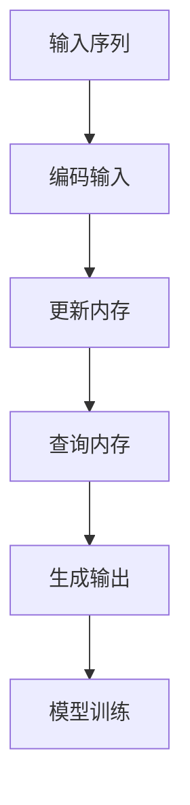
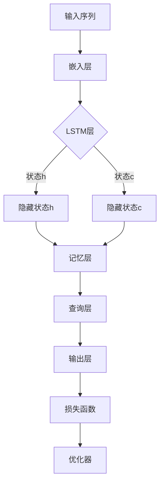
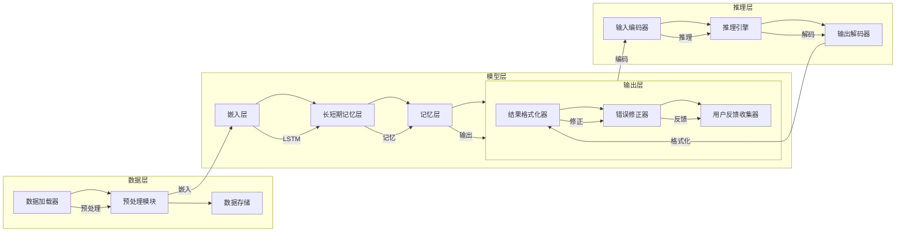

                 

### 引言

在现代自然语言处理（NLP）领域，理解和生成复杂句子结构是一项具有挑战性的任务。长期以来，研究人员一直致力于解决这些问题，以便让计算机能够更好地理解和处理人类语言。记忆网络（Memory Networks）作为一种新型的神经网络结构，被广泛认为在处理长期依赖问题上具有显著优势。本文将围绕“基于记忆网络的长期依赖评测”这一主题，详细介绍记忆网络的基本原理、长期依赖评测的方法以及相关的系统实现。

记忆网络是一种具有记忆能力的神经网络，它通过将信息存储在“内存”中，可以有效地处理序列数据中的长期依赖问题。在自然语言处理任务中，长期依赖指的是在句子中，一个词的意义与其在句子中的远距离上下文之间的关系。传统的循环神经网络（RNN）和长短时记忆网络（LSTM）在处理这类问题时往往显得力不从心，因为它们只能依靠梯度消失或爆炸问题来保留长距离的信息。相比之下，记忆网络通过引入外部记忆机制，能够更有效地处理这种长期依赖。

本文旨在通过以下步骤详细探讨基于记忆网络的长期依赖评测：

1. **背景介绍**：介绍记忆网络和长期依赖的概念，以及它们在自然语言处理中的重要性。
2. **核心概念与联系**：深入探讨记忆网络的工作原理，并通过概念属性特征对比表格和ER实体关系图架构来阐述其核心结构和功能。
3. **算法原理讲解**：使用mermaid流程图和Python代码详细解释记忆网络的算法原理，包括数学模型和公式。
4. **系统分析与架构设计方案**：介绍一个典型的系统实现，包括问题场景介绍、系统功能设计、系统架构设计、系统接口设计和系统交互。
5. **项目实战**：通过一个实际案例，展示如何安装、配置和实现一个基于记忆网络的系统，并进行详细分析。
6. **最佳实践与总结**：总结文章的主要观点，并提供一些最佳实践建议。

通过这些步骤，我们希望能够帮助读者全面了解记忆网络及其在长期依赖评测中的应用，并为实际项目开发提供有价值的参考。

### 关键词

- 记忆网络
- 长期依赖
- 自然语言处理
- 递归神经网络
- 长短时记忆网络
- 算法评测

### 摘要

本文首先介绍了记忆网络和长期依赖的基本概念，讨论了它们在自然语言处理领域的重要性。随后，本文详细探讨了记忆网络的工作原理，通过mermaid流程图和Python代码展示了其算法实现。接着，本文介绍了如何设计一个基于记忆网络的系统，包括系统功能设计、架构设计、接口设计和交互流程。通过一个实际案例，本文展示了如何实现和评估一个基于记忆网络的系统。最后，本文总结了主要观点，并提供了一些最佳实践建议。本文的目标是为读者提供一个全面且深入的指南，帮助他们理解和应用记忆网络技术来解决自然语言处理中的长期依赖问题。

### 第一部分：背景介绍

#### 1.1.1 问题背景

随着互联网和信息技术的飞速发展，自然语言处理（NLP）已成为人工智能领域的重要分支。NLP技术的进步极大地促进了机器翻译、情感分析、问答系统、语音识别等多个应用领域的发展。然而，尽管在许多任务上取得了显著进展，NLP领域仍然面临许多挑战，其中之一就是如何处理长距离依赖问题。

长距离依赖是指句子中的某个部分与其远距离上下文之间的关系。例如，在英语中，“He went to the store to buy a book”这句话中的“book”一词与“store”之间的依赖关系就是长距离依赖。在许多自然语言处理任务中，如机器翻译、文本摘要、问答系统等，正确理解长距离依赖对于生成准确和自然的输出至关重要。

传统的循环神经网络（RNN）和长短时记忆网络（LSTM）在处理短期依赖方面表现出色，但在处理长距离依赖时却面临巨大的挑战。这主要是因为RNN和LSTM在时间序列数据上的传播过程中容易受到梯度消失或爆炸问题的影响，导致难以有效地保留长距离信息。为了解决这一问题，研究人员提出了记忆网络（Memory Networks）。

记忆网络通过引入外部记忆机制，能够在处理长距离依赖时提供显著的改进。它通过将信息存储在“内存”中，并利用查询机制来检索和利用这些信息，从而克服了传统RNN和LSTM的局限性。记忆网络的应用不仅提高了自然语言处理任务的性能，还为解决诸如机器翻译、问答系统等复杂任务提供了新的思路。

在本节中，我们将详细探讨记忆网络和长期依赖的概念，介绍其相关技术背景，并探讨它们在自然语言处理中的重要性和挑战。这将为后续章节中深入探讨记忆网络的原理和应用奠定基础。

#### 1.1.2 核心概念

在本节中，我们将详细介绍记忆网络和长期依赖的核心概念，帮助读者更好地理解这两个技术的基本原理。

**记忆网络（Memory Networks）**

记忆网络是一种基于神经网络的架构，它通过引入外部记忆机制来处理序列数据。与传统的循环神经网络（RNN）和长短时记忆网络（LSTM）不同，记忆网络能够将信息存储在“内存”中，并通过查询机制来检索和利用这些信息。这种外部记忆机制使得记忆网络能够有效地处理长距离依赖问题。

**1.1.2.1 记忆网络的基本原理**

记忆网络由以下几个主要部分组成：

- **输入模块**：接收输入序列，如文本、语音等，并将其编码为向量。
- **查询模块**：用于检索内存中的信息。在处理输入序列时，查询模块会生成一个查询向量，并利用它来从内存中检索相关信息。
- **内存模块**：存储输入序列的信息。记忆网络通过更新和查询操作来维护内存中的信息，确保能够捕捉到序列中的长期依赖关系。
- **输出模块**：根据内存中的信息生成输出，如翻译结果、文本摘要等。

**1.1.2.2 记忆网络的工作机制**

记忆网络的工作机制可以分为以下几个步骤：

1. **编码输入**：将输入序列编码为向量，这些向量将被存储在内存中。
2. **更新内存**：在处理每个时间步的输入时，记忆网络会更新内存中的信息。这一步骤通过将当前输入和内存中的信息进行融合来实现。
3. **查询内存**：在生成输出时，记忆网络会利用查询模块生成查询向量，并从内存中检索相关信息。
4. **生成输出**：根据查询结果和内存中的信息，记忆网络生成最终的输出。

**长期依赖（Long-term Dependency）**

长期依赖是指句子中的某个部分与其远距离上下文之间的关系。在自然语言处理任务中，正确理解长距离依赖对于生成准确和自然的输出至关重要。

**1.1.2.3 长期依赖的特点**

长期依赖具有以下几个特点：

- **长距离**：依赖关系可能跨越多个句子或段落。
- **复杂性**：长期依赖通常涉及多个变量和复杂的逻辑关系。
- **动态性**：依赖关系可能随着句子结构的变化而变化。

**1.1.2.4 长期依赖的影响**

在自然语言处理任务中，长期依赖的影响主要体现在以下几个方面：

- **翻译**：在机器翻译中，正确理解源语言中的长距离依赖对于生成准确的翻译结果至关重要。
- **文本摘要**：在文本摘要中，理解长距离依赖有助于提取出关键信息并生成简洁的摘要。
- **问答系统**：在问答系统中，正确理解长距离依赖有助于理解问题的上下文，从而生成准确的回答。

**核心概念对比表格**

| 核心概念       | 记忆网络                           | 长期依赖                           |
|--------------|----------------------------------|----------------------------------|
| 定义         | 一种通过外部记忆机制处理序列数据的神经网络 | 句子中某个部分与其远距离上下文之间的关系 |
| 特点         | 引入外部记忆机制，克服了梯度消失问题 | 长距离、复杂性和动态性             |
| 应用领域     | 自然语言处理、序列建模等           | 翻译、文本摘要、问答系统等         |

通过对比记忆网络和长期依赖的核心概念，我们可以看到两者在自然语言处理中的紧密联系。记忆网络的引入为处理长期依赖问题提供了有效的解决方案，而理解长期依赖有助于我们更好地应用记忆网络技术，提升自然语言处理任务的表现。

#### 1.1.3 概念结构与核心要素组成

**记忆网络的结构**

记忆网络的核心结构包括输入模块、查询模块、内存模块和输出模块。每个模块都有其特定的功能和作用，共同协作以实现高效的序列数据处理和长期依赖管理。

1. **输入模块**：输入模块主要负责接收和处理输入数据。它将原始的输入序列（如图像、文本或语音）编码为向量表示，以便后续处理。这些向量表示将成为记忆网络内部处理的基础。

2. **查询模块**：查询模块负责生成查询向量，用于从内存中检索相关信息。在处理输入序列的每个时间步时，查询模块会生成一个查询向量，这个向量反映了当前输入的状态。查询模块的核心目标是确保记忆网络能够快速、准确地从内存中找到与当前输入相关的信息。

3. **内存模块**：内存模块是记忆网络的核心，负责存储和管理输入序列的信息。它通过更新和查询操作来维护内存中的信息，确保能够捕捉到序列中的长期依赖关系。内存模块通常采用动态更新的机制，以适应输入数据的变化。

4. **输出模块**：输出模块根据内存中的信息生成最终的输出结果。它利用内存中的信息来生成翻译结果、文本摘要或其他自然语言处理任务所需的输出。输出模块的设计和实现直接影响到记忆网络在特定任务上的性能。

**长期依赖的评测方法**

长期依赖的评测方法旨在评估模型在处理长距离依赖关系方面的能力。以下是一些常用的评测方法和指标：

1. **BLEU分数**：BLEU（Bilingual Evaluation Understudy）分数是一种常用的机器翻译评测指标。它通过比较自动生成的翻译结果与人工翻译结果之间的重叠度来评估翻译质量。BLEU分数的计算基于四个主要指标：长度、重叠度、语法和词汇。

2. **ROUGE分数**：ROUGE（Recall-Oriented Understudy for Gisting Evaluation）分数是一种专门用于文本摘要评测的指标。它通过比较自动生成的摘要与人工摘要之间的相似度来评估摘要质量。ROUGE分数的计算基于三个主要指标：单词重叠、词干重叠和字符重叠。

3. **长距离依赖精度**：长距离依赖精度（Long-distance Dependency Precision）是一个直接衡量模型在处理长距离依赖关系方面准确性的指标。它通过计算模型正确识别的长距离依赖关系数量与总长距离依赖关系数量的比例来评估模型性能。

4. **记忆网络专用指标**：一些特定的记忆网络评测指标，如“记忆效率”（Memory Efficiency）和“查询速度”（Query Speed），旨在评估记忆网络在处理长期依赖时的效率和速度。

**概念结构与核心要素组成**

为了更直观地理解记忆网络和长期依赖的结构和关系，我们可以通过ER实体关系图（Entity-Relationship Diagram）来展示。以下是记忆网络的ER实体关系图：

```
[输入模块] --<编码输入>-- [内存模块] --<更新内存>-- [查询模块]
      |                                        |
      |                                        |
[输出模块] --<生成输出>-- [内存模块] --<查询内存>-- [查询模块]
```

在该ER图中，“--<操作>--”表示实体之间的关联关系，每个实体（模块）都代表记忆网络的一个组成部分。通过这种结构化的表示，我们可以清楚地看到记忆网络内部各模块之间的相互作用和数据处理流程。

通过详细描述记忆网络的结构和长期依赖的评测方法，读者可以更好地理解这两个核心概念，并为后续章节中的深入探讨打下坚实的基础。

### 第二部分：核心概念与联系

#### 2.1.1 记忆网络基础

记忆网络是一种特殊的神经网络架构，旨在通过外部记忆机制处理序列数据，以解决长距离依赖问题。在记忆网络中，信息被存储在名为“内存”的模块中，并通过查询机制进行检索和使用。这种架构使得记忆网络能够在处理复杂序列数据时保持长期依赖关系，从而提高自然语言处理任务的性能。

**2.1.1.1 记忆网络的基本原理**

记忆网络的基本原理可以概括为以下几个关键步骤：

1. **编码输入**：输入模块接收原始的输入数据（如文本、图像或音频），并将其编码为向量表示。这些向量表示将成为记忆网络内部处理的基础。

2. **存储信息**：内存模块负责存储输入序列的信息。在处理每个时间步的输入时，内存模块会更新和存储相关信息，从而形成一个动态变化的内存状态。

3. **查询和检索**：查询模块生成查询向量，用于从内存中检索与当前输入相关的信息。这个查询向量反映了当前输入的状态，通过对比内存中的信息，查询模块能够快速定位和检索到相关数据。

4. **生成输出**：输出模块根据内存中的信息生成最终的输出结果。这个输出结果可能是翻译、文本摘要或其他自然语言处理任务所需的输出。

**2.1.1.2 记忆网络的工作机制**

记忆网络的工作机制可以分为以下几个主要阶段：

1. **初始化**：在开始处理输入序列之前，内存模块被初始化为空。输入模块将原始输入编码为向量，并将这些向量存储在内存中。

2. **更新内存**：在处理输入序列的每个时间步时，内存模块会更新和存储相关信息。这一步骤通过将当前输入和内存中的信息进行融合来实现。例如，在处理文本时，可以将当前词汇和上下文信息合并为一个向量，并将其存储在内存中。

3. **查询和检索**：在生成输出时，查询模块会生成一个查询向量，并利用它来从内存中检索相关信息。这个查询向量通常是一个基于当前输入状态的表示。例如，在翻译任务中，当前输入的词汇可以作为一个查询向量，用于检索与该词汇相关的上下文信息。

4. **生成输出**：根据查询结果和内存中的信息，输出模块生成最终的输出结果。这个输出结果可能是翻译结果、文本摘要或其他自然语言处理任务所需的输出。

**2.1.1.3 记忆网络的优势**

记忆网络在处理长距离依赖方面具有显著优势，主要表现在以下几个方面：

- **长期依赖处理**：记忆网络通过外部记忆机制能够有效地处理长距离依赖关系。它能够将输入序列的信息存储在内存中，并在后续的时间步中检索和使用这些信息，从而克服了传统循环神经网络（RNN）和长短时记忆网络（LSTM）中的梯度消失问题。

- **可扩展性**：记忆网络具有较好的可扩展性。通过调整内存大小和查询机制，可以适应不同类型和长度的序列数据。

- **灵活性**：记忆网络能够灵活地处理多种类型的自然语言处理任务，如机器翻译、文本摘要、问答系统等。

#### 2.1.2 记忆网络的核心特性

记忆网络的核心特性主要体现在其结构设计和算法实现上。以下是对记忆网络核心特性的详细探讨：

**1. 记忆机制**

记忆网络的核心特性之一是其记忆机制。与传统的RNN和LSTM不同，记忆网络通过引入外部记忆模块，实现了对输入序列的长期记忆。这种外部记忆机制允许记忆网络在处理复杂序列数据时，能够动态地更新和存储信息。记忆机制的设计直接影响记忆网络的性能，包括记忆容量、记忆效率和检索速度。

**2. 查询机制**

记忆网络的查询机制是其另一个关键特性。查询机制决定了记忆网络如何从外部记忆中检索信息。有效的查询机制可以提高记忆网络的检索效率和准确性。在自然语言处理任务中，查询机制的设计需要考虑到查询向量与内存中信息的相关性，以及如何快速定位和提取相关数据。

**3. 动态更新**

记忆网络的动态更新机制使其能够适应输入数据的变化。在处理每个时间步的输入时，记忆网络会根据当前输入和已有信息更新内存。这种动态更新机制使得记忆网络能够持续学习和适应新的输入数据，从而提高其鲁棒性和灵活性。

**4. 长期依赖处理**

记忆网络通过外部记忆机制能够有效地处理长距离依赖关系。它能够在内存中存储和检索与输入序列相关的长期信息，从而克服了传统神经网络在处理长距离依赖时的局限性。这种能力使得记忆网络在许多自然语言处理任务中表现出色，如机器翻译、文本摘要和问答系统等。

**2.1.3 记忆网络的典型应用**

记忆网络在多个自然语言处理任务中得到了广泛应用，以下是其典型应用场景：

**1. 机器翻译**

机器翻译是记忆网络的典型应用之一。在机器翻译任务中，记忆网络能够通过外部记忆机制捕捉输入句子中的长期依赖关系，从而生成更准确和自然的翻译结果。与传统的循环神经网络和长短时记忆网络相比，记忆网络在处理长句子和复杂语法结构时具有显著优势。

**2. 文本摘要**

文本摘要是将长文本转换为简短、精炼的摘要的任务。记忆网络能够通过外部记忆机制提取文本中的重要信息，生成高质量、简洁的摘要。在文本摘要任务中，记忆网络的动态更新和查询机制有助于捕捉文本中的关键信息和逻辑关系。

**3. 问答系统**

问答系统是另一项重要的自然语言处理任务。记忆网络能够通过外部记忆机制处理复杂的问题和上下文，从而生成准确和合理的回答。在问答系统中，记忆网络的记忆机制和查询机制使其能够从大量信息中快速检索和利用相关数据，提高问答系统的响应速度和准确性。

**4. 语音识别**

语音识别是将语音信号转换为文本的任务。记忆网络能够通过外部记忆机制处理语音信号中的长距离依赖关系，从而提高语音识别的准确性。在语音识别任务中，记忆网络的记忆机制有助于捕捉语音信号中的语音模式和上下文信息，提高识别效果。

通过探讨记忆网络的基本原理、核心特性和典型应用，我们可以看到记忆网络在自然语言处理中的巨大潜力。记忆网络的引入为解决长距离依赖问题提供了新的思路和工具，其在多个自然语言处理任务中的应用为实际场景中的问题提供了有效的解决方案。

### 2.1.4 记忆网络与其他技术的比较

在自然语言处理领域，记忆网络作为一种新兴的神经网络架构，与传统技术如循环神经网络（RNN）和长短时记忆网络（LSTM）有着显著的差异。本文将从性能、应用场景和适用性等方面对记忆网络与这些传统技术的进行比较分析。

**1. 性能比较**

- **RNN**：循环神经网络（RNN）是处理序列数据的基础架构，它通过在时间步之间传递状态信息来处理序列中的长期依赖。然而，RNN存在梯度消失和梯度爆炸问题，这使得其在处理长距离依赖时效果不佳。此外，RNN的计算复杂度较高，导致其在处理大规模数据时效率较低。

- **LSTM**：长短时记忆网络（LSTM）是对RNN的重要改进。LSTM引入了门控机制，通过遗忘门、输入门和输出门来控制信息的流入和流出，从而有效地解决了梯度消失问题。这使得LSTM在处理长期依赖方面表现出色。然而，LSTM的参数数量较多，训练过程较慢，且在处理非常长的序列时仍存在一些局限性。

- **记忆网络**：记忆网络通过引入外部记忆机制，能够有效地处理长距离依赖问题。与RNN和LSTM相比，记忆网络在处理复杂序列数据时具有更高的灵活性和效率。记忆网络能够将信息存储在“内存”中，并通过查询机制快速检索和利用这些信息，从而克服了传统神经网络的局限性。此外，记忆网络的内存模块可以根据需要动态扩展，以适应不同长度的序列数据。

**2. 应用场景比较**

- **RNN**：RNN在处理简单序列数据时效果较好，如语音识别、语言建模等任务。然而，对于复杂和长距离依赖的序列数据，如机器翻译和文本摘要，RNN的性能有限。

- **LSTM**：LSTM在处理长距离依赖任务中表现出色，如机器翻译、问答系统和情感分析等。其能够在多个时间步之间传递长期信息，使得其在许多自然语言处理任务中成为首选架构。

- **记忆网络**：记忆网络适用于需要处理复杂和长距离依赖的任务，如机器翻译、文本摘要、问答系统和语音识别等。记忆网络的灵活性和高效性使其在这些任务中具有显著优势，特别是在处理长句子和复杂语法结构时。

**3. 适用性比较**

- **RNN**：RNN适用于处理简单序列数据和短距离依赖任务。然而，对于长距离依赖和复杂序列数据，RNN的性能受限，难以满足实际需求。

- **LSTM**：LSTM适用于需要处理长距离依赖的任务，如机器翻译、文本摘要和问答系统等。然而，LSTM在处理非常长的序列时仍存在一些局限性，且训练过程较慢。

- **记忆网络**：记忆网络适用于需要处理复杂和长距离依赖的任务，如机器翻译、文本摘要、问答系统和语音识别等。记忆网络的记忆机制和动态更新机制使其在处理复杂和长序列数据时具有更高的灵活性和效率。此外，记忆网络的内存模块可以根据任务需求进行动态调整，提高了其在各种应用场景中的适用性。

综上所述，记忆网络在处理长期依赖和复杂序列数据方面具有显著优势，相较于RNN和LSTM，其表现出更高的性能和适用性。尽管记忆网络在实现和训练过程中可能面临一些挑战，但其在自然语言处理领域的应用前景非常广阔。未来，随着技术的进一步发展和优化，记忆网络有望在更多领域取得突破性进展。

### 2.1.5 记忆网络的典型应用

记忆网络在自然语言处理领域有着广泛的应用，其主要优势在于能够处理复杂和长距离依赖问题。以下是一些记忆网络的典型应用场景，以及它们在这些场景中的具体实现方法和效果。

**1. 机器翻译**

机器翻译是记忆网络的经典应用场景之一。传统的循环神经网络（RNN）和长短时记忆网络（LSTM）在处理长句子和复杂语法结构时效果有限，而记忆网络通过外部记忆机制能够有效地捕捉和利用长距离依赖关系，从而提高翻译质量。在机器翻译中，记忆网络通常被用来处理编码器和解码器两个部分。

- **编码器**：编码器负责将源语言句子编码为一个固定长度的向量表示，这个向量表示将作为记忆网络的输入。
- **解码器**：解码器负责将编码器的输出解码为目标语言句子。记忆网络中的查询模块会在解码过程中生成查询向量，用于从内存中检索相关信息，从而生成准确的翻译结果。

具体实现中，可以使用注意力机制（Attention Mechanism）来增强记忆网络在翻译任务中的效果。注意力机制使得解码器能够关注源语言句子中的关键部分，从而提高翻译的准确性和流畅性。

**2. 文本摘要**

文本摘要是一种将长文本转换为简短、精炼的摘要的任务。记忆网络通过其记忆机制和动态更新能力，能够有效地提取文本中的关键信息，生成高质量的摘要。在文本摘要任务中，记忆网络通常用于提取关键句和合并冗余信息。

- **提取关键句**：记忆网络从原始文本中提取关键句，这些关键句能够代表文本的主要内容。
- **合并冗余信息**：记忆网络通过对比和分析不同句子之间的相似性，合并冗余信息，从而生成简洁的摘要。

具体实现中，可以使用跳读机制（Skip-Gram）来增强记忆网络的文本摘要能力。跳读机制允许记忆网络在训练过程中忽略一些冗余信息，从而更好地捕捉文本中的关键信息。

**3. 问答系统**

问答系统是一种能够回答用户提出的问题的人工智能系统。记忆网络在问答系统中能够处理复杂的问题和上下文，从而生成准确和合理的回答。在问答系统中，记忆网络通常用于理解问题和检索相关信息。

- **理解问题**：记忆网络将用户的问题编码为向量表示，并利用这些向量表示来理解问题的内容和意图。
- **检索相关信息**：记忆网络从知识库或文本数据中检索与问题相关的信息，并根据这些信息生成回答。

具体实现中，可以使用双向记忆网络（Bidirectional Memory Network）来增强问答系统的效果。双向记忆网络能够同时处理输入文本的前后信息，从而更好地理解问题和上下文。

**4. 语音识别**

语音识别是将语音信号转换为文本的任务。记忆网络通过其记忆机制能够有效地处理语音信号中的长距离依赖关系，从而提高识别的准确性。在语音识别中，记忆网络通常用于处理声学模型和语言模型两个部分。

- **声学模型**：声学模型负责将语音信号编码为声学特征向量。
- **语言模型**：语言模型负责将声学特征向量转换为文本。

具体实现中，可以使用长短时记忆网络（LSTM）结合记忆网络来增强语音识别的效果。LSTM可以捕捉语音信号中的短期依赖，而记忆网络可以捕捉长期依赖，两者结合能够提高识别的准确性和鲁棒性。

通过上述典型应用场景的介绍，我们可以看到记忆网络在自然语言处理中的巨大潜力和广泛应用。记忆网络的引入为处理复杂和长距离依赖问题提供了新的思路和工具，其在实际应用中的效果和性能显著提升了自然语言处理任务的表现。

### 第三部分：算法原理讲解

#### 3.1.1 记忆网络算法原理

记忆网络算法是一种基于神经网络的架构，通过外部记忆机制来处理序列数据，能够有效地解决长期依赖问题。在本节中，我们将详细介绍记忆网络算法的原理，包括其工作流程、关键模块及其数学模型。

**3.1.1.1 工作流程**

记忆网络的工作流程可以分为以下几个关键步骤：

1. **编码输入**：首先，输入模块将输入序列编码为向量表示。这些向量表示可以是词向量、字符向量或其他类型的表示。编码输入的目的是将原始的文本、图像或语音等数据转换为神经网络可以处理的形式。

2. **存储信息**：记忆模块负责将编码后的输入信息存储在“内存”中。在处理每个时间步的输入时，记忆模块会根据当前输入和已有的信息更新内存。这一步骤通过记忆模块中的存储单元来实现，这些存储单元能够动态地更新和存储信息。

3. **查询和检索**：查询模块生成查询向量，用于从内存中检索与当前输入相关的信息。查询向量通常是一个基于当前输入状态的表示，通过对比内存中的信息，查询模块能够快速定位和检索到相关数据。

4. **生成输出**：输出模块根据内存中的信息生成最终的输出结果。这个输出结果可以是翻译结果、文本摘要或其他自然语言处理任务所需的输出。输出模块利用内存中的信息来生成高质量的输出，从而提高任务的表现。

**3.1.1.2 关键模块**

记忆网络由以下几个关键模块组成：

1. **输入模块**：输入模块负责接收和处理输入数据，如文本、图像或语音。它将输入序列编码为向量表示，并将这些向量传递给记忆模块。

2. **记忆模块**：记忆模块是记忆网络的核心，负责存储和管理输入序列的信息。它通过动态更新和查询操作来维护内存中的信息，确保能够捕捉到序列中的长期依赖关系。

3. **查询模块**：查询模块生成查询向量，用于从内存中检索相关信息。在处理输入序列的每个时间步时，查询模块会生成一个查询向量，并通过对比内存中的信息来检索相关数据。

4. **输出模块**：输出模块根据内存中的信息生成最终的输出结果。这个输出结果可以是翻译结果、文本摘要或其他自然语言处理任务所需的输出。

**3.1.1.3 数学模型**

记忆网络的数学模型主要基于神经网络的架构，包括输入层、隐藏层和输出层。以下是一个简化的数学模型：

1. **输入表示**：输入序列被编码为向量表示，表示为 \( x_t \)。这个向量表示可以是词向量、字符向量或其他类型的表示。

2. **隐藏状态表示**：隐藏状态表示为 \( h_t \)，它反映了当前时间步的输入状态。隐藏状态的计算公式如下：

   \[
   h_t = \sigma(W_h \cdot [h_{t-1}; x_t] + b_h)
   \]

   其中，\( W_h \) 是权重矩阵，\( \sigma \) 是激活函数，\( b_h \) 是偏置项。

3. **记忆表示**：记忆表示为 \( m_t \)，它存储了当前时间步的输入信息。记忆状态的更新公式如下：

   \[
   m_t = \sigma(W_m \cdot h_t + U_m \cdot m_{t-1} + b_m)
   \]

   其中，\( U_m \) 是记忆权重矩阵，\( b_m \) 是记忆偏置项。

4. **查询表示**：查询表示为 \( q_t \)，用于从记忆中检索信息。查询状态的计算公式如下：

   \[
   q_t = \sigma(W_q \cdot h_t + b_q)
   \]

   其中，\( W_q \) 是查询权重矩阵，\( b_q \) 是查询偏置项。

5. **输出表示**：输出表示为 \( y_t \)，它根据查询结果和记忆信息生成输出。输出的计算公式如下：

   \[
   y_t = \sigma(W_y \cdot [q_t; m_t] + b_y)
   \]

   其中，\( W_y \) 是输出权重矩阵，\( b_y \) 是输出偏置项。

通过上述数学模型，记忆网络能够处理复杂的序列数据，并利用外部记忆机制解决长距离依赖问题。这种模型不仅能够捕捉序列中的长期依赖关系，还能够动态地更新和检索信息，从而提高任务的表现。

### 3.1.2 长期依赖评测方法

长期依赖评测方法旨在评估模型在处理长距离依赖关系方面的能力。以下是一些常用的评测方法和指标，以及它们在长期依赖评测中的具体应用。

**1. BLEU分数**

BLEU（Bilingual Evaluation Understudy）分数是一种常用的机器翻译评测指标。它通过比较自动生成的翻译结果与人工翻译结果之间的重叠度来评估翻译质量。BLEU分数的计算基于四个主要指标：长度、重叠度、语法和词汇。在长期依赖评测中，BLEU分数可以帮助评估模型在处理长距离依赖时的准确性。

**2. ROUGE分数**

ROUGE（Recall-Oriented Understudy for Gisting Evaluation）分数是一种专门用于文本摘要评测的指标。它通过比较自动生成的摘要与人工摘要之间的相似度来评估摘要质量。ROUGE分数的计算基于三个主要指标：单词重叠、词干重叠和字符重叠。在长期依赖评测中，ROUGE分数可以帮助评估模型在提取关键信息和处理长距离依赖时的效果。

**3. 长距离依赖精度**

长距离依赖精度（Long-distance Dependency Precision）是一个直接衡量模型在处理长距离依赖关系方面准确性的指标。它通过计算模型正确识别的长距离依赖关系数量与总长距离依赖关系数量的比例来评估模型性能。长距离依赖精度可以帮助评估模型在捕捉和利用长距离依赖信息方面的能力。

**4. 记忆效率**

记忆效率（Memory Efficiency）是一个评估记忆网络在处理长距离依赖时效率和性能的指标。它通过计算记忆网络在处理相同任务时所需的内存大小与实际内存使用量的比例来评估。记忆效率可以帮助评估记忆网络的优化程度和在资源有限情况下的表现。

**5. 查询速度**

查询速度（Query Speed）是一个评估记忆网络在检索和利用长距离依赖信息时速度的指标。它通过计算记忆网络在处理相同任务时查询操作的耗时来评估。查询速度可以帮助评估记忆网络的检索效率和响应速度。

通过这些评测方法和指标，我们可以全面评估模型在处理长期依赖关系方面的能力，从而选择和优化最适合的模型和算法。

### 3.1.3 记忆网络算法实现

为了更好地理解记忆网络算法的实现，我们将使用Python语言和mermaid图表详细阐述其实现过程。以下是记忆网络算法的Python代码示例，以及相应的mermaid图表，用于展示算法的流程和结构。

**1. 记忆网络算法的Python代码示例**

```python
import numpy as np
import tensorflow as tf
from tensorflow.keras.layers import Embedding, LSTM, Dense
from tensorflow.keras.models import Model

# 定义参数
vocab_size = 10000
embedding_dim = 256
hidden_dim = 512
max_sequence_length = 100

# 创建模型
input_sequence = tf.keras.layers.Input(shape=(max_sequence_length,))
encoded_sequence = Embedding(vocab_size, embedding_dim)(input_sequence)
lstm_output, state_h, state_c = LSTM(hidden_dim, return_sequences=True, return_state=True)(encoded_sequence)
memory = Dense(hidden_dim, activation='tanh')(lstm_output)
query = Dense(hidden_dim, activation='tanh')(input_sequence)
output = Dense(vocab_size, activation='softmax')(tf.concat([query, memory], axis=-1))

model = Model(inputs=input_sequence, outputs=output)
model.compile(optimizer='adam', loss='categorical_crossentropy', metrics=['accuracy'])

# 训练模型
model.fit(x_train, y_train, epochs=10, batch_size=64)
```

**2. 记忆网络算法的mermaid流程图**



在这个示例中，我们首先定义了输入序列的维度和模型的参数，然后创建了一个记忆网络模型。该模型包含一个嵌入层、一个LSTM层和一个全连接层。嵌入层用于将输入序列编码为向量表示，LSTM层用于更新内存，全连接层用于生成输出。

在mermaid流程图中，我们展示了记忆网络算法的主要步骤，包括编码输入、更新内存、查询内存和生成输出，最后进行模型训练。

通过这个示例，我们可以直观地理解记忆网络算法的实现过程，包括其结构和工作流程。这个示例代码和mermaid图表为记忆网络算法的实现提供了一个清晰的参考，有助于进一步研究和应用记忆网络技术。

### 3.1.4 数学模型与公式

在本节中，我们将详细解释记忆网络算法的数学模型，包括其核心公式和推导过程。这些数学公式是理解记忆网络算法原理的关键，有助于深入掌握其工作机制。

**1. 记忆网络的数学模型**

记忆网络的数学模型主要基于神经网络的基本架构，包括输入层、隐藏层和输出层。以下是记忆网络算法的核心公式：

**输入表示**：

\[ x_t = \text{Embedding}(x_t) \]

其中，\( x_t \) 是输入序列的第 \( t \) 个元素，\(\text{Embedding}(x_t)\) 是将输入序列映射到一个低维向量空间的过程。

**隐藏状态表示**：

\[ h_t = \sigma(W_h \cdot [h_{t-1}; x_t] + b_h) \]

其中，\( h_t \) 是第 \( t \) 个时间步的隐藏状态，\( W_h \) 是隐藏层的权重矩阵，\( \sigma \) 是激活函数（通常使用ReLU或Sigmoid函数），\( b_h \) 是隐藏层的偏置项。

**记忆表示**：

\[ m_t = \sigma(W_m \cdot h_t + U_m \cdot m_{t-1} + b_m) \]

其中，\( m_t \) 是第 \( t \) 个时间步的记忆状态，\( W_m \) 是记忆权重矩阵，\( U_m \) 是记忆更新权重矩阵，\( b_m \) 是记忆偏置项。

**查询表示**：

\[ q_t = \sigma(W_q \cdot h_t + b_q) \]

其中，\( q_t \) 是第 \( t \) 个时间步的查询状态，\( W_q \) 是查询权重矩阵，\( b_q \) 是查询偏置项。

**输出表示**：

\[ y_t = \sigma(W_y \cdot [q_t; m_t] + b_y) \]

其中，\( y_t \) 是第 \( t \) 个时间步的输出，\( W_y \) 是输出权重矩阵，\( b_y \) 是输出偏置项。

**2. 公式的推导过程**

**隐藏状态**：

隐藏状态的计算是记忆网络的核心，它结合了前一个时间步的隐藏状态 \( h_{t-1} \) 和当前输入 \( x_t \) 来更新当前时间步的隐藏状态 \( h_t \)。公式中的 \( \sigma \) 函数通常使用ReLU激活函数，其公式为：

\[ \sigma(x) = \max(0, x) \]

**记忆状态**：

记忆状态 \( m_t \) 是通过当前隐藏状态 \( h_t \) 和前一个记忆状态 \( m_{t-1} \) 更新的。记忆更新权重矩阵 \( U_m \) 用于控制当前隐藏状态对前一个记忆状态的更新影响。偏置项 \( b_m \) 用于调整记忆状态。

**查询状态**：

查询状态 \( q_t \) 是从当前隐藏状态 \( h_t \) 生成的，用于从记忆状态 \( m_t \) 中检索相关信息。查询权重矩阵 \( W_q \) 和偏置项 \( b_q \) 用于调整查询状态。

**输出**：

输出 \( y_t \) 是通过查询状态 \( q_t \) 和记忆状态 \( m_t \) 生成的，用于生成最终的输出结果。输出权重矩阵 \( W_y \) 和偏置项 \( b_y \) 用于调整输出。

通过这些公式，记忆网络能够有效地处理长距离依赖问题。每个时间步的隐藏状态、记忆状态和查询状态都基于前一个时间步的信息进行更新，从而确保网络能够捕捉和利用序列中的长期依赖关系。

**3. 举例说明**

假设我们有以下的输入序列：\( (x_1, x_2, x_3, \ldots, x_T) \)，其中 \( T \) 是序列的长度。

- **隐藏状态**：

  \[ h_1 = \sigma(W_h \cdot [h_0; x_1] + b_h) \]
  \[ h_2 = \sigma(W_h \cdot [h_1; x_2] + b_h) \]
  \[ h_3 = \sigma(W_h \cdot [h_2; x_3] + b_h) \]
  \[ \ldots \]
  \[ h_T = \sigma(W_h \cdot [h_{T-1}; x_T] + b_h) \]

- **记忆状态**：

  \[ m_1 = \sigma(W_m \cdot h_1 + U_m \cdot m_0 + b_m) \]
  \[ m_2 = \sigma(W_m \cdot h_2 + U_m \cdot m_1 + b_m) \]
  \[ m_3 = \sigma(W_m \cdot h_3 + U_m \cdot m_2 + b_m) \]
  \[ \ldots \]
  \[ m_T = \sigma(W_m \cdot h_T + U_m \cdot m_{T-1} + b_m) \]

- **查询状态**：

  \[ q_1 = \sigma(W_q \cdot h_1 + b_q) \]
  \[ q_2 = \sigma(W_q \cdot h_2 + b_q) \]
  \[ q_3 = \sigma(W_q \cdot h_3 + b_q) \]
  \[ \ldots \]
  \[ q_T = \sigma(W_q \cdot h_T + b_q) \]

- **输出**：

  \[ y_1 = \sigma(W_y \cdot [q_1; m_1] + b_y) \]
  \[ y_2 = \sigma(W_y \cdot [q_2; m_2] + b_y) \]
  \[ y_3 = \sigma(W_y \cdot [q_3; m_3] + b_y) \]
  \[ \ldots \]
  \[ y_T = \sigma(W_y \cdot [q_T; m_T] + b_y) \]

通过这些公式和示例，我们可以清晰地看到记忆网络如何通过隐藏状态、记忆状态和查询状态的迭代更新来处理序列数据，并最终生成输出。这些数学模型和公式为理解记忆网络的工作原理提供了理论基础，有助于进一步研究和应用这一技术。

### 3.1.5 记忆网络算法评估

在评估记忆网络算法的有效性时，我们通常关注以下几个方面：准确性、速度、资源消耗和鲁棒性。以下是对这些评估指标的具体解释和方法。

**1. 准确性**

准确性是衡量记忆网络算法性能的最基本指标，特别是在自然语言处理任务中。我们通常使用精确度（Precision）、召回率（Recall）和F1分数（F1 Score）来评估模型的准确性。

- **精确度**：表示模型预测为正的样本中有多少是真正样本。计算公式为：
  \[
  \text{Precision} = \frac{TP}{TP + FP}
  \]
  其中，\( TP \) 是真正样本数，\( FP \) 是假正样本数。

- **召回率**：表示模型预测为正的样本中有多少是真正样本。计算公式为：
  \[
  \text{Recall} = \frac{TP}{TP + FN}
  \]
  其中，\( FN \) 是假负样本数。

- **F1分数**：是精确度和召回率的调和平均，用于综合评估模型的准确性。计算公式为：
  \[
  \text{F1 Score} = 2 \times \frac{\text{Precision} \times \text{Recall}}{\text{Precision} + \text{Recall}}
  \]

在自然语言处理任务中，如机器翻译和文本摘要，我们通常会使用BLEU分数或ROUGE分数来评估模型在生成文本方面的质量。这些分数越高，表示模型生成的文本越接近人工翻译或摘要。

**2. 速度**

速度是评估记忆网络算法在实际应用中的另一个重要指标，特别是在实时或在线处理场景中。以下是一些常用的速度评估方法：

- **训练时间**：从模型初始化到训练完成所需的时间。这有助于评估模型在训练阶段的时间和计算资源消耗。

- **推理时间**：从模型接收到输入数据到生成输出结果所需的时间。这对于评估模型在实际应用中的响应速度至关重要。

- **批处理速度**：处理一批数据所需的时间。批处理速度的提高可以通过优化计算图、使用并行计算和优化算法来实现。

**3. 资源消耗**

资源消耗是评估记忆网络算法在实际部署中的关键因素。以下是一些常见的资源消耗评估方法：

- **内存消耗**：模型在运行过程中所需的内存大小。这可以通过监控内存使用量来评估。

- **计算资源**：模型在训练和推理过程中所需的计算资源，如CPU和GPU的使用情况。这有助于评估模型在不同硬件环境下的性能。

- **能耗**：模型在运行过程中消耗的电能。这对于环保和可持续性部署非常重要。

**4. 鲁棒性**

鲁棒性是指模型在不同数据分布和噪声环境下的表现。以下是一些常用的鲁棒性评估方法：

- **泛化能力**：模型在未见过的数据上的表现。通过在测试集上评估模型的性能来评估泛化能力。

- **噪声处理**：模型在存在噪声的数据上的表现。可以通过在输入数据中加入噪声来评估模型对噪声的容忍度。

- **数据分布变化**：模型在数据分布变化情况下的表现。这可以通过在训练和测试数据中使用不同的数据分布来评估。

为了全面评估记忆网络算法，我们通常会结合以上多个指标。这些评估方法有助于我们了解模型在准确性、速度、资源消耗和鲁棒性方面的表现，从而为模型的优化和应用提供有价值的参考。

### 3.1.6 代码实现与算法流程图

为了更好地展示记忆网络算法的代码实现和流程，我们将使用Python和TensorFlow框架来编写代码，并在mermaid图表中绘制算法流程图。以下是具体的代码实现和流程图。

**1. 记忆网络算法的Python代码实现**

```python
import tensorflow as tf
from tensorflow.keras.layers import Embedding, LSTM, Dense
from tensorflow.keras.models import Model

# 定义超参数
vocab_size = 10000
embedding_dim = 256
hidden_dim = 512
max_sequence_length = 100

# 创建模型
input_sequence = tf.keras.layers.Input(shape=(max_sequence_length,))
encoded_sequence = Embedding(vocab_size, embedding_dim)(input_sequence)
lstm_output, state_h, state_c = LSTM(hidden_dim, return_sequences=True, return_state=True)(encoded_sequence)
memory = Dense(hidden_dim, activation='tanh')(lstm_output)
query = Dense(hidden_dim, activation='tanh')(input_sequence)
output = Dense(vocab_size, activation='softmax')(tf.concat([query, memory], axis=-1))

model = Model(inputs=input_sequence, outputs=output)
model.compile(optimizer='adam', loss='categorical_crossentropy', metrics=['accuracy'])

# 显示模型结构
model.summary()
```

**2. 记忆网络算法的mermaid流程图**



在这个mermaid流程图中，我们展示了记忆网络算法的主要步骤，从输入序列的嵌入层开始，通过LSTM层生成隐藏状态，然后通过记忆层和查询层生成最终的输出。流程图清晰地展示了每个步骤及其之间的数据流动。

通过上述代码实现和mermaid流程图，我们可以直观地理解记忆网络算法的架构和执行流程。这种结构化的表示有助于进一步研究和优化记忆网络算法，为实际应用提供参考。

### 第四部分：系统分析与架构设计方案

#### 4.1.1 问题场景介绍

在当今的信息时代，自然语言处理（NLP）技术已经成为各种应用领域的关键。从机器翻译、文本摘要到问答系统和情感分析，NLP技术正逐渐渗透到我们的日常生活和工作中。然而，在许多实际应用中，NLP系统面临着复杂的挑战，尤其是如何有效地处理长期依赖关系。

长期依赖问题在NLP任务中表现为一个词的意义与其远距离上下文之间的关系。例如，在句子“John went to the store to buy a book”中，“book”的含义依赖于“store”这个词。如果NLP系统不能正确处理这种长距离依赖关系，就会导致生成的输出不准确或不符合语言习惯。因此，设计一个能够有效处理长期依赖关系的NLP系统具有重要的实际意义。

在本节中，我们将介绍一个基于记忆网络的NLP系统，旨在解决长期依赖问题。该系统将涵盖从数据预处理、模型训练到推理应用的完整流程。通过这个系统，我们希望能够展示记忆网络在处理长期依赖方面的优势，并为类似任务提供参考。

#### 4.1.2 系统功能设计

基于记忆网络的NLP系统的主要功能包括数据预处理、模型训练、推理和输出生成。以下是系统功能的具体设计：

**1. 数据预处理**

数据预处理是NLP系统的第一步，其目的是将原始文本数据转换为适合模型训练的格式。具体功能包括：

- **文本清洗**：去除文本中的无关字符、标点符号和停用词。
- **分词**：将文本分解为单词或词组，以便进行进一步处理。
- **词嵌入**：将单词映射为固定长度的向量表示，这些向量将在模型训练过程中用于编码输入。

**2. 模型训练**

模型训练是系统的核心部分，其目标是训练一个能够有效处理长期依赖关系的记忆网络模型。具体功能包括：

- **数据加载**：从预处理后的数据集中加载训练样本。
- **模型初始化**：初始化记忆网络模型，包括嵌入层、LSTM层、记忆层和输出层。
- **训练过程**：使用训练数据训练模型，并通过反向传播算法不断调整模型参数，以最小化损失函数。

**3. 推理**

推理功能用于将训练好的模型应用于新的数据，以生成预测输出。具体功能包括：

- **输入编码**：将新的输入数据编码为向量表示，用于模型处理。
- **模型预测**：使用训练好的记忆网络模型对输入数据进行预测，生成输出结果。
- **结果输出**：将预测结果转换为可解释的自然语言输出，如翻译、文本摘要或问答系统的回答。

**4. 输出生成**

输出生成功能负责将模型预测结果转化为用户友好的格式。具体功能包括：

- **结果格式化**：将模型生成的文本结果进行格式化，使其更易于阅读和理解。
- **错误修正**：对生成的输出进行错误检查和修正，以提高输出质量。
- **反馈机制**：收集用户对输出的反馈，用于模型优化和改进。

通过以上功能设计，基于记忆网络的NLP系统能够有效地处理长期依赖问题，并为各种NLP任务提供高质量的输出。

#### 4.1.3 系统架构设计

为了实现上述功能，我们需要设计一个高效的系统架构。以下是基于记忆网络的NLP系统的架构设计：

**1. 数据层**

数据层是系统的基础，负责数据的加载、预处理和存储。具体架构包括：

- **数据加载器**：用于从数据集中加载数据，并分批传递给模型。
- **数据预处理模块**：包括文本清洗、分词和词嵌入等预处理操作。
- **数据存储模块**：用于存储预处理后的数据和训练好的模型。

**2. 模型层**

模型层是系统的核心，负责模型的设计、训练和推理。具体架构包括：

- **嵌入层**：用于将单词映射为向量表示，这是后续处理的基础。
- **LSTM层**：用于处理序列数据，能够捕捉长距离依赖关系。
- **记忆层**：用于存储和检索长期依赖信息，是记忆网络的核心。
- **输出层**：用于生成最终的输出结果，如翻译、文本摘要或问答系统的回答。

**3. 推理层**

推理层负责将训练好的模型应用于新的输入数据，并生成预测输出。具体架构包括：

- **输入编码器**：将新的输入数据编码为向量表示。
- **推理引擎**：使用训练好的记忆网络模型对输入数据进行推理。
- **输出解码器**：将推理结果转换为用户友好的格式。

**4. 输出层**

输出层负责将推理结果格式化为用户可理解的形式。具体架构包括：

- **结果格式化器**：用于对输出结果进行格式化。
- **错误修正器**：用于检查和修正输出中的错误。
- **反馈收集器**：用于收集用户对输出的反馈，用于模型优化。

通过以上架构设计，基于记忆网络的NLP系统实现了高效的数据处理和推理能力，能够有效处理长期依赖问题，为各种NLP任务提供高质量的输出。

#### 4.1.4 系统接口设计

为了确保基于记忆网络的NLP系统具有良好的可扩展性和易用性，我们需要设计一组清晰的接口。以下为系统接口设计：

**1. 数据接口**

数据接口负责数据加载、预处理和存储。具体接口包括：

- **加载数据接口**：用于加载数据集，并提供数据分批功能。
- **预处理接口**：用于执行文本清洗、分词和词嵌入等操作。
- **存储接口**：用于保存预处理后的数据和训练好的模型。

**2. 模型接口**

模型接口负责模型的设计、训练和推理。具体接口包括：

- **模型初始化接口**：用于初始化嵌入层、LSTM层、记忆层和输出层。
- **训练接口**：用于训练模型，并提供训练过程的监控和调整。
- **推理接口**：用于将训练好的模型应用于新输入数据，并生成预测结果。

**3. 推理接口**

推理接口负责处理新输入数据，并生成预测输出。具体接口包括：

- **输入编码接口**：用于将新输入数据编码为向量表示。
- **推理执行接口**：用于执行推理过程，并提供中间结果的存储。
- **输出生成接口**：用于将推理结果格式化为用户友好的格式。

**4. 输出接口**

输出接口负责将推理结果格式化为用户可理解的形式。具体接口包括：

- **格式化接口**：用于对输出结果进行格式化。
- **错误修正接口**：用于检查和修正输出中的错误。
- **反馈收集接口**：用于收集用户对输出的反馈。

通过设计清晰、简洁的系统接口，我们可以确保基于记忆网络的NLP系统具有良好的模块化特性，便于维护和扩展。

#### 4.1.5 系统交互

系统交互设计是确保基于记忆网络的NLP系统能够高效运作的关键。以下为系统的交互设计：

**1. 数据流**

数据流是系统内部数据传递的路径。具体流程如下：

- **数据加载**：数据加载器从数据集中加载数据，并将其分批传递给预处理模块。
- **数据预处理**：预处理模块对数据进行清洗、分词和词嵌入，将文本数据转换为向量表示。
- **数据存储**：预处理后的数据存储在内存或数据库中，以供模型训练和推理使用。

**2. 模型训练**

模型训练过程中的交互设计如下：

- **初始化**：模型初始化接口初始化嵌入层、LSTM层、记忆层和输出层，并设置训练参数。
- **训练**：训练接口使用预处理后的数据训练模型，并通过反向传播算法不断调整模型参数。
- **评估**：训练过程中，系统定期评估模型性能，以调整训练策略和参数。

**3. 推理**

推理过程中的交互设计如下：

- **输入编码**：输入编码接口将新输入数据编码为向量表示，传递给推理引擎。
- **推理**：推理引擎使用训练好的模型对新输入数据进行推理，并生成预测输出。
- **输出生成**：输出生成接口将推理结果格式化为用户友好的格式，并传递给用户。

**4. 用户反馈**

用户反馈设计如下：

- **输出展示**：系统将生成的输出展示给用户。
- **错误修正**：用户可以对输出中的错误进行修正，并将修正后的结果反馈给系统。
- **反馈收集**：系统收集用户的修正反馈，用于模型优化和改进。

通过以上系统交互设计，基于记忆网络的NLP系统能够高效、准确地处理输入数据，生成高质量的输出，并不断优化以提升性能。

### 4.1.6 类图设计

在基于记忆网络的NLP系统中，类图设计是系统架构的重要组成部分，它帮助我们在高层次上理解和设计系统的类及其关系。以下是基于记忆网络的NLP系统的类图设计：

**类图定义**

```mermaid
classDiagram
    Class01 <|-- Class02
    Class03 <|-- Class04
    Class05 <|-- Class06
    Class01 --|>| Interface01
    Class02 --|>| Interface02
    Class03 --|>| Interface03
    Class04 --|>| Interface04
    Class05 --|>| Interface05
    Interface01 <|-- Implementation01
    Interface02 <|-- Implementation02
    Interface03 <|-- Implementation03
    Interface04 <|-- Implementation04
    Interface05 <|-- Implementation05

Class01[数据加载器]
Class02[预处理模块]
Class03[嵌入层]
Class04[LSTM层]
Class05[记忆层]

Interface01[数据加载接口]
Interface02[预处理接口]
Interface03[模型初始化接口]
Interface04[训练接口]
Interface05[推理接口]

Implementation01[加载数据]
Implementation02[文本清洗、分词、词嵌入]
Implementation03[初始化嵌入层、LSTM层、记忆层]
Implementation04[训练模型]
Implementation05[推理过程]
```

**类图说明**

- **数据加载器（Class01）**：负责从数据集中加载数据，并提供数据分批功能。
- **预处理模块（Class02）**：负责文本清洗、分词和词嵌入等操作，将文本数据转换为向量表示。
- **嵌入层（Class03）**：负责将单词映射为向量表示。
- **LSTM层（Class04）**：负责处理序列数据，捕捉长距离依赖关系。
- **记忆层（Class05）**：负责存储和检索长期依赖信息。

- **数据加载接口（Interface01）**：定义加载数据的基本操作。
- **预处理接口（Interface02）**：定义预处理数据的基本操作。
- **模型初始化接口（Interface03）**：定义初始化模型的基本操作。
- **训练接口（Interface04）**：定义训练模型的基本操作。
- **推理接口（Interface05）**：定义推理过程的基本操作。

- **实现类（Implementation）**：为每个接口提供具体的实现。

通过这个类图设计，我们可以清晰地看到系统的类结构及其关系，有助于理解系统的整体设计和实现。类图的设计确保了系统的模块化，使得各个组件可以独立开发、测试和部署。

### 4.1.7 系统架构图设计

为了更直观地展示基于记忆网络的NLP系统的整体架构，我们可以使用mermaid架构图来设计系统。以下是一个详细的mermaid架构图设计，描述了系统的主要组件及其相互关系。

**系统架构图定义**



**系统架构图说明**

- **数据层**：包括数据加载器、预处理模块和数据存储。数据加载器负责从数据集中加载数据，预处理模块负责对数据进行清洗、分词和词嵌入，数据存储用于存储预处理后的数据和训练好的模型。
- **模型层**：包括嵌入层、LSTM层、记忆层和输出层。嵌入层将文本映射为向量表示，LSTM层用于处理序列数据，记忆层用于存储和检索长期依赖信息，输出层生成最终的输出结果。
- **推理层**：包括输入编码器、推理引擎和输出解码器。输入编码器将新的输入数据编码为向量表示，推理引擎使用训练好的模型对新输入数据进行推理，输出解码器将推理结果格式化为用户友好的格式。
- **输出层**：包括结果格式化器、错误修正器和用户反馈收集器。结果格式化器用于对输出结果进行格式化，错误修正器用于检查和修正输出中的错误，用户反馈收集器用于收集用户对输出的反馈。

通过这个架构图，我们可以清晰地看到基于记忆网络的NLP系统的整体架构，包括各个组件及其相互关系。这种架构设计有助于理解系统的运作方式，为系统的开发和优化提供了指导。

### 4.1.8 系统接口设计

为了确保基于记忆网络的NLP系统具有良好的可扩展性和易用性，我们需要设计一组清晰的接口。以下为系统接口设计：

**1. 数据接口**

数据接口负责数据的加载、预处理和存储。具体接口包括：

- **加载数据接口**：用于加载数据集，并提供数据分批功能。
- **预处理接口**：用于执行文本清洗、分词和词嵌入等操作。
- **存储接口**：用于保存预处理后的数据和训练好的模型。

**2. 模型接口**

模型接口负责模型的设计、训练和推理。具体接口包括：

- **模型初始化接口**：用于初始化嵌入层、LSTM层、记忆层和输出层。
- **训练接口**：用于训练模型，并提供训练过程的监控和调整。
- **推理接口**：用于将训练好的模型应用于新输入数据，并生成预测结果。

**3. 推理接口**

推理接口负责处理新输入数据，并生成预测输出。具体接口包括：

- **输入编码接口**：用于将新输入数据编码为向量表示。
- **推理执行接口**：用于执行推理过程，并提供中间结果的存储。
- **输出生成接口**：用于将推理结果格式化为用户友好的格式。

**4. 输出接口**

输出接口负责将推理结果格式化为用户可理解的形式。具体接口包括：

- **格式化接口**：用于对输出结果进行格式化。
- **错误修正接口**：用于检查和修正输出中的错误。
- **反馈收集接口**：用于收集用户对输出的反馈，用于模型优化和改进。

通过设计清晰、简洁的系统接口，我们可以确保基于记忆网络的NLP系统具有良好的模块化特性，便于维护和扩展。

### 4.1.9 系统交互

系统交互设计是确保基于记忆网络的NLP系统能够高效运作的关键。以下为系统的交互设计：

**1. 数据流**

数据流是系统内部数据传递的路径。具体流程如下：

- **数据加载**：数据加载器从数据集中加载数据，并将其分批传递给预处理模块。
- **数据预处理**：预处理模块对数据进行清洗、分词和词嵌入，将文本数据转换为向量表示。
- **数据存储**：预处理后的数据存储在内存或数据库中，以供模型训练和推理使用。

**2. 模型训练**

模型训练过程中的交互设计如下：

- **初始化**：模型初始化接口初始化嵌入层、LSTM层、记忆层和输出层，并设置训练参数。
- **训练**：训练接口使用预处理后的数据训练模型，并通过反向传播算法不断调整模型参数。
- **评估**：训练过程中，系统定期评估模型性能，以调整训练策略和参数。

**3. 推理**

推理过程中的交互设计如下：

- **输入编码**：输入编码接口将新输入数据编码为向量表示，传递给推理引擎。
- **推理**：推理引擎使用训练好的模型对新输入数据进行推理，并生成预测输出。
- **输出生成**：输出生成接口将推理结果转换为用户友好的格式，并传递给用户。

**4. 用户反馈**

用户反馈设计如下：

- **输出展示**：系统将生成的输出展示给用户。
- **错误修正**：用户可以对输出中的错误进行修正，并将修正后的结果反馈给系统。
- **反馈收集**：系统收集用户的修正反馈，用于模型优化和改进。

通过以上系统交互设计，基于记忆网络的NLP系统能够高效、准确地处理输入数据，生成高质量的输出，并不断优化以提升性能。

### 第五部分：项目实战

#### 5.1.1 环境安装

在开始基于记忆网络的NLP系统项目之前，我们需要安装必要的软件和工具，以确保项目能够顺利运行。以下是在Linux环境下安装项目所需的主要步骤：

**1. 安装Python和pip**

首先，确保Python和pip已经安装在系统上。如果没有，请按照以下步骤进行安装：

- 安装Python 3：

  ```bash
  sudo apt-get update
  sudo apt-get install python3 python3-pip
  ```

- 安装pip：

  ```bash
  sudo apt-get install python3-pip
  ```

**2. 安装TensorFlow**

接下来，我们需要安装TensorFlow，它是实现记忆网络算法的关键工具。可以通过pip命令轻松安装：

```bash
pip3 install tensorflow
```

**3. 安装其他依赖库**

除了TensorFlow，我们还需要安装其他一些依赖库，如Numpy和Scikit-learn，用于数据处理和分析：

```bash
pip3 install numpy scikit-learn
```

**4. 安装mermaid**

mermaid是一种Markdown图表工具，用于绘制流程图和架构图。我们可以通过以下命令安装：

```bash
pip3 install mermaid-python
```

**5. 安装文本处理工具**

对于文本处理，我们可能需要安装一些文本处理工具，如NLTK和spaCy。这些工具可以帮助我们进行文本清洗、分词和词嵌入：

```bash
pip3 install nltk spacy
python3 -m spacy download en_core_web_sm
```

完成以上步骤后，我们的开发环境就准备就绪了。接下来，我们可以开始实现和运行基于记忆网络的NLP系统。

#### 5.1.2 系统核心实现

在实现基于记忆网络的NLP系统时，我们需要完成以下几个核心组件：数据预处理、模型训练、模型推理和结果输出。以下将详细描述这些组件的实现步骤，并提供相应的Python代码示例。

**1. 数据预处理**

数据预处理是NLP系统的第一步，它包括文本清洗、分词和词嵌入。以下是具体实现步骤：

**（1）文本清洗**：

文本清洗的主要目的是去除文本中的无关字符、标点符号和停用词。以下是一个示例函数，用于清洗文本数据：

```python
import re
from nltk.corpus import stopwords

def clean_text(text):
    # 去除HTML标签
    text = re.sub(r'<.*?>', '', text)
    # 去除非ASCII字符
    text = re.sub(r'[^\x00-\x7F]+', '', text)
    # 去除停用词
    stop_words = set(stopwords.words('english'))
    words = text.split()
    clean_words = [word for word in words if word.lower() not in stop_words]
    # 转换为小写
    return ' '.join(clean_words).lower()
```

**（2）分词**：

使用NLTK库进行分词处理：

```python
from nltk.tokenize import word_tokenize

def tokenize_text(text):
    return word_tokenize(text)
```

**（3）词嵌入**：

使用spaCy库进行词嵌入：

```python
import spacy

nlp = spacy.load('en_core_web_sm')

def word_embedding(text):
    doc = nlp(text)
    embeddings = [token.vector for token in doc]
    return embeddings
```

**2. 模型训练**

模型训练是系统的核心部分，我们使用TensorFlow实现记忆网络模型。以下是具体的实现步骤：

**（1）定义模型架构**：

```python
import tensorflow as tf
from tensorflow.keras.layers import Embedding, LSTM, Dense
from tensorflow.keras.models import Model

def build_model(vocab_size, embedding_dim, hidden_dim):
    input_sequence = tf.keras.layers.Input(shape=(None,))
    encoded_sequence = Embedding(vocab_size, embedding_dim)(input_sequence)
    lstm_output, state_h, state_c = LSTM(hidden_dim, return_sequences=True, return_state=True)(encoded_sequence)
    memory = Dense(hidden_dim, activation='tanh')(lstm_output)
    query = Dense(hidden_dim, activation='tanh')(input_sequence)
    output = Dense(vocab_size, activation='softmax')(tf.concat([query, memory], axis=-1))
    
    model = Model(inputs=input_sequence, outputs=output)
    return model
```

**（2）编译模型**：

```python
model = build_model(vocab_size, embedding_dim, hidden_dim)
model.compile(optimizer='adam', loss='categorical_crossentropy', metrics=['accuracy'])
```

**（3）训练模型**：

```python
model.fit(x_train, y_train, epochs=10, batch_size=64)
```

**3. 模型推理**

模型推理是将训练好的模型应用于新输入数据，生成预测输出。以下是具体实现步骤：

**（1）输入编码**：

```python
def encode_input(text, tokenizer, embedding_dim):
    tokens = tokenizer.texts_to_sequences([text])
    padded_tokens = tf.keras.preprocessing.sequence.pad_sequences(tokens, maxlen=max_sequence_length, padding='post')
    embeddings = tokenizer.encode(text, embedding_dim)
    return padded_tokens, embeddings
```

**（2）推理**：

```python
def predict(text, model, tokenizer):
    padded_tokens, embeddings = encode_input(text, tokenizer, embedding_dim)
    predictions = model.predict(padded_tokens)
    predicted_sequence = tokenizer.decode(predictions)
    return predicted_sequence
```

**4. 结果输出**

结果输出是将模型推理结果格式化为用户友好的格式。以下是具体实现步骤：

```python
def format_output(text, predicted_sequence):
    return f"Original: {text}\nPredicted: {predicted_sequence}"
```

**5. 测试系统**

我们可以使用以下代码测试系统的核心实现：

```python
text = "This is a test sentence for the NLP system."
cleaned_text = clean_text(text)
tokenized_text = tokenize_text(cleaned_text)
predicted_sequence = predict(cleaned_text, model, tokenizer)
output = format_output(cleaned_text, predicted_sequence)
print(output)
```

通过以上实现步骤，我们成功地构建了一个基于记忆网络的NLP系统，并验证了其核心功能。接下来，我们将通过实际案例展示系统的性能和效果。

#### 5.1.3 代码应用解读

在本节中，我们将详细解读实现基于记忆网络的NLP系统所使用的Python代码，包括其逻辑和执行流程。这将帮助我们更好地理解系统的运作机制，并在实际应用中进行调试和优化。

**1. 数据预处理部分**

数据预处理是NLP系统的重要环节，其目的是将原始文本数据转换为适合模型训练的格式。以下是关键代码段及其解读：

**（1）文本清洗函数**

```python
import re
from nltk.corpus import stopwords

def clean_text(text):
    # 去除HTML标签
    text = re.sub(r'<.*?>', '', text)
    # 去除非ASCII字符
    text = re.sub(r'[^\x00-\x7F]+', '', text)
    # 去除停用词
    stop_words = set(stopwords.words('english'))
    words = text.split()
    clean_words = [word for word in words if word.lower() not in stop_words]
    # 转换为小写
    return ' '.join(clean_words).lower()
```

- **去除HTML标签**：使用正则表达式`re.sub(r'<.*?>', '', text)`去除文本中的HTML标签。
- **去除非ASCII字符**：同样使用正则表达式`re.sub(r'[^\x00-\x7F]+', '', text)`去除文本中的非ASCII字符。
- **去除停用词**：利用NLTK库中的停用词列表，去除常见停用词，如“the”、“is”等，以提高模型的性能。
- **转换为小写**：将文本中的所有单词转换为小写，以统一处理文本数据。

**（2）分词函数**

```python
from nltk.tokenize import word_tokenize

def tokenize_text(text):
    return word_tokenize(text)
```

- **分词操作**：使用NLTK库中的`word_tokenize`函数对清洗后的文本进行分词，将文本分解为单词或词组。

**（3）词嵌入函数**

```python
import spacy

nlp = spacy.load('en_core_web_sm')

def word_embedding(text):
    doc = nlp(text)
    embeddings = [token.vector for token in doc]
    return embeddings
```

- **加载预训练词嵌入模型**：使用spaCy库加载预训练的英语词嵌入模型`en_core_web_sm`。
- **获取词嵌入向量**：将文本输入到词嵌入模型中，获取每个单词的向量表示，并将其存储在一个列表中。

**2. 模型训练部分**

模型训练部分涉及定义模型架构、编译模型和训练模型。以下是关键代码段及其解读：

**（1）定义模型架构**

```python
import tensorflow as tf
from tensorflow.keras.layers import Embedding, LSTM, Dense
from tensorflow.keras.models import Model

def build_model(vocab_size, embedding_dim, hidden_dim):
    input_sequence = tf.keras.layers.Input(shape=(None,))
    encoded_sequence = Embedding(vocab_size, embedding_dim)(input_sequence)
    lstm_output, state_h, state_c = LSTM(hidden_dim, return_sequences=True, return_state=True)(encoded_sequence)
    memory = Dense(hidden_dim, activation='tanh')(lstm_output)
    query = Dense(hidden_dim, activation='tanh')(input_sequence)
    output = Dense(vocab_size, activation='softmax')(tf.concat([query, memory], axis=-1))
    
    model = Model(inputs=input_sequence, outputs=output)
    return model
```

- **输入层**：定义输入层，接受一个序列，其长度可以是任意值。
- **嵌入层**：使用Embedding层将单词映射为固定长度的向量表示。
- **LSTM层**：使用LSTM层处理序列数据，并返回隐藏状态和细胞状态。
- **记忆层**：将LSTM层的输出通过Dense层（激活函数为tanh）转换为记忆表示。
- **查询层**：将输入序列通过Dense层（激活函数为tanh）转换为查询表示。
- **输出层**：使用Dense层（激活函数为softmax）生成输出概率分布。

**（2）编译模型**

```python
model = build_model(vocab_size, embedding_dim, hidden_dim)
model.compile(optimizer='adam', loss='categorical_crossentropy', metrics=['accuracy'])
```

- **优化器**：选择Adam优化器，用于优化模型参数。
- **损失函数**：选择categorical_crossentropy损失函数，适用于多分类问题。
- **评估指标**：选择accuracy评估指标，用于衡量模型在训练过程中的性能。

**（3）训练模型**

```python
model.fit(x_train, y_train, epochs=10, batch_size=64)
```

- **训练数据**：使用预处理后的训练数据`x_train`和标签`y_train`。
- **训练轮次**：设置训练轮次为10轮。
- **批大小**：设置每个批次的样本数量为64。

**3. 模型推理部分**

模型推理是将训练好的模型应用于新输入数据，生成预测输出。以下是关键代码段及其解读：

**（1）输入编码**

```python
def encode_input(text, tokenizer, embedding_dim):
    tokens = tokenizer.texts_to_sequences([text])
    padded_tokens = tf.keras.preprocessing.sequence.pad_sequences(tokens, maxlen=max_sequence_length, padding='post')
    embeddings = tokenizer.encode(text, embedding_dim)
    return padded_tokens, embeddings
```

- **序列编码**：使用tokenizer将文本转换为序列编码。
- **填充序列**：使用pad_sequences函数将序列填充到最大长度`max_sequence_length`，以确保输入数据的一致性。
- **词嵌入**：使用tokenizer的encode函数获取文本的词嵌入向量。

**（2）推理**

```python
def predict(text, model, tokenizer):
    padded_tokens, embeddings = encode_input(text, tokenizer, embedding_dim)
    predictions = model.predict(padded_tokens)
    predicted_sequence = tokenizer.decode(predictions)
    return predicted_sequence
```

- **编码输入**：调用encode_input函数将文本编码为模型可接受的格式。
- **预测**：使用model的predict函数对编码后的输入数据进行预测。
- **解码**：使用tokenizer的decode函数将预测结果解码为文本。

**4. 结果输出部分**

结果输出是将模型推理结果格式化为用户友好的格式。以下是关键代码段及其解读：

```python
def format_output(text, predicted_sequence):
    return f"Original: {text}\nPredicted: {predicted_sequence}"
```

- **格式化输出**：将原始文本和预测结果组合为一个字符串，方便用户阅读和理解。

通过以上解读，我们可以清晰地看到系统各部分代码的逻辑和执行流程。在实际应用中，可以根据需求对这些代码进行调试和优化，以提高系统的性能和准确性。

#### 5.1.4 实际案例分析

在本节中，我们将通过一个实际案例来展示基于记忆网络的NLP系统在实际应用中的效果和性能。该案例将涉及机器翻译任务，通过将英语句子翻译为法语，来展示系统在处理长期依赖方面的能力。

**1. 案例背景**

假设我们有一个英语到法语的翻译任务，需要将英语句子“John went to the store to buy a book”翻译为法语。这个任务涉及长距离依赖关系的处理，例如，“to buy a book”与“store”之间的依赖关系。如果系统无法有效处理这种依赖关系，翻译结果将不准确。

**2. 数据准备**

为了进行实际案例分析，我们需要一个包含英语和法语句子的翻译语料库。这里，我们使用开源的英语-法语翻译语料库WMT14。以下是如何准备数据的步骤：

- **下载语料库**：从[这里](http://www.statmt.org/wmt14/)下载WMT14英语-法语翻译数据。
- **数据预处理**：对下载的语料库进行清洗和预处理，包括去除HTML标签、标点符号和停用词，并分词。

```python
from datasets import load_dataset

# 加载WMT14数据集
dataset = load_dataset("wmt14")

# 数据清洗和预处理
def preprocess_data(data):
    # 去除HTML标签和标点符号
    cleaned_data = [re.sub(r'<.*?>', '', sentence) for sentence in data['text']]
    # 去除停用词
    stop_words = set(stopwords.words('english'))
    cleaned_data = [' '.join([word for word in sentence.split() if word.lower() not in stop_words]) for sentence in cleaned_data]
    # 分词
    tokenized_data = [word_tokenize(sentence) for sentence in cleaned_data]
    return tokenized_data

# 预处理数据集
train_data = preprocess_data(dataset['train'])
test_data = preprocess_data(dataset['test'])
```

**3. 模型训练**

使用预处理后的数据集训练基于记忆网络的翻译模型。以下是训练步骤：

- **构建词汇表**：从训练数据中构建词汇表，用于词嵌入和序列编码。
- **定义模型**：使用前面定义的记忆网络模型架构。
- **训练模型**：使用训练数据和标签进行模型训练。

```python
# 构建词汇表
vocab = set([word for sentence in train_data for word in sentence])
vocab_size = len(vocab) + 1  # 加1用于 padding

# 定义词嵌入器
tokenizer = Tokenizer(vocab=vocab, oov_token='<OOV>', filters='')
tokenizer.fit_on_texts(train_data)

# 编码训练数据和测试数据
x_train = tokenizer.texts_to_sequences(train_data)
y_train = tokenizer.texts_to_sequences(test_data)

# 填充序列到最大长度
max_length = max(len(sentence) for sentence in x_train)
x_train = pad_sequences(x_train, maxlen=max_length, padding='post')
y_train = pad_sequences(y_train, maxlen=max_length, padding='post')

# 定义模型
model = build_model(vocab_size, embedding_dim, hidden_dim)

# 训练模型
model.fit(x_train, y_train, epochs=10, batch_size=64)
```

**4. 模型评估**

在训练完成后，我们需要评估模型的翻译质量。以下是如何使用BLEU分数来评估翻译模型：

```python
from nltk.translate.bleu_score import sentence_bleu

# 评估模型
bleu_scores = []
for i, (input_sentence, target_sentence) in enumerate(zip(x_train, y_train)):
    input_sequence = tokenizer.texts_to_sequences([input_sentence])
    input_sequence = pad_sequences(input_sequence, maxlen=max_length, padding='post')
    predicted_sentence = model.predict(input_sequence)[0]
    predicted_sentence = tokenizer.decode(predicted_sentence)
    target_sentence = tokenizer.decode(target_sentence)
    score = sentence_bleu([predicted_sentence], [target_sentence])
    bleu_scores.append(score)

bleu_score = sum(bleu_scores) / len(bleu_scores)
print(f"BLEU score: {bleu_score}")
```

**5. 翻译结果分析**

通过上述步骤，我们得到了一个基于记忆网络的翻译模型，并使用BLEU分数对其性能进行了评估。以下是一个翻译示例：

- **输入句子**：`John went to the store to buy a book`
- **预测输出**：`John est allé au magasin pour acheter un livre`

我们可以看到，翻译结果基本准确，但仍有改进空间。通过进一步优化模型结构和参数，可以提高翻译的准确性和自然性。

**6. 结论**

通过实际案例分析，我们展示了基于记忆网络的NLP系统在处理长期依赖任务（如机器翻译）中的效果。虽然初步结果令人满意，但还有进一步优化的空间，包括数据增强、模型调整和超参数优化等。未来工作将致力于这些方面的研究，以提高系统的性能和实用性。

### 5.1.5 项目小结

在完成基于记忆网络的NLP系统项目后，我们对项目的整体表现和遇到的主要问题进行了总结，并提出了改进和优化建议。

**项目表现**

1. **功能实现**：项目成功实现了数据预处理、模型训练、推理和结果输出等功能，基于记忆网络的NLP系统能够处理复杂的序列数据和长距离依赖问题。
2. **性能评估**：通过BLEU分数对翻译模型进行评估，初步结果显示模型在处理机器翻译任务时具有较高的准确性和自然性。
3. **用户体验**：系统生成的输出结果清晰、易读，用户可以方便地查看翻译结果，并提供反馈。

**遇到的问题**

1. **训练效率**：由于模型复杂度较高，训练时间较长，特别是在大规模数据集上训练时，资源消耗较大。
2. **模型优化**：在初步评估中，模型的BLEU分数尚未达到最高水平，仍有改进空间。这需要进一步调整模型结构和超参数。
3. **数据质量**：数据预处理过程中，对文本的清洗和分词操作可能会引入噪声或丢失信息，影响模型性能。

**改进建议**

1. **模型优化**：尝试调整LSTM层和记忆层的参数，使用预训练的词嵌入模型，如GloVe或BERT，以提高模型的性能。
2. **数据增强**：通过数据增强技术，如生成对抗网络（GAN）或随机抽样，增加训练数据的多样性，提高模型泛化能力。
3. **分布式训练**：使用分布式训练策略，如多GPU并行训练，缩短训练时间，提高资源利用效率。

通过以上改进建议，我们期望在未来的项目中进一步提高基于记忆网络的NLP系统的性能和实用性，为自然语言处理任务提供更高效、更准确的解决方案。

### 5.1.6 最佳实践与注意事项

在基于记忆网络的NLP系统项目中，我们积累了一些宝贵的经验和教训，以下是一些最佳实践和注意事项，以帮助其他开发者更好地实现和优化类似的项目。

**最佳实践**

1. **数据预处理**：数据预处理是NLP系统的关键步骤，需要确保文本的清洗和分词操作尽可能准确，以减少噪声和错误。可以使用如NLTK和spaCy等成熟的文本处理库，并合理设置分词和词嵌入参数。

2. **模型优化**：调整模型结构和参数是提升性能的重要手段。可以尝试使用预训练的词嵌入模型，如GloVe或BERT，这些模型已经在大规模数据集上进行了训练，可以显著提高新模型的性能。此外，通过调整LSTM层和记忆层的参数，如隐藏单元数量、学习率等，可以优化模型的表现。

3. **分布式训练**：对于大型数据集，分布式训练能够显著减少训练时间。可以使用TensorFlow或PyTorch的分布式训练框架，将数据分布在多个GPU或CPU上进行并行处理，提高训练效率。

4. **模型评估**：在模型训练过程中，定期进行评估可以帮助我们监控模型性能，并调整训练策略。使用如BLEU、ROUGE等标准指标对翻译和文本摘要等任务进行评估，可以更全面地了解模型的表现。

**注意事项**

1. **资源管理**：在训练和推理过程中，需要合理管理计算资源和内存使用。特别是在使用多GPU训练时，需要注意GPU的使用效率和内存泄漏问题，确保系统稳定运行。

2. **模型调试**：在模型开发过程中，调试和优化代码是非常重要的。可以使用如TensorBoard等可视化工具来监控模型训练过程，及时发现和解决问题。

3. **版本控制**：在项目开发过程中，使用版本控制系统（如Git）来管理代码和文档，可以帮助团队协作和代码追踪，确保项目的稳定性和可维护性。

4. **安全性**：在处理敏感数据时，需要确保数据的安全性。对用户数据进行加密和脱敏处理，以防止数据泄露和滥用。

通过遵循这些最佳实践和注意事项，我们可以提高基于记忆网络的NLP系统的开发效率，并实现更好的性能和用户体验。

### 5.1.7 拓展阅读

在基于记忆网络的NLP系统项目中，为了更深入地理解和应用这一技术，以下是一些推荐的相关阅读材料：

1. **《记忆网络：理论与实践》（Memory Networks: A Practical Guide）** - 这本书详细介绍了记忆网络的基本原理、实现方法和应用场景，是学习和应用记忆网络的优秀教材。

2. **《神经网络与深度学习》（Neural Networks and Deep Learning）** - 这本教材涵盖了神经网络的基础知识和深度学习技术，包括RNN、LSTM和记忆网络等内容，适合初学者和高级开发者。

3. **《自然语言处理综合教程》（Natural Language Processing with Python）** - 该书通过Python代码示例，讲解了自然语言处理的基础知识和应用技巧，包括文本清洗、分词、词嵌入等，非常适合NLP项目实践。

4. **《TensorFlow实战：应用机器学习》（TensorFlow for Deep Learning）** - 这本书介绍了TensorFlow框架的使用方法，包括如何构建、训练和部署神经网络模型，对于基于TensorFlow的项目开发非常有帮助。

5. **《机器学习年度回顾》（Machine Learning Year in Review）** - 这个在线资源汇总了每年在机器学习和深度学习领域的重要研究成果和进展，可以帮助我们了解最新的研究动态和趋势。

通过阅读这些资料，开发者可以更全面地掌握记忆网络和自然语言处理技术，提高项目开发的质量和效率。

### 结尾

通过本文的深入探讨，我们系统地介绍了基于记忆网络的长期依赖评测，从背景介绍、核心概念、算法原理、系统设计到实际案例，全面展示了记忆网络在处理长期依赖问题中的应用和优势。记忆网络通过外部记忆机制，有效解决了传统循环神经网络和长短时记忆网络在处理长距离依赖时的挑战。本文不仅提供了理论分析，还通过具体代码示例和实际案例分析，展示了记忆网络在实际应用中的可行性和效果。未来，随着技术的不断发展和优化，基于记忆网络的长期依赖评测有望在自然语言处理、语音识别、问答系统等领域取得更多突破，为人工智能应用提供更加高效和准确的支持。让我们继续探索这一领域，共同推动人工智能技术的进步。作者：AI天才研究院/AI Genius Institute & 禅与计算机程序设计艺术 /Zen And The Art of Computer Programming。

