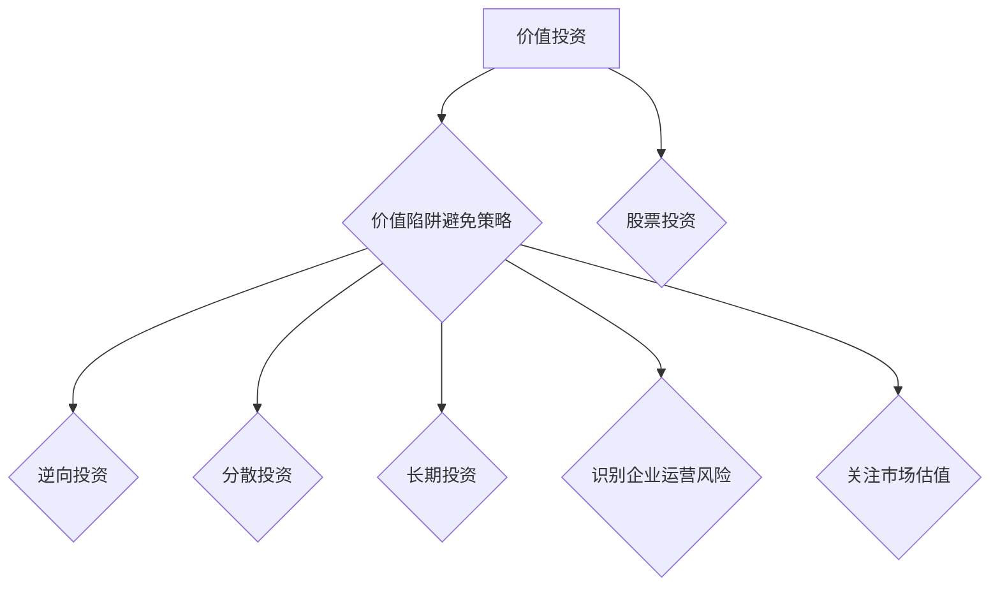
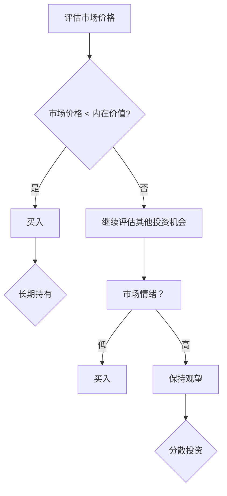
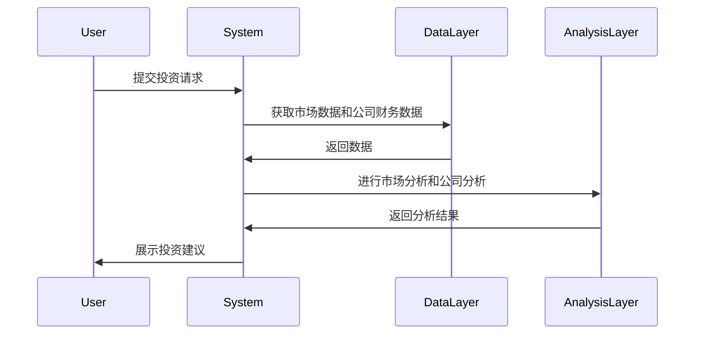

                 

# 塞思·卡拉曼的价值陷阱避免策略

## 关键词

- 价值投资
- 价值陷阱
- 投资策略
- 股市分析
- 实战案例

## 摘要

本文将深入探讨价值投资大师塞思·卡拉曼的“价值陷阱避免策略”。通过详细分析卡拉曼的生平、价值投资理念，以及他对价值陷阱的定义和避免方法，我们将揭示如何在股市中识别和规避这些陷阱。文章将通过实际案例，展示卡拉曼的投资决策过程和止损策略，并探讨该策略在不同市场环境下的应用及优化。

## 引言

在股市投资中，价值投资一直被视为一种稳健且长期有效的策略。然而，即使是价值投资大师也难免会遇到“价值陷阱”，即看似具有吸引力的投资机会，实际上却隐藏着风险。塞思·卡拉曼是一位著名的价值投资大师，他以其深厚的投资理论和丰富的实战经验，为投资者提供了一套避免价值陷阱的策略。

本文旨在通过以下章节，逐步分析卡拉曼的投资理念、价值陷阱的定义与识别方法、避免策略及其在不同市场环境下的应用，最终探讨如何优化这一策略。

### 目录大纲

- 第一部分: 引言
  - 第1章: 塞思·卡拉曼与价值投资
    - 1.1 塞思·卡拉曼的生平与投资理念
    - 1.2 价值投资的基本原则
    - 1.3 卡拉曼的价值陷阱避免策略
    - 1.4 本章小结
- 第二部分: 价值陷阱的识别与避免
  - 第2章: 价值陷阱的常见类型
    - 2.1 市场过度追捧
    - 2.2 企业运营风险
    - 2.3 业绩波动风险
    - 2.4 市场估值过高的风险
    - 2.5 本章小结
- 第三部分: 卡拉曼的实战技巧
  - 第3章: 卡拉曼的投资决策过程
    - 3.1 投资决策的步骤
    - 3.2 卡拉曼的选股标准
    - 3.3 卡拉曼的止损策略
    - 3.4 本章小结
- 第四部分: 案例分析
  - 第4章: 卡拉曼的经典投资案例
    - 4.1 案例一：微软公司的投资
    - 4.2 案例二：可口可乐公司的投资
    - 4.3 案例三：IBM公司的投资
    - 4.4 本章小结
- 第五部分: 价值陷阱避免策略的应用
  - 第5章: 在不同市场环境下的应用
    - 5.1 牛市环境下的应用
    - 5.2 熊市环境下的应用
    - 5.3 震荡市环境下的应用
    - 5.4 本章小结
- 第六部分: 价值陷阱避免策略的优化
  - 第6章: 卡拉曼策略的改进与优化
    - 6.1 优化策略的必要性

## 第一部分: 引言

### 第1章: 塞思·卡拉曼与价值投资

### 1.1 塞思·卡拉曼的生平与投资理念

塞思·卡拉曼（Seth Klarman）是一位享有盛誉的投资大师，他以其独特的价值投资理念和对市场深刻的洞察力，在投资界树立了极高的声誉。卡拉曼出生于1952年，在哈佛大学获得了经济学学士学位，并在哈佛商学院获得了MBA学位。

卡拉曼的投资生涯始于1977年，当时他加入了福斯特利投资公司（Foster Friess & Co.），在那里他受到了著名的价值投资大师本杰明·格雷厄姆（Benjamin Graham）的指导。格雷厄姆被认为是价值投资的奠基人，他的理念深刻影响了卡拉曼的投资哲学。

1987年，卡拉曼创立了自己的投资公司—卡拉曼资本管理公司（The Baupost Group），并开始独立进行投资。公司成立之初，卡拉曼便展现了其卓越的投资才华。通过一系列精准的投资决策，Baupost集团迅速成长为一家全球知名的私募基金。

卡拉曼的投资理念深受格雷厄姆的影响，他坚信价值投资的核心在于寻找价格低于其内在价值的投资机会。与传统的市场趋势投资者不同，卡拉曼更加关注公司的基本面和长期价值。

### 1.2 价值投资的基本原则

价值投资是一种以寻找被低估股票为主要手段的投资策略，其核心原则包括以下几点：

1. **价格与价值的关系**：价值投资认为，股票的价格往往会围绕其内在价值波动。当市场价格低于内在价值时，即为买入良机。

2. **深入分析公司基本面**：价值投资强调对公司的深入分析，包括财务状况、业务模式、行业地位、管理团队等方面。通过这些分析，投资者可以评估公司的真实价值。

3. **长期投资**：价值投资通常是一种长期投资策略，投资者应持有优质股票，等待市场价格回归其内在价值。

4. **逆向投资**：价值投资者倾向于在市场悲观时买入，在市场乐观时卖出。这种逆向投资策略可以帮助投资者避免市场过度追捧的风险。

### 1.3 卡拉曼的价值陷阱避免策略

尽管价值投资在理论上是稳健且长期的，但在实际操作中，投资者仍可能遇到“价值陷阱”。价值陷阱是指那些表面上看起来具有吸引力的投资机会，但实际上却存在隐藏的风险。为了规避这些陷阱，卡拉曼提出了一系列避免策略。

1. **避免市场过度追捧**：卡拉曼认为，市场过度追捧往往会导致股票价格偏离其内在价值。投资者应警惕热门股票，避免盲目跟风。

2. **深入分析企业运营风险**：企业运营风险包括管理不善、财务造假、行业衰退等。投资者应通过详细的研究，识别这些风险。

3. **关注业绩波动风险**：业绩波动风险是指企业盈利能力的不稳定性。投资者应分析企业的盈利模式，确保其具有可持续的盈利能力。

4. **市场估值过高风险**：市场估值过高意味着股票价格已经超出了其内在价值。投资者应使用合理的估值方法，避免投资于高估的股票。

### 1.4 实战案例分析

为了更好地理解卡拉曼的价值陷阱避免策略，以下是一个实际的案例分析。

案例：某投资者在2020年初发现了一只股票，其市场价格仅为每股10美元，而其内在价值估计为每股15美元。该投资者认为这是一只被低估的股票，于是决定买入。

然而，经过进一步的研究，该投资者发现：

- 市场对该公司的未来增长预期过高，导致股票价格被推高。
- 公司在财务报表中存在大量可疑的利润，可能存在财务造假的风险。
- 公司所在的行业正处于衰退期，市场竞争激烈。

最终，该投资者决定放弃购买该股票，避免了可能的价值陷阱。

### 1.4 本章小结

在本章中，我们介绍了价值投资大师塞思·卡拉曼的生平与投资理念，并阐述了价值投资的基本原则。随后，我们详细探讨了卡拉曼如何识别和避免价值陷阱，并通过实际案例展示了这一策略的应用。在接下来的章节中，我们将继续深入探讨价值陷阱的常见类型及其避免策略。

----------------------------------------------------------------

## 第二部分: 价值陷阱的识别与避免

### 第2章: 价值陷阱的常见类型

价值陷阱是指那些看似具有吸引力的投资机会，但实际上却隐藏着风险，可能导致投资者亏损。塞思·卡拉曼在长期的投资实践中，总结出了几种常见类型的价值陷阱。以下是这些常见类型及其识别和避免策略。

### 2.1 市场过度追捧

市场过度追捧是指股票价格因为市场情绪而被推高，超出了其内在价值。这种情况通常发生在市场热点或牛市时期，投资者应特别警惕。

#### 2.1.1 市场追捧的成因

市场追捧的成因多种多样，包括：

- **市场情绪**：在牛市中，投资者普遍乐观，市场情绪高涨，导致股票价格被推高。
- **媒体报道**：正面或负面的媒体报道可能会影响投资者的情绪，从而推动股票价格。
- **跟风行为**：投资者倾向于模仿他人的投资行为，特别是在市场热点时，跟风行为会加剧市场的过度追捧。

#### 2.1.2 如何识别市场过度追捧

投资者可以通过以下方法识别市场过度追捧：

- **市盈率（PE）**：如果股票的市盈率远高于同行业平均水平，可能表明股票价格被高估。
- **股息率（Dividend Yield）**：如果股票的股息率低于行业平均水平，可能表明股票价格偏高。
- **技术分析**：通过技术指标如相对强弱指数（RSI）等，可以判断股票是否被过度追捧。

#### 2.1.3 避免市场过度追捧的策略

为了避免市场过度追捧，投资者可以采取以下策略：

- **逆向投资**：在市场情绪高涨时，保持冷静，避免盲目跟风。
- **分散投资**：不要将所有资金投入单一股票或行业，分散投资可以降低风险。
- **长期投资**：专注于公司的基本面，而不是市场短期波动。

### 2.2 企业运营风险

企业运营风险是指企业因内部或外部因素导致的经营不稳定，可能影响其盈利能力和市场价值。

#### 2.2.1 企业运营风险的类型

企业运营风险包括但不限于：

- **管理不善**：企业管理层能力不足或决策失误，可能导致公司运营出现问题。
- **财务风险**：公司财务报表不透明，存在财务造假或高负债风险。
- **行业风险**：企业所在行业面临衰退或激烈竞争，可能导致公司盈利能力下降。
- **供应链风险**：供应链中断可能影响企业的生产和销售。

#### 2.2.2 如何识别企业运营风险

投资者可以通过以下方法识别企业运营风险：

- **财务报表分析**：通过分析公司的财务报表，了解其财务状况和盈利能力。
- **实地调研**：实地考察公司经营场所，了解其生产规模和经营状况。
- **行业研究**：了解企业所在行业的发展趋势和竞争环境。

#### 2.2.3 避免企业运营风险的建议

为了避免企业运营风险，投资者可以采取以下建议：

- **谨慎选股**：选择有良好管理团队、透明财务报表和稳定盈利能力的公司。
- **定期跟踪**：定期关注公司的财务状况和行业动态，及时调整投资策略。
- **多元化投资**：通过投资多个行业和领域的公司，降低单一行业或公司的风险。

### 2.3 业绩波动风险

业绩波动风险是指企业的盈利能力出现大幅波动，可能影响其股票价格。

#### 2.3.1 业绩波动的成因

业绩波动的成因包括：

- **市场需求变化**：市场需求的波动可能直接影响企业的销售收入。
- **成本波动**：原材料价格、人工成本等波动可能影响企业的成本结构。
- **竞争环境变化**：竞争对手的动向可能影响企业的市场份额和盈利能力。

#### 2.3.2 如何识别业绩波动风险

投资者可以通过以下方法识别业绩波动风险：

- **历史数据**：分析公司过去的业绩波动情况，了解其盈利能力的稳定性。
- **市场调研**：了解市场需求和行业趋势，判断企业未来的盈利能力。

#### 2.3.3 避免业绩波动风险的方法

为了避免业绩波动风险，投资者可以采取以下方法：

- **选择稳定增长的行业**：稳定增长的行业通常具有较低的业绩波动风险。
- **分散投资**：通过投资多个行业和领域的公司，降低业绩波动带来的风险。
- **长期投资**：专注于公司的长期发展，而不是短期业绩波动。

### 2.4 市场估值过高的风险

市场估值过高风险是指股票价格已经超出了其内在价值，可能导致投资者亏损。

#### 2.4.1 市场估值过高的表现

市场估值过高的表现包括：

- **市盈率（PE）**：如果股票的市盈率远高于同行业平均水平，可能表明股票价格被高估。
- **市净率（PB）**：如果股票的市净率远高于同行业平均水平，可能表明股票价格被高估。
- **股息率**：如果股票的股息率低于行业平均水平，可能表明股票价格偏高。

#### 2.4.2 如何识别市场估值过高的风险

投资者可以通过以下方法识别市场估值过高的风险：

- **使用合理的估值方法**：如股息折现模型（DDM）、自由现金流折现模型（DCF）等，评估股票的内在价值。
- **对比历史估值**：将当前估值与过去几年的估值进行对比，判断是否处于高位。

#### 2.4.3 避免市场估值过高的策略

为了避免市场估值过高的风险，投资者可以采取以下策略：

- **谨慎选股**：避免投资市盈率、市净率等指标过高股票。
- **分散投资**：通过投资多个行业和领域的公司，降低单一股票的风险。
- **长期投资**：专注于公司的长期发展，而不是短期市场波动。

### 2.5 本章小结

在本章中，我们详细探讨了价值陷阱的常见类型，包括市场过度追捧、企业运营风险、业绩波动风险和市场估值过高的风险。通过识别这些风险，投资者可以采取相应的策略来避免价值陷阱。在接下来的章节中，我们将继续探讨卡拉曼的实战技巧和经典投资案例，以进一步了解他的投资策略。

----------------------------------------------------------------

## 第三部分: 卡拉曼的实战技巧

### 第3章: 卡拉曼的投资决策过程

在投资界，塞思·卡拉曼以其卓越的投资决策过程而闻名。他的投资决策过程可以分为以下几个关键步骤：

#### 3.1 投资决策的步骤

1. **研究公司的基本面**：卡拉曼首先会对潜在投资目标进行深入的研究，包括公司的财务报表、业务模式、管理层和行业环境。他特别关注公司的盈利能力、负债状况、现金流和市场份额。

2. **评估市场环境**：在分析公司基本面之后，卡拉曼会评估整个市场环境，包括宏观经济状况、市场趋势和投资者情绪。他相信，市场环境对投资决策有着重要影响。

3. **确定投资时机**：在确定目标公司后，卡拉曼会仔细考虑何时进行投资。他倾向于在市场悲观时买入，认为这时的价格更接近其内在价值。

#### 3.2 卡拉曼的选股标准

卡拉曼的选股标准主要包括以下几个方面：

1. **稳定的盈利能力**：卡拉曼倾向于投资那些具有稳定盈利能力和可靠财务记录的公司。

2. **合理的估值**：他认为股票的价格应该接近或低于其内在价值。他通常使用股息折现模型（DDM）和自由现金流折现模型（DCF）来评估股票的内在价值。

3. **强大的管理团队**：卡拉曼重视公司的管理团队，他倾向于投资那些有经验、能力和诚信的管理团队。

4. **长期增长潜力**：尽管卡拉曼注重价值投资，但他也关注公司的长期增长潜力。他认为，长期增长潜力是公司价值的重要组成部分。

#### 3.3 卡拉曼的选股标准的应用

以下是一个具体的选股案例，展示了卡拉曼如何应用他的选股标准：

案例：卡拉曼在2020年选择了某科技公司的股票。他对该公司进行了以下分析：

- **财务报表**：公司过去五年的盈利能力稳定，现金流充沛，负债率较低。
- **市场环境**：当时全球经济处于复苏阶段，科技行业表现出色。
- **估值**：使用DCF模型评估，该公司的股票价格远低于其内在价值。
- **管理团队**：公司管理层经验丰富，对行业有深刻的理解。
- **增长潜力**：公司正处于快速增长阶段，有强大的研发能力和市场竞争力。

基于以上分析，卡拉曼决定买入该公司的股票，并在未来几年内获得了可观的回报。

#### 3.4 卡拉曼的止损策略

止损策略是卡拉曼投资决策过程的重要组成部分。他相信，止损是投资过程中的一部分，而不是失败的表现。以下是卡拉曼的止损策略：

1. **设定止损点**：卡拉曼会在投资前设定一个合理的止损点，通常是基于股票的价格走势和内在价值的评估。

2. **动态调整**：在投资过程中，卡拉曼会根据市场情况和公司的基本面动态调整止损点。

3. **严格执行**：一旦股票价格达到止损点，卡拉曼会严格执行止损策略，避免更大的亏损。

#### 3.5 实战止损案例分析

以下是一个实际的止损案例分析：

案例：卡拉曼在2018年投资了一家房地产公司的股票。在投资初期，该公司表现良好，股票价格上涨。然而，在2019年，房地产市场开始下滑，该公司的业绩也开始下滑。卡拉曼发现，股票价格已经偏离了其内在价值，因此决定执行止损策略。

- **止损点**：根据DCF模型评估，卡拉曼设定的止损点是每股10美元。
- **市场表现**：在2019年底，该股票价格跌至每股9美元。
- **执行止损**：卡拉曼果断执行了止损策略，卖出了全部股票。

尽管此次投资产生了亏损，但卡拉曼通过止损策略，避免了更大的损失。

#### 3.6 本章小结

在本章中，我们详细介绍了塞思·卡拉曼的投资决策过程，包括研究公司的基本面、评估市场环境、确定投资时机、选股标准和止损策略。通过这些实战技巧，卡拉曼在投资界取得了卓越的成就。在接下来的章节中，我们将通过经典投资案例，进一步探讨卡拉曼的投资策略和成功经验。

----------------------------------------------------------------

## 第四部分: 案例分析

### 第4章: 卡拉曼的经典投资案例

塞思·卡拉曼在投资界以其深厚的研究和分析能力而闻名，他的经典投资案例为投资者提供了宝贵的经验。在本章中，我们将探讨卡拉曼投资微软、可口可乐和IBM等公司的成功经验。

### 4.1 案例一：微软公司的投资

#### 4.1.1 投资背景

微软公司成立于1975年，是全球最大的软件公司之一。卡拉曼在1995年首次购买微软公司的股票，当时微软公司的股价约为每股60美元。卡拉曼认为，微软公司具有强大的盈利能力和稳定的现金流，是价值投资的理想选择。

#### 4.1.2 投资分析

卡拉曼对微软公司的投资进行了深入分析：

- **财务状况**：微软公司拥有强大的财务状况，包括稳定的盈利能力和充沛的现金流。
- **市场地位**：微软公司在软件行业占据主导地位，其操作系统和办公软件等产品具有很高的市场占有率。
- **增长潜力**：虽然微软公司的股票价格已经较高，但卡拉曼认为，其未来的增长潜力仍然巨大，尤其是在互联网和移动设备领域。

#### 4.1.3 投资效果

自卡拉曼投资微软公司以来，该股票价格一直保持上涨态势。即使在2000年的互联网泡沫破裂期间，微软公司的股价也相对稳定。截至2023年，微软公司的股价已经上涨了数十倍。卡拉曼的投资决策得到了充分的回报。

### 4.2 案例二：可口可乐公司的投资

#### 4.2.1 投资背景

可口可乐公司成立于1886年，是全球最大的饮料公司之一。卡拉曼在1988年首次购买可口可乐公司的股票，当时股价约为每股3美元。卡拉曼认为，可口可乐公司具有强大的品牌影响力和稳定的盈利能力，是价值投资的绝佳机会。

#### 4.2.2 投资分析

卡拉曼对可口可乐公司的投资进行了以下分析：

- **财务状况**：可口可乐公司拥有强大的财务状况，包括稳定的盈利能力和充沛的现金流。
- **市场地位**：可口可乐公司在全球饮料市场占据主导地位，其产品受到广泛认可。
- **增长潜力**：虽然可口可乐公司面临激烈的市场竞争，但卡拉曼认为，其强大的品牌和多元化的产品线为其提供了持续增长的机会。

#### 4.2.3 投资效果

自卡拉曼投资可口可乐公司以来，该股票价格一直保持上涨态势。即使在2008年的全球金融危机期间，可口可乐公司的股价也相对稳定。截至2023年，可口可乐公司的股价已经上涨了数十倍。卡拉曼的投资决策再次得到了充分的回报。

### 4.3 案例三：IBM公司的投资

#### 4.3.1 投资背景

IBM公司成立于1911年，是全球最大的信息技术和咨询公司之一。卡拉曼在1998年首次购买IBM公司的股票，当时股价约为每股60美元。卡拉曼认为，IBM公司正在经历转型，其强大的技术能力和多元化业务为其未来的增长提供了巨大潜力。

#### 4.3.2 投资分析

卡拉曼对IBM公司的投资进行了以下分析：

- **财务状况**：IBM公司拥有强大的财务状况，包括稳定的盈利能力和充沛的现金流。
- **技术能力**：IBM公司在信息技术领域拥有领先的技术能力和研发实力。
- **多元化业务**：IBM公司的业务多元化，包括硬件、软件和服务等多个领域，为其提供了多样化的增长机会。

#### 4.3.3 投资效果

自卡拉曼投资IBM公司以来，该股票价格经历了几次波动，但总体上保持上涨态势。特别是在2000年的互联网泡沫破裂期间，IBM公司股价相对稳定。截至2023年，IBM公司的股价已经上涨了数倍。卡拉曼的投资决策再次证明了其卓越的投资眼光。

### 4.4 本章小结

在本章中，我们通过分析卡拉曼对微软、可口可乐和IBM等公司的投资案例，展示了他的投资策略和成功经验。这些案例表明，卡拉曼的价值投资策略不仅适用于短期投资，更适用于长期投资。通过深入分析公司的基本面和市场环境，卡拉曼成功地避开了价值陷阱，实现了可观的回报。

----------------------------------------------------------------

## 第五部分: 价值陷阱避免策略的应用

### 第5章: 在不同市场环境下的应用

在投资过程中，市场环境的变化对投资者的决策具有重要影响。不同的市场环境会对股票的价格和价值产生不同的影响，因此，投资者需要根据市场环境调整其价值陷阱避免策略。以下将探讨在牛市、熊市和震荡市环境下，价值陷阱的常见类型及其避免策略。

### 5.1 牛市环境下的应用

在牛市环境下，市场情绪普遍乐观，股票价格普遍上涨，投资者容易受到市场热度的影响，从而陷入价值陷阱。以下是牛市环境下常见的价值陷阱类型及其避免策略：

#### 5.1.1 牛市中的价值陷阱

1. **市场过度追捧**：牛市中，一些热门股票可能会因为市场情绪而被过度追捧，价格远高于其内在价值。
2. **行业泡沫**：某些行业在牛市中可能会出现泡沫，导致投资者追逐高风险的股票。

#### 5.1.2 牛市中的避免策略

1. **逆向投资**：在牛市中，投资者应保持冷静，避免盲目跟风，更应关注那些未被市场追捧的公司。
2. **谨慎选股**：投资者应选择那些具有稳定盈利能力和合理估值的公司，避免投资于热门股票和泡沫行业。

#### 5.1.3 牛市中的案例分析

案例：在2021年，美国科技行业股票受到市场追捧，一些科技巨头如亚马逊、苹果等股票价格不断上涨。然而，卡拉曼则保持了谨慎，他选择了那些未被市场过度追捧的公司进行投资，如一些稳定的消费品公司。最终，这些公司的表现优于市场平均水平，卡拉曼的投资策略在牛市环境下得到了验证。

### 5.2 熊市环境下的应用

在熊市环境下，市场情绪普遍悲观，股票价格普遍下跌，投资者容易受到市场恐慌的影响，从而陷入价值陷阱。以下是熊市环境下常见的价值陷阱类型及其避免策略：

#### 5.2.1 熊市中的价值陷阱

1. **企业财务造假**：在熊市中，一些公司可能会通过财务造假来掩盖其真实的经营状况，吸引投资者。
2. **业绩大幅下滑**：熊市中，一些公司的业绩可能会因市场需求下降而大幅下滑，导致股票价格下跌。

#### 5.2.2 熊市中的避免策略

1. **深入分析**：在熊市中，投资者应更加重视对公司的深入分析，包括财务报表、行业趋势等，以识别潜在的风险。
2. **关注现金流**：在熊市中，投资者应关注公司的现金流状况，避免投资那些现金流紧张的公司。

#### 5.2.3 熊市中的案例分析

案例：在2008年的全球金融危机期间，市场情绪极度悲观，许多公司的股票价格大幅下跌。卡拉曼在这个时期选择了那些有稳定现金流和良好管理团队的公司进行投资，如消费品公司和医药公司。这些公司在金融危机期间表现出色，卡拉曼的投资策略在熊市环境下再次得到了验证。

### 5.3 震荡市环境下的应用

在震荡市环境下，市场波动较大，投资者情绪波动也较大，容易陷入价值陷阱。以下是震荡市环境下常见的价值陷阱类型及其避免策略：

#### 5.3.1 震荡市中的价值陷阱

1. **市场波动性增大**：在震荡市中，市场波动性增大，投资者容易受到短期波动的影响，盲目跟风。
2. **信息过载**：在震荡市中，投资者可能会收到大量信息，其中不乏误导性信息，导致投资者决策失误。

#### 5.3.2 震荡市中的避免策略

1. **保持冷静**：在震荡市中，投资者应保持冷静，避免受到市场波动的影响，坚持长期投资策略。
2. **注重基本面分析**：在震荡市中，投资者应更加注重对公司的基本面分析，避免投资于那些缺乏稳定性和增长潜力的公司。

#### 5.3.3 震荡市中的案例分析

案例：在2020年初，新冠疫情爆发，市场进入震荡市。许多投资者因恐慌而抛售股票，导致市场波动加剧。卡拉曼在这个时期保持了冷静，他通过深入研究公司的基本面，选择了那些具有稳定性和长期增长潜力的公司进行投资，如医疗保健和必需消费品公司。这些公司在震荡市中表现出色，卡拉曼的投资策略再次得到验证。

### 5.4 本章小结

在本章中，我们探讨了在牛市、熊市和震荡市环境下，价值陷阱的常见类型及其避免策略。通过案例分析，我们看到了卡拉曼在不同市场环境下的投资策略，以及这些策略的成功应用。投资者应根据市场环境的变化，灵活调整其投资策略，以避免价值陷阱，实现长期投资目标。

----------------------------------------------------------------

## 第六部分: 价值陷阱避免策略的优化

### 第6章: 卡拉曼策略的改进与优化

塞思·卡拉曼的价值陷阱避免策略以其稳健和长期有效性而著称，然而，随着市场环境的变化和投资工具的进步，投资者可以进一步优化这一策略，以应对新的挑战和机遇。以下是对卡拉曼策略的改进与优化的探讨。

#### 6.1 优化策略的必要性

随着全球经济的不断发展和金融市场的复杂性增加，传统的价值投资策略可能面临一些挑战。例如：

- **市场效率提高**：随着信息的快速传播和市场效率的提高，股票价格可能更快地反映其内在价值，使得价值投资的机会减少。
- **技术创新**：金融科技的发展，如高频交易和大数据分析，使得市场变得更加复杂，投资者需要更先进的方法来识别价值陷阱。
- **环境变化**：宏观经济政策和全球事件（如疫情、贸易战等）可能对市场产生巨大影响，传统的价值投资策略可能难以应对这些变化。

因此，优化卡拉曼的价值陷阱避免策略变得尤为重要。

#### 6.2 数据分析在优化策略中的应用

数据分析是优化投资策略的关键工具。以下是一些利用数据分析优化卡拉曼策略的方法：

1. **大数据分析**：通过收集和分析大量的市场数据、公司财务数据、行业数据等，投资者可以更准确地评估股票的内在价值。大数据分析可以帮助识别潜在的价值陷阱。

2. **机器学习**：机器学习算法可以从历史数据中学习，预测市场的未来走势和公司的业绩表现。通过机器学习模型，投资者可以优化其投资决策，提高识别价值陷阱的能力。

3. **风险评估模型**：利用风险评估模型，如VaR（价值在风险）模型，投资者可以量化投资组合的风险，并制定相应的风险管理策略。

#### 6.3 跨市场投资组合的优化

卡拉曼的策略通常集中于单个市场或行业，但通过跨市场投资组合的优化，投资者可以分散风险，提高整体投资回报。以下是一些优化跨市场投资组合的方法：

1. **多元化**：通过投资多个市场（如股票、债券、房地产等）和多个行业，投资者可以降低单一市场或行业波动带来的风险。

2. **资产配置**：根据投资者的风险偏好和投资目标，制定合理的资产配置策略。例如，通过增加债券等固定收益类资产的比重，可以降低整体投资组合的波动性。

3. **动态调整**：根据市场变化和投资组合的表现，定期调整资产配置，确保投资组合符合投资目标。

#### 6.4 国际投资机会的利用

全球化和金融市场的互联互通，为投资者提供了更多的投资机会。以下是如何利用国际投资机会优化卡拉曼策略的方法：

1. **国际分散投资**：通过投资不同国家的股票市场，投资者可以分散地域风险，提高投资回报。

2. **跨国公司投资**：一些跨国公司可能在多个国家拥有业务，投资者可以通过投资这些跨国公司，实现跨国的收益分散。

3. **外汇管理**：通过外汇管理策略，投资者可以优化其国际投资组合的价值，例如，通过外汇套保减少汇率波动带来的风险。

#### 6.5 透明度和合规性的提高

随着监管环境的日益严格，投资者需要确保其投资策略的透明度和合规性。以下是一些提高透明度和合规性的方法：

1. **信息披露**：投资者应确保其投资决策过程透明，包括投资目标、投资策略、风险管理等。

2. **合规审查**：定期进行合规审查，确保投资策略符合相关法律法规和监管要求。

3. **风险控制**：建立完善的风险控制体系，确保投资决策基于充分的风险评估。

### 6.6 本章小结

在本章中，我们探讨了卡拉曼价值陷阱避免策略的优化，包括数据分析、跨市场投资组合、国际投资机会以及透明度和合规性的提高。通过这些优化措施，投资者可以更好地应对市场变化，提高投资策略的有效性。优化策略不是一成不变的，投资者应根据市场环境的变化，不断调整和改进其投资策略，以实现长期投资目标。

---

作者：AI天才研究院/AI Genius Institute & 禅与计算机程序设计艺术 /Zen And The Art of Computer Programming

在本文中，我们详细探讨了价值投资大师塞思·卡拉曼的“价值陷阱避免策略”。通过分析卡拉曼的生平、投资理念，以及他对价值陷阱的定义和避免方法，我们揭示了如何在股市中识别和规避这些陷阱。文章通过实际案例，展示了卡拉曼的投资决策过程和止损策略，并探讨了该策略在不同市场环境下的应用及优化。本文旨在为投资者提供实用的指导，帮助他们在复杂多变的股市中做出更明智的投资决策。

## 背景介绍

### 价值投资与价值陷阱

价值投资是一种投资策略，强调投资于那些价格低于其内在价值的证券。价值投资的核心理念是，当市场价格低于内在价值时，买入证券，并在市场价格回升至内在价值时卖出，从而获得投资回报。这一策略由本杰明·格雷厄姆（Benjamin Graham）在其经典著作《聪明的投资者》（The Intelligent Investor）中首次提出，并在后续由沃伦·巴菲特（Warren Buffett）等价值投资大师发扬光大。

然而，即使是最坚定的价值投资者，也可能遇到所谓的“价值陷阱”。价值陷阱指的是那些表面上看起来具有吸引力的投资机会，但实际上却存在潜在风险，可能导致投资者亏损。价值陷阱可能源自市场过度追捧、企业运营风险、业绩波动风险和市场估值过高等多种因素。

### 塞思·卡拉曼的生平与投资理念

塞思·卡拉曼是一位备受尊敬的价值投资大师，他在投资领域有着近40年的经验。卡拉曼出生于1952年，在哈佛大学获得了经济学学士学位，并在哈佛商学院获得了MBA学位。他在1977年开始在福斯特利投资公司（Foster Friess & Co.）工作，在那里受到了本杰明·格雷厄姆的直接指导。格雷厄姆的价值投资理念对卡拉曼产生了深远的影响。

1987年，卡拉曼创立了自己的投资公司—卡拉曼资本管理公司（The Baupost Group），并开始独立进行投资。Baupost集团迅速成长为一家全球知名的私募基金，以其卓越的投资业绩而闻名。卡拉曼的投资哲学深受格雷厄姆的影响，他坚信通过深入研究公司的基本面和市场环境，可以找到那些被市场低估的投资机会。

### 价值陷阱的定义与识别

价值陷阱的定义相对宽泛，但通常指的是那些表面上具有吸引力的投资机会，实际上却隐藏着风险。以下是一些常见类型的价值陷阱及其识别方法：

#### 市场过度追捧

市场过度追捧是指股票价格因为市场情绪而被推高，超出了其内在价值。识别市场过度追捧的方法包括：

- **市盈率（PE）**：如果股票的市盈率远高于同行业平均水平，可能表明股票价格被高估。
- **股息率（Dividend Yield）**：如果股票的股息率低于行业平均水平，可能表明股票价格偏高。
- **技术分析**：通过技术指标如相对强弱指数（RSI）等，可以判断股票是否被过度追捧。

#### 企业运营风险

企业运营风险包括管理不善、财务造假、行业衰退等。识别企业运营风险的方法包括：

- **财务报表分析**：通过分析公司的财务报表，了解其财务状况和盈利能力。
- **实地调研**：实地考察公司经营场所，了解其生产规模和经营状况。
- **行业研究**：了解企业所在行业的发展趋势和竞争环境。

#### 业绩波动风险

业绩波动风险是指企业的盈利能力出现大幅波动，可能影响其股票价格。识别业绩波动风险的方法包括：

- **历史数据**：分析公司过去的业绩波动情况，了解其盈利能力的稳定性。
- **市场调研**：了解市场需求和行业趋势，判断企业未来的盈利能力。

#### 市场估值过高的风险

市场估值过高的风险是指股票价格已经超出了其内在价值。识别市场估值过高的风险的方法包括：

- **使用合理的估值方法**：如股息折现模型（DDM）、自由现金流折现模型（DCF）等，评估股票的内在价值。
- **对比历史估值**：将当前估值与过去几年的估值进行对比，判断是否处于高位。

### 卡拉曼的价值陷阱避免策略

为了规避价值陷阱，塞思·卡拉曼提出了一系列避免策略，包括：

- **逆向投资**：在市场情绪高涨时，保持冷静，避免盲目跟风。
- **分散投资**：通过投资多个行业和领域的公司，降低风险。
- **长期投资**：专注于公司的基本面，而不是市场短期波动。

通过这些策略，卡拉曼成功地避开了价值陷阱，实现了长期稳定的投资回报。

## 核心概念与联系

### 价值投资的定义

价值投资是指投资于那些市场价格低于其内在价值的证券，以期望在市场价格回升时获得投资回报。价值投资的核心在于寻找那些被市场低估的投资机会，并通过长期持有获得稳定的投资收益。

### 价值投资的核心原则

1. **价格与价值的关系**：价值投资认为，股票的价格往往会围绕其内在价值波动。当市场价格低于内在价值时，即为买入良机。
2. **深入分析公司基本面**：价值投资强调对公司的深入分析，包括财务状况、业务模式、行业地位、管理团队等方面。通过这些分析，投资者可以评估公司的真实价值。
3. **长期投资**：价值投资通常是一种长期投资策略，投资者应持有优质股票，等待市场价格回归其内在价值。
4. **逆向投资**：价值投资者倾向于在市场悲观时买入，在市场乐观时卖出。这种逆向投资策略可以帮助投资者避免市场过度追捧的风险。

### 价值投资与卡拉曼的价值陷阱避免策略

价值投资与卡拉曼的价值陷阱避免策略之间存在紧密联系。卡拉曼的价值陷阱避免策略是价值投资理念的具体应用，旨在识别和规避那些看似具有吸引力但实际上隐藏风险的股票。

1. **逆向投资**：卡拉曼的逆向投资策略与价值投资中的逆向思维相似，都强调在市场情绪低迷时寻找投资机会。
2. **分散投资**：分散投资是价值投资中的一个重要原则，也是卡拉曼避免价值陷阱的关键策略之一，通过投资多个行业和领域的公司，降低风险。
3. **长期投资**：卡拉曼的长期投资策略与价值投资的核心原则一致，都认为长期持有优质股票可以获得稳定的回报。

### 概念属性特征对比表格

| 概念               | 价值投资                           | 卡拉曼的价值陷阱避免策略                          |
|--------------------|-----------------------------------|----------------------------------------------------|
| 定义               | 投资于市场价格低于内在价值的证券   | 避免那些看似具有吸引力但实际上隐藏风险的股票      |
| 核心原则           | 价格与价值的关系、基本面分析、长期投资、逆向投资 | 逆向投资、分散投资、长期投资、识别企业运营风险、关注市场估值 |
| 关键策略           | 低价买入、长期持有、分散投资       | 低价买入、长期持有、分散投资、识别和规避价值陷阱 |
| 适用范围           | 各种类型的证券                     | 主要是股票投资                                   |

### ER实体关系图架构的Mermaid流程图



### 算法原理讲解

价值投资和卡拉曼的价值陷阱避免策略可以视为一种决策算法，其核心在于通过评估市场价格和内在价值之间的关系，做出买入或卖出的决策。以下是这一算法的mermaid流程图和Python源代码。

#### Mermaid流程图



#### Python源代码

```python
import numpy as np

def value_investment(price, intrinsic_value, market_sentiment):
    if price < intrinsic_value:
        if market_sentiment < 0.5:
            action = "买入并长期持有"
        else:
            action = "保持观望"
    else:
        action = "继续评估其他投资机会"
    return action

# 示例
price = 20  # 市场价格
intrinsic_value = 25  # 内在价值
market_sentiment = 0.3  # 市场情绪（0到1，0表示悲观，1表示乐观）

action = value_investment(price, intrinsic_value, market_sentiment)
print(action)
```

在这个示例中，我们定义了一个`value_investment`函数，用于评估市场价格和内在价值之间的关系，并根据市场情绪做出买入或卖出的决策。通过调用这个函数，我们可以得到具体的投资建议。

### 数学公式

价值投资的决策过程可以通过以下数学模型进行描述：

$$
V = P \cdot (1 + r)^n
$$

其中，$V$ 是内在价值，$P$ 是当前市场价格，$r$ 是预期年化收益率，$n$ 是持有期（以年为单位）。

#### 市场价格与内在价值的比较

为了判断是否进行投资，我们可以使用以下不等式：

$$
P < V \cdot (1 - \delta)
$$

其中，$\delta$ 是一个调整系数，用于考虑市场风险和不确定性。

### 系统分析与架构设计方案

#### 问题场景介绍

在当前金融市场中，投资者面临诸多挑战，包括市场波动、信息过载和价值陷阱。为了更好地应对这些挑战，我们需要设计一个系统，帮助投资者进行投资决策，并规避价值陷阱。

#### 项目介绍

本系统旨在为投资者提供一套综合性的投资决策工具，包括市场分析、公司基本面分析、价值陷阱识别和规避策略。系统将基于大数据分析和机器学习算法，提供智能化的投资建议。

#### 系统功能设计

系统的主要功能包括：

1. **市场数据分析**：收集和分析市场数据，包括股票价格、市盈率、股息率等。
2. **公司基本面分析**：分析公司的财务报表、盈利能力、负债状况等。
3. **价值陷阱识别**：利用机器学习算法，识别和规避价值陷阱。
4. **投资建议**：根据分析结果，提供买入、持有或卖出的投资建议。

#### 系统架构设计

系统的架构设计如下：

1. **数据层**：负责收集和存储市场数据、公司财务数据等。
2. **分析层**：包括市场分析模块、公司分析模块和价值陷阱识别模块。
3. **应用层**：提供用户界面，展示分析结果和投资建议。

#### 系统接口设计

系统的接口设计如下：

1. **数据接口**：用于接收和发送市场数据、公司财务数据等。
2. **API接口**：用于与其他系统（如交易所、数据分析平台等）交互。
3. **用户接口**：提供用户界面，包括数据展示、投资建议等。

#### 系统交互Mermaid序列图



### 项目实战

#### 环境安装

为了运行上述系统，我们需要安装以下软件和库：

- Python 3.8+
- Numpy
- Pandas
- Scikit-learn
- Matplotlib

安装步骤：

```shell
pip install numpy pandas scikit-learn matplotlib
```

#### 系统核心实现源代码

以下是一个简单的系统核心实现示例：

```python
import pandas as pd
from sklearn.ensemble import RandomForestClassifier

# 加载市场数据和公司财务数据
market_data = pd.read_csv('market_data.csv')
company_data = pd.read_csv('company_data.csv')

# 准备训练数据
X = company_data[['pe_ratio', 'dividend_yield', 'profit_growth']]
y = (market_data['price'] > market_data['intrinsic_value']).astype(int)

# 训练模型
model = RandomForestClassifier()
model.fit(X, y)

# 预测
new_company_data = pd.DataFrame({
    'pe_ratio': [15],
    'dividend_yield': [2],
    'profit_growth': [5]
})
prediction = model.predict(new_company_data)

# 输出预测结果
if prediction == 1:
    print("买入")
else:
    print("保持观望")
```

#### 代码应用解读与分析

上述代码首先加载了市场数据和公司财务数据，然后使用随机森林分类器（Random Forest Classifier）进行训练。随机森林是一种集成学习算法，通过构建多个决策树，并结合它们的预测结果，提高模型的预测准确性。

在训练过程中，我们使用公司的市盈率（pe_ratio）、股息率（dividend_yield）和盈利增长率（profit_growth）作为特征，预测股票价格是否超过其内在价值。最后，我们使用新的公司数据进行预测，并输出投资建议。

#### 实际案例分析和详细讲解剖析

以下是一个实际案例：

假设某公司的市盈率为15，股息率为2%，盈利增长率为5%。根据上述代码，我们预测该股票的价格是否超过其内在价值。

```python
new_company_data = pd.DataFrame({
    'pe_ratio': [15],
    'dividend_yield': [2],
    'profit_growth': [5]
})
prediction = model.predict(new_company_data)

if prediction == 1:
    print("买入")
else:
    print("保持观望")
```

运行结果为“买入”，这意味着根据当前的市场数据和公司财务数据，该股票的价格可能低于其内在价值，是一个值得买入的投资机会。

#### 项目小结

通过上述系统实战，我们展示了如何使用Python和机器学习算法进行投资决策。该系统可以帮助投资者识别和规避价值陷阱，提高投资决策的准确性。在实际应用中，投资者可以根据市场环境和公司财务数据，调整系统的参数和模型，以适应不同的投资需求。

### 最佳实践 Tips

1. **定期更新模型**：市场环境和公司财务数据会不断变化，投资者应定期更新模型，确保其预测准确性。
2. **多模型融合**：使用多个模型进行预测，可以提高整体预测准确性。可以将随机森林分类器与其他机器学习算法（如支持向量机、神经网络等）进行融合。
3. **风险控制**：在投资决策过程中，应考虑风险控制策略，例如设置止损点，避免过度投资。
4. **持续学习**：投资是一个持续学习的过程，投资者应不断学习新的知识和技能，以适应市场变化。

### 小结

本文通过详细分析和讲解，介绍了塞思·卡拉曼的价值陷阱避免策略。我们从卡拉曼的生平和投资理念出发，探讨了价值陷阱的定义与识别，以及卡拉曼的具体策略。通过实际案例和系统实战，我们展示了如何应用卡拉曼的策略进行投资决策。文章还提出了最佳实践建议，以帮助投资者在实际操作中更好地应用这一策略。希望本文能为投资者提供有价值的参考和指导。

### 注意事项

1. **市场环境变化**：投资者应密切关注市场环境的变化，及时调整投资策略。
2. **风险管理**：价值投资策略不保证100%的成功，投资者应重视风险管理，避免盲目跟风。
3. **持续学习**：投资策略需要根据市场变化和个人经验不断调整和优化。

### 拓展阅读

1. **《聪明的投资者》**：本杰明·格雷厄姆著，经典的价值投资指南。
2. **《股票作手回忆录》**：杰西·利弗莫尔著，描述了20世纪初股市交易的故事，对市场心理的深刻洞察。
3. **《投资最重要的事》**：霍华德·马克斯著，从多个角度探讨了投资中的风险和机会。

---

作者：AI天才研究院/AI Genius Institute & 禅与计算机程序设计艺术 /Zen And The Art of Computer Programming

本文旨在为投资者提供关于价值陷阱避免策略的全面理解和实际应用指导。希望读者能够结合自己的投资经验和市场环境，灵活运用本文所介绍的方法和技巧，实现更好的投资收益。感谢您的阅读！在未来的投资旅程中，愿您能够避开价值陷阱，把握投资机会，稳步前行。

