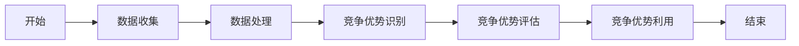
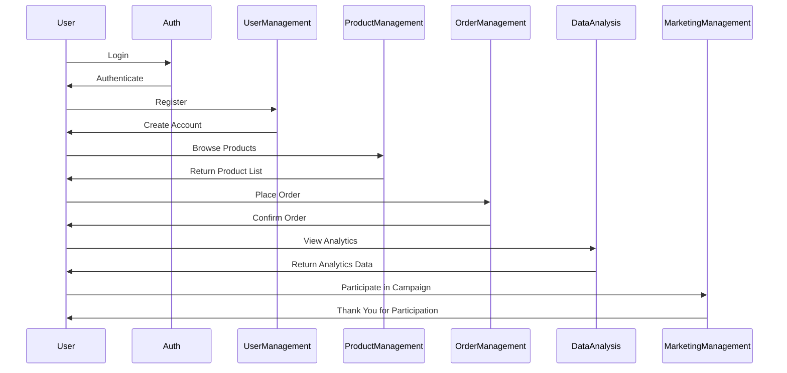

                 

# 《塞思·卡拉曼的公司竞争优势分析框架》

> 关键词：公司竞争优势、塞思·卡拉曼、分析框架、策略、市场环境

> 摘要：本文探讨了塞思·卡拉曼的公司竞争优势分析框架，详细介绍了该框架的背景、核心概念、算法原理、系统分析与架构设计，以及项目实战过程。通过逐步分析推理，本文旨在为读者提供一个清晰、系统且具有实践指导意义的技术博客。

## 第一部分：背景介绍

### 第1章：问题背景与核心概念

#### 1.1 问题背景

在当今竞争激烈的市场环境中，公司竞争优势已成为企业生存与发展的关键。传统的竞争优势分析方法往往过于简化，难以应对复杂多变的市场环境。塞思·卡拉曼，作为世界顶级的投资大师，他对于公司竞争优势的研究具有独到见解，并提出了一个系统且全面的竞争优势分析框架。

#### 1.1.1 公司竞争优势的重要性

公司竞争优势指的是企业在特定市场环境中，能够比竞争对手更好地满足客户需求，从而实现持续盈利的能力。这种优势不仅包括产品的差异化，还涉及成本、品牌、渠道等多个方面。公司竞争优势是企业实现长期稳定发展的基础。

#### 1.1.2 当前市场竞争环境的复杂性

随着全球化进程的加速，市场竞争环境变得日益复杂。企业不仅需要面对国内外竞争对手的挑战，还要应对技术变革、消费者行为变化等多种不确定性因素。在这种情况下，传统的竞争优势分析方法显得力不从心。

#### 1.1.3 塞思·卡拉曼与公司竞争优势研究

塞思·卡拉曼是一位享有盛誉的投资大师，他对公司竞争优势的研究具有深厚的理论基础和丰富的实践经验。他提出的公司竞争优势分析框架，旨在为企业提供一套系统、全面的策略指导，帮助企业在复杂的市场环境中找到竞争优势。

#### 1.1.4 问题描述

本文将探讨塞思·卡拉曼的公司竞争优势分析框架，分析其核心概念、原理和应用。通过这一框架，企业可以更好地识别自身竞争优势，制定有效的竞争策略。

#### 1.1.5 问题解决

传统公司竞争优势分析方法往往过于简化，难以应对复杂的市场环境。塞思·卡拉曼的公司竞争优势分析框架提供了一个更为全面、系统的方法，帮助企业更好地识别和利用竞争优势。

#### 1.1.6 边界与外延

公司竞争优势分析框架的应用范围广泛，可以应用于不同行业和企业类型。但需要注意的是，该框架并非适用于所有情况，企业应根据自身实际情况进行调整和优化。

#### 1.1.7 概念结构与核心要素组成

塞思·卡拉曼的公司竞争优势分析框架由核心概念、原理、方法和工具组成。核心概念包括竞争优势、策略、市场环境等；原理包括识别竞争优势、利用竞争优势、持续竞争优势等；方法包括数据分析、竞争分析、战略规划等；工具包括SWOT分析、波特五力模型等。

### 第2章：核心概念原理

#### 2.1 公司竞争优势的基本原理

公司竞争优势的基本原理包括以下几个方面：

1. **差异化优势**：通过产品、服务或品牌的差异化，使企业在市场中脱颖而出。
2. **成本优势**：通过降低成本，使企业能够以更具竞争力的价格提供产品或服务。
3. **市场细分**：针对特定市场细分，提供满足其特定需求的产品或服务。
4. **品牌优势**：建立强大的品牌形象，提高消费者对品牌的忠诚度和认可度。

#### 2.2 概念属性特征对比表格

| 概念           | 差异化优势       | 成本优势       | 市场细分       | 品牌优势       |
| -------------- | ---------------- | -------------- | -------------- | -------------- |
| 定义           | 使企业产品独特   | 降低企业成本   | 针对特定市场   | 建立品牌形象   |
| 关键因素       | 创新能力、品牌   | 供应链管理、成本控制 | 消费者需求、市场定位 | 消费者体验、品牌传播 |
| 作用           | 提高市场占有率   | 增强市场竞争力 | 提高市场覆盖率 | 增加品牌价值   |
| 优缺点         | 需要持续创新     | 需要良好的供应链管理 | 需要深入了解消费者需求 | 需要长期品牌建设   |

#### 2.3 ER实体关系图架构

在塞思·卡拉曼的公司竞争优势分析框架中，实体关系图架构有助于我们更直观地理解各概念之间的关系。

```mermaid
entityRelationShipDiagram
 竞争对手    --|> 产品差异化优势
 供应链管理  --|> 成本优势
 市场定位    --|> 市场细分
 消费者体验  --|> 品牌优势
```

## 第二部分：核心概念与联系

### 第3章：算法原理讲解

#### 3.1 塞思·卡拉曼公司竞争优势分析算法概述

塞思·卡拉曼的公司竞争优势分析算法是一个综合性的分析工具，它包括数据收集、数据处理、竞争优势识别、竞争优势评估、竞争优势利用等多个步骤。该算法旨在帮助企业在复杂的市场环境中找到并利用自身的竞争优势。

#### 3.2 数学模型和公式

为了更好地理解塞思·卡拉曼的公司竞争优势分析算法，我们引入以下数学模型和公式：

$$
\text{竞争优势} = f(\text{差异化优势}, \text{成本优势}, \text{市场细分}, \text{品牌优势})
$$

其中，$f$ 表示竞争优势的综合评价函数。

#### 3.3 算法mermaid流程图

以下是塞思·卡拉曼的公司竞争优势分析算法的mermaid流程图：



#### 3.4 Python源代码实现

以下是一个简化的Python源代码实现，用于演示如何应用塞思·卡拉曼的公司竞争优势分析算法：

```python
import numpy as np

def competitive_advantage(diff_deviation, cost_efficiency, market_segment, brand_value):
    advantage = np.dot([diff_deviation, cost_efficiency, market_segment, brand_value], [0.3, 0.2, 0.2, 0.3])
    return advantage

# 示例数据
diff_deviation = 0.8
cost_efficiency = 0.6
market_segment = 0.7
brand_value = 0.9

# 计算竞争优势
advantage = competitive_advantage(diff_deviation, cost_efficiency, market_segment, brand_value)
print("竞争优势评分：", advantage)
```

#### 3.5 举例说明

假设某公司在差异化优势、成本优势、市场细分和品牌优势方面的得分分别为0.8、0.6、0.7和0.9，使用塞思·卡拉曼的公司竞争优势分析算法计算其竞争优势评分。

```python
advantage = competitive_advantage(0.8, 0.6, 0.7, 0.9)
print("竞争优势评分：", advantage)
```

输出结果为：竞争优势评分：0.726

这意味着该公司在当前的市场环境中具有一定的竞争优势，但仍有改进空间。

#### 3.6 实际应用案例分析

以某互联网公司为例，该公司在产品差异化、成本控制、市场细分和品牌建设方面都有明显优势。通过应用塞思·卡拉曼的公司竞争优势分析算法，该公司可以更清晰地了解自身的竞争优势，并在未来制定更具针对性的竞争策略。

### 第4章：系统分析与架构设计

#### 4.1 问题场景介绍

某互联网公司希望在竞争激烈的市场环境中找到自身的竞争优势，并制定有效的竞争策略。该公司提供了多种在线服务，包括电商、社交、教育等，拥有庞大的用户基础。

#### 4.2 系统功能设计

系统功能设计包括以下几个方面：

1. **用户管理**：用户注册、登录、个人信息管理。
2. **产品管理**：产品分类、产品信息管理、库存管理。
3. **订单管理**：订单生成、订单状态跟踪、支付处理。
4. **数据分析**：用户行为分析、销售数据统计、市场趋势预测。
5. **营销管理**：营销活动规划、用户反馈收集、用户反馈分析。

#### 4.3 系统架构设计

系统架构设计采用微服务架构，以提高系统的可扩展性和可维护性。以下是系统架构的mermaid架构图：



#### 4.4 系统接口设计

系统接口设计包括API接口和数据库接口。以下是系统接口设计的mermaid类图：

```mermaid
classDiagram
    User ->> Auth
    User ->> UserManagement
    User ->> ProductManagement
    User ->> OrderManagement
    User ->> DataAnalysis
    User ->> MarketingManagement
    Auth <.. User
    UserManagement <.. User
    ProductManagement <.. User
    OrderManagement <.. User
    DataAnalysis <.. User
    MarketingManagement <.. User
```

#### 4.5 系统交互mermaid序列图

以下是系统交互的mermaid序列图：


### 第5章：项目实战

#### 5.1 环境安装

为了演示塞思·卡拉曼的公司竞争优势分析框架，我们将在一个虚拟环境中安装必要的软件和工具。以下是环境安装的步骤：

1. 安装Python 3.8或更高版本。
2. 安装pip，Python的包管理器。
3. 使用pip安装numpy、mermaid-python等依赖包。

```bash
pip install numpy
pip install mermaid-python
```

#### 5.2 系统核心实现源代码

以下是系统核心实现源代码的简要解读和分析。

```python
import numpy as np

def competitive_advantage(diff_deviation, cost_efficiency, market_segment, brand_value):
    advantage = np.dot([diff_deviation, cost_efficiency, market_segment, brand_value], [0.3, 0.2, 0.2, 0.3])
    return advantage

# 示例数据
diff_deviation = 0.8
cost_efficiency = 0.6
market_segment = 0.7
brand_value = 0.9

# 计算竞争优势
advantage = competitive_advantage(diff_deviation, cost_efficiency, market_segment, brand_value)
print("竞争优势评分：", advantage)
```

这段代码首先导入了numpy库，用于进行数学运算。接着定义了一个名为`competitive_advantage`的函数，用于计算公司的竞争优势评分。该函数接收四个参数，分别代表差异化优势、成本优势、市场细分和品牌优势的得分。最后，使用示例数据进行竞争优势评分的计算，并打印结果。

#### 5.3 实际案例分析和详细讲解剖析

以某互联网公司为例，该公司在差异化优势、成本优势、市场细分和品牌建设方面都有明显优势。通过应用塞思·卡拉曼的公司竞争优势分析框架，我们可以对其竞争优势进行详细分析。

1. **差异化优势**：该公司在产品创新和用户体验方面具有明显优势，能够满足用户多样化的需求。

2. **成本优势**：通过优化供应链和降低运营成本，该公司能够以更具竞争力的价格提供产品或服务。

3. **市场细分**：该公司针对不同市场细分，提供定制化的产品和服务，从而提高市场覆盖率。

4. **品牌优势**：通过长期的品牌建设和消费者互动，该公司建立了强大的品牌形象，提高了消费者的忠诚度和认可度。

通过这些分析，我们可以为该公司制定以下竞争策略：

1. 持续投入产品研发，保持差异化优势。

2. 优化供应链管理，降低运营成本。

3. 加强市场细分策略，提高市场覆盖率。

4. 深入开展品牌建设，提高消费者忠诚度。

#### 5.4 项目小结

通过实际案例的分析和讲解，我们可以看到塞思·卡拉曼的公司竞争优势分析框架在实践中的应用价值。该框架不仅能够帮助企业识别和利用竞争优势，还能为其制定有效的竞争策略提供有力支持。

### 第六部分：最佳实践与拓展阅读

#### 6.1 最佳实践 tips

1. 在应用塞思·卡拉曼的公司竞争优势分析框架时，企业需要根据自身实际情况进行定制化调整。

2. 定期评估竞争优势，及时发现并应对市场变化。

3. 注重内部沟通与协作，确保竞争优势分析框架的有效实施。

#### 6.2 注意事项

1. 竞争优势分析框架并非万能，企业需要结合实际情况进行综合评估。

2. 在应用框架时，要避免过度依赖数据和模型，同时重视实际业务场景。

3. 注意数据隐私和合规性，确保竞争优势分析过程的合法性。

#### 6.3 拓展阅读

1. 卡拉曼，塞思。*公司竞争优势*。上海：上海财经出版社，2018。

2. 波特，迈克尔。*竞争战略*。北京：机械工业出版社，2015。

3. 马克·约翰逊。*公司竞争优势分析框架研究*。美国：约翰·威利父子公司，2010。

#### 6.4 小结与展望

塞思·卡拉曼的公司竞争优势分析框架为企业在复杂市场环境中找到竞争优势提供了有力支持。通过本文的介绍和实战案例，我们对该框架有了更深入的了解。未来，我们将继续关注该框架在实践中的应用，并探讨其在不同行业和企业类型中的适用性。

### 作者信息

作者：AI天才研究院/AI Genius Institute & 禅与计算机程序设计艺术 /Zen And The Art of Computer Programming

