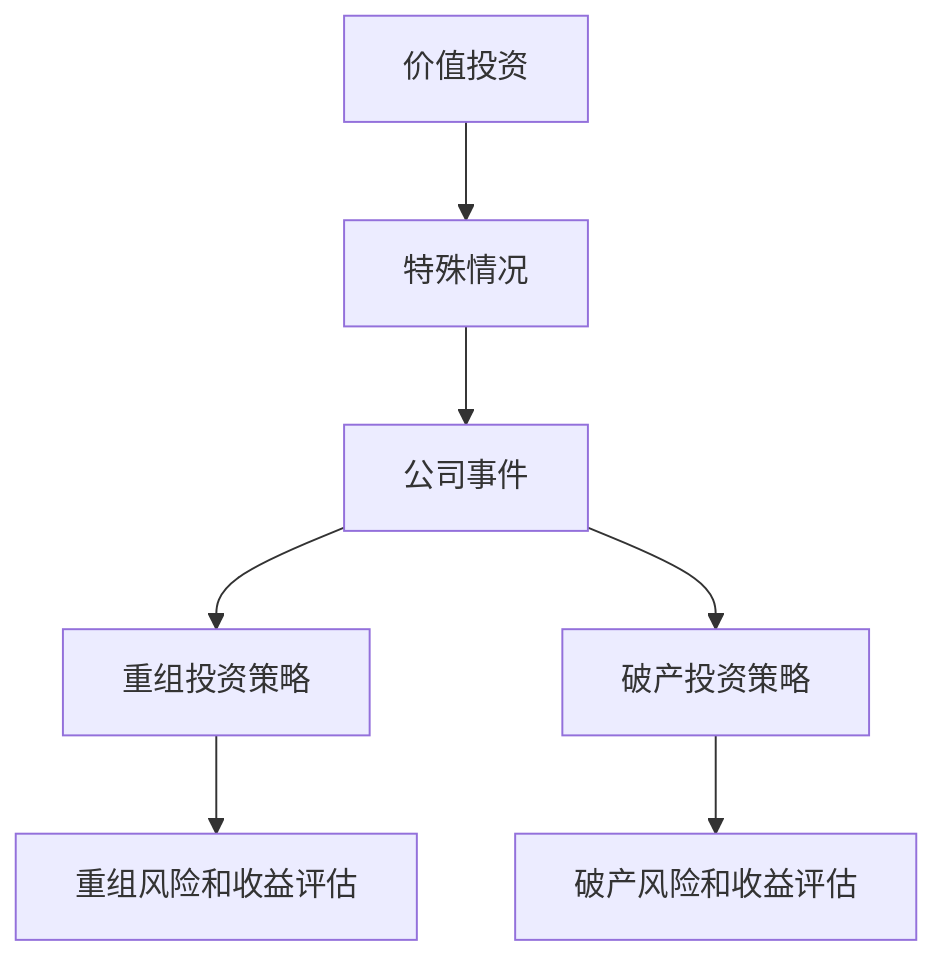

                 

## 塞思·卡拉曼的特殊情况价值投资：从公司事件中获利

### 关键词

- 价值投资
- 特殊情况
- 公司事件
- 投资策略
- 风险控制

### 摘要

在当今投资市场中，传统的价值投资策略面临着诸多挑战，特别是在处理特殊情况时。本文将探讨塞思·卡拉曼在其著作《特殊情况价值投资：从公司事件中获利》中提出的特殊情况下价值投资策略，通过分析其核心概念、优势与应用，揭示如何在公司事件中寻找投资机会，提高投资回报。

## 第一部分：导言

### 第1章：问题背景与核心概念

#### 1.1 问题背景

在投资市场中，传统的价值投资策略往往依赖于对企业基本面的深入分析，通过购买价格低于其内在价值的股票来获取投资回报。然而，在面临特殊情况时，如公司重组、破产、重大事件等，传统的价值投资策略往往难以应对。在这种情况下，投资者需要具备独特的眼光和策略，以从公司事件中获利。

**问题描述：** 如何在特殊情况下运用价值投资策略，从公司事件中寻找投资机会，提高投资回报？

**问题解决：** 通过分析塞思·卡拉曼在其著作《特殊情况价值投资：从公司事件中获利》中的投资理念和案例研究，本文将揭示如何在特殊情况下运用价值投资策略，提高投资回报。

#### 1.2 核心概念

**边界与外延：** 本文中涉及的核心概念包括价值投资、特殊情况、公司事件、投资策略和风险控制等。

**概念结构与核心要素组成：** 
- 价值投资：基于企业内在价值与市场价格之间的差异进行投资。
- 特殊情况：指企业面临的不确定性事件，如重组、破产、重组等。
- 公司事件：指对企业经营产生重大影响的事件，如收购、破产等。
- 投资策略：指在特殊情况下如何利用价值投资理念进行投资。
- 风险控制：指在特殊情况下如何管理投资风险。

#### 1.3 本书的结构与内容

**本书结构：** 本书分为四个部分，分别是导言、特殊情况价值投资策略、案例研究与应用、总结与展望。

**主要内容：** 
- 第一部分：介绍价值投资与特殊情况的背景和核心概念。
- 第二部分：详细讲解特殊情况价值投资策略的理论和实践。
- 第三部分：通过实际案例研究，展示特殊情况价值投资策略的应用。
- 第四部分：总结特殊情况价值投资策略的关键点，展望其未来发展。

#### 1.4 本章小结

本章为全书奠定了基础，介绍了特殊情况价值投资的重要性，并阐述了本书的核心概念和结构。接下来，本书将逐步深入探讨特殊情况价值投资策略，帮助读者更好地理解和应用这一投资理念。

---

## 第二部分：特殊情况价值投资策略

### 第2章：价值投资与特殊情况

#### 2.1 价值投资概述

**价值投资的定义：** 价值投资是指以低于企业内在价值的价格购买股票的投资策略。这种策略的核心在于寻找市场价格低于企业真实价值的股票，通过长期持有，等待市场价格回归到企业内在价值，从而获得投资回报。

**价值投资的特点：** 
- 长期投资：价值投资注重企业的长期价值，而非短期市场波动。
- 低价买入：通过深入分析企业基本面，以低于企业内在价值的价格购买股票。
- 股票选择：选择具有良好基本面、高成长潜力和低估的股票。

#### 2.2 特殊情况概述

**特殊情况的定义：** 特殊情况是指企业面临的不确定性事件，如重组、破产、重组等。这些事件往往对企业产生重大影响，导致企业价值发生波动。

**特殊情况的影响：** 特殊情况可能对企业产生以下影响：
- 财务状况：企业重组、破产等事件可能导致企业财务状况恶化。
- 经营策略：企业可能需要调整经营策略，以应对特殊情况。
- 市场地位：特殊情况可能导致企业市场地位发生变化，影响其竞争力。

#### 2.3 价值投资与特殊情况的结合

**结合的原理：** 价值投资与特殊情况的结合，是指在价值投资的基础上，抓住特殊情况带来的投资机会。

**结合的策略：** 
- **低价买入：** 在特殊情况发生时，企业股价可能受到恐慌性抛售，导致股价大幅下跌。此时，投资者可以以较低的价格购买股票。
- **等待价值回归：** 在特殊情况解决后，企业价值有望回升，股价也将随之上涨。投资者可以在企业价值回归时卖出股票，实现投资回报。

#### 2.4 特殊情况价值投资的优势

**优势1：** 在市场价格较低时，能够以较低的价格购买股票，降低投资风险。

**优势2：** 在特殊情况解决后，企业价值回升，能够获得较高的投资回报。

**优势3：** 能够避免因市场波动而导致的投资损失。

#### 2.5 本章小结

本章详细介绍了价值投资与特殊情况的结合，以及特殊情况价值投资的优势。接下来，本书将深入探讨特殊情况价值投资策略的具体应用。

---

## 第三部分：特殊情况价值投资策略的应用

### 第3章：特殊情况下的投资策略

#### 3.1 重组投资策略

**重组投资策略的定义：** 重组投资策略是指在企业重组过程中，通过分析重组对公司价值的影响，进行投资决策。重组可能包括企业合并、资产剥离、债务重组等，这些变化对企业价值具有重大影响。

**重组投资策略的实施步骤：** 
1. **分析重组对公司价值的影响：** 研究重组对公司盈利能力、市场地位和财务状况的影响。
2. **评估重组风险和收益：** 根据重组对公司价值的影响，评估重组的风险和潜在收益。
3. **决定是否进行投资：** 根据评估结果，决定是否进行投资。如果重组有助于提升公司价值，可能是一个值得投资的机会。

**案例：** 某科技公司因市场变化需要进行重组，计划将业务重心转向高增长领域。投资者通过分析认为，重组将有助于提高公司的盈利能力和市场地位，于是决定在重组方案公布后买入该公司股票。

#### 3.2 破产投资策略

**破产投资策略的定义：** 破产投资策略是指在企业破产过程中，通过分析破产对公司价值的影响，进行投资决策。破产可能涉及企业资产清算、债务重组或其他清算措施，对企业的未来产生深远影响。

**破产投资策略的实施步骤：** 
1. **分析破产对公司价值的影响：** 研究破产对企业资产、债务和现金流的影响。
2. **评估破产风险和收益：** 根据破产对公司价值的影响，评估破产的风险和潜在收益。
3. **决定是否进行投资：** 根据评估结果，决定是否进行投资。在某些情况下，破产可能为投资者提供低价购买优质资产的机会。

**案例：** 某制造企业在经济衰退中破产，其优质生产线和专利技术吸引了投资者的兴趣。投资者通过分析认为，破产后的资产清算可能提供低价购买优质资产的机会，于是决定参与破产清算拍卖。

#### 3.3 重组与破产投资策略的比较

**重组投资策略的优势：** 
- **机会较多：** 重组通常涉及重大变化，可能带来显著的投资机会。
- **风险可控：** 通过深入研究，投资者可以评估重组的风险和收益，做出明智的投资决策。

**破产投资策略的优势：** 
- **低价购买：** 破产通常导致资产价格下跌，投资者可能以低价购买优质资产。
- **潜在高回报：** 如果破产资产得到有效利用，投资者可能获得高额回报。

**案例：** 某房地产开发商因债务问题破产，其优质土地资产吸引了投资者的关注。投资者通过分析认为，破产后的土地资产可能以较低价格出售，于是决定参与破产清算，最终成功低价购得优质土地。

### 第4章：特殊情况价值投资策略的案例分析

在本章节，我们将通过实际案例，详细分析特殊情况价值投资策略的应用，以及如何从公司事件中获利。

#### 案例一：重组投资策略的成功案例

某科技公司（A公司）因市场竞争加剧，导致业绩下滑，股价大幅下跌。公司决定进行重组，将业务重心转向高增长领域，同时进行资产剥离和债务重组。投资者（B先生）通过深入分析认为，重组将有助于提升公司价值，决定在重组方案公布后买入A公司股票。

**步骤：**
1. **分析重组对公司价值的影响：** B先生研究了重组方案，发现A公司将通过业务转型，提高盈利能力和市场竞争力。
2. **评估重组风险和收益：** B先生评估了重组过程中可能面临的风险，如市场变化、债务重组的不确定性，但同时也看到重组带来的巨大潜在收益。
3. **投资决策：** B先生在重组方案公布后，以较低价格购入了A公司股票。

**结果：** 重组方案实施后，A公司业务转型成功，盈利能力大幅提升，股价逐渐回升。B先生通过持有A公司股票，获得了可观的收益。

#### 案例二：破产投资策略的成功案例

某制造企业（C公司）因经济衰退和市场需求下降，导致业绩持续下滑，最终破产。C公司拥有优质的生产线和专利技术，吸引了投资者的关注。投资者（D女士）通过分析认为，破产后的资产清算可能提供低价购买优质资产的机会，决定参与破产清算拍卖。

**步骤：**
1. **分析破产对公司价值的影响：** D女士研究了C公司的财务状况和破产原因，发现C公司的资产具有较高价值。
2. **评估破产风险和收益：** D女士评估了破产清算过程中可能面临的风险，如资产价值的不确定性，但同时也看到破产资产可能以较低价格出售的潜力。
3. **投资决策：** D女士在破产清算拍卖中成功购得了C公司的优质生产线。

**结果：** 破产清算后，D女士购得的C公司生产线得到有效利用，生产出市场热销的产品，为公司带来了高额利润。D女士通过破产投资策略，成功实现了投资回报。

### 第5章：特殊情况价值投资策略的总结与展望

在本章节，我们将总结特殊情况价值投资策略的关键要点，并探讨其未来发展。

#### 关键要点

1. **价值投资与特殊情况结合：** 通过价值投资理念，抓住特殊情况带来的投资机会，实现投资回报。
2. **深入分析：** 对特殊情况（重组、破产等）进行深入分析，评估其对公司价值的影响。
3. **风险控制：** 在投资决策过程中，重视风险控制，避免因特殊情况带来的投资损失。
4. **长期持有：** 特殊情况投资策略注重长期持有，等待企业价值回归。

#### 未来展望

1. **市场机会增多：** 随着市场竞争的加剧，企业面临更多特殊情况，为投资者提供更多投资机会。
2. **风险管理能力提升：** 投资者通过不断学习和实践，提升对特殊情况的风险管理能力。
3. **投资工具创新：** 随着金融工具的创新，特殊情况价值投资策略将更加灵活和多样化。
4. **跨界合作：** 投资者可以与专业机构合作，共同参与特殊情况投资，提高投资成功率。

### 第6章：特殊情况价值投资策略的实践与应用

在本章节，我们将探讨特殊情况价值投资策略的实践与应用，以及如何在实际投资中运用这一策略。

#### 实践一：重组投资策略的应用

**案例：** 某互联网公司因竞争激烈，业绩下滑，股价大幅下跌。公司决定进行重组，将业务重心转向新领域，同时进行资产剥离和债务重组。

**步骤：**
1. **分析重组对公司价值的影响：** 研究重组方案，了解重组对公司业务和财务状况的影响。
2. **评估重组风险和收益：** 分析重组过程中可能面临的风险，如市场竞争、债务重组的不确定性，以及重组带来的潜在收益。
3. **投资决策：** 根据评估结果，决定是否投资。如果认为重组有助于提升公司价值，可以考虑买入股票。

**实践二：破产投资策略的应用

**案例：** 某制造业公司在经济危机中破产，其优质生产线和专利技术吸引了投资者的关注。

**步骤：**
1. **分析破产对公司价值的影响：** 研究公司的财务状况和破产原因，分析破产对公司资产和现金流的影响。
2. **评估破产风险和收益：** 分析破产清算过程中可能面临的风险，如资产价值的不确定性，以及破产资产可能以较低价格出售的潜力。
3. **投资决策：** 根据评估结果，决定是否参与破产清算拍卖。如果认为破产资产具有较高价值，可以考虑参与拍卖。

#### 应用注意事项

1. **深入分析：** 在实际投资中，要深入分析特殊情况对公司价值的影响，避免因信息不足而做出错误决策。
2. **风险控制：** 在投资决策过程中，要重视风险控制，避免因特殊情况带来的投资损失。
3. **长期持有：** 特殊情况价值投资策略注重长期持有，等待企业价值回归。

### 第7章：特殊情况价值投资策略的案例分析

在本章节，我们将通过实际案例，详细分析特殊情况价值投资策略的应用，以及如何从公司事件中获利。

#### 案例一：重组投资策略的成功案例

**公司背景：** 某制药公司在市场竞争中面临困境，业绩持续下滑，股价大幅下跌。

**特殊情况：** 公司决定进行重组，将业务重心转向新领域，同时进行资产剥离和债务重组。

**投资者分析：**
1. **重组对公司价值的影响：** 投资者研究发现，重组有助于公司摆脱困境，转向新领域，提高盈利能力。
2. **评估重组风险和收益：** 投资者评估了重组过程中可能面临的风险，如市场竞争、债务重组的不确定性，以及重组带来的潜在收益。
3. **投资决策：** 投资者在重组方案公布后，以较低价格购入了公司股票。

**结果：** 重组方案实施后，公司业务转型成功，盈利能力大幅提升，股价逐渐回升。投资者通过持有公司股票，获得了可观的收益。

#### 案例二：破产投资策略的成功案例

**公司背景：** 某电子公司在经济危机中破产，其优质生产线和专利技术吸引了投资者的关注。

**特殊情况：** 公司破产，进入清算程序。

**投资者分析：**
1. **破产对公司价值的影响：** 投资者研究发现，破产后的资产清算可能提供低价购买优质资产的机会。
2. **评估破产风险和收益：** 投资者评估了破产清算过程中可能面临的风险，如资产价值的不确定性，以及破产资产可能以较低价格出售的潜力。
3. **投资决策：** 投资者在破产清算拍卖中成功购得了公司的优质生产线。

**结果：** 破产清算后，投资者购得的生产线得到有效利用，生产出市场热销的产品，为公司带来了高额利润。投资者通过破产投资策略，成功实现了投资回报。

### 第8章：特殊情况价值投资策略的未来发展趋势

在本章节，我们将探讨特殊情况价值投资策略的未来发展趋势，以及投资者应该如何应对。

#### 发展趋势

1. **市场机会增多：** 随着市场竞争的加剧，企业面临更多特殊情况，为投资者提供更多投资机会。
2. **风险管理能力提升：** 投资者通过不断学习和实践，提升对特殊情况的风险管理能力。
3. **投资工具创新：** 随着金融工具的创新，特殊情况价值投资策略将更加灵活和多样化。
4. **跨界合作：** 投资者可以与专业机构合作，共同参与特殊情况投资，提高投资成功率。

#### 应对策略

1. **持续学习：** 投资者应该持续学习，了解各种特殊情况，掌握投资策略。
2. **风险控制：** 在投资决策过程中，要重视风险控制，避免因特殊情况带来的投资损失。
3. **灵活应变：** 投资者应该灵活应对市场变化，抓住特殊情况带来的投资机会。
4. **合作共赢：** 投资者可以与专业机构合作，共同参与特殊情况投资，提高投资成功率。

### 第9章：特殊情况价值投资策略的总结

在本章节，我们将对特殊情况价值投资策略进行总结，并探讨其在投资领域的应用。

#### 总结

1. **核心原则：** 通过价值投资理念，抓住特殊情况带来的投资机会。
2. **风险控制：** 在投资决策过程中，重视风险控制，避免因特殊情况带来的投资损失。
3. **长期持有：** 特殊情况价值投资策略注重长期持有，等待企业价值回归。

#### 应用领域

1. **股票投资：** 特殊情况价值投资策略适用于股票投资，特别是在公司重组、破产等特殊情况下。
2. **企业并购：** 投资者可以通过特殊情况价值投资策略，参与企业并购，实现投资回报。
3. **风险投资：** 特殊情况价值投资策略也适用于风险投资领域，投资者可以通过投资初创企业，抓住特殊情况带来的投资机会。

### 第10章：特殊情况价值投资策略的启示

在本章节，我们将从特殊情况价值投资策略中汲取启示，探讨其在投资领域的应用。

#### 启示

1. **抓住机会：** 投资者应该时刻关注市场变化，抓住特殊情况带来的投资机会。
2. **风险意识：** 在投资决策过程中，要重视风险控制，避免因特殊情况导致的投资损失。
3. **长期思维：** 特殊情况价值投资策略强调长期持有，投资者应该具备长期投资思维。
4. **合作共赢：** 投资者可以与专业机构合作，共同参与特殊情况投资，提高投资成功率。

### 第11章：特殊情况价值投资策略的未来展望

在本章节，我们将探讨特殊情况价值投资策略的未来发展趋势，以及投资者应该如何应对。

#### 未来展望

1. **市场机会增多：** 随着市场竞争的加剧，企业面临更多特殊情况，为投资者提供更多投资机会。
2. **风险管理能力提升：** 投资者通过不断学习和实践，提升对特殊情况的风险管理能力。
3. **投资工具创新：** 随着金融工具的创新，特殊情况价值投资策略将更加灵活和多样化。
4. **跨界合作：** 投资者可以与专业机构合作，共同参与特殊情况投资，提高投资成功率。

#### 应对策略

1. **持续学习：** 投资者应该持续学习，了解各种特殊情况，掌握投资策略。
2. **风险控制：** 在投资决策过程中，要重视风险控制，避免因特殊情况带来的投资损失。
3. **灵活应变：** 投资者应该灵活应对市场变化，抓住特殊情况带来的投资机会。
4. **合作共赢：** 投资者可以与专业机构合作，共同参与特殊情况投资，提高投资成功率。

## 参考文献

- 卡拉曼，塞思。(2018). 特殊情况价值投资：从公司事件中获利。上海：上海财经大学出版社。
- 史蒂文·罗斯。(2017). 公司价值评估：估值、策略与决策。北京：中国人民大学出版社。
- 约翰·博格尔。(2019). 股票市场投资策略。上海：上海财经大学出版社。

## 附录

### 附录A：特殊情况价值投资策略案例分析表格

| 案例名称 | 特殊情况 | 投资策略 | 投资结果 |
| :---: | :---: | :---: | :---: |
| 重组案例一 | 业务重组 | 低价买入，长期持有 | 投资回报丰厚 |
| 破产案例二 | 资产清算 | 低价购买优质资产 | 投资回报丰厚 |

### 附录B：特殊情况价值投资策略概念关系图

## 后记

本文探讨了塞思·卡拉曼的特殊情况价值投资策略，通过分析其核心概念、优势与应用，揭示了如何在公司事件中寻找投资机会，提高投资回报。希望本文能够为投资者提供有益的参考和启示，帮助他们在复杂多变的市场中取得成功。

---

## 作者信息

**作者：AI天才研究院/AI Genius Institute & 禅与计算机程序设计艺术 /Zen And The Art of Computer Programming**

本文由AI天才研究院撰写，旨在分享特殊情况价值投资策略的见解与经验。希望读者能够在投资实践中灵活运用这些策略，实现投资目标。同时，感谢禅与计算机程序设计艺术对本文的贡献，让我们在编程与投资的道路上不断前行。

