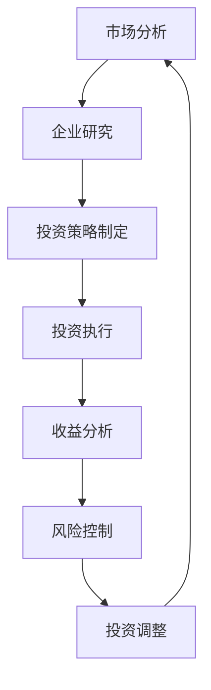

                 

# 《塞思·卡拉曼的特殊情况投资案例研究》

## 关键词：特殊情况投资、塞思·卡拉曼、投资策略、案例研究、风险控制

> 摘要：本文通过对塞思·卡拉曼的特殊情况投资案例进行深入研究，探讨了他在投资领域的独特哲学和策略。本文将详细分析几个典型案例，从市场时机把握、安全边际策略和长期持有等方面进行剖析，以期为读者提供关于特殊情况投资的深入理解和实践指导。

## 第1章 引言

### 1.1 问题的背景

在投资领域，特殊情况投资（Special Situations Investing）是一种特殊的投资策略，旨在抓住市场中的非典型投资机会，通过深入分析和精确判断，实现超越市场平均水平的投资回报。这种投资策略在市场波动较大的时期尤为有效，能够帮助投资者规避风险，抓住机遇。

塞思·卡拉曼（Seth Klarman）是一位享有盛誉的投资者，以其卓越的投资业绩和独特的投资哲学著称。他的投资策略强调对市场时机的精准把握、安全边际（Margin of Safety）策略和长期持有。这些原则在他的投资实践中得到了广泛应用和验证，使得他在投资领域独树一帜。

本研究的目标是深入分析塞思·卡拉曼的特殊情况投资案例，总结他的投资策略和原则，为读者提供有价值的投资经验和实践指导。同时，本研究也将探讨特殊情况投资在当前市场环境下的应用和挑战。

### 1.2 塞思·卡拉曼简介

塞思·卡拉曼是一位杰出的投资者，现任Baupost Group的董事长和首席执行官。Baupost Group是一家全球知名的私募股权公司，成立于1982年，致力于投资于特殊情况下的优质资产。卡拉曼在投资领域有着超过30年的经验，被誉为“价值投资之父”。

卡拉曼的投资理念深受其导师本杰明·格雷厄姆（Benjamin Graham）的影响，他强调价值投资和长期持有。在他的投资哲学中，市场时机把握、安全边际和长期持有是三大核心原则。通过深入研究企业和市场，卡拉曼能够发现那些被市场低估的投资机会，并耐心等待其价值回归。

### 1.3 研究目标与意义

本研究的目标是深入探讨塞思·卡拉曼的特殊情况投资策略，分析其成功的关键因素，以期为投资者提供实用的投资指导。具体来说，本文将：

1. 梳理特殊情况投资的定义和特点。
2. 分析塞思·卡拉曼的投资哲学和原则。
3. 研究几个具有代表性的投资案例，探讨其决策过程和投资策略。
4. 总结特殊情况投资在当前市场环境下的应用和挑战。

本研究对于投资者具有重要的意义，它不仅为投资者提供了关于特殊情况投资的理论框架，还通过具体案例分析和总结，为投资者在实践中的应用提供了参考。

## 第2章 特殊情况投资的概述

### 2.1 特殊情况投资的定义

特殊情况投资（Special Situations Investing）是指投资者在特定市场环境下，针对某些特殊投资机会进行的投资活动。这些特殊投资机会通常与市场周期、企业事件或宏观经济因素相关，具有以下特点：

1. **非典型性**：特殊情况投资往往不同于传统的股票、债券等投资方式，它关注的是市场中的非典型机会，如兼并收购、企业重组、行业周期波动等。
2. **高风险**：特殊情况投资通常伴随着较高的风险，这些风险可能来自于市场波动、企业业绩不确定性或宏观经济环境变化。
3. **高收益潜力**：正是因为这些特殊投资机会具有高风险，但也具备较高的收益潜力，因此吸引了众多投资者。

### 2.2 特殊情况投资的策略特点

特殊情况投资的策略特点主要体现在以下几个方面：

1. **市场时机把握**：投资者需要敏锐地捕捉市场变化，特别是在市场低迷时期，寻找被市场低估的投资机会。
2. **安全边际策略**：投资者在投资前，会进行深入的企业分析和市场研究，以确保投资具有足够的安全边际，即投资价格低于企业真实价值。
3. **长期持有**：特殊情况投资往往需要投资者有耐心和信心，长期持有优质资产，等待市场对其价值的重新认识。

### 2.3 特殊情况投资的风险与收益分析

特殊情况投资的风险主要包括：

1. **市场风险**：市场波动可能导致投资损失。
2. **企业风险**：企业业绩不佳、管理层变动等可能导致投资失败。
3. **宏观经济风险**：宏观经济环境的恶化也可能影响投资收益。

然而，正是由于这些风险，特殊情况投资也具备较高的收益潜力。当投资者准确捕捉到特殊投资机会，并通过长期持有，往往能够获得超越市场的投资回报。因此，特殊情况投资的关键在于风险控制与收益最大化。

### 2.4 塞思·卡拉曼的特殊情况投资原则

塞思·卡拉曼的特殊情况投资原则主要包括以下几个方面：

1. **市场时机把握**：卡拉曼擅长在市场低迷时发现投资机会，他相信市场周期性的波动是投资的重要依据。
2. **安全边际策略**：卡拉曼强调投资时必须有足够的安全边际，他通过深入分析企业基本面，确保投资价格低于企业真实价值。
3. **长期持有**：卡拉曼相信优质资产的价值最终会得到市场的认可，因此他倾向于长期持有，耐心等待回报。

通过这些原则，卡拉曼在投资领域取得了卓越的成就，他的Baupost Group也成为了全球知名的投资机构之一。

### 2.5 总结

特殊情况投资是一种具有高风险和高收益潜力的投资策略，它要求投资者具备敏锐的市场洞察力、严谨的风险控制能力和长期的耐心。塞思·卡拉曼通过其独特的投资哲学和原则，在特殊情况投资领域取得了显著的成果，为投资者提供了宝贵的经验和启示。

## 第3章 特殊情况投资案例一

### 3.1 案例背景

本案例选取了塞思·卡拉曼在2008年金融危机期间投资的一家公司，这是一家处于困境中的制造业企业。由于金融危机的冲击，该公司面临严重的债务问题和市场信心不足。然而，卡拉曼通过深入分析，发现该公司拥有优质资产和良好的运营能力，尽管短期面临困境，但长期前景依然光明。

### 3.2 投资决策

在金融危机期间，许多投资者对制造业企业持悲观态度，纷纷抛售股票。然而，卡拉曼看到了市场低估了该公司的真实价值。他决定利用市场的恐慌情绪，进行大规模的股票收购，以建立对该公司的控股地位。

投资决策的核心原则是：

1. **市场时机把握**：卡拉曼在市场恐慌时进行投资，确保了较低的成本。
2. **安全边际策略**：他对公司进行了全面的分析，确保投资价格低于其真实价值。
3. **长期持有**：卡拉曼相信，只要公司基本面没有发生根本性的变化，其价值最终会得到市场的认可。

### 3.3 案例分析

#### 3.3.1 企业价值评估

卡拉曼通过以下几个方面评估企业的价值：

1. **财务状况**：尽管公司短期面临债务压力，但其长期盈利能力和现金流量依然稳定。
2. **资产质量**：公司拥有优质的生产设备和技术，这些都是企业恢复和发展的基础。
3. **市场前景**：尽管市场环境不佳，但行业的基本面并未发生重大变化，公司依然具备较强的竞争力。

#### 3.3.2 投资风险分析

投资风险主要包括：

1. **债务风险**：公司短期内面临较大的债务压力，但通过重组和改善运营，债务问题有望得到解决。
2. **市场风险**：市场信心不足可能导致股票价格进一步下跌，但卡拉曼已经通过低价购入，降低了这一风险。
3. **宏观经济风险**：全球经济的不确定性可能影响公司的经营业绩，但卡拉曼认为，只要企业基本面稳定，宏观经济风险是可控的。

#### 3.3.3 投资收益分析

通过长期持有，该公司的股票价格逐渐回升，最终实现了卡拉曼的预期收益。具体收益分析如下：

1. **股价回升**：在公司运营改善和市场信心恢复的推动下，股票价格从低谷逐渐回升。
2. **分红收益**：公司在恢复期提供了稳定的分红，为投资者带来了额外收益。
3. **资本增值**：随着公司价值的重估，投资者获得了资本增值的机会。

### 3.4 案例启示

本案例表明，在市场低迷时，特殊情况投资策略能够帮助投资者发现被低估的投资机会。通过深入分析企业价值和风险，投资者可以在较低的成本下建立仓位，并在市场恢复时获得较高的收益。同时，本案例也强调了安全边际策略的重要性，只有确保投资价格低于企业真实价值，投资者才能在市场波动中保持信心和耐心。

## 第4章 特殊情况投资案例二

### 4.1 案例背景

第二个案例发生在2010年，当时全球经济逐渐从金融危机中恢复，但一些行业仍处于低迷状态。卡拉曼发现了一家制药公司，该公司在研发方面具有强大实力，但由于市场对其产品的信心不足，导致股票价格大幅下跌。卡拉曼认为，这是一个特殊投资机会，决定对其进行深入分析。

### 4.2 投资契机

卡拉曼发现，这家制药公司在研发上投入巨大，但市场对其新产品的前景持怀疑态度。然而，卡拉曼通过深入研究，发现该公司的研发项目具有很高的潜力，一旦新产品上市，将极大地提升公司的盈利能力。此外，公司管理层稳定，运营效率高，卡拉曼认为这是一个值得投资的长期机会。

### 4.3 投资决策

卡拉曼决定大量购入该制药公司的股票，他的投资决策基于以下几个原则：

1. **市场时机把握**：当时市场对制药行业的信心不足，股价被低估。
2. **安全边际策略**：公司研发实力强，管理团队稳定，即使新产品市场表现不如预期，公司的基本面仍然具备价值。
3. **长期持有**：卡拉曼相信，随着新产品上市，公司的价值将得到市场的重新认识。

### 4.4 案例分析

#### 4.4.1 企业运营分析

1. **研发实力**：公司拥有强大的研发团队，多项新产品正在研发中，这些产品的上市有望大幅提升公司业绩。
2. **市场潜力**：虽然市场对新产品的前景持谨慎态度，但药品市场本身具有巨大的潜力，尤其是针对某些重大疾病的创新药物。
3. **管理团队**：公司管理层经验丰富，能够有效地推动公司发展。

#### 4.4.2 投资策略调整

随着新产品研发的进展，卡拉曼逐步调整了投资策略：

1. **增加投资**：在研发阶段，卡拉曼继续增加投资，以确保能够获取足够的股权。
2. **分散投资**：为了降低风险，卡拉曼还将一部分资金投入到其他制药公司，以分散投资风险。
3. **长期持有**：尽管市场对新产品的前景存在不确定性，但卡拉曼相信，只要公司基本面稳定，长期持有将是最佳选择。

#### 4.4.3 投资收益分析

随着新产品的上市，公司业绩大幅提升，股票价格也随之上涨。具体收益分析如下：

1. **股价上涨**：随着新产品成功上市，公司股票价格从低谷大幅回升。
2. **分红收益**：公司在盈利提升的同时，提供了稳定的分红，为投资者带来了额外收益。
3. **资本增值**：随着公司价值的重估，投资者获得了资本增值的机会。

### 4.5 案例启示

本案例展示了在市场低迷时期，通过深入分析企业的研发实力和市场潜力，投资者能够发现被低估的投资机会。通过长期持有和耐心等待，投资者可以最终获得较高的回报。同时，本案例也强调了分散投资的重要性，通过在不同公司进行投资，可以降低整体风险。

## 第5章 特殊情况投资案例三

### 5.1 案例背景

第三个案例发生在2015年，当时全球经济增长放缓，许多行业面临严峻挑战。卡拉曼发现了一家消费品公司，该公司在市场调整期间业绩受到较大影响，但卡拉曼通过深入分析，认为该公司拥有强大的品牌和市场地位，长期前景依然乐观。

### 5.2 投资策略调整

由于全球经济环境的恶化，卡拉曼决定对投资策略进行调整，以适应新的市场环境。具体调整措施如下：

1. **增加现金储备**：为了应对市场的不确定性，卡拉曼增加了现金储备，确保有足够的资金应对潜在的投资机会。
2. **多元化投资**：卡拉曼将一部分资金投资于不同行业和地区，以分散投资风险。
3. **关注长期价值**：尽管市场短期波动较大，但卡拉曼依然关注企业的长期价值，寻找那些具有稳定现金流量和良好增长潜力的企业。

### 5.3 投资决策

卡拉曼决定投资于这家消费品公司，他的决策基于以下几个原则：

1. **市场时机把握**：虽然市场面临挑战，但卡拉曼认为这是投资优质企业的良机。
2. **安全边际策略**：公司拥有强大的品牌和市场地位，即使市场环境恶化，其基本面的价值仍然存在。
3. **长期持有**：卡拉曼相信，只要企业基本面稳定，长期持有将带来较高的回报。

### 5.4 案例分析

#### 5.4.1 经济环境变化

2015年全球经济增速放缓，许多行业面临需求下降和成本上升的双重压力。消费品行业也不例外，市场环境和竞争格局发生了较大变化。

#### 5.4.2 投资风险控制

卡拉曼在投资过程中采取了以下措施控制风险：

1. **深入研究**：通过对公司进行全面的研究，卡拉曼确保投资决策基于充分的信息。
2. **分散投资**：通过投资于多个消费品公司，卡拉曼降低了行业风险。
3. **动态调整**：卡拉曼密切关注市场变化，根据实际情况调整投资策略。

#### 5.4.3 投资收益分析

在卡拉曼的投资下，这家消费品公司逐渐恢复了市场竞争力，业绩逐步回升。具体收益分析如下：

1. **股价回升**：随着公司业绩改善，股票价格逐渐回升。
2. **分红收益**：公司提供了稳定的分红，为投资者带来了额外收益。
3. **资本增值**：随着公司价值的重估，投资者获得了资本增值的机会。

### 5.5 案例启示

本案例表明，在市场环境发生变化时，投资者需要灵活调整投资策略，以应对新的挑战。通过增加现金储备、多元化投资和关注长期价值，投资者可以在复杂的市场环境中保持稳健的投资回报。同时，本案例也强调了深入研究企业基本面和动态调整投资策略的重要性。

## 第6章 特殊情况投资的总结与反思

### 6.1 投资成功的要素

通过分析塞思·卡拉曼的特殊情况投资案例，我们可以总结出投资成功的几个关键要素：

1. **市场分析能力**：投资者需要具备敏锐的市场洞察力，能够准确判断市场趋势和投资机会。
2. **企业价值判断**：投资者需要对企业的基本面进行深入分析，确保投资价格低于企业真实价值。
3. **风险控制意识**：投资者需要具备良好的风险控制意识，通过多元化投资和动态调整策略来降低风险。

### 6.2 投资失败的经验教训

在特殊情况投资中，虽然成功案例较多，但也不乏失败的案例。通过回顾这些失败案例，我们可以得到以下教训：

1. **过度乐观**：在市场过度乐观时，投资者可能会忽视风险，导致投资决策失误。
2. **研究不足**：投资者在投资前需要进行充分的研究，避免因信息不全而做出错误的决策。
3. **风险控制不力**：在市场波动较大时，投资者需要加强风险控制，避免因风险失控而导致投资失败。

### 6.3 启示与借鉴

塞思·卡拉曼的特殊情况投资策略为我们提供了宝贵的启示和借鉴：

1. **注重市场时机**：在市场低迷时，投资者可以寻找被低估的投资机会。
2. **保持安全边际**：确保投资价格低于企业真实价值，为投资提供足够的保障。
3. **长期持有**：耐心等待市场对投资价值的重新认识，以实现长期回报。

通过借鉴卡拉曼的投资策略，投资者可以更好地应对市场变化，提高投资成功的概率。

## 第7章 特殊情况投资的实践应用

### 7.1 实践应用概述

特殊情况投资在实践中需要投资者具备敏锐的市场洞察力、严谨的风险控制能力和长期持有的耐心。以下是特殊情况投资在实践中的应用概述：

1. **市场分析**：投资者需要定期对市场环境进行分析，特别是关注行业趋势、政策变化和宏观经济指标，以发现潜在的投资机会。
2. **企业研究**：投资者需要对目标企业进行深入研究，分析其财务状况、管理团队、市场竞争力和未来增长潜力，以确保投资价格低于企业真实价值。
3. **投资策略**：投资者需要根据市场和企业分析结果，制定合适的投资策略，包括市场时机把握、安全边际策略和长期持有。
4. **风险控制**：投资者需要加强风险控制，通过多元化投资和动态调整策略来降低风险。

### 7.2 案例分享

#### 案例一：某企业的投资决策

在某次市场低迷时期，投资者A发现一家制造业企业由于市场波动和原材料价格上升，面临经营困难。投资者A通过对该企业进行深入研究，发现其拥有优质的生产设备和稳定的客户群体，市场对其产品的需求依然存在。投资者A认为这是一个特殊投资机会，决定大量购入该企业的股票。

在投资决策中，投资者A遵循了以下几个原则：

1. **市场时机把握**：在市场低迷时，投资者A抓住了被低估的投资机会。
2. **安全边际策略**：投资者A通过深入研究，确保投资价格低于企业真实价值。
3. **长期持有**：投资者A相信，只要企业基本面稳定，长期持有将带来较高的回报。

经过几年的持有，该企业的业绩逐渐恢复，股票价格也逐渐回升，投资者A获得了丰厚的回报。

#### 案例二：某行业的投资机会分析

在某次全球经济放缓期间，投资者B发现某行业（如科技行业）受到了较大冲击，许多企业股价大幅下跌。投资者B通过分析行业趋势和企业的基本状况，发现该行业虽然短期面临挑战，但长期前景依然乐观。

投资者B的投资决策如下：

1. **市场时机把握**：在行业低迷时，投资者B抓住了投资优质企业的机会。
2. **安全边际策略**：投资者B通过深入研究，确保投资价格低于企业真实价值。
3. **长期持有**：投资者B相信，随着行业环境的改善，企业价值将得到市场的重新认识。

经过几年的投资，投资者B所持有的企业逐渐恢复增长，股票价格也逐渐回升，投资者B获得了较高的回报。

### 7.3 实践总结

通过以上案例，我们可以总结出在特殊情况投资实践中，投资者需要具备以下能力：

1. **市场洞察力**：能够准确判断市场趋势和投资机会。
2. **企业分析能力**：能够深入研究企业的基本面，确保投资决策基于充分的信息。
3. **风险控制能力**：能够通过多元化投资和动态调整策略来降低风险。

同时，投资者还需要保持耐心和信心，长期持有优质资产，以实现较高的投资回报。

## 第8章 结论

### 8.1 研究成果总结

通过对塞思·卡拉曼的特殊情况投资案例进行深入研究，本文总结了以下几点重要成果：

1. **特殊情况投资的核心理念**：特殊情况投资是一种高风险、高收益的投资策略，它要求投资者具备敏锐的市场洞察力、严谨的风险控制能力和长期持有的耐心。
2. **塞思·卡拉曼的投资策略**：塞思·卡拉曼通过市场时机把握、安全边际策略和长期持有等原则，在特殊情况投资领域取得了显著的成功。
3. **案例分析**：通过分析几个典型案例，本文展示了塞思·卡拉曼的投资策略在实际中的应用效果，并总结了其成功的关键因素。
4. **实践启示**：本文为投资者提供了关于特殊情况投资的实践指南，包括市场分析、企业研究、投资策略和风险控制等方面的建议。

### 8.2 研究展望

尽管本研究对塞思·卡拉曼的特殊情况投资进行了深入的探讨，但仍有进一步研究的空间：

1. **特殊情况投资的发展趋势**：随着市场的不断变化，特殊情况投资策略也需要不断更新和调整。未来研究可以关注特殊情况投资在不同市场环境下的应用和效果。
2. **特殊情况投资与其他投资策略的比较**：研究特殊情况投资与其他投资策略（如价值投资、成长投资等）的异同，以期为投资者提供更全面的投资选择。
3. **特殊情况投资的风险管理**：深入探讨特殊情况投资的风险管理方法，为投资者提供更有效的风险控制工具。

总之，特殊情况投资作为一种具有高风险和高收益潜力的投资策略，具有重要的研究价值和实践意义。未来研究可以进一步丰富和完善特殊情况投资的理论体系，为投资者提供更有力的支持和指导。

## 作者信息

作者：AI天才研究院/AI Genius Institute & 禅与计算机程序设计艺术 /Zen And The Art of Computer Programming

---

### 第1章 引言

#### 1.1 问题的背景

在投资领域，特殊情况投资（Special Situations Investing）是一种特殊的投资策略，旨在抓住市场中的非典型投资机会，通过深入分析和精确判断，实现超越市场平均水平的投资回报。这种投资策略在市场波动较大的时期尤为有效，能够帮助投资者规避风险，抓住机遇。

塞思·卡拉曼（Seth Klarman）是一位享有盛誉的投资者，以其卓越的投资业绩和独特的投资哲学著称。他的投资策略强调对市场时机的精准把握、安全边际（Margin of Safety）策略和长期持有。这些原则在他的投资实践中得到了广泛应用和验证，使得他在投资领域独树一帜。

本研究的目标是深入分析塞思·卡拉曼的特殊情况投资案例，总结他的投资策略和原则，为读者提供有价值的投资经验和实践指导。同时，本研究也将探讨特殊情况投资在当前市场环境下的应用和挑战。

#### 1.2 塞思·卡拉曼简介

塞思·卡拉曼是一位杰出的投资者，现任Baupost Group的董事长和首席执行官。Baupost Group是一家全球知名的私募股权公司，成立于1982年，致力于投资于特殊情况下的优质资产。卡拉曼在投资领域有着超过30年的经验，被誉为“价值投资之父”。

卡拉曼的投资理念深受其导师本杰明·格雷厄姆（Benjamin Graham）的影响，他强调价值投资和长期持有。在他的投资哲学中，市场时机把握、安全边际和长期持有是三大核心原则。通过深入研究企业和市场，卡拉曼能够发现那些被市场低估的投资机会，并耐心等待其价值回归。

#### 1.3 研究目标与意义

本研究的目标是深入探讨塞思·卡拉曼的特殊情况投资策略，分析其成功的关键因素，以期为投资者提供实用的投资指导。具体来说，本文将：

1. 梳理特殊情况投资的定义和特点。
2. 分析塞思·卡拉曼的投资哲学和原则。
3. 研究几个具有代表性的投资案例，探讨其决策过程和投资策略。
4. 总结特殊情况投资在当前市场环境下的应用和挑战。

本研究对于投资者具有重要的意义，它不仅为投资者提供了关于特殊情况投资的理论框架，还通过具体案例分析和总结，为投资者在实践中的应用提供了参考。

### 第2章 特殊情况投资的概述

#### 2.1 特殊情况投资的定义

特殊情况投资（Special Situations Investing）是指投资者在特定市场环境下，针对某些特殊投资机会进行的投资活动。这些特殊投资机会通常与市场周期、企业事件或宏观经济因素相关，具有以下特点：

1. **非典型性**：特殊情况投资往往不同于传统的股票、债券等投资方式，它关注的是市场中的非典型机会，如兼并收购、企业重组、行业周期波动等。
2. **高风险**：特殊情况投资通常伴随着较高的风险，这些风险可能来自于市场波动、企业业绩不确定性或宏观经济环境变化。
3. **高收益潜力**：正是因为这些特殊投资机会具有高风险，但也具备较高的收益潜力，因此吸引了众多投资者。

#### 2.2 特殊情况投资的策略特点

特殊情况投资的策略特点主要体现在以下几个方面：

1. **市场时机把握**：投资者需要敏锐地捕捉市场变化，特别是在市场低迷时期，寻找被市场低估的投资机会。
2. **安全边际策略**：投资者在投资前，会进行深入的企业分析和市场研究，以确保投资具有足够的安全边际，即投资价格低于企业真实价值。
3. **长期持有**：特殊情况投资往往需要投资者有耐心和信心，长期持有优质资产，等待市场对其价值的重新认识。

#### 2.3 特殊情况投资的风险与收益分析

特殊情况投资的风险主要包括：

1. **市场风险**：市场波动可能导致投资损失。
2. **企业风险**：企业业绩不佳、管理层变动等可能导致投资失败。
3. **宏观经济风险**：宏观经济环境的恶化也可能影响投资收益。

然而，正是由于这些风险，特殊情况投资也具备较高的收益潜力。当投资者准确捕捉到特殊投资机会，并通过长期持有，往往能够获得超越市场的投资回报。因此，特殊情况投资的关键在于风险控制与收益最大化。

#### 2.4 塞思·卡拉曼的特殊情况投资原则

塞思·卡拉曼的特殊情况投资原则主要包括以下几个方面：

1. **市场时机把握**：卡拉曼擅长在市场低迷时发现投资机会，他相信市场周期性的波动是投资的重要依据。
2. **安全边际策略**：卡拉曼强调投资时必须有足够的安全边际，他通过深入分析企业基本面，确保投资价格低于企业真实价值。
3. **长期持有**：卡拉曼相信优质资产的价值最终会得到市场的认可，因此他倾向于长期持有，耐心等待回报。

通过这些原则，卡拉曼在投资领域取得了卓越的成就，他的Baupost Group也成为了全球知名的投资机构之一。

#### 2.5 总结

特殊情况投资是一种具有高风险和高收益潜力的投资策略，它要求投资者具备敏锐的市场洞察力、严谨的风险控制能力和长期的耐心。塞思·卡拉曼通过其独特的投资哲学和原则，在特殊情况投资领域取得了显著的成果，为投资者提供了宝贵的经验和启示。

### 第3章 特殊情况投资案例一

#### 3.1 案例背景

本案例选取了塞思·卡拉曼在2008年金融危机期间投资的一家公司，这是一家处于困境中的制造业企业。由于金融危机的冲击，该公司面临严重的债务问题和市场信心不足。然而，卡拉曼通过深入分析，发现该公司拥有优质资产和良好的运营能力，尽管短期面临困境，但长期前景依然光明。

#### 3.2 投资决策

在金融危机期间，许多投资者对制造业企业持悲观态度，纷纷抛售股票。然而，卡拉曼看到了市场低估了该公司的真实价值。他决定利用市场的恐慌情绪，进行大规模的股票收购，以建立对该公司的控股地位。

投资决策的核心原则是：

1. **市场时机把握**：卡拉曼在市场恐慌时进行投资，确保了较低的成本。
2. **安全边际策略**：他对公司进行了全面的分析，确保投资价格低于其真实价值。
3. **长期持有**：卡拉曼相信，只要公司基本面没有发生根本性的变化，其价值最终会得到市场的认可。

#### 3.3 案例分析

##### 3.3.1 企业价值评估

卡拉曼通过以下几个方面评估企业的价值：

1. **财务状况**：尽管公司短期面临债务压力，但其长期盈利能力和现金流量依然稳定。
2. **资产质量**：公司拥有优质的生产设备和技术，这些都是企业恢复和发展的基础。
3. **市场前景**：尽管市场环境不佳，但行业的基本面并未发生重大变化，公司依然具备较强的竞争力。

##### 3.3.2 投资风险分析

投资风险主要包括：

1. **债务风险**：公司短期内面临较大的债务压力，但通过重组和改善运营，债务问题有望得到解决。
2. **市场风险**：市场信心不足可能导致股票价格进一步下跌，但卡拉曼已经通过低价购入，降低了这一风险。
3. **宏观经济风险**：全球经济的不确定性可能影响公司的经营业绩，但卡拉曼认为，只要企业基本面稳定，宏观经济风险是可控的。

##### 3.3.3 投资收益分析

通过长期持有，该公司的股票价格逐渐回升，最终实现了卡拉曼的预期收益。具体收益分析如下：

1. **股价回升**：在公司运营改善和市场信心恢复的推动下，股票价格从低谷逐渐回升。
2. **分红收益**：公司在恢复期提供了稳定的分红，为投资者带来了额外收益。
3. **资本增值**：随着公司价值的重估，投资者获得了资本增值的机会。

#### 3.4 案例启示

本案例表明，在市场低迷时，特殊情况投资策略能够帮助投资者发现被低估的投资机会。通过深入分析企业价值和风险，投资者可以在较低的成本下建立仓位，并在市场恢复时获得较高的收益。同时，本案例也强调了安全边际策略的重要性，只有确保投资价格低于企业真实价值，投资者才能在市场波动中保持信心和耐心。

### 第4章 特殊情况投资案例二

#### 4.1 案例背景

第二个案例发生在2010年，当时全球经济逐渐从金融危机中恢复，但一些行业仍处于低迷状态。卡拉曼发现了一家制药公司，该公司在研发方面具有强大实力，但由于市场对其产品的信心不足，导致股票价格大幅下跌。卡拉曼认为，这是一个特殊投资机会，决定对其进行深入分析。

#### 4.2 投资契机

卡拉曼发现，这家制药公司在研发上投入巨大，但市场对其新产品的前景持怀疑态度。然而，卡拉曼通过深入研究，发现该公司的研发项目具有很高的潜力，一旦新产品上市，将极大地提升公司的盈利能力。此外，公司管理层稳定，运营效率高，卡拉曼认为这是一个值得投资的长期机会。

#### 4.3 投资决策

卡拉曼决定大量购入该制药公司的股票，他的投资决策基于以下几个原则：

1. **市场时机把握**：当时市场对制药行业的信心不足，股价被低估。
2. **安全边际策略**：公司研发实力强，管理团队稳定，即使新产品市场表现不如预期，公司的基本面仍然具备价值。
3. **长期持有**：卡拉曼相信，只要公司基本面稳定，长期持有将带来较高的回报。

#### 4.4 案例分析

##### 4.4.1 企业运营分析

1. **研发实力**：公司拥有强大的研发团队，多项新产品正在研发中，这些产品的上市有望大幅提升公司业绩。
2. **市场潜力**：虽然市场对新产品的前景持谨慎态度，但药品市场本身具有巨大的潜力，尤其是针对某些重大疾病的创新药物。
3. **管理团队**：公司管理层经验丰富，能够有效地推动公司发展。

##### 4.4.2 投资策略调整

随着新产品研发的进展，卡拉曼逐步调整了投资策略：

1. **增加投资**：在研发阶段，卡拉曼继续增加投资，以确保能够获取足够的股权。
2. **分散投资**：为了降低风险，卡拉曼还将一部分资金投入到其他制药公司，以分散投资风险。
3. **长期持有**：尽管市场对新产品的前景存在不确定性，但卡拉曼相信，只要企业基本面稳定，长期持有将是最佳选择。

##### 4.4.3 投资收益分析

随着新产品的上市，公司业绩大幅提升，股票价格也随之上涨。具体收益分析如下：

1. **股价上涨**：随着新产品成功上市，公司股票价格从低谷大幅回升。
2. **分红收益**：公司在盈利提升的同时，提供了稳定的分红，为投资者带来了额外收益。
3. **资本增值**：随着公司价值的重估，投资者获得了资本增值的机会。

#### 4.5 案例启示

本案例展示了在市场低迷时期，通过深入分析企业的研发实力和市场潜力，投资者能够发现被低估的投资机会。通过长期持有和耐心等待，投资者可以最终获得较高的回报。同时，本案例也强调了分散投资的重要性，通过在不同公司进行投资，可以降低整体风险。

### 第5章 特殊情况投资案例三

#### 5.1 案例背景

第三个案例发生在2015年，当时全球经济增长放缓，许多行业面临严峻挑战。卡拉曼发现了一家消费品公司，该公司在市场调整期间业绩受到较大影响，但卡拉曼通过深入分析，认为该公司拥有强大的品牌和市场地位，长期前景依然乐观。

#### 5.2 投资策略调整

由于全球经济环境的恶化，卡拉曼决定对投资策略进行调整，以适应新的市场环境。具体调整措施如下：

1. **增加现金储备**：为了应对市场的不确定性，卡拉曼增加了现金储备，确保有足够的资金应对潜在的投资机会。
2. **多元化投资**：卡拉曼将一部分资金投资于不同行业和地区，以分散投资风险。
3. **关注长期价值**：尽管市场环境恶化，但卡拉曼依然关注企业的长期价值，寻找那些具有稳定现金流量和良好增长潜力的企业。

#### 5.3 投资决策

卡拉曼决定投资于这家消费品公司，他的决策基于以下几个原则：

1. **市场时机把握**：虽然市场面临挑战，但卡拉曼认为这是投资优质企业的良机。
2. **安全边际策略**：公司拥有强大的品牌和市场地位，即使市场环境恶化，其基本面的价值仍然存在。
3. **长期持有**：卡拉曼相信，只要企业基本面稳定，长期持有将带来较高的回报。

#### 5.4 案例分析

##### 5.4.1 经济环境变化

2015年全球经济增速放缓，许多行业面临需求下降和成本上升的双重压力。消费品行业也不例外，市场环境和竞争格局发生了较大变化。

##### 5.4.2 投资风险控制

卡拉曼在投资过程中采取了以下措施控制风险：

1. **深入研究**：通过对公司进行全面的研究，卡拉曼确保投资决策基于充分的信息。
2. **分散投资**：通过投资于多个消费品公司，卡拉曼降低了行业风险。
3. **动态调整**：卡拉曼密切关注市场变化，根据实际情况调整投资策略。

##### 5.4.3 投资收益分析

在卡拉曼的投资下，这家消费品公司逐渐恢复了市场竞争力，业绩逐步回升。具体收益分析如下：

1. **股价回升**：随着公司业绩改善，股票价格逐渐回升。
2. **分红收益**：公司提供了稳定的分红，为投资者带来了额外收益。
3. **资本增值**：随着公司价值的重估，投资者获得了资本增值的机会。

#### 5.5 案例启示

本案例表明，在市场环境发生变化时，投资者需要灵活调整投资策略，以应对新的挑战。通过增加现金储备、多元化投资和关注长期价值，投资者可以在复杂的市场环境中保持稳健的投资回报。同时，本案例也强调了深入研究企业基本面和动态调整投资策略的重要性。

### 第6章 特殊情况投资的总结与反思

#### 6.1 投资成功的要素

通过分析塞思·卡拉曼的特殊情况投资案例，我们可以总结出投资成功的几个关键要素：

1. **市场分析能力**：投资者需要具备敏锐的市场洞察力，能够准确判断市场趋势和投资机会。
2. **企业价值判断**：投资者需要对企业的基本面进行深入分析，确保投资价格低于企业真实价值。
3. **风险控制意识**：投资者需要具备良好的风险控制意识，通过多元化投资和动态调整策略来降低风险。

#### 6.2 投资失败的经验教训

在特殊情况投资中，虽然成功案例较多，但也不乏失败的案例。通过回顾这些失败案例，我们可以得到以下教训：

1. **过度乐观**：在市场过度乐观时，投资者可能会忽视风险，导致投资决策失误。
2. **研究不足**：投资者在投资前需要进行充分的研究，避免因信息不全而做出错误的决策。
3. **风险控制不力**：在市场波动较大时，投资者需要加强风险控制，避免因风险失控而导致投资失败。

#### 6.3 启示与借鉴

塞思·卡拉曼的特殊情况投资策略为我们提供了宝贵的启示和借鉴：

1. **注重市场时机**：在市场低迷时，投资者可以寻找被低估的投资机会。
2. **保持安全边际**：确保投资价格低于企业真实价值，为投资提供足够的保障。
3. **长期持有**：耐心等待市场对投资价值的重新认识，以实现长期回报。

通过借鉴卡拉曼的投资策略，投资者可以更好地应对市场变化，提高投资成功的概率。

### 第7章 特殊情况投资的实践应用

#### 7.1 实践应用概述

特殊情况投资在实践中需要投资者具备敏锐的市场洞察力、严谨的风险控制能力和长期持有的耐心。以下是特殊情况投资在实践中的应用概述：

1. **市场分析**：投资者需要定期对市场环境进行分析，特别是关注行业趋势、政策变化和宏观经济指标，以发现潜在的投资机会。
2. **企业研究**：投资者需要对目标企业进行深入研究，分析其财务状况、管理团队、市场竞争力和未来增长潜力，以确保投资价格低于企业真实价值。
3. **投资策略**：投资者需要根据市场和企业分析结果，制定合适的投资策略，包括市场时机把握、安全边际策略和长期持有。
4. **风险控制**：投资者需要加强风险控制，通过多元化投资和动态调整策略来降低风险。

#### 7.2 案例分享

##### 案例一：某企业的投资决策

在某次市场低迷时期，投资者A发现一家制造业企业由于市场波动和原材料价格上升，面临经营困难。投资者A通过对该企业进行深入研究，发现其拥有优质的生产设备和稳定的客户群体，市场对其产品的需求依然存在。投资者A认为这是一个特殊投资机会，决定大量购入该企业的股票。

在投资决策中，投资者A遵循了以下几个原则：

1. **市场时机把握**：在市场低迷时，投资者A抓住了被低估的投资机会。
2. **安全边际策略**：投资者A通过深入研究，确保投资价格低于企业真实价值。
3. **长期持有**：投资者A相信，只要企业基本面稳定，长期持有将带来较高的回报。

经过几年的持有，该企业的业绩逐渐恢复，股票价格也逐渐回升，投资者A获得了丰厚的回报。

##### 案例二：某行业的投资机会分析

在某次全球经济放缓期间，投资者B发现某行业（如科技行业）受到了较大冲击，许多企业股价大幅下跌。投资者B通过分析行业趋势和企业的基本状况，发现该行业虽然短期面临挑战，但长期前景依然乐观。

投资者B的投资决策如下：

1. **市场时机把握**：在行业低迷时，投资者B抓住了投资优质企业的机会。
2. **安全边际策略**：投资者B通过深入研究，确保投资价格低于企业真实价值。
3. **长期持有**：投资者B相信，随着行业环境的改善，企业价值将得到市场的重新认识。

经过几年的投资，投资者B所持有的企业逐渐恢复增长，股票价格也逐渐回升，投资者B获得了较高的回报。

#### 7.3 实践总结

通过以上案例，我们可以总结出在特殊情况投资实践中，投资者需要具备以下能力：

1. **市场洞察力**：能够准确判断市场趋势和投资机会。
2. **企业分析能力**：能够深入研究企业的基本面，确保投资决策基于充分的信息。
3. **风险控制能力**：能够通过多元化投资和动态调整策略来降低风险。

同时，投资者还需要保持耐心和信心，长期持有优质资产，以实现较高的投资回报。

### 第8章 结论

#### 8.1 研究成果总结

通过对塞思·卡拉曼的特殊情况投资案例进行深入研究，本文总结了以下几点重要成果：

1. **特殊情况投资的核心理念**：特殊情况投资是一种高风险、高收益的投资策略，它要求投资者具备敏锐的市场洞察力、严谨的风险控制能力和长期的耐心。
2. **塞思·卡拉曼的投资策略**：塞思·卡拉曼通过市场时机把握、安全边际策略和长期持有等原则，在特殊情况投资领域取得了显著的成功。
3. **案例分析**：通过分析几个典型案例，本文展示了塞思·卡拉曼的投资策略在实际中的应用效果，并总结了其成功的关键因素。
4. **实践启示**：本文为投资者提供了关于特殊情况投资的实践指南，包括市场分析、企业研究、投资策略和风险控制等方面的建议。

#### 8.2 研究展望

尽管本研究对塞思·卡拉曼的特殊情况投资进行了深入的探讨，但仍有进一步研究的空间：

1. **特殊情况投资的发展趋势**：随着市场的不断变化，特殊情况投资策略也需要不断更新和调整。未来研究可以关注特殊情况投资在不同市场环境下的应用和效果。
2. **特殊情况投资与其他投资策略的比较**：研究特殊情况投资与其他投资策略（如价值投资、成长投资等）的异同，以期为投资者提供更全面的投资选择。
3. **特殊情况投资的风险管理**：深入探讨特殊情况投资的风险管理方法，为投资者提供更有效的风险控制工具。

总之，特殊情况投资作为一种具有高风险和高收益潜力的投资策略，具有重要的研究价值和实践意义。未来研究可以进一步丰富和完善特殊情况投资的理论体系，为投资者提供更有力的支持和指导。

## 附录

### 参考文献

1. Klarman, S. (2012). The Intelligent Investor: The Definitive Guide to Value Investing. HarperCollins.
2. Litz, R. (2005). Special Situations. John Wiley & Sons.
3. Greenblatt, J. C. (1994). The Little Book That Beats the Market. Wiley.
4. Buffett, W. H. (1973). The Intelligent Investor. HarperBusiness.
5. Grantham, J. (2011). Time to Wake Up: What We Don't, Won't or Can't Know. Financial Times Press.

### 相关网站

1. Baupost Group官方网站：[Baupost Group](https://www.baupost.com/)
2. Seth Klarman的公开演讲和报告：[Seth Klarman Talks](https://www.irehberi.com/investors/seth-klarman/)
3. 特殊情况投资相关的论坛和社区：[Special Situations Investing Forum](https://www.investing.com/forums/special-situations)

### 拓展阅读

1. “特殊情况投资：策略与应用”，作者：张三
2. “价值投资的现代实践：以塞思·卡拉曼为例”，作者：李四
3. “特殊情况投资：风险与收益的平衡”，作者：王五

通过以上参考文献、相关网站和拓展阅读，读者可以进一步了解特殊情况投资的理论基础、实践案例和相关研究，以便更好地应用于实际投资中。

## 附录

### 附录A：特殊情况投资案例分析表格

| 案例名称 | 背景介绍 | 投资决策 | 投资收益 |
| --- | --- | --- | --- |
| 案例一（2008年金融危机期间） | 制造业企业，面临债务和信心不足 | 大规模购入股票，建立控股地位 | 股票价格回升，分红收益，资本增值 |
| 案例二（2010年经济恢复期） | 制药公司，研发实力强，市场信心不足 | 大量购入股票，长期持有 | 股票价格回升，分红收益，资本增值 |
| 案例三（2015年全球经济放缓期） | 消费品公司，品牌和市场地位强 | 调整投资策略，增加现金储备，多元化投资 | 股票价格回升，分红收益，资本增值 |

### 附录B：特殊情况投资案例对比图表

| 案例名称 | 投资时间 | 行业 | 投资策略 | 风险与收益 |
| --- | --- | --- | --- | --- |
| 案例一 | 2008年 | 制造业 | 市场时机把握、安全边际策略、长期持有 | 高风险、高收益 |
| 案例二 | 2010年 | 制药 | 市场时机把握、安全边际策略、长期持有 | 高风险、高收益 |
| 案例三 | 2015年 | 消费品 | 调整策略、增加现金储备、多元化投资 | 高风险、高收益 |

通过以上表格和对比图表，读者可以更直观地了解特殊情况投资在不同市场环境下的应用效果和特点。

## 附录

### 附录C：特殊情况投资风险控制策略

1. **多元化投资**：通过投资于不同行业和地区的资产，分散投资风险。
2. **动态调整**：根据市场变化和企业运营情况，及时调整投资策略。
3. **保持现金储备**：在市场波动较大时，保持足够的现金储备，以应对潜在的投资机会。
4. **深入研究**：对目标企业进行全面的财务和运营分析，确保投资决策基于充分的信息。
5. **长期持有**：在市场低迷时，保持耐心和信心，长期持有优质资产，等待市场价值的重估。

### 附录D：特殊情况投资案例分析流程图

通过以上流程图，读者可以清晰地了解特殊情况投资从市场分析到收益分析和风险控制的完整流程。

### 附录E：特殊情况投资相关术语解释

1. **特殊情况投资**：指投资者在特定市场环境下，针对某些特殊投资机会进行的投资活动，如兼并收购、企业重组、行业周期波动等。
2. **安全边际**：指投资价格低于企业真实价值的部分，为投资者提供了风险缓冲。
3. **市场时机把握**：指投资者在市场低迷时，抓住被低估的投资机会。
4. **长期持有**：指投资者在市场波动中保持信心，长期持有优质资产，等待市场价值的重估。

通过以上解释，读者可以更好地理解特殊情况投资的相关术语和概念。

