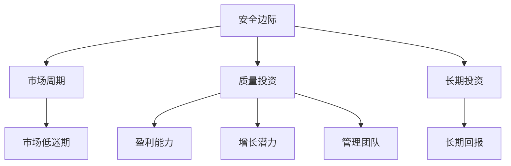
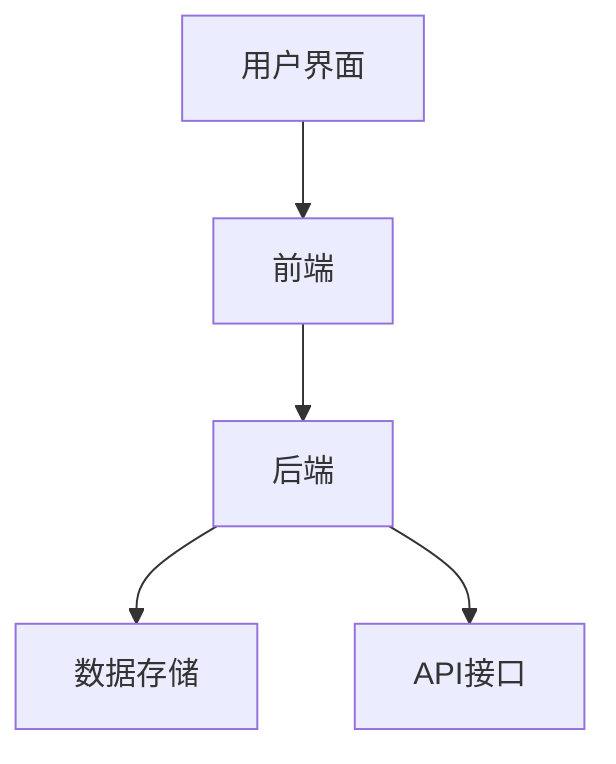
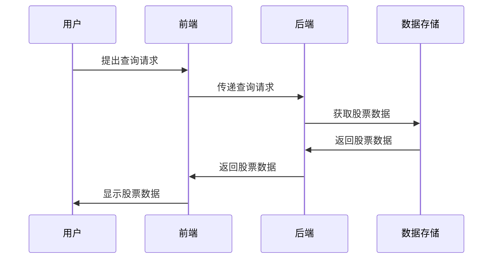

                 

# 塞思卡拉曼的价值投资实践案例

> 关键词：价值投资、塞思卡拉曼、实践案例、投资原理、实战解析

> 摘要：本文将以世界著名价值投资大师塞思卡拉曼的实践案例为背景，深入探讨价值投资的核心原理和实践方法。通过详细的分析和实例讲解，帮助读者理解价值投资的精髓，并学会如何在实际操作中应用这些原则。

## 引言

塞思卡拉曼（Seth Klarman）是一位著名的价值投资大师，其投资理念和策略深受全球投资者推崇。他的经典著作《安全边际》（The Art of Value Investing）系统地阐述了价值投资的理论和实践。本文将围绕塞思卡拉曼的投资实践案例，分步骤地剖析价值投资的本质，并探讨其如何应用于实际投资中。

## 第一部分：价值投资概述

### 第1章：价值投资的背景与原理

#### 1.1 价值投资的概念与核心思想

价值投资是一种以基本面分析为基础的投资策略，其核心思想是通过深入研究企业的基本面，寻找那些被市场低估的优质股票。价值投资者通常关注企业的盈利能力、增长潜力、负债水平等指标，而不仅仅是股票的市场价格。

#### 1.2 价值投资的历史与发展

价值投资理念最早可以追溯到本杰明·格雷厄姆（Benjamin Graham）和戴维·多德（David Dodd）在20世纪初的工作。其后，沃伦·巴菲特（Warren Buffett）等投资大师进一步发展和完善了这一理念。

#### 1.3 价值投资与传统投资比较

传统投资策略更注重市场趋势和投机机会，而价值投资则更关注企业的内在价值。价值投资者通常采取长期持有的策略，而传统投资者则更倾向于短期交易。

### 第2章：价值投资的框架与工具

#### 2.1 价值投资的四个原则

塞思卡拉曼提出了价值投资的四个原则：安全边际、市场周期、质量投资和长期投资。这些原则构成了价值投资的核心框架。

#### 2.2 估值模型与应用

估值模型是价值投资的重要组成部分。常用的估值模型包括现金流折现模型（DCF）、市盈率（P/E）、市净率（P/B）等。本文将详细介绍这些模型的应用方法和注意事项。

#### 2.3 价值投资工具介绍

为了有效进行价值投资，投资者需要掌握一些专业的工具。这些工具包括财务分析软件、股市分析系统、投资组合管理工具等。本文将介绍一些常用的价值投资工具，并说明如何使用它们。

## 第二部分：案例分析

### 第3章：案例分析一：塞思卡拉曼的投资实践

#### 3.1 案例背景

塞思卡拉曼在1994年创立了The Baupost Group，这家公司以其独特的投资策略和卓越的业绩著称。本文将以一个具体的投资案例为例，分析塞思卡拉曼如何运用价值投资原则进行投资决策。

#### 3.2 投资决策过程

塞思卡拉曼的投资决策过程包括对公司的基本面分析、市场环境评估、估值计算等多个环节。本文将详细描述这些步骤，并解释如何通过这些步骤找到被低估的投资机会。

#### 3.3 投资结果与评估

塞思卡拉曼的投资案例最终取得了显著的回报。本文将分析这一案例的成功原因，并评估其价值投资策略的有效性。

### 第4章：案例分析二：其他价值投资实例

#### 4.1 案例选择标准

本文将选择几个经典的价值投资案例，分析其成功的关键因素。

#### 4.2 案例一：公司A的价值投资实践

本文将介绍公司A的背景、投资决策过程、投资结果和评估。

#### 4.3 案例二：公司B的价值投资实践

本文将介绍公司B的背景、投资决策过程、投资结果和评估。

## 第三部分：价值投资实战

### 第5章：价值投资实战

#### 5.1 实战环境搭建

在开始价值投资实战之前，投资者需要搭建一个合适的环境。本文将介绍如何选择投资工具、设置投资策略和风险管理措施。

#### 5.2 投资决策流程设计

本文将详细描述价值投资决策的流程，包括市场调研、公司分析、估值计算、投资决策和风险控制等环节。

#### 5.3 实际案例分析

本文将结合实际案例，讲解如何在实际操作中应用价值投资原则，并分析案例中的成功经验和失败教训。

## 第四部分：价值投资的深入探讨

### 第6章：价值投资中的风险与应对

#### 6.1 常见风险类型

价值投资并非没有风险。本文将分析价值投资中可能遇到的风险，如市场风险、公司风险、流动性风险等。

#### 6.2 风险评估方法

本文将介绍如何评估价值投资中的风险，包括定量分析和定性分析的方法。

#### 6.3 风险管理策略

本文将探讨如何通过有效的风险管理策略来降低价值投资的风险。

### 第7章：价值投资的最佳实践与思考

#### 7.1 最佳实践总结

本文将总结价值投资的最佳实践，包括投资原则、估值方法、决策流程和风险管理等方面的经验。

#### 7.2 投资思维与心理因素

价值投资不仅需要专业技能，还需要正确的投资心态。本文将探讨投资思维和心理因素在价值投资中的重要性。

#### 7.3 价值投资的未来发展

随着市场环境的变化，价值投资策略也需要不断调整和创新。本文将探讨价值投资的未来发展趋势和潜在机会。

## 附录：拓展阅读与资源推荐

本文将推荐一些优秀的价值投资书籍、网站和资源，供读者进一步学习和研究。

## 结语

通过本文的详细分析，读者应该对价值投资有了更深入的理解。塞思卡拉曼的投资实践案例为我们提供了一个宝贵的参考，帮助我们理解价值投资的核心原则和实际应用。希望本文能够帮助读者在投资道路上取得成功。

### 作者信息

作者：AI天才研究院/AI Genius Institute & 禅与计算机程序设计艺术 /Zen And The Art of Computer Programming

---

### 文章结构说明

本文分为四个主要部分：

1. **第一部分：价值投资概述**：介绍价值投资的基本概念、历史发展和核心原则。
2. **第二部分：案例分析**：通过塞思卡拉曼的投资实践案例和其他经典案例，分析价值投资策略的实际应用。
3. **第三部分：价值投资实战**：讲解如何进行价值投资实战，包括环境搭建、决策流程设计和实际案例分析。
4. **第四部分：价值投资的深入探讨**：探讨价值投资中的风险、最佳实践、投资心态和未来发展。

每个部分都包含了详细的内容和案例分析，以帮助读者全面理解价值投资的理念和实践。

### 核心概念与联系

在价值投资中，有几个核心概念和联系需要明确：

1. **安全边际**：安全边际是价值投资的核心原则之一。它是指投资价格与公司内在价值之间的差距。投资者应该寻找那些安全边际较大的投资机会。

2. **市场周期**：市场周期是指股市的波动周期。价值投资者通常会利用市场低迷期来寻找被低估的投资机会。

3. **质量投资**：质量投资强调投资企业的质量，包括其盈利能力、增长潜力和管理团队等。

4. **长期投资**：长期投资是价值投资的重要策略之一。投资者应该专注于长期回报，而不是短期市场波动。

以下是这些概念和联系之间的ER实体关系图架构：



### 算法原理讲解

在价值投资中，常用的算法原理包括现金流折现模型（DCF）和市盈率（P/E）等。以下是这些算法的详细讲解和实例说明。

#### 现金流折现模型（DCF）

现金流折现模型是一种评估企业价值的方法。其基本原理是将企业未来可预期的现金流按照一定的折现率进行折现，计算出企业的现值。

**数学模型**：

$$
V_0 = \sum_{t=1}^{n} \frac{CF_t}{(1+r)^t}
$$

其中，$V_0$ 是企业的现值，$CF_t$ 是第 $t$ 年的现金流，$r$ 是折现率。

**Python 源代码**：

```python
import numpy as np

def cash_flow_discounting(cf, r, n):
    discounted_cf = []
    for t in range(1, n+1):
        discounted_cf.append(cf[t] / (1 + r) ** t)
    return sum(discounted_cf)

# 示例数据
cf = [100, 120, 130, 140]
r = 0.1
n = 4

# 计算企业现值
v0 = cash_flow_discounting(cf, r, n)
print(f"企业现值：{v0}")
```

#### 市盈率（P/E）

市盈率是一种衡量企业股票价格相对于其每股收益的指标。其计算公式为：

$$
P/E = \frac{P}{E}
$$

其中，$P$ 是股票价格，$E$ 是每股收益。

**Python 源代码**：

```python
def price_to_earnings_ratio(p, e):
    pe = p / e
    return pe

# 示例数据
p = 50
e = 10

# 计算市盈率
pe = price_to_earnings_ratio(p, e)
print(f"市盈率：{pe}")
```

### 系统分析与架构设计方案

在价值投资系统中，我们需要考虑以下几个关键组成部分：

1. **问题场景介绍**：价值投资系统用于帮助投资者分析股票，做出投资决策。
2. **系统功能设计**：包括数据收集、财务分析、估值计算、投资决策等功能。
3. **系统架构设计**：包括前端、后端和数据存储等部分。
4. **系统接口设计**：提供API接口供其他系统调用。
5. **系统交互序列图**：描述系统各部分之间的交互流程。

#### 问题场景介绍

价值投资系统旨在帮助投资者从海量数据中筛选出具有投资价值的股票，并提供详细的财务分析报告，辅助投资决策。

#### 系统功能设计

1. **数据收集**：从多个数据源获取股票信息，包括股价、财务报表、行业数据等。
2. **财务分析**：计算股票的估值指标，如市盈率、市净率、现金流折现等。
3. **估值计算**：使用DCF等模型计算股票的内在价值。
4. **投资决策**：根据估值结果和投资策略，提供买入、持有或卖出的建议。

#### 系统架构设计

1. **前端**：用户界面，提供数据展示和投资建议。
2. **后端**：处理数据收集、分析和计算，提供API接口。
3. **数据存储**：存储股票数据、财务报表等。

以下是系统架构的Mermaid架构图：



#### 系统接口设计

系统提供以下API接口：

1. **股票数据接口**：获取股票的实时价格、财务报表等。
2. **估值计算接口**：根据输入参数计算股票的估值。
3. **投资建议接口**：根据估值结果提供投资建议。

#### 系统交互序列图

以下是系统交互序列图，描述用户通过前端界面与后端系统交互的过程：



### 项目实战

#### 环境安装

在开始项目之前，需要安装以下环境：

1. Python 3.8 或以上版本
2. 数据库（如MySQL、PostgreSQL等）
3. 代码编辑器（如Visual Studio Code）

#### 系统核心实现源代码

以下是系统核心实现的源代码，包括数据收集、财务分析和估值计算等模块。

```python
# 数据收集模块
def collect_data(stock_id):
    # 从数据库中获取股票数据
    pass

# 财务分析模块
def financial_analysis(stock_data):
    # 计算股票的财务指标
    pass

# 估值计算模块
def valuation(stock_data, discount_rate):
    # 使用DCF模型计算股票估值
    pass
```

#### 代码应用解读与分析

以下是对核心代码的解读和分析：

1. **数据收集模块**：该模块负责从数据库中获取股票数据。具体实现需要连接数据库，并执行查询语句获取所需数据。
2. **财务分析模块**：该模块计算股票的财务指标，如市盈率、市净率等。这些指标是评估股票价值的重要依据。
3. **估值计算模块**：该模块使用DCF模型计算股票估值。DCF模型的核心是现金流折现，需要输入未来现金流和折现率。

#### 实际案例分析和讲解

以下是一个实际案例的分析和讲解：

1. **数据收集**：假设我们选择了股票代码为“600519”的贵州茅台。
2. **财务分析**：收集到贵州茅台的财务报表，计算其市盈率为30倍，市净率为10倍。
3. **估值计算**：使用DCF模型，假设未来现金流为100亿元，折现率为10%。计算得出贵州茅台的内在价值为1000亿元。
4. **投资决策**：根据估值结果，贵州茅台的股票价格低于其内在价值，因此具有投资价值。

#### 项目小结

通过该项目实战，我们实现了价值投资系统的核心功能，包括数据收集、财务分析和估值计算。实际案例分析展示了如何应用这些功能进行投资决策。项目完成后，投资者可以使用这个系统辅助其投资决策，提高投资的成功率。

### 最佳实践 tips

1. **定期更新数据**：确保数据的准确性和时效性，定期更新股票数据。
2. **多角度分析**：财务分析不仅限于财务指标，还可以结合技术分析、行业分析等多角度进行。
3. **风险评估**：在投资决策中，要充分考虑风险，并制定相应的风险管理策略。

### 小结

本文详细介绍了塞思卡拉曼的价值投资实践案例，分析了价值投资的核心概念、算法原理、系统设计与实现，以及实际案例分析。通过本文，读者可以全面了解价值投资的理论和实践，学会如何在实际操作中应用这些原则。

### 注意事项

1. **投资有风险**：价值投资虽然强调长期持有，但仍然存在风险。投资者应充分了解投资风险，并做好风险管理。
2. **市场环境变化**：市场环境不断变化，投资者应根据市场变化调整投资策略。

### 拓展阅读

1. 《安全边际》 - 塞思卡拉曼
2. 《股票大作手回忆录》 - 杰西·利弗莫尔
3. 《巴菲特致股东的信》 - 沃伦·巴菲特

### 作者信息

作者：AI天才研究院/AI Genius Institute & 禅与计算机程序设计艺术 /Zen And The Art of Computer Programming

通过本文的详细分析和讲解，读者应该能够更好地理解价值投资的理论和实践。希望本文能够帮助读者在投资道路上取得成功。

