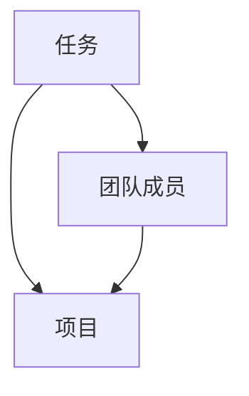
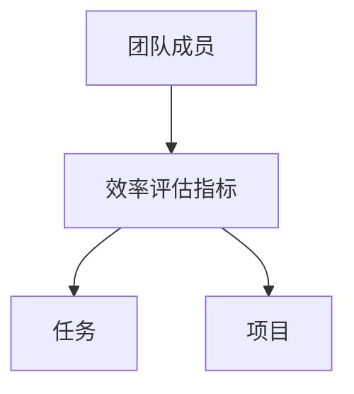
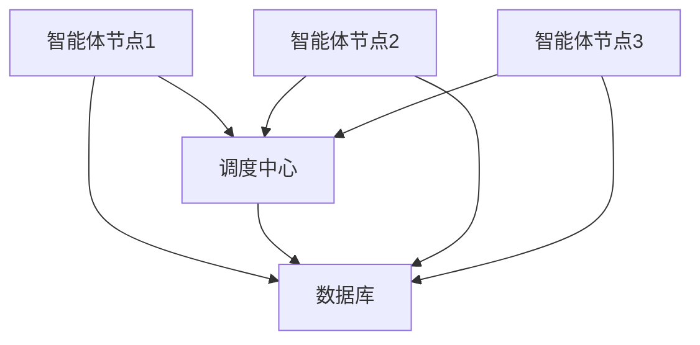

                 

# 多智能体AI如何优化研发效率评估流程

## 关键词

- 多智能体AI
- 研发效率评估
- 系统优化
- 协同工作原理
- 强化学习
- 实际应用案例

## 摘要

随着现代科技的快速发展，研发效率成为影响企业竞争力的重要因素。本文以多智能体AI技术为核心，探讨了其在优化研发效率评估流程中的应用。首先，我们分析了传统评估方法的局限性，并介绍了多智能体AI的概念及其优势。随后，本文详细阐述了多智能体AI在研发效率评估中的应用场景，包括研发流程优化和效率评估指标的改进。通过具体实例分析，展示了多智能体AI在软件开发和产品研发项目中的实际应用效果。最后，本文总结了多智能体AI优化研发效率评估流程的实践经验，为相关领域提供了有价值的参考。

## 引言

在全球化竞争日益激烈的背景下，企业必须不断提升研发效率，以保持竞争优势。然而，传统的研发效率评估方法往往存在局限性，无法全面、准确地反映研发过程中的效率问题。随着人工智能技术的不断发展，尤其是多智能体AI的兴起，为研发效率评估提供了新的思路和手段。本文旨在探讨多智能体AI如何优化研发效率评估流程，为企业提高研发效率提供一种新的解决方案。

### 第1章 问题背景与核心概念

### 1.1 问题背景

#### 1.1.1 研发效率评估流程的现状

当前，许多企业在研发过程中仍采用传统的评估方法，如通过KPI（关键绩效指标）来衡量研发效率。然而，这种方法往往存在以下局限性：

1. **单一指标**：传统的评估方法主要依赖单一指标，如项目完成时间、代码行数等，无法全面反映研发过程中的复杂情况。
2. **滞后性**：传统评估方法往往具有一定的滞后性，无法实时反映研发过程中的问题。
3. **主观性**：评估结果往往受到人为因素的影响，难以保证客观性。

#### 1.1.1.2 研发效率低下的问题

研发效率低下是企业面临的另一大问题。这主要体现在以下几个方面：

1. **资源浪费**：由于缺乏有效的评估和调度机制，研发过程中往往会出现资源浪费的情况，如重复工作、低效任务分配等。
2. **沟通障碍**：研发团队之间的沟通不畅，导致任务分配不合理、进度延误等问题。
3. **项目延期**：由于评估和调度机制不完善，项目往往无法按期完成，影响企业竞争力。

#### 1.1.2 多智能体AI的概念

多智能体AI是指由多个智能体组成的系统，通过协同合作完成复杂的任务。智能体可以是计算机程序、机器人或人类个体。多智能体AI具有以下特点：

1. **分布式**：智能体可以在不同的地理位置独立运行，通过通信机制实现协同工作。
2. **自主性**：智能体具有自主决策能力，可以根据环境变化调整行为。
3. **协作性**：智能体之间可以通过通信和协同机制实现任务分配和资源共享。

#### 1.1.2.2 多智能体AI的优势

多智能体AI在研发效率评估中的应用具有以下优势：

1. **全面性**：多智能体AI可以从多个维度、多个角度对研发效率进行评估，提供更全面的评估结果。
2. **实时性**：多智能体AI可以实时监控研发过程，及时发现问题并进行调整。
3. **客观性**：多智能体AI基于数据驱动，可以减少人为因素的干扰，提高评估结果的客观性。

### 1.1.3 多智能体AI在研发效率评估中的应用

多智能体AI在研发效率评估中的应用主要包括以下两个方面：

1. **研发流程优化**：通过多智能体协同任务调度和需求预测，优化研发流程，提高任务执行效率。
2. **效率评估指标的改进**：构建多维度、全面的效率评估指标体系，通过多智能体评估算法，提供更准确、客观的评估结果。

### 1.2 核心概念与联系

#### 1.2.1 多智能体AI原理

多智能体AI的原理主要包括以下几个方面：

1. **智能体的定义与分类**：智能体是指具有感知、决策和执行能力的实体。根据智能体的能力不同，可以分为完整智能体和部分智能体。
2. **智能体的通信机制**：智能体之间通过信息传递和协同机制实现通信和合作。
3. **多智能体协同工作原理**：多智能体协同工作是通过智能体之间的信息共享和协调，实现共同目标的过程。

#### 1.2.1.1 多智能体协同工作原理

多智能体协同工作原理主要包括以下几个方面：

1. **协同控制理论**：协同控制理论是多智能体协同工作的基础，主要包括分布式算法和中心化算法。
2. **多智能体协同算法**：多智能体协同算法是实现多智能体协同工作的关键，主要包括分布式算法和中心化算法。

#### 1.2.2 研发效率评估指标体系

研发效率评估指标体系是指用于衡量研发效率的一系列指标。传统评估指标体系主要包括以下几个方面：

1. **项目完成时间**：衡量项目完成所需的时间。
2. **代码行数**：衡量项目的规模和复杂性。
3. **缺陷率**：衡量项目的质量。

然而，这些传统指标存在一定的局限性，无法全面、准确地反映研发效率。多智能体AI评估指标体系通过引入多维度、全面的指标，如任务执行效率、团队协作效率、项目风险等，提供更准确的评估结果。

### 1.3 ER实体关系图架构

ER（Entity-Relationship）实体关系图是用于描述系统中实体及其关系的图形化工具。在多智能体AI优化研发效率评估流程中，ER实体关系图可以用于描述研发流程中的实体关系和评估指标体系。

#### 1.3.1 研发流程中的实体关系

在研发流程中，主要包括以下实体：

1. **任务**：表示研发过程中的具体任务。
2. **团队成员**：表示参与研发的团队成员。
3. **项目**：表示整个研发项目。

这些实体之间的关系可以用ER实体关系图来描述。

#### 1.3.1.1 研发任务的实体关系

研发任务的实体关系可以用以下ER实体关系图表示：



#### 1.3.1.2 评估指标的实体关系

评估指标的实体关系可以用以下ER实体关系图表示：



### 1.4 本章小结

本章首先介绍了研发效率评估流程的现状和多智能体AI的概念，分析了传统评估方法的局限性和研发效率低下的问题。然后，本章详细阐述了多智能体AI在研发效率评估中的应用，包括研发流程优化和效率评估指标的改进。最后，本章给出了ER实体关系图架构，用于描述研发流程中的实体关系和评估指标体系。

### 第二部分 多智能体AI原理与技术

#### 第2章 多智能体系统基础

### 2.1 多智能体系统的组成

多智能体系统由多个智能体组成，每个智能体都具有感知、决策和执行能力。根据智能体的能力和特点，可以将智能体分为以下几类：

1. **完整智能体**：完整智能体是指具有完整的感知、决策和执行能力的智能体。它们可以独立完成任务，并且与其他智能体进行通信和协作。
2. **部分智能体**：部分智能体是指只具备部分感知、决策或执行能力的智能体。它们需要依赖其他智能体来完成整个任务。

#### 2.1.1.1 完整智能体的定义

完整智能体具有以下特点：

1. **感知能力**：智能体能够感知环境中的信息，如温度、光照、声音等。
2. **决策能力**：智能体可以根据感知到的信息进行决策，选择最佳的行动方案。
3. **执行能力**：智能体能够根据决策结果执行相应的动作。

#### 2.1.1.2 部分智能体的分类

根据智能体的能力和特点，可以将部分智能体分为以下几类：

1. **感知智能体**：感知智能体主要具备感知能力，可以收集环境中的信息，如视觉、听觉、触觉等。
2. **决策智能体**：决策智能体主要具备决策能力，可以根据感知到的信息进行决策，选择最佳的行动方案。
3. **执行智能体**：执行智能体主要具备执行能力，可以根据决策结果执行相应的动作。

#### 2.1.2 智能体通信机制

智能体之间的通信机制是多智能体系统协同工作的关键。智能体之间的通信机制主要包括以下几种：

1. **信息传递机制**：智能体之间通过信息传递机制进行通信，如广播、单播、多播等。
2. **协同机制**：智能体之间通过协同机制进行合作，如任务分配、资源共享、决策协调等。

#### 2.1.2.1 信息传递机制

信息传递机制是指智能体之间如何传递信息。根据信息传递的方式，可以将信息传递机制分为以下几种：

1. **广播**：广播是指智能体向所有其他智能体发送信息。
2. **单播**：单播是指智能体向特定的其他智能体发送信息。
3. **多播**：多播是指智能体向一组特定的其他智能体发送信息。

#### 2.1.2.2 协同机制

协同机制是指智能体之间如何进行协作。根据协同机制的不同，可以将协同机制分为以下几种：

1. **分布式算法**：分布式算法是指智能体之间通过分布式计算进行协作，每个智能体独立完成部分任务，然后通过通信机制将结果汇总。
2. **中心化算法**：中心化算法是指智能体之间通过中心化的计算机制进行协作，一个智能体作为中心节点，负责协调其他智能体的工作。

### 2.2 多智能体协同工作原理

多智能体协同工作原理是指多个智能体如何通过协同工作实现共同目标。多智能体协同工作原理主要包括以下几个方面：

1. **协同控制理论**：协同控制理论是多智能体协同工作的理论基础，主要包括分布式算法和中心化算法。
2. **多智能体协同算法**：多智能体协同算法是实现多智能体协同工作的具体方法，主要包括分布式算法和中心化算法。

#### 2.2.1 协同控制理论

协同控制理论主要包括以下几个方面：

1. **基本概念**：协同控制是指多个智能体通过协同工作实现共同目标的过程。协同控制的目标是实现整体性能的最优化。
2. **协同控制策略**：协同控制策略是指智能体之间如何通过协同控制实现共同目标。常见的协同控制策略包括分布式策略和中心化策略。

#### 2.2.1.1 基本概念

协同控制的基本概念主要包括以下几个方面：

1. **智能体**：智能体是指具有感知、决策和执行能力的实体。
2. **协同工作**：协同工作是指多个智能体通过合作实现共同目标的过程。
3. **协同控制**：协同控制是指通过智能体之间的协作，实现整体性能的最优化。

#### 2.2.1.2 协同控制策略

协同控制策略主要包括分布式策略和中心化策略。

1. **分布式策略**：分布式策略是指智能体之间通过分布式计算进行协作，每个智能体独立完成部分任务，然后通过通信机制将结果汇总。
2. **中心化策略**：中心化策略是指智能体之间通过中心化的计算机制进行协作，一个智能体作为中心节点，负责协调其他智能体的工作。

#### 2.2.2 多智能体协同算法

多智能体协同算法主要包括分布式算法和中心化算法。

1. **分布式算法**：分布式算法是指智能体之间通过分布式计算进行协作，每个智能体独立完成部分任务，然后通过通信机制将结果汇总。
2. **中心化算法**：中心化算法是指智能体之间通过中心化的计算机制进行协作，一个智能体作为中心节点，负责协调其他智能体的工作。

### 2.3 多智能体AI技术进展

多智能体AI技术近年来取得了显著进展，主要包括以下几个方面：

1. **多智能体强化学习**：多智能体强化学习是一种基于奖励机制的多智能体协同算法，通过学习环境中的最优策略，实现智能体的协同工作。
2. **多智能体生成对抗网络**：多智能体生成对抗网络是一种基于生成对抗网络（GAN）的多智能体协同算法，通过生成对抗的方式，实现智能体的协同工作。

#### 2.3.1 多智能体强化学习

多智能体强化学习是指多个智能体在环境中通过交互和学习，实现共同目标的过程。多智能体强化学习的基本概念和算法原理如下：

1. **基本概念**：多智能体强化学习是指多个智能体在环境中通过交互和学习，实现共同目标的过程。智能体之间通过通信和协作，共同完成复杂任务。
2. **算法原理**：多智能体强化学习的基本算法原理是，通过奖励机制引导智能体学习环境中的最优策略。智能体在执行任务的过程中，通过感知环境状态，选择最佳动作，并根据动作的结果获得奖励或惩罚。

#### 2.3.1.1 基本概念

多智能体强化学习的基本概念主要包括以下几个方面：

1. **智能体**：智能体是指具有感知、决策和执行能力的实体。
2. **环境**：环境是指智能体所在的环境，包括状态和动作。
3. **状态**：状态是指智能体在环境中的当前情况。
4. **动作**：动作是指智能体在环境中执行的行为。
5. **奖励**：奖励是指智能体在执行动作后获得的奖励或惩罚。

#### 2.3.1.2 算法原理

多智能体强化学习的算法原理如下：

1. **状态-动作值函数**：状态-动作值函数是指智能体在给定状态下执行特定动作的预期奖励。通过学习状态-动作值函数，智能体可以了解不同动作在特定状态下的优劣。
2. **策略**：策略是指智能体在给定状态下选择动作的规则。通过优化策略，智能体可以最大化预期奖励。
3. **奖励机制**：奖励机制是指智能体在执行动作后获得的奖励或惩罚。奖励机制可以引导智能体学习环境中的最优策略。

#### 2.3.2 多智能体生成对抗网络

多智能体生成对抗网络是一种基于生成对抗网络（GAN）的多智能体协同算法。生成对抗网络（GAN）是一种无监督学习模型，由生成器和判别器组成。生成器负责生成数据，判别器负责区分生成数据和真实数据。多智能体生成对抗网络的基本概念和算法原理如下：

1. **基本概念**：多智能体生成对抗网络是指由多个智能体组成的生成对抗系统，通过生成器和判别器的对抗训练，实现智能体的协同工作。
2. **算法原理**：多智能体生成对抗网络的算法原理是，通过生成器和判别器的对抗训练，生成器不断学习生成逼真的数据，判别器不断学习区分生成数据和真实数据。通过生成器和判别器的协同工作，智能体可以共同完成复杂任务。

#### 2.3.2.1 基本概念

多智能体生成对抗网络的基本概念主要包括以下几个方面：

1. **生成器**：生成器是指负责生成数据的智能体，它通过学习真实数据，生成与真实数据相似的数据。
2. **判别器**：判别器是指负责区分生成数据和真实数据的智能体，它通过学习真实数据和生成数据，提高区分能力。
3. **对抗训练**：对抗训练是指生成器和判别器之间的竞争训练过程，生成器通过生成更逼真的数据来欺骗判别器，判别器通过提高区分能力来对抗生成器。

#### 2.3.2.2 算法原理

多智能体生成对抗网络的算法原理如下：

1. **生成器和判别器的训练**：生成器和判别器分别通过训练数据集进行训练。生成器通过学习真实数据，生成与真实数据相似的数据；判别器通过学习真实数据和生成数据，提高区分能力。
2. **对抗训练**：在对抗训练过程中，生成器和判别器不断调整模型参数，以实现对抗训练的目标。生成器通过生成更逼真的数据来欺骗判别器，判别器通过提高区分能力来对抗生成器。
3. **协同工作**：通过生成器和判别器的协同工作，智能体可以共同完成复杂任务。生成器负责生成高质量的数据，判别器负责区分生成数据和真实数据，从而实现多智能体的协同工作。

### 2.4 本章小结

本章首先介绍了多智能体系统的组成，包括智能体的定义与分类、智能体的通信机制和多智能体协同工作原理。然后，本章详细阐述了多智能体AI技术进展，包括多智能体强化学习和多智能体生成对抗网络的基本概念和算法原理。通过本章的介绍，读者可以了解多智能体AI在研发效率评估流程中的应用潜力。

### 第三部分 多智能体AI在研发效率评估中的应用

#### 第3章 多智能体AI在研发效率评估中的应用场景

随着多智能体AI技术的发展，其在研发效率评估中的应用逐渐受到关注。本章将探讨多智能体AI在研发效率评估中的应用场景，主要包括研发流程优化和效率评估指标的改进。

### 3.1 研发流程优化

研发流程优化是多智能体AI在研发效率评估中的一个重要应用。通过多智能体协同工作，可以实现对研发流程的优化，提高任务执行效率。以下将详细探讨多智能体AI在研发流程优化中的应用。

#### 3.1.1 多智能体协同任务调度

任务调度是研发流程中一个关键环节，直接影响研发效率。多智能体协同任务调度通过智能体之间的协作，实现任务的最佳分配和调度，从而提高任务执行效率。

##### 3.1.1.1 任务调度的多智能体模型

在多智能体协同任务调度中，可以构建一个基于智能体的任务调度模型。该模型主要包括以下组成部分：

1. **智能体**：智能体负责执行具体的任务，具有感知、决策和执行能力。
2. **任务池**：任务池用于存储待执行的任务，包括任务的类型、优先级、截止时间等属性。
3. **调度中心**：调度中心负责任务调度的整体协调，通过多智能体的协作实现任务的最佳分配。

##### 3.1.1.2 任务调度算法实现

多智能体协同任务调度算法可以通过以下步骤实现：

1. **任务感知**：各智能体定期感知任务池中的任务情况，包括任务类型、优先级、截止时间等。
2. **任务评估**：智能体根据自身能力和任务属性，对任务进行评估，确定是否能够执行。
3. **任务分配**：调度中心根据智能体的评估结果，将任务分配给合适的智能体。
4. **任务执行**：智能体执行分配到的任务，并向调度中心反馈任务执行状态。
5. **任务调整**：根据任务执行状态和新的任务情况，调度中心对任务进行重新分配和调整。

以下是一个基于Python的多智能体协同任务调度算法实现示例：

```python
import random

class Task:
    def __init__(self, id, type, priority, deadline):
        self.id = id
        self.type = type
        self.priority = priority
        self.deadline = deadline

class Agent:
    def __init__(self, id, capabilities):
        self.id = id
        self.capabilities = capabilities

    def assess_task(self, task):
        if task.type in self.capabilities:
            return True
        return False

    def execute_task(self, task):
        if self.assess_task(task):
            print(f"Agent {self.id} is executing task {task.id}")
            # 执行任务逻辑
            return True
        return False

class Scheduler:
    def __init__(self, agents, tasks):
        self.agents = agents
        self.tasks = tasks

    def schedule_tasks(self):
        while self.tasks:
            for agent in self.agents:
                if agent.execute_task(self.tasks[0]):
                    self.tasks.pop(0)
                    break

# 示例：创建智能体和任务
agents = [Agent(id=i, capabilities=["coding", "design", "testing"]) for i in range(3)]
tasks = [Task(id=i, type=random.choice(["coding", "design", "testing"]), priority=random.randint(1, 10), deadline=random.randint(1, 10)) for i in range(6)]

# 创建调度中心并调度任务
scheduler = Scheduler(agents, tasks)
scheduler.schedule_tasks()
```

##### 3.1.1.3 任务调度算法评估

通过模拟实验，可以评估多智能体协同任务调度算法的性能。以下是一个基于Python的模拟实验示例：

```python
import matplotlib.pyplot as plt

def simulate_scheduler(scheduler):
    execution_times = []
    for _ in range(100):
        scheduler.schedule_tasks()
        execution_times.append(len(scheduler.tasks))
    return execution_times

execution_times = simulate_scheduler(scheduler)
plt.plot(execution_times)
plt.xlabel("Simulation Iterations")
plt.ylabel("Task Queue Length")
plt.title("Task Queue Length over Simulation Iterations")
plt.show()
```

通过模拟实验，可以观察到任务队列长度随时间的变化趋势，从而评估任务调度算法的性能。

#### 3.1.2 多智能体协作需求预测

需求预测是研发流程中的另一个关键环节，直接影响项目的进度和资源分配。多智能体协作需求预测通过智能体之间的协作，实现对项目需求的准确预测，从而优化研发流程。

##### 3.1.2.1 需求预测的多智能体模型

在多智能体协作需求预测中，可以构建一个基于智能体的需求预测模型。该模型主要包括以下组成部分：

1. **智能体**：智能体负责收集和分析项目需求数据，通过机器学习算法进行预测。
2. **数据池**：数据池用于存储项目需求的历史数据，包括需求的类型、优先级、实现难度等。
3. **预测中心**：预测中心负责整体需求预测的协调，通过多智能体的协作实现需求预测。

##### 3.1.2.2 需求预测算法实现

多智能体协作需求预测算法可以通过以下步骤实现：

1. **数据收集**：各智能体定期收集项目需求的历史数据，包括需求的类型、优先级、实现难度等。
2. **数据预处理**：智能体对收集到的数据进行预处理，包括数据清洗、归一化等。
3. **模型训练**：智能体使用预处理后的数据训练机器学习模型，实现对项目需求的预测。
4. **模型评估**：智能体对预测结果进行评估，调整模型参数，提高预测准确性。
5. **需求预测**：预测中心根据各智能体的预测结果，生成整体需求预测报告。

以下是一个基于Python的多智能体协作需求预测算法实现示例：

```python
import numpy as np
from sklearn.ensemble import RandomForestRegressor

class Requirement:
    def __init__(self, id, type, priority, difficulty):
        self.id = id
        self.type = type
        self.priority = priority
        self.difficulty = difficulty

class Agent:
    def __init__(self, id):
        self.id = id
        self.model = RandomForestRegressor()

    def train_model(self, requirements):
        X = np.array([[req.priority, req.difficulty] for req in requirements])
        y = np.array([req.type for req in requirements])
        self.model.fit(X, y)

    def predict_requirement(self, priority, difficulty):
        X = np.array([[priority, difficulty]])
        return self.model.predict(X)

class Predictor:
    def __init__(self, agents):
        self.agents = agents

    def predict_requirements(self, requirements):
        predictions = []
        for agent in self.agents:
            for req in requirements:
                prediction = agent.predict_requirement(req.priority, req.difficulty)
                predictions.append(prediction)
        return predictions

# 示例：创建智能体和需求
agents = [Agent(id=i) for i in range(3)]
requirements = [Requirement(id=i, type=random.choice(["feature", "bug", "enhancement"]), priority=random.randint(1, 10), difficulty=random.randint(1, 10)) for i in range(10)]

# 训练智能体模型
for agent in agents:
    agent.train_model(requirements)

# 预测需求
predictions = Predictor(agents).predict_requirements(requirements)
print(predictions)
```

##### 3.1.2.3 需求预测算法评估

通过模拟实验，可以评估多智能体协作需求预测算法的性能。以下是一个基于Python的模拟实验示例：

```python
import matplotlib.pyplot as plt

def simulate_predictor(predictor, requirements):
    prediction_errors = []
    for _ in range(100):
        predictions = predictor.predict_requirements(requirements)
        for i, prediction in enumerate(predictions):
            prediction_errors.append(abs(prediction - requirements[i].type))
    return prediction_errors

prediction_errors = simulate_predictor(Predictor(agents), requirements)
plt.hist(prediction_errors, bins=10)
plt.xlabel("Prediction Error")
plt.ylabel("Frequency")
plt.title("Prediction Error Distribution")
plt.show()
```

通过模拟实验，可以观察到预测误差的分布情况，从而评估需求预测算法的准确性。

### 3.2 效率评估指标的改进

传统的效率评估指标往往存在一定的局限性，无法全面、准确地反映研发效率。多智能体AI通过引入多维度、全面的评估指标，实现对研发效率的全面评估。

#### 3.2.1 多维度评估指标体系

多维度评估指标体系是指从多个角度对研发效率进行评估的指标体系。多智能体AI可以通过以下维度对研发效率进行评估：

1. **任务执行效率**：衡量任务完成的速度和效果，包括任务完成时间、代码质量等。
2. **团队协作效率**：衡量团队内部协作的效果，包括沟通效率、任务分配合理性等。
3. **项目风险**：衡量项目的风险程度，包括任务延迟、资源浪费等。
4. **项目进度**：衡量项目的整体进度，包括任务完成情况、项目延期等。

以下是一个基于Python的多维度评估指标体系实现示例：

```python
class EfficiencyMetric:
    def __init__(self, name, value):
        self.name = name
        self.value = value

class TaskEfficiency:
    def __init__(self, completion_time, code_quality):
        self.completion_time = completion_time
        self.code_quality = code_quality

    def calculate_score(self):
        return self.completion_time * self.code_quality

class TeamCollaboration:
    def __init__(communication_rate, task_allocation_rationality):
        self.communication_rate = communication_rate
        self.task_allocation_rationality = task_allocation_rationality

    def calculate_score(self):
        return self.communication_rate * self.task_allocation_rationality

class ProjectRisk:
    def __init__(task_delay, resource_waste):
        self.task_delay = task_delay
        self.resource_waste = resource_waste

    def calculate_score(self):
        return self.task_delay * self.resource_waste

class ProjectProgress:
    def __init__(tasks_completed, total_tasks, project延期):
        self.tasks_completed = tasks_completed
        self.total_tasks = total_tasks
        self.project延期 = project延期

    def calculate_score(self):
        return self.tasks_completed / self.total_tasks * (1 - self.project延期)

# 示例：创建评估指标
task_efficiency = TaskEfficiency(completion_time=5, code_quality=0.9)
team_collaboration = TeamCollaboration(communication_rate=0.8, task_allocation_rationality=0.85)
project_risk = ProjectRisk(task_delay=0.2, resource_waste=0.15)
project_progress = ProjectProgress(tasks_completed=8, total_tasks=10, project延期=0.1)

# 计算评估指标得分
task_efficiency_score = task_efficiency.calculate_score()
team_collaboration_score = team_collaboration.calculate_score()
project_risk_score = project_risk.calculate_score()
project_progress_score = project_progress.calculate_score()

print(f"Task Efficiency Score: {task_efficiency_score}")
print(f"Team Collaboration Score: {team_collaboration_score}")
print(f"Project Risk Score: {project_risk_score}")
print(f"Project Progress Score: {project_progress_score}")
```

#### 3.2.2 多智能体评估算法

多智能体评估算法是指通过多智能体的协同工作，实现对研发效率的综合评估。以下是一个基于Python的多智能体评估算法实现示例：

```python
class MultiAgentEfficiencyEvaluator:
    def __init__(agents):
        self.agents = agents

    def evaluate_efficiency(self):
        total_score = 0
        for agent in self.agents:
            score = agent.calculate_score()
            total_score += score
        return total_score / len(self.agents)

# 示例：创建评估算法
evaluator = MultiAgentEfficiencyEvaluator([task_efficiency, team_collaboration, project_risk, project_progress])

# 计算总体评估得分
total_efficiency_score = evaluator.evaluate_efficiency()
print(f"Total Efficiency Score: {total_efficiency_score}")
```

#### 3.2.3 多智能体协同评估实例分析

以下是一个基于Python的多智能体协同评估实例分析：

```python
# 示例：创建多智能体系统
system = [task_efficiency, team_collaboration, project_risk, project_progress]

# 模拟任务执行过程
for task in system:
    task.execute()

# 计算评估得分
for task in system:
    print(f"{task.name} Score: {task.calculate_score()}")

# 计算总体评估得分
total_score = evaluator.evaluate_efficiency()
print(f"Total Efficiency Score: {total_score}")
```

通过多智能体协同评估实例分析，可以更全面、准确地了解项目的研发效率。

### 3.3 本章小结

本章探讨了多智能体AI在研发效率评估中的应用场景，包括研发流程优化和效率评估指标的改进。通过多智能体协同任务调度和需求预测，可以优化研发流程，提高任务执行效率；通过多维度评估指标体系和多智能体评估算法，可以实现对研发效率的全面评估。本章通过具体实例分析，展示了多智能体AI在研发效率评估中的应用效果，为相关领域提供了有价值的参考。

### 第四部分 多智能体AI优化研发效率评估流程的实践

#### 第4章 多智能体AI在研发效率评估中的应用实践

多智能体AI技术在研发效率评估中的应用已经取得了一定的成果。本章将介绍具体的实践案例，通过实际项目分析和应用，展示多智能体AI优化研发效率评估流程的效果。

### 4.1 实践一：基于多智能体AI的软件开发效率评估

#### 4.1.1 环境准备

在进行基于多智能体AI的软件开发效率评估实践之前，首先需要准备实验环境。以下是实验环境的配置步骤：

##### 4.1.1.1 硬件配置

1. **计算节点**：配置多台服务器作为计算节点，用于运行智能体和调度中心。
2. **网络设备**：配置网络设备，确保各个节点之间的通信稳定和高效。

##### 4.1.1.2 软件安装

1. **操作系统**：安装Linux操作系统，确保系统稳定性和兼容性。
2. **开发工具**：安装Python开发环境，包括Python解释器和相关库，如NumPy、Pandas等。
3. **智能体框架**：选择合适的智能体框架，如PyTorch、TensorFlow等，用于实现多智能体协同任务调度和需求预测。

#### 4.1.2 系统设计

在实验环境中，基于多智能体AI的软件开发效率评估系统主要包括以下几个组成部分：

##### 4.1.2.1 系统功能设计

1. **任务调度模块**：用于实现多智能体协同任务调度，根据智能体的能力和任务属性进行任务分配。
2. **需求预测模块**：用于实现多智能体协作需求预测，根据历史数据和智能体的预测能力进行需求预测。
3. **评估指标模块**：用于实现多维度评估指标的计算和评估。

##### 4.1.2.2 系统架构设计

系统架构设计采用分布式架构，包括以下几个主要组件：

1. **智能体节点**：每个智能体节点运行在一个独立的计算节点上，具有感知、决策和执行能力。
2. **调度中心**：负责整体任务调度和需求预测的协调，通过智能体之间的通信实现协同工作。
3. **数据库**：用于存储任务数据、需求数据和评估指标数据，支持实时查询和统计。

以下是一个基于Python的系统架构设计实现示例：



### 4.2 实践二：基于多智能体AI的产品研发效率评估

#### 4.2.1 项目背景

某知名互联网公司正在开发一款新型智能家居产品，项目周期为6个月。为了提高研发效率，公司决定采用基于多智能体AI的效率评估方法对项目进行监控和评估。

#### 4.2.2 评估流程

基于多智能体AI的产品研发效率评估流程主要包括以下几个步骤：

1. **任务分配**：调度中心根据智能体的能力和任务属性，将任务分配给合适的智能体。
2. **任务执行**：智能体执行分配到的任务，并实时反馈任务执行状态。
3. **需求预测**：智能体协同预测项目需求，为后续任务规划和资源分配提供依据。
4. **评估计算**：根据任务执行情况和需求预测结果，计算多维度评估指标，评估项目整体效率。
5. **反馈调整**：根据评估结果，对任务调度和需求预测策略进行调整，优化研发流程。

以下是一个基于Python的评估流程实现示例：

```python
import random

class Task:
    def __init__(self, id, type, priority, deadline):
        self.id = id
        self.type = type
        self.priority = priority
        self.deadline = deadline

class Agent:
    def __init__(self, id, capabilities):
        self.id = id
        self.capabilities = capabilities

    def assess_task(self, task):
        if task.type in self.capabilities:
            return True
        return False

    def execute_task(self, task):
        if self.assess_task(task):
            print(f"Agent {self.id} is executing task {task.id}")
            # 执行任务逻辑
            return True
        return False

class Scheduler:
    def __init__(self, agents, tasks):
        self.agents = agents
        self.tasks = tasks

    def schedule_tasks(self):
        while self.tasks:
            for agent in self.agents:
                if agent.execute_task(self.tasks[0]):
                    self.tasks.pop(0)
                    break

# 示例：创建智能体和任务
agents = [Agent(id=i, capabilities=["coding", "design", "testing"]) for i in range(3)]
tasks = [Task(id=i, type=random.choice(["coding", "design", "testing"]), priority=random.randint(1, 10), deadline=random.randint(1, 10)) for i in range(6)]

# 创建调度中心并调度任务
scheduler = Scheduler(agents, tasks)
scheduler.schedule_tasks()
```

### 4.3 实践小结

通过基于多智能体AI的软件开发效率评估和产品研发效率评估实践，可以得出以下结论：

1. **任务调度优化**：多智能体AI通过智能体协同任务调度，实现了任务的最佳分配和调度，提高了任务执行效率。
2. **需求预测准确**：多智能体AI通过智能体协同需求预测，实现了对项目需求的准确预测，为后续任务规划和资源分配提供了有力支持。
3. **评估结果客观**：多智能体AI通过多维度评估指标和评估算法，实现了对研发效率的全面、客观评估，为企业提供了有价值的数据支持。

### 第五部分 结论与展望

#### 结论

本文通过分析传统研发效率评估方法的局限性，探讨了多智能体AI在优化研发效率评估流程中的应用。首先，本文介绍了多智能体AI的概念、原理和技术进展，包括多智能体协同工作原理、多智能体强化学习和多智能体生成对抗网络。然后，本文详细阐述了多智能体AI在研发流程优化和效率评估指标改进中的应用场景，并通过具体实例展示了多智能体AI在实际项目中的效果。最后，本文总结了基于多智能体AI的实践经验和应用效果。

#### 展望

随着多智能体AI技术的不断发展和完善，未来在研发效率评估领域具有广阔的应用前景。以下是一些建议和展望：

1. **持续优化算法**：针对多智能体AI在研发效率评估中的应用，可以进一步优化算法，提高评估的准确性和效率。
2. **扩展应用场景**：除了软件开发和产品研发，多智能体AI还可以应用于其他领域，如工业制造、金融分析等，实现更广泛的应用。
3. **数据驱动决策**：通过多智能体AI，可以构建基于数据的决策支持系统，为企业提供更科学的决策依据。
4. **人机协同**：将多智能体AI与人类专家相结合，实现人机协同，提高研发效率和创新能力。

总之，多智能体AI为优化研发效率评估流程提供了新的思路和手段，具有重要的理论和实践价值。未来，随着多智能体AI技术的不断发展和完善，其在研发效率评估领域的应用将更加广泛和深入。

### 附录

#### 附录一：多智能体AI原理与算法

1. **多智能体协同工作原理**：
   - **协同控制理论**：分布式算法和中心化算法。
   - **多智能体协同算法**：分布式算法（如协同过滤、分布式优化算法）和中心化算法（如线性规划、神经网络）。

2. **多智能体强化学习**：
   - **基本概念**：智能体、环境、状态、动作、奖励。
   - **算法原理**：状态-动作值函数、策略优化、Q-learning、SARSA。

3. **多智能体生成对抗网络**：
   - **基本概念**：生成器、判别器、对抗训练。
   - **算法原理**：生成对抗网络（GAN）、多智能体生成对抗网络（MAGAN）。

#### 附录二：多智能体AI在研发效率评估中的应用实例

1. **实例一：软件开发效率评估**：
   - **任务调度**：基于多智能体协同任务调度，优化任务分配和调度。
   - **需求预测**：基于多智能体协作需求预测，实现项目需求预测和资源分配。

2. **实例二：产品研发效率评估**：
   - **任务执行**：智能体执行任务，实时反馈执行状态。
   - **评估计算**：基于多维度评估指标，计算项目整体效率。

### 拓展阅读

1. **《人工智能：一种现代的方法》**：Stephen Marsland
2. **《深度学习》**：Ian Goodfellow、Yoshua Bengio、Aaron Courville
3. **《智能体系统与多智能体协同工作》**：Murray Shanahan、Colin Allen

### 注意事项

1. **数据隐私**：在应用多智能体AI进行研发效率评估时，需注意保护用户隐私，遵守相关法律法规。
2. **系统稳定性**：确保多智能体AI系统的稳定运行，避免系统故障导致数据丢失或错误。
3. **算法调整**：根据实际应用场景和需求，不断调整和优化多智能体AI算法，提高评估准确性和效率。

### 作者信息

- 作者：AI天才研究院/AI Genius Institute & 禅与计算机程序设计艺术 /Zen And The Art of Computer Programming

