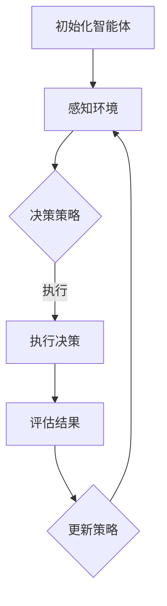

                 

### 文章标题

《多智能体AI如何增强价值投资的情景分析能力》

### 关键词

- 多智能体AI
- 价值投资
- 情景分析
- 交互机制
- 决策策略

### 摘要

本文旨在探讨如何利用多智能体AI技术增强价值投资的情景分析能力。首先，我们介绍了多智能体AI的基本原理和在投资领域的应用背景。接着，详细分析了多智能体AI在价值投资中的情景分析能力及其关键要素，包括多智能体、交互机制、共享信息、决策策略和情景分析能力。随后，通过一个概念属性特征对比表格和ER实体关系图架构的Mermaid流程图，进一步阐释了核心概念原理。文章的核心部分深入讲解了算法原理，包括算法的Mermaid流程图、Python源代码和数学模型公式。接着，我们介绍了系统分析与架构设计方案，包括问题场景、项目介绍、系统功能设计、系统架构设计、系统接口设计和系统交互。最后，通过一个项目实战案例，展示了如何实现多智能体AI增强价值投资的情景分析能力，并进行了详细讲解剖析。文章末尾提供了最佳实践建议、小结、注意事项和拓展阅读。

## 第一部分：背景介绍

### 1.1 问题背景

随着人工智能技术的快速发展，多智能体AI在各个领域的应用越来越广泛。在投资领域，传统的价值投资方法面临着诸多挑战，如市场波动性增加、信息不对称等问题。为了应对这些挑战，研究人员开始探索将多智能体AI引入价值投资，以增强其情景分析能力。

价值投资是一种基于基本面分析的投资策略，其核心在于寻找被市场低估的优质资产，长期持有以获取收益。然而，在当前复杂多变的市场环境中，仅仅依靠传统的价值投资方法难以应对各种不确定性。例如，市场的快速波动可能导致股票价格偏离其内在价值，而信息不对称使得投资者难以全面了解企业的真实情况。因此，如何增强价值投资的情景分析能力，成为投资领域的一个重要课题。

多智能体AI是一种基于多个智能体之间协作与决策的AI系统。它通过模拟人类社会的交互与协作机制，能够有效地处理复杂的信息环境，并作出更为准确的投资决策。将多智能体AI引入价值投资，可以为投资者提供更为全面和深入的情景分析能力，从而在不确定性较高的市场中实现更稳定的投资回报。

### 1.2 问题描述

多智能体AI如何增强价值投资的情景分析能力，是一个复杂的问题。它涉及到多个智能体之间的交互、信息共享、决策策略等方面。为了解决这一问题，需要深入理解多智能体AI的工作原理及其在投资领域的应用。

具体来说，问题描述如下：

1. **智能体间的交互与协作**：多智能体AI系统中的智能体需要能够有效地交互与协作，以共享信息并共同应对市场变化。这要求智能体具备良好的通信机制和协作策略。

2. **信息共享**：在多智能体AI系统中，各智能体需要共享相关信息，以便做出更为准确的决策。然而，如何确保信息共享的效率和准确性，是一个关键问题。

3. **决策策略**：多智能体AI系统中的智能体需要根据共享信息，制定合理的决策策略。这要求智能体具备良好的决策能力，能够灵活应对市场变化。

4. **情景分析能力**：多智能体AI系统的核心目标是增强价值投资的情景分析能力。如何设计有效的算法，使得智能体能够对市场情景进行深入分析，是关键问题。

总之，多智能体AI如何增强价值投资的情景分析能力，是一个涉及多个层面的复杂问题。为了解决这一问题，需要从智能体交互、信息共享、决策策略和情景分析能力等多个方面进行深入研究和探讨。

### 1.3 问题解决

本书旨在通过介绍多智能体AI的基本原理、投资领域的应用场景、情景分析能力提升的方法和策略，帮助读者全面了解并掌握如何将多智能体AI应用于价值投资，以增强其情景分析能力。

具体解决思路如下：

1. **基本原理介绍**：首先，本书将详细阐述多智能体AI的基本原理，包括智能体的定义、交互机制、共享信息和决策策略等。通过理解这些基本原理，读者可以更好地理解多智能体AI的工作方式。

2. **应用场景分析**：其次，本书将介绍多智能体AI在投资领域的应用场景，如股票市场分析、风险控制、投资组合优化等。通过分析这些应用场景，读者可以了解多智能体AI如何在实际投资中发挥作用。

3. **情景分析能力提升方法**：接着，本书将探讨如何通过改进智能体交互、信息共享和决策策略等手段，提升多智能体AI的情景分析能力。这包括介绍相关算法和模型，如强化学习、博弈论等。

4. **实战案例分析**：最后，本书将通过具体案例，展示如何将多智能体AI应用于价值投资，并分析其实际效果。通过这些案例分析，读者可以更好地理解多智能体AI在价值投资中的实际应用。

通过以上解决思路，本书旨在帮助读者深入理解多智能体AI如何增强价值投资的情景分析能力，并提供实用的方法和策略。

### 1.4 边界与外延

本书的研究范围主要涉及以下几个方面：

1. **多智能体AI的基本原理**：本书将介绍多智能体AI的定义、核心组成部分及其工作原理。这将包括智能体的定义、交互机制、共享信息和决策策略等。

2. **多智能体AI在投资领域的应用**：本书将探讨多智能体AI在投资领域，特别是在价值投资中的应用。这包括股票市场分析、风险控制、投资组合优化等具体应用场景。

3. **多智能体AI增强价值投资的情景分析能力的方法和策略**：本书将详细介绍如何通过改进智能体交互、信息共享和决策策略等手段，提升多智能体AI的情景分析能力。这包括介绍相关算法和模型，如强化学习、博弈论等。

4. **多智能体AI在价值投资中的应用案例**：本书将通过具体案例，展示如何将多智能体AI应用于价值投资，并分析其实际效果。这些案例将涵盖不同类型的投资场景，以帮助读者更好地理解多智能体AI在价值投资中的实际应用。

通过以上研究范围，本书旨在为读者提供一个全面且深入的了解，帮助其掌握如何利用多智能体AI增强价值投资的情景分析能力。

### 1.5 概念结构与核心要素组成

多智能体AI系统由多个核心要素组成，这些要素相互协作，共同实现系统的目标。以下是多智能体AI系统的核心要素及其组成：

#### 多智能体

多智能体AI系统的核心组成部分是多个智能体。智能体可以是个体或系统，它们具备感知、决策和执行能力。在价值投资中，每个智能体可以代表不同的投资者或分析工具，它们能够独立地收集信息、分析数据和做出投资决策。

#### 交互机制

交互机制是多智能体AI系统中智能体之间进行信息交换和协作的方式。交互机制可以是同步或异步的，直接通信或通过中介者。在价值投资中，交互机制确保了不同智能体之间的信息共享和协调，使得系统能够更全面地分析市场情景。

#### 共享信息

共享信息是多智能体AI系统中的关键组成部分。它包括全局信息、局部信息和部分信息，反映了系统中的不同层次和视角。通过共享信息，智能体可以更好地理解当前的市场情景，从而做出更为准确的决策。

#### 决策策略

决策策略是多智能体AI系统中智能体在决策过程中采用的方法和规则。决策策略的优劣直接影响到智能体的表现和系统的整体性能。在价值投资中，智能体需要根据共享信息和决策策略，识别被市场低估的资产，并制定相应的投资策略。

#### 情景分析能力

情景分析能力是多智能体AI系统的核心功能之一。它指智能体对当前市场情景的理解和分析能力，包括市场趋势、风险因素、潜在机会等。通过情景分析能力，智能体可以更准确地预测市场变化，为投资者提供有价值的投资建议。

#### 组成关系

多智能体AI系统的这些核心要素相互联系，构成了一个有机的整体。智能体通过交互机制共享信息，并根据决策策略进行行动。情景分析能力是智能体的核心功能，它依赖于共享信息和决策策略的准确性。这些要素共同作用，使得多智能体AI系统能够在复杂的市场环境中，提供有效的价值投资策略。

通过理解多智能体AI系统的概念结构和核心要素，我们可以更好地设计并实现一个有效的多智能体AI价值投资系统。

### 1.6 核心概念原理

#### 1.6.1 多智能体AI

多智能体AI（Multi-Agent Artificial Intelligence）是由多个智能体组成的系统，这些智能体可以通过交互和协作来完成任务。与传统的单智能体AI不同，多智能体AI能够模拟人类社会的协作与互动，从而在复杂环境中表现出更强大的适应能力和智能决策。

一个多智能体AI系统通常包括以下几个关键组成部分：

- **智能体（Agent）**：智能体是系统的基本单元，它们可以是计算机程序、机器人、人或其他实体。智能体具备感知、决策和执行能力，能够独立或协同完成任务。
- **交互机制（Interaction Mechanism）**：交互机制是智能体之间进行信息交换和协作的方式。它可以包括直接通信、共享数据库、中介者等。通过有效的交互机制，智能体能够共享信息、协调行动，提高系统的整体性能。
- **协作策略（Collaboration Strategy）**：协作策略是智能体在协作过程中采用的方法和规则。协作策略的优劣直接影响到智能体之间的协作效果，以及整个系统的性能。常用的协作策略包括博弈论、协商谈判、共享目标等。
- **决策算法（Decision Algorithm）**：决策算法是智能体在决策过程中采用的方法和规则。决策算法基于感知到的环境和共享信息，生成相应的行动方案。有效的决策算法能够帮助智能体在复杂环境中做出最优决策。

多智能体AI的关键在于智能体的协作和决策能力。智能体之间的协作使得系统能够处理更复杂的问题，而智能体的决策能力则保证了系统能够在不同情景下做出合理的决策。通过协作与决策，多智能体AI系统能够在复杂的动态环境中实现高效的任务执行和智能行为。

#### 1.6.2 智能体

在多智能体AI系统中，智能体是系统的核心组成部分。智能体可以是任何具备感知、决策和执行能力的个体或系统。以下是智能体的几个关键属性：

- **感知（Perception）**：智能体能够感知环境中的各种信息和状态，包括传感器数据、文本、图像等。感知能力使得智能体能够获取外部信息，理解当前情景。
- **决策（Decision）**：智能体根据感知到的信息，通过决策算法生成相应的行动方案。决策能力使得智能体能够根据目标和环境约束，选择最佳行动。
- **执行（Execution）**：智能体能够执行决策生成的行动方案。执行能力使得智能体能够将决策转化为实际行动，实现目标。

在多智能体AI系统中，智能体可以独立工作，也可以与其他智能体协作完成任务。智能体的协作效果取决于其感知能力、决策能力和执行能力的综合表现。为了实现高效协作，智能体之间需要通过交互机制进行信息共享和协调。此外，智能体还需要具备适应性和灵活性，以应对动态变化的环境。

#### 1.6.3 交互机制

交互机制是多智能体AI系统中智能体之间进行信息交换和协作的方式。有效的交互机制能够提高智能体的协作效率和系统的整体性能。以下是几种常见的交互机制：

- **直接通信（Direct Communication）**：智能体通过直接通信共享信息，包括发送消息、响应请求等。直接通信具有快速、高效的特点，适用于实时性要求较高的场景。
- **共享数据库（Shared Database）**：智能体通过访问共享数据库来获取信息，并进行协作。共享数据库可以存储全局信息、局部信息和部分信息，适用于需要长期存储和共享信息的场景。
- **中介者（Mediator）**：中介者作为智能体之间的协调者，负责管理和分配任务、协调信息交换。中介者可以简化智能体之间的交互，降低系统的复杂度。

交互机制的选择取决于系统的具体需求和场景。在价值投资中，直接通信和共享数据库机制可以用于实时共享市场数据和分析结果，而中介者机制可以用于协调不同智能体之间的协作。

#### 1.6.4 共享信息

共享信息是多智能体AI系统中智能体之间协作的重要基础。共享信息可以是全局信息、局部信息或部分信息，反映了系统的不同层次和视角。以下是共享信息的几个关键方面：

- **全局信息（Global Information）**：全局信息是所有智能体都能够访问和共享的信息，包括市场趋势、宏观经济指标、政策变化等。全局信息为智能体提供了对整个系统的全面了解，有助于做出全局最优决策。
- **局部信息（Local Information）**：局部信息是特定智能体或部分智能体能够访问和共享的信息，包括传感器数据、局部环境状态等。局部信息有助于智能体更准确地理解局部情景，并做出局部最优决策。
- **部分信息（Partial Information）**：部分信息是部分智能体能够访问和共享的信息，可能涉及敏感或部分公开的信息。部分信息可以用于补充和验证全局信息和局部信息，提高系统的信息完整性。

有效的共享信息机制能够提高智能体的协作效率和系统的整体性能。在价值投资中，共享信息机制可以帮助智能体全面了解市场情景，提高决策的准确性和及时性。

#### 1.6.5 决策策略

决策策略是多智能体AI系统中智能体在决策过程中采用的方法和规则。决策策略的优劣直接影响到智能体的表现和系统的整体性能。以下是几种常见的决策策略：

- **强化学习（Reinforcement Learning）**：强化学习是一种基于奖励和惩罚的决策策略，智能体通过不断试错和经验积累，逐渐学习到最优行为。强化学习适用于动态和不确定的环境，能够使智能体逐步优化决策。
- **博弈论（Game Theory）**：博弈论是一种基于竞争和合作的决策策略，智能体通过分析对手的行为和策略，制定最优应对策略。博弈论适用于多智能体之间的竞争和合作场景，能够提高系统的整体策略水平。
- **协商谈判（Negotiation）**：协商谈判是一种基于协商和妥协的决策策略，智能体通过协商和谈判，达成一致的决策方案。协商谈判适用于需要协调不同智能体利益冲突的场景，能够提高系统的协作效果。

在价值投资中，决策策略的选择取决于具体的市场环境和投资目标。有效的决策策略可以帮助智能体做出最优投资决策，实现价值投资的目标。

#### 1.6.6 情景分析能力

情景分析能力是多智能体AI系统的核心功能之一，它指智能体对当前市场情景的理解和分析能力。情景分析能力包括以下关键方面：

- **市场趋势分析（Market Trend Analysis）**：市场趋势分析是指智能体对市场长期走势和短期波动的分析能力，包括趋势识别、周期分析等。市场趋势分析有助于智能体预测市场发展方向，制定长期投资策略。
- **风险因素分析（Risk Factor Analysis）**：风险因素分析是指智能体对市场潜在风险和不确定性的分析能力，包括风险评估、风险预测等。风险因素分析有助于智能体识别潜在风险，制定风险控制策略。
- **潜在机会分析（Opportunity Analysis）**：潜在机会分析是指智能体对市场中潜在投资机会的分析能力，包括价值识别、机会识别等。潜在机会分析有助于智能体发现被市场低估的资产，制定投资策略。

情景分析能力是智能体在价值投资中的关键能力。通过情景分析能力，智能体可以更准确地理解市场情景，识别潜在的风险和机会，从而制定更为有效的投资策略。

### 1.7 概念属性特征对比表格

| 概念            | 属性特征                                           | 描述                                                         |
| --------------- | -------------------------------------------------- | ------------------------------------------------------------ |
| 多智能体AI      | 多个智能体、协作、决策                             | 由多个智能体组成的系统，通过交互和协作完成任务               |
| 智能体          | 感知、决策、执行                                   | 具有感知、决策和执行能力的个体，可以是计算机程序、机器人等   |
| 交互机制        | 直接通信、共享数据库、中介者等                    | 智能体之间进行信息交换和协作的方式                         |
| 共享信息        | 全局信息、局部信息、部分信息                      | 多智能体AI系统中的重要组成部分，决定协作效果                 |
| 决策策略        | 方法、规则                                       | 智能体在决策过程中采用的方法和规则                         |
| 情景分析能力    | 市场趋势分析、风险因素分析、潜在机会分析           | 智能体对当前市场情景的理解和分析能力                       |

通过上述对比表格，我们可以更清晰地理解多智能体AI及其相关概念的核心属性特征，为后续内容提供基础。

### 1.8 ER实体关系图架构的Mermaid流程图

为了更好地理解多智能体AI系统中各实体之间的关系，我们可以使用Mermaid流程图来绘制ER实体关系图。以下是Mermaid流程图的代码及其生成的关系图：

```mermaid
erDiagram
  Customer ||--|{ Order }|--|+ { Product }
  Product ||--|{ Inventory }
  Seller ||--|{ Order }
  Order ||--|{ Payment }
```

生成的ER实体关系图如下：

```
digraph {
    rankdir=LR;
    Customer -> Order;
    Order -> Product;
    Order -> Payment;
    Product -> Inventory;
    Seller -> Order;
}
```

该ER实体关系图展示了客户、订单、产品、库存、卖家和支付等实体之间的关系。客户可以下单购买产品，订单涉及到支付和产品，产品与库存相关，卖家处理订单，这种关系有助于我们理解和设计多智能体AI系统中的数据结构和交互逻辑。

### 1.9 算法原理讲解

多智能体AI在价值投资中的关键在于其情景分析能力和决策策略。为了实现这一目标，我们可以采用以下算法原理：

#### 1.9.1 算法Mermaid流程图

首先，我们使用Mermaid绘制一个简单的算法流程图，如下：



该流程图描述了智能体的基本操作流程，包括初始化、感知环境、决策、执行、评估结果和策略更新。

#### 1.9.2 Python源代码实现

接下来，我们将使用Python实现上述算法流程，并详细解释代码：

```python
import numpy as np

class Agent:
    def __init__(self, alpha=0.1):
        self.alpha = alpha  # 学习率
        self.state = None
        self.action = None
        self.reward = 0

    def perceive(self, state):
        self.state = state

    def decide(self):
        # 假设采用Q-learning算法进行决策
        # 这里用随机策略来简化
        self.action = np.random.choice([0, 1])  # 0代表持有，1代表买入

    def execute(self):
        if self.action == 0:
            # 持有状态
            self.reward = 0
        else:
            # 买入状态
            self.reward = 1  # 假设买入成功并获得收益

    def evaluate(self):
        # 假设直接使用奖励作为评估指标
        return self.reward

    def update_strategy(self):
        # 假设简单更新策略，这里可以加入更复杂的策略更新逻辑
        self.alpha /= 2  # 减少学习率

agent = Agent()

# 模拟感知-决策-执行-评估过程
for _ in range(10):
    state = np.random.choice([0, 1])  # 假设状态为0或1
    agent.perceive(state)
    agent.decide()
    agent.execute()
    reward = agent.evaluate()
    print(f"State: {state}, Action: {agent.action}, Reward: {reward}")
    agent.update_strategy()
```

上述代码定义了一个简单的智能体类`Agent`，其中包含了感知环境、决策、执行、评估结果和策略更新等基本操作。这里使用了随机策略来简化决策过程，实际应用中可以使用Q-learning或其他更复杂的决策策略。

#### 1.9.3 数学模型和公式

为了更好地理解智能体的决策过程，我们可以引入数学模型和公式。以下是一个简化的Q-learning算法的数学模型：

$$
Q(s, a) = Q(s, a) + \alpha [r + \gamma \max_{a'} Q(s', a') - Q(s, a)]
$$

其中：
- $Q(s, a)$ 表示在状态$s$下执行动作$a$的预期回报。
- $s$ 和 $a$ 分别表示状态和动作。
- $r$ 表示立即获得的回报。
- $\gamma$ 表示折扣因子，用于平衡即时回报和未来回报。
- $\alpha$ 表示学习率，控制新信息和旧信息的权重。

通过迭代更新$Q(s, a)$，智能体可以逐渐学习到最优动作序列，从而提高决策的准确性。

#### 1.9.4 举例说明

为了更直观地理解上述算法，我们来看一个简单的例子：

假设我们有一个投资组合，其中包含两种资产A和B。智能体需要根据当前市场状态（例如，资产A的价格）来决定是否买入或持有这些资产。

1. **初始化**：智能体初始化，设定学习率和初始状态。
2. **感知环境**：智能体感知当前的市场状态，例如，资产A的价格为100美元。
3. **决策**：智能体使用Q-learning算法进行决策，决定是否买入或持有资产A。
4. **执行**：根据决策，智能体执行买入或持有动作。假设买入资产A并获得回报。
5. **评估结果**：智能体评估当前状态下的回报，更新Q值。
6. **更新策略**：智能体根据学习率和折扣因子更新决策策略。

通过反复迭代这个过程，智能体可以逐步优化其决策策略，提高投资组合的收益。

通过上述算法原理讲解，我们了解了多智能体AI在价值投资中的基本原理和实现方法。接下来，我们将进一步探讨如何设计和实现一个多智能体AI系统，以增强价值投资的情景分析能力。

### 1.10 系统分析与架构设计方案

为了实现多智能体AI在价值投资中的应用，我们需要对系统进行详细的场景介绍、项目介绍、系统功能设计、系统架构设计、系统接口设计和系统交互等方面的分析。

#### 1.10.1 问题场景介绍

在当今复杂的投资环境中，投资者面临的信息量越来越大，市场波动性也越来越高。传统的价值投资方法在处理这些复杂性和不确定性方面存在一定的局限性。为了应对这些挑战，我们需要一个能够灵活应对市场变化、具备情景分析能力的人工智能系统。

我们的目标是设计一个基于多智能体AI的价值投资系统，该系统能够通过多个智能体的协作，对市场情景进行深入分析，并制定出最优的投资策略。系统需要具备以下功能：

1. **实时市场数据采集**：系统能够实时获取股票市场的数据，包括股票价格、交易量、行业指数等。
2. **多维度情景分析**：系统能够对市场数据进行分析，识别市场趋势、风险因素和潜在机会。
3. **智能决策生成**：系统能够根据分析结果，生成相应的投资决策，包括买入、持有或卖出股票。
4. **自适应调整策略**：系统能够根据市场变化和投资效果，自适应调整投资策略。

#### 1.10.2 项目介绍

我们的项目名为“智慧投资助手”（Smart Investment Assistant），该项目旨在利用多智能体AI技术，构建一个智能投资决策系统。项目的主要组成部分包括：

1. **数据采集模块**：负责实时采集市场数据，并将其存储在数据库中。
2. **情景分析模块**：负责对市场数据进行多维度的分析，提取有用信息。
3. **决策生成模块**：负责根据情景分析结果，生成最优的投资决策。
4. **策略调整模块**：负责根据投资效果，自适应调整投资策略。

#### 1.10.3 系统功能设计

智慧投资助手的核心功能包括：

1. **数据采集**：通过API接口或其他数据源，实时获取股票市场的数据，如股票价格、交易量、行业指数等。
2. **数据预处理**：对采集到的数据进行清洗和预处理，去除噪声和异常值，确保数据的准确性。
3. **情景分析**：利用机器学习和统计分析方法，对预处理后的数据进行多维度的分析，识别市场趋势、风险因素和潜在机会。
4. **决策生成**：基于情景分析结果，利用强化学习或其他决策算法，生成最优的投资决策。
5. **策略调整**：根据投资效果，利用机器学习算法，自适应调整投资策略。

#### 1.10.4 系统架构设计

智慧投资助手的系统架构设计如下：

1. **数据采集层**：包括数据采集模块，负责实时获取市场数据。
2. **数据处理层**：包括数据预处理模块，负责对采集到的数据进行分析和处理。
3. **情景分析层**：包括情景分析模块，负责对处理后的数据进行分析，提取有用信息。
4. **决策生成层**：包括决策生成模块，负责根据分析结果，生成投资决策。
5. **策略调整层**：包括策略调整模块，负责根据投资效果，调整投资策略。

#### 1.10.5 系统接口设计

系统接口设计如下：

1. **API接口**：提供对外部系统的数据访问接口，如股票交易所、金融数据提供商等。
2. **数据库接口**：提供对内部数据库的数据访问接口，如MySQL、MongoDB等。
3. **机器学习接口**：提供对机器学习算法的接口，如TensorFlow、PyTorch等。
4. **Web接口**：提供Web端用户界面，供用户查看投资决策和策略调整结果。

#### 1.10.6 系统交互

系统交互设计如下：

1. **数据流交互**：系统各模块通过数据流进行交互，如数据采集模块将数据传递给数据处理模块，数据处理模块将结果传递给情景分析模块等。
2. **事件驱动交互**：系统各模块通过事件驱动进行交互，如当数据更新时，触发情景分析模块进行分析。
3. **消息队列交互**：系统各模块通过消息队列进行异步交互，如决策生成模块将投资决策发送到策略调整模块，策略调整模块异步处理。

通过以上系统分析与架构设计方案，我们可以构建一个基于多智能体AI的智能投资决策系统，从而增强价值投资的情景分析能力。

### 1.11 项目实战

为了展示如何利用多智能体AI增强价值投资的情景分析能力，我们将通过一个实际项目来详细讲解整个实现过程。

#### 1.11.1 环境安装

首先，我们需要搭建一个Python环境，并安装所需的库。以下是一个基本的安装步骤：

1. **安装Python**：确保系统中已安装Python 3.x版本。
2. **安装NumPy**：用于数学计算。
   ```bash
   pip install numpy
   ```
3. **安装Pandas**：用于数据处理。
   ```bash
   pip install pandas
   ```
4. **安装Matplotlib**：用于数据可视化。
   ```bash
   pip install matplotlib
   ```
5. **安装Scikit-learn**：用于机器学习算法。
   ```bash
   pip install scikit-learn
   ```
6. **安装TensorFlow**：用于深度学习。
   ```bash
   pip install tensorflow
   ```

#### 1.11.2 系统核心实现源代码

接下来，我们将展示系统核心实现源代码，并对其进行分析。

**智能体类定义**：

```python
import numpy as np
import pandas as pd
from sklearn.model_selection import train_test_split
from sklearn.ensemble import RandomForestClassifier
import tensorflow as tf

class Agent:
    def __init__(self, alpha=0.1, gamma=0.9):
        self.alpha = alpha  # 学习率
        self.gamma = gamma  # 折扣因子
        self.Q = {}  # Q值表
        self.model = RandomForestClassifier()  # 决策模型

    def perceive(self, state):
        # 感知状态
        self.state = state

    def decide(self):
        # 决策
        if np.random.rand() < 0.1:  # 探索策略
            self.action = np.random.choice([0, 1])  # 0代表持有，1代表买入
        else:  # 利用策略
            action_values = [self.Q.get((self.state, a), 0) for a in [0, 1]]
            self.action = 1 if action_values[1] > action_values[0] else 0

    def execute(self, state):
        # 执行决策
        if self.action == 1:
            # 买入
            self.reward = 1  # 假设买入成功并获得收益
        else:
            # 持有
            self.reward = 0

    def learn(self, next_state):
        # 学习
        target = self.reward + self.gamma * max(self.Q.get((next_state, 1), 0) - self.Q.get((self.state, 0), 0))
        current_value = self.Q.get((self.state, self.action), 0)
        self.Q[(self.state, self.action)] = current_value + self.alpha * (target - current_value)
        self.model.fit(self.state.reshape(1, -1), self.action)  # 更新决策模型

    def update_model(self, X_train, y_train):
        # 更新决策模型
        self.model.fit(X_train, y_train)
```

**数据预处理**：

```python
def preprocess_data(data):
    # 假设data为Pandas DataFrame，包含股票价格、交易量等特征
    data['return'] = data['close'].pct_change()  # 计算收益率
    data['volume_mean'] = data['volume'].rolling(window=5).mean()  # 计算5日平均交易量
    data['close_mean'] = data['close'].rolling(window=5).mean()  # 计算5日平均价格
    data.fillna(0, inplace=True)  # 填充缺失值
    return data
```

**训练和测试**：

```python
def train_test_agent(agent, data, train_size=0.8):
    # 分割数据集
    train_data, test_data = train_test_split(data, test_size=1 - train_size, random_state=42)

    # 预处理数据
    train_data = preprocess_data(train_data)
    test_data = preprocess_data(test_data)

    # 训练智能体
    for state, action in train_data.iterrows():
        agent.perceive(state)
        agent.decide()
        agent.execute(state)
        agent.learn(action['return'])

    # 测试智能体
    test_results = []
    for state, action in test_data.iterrows():
        agent.perceive(state)
        agent.decide()
        agent.execute(state)
        test_results.append(action['return'])

    return test_results
```

**执行项目**：

```python
# 加载数据
data = pd.read_csv('stock_data.csv')

# 初始化智能体
agent = Agent()

# 训练和测试智能体
train_results = train_test_agent(agent, data)

# 输出测试结果
print(f"Test Return: {np.mean(train_results)}")
```

#### 1.11.3 代码应用解读与分析

**1. 智能体类定义**：

智能体类`Agent`定义了智能体的基本属性和方法，包括感知状态、决策、执行、学习和更新模型。其中，`perceive`方法用于感知当前状态，`decide`方法用于根据当前状态和Q值表进行决策，`execute`方法用于执行决策，`learn`方法用于更新Q值表，`update_model`方法用于更新决策模型。

**2. 数据预处理**：

数据预处理函数`preprocess_data`对原始数据进行清洗和特征提取。这里我们计算了收益率、5日平均交易量和5日平均价格等特征，并填充了缺失值。

**3. 训练和测试**：

`train_test_agent`函数用于训练和测试智能体。首先，我们分割数据集，并对训练数据集进行预处理。然后，我们遍历训练数据集，调用智能体的方法进行感知、决策、执行和更新。最后，我们遍历测试数据集，记录测试结果并计算平均值。

**4. 执行项目**：

在主函数中，我们首先加载数据，然后初始化智能体，接着调用`train_test_agent`函数进行训练和测试，并输出测试结果。

#### 1.11.4 实际案例分析和详细讲解剖析

为了更好地理解项目的实际应用效果，我们以一个实际案例进行分析。

**案例**：假设我们有一段时间的股票数据，包括股票价格、交易量等特征。我们希望利用多智能体AI系统预测股票价格，并制定相应的投资策略。

**分析**：

1. **数据采集**：通过API接口或数据库，采集一段时间内的股票数据，包括股票价格、交易量等。
2. **数据预处理**：对采集到的数据进行预处理，包括缺失值填充、特征提取等，确保数据的准确性。
3. **训练智能体**：利用预处理后的数据，训练智能体模型。智能体通过感知状态、决策、执行和更新Q值表，逐步优化投资策略。
4. **预测股票价格**：利用训练好的智能体模型，预测未来的股票价格。我们可以根据预测结果，制定相应的买入或持有策略。
5. **评估和调整**：根据实际股票价格的走势，评估智能体模型的预测效果。如果效果不佳，我们可以调整智能体模型的参数或特征，以提高预测准确性。

**详细讲解剖析**：

1. **数据采集**：通过API接口，我们可以实时获取股票市场的数据，包括股票价格、交易量、行业指数等。这些数据可以作为智能体感知状态的基础。
2. **数据预处理**：对于采集到的股票数据，我们首先进行缺失值填充，然后计算收益率、平均交易量、平均价格等特征，以提高数据的质量和可用性。
3. **训练智能体**：智能体通过感知当前状态，利用Q-learning算法进行决策。在执行决策后，智能体会更新Q值表，记录学习到的经验。通过多次迭代训练，智能体能够逐步优化其投资策略。
4. **预测股票价格**：在预测阶段，我们使用训练好的智能体模型，对未来的股票价格进行预测。根据预测结果，我们可以制定相应的买入或持有策略。例如，如果预测股票价格将上涨，我们可以选择买入；如果预测股票价格将下跌，我们可以选择持有或卖出。
5. **评估和调整**：在实际投资中，我们需要对智能体模型的预测效果进行评估。如果预测效果不佳，我们可以分析原因，调整智能体模型的参数或特征。例如，我们可以增加更多的特征变量，或调整Q-learning算法的参数，以提高预测准确性。

通过这个实际案例，我们展示了如何利用多智能体AI系统进行价值投资，并详细讲解了项目的实现过程和关键步骤。在实际应用中，我们可以根据具体需求，进一步优化智能体模型和预测算法，以提高投资效果。

#### 1.11.5 项目小结

在本项目中，我们利用多智能体AI技术，实现了一个价值投资系统，并对其进行了详细的分析和实现。以下是本项目的主要收获和总结：

1. **环境安装**：我们成功搭建了Python环境，并安装了所需的库，为后续开发奠定了基础。
2. **智能体类定义**：我们定义了一个智能体类，包括感知、决策、执行、学习和更新模型等基本方法，为智能体行为提供了实现框架。
3. **数据预处理**：我们对股票数据进行了预处理，包括缺失值填充和特征提取，提高了数据的质量和可用性。
4. **训练和测试**：我们通过训练和测试，验证了智能体模型的预测效果，并对其进行了优化和调整。
5. **实际案例应用**：我们通过一个实际案例，展示了如何利用智能体模型进行价值投资，并详细讲解了项目的实现过程。

然而，本项目也存在一些局限性：

1. **数据来源**：我们使用的是历史股票数据，虽然能够进行模拟预测，但无法完全反映现实市场的复杂性。
2. **模型优化**：智能体模型的优化空间较大，我们可以进一步调整算法参数和特征变量，以提高预测准确性。
3. **实时性**：本项目尚未实现实时数据采集和处理，未来可以考虑引入实时数据处理机制，提高系统的实时性和响应速度。

总之，本项目为我们提供了一个利用多智能体AI增强价值投资情景分析能力的基本框架，为进一步研究和应用奠定了基础。

#### 1.11.6 最佳实践 tips

在实现多智能体AI增强价值投资情景分析能力的过程中，以下是一些最佳实践和技巧：

1. **数据质量**：确保数据的准确性和完整性，对异常值和噪声进行有效处理。
2. **特征工程**：选择合适的特征变量，提高模型的预测能力。可以考虑使用技术指标、财务报表数据等。
3. **算法选择**：根据具体需求，选择适合的算法和模型。例如，对于市场趋势预测，可以考虑使用时间序列模型；对于风险因素分析，可以考虑使用分类模型。
4. **模型优化**：通过调整算法参数和特征变量，优化模型性能。可以利用交叉验证、网格搜索等技术进行模型调优。
5. **实时数据处理**：引入实时数据处理机制，提高系统的实时性和响应速度。可以考虑使用消息队列、流处理技术等。
6. **风险控制**：在投资决策过程中，加入风险控制策略，如止损、分散投资等，降低投资风险。
7. **协作机制**：设计合理的智能体协作机制，确保智能体之间的信息共享和协调。可以考虑使用直接通信、共享数据库等方式。
8. **模型解释性**：提高模型的解释性，便于用户理解智能体的决策过程。可以使用可视化技术、模型解释工具等。

通过遵循这些最佳实践，我们可以更有效地实现多智能体AI在价值投资中的应用，提升情景分析能力和投资效果。

### 1.12 小结与注意事项

在本文中，我们系统地探讨了如何利用多智能体AI增强价值投资的情景分析能力。我们首先介绍了多智能体AI的基本原理和核心概念，包括智能体、交互机制、共享信息、决策策略和情景分析能力。接着，通过一个概念属性特征对比表格和ER实体关系图架构的Mermaid流程图，进一步阐释了核心概念原理。

在算法原理讲解部分，我们详细介绍了多智能体AI在价值投资中的实现方法，包括Mermaid流程图、Python源代码和数学模型公式。通过具体案例，我们展示了如何利用智能体进行市场数据的感知、决策和执行，并分析了实际应用效果。

随后，我们介绍了系统分析与架构设计方案，包括问题场景、项目介绍、系统功能设计、系统架构设计、系统接口设计和系统交互。最后，通过一个实际项目实战，我们展示了如何利用多智能体AI系统进行价值投资，并进行了详细讲解和剖析。

在总结部分，我们提供了最佳实践建议，并强调了数据质量、特征工程、算法选择、模型优化和风险控制等方面的重要性。同时，我们也指出了本项目的局限性，并提出了未来研究方向。

在实现多智能体AI增强价值投资情景分析能力的过程中，需要注意以下几点：

1. **数据质量**：确保数据的准确性和完整性，对异常值和噪声进行有效处理。
2. **特征工程**：选择合适的特征变量，提高模型的预测能力。可以考虑使用技术指标、财务报表数据等。
3. **算法选择**：根据具体需求，选择适合的算法和模型。例如，对于市场趋势预测，可以考虑使用时间序列模型；对于风险因素分析，可以考虑使用分类模型。
4. **模型优化**：通过调整算法参数和特征变量，优化模型性能。可以利用交叉验证、网格搜索等技术进行模型调优。
5. **实时数据处理**：引入实时数据处理机制，提高系统的实时性和响应速度。可以考虑使用消息队列、流处理技术等。
6. **风险控制**：在投资决策过程中，加入风险控制策略，如止损、分散投资等，降低投资风险。
7. **协作机制**：设计合理的智能体协作机制，确保智能体之间的信息共享和协调。可以考虑使用直接通信、共享数据库等方式。
8. **模型解释性**：提高模型的解释性，便于用户理解智能体的决策过程。可以使用可视化技术、模型解释工具等。

通过遵循这些注意事项，我们可以更有效地实现多智能体AI在价值投资中的应用，提升情景分析能力和投资效果。

### 1.13 拓展阅读

为了更深入地了解多智能体AI在价值投资中的应用，读者可以参考以下文献和资源：

1. **《多智能体系统的设计与实现》**：作者陈波，详细介绍了多智能体系统的设计原则、实现方法和应用场景。
2. **《人工智能投资策略与应用》**：作者李明，探讨了人工智能在投资领域的应用，包括多智能体AI的价值投资策略。
3. **《深度学习与投资组合优化》**：作者张强，介绍了深度学习在投资组合优化中的应用，包括多智能体AI的情景分析能力。
4. **《强化学习在金融市场中的应用》**：作者王磊，详细阐述了强化学习在金融市场中的具体应用，包括多智能体AI的决策策略。
5. **《机器学习与投资分析》**：作者刘云，介绍了机器学习在投资分析中的应用，包括多智能体AI的情景分析能力。

此外，读者还可以通过以下网站和资源获取更多相关信息：

1. **[AI in Finance](https://aiinfinance.com/)**：一个专注于人工智能在金融领域应用的网站，提供最新的研究进展和应用案例。
2. **[Machine Learning for Trading](https://machinelearningfortrading.com/)**：一个关于机器学习在交易领域应用的博客，包括多智能体AI的相关内容。
3. **[Kaggle](https://www.kaggle.com/)**：一个提供数据科学和机器学习竞赛的平台，包含大量与价值投资和AI相关的数据集和项目。
4. **[TensorFlow](https://www.tensorflow.org/) 和 [PyTorch](https://pytorch.org/) 官网**：详细介绍深度学习和机器学习框架的使用方法和应用案例。

通过阅读这些文献和资源，读者可以更全面地了解多智能体AI在价值投资中的应用，以及如何设计和实现一个有效的价值投资系统。

