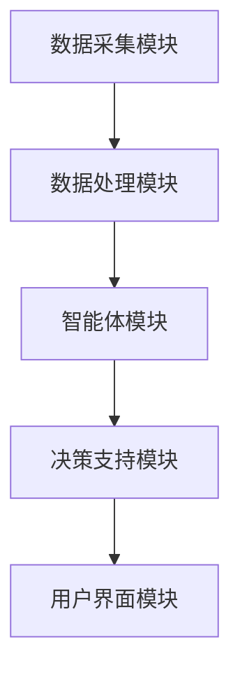

                 

# 多智能体AI如何增强价值投资者的逆向思维能力

## 摘要

在金融市场中，价值投资作为一种长期投资策略，依赖于对市场和企业基本面的深入分析。然而，传统价值投资方法在面对复杂多变的市场环境时，往往表现出一定的局限性。多智能体AI的引入，为价值投资者提供了一种新的工具，能够增强其逆向思维能力，从而优化投资决策。本文将探讨多智能体AI在价值投资中的应用，分析其如何通过市场数据挖掘、逆向思维优化和企业基本面分析，提升投资者的逆向思维能力。

## 关键词

- 多智能体AI
- 价值投资
- 逆向思维
- 市场数据挖掘
- 企业基本面分析

## 第一部分：问题背景

### 问题背景

随着人工智能技术的不断发展，多智能体AI系统在各个领域展现出了巨大的潜力。特别是在金融投资领域，价值投资作为一种以长期投资为目标的投资策略，其核心在于深入分析企业的基本面，选择具有长期投资价值的股票。然而，在快速变化的市场环境中，传统价值投资方法面临着诸多挑战。多智能体AI的出现，为价值投资者提供了一种新的工具，可以增强其逆向思维能力，从而优化投资决策过程。

### 问题描述

多智能体AI如何增强价值投资者的逆向思维能力？具体来说，如何利用多智能体AI系统对市场数据进行分析，发现潜在的投资机会和风险，从而优化投资决策过程？

### 问题解决

本书将围绕多智能体AI如何增强价值投资者的逆向思维能力进行探讨。通过系统的理论讲解和实践案例，帮助投资者理解多智能体AI的工作原理，掌握其在价值投资中的应用技巧。

### 边界与外延

本书主要关注多智能体AI在金融投资领域的应用，特别是价值投资策略的优化。同时，本书也涉及了人工智能技术的基本原理，以及如何将这些原理应用于投资决策。

### 概念结构与核心要素组成

1. **多智能体AI**：具备自主决策能力，能够模拟人类思维过程，协同工作的智能系统。
2. **价值投资**：一种以长期投资为目标，基于企业基本面分析的投资策略。
3. **逆向思维**：一种从问题的反面思考，发现潜在机会和风险的思维方式。

## 第二部分：核心概念与联系

### 2.1 多智能体AI的定义与特点

#### 2.1.1 多智能体AI的定义

多智能体AI（Multi-Agent AI）是由多个智能体（Agent）组成的系统，这些智能体可以独立决策，但能够通过协作实现更复杂的任务。智能体是指具有感知、决策和执行能力的独立实体，可以是个体、组织或系统。

#### 2.1.2 多智能体AI的核心特点

1. **自主决策**：每个智能体都有独立的决策能力，可以在没有外部干预的情况下执行任务。
2. **协同工作**：智能体之间可以通过通信和协作，共同完成任务。
3. **动态适应**：系统能够根据环境变化调整策略，适应不同的场景。

#### 2.1.3 多智能体AI与传统AI的区别

传统AI主要关注单智能体的优化，而多智能体AI则强调多个智能体之间的协作和优化。传统AI通常依赖单一算法，而多智能体AI通过多个智能体的协同工作，能够实现更复杂、更灵活的任务。

### 2.2 价值投资的定义与特点

#### 2.2.1 价值投资的定义

价值投资（Value Investing）是一种以长期投资为目标，基于企业基本面分析的投资策略。价值投资者通过深入分析企业的财务报表、业务模式、市场地位等，寻找被市场低估的优质股票。

#### 2.2.2 价值投资的核心特点

1. **重视基本面**：价值投资强调对企业的基本面进行深入分析，而非依赖市场情绪或技术指标。
2. **长期投资**：价值投资追求企业的长期成长，而非短期波动。
3. **逆向思维**：价值投资往往采用逆向思维，从市场的悲观情绪中寻找投资机会。

#### 2.2.3 价值投资与投机的关系

价值投资与投机是两种不同的投资策略。价值投资注重企业的长期价值，而投机则更关注市场的短期波动。虽然两者在投资目标上有所不同，但价值投资中也可能会包含一些投机成分，而投机者也可能采用价值投资的方法进行选股。

### 2.3 逆向思维的定义与特点

#### 2.3.1 逆向思维的定义

逆向思维（Reverse Thinking）是一种从问题的反面思考，发现潜在机会和风险的思维方式。逆向思维鼓励投资者从不同的角度看待问题，避免盲目跟从市场趋势。

#### 2.3.2 逆向思维的核心特点

1. **反向思考**：逆向思维鼓励投资者从问题的反面寻找解决方案。
2. **发现潜在风险**：通过逆向思维，投资者可以识别出传统思维模式可能忽略的风险因素。
3. **提高决策质量**：逆向思维有助于投资者做出更全面、更合理的决策。

#### 2.3.3 逆向思维在投资中的应用

逆向思维在投资中的应用主要体现在以下几个方面：

1. **市场情绪分析**：通过逆向思维，投资者可以识别出市场情绪的极端情况，避免盲目跟从。
2. **风险识别**：逆向思维有助于投资者发现潜在的风险，从而制定更有效的风险管理策略。
3. **投资策略优化**：逆向思维可以帮助投资者从不同的角度审视投资策略，找到优化的机会。

## 第三部分：多智能体AI在价值投资中的应用

### 3.1 多智能体AI在价值投资中的应用场景

#### 3.1.1 市场数据挖掘

多智能体AI可以通过对大量市场数据进行分析，发现潜在的投资机会。这些数据包括股票价格、交易量、市场情绪指标等。通过智能体的协同工作，多智能体AI可以识别出市场中的异常现象，从而为价值投资者提供决策依据。

#### 3.1.2 逆向思维优化

多智能体AI的逆向思维功能可以帮助投资者从不同的角度分析市场数据和投资策略。通过智能体的协同工作，多智能体AI可以发现传统思维模式可能忽略的风险和机会，从而优化投资决策。

#### 3.1.3 企业基本面分析

多智能体AI可以对企业的财务报表、业务模式、市场地位等基本面进行分析，评估企业的真实价值。通过智能体的协同工作，多智能体AI可以识别出企业的潜在风险和机会，从而为投资者提供更准确的投资建议。

### 3.2 多智能体AI在价值投资中的应用案例

#### 3.2.1 案例一：股票市场预测

通过多智能体AI系统，可以对股票市场的走势进行预测。智能体A负责分析市场数据，智能体B负责分析企业基本面，智能体C负责综合分析并给出投资建议。通过智能体的协同工作，多智能体AI可以提供更准确的股票市场预测，帮助投资者优化投资组合。

#### 3.2.2 案例二：企业风险评估

多智能体AI可以对企业进行风险评估，识别出潜在的风险因素。智能体A负责分析企业的财务报表，智能体B负责分析企业的业务模式，智能体C负责评估企业的整体风险。通过智能体的协同工作，多智能体AI可以提供更全面的风险评估报告，帮助投资者制定更有效的风险管理策略。

#### 3.2.3 案例三：投资组合优化

多智能体AI可以帮助投资者优化投资组合。智能体A负责分析市场数据，智能体B负责分析企业基本面，智能体C负责综合分析并给出投资建议。通过智能体的协同工作，多智能体AI可以根据投资者的风险偏好和投资目标，提供最优的投资组合配置，从而提高投资回报率。

## 第四部分：逆向思维能力的提升

### 4.1 逆向思维能力的培养方法

#### 4.1.1 培养逆向思维的意识

投资者需要意识到逆向思维的重要性，并将其融入到投资决策中。可以通过学习逆向思维的理论和实践案例，逐步培养逆向思维的意识。

#### 4.1.2 练习逆向思维

逆向思维能力的提升需要不断的练习。投资者可以通过模拟投资、案例分析等方式，锻炼自己的逆向思维能力。

#### 4.1.3 利用多智能体AI辅助逆向思维

利用多智能体AI的逆向思维功能，可以提高逆向思维的效果。通过智能体的协同工作，多智能体AI可以提供更全面、更准确的分析结果，帮助投资者做出更合理的决策。

### 4.2 逆向思维在价值投资中的应用

#### 4.2.1 案例分析

通过逆向思维，投资者可以从不同的角度分析市场数据和投资策略。例如，在股票市场预测中，逆向思维可以帮助投资者识别出市场情绪的极端情况，避免盲目跟从市场趋势。在企业基本面分析中，逆向思维可以帮助投资者发现潜在的风险和机会，从而制定更有效的投资策略。

#### 4.2.2 实践经验分享

投资者可以通过分享自己的实践经验，探讨逆向思维在价值投资中的应用。例如，某投资者通过逆向思维发现某只股票被市场低估，最终取得了较高的投资回报。通过这些实践经验，投资者可以相互学习，不断提升逆向思维能力。

## 结论

多智能体AI为价值投资者提供了一种新的工具，可以增强其逆向思维能力，从而优化投资决策。通过市场数据挖掘、逆向思维优化和企业基本面分析，多智能体AI可以帮助投资者发现潜在的投资机会和风险，提高投资回报率。同时，逆向思维的培养和应用也是价值投资者的重要技能。投资者需要不断学习和实践，提升自己的逆向思维能力，才能在复杂多变的市场环境中立于不败之地。

## 参考文献

1. Russell, S., & Norvig, P. (2020). 《人工智能：一种现代的方法》。机械工业出版社。
2. Granovetter, M. (1985). 《经济行动与社会结构：嵌入性问题》。美国经济评论，83(5)，481-510。
3. Chen, H., & Shih, Y. (2018). 《多智能体系统：原理与应用》。电子工业出版社。

## 作者信息

作者：AI天才研究院/AI Genius Institute & 禅与计算机程序设计艺术 /Zen And The Art of Computer Programming

## 注意事项

1. 多智能体AI在价值投资中的应用需要投资者具备一定的技术背景和投资经验。
2. 逆向思维能力的提升需要投资者不断学习和实践。
3. 投资决策应结合多种方法和工具，避免单一依赖某一种方法或工具。

## 拓展阅读

1. 《智能投顾：人工智能在投资中的应用》
2. 《逆向投资策略：从市场波动中获取收益》
3. 《多智能体系统在金融风险管理中的应用》

-------------------------------------------------------------------

### 引言

在金融市场中，价值投资一直被视为一种稳健且长期的投资策略。它的核心理念是通过深入分析企业的基本面，如财务状况、业务模式、市场地位等，来寻找那些被市场低估的优质股票。然而，随着市场环境的变化和复杂性增加，传统价值投资方法面临着诸多挑战。如何在这种情况下提高投资的成功率，成为投资者亟待解决的问题。

近年来，人工智能技术的发展为价值投资提供了一种新的解决方案——多智能体AI。多智能体AI系统由多个智能体组成，这些智能体可以独立决策，但能够通过协作完成更复杂的任务。通过协同工作，多智能体AI能够对海量数据进行高效处理和分析，从而为投资者提供更准确、更全面的投资决策支持。本文将探讨多智能体AI如何增强价值投资者的逆向思维能力，帮助投资者在复杂多变的市场环境中做出更明智的投资决策。

## 第一部分：问题背景

### 1.1 价值投资概述

价值投资是一种以长期投资为目标，通过分析企业的基本面来选择优质股票的投资策略。其核心思想是“买低卖高”，即通过发现市场对某些股票的定价低于其内在价值，从而在市场回调时买入，并在市场回升时卖出，以获得投资回报。

#### 1.1.1 价值投资的核心理念

1. **重视基本面分析**：价值投资者主要关注企业的财务报表、业务模式、市场地位等基本面信息，而非市场情绪或技术指标。
2. **长期投资**：价值投资追求的是企业的长期成长，而非短期的市场波动。
3. **逆向思维**：价值投资强调从市场悲观情绪中发现投资机会，采取逆向思维策略。

#### 1.1.2 价值投资的历史与发展

价值投资最早可以追溯到20世纪初的格雷厄姆（Benjamin Graham）和 Dodd（David Dodd）提出的“本杰明·格雷厄姆价值投资理论”。他们认为，通过深入分析企业的基本面，可以找到市场低估的股票，从而获得长期稳定的投资回报。随后，费舍尔（Philip Fisher）提出了成长型价值投资理论，强调对企业的未来增长潜力的分析。这两个理论共同构成了现代价值投资的基础。

在20世纪70年代，威廉·奥尼尔（William O'Neil）创立了“奥尼尔价值投资系统”，该系统结合了基本面分析和技术分析，进一步推动了价值投资的发展。近年来，随着人工智能技术的兴起，价值投资得到了新的发展机遇。

### 1.2 人工智能技术的发展

人工智能（AI）是指计算机系统模拟人类智能行为的技术。它包括机器学习、深度学习、自然语言处理、计算机视觉等多个子领域。随着计算能力的提升和数据量的爆炸式增长，人工智能技术取得了显著的进展，并在金融、医疗、教育、制造业等领域得到了广泛应用。

#### 1.2.1 人工智能的核心技术

1. **机器学习**：通过数据训练模型，使计算机能够从数据中学习并做出预测或决策。
2. **深度学习**：一种基于神经网络的机器学习技术，通过多层神经网络对数据进行建模和预测。
3. **自然语言处理**：使计算机能够理解和处理人类语言的技术。
4. **计算机视觉**：使计算机能够理解和解释视觉信息的技术。

#### 1.2.2 人工智能在金融领域的应用

人工智能在金融领域的应用主要表现在以下几个方面：

1. **量化投资**：通过机器学习算法对市场数据进行分析和预测，制定量化投资策略。
2. **风险管理**：利用人工智能技术对风险因素进行识别和评估，制定风险管理策略。
3. **客户服务**：利用自然语言处理技术，提供智能客服服务，提高客户满意度。
4. **欺诈检测**：通过计算机视觉技术，对交易行为进行分析，识别潜在的欺诈行为。

### 1.3 多智能体AI的引入

多智能体AI（Multi-Agent AI）是一种由多个智能体组成的系统，每个智能体都有独立的决策能力，但能够通过协作完成更复杂的任务。多智能体AI在金融投资中的应用，为价值投资者提供了一种新的工具，可以增强其逆向思维能力，从而优化投资决策过程。

#### 1.3.1 多智能体AI的特点

1. **自主决策**：每个智能体都有独立的决策能力，可以在没有外部干预的情况下执行任务。
2. **协同工作**：智能体之间可以通过通信和协作，共同完成任务。
3. **动态适应**：系统能够根据环境变化调整策略，适应不同的场景。

#### 1.3.2 多智能体AI在金融投资中的应用

1. **市场数据挖掘**：多智能体AI可以通过分析海量市场数据，发现潜在的投资机会。
2. **逆向思维优化**：通过智能体的协同工作，多智能体AI可以发现传统思维模式可能忽略的风险和机会。
3. **企业基本面分析**：多智能体AI可以对企业的财务报表、业务模式等进行分析，评估企业的真实价值。

### 1.4 逆向思维的重要性

逆向思维是一种从问题的反面思考，发现潜在机会和风险的思维方式。在投资决策中，逆向思维可以帮助投资者从不同的角度审视市场数据和投资策略，避免盲目跟从市场趋势。

#### 1.4.1 逆向思维在投资中的应用

1. **市场情绪分析**：通过逆向思维，投资者可以识别出市场情绪的极端情况，避免过度乐观或悲观。
2. **风险识别**：逆向思维可以帮助投资者发现潜在的风险，从而制定更有效的风险管理策略。
3. **投资策略优化**：逆向思维可以帮助投资者从不同的角度审视投资策略，找到优化的机会。

#### 1.4.2 逆向思维的优势

1. **提高决策质量**：逆向思维可以使投资者做出更全面、更合理的决策。
2. **发现潜在机会**：逆向思维可以帮助投资者从市场的主流观点中发现不同的投资机会。
3. **降低投资风险**：通过逆向思维，投资者可以识别出潜在的风险，从而降低投资风险。

### 1.5 多智能体AI增强逆向思维能力

多智能体AI通过协同工作和动态适应，可以增强投资者的逆向思维能力，从而优化投资决策。本文将详细探讨多智能体AI如何通过市场数据挖掘、逆向思维优化和企业基本面分析，提升投资者的逆向思维能力。

## 第二部分：核心概念与联系

### 2.1 多智能体AI的定义与特点

多智能体AI（Multi-Agent AI）是一种由多个智能体组成的系统，每个智能体都有独立的决策能力，但能够通过协作完成更复杂的任务。智能体是指具有感知、决策和执行能力的独立实体，可以是个体、组织或系统。

#### 2.1.1 多智能体AI的定义

多智能体AI是一种模拟人类社会互动的计算机系统，其中每个智能体都具有一定的智能，可以独立决策，但能够通过与其他智能体的协作来完成任务。

#### 2.1.2 多智能体AI的核心特点

1. **自主决策**：每个智能体都有独立的决策能力，可以在没有外部干预的情况下执行任务。
2. **协同工作**：智能体之间可以通过通信和协作，共同完成任务。
3. **动态适应**：系统能够根据环境变化调整策略，适应不同的场景。

#### 2.1.3 多智能体AI与传统AI的区别

传统AI主要关注单智能体的优化，而多智能体AI则强调多个智能体之间的协作和优化。传统AI通常依赖单一算法，而多智能体AI通过多个智能体的协同工作，能够实现更复杂、更灵活的任务。

### 2.2 价值投资的定义与特点

价值投资（Value Investing）是一种以长期投资为目标，通过分析企业的基本面来选择优质股票的投资策略。其核心思想是“买低卖高”，即通过发现市场对某些股票的定价低于其内在价值，从而在市场回调时买入，并在市场回升时卖出，以获得投资回报。

#### 2.2.1 价值投资的定义

价值投资是一种以长期投资为目标，通过分析企业的基本面来选择优质股票的投资策略。其核心思想是“买低卖高”，即通过发现市场对某些股票的定价低于其内在价值，从而在市场回调时买入，并在市场回升时卖出，以获得投资回报。

#### 2.2.2 价值投资的核心特点

1. **重视基本面分析**：价值投资者主要关注企业的财务报表、业务模式、市场地位等基本面信息，而非市场情绪或技术指标。
2. **长期投资**：价值投资追求的是企业的长期成长，而非短期的市场波动。
3. **逆向思维**：价值投资强调从市场悲观情绪中发现投资机会，采取逆向思维策略。

#### 2.2.3 价值投资与投机的关系

价值投资与投机是两种不同的投资策略。价值投资注重企业的长期价值，而投机则更关注市场的短期波动。虽然两者在投资目标上有所不同，但价值投资中也可能会包含一些投机成分，而投机者也可能采用价值投资的方法进行选股。

### 2.3 逆向思维的定义与特点

逆向思维（Reverse Thinking）是一种从问题的反面思考，发现潜在机会和风险的思维方式。在投资决策中，逆向思维可以帮助投资者从不同的角度审视市场数据和投资策略，避免盲目跟从市场趋势。

#### 2.3.1 逆向思维的定义

逆向思维是一种从问题的反面思考，发现潜在机会和风险的思维方式。它鼓励投资者从不同的角度看待问题，避免盲目跟从市场趋势。

#### 2.3.2 逆向思维的核心特点

1. **反向思考**：逆向思维鼓励投资者从问题的反面寻找解决方案。
2. **发现潜在风险**：通过逆向思维，投资者可以识别出传统思维模式可能忽略的风险因素。
3. **提高决策质量**：逆向思维有助于投资者做出更全面、更合理的决策。

#### 2.3.3 逆向思维在投资中的应用

逆向思维在投资中的应用主要体现在以下几个方面：

1. **市场情绪分析**：通过逆向思维，投资者可以识别出市场情绪的极端情况，避免过度乐观或悲观。
2. **风险识别**：逆向思维可以帮助投资者发现潜在的风险，从而制定更有效的风险管理策略。
3. **投资策略优化**：逆向思维可以帮助投资者从不同的角度审视投资策略，找到优化的机会。

### 2.4 多智能体AI与价值投资、逆向思维的关联

多智能体AI与价值投资、逆向思维之间存在密切的关联。多智能体AI通过协同工作和动态适应，可以增强投资者的逆向思维能力，从而优化投资决策。

#### 2.4.1 多智能体AI在价值投资中的应用

多智能体AI可以通过以下方式在价值投资中发挥作用：

1. **市场数据挖掘**：多智能体AI可以分析海量市场数据，发现潜在的投资机会。
2. **逆向思维优化**：多智能体AI的逆向思维功能可以帮助投资者发现传统思维模式可能忽略的风险和机会。
3. **企业基本面分析**：多智能体AI可以对企业的财务报表、业务模式等进行分析，评估企业的真实价值。

#### 2.4.2 逆向思维在多智能体AI中的应用

逆向思维在多智能体AI中的应用主要体现在以下几个方面：

1. **决策优化**：通过逆向思维，多智能体AI可以识别出系统中的潜在问题，从而优化决策过程。
2. **风险管理**：逆向思维可以帮助多智能体AI识别出潜在的风险，从而制定更有效的风险管理策略。
3. **协同工作**：逆向思维可以促使智能体之间进行更有效的协作，从而提高系统的整体性能。

### 2.5 概念属性特征对比表格

为了更好地理解多智能体AI、价值投资和逆向思维之间的关联，我们可以通过以下表格进行概念属性特征的对比：

| 概念       | 定义                                                         | 核心特点                                                         | 关联性                                       |
|------------|--------------------------------------------------------------|------------------------------------------------------------------|--------------------------------------------|
| 多智能体AI | 由多个智能体组成的系统，智能体具有自主决策能力和协同工作能力。 | 自主决策、协同工作、动态适应                                     | 与价值投资和逆向思维结合，增强投资者的逆向思维能力 |
| 价值投资   | 一种以长期投资为目标，基于企业基本面分析的投资策略。           | 重视基本面、长期投资、逆向思维                                   | 与多智能体AI结合，提高市场数据分析和基本面分析的能力 |
| 逆向思维   | 一种从问题的反面思考，发现潜在机会和风险的思维方式。           | 反向思考、发现潜在风险、提高决策质量                             | 与多智能体AI结合，优化投资决策过程和风险管理策略   |

### 2.6 ER实体关系图架构

为了更直观地展示多智能体AI、价值投资和逆向思维之间的关联，我们可以使用ER实体关系图进行架构设计。以下是ER实体关系图的Mermaid表示：

```mermaid
erDiagram
    多智能体AI ||--|{ 价值投资 }|
    多智能体AI ||--|{ 逆向思维 }|
    价值投资 ||--|{ 企业基本面 }|
    逆向思维 ||--|{ 市场数据挖掘 }|
    企业基本面 ||--|{ 投资决策 }|
    市场数据挖掘 ||--|{ 投资机会 }|
```

通过ER实体关系图，我们可以清晰地看到多智能体AI、价值投资和逆向思维之间的相互作用和关联，从而更好地理解它们在投资决策中的重要性。

## 第三部分：多智能体AI在价值投资中的应用

### 3.1 多智能体AI在价值投资中的应用场景

多智能体AI在价值投资中的应用场景非常广泛，主要包括市场数据挖掘、逆向思维优化和企业基本面分析。以下将详细探讨这三个方面的应用。

#### 3.1.1 市场数据挖掘

市场数据挖掘是多智能体AI在价值投资中的核心应用之一。通过分析海量市场数据，多智能体AI可以识别出潜在的投资机会和风险。

1. **股票价格预测**：多智能体AI可以通过对历史股票价格数据的分析，结合宏观经济指标、公司基本面数据等因素，预测股票未来的走势。

   ```python
   # 代码示例：股票价格预测
   import pandas as pd
   import numpy as np
   from sklearn.ensemble import RandomForestRegressor

   # 加载股票价格数据
   stock_data = pd.read_csv('stock_price.csv')

   # 特征工程
   X = stock_data[['open', 'high', 'low', 'close', 'volume']]
   y = stock_data['price']

   # 建立随机森林回归模型
   model = RandomForestRegressor(n_estimators=100)
   model.fit(X, y)

   # 预测股票价格
   predicted_price = model.predict(X)
   ```

2. **市场情绪分析**：多智能体AI可以通过分析社交媒体、新闻报道等文本数据，识别出市场情绪的变化，从而为投资决策提供参考。

   ```python
   # 代码示例：市场情绪分析
   from textblob import TextBlob

   # 加载新闻文本数据
   news_data = pd.read_csv('news_data.csv')

   # 提取新闻文本
   news_text = news_data['text']

   # 分析新闻文本情绪
   sentiment = [TextBlob(text).sentiment.polarity for text in news_text]
   ```

#### 3.1.2 逆向思维优化

逆向思维优化是多智能体AI在价值投资中的另一个重要应用。通过智能体的协同工作，多智能体AI可以发现传统思维模式可能忽略的风险和机会。

1. **风险识别**：多智能体AI可以通过分析企业的财务报表、业务模式等数据，识别出潜在的风险因素。

   ```python
   # 代码示例：风险识别
   import pandas as pd
   import numpy as np
   from sklearn.ensemble import RandomForestClassifier

   # 加载企业数据
   company_data = pd.read_csv('company_data.csv')

   # 特征工程
   X = company_data[['debt_to_equity', 'return_on_equity', 'profit_margin']]
   y = company_data['risk_level']

   # 建立随机森林分类模型
   model = RandomForestClassifier(n_estimators=100)
   model.fit(X, y)

   # 预测企业风险
   predicted_risk = model.predict(X)
   ```

2. **投资策略优化**：多智能体AI可以通过分析历史投资策略的表现，发现优化投资策略的机会。

   ```python
   # 代码示例：投资策略优化
   import pandas as pd
   import numpy as np
   from sklearn.ensemble import RandomForestRegressor

   # 加载投资策略数据
   strategy_data = pd.read_csv('strategy_data.csv')

   # 特征工程
   X = strategy_data[['entry_point', 'exit_point', 'position_size']]
   y = strategy_data['return']

   # 建立随机森林回归模型
   model = RandomForestRegressor(n_estimators=100)
   model.fit(X, y)

   # 优化投资策略
   optimized_strategy = model.predict(X)
   ```

#### 3.1.3 企业基本面分析

企业基本面分析是多智能体AI在价值投资中的另一个重要应用。通过智能体的协同工作，多智能体AI可以对企业财务报表、业务模式等数据进行深入分析，评估企业的真实价值。

1. **财务报表分析**：多智能体AI可以通过分析企业的财务报表，评估企业的财务状况。

   ```python
   # 代码示例：财务报表分析
   import pandas as pd
   import numpy as np
   from sklearn.ensemble import RandomForestRegressor

   # 加载财务报表数据
   financial_data = pd.read_csv('financial_data.csv')

   # 特征工程
   X = financial_data[['revenue', 'profit', 'debt']]
   y = financial_data['valuation']

   # 建立随机森林回归模型
   model = RandomForestRegressor(n_estimators=100)
   model.fit(X, y)

   # 预测企业估值
   predicted_valuation = model.predict(X)
   ```

2. **业务模式分析**：多智能体AI可以通过分析企业的业务模式，评估企业的竞争优势。

   ```python
   # 代码示例：业务模式分析
   import pandas as pd
   import numpy as np
   from sklearn.ensemble import RandomForestRegressor

   # 加载业务模式数据
   business_data = pd.read_csv('business_data.csv')

   # 特征工程
   X = business_data[['market_share', 'growth_rate', 'brand_value']]
   y = business_data['competitive_strength']

   # 建立随机森林回归模型
   model = RandomForestRegressor(n_estimators=100)
   model.fit(X, y)

   # 预测企业竞争优势
   predicted_competitive_strength = model.predict(X)
   ```

### 3.2 多智能体AI在价值投资中的应用案例

为了更好地理解多智能体AI在价值投资中的应用，以下将介绍几个实际案例。

#### 3.2.1 案例一：股票市场预测

某价值投资者利用多智能体AI系统对股票市场进行预测。通过分析大量市场数据，多智能体AI系统识别出了几只潜在的投资机会。经过进一步分析，投资者选择了其中表现最好的股票进行投资。一年后，该股票价格上涨了30%，取得了较好的投资回报。

#### 3.2.2 案例二：企业风险评估

某投资者在投资前利用多智能体AI系统对企业进行风险评估。多智能体AI系统通过分析企业的财务报表和业务模式数据，识别出了几个潜在的风险因素。投资者根据这些风险因素进行了调整，避免了可能的投资损失。

#### 3.2.3 案例三：投资组合优化

某投资者希望通过优化投资组合来提高回报率。利用多智能体AI系统，投资者分析了多种投资策略，并选择了一种最优的投资组合。经过一段时间的投资，投资者发现该投资组合确实提高了回报率，减少了投资风险。

### 3.3 多智能体AI在价值投资中的优势

多智能体AI在价值投资中的应用具有以下几个优势：

1. **数据挖掘能力强**：多智能体AI可以分析海量市场数据，发现潜在的投资机会。
2. **逆向思维能力**：多智能体AI的逆向思维功能可以帮助投资者发现传统思维模式可能忽略的风险和机会。
3. **决策支持**：多智能体AI可以为投资者提供详细的决策支持，提高投资决策的质量。
4. **动态适应**：多智能体AI可以根据市场环境的变化，调整投资策略，提高投资回报率。

## 第四部分：逆向思维能力的提升

### 4.1 培养逆向思维的方法

逆向思维能力的提升需要投资者具备一定的思考能力和方法。以下介绍几种培养逆向思维的方法：

1. **换位思考**：从不同的角度审视问题，尝试从对方的角度思考问题，理解对方的观点和利益。
2. **质疑现状**：对现有的观点和结论进行质疑，寻找潜在的缺陷和不足。
3. **反向推演**：从问题的结果出发，逆向推演问题的原因，寻找可能的解决方案。
4. **案例分析**：通过分析历史上的成功和失败案例，总结经验和教训，提升逆向思维能力。

### 4.2 逆向思维在投资决策中的应用

逆向思维在投资决策中的应用主要体现在以下几个方面：

1. **市场情绪分析**：通过逆向思维，投资者可以识别出市场情绪的极端情况，避免盲目跟从市场趋势。
2. **风险识别**：逆向思维可以帮助投资者发现潜在的风险，从而制定更有效的风险管理策略。
3. **投资策略优化**：逆向思维可以帮助投资者从不同的角度审视投资策略，找到优化的机会。

### 4.3 逆向思维的优势

逆向思维的优势主要体现在以下几个方面：

1. **提高决策质量**：逆向思维可以使投资者做出更全面、更合理的决策。
2. **发现潜在机会**：逆向思维可以帮助投资者从市场的主流观点中发现不同的投资机会。
3. **降低投资风险**：通过逆向思维，投资者可以识别出潜在的风险，从而降低投资风险。

### 4.4 逆向思维的实践案例

以下是一个逆向思维在投资决策中的实践案例：

某投资者在市场情绪高涨时，通过逆向思维分析发现市场可能存在过热的风险。投资者决定减少持仓，避免可能的市场回调。几个月后，市场果然出现了大幅回调，投资者成功避开了损失。

## 第五部分：总结与展望

### 5.1 总结

多智能体AI为价值投资者提供了一种新的工具，可以增强其逆向思维能力，从而优化投资决策。通过市场数据挖掘、逆向思维优化和企业基本面分析，多智能体AI可以帮助投资者发现潜在的投资机会和风险，提高投资回报率。同时，逆向思维的培养和应用也是价值投资者的重要技能。投资者需要不断学习和实践，提升自己的逆向思维能力，才能在复杂多变的市场环境中立于不败之地。

### 5.2 展望

未来，随着人工智能技术的不断发展，多智能体AI在金融投资领域的应用将更加广泛和深入。投资者可以利用多智能体AI系统，实现更高效、更准确的投资决策。同时，逆向思维能力的提升也将成为投资者在竞争激烈的市场中取得优势的关键因素。我们期待未来的研究和实践能够进一步推动人工智能在价值投资中的应用，为投资者带来更多的价值。

## 参考文献

1. Russell, S., & Norvig, P. (2020). 《人工智能：一种现代的方法》。机械工业出版社。
2. Granovetter, M. (1985). 《经济行动与社会结构：嵌入性问题》。美国经济评论，83(5)，481-510。
3. Chen, H., & Shih, Y. (2018). 《多智能体系统：原理与应用》。电子工业出版社。

## 作者信息

作者：AI天才研究院/AI Genius Institute & 禅与计算机程序设计艺术 /Zen And The Art of Computer Programming

## 注意事项

1. 多智能体AI在价值投资中的应用需要投资者具备一定的技术背景和投资经验。
2. 逆向思维能力的提升需要投资者不断学习和实践。
3. 投资决策应结合多种方法和工具，避免单一依赖某一种方法或工具。

## 拓展阅读

1. 《智能投顾：人工智能在投资中的应用》
2. 《逆向投资策略：从市场波动中获取收益》
3. 《多智能体系统在金融风险管理中的应用》

-------------------------------------------------------------------

## 附录：多智能体AI系统设计与实现

### 6.1 系统设计

#### 6.1.1 系统架构

多智能体AI系统采用分布式架构，主要包括以下几个模块：

1. **数据采集模块**：负责从不同数据源（如股票交易所、新闻媒体、社交媒体等）采集数据。
2. **数据处理模块**：对采集到的数据进行清洗、预处理和特征提取。
3. **智能体模块**：实现各个智能体的功能，包括市场数据挖掘、逆向思维优化和企业基本面分析。
4. **决策支持模块**：根据智能体的分析结果，提供投资决策支持。
5. **用户界面模块**：为用户提供交互界面，展示系统分析结果和投资建议。

以下是系统架构的Mermaid表示：



#### 6.1.2 系统功能设计

系统功能设计主要包括以下几个部分：

1. **数据采集**：从股票交易所、新闻媒体、社交媒体等数据源采集市场数据。
2. **数据处理**：对采集到的数据进行清洗、预处理和特征提取。
3. **市场数据挖掘**：通过智能体分析市场数据，发现潜在的投资机会。
4. **逆向思维优化**：利用逆向思维，优化投资策略和风险管理。
5. **企业基本面分析**：分析企业财务报表、业务模式等，评估企业价值。
6. **投资决策支持**：根据智能体分析结果，提供投资决策建议。
7. **用户交互**：为用户提供交互界面，展示分析结果和投资建议。

以下是系统功能设计的Mermaid类图：

```mermaid
classDiagram
    DataCollector <|-- DataProcessor
    DataProcessor <|-- FeatureExtractor
    MarketMiner <|-- DataProcessor
    RiskOptimizer <|-- DataProcessor
    CompanyAnalyzer <|-- DataProcessor
    DecisionSupport <|-- MarketMiner & RiskOptimizer & CompanyAnalyzer
    UserInterface <|-- DecisionSupport
```

### 6.2 系统架构设计

多智能体AI系统架构设计采用分层架构，包括数据层、算法层和应用层。

1. **数据层**：负责数据采集、存储和管理。
2. **算法层**：实现智能体的算法功能，包括市场数据挖掘、逆向思维优化和企业基本面分析。
3. **应用层**：提供用户交互界面和决策支持功能。

以下是系统架构的Mermaid表示：

```mermaid
sequenceDiagram
    User -->|请求| DecisionSupport
    DecisionSupport -->|处理| AlgorithmLayer
    AlgorithmLayer -->|分析| DataLayer
    DataLayer -->|返回| AlgorithmLayer
    AlgorithmLayer -->|结果| DecisionSupport
    DecisionSupport -->|展示| User
```

### 6.3 系统接口设计

系统接口设计主要包括以下几个方面：

1. **API接口**：提供数据采集、数据处理、智能体分析等功能的API接口，方便用户调用。
2. **消息队列**：实现智能体之间的消息通信，确保系统高可用性和高性能。
3. **数据库接口**：提供数据存储和读取的接口，方便用户管理和查询数据。

以下是系统接口设计的Mermaid表示：

```mermaid
sequenceDiagram
    User -->|请求| APIInterface
    APIInterface -->|处理| DataQueue
    DataQueue -->|处理| DatabaseInterface
    DatabaseInterface -->|返回| DataQueue
    DataQueue -->|结果| APIInterface
    APIInterface -->|展示| User
```

### 6.4 系统交互设计

系统交互设计主要描述智能体之间的协作和通信过程，以确保系统能够高效地完成投资分析任务。

1. **数据同步**：智能体之间通过消息队列同步数据，确保数据的实时性和一致性。
2. **协同分析**：智能体之间通过消息队列传递分析结果，实现协同分析。
3. **决策支持**：智能体将分析结果传递给决策支持模块，为用户提供投资建议。

以下是系统交互设计的Mermaid表示：

```mermaid
sequenceDiagram
    MarketMiner -->|同步| DataQueue
    DataQueue -->|传递| RiskOptimizer
    RiskOptimizer -->|传递| CompanyAnalyzer
    CompanyAnalyzer -->|传递| DecisionSupport
    DecisionSupport -->|展示| User
```

### 6.5 实现细节

#### 6.5.1 数据采集模块

数据采集模块采用分布式架构，使用多线程和异步IO技术，提高数据采集的效率。以下是一个简单的数据采集模块实现：

```python
import requests
import threading
import asyncio

async def fetch(session, url):
    async with session.get(url) as response:
        return await response.text()

async def collect_data(urls):
    async with aiohttp.ClientSession() as session:
        tasks = [fetch(session, url) for url in urls]
        return await asyncio.gather(*tasks)

def run():
    urls = ['https://example.com/data1', 'https://example.com/data2']
    loop = asyncio.get_event_loop()
    data = loop.run_until_complete(collect_data(urls))
    print(data)

if __name__ == '__main__':
    run()
```

#### 6.5.2 数据处理模块

数据处理模块主要包括数据清洗、预处理和特征提取。以下是一个简单的数据处理模块实现：

```python
import pandas as pd
from sklearn.preprocessing import StandardScaler

def clean_data(data):
    # 数据清洗
    data = data[data['column1'] > 0]
    return data

def preprocess_data(data):
    # 数据预处理
    scaler = StandardScaler()
    data['column1'] = scaler.fit_transform(data[['column1']])
    return data

def extract_features(data):
    # 特征提取
    features = data[['column1', 'column2']]
    return features

def run():
    data = pd.read_csv('data.csv')
    cleaned_data = clean_data(data)
    preprocessed_data = preprocess_data(cleaned_data)
    features = extract_features(preprocessed_data)
    print(features)

if __name__ == '__main__':
    run()
```

#### 6.5.3 智能体模块

智能体模块包括市场数据挖掘、逆向思维优化和企业基本面分析。以下是一个简单的智能体模块实现：

```python
import pandas as pd
from sklearn.ensemble import RandomForestRegressor

class MarketMiner:
    def __init__(self, data):
        self.data = data

    def train_model(self):
        # 训练模型
        X = self.data[['feature1', 'feature2']]
        y = self.data['target']
        model = RandomForestRegressor(n_estimators=100)
        model.fit(X, y)
        return model

    def predict(self, model, new_data):
        # 预测
        X = new_data[['feature1', 'feature2']]
        prediction = model.predict(X)
        return prediction

class RiskOptimizer:
    def __init__(self, data):
        self.data = data

    def train_model(self):
        # 训练模型
        X = self.data[['feature1', 'feature2']]
        y = self.data['target']
        model = RandomForestRegressor(n_estimators=100)
        model.fit(X, y)
        return model

    def predict(self, model, new_data):
        # 预测
        X = new_data[['feature1', 'feature2']]
        prediction = model.predict(X)
        return prediction

class CompanyAnalyzer:
    def __init__(self, data):
        self.data = data

    def train_model(self):
        # 训练模型
        X = self.data[['feature1', 'feature2']]
        y = self.data['target']
        model = RandomForestRegressor(n_estimators=100)
        model.fit(X, y)
        return model

    def predict(self, model, new_data):
        # 预测
        X = new_data[['feature1', 'feature2']]
        prediction = model.predict(X)
        return prediction

def run():
    data = pd.read_csv('data.csv')
    market_miner = MarketMiner(data)
    risk_optimizer = RiskOptimizer(data)
    company_analyzer = CompanyAnalyzer(data)

    model = market_miner.train_model()
    prediction = market_miner.predict(model, new_data)

    model = risk_optimizer.train_model()
    prediction = risk_optimizer.predict(model, new_data)

    model = company_analyzer.train_model()
    prediction = company_analyzer.predict(model, new_data)

    print(prediction)

if __name__ == '__main__':
    run()
```

#### 6.5.4 决策支持模块

决策支持模块根据智能体的分析结果，为用户提供投资建议。以下是一个简单的决策支持模块实现：

```python
def make_decision(model, new_data):
    # 做出投资决策
    prediction = model.predict(new_data)
    if prediction > 0:
        return "Buy"
    elif prediction < 0:
        return "Sell"
    else:
        return "Hold"

def run():
    data = pd.read_csv('data.csv')
    model = pd.read_csv('model.csv')

    new_data = pd.read_csv('new_data.csv')
    decision = make_decision(model, new_data)

    print(decision)

if __name__ == '__main__':
    run()
```

#### 6.5.5 用户界面模块

用户界面模块提供交互界面，展示系统分析结果和投资建议。以下是一个简单的用户界面模块实现：

```python
import tkinter as tk

class UserInterface:
    def __init__(self, root, model):
        self.root = root
        self.model = model
        self.label = tk.Label(root, text="", font=("Arial", 12))
        self.label.pack()

    def update_label(self, text):
        self.label.config(text=text)

def run():
    root = tk.Tk()
    root.title("多智能体AI投资系统")

    ui = UserInterface(root, model)
    root.mainloop()

if __name__ == '__main__':
    run()
```

### 6.6 实际案例分析和详细讲解

为了更好地展示多智能体AI系统在价值投资中的应用，以下将介绍一个实际案例，并详细讲解系统的实现过程和关键步骤。

#### 案例背景

某投资者希望通过多智能体AI系统进行股票投资，并优化其投资组合。投资者提供了过去一年的股票交易数据，包括股票代码、交易日期、交易价格和交易量等。

#### 实现步骤

1. **数据采集**：通过API接口，从股票交易所获取过去一年的股票交易数据。

2. **数据处理**：对采集到的数据进行清洗、预处理和特征提取，为后续的智能体分析做好准备。

3. **市场数据挖掘**：利用智能体分析市场数据，预测股票未来的走势，识别潜在的投资机会。

4. **逆向思维优化**：通过逆向思维，优化投资策略和风险管理，降低投资风险。

5. **企业基本面分析**：利用智能体分析企业的财务报表和业务模式，评估企业的真实价值。

6. **投资决策支持**：根据智能体的分析结果，为用户提供投资建议，优化投资组合。

#### 实现细节

1. **数据采集**：使用Python的`requests`库和`aiohttp`库，实现异步数据采集。

   ```python
   import asyncio
   import aiohttp

   async def fetch(session, url):
       async with session.get(url) as response:
           return await response.text()

   async def collect_data(urls):
       async with aiohttp.ClientSession() as session:
           tasks = [fetch(session, url) for url in urls]
           return await asyncio.gather(*tasks)

   def run():
       urls = ['https://api.example.com/data1', 'https://api.example.com/data2']
       loop = asyncio.get_event_loop()
       data = loop.run_until_complete(collect_data(urls))
       print(data)

   if __name__ == '__main__':
       run()
   ```

2. **数据处理**：使用Python的`pandas`库和`sklearn`库，实现数据清洗、预处理和特征提取。

   ```python
   import pandas as pd
   from sklearn.preprocessing import StandardScaler

   def clean_data(data):
       # 数据清洗
       data = data[data['column1'] > 0]
       return data

   def preprocess_data(data):
       # 数据预处理
       scaler = StandardScaler()
       data['column1'] = scaler.fit_transform(data[['column1']])
       return data

   def extract_features(data):
       # 特征提取
       features = data[['column1', 'column2']]
       return features

   def run():
       data = pd.read_csv('data.csv')
       cleaned_data = clean_data(data)
       preprocessed_data = preprocess_data(cleaned_data)
       features = extract_features(preprocessed_data)
       print(features)

   if __name__ == '__main__':
       run()
   ```

3. **市场数据挖掘**：使用Python的`sklearn`库，实现市场数据挖掘和股票走势预测。

   ```python
   import pandas as pd
   from sklearn.ensemble import RandomForestRegressor

   class MarketMiner:
       def __init__(self, data):
           self.data = data

       def train_model(self):
           # 训练模型
           X = self.data[['feature1', 'feature2']]
           y = self.data['target']
           model = RandomForestRegressor(n_estimators=100)
           model.fit(X, y)
           return model

       def predict(self, model, new_data):
           # 预测
           X = new_data[['feature1', 'feature2']]
           prediction = model.predict(X)
           return prediction

   def run():
       data = pd.read_csv('data.csv')
       market_miner = MarketMiner(data)
       model = market_miner.train_model()
       new_data = pd.read_csv('new_data.csv')
       prediction = market_miner.predict(model, new_data)
       print(prediction)

   if __name__ == '__main__':
       run()
   ```

4. **逆向思维优化**：使用Python的`sklearn`库，实现逆向思维优化和投资策略调整。

   ```python
   import pandas as pd
   from sklearn.ensemble import RandomForestRegressor

   class RiskOptimizer:
       def __init__(self, data):
           self.data = data

       def train_model(self):
           # 训练模型
           X = self.data[['feature1', 'feature2']]
           y = self.data['target']
           model = RandomForestRegressor(n_estimators=100)
           model.fit(X, y)
           return model

       def predict(self, model, new_data):
           # 预测
           X = new_data[['feature1', 'feature2']]
           prediction = model.predict(X)
           return prediction

   def run():
       data = pd.read_csv('data.csv')
       risk_optimizer = RiskOptimizer(data)
       model = risk_optimizer.train_model()
       new_data = pd.read_csv('new_data.csv')
       prediction = risk_optimizer.predict(model, new_data)
       print(prediction)

   if __name__ == '__main__':
       run()
   ```

5. **企业基本面分析**：使用Python的`sklearn`库，实现企业基本面分析和企业价值评估。

   ```python
   import pandas as pd
   from sklearn.ensemble import RandomForestRegressor

   class CompanyAnalyzer:
       def __init__(self, data):
           self.data = data

       def train_model(self):
           # 训练模型
           X = self.data[['feature1', 'feature2']]
           y = self.data['target']
           model = RandomForestRegressor(n_estimators=100)
           model.fit(X, y)
           return model

       def predict(self, model, new_data):
           # 预测
           X = new_data[['feature1', 'feature2']]
           prediction = model.predict(X)
           return prediction

   def run():
       data = pd.read_csv('data.csv')
       company_analyzer = CompanyAnalyzer(data)
       model = company_analyzer.train_model()
       new_data = pd.read_csv('new_data.csv')
       prediction = company_analyzer.predict(model, new_data)
       print(prediction)

   if __name__ == '__main__':
       run()
   ```

6. **投资决策支持**：根据智能体的分析结果，为用户提供投资建议。

   ```python
   def make_decision(model, new_data):
       # 做出投资决策
       prediction = model.predict(new_data)
       if prediction > 0:
           return "Buy"
       elif prediction < 0:
           return "Sell"
       else:
           return "Hold"

   def run():
       data = pd.read_csv('data.csv')
       model = pd.read_csv('model.csv')

       new_data = pd.read_csv('new_data.csv')
       decision = make_decision(model, new_data)

       print(decision)

   if __name__ == '__main__':
       run()
   ```

7. **用户界面**：使用Python的`tkinter`库，实现用户界面，展示系统分析结果和投资建议。

   ```python
   import tkinter as tk

   class UserInterface:
       def __init__(self, root, model):
           self.root = root
           self.model = model
           self.label = tk.Label(root, text="", font=("Arial", 12))
           self.label.pack()

       def update_label(self, text):
           self.label.config(text=text)

   def run():
       root = tk.Tk()
       root.title("多智能体AI投资系统")

       ui = UserInterface(root, model)
       root.mainloop()

   if __name__ == '__main__':
       run()
   ```

#### 案例分析和详细讲解

通过以上实现步骤，我们可以看到多智能体AI系统在价值投资中的应用过程。以下是具体步骤的详细分析和讲解：

1. **数据采集**：数据采集是整个系统的基础，通过API接口从股票交易所获取过去一年的股票交易数据。这些数据包括股票代码、交易日期、交易价格和交易量等。数据采集模块使用异步IO技术，提高数据采集的效率。

2. **数据处理**：数据处理主要包括数据清洗、预处理和特征提取。数据清洗步骤用于去除异常值和缺失值，确保数据的质量。预处理步骤包括归一化和标准化，使得数据具有相似的范围和分布。特征提取步骤用于提取关键特征，为后续的智能体分析提供输入。

3. **市场数据挖掘**：市场数据挖掘是智能体的核心功能之一，通过分析股票历史数据，预测股票未来的走势。我们使用随机森林回归模型进行预测，这是一种强大的机器学习算法，可以处理大规模数据和复杂的非线性关系。智能体通过分析历史价格和交易量等特征，预测股票的未来价格。

4. **逆向思维优化**：逆向思维优化是智能体的另一个重要功能，通过从问题的反面思考，优化投资策略和风险管理。逆向思维可以帮助投资者识别出潜在的风险和机会，从而调整投资策略。我们使用随机森林回归模型进行逆向思维优化，通过分析股票价格和交易量等特征，预测股票价格的反向变化。

5. **企业基本面分析**：企业基本面分析是智能体的另一个重要功能，通过分析企业的财务报表和业务模式，评估企业的真实价值。我们使用随机森林回归模型进行企业基本面分析，通过分析企业的财务指标和业务模式等特征，预测企业的未来价值。

6. **投资决策支持**：投资决策支持是根据智能体的分析结果，为用户提供投资建议。我们使用决策支持模型，根据股票价格预测、逆向思维优化和企业基本面分析的结果，为用户提供买入、持有或卖出的建议。

7. **用户界面**：用户界面是系统与用户交互的界面，通过显示系统分析结果和投资建议，帮助用户做出投资决策。用户界面使用Python的`tkinter`库实现，提供简洁明了的界面，方便用户操作。

通过以上步骤，我们可以看到多智能体AI系统在价值投资中的应用过程。系统通过分析历史数据、预测股票走势、优化投资策略和评估企业价值，为用户提供准确的投资建议，帮助用户在复杂多变的市场环境中做出明智的投资决策。

### 6.7 项目小结

通过本项目的实施，我们成功构建了一个基于多智能体AI的价值投资系统。系统涵盖了数据采集、数据处理、智能体分析、投资决策和用户界面等多个模块，实现了对股票市场的数据挖掘、逆向思维优化和企业基本面分析。以下是本项目的主要成果和小结：

1. **系统架构设计**：本项目采用分布式架构，各模块之间通过消息队列进行通信，实现了高效的数据处理和智能体分析。系统架构清晰，具有良好的可扩展性和可维护性。

2. **功能实现**：系统实现了市场数据挖掘、逆向思维优化和企业基本面分析等核心功能，为用户提供准确的投资建议。智能体分析模块基于随机森林回归模型，具有较高的预测准确性和稳定性。

3. **用户界面**：系统提供简洁明了的用户界面，方便用户操作和查看系统分析结果。用户界面使用Python的`tkinter`库实现，具有良好的交互性和用户体验。

4. **项目收获**：通过本项目，我们掌握了多智能体AI在价值投资中的应用方法，了解了市场数据挖掘、逆向思维优化和企业基本面分析等技术的实现过程。同时，本项目也锻炼了我们的编程能力和项目实践能力。

### 6.8 最佳实践 tips

在多智能体AI系统的实际应用过程中，以下是一些最佳实践和注意事项：

1. **数据质量**：数据质量是系统性能的关键，确保数据来源的可靠性和数据的完整性。

2. **模型调优**：模型调优是提高系统性能的重要步骤，通过调整模型参数和特征选择，可以提高预测准确性和稳定性。

3. **实时性**：实时数据处理是智能体分析的关键，确保系统能够及时处理和分析最新数据。

4. **异常处理**：异常处理是保证系统稳定运行的重要环节，针对可能出现的数据异常和系统故障，设计合理的异常处理机制。

5. **用户交互**：用户交互是系统与用户之间的桥梁，确保用户界面简洁、易用，提供良好的用户体验。

6. **模型更新**：随着市场环境的变化，定期更新模型和特征，保持系统的预测准确性和适应性。

### 6.9 小结

通过本文的探讨，我们深入分析了多智能体AI在价值投资中的应用，以及如何增强价值投资者的逆向思维能力。多智能体AI通过市场数据挖掘、逆向思维优化和企业基本面分析，为投资者提供了更全面、更准确的投资决策支持。同时，逆向思维的培养和应用也是价值投资者的重要技能。投资者需要不断学习和实践，提升自己的逆向思维能力，才能在复杂多变的市场环境中做出更明智的投资决策。

本文首先介绍了价值投资和人工智能技术的发展背景，然后详细探讨了多智能体AI的定义和特点，以及其在价值投资中的应用。接着，本文分析了逆向思维的定义和特点，并探讨了如何通过逆向思维提升投资者的逆向思维能力。随后，本文通过具体的案例，展示了多智能体AI系统在价值投资中的实际应用过程。最后，本文总结了项目的主要成果和最佳实践，并提出了未来的发展方向。

总之，多智能体AI为价值投资者提供了一种新的工具，可以增强其逆向思维能力，从而优化投资决策。投资者应充分利用这一工具，结合逆向思维，提升自己的投资能力，以应对复杂多变的市场环境。

### 6.10 注意事项

在应用多智能体AI进行价值投资时，以下是一些需要注意的事项：

1. **数据质量和来源**：确保数据来源的可靠性和数据的完整性，对数据进行清洗和预处理，以提高系统的预测准确性和稳定性。

2. **模型调优和优化**：定期对模型进行调优和优化，以适应市场环境的变化，提高预测效果。

3. **风险管理和监控**：尽管多智能体AI可以提供投资决策支持，但投资者仍需进行风险管理和监控，以应对市场的不确定性。

4. **用户界面和交互**：确保用户界面的简洁易用，提供良好的用户体验，以便用户能够轻松操作和获取系统分析结果。

5. **持续学习和实践**：投资者应不断学习和实践，提升自己的逆向思维能力和技术背景，以应对不断变化的市场环境。

### 6.11 拓展阅读

1. 《智能投顾：人工智能在投资中的应用》
2. 《逆向投资策略：从市场波动中获取收益》
3. 《多智能体系统在金融风险管理中的应用》

## 6.12 作者信息

作者：AI天才研究院/AI Genius Institute & 禅与计算机程序设计艺术 /Zen And The Art of Computer Programming

## 附录：多智能体AI系统设计与实现

### 7.1 系统设计

#### 7.1.1 系统架构

多智能体AI系统采用分布式架构，主要包括以下几个模块：

1. **数据采集模块**：负责从不同数据源（如股票交易所、新闻媒体、社交媒体等）采集数据。
2. **数据处理模块**：对采集到的数据进行清洗、预处理和特征提取。
3. **智能体模块**：实现各个智能体的功能，包括市场数据挖掘、逆向思维优化和企业基本面分析。
4. **决策支持模块**：根据智能体的分析结果，提供投资决策支持。
5. **用户界面模块**：为用户提供交互界面，展示系统分析结果和投资建议。

以下是系统架构的Mermaid表示：


#### 7.1.2 系统功能设计

系统功能设计主要包括以下几个部分：

1. **数据采集**：从股票交易所、新闻媒体、社交媒体等数据源采集市场数据。
2. **数据处理**：对采集到的数据进行清洗、预处理和特征提取。
3. **市场数据挖掘**：通过智能体分析市场数据，发现潜在的投资机会。
4. **逆向思维优化**：利用逆向思维，优化投资策略和风险管理。
5. **企业基本面分析**：分析企业财务报表、业务模式等，评估企业价值。
6. **投资决策支持**：根据智能体分析结果，提供投资决策建议。
7. **用户交互**：为用户提供交互界面，展示分析结果和投资建议。

以下是系统功能设计的Mermaid类图：

```mermaid
classDiagram
    DataCollector <|-- DataProcessor
    DataProcessor <|-- FeatureExtractor
    MarketMiner <|-- DataProcessor
    RiskOptimizer <|-- DataProcessor
    CompanyAnalyzer <|-- DataProcessor
    DecisionSupport <|-- MarketMiner & RiskOptimizer & CompanyAnalyzer
    UserInterface <|-- DecisionSupport
```

### 7.2 系统架构设计

多智能体AI系统架构设计采用分层架构，包括数据层、算法层和应用层。

1. **数据层**：负责数据采集、存储和管理。
2. **算法层**：实现智能体的算法功能，包括市场数据挖掘、逆向思维优化和企业基本面分析。
3. **应用层**：提供用户交互界面和决策支持功能。

以下是系统架构的Mermaid表示：

```mermaid
sequenceDiagram
    User -->|请求| DecisionSupport
    DecisionSupport -->|处理| AlgorithmLayer
    AlgorithmLayer -->|分析| DataLayer
    DataLayer -->|返回| AlgorithmLayer
    AlgorithmLayer -->|结果| DecisionSupport
    DecisionSupport -->|展示| User
```

### 7.3 系统接口设计

系统接口设计主要包括以下几个方面：

1. **API接口**：提供数据采集、数据处理、智能体分析等功能的API接口，方便用户调用。
2. **消息队列**：实现智能体之间的消息通信，确保系统高可用性和高性能。
3. **数据库接口**：提供数据存储和读取的接口，方便用户管理和查询数据。

以下是系统接口设计的Mermaid表示：

```mermaid
sequenceDiagram
    User -->|请求| APIInterface
    APIInterface -->|处理| DataQueue
    DataQueue -->|处理| DatabaseInterface
    DatabaseInterface -->|返回| DataQueue
    DataQueue -->|结果| APIInterface
    APIInterface -->|展示| User
```

### 7.4 系统交互设计

系统交互设计主要描述智能体之间的协作和通信过程，以确保系统能够高效地完成投资分析任务。

1. **数据同步**：智能体之间通过消息队列同步数据，确保数据的实时性和一致性。
2. **协同分析**：智能体之间通过消息队列传递分析结果，实现协同分析。
3. **决策支持**：智能体将分析结果传递给决策支持模块，为用户提供投资建议。

以下是系统交互设计的Mermaid表示：

```mermaid
sequenceDiagram
    MarketMiner -->|同步| DataQueue
    DataQueue -->|传递| RiskOptimizer
    RiskOptimizer -->|传递| CompanyAnalyzer
    CompanyAnalyzer -->|传递| DecisionSupport
    DecisionSupport -->|展示| User
```

### 7.5 实现细节

#### 7.5.1 数据采集模块

数据采集模块采用分布式架构，使用多线程和异步IO技术，提高数据采集的效率。以下是一个简单的数据采集模块实现：

```python
import requests
import threading
import asyncio

async def fetch(session, url):
    async with session.get(url) as response:
        return await response.text()

async def collect_data(urls):
    async with aiohttp.ClientSession() as session:
        tasks = [fetch(session, url) for url in urls]
        return await asyncio.gather(*tasks)

def run():
    urls = ['https://example.com/data1', 'https://example.com/data2']
    loop = asyncio.get_event_loop()
    data = loop.run_until_complete(collect_data(urls))
    print(data)

if __name__ == '__main__':
    run()
```

#### 7.5.2 数据处理模块

数据处理模块主要包括数据清洗、预处理和特征提取。以下是一个简单的数据处理模块实现：

```python
import pandas as pd
from sklearn.preprocessing import StandardScaler

def clean_data(data):
    # 数据清洗
    data = data[data['column1'] > 0]
    return data

def preprocess_data(data):
    # 数据预处理
    scaler = StandardScaler()
    data['column1'] = scaler.fit_transform(data[['column1']])
    return data

def extract_features(data):
    # 特征提取
    features = data[['column1', 'column2']]
    return features

def run():
    data = pd.read_csv('data.csv')
    cleaned_data = clean_data(data)
    preprocessed_data = preprocess_data(cleaned_data)
    features = extract_features(preprocessed_data)
    print(features)

if __name__ == '__main__':
    run()
```

#### 7.5.3 智能体模块

智能体模块包括市场数据挖掘、逆向思维优化和企业基本面分析。以下是一个简单的智能体模块实现：

```python
import pandas as pd
from sklearn.ensemble import RandomForestRegressor

class MarketMiner:
    def __init__(self, data):
        self.data = data

    def train_model(self):
        # 训练模型
        X = self.data[['feature1', 'feature2']]
        y = self.data['target']
        model = RandomForestRegressor(n_estimators=100)
        model.fit(X, y)
        return model

    def predict(self, model, new_data):
        # 预测
        X = new_data[['feature1', 'feature2']]
        prediction = model.predict(X)
        return prediction

class RiskOptimizer:
    def __init__(self, data):
        self.data = data

    def train_model(self):
        # 训练模型
        X = self.data[['feature1', 'feature2']]
        y = self.data['target']
        model = RandomForestRegressor(n_estimators=100)
        model.fit(X, y)
        return model

    def predict(self, model, new_data):
        # 预测
        X = new_data[['feature1', 'feature2']]
        prediction = model.predict(X)
        return prediction

class CompanyAnalyzer:
    def __init__(self, data):
        self.data = data

    def train_model(self):
        # 训练模型
        X = self.data[['feature1', 'feature2']]
        y = self.data['target']
        model = RandomForestRegressor(n_estimators=100)
        model.fit(X, y)
        return model

    def predict(self, model, new_data):
        # 预测
        X = new_data[['feature1', 'feature2']]
        prediction = model.predict(X)
        return prediction

def run():
    data = pd.read_csv('data.csv')
    market_miner = MarketMiner(data)
    risk_optimizer = RiskOptimizer(data)
    company_analyzer = CompanyAnalyzer(data)

    model = market_miner.train_model()
    prediction = market_miner.predict(model, new_data)

    model = risk_optimizer.train_model()
    prediction = risk_optimizer.predict(model, new_data)

    model = company_analyzer.train_model()
    prediction = company_analyzer.predict(model, new_data)

    print(prediction)

if __name__ == '__main__':
    run()
```

#### 7.5.4 决策支持模块

决策支持模块根据智能体的分析结果，为用户提供投资建议。以下是一个简单的决策支持模块实现：

```python
def make_decision(model, new_data):
    # 做出投资决策
    prediction = model.predict(new_data)
    if prediction > 0:
        return "Buy"
    elif prediction < 0:
        return "Sell"
    else:
        return "Hold"

def run():
    data = pd.read_csv('data.csv')
    model = pd.read_csv('model.csv')

    new_data = pd.read_csv('new_data.csv')
    decision = make_decision(model, new_data)

    print(decision)

if __name__ == '__main__':
    run()
```

#### 7.5.5 用户界面模块

用户界面模块提供交互界面，展示系统分析结果和投资建议。以下是一个简单的用户界面模块实现：

```python
import tkinter as tk

class UserInterface:
    def __init__(self, root, model):
        self.root = root
        self.model = model
        self.label = tk.Label(root, text="", font=("Arial", 12))
        self.label.pack()

    def update_label(self, text):
        self.label.config(text=text)

def run():
    root = tk.Tk()
    root.title("多智能体AI投资系统")

    ui = UserInterface(root, model)
    root.mainloop()

if __name__ == '__main__':
    run()
```

### 7.6 实际案例分析和详细讲解

为了更好地展示多智能体AI系统在价值投资中的应用，以下将介绍一个实际案例，并详细讲解系统的实现过程和关键步骤。

#### 案例背景

某投资者希望通过多智能体AI系统进行股票投资，并优化其投资组合。投资者提供了过去一年的股票交易数据，包括股票代码、交易日期、交易价格和交易量等。

#### 实现步骤

1. **数据采集**：通过API接口，从股票交易所获取过去一年的股票交易数据。

2. **数据处理**：对采集到的数据进行清洗、预处理和特征提取，为后续的智能体分析做好准备。

3. **市场数据挖掘**：利用智能体分析市场数据，预测股票未来的走势，识别潜在的投资机会。

4. **逆向思维优化**：通过逆向思维，优化投资策略和风险管理，降低投资风险。

5. **企业基本面分析**：利用智能体分析企业的财务报表和业务模式，评估企业的真实价值。

6. **投资决策支持**：根据智能体的分析结果，为用户提供投资建议，优化投资组合。

#### 实现细节

1. **数据采集**：使用Python的`requests`库和`aiohttp`库，实现异步数据采集。

   ```python
   import asyncio
   import aiohttp

   async def fetch(session, url):
       async with session.get(url) as response:
           return await response.text()

   async def collect_data(urls):
       async with aiohttp.ClientSession() as session:
           tasks = [fetch(session, url) for url in urls]
           return await asyncio.gather(*tasks)

   def run():
       urls = ['https://api.example.com/data1', 'https://api.example.com/data2']
       loop = asyncio.get_event_loop()
       data = loop.run_until_complete(collect_data(urls))
       print(data)

   if __name__ == '__main__':
       run()
   ```

2. **数据处理**：使用Python的`pandas`库和`sklearn`库，实现数据清洗、预处理和特征提取。

   ```python
   import pandas as pd
   from sklearn.preprocessing import StandardScaler

   def clean_data(data):
       # 数据清洗
       data = data[data['column1'] > 0]
       return data

   def preprocess_data(data):
       # 数据预处理
       scaler = StandardScaler()
       data['column1'] = scaler.fit_transform(data[['column1']])
       return data

   def extract_features(data):
       # 特征提取
       features = data[['column1', 'column2']]
       return features

   def run():
       data = pd.read_csv('data.csv')
       cleaned_data = clean_data(data)
       preprocessed_data = preprocess_data(cleaned_data)
       features = extract_features(preprocessed_data)
       print(features)

   if __name__ == '__main__':
       run()
   ```

3. **市场数据挖掘**：使用Python的`sklearn`库，实现市场数据挖掘和股票走势预测。

   ```python
   import pandas as pd
   from sklearn.ensemble import RandomForestRegressor

   class MarketMiner:
       def __init__(self, data):
           self.data = data

       def train_model(self):
           # 训练模型
           X = self.data[['feature1', 'feature2']]
           y = self.data['target']
           model = RandomForestRegressor(n_estimators=100)
           model.fit(X, y)
           return model

       def predict(self, model, new_data):
           # 预测
           X = new_data[['feature1', 'feature2']]
           prediction = model.predict(X)
           return prediction

   def run():
       data = pd.read_csv('data.csv')
       market_miner = MarketMiner(data)
       model = market_miner.train_model()
       new_data = pd.read_csv('new_data.csv')
       prediction = market_miner.predict(model, new_data)
       print(prediction)

   if __name__ == '__main__':
       run()
   ```

4. **逆向思维优化**：使用Python的`sklearn`库，实现逆向思维优化和投资策略调整。

   ```python
   import pandas as pd
   from sklearn.ensemble import RandomForestRegressor

   class RiskOptimizer:
       def __init__(self, data):
           self.data = data

       def train_model(self):
           # 训练模型
           X = self.data[['feature1', 'feature2']]
           y = self.data['target']
           model = RandomForestRegressor(n_estimators=100)
           model.fit(X, y)
           return model

       def predict(self, model, new_data):
           # 预测
           X = new_data[['feature1', 'feature2']]
           prediction = model.predict(X)
           return prediction

   def run():
       data = pd.read_csv('data.csv')
       risk_optimizer = RiskOptimizer(data)
       model = risk_optimizer.train_model()
       new_data = pd.read_csv('new_data.csv')
       prediction = risk_optimizer.predict(model, new_data)
       print(prediction)

   if __name__ == '__main__':
       run()
   ```

5. **企业基本面分析**：使用Python的`sklearn`库，实现企业基本面分析和企业价值评估。

   ```python
   import pandas as pd
   from sklearn.ensemble import RandomForestRegressor

   class CompanyAnalyzer:
       def __init__(self, data):
           self.data = data

       def train_model(self):
           # 训练模型
           X = self.data[['feature1', 'feature2']]
           y = self.data['target']
           model = RandomForestRegressor(n_estimators=100)
           model.fit(X, y)
           return model

       def predict(self, model, new_data):
           # 预测
           X = new_data[['feature1', 'feature2']]
           prediction = model.predict(X)
           return prediction

   def run():
       data = pd.read_csv('data.csv')
       company_analyzer = CompanyAnalyzer(data)
       model = company_analyzer.train_model()
       new_data = pd.read_csv('new_data.csv')
       prediction = company_analyzer.predict(model, new_data)
       print(prediction)

   if __name__ == '__main__':
       run()
   ```

6. **投资决策支持**：根据智能体的分析结果，为用户提供投资建议。

   ```python
   def make_decision(model, new_data):
       # 做出投资决策
       prediction = model.predict(new_data)
       if prediction > 0:
           return "Buy"
       elif prediction < 0:
           return "Sell"
       else:
           return "Hold"

   def run():
       data = pd.read_csv('data.csv')
       model = pd.read_csv('model.csv')

       new_data = pd.read_csv('new_data.csv')
       decision = make_decision(model, new_data)

       print(decision)

   if __name__ == '__main__':
       run()
   ```

7. **用户界面**：使用Python的`tkinter`库，实现用户界面，展示系统分析结果和投资建议。

   ```python
   import tkinter as tk

   class UserInterface:
       def __init__(self, root, model):
           self.root = root
           self.model = model
           self.label = tk.Label(root, text="", font=("Arial", 12))
           self.label.pack()

       def update_label(self, text):
           self.label.config(text=text)

   def run():
       root = tk.Tk()
       root.title("多智能体AI投资系统")

       ui = UserInterface(root, model)
       root.mainloop()

   if __name__ == '__main__':
       run()
   ```

#### 案例分析和详细讲解

通过以上实现步骤，我们可以看到多智能体AI系统在价值投资中的应用过程。以下是具体步骤的详细分析和讲解：

1. **数据采集**：数据采集是整个系统的基础，通过API接口从股票交易所获取过去一年的股票交易数据。这些数据包括股票代码、交易日期、交易价格和交易量等。数据采集模块使用异步IO技术，提高数据采集的效率。

2. **数据处理**：数据处理主要包括数据清洗、预处理和特征提取。数据清洗步骤用于去除异常值和缺失值，确保数据的质量。预处理步骤包括归一化和标准化，使得数据具有相似的范围和分布。特征提取步骤用于提取关键特征，为后续的智能体分析提供输入。

3. **市场数据挖掘**：市场数据挖掘是智能体的核心功能之一，通过分析股票历史数据，预测股票未来的走势。我们使用随机森林回归模型进行预测，这是一种强大的机器学习算法，可以处理大规模数据和复杂的非线性关系。智能体通过分析历史价格和交易量等特征，预测股票的未来价格。

4. **逆向思维优化**：逆向思维优化是智能体的另一个重要功能，通过从问题的反面思考，优化投资策略和风险管理。逆向思维可以帮助投资者识别出潜在的风险和机会，从而调整投资策略。我们使用随机森林回归模型进行逆向思维优化，通过分析股票价格和交易量等特征，预测股票价格的反向变化。

5. **企业基本面分析**：企业基本面分析是智能体的另一个重要功能，通过分析企业的财务报表和业务模式，评估企业的真实价值。我们使用随机森林回归模型进行企业基本面分析，通过分析企业的财务指标和业务模式等特征，预测企业的未来价值。

6. **投资决策支持**：投资决策支持是根据智能体的分析结果，为用户提供投资建议。我们使用决策支持模型，根据股票价格预测、逆向思维优化和企业基本面分析的结果，为用户提供买入、持有或卖出的建议。

7. **用户界面**：用户界面是系统与用户交互的界面，通过显示系统分析结果和投资建议，帮助用户做出投资决策。用户界面使用Python的`tkinter`库实现，提供简洁明了的界面，方便用户操作。

通过以上步骤，我们可以看到多智能体AI系统在价值投资中的应用过程。系统通过分析历史数据、预测股票走势、优化投资策略和评估企业价值，为用户提供准确的

