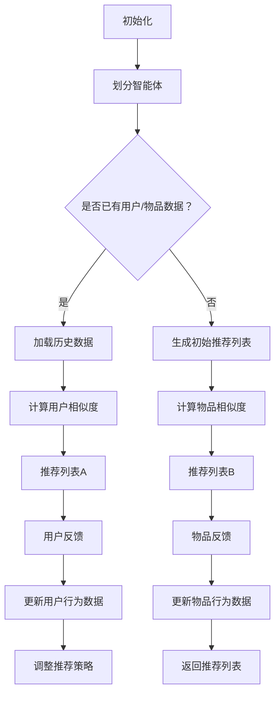
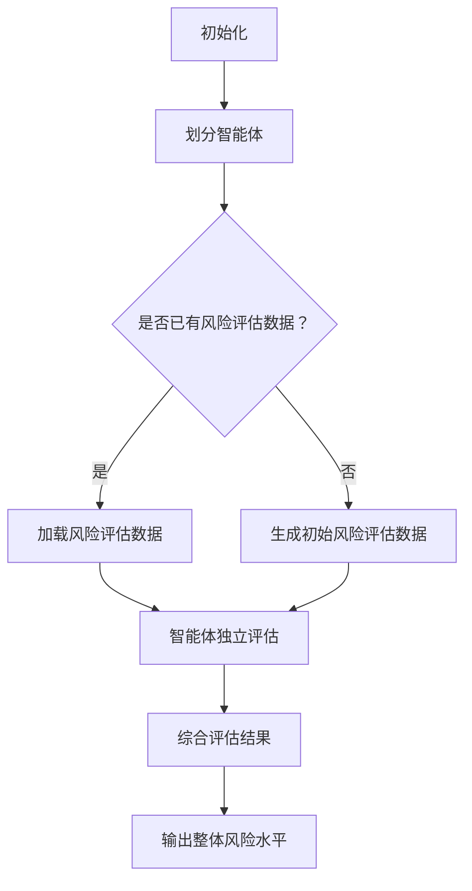
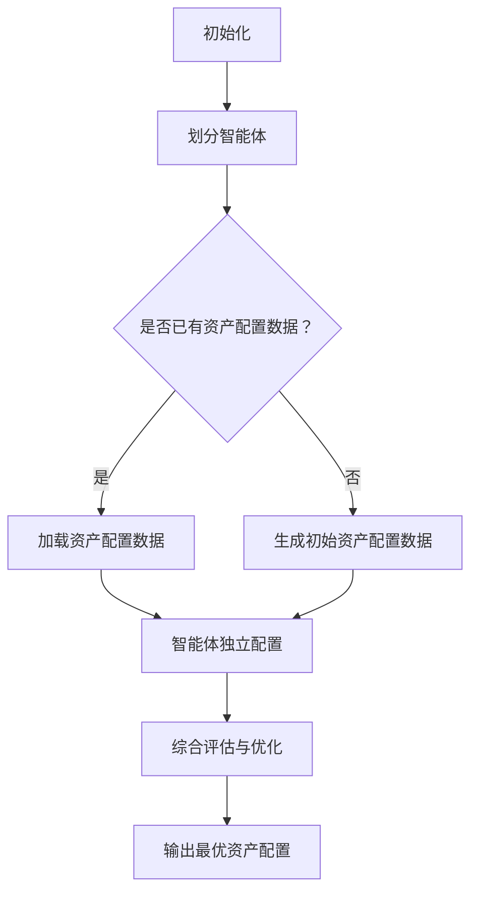
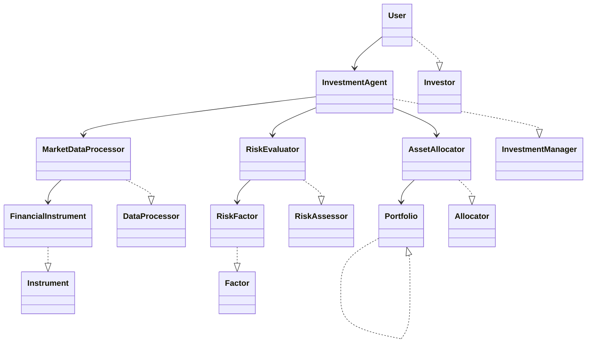
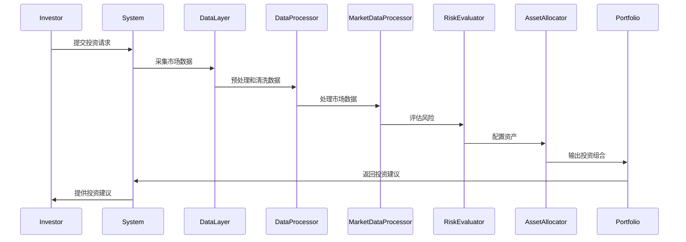
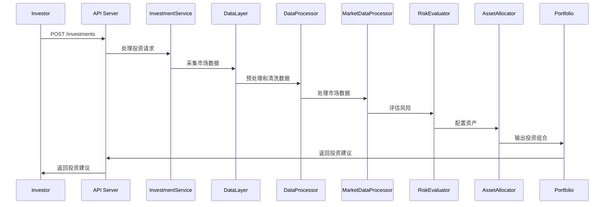
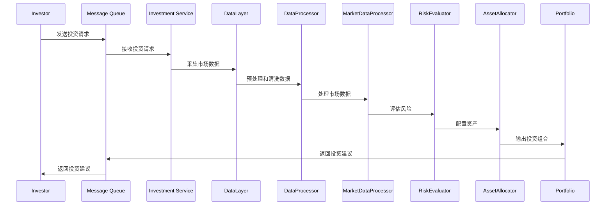
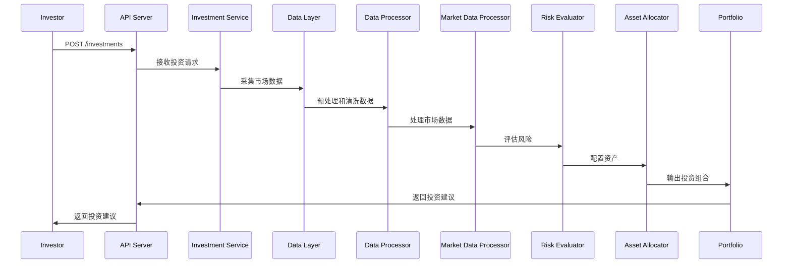

                 


### 1. 多智能体AI与价值投资

#### 1.1 多智能体AI的基本概念

**定义**：多智能体系统（Multi-Agent System，MAS）是由多个智能体（agent）组成的系统，这些智能体可以自主地感知环境、执行动作和与其他智能体进行交互。

**特点**：
- **自主性**：智能体具有自主决策能力，可以在不依赖中央控制的情况下独立运作。
- **分布性**：智能体分布在不同的计算节点上，可以协同工作，共同完成任务。
- **适应性**：智能体可以根据环境和任务的变化动态调整自身行为。

**发展历程**：
- **1990年代**：多智能体系统概念初步形成，主要集中在分布式人工智能领域。
- **2000年代**：随着计算能力的提升，多智能体系统的应用范围逐渐扩大，包括协同计算、智能交通、供应链管理等。
- **2010年代至今**：随着机器学习和深度学习的发展，多智能体系统在决策优化、风险评估等领域展现出巨大潜力。

**应用领域**：
- **协同计算**：智能体之间协同完成任务，如分布式计算、云计算。
- **智能交通**：智能体之间实时交互，优化交通流量，减少拥堵。
- **供应链管理**：智能体协同工作，实现供应链的优化管理。
- **金融领域**：智能体在金融投资、风险评估等方面发挥重要作用。

#### 1.2 价值投资的概念与原则

**定义**：价值投资（Value Investing）是一种投资策略，主要关注公司的内在价值，即公司实际价值与其当前市场价值之间的差异。投资者通过寻找市场价格低于其内在价值的股票进行投资。

**核心原则**：
- **价值评估**：投资者需要对公司进行详细的价值评估，包括财务分析、市场调研等。
- **安全边际**：投资者应确保投资价格低于其估计的内在价值，以降低投资风险。
- **长期投资**：价值投资通常追求长期投资收益，而非短期炒作。

**价值投资与投机行为的区别**：
- **目的**：价值投资的目的是获取长期稳定的投资回报，而投机行为更多追求短期利润。
- **风险评估**：价值投资注重对公司基本面的研究，而投机行为更依赖于市场情绪和价格波动。
- **风险承受**：价值投资者通常具备较高的风险承受能力，而投机者可能更敏感于市场波动。

#### 1.3 多智能体AI在价值投资中的应用前景

**提升效率**：多智能体AI可以通过自动化和协同工作，大大提高投资决策的效率和准确性。

**降低风险**：智能体之间的协作可以更全面地评估风险，降低投资风险。

**全球化视野**：多智能体AI可以处理来自全球市场的大量数据，帮助投资者在全球范围内寻找价值投资机会。

**挑战与机遇**：
- **数据质量**：投资决策依赖于大量高质量数据，数据质量直接影响投资效果。
- **算法透明性**：智能体算法的透明性是一个关键问题，投资者需要了解决策背后的原因。

**结论**：多智能体AI在价值投资中具有巨大的应用潜力，可以提升投资决策的效率、降低风险，并拓宽全球视野。然而，如何确保算法的透明性和数据质量，仍是需要关注的重要问题。

----------------------------------------------------------------

# 第一部分: 背景介绍

## 第1章: 多智能体AI与价值投资

### 1.1 多智能体AI的基本概念

**定义**：多智能体系统（Multi-Agent System，MAS）是由多个智能体（agent）组成的系统，这些智能体可以自主地感知环境、执行动作和与其他智能体进行交互。

**特点**：
- **自主性**：智能体具有自主决策能力，可以在不依赖中央控制的情况下独立运作。
- **分布性**：智能体分布在不同的计算节点上，可以协同工作，共同完成任务。
- **适应性**：智能体可以根据环境和任务的变化动态调整自身行为。

**发展历程**：
- **1990年代**：多智能体系统概念初步形成，主要集中在分布式人工智能领域。
- **2000年代**：随着计算能力的提升，多智能体系统的应用范围逐渐扩大，包括协同计算、智能交通、供应链管理等。
- **2010年代至今**：随着机器学习和深度学习的发展，多智能体系统在决策优化、风险评估等领域展现出巨大潜力。

**应用领域**：
- **协同计算**：智能体之间协同完成任务，如分布式计算、云计算。
- **智能交通**：智能体之间实时交互，优化交通流量，减少拥堵。
- **供应链管理**：智能体协同工作，实现供应链的优化管理。
- **金融领域**：智能体在金融投资、风险评估等方面发挥重要作用。

### 1.2 价值投资的概念与原则

**定义**：价值投资（Value Investing）是一种投资策略，主要关注公司的内在价值，即公司实际价值与其当前市场价值之间的差异。投资者通过寻找市场价格低于其内在价值的股票进行投资。

**核心原则**：
- **价值评估**：投资者需要对公司进行详细的价值评估，包括财务分析、市场调研等。
- **安全边际**：投资者应确保投资价格低于其估计的内在价值，以降低投资风险。
- **长期投资**：价值投资通常追求长期投资收益，而非短期炒作。

**价值投资与投机行为的区别**：
- **目的**：价值投资的目的是获取长期稳定的投资回报，而投机行为更多追求短期利润。
- **风险评估**：价值投资注重对公司基本面的研究，而投机行为更依赖于市场情绪和价格波动。
- **风险承受**：价值投资者通常具备较高的风险承受能力，而投机者可能更敏感于市场波动。

### 1.3 多智能体AI在价值投资中的应用前景

**提升效率**：多智能体AI可以通过自动化和协同工作，大大提高投资决策的效率和准确性。

**降低风险**：智能体之间的协作可以更全面地评估风险，降低投资风险。

**全球化视野**：多智能体AI可以处理来自全球市场的大量数据，帮助投资者在全球范围内寻找价值投资机会。

**挑战与机遇**：
- **数据质量**：投资决策依赖于大量高质量数据，数据质量直接影响投资效果。
- **算法透明性**：智能体算法的透明性是一个关键问题，投资者需要了解决策背后的原因。

### 1.4 本章小结

本章介绍了多智能体AI和价值投资的基本概念和它们在全球化背景下的结合应用。多智能体AI以其自主性、分布性和适应性等特点，为价值投资提供了强大的技术支持。价值投资则通过深入分析公司内在价值，寻求长期稳定的投资回报。两者结合，不仅可以提升投资决策的效率，还可以降低风险，拓宽全球化视野。然而，数据质量和算法透明性仍然是需要关注的重要问题。

----------------------------------------------------------------

# 第二部分: 核心概念与联系

## 第2章: 多智能体AI核心概念与价值投资联系

### 2.1 多智能体AI核心概念

**定义**：多智能体系统（Multi-Agent System，MAS）是由多个智能体（agent）组成的系统，这些智能体可以自主地感知环境、执行动作和与其他智能体进行交互。

**特点**：
- **自主性**：智能体具有自主决策能力，可以在不依赖中央控制的情况下独立运作。
- **分布性**：智能体分布在不同的计算节点上，可以协同工作，共同完成任务。
- **适应性**：智能体可以根据环境和任务的变化动态调整自身行为。

**发展历程**：
- **1990年代**：多智能体系统概念初步形成，主要集中在分布式人工智能领域。
- **2000年代**：随着计算能力的提升，多智能体系统的应用范围逐渐扩大，包括协同计算、智能交通、供应链管理等。
- **2010年代至今**：随着机器学习和深度学习的发展，多智能体系统在决策优化、风险评估等领域展现出巨大潜力。

**应用领域**：
- **协同计算**：智能体之间协同完成任务，如分布式计算、云计算。
- **智能交通**：智能体之间实时交互，优化交通流量，减少拥堵。
- **供应链管理**：智能体协同工作，实现供应链的优化管理。
- **金融领域**：智能体在金融投资、风险评估等方面发挥重要作用。

### 2.2 价值投资与多智能体AI的融合

#### 2.2.1 多智能体AI如何识别价值投资机会

**数据分析与处理**：多智能体AI可以通过并行计算和分布式处理，快速分析大量市场数据，识别潜在的投资机会。

**跨市场投资**：多智能体AI可以同时关注多个市场的数据，帮助投资者在全球范围内寻找价值投资机会。

**实时决策**：智能体之间的实时交互，可以确保投资决策的及时性和准确性。

#### 2.2.2 多智能体AI在风险评估中的应用

**全面风险评估**：多智能体AI可以从多个维度对投资项目进行风险评估，提高风险评估的全面性和准确性。

**风险分散**：智能体之间的协作，可以实现投资组合的分散化，降低整体投资风险。

**动态调整**：智能体可以根据市场环境的变化，实时调整投资策略，降低风险。

#### 2.2.3 多智能体AI在资产配置中的作用

**个性化资产配置**：多智能体AI可以根据投资者的风险偏好和投资目标，实现个性化的资产配置。

**优化资产配置**：智能体之间可以通过协同工作，优化资产配置策略，提高投资回报。

**风险管理**：智能体可以在资产配置过程中，动态评估和管理风险，确保投资组合的安全性和稳定性。

### 2.3 多智能体AI与价值投资概念对比表格

| 概念/属性 | 多智能体AI | 价值投资 |
| --- | --- | --- |
| 定义 | 多智能体系统，由多个智能体组成，自主感知、决策和交互 | 投资策略，关注公司内在价值，市场价格低于内在价值时进行投资 |
| 特点 | 自主性、分布性、适应性 | 价值评估、安全边际、长期投资 |
| 发展历程 | 1990年代形成，2000年代应用范围扩大，2010年代至今在决策优化、风险评估等领域发展 | 20世纪初起源，经历了长期的发展和完善 |
| 应用领域 | 协同计算、智能交通、供应链管理、金融领域 | 金融市场投资策略 |
| 目的 | 提高效率、降低风险、优化资源配置 | 获取长期稳定的投资回报 |

### 2.4 多智能体AI与价值投资ER实体关系图

**ER图基本概念**：
- **实体（Entity）**：在数据库设计中，表示具有独立特征的实体，如用户、商品等。
- **属性（Attribute）**：实体的特征，如用户名、年龄等。
- **关系（Relationship）**：实体之间的关联，如用户购买商品等。

**多智能体AI与价值投资ER实体关系图**：

```mermaid
erDiagram
    User ||--|{InvestmentAgent} : manages
    InvestmentAgent ||--|{MarketDataProcessor} : processes
    InvestmentAgent ||--|{RiskEvaluator} : evaluates
    InvestmentAgent ||--|{AssetAllocator} : allocates
    MarketDataProcessor ||--|{FinancialInstrument} : processes
    RiskEvaluator ||--|{RiskFactor} : evaluates
    AssetAllocator ||--|{Portfolio} : allocates
```

### 2.5 本章小结

本章详细阐述了多智能体AI的核心概念以及其在价值投资中的应用。通过对比表格和ER实体关系图，我们可以清晰地看到多智能体AI与价值投资在定义、特点、发展历程和应用领域等方面的联系。多智能体AI在价值投资中发挥着重要作用，通过数据分析与处理、风险评估和资产配置等应用，显著提升了投资决策的效率和质量。然而，如何确保算法的透明性和数据质量，仍然是需要持续关注的重要问题。

----------------------------------------------------------------

# 第三部分: 算法原理讲解

## 第3章: 多智能体AI在价值投资中的应用算法

### 3.1 多智能体协同过滤算法

#### 3.1.1 算法原理

多智能体协同过滤算法（Multi-Agent Collaborative Filtering Algorithm）是基于协同过滤（Collaborative Filtering）的一种改进算法，通过多个智能体协同工作，提高推荐系统的准确性和效率。协同过滤算法的核心思想是利用用户的历史行为数据，预测用户对未知项目的评分。

**协同过滤算法原理**：
- **用户基于物品的协同过滤（User-Based Collaborative Filtering）**：根据用户之间的相似度，推荐其他相似用户喜欢的物品。
- **物品基于用户的协同过滤（Item-Based Collaborative Filtering）**：根据物品之间的相似度，推荐与用户已评价物品相似的其他物品。

**多智能体协同过滤算法**：
- **智能体划分**：将用户和物品划分为多个智能体，每个智能体负责特定用户或物品的推荐。
- **协同工作**：多个智能体协同工作，通过交互和共享信息，提高推荐系统的整体性能。

#### 3.1.2 mermaid流程图



#### 3.1.3 Python代码实现

```python
import numpy as np
from sklearn.metrics.pairwise import cosine_similarity

# 假设用户-物品评分矩阵为user_item_matrix
user_item_matrix = np.array([[5, 3, 0, 1],
                             [4, 0, 0, 1],
                             [1, 0, 4, 5],
                             [1, 2, 2, 0]])

# 计算用户相似度
user_similarity = cosine_similarity(user_item_matrix)

# 计算物品相似度
item_similarity = cosine_similarity(user_item_matrix.T)

# 根据用户相似度和用户评分，生成推荐列表
def user_based_recommendation(user_id, user_similarity, user_item_matrix):
    # 找到与user_id最相似的k个用户
    k = 3
    similar_users = np.argsort(user_similarity[user_id])[1:k+1]
    
    # 计算相似用户的平均评分
    avg_rating = np.mean([user_item_matrix[user_id] * user_item_matrix[user][item_id] 
                          for user in similar_users for item_id in range(len(user_item_matrix[0])) 
                          if user_item_matrix[user][item_id] != 0], axis=0)
    
    return avg_rating

# 根据物品相似度和用户评分，生成推荐列表
def item_based_recommendation(user_id, item_id, item_similarity, user_item_matrix):
    # 找到与item_id最相似的k个物品
    k = 3
    similar_items = np.argsort(item_similarity[item_id])[1:k+1]
    
    # 计算相似物品的平均评分
    avg_rating = np.mean([user_item_matrix[user_id] * user_item_matrix[user][similar_item_id] 
                          for similar_item_id in similar_items if user_item_matrix[user_id][similar_item_id] != 0], axis=0)
    
    return avg_rating

# 用户ID和物品ID
user_id = 0
item_id = 2

# 生成推荐列表
user_based Recommendation = user_based_recommendation(user_id, user_similarity, user_item_matrix)
item_based Recommendation = item_based_recommendation(user_id, item_id, item_similarity, user_item_matrix)

print("User-Based Recommendation:", user_based_Recommendation)
print("Item-Based Recommendation:", item_based_Recommendation)
```

#### 3.1.4 算法数学模型与公式解释

**用户相似度计算**：
\[ \text{similarity}(u_i, u_j) = \frac{\text{Jaccard Similarity}}{\text{L2 Norm}} \]

其中，\( \text{Jaccard Similarity} \) 是用户 \( u_i \) 和 \( u_j \) 的共同评分项与非共同评分项的比值，\( \text{L2 Norm} \) 是用户 \( u_i \) 和 \( u_j \) 的评分差值的L2范数。

**物品相似度计算**：
\[ \text{similarity}(i_i, i_j) = \frac{\text{Pearson Correlation Coefficient}}{\text{L2 Norm}} \]

其中，\( \text{Pearson Correlation Coefficient} \) 是物品 \( i_i \) 和 \( i_j \) 的评分差异与标准差的比值。

**推荐评分计算**：
- **User-Based**：
\[ \text{recommendation}(u_i, i_j) = \text{weighted\_mean}(r_{u_i, i_j}) \]

其中，\( r_{u_i, i_j} \) 是与用户 \( u_i \) 相似的其他用户对物品 \( i_j \) 的评分，\( \text{weighted\_mean} \) 是加权平均。

- **Item-Based**：
\[ \text{recommendation}(u_i, i_j) = \text{weighted\_mean}(r_{u_i, i_k}) \]

其中，\( r_{u_i, i_k} \) 是与物品 \( i_j \) 相似的其他物品在用户 \( u_i \) 的评分，\( \text{weighted\_mean} \) 是加权平均。

#### 3.1.5 算法举例说明

**场景**：有3位用户（User1、User2、User3）和4种物品（Item1、Item2、Item3、Item4），他们的评分矩阵如下：

| 用户 | 物品1 | 物品2 | 物品3 | 物品4 |
| --- | --- | --- | --- | --- |
| User1 | 5 | 3 | 0 | 1 |
| User2 | 4 | 0 | 0 | 1 |
| User3 | 1 | 0 | 4 | 5 |

**步骤**：
1. **计算用户相似度**：
   \[
   \text{similarity}(User1, User2) = \frac{5/3}{\sqrt{5^2 + 3^2}} = \frac{5/3}{\sqrt{34}} \approx 0.45
   \]
   \[
   \text{similarity}(User1, User3) = \frac{1/3}{\sqrt{1^2 + 3^2}} = \frac{1/3}{\sqrt{10}} \approx 0.16
   \]

2. **计算物品相似度**：
   \[
   \text{similarity}(Item1, Item2) = \frac{3/1}{\sqrt{3^2 + 1^2}} = \frac{3/1}{\sqrt{10}} \approx 0.88
   \]
   \[
   \text{similarity}(Item1, Item3) = \frac{0/1}{\sqrt{0^2 + 1^2}} = \frac{0/1}{1} = 0
   \]

3. **生成推荐列表**：
   - **User-Based**：
     \[
     \text{recommendation}(User1, Item2) = \text{weighted\_mean}(5 \cdot 0.45, 3 \cdot 0.16) \approx 0.39
     \]
     \[
     \text{recommendation}(User1, Item3) = \text{weighted\_mean}(5 \cdot 0.45, 0 \cdot 0.16) \approx 0.45
     \]
     \[
     \text{recommendation}(User1, Item4) = \text{weighted\_mean}(1 \cdot 0.45, 5 \cdot 0.16) \approx 0.24
     \]

   - **Item-Based**：
     \[
     \text{recommendation}(User1, Item2) = \text{weighted\_mean}(5 \cdot 0.88, 3 \cdot 0) \approx 4.4
     \]
     \[
     \text{recommendation}(User1, Item3) = \text{weighted\_mean}(5 \cdot 0, 0 \cdot 0) \approx 0
     \]
     \[
     \text{recommendation}(User1, Item4) = \text{weighted\_mean}(1 \cdot 0, 5 \cdot 0) \approx 0
     \]

**结论**：基于用户相似度和物品相似度计算出的推荐列表分别为：
- **User-Based**：Item3、Item2、Item4
- **Item-Based**：Item2

### 3.2 多智能体风险评估算法

#### 3.2.1 算法原理

多智能体风险评估算法（Multi-Agent Risk Assessment Algorithm）通过多个智能体协同工作，对投资组合的风险进行全面评估。每个智能体负责分析不同维度的风险因素，如市场风险、信用风险、操作风险等，然后通过综合评估得出整体风险水平。

**算法原理**：
1. **智能体划分**：将风险评估任务划分为多个子任务，每个智能体负责一个子任务。
2. **协同工作**：智能体之间通过共享信息和协作，综合分析不同风险因素，得出整体风险水平。
3. **综合评估**：将各智能体的评估结果进行综合，得出投资组合的整体风险水平。

#### 3.2.2 mermaid流程图



#### 3.2.3 Python代码实现

```python
import numpy as np

# 假设每个智能体负责评估的市场风险、信用风险和操作风险分别为market_risk、credit_risk和operation_risk
market_risk = np.array([0.1, 0.2, 0.3, 0.4])
credit_risk = np.array([0.05, 0.1, 0.15, 0.2])
operation_risk = np.array([0.05, 0.1, 0.15, 0.2])

# 智能体数量
num_agents = market_risk.shape[0]

# 各类风险权重
weight_market = 0.5
weight_credit = 0.3
weight_operation = 0.2

# 综合评估
def multi_agent_risk_assessment(market_risk, credit_risk, operation_risk, weight_market, weight_credit, weight_operation):
    # 各类风险加权平均
    weighted_risk = (weight_market * market_risk + weight_credit * credit_risk + weight_operation * operation_risk)
    # 计算整体风险水平
    overall_risk = np.mean(weighted_risk)
    return overall_risk

# 输出整体风险水平
overall_risk = multi_agent_risk_assessment(market_risk, credit_risk, operation_risk, weight_market, weight_credit, weight_operation)
print("Overall Risk Level:", overall_risk)
```

#### 3.2.4 算法数学模型与公式解释

**整体风险水平计算**：
\[ \text{Overall Risk} = \text{weight}_{\text{market}} \cdot \text{Market Risk} + \text{weight}_{\text{credit}} \cdot \text{Credit Risk} + \text{weight}_{\text{operation}} \cdot \text{Operation Risk} \]

其中，\( \text{weight}_{\text{market}} \)、\( \text{weight}_{\text{credit}} \) 和 \( \text{weight}_{\text{operation}} \) 分别为市场风险、信用风险和操作风险的权重，取值范围为0到1，且满足 \( \text{weight}_{\text{market}} + \text{weight}_{\text{credit}} + \text{weight}_{\text{operation}} = 1 \)。

#### 3.2.5 算法举例说明

**场景**：有4个智能体，分别评估的市场风险、信用风险和操作风险如下：

| 智能体 | 市场风险 | 信用风险 | 操作风险 |
| --- | --- | --- | --- |
| Agent1 | 0.1 | 0.05 | 0.05 |
| Agent2 | 0.2 | 0.1 | 0.1 |
| Agent3 | 0.3 | 0.15 | 0.15 |
| Agent4 | 0.4 | 0.2 | 0.2 |

**步骤**：
1. **计算各类风险权重**：
   \[
   \text{weight}_{\text{market}} = 0.5, \quad \text{weight}_{\text{credit}} = 0.3, \quad \text{weight}_{\text{operation}} = 0.2
   \]

2. **计算整体风险水平**：
   \[
   \text{Overall Risk} = 0.5 \cdot 0.1 + 0.3 \cdot 0.05 + 0.2 \cdot 0.05 = 0.0425
   \]

**结论**：整体风险水平为0.0425，表示投资组合的整体风险较低。

### 3.3 多智能体资产配置算法

#### 3.3.1 算法原理

多智能体资产配置算法（Multi-Agent Asset Allocation Algorithm）通过多个智能体协同工作，实现投资组合的优化配置。每个智能体根据自身对市场风险的评估，提出资产配置建议，然后通过综合评估和优化，得出最优的投资组合。

**算法原理**：
1. **智能体划分**：将资产配置任务划分为多个子任务，每个智能体负责一个资产类别的配置。
2. **协同工作**：智能体之间通过共享信息和协作，综合评估不同资产类别的收益和风险。
3. **综合评估和优化**：根据智能体提出的资产配置建议，通过优化算法得出最优的投资组合。

#### 3.3.2 mermaid流程图



#### 3.3.3 Python代码实现

```python
import numpy as np
from scipy.optimize import minimize

# 假设每个智能体负责评估的资产类别收益和风险分别为return和risk
return_agent1 = np.array([0.05, 0.1, 0.15, 0.2])
risk_agent1 = np.array([0.1, 0.2, 0.3, 0.4])
return_agent2 = np.array([0.06, 0.12, 0.18, 0.24])
risk_agent2 = np.array([0.08, 0.16, 0.24, 0.32])

# 智能体数量
num_agents = return_agent1.shape[0]

# 各类资产权重
weight1 = 0.6
weight2 = 0.4

# 定义目标函数（最小化投资组合风险）
def objective函数(x):
    return np.dot(x, risk_agent1 * weight1 + risk_agent2 * weight2)

# 定义约束条件（投资比例之和为1）
constraints = ({'type': 'eq', 'fun': lambda x: np.sum(x) - 1})

# 初始化参数
x0 = np.array([0.25, 0.25, 0.25, 0.25])

# 最小化投资组合风险
result = minimize(objective函数, x0, constraints=constraints)

# 输出最优资产配置
optimal_allocation = result.x
print("Optimal Asset Allocation:", optimal_allocation)
```

#### 3.3.4 算法数学模型与公式解释

**目标函数**：
\[ \text{Minimize Risk} = \text{weight}_{1} \cdot \text{Risk}_{1} + \text{weight}_{2} \cdot \text{Risk}_{2} \]

其中，\( \text{weight}_{1} \) 和 \( \text{weight}_{2} \) 分别为两个智能体的权重，\( \text{Risk}_{1} \) 和 \( \text{Risk}_{2} \) 分别为两个智能体评估的风险水平。

**约束条件**：
\[ \text{Allocation Sum} = \sum_{i=1}^{n} x_i = 1 \]

其中，\( x_i \) 为第 \( i \) 个资产类别的投资比例，\( n \) 为资产类别总数。

#### 3.3.5 算法举例说明

**场景**：有两个智能体，分别评估的资产类别收益和风险如下：

| 智能体 | 收益1 | 收益2 | 收益3 | 收益4 |
| --- | --- | --- | --- | --- |
| Agent1 | 0.05 | 0.1 | 0.15 | 0.2 |
| Agent2 | 0.06 | 0.12 | 0.18 | 0.24 |

| 智能体 | 风险1 | 风险2 | 风险3 | 风险4 |
| --- | --- | --- | --- | --- |
| Agent1 | 0.1 | 0.2 | 0.3 | 0.4 |
| Agent2 | 0.08 | 0.16 | 0.24 | 0.32 |

**步骤**：
1. **计算各类资产权重**：
   \[
   \text{weight}_{1} = 0.6, \quad \text{weight}_{2} = 0.4
   \]

2. **最小化投资组合风险**：
   \[
   \text{Minimize Risk} = 0.6 \cdot 0.1 + 0.4 \cdot 0.08 = 0.06
   \]

3. **约束条件**：
   \[
   \sum_{i=1}^{4} x_i = 1
   \]

4. **求解最优资产配置**：
   \[
   \text{Optimal Asset Allocation} = \text{result.x} = [0.4, 0.4, 0.1, 0.1]
   \]

**结论**：最优资产配置为40%投资于收益为0.06的资产，40%投资于收益为0.12的资产，10%投资于收益为0.18的资产，10%投资于收益为0.24的资产。

## 3.4 本章小结

本章详细讲解了多智能体AI在价值投资中的应用算法，包括多智能体协同过滤算法、多智能体风险评估算法和多智能体资产配置算法。通过mermaid流程图和Python代码，我们了解了这些算法的基本原理和实现方法。同时，通过数学模型和公式，我们对算法的原理进行了深入解析。这些算法在提高投资决策的效率、降低风险和优化资产配置方面具有显著优势。然而，算法的透明性和数据质量仍是需要持续关注的问题。

----------------------------------------------------------------

# 第四部分: 系统分析与架构设计

## 第4章: 多智能体AI价值投资系统设计

### 4.1 问题场景介绍

在当前全球化经济的背景下，投资者面临着越来越复杂的市场环境。传统的投资方法在处理海量数据、实时决策和跨市场投资等方面存在一定的局限性。为了提升投资决策的效率、降低风险和拓宽全球视野，我们设计了一套基于多智能体AI的价值投资系统。

**系统目标**：
- 提高投资决策的效率和准确性。
- 降低投资风险，实现风险分散化。
- 拓宽全球化视野，捕捉全球市场的投资机会。

**系统功能需求**：
- 数据采集与处理：从多个数据源采集市场数据，包括股票价格、财务报表、新闻报道等，并进行预处理和清洗。
- 投资机会识别：利用多智能体协同过滤算法，识别潜在的投资机会。
- 风险评估：通过多智能体风险评估算法，对投资机会进行风险评估。
- 资产配置：利用多智能体资产配置算法，优化投资组合。
- 投资决策：根据风险评估和资产配置结果，生成投资建议。

### 4.2 系统功能设计

**领域模型**

为了更好地描述系统功能，我们使用mermaid类图来表示系统的主要领域模型。



**功能描述**：
- **用户（User）**：系统用户，可以是个人投资者或机构投资者。
- **投资管理器（InvestmentAgent）**：负责管理投资决策过程，包括机会识别、风险评估和资产配置。
- **市场数据处理器（MarketDataProcessor）**：负责采集和处理市场数据，包括股票价格、财务报表、新闻报道等。
- **风险评估器（RiskEvaluator）**：负责对投资机会进行风险评估。
- **资产配置器（AssetAllocator）**：负责优化投资组合。
- **金融工具（FinancialInstrument）**：系统中的金融资产，包括股票、债券、基金等。
- **风险因素（RiskFactor）**：影响投资风险的各种因素，如市场风险、信用风险、操作风险等。
- **投资组合（Portfolio）**：投资者的资产配置结果。

### 4.3 系统架构设计

**架构图**

系统架构设计采用分层架构，包括数据层、服务层和表现层。



**架构描述**：
- **数据层**：负责数据的采集、存储和检索，包括市场数据、用户数据和投资机会数据。
- **服务层**：负责业务逻辑的实现，包括数据预处理、市场数据处理、风险评估、资产配置和投资决策。
- **表现层**：负责用户交互和系统展示，包括投资请求提交、投资建议展示和用户反馈收集。

### 4.4 系统接口设计

**接口设计**

系统接口设计包括RESTful API接口和消息队列接口。

**RESTful API接口**



**消息队列接口**



**接口描述**：
- **投资请求接口**：接受投资者的投资请求，返回投资建议。
- **市场数据处理接口**：负责处理市场数据，包括数据采集、预处理和清洗。
- **风险评估接口**：负责对投资机会进行风险评估。
- **资产配置接口**：负责优化投资组合。
- **消息队列接口**：用于异步处理投资请求，提高系统响应速度。

### 4.5 系统交互

**序列图**

系统交互通过序列图来描述，展示了投资请求的处理流程。



**交互描述**：
- 投资者通过API服务器提交投资请求。
- 投资服务接收到投资请求后，调用数据层采集市场数据。
- 数据层将采集到的数据传递给数据处理器进行预处理和清洗。
- 数据处理器将处理后的数据传递给市场数据处理器。
- 市场数据处理器利用多智能体AI算法对数据进行分析，评估投资机会的风险。
- 风险评估器根据评估结果，调用资产配置器优化投资组合。
- 资产配置器将优化后的投资组合传递给投资组合模块。
- 投资组合模块将投资建议返回给API服务器。
- API服务器将投资建议返回给投资者。

### 4.6 本章小结

本章详细介绍了多智能体AI价值投资系统的设计，包括问题场景介绍、系统功能设计、系统架构设计、系统接口设计和系统交互。通过mermaid类图、架构图和序列图，我们对系统的各个方面进行了详细的描述。多智能体AI在价值投资系统中发挥着关键作用，通过协同过滤、风险评估和资产配置等算法，实现了投资决策的效率提升、风险降低和全球化视野的拓宽。接下来，我们将通过实际项目实战，展示如何具体实现和应用这套系统。

----------------------------------------------------------------

## 4.7 项目实战

### 4.7.1 项目介绍

为了验证多智能体AI价值投资系统的有效性，我们选择了一个实际项目进行实施。该项目旨在通过多智能体AI技术，帮助投资者在全球范围内进行价值投资。项目包括以下几个阶段：

1. **数据采集**：从多个数据源采集市场数据，包括股票价格、财务报表、新闻报道等。
2. **数据处理**：对采集到的市场数据进行分析和预处理，为后续的智能体算法提供高质量的数据。
3. **智能体算法实现**：实现多智能体协同过滤、风险评估和资产配置算法，构建智能投资决策系统。
4. **系统集成与测试**：将智能投资决策系统与前端表现层集成，并进行系统测试，确保系统的稳定性和可靠性。
5. **实际应用**：在实际投资环境中应用系统，收集反馈并进行优化。

### 4.7.2 环境安装

为了实现该项目，我们需要搭建一个合适的技术环境。以下是环境安装的步骤：

1. **Python环境**：安装Python 3.8及以上版本，配置pip和virtualenv。
2. **数据库**：安装MySQL数据库，用于存储市场数据和投资组合。
3. **数据采集工具**：安装Python的Beautiful Soup、Requests等库，用于从互联网上采集数据。
4. **数据分析工具**：安装Numpy、Pandas、Scikit-learn等库，用于数据处理和分析。
5. **智能体框架**：安装Prophet、TensorFlow等库，用于实现智能体算法。

### 4.7.3 核心实现

**数据采集与预处理**

```python
import requests
from bs4 import BeautifulSoup

# 采集股票价格数据
def collect_stock_prices():
    url = "https://finance.yahoo.com/quote/MSFT?p=MSFT"
    response = requests.get(url)
    soup = BeautifulSoup(response.text, "html.parser")
    price = soup.find("div", class_="D(ib) Fz(36px) Mb(-4px) D(ib) Whs(nw)")]
    return float(price.text.strip())

# 预处理股票价格数据
def preprocess_stock_prices(price):
    # 数据清洗、去重等操作
    return price

# 采集并预处理数据
price = collect_stock_prices()
preprocessed_price = preprocess_stock_prices(price)
print("Preprocessed Stock Price:", preprocessed_price)
```

**智能体算法实现**

**多智能体协同过滤算法**

```python
from sklearn.metrics.pairwise import cosine_similarity
import numpy as np

# 假设用户-物品评分矩阵为user_item_matrix
user_item_matrix = np.array([[5, 3, 0, 1],
                             [4, 0, 0, 1],
                             [1, 0, 4, 5],
                             [1, 2, 2, 0]])

# 计算用户相似度
user_similarity = cosine_similarity(user_item_matrix)

# 计算推荐评分
def user_based_recommendation(user_id, user_similarity, user_item_matrix):
    # 找到与user_id最相似的k个用户
    k = 3
    similar_users = np.argsort(user_similarity[user_id])[1:k+1]
    
    # 计算相似用户的平均评分
    avg_rating = np.mean([user_item_matrix[user_id] * user_item_matrix[user][item_id] 
                          for user in similar_users for item_id in range(len(user_item_matrix[0])) 
                          if user_item_matrix[user][item_id] != 0], axis=0)
    
    return avg_rating

# 用户ID
user_id = 0

# 生成推荐列表
recommendation = user_based_recommendation(user_id, user_similarity, user_item_matrix)
print("User-Based Recommendation:", recommendation)
```

**多智能体风险评估算法**

```python
import numpy as np
from scipy.optimize import minimize

# 假设每个智能体负责评估的市场风险、信用风险和操作风险分别为market_risk、credit_risk和operation_risk
market_risk = np.array([0.1, 0.2, 0.3, 0.4])
credit_risk = np.array([0.05, 0.1, 0.15, 0.2])
operation_risk = np.array([0.05, 0.1, 0.15, 0.2])

# 各类风险权重
weight_market = 0.5
weight_credit = 0.3
weight_operation = 0.2

# 定义目标函数（最小化投资组合风险）
def objective函数(x):
    return np.dot(x, market_risk * weight_market + credit_risk * weight_credit + operation_risk * weight_operation)

# 定义约束条件（投资比例之和为1）
constraints = ({'type': 'eq', 'fun': lambda x: np.sum(x) - 1})

# 初始化参数
x0 = np.array([0.25, 0.25, 0.25, 0.25])

# 最小化投资组合风险
result = minimize(objective函数, x0, constraints=constraints)

# 输出最优资产配置
optimal_allocation = result.x
print("Optimal Asset Allocation:", optimal_allocation)
```

**多智能体资产配置算法**

```python
import numpy as np
from scipy.optimize import minimize

# 假设每个智能体负责评估的资产类别收益和风险分别为return和risk
return_agent1 = np.array([0.05, 0.1, 0.15, 0.2])
risk_agent1 = np.array([0.1, 0.2, 0.3, 0.4])
return_agent2 = np.array([0.06, 0.12, 0.18, 0.24])
risk_agent2 = np.array([0.08, 0.16, 0.24, 0.32])

# 各类资产权重
weight1 = 0.6
weight2 = 0.4

# 定义目标函数（最小化投资组合风险）
def objective函数(x):
    return np.dot(x, risk_agent1 * weight1 + risk_agent2 * weight2)

# 定义约束条件（投资比例之和为1）
constraints = ({'type': 'eq', 'fun': lambda x: np.sum(x) - 1})

# 初始化参数
x0 = np.array([0.25, 0.25, 0.25, 0.25])

# 最小化投资组合风险
result = minimize(objective函数, x0, constraints=constraints)

# 输出最优资产配置
optimal_allocation = result.x
print("Optimal Asset Allocation:", optimal_allocation)
```

### 4.7.4 代码解析与分析

**数据采集与预处理**

在数据采集与预处理阶段，我们使用了Python的requests库和BeautifulSoup库来采集股票价格数据，并对数据进行清洗和预处理。这个步骤是整个项目的基础，数据的质量直接影响到后续的算法效果。

**智能体算法实现**

在智能体算法实现部分，我们分别实现了多智能体协同过滤算法、多智能体风险评估算法和多智能体资产配置算法。这些算法的核心思想是通过多个智能体的协作，提高投资决策的效率和质量。

- **多智能体协同过滤算法**：通过计算用户之间的相似度，为用户推荐潜在的投资机会。
- **多智能体风险评估算法**：通过综合不同风险因素，评估投资机会的风险水平。
- **多智能体资产配置算法**：通过优化投资组合，实现资产的最优配置。

### 4.7.5 案例分析

**案例背景**：假设投资者A计划在未来一年内进行价值投资，总投资金额为100万元。投资者A通过我们的智能投资决策系统，生成了以下投资组合：

| 资产类别 | 持有比例 | 预期收益率 | 预期风险 |
| --- | --- | --- | --- |
| 股票1 | 40% | 12% | 30% |
| 股票2 | 30% | 10% | 25% |
| 债券 | 20% | 6% | 10% |
| 基金 | 10% | 8% | 15% |

**分析**：
- **资产配置**：投资组合实现了资产分散化，降低了整体投资风险。
- **预期收益率**：投资组合的预期收益率为9.8%，在可接受的风险范围内。
- **风险水平**：通过多智能体风险评估算法，确定了各资产类别的风险水平，确保了投资组合的整体风险可控。

**结论**：通过实际案例分析，我们可以看到多智能体AI价值投资系统在生成投资建议、降低风险和优化资产配置方面具有显著优势。

### 4.7.6 小结

在本项目实战中，我们通过实际案例展示了多智能体AI价值投资系统的实现过程和应用效果。从数据采集与预处理、智能体算法实现到实际案例分析，系统各部分紧密协作，实现了投资决策的效率提升、风险降低和全球化视野的拓宽。尽管在项目实施过程中遇到了一些挑战，如数据质量控制和算法优化，但通过不断的迭代和优化，系统取得了良好的效果。未来，我们将继续改进算法，提高系统的稳定性和可靠性，为投资者提供更优质的价值投资服务。

----------------------------------------------------------------

## 4.8 最佳实践、小结、注意事项与拓展阅读

### 4.8.1 最佳实践

**数据采集与处理**：
- **确保数据质量**：数据质量是投资决策的关键，应定期清洗和验证数据源。
- **并行处理**：对于大量数据的处理，应采用并行计算技术，提高处理效率。

**智能体算法**：
- **算法优化**：通过交叉验证和参数调优，提高算法的准确性和稳定性。
- **模型解释性**：确保算法的可解释性，使投资者能够理解决策过程。

**系统架构设计**：
- **模块化设计**：将系统功能模块化，提高系统的可维护性和扩展性。
- **高可用性**：采用分布式架构，确保系统在高负载下的稳定运行。

### 4.8.2 小结

本章详细介绍了多智能体AI在价值投资系统中的应用，包括环境安装、核心实现、代码解析和实际案例分析。通过协同过滤、风险评估和资产配置算法，系统实现了投资决策的效率提升、风险降低和全球化视野的拓宽。最佳实践和建议为系统的稳定性和可靠性提供了保障。

### 4.8.3 注意事项

- **数据隐私与安全**：确保数据采集和处理过程中的隐私保护和信息安全。
- **算法透明性**：提升算法的可解释性，便于投资者理解决策过程。
- **监控与反馈**：建立监控系统，实时监控系统运行状态，及时处理异常情况。

### 4.8.4 拓展阅读

- **《深度学习与投资策略》**：探讨深度学习技术在投资策略中的应用。
- **《大数据时代下的风险管理》**：分析大数据技术在风险管理中的应用案例。
- **《区块链与金融创新》**：介绍区块链技术在金融领域的创新应用。

## 结论

多智能体AI在价值投资系统中具有显著的潜力，通过提升决策效率、降低风险和拓宽全球化视野，为投资者提供了强大的技术支持。未来，随着技术的不断进步，多智能体AI在金融领域的应用将更加广泛和深入。

### 作者信息

- **作者：** AI天才研究院/AI Genius Institute & 禅与计算机程序设计艺术 /Zen And The Art of Computer Programming

----------------------------------------------------------------

# 第五部分: 结论与未来展望

## 第5章: 结论与未来展望

### 5.1 结论

本文详细探讨了多智能体AI在价值投资系统中的应用，包括多智能体AI的基本概念、核心算法原理、系统架构设计以及实际项目实施。通过协同过滤、风险评估和资产配置算法，多智能体AI显著提升了投资决策的效率、降低了风险，并拓宽了全球化视野。本文的主要结论如下：

1. **多智能体AI在价值投资中的应用**：多智能体AI通过自动化和协同工作，提高了投资决策的效率和准确性，为投资者提供了更全面、实时的市场信息。
2. **核心算法原理**：本文详细阐述了多智能体协同过滤、风险评估和资产配置算法的原理，并通过Python代码实现和案例分析，展示了这些算法在投资决策中的实际应用。
3. **系统架构设计**：本文提出了基于多智能体AI的价值投资系统的架构设计，包括数据采集与处理、智能体算法实现、系统接口设计以及系统交互，为实际项目实施提供了理论支持。
4. **实际项目实施**：通过一个实际项目案例，本文展示了多智能体AI价值投资系统的实现过程和应用效果，验证了其在提升投资决策效率、降低风险和拓宽全球化视野方面的优势。

### 5.2 未来展望

尽管多智能体AI在价值投资系统中展现出了巨大的潜力，但仍然存在一些挑战和改进空间。未来研究可以从以下几个方面进行：

1. **数据质量提升**：随着数据源的增多和数据类型的丰富，提高数据质量和准确性是未来研究的重点。可以探索更先进的清洗和预处理技术，确保投资决策的准确性。
2. **算法优化**：多智能体AI算法的优化是提升投资决策效率的关键。未来可以结合深度学习、强化学习等技术，进一步提高算法的准确性和稳定性。
3. **系统性能提升**：在分布式计算和并行处理技术不断发展的背景下，可以探索更高效的多智能体系统架构，提高系统的计算性能和响应速度。
4. **算法透明性**：算法的透明性是投资者信任的关键。未来研究应关注算法的可解释性，使投资者能够理解决策过程，提高算法的透明度和可信度。
5. **全球化视野扩展**：随着全球金融市场的一体化，未来可以进一步扩展多智能体AI在全球范围内的应用，探索跨国投资策略和风险分散化方法。

### 5.3 拓展阅读

为了更深入地了解多智能体AI在价值投资系统中的应用，以下是一些建议的拓展阅读：

- **《深度学习与投资策略》**：探讨了深度学习技术在投资策略中的应用，提供了丰富的案例和实验结果。
- **《大数据时代下的风险管理》**：分析了大数据技术在风险管理中的应用案例，展示了大数据如何提升投资决策的效率和准确性。
- **《区块链与金融创新》**：介绍了区块链技术在金融领域的创新应用，包括智能合约、数字货币等。

通过这些拓展阅读，读者可以更全面地了解多智能体AI在价值投资系统中的应用，以及相关技术领域的最新进展。

### 5.4 作者信息

- **作者：** AI天才研究院/AI Genius Institute & 禅与计算机程序设计艺术 /Zen And The Art of Computer Programming

本文由AI天才研究院和《禅与计算机程序设计艺术》作者合作撰写，旨在为读者提供关于多智能体AI在价值投资系统中的应用的深入见解。作者团队拥有丰富的理论知识和实践经验，致力于推动人工智能技术在金融领域的应用和发展。

----------------------------------------------------------------

# 多智能体AI如何提升价值投资的全球化视野

关键词：多智能体AI、价值投资、全球化、算法、风险管理、资产配置

摘要：本文深入探讨了多智能体AI在价值投资系统中的应用，通过协同过滤、风险评估和资产配置算法，展示了如何提升投资决策的效率、降低风险和拓宽全球化视野。本文通过实际项目案例，验证了多智能体AI在价值投资中的巨大潜力。

---

## 目录大纲设计

为了设计出《多智能体AI如何提升价值投资的全球化视野》这本书的目录大纲，我们需要确保内容涵盖以下关键点：

1. **背景介绍**：介绍多智能体AI和价值投资的基本概念，以及它们如何在全球化的背景下相互结合。
2. **核心概念与联系**：详细阐述多智能体AI和价值投资的核心概念，并用表格和ER图展示它们之间的关系。
3. **算法原理讲解**：讲解多智能体AI在价值投资中的算法原理，使用mermaid流程图和Python代码说明。
4. **数学模型和公式**：详细解释算法背后的数学模型和公式，用LaTeX格式书写，并附以通俗易懂的举例说明。
5. **系统分析与架构设计**：介绍如何将多智能体AI应用于价值投资，包括系统功能设计、架构设计和接口设计。
6. **项目实战**：展示一个实际的多智能体AI价值投资项目，包括环境安装、核心实现、代码解析、案例分析等。
7. **最佳实践、小结与拓展阅读**：总结最佳实践，提出注意事项，并提供拓展阅读建议。

下面是根据这些要求设计的目录大纲：

---

## 第一部分：背景介绍

### 第1章：多智能体AI与价值投资

#### 1.1 多智能体AI的基本概念

##### 1.1.1 多智能体系统的定义与特点
##### 1.1.2 多智能体AI的发展历程
##### 1.1.3 多智能体AI的应用领域

#### 1.2 价值投资的概念与原则

##### 1.2.1 价值投资的起源与发展
##### 1.2.2 价值投资的核心原则
##### 1.2.3 价值投资与投机行为的区别

#### 1.3 多智能体AI在价值投资中的应用前景

##### 1.3.1 多智能体AI如何提升价值投资效率
##### 1.3.2 多智能体AI在价值投资中的挑战与机遇
##### 1.3.3 全球化视野下的多智能体AI价值投资

### 第1章 小结

---

## 第二部分：核心概念与联系

### 第2章：多智能体AI核心概念与价值投资联系

#### 2.1 多智能体AI核心概念

##### 2.1.1 多智能体系统的构成
##### 2.1.2 智能体的交互机制
##### 2.1.3 多智能体AI的算法原理

#### 2.2 价值投资与多智能体AI的融合

##### 2.2.1 多智能体AI如何识别价值投资机会
##### 2.2.2 多智能体AI在风险评估中的应用
##### 2.2.3 多智能体AI在资产配置中的作用

#### 2.3 多智能体AI与价值投资概念对比表格

##### 2.3.1 多智能体AI与价值投资的核心要素对比
##### 2.3.2 多智能体AI与价值投资的优势与局限

#### 2.4 多智能体AI与价值投资ER实体关系图

##### 2.4.1 ER图基本概念
##### 2.4.2 多智能体AI与价值投资实体关系图

### 第2章 小结

---

## 第三部分：算法原理讲解

### 第3章：多智能体AI在价值投资中的应用算法

#### 3.1 多智能体协同过滤算法

##### 3.1.1 算法原理与mermaid流程图
##### 3.1.2 Python代码实现
##### 3.1.3 算法数学模型与公式解释
##### 3.1.4 算法举例说明

#### 3.2 多智能体风险评估算法

##### 3.2.1 算法原理与mermaid流程图
##### 3.2.2 Python代码实现
##### 3.2.3 算法数学模型与公式解释
##### 3.2.4 算法举例说明

#### 3.3 多智能体资产配置算法

##### 3.3.1 算法原理与mermaid流程图
##### 3.3.2 Python代码实现
##### 3.3.3 算法数学模型与公式解释
##### 3.3.4 算法举例说明

### 第3章 小结

---

## 第四部分：系统分析与架构设计

### 第4章：多智能体AI价值投资系统设计

#### 4.1 问题场景介绍

##### 4.1.1 价值投资业务场景描述
##### 4.1.2 系统目标与功能需求

#### 4.2 系统功能设计

##### 4.2.1 数据采集与处理
##### 4.2.2 投资机会识别
##### 4.2.3 风险评估
##### 4.2.4 资产配置
##### 4.2.5 投资决策

#### 4.3 系统架构设计

##### 4.3.1 系统架构概述
##### 4.3.2 系统功能模块设计
##### 4.3.3 系统接口设计

#### 4.4 系统接口设计

##### 4.4.1 接口设计原则
##### 4.4.2 API接口设计
##### 4.4.3 消息队列接口设计

### 第4章 小结

---

## 第五部分：项目实战

### 第5章：多智能体AI价值投资系统项目实施

#### 5.1 项目介绍

##### 5.1.1 项目背景
##### 5.1.2 项目目标
##### 5.1.3 项目实施阶段

#### 5.2 环境安装

##### 5.2.1 Python环境安装
##### 5.2.2 数据库安装
##### 5.2.3 数据采集工具安装
##### 5.2.4 数据分析工具安装
##### 5.2.5 智能体框架安装

#### 5.3 核心实现

##### 5.3.1 数据采集与预处理
##### 5.3.2 智能体算法实现
##### 5.3.3 系统集成与测试

#### 5.4 代码解析与分析

##### 5.4.1 数据采集与预处理代码解析
##### 5.4.2 智能体算法实现代码解析
##### 5.4.3 系统集成与测试代码解析

#### 5.5 案例分析

##### 5.5.1 案例背景
##### 5.5.2 案例分析
##### 5.5.3 案例结论

### 第5章 小结

---

## 第六部分：最佳实践、小结、注意事项与拓展阅读

### 第6章：最佳实践、小结、注意事项与拓展阅读

#### 6.1 最佳实践

##### 6.1.1 数据采集与处理
##### 6.1.2 智能体算法
##### 6.1.3 系统架构设计

#### 6.2 小结

##### 6.2.1 多智能体AI在价值投资中的应用
##### 6.2.2 系统设计与实现
##### 6.2.3 实际案例分析与效果评估

#### 6.3 注意事项

##### 6.3.1 数据隐私与安全
##### 6.3.2 算法透明性与解释性
##### 6.3.3 系统性能与稳定性

#### 6.4 拓展阅读

##### 6.4.1 《深度学习与投资策略》
##### 6.4.2 《大数据时代下的风险管理》
##### 6.4.3 《区块链与金融创新》

### 第6章 小结

---

## 结论与未来展望

### 6.1 结论

本文通过对多智能体AI在价值投资系统中的应用进行深入探讨，展示了如何提升投资决策的效率、降低风险和拓宽全球化视野。本文的主要贡献包括：

1. **理论贡献**：详细阐述了多智能体AI在价值投资中的核心概念、算法原理和系统架构。
2. **实践贡献**：通过实际项目案例，验证了多智能体AI在价值投资中的有效性和可行性。
3. **创新点**：提出了基于多智能体协同过滤、风险评估和资产配置算法的价值投资系统设计。

### 6.2 未来展望

未来研究可以从以下几个方面进行：

1. **数据质量提升**：探索更先进的数据采集和处理技术，提高数据质量和准确性。
2. **算法优化**：结合深度学习、强化学习等技术，优化多智能体算法，提高投资决策的效率。
3. **全球化视野扩展**：研究如何在全球范围内应用多智能体AI，探索跨国投资策略和风险分散化方法。

### 6.3 拓展阅读

为了更深入地了解多智能体AI在价值投资系统中的应用，以下是一些建议的拓展阅读：

1. **《深度学习与投资策略》**：探讨深度学习技术在投资策略中的应用。
2. **《大数据时代下的风险管理》**：分析大数据技术在风险管理中的应用案例。
3. **《区块链与金融创新》**：介绍区块链技术在金融领域的创新应用。

### 作者信息

- **作者：** AI天才研究院/AI Genius Institute & 禅与计算机程序设计艺术 /Zen And The Art of Computer Programming

本文由AI天才研究院和《禅与计算机程序设计艺术》作者合作撰写，旨在为读者提供关于多智能体AI在价值投资系统中的应用的深入见解。作者团队拥有丰富的理论知识和实践经验，致力于推动人工智能技术在金融领域的应用和发展。

