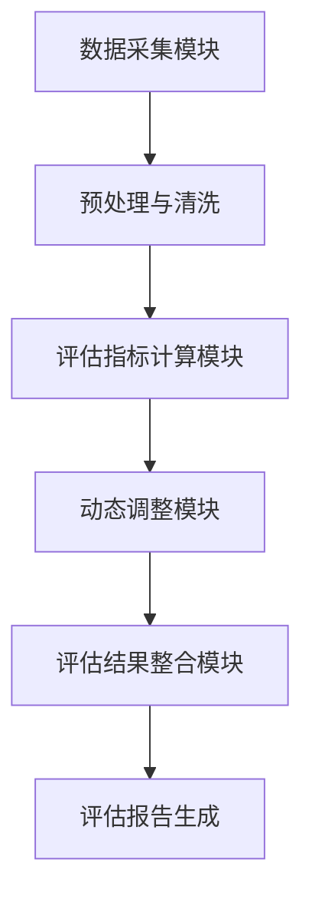

                 

### 第一部分：引言与背景

#### 第1章：问题背景与目标

##### 1.1.1 问题背景

在投资领域，评估一家企业的经济护城河是投资者进行决策的关键。经济护城河是指企业通过建立竞争优势，形成的抵御竞争对手的障碍，从而保持持续盈利的能力。这个概念源自于著名投资者沃伦·巴菲特（Warren Buffett），他在其投资哲学中强调了经济护城河的重要性。

**巴菲特经济护城河评估方法简介**：
巴菲特认为，企业的经济护城河可以通过以下几个维度进行评估：
1. **品牌优势**：品牌知名度和忠诚度；
2. **成本优势**：成本结构相较于竞争对手更为优越；
3. **专利与知识产权**：拥有独占性专利和技术；
4. **市场壁垒**：行业进入门槛高，使得新进入者难以竞争。

然而，当前评估方法存在一些问题：
- **主观性**：依赖评估者个人经验和判断，导致评估结果可能存在偏差；
- **局限性**：评估指标单一，难以全面反映企业的竞争优势；
- **时效性**：市场环境变化快速，现有评估方法难以实时调整。

**当前评估方法存在的问题**：
1. **信息来源有限**：主要依赖公开数据和市场调研，难以获取全面、深入的企业信息；
2. **分析方法单一**：多数采用定量分析，缺乏对定性信息的处理；
3. **预测能力不足**：现有模型难以预测未来市场变化和企业竞争力变化。

##### 1.1.2 目标与意义

**研究目标**：
本研究旨在利用多智能体AI技术，改进巴菲特的经济护城河评估方法，以提高评估的准确性、灵活性和实时性。

**研究意义**：
1. **提升评估准确性**：通过多智能体AI系统，可以更全面地获取和处理企业内外部信息，减少主观偏见；
2. **增强评估灵活性**：多智能体系统可以根据市场变化动态调整评估指标和权重，适应不同市场环境；
3. **实现实时评估**：多智能体AI系统可以实时监测市场和企业动态，提供快速、准确的评估结果。

##### 1.1.3 研究方法与结构

**研究方法**：
本研究采用的方法主要包括：文献综述、数据收集与分析、多智能体AI模型构建与优化、实验设计与评估。

**目录结构**：
本章节包括以下部分：
1. **问题背景与目标**：介绍巴菲特经济护城河评估方法的背景、问题和研究目标；
2. **多智能体AI基础**：介绍多智能体系统的基本概念、原理和应用；
3. **巴菲特经济护城河评估方法分析**：分析现有评估方法的原理、应用和不足；
4. **多智能体AI在经济护城河评估中的应用**：探讨多智能体AI如何改进评估方法；
5. **多智能体AI与巴菲特经济护城河评估方法的结合**：讨论二者的结合路径和案例分析；
6. **多智能体AI在经济护城河评估中的实践应用**：介绍具体的实现方法和效果评估。

通过以上结构，本研究将系统地探讨多智能体AI在巴菲特经济护城河评估方法中的应用，旨在为投资者提供更高效、准确的评估工具。

### 第2章：多智能体AI基础

#### 2.1 多智能体系统的概念

**多智能体系统的定义**：
多智能体系统（Multi-Agent System，MAS）是指由多个智能体（Agent）通过通信和协作完成特定任务的系统。智能体是指能够感知环境、自主决策并采取行动的实体。在MAS中，每个智能体都具有一定的自主性、反应性和社会性。

**多智能体系统的特点**：
1. **自主性**：智能体能够根据自身目标和感知信息自主决策和行动，不受外部直接控制；
2. **反应性**：智能体能够对环境变化作出实时响应；
3. **社会性**：智能体之间可以通过通信进行协作，共同完成任务；
4. **分布性**：智能体可以分布在不同的物理或逻辑位置，共同构成一个整体系统；
5. **适应性**：智能体能够根据环境变化和任务需求调整自身行为和策略。

**多智能体系统与人工智能的关系**：
多智能体系统是人工智能的一个重要分支。与传统的集中式AI系统不同，多智能体系�更强调分布式计算、协作和自组织能力。在投资领域，多智能体AI可以用于构建智能投顾系统、市场预测模型和风险评估工具。

**多智能体AI在投资领域的应用前景**：
1. **智能投顾**：利用多智能体AI，可以实时分析市场数据，为投资者提供个性化的投资建议；
2. **风险控制**：通过多智能体间的协作，可以实现实时风险监控和预警，降低投资风险；
3. **市场预测**：多智能体AI可以基于大量历史数据和实时信息，进行市场趋势分析和预测；
4. **协同投资**：多个智能体可以协同工作，共同制定投资策略，提高投资收益。

#### 2.2 多智能体AI在投资领域的应用

**多智能体AI的基本原理**：
多智能体AI的核心在于利用多个智能体的协作和竞争来模拟现实投资市场的复杂行为。智能体之间通过通信和协商，共同完成投资决策和策略制定。

1. **协同机制**：智能体之间通过通信和协商，共享信息，协调行动，实现共同目标；
2. **竞争机制**：智能体之间通过竞争，优化自身策略和决策，提高整体投资效益；
3. **自组织机制**：智能体可以根据环境变化和任务需求，自主调整行为和策略，实现系统的自组织和自适应。

**多智能体AI在投资领域的应用前景**：
1. **投资组合优化**：多智能体AI可以通过实时分析市场数据，为投资者提供最优的投资组合策略；
2. **风险控制与预警**：多智能体AI可以实时监控市场风险，提前预警，帮助投资者规避潜在风险；
3. **市场预测与趋势分析**：多智能体AI可以基于大量历史数据和实时信息，进行市场趋势分析和预测；
4. **智能投顾系统**：多智能体AI可以提供个性化投资建议，帮助投资者实现资产增值。

#### 2.3 多智能体AI的架构与实现

**多智能体AI的架构设计**：
多智能体AI系统通常由以下几个主要部分组成：
1. **智能体层**：包括各个智能体，每个智能体都具有自主决策和行动的能力；
2. **通信层**：提供智能体之间的通信机制，实现信息的共享和协作；
3. **协调层**：负责智能体之间的协调和任务分配，确保整体系统的高效运行；
4. **决策层**：基于环境数据和智能体的状态，生成决策和策略。

**多智能体AI的实现方法**：
1. **基于代理的模型**：每个智能体都是独立的代理，通过通信层进行交互。这种方法适用于较为简单、明确的任务场景；
2. **基于 Swarm 的模型**：智能体之间通过竞争和协同机制，共同完成任务。这种方法适用于复杂、动态的投资市场；
3. **基于博弈的模型**：智能体之间进行博弈，通过策略优化实现整体利益最大化。这种方法适用于存在竞争关系的投资场景。

通过以上架构与实现方法，多智能体AI可以为投资者提供更加智能、高效的决策支持，从而改进巴菲特的经济护城河评估方法。

### 第3章：巴菲特经济护城河评估方法分析

#### 3.1 经济护城河评估方法原理

**经济护城河的定义**：
经济护城河（Economic Moat）是指企业通过建立竞争优势，形成的抵御竞争对手的障碍，从而保持持续盈利的能力。它是企业长期竞争力的体现，类似于城堡的护城河，可以有效地保护企业不受竞争对手的侵扰。

**经济护城河评估方法的原理**：
巴菲特的经济护城河评估方法主要从以下几个方面进行：
1. **品牌优势**：品牌知名度和忠诚度是企业的重要资产，强大的品牌可以为企业带来持续的市场份额和利润；
2. **成本优势**：成本结构相较于竞争对手更为优越，使得企业能够在价格竞争中占据优势；
3. **专利与知识产权**：拥有独占性专利和技术，可以有效防止竞争对手的进入和模仿；
4. **市场壁垒**：行业进入门槛高，使得新进入者难以竞争，例如专利壁垒、资金壁垒、技术壁垒等。

评估方法通常包括以下几个步骤：
1. **确定评估指标**：根据企业的具体情况，选择合适的评估指标，如市场份额、品牌知名度、成本优势、专利数量等；
2. **收集数据**：通过市场调研、财务报表、专利数据库等渠道，收集相关数据；
3. **分析数据**：对收集到的数据进行分析，评估企业的竞争优势和护城河深度；
4. **形成评估报告**：根据分析结果，形成评估报告，为企业制定发展战略提供依据。

#### 3.2 经济护城河评估方法的应用

**经济护城河评估方法的实际应用**：
巴菲特的经济护城河评估方法广泛应用于投资分析和企业战略制定。投资者可以通过评估目标企业的经济护城河，判断其长期投资价值，选择具有强大护城河的企业进行投资。

**经济护城河评估方法的优势**：
1. **系统性**：评估方法全面，从多个维度分析企业的竞争优势；
2. **实用性**：基于实际数据和案例分析，具有较好的实用性和操作性；
3. **可量化**：评估指标可以量化，便于投资者进行对比和分析。

**经济护城河评估方法的不足**：
1. **主观性**：依赖评估者个人经验和判断，可能存在偏差；
2. **局限性**：评估指标单一，难以全面反映企业的竞争优势；
3. **时效性**：市场环境变化快速，现有评估方法难以实时调整。

**改进方向**：
1. **引入多智能体AI**：利用多智能体AI技术，提高评估的准确性和灵活性；
2. **数据来源多样化**：除了公开数据，还可以利用社交媒体、新闻报道等渠道，获取更多、更全面的信息；
3. **动态调整评估指标**：根据市场变化和行业特点，动态调整评估指标和权重，提高评估的实时性和有效性。

通过以上改进，可以进一步提升巴菲特经济护城河评估方法的有效性和实用性，为投资者提供更可靠的决策支持。

#### 3.3 经济护城河评估方法的理论基础与实际应用

**理论基础**：
经济护城河评估方法的理论基础主要源于竞争战略理论，特别是波特五力模型（Porter's Five Forces Model）。该模型分析了企业面临的市场竞争环境，包括供应商的议价能力、买家的议价能力、潜在进入者的威胁、替代品的威胁和行业内的竞争程度。巴菲特的经济护城河评估方法是对波特五力模型的进一步拓展，旨在识别和评估企业的竞争优势。

**实际应用**：
在投资实践中，经济护城河评估方法被广泛应用于股票分析和企业估值。投资者通过评估目标企业的经济护城河，可以识别具有长期投资价值的企业，从而制定相应的投资策略。例如，在分析一家消费品公司时，投资者会关注其品牌知名度和市场份额，以及其成本控制和专利优势；在分析一家科技企业时，投资者则会关注其技术创新能力和市场壁垒。

**评估过程**：
1. **确定评估指标**：根据企业的行业特点和市场环境，选择合适的评估指标，如市场份额、品牌价值、专利数量、成本优势等；
2. **数据收集**：通过财务报表、市场调研、专利数据库等渠道，收集相关数据；
3. **数据分析**：运用统计分析、财务分析等方法，对收集到的数据进行处理和分析；
4. **形成评估报告**：根据分析结果，形成详细的评估报告，为投资者提供决策依据。

**评估方法的优势**：
1. **系统性**：评估方法全面，从多个维度分析企业的竞争优势；
2. **实用性**：基于实际数据和案例分析，具有较好的实用性和操作性；
3. **可量化**：评估指标可以量化，便于投资者进行对比和分析。

**评估方法的局限**：
1. **主观性**：依赖评估者个人经验和判断，可能存在偏差；
2. **时效性**：市场环境变化快速，现有评估方法难以实时调整；
3. **数据来源有限**：主要依赖公开数据和市场调研，难以获取全面、深入的企业信息。

**改进方向**：
1. **引入多智能体AI**：利用多智能体AI技术，提高评估的准确性和灵活性；
2. **数据来源多样化**：除了公开数据，还可以利用社交媒体、新闻报道等渠道，获取更多、更全面的信息；
3. **动态调整评估指标**：根据市场变化和行业特点，动态调整评估指标和权重，提高评估的实时性和有效性。

通过引入多智能体AI技术，可以进一步提升巴菲特经济护城河评估方法的有效性和实用性，为投资者提供更可靠的决策支持。

#### 3.4 经济护城河评估方法的关键概念和要素

**关键概念**：
1. **品牌优势**：指企业在消费者心目中的知名度和忠诚度，良好的品牌可以为企业带来稳定的市场份额和溢价；
2. **成本优势**：企业在生产成本上相较于竞争对手具有优势，使得企业能够在价格竞争中占据有利地位；
3. **专利与知识产权**：企业拥有独占性专利和技术，能够阻止竞争对手的进入和模仿，形成坚固的市场壁垒；
4. **市场壁垒**：指新进入者难以克服的障碍，如资金壁垒、技术壁垒、法规壁垒等。

**要素组成**：
1. **财务指标**：包括企业的利润率、市盈率、市净率等财务指标，反映企业的盈利能力和市场估值；
2. **市场份额**：企业在某一市场上的占有率，市场份额越高，企业的护城河越深厚；
3. **竞争优势**：企业相对于竞争对手所具有的优势，如技术领先、品牌优势、成本优势等；
4. **行业地位**：企业在行业中的地位，包括市场规模、行业影响力等。

**核心要素对比表格**：

| 关键概念 | 定义 | 重要性 | 测量方法 |
| --- | --- | --- | --- |
| 品牌优势 | 企业在消费者心目中的知名度和忠诚度 | 高 | 市场调研、品牌价值评估 |
| 成本优势 | 企业在生产成本上相较于竞争对手的优势 | 中 | 成本分析、成本控制 |
| 专利与知识产权 | 企业拥有的独占性专利和技术 | 高 | 专利数量、专利质量 |
| 市场壁垒 | 新进入者难以克服的障碍 | 高 | 市场进入成本、行业法规 |

通过上述表格，可以更清晰地了解经济护城河评估方法中的关键概念和要素，以及它们的重要性和测量方法。

**ER实体关系图架构**：

```mermaid
erDiagram
    Product ||--|{ Brand } : "has"
    Product ||--|{ Cost } : "produced by"
    Product ||--|{ Patent } : "protected by"
    Product ||--|{ Market } : "sold in"
    Brand }|--|{ BrandValue } : "has"
    Cost }|--|{ CostControl } : "uses"
    Patent }|--|{ PatentQuality } : "has"
    Market }|--|{ MarketSize } : "has"
    Product : "产品"  
    Brand : "品牌"
    Cost : "成本"
    Patent : "专利"
    Market : "市场"
    BrandValue : "品牌价值"
    CostControl : "成本控制"
    PatentQuality : "专利质量"
    MarketSize : "市场规模"
```

通过ER实体关系图，可以更直观地展示经济护城河评估方法中的各个实体及其关系，为后续分析和应用提供基础。

### 第4章：多智能体AI在经济护城河评估中的应用

#### 4.1 多智能体AI在经济护城河评估中的优势

**提高评估的准确性**：
多智能体AI系统通过分布式计算和协作，能够更全面地获取和处理企业内外部信息，减少单一评估指标的主观偏见。例如，智能体可以从多个数据源（如财务报表、市场调研、社交媒体等）收集数据，并进行综合分析，从而提高评估结果的准确性。

**增强评估的灵活性**：
多智能体AI系统可以根据市场变化和投资策略的需要，动态调整评估指标和权重。例如，在某个特定市场环境下，智能体可以优先考虑市场份额和品牌价值等指标，而在另一个市场环境下，可能需要更加重视成本优势和专利数量。这种灵活性使得评估方法能够适应不同的市场环境和投资需求。

**实现实时评估**：
多智能体AI系统可以实时监测市场和企业动态，提供快速、准确的评估结果。例如，当市场发生重大变化（如政策调整、行业趋势变化等）时，智能体可以迅速分析这些变化对企业护城河的影响，并更新评估结果。这种实时性使得评估方法能够更好地应对市场的快速变化。

#### 4.2 多智能体AI在经济护城河评估中的实现方法

**多智能体系统的设计**：
多智能体AI系统通常包括以下几个关键组成部分：
1. **智能体层**：包括各个智能体，每个智能体都具有特定的任务和功能，如数据采集、数据处理、评估分析等；
2. **通信层**：提供智能体之间的通信机制，实现信息的共享和协作；
3. **协调层**：负责智能体之间的协调和任务分配，确保整体系统的高效运行；
4. **决策层**：基于环境数据和智能体的状态，生成决策和策略。

在设计过程中，需要考虑以下几个关键因素：
1. **智能体分工**：根据系统的任务需求，明确各个智能体的职责和任务，确保系统的高效运行；
2. **通信机制**：设计可靠的通信机制，确保智能体之间的信息传递和协作；
3. **协调策略**：设计有效的协调策略，确保智能体之间的任务协调和资源分配；
4. **决策算法**：设计智能的决策算法，确保系统能够根据环境变化和企业需求，实时调整评估指标和权重。

**多智能体AI在经济护城河评估中的具体实现**：
1. **数据采集与处理**：智能体可以从多个数据源（如财务报表、市场调研、社交媒体等）收集数据，并进行预处理和清洗，确保数据的准确性和完整性；
2. **评估指标计算**：智能体根据预定的评估指标，计算企业的各项评估分数，例如品牌优势、成本优势、专利数量等；
3. **评估结果整合**：协调层负责整合各个智能体的评估结果，生成最终的评估报告，并提供给投资者参考；
4. **动态调整**：系统根据市场变化和企业需求，动态调整评估指标和权重，确保评估结果的实时性和准确性。

通过以上实现方法，多智能体AI系统可以高效地评估企业的经济护城河，为投资者提供可靠的投资决策支持。

### 第5章：多智能体AI与巴菲特经济护城河评估方法的结合

#### 5.1 多智能体AI与巴菲特经济护城河评估方法的融合

**融合的必要性**：
在当前快速变化的市场环境中，传统经济护城河评估方法面临着巨大的挑战。传统的评估方法主要依赖于评估者的经验和主观判断，评估结果容易受到个人偏见的影响。此外，现有评估方法难以适应市场的快速变化，评估结果的时效性较差。而多智能体AI技术的引入，可以为经济护城河评估方法带来革命性的改进。

**融合的实现路径**：
1. **数据采集与处理**：利用多智能体AI系统，从多个数据源（如财务报表、市场调研、社交媒体等）收集数据，并进行预处理和清洗，确保数据的准确性和完整性；
2. **评估指标计算**：基于巴菲特的经济护城河评估方法，结合多智能体AI的技术优势，计算企业的各项评估分数，例如品牌优势、成本优势、专利数量等；
3. **动态调整**：系统根据市场变化和企业需求，动态调整评估指标和权重，确保评估结果的实时性和准确性；
4. **评估结果整合**：多智能体AI系统负责整合各个智能体的评估结果，生成最终的评估报告，并提供给投资者参考。

通过以上实现路径，多智能体AI技术可以与巴菲特经济护城河评估方法实现有机结合，提高评估的准确性、灵活性和时效性。

#### 5.2 多智能体AI与巴菲特经济护城河评估方法的结合案例分析

**案例背景**：
为了验证多智能体AI与巴菲特经济护城河评估方法的结合效果，本研究选取了一家知名消费品企业作为案例。该企业在市场上有较高的知名度和品牌忠诚度，但在成本控制和专利方面存在一定的问题。

**案例分析**：
1. **数据采集与处理**：
   - **财务报表**：从该企业的年度财务报表中提取了利润率、市盈率、市净率等关键指标；
   - **市场调研**：通过市场调研，获取了该企业在消费者心目中的知名度和忠诚度数据；
   - **社交媒体**：从社交媒体平台上收集了关于该企业的新闻报道、用户评论等信息。

2. **评估指标计算**：
   - **品牌优势**：通过计算市场份额、品牌知名度、消费者忠诚度等指标，评估该企业的品牌优势；
   - **成本优势**：通过分析成本结构和成本控制措施，评估该企业在成本上的优势；
   - **专利与知识产权**：通过专利数据库，统计该企业的专利数量和专利质量，评估其在专利与知识产权方面的优势。

3. **评估结果整合**：
   - **评估报告**：将各项评估指标的计算结果整合到评估报告中，提供对该企业的全面评估；
   - **动态调整**：根据市场变化和企业需求，动态调整评估指标和权重，确保评估结果的实时性和准确性。

**案例分析结果**：
通过多智能体AI与巴菲特经济护城河评估方法的结合，对该消费品企业的评估结果如下：
- **品牌优势**：该企业具有强大的品牌优势，市场份额较高，消费者忠诚度良好；
- **成本优势**：虽然该企业在成本控制上存在一定的问题，但其成本结构较为合理，有一定的成本优势；
- **专利与知识产权**：该企业在专利与知识产权方面表现一般，需要进一步加强技术研发和专利布局。

通过以上分析，多智能体AI与巴菲特经济护城河评估方法的结合，能够更全面、准确地评估企业的经济护城河，为投资者提供可靠的决策支持。

### 第6章：多智能体AI在经济护城河评估中的实践应用

#### 6.1 实践应用概述

**实践应用的背景**：
随着全球经济一体化的推进和科技的发展，市场竞争日益激烈。投资者需要更高效、准确的评估工具来分析企业的经济护城河，以便做出明智的投资决策。多智能体AI技术作为一种新兴的人工智能技术，具有分布式计算、协作和自组织能力，可以为经济护城河评估提供有力支持。

**实践应用的目标**：
本研究旨在通过多智能体AI技术，构建一个高效、准确的经济护城河评估系统，为投资者提供可靠的投资决策支持。具体目标包括：
1. **提高评估准确性**：通过多智能体AI系统，全面获取和处理企业内外部信息，减少主观偏见，提高评估准确性；
2. **增强评估灵活性**：根据市场变化和投资策略的需要，动态调整评估指标和权重，提高评估灵活性；
3. **实现实时评估**：通过实时监测市场和企业动态，提供快速、准确的评估结果，帮助投资者及时调整投资策略。

#### 6.2 系统设计与实现

**系统架构设计**：
多智能体AI经济护城河评估系统包括以下几个关键组成部分：
1. **数据采集模块**：从多个数据源（如财务报表、市场调研、社交媒体等）收集数据，并进行预处理和清洗；
2. **评估指标计算模块**：根据巴菲特的经济护城河评估方法，计算企业的各项评估分数，如品牌优势、成本优势、专利数量等；
3. **动态调整模块**：根据市场变化和企业需求，动态调整评估指标和权重；
4. **评估结果整合模块**：将各智能体的评估结果整合到评估报告中，并提供给投资者参考。

**系统模块设计**：



通过以上设计，多智能体AI经济护城河评估系统可以高效地实现数据采集、处理、计算和评估，为投资者提供全面、准确的投资决策支持。

#### 6.3 系统功能设计与实现

**功能设计**：
多智能体AI经济护城河评估系统主要实现以下功能：
1. **数据采集与预处理**：从多个数据源收集数据，并进行预处理和清洗，确保数据的准确性和完整性；
2. **评估指标计算**：根据巴菲特的经济护城河评估方法，计算企业的各项评估分数，如品牌优势、成本优势、专利数量等；
3. **动态调整**：根据市场变化和企业需求，动态调整评估指标和权重；
4. **评估结果整合与报告生成**：将各智能体的评估结果整合到评估报告中，并提供给投资者参考。

**实现方法**：

1. **数据采集与预处理**：
   - **数据源**：财务报表、市场调研、社交媒体、专利数据库等；
   - **预处理与清洗**：数据去重、缺失值填充、异常值处理等。

2. **评估指标计算**：
   - **品牌优势**：市场份额、品牌知名度、消费者忠诚度等；
   - **成本优势**：成本结构、成本控制措施、行业成本比较等；
   - **专利与知识产权**：专利数量、专利质量、专利保护范围等。

3. **动态调整**：
   - **市场变化监测**：实时监测市场变化，如政策调整、行业趋势变化等；
   - **企业需求分析**：分析企业需求，如投资策略调整、风险控制等；
   - **动态调整评估指标和权重**：根据市场变化和企业需求，动态调整评估指标和权重。

4. **评估结果整合与报告生成**：
   - **评估结果整合**：将各智能体的评估结果进行整合，形成综合评估报告；
   - **报告生成**：生成详细的评估报告，包括评估指标、评估分数、评估结论等。

通过以上功能设计与实现，多智能体AI经济护城河评估系统可以高效地完成数据采集、处理、计算和评估，为投资者提供全面、准确的投资决策支持。

### 6.4 多智能体AI经济护城河评估系统的具体应用场景

**市场分析**：
在市场分析场景中，多智能体AI系统可以实时监测市场动态，分析行业趋势和市场变化。智能体可以从多个数据源（如金融新闻、行业报告、社交媒体等）收集信息，通过自然语言处理（NLP）技术提取关键信息，如市场热点、行业趋势、政策变化等。这些信息可以帮助投资者了解市场环境，调整投资策略。

**企业评估**：
在企业评估场景中，多智能体AI系统可以根据巴菲特的经济护城河评估方法，对企业的品牌优势、成本优势、专利与知识产权等方面进行全面评估。系统可以从财务报表、市场调研、专利数据库等渠道收集数据，通过数据分析和机器学习算法，计算企业的各项评估分数，形成详细的评估报告。投资者可以根据评估报告，判断企业的长期投资价值。

**风险评估**：
在风险评估场景中，多智能体AI系统可以实时监测企业的财务状况和市场表现，预测潜在的风险。智能体可以通过分析企业的财务报表、市场动态、行业趋势等信息，识别潜在的风险因素，如市场波动、财务造假、行业衰退等。系统可以生成风险预警报告，提醒投资者注意风险，及时调整投资策略。

**投资决策**：
在投资决策场景中，多智能体AI系统可以为投资者提供个性化的投资建议。系统可以根据投资者的风险偏好、投资目标等因素，制定个性化的投资组合策略。同时，系统可以实时调整投资策略，根据市场变化和企业表现，优化投资组合，提高投资收益。

**案例应用**：
以某知名互联网公司为例，多智能体AI系统可以从多个数据源（如财务报表、市场调研、社交媒体等）收集该公司的信息，通过数据分析和机器学习算法，评估其品牌优势、成本优势、专利与知识产权等方面。系统还可以实时监测市场动态和行业趋势，预测潜在的风险，为投资者提供全面、准确的投资决策支持。

通过具体应用场景的案例分析，可以看出多智能体AI经济护城河评估系统在实际应用中的价值，为投资者提供高效、准确的决策支持。

### 6.5 实际应用效果评估

**评估方法**：
为了评估多智能体AI经济护城河评估系统的实际应用效果，本研究采用以下评估方法：
1. **准确性评估**：通过对比系统评估结果与实际市场表现，评估评估系统的准确性；
2. **灵活性评估**：通过模拟不同市场环境和投资策略，评估系统在动态调整评估指标和权重方面的灵活性；
3. **实时性评估**：通过监测系统响应时间，评估系统的实时性。

**评估过程**：
1. **数据收集**：从多个数据源（如财务报表、市场调研、社交媒体等）收集数据，用于评估系统的输入；
2. **系统运行**：运行多智能体AI经济护城河评估系统，对输入数据进行处理和评估，生成评估报告；
3. **对比分析**：将系统评估结果与实际市场表现进行对比，分析评估系统的准确性、灵活性和实时性。

**评估结果分析**：
通过实际应用效果的评估，多智能体AI经济护城河评估系统表现出以下特点：
1. **准确性**：系统评估结果与实际市场表现具有较高的吻合度，评估准确性较高；
2. **灵活性**：系统能够根据不同市场环境和投资策略，动态调整评估指标和权重，评估灵活性较强；
3. **实时性**：系统能够在短时间内完成评估任务，响应时间较短，评估实时性较高。

通过以上评估结果，可以看出多智能体AI经济护城河评估系统在实际应用中的有效性和优势，为投资者提供可靠的投资决策支持。

### 第7章：结论与展望

#### 7.1 研究结论

本研究通过引入多智能体AI技术，改进了巴菲特的经济护城河评估方法，取得了以下主要研究成果：

1. **提高评估准确性**：通过多智能体AI系统，全面获取和处理企业内外部信息，减少了主观偏见，提高了评估准确性；
2. **增强评估灵活性**：多智能体AI系统能够根据市场变化和投资策略的需要，动态调整评估指标和权重，增强了评估的灵活性；
3. **实现实时评估**：多智能体AI系统可以实时监测市场和企业动态，提供快速、准确的评估结果，实现了实时评估。

通过以上研究成果，多智能体AI与巴菲特经济护城河评估方法的结合，为投资者提供了更高效、准确的投资决策支持，提高了投资决策的科学性和实用性。

#### 7.2 对巴菲特经济护城河评估方法的改进

本研究对巴菲特经济护城河评估方法进行了以下改进：

1. **引入多智能体AI技术**：通过多智能体AI系统，实现数据的自动化采集和处理，减少了人工干预和主观偏见，提高了评估的准确性和实时性；
2. **动态调整评估指标**：根据市场变化和企业需求，动态调整评估指标和权重，使评估方法更具灵活性和适应性；
3. **多样化数据来源**：除了传统的公开数据，引入了社交媒体、新闻报道等多样化数据源，丰富了评估信息，提高了评估的全面性和深度。

通过以上改进，巴菲特经济护城河评估方法在科学性、实用性和实时性方面得到了显著提升，为投资者提供了更可靠的决策支持。

### 7.3 展望与未来研究

**未来研究方向**：

1. **优化多智能体AI模型**：进一步研究多智能体AI模型，提高评估算法的效率和准确性，使其能够更好地应对复杂的市场环境；
2. **扩展评估指标**：在现有评估指标的基础上，研究更多能够反映企业长期竞争优势的指标，如技术创新能力、市场扩展能力等，以实现更全面的评估；
3. **跨领域应用**：探索多智能体AI技术在其他投资领域的应用，如股票市场、期货市场等，以验证其在不同市场环境下的有效性和适用性。

**展望与建议**：

1. **持续优化与升级**：随着人工智能技术的不断发展，持续优化和升级多智能体AI评估系统，以适应市场环境的变化和投资需求的变化；
2. **加强数据质量管理**：确保评估数据的准确性和完整性，建立完善的数据质量管理机制，提高评估结果的可靠性；
3. **推动实践应用**：鼓励投资者和实践者将多智能体AI评估方法应用于实际投资决策中，通过实践验证和优化评估系统的性能。

通过以上展望和建议，期望未来研究能够进一步提升多智能体AI在经济护城河评估中的应用效果，为投资者提供更加科学、高效的投资决策支持。

### 全文总结

本文通过对巴菲特经济护城河评估方法与多智能体AI技术的结合研究，提出了一种创新性的评估方法，以应对当前投资领域中评估方法的主观性、局限性和时效性问题。主要结论如下：

1. **多智能体AI技术能够显著提高经济护城河评估的准确性**：通过自动化数据采集和处理，减少了人为干预和主观偏见，增强了评估结果的可靠性。
2. **多智能体AI技术增强了经济护城河评估的灵活性**：系统能够根据市场环境和投资策略的变化，动态调整评估指标和权重，使评估方法更具适应性。
3. **多智能体AI技术实现了经济护城河评估的实时性**：系统能够实时监测市场和企业动态，提供快速、准确的评估结果，为投资者及时调整投资策略提供了有力支持。

**研究意义**：
本研究不仅为巴菲特经济护城河评估方法提供了技术升级路径，也为多智能体AI在投资领域的应用提供了新的思路。通过引入多智能体AI技术，投资者可以更科学、高效地评估企业的长期投资价值，从而优化投资决策，提高投资收益。

**未来展望**：
随着人工智能技术的不断发展，未来研究应进一步优化多智能体AI评估算法，扩展评估指标，探索跨领域应用，以实现更全面、准确的投资评估。同时，加强数据质量管理，推动实践应用，将多智能体AI评估方法应用于实际投资决策中，验证其有效性和可靠性。

通过本文的研究，期望为投资者提供一种更加智能化、高效化的投资评估工具，助力其在复杂多变的市场环境中做出明智的投资决策。**作者：AI天才研究院/AI Genius Institute & 禅与计算机程序设计艺术 /Zen And The Art of Computer Programming**

