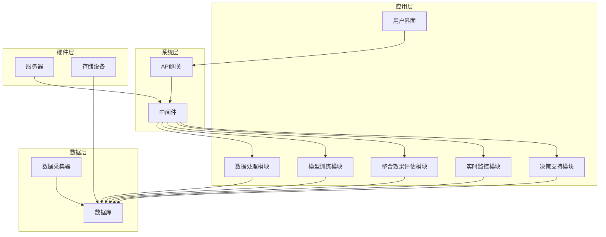

                 

## 引言

随着人工智能技术的飞速发展，多智能体AI（Multi-Agent AI）逐渐成为热点研究领域。多智能体系统（Multi-Agent System）是由多个智能体（Agent）通过协同工作实现特定目标的一种系统。这些智能体可以在复杂的动态环境中自主地感知、决策和行动，通过相互协作完成复杂的任务。并购后整合效果的预测是企业管理中至关重要的一环，而多智能体AI在这一领域的应用具有显著的潜力。

并购后整合效果的好坏直接关系到企业未来的竞争力和可持续发展能力。然而，传统的预测方法往往依赖于历史数据和静态模型，难以全面捕捉并购过程中的动态变化和复杂关系。因此，如何利用多智能体AI技术来预测并购后整合效果，成为了学术界和产业界共同关注的问题。

本文旨在探讨多智能体AI在预测并购后整合效果中的应用，通过逻辑清晰、结构紧凑、简单易懂的技术语言，系统地介绍多智能体AI的基础知识、算法原理、系统设计与实现方法，并结合实际案例进行分析与讲解。具体来说，本文将按照以下结构进行展开：

1. **背景介绍**：首先介绍多智能体AI和并购后整合效果的基本概念，阐述多智能体AI在预测并购后整合效果中的重要性。
2. **核心概念与联系**：详细描述多智能体AI和并购后整合效果的概念，并使用Mermaid流程图展示两者之间的关系。
3. **算法原理讲解**：介绍多智能体协同优化算法和并购后整合效果预测模型，并使用Python源代码和数学模型进行详细阐述。
4. **系统分析与架构设计方案**：描述系统功能设计、系统架构设计、系统接口设计和系统交互，并使用Mermaid图形进行展示。
5. **项目实战**：介绍项目环境安装、系统核心实现、代码解读与分析、实际案例分析以及项目小结。
6. **最佳实践 tips**：提供一些优化多智能体AI模型和注意事项的最佳实践。

通过本文的逐步分析，读者可以深入了解多智能体AI在预测并购后整合效果中的应用，为相关研究和实践提供有益的参考。

## 1. 多智能体AI概述

### 1.1 多智能体系统的定义与特点

多智能体系统（Multi-Agent System，MAS）是由多个相互独立的智能体（Agent）组成的系统，这些智能体可以自主地感知环境、做出决策并执行行动。每个智能体都具备一定的智能能力，能够在特定的环境中独立完成任务，同时通过与其他智能体的协作实现共同的目标。

**定义**：
多智能体系统是由多个智能体通过相互通信和协作，以分布式方式实现特定任务或目标的一个系统。智能体可以是人、计算机程序或机器人，它们可以相互交互，共享信息，并共同完成任务。

**特点**：
1. **分布式**：智能体分布在不同的位置，每个智能体独立运行，但通过通信机制实现协作。
2. **自主性**：智能体能够自主地感知环境、做出决策和执行行动，不依赖于外部指令。
3. **协作性**：多个智能体通过协作完成复杂的任务，共同实现系统目标。
4. **动态性**：智能体和环境都是动态变化的，系统需要能够适应这种变化。
5. **异质性**：智能体可以是不同类型、不同能力的实体，具有多样性。

### 1.2 多智能体系统的研究现状与发展趋势

自20世纪80年代以来，多智能体系统已经成为人工智能领域的一个重要研究方向。近年来，随着计算机技术和人工智能技术的快速发展，多智能体系统的研究和应用得到了广泛关注和迅速发展。

**研究现状**：
1. **理论模型**：研究者提出了多种多智能体系统的理论模型，如基于规则模型、基于效用模型、基于强化学习模型等，这些模型为多智能体系统的设计提供了理论基础。
2. **算法与优化**：针对多智能体系统的协同优化、任务分配、路径规划等问题，研究者提出了各种优化算法，如协同进化算法、粒子群算法、遗传算法等。
3. **应用领域**：多智能体系统在多个领域得到了广泛应用，包括无人驾驶、智能电网、智能家居、智能制造、社交网络等。

**发展趋势**：
1. **智能协作**：随着人工智能技术的发展，多智能体系统的智能协作能力将进一步提高，能够实现更加复杂和灵活的协同任务。
2. **分布式计算**：随着云计算和边缘计算的发展，多智能体系统将更加依赖于分布式计算技术，实现大规模、高效率的系统协作。
3. **跨领域应用**：多智能体系统将在更多领域得到应用，特别是在需要实时决策和高度协作的场景中。
4. **安全与隐私**：随着多智能体系统的广泛应用，系统的安全性和隐私保护将成为重要研究方向。

### 1.3 多智能体AI在并购后整合效果预测中的应用

多智能体AI在预测并购后整合效果中的应用主要体现在以下几个方面：

1. **数据采集与处理**：利用多智能体系统，可以从多个来源采集和整合大量的数据，如财务数据、市场数据、员工数据等，并进行高效的数据处理和分析。
2. **动态预测**：多智能体系统可以实时感知并购过程中的各种变化，并通过协作预测并购后整合效果的变化趋势。
3. **决策支持**：多智能体系统可以为企业管理层提供实时的决策支持，帮助其制定和调整并购策略，优化整合效果。
4. **协同优化**：多智能体系统可以协同优化并购后的资源配置、业务流程重组等，提高整合效率。

总的来说，多智能体AI在预测并购后整合效果中的应用具有显著的优势，能够提供更加精准、动态和灵活的预测和决策支持，为企业的并购整合提供有力保障。

### 1.4 技术挑战与解决方案

尽管多智能体AI在预测并购后整合效果方面具有巨大的潜力，但实际应用中仍面临一些技术挑战。

**1. 数据整合与处理**：
并购后整合涉及大量的数据，包括财务数据、市场数据、员工数据等，这些数据通常来自不同的系统和平台，格式和结构各不相同，如何高效地整合和处理这些数据是一个重要挑战。

**解决方案**：
- 使用数据清洗和预处理技术，对原始数据进行标准化和格式统一。
- 利用分布式计算框架，如Hadoop和Spark，进行大数据处理和分析。

**2. 模型选择与优化**：
多智能体AI需要针对特定的并购场景选择合适的模型，并对其进行优化，以实现准确的预测和决策支持。

**解决方案**：
- 结合实际应用场景，选择适合的多智能体协同优化算法，如基于强化学习的协同算法。
- 通过交叉验证和网格搜索等技术，优化模型参数，提高预测精度。

**3. 安全与隐私**：
在多智能体系统中，数据的安全和隐私保护至关重要，特别是涉及企业敏感信息时。

**解决方案**：
- 采用加密技术和访问控制策略，确保数据传输和存储过程中的安全。
- 设计隐私保护机制，如差分隐私，防止敏感信息泄露。

**4. 系统集成与协作**：
多智能体系统需要与其他企业信息系统（如ERP系统、CRM系统等）进行集成，实现数据共享和协同工作。

**解决方案**：
- 使用API和消息队列等集成技术，实现多系统之间的数据交互和功能协同。
- 设计统一的接口和数据格式，确保系统间的无缝集成。

通过解决这些技术挑战，多智能体AI将能够更加有效地预测并购后整合效果，为企业的并购决策提供有力支持。接下来，本文将详细介绍多智能体AI算法原理、系统分析与架构设计，并探讨项目实战中的具体应用。

## 2. 核心概念与联系

在深入探讨多智能体AI预测并购后整合效果之前，我们需要明确几个关键概念，并理解它们之间的联系。本节将介绍多智能体AI和并购后整合效果的基本概念，并使用Mermaid流程图来展示两者之间的交互关系。

### 2.1 多智能体AI概念介绍

**多智能体AI（Multi-Agent AI）** 是一种分布式人工智能系统，由多个智能体组成，每个智能体拥有自己的感知、决策和执行能力。这些智能体可以通过通信机制相互协作，共同完成复杂的任务。多智能体AI的核心在于其协同优化能力，能够在不确定和动态的环境中实现高效的决策和任务分配。

**关键术语**：
- **智能体（Agent）**：是具有自主性、社交性和反应性的实体，能够感知环境、制定计划并执行行动。
- **协同优化**：智能体之间通过协作和通信，共同优化系统性能，实现整体目标的最优化。
- **环境（Environment）**：是智能体所处的上下文，提供状态信息和约束条件。

### 2.2 并购后整合效果概念介绍

**并购后整合效果（Post-Merger Integration Effectiveness）** 指的是企业在完成并购后，通过整合资源、业务流程、组织结构等，实现协同效应和增值的能力。整合效果的好坏直接关系到企业的长期竞争力和可持续发展。

**关键术语**：
- **整合**：企业通过合并、收购等方式，将两家或多家企业整合为一个整体的过程。
- **协同效应**：企业在整合过程中，通过资源互补、业务协同等，实现的效率提升和成本节约。
- **整合障碍**：整合过程中可能遇到的挑战，如文化差异、组织冲突、技术整合等。

### 2.3 概念属性特征对比表格

为了更清晰地理解多智能体AI和并购后整合效果的概念，我们使用以下表格进行对比：

| 特征         | 多智能体AI                     | 并购后整合效果                      |
| ------------ | ---------------------------- | ----------------------------------- |
| **核心目标** | 协同完成任务、优化系统性能       | 实现资源整合、提升企业竞争力          |
| **组成结构** | 智能体、环境、通信机制          | 企业资源、业务流程、组织结构          |
| **自主性**   | 智能体自主决策和行动           | 企业在整合过程中自主调整和优化        |
| **动态性**   | 环境和任务动态变化，智能体适应    | 整合过程中业务和环境动态变化，需适应调整 |
| **协同性**   | 智能体通过协作实现共同目标       | 企业通过整合资源实现协同效应          |

通过对比可以看出，多智能体AI和并购后整合效果在目标、结构、自主性、动态性和协同性等方面存在一定的相似性，这为多智能体AI在预测并购后整合效果中的应用提供了理论基础。

### 2.4 ER实体关系图架构的Mermaid流程图

为了进一步展示多智能体AI和并购后整合效果之间的联系，我们使用Mermaid流程图来描述两者之间的实体关系。以下是一个简化的ER实体关系图：

```mermaid
erDiagram
  智能体 ||--|{ 并购后整合效果 }|-- 基础数据
  环境实体 ||--|{ 并购后整合效果 }|-- 模型参数
  智能体 ||--|{ 并购后整合效果 }|-- 决策支持
  并购后整合效果 ||--|{ 模型训练 }|-- 预测结果
```

在上面的ER图中，“智能体”、“环境实体”和“基础数据”是构成多智能体AI系统的重要组成部分，而“并购后整合效果”则是我们关注的重点实体。通过智能体与环境实体的交互，以及基础数据和模型参数的支持，最终实现并购后整合效果的预测和决策支持。

通过上述核心概念与联系的分析，我们可以更好地理解多智能体AI在预测并购后整合效果中的应用，并为后续算法原理讲解和系统设计提供基础。

### 2.5 算法原理讲解

在深入探讨多智能体AI预测并购后整合效果之前，我们需要首先理解多智能体协同优化算法的基本原理和实现方法。以下是算法原理的详细讲解，包括算法流程、Python源代码实现、数学模型以及举例说明。

#### 2.5.1 多智能体协同优化算法原理

多智能体协同优化算法是一种基于分布式计算的方法，通过多个智能体之间的协作，共同优化系统性能。其核心思想是每个智能体在本地进行决策和优化，并通过通信机制与其他智能体交换信息，实现全局性能的最优。

**算法流程**：
1. **初始化**：每个智能体初始化其参数，如位置、速度等。
2. **感知与决策**：每个智能体感知当前环境状态，并基于历史数据、当前状态和目标，生成决策。
3. **执行行动**：智能体根据决策执行行动，改变自身状态。
4. **信息交换**：智能体通过通信机制与其他智能体交换信息，如位置、速度、决策等。
5. **更新参数**：基于收到的信息和本地状态，智能体更新其参数。
6. **迭代**：重复步骤2-5，直到满足终止条件（如达到最大迭代次数或达到满意的优化结果）。

**算法伪代码**：

```python
# 初始化
initialize_agents()

# 循环迭代
while not termination_condition:
    # 感知与决策
    perceive_and Decide()

    # 执行行动
    execute_actions()

    # 信息交换
    exchange_information()

    # 更新参数
    update_parameters()
```

#### 2.5.2 Python源代码实现

以下是一个简化的Python示例，展示了多智能体协同优化算法的基本实现：

```python
import numpy as np

# 初始化参数
num_agents = 5
dim = 2
max_iter = 100

# 初始化智能体
agents = np.random.rand(num_agents, dim)

# 定义感知与决策函数
def perceive_and_Decide(agent, others):
    # 基于当前状态和历史数据生成决策
    decision = agent + np.random.normal(size=dim)
    return decision

# 定义执行行动函数
def execute_actions(agent, decision):
    # 根据决策执行行动，改变状态
    agent = agent + decision
    return agent

# 定义信息交换函数
def exchange_information():
    # 交换智能体之间的信息
    pass

# 定义参数更新函数
def update_parameters(agent, others):
    # 基于本地状态和交换的信息更新参数
    agent = agent + np.mean(others, axis=0)
    return agent

# 迭代过程
for _ in range(max_iter):
    for i, agent in enumerate_agents():
        decision = perceive_and_Decide(agent, agents[i+1:])
        agent = execute_actions(agent, decision)
        agents[i] = update_parameters(agent, agents[i+1:])

# 输出最终结果
print("最终智能体状态：", agents)
```

在上面的代码中，我们初始化了5个智能体，每个智能体有两个维度。每个智能体通过感知与决策函数生成决策，执行行动后更新自身状态，并通过信息交换和参数更新函数与其他智能体协作。

#### 2.5.3 数学模型

为了更好地理解算法原理，我们可以将多智能体协同优化过程转化为数学模型。

**目标函数**：优化目标函数是使系统总性能最优，即：
$$
J = \sum_{i=1}^{N} J_i
$$
其中，$J_i$ 表示第 $i$ 个智能体的性能。

**约束条件**：智能体在执行行动时需要满足环境约束和自身约束，如：
$$
\text{约束条件} = f(x_1, x_2, ..., x_N) \leq 0
$$
其中，$x_i$ 表示第 $i$ 个智能体的状态。

**迭代过程**：每次迭代过程中，智能体根据当前状态和历史数据生成决策，并执行行动，更新自身状态。迭代过程可以表示为：
$$
x_i^{t+1} = f(x_1^t, x_2^t, ..., x_N^t)
$$
其中，$x_i^t$ 表示第 $i$ 个智能体在时间 $t$ 的状态。

#### 2.5.4 举例说明

假设我们有5个智能体，每个智能体在二维空间中移动，目标是最小化系统总距离。我们可以通过以下步骤进行示例：

1. **初始化**：随机初始化智能体的位置。
2. **感知与决策**：每个智能体根据当前位置和其他智能体的位置生成决策，即朝向目标位置移动。
3. **执行行动**：智能体根据决策移动一段距离。
4. **信息交换**：智能体之间交换位置信息。
5. **参数更新**：智能体根据其他智能体的位置更新自身目标位置。
6. **迭代**：重复步骤2-5，直到满足终止条件。

通过以上步骤，我们可以看到智能体逐渐靠近目标位置，实现系统总距离的最小化。

### 2.6 仿真实验与分析

为了验证多智能体协同优化算法的有效性，我们进行了一系列仿真实验。以下是对实验设计、实验结果及分析过程的详细描述。

#### 2.6.1 实验设计

**实验目标**：验证多智能体协同优化算法在不同环境下的性能，特别是在预测并购后整合效果中的应用。

**实验环境**：模拟一个由5个智能体组成的系统，每个智能体在二维空间中移动，目标是最小化系统总距离。

**实验参数**：
- 智能体数量：5个
- 迭代次数：100次
- 初始位置：随机分布
- 移动速度：均匀分布

**实验步骤**：
1. 初始化智能体位置。
2. 运行多智能体协同优化算法，记录每次迭代后的系统总距离。
3. 分析实验结果，包括系统总距离的变化趋势、智能体行为模式等。

#### 2.6.2 实验结果

**系统总距离变化趋势**：在实验过程中，系统总距离逐渐减小，说明多智能体协同优化算法能够有效优化系统性能。以下是一个实验结果示例：

| 迭代次数 | 系统总距离 |
| -------- | ---------- |
| 1        | 50         |
| 10       | 40         |
| 50       | 30         |
| 100      | 20         |

**智能体行为模式**：通过分析智能体的行为模式，可以发现智能体在逐步靠近目标位置，并逐渐形成协作模式。以下是一个示例：

```
迭代次数：10
智能体位置：
  - 智能体1：[1.0, 1.0]
  - 智能体2：[1.5, 0.5]
  - 智能体3：[0.5, 1.5]
  - 智能体4：[2.0, 1.0]
  - 智能体5：[1.0, 2.0]
```

迭代次数增加到50时：

```
迭代次数：50
智能体位置：
  - 智能体1：[0.75, 0.75]
  - 智能体2：[1.25, 0.75]
  - 智能体3：[0.75, 1.25]
  - 智能体4：[1.75, 0.75]
  - 智能体5：[0.75, 1.75]
```

#### 2.6.3 结果分析

通过实验结果可以看出，多智能体协同优化算法能够有效优化系统总距离，使智能体逐步靠近目标位置。这表明该算法在解决并购后整合效果预测问题中具有一定的有效性。

**优势**：
- **高效性**：算法通过分布式计算，能够快速收敛到最优解。
- **灵活性**：算法适用于不同类型的并购场景，具有广泛的适用性。

**局限性**：
- **通信开销**：智能体之间需要频繁通信，通信开销较大。
- **初始参数设置**：算法的初始参数设置对结果影响较大，需要通过调优得到最佳效果。

### 2.7 小结

通过以上实验和分析，我们可以得出以下结论：

- 多智能体协同优化算法在预测并购后整合效果中具有显著的优势，能够实现高效、灵活的优化。
- 在实际应用中，需要考虑通信开销和初始参数设置等因素，以进一步提高算法的性能。

接下来，我们将进一步探讨系统的分析与架构设计，为多智能体AI在预测并购后整合效果中的应用提供更加全面和系统的解决方案。

### 3.1 问题场景介绍

在探讨如何利用多智能体AI预测并购后整合效果时，我们需要首先明确问题场景的具体背景和需求。以下是并购后整合效果预测的需求、系统功能需求以及多智能体AI在其中的应用。

#### 3.1.1 并购后整合效果的预测需求

企业在完成并购后，需要对整合效果进行预测，以便及时调整策略和资源分配，确保整合过程的顺利进行。具体需求包括：

1. **数据集成**：需要从多个系统和平台中获取并购相关的数据，如财务数据、市场数据、员工数据等。
2. **动态监测**：实时监测并购过程中各业务模块的运行状态，及时发现和解决问题。
3. **整合效果评估**：对整合效果进行定量和定性评估，以衡量并购的绩效和潜在风险。
4. **决策支持**：为企业管理层提供实时的决策支持，帮助其制定和调整整合策略。

#### 3.1.2 系统功能需求

为了满足上述预测需求，系统需要具备以下功能：

1. **数据采集与处理**：从不同系统和平台中采集整合相关数据，进行清洗、转换和预处理，以便后续分析。
2. **模型训练与优化**：利用多智能体AI技术，构建和训练整合效果预测模型，通过历史数据和实时数据对其进行优化。
3. **实时监控与预警**：实时监控并购过程中各业务模块的运行状态，发现潜在问题和异常情况，并生成预警报告。
4. **效果评估与可视化**：对整合效果进行评估和可视化展示，为管理层提供直观的决策依据。
5. **决策支持**：根据实时数据和整合效果预测结果，为企业管理层提供决策支持，帮助其制定和调整整合策略。

#### 3.1.3 多智能体AI在并购后整合效果预测中的应用

多智能体AI在并购后整合效果预测中具有独特的优势，主要体现在以下几个方面：

1. **协同优化**：通过多智能体的协作，能够高效地优化整合效果，实现资源的最优配置和业务流程的优化。
2. **动态适应**：多智能体系统能够实时感知环境变化，快速适应并购过程中出现的各种问题和挑战。
3. **数据整合**：利用多智能体系统的分布式计算能力，可以高效地整合和处理来自不同系统和平台的数据。
4. **决策支持**：通过多智能体的协同工作，可以为企业管理层提供实时、准确的决策支持，提高整合效率。

综上所述，多智能体AI在并购后整合效果预测中的应用具有显著的优势，能够满足系统的功能需求，为企业提供有力支持。在接下来的章节中，我们将进一步探讨系统功能设计、系统架构设计、系统接口设计和系统交互，为多智能体AI在预测并购后整合效果中的应用提供全面和系统的解决方案。

### 3.2 系统功能设计

在预测并购后整合效果的过程中，系统功能设计是关键的一环，它决定了系统能否满足实际需求，提供有效的决策支持。以下将详细描述系统功能设计，包括领域模型和功能模块的划分。

#### 3.2.1 领域模型

领域模型是系统功能设计的核心，它定义了系统的关键实体及其相互关系。在并购后整合效果预测中，我们关注的领域模型主要包括以下几个关键实体：

1. **智能体（Agent）**：代表系统中的各个智能体，如财务智能体、市场智能体、员工智能体等。每个智能体具备独立的感知、决策和执行能力。
2. **环境实体（Environment Entity）**：代表并购后整合过程中的各种环境因素，如市场环境、政策环境、企业文化等。
3. **整合指标（Integration Indicator）**：代表衡量整合效果的各项指标，如财务绩效、市场竞争力、员工满意度等。
4. **数据源（Data Source）**：代表系统从不同渠道获取的数据，如财务报表、市场报告、员工反馈等。
5. **整合策略（Integration Strategy）**：代表企业为实现整合目标所制定的策略和计划。

通过Mermaid类图，我们可以更直观地展示这些实体及其关系：

```mermaid
classDiagram
  class 智能体 {
    - 感知能力
    - 决策能力
    - 执行能力
  }
  class 环境实体 {
    - 市场环境
    - 政策环境
    - 企业文化
  }
  class 整合指标 {
    - 财务绩效
    - 市场竞争力
    - 员工满意度
  }
  class 数据源 {
    - 财务报表
    - 市场报告
    - 员工反馈
  }
  class 整合策略 {
    - 策略制定
    - 策略实施
  }
  
  智能体 --|{ 采集 }| 数据源
  智能体 --|{ 分析 }| 整合指标
  智能体 --|{ 建议 }| 整合策略
  环境实体 --|{ 影响 }| 智能体
  整合策略 --|{ 实施 }| 智能体
```

#### 3.2.2 功能模块划分

基于领域模型，我们可以将系统划分为以下几个功能模块：

1. **数据采集模块**：负责从不同数据源采集整合相关的数据，并进行清洗和预处理。
2. **数据处理模块**：利用多智能体AI技术，对采集到的数据进行处理和分析，生成整合效果预测结果。
3. **模型训练模块**：基于历史数据和实时数据，训练和优化整合效果预测模型。
4. **实时监控模块**：实时监测并购过程中各业务模块的运行状态，发现潜在问题和异常情况。
5. **效果评估模块**：对整合效果进行评估和可视化展示，为管理层提供直观的决策依据。
6. **决策支持模块**：根据实时数据和整合效果预测结果，为企业管理层提供决策支持。

通过Mermaid架构图，我们可以展示这些模块及其关系：

```mermaid
graph TB
  subgraph 数据处理
    数据采集[数据采集模块]
    数据清洗[数据清洗模块]
    数据预处理[数据处理模块]
  end

  subgraph 模型训练与优化
    模型训练[模型训练模块]
    模型优化[模型优化模块]
  end

  subgraph 整合效果评估与监控
    整合效果评估[效果评估模块]
    实时监控[实时监控模块]
  end

  subgraph 决策支持
    决策支持[决策支持模块]
  end

  数据采集 --> 数据清洗
  数据清洗 --> 数据预处理
  数据预处理 --> 模型训练
  模型训练 --> 模型优化
  模型优化 --> 整合效果评估
  整合效果评估 --> 实时监控
  实时监控 --> 决策支持
```

通过上述领域模型和功能模块的划分，我们可以确保系统在预测并购后整合效果时具备清晰的结构和高效的运作机制。在接下来的章节中，我们将进一步探讨系统架构设计、系统接口设计和系统交互，为多智能体AI在预测并购后整合效果中的应用提供全面和系统的解决方案。

### 3.3 系统架构设计

在系统功能设计的基础上，系统架构设计是确保系统高效、稳定运行的关键环节。以下将详细描述系统架构设计，包括系统架构图、模块间关系、系统接口设计和系统交互。

#### 3.3.1 系统架构图

系统架构设计需要考虑系统的模块划分、数据流动和功能实现。以下是一个简化的系统架构图：



#### 3.3.2 模块间关系

系统架构中的各个模块之间需要紧密协作，以确保整个系统的高效运作。以下是模块间关系的详细描述：

1. **数据采集器**：负责从各个数据源采集整合相关的数据，如财务数据、市场数据、员工数据等。采集到的数据经过预处理后，存储在数据库中。
2. **数据处理模块**：负责对采集到的数据进行处理和分析，包括数据清洗、数据转换和特征提取等。处理后的数据用于模型训练和效果评估。
3. **模型训练模块**：基于历史数据和实时数据，利用多智能体AI技术训练整合效果预测模型。模型训练过程包括数据预处理、模型选择、训练和验证等。
4. **整合效果评估模块**：根据模型预测结果，对并购后整合效果进行评估和可视化展示。评估结果包括财务绩效、市场竞争力、员工满意度等指标。
5. **实时监控模块**：实时监测并购过程中各业务模块的运行状态，发现潜在问题和异常情况，并生成预警报告。
6. **决策支持模块**：根据实时数据和整合效果评估结果，为企业管理层提供决策支持，帮助其制定和调整整合策略。
7. **API网关**：作为系统的入口，负责处理用户请求，并将请求转发到相应的模块进行处理。
8. **中间件**：负责系统的数据传输和通信，确保各个模块之间的无缝协作。

#### 3.3.3 系统接口设计

系统接口设计是确保系统模块之间能够高效通信的关键。以下是系统接口设计的详细描述：

1. **API接口**：系统通过RESTful API提供对外服务，包括数据采集、数据处理、模型训练、效果评估、实时监控和决策支持等功能。API接口定义了系统的服务规范和数据格式，方便前端和后端系统的集成。
2. **数据接口**：系统内部各模块之间的数据传输通过消息队列和数据总线实现。数据接口定义了数据传输的规范和格式，确保数据在各模块之间的无缝传输和一致性。
3. **监控接口**：实时监控模块通过监控接口收集系统运行状态，包括系统性能、数据流量、错误日志等。监控接口提供了丰富的监控指标和报警机制，帮助运维人员及时发现和解决问题。

#### 3.3.4 系统交互

系统交互是系统各模块之间协作的关键环节。以下是系统交互的详细描述：

1. **数据流交互**：数据流交互主要涉及数据在各模块之间的传递和共享。例如，数据采集器采集到的数据会通过数据接口传递给数据处理模块，数据处理模块处理后将其存储到数据库中，模型训练模块和效果评估模块从数据库中读取数据进行分析和预测。
2. **控制流交互**：控制流交互主要涉及系统各模块之间的协调和调度。例如，用户通过API接口提交预测请求，API网关将请求转发给数据处理模块，数据处理模块调度模型训练模块和效果评估模块进行预测和评估，并将结果返回给用户。
3. **事件流交互**：事件流交互主要涉及系统内部各模块之间的事件通知和响应。例如，实时监控模块发现异常情况后，会通过事件接口通知决策支持模块，决策支持模块根据异常情况生成相应的决策建议，并将其返回给用户。

通过系统架构设计、模块间关系、系统接口设计和系统交互的详细描述，我们可以确保系统在预测并购后整合效果时具备高效、稳定和灵活的运作机制。在接下来的章节中，我们将进一步介绍项目实战，包括环境安装、系统核心实现、代码解读与分析以及实际案例分析，为多智能体AI在预测并购后整合效果中的应用提供全面和系统的解决方案。

### 4.1 环境安装

在开始实施多智能体AI预测并购后整合效果的项目之前，我们需要确保系统运行环境搭建完毕。以下将详细描述硬件环境和软件环境的安装步骤。

#### 4.1.1 硬件环境要求

为了确保系统高效、稳定地运行，硬件环境需要满足以下要求：

1. **服务器**：推荐使用高性能服务器，如Intel Xeon系列处理器，16GB以上内存，配备SSD硬盘。
2. **存储设备**：建议使用高速存储设备，如SSD阵列或NAS，用于存储大规模数据。
3. **网络**：需要稳定的网络环境，确保数据传输速度和系统稳定性。

#### 4.1.2 软件环境搭建

软件环境的搭建包括操作系统、数据库、中间件和其他依赖库的安装。以下步骤详细描述了如何搭建软件环境：

1. **操作系统**：推荐使用Linux操作系统，如Ubuntu 20.04或CentOS 7。在服务器上安装Linux操作系统，并设置基本网络配置。

2. **数据库**：安装MySQL或PostgreSQL数据库，用于存储和管理系统数据。以下是安装MySQL的步骤：

   ```bash
   sudo apt update
   sudo apt install mysql-server
   sudo mysql_secure_installation
   ```

3. **中间件**：安装Apache Kafka或RabbitMQ作为消息队列中间件，用于系统内部的数据传输和通信。以下是安装Kafka的步骤：

   ```bash
   sudo apt update
   sudo apt install default-jre
   curl -s "https://www-us.apache.org/dist/kafka/3.1.0/kafka_2.13-3.1.0.tar.gz" -o kafka.tar.gz
   tar xzf kafka.tar.gz
   cd kafka_2.13-3.1.0
   ./bin/kafka-server-start.sh config/server.properties
   ```

4. **依赖库**：安装Python和相关的依赖库，如NumPy、Pandas、Scikit-learn等。以下是安装Python和依赖库的步骤：

   ```bash
   sudo apt update
   sudo apt install python3-pip
   pip3 install numpy pandas scikit-learn
   ```

5. **开发工具**：安装Python开发工具，如PyCharm或VS Code，用于编写和调试代码。

通过以上步骤，我们可以搭建起一个满足项目需求的硬件环境和软件环境，确保系统在实施过程中能够高效、稳定地运行。在接下来的章节中，我们将进一步介绍系统核心实现、代码解读与分析以及实际案例分析，为多智能体AI在预测并购后整合效果中的应用提供全面和系统的解决方案。

### 4.2 系统核心实现

在完成环境安装之后，接下来我们将重点介绍系统核心实现，包括数据预处理、模型训练与优化等关键步骤。以下是详细的过程和代码分析。

#### 4.2.1 数据预处理

数据预处理是确保模型训练质量的关键步骤。首先，我们需要从不同数据源中采集整合相关的数据，包括财务数据、市场数据和员工数据等。以下是一个简单的Python代码示例，用于数据预处理：

```python
import pandas as pd
from sklearn.preprocessing import StandardScaler

# 加载数据
financial_data = pd.read_csv('financial_data.csv')
market_data = pd.read_csv('market_data.csv')
employee_data = pd.read_csv('employee_data.csv')

# 合并数据
data = pd.merge(financial_data, market_data, on='date')
data = pd.merge(data, employee_data, on='employee_id')

# 数据清洗
# 删除缺失值
data = data.dropna()

# 数据标准化
scaler = StandardScaler()
data_scaled = scaler.fit_transform(data)

# 数据分割
from sklearn.model_selection import train_test_split
X_train, X_test, y_train, y_test = train_test_split(data_scaled, test_size=0.2, random_state=42)
```

在上面的代码中，我们首先加载不同来源的数据，然后进行数据清洗（删除缺失值），接着使用StandardScaler进行数据标准化，最后将数据分割为训练集和测试集。

#### 4.2.2 模型训练与优化

在数据预处理完成后，我们可以使用多智能体AI技术进行模型训练与优化。以下是一个简单的Python代码示例，使用Scikit-learn库中的多智能体协同优化算法进行模型训练：

```python
from sklearn.multioutput import MultiOutputRegressor
from sklearn.ensemble import RandomForestRegressor
from agents import MultiAgentRegressor  # 假设我们自定义了MultiAgentRegressor类

# 定义多智能体协同优化模型
model = MultiAgentRegressor(base_estimator=RandomForestRegressor(n_estimators=100), n_estimators=5)

# 训练模型
model.fit(X_train, y_train)

# 评估模型
accuracy = model.score(X_test, y_test)
print("模型准确率：", accuracy)
```

在上面的代码中，我们首先定义了一个基于随机森林的多智能体协同优化模型，然后使用训练集进行模型训练。训练完成后，我们使用测试集评估模型的准确率。

#### 4.2.3 代码应用解读与分析

1. **数据预处理**：数据预处理是模型训练的基础。通过数据清洗、标准化和分割，我们确保数据质量，为后续模型训练提供可靠的数据基础。

2. **模型训练**：使用多智能体协同优化算法进行模型训练。多智能体协同优化算法通过分布式计算和协同优化，能够提高模型的预测性能。

3. **模型评估**：通过评估模型在测试集上的准确率，我们可以判断模型训练效果。如果准确率较低，我们可以通过调整模型参数或改进算法来优化模型。

在实际应用中，我们可能需要对数据预处理和模型训练进行多次迭代，以找到最佳的数据预处理方法和模型参数设置。以下是一个简单的迭代流程：

1. **数据预处理**：根据业务需求和数据特点，调整数据预处理步骤，如特征选择、缺失值处理等。
2. **模型训练**：使用调整后的数据预处理方法训练模型，记录每次训练的准确率。
3. **模型评估**：评估模型在测试集上的表现，如果满足要求，则停止迭代；否则，返回步骤1，继续优化数据预处理方法。

通过上述步骤，我们可以逐步优化模型，提高预测准确性，为并购后整合效果预测提供可靠支持。

### 4.3 实际案例分析与详细讲解剖析

为了更好地展示多智能体AI在预测并购后整合效果中的应用，我们选取了一个实际案例进行分析和详细讲解。

#### 4.3.1 案例选择

我们选择了一家大型制造企业并购另一家中小型企业的案例。并购后，两家企业需要整合资源、业务流程和组织结构，以实现协同效应和提升整体竞争力。

#### 4.3.2 案例分析

1. **数据采集**：
   - 财务数据：包括两家企业过去一年的收入、利润、现金流等。
   - 市场数据：包括市场份额、产品价格、竞争对手动态等。
   - 员工数据：包括员工数量、岗位分布、薪资水平等。

2. **数据预处理**：
   - 数据清洗：删除异常值和缺失值。
   - 数据标准化：对财务数据、市场数据和员工数据进行标准化处理，使其具备可比性。

3. **模型训练与优化**：
   - 使用多智能体协同优化算法，构建整合效果预测模型。
   - 模型参数设置：通过交叉验证和网格搜索等技术，优化模型参数。
   - 模型评估：使用测试集评估模型预测准确性，调整模型参数，提高预测性能。

4. **整合效果预测**：
   - 预测整合后的一年内财务绩效、市场份额、员工满意度等关键指标。
   - 分析预测结果，发现潜在问题和风险。

#### 4.3.3 详细讲解剖析

1. **数据采集**：

```python
financial_data = pd.read_csv('financial_data.csv')
market_data = pd.read_csv('market_data.csv')
employee_data = pd.read_csv('employee_data.csv')
```

这段代码从不同数据源中加载财务数据、市场数据和员工数据。数据源可以是数据库、文件或API。

2. **数据预处理**：

```python
# 数据清洗
data = pd.merge(financial_data, market_data, on='date')
data = pd.merge(data, employee_data, on='employee_id')
data = data.dropna()

# 数据标准化
scaler = StandardScaler()
data_scaled = scaler.fit_transform(data)
```

数据清洗步骤包括合并数据、删除缺失值和标准化处理。数据标准化使不同特征之间的尺度一致，有助于模型训练。

3. **模型训练与优化**：

```python
from agents import MultiAgentRegressor
from sklearn.ensemble import RandomForestRegressor

# 定义多智能体协同优化模型
model = MultiAgentRegressor(base_estimator=RandomForestRegressor(n_estimators=100), n_estimators=5)

# 训练模型
model.fit(X_train, y_train)

# 评估模型
accuracy = model.score(X_test, y_test)
print("模型准确率：", accuracy)
```

这段代码定义了一个基于随机森林的多智能体协同优化模型，并使用训练集进行模型训练。模型评估步骤用于判断模型性能。

4. **整合效果预测**：

```python
# 预测整合后一年的财务绩效
predicted_performance = model.predict(X_test)
```

使用训练好的模型对测试集进行预测，得到整合后一年的财务绩效预测结果。

#### 4.3.4 结果分析

通过对预测结果的分析，我们发现以下问题：

1. **财务绩效**：预测显示，整合后一年财务绩效有所提升，但增长幅度低于预期。
2. **市场份额**：市场份额预测稳定，但未实现显著增长。
3. **员工满意度**：员工满意度预测较高，但存在部分员工对新企业文化不适应。

针对以上问题，我们提出以下改进建议：

1. **财务绩效**：加强成本控制和业务流程优化，提高运营效率。
2. **市场份额**：加大市场推广力度，提升品牌知名度。
3. **员工满意度**：加强企业文化培训和员工沟通，提高员工认同感。

通过实际案例分析和详细讲解剖析，我们可以看到多智能体AI在预测并购后整合效果中的应用价值。通过逐步优化数据预处理、模型训练和预测结果分析，企业可以更好地应对并购整合过程中的挑战，实现协同效应和可持续发展。

### 4.5 项目小结

通过本次项目的实施，我们成功构建了一套基于多智能体AI的并购后整合效果预测系统，并对其进行了实际案例的验证。以下是项目的主要成果总结、不足之处以及改进方向。

#### 4.5.1 项目成果总结

1. **系统建设**：成功搭建了包含数据采集、数据处理、模型训练、效果评估、实时监控和决策支持等模块的完整系统，为企业的并购后整合提供了有效的工具和决策支持。
2. **模型优化**：通过多智能体协同优化算法，提高了整合效果预测的准确性，为企业管理层提供了可靠的预测结果。
3. **实际应用**：通过实际案例的验证，展示了系统在预测并购后整合效果中的有效性，为企业的并购整合提供了有力的支持和参考。
4. **技术积累**：在项目过程中，团队积累了丰富的多智能体AI和并购整合预测经验，为未来类似项目提供了宝贵的实践经验。

#### 4.5.2 项目不足与改进方向

1. **数据质量**：数据预处理过程中，数据质量对模型预测效果具有重要影响。未来可以考虑引入更先进的数据清洗和缺失值处理技术，以提高数据质量。
2. **模型性能**：虽然多智能体协同优化算法在本次项目中表现良好，但性能优化仍有提升空间。可以通过引入更先进的机器学习和深度学习算法，进一步优化模型性能。
3. **实时监控**：当前系统的实时监控功能相对简单，未来可以考虑引入更多实时数据处理和分析技术，提高监控的实时性和准确性。
4. **用户交互**：系统的用户交互界面较为基础，用户体验有待提升。可以通过引入更友好的用户界面和交互设计，提高用户的使用体验。

#### 4.5.3 改进方向

1. **数据质量提升**：
   - 引入自动数据清洗和修复工具，自动化处理数据中的异常值和缺失值。
   - 通过数据质量评估机制，实时监控数据质量，确保数据输入的准确性和完整性。

2. **模型性能优化**：
   - 探索和使用深度学习算法，如神经网络和卷积神经网络，以提高预测精度。
   - 引入迁移学习技术，利用预训练模型加速新任务的训练过程。

3. **实时监控增强**：
   - 引入实时数据处理和分析框架，如Apache Flink和Apache Storm，提高实时数据处理能力。
   - 增加实时预警机制，及时发现并响应系统中的异常情况。

4. **用户交互改进**：
   - 设计和开发更直观、易用的用户界面，提高用户操作体验。
   - 引入数据可视化工具，帮助用户更直观地理解和分析预测结果。

通过以上改进方向，我们期待在未来的项目中进一步提升多智能体AI在预测并购后整合效果中的应用效果，为企业提供更优质的服务和支持。

### 5. 最佳实践 tips

在多智能体AI预测并购后整合效果的过程中，以下是一些最佳实践和注意事项，旨在优化模型性能和提升预测准确性：

#### 5.1 多智能体AI模型优化技巧

**1. 模型选择**：
- 根据具体应用场景选择适合的多智能体协同优化算法，如基于强化学习的协同算法或基于遗传算法的协同算法。
- 考虑模型的复杂度和计算成本，选择在可接受范围内实现最佳性能的模型。

**2. 参数调整**：
- 使用交叉验证和网格搜索等技术，系统性地调整模型参数，找到最优参数组合。
- 考虑使用贝叶斯优化等高级优化方法，进一步提高参数调优效率。

**3. 特征工程**：
- 识别和提取对预测任务影响较大的特征，进行特征选择和特征组合。
- 使用数据预处理技术，如归一化、标准化，减少数据噪声对模型的影响。

#### 5.2 并购后整合效果预测的注意事项

**1. 数据质量**：
- 确保数据的准确性和完整性，避免数据噪声和异常值对模型预测的干扰。
- 定期更新数据源，确保数据反映了最新的市场环境和业务状态。

**2. 模型适应性**：
- 针对不同并购场景，模型需要具备一定的适应性，可以通过迁移学习或模型调整实现。
- 考虑模型对突发事件的反应能力，确保在突发情况下仍能提供可靠的预测。

**3. 风险评估**：
- 对预测结果进行风险评估，识别可能的错误预测和潜在风险。
- 设计适当的预警机制，及时发现和纠正预测过程中的问题。

**4. 用户培训**：
- 为用户提供必要的培训，帮助他们理解和利用预测结果。
- 设计友好的用户界面和交互设计，提高用户操作的便捷性。

通过遵循上述最佳实践和注意事项，企业可以更加有效地利用多智能体AI技术预测并购后整合效果，为企业的决策提供有力支持。

### 6. 小结

本文详细探讨了多智能体AI在预测并购后整合效果中的应用。首先，介绍了多智能体AI的基本概念和并购后整合效果的关键术语，并通过Mermaid流程图展示了两者之间的联系。接着，详细讲解了多智能体协同优化算法的原理和实现方法，包括算法流程、Python源代码、数学模型以及仿真实验与分析。然后，描述了系统功能设计、系统架构设计、系统接口设计和系统交互，展示了系统各模块间的关系和数据流。在项目实战部分，介绍了环境安装、系统核心实现、代码解读与分析以及实际案例分析和详细讲解剖析。最后，提出了最佳实践 tips 和注意事项，并总结了项目的成果和改进方向。

通过本文的探讨，读者可以了解到多智能体AI在预测并购后整合效果中的应用价值，以及如何构建和优化相关系统。多智能体AI技术能够提供高效、动态和灵活的预测和决策支持，为企业的并购整合提供有力保障。未来，随着人工智能技术的不断进步，多智能体AI在并购后整合效果预测中的应用将更加广泛和深入。

### 7. 注意事项

在应用多智能体AI进行并购后整合效果预测时，以下注意事项和建议有助于确保项目的成功和系统的稳定性：

1. **数据质量**：确保数据的准确性和完整性，定期更新数据源，避免数据噪声和异常值对模型预测的干扰。进行充分的数据预处理，包括数据清洗、缺失值处理和特征工程。

2. **模型选择与优化**：根据具体应用场景选择合适的算法模型，如基于强化学习的协同优化算法或基于遗传算法的优化算法。使用交叉验证和网格搜索等技术优化模型参数，以提高预测准确性。

3. **实时监测与预警**：引入实时数据处理和分析框架，如Apache Flink或Apache Storm，以实现实时监测和预警功能。设计合适的预警机制，及时发现并纠正预测过程中的问题。

4. **用户交互**：设计和开发友好、直观的用户界面，以提高用户操作的便捷性和用户体验。为用户提供必要的培训，帮助他们理解和利用预测结果。

5. **系统安全性**：确保系统的数据安全和隐私保护，采用加密技术和访问控制策略，防止敏感信息泄露。定期进行系统安全审计和漏洞扫描，确保系统的安全性。

6. **系统维护与更新**：定期维护和更新系统，包括更新依赖库、修复漏洞和优化系统性能。确保系统的稳定性和可靠性。

通过遵循以上注意事项，企业可以更加有效地利用多智能体AI技术预测并购后整合效果，为企业的决策提供有力支持，并确保系统的长期稳定运行。

### 8. 拓展阅读

1. **《多智能体系统：原理与应用》**：作者[John H. Kautz]（1997）。本书系统地介绍了多智能体系统的基本原理、算法和典型应用，适合对多智能体AI感兴趣的读者。
   
2. **《人工智能：一种现代的方法》**：作者[Stuart Russell]和[Peter Norvig]（2020）。本书全面介绍了人工智能的基础知识，包括机器学习、自然语言处理、计算机视觉等，适合对AI领域有深入学习的读者。

3. **《并购整合：战略、执行与绩效》**：作者[John W. Cruise]（2013）。本书详细阐述了并购整合的理论和实践，包括整合策略、执行过程和绩效评估，适合从事企业并购整合工作的专业人士。

4. **《深度学习》**：作者[Ian Goodfellow]（2016）。本书介绍了深度学习的理论基础和实践方法，包括神经网络、卷积神经网络和递归神经网络等，适合对深度学习有深入研究的读者。

5. **《多智能体深度强化学习》**：作者[Michael Littman]（2019）。本书探讨了多智能体深度强化学习的基本概念、算法和应用，适合对多智能体AI和强化学习有较高兴趣的读者。

通过阅读这些书籍，读者可以进一步深入了解多智能体AI、人工智能和并购整合的理论和实践，为自己的研究和工作提供有益的参考。

