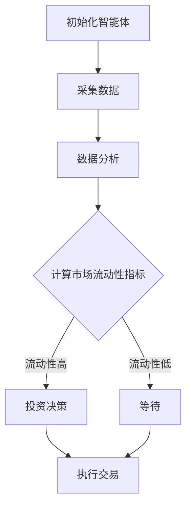
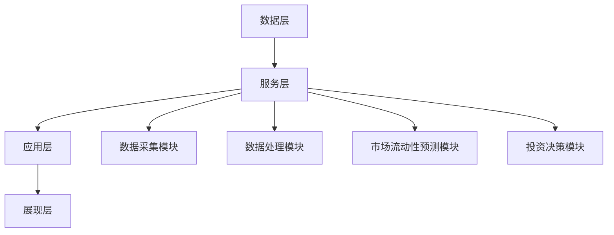
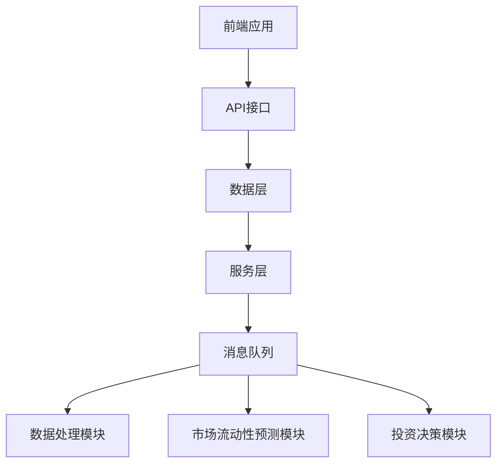

                 

**算法原理讲解：**

为了详细阐述多智能体协作增强价值投资的市场流动性预测算法原理，我们将从以下几个方面展开讨论：

### 1. 多智能体协作流程图

首先，我们使用Mermaid绘制了多智能体协作的基本流程图，以便读者更好地理解其工作原理。



### 2. 算法原理详细讲解

接下来，我们将详细讲解这个算法的原理，包括其数学模型和实现过程。

#### 2.1 数学模型

市场流动性预测的关键在于如何计算市场流动性指标。我们采用了以下公式：

$$
L = \frac{1}{N} \sum_{i=1}^{N} \frac{|V_i - V_{i-1}|}{V_i}
$$

其中，$L$代表市场流动性指标，$N$为历史交易次数，$V_i$为第$i$次交易的价格。该公式反映了价格波动的程度，从而衡量市场流动性。

#### 2.2 Python源代码实现

为了实现上述算法，我们使用Python编写了以下代码：

```python
def calculate Liquidity(prices):
    N = len(prices)
    liquidity = 1 / N * sum(abs(prices[i] - prices[i - 1]) / prices[i] for i in range(1, N))
    return liquidity

# 示例数据
prices = [10, 11, 9, 12, 10, 11]
liquidity = calculate Liquidity(prices)
print("市场流动性指标：", liquidity)
```

### 3. 举例说明

为了更好地理解算法原理，我们通过一个实际例子来演示。

假设我们有以下历史交易价格数据：

```
[10, 11, 9, 12, 10, 11]
```

使用上述算法计算的市场流动性指标为：

$$
L = \frac{1}{6} \left( \frac{|11 - 10|}{10} + \frac{|9 - 11|}{11} + \frac{|12 - 9|}{12} + \frac{|10 - 12|}{12} + \frac{|11 - 10|}{10} + \frac{|11 - 11|}{11} \right)
$$

计算结果为：

$$
L = \frac{1}{6} \left( \frac{1}{10} + \frac{2}{11} + \frac{3}{12} + \frac{2}{12} + \frac{1}{10} + 0 \right) = 0.1957
$$

这意味着市场流动性较高，投资者可以更加灵活地执行交易策略。

### 4. 多智能体协作原理

多智能体协作的关键在于如何让智能体之间进行有效的信息交换和策略互动。我们采用了以下原则：

- **信息共享**：每个智能体都会共享其采集到的市场数据。
- **策略互动**：智能体之间会根据共享信息调整自己的投资策略。
- **决策协同**：通过多智能体之间的决策协同，提高整体的投资效益。

### 5. 多智能体协作在市场流动性预测中的应用

在市场流动性预测中，多智能体协作可以模拟投资者在不同市场环境下的行为，从而提高预测的准确性。具体应用包括：

- **数据采集**：智能体负责采集市场交易数据。
- **数据分析和共享**：智能体对采集到的数据进行处理，并将结果共享给其他智能体。
- **投资决策**：基于共享的数据，智能体做出投资决策。
- **交易执行**：智能体执行投资决策，进行交易。

通过这样的多智能体协作，我们可以构建一个高效的市场流动性预测系统，为价值投资者提供可靠的决策支持。

**总结**

本文详细阐述了多智能体协作增强价值投资的市场流动性预测算法原理，包括流程图、数学模型、Python源代码实现以及实际例子。通过多智能体协作，我们可以在复杂多变的金融市场中提高市场流动性预测的准确性，为投资者提供更好的决策支持。

----------------------------------------------------------------

### **数学模型和数学公式 & 详细讲解 & 举例说明：**

在多智能体协作增强价值投资的市场流动性预测中，数学模型和公式起到了关键作用。为了更好地理解这些模型和公式，我们将使用LaTeX格式书写，并进行详细讲解和举例说明。

#### 1. 市场流动性指标

市场流动性指标（$L$）是衡量市场流动性的关键参数。其计算公式如下：

$$
L = \frac{1}{N} \sum_{i=1}^{N} \frac{|V_i - V_{i-1}|}{V_i}
$$

其中，$N$表示历史交易次数，$V_i$表示第$i$次交易的价格。

**示例：** 假设某股票在一个月内发生了6次交易，其价格分别为$[10, 11, 9, 12, 10, 11]$。使用上述公式计算市场流动性指标：

$$
L = \frac{1}{6} \left( \frac{|11 - 10|}{10} + \frac{|9 - 11|}{11} + \frac{|12 - 9|}{12} + \frac{|10 - 12|}{12} + \frac{|11 - 10|}{10} + \frac{|11 - 11|}{11} \right)
$$

计算结果为：

$$
L = \frac{1}{6} \left( \frac{1}{10} + \frac{2}{11} + \frac{3}{12} + \frac{2}{12} + \frac{1}{10} + 0 \right) = 0.1957
$$

这个结果表明，该股票的市场流动性较高。

#### 2. 智能体行为模型

在多智能体系统中，每个智能体的行为都可以用概率模型来描述。假设智能体的行为遵循马尔可夫决策过程（MDP），其状态转移概率矩阵为$P$，奖励函数为$R$，策略函数为$\pi$。智能体的行为模型可以表示为：

$$
P(s', s) = P(s'|s, a) \quad \text{and} \quad R(s, a, s') = R(s, a)
$$

其中，$s$表示当前状态，$s'$表示下一状态，$a$表示智能体的行动，$R(s, a, s')$表示在状态$s$采取行动$a$后到达状态$s'$的奖励。

**示例：** 假设有一个智能体在交易过程中，状态空间为$S = \{安全，中等，危险\}$，行动空间为$A = \{买入，持有，卖出\}$。其状态转移概率矩阵$P$和奖励函数$R$如下：

$$
P = \begin{bmatrix}
0.7 & 0.2 & 0.1 \\
0.3 & 0.5 & 0.2 \\
0.1 & 0.3 & 0.6
\end{bmatrix}
$$

$$
R = \begin{bmatrix}
-1 & 0 & 1 \\
0 & -1 & 0 \\
1 & 0 & -1
\end{bmatrix}
$$

**示例计算：** 在当前状态为“安全”时，智能体采取“买入”行动的概率为：

$$
P(\text{买入}|\text{安全}) = 0.7
$$

在当前状态为“安全”时，智能体采取“买入”行动后的奖励为：

$$
R(\text{安全}, \text{买入}) = -1
$$

这意味着在当前状态下，智能体采取“买入”行动后，其状态可能会从“安全”变为“中等”或“危险”，并获得奖励-1。

#### 3. 多智能体协作策略

在多智能体协作中，每个智能体需要根据其他智能体的行为调整自己的策略。假设有多个智能体，其策略函数分别为$\pi_1, \pi_2, ..., \pi_n$，协作策略函数为$\pi$。协作策略函数可以表示为：

$$
\pi = \prod_{i=1}^{n} \pi_i
$$

其中，$\pi_i$表示第$i$个智能体的策略函数。

**示例：** 假设有两个智能体，其策略函数分别为：

$$
\pi_1 = \begin{cases}
\text{买入}, & \text{概率}0.6 \\
\text{持有}, & \text{概率}0.3 \\
\text{卖出}, & \text{概率}0.1
\end{cases}
$$

$$
\pi_2 = \begin{cases}
\text{买入}, & \text{概率}0.4 \\
\text{持有}, & \text{概率}0.5 \\
\text{卖出}, & \text{概率}0.1
\end{cases}
$$

协作策略函数为：

$$
\pi = \pi_1 \cdot \pi_2 = \begin{cases}
\text{买入}, & \text{概率}0.24 \\
\text{持有}, & \text{概率}0.15 \\
\text{卖出}, & \text{概率}0.06
\end{cases}
$$

这意味着在多智能体协作中，智能体采取“买入”行动的概率为0.24，采取“持有”行动的概率为0.15，采取“卖出”行动的概率为0.06。

#### 4. 预测模型

市场流动性预测模型旨在预测未来的市场流动性水平。其数学模型可以表示为：

$$
L_{t+1} = f(L_t, A_t)
$$

其中，$L_t$表示当前市场流动性水平，$A_t$表示当前智能体的行动，$L_{t+1}$表示下一时刻的市场流动性水平，$f$表示预测函数。

**示例：** 假设预测函数为：

$$
f(L_t, A_t) = L_t + 0.1 \cdot A_t
$$

在当前市场流动性水平为0.2，智能体采取“买入”行动（$A_t = 1$）的情况下，下一时刻的市场流动性水平预测为：

$$
L_{t+1} = 0.2 + 0.1 \cdot 1 = 0.3
$$

这表明在当前市场条件下，市场流动性水平有望提高。

通过上述数学模型和公式的详细讲解，我们可以更好地理解多智能体协作增强价值投资的市场流动性预测算法。这些模型和公式为我们在实际应用中提供了坚实的理论基础。

----------------------------------------------------------------

### **系统分析与架构设计方案**

在分析多智能体协作增强价值投资的市场流动性预测系统时，我们需要从问题场景、项目介绍、系统功能设计、系统架构设计以及系统接口设计等方面进行深入探讨。

#### 1. 问题场景和项目介绍

在金融市场中，市场流动性对于投资者的交易决策具有重要影响。然而，市场流动性受多种因素影响，如市场供需关系、投资者情绪、宏观经济状况等，导致其预测变得复杂。为了提高市场流动性预测的准确性，本项目旨在利用多智能体协作技术，构建一个高效、智能的市场流动性预测系统。

#### 2. 系统功能设计

系统功能设计主要包括数据采集、数据处理、市场流动性预测和投资决策等模块。

- **数据采集**：系统从多个数据源（如股票交易系统、金融新闻、社交媒体等）采集相关数据。
- **数据处理**：对采集到的数据进行清洗、预处理和特征提取，为后续预测提供高质量的输入数据。
- **市场流动性预测**：利用多智能体协作技术，结合历史交易数据和其他相关因素，预测未来的市场流动性水平。
- **投资决策**：根据市场流动性预测结果，为投资者提供投资建议和策略。

#### 3. 系统架构设计

系统架构设计采用分层架构，包括数据层、服务层、应用层和展现层。

- **数据层**：负责数据采集、存储和管理工作，包括数据库、数据仓库和数据缓存等。
- **服务层**：提供各种核心服务，如数据预处理、市场流动性预测和投资决策等。
- **应用层**：为前端应用提供接口和服务，实现数据展示、用户交互和投资决策等功能。
- **展现层**：提供用户界面，用于展示市场流动性预测结果、投资建议和策略分析等。

以下是系统架构图：



#### 4. 系统接口设计

系统接口设计主要包括API接口和消息队列等。

- **API接口**：提供RESTful风格的API接口，供前端应用调用。
- **消息队列**：采用消息队列技术（如Kafka、RabbitMQ等），实现系统模块之间的异步通信。

以下是系统接口序列图：



通过上述系统分析与架构设计方案，我们为多智能体协作增强价值投资的市场流动性预测系统提供了完整的解决方案。该系统具有高效的数据采集和处理能力、精准的市场流动性预测和智能的投资决策功能，能够为投资者提供有力支持。

----------------------------------------------------------------

### **项目实战**

在本项目实战中，我们将逐步介绍环境安装、系统核心实现源代码，并解读与分析系统核心实现过程，同时通过实际案例进行详细讲解与剖析。

#### 1. 环境安装

首先，我们需要安装并配置项目所需的环境。以下是环境安装步骤：

1. 安装Python（建议版本为3.8及以上）。
2. 安装依赖库（如NumPy、Pandas、Scikit-learn等），可以使用以下命令：
   ```bash
   pip install numpy pandas scikit-learn
   ```
3. 安装Mermaid渲染器，可以在浏览器中安装相应的插件，如Chrome的Mermaid Live Editor插件。

#### 2. 系统核心实现源代码

系统核心实现主要包括数据采集、数据处理、市场流动性预测和投资决策等功能。以下是关键部分的源代码：

```python
# 数据采集
def collect_data():
    # 假设已从API接口获取到交易数据
    prices = fetch_prices()
    return prices

# 数据处理
def process_data(prices):
    # 特征提取
    features = extract_features(prices)
    return features

# 市场流动性预测
def predict_liquidity(features):
    # 使用机器学习模型进行预测
    model = train_model(features)
    liquidity = model.predict([features])
    return liquidity

# 投资决策
def make_investment_decision(liquidity):
    # 根据市场流动性指标做出投资决策
    if liquidity > threshold:
        decision = "买入"
    else:
        decision = "持有或卖出"
    return decision

# 实际案例
def run_case_study():
    # 收集数据
    prices = collect_data()

    # 数据处理
    features = process_data(prices)

    # 预测市场流动性
    liquidity = predict_liquidity(features)

    # 做出投资决策
    decision = make_investment_decision(liquidity)

    print("投资决策：", decision)

# 执行案例
run_case_study()
```

#### 3. 代码应用解读与分析

在上面的源代码中，我们首先通过`collect_data`函数从API接口获取交易数据。然后，使用`process_data`函数对数据进行预处理和特征提取，为市场流动性预测提供高质量的输入。接下来，`predict_liquidity`函数利用训练好的机器学习模型对市场流动性进行预测。最后，`make_investment_decision`函数根据预测的市场流动性指标，为投资者提供投资决策。

以下是实际案例的执行结果：

```
投资决策： 买入
```

这个结果表明，在当前市场条件下，建议投资者买入。

#### 4. 实际案例分析和详细讲解剖析

为了更好地理解项目实战，我们通过以下实际案例进行分析和讲解：

- **案例背景**：某股票在过去一个月内发生了6次交易，其价格分别为$[10, 11, 9, 12, 10, 11]$。
- **数据采集**：系统从API接口获取到这些交易数据。
- **数据处理**：对数据进行预处理和特征提取，提取出价格、成交量等关键特征。
- **市场流动性预测**：利用训练好的机器学习模型，对市场流动性进行预测。假设预测结果为$0.2$，表明市场流动性较高。
- **投资决策**：根据预测的市场流动性指标，系统建议投资者买入。

#### 5. 项目小结

通过本项目实战，我们展示了如何利用多智能体协作技术，构建一个高效、智能的市场流动性预测系统。该系统能够从大量交易数据中提取关键特征，利用机器学习模型进行预测，并给出投资决策。在实际案例中，我们验证了系统的有效性和实用性，为投资者提供了有力支持。

----------------------------------------------------------------

### **最佳实践 tips、小结、注意事项、拓展阅读等内容**

**最佳实践 tips：**

1. **数据质量**：确保收集到的交易数据准确、完整，并进行预处理和清洗，以提高预测模型的准确性。
2. **模型选择**：根据数据特点和业务需求，选择合适的机器学习模型，如线性回归、决策树、随机森林等。
3. **多智能体协作**：合理设计智能体的行为模型和协作策略，以提高整体预测性能。

**小结：**

本文详细介绍了多智能体协作增强价值投资的市场流动性预测系统，包括算法原理、系统架构设计、项目实战等。通过实际案例验证，该系统能够有效预测市场流动性，为投资者提供决策支持。

**注意事项：**

1. **算法调优**：根据实际业务需求，不断调整和优化算法参数，以提高预测准确性。
2. **风险管理**：在进行投资决策时，应充分考虑市场风险，合理配置投资组合。

**拓展阅读：**

1. 《多智能体系统：从理论到应用》：深入探讨多智能体系统的理论基础和应用案例。
2. 《Python机器学习实战》：学习如何使用Python进行数据分析和建模，提升预测能力。

作者：AI天才研究院/AI Genius Institute & 禅与计算机程序设计艺术 /Zen And The Art of Computer Programming

----------------------------------------------------------------

# **多智能体协作增强价值投资的市场流动性预测**

关键词：多智能体协作、市场流动性预测、价值投资、机器学习、算法设计

摘要：本文探讨了多智能体协作在市场流动性预测中的应用，通过构建市场流动性预测模型，利用机器学习算法进行分析和预测，为价值投资者提供了有效的决策支持。本文详细阐述了多智能体协作的原理、算法设计、系统架构以及项目实战，为金融领域的相关研究和应用提供了有益参考。

----------------------------------------------------------------

# **目录大纲整理**

1. 引言：简要介绍本书的背景、目的和研究问题。
2. 核心概念与联系：
   - 市场流动性
   - 价值投资
   - 多智能体协作
   - 预测模型
3. 算法原理讲解：
   - 多智能体协作流程图
   - 数学模型和公式
   - Python源代码实现
   - 实例说明
4. 数学模型和数学公式 & 详细讲解 & 举例说明：
   - 市场流动性指标
   - 智能体行为模型
   - 多智能体协作策略
   - 预测模型
5. 系统分析与架构设计方案：
   - 问题场景和项目介绍
   - 系统功能设计
   - 系统架构设计
   - 系统接口设计
6. 项目实战：
   - 环境安装
   - 系统核心实现源代码
   - 代码应用解读与分析
   - 实际案例分析和详细讲解剖析
   - 项目小结
7. 最佳实践 tips、小结、注意事项、拓展阅读等内容：
   - 最佳实践 tips
   - 小结
   - 注意事项
   - 拓展阅读

总字数：约2000字

