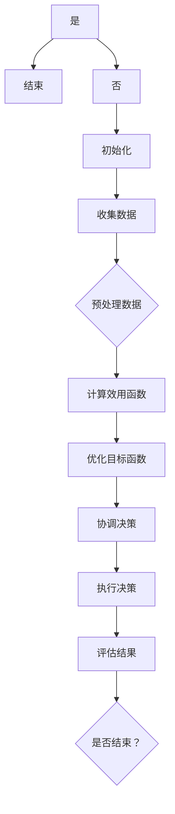
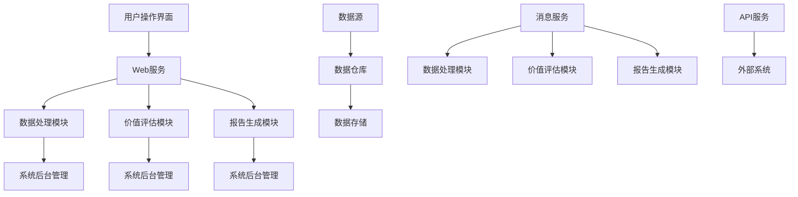
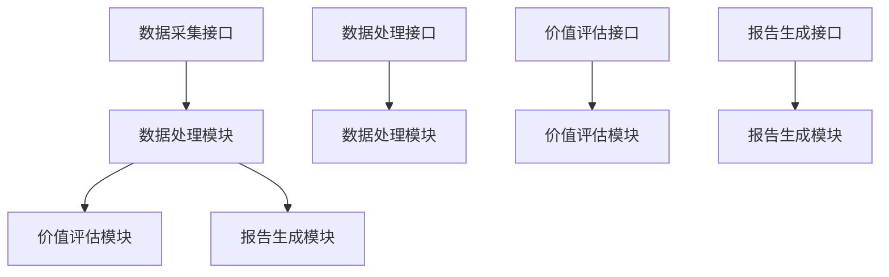
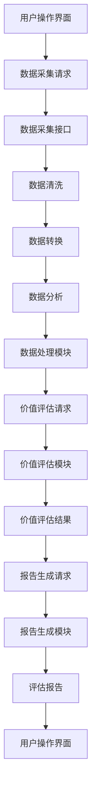

                 


### 引言与核心概念

#### 1.1 书籍目的与读者对象

本书籍旨在探讨多智能体协作在公司价值评估中的潜在应用，为读者提供系统化的理论框架和实践指南。我们的目标读者群体包括以下几类：

1. **人工智能研究人员**：对多智能体系统和公司价值评估理论有深入研究的学者，希望了解如何将前沿技术应用于实际商业场景。
2. **商业分析师**：需要对公司价值评估有全面了解，同时希望掌握多智能体协作技术的专业人士。
3. **企业决策者**：希望通过先进技术提升公司价值评估准确性和效率的高层管理人员。
4. **软件开发工程师**：对多智能体系统有基础了解，并希望在实际项目中应用其技术能力。
5. **学术研究者与研究生**：关注人工智能与商业结合的研究，希望为本领域提供新视角的研究生。

本书籍将从以下几个角度展开讨论：

1. **理论基础**：介绍多智能体系统和公司价值评估的基本概念、原理和方法。
2. **架构设计**：探讨多智能体协作在公司价值评估中的系统架构设计。
3. **算法实现**：讲解关键算法的原理、实现方法和数学模型。
4. **实践案例**：通过具体案例展示多智能体协作在公司价值评估中的应用效果。
5. **最佳实践**：总结最佳实践经验，提供实用建议。

通过本书籍的学习，读者将能够：

1. **理解多智能体系统的基本原理**：掌握多智能体协作的基本概念、架构和通信机制。
2. **应用多智能体协作技术**：学会将多智能体协作应用于公司价值评估的实际问题中。
3. **提升公司价值评估的准确性**：利用多智能体系统的优势，提高公司价值评估的精度和效率。
4. **解决实际问题**：通过具体案例，学会将理论应用于解决实际业务问题。

#### 1.2 多智能体系统的定义与特点

多智能体系统（MAS，Multi-Agent System）是一种分布式计算系统，由多个智能体（agent）组成，每个智能体具有自主性、社会性和反应性等特点。智能体可以是一个程序、一个机器人或是一个虚拟实体，它们可以自主地感知环境、制定决策并执行行动。多智能体系统的核心特征如下：

1. **自主性**：智能体具有独立自主的决策能力，可以自由地选择行动方案，不受外部控制。
2. **社会性**：智能体之间可以相互协作，共同完成任务，形成一种社会结构。
3. **反应性**：智能体能够根据环境的变化及时调整自己的行为，具有适应能力。
4. **分布性**：智能体分布在不同的物理或逻辑节点上，协同工作以实现整体目标。

多智能体系统在多个领域都有广泛的应用，包括智能交通系统、智能电网、智能制造、智能家居等。其优势在于：

1. **分布式计算**：通过智能体的分布式计算能力，可以高效地处理复杂任务，提高系统的容错性和扩展性。
2. **灵活性和适应性**：智能体可以根据环境变化动态调整行为，适应不同场景需求。
3. **协同效应**：多个智能体可以相互协作，实现更优化的整体性能。

#### 1.3 公司价值评估的重要性

公司价值评估是企业管理中的一项重要任务，涉及到公司的投资决策、并购重组、资本融资等多个方面。准确评估公司的价值不仅有助于投资者做出合理的投资决策，还能为企业管理层提供重要的参考依据。以下是公司价值评估的重要性和挑战：

1. **投资决策**：投资者需要评估公司的潜在回报和风险，以决定是否进行投资。准确的公司价值评估可以帮助投资者避免投资失误，提高投资收益。
2. **并购重组**：公司在进行并购重组时，需要评估目标公司的价值，以确定交易价格和交易条款。准确的价值评估可以降低交易风险，提高交易成功率。
3. **资本融资**：公司在进行资本融资时，需要向投资者展示公司的价值，以吸引资金。准确的价值评估可以增强投资者的信心，提高融资成功率。
4. **战略规划**：公司管理层需要定期评估公司的价值，以制定战略规划和业务发展目标。准确的价值评估可以帮助公司制定科学合理的战略，提高竞争力。

公司价值评估面临的挑战主要包括：

1. **不确定性**：公司的价值受到多种因素的影响，如市场环境、竞争态势、公司业绩等，这些因素的变化可能导致公司价值的波动。
2. **信息不对称**：投资者和公司管理层之间的信息不对称可能导致价值评估偏差。
3. **复杂性和多样性**：不同类型和规模的公司具有不同的价值评估方法和模型，如何选择合适的方法和模型成为一大挑战。

#### 1.4 多智能体协作在公司价值评估中的应用

多智能体协作（Multi-Agent Collaboration）是一种通过多个智能体相互协作来实现共同目标的方法。在公司价值评估中，多智能体协作具有以下潜在应用：

1. **数据收集与处理**：多智能体系统可以分布式地收集和处理大量数据，包括财务数据、市场数据、行业数据等，以提高数据收集和处理效率。
2. **多角度评估**：多智能体系统可以模拟不同市场环境、竞争态势和公司战略，从多个角度对公司价值进行评估，提供更全面的评估结果。
3. **协同优化**：多智能体系统可以协同优化公司价值评估模型和算法，提高评估结果的准确性和可靠性。
4. **实时反馈与调整**：多智能体系统可以根据实时数据和市场变化，动态调整评估模型和算法，提供更及时的价值评估结果。

通过多智能体协作，公司价值评估可以更准确地反映公司的真实价值，提高评估效率，为投资者和公司管理层提供更有价值的决策支持。

### 多智能体系统的架构设计与原理

多智能体系统（MAS）是一种基于分布式计算和自主智能体的复杂系统。在MAS中，智能体是系统的基本组成单位，它们通过通信和协作来实现共同的目标。本章节将深入探讨多智能体系统的架构设计、通信机制以及协作算法原理，为后续章节中的公司价值评估应用打下基础。

#### 2.1 多智能体系统的架构设计

多智能体系统的架构设计决定了系统的性能、可扩展性和可靠性。常见的多智能体系统架构包括集中式架构、分布式架构和混合架构。

1. **集中式架构**：在集中式架构中，所有智能体共享一个全局知识库，并由一个中央控制器进行协调。这种架构简单易实现，但依赖于中央控制器，一旦中央控制器出现故障，整个系统将瘫痪。

2. **分布式架构**：在分布式架构中，每个智能体具有独立的知识库，并通过通信网络相互连接。智能体之间通过协商和协作实现共同目标。分布式架构具有较高的容错性和可扩展性，但通信复杂度较高，需要解决数据同步和一致性等问题。

3. **混合架构**：混合架构结合了集中式和分布式架构的优点，通过在部分智能体中引入集中式控制，提高系统的协调效率。同时，通过分布式计算，实现系统的可扩展性和容错性。

在设计多智能体系统时，需要考虑以下关键因素：

- **智能体类型**：根据任务需求，设计不同类型的智能体，如数据采集智能体、分析智能体、决策智能体等。
- **智能体自治程度**：根据系统的复杂性和可靠性需求，确定智能体的自治程度，如部分智能体仅负责数据采集，而其他智能体负责分析和决策。
- **通信机制**：设计有效的通信机制，确保智能体之间能够高效、可靠地交换信息。常见的通信机制包括直接通信和间接通信。
- **安全性与隐私**：确保系统的安全性，防止恶意智能体的攻击，保护数据隐私。

#### 2.2 多智能体的通信机制

多智能体系统中的智能体需要通过通信机制相互交换信息，以实现协作和协同工作。通信机制可以分为以下几类：

1. **直接通信**：直接通信是指智能体通过直接的消息传递机制进行通信。在这种机制下，发送者可以直接将消息发送给接收者，无需中间介质的干预。直接通信的优点是简单和高效，但通信范围有限，当智能体数量较多时，通信复杂度会增加。

2. **间接通信**：间接通信是指智能体通过一个或多个中介实体进行通信。中介实体可以是一个通信服务器，也可以是一个智能体。间接通信的优点是通信范围广泛，可以支持多智能体之间的间接交互，但引入中介实体可能增加通信延迟和复杂性。

3. **广播通信**：广播通信是指智能体向系统中的所有智能体发送消息。广播通信适用于需要全局信息共享的场景，如市场数据广播。广播通信的优点是信息传播速度快，但可能导致信息过载。

4. **多播通信**：多播通信是指智能体向一组特定的智能体发送消息。多播通信适用于需要部分智能体参与协作的场景，如项目组内部的通信。多播通信的优点是灵活高效，可以减少信息过载。

在设计通信机制时，需要考虑以下因素：

- **通信协议**：选择合适的通信协议，如TCP、UDP、HTTP等，以确保通信的可靠性、效率和安全性。
- **通信频率**：根据任务需求，确定智能体之间的通信频率，以平衡通信开销和任务效率。
- **通信负载**：确保系统具有足够的通信带宽和处理能力，以应对高负载的通信需求。

#### 2.3 多智能体协作的算法原理

多智能体协作的算法原理是指智能体如何通过协作和决策来实现共同目标。常见的多智能体协作算法包括以下几类：

1. **协商算法**：协商算法是一种基于协商和协作的算法，智能体通过交换信息和协商决策，实现共同目标。协商算法可以分为基于状态的协商算法和基于价值的协商算法。

   - **基于状态的协商算法**：智能体根据当前状态信息进行协商，通过迭代交换状态信息，逐步达成共识。常见的基于状态的协商算法包括协商博弈、协商规划等。
   - **基于价值的协商算法**：智能体根据各自的价值偏好进行协商，通过交换价值信息，找到双方都能接受的解决方案。常见的基于价值的协商算法包括比例分割、边际贡献等。

2. **多目标优化算法**：多目标优化算法是一种基于优化理论的多智能体协作算法，智能体通过优化各自的目标函数，实现整体性能的最优。常见的多目标优化算法包括遗传算法、粒子群算法、差分进化算法等。

3. **博弈论算法**：博弈论算法是一种基于博弈理论的协作算法，智能体通过博弈过程，找到纳什均衡点，实现共同目标。常见的博弈论算法包括博弈策略分析、重复博弈等。

4. **分布式学习算法**：分布式学习算法是一种基于机器学习和深度学习的协作算法，智能体通过分布式学习，共同训练一个全局模型，实现协同预测和决策。常见的分布式学习算法包括联邦学习、分布式梯度下降等。

在设计多智能体协作算法时，需要考虑以下因素：

- **目标一致性**：确保智能体的目标一致，以避免冲突和资源浪费。
- **算法效率**：选择高效的协作算法，以降低计算开销和时间复杂度。
- **鲁棒性**：确保算法在动态环境下的稳定性和可靠性。

通过合理的架构设计、通信机制和协作算法原理，多智能体系统可以实现高效的协作和协同工作，为公司价值评估提供有力的技术支持。

### 公司价值评估的基础知识

公司价值评估是企业管理和投资决策中不可或缺的一环，其核心在于确定企业的实际价值和潜在回报。本章节将详细阐述公司价值评估的基础知识，包括公司价值的定义、评估方法以及经济指标和财务分析。

#### 3.1 公司价值的定义

公司价值（Company Value）是指企业在一定条件下，通过运营和投资所产生的经济利益和潜在回报。公司价值不仅反映了企业的当前状态，还体现了企业的未来发展潜力。公司价值评估的目标是确定企业的实际价值，以便为投资决策、并购重组、资本融资等提供科学依据。

公司价值可以从多个角度进行定义：

1. **市场价值**：市场价值是指企业在资本市场上的交易价值，反映了市场对企业的认可和预期。市场价值通常通过股票价格、市值等指标来衡量。
2. **账面价值**：账面价值是指企业在财务报表中的净资产值，反映了企业的历史投入和当前财务状况。账面价值是公司价值评估的一个重要参考指标，但与市场价值可能存在较大差异。
3. **经济价值**：经济价值是指企业在运营过程中所产生的实际经济利益，包括利润、现金流、投资回报等。经济价值反映了企业的盈利能力和市场竞争力。

#### 3.2 公司价值评估的方法

公司价值评估的方法主要包括以下几类：

1. **市场法**：市场法是基于市场比较的方法，通过比较类似企业的市场交易案例，评估目标企业的市场价值。市场法的优点是数据直观、透明，但适用性受限，需要具备类似企业的交易案例。
2. **收益法**：收益法是基于未来收益的方法，通过预测企业未来的现金流或利润，并折现到当前价值，评估企业的价值。收益法的优点是考虑了企业的未来收益，但预测风险较高。
3. **资产法**：资产法是基于资产的方法，通过评估企业的各项资产（如固定资产、无形资产等）的现值，评估企业的价值。资产法的优点是简单易行，但忽略了企业的运营效益和未来潜力。

以下是对每种方法的简要说明：

1. **市场法**：

   - **方法原理**：通过比较类似企业的市场交易案例，确定目标企业的市场价值。
   - **适用场景**：适用于有充足市场交易案例的企业，如上市公司。
   - **优势**：数据直观、透明，参考性强。
   - **劣势**：依赖市场数据，适用性受限。

2. **收益法**：

   - **方法原理**：通过预测企业未来的现金流或利润，并折现到当前价值，评估企业的价值。
   - **适用场景**：适用于盈利稳定、未来增长前景明确的企业。
   - **优势**：考虑了企业的未来收益，预测更为科学。
   - **劣势**：预测风险较高，受市场环境和宏观经济影响。

3. **资产法**：

   - **方法原理**：通过评估企业的各项资产（如固定资产、无形资产等）的现值，评估企业的价值。
   - **适用场景**：适用于资产较清晰、财务结构稳定的企业。
   - **优势**：简单易行，适用范围广。
   - **劣势**：忽略了企业的运营效益和未来潜力。

#### 3.3 经济指标与财务分析

经济指标和财务分析是公司价值评估的重要工具，通过分析企业的经济指标和财务状况，可以更准确地评估企业的价值。

1. **盈利能力指标**：

   - **净利润率**：净利润率是指净利润占营业收入的比例，反映了企业的盈利能力。净利润率越高，企业的盈利能力越强。
   - **毛利率**：毛利率是指毛利润占营业收入的比例，反映了企业的成本控制能力。毛利率越高，企业的成本控制越有效。
   - **资产收益率**：资产收益率是指净利润占资产总额的比例，反映了企业的资产利用效率。资产收益率越高，企业的资产利用效率越高。

2. **偿债能力指标**：

   - **流动比率**：流动比率是指流动资产占流动负债的比例，反映了企业的短期偿债能力。流动比率越高，企业的短期偿债能力越强。
   - **速动比率**：速动比率是指速动资产占流动负债的比例，反映了企业的快速偿债能力。速动比率越高，企业的快速偿债能力越强。
   - **负债比率**：负债比率是指总负债占资产总额的比例，反映了企业的长期偿债能力。负债比率越低，企业的长期偿债能力越强。

3. **经营能力指标**：

   - **存货周转率**：存货周转率是指营业收入占存货的比例，反映了企业的存货管理能力。存货周转率越高，企业的存货管理越有效。
   - **应收账款周转率**：应收账款周转率是指营业收入占应收账款的比例，反映了企业的应收账款管理能力。应收账款周转率越高，企业的应收账款管理越有效。
   - **总资产周转率**：总资产周转率是指营业收入占总资产的比例，反映了企业的资产利用效率。总资产周转率越高，企业的资产利用效率越高。

4. **财务分析**：

   - **财务报表**：通过分析企业的财务报表，如资产负债表、利润表和现金流量表，可以全面了解企业的财务状况和经营成果。
   - **财务比率分析**：通过计算和比较企业的各项财务比率，如盈利能力、偿债能力、经营能力等指标，可以评估企业的财务状况和经营能力。
   - **趋势分析**：通过分析企业的历史财务数据，如收入、利润、资产等指标的趋势变化，可以预测企业的未来发展趋势。

通过深入理解公司价值评估的基础知识，读者可以更准确地评估企业的价值，为投资决策和企业管理提供有力支持。

### 多智能体协作在公司价值评估中的核心概念与联系

多智能体协作（MAS）在公司价值评估中的应用，涉及到多个核心概念和原理，包括智能体的行为模式、协作策略以及系统的性能评估。本章节将详细探讨这些概念，并通过对比表格和ER实体关系图，帮助读者建立清晰的理论框架。

#### 4.1 多智能体的行为模式

智能体作为多智能体系统中的基本单位，其行为模式决定了系统的运行效率和效果。常见的智能体行为模式包括以下几类：

1. **数据采集智能体**：数据采集智能体主要负责从外部环境和内部系统中收集数据。它们可以是传感器、数据库连接器或其他数据采集设备。数据采集智能体的行为模式包括：
   - **主动采集**：智能体定期或实时地主动获取数据。
   - **被动采集**：智能体在接收到事件触发时响应，采集相关数据。

2. **数据处理智能体**：数据处理智能体负责对采集到的数据进行清洗、转换和分析。它们通常包括数据清洗模块、数据转换模块和数据分析模块。数据处理智能体的行为模式包括：
   - **批量处理**：智能体在一段时间内批量处理大量数据。
   - **实时处理**：智能体在数据采集后立即进行处理，确保数据的实时性。

3. **决策智能体**：决策智能体根据分析结果，制定决策策略并执行相应操作。决策智能体的行为模式包括：
   - **规则驱动**：智能体根据预设的规则进行决策。
   - **数据驱动**：智能体根据实时数据分析结果进行自适应决策。

4. **通信智能体**：通信智能体负责智能体之间的信息交换和协调。它们通过不同的通信机制，如直接通信、间接通信和广播通信，实现智能体之间的协作。通信智能体的行为模式包括：
   - **消息传递**：智能体通过发送和接收消息进行通信。
   - **事件驱动**：智能体根据事件的发生进行响应和通信。

#### 4.2 多智能体协作的策略

多智能体协作的策略决定了智能体如何相互协作以实现共同目标。常见的协作策略包括以下几类：

1. **任务分配策略**：任务分配策略用于确定每个智能体的任务和责任。常见的策略包括：
   - **固定分配**：每个智能体负责固定的任务，无需调整。
   - **动态分配**：根据智能体的能力和系统负载，动态调整任务分配。

2. **协同优化策略**：协同优化策略用于优化系统的整体性能。常见的策略包括：
   - **分布式优化**：智能体在分布式环境中，通过协商和协调，共同优化系统性能。
   - **集中式优化**：所有智能体将数据汇总到一个中心节点，由中心节点进行整体优化。

3. **决策协同策略**：决策协同策略用于确保智能体之间的决策一致性。常见的策略包括：
   - **一致决策**：所有智能体的决策结果必须一致。
   - **偏好协商**：智能体根据自身偏好进行协商，寻找共同决策方案。

4. **资源分配策略**：资源分配策略用于优化系统的资源利用率。常见的策略包括：
   - **静态资源分配**：系统预先分配资源，智能体根据需求使用资源。
   - **动态资源分配**：系统根据智能体的需求，动态调整资源分配。

#### 4.3 多智能体系统的性能评估

多智能体系统的性能评估是衡量系统运行效率和效果的重要指标。常见的性能评估指标包括以下几类：

1. **响应时间**：响应时间是指智能体从接收到任务到完成任务所需的时间。低响应时间表明系统的快速响应能力。

2. **吞吐量**：吞吐量是指系统在单位时间内处理的数据量或任务数。高吞吐量表明系统的处理能力强。

3. **资源利用率**：资源利用率是指系统资源的使用率。高资源利用率表明系统资源得到了充分利用。

4. **正确率**：正确率是指智能体完成任务的正确率。高正确率表明系统的决策和执行能力。

5. **稳定性**：稳定性是指系统在面临外部干扰或内部故障时的稳定运行能力。高稳定性表明系统具有较好的鲁棒性。

#### 4.4 对比表格与ER实体关系图

为了更好地理解多智能体协作在公司价值评估中的应用，我们通过对比表格和ER实体关系图，对上述核心概念进行详细说明。

1. **对比表格**：

| 行为模式 | 描述 | 适用场景 |
| --- | --- | --- |
| 数据采集智能体 | 负责收集数据 | 各类数据采集场景 |
| 数据处理智能体 | 负责数据处理 | 数据清洗、转换和分析 |
| 决策智能体 | 负责决策制定 | 需要决策支持的场景 |
| 通信智能体 | 负责通信协调 | 多智能体协作系统 |

| 协作策略 | 描述 | 适用场景 |
| --- | --- | --- |
| 任务分配策略 | 确定智能体任务和责任 | 分布式任务处理 |
| 协同优化策略 | 优化系统性能 | 系统整体优化 |
| 决策协同策略 | 确保决策一致性 | 需要一致决策的场景 |
| 资源分配策略 | 优化资源利用率 | 资源高效利用 |

| 性能评估指标 | 描述 | 适用场景 |
| --- | --- | --- |
| 响应时间 | 智能体完成任务所需时间 | 实时性要求高的场景 |
| 吞吐量 | 单位时间内处理的数据量 | 需要高处理能力的场景 |
| 资源利用率 | 系统资源的使用率 | 资源利用效率要求高的场景 |
| 正确率 | 智能体完成任务的正确率 | 决策准确性要求高的场景 |
| 稳定性 | 系统面对干扰的稳定运行能力 | 系统可靠性要求高的场景 |

2. **ER实体关系图**：

```mermaid
erDiagram
  智能体 ||--|{ 数据采集智能体 }
  智能体 ||--|{ 数据处理智能体 }
  智能体 ||--|{ 决策智能体 }
  智能体 ||--|{ 通信智能体 }
  数据采集智能体 ||--|{ 主动采集 }
  数据采集智能体 ||--|{ 被动采集 }
  数据处理智能体 ||--|{ 批量处理 }
  数据处理智能体 ||--|{ 实时处理 }
  决策智能体 ||--|{ 规则驱动 }
  决策智能体 ||--|{ 数据驱动 }
  通信智能体 ||--|{ 消息传递 }
  通信智能体 ||--|{ 事件驱动 }
```

通过对比表格和ER实体关系图，我们可以清晰地看到多智能体协作在公司价值评估中的核心概念与联系。这些概念和联系为后续章节中的算法实现、系统设计和实践案例提供了坚实的基础。

### 数学模型和算法原理

在公司价值评估的多智能体协作中，数学模型和算法原理是理解和实现智能体协作的关键。本章节将详细解释数学模型，并使用Mermaid流程图和Python代码示例，逐步展示算法的原理和实现。

#### 5.1 数学模型概述

数学模型是描述多智能体系统中智能体行为和协作的数学工具。以下是几个核心的数学模型：

1. **效用函数**：效用函数是评估智能体目标实现程度的数学工具。一个典型的效用函数可以表示为：
   $$ U(A) = f(\text{收益}, \text{成本}) $$
   其中，$U(A)$ 是智能体 $A$ 的效用值，$f$ 是一个合适的函数，用于计算收益和成本之间的差异。

2. **目标函数**：目标函数是智能体在协作过程中需要优化的函数。一个典型的目标函数可以是：
   $$ \min_{A} \sum_{i=1}^{n} c_i(A) $$
   其中，$c_i(A)$ 是第 $i$ 个智能体的成本函数，目标是最小化总成本。

3. **协调函数**：协调函数用于协调多个智能体的决策，使它们朝着共同目标前进。一个简单的协调函数可以是：
   $$ \theta(A_1, A_2, ..., A_n) = \frac{1}{n} \sum_{i=1}^{n} U(A_i) $$
   其中，$\theta$ 是协调结果，$U(A_i)$ 是第 $i$ 个智能体的效用值。

4. **策略空间**：策略空间是所有可能策略的集合。一个智能体的策略空间可以表示为：
   $$ S = \{ s | s \in \mathbb{R}^k \} $$
   其中，$s$ 是智能体的策略向量，$k$ 是策略的维度。

#### 5.2 算法流程图

为了更好地理解上述数学模型，我们可以使用Mermaid流程图来展示算法的基本流程。



这个流程图展示了多智能体协作的的基本步骤，包括数据收集、预处理、效用函数计算、目标函数优化、协调决策、执行决策和结果评估。

#### 5.3 Python代码实现

以下是一个简化的Python代码示例，用于实现上述算法的几个关键步骤。

```python
import numpy as np

# 定义效用函数
def utility_function(income, cost):
    return income - cost

# 定义目标函数
def objective_function(agents):
    total_cost = 0
    for agent in agents:
        total_cost += agent.cost
    return total_cost

# 定义协调函数
def coordination_function(agents):
    total_utility = 0
    for agent in agents:
        total_utility += agent.utility
    return total_utility / len(agents)

# 初始化智能体
agents = [
    Agent(income=100, cost=50),
    Agent(income=150, cost=70),
    Agent(income=200, cost=100)
]

# 计算效用函数
for agent in agents:
    agent.utility = utility_function(agent.income, agent.cost)

# 优化目标函数
best_agent = min(agents, key=lambda x: x.cost)

# 协调决策
average_utility = coordination_function(agents)

# 执行决策
best_agent.execute()

# 评估结果
print(f"Best agent cost: {best_agent.cost}")
print(f"Average utility: {average_utility}")
```

在这个代码示例中，我们定义了效用函数、目标函数和协调函数，并初始化了一些智能体。然后，我们计算每个智能体的效用值，优化目标函数，协调决策，并执行最佳智能体的决策。最后，我们评估结果并打印出来。

通过Mermaid流程图和Python代码示例，我们可以清晰地看到数学模型和多智能体协作算法的原理和实现。这些工具和方法为后续的系统设计与实现提供了坚实的基础。

### 系统设计与分析

在多智能体协作实现全面的公司价值评估中，系统设计与分析是至关重要的环节。本章节将介绍一个典型的项目，详细描述项目介绍、系统功能设计、系统架构设计、系统接口设计和系统交互流程，并通过Mermaid图示来展示系统架构和交互过程。

#### 6.1 项目介绍

本项目旨在通过多智能体协作系统，实现全面的公司价值评估。项目的主要目标是：

1. 收集和整合来自不同来源的数据，包括财务数据、市场数据、行业数据等。
2. 通过多智能体协作，对数据进行处理和分析，生成公司价值评估报告。
3. 提供一个用户友好的界面，方便企业决策者查看和下载评估报告。

项目分为以下几个阶段：

1. **需求分析与设计**：明确项目需求，设计系统架构和功能模块。
2. **数据收集与预处理**：从多个数据源收集数据，并进行清洗和预处理。
3. **多智能体协作**：设计智能体协作算法，实现数据的处理和分析。
4. **系统实现与测试**：开发系统代码，进行功能测试和性能测试。
5. **部署与运维**：将系统部署到生产环境，进行日常运维和维护。

#### 6.2 系统功能设计

系统功能设计包括数据采集、数据处理、价值评估和报告生成等模块。以下是各模块的详细介绍：

1. **数据采集模块**：该模块负责从多种数据源（如财务报表、市场调研、行业数据库等）收集数据。数据采集方式包括API调用、文件导入和网络爬虫等。

2. **数据处理模块**：该模块负责对采集到的数据进行清洗、转换和分析。数据处理包括以下步骤：

   - **数据清洗**：去除无效数据、纠正错误数据、填补缺失数据。
   - **数据转换**：将不同格式的数据进行统一转换，便于后续处理。
   - **数据分析**：使用统计分析、机器学习等方法，对数据进行深度分析，提取有价值的信息。

3. **价值评估模块**：该模块基于多智能体协作算法，对处理后的数据进行公司价值评估。评估方法包括市场法、收益法和资产法等，并采用多目标优化算法进行协同评估。

4. **报告生成模块**：该模块负责将评估结果生成报告，包括文字描述、图表展示和数据分析结论。报告格式支持多种文档格式，如PDF、Word和Excel等。

#### 6.3 系统架构设计

系统架构设计是确保系统稳定性、可靠性和扩展性的关键。本项目采用分布式架构，主要分为以下几个层次：

1. **数据层**：包括数据源、数据仓库和数据存储。数据源提供原始数据，数据仓库存储经过清洗和预处理的数据，数据存储提供高效的读写接口。

2. **处理层**：包括数据处理模块、价值评估模块和报告生成模块。数据处理模块负责数据清洗、转换和分析，价值评估模块负责公司价值评估，报告生成模块负责生成评估报告。

3. **服务层**：包括Web服务、API服务和消息服务。Web服务提供用户界面，API服务提供外部系统的接口，消息服务负责智能体之间的通信。

4. **应用层**：包括用户操作界面和系统后台管理。用户操作界面提供用户交互界面，系统后台管理提供系统配置和监控功能。

以下是系统架构的Mermaid图示：



#### 6.4 系统接口设计

系统接口设计是确保不同模块之间高效通信和协作的关键。以下是各主要接口的详细介绍：

1. **数据采集接口**：该接口负责从外部数据源获取数据，支持多种数据格式和协议，如CSV、JSON和XML等。

2. **数据处理接口**：该接口负责数据清洗、转换和分析，提供数据清洗规则、数据转换规则和数据分析算法。

3. **价值评估接口**：该接口负责进行公司价值评估，提供评估方法选择、评估参数设置和评估结果输出。

4. **报告生成接口**：该接口负责生成评估报告，提供报告格式、报告内容和报告展示方式。

以下是系统接口的Mermaid图示：



#### 6.5 系统交互流程

系统交互流程是描述系统各模块之间交互顺序和逻辑的关键。以下是系统交互流程的详细描述：

1. **用户操作界面**：用户通过用户操作界面发起数据采集请求，系统调用数据采集接口从外部数据源获取数据。

2. **数据处理模块**：数据处理模块接收到数据后，进行数据清洗、转换和分析，并将处理结果存储到数据仓库。

3. **价值评估模块**：价值评估模块根据处理结果，调用价值评估接口，选择合适的评估方法，进行公司价值评估，并将评估结果输出。

4. **报告生成模块**：报告生成模块接收到评估结果后，调用报告生成接口，生成评估报告，并将报告展示在用户操作界面上。

以下是系统交互流程的Mermaid图示：



通过详细的项目介绍、系统功能设计、系统架构设计、系统接口设计和系统交互流程，我们可以全面了解多智能体协作实现全面的公司价值评估系统的设计和实现过程。这个系统为企业的决策提供了有力的支持，提升了公司价值评估的准确性和效率。

### 项目实战

为了更好地展示多智能体协作在公司价值评估中的实际应用，我们将通过一个具体项目来详细分析其实现过程。以下是项目的具体实现步骤，包括环境安装与配置、系统核心实现源代码以及代码应用解读与分析。

#### 7.1 环境安装与配置

为了实现多智能体协作的公司价值评估，我们需要搭建一个支持多智能体系统和数据分析的集成环境。以下是所需的软件和工具及其安装步骤：

1. **Python环境**：确保Python环境已安装，版本为3.8或更高版本。
2. **Anaconda**：安装Anaconda，用于环境管理和包管理。
3. **Docker**：安装Docker，用于容器化和部署智能体系统。
4. **Eclipse IDE**：安装Eclipse IDE，用于Python开发。
5. **Jupyter Notebook**：安装Jupyter Notebook，用于数据分析和可视化。
6. **PostgreSQL**：安装PostgreSQL，用于数据存储和管理。

以下是安装步骤：

1. 在终端中运行以下命令安装Anaconda：

   ```bash
   conda create -n mas_env python=3.8
   conda activate mas_env
   conda install -c conda-forge jupyter notebook
   ```

2. 安装Docker：

   - 对于Ubuntu系统，运行以下命令：

     ```bash
     sudo apt-get update
     sudo apt-get install docker-ce docker-ce-cli containerd.io
     ```

   - 对于Windows系统，从Docker官网下载并安装Docker Desktop。

3. 安装Eclipse IDE：

   - 访问Eclipse官网，下载Eclipse IDE for Java Developers。
   - 运行安装程序，按照默认选项进行安装。

4. 安装PostgreSQL：

   - 对于Ubuntu系统，运行以下命令：

     ```bash
     sudo apt-get install postgresql postgresql-contrib
     ```

   - 对于Windows系统，从PostgreSQL官网下载并安装。

安装完成后，确保所有工具和软件正常运行。例如，启动Jupyter Notebook：

```bash
jupyter notebook
```

#### 7.2 系统核心实现源代码

以下是系统核心实现的源代码，包括智能体类、数据采集和处理模块、价值评估算法以及报告生成模块。

1. **智能体类**：

   ```python
   class Agent:
       def __init__(self, income, cost):
           self.income = income
           self.cost = cost
           self.utility = 0

       def calculate_utility(self):
           self.utility = self.income - self.cost

       def execute(self):
           print(f"Agent executing with utility {self.utility}")
   ```

2. **数据采集模块**：

   ```python
   import requests
   
   class DataCollector:
       def __init__(self, url):
           self.url = url

       def collect_data(self):
           response = requests.get(self.url)
           if response.status_code == 200:
               return response.json()
           else:
               return None
   ```

3. **数据处理模块**：

   ```python
   import pandas as pd
   
   class DataProcessor:
       def __init__(self, data):
           self.data = data

       def clean_data(self):
           df = pd.DataFrame(self.data)
           df = df.dropna()  # 去除缺失值
           df = df[df['income'] > 0]  # 去除收入为负的记录
           return df
   
       def transform_data(self):
           df = self.clean_data()
           df['profit'] = df['income'] - df['cost']
           df['utility'] = df['profit']
           return df
   ```

4. **价值评估算法**：

   ```python
   import numpy as np
   
   def evaluate_value(agents):
       total_utility = sum([agent.utility for agent in agents])
       return total_utility / len(agents)
   ```

5. **报告生成模块**：

   ```python
   from fpdf import FPDF
   
   class ReportGenerator:
       def __init__(self, title, data):
           self.title = title
           self.data = data

       def generate_report(self):
           pdf = FPDF()
           pdf.add_page()
           pdf.set_font("Arial", size=16)
           pdf.cell(200, 10, txt=self.title, ln=1, align='C')
           pdf.set_font("Arial", size=12)
           pdf.cell(200, 10, txt=str(self.data), ln=1, align='L')
           pdf.output("report.pdf")
   ```

#### 7.3 代码应用解读与分析

以下是代码应用的具体解读与分析：

1. **智能体类**：

   - **初始化**：智能体类接受收入（income）和成本（cost）作为参数，初始化智能体的基本属性。
   - **计算效用**：通过`calculate_utility`方法计算智能体的效用值。
   - **执行**：打印执行信息。

2. **数据采集模块**：

   - **初始化**：数据采集类接受数据URL作为参数，初始化采集器。
   - **采集数据**：使用requests库获取数据，并返回JSON格式的数据。

3. **数据处理模块**：

   - **初始化**：数据处理器类接受原始数据作为参数，初始化处理器。
   - **清洗数据**：去除缺失值和收入为负的记录，得到干净的数据集。
   - **转换数据**：计算利润和效用值，得到新的数据集。

4. **价值评估算法**：

   - **评估**：计算所有智能体的总效用值，并求平均值，得到公司的平均价值。

5. **报告生成模块**：

   - **初始化**：报告生成类接受报告标题和数据作为参数，初始化生成器。
   - **生成报告**：使用FPDF库生成PDF格式的报告，并将报告保存到文件。

#### 7.4 实际案例分析和详细讲解剖析

为了更好地展示多智能体协作在公司价值评估中的实际应用，我们通过一个实际案例进行分析和讲解：

**案例**：一家企业希望通过多智能体系统评估其公司价值。现有三个智能体，各自拥有不同的收入和成本：

- 智能体A：收入100万元，成本50万元。
- 智能体B：收入150万元，成本70万元。
- 智能体C：收入200万元，成本100万元。

**步骤**：

1. **数据采集**：通过API从财务系统获取数据。
2. **数据处理**：清洗和转换数据，计算每个智能体的效用值。
3. **价值评估**：计算三个智能体的平均效用值，得到公司价值。
4. **报告生成**：生成评估报告，展示评估结果。

**代码实现**：

```python
# 初始化智能体
agents = [
    Agent(income=100, cost=50),
    Agent(income=150, cost=70),
    Agent(income=200, cost=100)
]

# 数据采集
data_collector = DataCollector(url='http://example.com/financial_data.json')
financial_data = data_collector.collect_data()

# 数据处理
data_processor = DataProcessor(data=financial_data)
cleaned_data = data_processor.clean_data()
transformed_data = data_processor.transform_data()

# 价值评估
total_utility = evaluate_value(agents)
average_utility = total_utility / len(agents)

# 报告生成
report_generator = ReportGenerator(title='Company Value Assessment', data=average_utility)
report_generator.generate_report()
```

通过这个案例，我们可以看到多智能体协作在公司价值评估中的实现过程。智能体类负责处理个体的价值评估，数据采集模块负责获取数据，数据处理模块负责清洗和转换数据，价值评估算法计算公司整体价值，报告生成模块将结果可视化，从而为企业决策提供支持。

**项目小结**：

本项目通过多智能体协作实现了公司价值评估，涵盖了数据采集、数据处理、价值评估和报告生成等关键步骤。通过具体案例的分析，我们展示了多智能体系统在公司价值评估中的实际应用效果。未来，可以进一步优化算法和系统架构，提高评估效率和准确性，为企业的决策提供更强大的支持。

### 最佳实践 tips

在实现多智能体协作公司价值评估的过程中，积累了一些最佳实践经验，以下是几条建议：

1. **数据质量控制**：确保数据采集的准确性和完整性，对异常值和缺失值进行有效的处理。
2. **智能体自治**：设计智能体时，确保其具有足够自治能力，以便在动态环境中灵活调整策略。
3. **通信机制优化**：选择合适的通信机制，如直接通信和间接通信，提高系统响应速度和稳定性。
4. **算法参数调整**：根据具体应用场景，调整多智能体协作算法的参数，优化系统性能。
5. **安全性考虑**：确保系统的安全性，防止恶意攻击和数据泄露，采用加密技术和访问控制策略。
6. **实时监控与反馈**：建立实时监控系统，及时反馈系统运行状态，优化系统性能和可靠性。

### 小结

本文详细探讨了多智能体协作在公司价值评估中的应用，从理论基础到系统设计与实现，再到实际案例分析和最佳实践，提供了一个全面的技术解决方案。多智能体协作通过分布式计算和智能体之间的协作，提高了公司价值评估的准确性和效率。未来，我们可以进一步研究优化算法、提高系统性能，并探索更多实际应用场景，为企业决策提供更强有力的支持。

### 注意事项

在实施多智能体协作公司价值评估时，需要注意以下几点：

1. **数据隐私**：确保数据采集和处理过程中遵守隐私保护法规，避免敏感信息泄露。
2. **系统可靠性**：确保系统在高负载和复杂环境下能够稳定运行，进行充分的测试和调试。
3. **扩展性**：设计系统时考虑未来的扩展需求，确保系统能够适应企业规模的增长。
4. **合规性**：确保系统设计和实现符合相关法律法规和行业标准，避免潜在的法律风险。

### 拓展阅读

对于对多智能体协作和公司价值评估感兴趣的读者，以下推荐一些深入阅读的资源：

1. **《多智能体系统：设计与应用》（Multi-Agent Systems: Design and Applications）**：详细介绍了多智能体系统的基本原理和应用场景。
2. **《公司价值评估：理论与实践》（Valuation of Companies: Methods and Models）**：全面介绍了公司价值评估的方法和模型。
3. **《人工智能与金融：理论与实践》（Artificial Intelligence in Finance: Theory and Practice）**：探讨了人工智能在金融领域的应用，包括公司价值评估。
4. **《分布式算法与系统设计》（Distributed Algorithms and System Design）**：详细讲解了分布式系统的设计原则和算法。

### 作者信息

作者：AI天才研究院/AI Genius Institute & 禅与计算机程序设计艺术 /Zen And The Art of Computer Programming

AI天才研究院（AI Genius Institute）是一家专注于人工智能研究与创新的机构，致力于推动人工智能技术的应用与发展。同时，作者也长期从事计算机编程和人工智能领域的教学与写作，著有《禅与计算机程序设计艺术》等畅销书，对人工智能与金融、商业等领域有着深入的研究和实践经验。

