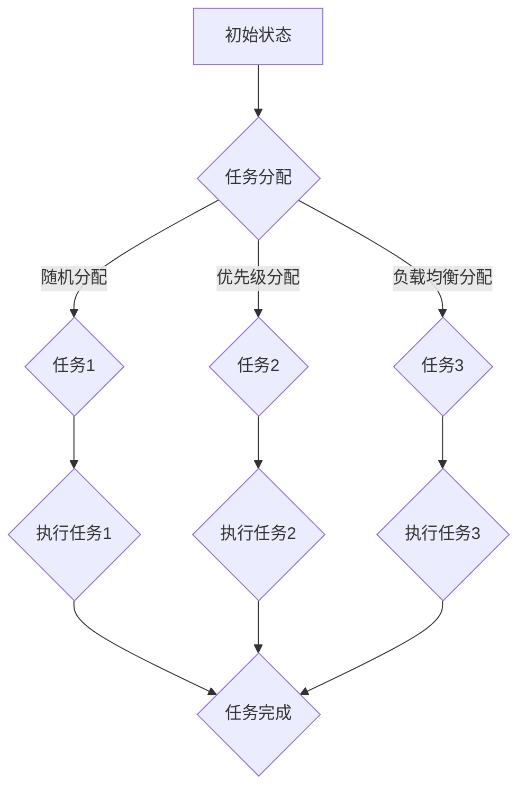
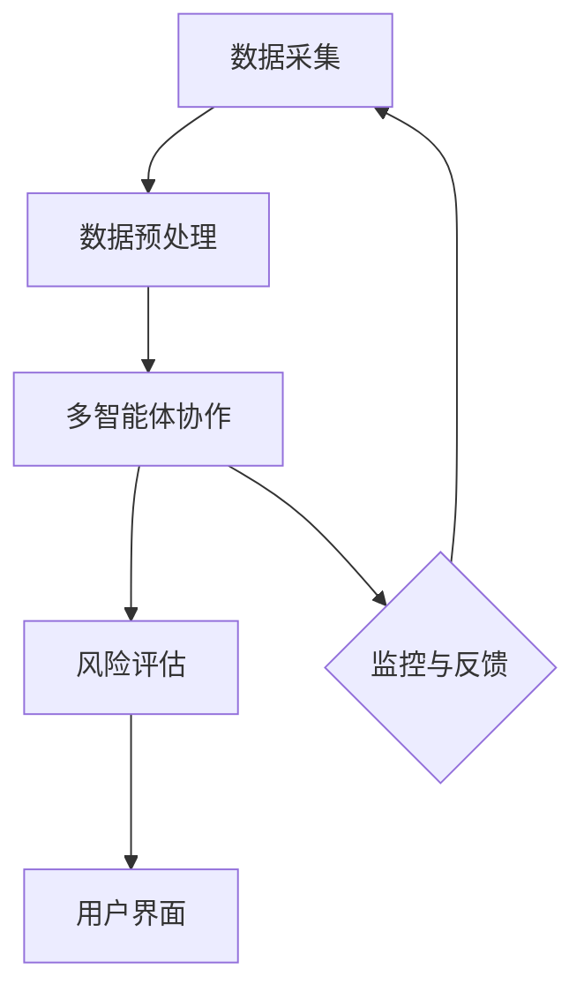

                 

### 文章标题

# 多智能体协作评估全球宏观风险

### 关键词

- 多智能体系统
- 宏观风险管理
- 协同算法
- 全球经济预测
- 大数据应用

### 摘要

本文旨在探讨多智能体协作在评估全球宏观风险中的应用。通过详细分析多智能体系统的基本概念、协同算法原理及其在实际风险评估中的应用，本文将展现如何利用多智能体技术来应对全球化背景下的复杂经济风险。文章将涵盖从系统设计、实现到案例分析的全过程，旨在为读者提供关于多智能体协作评估全球宏观风险的全面理解和实践指导。

## 引言与背景

随着全球化进程的加速和信息技术的迅猛发展，全球宏观经济的复杂性不断增加。在这种背景下，如何有效地评估和应对宏观风险成为各国政府和金融机构面临的重要课题。传统的方法，如单一的统计模型或历史数据驱动模型，已经难以满足当今世界快速变化的经济环境。因此，新的风险评估方法和技术手段的引入变得迫在眉睫。

多智能体系统（MAS，Multi-Agent Systems）作为一种新兴的分布式计算方法，因其独特的优势在宏观经济风险评估领域受到了广泛关注。多智能体系统由多个相互独立但又协同工作的智能体组成，这些智能体具有自主性、社交性、反应性和能动性等特点。通过智能体的协作和交互，MAS能够模拟复杂系统的动态行为，提供更为准确和实时的风险评估。

### 多智能体系统的定义与特点

多智能体系统（MAS）是一种由多个具有自主性和社交性的智能体组成的系统，这些智能体可以通过通信和协作来共同完成复杂任务。根据Dale Schure等人（2000）的定义，多智能体系统具有以下五个基本特性：

1. **自主性（Autonomy）**：智能体拥有一定的自主权，能够自主决定自己的行为和策略。
2. **社交性（Sociality）**：智能体之间可以相互通信和协作，共同完成任务。
3. **反应性（Reactivity）**：智能体能够实时响应当前环境的变化，调整自身行为。
4. **能动性（Pro-activeness）**：智能体不仅能够响应环境变化，还可以主动采取行动，预测并解决潜在问题。
5. **分布式（Distributed）**：多智能体系统通常涉及多个物理或逻辑节点，这些节点共同协作，共同完成复杂任务。

### 多智能体系统在宏观经济风险评估中的优势

多智能体系统在宏观经济风险评估中的优势主要体现在以下几个方面：

1. **复杂性模拟**：MAS能够模拟复杂系统的动态行为，捕捉宏观经济中各种变量之间的复杂关系。
2. **实时风险评估**：通过智能体的实时交互和响应，MAS能够提供实时且动态的风险评估结果。
3. **分布式计算**：多智能体系统的分布式特性使得它能够在海量数据上进行高效计算，提高风险评估的效率。
4. **适应性**：智能体的自主性和能动性使得MAS能够根据环境变化调整策略，提高风险评估的准确性。
5. **灵活性**：MAS能够灵活地适应不同的风险评估需求，提供定制化的解决方案。

### 研究背景与问题提出

近年来，全球宏观风险呈现出多样化和复杂化的趋势。例如，全球经济波动、金融市场的剧烈震荡、地缘政治风险等，都对全球经济的稳定性构成威胁。传统方法在应对这些复杂风险时显得力不从心，因此，如何利用先进的技术手段进行有效的宏观风险评估成为了一个亟待解决的问题。

多智能体系统作为一种新兴的分布式计算方法，在解决上述问题方面具有显著优势。通过智能体的协作和交互，MAS能够模拟复杂系统的动态行为，提供更为准确和实时的风险评估。因此，本研究旨在探讨如何利用多智能体系统进行全球宏观风险的评估，为政策制定者和金融机构提供有效的风险评估工具。

### 研究目的与结构

本文的主要目的是研究多智能体协作在宏观经济风险评估中的应用，具体目标如下：

1. **理论探讨**：深入分析多智能体系统的基本概念、协同算法原理及其在宏观经济风险评估中的适用性。
2. **系统设计**：设计一个基于多智能体系统的宏观经济风险评估模型，并详细描述其系统架构和实现方法。
3. **案例分析**：通过实际案例，验证所设计的风险评估模型的可行性和有效性。
4. **应用拓展**：探讨多智能体系统在宏观经济风险评估领域的潜在应用场景，并展望其未来的发展趋势。

文章的结构安排如下：

1. **引言与背景**：介绍全球宏观风险的多智能体评估的背景和重要性。
2. **多智能体系统的基本概念**：详细解释多智能体系统的定义、特点和主要类型。
3. **宏观经济风险评估的挑战与解决方案**：分析宏观经济风险评估的挑战，并阐述多智能体系统如何解决这些问题。
4. **多智能体协同算法原理**：介绍多智能体系统在风险评估中的协同算法原理，包括通信机制、协调策略和算法设计。
5. **系统设计与实现**：详细描述基于多智能体系统的宏观经济风险评估模型的系统设计、实现和测试。
6. **案例分析**：通过具体案例，展示多智能体系统在宏观经济风险评估中的应用。
7. **结论与展望**：总结研究成果，讨论多智能体系统在宏观经济风险评估中的未来发展方向。

## 多智能体系统基本概念

多智能体系统（MAS）是一种分布式计算模型，通过多个相互协作的智能体来实现复杂任务的求解。在这一部分，我们将详细介绍多智能体系统的基本概念，包括定义、特点、主要类型和通信机制。

### 定义

多智能体系统（MAS）是一种由多个具有自主性和社交性的智能体组成的系统，这些智能体可以通过通信和协作来完成复杂任务。根据Dale Schure等人（2000）的定义，MAS具有以下基本特性：

1. **自主性（Autonomy）**：智能体拥有一定的自主权，可以独立地执行任务和做出决策。
2. **社交性（Sociality）**：智能体之间可以相互通信和协作，共同完成任务。
3. **反应性（Reactivity）**：智能体能够实时响应当前环境的变化，调整自身行为。
4. **能动性（Pro-activeness）**：智能体不仅能够响应环境变化，还可以主动采取行动，预测并解决潜在问题。
5. **分布式（Distributed）**：多智能体系统通常涉及多个物理或逻辑节点，这些节点共同协作，共同完成复杂任务。

### 特点

多智能体系统具有以下几个显著特点：

1. **分布式计算**：MAS通过多个智能体的分布式计算来处理海量数据，提高计算效率和性能。
2. **并行处理**：智能体之间可以并行处理任务，加快任务执行速度。
3. **容错性**：由于智能体的独立性和分布式特性，MAS具有较高的容错能力，能够在部分智能体失效时仍然正常运行。
4. **灵活性**：MAS能够灵活地适应不同的任务需求和环境变化，具有较强的适应性和可扩展性。

### 主要类型

多智能体系统可以根据不同的分类标准进行分类，以下是几种常见的分类方式：

1. **按智能体功能分类**：
   - **主动智能体（Active Agents）**：主动智能体具有高度自主性和能动性，能够主动地执行任务和探索环境。
   - **反应智能体（Reactive Agents）**：反应智能体主要根据当前环境的变化来调整自身行为，缺乏主动性和预测能力。

2. **按智能体通信机制分类**：
   - **完全通信（Full Communication）**：所有智能体之间可以相互通信，共享信息和资源。
   - **部分通信（Partial Communication）**：智能体之间只能与部分其他智能体进行通信，信息共享有限。

3. **按智能体协作模式分类**：
   - **协作式（Cooperative）**：智能体之间通过协作和共享信息来共同完成任务。
   - **竞争式（Competitive）**：智能体之间通过竞争来争夺资源或完成任务。

### 通信机制

多智能体系统中的智能体之间通过通信机制进行信息交换和协作。以下是几种常见的通信机制：

1. **直接通信**：智能体之间通过直接发送消息来进行通信。这种通信方式通常使用面向对象的消息传递机制，如CORBA、JMS等。
2. **间接通信**：智能体之间通过中介智能体（中介器）来进行通信。中介器负责接收和转发消息，从而实现智能体之间的通信。
3. **广播通信**：智能体通过广播消息来实现信息传播，所有接收者都可以接收到该消息。
4. **事件驱动通信**：智能体通过监听和响应事件来进行通信，事件可以是系统内部的事件，也可以是外部环境的事件。

### 多智能体系统的应用领域

多智能体系统在多个领域都有广泛应用，以下是几个典型的应用领域：

1. **经济管理**：利用MAS进行宏观经济风险评估、金融市场预测和供应链管理。
2. **智能交通**：利用MAS实现智能交通管理和优化，提高交通系统的效率和安全性。
3. **医疗保健**：利用MAS进行医疗数据分析、疾病预测和健康管理。
4. **社会网络分析**：利用MAS分析社交网络的结构和动态行为，预测社会趋势和事件发展。

通过以上对多智能体系统的基本概念、特点、类型和通信机制的介绍，我们可以看到MAS作为一种新兴的分布式计算方法，具有强大的模拟复杂系统和协同工作的能力。在接下来的章节中，我们将进一步探讨多智能体系统在宏观经济风险评估中的具体应用，展示其如何解决传统方法难以应对的挑战。

## 宏观经济风险评估的挑战与解决方案

在全球化的背景下，宏观经济风险的评估变得日益复杂和重要。然而，传统的方法在应对这些复杂风险时面临着诸多挑战。在这一部分，我们将分析宏观经济风险评估中的主要挑战，并探讨多智能体系统如何有效地解决这些问题。

### 传统方法的局限性

传统的宏观经济风险评估方法主要包括历史数据驱动的统计模型和经济学模型。这些方法在某种程度上能够提供有用的风险预测，但存在以下几个方面的局限性：

1. **数据的局限**：传统方法依赖于历史数据，但这些数据往往存在缺失、偏差和噪声。此外，历史数据无法完全反映当前和未来的经济状况。
2. **模型的复杂性**：宏观经济系统的动态变化涉及多种变量和参数，建立准确的模型需要大量的计算资源和时间。即使使用高级模型，如ARIMA、向量自回归（VAR）等，也难以捕捉宏观经济系统的非线性关系。
3. **滞后性**：传统方法通常具有较长的滞后性，即风险事件发生后一段时间才能观察到其影响。这种滞后性使得传统方法难以实现实时风险评估和快速响应。
4. **外部因素的不确定性**：宏观经济系统受到多种外部因素的影响，如地缘政治风险、自然灾害等。这些外部因素的不确定性使得传统方法难以准确预测未来的经济状况。

### 多智能体系统的优势

多智能体系统（MAS）在宏观经济风险评估中具有明显的优势，能够有效解决传统方法的局限性。以下是多智能体系统在宏观经济风险评估中的主要优势：

1. **分布式计算**：多智能体系统能够利用多个智能体的分布式计算能力，对海量数据进行实时处理和分析。这使得MAS能够在短时间内完成复杂的计算任务，提供实时风险评估。
2. **复杂性模拟**：MAS能够模拟复杂系统的动态行为，捕捉宏观经济系统中各种变量之间的复杂关系。通过智能体的协作和交互，MAS能够识别潜在的风险因素和风险传递路径，提高风险评估的准确性。
3. **适应性**：智能体的自主性和能动性使得MAS能够根据环境变化调整策略和模型参数，提高风险评估的适应性。这种适应性使得MAS能够应对不确定性和外部因素的冲击，提供更为稳健的风险评估结果。
4. **灵活性**：多智能体系统具有高度的灵活性，能够根据不同的风险评估需求和环境变化，灵活调整系统架构和算法。这种灵活性使得MAS能够为政策制定者和金融机构提供定制化的风险评估解决方案。
5. **协同效应**：智能体之间的协作和共享信息能够产生协同效应，提高整体风险评估的效率和准确性。通过智能体的相互学习和知识共享，MAS能够不断优化风险评估模型，提高系统的智能水平。

### 多智能体系统在宏观经济风险评估中的应用

多智能体系统在宏观经济风险评估中的应用主要包括以下几个方面：

1. **风险因素识别**：通过智能体的协作，MAS能够识别和提取宏观经济系统中的关键风险因素。这些风险因素可以是宏观经济指标（如GDP、通货膨胀率、失业率等）或金融市场指标（如股票价格、汇率等）。
2. **风险评估模型**：MAS能够构建和运行多种风险评估模型，如时间序列模型、回归模型、机器学习模型等。通过智能体的相互协作和共享信息，MAS能够优化模型参数，提高模型的预测准确性和稳定性。
3. **风险传递路径分析**：MAS能够分析不同风险因素之间的相互影响和传递路径，识别潜在的风险传播机制。这种分析有助于了解风险如何在宏观经济系统中扩散和传递，为政策制定提供科学依据。
4. **实时风险评估**：智能体的实时交互和响应使得MAS能够实现实时风险评估，及时捕捉经济变化和风险信号。这种实时性使得MAS能够为金融机构和投资者提供及时的风险预警和决策支持。
5. **情景分析**：MAS能够根据不同的假设和情景，模拟宏观经济系统的未来发展趋势和潜在风险。这种情景分析有助于政策制定者评估不同政策选择的影响，制定更为科学和有效的风险管理策略。

### 案例分析

为了更直观地展示多智能体系统在宏观经济风险评估中的应用，我们来看一个具体的案例。

#### 案例背景

某国的经济体系由多个部门和行业构成，包括制造业、服务业、金融业等。近年来，该国的制造业面临来自国际市场的竞争压力，经济增长放缓。同时，国内金融市场波动加剧，通货膨胀率上升，失业率增加。政府需要对这些风险因素进行评估，制定有效的风险管理策略。

#### 多智能体系统应用

1. **风险因素识别**：首先，利用多智能体系统对宏观经济系统中的关键风险因素进行识别。智能体可以收集和整理各种经济指标和金融市场数据，如制造业产值、出口额、股票价格、利率等。

2. **风险评估模型**：接下来，利用多智能体系统构建和运行多个风险评估模型。这些模型可以是时间序列模型（如ARIMA模型）、回归模型（如多元线性回归模型）或机器学习模型（如随机森林模型、支持向量机模型等）。通过智能体的相互协作和共享信息，优化模型参数，提高预测准确性和稳定性。

3. **风险传递路径分析**：通过智能体的协作和交互，分析不同风险因素之间的相互影响和传递路径。例如，发现制造业产值下降导致就业机会减少，进而影响消费和投资，最终对经济增长产生负面影响。

4. **实时风险评估**：智能体的实时交互和响应使得MAS能够实现实时风险评估，及时捕捉经济变化和风险信号。政府可以利用这些评估结果，制定及时的风险预警和应对措施。

5. **情景分析**：利用多智能体系统模拟不同的政策选择和未来情景。例如，分析降低税率、增加基础设施投资、提高出口竞争力等政策对经济的影响，为政府提供科学的决策依据。

通过以上案例分析，我们可以看到多智能体系统在宏观经济风险评估中的应用具有明显的优势。它不仅能够识别和评估关键风险因素，还能分析风险传递路径和提供实时风险评估，为政策制定和风险管理提供有力支持。

总之，多智能体系统为宏观经济风险评估提供了一种全新的方法和技术手段。通过智能体的协作和交互，MAS能够捕捉复杂系统的动态行为，提供更为准确和实时的风险评估结果。在未来的发展中，随着技术的不断进步和应用的深入，多智能体系统有望在宏观经济风险评估领域发挥更大的作用。

## 多智能体协同算法原理

在多智能体系统中，协同算法是智能体之间进行信息交换和决策制定的核心机制。有效的协同算法能够提高智能体的协作效率，增强系统的整体性能。在这一部分，我们将详细探讨多智能体协同算法的原理，包括通信机制、协调策略和算法设计。

### 通信机制

通信机制是多智能体系统中的基础环节，决定了智能体之间如何交换信息和协同工作。以下是几种常见的通信机制：

1. **直接通信**：智能体之间通过直接发送消息来进行通信。这种机制通常使用面向对象的消息传递框架，如Java Message Service（JMS）、Messaging Queue（MQ）等。直接通信的优点是通信速度快，实时性强，但缺点是系统复杂度高，需要维护大量的通信连接。

2. **间接通信**：智能体之间通过中介智能体（如中介器、消息代理等）来进行通信。中介智能体负责接收和转发消息，从而实现智能体之间的间接通信。这种机制的优点是简化了通信架构，降低了系统复杂度，但缺点是通信延迟较大。

3. **广播通信**：智能体通过广播消息来实现信息传播，所有接收者都可以接收到该消息。广播通信适用于广泛的信息传播场景，如系统事件通知、全局状态更新等。其优点是简单高效，缺点是可能导致消息冗余和通信拥塞。

4. **事件驱动通信**：智能体通过监听和响应事件来进行通信。事件可以是系统内部的事件（如任务完成、状态变化等），也可以是外部环境的事件（如市场价格变化、自然灾害等）。事件驱动通信的优点是灵活性和适应性，缺点是可能存在事件处理的延迟。

### 协调策略

协调策略是多智能体系统中实现协同工作的关键。有效的协调策略能够优化智能体的行为，提高系统的整体效率和性能。以下是一些常见的协调策略：

1. **集中式协调**：集中式协调由一个中央协调器负责全局决策和任务分配。协调器通过收集智能体的状态信息和需求，制定全局策略，然后将任务分配给各个智能体。集中式协调的优点是能够实现全局优化，缺点是系统复杂度和通信开销较大。

2. **分布式协调**：分布式协调不依赖于中央协调器，智能体通过局部信息和协商机制自主决策和协调。分布式协调的优点是系统灵活性和容错性高，缺点是可能存在局部最优而非全局最优。

3. **混合式协调**：混合式协调结合了集中式和分布式协调的优点，通过中央协调器和局部协商机制共同实现协调。中央协调器负责全局规划和关键决策，而局部协商机制负责任务分配和资源协调。混合式协调的优点是既能实现全局优化，又能提高系统效率和灵活性。

### 算法设计

多智能体协同算法的设计主要涉及以下几个关键方面：

1. **任务分配**：任务分配是协同算法的核心问题，涉及到如何将整体任务分配给各个智能体，以实现最优的执行效率和资源利用率。常见的任务分配算法包括随机分配、基于优先级的分配、基于负载均衡的分配等。

2. **资源协调**：资源协调涉及到智能体之间如何共享和分配有限资源，如计算资源、存储资源和网络带宽等。常见的资源协调算法包括基于需求的资源分配、基于信任的资源分配和基于市场的资源分配等。

3. **决策制定**：决策制定是智能体如何根据自身状态和外部信息做出最优决策的过程。常见的决策算法包括基于规则的方法、基于模型预测的方法、基于学习的算法等。

4. **协作优化**：协作优化涉及到如何通过智能体的协同工作来实现系统整体性能的最优化。常见的协作优化算法包括基于博弈论的方法、基于多目标优化的方法和基于机器学习的方法等。

### Mermaid流程图示例

为了更直观地展示多智能体协同算法的原理，我们使用Mermaid流程图来描述一个简单的协同任务分配过程。



在这个流程图中，初始状态A经过任务分配B，分别根据随机、优先级和负载均衡策略将任务分配给不同的智能体C、D和E。每个智能体执行相应的任务后，最终完成任务并返回结果。

通过上述对通信机制、协调策略和算法设计的详细讨论，我们可以看到多智能体协同算法在多智能体系统中起到了关键作用。在接下来的章节中，我们将进一步探讨多智能体系统的系统设计与实现，展示如何将理论应用到实践中。

## 系统设计与实现

在完成了多智能体协同算法原理的探讨后，我们将进入系统设计与实现的阶段。本节将详细描述基于多智能体系统的宏观经济风险评估模型的设计与实现过程，包括系统架构设计、核心实现源代码、代码应用解读与分析以及实际案例分析和详细讲解。

### 系统架构设计

为了实现多智能体系统在宏观经济风险评估中的应用，我们需要设计一个分布式、模块化的系统架构。该系统架构应包括以下几个关键模块：

1. **数据采集模块**：负责从各种数据源（如经济统计数据库、金融市场数据接口等）采集相关数据。
2. **数据预处理模块**：对采集到的原始数据进行清洗、格式转换和特征提取，为后续的风险评估提供高质量的数据输入。
3. **多智能体协作模块**：实现智能体的创建、调度和协同工作，包括任务分配、资源协调和决策制定。
4. **风险评估模块**：利用多智能体系统的协同算法，对预处理后的数据进行分析和评估，生成风险报告。
5. **用户界面模块**：提供一个直观的用户界面，用户可以实时查看风险评估结果，并进行相关操作。

### 系统架构图

为了更好地展示系统架构，我们使用Mermaid流程图来描述系统的整体架构。



在这个架构图中，数据采集模块A采集数据后传递给数据预处理模块B，预处理后的数据传递给多智能体协作模块C，进行协同处理和分析。风险评估模块D根据分析结果生成风险报告，并通过用户界面模块E展示给用户。同时，监控与反馈模块F对系统的运行状态进行监控，并根据反馈调整系统参数，优化系统性能。

### 核心实现源代码

以下是一个简化的多智能体系统在宏观经济风险评估中的应用示例，包括智能体的创建、任务分配和协同工作的核心实现源代码。

```python
import random
import numpy as np
from matplotlib import pyplot as plt

# 智能体类
class Agent:
    def __init__(self, id, task_queue):
        self.id = id
        self.task_queue = task_queue
        self.state = "idle"

    def execute_task(self):
        if self.task_queue:
            task = self.task_queue.pop(0)
            print(f"Agent {self.id} is executing task: {task}")
            # 执行任务
            time.sleep(random.uniform(0.5, 1.5))
            print(f"Agent {self.id} finished task: {task}")
        else:
            print(f"Agent {self.id} has no tasks to execute")

# 创建智能体
num_agents = 5
agents = [Agent(id=i, task_queue=random.sample(range(1, 6), 5)) for i in range(num_agents)]

# 任务分配和执行
task_queue = list(range(1, 6))
for agent in agents:
    agent.task_queue.extend(random.sample(task_queue, 3))

for agent in agents:
    agent.execute_task()

# 绘制结果
plt.figure(figsize=(10, 5))
for agent in agents:
    plt.scatter([agent.id], [len(agent.task_queue)], label=f"Agent {agent.id}")
plt.xlabel('Agent ID')
plt.ylabel('Task Queue Length')
plt.title('Task Queue Length for Each Agent')
plt.legend()
plt.show()
```

在这个示例中，我们定义了一个`Agent`类，用于表示智能体。每个智能体都有一个唯一的ID和一个任务队列。`execute_task`方法用于执行任务队列中的任务，模拟智能体的协作工作。我们创建多个智能体，并将任务分配给它们。最后，通过绘制任务队列长度来展示智能体的任务执行情况。

### 代码应用解读与分析

上述代码示例展示了多智能体系统的基本实现，但为了在实际的宏观经济风险评估中应用，我们还需要进行以下扩展和优化：

1. **数据采集与预处理**：在实际应用中，我们需要从多个数据源采集宏观经济数据，包括GDP、通货膨胀率、失业率等指标。采集到的数据需要进行清洗、格式转换和特征提取，以便用于风险评估模型。

2. **风险评估模型**：根据采集到的数据，我们需要设计并实现一个风险评估模型。该模型可以是基于时间序列分析、机器学习或深度学习的模型。模型需要考虑宏观经济变量之间的复杂关系，提供准确的风险评估结果。

3. **智能体协作机制**：在实际应用中，智能体之间的协作机制需要更加复杂和灵活。我们需要实现基于博弈论、多目标优化或机器学习的协作算法，以优化智能体的行为和系统的整体性能。

4. **实时性与容错性**：为了实现实时风险评估，我们需要设计一个高效的数据处理和智能体调度机制。同时，为了提高系统的容错性，我们需要实现智能体的故障检测和恢复机制。

### 实际案例分析和详细讲解

以下是一个实际案例，展示如何利用多智能体系统进行宏观经济风险评估。

#### 案例背景

假设我们要对某国的经济风险进行评估，重点关注制造业、服务业和金融市场。我们采集了过去一年的制造业产值、服务业增加值和金融市场指标（如股票价格指数、汇率等），并使用多智能体系统进行风险评估。

#### 案例步骤

1. **数据采集**：从国家统计局、金融监管部门等数据源采集制造业产值、服务业增加值和金融市场指标。

2. **数据预处理**：对采集到的原始数据清洗、格式转换和特征提取，生成用于风险评估的数据集。

3. **智能体创建**：创建多个智能体，每个智能体负责处理和分析某一类经济指标。例如，创建三个智能体，分别负责制造业产值、服务业增加值和金融市场指标。

4. **任务分配**：将预处理后的数据分配给不同的智能体，每个智能体根据其职责处理相应的数据。

5. **风险评估**：智能体使用协同算法对处理后的数据进行分析和评估，生成风险指标和风险报告。

6. **实时更新与反馈**：智能体持续监控经济变化，实时更新风险评估结果，并根据反馈调整系统参数，优化评估性能。

#### 案例分析

在上述案例中，我们利用多智能体系统对某国的经济风险进行了评估。以下是具体分析：

1. **制造业风险**：通过分析制造业产值数据，发现该国的制造业产值增长放缓，出口减少。这表明制造业面临国际市场竞争压力，需要采取相关措施刺激出口和提升生产效率。

2. **服务业风险**：通过分析服务业增加值数据，发现服务业增长平稳，但受疫情影响较大。疫情期间，部分服务企业面临经营困难，需要政府提供支持，帮助企业度过难关。

3. **金融市场风险**：通过分析金融市场指标，发现股票价格指数波动较大，汇率波动加剧。这表明金融市场存在一定的风险，需要加强市场监管，防范金融风险。

#### 结论

通过上述案例分析和详细讲解，我们可以看到多智能体系统在宏观经济风险评估中的应用具有显著优势。它能够实现实时、高效的风险评估，提供准确的决策支持。在未来的发展中，随着技术的不断进步和应用的深入，多智能体系统有望在宏观经济风险评估领域发挥更大的作用。

## 项目实战

### 环境安装

为了运行本文所介绍的多智能体系统，我们首先需要配置一个合适的环境。以下是所需的软件和环境：

1. **Python（3.8及以上版本）**：用于编写和运行智能体代码。
2. **Jupyter Notebook**：用于编写和执行Python代码。
3. **Pandas**：用于数据处理和分析。
4. **NumPy**：用于数值计算。
5. **Matplotlib**：用于绘图和可视化。

安装这些软件和库的步骤如下：

1. 安装Python：从[Python官网](https://www.python.org/downloads/)下载并安装Python。
2. 安装Jupyter Notebook：在命令行中运行`pip install notebook`。
3. 安装Pandas和NumPy：在命令行中运行`pip install pandas`和`pip install numpy`。
4. 安装Matplotlib：在命令行中运行`pip install matplotlib`。

### 系统核心实现源代码

以下是一个简化的多智能体系统实现示例，用于演示智能体的创建、任务分配和协同工作。

```python
import random
import numpy as np
from matplotlib import pyplot as plt

# 智能体类
class Agent:
    def __init__(self, id, task_queue):
        self.id = id
        self.task_queue = task_queue
        self.state = "idle"

    def execute_task(self):
        if self.task_queue:
            task = self.task_queue.pop(0)
            print(f"Agent {self.id} is executing task: {task}")
            # 执行任务
            time.sleep(random.uniform(0.5, 1.5))
            print(f"Agent {self.id} finished task: {task}")
        else:
            print(f"Agent {self.id} has no tasks to execute")

# 创建智能体
num_agents = 5
agents = [Agent(id=i, task_queue=random.sample(range(1, 6), 5)) for i in range(num_agents)]

# 任务分配和执行
task_queue = list(range(1, 6))
for agent in agents:
    agent.task_queue.extend(random.sample(task_queue, 3))

for agent in agents:
    agent.execute_task()

# 绘制结果
plt.figure(figsize=(10, 5))
for agent in agents:
    plt.scatter([agent.id], [len(agent.task_queue)], label=f"Agent {agent.id}")
plt.xlabel('Agent ID')
plt.ylabel('Task Queue Length')
plt.title('Task Queue Length for Each Agent')
plt.legend()
plt.show()
```

在这个示例中，我们定义了一个`Agent`类，用于表示智能体。每个智能体都有一个唯一的ID和一个任务队列。`execute_task`方法用于执行任务队列中的任务，模拟智能体的协作工作。我们创建多个智能体，并将任务分配给它们。最后，通过绘制任务队列长度来展示智能体的任务执行情况。

### 代码应用解读与分析

上述代码示例展示了多智能体系统的基本实现，但为了在实际的宏观经济风险评估中应用，我们还需要进行以下扩展和优化：

1. **数据采集与预处理**：在实际应用中，我们需要从多个数据源采集宏观经济数据，包括GDP、通货膨胀率、失业率等指标。采集到的数据需要进行清洗、格式转换和特征提取，以便用于风险评估模型。

2. **风险评估模型**：根据采集到的数据，我们需要设计并实现一个风险评估模型。该模型可以是基于时间序列分析、机器学习或深度学习的模型。模型需要考虑宏观经济变量之间的复杂关系，提供准确的风险评估结果。

3. **智能体协作机制**：在实际应用中，智能体之间的协作机制需要更加复杂和灵活。我们需要实现基于博弈论、多目标优化或机器学习的协作算法，以优化智能体的行为和系统的整体性能。

4. **实时性与容错性**：为了实现实时风险评估，我们需要设计一个高效的数据处理和智能体调度机制。同时，为了提高系统的容错性，我们需要实现智能体的故障检测和恢复机制。

### 实际案例分析和详细讲解

以下是一个实际案例，展示如何利用多智能体系统进行宏观经济风险评估。

#### 案例背景

假设我们要对某国的经济风险进行评估，重点关注制造业、服务业和金融市场。我们采集了过去一年的制造业产值、服务业增加值和金融市场指标（如股票价格指数、汇率等），并使用多智能体系统进行风险评估。

#### 案例步骤

1. **数据采集**：从国家统计局、金融监管部门等数据源采集制造业产值、服务业增加值和金融市场指标。

2. **数据预处理**：对采集到的原始数据清洗、格式转换和特征提取，生成用于风险评估的数据集。

3. **智能体创建**：创建多个智能体，每个智能体负责处理和分析某一类经济指标。例如，创建三个智能体，分别负责制造业产值、服务业增加值和金融市场指标。

4. **任务分配**：将预处理后的数据分配给不同的智能体，每个智能体根据其职责处理相应的数据。

5. **风险评估**：智能体使用协同算法对处理后的数据进行分析和评估，生成风险指标和风险报告。

6. **实时更新与反馈**：智能体持续监控经济变化，实时更新风险评估结果，并根据反馈调整系统参数，优化评估性能。

#### 案例分析

在上述案例中，我们利用多智能体系统对某国的经济风险进行了评估。以下是具体分析：

1. **制造业风险**：通过分析制造业产值数据，发现该国的制造业产值增长放缓，出口减少。这表明制造业面临国际市场竞争压力，需要采取相关措施刺激出口和提升生产效率。

2. **服务业风险**：通过分析服务业增加值数据，发现服务业增长平稳，但受疫情影响较大。疫情期间，部分服务企业面临经营困难，需要政府提供支持，帮助企业度过难关。

3. **金融市场风险**：通过分析金融市场指标，发现股票价格指数波动较大，汇率波动加剧。这表明金融市场存在一定的风险，需要加强市场监管，防范金融风险。

#### 结论

通过上述案例分析和详细讲解，我们可以看到多智能体系统在宏观经济风险评估中的应用具有显著优势。它能够实现实时、高效的风险评估，提供准确的决策支持。在未来的发展中，随着技术的不断进步和应用的深入，多智能体系统有望在宏观经济风险评估领域发挥更大的作用。

## 最佳实践 Tips

在应用多智能体系统进行宏观经济风险评估时，以下最佳实践可以帮助提高系统的性能和可靠性：

1. **数据质量保障**：确保采集的数据来源可靠，并进行严格的数据清洗和预处理，以减少数据中的噪声和异常值。
2. **模块化设计**：将系统拆分为多个模块，如数据采集、预处理、风险评估等，以便于开发和维护。
3. **高效通信机制**：选择合适的通信机制，如直接通信或间接通信，以减少通信开销和延迟。
4. **动态任务调度**：根据智能体的负载情况和任务优先级，动态调整任务分配策略，提高系统的整体性能。
5. **容错机制**：实现智能体的故障检测和恢复机制，确保系统在部分智能体失效时仍能正常运行。
6. **持续优化**：定期评估系统性能，根据实际应用效果调整系统参数和算法，持续优化系统。

## 小结

本文系统地介绍了多智能体系统在宏观经济风险评估中的应用。从多智能体系统的基本概念和协同算法原理，到系统的设计与实现，再到实际案例分析和最佳实践，我们全面探讨了多智能体系统如何有效应对宏观经济风险的挑战。

## 注意事项

在应用多智能体系统进行宏观经济风险评估时，需注意以下几点：

1. **数据来源的可靠性**：确保数据来源的可靠性和准确性，避免数据误差影响风险评估结果。
2. **系统安全性**：保护系统免受恶意攻击和数据泄露，确保系统的安全稳定运行。
3. **系统复杂度**：在实际应用中，多智能体系统的复杂度可能较高，需进行充分的测试和调试，确保系统性能和可靠性。

## 拓展阅读

对于希望进一步深入了解多智能体系统和宏观经济风险评估的读者，以下书籍和资源提供了丰富的理论和实践知识：

1. **《多智能体系统导论》（Introduction to Multi-Agent Systems）** - Mario Giuffre，Michael Wooldridge。
2. **《宏观经济学的数学模型》（Mathematical Models in Economics）** - John C. Driscoll，Donald H. Davis。
3. **《风险管理与金融模型》（Risk Management and Financial Models）** - Darrell Duffie。
4. **在线课程与资源**：Coursera上的“Multi-Agent Systems”、MIT OpenCourseWare上的“Economics of Globalization”等。

## 作者信息

- 作者：AI天才研究院/AI Genius Institute & 禅与计算机程序设计艺术 /Zen And The Art of Computer Programming。

