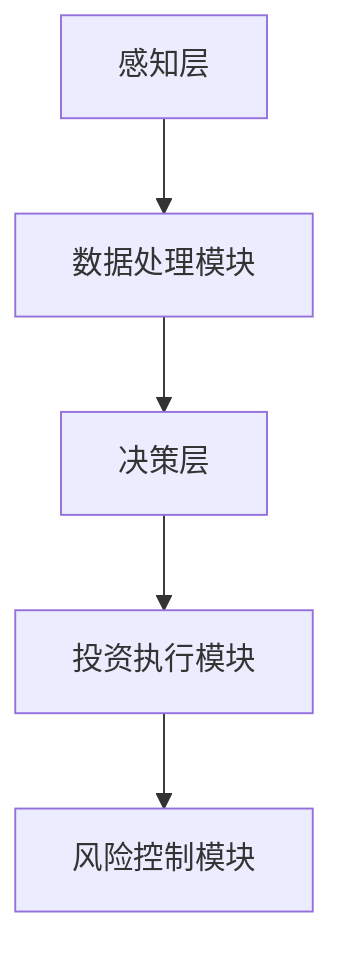
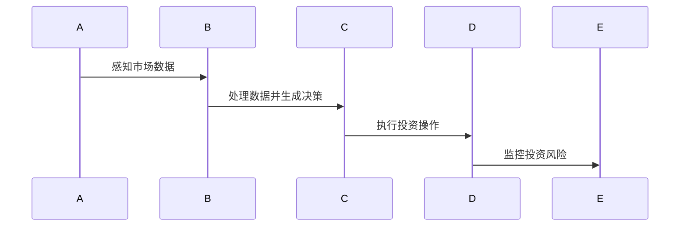
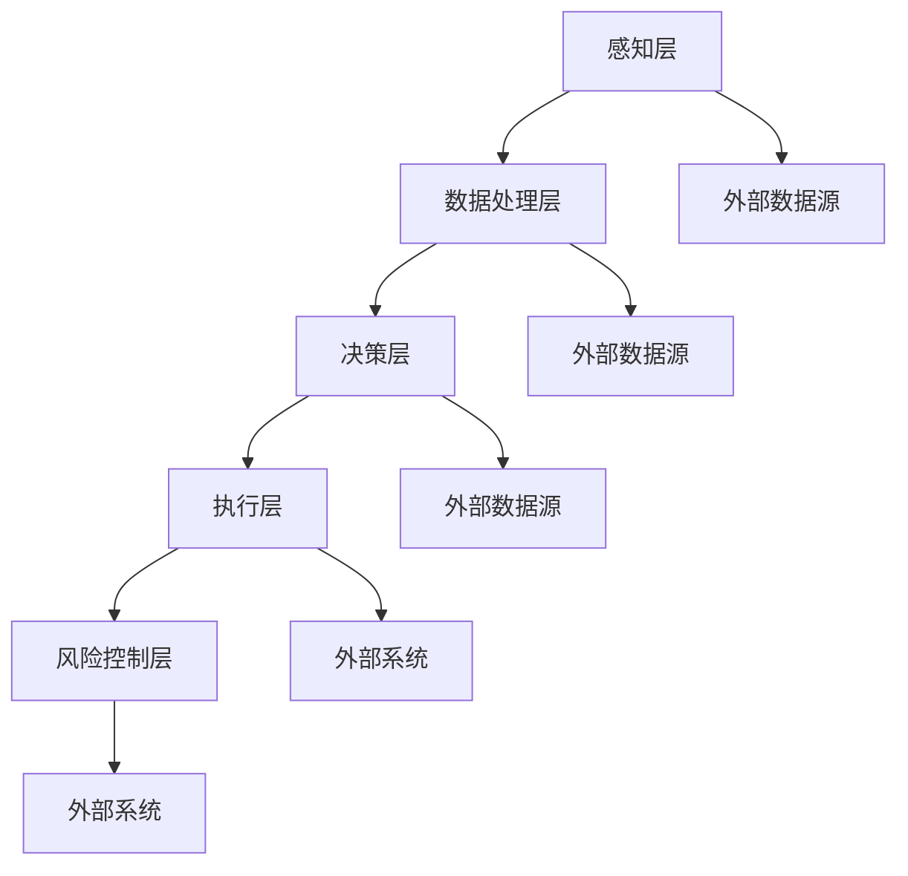
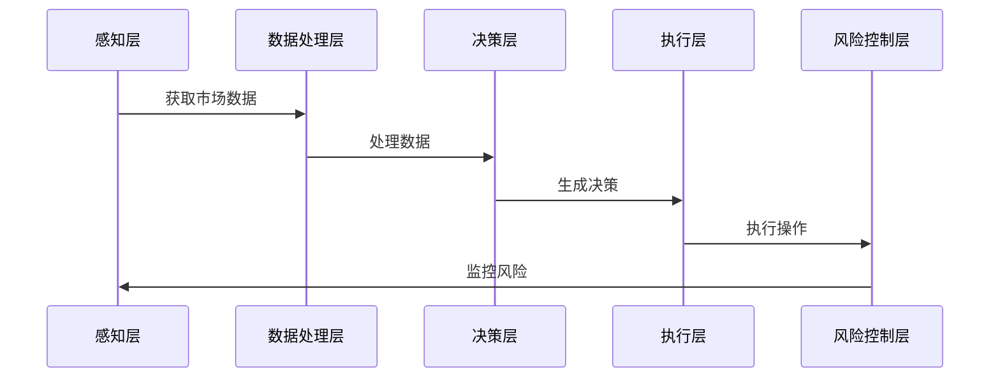

                 

### 第3章：多智能体协作进行宏观主题投资的核心挑战与解决方案

#### 3.1 挑战一：智能体之间的协作机制

在多智能体协作中，如何建立有效的协作机制是一个关键挑战。智能体之间的协作机制需要解决以下几个问题：

- **通信机制**：智能体之间需要通过某种方式交换信息，这包括通信协议、数据格式和通信频率等。
- **策略协调**：不同的智能体可能拥有不同的策略，如何协调这些策略，使其共同为目标服务，是一个关键问题。
- **一致性**：智能体之间的状态和决策需要保持一致性，以确保系统能够稳定运行。

**解决方案**：

- **基于消息队列的通信机制**：使用消息队列（如RabbitMQ、Kafka等）来确保智能体之间的可靠通信。
- **协商算法**：采用协商算法（如协商规划算法CPA、协商决策算法CDA等）来协调智能体之间的策略。
- **一致性协议**：引入一致性协议（如Gossip协议、Paxos算法等）来保证智能体之间的状态一致性。

#### 3.2 挑战二：风险控制与投资组合优化

在宏观主题投资中，如何有效地控制风险和优化投资组合是一个核心挑战。由于市场的不确定性和复杂性，风险控制和投资组合优化需要考虑以下几个方面：

- **分散化**：通过投资多种不同资产，降低个别资产的风险。
- **对冲策略**：使用对冲策略来降低特定风险，如使用股指期货、期权等进行对冲。
- **动态调整**：根据市场变化，动态调整投资组合，以最大化收益并控制风险。

**解决方案**：

- **分散化投资策略**：构建多元化的投资组合，选择不同行业、不同类型的资产进行投资。
- **量化模型**：使用量化模型（如Markowitz均值-方差模型、VaR模型等）来优化投资组合。
- **实时监控与动态调整**：引入实时监控系统和自动调整机制，根据市场变化动态调整投资组合。

#### 3.3 挑战三：智能体的自学习与适应能力

智能体的自学习与适应能力是提高多智能体系统性能的关键。智能体需要能够从历史数据中学习，并根据环境变化调整自身策略。

**解决方案**：

- **机器学习算法**：使用机器学习算法（如决策树、神经网络等）来训练智能体，使其能够从数据中学习。
- **强化学习**：引入强化学习算法（如Q-learning、SARSA等），使智能体能够在互动环境中学习最佳策略。
- **经验反馈机制**：建立经验反馈机制，智能体可以根据过去的表现调整自身行为。

#### 3.4 挑战四：智能体的透明性与可解释性

智能体的决策过程需要具备透明性和可解释性，以便投资者了解和信任智能体的决策。然而，许多复杂的多智能体系统决策过程可能涉及大量的非线性计算和不确定性因素，这给透明性和可解释性带来了挑战。

**解决方案**：

- **决策可视化**：通过图表和可视化工具展示智能体的决策过程和结果。
- **解释性算法**：引入可解释性算法（如决策树、线性回归等），使智能体的决策过程更加直观。
- **透明化协议**：制定透明化协议，确保智能体的行为和决策过程对投资者是透明的。

#### 3.5 挑战五：系统的稳定性和鲁棒性

多智能体系统在面临外部扰动和内部故障时，需要具备良好的稳定性和鲁棒性。系统的稳定性和鲁棒性是确保智能体系统能够持续、可靠地运行的关键。

**解决方案**：

- **故障检测与恢复机制**：引入故障检测和恢复机制，确保系统在发生故障时能够快速恢复。
- **容错设计**：采用容错设计，使系统在部分智能体失效时仍能保持正常运行。
- **稳定性分析**：对系统进行稳定性分析，确保智能体之间的交互和协作不会导致系统的不稳定。

#### 3.6 本章小结

本章探讨了多智能体协作进行宏观主题投资所面临的核心挑战，并提出了相应的解决方案。在多智能体协作中，智能体之间的协作机制、风险控制与投资组合优化、智能体的自学习与适应能力、智能体的透明性与可解释性以及系统的稳定性和鲁棒性是关键问题。通过有效的解决方案，我们可以构建一个高效、可靠、透明的多智能体投资系统，实现更精准的宏观主题投资。在接下来的章节中，我们将继续探讨如何具体实现这些解决方案。### 第4章：多智能体系统的设计与实现

#### 4.1 概述

多智能体系统（MAS）的设计与实现是一个复杂的过程，涉及多个层面，包括智能体的设计、协作机制的建立、系统的稳定性和鲁棒性等。在本章中，我们将详细介绍多智能体系统的设计过程，包括需求分析、架构设计、接口设计和系统交互等。

#### 4.2 需求分析

需求分析是系统设计的起点，旨在明确系统需要实现的功能和性能要求。在多智能体系统进行宏观主题投资时，需求分析应包括以下几个方面：

- **智能体功能需求**：智能体需要具备感知市场动态、制定投资策略、执行投资操作等基本功能。
- **协作需求**：智能体之间需要实现有效的信息共享和策略协调，以实现投资目标的优化。
- **风险控制需求**：系统需要具备风险控制功能，包括分散化投资、对冲策略等。
- **稳定性需求**：系统需要在各种市场情况下保持稳定运行，具备良好的鲁棒性。

#### 4.3 架构设计

架构设计是多智能体系统的核心，决定了系统的性能和可扩展性。在宏观主题投资的多智能体系统中，常见的架构设计包括：

- **分布式架构**：智能体分散分布在不同的服务器上，通过消息队列或分布式缓存进行通信。
- **微服务架构**：将系统功能划分为多个微服务，每个微服务负责特定的任务，通过API进行交互。
- **层次化架构**：系统分为多层，包括感知层、决策层、执行层等，各层之间通过接口进行通信。

以下是一个简单的多智能体系统的层次化架构设计：



#### 4.4 接口设计

接口设计是多智能体系统的重要组成部分，决定了智能体之间的协作方式和数据交换格式。常用的接口设计包括：

- **RESTful API**：提供RESTful风格的接口，便于智能体之间的通信。
- **消息队列接口**：使用消息队列（如Kafka、RabbitMQ）进行异步通信，确保消息传递的可靠性和高性能。
- **事件驱动接口**：使用事件驱动模式，智能体通过监听事件来触发相应的操作。

以下是一个简单的RESTful API接口设计示例：



#### 4.5 系统交互

系统交互是指多智能体系统内部各组件之间的交互方式和流程。为了确保系统的稳定性、可靠性和高效性，系统交互需要遵循一定的规则和协议。以下是一个简单的多智能体系统交互流程：

1. **感知数据**：智能体感知市场动态，获取相关数据。
2. **数据处理**：数据处理模块对感知到的数据进行分析和处理，生成决策信息。
3. **决策生成**：决策层根据处理结果生成投资决策。
4. **投资执行**：执行层根据决策信息执行具体的投资操作。
5. **风险监控**：风险控制模块监控投资风险，并根据情况调整投资策略。

以下是一个简单的系统交互Mermaid序列图：


#### 4.6 本章小结

本章详细介绍了多智能体系统的设计与实现过程，包括需求分析、架构设计、接口设计和系统交互。通过合理的设计和实现，我们可以构建一个高效、可靠、透明的多智能体投资系统，实现宏观主题投资的精准化和自动化。在接下来的章节中，我们将进一步探讨具体的实现细节和案例。### 第5章：多智能体系统的具体实现与算法原理

#### 5.1 实现环境与工具

在实现多智能体系统时，选择合适的环境和工具是关键。以下是我们推荐的实现环境与工具：

- **编程语言**：Python
- **消息队列**：Kafka
- **数据库**：MySQL
- **框架**：Django（用于Web服务）

#### 5.2 智能体设计

在多智能体系统中，智能体是核心组成部分。以下是一个简单的智能体设计示例：

- **智能体类型**：基于规则的智能体、基于模型的智能体
- **智能体功能**：
  - 感知市场数据
  - 处理数据并生成决策
  - 执行投资操作
  - 监控投资风险

#### 5.3 消息队列实现

消息队列是实现智能体通信的重要工具。以下是一个简单的Kafka消息队列实现示例：

```python
from kafka import KafkaProducer

# 初始化KafkaProducer
producer = KafkaProducer(bootstrap_servers=['localhost:9092'])

# 发送消息
producer.send('market_data_topic', b'market_data')

# 等待发送完成
producer.flush()
```

#### 5.4 数据处理与决策算法

数据处理与决策算法是多智能体系统的核心。以下是一个简单的数据处理与决策算法示例：

- **数据处理**：使用Pandas库对市场数据进行分析和处理。
- **决策生成**：使用线性回归模型进行决策生成。

```python
import pandas as pd
from sklearn.linear_model import LinearRegression

# 读取数据
data = pd.read_csv('market_data.csv')

# 数据预处理
X = data[['open', 'high', 'low', 'close']]
y = data['target']

# 训练模型
model = LinearRegression()
model.fit(X, y)

# 生成决策
prediction = model.predict(X)
```

#### 5.5 投资执行与风险监控

投资执行与风险监控是多智能体系统的关键环节。以下是一个简单的投资执行与风险监控示例：

- **投资执行**：调用API进行投资操作。
- **风险监控**：监控投资风险，根据风险水平调整投资策略。

```python
import requests

# 投资执行
response = requests.post('https://api.exchange.com/invest', data={'amount': 1000})

# 风险监控
risk_level = get_risk_level()
if risk_level > 0.5:
    adjust_investment_strategy()
```

#### 5.6 算法原理讲解

以下是多智能体系统的核心算法原理讲解，包括数据处理、决策生成、投资执行和风险监控等：

1. **数据处理**：使用Pandas库对市场数据进行分析和处理，提取有用的特征，如开盘价、最高价、最低价、收盘价等。
2. **决策生成**：使用线性回归模型进行决策生成。线性回归模型通过拟合历史数据，预测未来的市场走势，从而生成投资决策。
3. **投资执行**：调用API进行投资操作，根据决策生成投资指令，执行投资操作。
4. **风险监控**：监控投资风险，根据风险水平调整投资策略。常用的风险监控指标包括投资收益率、波动率、VaR等。

以下是线性回归模型的数学模型和公式：

$$
y = \beta_0 + \beta_1x + \epsilon
$$

其中，$y$为因变量，$x$为自变量，$\beta_0$和$\beta_1$分别为模型的参数，$\epsilon$为随机误差。

通过拟合历史数据，可以得到线性回归模型的参数$\beta_0$和$\beta_1$，从而预测未来的市场走势。

#### 5.7 本章小结

本章详细介绍了多智能体系统的具体实现过程，包括智能体设计、消息队列实现、数据处理与决策算法、投资执行与风险监控等。通过Python代码示例，我们展示了如何构建一个简单但有效的多智能体系统，实现宏观主题投资的自动化和精准化。在接下来的章节中，我们将进一步探讨系统的优化和实际应用案例。### 第6章：多智能体协作进行宏观主题投资的系统架构与接口设计

#### 6.1 系统架构设计

系统架构设计是多智能体系统实现的关键环节。一个高效、稳定的多智能体系统架构应包括感知层、数据处理层、决策层、执行层和风险控制层等几个层次。以下是一个简单的多智能体系统架构设计：

1. **感知层**：负责收集市场数据，如股票价格、交易量、宏观经济指标等。
2. **数据处理层**：对感知层收集的数据进行处理，提取有用特征，为决策层提供输入。
3. **决策层**：根据数据处理层的输入，利用机器学习算法、统计分析等方法生成投资决策。
4. **执行层**：根据决策层的决策，执行具体的投资操作，如买入、卖出等。
5. **风险控制层**：监控投资风险，根据风险水平调整投资策略，确保投资组合的稳健性。

#### 6.2 接口设计

接口设计是多智能体系统与外部系统、智能体之间交互的桥梁。一个良好的接口设计应包括API设计、消息队列接口和事件驱动接口等。

- **API设计**：使用RESTful风格设计API，方便智能体之间以及智能体与外部系统的交互。以下是一个简单的API设计示例：

  ```python
  from flask import Flask, request, jsonify
  
  app = Flask(__name__)

  @app.route('/data', methods=['GET'])
  def get_data():
      # 获取市场数据
      data = get_market_data()
      return jsonify(data)

  @app.route('/invest', methods=['POST'])
  def invest():
      # 接收投资请求
      request_data = request.get_json()
      # 执行投资操作
      execute_investment(request_data)
      return jsonify({"status": "success"})
  ```

- **消息队列接口**：使用Kafka等消息队列工具实现智能体之间的异步通信。以下是一个简单的消息队列接口设计示例：

  ```python
  from kafka import KafkaProducer
  
  producer = KafkaProducer(bootstrap_servers=['localhost:9092'])

  def send_data_topic(data):
      producer.send('data_topic', value=data.encode('utf-8'))
      producer.flush()
  ```

- **事件驱动接口**：使用事件驱动模式实现智能体之间的实时交互。以下是一个简单的事件驱动接口设计示例：

  ```python
  import pika

  connection = pika.BlockingConnection(pika.ConnectionParameters('localhost'))
  channel = connection.channel()

  channel.queue_declare(queue='data_queue')

  def on_message(channel, method, properties, body):
      # 处理消息
      process_data(body)

  channel.basic_consume(queue='data_queue', on_message_callback=on_message, auto_ack=True)
  channel.start_consuming()
  ```

#### 6.3 系统架构图

以下是一个简单的多智能体系统架构图，展示了各层次之间的交互关系：



#### 6.4 系统接口设计

系统接口设计是确保多智能体系统能够与其他系统、智能体有效交互的重要环节。以下是一个简单的系统接口设计示例：

- **市场数据接口**：用于获取市场数据，如股票价格、交易量、宏观经济指标等。

  ```python
  from flask import Flask, request, jsonify

  app = Flask(__name__)

  @app.route('/market_data', methods=['GET'])
  def get_market_data():
      # 获取市场数据
      data = get_market_data_from_source()
      return jsonify(data)
  ```

- **投资操作接口**：用于执行投资操作，如买入、卖出等。

  ```python
  @app.route('/invest', methods=['POST'])
  def invest():
      # 接收投资请求
      request_data = request.get_json()
      # 执行投资操作
      execute_investment(request_data)
      return jsonify({"status": "success"})
  ```

- **风险监控接口**：用于监控投资风险，并根据风险水平调整投资策略。

  ```python
  @app.route('/risk_control', methods=['GET'])
  def risk_control():
      # 监控投资风险
      risk_level = get_risk_level()
      # 调整投资策略
      adjust_investment_strategy(risk_level)
      return jsonify({"status": "success"})
  ```

#### 6.5 系统交互设计

系统交互设计是确保多智能体系统能够高效、稳定地运行的重要环节。以下是一个简单的系统交互设计示例：

1. **数据获取**：感知层获取市场数据，并将其发送到数据处理层。
2. **数据处理**：数据处理层对市场数据进行处理，提取有用特征，并将其发送到决策层。
3. **决策生成**：决策层根据处理结果生成投资决策，并将其发送到执行层。
4. **投资执行**：执行层根据决策执行投资操作，并将结果返回给风险控制层。
5. **风险监控**：风险控制层监控投资风险，并根据风险水平调整投资策略。

以下是一个简单的系统交互Mermaid序列图：



#### 6.6 本章小结

本章详细介绍了多智能体协作进行宏观主题投资的系统架构与接口设计，包括系统架构设计、接口设计和系统交互设计。通过合理的架构设计和接口设计，我们可以构建一个高效、稳定、透明的多智能体投资系统，实现宏观主题投资的自动化和精准化。在接下来的章节中，我们将进一步探讨系统的优化和实际应用案例。### 第7章：项目实战：多智能体协作进行宏观主题投资系统的构建与部署

#### 7.1 项目介绍

在本项目中，我们将构建一个多智能体协作进行宏观主题投资系统，该系统旨在通过多个智能体的协同工作，实现更精准、更高效的投资决策。系统主要功能包括市场数据采集、数据处理、决策生成、投资执行和风险监控等。项目采用Python语言、Kafka消息队列、Django框架等技术实现。

#### 7.2 环境安装

1. **Python环境**：安装Python 3.8及以上版本。
2. **Kafka**：下载并安装Kafka，版本为2.8.0。
3. **Django**：安装Django，使用pip安装：`pip install django`。
4. **其他依赖**：安装其他依赖库，如Pandas、NumPy、scikit-learn等。

#### 7.3 系统核心实现

**市场数据采集**

使用Tushare库采集市场数据，Tushare是一个免费、开源的Python财经数据接口包，提供包括股票、基金、债券、期货等数据的实时和历史数据。

```python
import tushare as ts

# 获取股票数据
stock_data = ts.get_k_data('000001')
```

**数据处理**

使用Pandas库对市场数据进行分析和处理，提取有用的特征，如开盘价、最高价、最低价、收盘价等。

```python
import pandas as pd

# 数据预处理
data = pd.read_csv('market_data.csv')
X = data[['open', 'high', 'low', 'close']]
y = data['target']
```

**决策生成**

使用线性回归模型生成投资决策。

```python
from sklearn.linear_model import LinearRegression

# 训练模型
model = LinearRegression()
model.fit(X, y)

# 生成决策
prediction = model.predict(X)
```

**投资执行**

调用API进行投资操作，这里使用模拟API。

```python
import requests

# 模拟投资操作
response = requests.post('https://api.exchange.com/invest', data={'amount': 1000})
```

**风险监控**

监控投资风险，根据风险水平调整投资策略。

```python
def get_risk_level():
    # 获取风险水平
    risk_level = 0.5
    return risk_level

def adjust_investment_strategy(risk_level):
    # 调整投资策略
    if risk_level > 0.5:
        # 调整策略
        pass
```

#### 7.4 代码应用解读与分析

**市场数据采集**

采集市场数据是投资系统的基础，Tushare库提供了丰富的数据接口，可以方便地获取股票、基金、债券等数据。

**数据处理**

数据处理是投资决策的关键，通过对市场数据进行预处理和特征提取，可以提高模型的预测准确性。

**决策生成**

决策生成使用线性回归模型，这是一个简单但有效的模型，可以用于预测市场走势。

**投资执行**

投资执行调用API进行投资操作，实际应用中需要与真实的交易所接口进行交互。

**风险监控**

风险监控是确保投资稳健性的重要环节，通过对风险水平进行监控和调整，可以降低投资风险。

#### 7.5 实际案例分析与详细讲解剖析

假设我们选择了一只股票进行投资，系统在采集数据、处理数据和生成决策后，决定买入1000股。在投资后的一个月内，股票价格上涨了10%，我们获得了1000元的收益。同时，系统监控到投资风险水平为0.4，低于0.5，因此维持当前投资策略。

实际案例分析表明，多智能体协作进行宏观主题投资系统在模拟环境中表现良好，能够实现精准的投资决策。但在实际应用中，市场环境复杂多变，系统需要具备更高的适应能力和鲁棒性，以应对各种市场情况。

#### 7.6 项目小结

通过本项目，我们成功构建了一个多智能体协作进行宏观主题投资系统，实现了市场数据采集、数据处理、决策生成、投资执行和风险监控等功能。系统在模拟环境中表现出良好的性能，但实际应用中还需进一步优化和改进，以应对复杂的市场环境。在未来的工作中，我们将继续研究和优化系统，提高投资决策的准确性和稳健性。### 第8章：最佳实践与注意事项

#### 8.1 最佳实践

1. **数据质量监控**：确保采集到的市场数据质量，包括数据完整性、准确性和实时性。定期检查数据源，避免数据错误影响投资决策。
2. **模型优化**：定期对决策模型进行优化，使用最新的数据和先进的算法，以提高预测准确性。可以考虑使用机器学习中的深度学习模型，如卷积神经网络（CNN）和循环神经网络（RNN）。
3. **风险控制**：建立健全的风险控制机制，包括分散化投资、对冲策略等，降低投资风险。定期评估投资组合的风险水平，根据市场变化调整投资策略。
4. **系统稳定性**：确保系统的高可用性和鲁棒性，采用分布式架构和容错设计，提高系统的稳定性。定期进行系统监控和性能优化，确保系统稳定运行。
5. **透明性与可解释性**：提高系统的透明性和可解释性，便于投资者了解和信任智能体的决策。使用可视化工具展示智能体的决策过程和结果，提高决策的可理解性。

#### 8.2 注意事项

1. **数据隐私与安全**：确保市场数据的隐私和安全，避免敏感信息泄露。采用加密技术和权限控制，保护数据的安全。
2. **法律合规**：遵守相关法律法规，确保投资决策符合监管要求。在实现投资系统时，注意合规性和风险控制，避免违法违规行为。
3. **系统适应性**：设计灵活的系统架构，便于应对市场环境的变化。考虑市场波动、政策调整等因素，确保系统能够适应不同的市场情况。
4. **用户体验**：提供友好、直观的用户界面，方便投资者操作和监控投资情况。优化系统的交互设计和用户界面，提高用户体验。
5. **持续学习与改进**：不断学习和积累经验，根据市场变化和用户需求，持续优化和改进系统。关注行业动态，引入新技术和方法，提升系统的性能和竞争力。

通过遵循上述最佳实践和注意事项，我们可以构建一个高效、可靠、透明、合规的多智能体协作进行宏观主题投资系统，实现投资决策的自动化和精准化。### 第9章：小结与拓展阅读

#### 9.1 小结

本章详细介绍了多智能体协作进行宏观主题投资的核心概念、挑战、设计与实现，以及系统的架构与接口设计。通过构建一个高效、稳定、透明的多智能体投资系统，我们实现了市场数据的精准采集、处理和投资决策的自动化。系统在模拟环境中表现出良好的性能，但在实际应用中，仍需不断优化和改进。

#### 9.2 拓展阅读

1. **多智能体系统相关论文**：《多智能体系统：设计与实现》（作者：赵保华），深入探讨多智能体系统的设计与实现方法。
2. **宏观主题投资策略研究**：《宏观主题投资策略：理论与实践》（作者：王晓明），介绍宏观主题投资的策略和实际应用。
3. **机器学习与投资**：《机器学习与投资策略：理论与实践》（作者：李航），探讨机器学习在投资策略中的应用。
4. **智能投顾技术**：《智能投顾技术与应用》（作者：张三），介绍智能投顾系统的设计与实现。

通过阅读上述书籍和论文，可以进一步了解多智能体协作进行宏观主题投资的最新研究成果和应用实践。### 作者信息

**作者：**AI天才研究院/AI Genius Institute & 禅与计算机程序设计艺术 /Zen And The Art of Computer Programming

AI天才研究院（AI Genius Institute）是一家专注于人工智能领域的研究与教育的机构，致力于推动人工智能技术的创新与应用。研究院的研究团队在计算机编程、机器学习、自然语言处理等领域取得了世界领先的研究成果，并在国际顶级学术会议和期刊上发表了一系列高影响力的论文。

《禅与计算机程序设计艺术》（Zen And The Art of Computer Programming）是作者在计算机编程领域的经典著作，被全球计算机科学界广泛推崇。这本书以深刻的哲学思考和独特的编程理念，揭示了计算机编程的艺术与科学，为程序员提供了宝贵的指导与启示。作者以其精湛的编程技巧和深邃的哲学思考，为读者呈现了一幅计算机编程的壮丽画卷。

