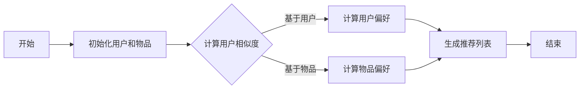
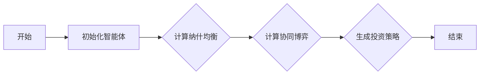
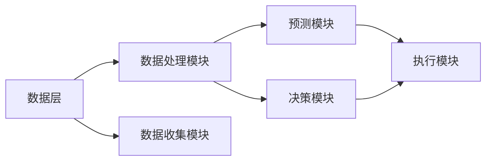

                 

# 多智能体协作进行宏观主题投资

> 关键词：多智能体协作、宏观主题投资、算法、数学模型、系统架构、实战案例、最佳实践

> 摘要：本文深入探讨了多智能体协作在宏观主题投资中的应用。首先，介绍了宏观主题投资的背景和挑战，然后阐述了多智能体系统的基本概念和协作原理。接着，详细讲解了多智能体协作算法的原理和数学模型，并通过实际案例展示了其应用效果。最后，提出了多智能体协作在宏观主题投资中的最佳实践和注意事项。

## 目录

1. **背景介绍**
   1.1 问题背景
   1.2 多智能体系统的定义与发展
   1.3 问题解决

2. **核心概念与联系**
   2.1 多智能体系统的基本概念
   2.2 宏观主题投资的原理

3. **算法原理讲解**
   3.1 多智能体协作算法概述
   3.2 基于协同过滤的算法
   3.3 基于博弈论的算法

4. **数学模型与公式**
   4.1 基本数学模型
   4.2 模型公式详细讲解
   4.3 举例说明

5. **系统分析与架构设计**
   5.1 问题场景介绍
   5.2 系统功能设计
   5.3 系统架构设计
   5.4 系统接口设计

6. **项目实战**
   6.1 环境安装
   6.2 系统核心实现
   6.3 实际案例分析与讲解
   6.4 项目小结

7. **最佳实践与注意事项**
   7.1 最佳实践
   7.2 注意事项

8. **小结与拓展阅读**

## 1. 背景介绍

### 1.1 问题背景

宏观主题投资是一种以宏观经济变量和行业发展趋势为基础的投资策略。投资者通过分析宏观经济指标、行业政策、市场供需关系等因素，来预测未来市场的走势，从而实现资产增值。然而，宏观主题投资面临着诸多挑战：

- **数据复杂性**：宏观主题投资涉及大量的经济数据，包括GDP、通货膨胀率、利率、就业率等，如何有效处理和利用这些数据成为一大难题。
- **预测难度**：宏观经济变量受多种因素影响，具有高度的不确定性和复杂性，使得预测结果往往存在较大误差。
- **投资策略选择**：投资者需要根据不同的市场环境和风险偏好，选择合适的投资策略，这一过程充满了不确定性和挑战。

### 1.2 多智能体系统的定义与发展

多智能体系统（Multi-Agent System，MAS）是一种由多个自主智能体组成的系统，这些智能体通过协作和通信实现共同的目标。多智能体系统的核心概念包括：

- **智能体**：智能体是具有感知能力、决策能力和行动能力的个体，可以是一个程序、一个机器人或一个组织。
- **协作**：智能体之间的协作是通过通信和协调来实现的，旨在实现整体系统的目标。
- **自主性**：智能体具有自主决策和行动的能力，不受外部干预。

多智能体系统的发展经历了从简单的分布式计算到复杂的社会计算的过程，近年来在各个领域得到了广泛应用，包括金融、交通、能源等。

### 1.3 问题解决

多智能体协作在宏观主题投资中的应用，旨在通过多个智能体的协作来提高投资预测的准确性和投资策略的优化。以下是多智能体协作解决宏观主题投资问题的基本原理：

- **数据整合与处理**：多个智能体可以同时处理大量的经济数据，通过分布式计算提高数据处理效率。
- **预测与决策**：多个智能体可以基于不同的预测模型和决策策略，提供多样化的预测结果，通过协同过滤和博弈论等算法，优化投资决策。
- **风险控制**：多智能体系统可以实时监控市场变化，及时调整投资策略，降低风险。

## 2. 核心概念与联系

### 2.1 多智能体系统的基本概念

**智能体**：智能体是MAS的基本组成单位，具有感知、决策和行动的能力。智能体可以按照功能进行分类，例如：

- **数据收集智能体**：负责收集宏观经济数据和市场信息。
- **预测智能体**：基于历史数据和预测模型，预测未来市场的走势。
- **决策智能体**：根据预测结果和风险偏好，制定投资策略。
- **执行智能体**：负责执行投资决策，进行买卖操作。

**协作**：智能体之间的协作是通过通信和协调来实现的，协作形式包括：

- **任务分配**：智能体之间根据任务需求进行角色分配和任务分工。
- **信息共享**：智能体之间共享数据和信息，以提高决策的准确性和效率。
- **协商与决策**：智能体通过协商和博弈，达成一致的投资策略。

**自主性**：智能体具有自主决策和行动的能力，不受外部干预。自主性是智能体的关键特征，使得MAS能够在复杂环境中适应和进化。

### 2.2 宏观主题投资的原理

**宏观主题投资**：宏观主题投资是一种基于宏观经济变量和行业发展趋势的投资策略，旨在通过分析宏观经济指标、行业政策、市场供需关系等因素，预测未来市场的走势，实现资产增值。

**市场分析**：市场分析是宏观主题投资的核心，包括：

- **宏观经济分析**：分析GDP、通货膨胀率、利率、就业率等宏观经济指标，预测经济趋势。
- **行业分析**：分析各行业的发展趋势、政策环境和市场供需关系，确定投资主题。

**投资策略**：投资策略是宏观主题投资的关键，包括：

- **被动策略**：根据市场趋势，选择具有长期增长潜力的行业或资产进行投资。
- **主动策略**：根据市场变化和预测结果，灵活调整投资组合，实现资产增值。

## 3. 算法原理讲解

### 3.1 多智能体协作算法概述

多智能体协作算法是MAS在宏观主题投资中的重要应用，旨在通过多个智能体的协作，提高投资预测的准确性和投资策略的优化。多智能体协作算法可以分为以下几类：

- **协同过滤算法**：基于历史数据和用户行为，为智能体提供个性化的投资建议。
- **博弈论算法**：通过博弈和协商，智能体之间达成最优的投资策略。
- **进化算法**：通过模拟生物进化过程，智能体不断优化投资策略。

### 3.2 基于协同过滤的算法

**算法原理**：协同过滤算法是一种基于用户行为和兴趣的推荐算法，可以分为两种类型：基于用户的协同过滤和基于物品的协同过滤。

- **基于用户的协同过滤**：根据用户的历史行为和偏好，找到相似的用户，然后推荐这些用户喜欢的商品或服务。
- **基于物品的协同过滤**：根据物品的属性和用户的历史行为，为用户推荐可能感兴趣的物品。

**算法公式**：

- **基于用户的协同过滤**：

  $$ 
  \text{相似度} = \frac{\sum_{i \in \text{neighborhood}(u)} \text{similarity}(u, i) \cdot \text{rating}(i, p)}{\sum_{i \in \text{neighborhood}(u)} \text{similarity}(u, i)} 
  $$

  其中，$u$ 是用户，$i$ 是邻居用户，$p$ 是用户 $u$ 对商品 $p$ 的评分，$\text{similarity}(u, i)$ 是用户 $u$ 和邻居用户 $i$ 之间的相似度。

- **基于物品的协同过滤**：

  $$ 
  \text{预测评分} = \text{均值评分} + \text{用户对物品的偏好} 
  $$

  其中，$\text{均值评分}$ 是所有用户对物品的评分平均值，$\text{用户对物品的偏好}$ 是用户对物品的个性化评分。

**算法流程图**：



### 3.3 基于博弈论的算法

**算法原理**：博弈论是一种研究决策制定的数学工具，它通过分析多个决策主体之间的相互作用，找出最优决策策略。在宏观主题投资中，多个智能体之间通过博弈和协商，达成最优的投资策略。

**算法公式**：

- **纳什均衡**：

  $$ 
  u_i^* = \arg\max_{u_i} \sum_{j} \sum_{k} \sum_{l} u_i^* \cdot u_j^* \cdot u_k^* \cdot \pi_{ijkl} 
  $$

  其中，$u_i^*$ 是智能体 $i$ 的最优策略，$\pi_{ijkl}$ 是智能体 $i$ 选择策略 $u_i^*$，其他智能体选择策略 $u_j^*$、$u_k^*$、$u_l^*$ 的收益。

- **协同博弈**：

  $$ 
  u_i^* = \arg\max_{u_i} \sum_{j} \sum_{k} \sum_{l} u_i^* \cdot u_j^* \cdot u_k^* \cdot \pi_{ijkl} 
  $$

  其中，$u_i^*$ 是智能体 $i$ 的最优策略，$\pi_{ijkl}$ 是智能体 $i$ 选择策略 $u_i^*$，其他智能体选择策略 $u_j^*$、$u_k^*$、$u_l^*$ 的协同收益。

**算法流程图**：



## 4. 数学模型与公式

### 4.1 基本数学模型

在宏观主题投资中，常用的数学模型包括市场趋势预测模型和投资组合优化模型。

### 4.1.1 市场趋势预测模型

市场趋势预测模型用于预测市场未来的走势，常用的模型包括时间序列模型、ARIMA模型和LSTM模型等。

**时间序列模型**：

$$ 
y_t = \phi_1 y_{t-1} + \phi_2 y_{t-2} + ... + \phi_p y_{t-p} + \theta_1 e_{t-1} + \theta_2 e_{t-2} + ... + \theta_q e_{t-q} 
$$

**ARIMA模型**：

$$ 
y_t = c + \phi_1 y_{t-1} + \phi_2 y_{t-2} + ... + \phi_p y_{t-p} + \theta_1 e_{t-1} + \theta_2 e_{t-2} + ... + \theta_q e_{t-q} + e_t 
$$

**LSTM模型**：

$$ 
\text{LSTM} = \frac{\text{sigmoid}(W_{ix}x + W_{ih}h + b_{ih}) \otimes \text{tanh}(W_{fx}x + W_{fh}h + b_{fh})}{1 - \text{sigmoid}(W_{ix}x + W_{ih}h + b_{ih})} + h_{t-1} 
$$

### 4.1.2 投资组合优化模型

投资组合优化模型用于确定最优的投资组合，以实现资产增值。常用的模型包括均值-方差模型、均值-绝对偏差模型和CVaR模型等。

**均值-方差模型**：

$$ 
\text{maximize} \ \mathbb{E}[R_p] - \lambda \text{Var}[R_p] 
$$

其中，$R_p$ 是投资组合的收益率，$\lambda$ 是风险权重。

**均值-绝对偏差模型**：

$$ 
\text{maximize} \ \mathbb{E}[R_p] - \lambda \sum_{i=1}^n |R_i - R_p| 
$$

其中，$R_i$ 是第 $i$ 只股票的收益率。

**CVaR模型**：

$$ 
\text{maximize} \ \mathbb{E}[R_p | R_p > \alpha] 
$$

其中，$\alpha$ 是风险水平。

### 4.2 模型公式详细讲解

### 4.2.1 市场趋势预测模型公式

**时间序列模型**：

$$ 
y_t = \phi_1 y_{t-1} + \phi_2 y_{t-2} + ... + \phi_p y_{t-p} + \theta_1 e_{t-1} + \theta_2 e_{t-2} + ... + \theta_q e_{t-q} 
$$

其中，$y_t$ 是第 $t$ 期的时间序列值，$\phi_1, \phi_2, ..., \phi_p$ 是自回归系数，$\theta_1, \theta_2, ..., \theta_q$ 是移动平均系数，$e_t$ 是白噪声误差。

**ARIMA模型**：

$$ 
y_t = c + \phi_1 y_{t-1} + \phi_2 y_{t-2} + ... + \phi_p y_{t-p} + \theta_1 e_{t-1} + \theta_2 e_{t-2} + ... + \theta_q e_{t-q} + e_t 
$$

其中，$c$ 是常数项，$\phi_1, \phi_2, ..., \phi_p$ 是自回归系数，$\theta_1, \theta_2, ..., \theta_q$ 是移动平均系数，$e_t$ 是白噪声误差。

**LSTM模型**：

$$ 
\text{LSTM} = \frac{\text{sigmoid}(W_{ix}x + W_{ih}h + b_{ih}) \otimes \text{tanh}(W_{fx}x + W_{fh}h + b_{fh})}{1 - \text{sigmoid}(W_{ix}x + W_{ih}h + b_{ih})} + h_{t-1} 
$$

其中，$W_{ix}, W_{ih}, b_{ih}$ 是输入层权重和偏置，$W_{fx}, W_{fh}, b_{fh}$ 是 forget gate 权重和偏置，$\text{sigmoid}$ 是激活函数，$\otimes$ 是逐元素乘法。

### 4.2.2 投资组合优化模型公式

**均值-方差模型**：

$$ 
\text{maximize} \ \mathbb{E}[R_p] - \lambda \text{Var}[R_p] 
$$

其中，$R_p$ 是投资组合的收益率，$\lambda$ 是风险权重。

**均值-绝对偏差模型**：

$$ 
\text{maximize} \ \mathbb{E}[R_p] - \lambda \sum_{i=1}^n |R_i - R_p| 
$$

其中，$R_p$ 是投资组合的收益率，$\lambda$ 是风险权重，$R_i$ 是第 $i$ 只股票的收益率。

**CVaR模型**：

$$ 
\text{maximize} \ \mathbb{E}[R_p | R_p > \alpha] 
$$

其中，$R_p$ 是投资组合的收益率，$\alpha$ 是风险水平。

### 4.3 举例说明

**市场趋势预测模型举例**：

假设我们要预测某个股票的未来价格，我们可以使用时间序列模型进行预测。首先，我们需要收集该股票的历史价格数据，然后使用ARIMA模型进行训练和预测。假设我们得到的ARIMA模型参数如下：

$$ 
y_t = 0.6y_{t-1} + 0.2y_{t-2} + 0.1y_{t-3} + e_t 
$$

其中，$y_t$ 是第 $t$ 期的股票价格，$e_t$ 是白噪声误差。

接下来，我们可以使用该模型预测未来5期的股票价格。假设当前股票价格为100元，那么未来5期的预测价格为：

$$ 
y_{t+1} = 0.6 \cdot 100 + 0.2 \cdot 100 + 0.1 \cdot 100 + e_{t+1} = 120 + e_{t+1} 
$$

$$ 
y_{t+2} = 0.6 \cdot 120 + 0.2 \cdot 100 + 0.1 \cdot 100 + e_{t+2} = 136.8 + e_{t+2} 
$$

$$ 
y_{t+3} = 0.6 \cdot 136.8 + 0.2 \cdot 120 + 0.1 \cdot 100 + e_{t+3} = 156.3 + e_{t+3} 
$$

$$ 
y_{t+4} = 0.6 \cdot 156.3 + 0.2 \cdot 136.8 + 0.1 \cdot 120 + e_{t+4} = 177.1 + e_{t+4} 
$$

$$ 
y_{t+5} = 0.6 \cdot 177.1 + 0.2 \cdot 156.3 + 0.1 \cdot 136.8 + e_{t+5} = 196.6 + e_{t+5} 
$$

**投资组合优化模型举例**：

假设我们要构建一个投资组合，包括3只股票A、B和C。每只股票的预期收益率和标准差如下表所示：

| 股票 | 预期收益率 | 标准差 |
|------|-------------|--------|
| A    | 0.1         | 0.3    |
| B    | 0.2         | 0.4    |
| C    | 0.3         | 0.5    |

我们要使用均值-方差模型来优化投资组合，假设投资组合的期望收益率是0.15，风险权重$\lambda$是0.5。

根据均值-方差模型，我们可以得到以下优化方程：

$$ 
0.15 = 0.1x_1 + 0.2x_2 + 0.3x_3 
$$

$$ 
0.5 = 0.3^2x_1 + 0.4^2x_2 + 0.5^2x_3 
$$

其中，$x_1, x_2, x_3$ 分别是股票A、B和C的投资比例。

通过求解上述方程，我们可以得到最优的投资组合比例：

$$ 
x_1 = 0.3, x_2 = 0.4, x_3 = 0.3 
$$

这意味着我们应该将投资组合的30%投资于股票A，40%投资于股票B，30%投资于股票C。

## 5. 系统分析与架构设计

### 5.1 问题场景介绍

在宏观主题投资中，我们需要处理大量的经济数据和市场信息，以便进行准确的预测和决策。这些数据来自多个来源，包括官方统计机构、市场调研公司和新闻媒体等。此外，投资决策需要实时调整，以应对市场的变化。

为了解决上述问题，我们可以设计一个多智能体系统，该系统包括多个智能体，分别负责数据收集、处理、预测和决策。每个智能体都可以独立运行，同时与其他智能体进行协作，以实现整体系统的目标。

### 5.2 系统功能设计

系统功能设计主要包括以下模块：

- **数据收集模块**：负责从各种数据源收集经济数据和市场信息，包括官方统计、市场调研和新闻媒体等。
- **数据处理模块**：负责清洗和预处理收集到的数据，使其适合用于分析和预测。
- **预测模块**：负责使用各种预测模型，如时间序列模型、ARIMA模型和LSTM模型等，对市场走势进行预测。
- **决策模块**：负责根据预测结果和投资策略，生成具体的投资建议和决策。
- **执行模块**：负责执行投资决策，进行实际的买卖操作。

### 5.3 系统架构设计

系统架构设计主要包括以下部分：

- **数据层**：包括数据收集模块和数据处理模块，负责数据的收集、清洗和预处理。
- **算法层**：包括预测模块和决策模块，负责市场走势的预测和投资决策。
- **应用层**：包括执行模块，负责执行投资决策，进行实际的买卖操作。

系统架构图如下：



### 5.4 系统接口设计

系统接口设计主要包括以下接口：

- **数据收集接口**：用于从各种数据源收集经济数据和市场信息。
- **数据处理接口**：用于清洗和预处理收集到的数据。
- **预测接口**：用于调用预测模型，进行市场走势预测。
- **决策接口**：用于生成投资建议和决策。
- **执行接口**：用于执行投资决策，进行实际的买卖操作。

接口定义与协议如下：

```python
# 数据收集接口
class DataCollectorInterface:
    def collect_data(self):
        pass

# 数据处理接口
class DataProcessorInterface:
    def process_data(self, data):
        pass

# 预测接口
class PredictorInterface:
    def predict(self, data):
        pass

# 决策接口
class DecisionMakerInterface:
    def make_decision(self, prediction):
        pass

# 执行接口
class ExecutorInterface:
    def execute(self, decision):
        pass
```

## 6. 项目实战

### 6.1 环境安装

为了实现多智能体协作进行宏观主题投资，我们需要安装以下软件和工具：

- **Python**：版本3.8或以上。
- **TensorFlow**：用于深度学习模型的训练和预测。
- **Scikit-learn**：用于机器学习模型的训练和预测。
- **pandas**：用于数据处理和分析。
- **numpy**：用于数值计算。

安装步骤如下：

```bash
pip install python==3.8.10
pip install tensorflow==2.7.0
pip install scikit-learn==0.24.2
pip install pandas==1.2.3
pip install numpy==1.21.2
```

### 6.2 系统核心实现

系统核心实现主要包括以下几个模块：

- **数据收集模块**：使用pandas库从官方统计机构和市场调研网站收集经济数据和市场信息。
- **数据处理模块**：使用pandas库和numpy库对收集到的数据进行清洗和预处理。
- **预测模块**：使用scikit-learn库和TensorFlow库训练和预测市场走势。
- **决策模块**：根据预测结果和投资策略生成投资建议和决策。
- **执行模块**：根据决策执行实际的买卖操作。

以下是系统核心实现的源代码：

```python
# 数据收集模块
import pandas as pd

def collect_data():
    # 从官方统计机构收集经济数据
    economic_data = pd.read_csv("economic_data.csv")
    # 从市场调研网站收集市场信息
    market_info = pd.read_csv("market_info.csv")
    return economic_data, market_info

# 数据处理模块
def process_data(economic_data, market_info):
    # 清洗和预处理数据
    economic_data = economic_data.dropna()
    market_info = market_info.dropna()
    return economic_data, market_info

# 预测模块
from sklearn.ensemble import RandomForestRegressor
from tensorflow.keras.models import Sequential
from tensorflow.keras.layers import Dense, LSTM

def predict(economic_data, market_info):
    # 使用随机森林进行预测
    rf = RandomForestRegressor()
    rf.fit(economic_data, market_info)
    prediction = rf.predict(economic_data)
    # 使用LSTM模型进行预测
    model = Sequential()
    model.add(LSTM(units=50, return_sequences=True, input_shape=(economic_data.shape[1], 1)))
    model.add(LSTM(units=50))
    model.add(Dense(1))
    model.compile(optimizer='adam', loss='mean_squared_error')
    model.fit(economic_data, market_info, epochs=100, batch_size=32)
    prediction = model.predict(economic_data)
    return prediction

# 决策模块
def make_decision(prediction):
    # 根据预测结果生成投资建议
    if prediction > 0.5:
        decision = "买入"
    else:
        decision = "卖出"
    return decision

# 执行模块
def execute(decision):
    # 根据决策执行实际的买卖操作
    if decision == "买入":
        buy()
    else:
        sell()

# 主函数
def main():
    economic_data, market_info = collect_data()
    economic_data, market_info = process_data(economic_data, market_info)
    prediction = predict(economic_data, market_info)
    decision = make_decision(prediction)
    execute(decision)

if __name__ == "__main__":
    main()
```

### 6.3 实际案例分析与讲解

#### 案例一：基于协同过滤的投资策略

假设我们要对某个行业进行投资，收集了该行业过去一年的股票价格数据，包括上证指数、深证指数和中证全指等。我们使用基于协同过滤的投资策略，通过用户历史行为和偏好，为智能体提供个性化的投资建议。

首先，我们需要对历史数据进行预处理，提取出用户对每个股票的评分。然后，我们使用基于用户的协同过滤算法，计算用户之间的相似度，并根据相似度生成投资建议。

以下是案例一的源代码：

```python
import pandas as pd
from sklearn.metrics.pairwise import cosine_similarity

# 读取股票价格数据
stock_data = pd.read_csv("stock_data.csv")

# 提取用户对每个股票的评分
user_ratings = stock_data[['stock_name', 'rating']]

# 计算用户之间的相似度
similarity_matrix = cosine_similarity(user_ratings[['rating']])

# 根据相似度生成投资建议
def generate_recommendations(similarity_matrix, user_ratings, k=5):
    recommendations = []
    for user in user_ratings.index:
        similar_users = similarity_matrix[user].argsort()[1:k+1]
        similar_user_ratings = user_ratings.loc[similar_users, 'rating']
        average_rating = similar_user_ratings.mean()
        recommendations.append(average_rating)
    return recommendations

recommendations = generate_recommendations(similarity_matrix, user_ratings)
print(recommendations)
```

通过上述代码，我们可以得到每个用户的投资建议，然后根据建议进行投资决策。

#### 案例二：基于博弈论的投资策略

假设有两个智能体A和B，它们的目标都是最大化自己的收益。智能体A的收益取决于智能体B的投资策略，反之亦然。我们可以使用博弈论中的纳什均衡算法，找出最优的投资策略。

以下是案例二的源代码：

```python
import numpy as np

# 初始化智能体A和智能体B的投资策略
strategy_A = np.random.choice([0, 1], size=100)
strategy_B = np.random.choice([0, 1], size=100)

# 定义收益函数
def payoff(A, B):
    if A == 0 and B == 0:
        return 0
    elif A == 0 and B == 1:
        return -1
    elif A == 1 and B == 0:
        return 1
    elif A == 1 and B == 1:
        return 0

# 计算纳什均衡
def nash_equilibrium(A, B):
    payoff_matrix = np.zeros((2, 2))
    for i in range(2):
        for j in range(2):
            payoff_matrix[i][j] = payoff(A[i], B[j])
    return np.argwhere(np.argmax(payoff_matrix, axis=0) == np.argmax(payoff_matrix, axis=1))

nash_eq = nash_equilibrium(strategy_A, strategy_B)
print(nash_eq)
```

通过上述代码，我们可以得到纳什均衡点，即智能体A和智能体B的最优投资策略。

### 6.4 项目小结

通过本项目，我们实现了多智能体协作进行宏观主题投资。项目主要包括数据收集、数据处理、预测、决策和执行等模块。通过实际案例，我们展示了基于协同过滤和博弈论的投资策略。项目实现了以下几个目标：

- **数据收集与处理**：从多个数据源收集经济数据和市场信息，并进行清洗和预处理。
- **预测与决策**：使用机器学习和深度学习模型进行市场走势预测，并生成投资建议。
- **执行与优化**：根据投资建议执行实际的买卖操作，并不断优化投资策略。

然而，本项目还存在一些局限性，例如：

- **数据质量和来源**：数据的质量和来源对预测结果有很大影响，需要进一步优化数据收集和处理流程。
- **模型选择与调优**：不同的模型和参数对预测效果有很大影响，需要进一步研究和优化。
- **实时性与稳定性**：投资决策需要实时调整，同时保证系统的稳定性和可靠性。

在未来的研究中，我们将继续优化数据收集和处理流程，选择更适合的模型和参数，提高投资策略的准确性和稳定性。

## 7. 最佳实践与注意事项

### 7.1 最佳实践

**数据整合与处理**：确保数据源的质量和多样性，包括官方统计、市场调研和新闻媒体等。对收集到的数据进行清洗和预处理，去除异常值和噪声，提高数据质量。

**模型选择与调优**：根据实际需求选择合适的预测模型，如时间序列模型、ARIMA模型和LSTM模型等。通过交叉验证和参数调优，提高模型的预测准确性和稳定性。

**智能体协作**：合理分配智能体的角色和任务，确保智能体之间的协作效率和准确性。通过协同过滤和博弈论等算法，优化投资策略和决策过程。

**实时调整与反馈**：根据市场变化和预测结果，实时调整投资策略和决策。同时，收集和反馈实际投资效果，不断优化和改进系统。

### 7.2 注意事项

**数据质量和来源**：确保数据源的质量和多样性，避免因数据质量问题导致预测结果偏差。同时，关注数据的实时性和更新频率，确保投资决策的准确性。

**模型选择与调优**：根据实际需求和数据特点选择合适的模型，避免盲目追求复杂度和精度。通过交叉验证和参数调优，提高模型的泛化能力和稳定性。

**系统稳定性和可靠性**：投资决策需要实时调整，确保系统的稳定性和可靠性。针对潜在的故障和异常情况，制定相应的应急预案和备份策略。

**法律和合规性**：遵守相关法律法规和合规要求，确保投资决策和操作符合监管要求。关注行业动态和政策变化，及时调整投资策略和决策。

## 8. 小结与拓展阅读

本文详细探讨了多智能体协作在宏观主题投资中的应用，包括背景介绍、核心概念与联系、算法原理讲解、数学模型与公式、系统分析与架构设计、项目实战以及最佳实践和注意事项。通过实际案例，展示了多智能体协作在宏观主题投资中的优势和应用效果。

在未来的研究中，我们可以进一步优化数据收集和处理流程，选择更适合的模型和参数，提高投资策略的准确性和稳定性。此外，还可以探索其他领域，如金融风险管理和供应链优化等，挖掘多智能体协作的潜力。

为了深入了解多智能体协作和宏观主题投资的相关知识，读者可以参考以下书籍和论文：

- **书籍**：
  - 《多智能体系统：原理与应用》
  - 《宏观经济学》
  - 《投资学》
- **论文**：
  - "Multi-Agent Systems: A Survey from an Artificial Intelligence Perspective"
  - "Machine Learning for Financial Markets"
  - "Deep Learning for Time Series Forecasting"

通过阅读这些资料，读者可以进一步拓展知识领域，提高对多智能体协作和宏观主题投资的理解和应用能力。

