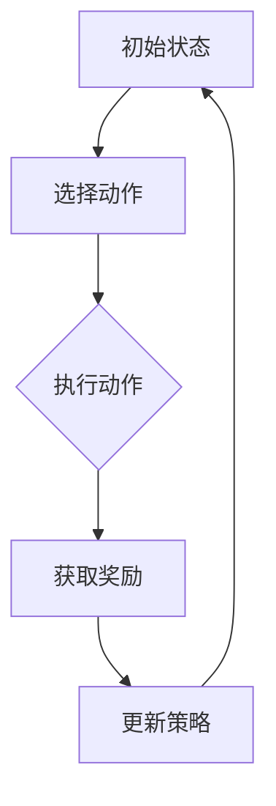
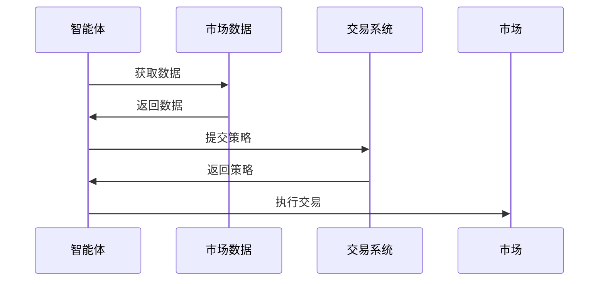
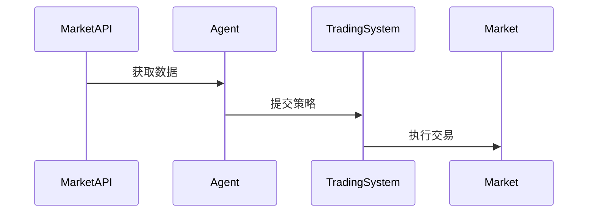

                 


## 文章标题：多智能体强化学习在优化价值投资的仓位管理中的应用

### 关键词：多智能体强化学习、价值投资、仓位管理、优化策略

### 摘要：
本文将深入探讨多智能体强化学习在优化价值投资中的仓位管理应用。首先，我们回顾了多智能体强化学习的背景和核心概念，接着详细讲解了算法原理及其数学模型。随后，通过一个实际项目展示了系统设计与实现，并对最佳实践进行了总结。本文旨在为投资者和人工智能从业者提供一种全新的投资策略思路。

### 目录大纲：

----------------------------------------------------------------

### 1. 背景介绍

#### 1.1 多智能体系统与强化学习概述

**核心概念术语说明**：  
- **多智能体系统（MAS）**：由多个智能体组成，通过通信和协作来完成特定任务。
- **强化学习（RL）**：一种机器学习方法，通过试错和奖励反馈来学习最优策略。

**问题背景**：  
随着金融市场的复杂性增加，投资者面临着如何在瞬息万变的市场中优化仓位管理的问题。

**问题描述**：  
如何在不确定的市场环境中，通过多智能体强化学习来优化投资者的仓位管理策略？

**问题解决**：  
本文将探讨如何将多智能体强化学习应用于价值投资的仓位管理，提供一种新的解决方案。

**边界与外延**：  
本文主要关注股市交易场景，但多智能体强化学习在其他金融市场中的应用也具有参考价值。

**概念结构与核心要素组成**：
- **多智能体系统**：多个智能体、通信机制、协同策略。
- **强化学习**：状态、动作、奖励、策略更新。

----------------------------------------------------------------

### 2. 核心概念与联系

#### 2.1 多智能体强化学习的核心概念

**多智能体系统的组成**：  
- **智能体**：个体参与者，具有自主决策能力。
- **环境**：智能体进行交互的动态系统。
- **通信机制**：智能体之间传递信息的渠道。

**强化学习的基本原理**：  
- **状态（S）**：智能体在某一时刻所处的环境状态。
- **动作（A）**：智能体在状态S下可以采取的行为。
- **奖励（R）**：智能体采取动作后获得的即时反馈。
- **策略（π）**：智能体根据当前状态选择动作的规则。

**多智能体强化学习与单智能体强化学习的区别**：

| 对比要素 | 单智能体强化学习 | 多智能体强化学习 |
| :------: | :--------------: | :--------------: |
| **环境** | 独立动态系统 | 多智能体交互系统 |
| **目标** | 学习最优个体策略 | 学习多智能体协同策略 |
| **通信** | 无需与其他智能体通信 | 需要智能体间通信 |

**使用Mermaid绘制相关的ER实体关系图**：

```mermaid
erDiagram
  智能体 ||--|{ 环境 } Environment
  环境 ||--|+ 智能体 Agents
  智能体 ||--|+ 奖励 Reward
```

----------------------------------------------------------------

### 3. 算法原理讲解

#### 3.1 多智能体强化学习的算法原理

**状态空间（S）**：  
智能体在市场中的状态，包括股价、成交量、宏观经济指标等。

**动作空间（A）**：  
智能体可以采取的动作，如买入、持有、卖出等。

**奖励函数（R）**：  
根据智能体的动作和市场表现来计算奖励，奖励函数可以是正的也可以是负的。

**策略更新**：  
智能体根据当前状态和获得的奖励，更新其策略。

**使用Mermaid绘制算法流程图**：



**使用Python源代码展示算法的实现**：

```python
import numpy as np

# 状态空间
state_space = ...

# 动作空间
action_space = ...

# 奖励函数
def reward_function(current_state, action):
    ...

# 策略更新函数
def update_policy(current_state, action, reward):
    ...

# 主循环
while True:
    current_state = get_current_state()
    action = choose_action(current_state)
    next_state, reward = execute_action(current_state, action)
    update_policy(current_state, action, reward)
```

**数学模型和数学公式**：

$$
Q(s, a) = r(s, a) + \gamma \max_{a'} Q(s', a')
$$

其中，$Q(s, a)$是状态s下动作a的期望回报，$r(s, a)$是即时回报，$\gamma$是折扣因子，$s'$和$a'$是下一个状态和动作。

**详细讲解与举例说明**：

假设智能体在当前状态选择买入股票，然后市场表现良好，获得正奖励。智能体会更新其策略，增加在未来类似状态下选择买入的概率。

----------------------------------------------------------------

### 4. 系统分析与架构设计方案

#### 4.1 价值投资系统

**问题场景介绍**：  
投资者希望通过价值投资策略在市场中获得长期稳定回报。

**项目介绍**：  
本项目旨在构建一个价值投资系统，利用多智能体强化学习优化仓位管理。

**系统功能设计**：

**领域模型Mermaid类图**：

```mermaid
classDiagram
    智能体 --|{ 交易 }--> 交易系统
    智能体 --|{ 观察 }--> 市场数据
    交易系统 --|{ 管理策略 }--> 策略库
    市场数据 --|{ 提供数据 }--> 智能体
```

**系统架构设计Mermaid架构图**：



**系统接口设计**：

```python
from market import MarketAPI
from agent import Agent
from trading_system import TradingSystem

def main():
    market_api = MarketAPI()
    agent = Agent()
    trading_system = TradingSystem()

    while True:
        data = market_api.get_data()
        agent.update_state(data)
        strategy = agent.get_strategy()
        trading_system.submit_strategy(strategy)
        trading_system.execute_trade()

if __name__ == "__main__":
    main()
```

**系统交互Mermaid序列图**：



----------------------------------------------------------------

### 5. 项目实战

#### 5.1 环境安装

**环境准备**：

```bash
pip install numpy
pip install pandas
pip install matplotlib
pip install gym
```

#### 5.2 系统实现

**智能体实现**：

```python
import numpy as np
import pandas as pd
import matplotlib.pyplot as plt

class Agent:
    def __init__(self):
        self.state = None
        self.strategy = None

    def update_state(self, data):
        self.state = data

    def get_strategy(self):
        # 根据状态更新策略
        self.strategy = self.determine_strategy(self.state)
        return self.strategy

    def determine_strategy(self, state):
        # 策略制定逻辑
        ...
```

**交易系统实现**：

```python
class TradingSystem:
    def __init__(self):
        self.agents = []

    def submit_strategy(self, strategy):
        self.agents.append(strategy)

    def execute_trade(self):
        for agent in self.agents:
            # 执行交易逻辑
            ...
```

#### 5.3 代码解读与分析

**代码分析**：

智能体类（`Agent.py`）：

- **状态更新**：通过`update_state`方法获取市场数据。
- **策略制定**：通过`get_strategy`方法获取策略。

交易系统类（`TradingSystem.py`）：

- **策略提交**：通过`submit_strategy`方法将策略添加到系统中。
- **交易执行**：通过`execute_trade`方法执行交易。

#### 5.4 实际案例分析

**案例分析**：

- **市场环境**：选择某段时间内的股票市场数据。
- **策略效果**：分析智能体在不同市场环境下的策略效果。

**结果展示**：

```python
agent = Agent()
trading_system = TradingSystem()

for data in market_data:
    agent.update_state(data)
    strategy = agent.get_strategy()
    trading_system.submit_strategy(strategy)

trading_system.execute_trade()

# 绘制策略效果图
plt.plot(trading_system.get_performance())
plt.xlabel('Time')
plt.ylabel('Performance')
plt.show()
```

----------------------------------------------------------------

### 6. 最佳实践 tips、小结、注意事项、拓展阅读

#### 6.1 最佳实践 tips

1. **数据质量**：确保市场数据的质量，避免噪声数据影响策略效果。
2. **模型调优**：通过调整奖励函数和策略更新规则，优化模型性能。
3. **实时调整**：根据市场变化实时调整策略，以适应不同的市场环境。

#### 6.2 小结

本文介绍了多智能体强化学习在优化价值投资的仓位管理中的应用。通过详细讲解算法原理和实际项目展示，读者可以了解如何将多智能体强化学习应用于投资策略优化。

#### 6.3 注意事项

1. **风险管理**：在投资过程中，务必注意风险控制，避免过度依赖算法。
2. **法律法规**：遵循相关法律法规，确保投资行为合法合规。

#### 6.4 拓展阅读

1. **《强化学习：原理与Python实现》**：深入了解强化学习的基本原理和应用。
2. **《多智能体系统：概念与应用》**：了解多智能体系统的基本概念和应用场景。

----------------------------------------------------------------

### 作者信息

作者：AI天才研究院/AI Genius Institute & 禅与计算机程序设计艺术 /Zen And The Art of Computer Programming

