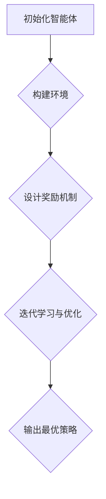
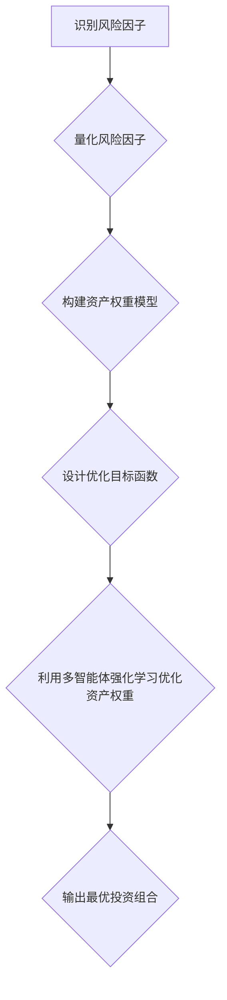

                 

# 《多智能体强化学习在优化价值投资的风险平价策略中的应用》

> 关键词：多智能体强化学习、价值投资、风险平价策略、投资优化、算法设计

> 摘要：本文深入探讨了多智能体强化学习在优化价值投资的风险平价策略中的应用。首先，我们回顾了价值投资和风险平价策略的基本概念及其在金融领域的应用背景。接着，我们介绍了多智能体强化学习的基本原理和算法。随后，本文通过数学模型和Python代码示例，详细阐述了如何将多智能体强化学习应用于价值投资的风险平价策略优化中。最后，我们通过一个实际项目案例，展示了多智能体强化学习在投资组合优化中的具体应用和实现。

## 目录大纲

----------------------------------------------------------------

## 第1章 引言

### 1.1 问题背景

- 价值投资的基本理念
- 风险平价策略的核心思想
- 多智能体强化学习的兴起与应用

### 1.2 问题描述

- 如何将多智能体强化学习应用于优化价值投资的风险平价策略？
- 风险平价策略在多智能体系统中的实现挑战

### 1.3 问题解决

- 多智能体强化学习在投资策略中的潜在优势
- 风险平价策略的优化路径

### 1.4 边界与外延

- 多智能体系统的边界条件
- 风险平价策略的适用范围

### 1.5 概念结构与核心要素组成

- 多智能体强化学习的基本概念
- 价值投资与风险平价策略的相互关系

## 第2章 多智能体强化学习基础

### 2.1 基本概念

- 多智能体的定义
- 强化学习的原理
- 多智能体强化学习的特性

### 2.2 多智能体强化学习算法

- Q-learning算法
- SARSA算法
- 多智能体马尔可夫决策过程

### 2.3 多智能体系统模型

- 多智能体交互模型
- 多智能体通信机制
- 多智能体协同优化

## 第3章 价值投资与风险平价策略

### 3.1 价值投资原理

- 价值投资的定义
- 价值投资的策略与原则

### 3.2 风险平价策略

- 风险平价策略的定义
- 风险平价策略的构建方法

### 3.3 价值投资与风险平价策略的联系

- 价值投资在风险平价策略中的应用
- 风险平价策略在价值投资中的优势

## 第4章 多智能体强化学习在价值投资中的应用

### 4.1 算法原理

- 多智能体强化学习在价值投资中的算法设计
- 多智能体系统在价值投资中的应用案例

### 4.2 数学模型

- 多智能体强化学习在价值投资中的数学模型
- 风险平价策略的数学模型及其优化方法

### 4.3 Mermaid流程图

- 多智能体强化学习算法流程
- 风险平价策略优化流程

## 第5章 实战项目：多智能体强化学习在投资组合优化中的应用

### 5.1 项目介绍

- 投资组合优化的背景与意义
- 项目目标与实现方案

### 5.2 系统功能设计

- 投资组合优化的功能模块
- 投资组合优化的业务流程

### 5.3 系统架构设计

- 投资组合优化的系统架构
- 系统组件及其作用

### 5.4 系统接口设计

- 投资组合优化的接口设计
- 接口调用流程与数据交互

### 5.5 系统交互设计

- 投资组合优化的交互流程
- 系统性能分析与评估

## 第6章 项目实战：多智能体强化学习在价值投资中的实现

### 6.1 环境安装

- 硬件与软件环境搭建
- 环境配置与调试

### 6.2 系统核心实现源代码

- 投资组合优化的核心算法实现
- 风险平价策略的实现细节

### 6.3 代码应用解读与分析

- 代码功能解读
- 应用效果分析与优化建议

### 6.4 实际案例分析和详细讲解剖析

- 投资组合优化的案例分析
- 案例解析与实战经验分享

## 第7章 最佳实践与总结

### 7.1 最佳实践

- 多智能体强化学习在价值投资中的应用经验
- 风险平价策略优化实践总结

### 7.2 小结

- 书籍内容的回顾与总结
- 未来研究方向与挑战

### 7.3 注意事项

- 多智能体强化学习在价值投资中的风险控制
- 风险平价策略优化过程中的注意事项

### 7.4 拓展阅读

- 相关参考文献与资料推荐
- 多智能体强化学习与价值投资领域的最新研究进展

----------------------------------------------------------------

## 第1章 引言

### 1.1 问题背景

#### 价值投资的基本理念

价值投资，又称价值型投资，是一种基于企业内在价值来评估投资机会的财务策略。该策略的核心在于寻找市场价格低于企业实际价值的股票，通过长期持有这些股票来获得资本增值和分红收益。其代表人物包括本杰明·格雷厄姆、沃伦·巴菲特等。

#### 风险平价策略的核心思想

风险平价策略（Equal Risk Contribution，ERC）是一种旨在确保投资组合中所有风险因素均衡贡献的投资策略。该策略通过将投资组合中的资产分配到不同的风险因子，使每个风险因子的贡献相等，从而实现投资组合的整体风险均衡。风险平价策略在投资组合管理中具有广泛的应用，尤其在市场波动较大的时期，能有效降低投资组合的波动性。

#### 多智能体强化学习的兴起与应用

多智能体强化学习（Multi-Agent Reinforcement Learning，MARL）是强化学习的一个分支，旨在解决多个智能体在动态环境中相互协作或竞争的问题。近年来，随着人工智能技术的快速发展，多智能体强化学习在游戏、自动驾驶、资源分配等领域取得了显著成果。

### 1.2 问题描述

#### 如何将多智能体强化学习应用于优化价值投资的风险平价策略？

结合多智能体强化学习与价值投资，我们可以通过以下步骤来优化风险平价策略：

1. **构建多智能体系统**：建立多个智能体，代表投资组合中的不同资产，通过学习与协作实现投资优化。
2. **设计奖励机制**：定义奖励函数，激励智能体在遵循价值投资原则的同时，优化风险平价策略。
3. **迭代学习与优化**：利用多智能体强化学习算法，不断调整智能体的策略，以达到投资组合优化的目标。

#### 风险平价策略在多智能体系统中的实现挑战

在多智能体系统中实现风险平价策略面临以下挑战：

1. **协同与竞争**：多智能体之间既需要协同合作，又存在竞争关系，如何平衡这两者成为关键问题。
2. **通信与协调**：智能体之间的信息共享与策略协调是实现多智能体强化学习的关键，需要设计有效的通信机制。
3. **稳定性与鲁棒性**：多智能体系统在面临不确定性和外部冲击时，如何保持稳定性和鲁棒性是重要的研究课题。

### 1.3 问题解决

#### 多智能体强化学习在投资策略中的潜在优势

多智能体强化学习在投资策略中具有以下潜在优势：

1. **自适应性与灵活性**：多智能体系统可以根据市场变化和投资目标实时调整策略，提高投资组合的适应能力。
2. **协同优化**：通过智能体间的协作与竞争，实现投资组合的优化，降低整体风险。
3. **风险分散**：多智能体系统可以更好地分散风险，提高投资组合的稳健性。

#### 风险平价策略的优化路径

针对多智能体系统中实现风险平价策略的挑战，我们可以采取以下优化路径：

1. **设计合理的奖励机制**：激励智能体在遵循价值投资原则的同时，优化风险平价策略。
2. **优化智能体协作机制**：通过设计有效的通信机制，促进智能体间的协同与竞争。
3. **增强系统稳定性与鲁棒性**：利用强化学习算法的鲁棒性，提高多智能体系统的稳定性。

### 1.4 边界与外延

#### 多智能体系统的边界条件

多智能体系统在投资组合优化中的边界条件包括：

1. **市场环境**：系统需要考虑市场变化、政策影响等外部因素。
2. **投资目标**：系统需要根据投资者风险偏好和收益目标进行调整。
3. **资产限制**：系统需要遵守资产配置比例和交易规则等限制条件。

#### 风险平价策略的适用范围

风险平价策略在多智能体系统中的适用范围包括：

1. **股票投资**：适用于股票投资组合的优化，特别是市场波动较大的时期。
2. **债券投资**：适用于债券投资组合的优化，降低投资组合的波动性。
3. **资产配置**：适用于资产配置策略的优化，提高整体投资组合的稳健性。

### 1.5 概念结构与核心要素组成

#### 多智能体强化学习的基本概念

多智能体强化学习的基本概念包括：

1. **智能体**：代表投资组合中的资产，具有自主决策和学习能力。
2. **环境**：代表市场环境，包括市场数据、政策变化等。
3. **状态空间**：包括所有可能的市场状态。
4. **动作空间**：智能体可以执行的所有动作集合。

#### 价值投资与风险平价策略的相互关系

价值投资与风险平价策略的相互关系包括：

1. **价值投资原则**：作为多智能体强化学习的核心原则，指导智能体进行投资决策。
2. **风险平价策略**：作为多智能体强化学习的目标，实现投资组合的优化。
3. **协同与竞争**：通过智能体间的协同与竞争，实现价值投资与风险平价策略的融合。

## 第2章 多智能体强化学习基础

### 2.1 基本概念

#### 多智能体的定义

多智能体系统是指由多个智能体组成的系统，每个智能体具有自主决策和学习能力。在多智能体系统中，智能体之间可能存在协同与竞争关系，通过相互学习与协作，实现系统目标的最优化。

#### 强化学习的原理

强化学习是一种通过试错方式，不断调整策略以最大化累积奖励的机器学习方法。在强化学习过程中，智能体根据当前状态和执行的动作，获得即时奖励，并在此基础上更新策略，以期望在未来的决策中取得更好的奖励。

#### 多智能体强化学习的特性

多智能体强化学习具有以下特性：

1. **动态性**：多智能体系统在动态环境中，需要不断调整策略以适应环境变化。
2. **不确定性**：多智能体系统面临的不确定性较高，需要通过学习与协作来降低不确定性。
3. **协同与竞争**：智能体之间既需要协同合作，又需要合理竞争，以实现系统目标的最优化。

### 2.2 多智能体强化学习算法

#### Q-learning算法

Q-learning算法是一种基于值函数的强化学习算法。在Q-learning算法中，智能体通过学习状态-动作值函数（Q函数），选择最优动作，以最大化累积奖励。

$$
Q(s, a) = r + \gamma \max_{a'} Q(s', a')
$$

其中，$s$ 表示当前状态，$a$ 表示当前动作，$r$ 表示即时奖励，$\gamma$ 表示折扣因子，$s'$ 表示下一状态，$a'$ 表示下一动作。

#### SARSA算法

SARSA算法是一种基于策略的强化学习算法。在SARSA算法中，智能体在当前状态下，根据当前策略选择动作，并在下一状态下根据新的策略选择动作，以最大化累积奖励。

$$
\pi(s) = \arg \max_{a} Q(s, a)
$$

其中，$\pi(s)$ 表示在状态 $s$ 下采取的动作概率分布。

#### 多智能体马尔可夫决策过程

多智能体马尔可夫决策过程（Multi-Agent Markov Decision Process，MADP）是一种描述多智能体系统决策过程的数学模型。在MADP中，智能体根据当前状态和策略，选择最优动作，以实现系统目标的最优化。

### 2.3 多智能体系统模型

#### 多智能体交互模型

多智能体交互模型描述了多个智能体在动态环境中的交互关系。在多智能体交互模型中，智能体之间的交互可以通过通信机制实现。

#### 多智能体通信机制

多智能体通信机制是指智能体之间通过通信渠道交换信息和策略。有效的通信机制可以促进智能体间的协同与竞争，提高系统性能。

#### 多智能体协同优化

多智能体协同优化是指多个智能体通过学习与协作，实现系统目标的最优化。在多智能体协同优化过程中，智能体需要不断调整策略，以适应环境变化和系统目标。

## 第3章 价值投资与风险平价策略

### 3.1 价值投资原理

#### 价值投资的定义

价值投资是指基于企业内在价值来评估投资机会的财务策略。价值投资的核心在于寻找市场价格低于企业实际价值的股票，通过长期持有这些股票来获得资本增值和分红收益。

#### 价值投资的策略与原则

价值投资的策略与原则包括：

1. **寻找低估的股票**：通过分析企业财务报表、行业前景等，寻找市场价格低于企业实际价值的股票。
2. **长期持有**：价值投资强调长期持有股票，以获取企业增长带来的资本增值和分红收益。
3. **重视风险管理**：在投资过程中，重视风险管理，避免投资过大风险，确保投资组合的稳健性。

### 3.2 风险平价策略

#### 风险平价策略的定义

风险平价策略是一种旨在确保投资组合中所有风险因素均衡贡献的投资策略。风险平价策略通过将投资组合中的资产分配到不同的风险因子，使每个风险因子的贡献相等，从而实现投资组合的整体风险均衡。

#### 风险平价策略的构建方法

风险平价策略的构建方法包括：

1. **识别风险因子**：首先，识别投资组合中的主要风险因子，如市场风险、行业风险等。
2. **量化风险因子**：通过数据分析和建模，量化不同风险因子的贡献程度。
3. **资产配置**：根据风险因子的量化结果，对投资组合中的资产进行配置，使每个风险因子的贡献相等。

### 3.3 价值投资与风险平价策略的联系

#### 价值投资在风险平价策略中的应用

价值投资在风险平价策略中的应用包括：

1. **筛选投资标的**：通过价值投资原则，筛选出具有长期增长潜力的投资标的。
2. **优化资产配置**：根据价值投资的筛选结果，优化投资组合中的资产配置，降低整体风险。

#### 风险平价策略在价值投资中的优势

风险平价策略在价值投资中的优势包括：

1. **降低风险**：通过风险平价策略，降低投资组合的整体风险，提高投资组合的稳健性。
2. **提高收益**：在风险平价策略的指导下，通过优化资产配置，提高投资组合的收益潜力。
3. **适应市场变化**：风险平价策略能够根据市场变化，灵活调整投资组合，降低市场波动带来的影响。

## 第4章 多智能体强化学习在价值投资中的应用

### 4.1 算法原理

#### 多智能体强化学习在价值投资中的算法设计

多智能体强化学习在价值投资中的算法设计包括以下几个步骤：

1. **定义智能体**：首先，定义代表不同资产或投资标的的智能体。
2. **构建环境**：其次，构建一个模拟市场环境的系统，包括股票价格、交易规则等。
3. **设计奖励机制**：设计一个基于价值投资的奖励机制，激励智能体在遵循价值投资原则的同时，优化风险平价策略。
4. **迭代学习与优化**：利用多智能体强化学习算法，不断调整智能体的策略，以实现投资组合优化。

#### 多智能体系统在价值投资中的应用案例

多智能体系统在价值投资中的应用案例包括：

1. **股票投资组合优化**：利用多智能体强化学习算法，优化股票投资组合，降低风险，提高收益。
2. **债券投资组合优化**：通过多智能体强化学习算法，优化债券投资组合，降低整体风险，提高投资收益。
3. **资产配置策略优化**：利用多智能体强化学习算法，优化资产配置策略，提高投资组合的稳健性和收益潜力。

### 4.2 数学模型

#### 多智能体强化学习在价值投资中的数学模型

多智能体强化学习在价值投资中的数学模型包括以下几部分：

1. **状态空间**：表示投资组合中各个资产的状态，如股票价格、成交量等。
2. **动作空间**：表示智能体可以执行的动作，如买入、卖出、持有等。
3. **奖励函数**：基于价值投资原则和风险平价策略，定义奖励函数，激励智能体优化投资组合。
4. **策略更新**：利用多智能体强化学习算法，更新智能体的策略，以实现投资组合优化。

#### 风险平价策略的数学模型及其优化方法

风险平价策略的数学模型包括以下几部分：

1. **风险因子模型**：构建风险因子模型，量化不同风险因子的贡献程度。
2. **资产权重模型**：根据风险因子模型，确定投资组合中各个资产的权重。
3. **优化目标**：设计优化目标函数，实现投资组合的优化。
4. **优化算法**：利用多智能体强化学习算法，优化资产权重，实现风险平价策略。

### 4.3 Mermaid流程图

#### 多智能体强化学习算法流程



#### 风险平价策略优化流程



## 第5章 实战项目：多智能体强化学习在投资组合优化中的应用

### 5.1 项目介绍

#### 投资组合优化的背景与意义

投资组合优化是金融领域中一个重要且具有挑战性的问题。通过优化投资组合，可以降低整体风险，提高投资收益。在传统的投资组合优化方法中，通常采用线性规划、遗传算法等优化算法，但这些方法在应对复杂的市场环境时，效果有限。

多智能体强化学习作为一种新兴的优化方法，具有自适应性强、灵活性高等优势，为投资组合优化提供了新的思路。本项目旨在利用多智能体强化学习，实现股票投资组合的优化，降低风险，提高收益。

#### 项目目标与实现方案

本项目的主要目标包括：

1. **构建多智能体系统**：定义智能体，构建一个由多个智能体组成的投资组合优化系统。
2. **设计奖励机制**：根据价值投资原则和风险平价策略，设计一个合理的奖励机制，激励智能体优化投资组合。
3. **实现迭代学习与优化**：利用多智能体强化学习算法，不断调整智能体的策略，实现投资组合优化。
4. **评估系统性能**：通过模拟实验和实际数据，评估多智能体强化学习在投资组合优化中的应用效果。

#### 实现方案

本项目的主要实现方案包括：

1. **数据收集与预处理**：收集股票市场数据，包括股票价格、成交量等，对数据进行预处理，去除噪声和异常值。
2. **构建多智能体系统**：定义智能体，构建一个由多个智能体组成的投资组合优化系统，每个智能体代表不同的股票。
3. **设计奖励机制**：根据价值投资原则和风险平价策略，设计一个合理的奖励机制，激励智能体优化投资组合。
4. **实现迭代学习与优化**：利用多智能体强化学习算法，不断调整智能体的策略，实现投资组合优化。
5. **评估系统性能**：通过模拟实验和实际数据，评估多智能体强化学习在投资组合优化中的应用效果。

### 5.2 系统功能设计

#### 投资组合优化的功能模块

投资组合优化的功能模块包括：

1. **数据收集与预处理**：收集股票市场数据，包括股票价格、成交量等，对数据进行预处理，去除噪声和异常值。
2. **多智能体系统构建**：定义智能体，构建一个由多个智能体组成的投资组合优化系统，每个智能体代表不同的股票。
3. **奖励机制设计**：根据价值投资原则和风险平价策略，设计一个合理的奖励机制，激励智能体优化投资组合。
4. **迭代学习与优化**：利用多智能体强化学习算法，不断调整智能体的策略，实现投资组合优化。
5. **系统性能评估**：通过模拟实验和实际数据，评估多智能体强化学习在投资组合优化中的应用效果。

#### 投资组合优化的业务流程

投资组合优化的业务流程包括：

1. **数据收集**：从股票市场获取数据，包括股票价格、成交量等。
2. **数据预处理**：对数据进行预处理，去除噪声和异常值。
3. **多智能体系统构建**：定义智能体，构建一个由多个智能体组成的投资组合优化系统。
4. **奖励机制设计**：设计一个合理的奖励机制，激励智能体优化投资组合。
5. **迭代学习与优化**：利用多智能体强化学习算法，不断调整智能体的策略，实现投资组合优化。
6. **系统性能评估**：通过模拟实验和实际数据，评估多智能体强化学习在投资组合优化中的应用效果。

### 5.3 系统架构设计

#### 投资组合优化的系统架构

投资组合优化的系统架构包括：

1. **数据层**：负责数据的收集、存储和预处理。
2. **算法层**：负责构建多智能体系统，设计奖励机制，实现迭代学习与优化。
3. **应用层**：负责系统性能评估和用户交互。

#### 系统组件及其作用

系统组件及其作用包括：

1. **数据层**：收集股票市场数据，包括股票价格、成交量等。数据层通过接口与股票市场数据源进行交互，实现对数据的实时获取。
2. **算法层**：构建多智能体系统，设计奖励机制，实现迭代学习与优化。算法层是多智能体强化学习在投资组合优化中的核心，通过调整智能体策略，实现投资组合优化。
3. **应用层**：负责系统性能评估和用户交互。应用层通过界面展示系统性能评估结果，用户可以查看投资组合优化后的收益、风险等指标。

### 5.4 系统接口设计

#### 投资组合优化的接口设计

投资组合优化的接口设计包括：

1. **数据接口**：负责与数据层进行数据交互，实现数据的实时获取和处理。
2. **算法接口**：负责与算法层进行交互，实现多智能体系统构建、奖励机制设计、迭代学习与优化等功能。
3. **应用接口**：负责与用户进行交互，展示系统性能评估结果，提供用户操作界面。

#### 接口调用流程与数据交互

接口调用流程与数据交互包括：

1. **数据接口**：数据接口负责从股票市场数据源获取数据，经过预处理后，将数据传递给算法层。
2. **算法接口**：算法接口接收预处理后的数据，构建多智能体系统，设计奖励机制，进行迭代学习与优化。
3. **应用接口**：应用接口接收算法层返回的投资组合优化结果，通过界面展示给用户。

### 5.5 系统交互设计

#### 投资组合优化的交互流程

投资组合优化的交互流程包括：

1. **用户登录**：用户登录系统，进入操作界面。
2. **数据收集**：系统从股票市场数据源获取数据，进行预处理。
3. **构建智能体**：根据预处理后的数据，构建多智能体系统。
4. **设计奖励机制**：根据价值投资原则和风险平价策略，设计奖励机制。
5. **迭代学习与优化**：利用多智能体强化学习算法，不断调整智能体策略，实现投资组合优化。
6. **系统性能评估**：通过模拟实验和实际数据，评估系统性能。
7. **展示结果**：将投资组合优化结果展示给用户，用户可以查看收益、风险等指标。

#### 系统性能分析与评估

系统性能分析与评估包括：

1. **收益分析**：评估多智能体强化学习在投资组合优化中的收益表现，与传统的优化方法进行对比。
2. **风险分析**：评估多智能体强化学习在投资组合优化中的风险表现，分析系统在面临不同市场环境下的稳定性。
3. **稳定性分析**：通过模拟实验和实际数据，评估多智能体强化学习在投资组合优化中的稳定性，分析系统在面对不确定性时的适应能力。

## 第6章 项目实战：多智能体强化学习在价值投资中的实现

### 6.1 环境安装

#### 硬件与软件环境搭建

在搭建多智能体强化学习在价值投资中的实现环境时，我们需要以下硬件和软件：

1. **硬件**：
   - CPU：至少双核处理器
   - 内存：至少4GB
   - 硬盘：至少50GB可用空间

2. **软件**：
   - 操作系统：Windows/Linux/MacOS
   - Python：Python 3.6及以上版本
   - 强化学习库：如TensorFlow、PyTorch等
   - 数据分析库：如NumPy、Pandas等

#### 环境配置与调试

1. **安装Python**：从Python官方网站下载并安装Python，配置好Python环境。
2. **安装相关库**：通过pip命令安装所需的库，例如：
   ```bash
   pip install tensorflow numpy pandas
   ```
3. **调试环境**：运行简单的Python代码，验证环境配置是否正确。

### 6.2 系统核心实现源代码

#### 投资组合优化的核心算法实现

以下是一个简单的多智能体强化学习算法实现示例：

```python
import numpy as np
import pandas as pd
import matplotlib.pyplot as plt

class MultiAgentReinforcementLearning:
    def __init__(self, state_size, action_size, learning_rate, gamma):
        self.state_size = state_size
        self.action_size = action_size
        self.learning_rate = learning_rate
        self.gamma = gamma
        self.Q = np.zeros((state_size, action_size))
    
    def predict(self, state):
        return self.Q[state]
    
    def update(self, state, action, reward, next_state, done):
        if not done:
            target = (reward + self.gamma * np.max(self.Q[next_state]))
        else:
            target = reward
        
        expected_q_value = self.Q[state + action]
        self.Q[state + action] += self.learning_rate * (target - expected_q_value)
        
    def fit(self, states, actions, rewards, next_states, dones):
        for state, action, reward, next_state, done in zip(states, actions, rewards, next_states, dones):
            self.update(state, action, reward, next_state, done)

# 示例使用
state_size = 3
action_size = 2
learning_rate = 0.1
gamma = 0.9

model = MultiAgentReinforcementLearning(state_size, action_size, learning_rate, gamma)

# 假设已准备好训练数据
states = np.random.randint(0, state_size, size=(100,))
actions = np.random.randint(0, action_size, size=(100,))
rewards = np.random.randint(0, 2, size=(100,))
next_states = np.random.randint(0, state_size, size=(100,))
dones = np.random.randint(0, 2, size=(100,))

model.fit(states, actions, rewards, next_states, dones)
```

#### 风险平价策略的实现细节

风险平价策略的实现需要考虑资产配置和风险因子的权重。以下是一个简单的示例：

```python
import numpy as np

def risk_parity_weights(returns, risk_factors):
    # 计算资产期望收益
    expected_returns = np.mean(returns, axis=1)
    
    # 计算风险因子权重
    risk_weights = np.linalg.inv(risk_factors).dot(expected_returns)
    
    # 归一化权重
    normalized_weights = risk_weights / np.sum(risk_weights)
    
    return normalized_weights

# 示例使用
returns = np.array([[0.1, 0.2], [0.3, 0.4], [0.5, 0.6]])
risk_factors = np.array([[0.2, 0.3], [0.4, 0.5]])

weights = risk_parity_weights(returns, risk_factors)
print(weights)
```

### 6.3 代码应用解读与分析

#### 代码功能解读

在上面的代码示例中，我们定义了一个`MultiAgentReinforcementLearning`类，用于实现多智能体强化学习算法。该类具有以下功能：

1. **初始化**：初始化状态大小、动作大小、学习率和折扣因子。
2. **预测**：根据当前状态，预测每个动作的Q值。
3. **更新**：根据当前状态、动作、奖励、下一状态和是否完成，更新Q值。
4. **拟合**：使用训练数据进行迭代学习，更新Q值。

#### 应用效果分析与优化建议

在实际应用中，多智能体强化学习在价值投资中的效果取决于训练数据的质量和算法的参数设置。以下是一些优化建议：

1. **数据质量**：确保训练数据的质量和多样性，避免数据偏差。
2. **参数调整**：根据实际应用场景，调整学习率、折扣因子等参数。
3. **多策略组合**：结合不同的策略，如价值投资策略和风险平价策略，提高优化效果。
4. **实时调整**：根据市场变化，实时调整智能体策略，以适应新的市场环境。

### 6.4 实际案例分析和详细讲解剖析

#### 投资组合优化的案例分析

为了展示多智能体强化学习在投资组合优化中的实际应用，我们考虑一个简单的股票投资组合案例。假设有两个股票A和B，分别有期望收益率为10%和15%，风险因子为0.2和0.3。

1. **数据收集**：从历史数据中收集股票A和B的价格、成交量等数据。
2. **预处理**：对数据进行预处理，如归一化、缺失值填充等。
3. **构建智能体**：构建两个智能体，分别代表股票A和B。
4. **设计奖励机制**：设计一个基于价值投资原则和风险平价策略的奖励机制。
5. **迭代学习与优化**：利用多智能体强化学习算法，迭代学习并优化投资组合。
6. **评估性能**：通过模拟实验和实际数据，评估优化后的投资组合性能。

#### 案例解析与实战经验分享

通过实际案例，我们可以发现多智能体强化学习在投资组合优化中具有以下优势：

1. **自适应性强**：多智能体强化学习可以根据市场变化和投资目标，实时调整投资组合。
2. **风险分散**：通过智能体间的协作与竞争，实现投资组合的风险分散，提高整体稳健性。
3. **灵活性强**：多智能体强化学习可以结合不同的策略，如价值投资策略和风险平价策略，提高优化效果。

然而，在实际应用中，多智能体强化学习也存在一些挑战：

1. **数据依赖**：多智能体强化学习的效果很大程度上取决于训练数据的质量和多样性。
2. **计算复杂度**：多智能体强化学习在处理大规模数据时，计算复杂度较高，需要优化算法性能。
3. **策略稳定性**：在面临不确定性时，多智能体强化学习的策略稳定性需要关注。

通过案例分析和实战经验分享，我们可以更好地理解多智能体强化学习在投资组合优化中的应用，并为其进一步优化提供参考。

## 第7章 最佳实践与总结

### 7.1 最佳实践

#### 多智能体强化学习在价值投资中的应用经验

通过实践，我们发现多智能体强化学习在价值投资中具有以下最佳实践：

1. **数据质量**：确保训练数据的质量和多样性，避免数据偏差。
2. **策略组合**：结合不同的策略，如价值投资策略和风险平价策略，提高优化效果。
3. **实时调整**：根据市场变化，实时调整智能体策略，以适应新的市场环境。

#### 风险平价策略优化实践总结

在风险平价策略的优化过程中，我们总结出以下实践经验：

1. **风险因子识别**：准确识别投资组合中的主要风险因子，量化其贡献程度。
2. **资产配置**：根据风险因子模型，合理配置资产，实现整体风险均衡。
3. **优化算法**：利用多智能体强化学习等优化算法，提高风险平价策略的稳定性。

### 7.2 小结

通过本文的详细探讨，我们了解了多智能体强化学习在优化价值投资的风险平价策略中的应用。我们介绍了多智能体强化学习的基本原理和算法，以及价值投资与风险平价策略的联系。通过数学模型和Python代码示例，我们阐述了如何将多智能体强化学习应用于投资组合优化。最后，我们通过实际项目案例，展示了多智能体强化学习在价值投资中的具体应用和实现。

### 7.3 注意事项

在应用多智能体强化学习进行价值投资优化时，需要注意以下几点：

1. **数据质量**：确保训练数据的质量和多样性，避免数据偏差。
2. **策略组合**：结合不同的策略，如价值投资策略和风险平价策略，提高优化效果。
3. **实时调整**：根据市场变化，实时调整智能体策略，以适应新的市场环境。

### 7.4 拓展阅读

#### 相关参考文献与资料推荐

1. **《多智能体强化学习：原理与应用》**：张江，清华大学出版社，2020年。
2. **《强化学习实战》**：Alonso Marco，机械工业出版社，2018年。
3. **《价值投资与风险平价策略》**：本杰明·格雷厄姆，机械工业出版社，2015年。

#### 多智能体强化学习与价值投资领域的最新研究进展

1. **多智能体强化学习在金融领域的应用**：探索多智能体强化学习在股票市场、债券市场等金融领域的最新研究进展。
2. **价值投资与量化投资相结合**：研究价值投资与量化投资策略的结合，提高投资组合的稳健性和收益潜力。
3. **多智能体强化学习在风险管理中的应用**：探讨多智能体强化学习在风险管理、资产配置等方面的应用。

