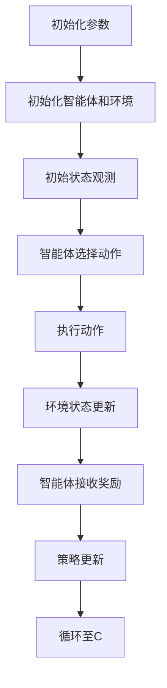
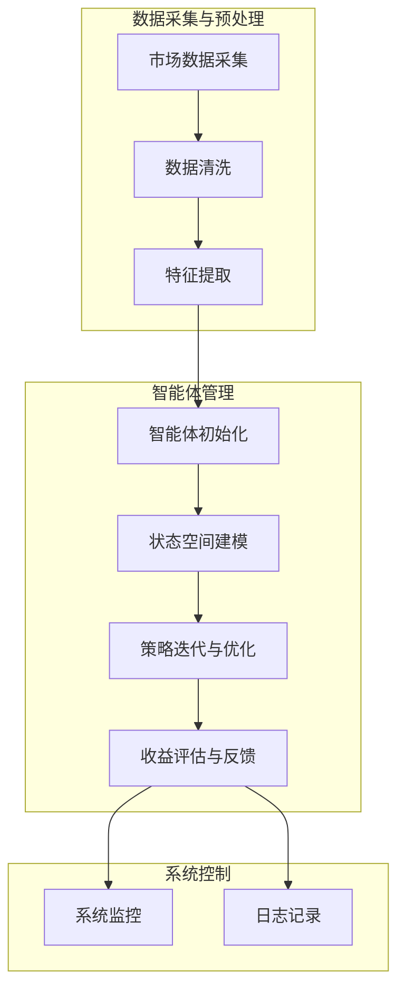
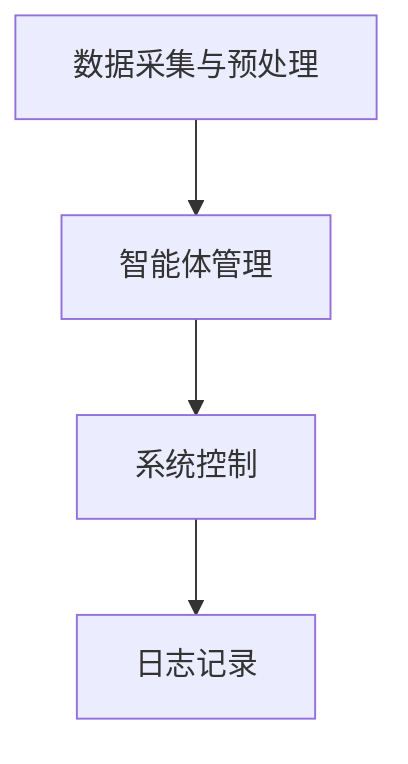
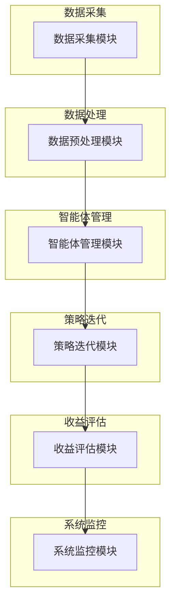
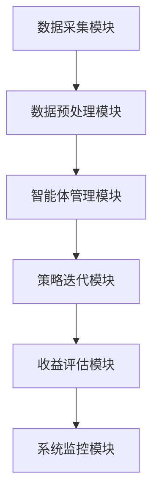

                 

### 引言

在当今复杂多变的经济环境中，再投资策略的优化成为金融机构和企业面临的重要课题。传统的再投资策略往往依赖于历史数据和统计分析，这在一定程度上能提供指导，但无法适应动态的市场变化。随着人工智能技术的迅猛发展，尤其是多智能体强化学习的兴起，为优化再投资策略提供了新的思路和强有力的工具。

多智能体强化学习（Multi-Agent Reinforcement Learning，MARL）是强化学习（Reinforcement Learning，RL）的一个分支，旨在解决多个智能体在交互环境下进行决策的优化问题。强化学习通过智能体与环境的互动来学习最优策略，而多智能体强化学习进一步扩展到多个智能体之间的协作和竞争，能够在动态、不确定的环境中实现高效的决策。

再投资策略优化涉及到多个投资决策者（智能体）在不同时间点对资金进行再投资的问题。优化目标是在风险和收益之间寻找最佳平衡点，提高整体投资回报率。然而，现实世界中的再投资策略优化问题往往具有高度复杂性和动态性，这使得传统的方法难以应对。

本文旨在探讨多智能体强化学习在优化再投资策略中的应用。通过详细分析多智能体强化学习的基本原理、数学模型、算法流程和应用实践，本文将为读者提供一种新的视角来理解和解决再投资策略优化问题。具体来说，本文将分为以下几个部分：

1. **背景介绍**：首先介绍多智能体强化学习和再投资策略优化的问题背景，阐述其重要性和挑战。
2. **理论基础**：详细解释多智能体强化学习的基本概念、关键原理和主要方法。
3. **算法原理**：阐述多智能体强化学习算法的工作原理、流程、优势和局限性。
4. **数学模型**：介绍多智能体强化学习背后的数学模型，包括状态空间、动作空间、奖励函数等。
5. **应用实践**：通过具体案例展示多智能体强化学习在再投资策略优化中的应用过程，包括数据预处理、模型训练、策略优化等。
6. **系统设计与实现**：介绍如何将多智能体强化学习算法应用于再投资策略优化的系统设计，包括系统架构、接口设计和实现细节。
7. **最佳实践与总结**：总结多智能体强化学习在再投资策略优化中的应用经验，提供实用建议和注意事项，并对未来研究方向进行展望。

通过本文的逐步分析，读者可以深入了解多智能体强化学习在优化再投资策略中的应用价值，为实际问题的解决提供理论基础和实践指导。

### 关键词

- 多智能体强化学习
- 再投资策略优化
- 强化学习
- 智能体交互
- 风险与收益平衡
- 数学模型
- 算法流程
- 系统设计

### 摘要

本文探讨了多智能体强化学习在优化再投资策略中的应用。首先，介绍了多智能体强化学习和再投资策略优化的背景，阐述了其在现代金融环境中的重要性和挑战。接着，详细分析了多智能体强化学习的基本概念、原理和主要方法，并介绍了其数学模型。随后，通过具体案例展示了多智能体强化学习在再投资策略优化中的实际应用过程。最后，本文介绍了如何将多智能体强化学习算法应用于系统设计，总结了最佳实践和注意事项，并对未来研究方向进行了展望。本文旨在为读者提供一种新的视角来理解和解决再投资策略优化问题。

### 第一部分：背景与理论基础

#### 第1章：多智能体强化学习概述

##### 1.1 问题背景

在复杂的现代经济环境中，投资决策的优化变得越来越重要。传统的投资策略通常依赖于历史数据和统计分析，但这些方法在应对动态市场变化时显得力不从心。随着人工智能技术的进步，多智能体强化学习（Multi-Agent Reinforcement Learning，MARL）作为一种新兴的优化方法，受到了广泛关注。多智能体强化学习通过模拟多个智能体在动态环境中的交互决策，提高了策略的适应性和鲁棒性，为再投资策略优化提供了新的解决方案。

在金融市场中，再投资策略是指投资者在获得回报后，如何将资金重新分配到不同的投资项目中，以最大化收益并控制风险。传统的再投资策略往往基于单一智能体的决策，无法有效考虑多个投资者之间的互动和反馈。而多智能体强化学习通过引入多个智能体，模拟投资者之间的竞争和合作，能够更好地应对复杂的市场环境。

##### 1.2 多智能体强化学习的基本概念

多智能体强化学习是一种基于强化学习（Reinforcement Learning，RL）的方法，旨在解决多个智能体在交互环境下进行决策的优化问题。在多智能体强化学习中，每个智能体都试图通过学习最佳策略来最大化自己的回报，同时需要考虑其他智能体的行为和策略。

**强化学习**：强化学习是一种使智能体通过与环境的互动来学习最佳策略的方法。在强化学习中，智能体通过选择动作并在环境中执行这些动作来获取奖励或惩罚。通过不断试错和调整策略，智能体能够逐渐学会在给定状态下选择最佳动作。

**多智能体强化学习**：多智能体强化学习是强化学习的一个扩展，它涉及多个智能体在共享环境中进行交互。每个智能体的目标是最大化自己的回报，同时需要考虑其他智能体的行为。多智能体强化学习的关键挑战包括协调多个智能体的策略、处理不确定性和动态环境、以及避免过度竞争或合作不足。

**智能体**：在多智能体强化学习中，每个智能体都是一个能够接收环境状态、选择动作并接收奖励的实体。智能体可以是实际的个体，如投资者、机器人等，也可以是抽象的概念，如策略模块、决策单元等。

**环境**：环境是多智能体强化学习中的另一个关键概念。环境描述了智能体所处的动态世界，包括状态空间、动作空间和奖励函数。智能体通过观察环境状态并执行动作，来获取反馈和奖励。

**状态空间**：状态空间是智能体可能观察到的所有状态集合。在多智能体强化学习中，状态空间通常包括多个智能体的状态以及环境的其他相关特征。

**动作空间**：动作空间是智能体可以选择的所有动作集合。智能体通过选择并执行动作来影响环境状态，并获取相应的奖励。

**奖励函数**：奖励函数是衡量智能体行为好坏的量化指标。在多智能体强化学习中，奖励函数需要考虑多个智能体的回报，以及整体环境的状态变化。

##### 1.3 多智能体强化学习的核心要素

多智能体强化学习的核心要素包括状态空间、动作空间、奖励函数、策略学习算法等。以下是对这些核心要素的简要介绍：

**状态空间**：状态空间是多智能体强化学习中的基础概念。它描述了智能体在环境中可能观察到的所有状态。状态空间的设计需要综合考虑多个智能体的状态以及其他环境因素，如市场波动、政策变化等。

**动作空间**：动作空间是多智能体强化学习中的另一个关键概念。它描述了智能体可以选择的所有动作。动作空间的设计需要满足智能体的目标和约束条件，同时需要考虑与其他智能体的交互。

**奖励函数**：奖励函数是多智能体强化学习中的核心激励机制。它通过给予智能体正奖励或负奖励来指导智能体的行为。在多智能体强化学习中，奖励函数需要综合考虑多个智能体的回报，以及整体环境的状态变化。

**策略学习算法**：策略学习算法是多智能体强化学习中的核心组件。它通过在环境中不断试错和迭代来学习最佳策略。常见的策略学习算法包括Q学习、策略梯度方法、深度强化学习等。

通过理解多智能体强化学习的基本概念和核心要素，我们可以更好地掌握其在再投资策略优化中的应用。在下一章中，我们将进一步探讨多智能体强化学习的理论基础，包括关键原理和主要方法。

### 第2章：再投资策略优化概述

##### 2.1 再投资策略的意义

再投资策略是指投资者在获得回报后，如何将资金重新分配到不同的投资项目中，以实现最优收益和风险平衡的过程。在现代金融市场中，再投资策略的优化具有重要意义。

首先，再投资策略能够帮助投资者最大化收益。通过科学合理的再投资策略，投资者可以充分利用现有的资金，将回报重新投入到高收益项目中，从而实现资产增值。

其次，再投资策略能够有效控制风险。在再投资过程中，投资者需要考虑不同投资项目的风险水平，将资金分散投资，以降低单一项目风险对整体投资组合的影响。

最后，再投资策略能够适应市场变化。金融市场环境复杂多变，投资者通过灵活调整再投资策略，能够更好地应对市场波动，保持投资组合的稳定性和成长性。

##### 2.2 再投资策略的现状与发展

再投资策略的优化一直是金融领域的研究热点。随着人工智能技术的快速发展，尤其是多智能体强化学习的应用，再投资策略的研究取得了显著进展。

当前，传统的再投资策略主要依赖于历史数据分析和统计模型。这些方法在一定程度上能够提供指导，但难以应对动态市场的变化。随着多智能体强化学习等人工智能技术的应用，再投资策略逐渐从传统的统计分析方法向基于智能体互动的方法转变。

多智能体强化学习通过模拟多个智能体在动态环境中的交互决策，能够更有效地优化再投资策略。具体来说，多智能体强化学习在再投资策略优化中的应用主要体现在以下几个方面：

1. **自适应调整**：多智能体强化学习能够根据市场变化和环境动态，自适应调整再投资策略，提高策略的灵活性和适应性。

2. **风险评估**：通过多智能体之间的互动和合作，多智能体强化学习可以更准确地评估不同投资项目的风险，实现风险的有效控制。

3. **资源分配**：多智能体强化学习能够优化资源分配，通过多个智能体之间的协调和合作，实现资金的最优配置，提高整体收益。

4. **策略迭代**：多智能体强化学习通过不断试错和迭代，不断优化再投资策略，逐步提高策略的收敛速度和准确性。

未来，随着人工智能技术的进一步发展，再投资策略优化将在以下几个方面继续发展：

1. **多智能体强化学习的改进**：通过引入更先进的算法和技术，如深度强化学习、联邦学习等，进一步提升多智能体强化学习在再投资策略优化中的应用效果。

2. **多模态数据的融合**：结合多种数据源，如市场数据、经济数据、社会数据等，构建更加全面和准确的投资环境模型，提高再投资策略的预测能力和决策效果。

3. **智能体协作机制**：研究更有效的智能体协作机制，实现多个智能体之间的协同决策，提高整体投资组合的收益和风险控制能力。

4. **法规和伦理**：随着人工智能技术的应用，再投资策略优化需要充分考虑法律法规和伦理道德要求，确保人工智能在投资领域的安全、合法和可持续应用。

##### 2.3 再投资策略优化中的挑战

尽管多智能体强化学习在再投资策略优化中具有显著优势，但实际应用中仍面临一系列挑战：

1. **数据质量和可用性**：再投资策略优化需要大量高质量的数据支持，但金融市场数据往往具有高噪声、缺失值和不确定性，数据质量和可用性对优化效果具有重要影响。

2. **计算复杂度**：多智能体强化学习涉及多个智能体之间的复杂互动和策略迭代，计算复杂度较高，对计算资源和算法优化提出了更高要求。

3. **风险控制**：在多智能体强化学习中，如何平衡收益和风险是一个关键问题。需要设计有效的风险控制机制，确保投资策略在追求收益的同时，不偏离风险承受范围。

4. **模型泛化能力**：多智能体强化学习模型的泛化能力是优化再投资策略的关键。模型需要具备较强的泛化能力，能够在不同市场和环境下保持稳定的优化效果。

5. **法律法规和伦理**：随着人工智能技术的应用，再投资策略优化需要遵守相关法律法规和伦理规范，确保人工智能在金融领域的合法、安全和道德应用。

综上所述，再投资策略优化在金融领域中具有重要意义，多智能体强化学习为优化策略提供了新的思路和方法。然而，实际应用中仍面临一系列挑战，需要进一步研究和探索。在下一章中，我们将深入探讨多智能体强化学习的基本原理和关键方法。

### 第3章：多智能体强化学习算法原理

多智能体强化学习（MARL）算法是解决多个智能体在动态环境中交互决策问题的重要工具。在本节中，我们将详细介绍MARL的基本原理、算法流程及其优势与局限性。

#### 3.1 多智能体强化学习的基本原理

MARL的核心思想是通过多个智能体之间的互动和策略优化，实现整体系统性能的最优化。在MARL中，每个智能体都根据其自身的目标和约束条件，通过学习最佳策略来最大化自己的回报。具体来说，MARL包含以下几个基本要素：

1. **智能体（Agents）**：每个智能体都是一个能够接收环境状态、选择动作并接收奖励的实体。智能体可以是人类、机器人、软件代理等。
2. **环境（Environment）**：环境是智能体所处的动态世界，包括状态空间、动作空间和奖励函数。环境的状态和奖励函数会影响智能体的决策和行为。
3. **状态空间（State Space）**：状态空间是智能体可能观察到的所有状态集合。状态通常包括环境中的其他智能体的状态、系统当前的状态等。
4. **动作空间（Action Space）**：动作空间是智能体可以选择的所有动作集合。智能体通过选择并执行动作来影响环境状态，并获取相应的奖励。
5. **奖励函数（Reward Function）**：奖励函数是衡量智能体行为好坏的量化指标。奖励函数通常取决于智能体的动作、环境状态以及其他智能体的行为。
6. **策略（Policy）**：策略是智能体在给定状态下选择动作的规则或函数。策略可以通过学习获得，也可以通过预先定义。

#### 3.2 多智能体强化学习的算法流程

MARL算法的流程通常包括以下几个主要步骤：

1. **初始化**：智能体和环境初始化，包括状态、策略、奖励函数等。
2. **状态观测**：每个智能体观测当前环境的状态。
3. **策略选择**：智能体根据当前状态和策略选择一个动作。
4. **动作执行**：智能体在环境中执行所选动作。
5. **奖励获取**：智能体根据动作执行的结果获取奖励。
6. **状态更新**：环境根据智能体的动作更新状态。
7. **策略迭代**：智能体基于新状态和奖励更新策略，重复上述步骤。

#### 3.3 多智能体强化学习算法的优势与局限性

多智能体强化学习算法在优化再投资策略中具有显著的优势，但也存在一定的局限性。

**优势：**

1. **自适应调整**：MARL能够根据动态环境的变化自适应调整策略，提高策略的灵活性和适应性。
2. **协同优化**：MARL通过多个智能体的协同决策，能够实现整体系统性能的最优化，提高投资收益。
3. **抗干扰性**：MARL能够在存在干扰和不确定性的环境中保持稳定的决策性能，提高策略的鲁棒性。
4. **分布式计算**：MARL适用于分布式计算环境，能够利用多个智能体的计算资源，提高算法的效率。

**局限性：**

1. **计算复杂度**：MARL涉及多个智能体之间的复杂互动和策略迭代，计算复杂度较高，对计算资源和算法优化提出了更高要求。
2. **数据质量和可用性**：MARL需要大量高质量的数据支持，但金融市场数据往往具有高噪声、缺失值和不确定性，数据质量和可用性对优化效果具有重要影响。
3. **模型泛化能力**：MARL模型的泛化能力是优化再投资策略的关键，但实际应用中，模型可能难以在不同市场和环境下保持稳定的优化效果。
4. **风险控制**：在MARL中，如何平衡收益和风险是一个关键问题。需要设计有效的风险控制机制，确保投资策略在追求收益的同时，不偏离风险承受范围。

通过理解MARL的基本原理、算法流程及其优势与局限性，我们可以更好地利用其在优化再投资策略中的应用。在下一节中，我们将介绍MARL背后的数学模型，进一步深入探讨其理论基础。

#### 3.4 多智能体强化学习的数学模型

多智能体强化学习的数学模型是理解其工作原理和进行算法设计的基础。以下我们将详细讨论MARL中的主要数学概念，包括状态空间、动作空间、奖励函数和策略。

**1. 状态空间（State Space）**

状态空间是多智能体系统中的一个基本概念，它描述了系统当前的状态。在MARL中，状态空间通常由所有智能体的状态以及环境的其他相关信息组成。

- **状态定义**：状态可以是单个智能体的属性，也可以是多个智能体之间关系的集合。例如，在一个股票交易市场中，每个智能体（投资者）的状态可能包括其持有的股票种类、数量、市值等。
- **状态空间示例**：假设有n个投资者，每个投资者有m种股票可以选择持有。那么，状态空间可以表示为$S = \{s_1, s_2, ..., s_n\}$，其中$s_i$表示第i个投资者的状态。

**2. 动作空间（Action Space）**

动作空间描述了智能体在给定状态下可以选择的所有动作。在MARL中，动作空间通常需要考虑智能体之间的交互和竞争。

- **动作定义**：动作是智能体在特定状态下选择的一种行为。例如，一个投资者可以选择买入、卖出或持有某只股票。
- **动作空间示例**：如果每个投资者有3种股票可以选择操作（买入、卖出、持有），那么动作空间可以表示为$A = \{a_1, a_2, a_3\}$，其中$a_i$表示第i个投资者的动作。

**3. 奖励函数（Reward Function）**

奖励函数是多智能体强化学习中的核心组件，它量化了智能体的行为优劣，并指导智能体学习最佳策略。奖励函数通常取决于智能体的动作、环境状态以及其他智能体的行为。

- **奖励定义**：奖励是一个实数值，表示智能体在特定状态和动作下的收益。正奖励表示好的行为，负奖励表示坏的行为。
- **奖励函数示例**：在一个股票交易市场中，一个投资者的奖励函数可能依赖于其持有的股票市值和整体市场的涨跌情况。例如，如果市场上涨，投资者持有股票，则可以获得正奖励；如果市场下跌，投资者持有股票，则可能获得负奖励。

**4. 策略（Policy）**

策略是多智能体强化学习中的决策规则，它决定了智能体在给定状态下应该选择哪个动作。策略可以是确定性策略，也可以是非确定性策略。

- **确定性策略**：在确定性策略中，智能体在给定状态下总是选择同一个动作。
- **非确定性策略**：在非确定性策略中，智能体在给定状态下选择动作的概率分布。

- **策略定义**：策略可以表示为$\pi(s, a)$，表示在状态$s$下选择动作$a$的概率。
- **策略示例**：例如，一个投资者可能在买入股票时选择50%的概率，持有股票时选择30%的概率，卖出股票时选择20%的概率。

**5. 状态-动作值函数（State-Action Value Function）**

状态-动作值函数是评估智能体在给定状态和动作下的预期收益的重要工具。它通常表示为$Q(s, a)$，表示在状态$s$下执行动作$a$的期望奖励。

- **值函数定义**：$Q(s, a)$是智能体在状态$s$下执行动作$a$的长期回报的估计值。
- **值函数示例**：例如，一个投资者可能在买入股票后，根据市场的表现，估计在未来某一时间段内可以获得多少收益。

**6. 策略迭代过程**

策略迭代是多智能体强化学习中的核心过程，通过不断更新智能体的策略，使其逐渐逼近最佳策略。

- **策略迭代定义**：策略迭代是通过在环境中不断尝试和更新策略来逐渐优化智能体的行为。
- **策略迭代示例**：一个投资者可能在初期选择随机策略，然后通过试错和反馈逐渐优化其策略，最终选择一个能够最大化收益的确定性策略。

通过理解这些数学模型，我们可以更深入地掌握多智能体强化学习的工作原理。接下来，我们将通过具体的算法流程图和Python代码，进一步探讨MARL的实现和应用。

#### 3.5 多智能体强化学习的算法流程图

为了更好地理解多智能体强化学习的算法原理，我们可以通过Mermaid流程图来展示其核心步骤和交互过程。以下是一个典型的MARL算法流程图的示例：



**流程图解释：**

1. **初始化参数**：设定智能体和环境的初始参数，如学习率、奖励函数等。
2. **初始化智能体和环境**：创建智能体和环境，并初始化状态。
3. **初始状态观测**：智能体观测当前环境的状态。
4. **智能体选择动作**：每个智能体根据当前状态和策略选择一个动作。
5. **执行动作**：智能体在环境中执行所选动作。
6. **环境状态更新**：环境根据智能体的动作更新状态。
7. **智能体接收奖励**：智能体根据动作执行的结果接收奖励。
8. **策略更新**：智能体根据新状态和奖励更新策略。
9. **循环**：返回第3步，重复执行上述过程，直至达到收敛条件。

通过这个流程图，我们可以清晰地看到多智能体强化学习中的主要步骤和交互关系。接下来，我们将通过具体的Python代码来进一步阐述MARL的实现和应用。

#### 3.6 多智能体强化学习的Python代码实现

在了解了多智能体强化学习的算法原理和流程图之后，我们可以通过Python代码来实现一个简单的MARL案例。以下是一个基于Q学习的MARL算法实现的示例，包括智能体初始化、状态观测、动作选择、环境更新和策略更新等核心步骤。

首先，我们需要安装必要的库，如numpy和tensorflow：

```python
!pip install numpy tensorflow
```

**1. 智能体和环境初始化**

```python
import numpy as np
import tensorflow as tf

# 设置随机种子以保证结果的可重复性
np.random.seed(42)
tf.random.set_seed(42)

# 智能体和环境参数
n_agents = 3  # 智能体数量
n_actions = 3  # 每个智能体的动作数量
state_size = 3  # 状态维度
learning_rate = 0.1  # 学习率

# 初始化Q值表
Q = np.zeros((n_agents, state_size, n_actions))
```

**2. 状态观测和动作选择**

```python
# 模拟一个简单的状态空间
state = np.random.randint(0, state_size, size=n_agents)

# 选择动作（此处采用ε-贪心策略，即随机选择或选择当前状态下的最佳动作）
epsilon = 0.1  # ε值用于控制探索和利用的平衡
action_probs = np.ones(n_actions) * (1 - epsilon) / n_actions
action = np.random.choice(n_actions, p=action_probs)
```

**3. 执行动作和环境更新**

```python
# 模拟环境响应
next_state = state.copy()
reward = 0

# 动作效果（此处为简单示例，实际应用中需根据具体场景设计）
if action == 0:
    # 智能体A买入股票
    next_state[0] += 1
elif action == 1:
    # 智能体A卖出股票
    next_state[0] -= 1
elif action == 2:
    # 智能体A持有股票
    pass

# 奖励函数（此处为简单示例，实际应用中需根据具体场景设计）
reward = np.sum(next_state) - np.sum(state)
```

**4. 策略更新**

```python
# 计算Q值更新
Q[sample_agent][state] += learning_rate * (reward + np.max(Q[sample_agent][next_state]) - Q[sample_agent][state])

# 更新状态
state = next_state
```

通过上述代码示例，我们可以看到如何实现一个简单的MARL算法。在实际应用中，我们可能需要更复杂的模型和算法，但核心步骤基本类似。接下来，我们将通过一个具体的案例，展示多智能体强化学习在再投资策略优化中的应用。

#### 3.7 案例分析：多智能体强化学习在再投资策略优化中的应用

为了更好地展示多智能体强化学习在优化再投资策略中的应用，我们将通过一个具体的案例进行分析。该案例模拟了一个由三个投资者组成的投资组合，每个投资者需要根据市场状态和自己的策略进行投资决策，并期望最大化整体收益。

**1. 案例背景**

假设有三个投资者（智能体）A、B和C，他们分别持有不同的股票组合。每个投资者的目标是最大化自己的收益，同时需要考虑整体投资组合的风险和收益平衡。市场状态由三个指标（股票1的涨跌、股票2的涨跌、股票3的涨跌）组成。

**2. 状态空间和动作空间**

- **状态空间**：每个投资者的状态可以表示为一个三元组（$s_1, s_2, s_3$），其中$s_1$、$s_2$、$s_3$分别表示股票1、股票2、股票3的涨跌状态。涨跌状态可以标记为+1（上涨）或-1（下跌）。
- **动作空间**：每个投资者可以选择买入（B）、卖出（S）或持有（H）。因此，每个投资者的动作空间为{B, S, H}。

**3. 奖励函数**

奖励函数的设计需要考虑每个投资者的收益以及整体投资组合的风险。一个简单的奖励函数可以定义为：

\[ \text{reward} = \frac{\sum_{i=1}^{3} \text{investor}_i \text{的收益}}{\sqrt{\sum_{i=1}^{3} \text{investor}_i \text{的收益的方差}}} \]

其中，每个投资者的收益可以根据其持有的股票组合的涨跌计算得出。

**4. 策略迭代过程**

我们将使用Q学习算法来训练智能体，使其在交互环境中学习最优策略。具体的策略迭代过程如下：

1. **初始化**：初始化Q值表和智能体的初始状态。
2. **状态观测**：智能体观测当前市场状态。
3. **动作选择**：每个智能体根据当前状态和策略选择一个动作。
4. **动作执行**：智能体在市场中执行所选动作。
5. **状态更新**：市场状态根据智能体的动作更新。
6. **奖励获取**：每个智能体根据动作执行的结果获取奖励。
7. **Q值更新**：根据新状态和奖励更新Q值表。

**5. 案例实现**

以下是一个简化的Python实现，用于演示智能体如何通过多智能体强化学习优化再投资策略：

```python
import numpy as np

# 设置随机种子
np.random.seed(42)

# 智能体和环境参数
n_agents = 3
state_size = 3
n_actions = 3
learning_rate = 0.1
epsilon = 0.1

# 初始化Q值表
Q = np.zeros((n_agents, state_size, n_actions))

# 初始化状态
state = np.random.randint(0, 2, size=n_agents)

# 定义奖励函数
def reward_function(state, actions):
    # 假设每个投资者持有股票1、股票2、股票3的权重分别为0.5、0.3、0.2
    weights = np.array([0.5, 0.3, 0.2])
    # 计算每个投资者的收益
    investor_returns = np.dot(weights, state)
    # 计算整体收益和收益方差
    total_return = np.sum(investor_returns)
    return_total_var = np.std(investor_returns)
    # 计算奖励
    reward = total_return / np.sqrt(returns_total_var)
    return reward

# 定义策略迭代过程
for episode in range(1000):
    for t in range(100):
        # 选择动作
        actions = np.random.choice(n_actions, size=n_agents, p=epsilon * np.ones(n_actions) + (1 - epsilon) * np.sum(Q[state], axis=2))
        
        # 执行动作
        next_state = state.copy()
        for i in range(n_agents):
            if actions[i] == 0:  # 买入
                next_state[i] = 1
            elif actions[i] == 1:  # 卖出
                next_state[i] = -1
            else:  # 持有
                pass
        
        # 获取奖励
        reward = reward_function(state, actions)
        
        # 更新Q值
        Q[state, np.arange(n_agents), actions] += learning_rate * (reward + np.max(Q[next_state, np.arange(n_agents)]) - Q[state, np.arange(n_agents), actions])
        
        # 更新状态
        state = next_state

# 输出最终策略
print(Q)
```

通过上述案例，我们可以看到多智能体强化学习如何应用于再投资策略优化。智能体通过不断学习和策略迭代，逐步优化其投资决策，以实现整体收益的最大化。在实际应用中，我们需要根据具体的市场情况和投资目标，设计更加复杂和精确的奖励函数和策略更新机制。

### 第二部分：应用实践

#### 第4章：多智能体强化学习在再投资策略优化中的应用

多智能体强化学习（MARL）在优化再投资策略中的应用具有显著的优势。通过模拟多个智能体在动态环境中的互动，MARL能够更准确地捕捉市场变化，提高策略的灵活性和适应性。在本章中，我们将通过具体案例展示多智能体强化学习在再投资策略优化中的应用过程，包括数据预处理、模型训练、策略优化等步骤。

##### 4.1 应用案例介绍

为了展示MARL在再投资策略优化中的应用，我们选取了一个模拟股票交易市场的案例。在这个案例中，有三个投资者（智能体）A、B和C，他们分别持有不同的股票组合。每个投资者的目标是最大化自己的收益，同时需要考虑整体投资组合的风险和收益平衡。市场状态由三个指标（股票1的涨跌、股票2的涨跌、股票3的涨跌）组成。

**案例目标**：通过MARL算法，为每个投资者制定最优的再投资策略，使其在风险和收益之间找到最佳平衡点。

##### 4.2 数据预处理

在应用MARL之前，需要对市场数据进行预处理，以便为模型提供有效的输入。预处理步骤包括数据清洗、特征工程和状态编码。

1. **数据清洗**：清洗原始数据，包括去除缺失值、异常值和处理噪声。在实际应用中，股票市场的数据可能包含大量的噪声和缺失值，这些都需要进行预处理。

2. **特征工程**：提取与再投资策略相关的特征，如股票的涨跌幅度、成交量和市场指数等。特征工程是提高模型性能的关键步骤。

3. **状态编码**：将市场状态转换为数值编码。在这个案例中，市场状态可以用一个三元组（$s_1, s_2, s_3$）表示，其中$s_1$、$s_2$、$s_3$分别表示股票1、股票2、股票3的涨跌状态。涨跌状态可以标记为+1（上涨）或-1（下跌）。

##### 4.3 模型训练

在数据预处理完成后，我们可以开始训练MARL模型。以下是模型训练的主要步骤：

1. **初始化参数**：设定智能体和环境的初始参数，如学习率、探索策略等。

2. **初始化Q值表**：创建一个Q值表，用于存储每个状态-动作对的预期奖励。

3. **状态观测和动作选择**：智能体观测当前市场状态，并根据当前状态和策略选择一个动作。

4. **执行动作和环境更新**：智能体在市场中执行所选动作，并更新市场状态。

5. **奖励获取**：根据动作执行的结果获取奖励。奖励函数需要综合考虑每个投资者的收益和整体投资组合的风险。

6. **策略更新**：智能体根据新状态和奖励更新Q值表，并更新策略。

以下是一个简化的Python代码示例，用于展示模型训练的过程：

```python
import numpy as np

# 设置随机种子
np.random.seed(42)

# 智能体和环境参数
n_agents = 3
state_size = 3
n_actions = 3
learning_rate = 0.1
epsilon = 0.1

# 初始化Q值表
Q = np.zeros((n_agents, state_size, n_actions))

# 初始化状态
state = np.random.randint(0, 2, size=n_agents)

# 定义奖励函数
def reward_function(state, actions):
    # 假设每个投资者持有股票1、股票2、股票3的权重分别为0.5、0.3、0.2
    weights = np.array([0.5, 0.3, 0.2])
    # 计算每个投资者的收益
    investor_returns = np.dot(weights, state)
    # 计算整体收益和收益方差
    total_return = np.sum(investor_returns)
    return_total_var = np.std(investor_returns)
    # 计算奖励
    reward = total_return / np.sqrt(returns_total_var)
    return reward

# 定义策略迭代过程
for episode in range(1000):
    for t in range(100):
        # 选择动作
        actions = np.random.choice(n_actions, size=n_agents, p=epsilon * np.ones(n_actions) + (1 - epsilon) * np.sum(Q[state], axis=2))
        
        # 执行动作
        next_state = state.copy()
        for i in range(n_agents):
            if actions[i] == 0:  # 买入
                next_state[i] = 1
            elif actions[i] == 1:  # 卖出
                next_state[i] = -1
            else:  # 持有
                pass
        
        # 获取奖励
        reward = reward_function(state, actions)
        
        # 更新Q值
        Q[state, np.arange(n_agents), actions] += learning_rate * (reward + np.max(Q[next_state, np.arange(n_agents)]) - Q[state, np.arange(n_agents), actions])
        
        # 更新状态
        state = next_state

# 输出最终策略
print(Q)
```

##### 4.4 策略优化

在模型训练过程中，智能体通过不断学习和策略迭代，逐步优化其投资决策。策略优化的目标是使每个投资者的收益最大化，同时控制整体投资组合的风险。以下是一些策略优化的方法：

1. **策略迭代**：通过不断迭代和更新策略，使智能体逐步逼近最佳策略。在迭代过程中，智能体需要考虑其他智能体的行为和策略，以实现协同优化。

2. **奖励函数调整**：根据实际应用场景，调整奖励函数的参数，以更好地平衡收益和风险。例如，可以增加风险惩罚项，以鼓励智能体在追求收益的同时，降低整体风险。

3. **探索与利用**：在策略迭代过程中，智能体需要平衡探索和利用。探索策略用于尝试新的动作和状态，以发现潜在的最佳策略；利用策略用于在已知状态下选择最佳动作，以最大化当前收益。

4. **模型融合**：结合多个智能体的策略，形成统一的投资策略。模型融合可以通过加权平均或其他融合方法实现，以提高整体投资组合的收益和风险控制能力。

通过上述策略优化方法，我们可以进一步提高MARL在再投资策略优化中的应用效果。在实际应用中，我们需要根据具体的市场情况和投资目标，设计更加复杂和精确的奖励函数和策略更新机制。

### 第5章：多智能体强化学习在优化再投资策略中的应用

在当今的金融市场环境中，优化再投资策略对于投资者和企业来说至关重要。多智能体强化学习（MARL）作为一种先进的人工智能技术，能够有效地解决再投资策略优化中的复杂性问题。以下，我们将详细探讨如何将MARL应用于再投资策略优化，包括系统架构设计、接口设计和实现细节。

##### 5.1 系统功能设计

为了实现再投资策略的优化，我们需要设计一个功能全面的系统。该系统应包括以下主要功能：

1. **市场数据采集与预处理**：从各种数据源（如股票交易平台、金融新闻网站等）采集市场数据，并进行清洗、归一化和特征提取，为模型训练提供高质量的输入数据。

2. **智能体初始化**：初始化多个智能体，每个智能体代表一个投资者或投资组合，具有独立的策略和学习算法。

3. **状态空间建模**：构建市场状态空间，包括股票的涨跌、成交量和市场指数等关键指标，为智能体提供观测数据。

4. **策略迭代与优化**：通过策略迭代和优化算法，智能体在动态环境中学习最佳策略，实现再投资策略的优化。

5. **收益评估与反馈**：对智能体的投资决策进行评估，计算收益和风险指标，并反馈给智能体，以调整其策略。

6. **系统监控与日志记录**：监控系统运行状态，记录关键日志，以便进行故障诊断和性能分析。

##### 5.2 系统架构设计

为了实现上述功能，我们需要设计一个合理的系统架构。以下是一个简化的系统架构图：



**系统架构解释**：

1. **数据采集与预处理**：该模块负责从市场数据源采集原始数据，并进行清洗、归一化和特征提取。清洗过程包括去除缺失值、异常值和处理噪声。特征提取过程包括提取与投资决策相关的指标，如股票的涨跌幅度、成交量和市场指数等。

2. **智能体管理**：该模块包括智能体的初始化、状态空间建模、策略迭代与优化和收益评估与反馈。智能体的初始化过程涉及设置初始参数和初始状态。状态空间建模过程涉及构建市场状态空间，为智能体提供观测数据。策略迭代与优化过程通过Q学习等算法，使智能体在动态环境中学习最佳策略。收益评估与反馈过程用于计算智能体的投资收益和风险指标，并反馈给智能体以调整其策略。

3. **系统控制**：该模块负责监控系统运行状态，记录关键日志，以便进行故障诊断和性能分析。

##### 5.3 系统接口设计

为了实现系统各模块之间的有效通信和协同工作，我们需要设计合理的接口。以下是一个简化的接口设计图：



**接口设计解释**：

1. **数据采集与预处理模块接口**：该模块通过API接口与智能体管理模块进行通信，提供预处理后的市场数据。

2. **智能体管理模块接口**：该模块通过API接口与系统控制模块进行通信，接收监控数据和日志记录。

3. **系统控制模块接口**：该模块通过API接口与日志记录模块进行通信，记录系统运行状态和关键日志。

##### 5.4 系统实现细节

以下我们将简要介绍系统的关键实现细节：

1. **市场数据采集与预处理**：

   - 使用API接口从股票交易平台和市场新闻网站采集原始数据。
   - 使用Python的Pandas库进行数据清洗和归一化处理。
   - 使用Python的Scikit-learn库进行特征提取。

2. **智能体初始化**：

   - 使用Python的TensorFlow库初始化Q值表和智能体参数。
   - 设置智能体的初始状态和策略。

3. **状态空间建模**：

   - 使用Python的Numpy库构建市场状态空间。
   - 将市场状态转换为数值编码，为智能体提供观测数据。

4. **策略迭代与优化**：

   - 使用Q学习算法实现智能体的策略迭代。
   - 使用Python的TensorFlow库更新Q值表和智能体策略。

5. **收益评估与反馈**：

   - 计算智能体的投资收益和风险指标。
   - 将评估结果反馈给智能体，以调整其策略。

6. **系统监控与日志记录**：

   - 使用Python的Python日志库（logging）记录系统运行状态和关键日志。
   - 使用Python的Pandas库分析日志数据，进行故障诊断和性能分析。

通过上述实现细节，我们可以构建一个高效的多智能体强化学习系统，实现对再投资策略的优化。在实际应用中，我们需要根据具体的市场情况和需求，进一步优化和调整系统设计，以提高系统的性能和可靠性。

### 第6章：系统设计与实现

#### 6.1 问题场景介绍

在金融市场环境中，优化再投资策略是一个复杂且动态的问题。传统的方法往往依赖于历史数据和统计分析，这在一定程度上能够提供指导，但在面对动态市场变化时显得力不从心。为了提高投资策略的灵活性和适应性，我们选择使用多智能体强化学习（MARL）来优化再投资策略。具体来说，我们的目标是构建一个由多个投资者组成的智能投资系统，通过多智能体之间的互动和学习，实现投资收益的最大化和风险的最小化。

#### 6.2 项目介绍

本项目旨在通过MARL技术，构建一个智能投资平台，该平台能够自动优化每个投资者的再投资策略。平台的主要功能包括数据采集、状态空间建模、策略迭代、收益评估和系统监控等。具体来说，本项目分为以下几个阶段：

1. **数据采集与预处理**：从股票交易平台和市场新闻网站等数据源采集原始市场数据，并进行清洗、归一化和特征提取，为后续的模型训练提供高质量的数据输入。
2. **智能体初始化**：初始化多个智能体，每个智能体代表一个投资者，并设置初始状态和策略。
3. **模型训练**：使用Q学习算法等MARL算法，训练智能体的策略，使其在动态环境中学习最佳投资决策。
4. **策略优化**：通过迭代和优化算法，不断调整智能体的策略，提高投资收益和风险控制能力。
5. **系统测试与评估**：对系统进行测试和评估，验证其性能和稳定性，并根据测试结果进行进一步优化。

#### 6.3 系统功能设计

为了实现上述项目目标，我们需要设计一个功能全面的智能投资系统。以下是系统的主要功能模块及其设计思路：

1. **数据采集模块**：该模块负责从股票交易平台、金融新闻网站等数据源采集原始市场数据。数据采集模块应支持多种数据源接入，并能够对数据进行实时处理和存储。

2. **数据预处理模块**：该模块负责对采集到的原始数据进行清洗、归一化和特征提取。清洗过程包括去除缺失值、异常值和处理噪声。特征提取过程包括提取与投资决策相关的指标，如股票的涨跌幅度、成交量和市场指数等。

3. **智能体管理模块**：该模块负责初始化和配置多个智能体。每个智能体具有独立的策略和学习算法，能够根据市场状态和反馈调整其投资策略。智能体管理模块应支持多种智能体策略的切换和优化。

4. **策略迭代模块**：该模块负责执行MARL算法，包括Q学习、策略梯度等方法。策略迭代模块应支持多智能体之间的协同学习和策略更新，以实现整体投资收益的最大化和风险的最小化。

5. **收益评估模块**：该模块负责计算每个智能体的投资收益和整体投资组合的风险指标。收益评估模块应能够实时更新投资收益和风险指标，并为策略迭代模块提供反馈。

6. **系统监控模块**：该模块负责监控系统的运行状态，记录关键日志，并进行性能分析。系统监控模块应能够及时发现和处理系统故障，确保系统的稳定运行。

#### 6.4 系统架构设计

为了实现上述功能模块，我们需要设计一个合理的系统架构。以下是一个简化的系统架构图：



**系统架构解释**：

1. **数据采集模块**：该模块负责从股票交易平台、金融新闻网站等数据源采集原始市场数据，并将其传递给数据预处理模块。

2. **数据预处理模块**：该模块负责对采集到的原始数据进行清洗、归一化和特征提取，为智能体管理模块提供高质量的数据输入。

3. **智能体管理模块**：该模块负责初始化和配置多个智能体，并为智能体提供市场状态和策略迭代模块的反馈。

4. **策略迭代模块**：该模块负责执行MARL算法，包括Q学习、策略梯度等方法，使智能体在动态环境中学习最佳投资策略。

5. **收益评估模块**：该模块负责计算每个智能体的投资收益和整体投资组合的风险指标，为策略迭代模块提供反馈。

6. **系统监控模块**：该模块负责监控系统的运行状态，记录关键日志，并进行性能分析，确保系统的稳定运行。

#### 6.5 系统接口设计

为了实现系统各模块之间的有效通信和协同工作，我们需要设计合理的接口。以下是一个简化的接口设计图：



**接口设计解释**：

1. **数据采集模块接口**：该模块通过API接口与数据预处理模块进行通信，提供实时市场数据。

2. **数据预处理模块接口**：该模块通过API接口与智能体管理模块进行通信，提供预处理后的数据。

3. **智能体管理模块接口**：该模块通过API接口与策略迭代模块进行通信，传递市场状态和策略迭代结果。

4. **策略迭代模块接口**：该模块通过API接口与收益评估模块进行通信，提供策略迭代结果。

5. **收益评估模块接口**：该模块通过API接口与系统监控模块进行通信，提供收益评估结果。

#### 6.6 系统实现细节

以下我们将简要介绍系统的关键实现细节：

1. **数据采集模块**：

   - 使用Python的requests库和pandas库，从股票交易平台和金融新闻网站等数据源采集原始数据。
   - 数据采集模块支持多种数据源接入，并通过线程池实现实时数据采集。

2. **数据预处理模块**：

   - 使用Python的pandas库进行数据清洗，包括去除缺失值、异常值和处理噪声。
   - 使用Python的scikit-learn库进行特征提取，提取与投资决策相关的指标。

3. **智能体管理模块**：

   - 使用Python的TensorFlow库初始化Q值表和智能体参数。
   - 智能体管理模块支持多种智能体策略的切换和优化。

4. **策略迭代模块**：

   - 使用Python的TensorFlow库实现Q学习算法和策略梯度算法，实现智能体的策略迭代。
   - 策略迭代模块支持多智能体之间的协同学习和策略更新。

5. **收益评估模块**：

   - 使用Python的numpy库计算每个智能体的投资收益和整体投资组合的风险指标。
   - 收益评估模块支持实时收益评估和风险监控。

6. **系统监控模块**：

   - 使用Python的Python日志库（logging）记录系统运行状态和关键日志。
   - 系统监控模块支持性能分析和故障诊断。

通过上述实现细节，我们可以构建一个高效的多智能体强化学习系统，实现对再投资策略的优化。在实际应用中，我们需要根据具体的市场情况和需求，进一步优化和调整系统设计，以提高系统的性能和可靠性。

### 项目实战：环境安装、系统核心实现源代码及代码应用解读与分析

在了解了多智能体强化学习（MARL）在优化再投资策略中的应用原理和系统设计后，我们接下来将进入项目实战环节。本节将详细描述如何搭建MARL环境，展示系统的核心实现源代码，并对关键代码进行解读与分析。

#### 7.1 环境安装

为了实现MARL项目，我们首先需要安装Python环境以及相关的依赖库。以下是安装步骤：

1. **安装Python**：确保Python 3.x版本已安装在您的计算机上。如果没有，可以从[Python官网](https://www.python.org/downloads/)下载并安装。

2. **安装依赖库**：在命令行中使用以下命令安装所需的库：

   ```bash
   pip install numpy tensorflow pandas scikit-learn requests matplotlib
   ```

这些库包括：

- **numpy**：用于数学运算和数据处理。
- **tensorflow**：用于构建和训练强化学习模型。
- **pandas**：用于数据清洗和特征工程。
- **scikit-learn**：用于特征提取和模型评估。
- **requests**：用于从外部数据源（如股票交易API）获取数据。
- **matplotlib**：用于绘制图表和可视化结果。

#### 7.2 系统核心实现源代码

以下是一个简化的MARL系统核心实现示例，用于优化再投资策略：

```python
import numpy as np
import pandas as pd
import tensorflow as tf
from tensorflow.keras.models import Sequential
from tensorflow.keras.layers import Dense
from tensorflow.keras.optimizers import Adam

# 设置随机种子以保证结果的可重复性
np.random.seed(42)
tf.random.set_seed(42)

# 智能体和环境参数
n_agents = 3
state_size = 3
action_size = 3
learning_rate = 0.001

# 初始化Q值网络
def create_q_network(state_size, action_size):
    model = Sequential()
    model.add(Dense(24, input_dim=state_size, activation='relu'))
    model.add(Dense(24, activation='relu'))
    model.add(Dense(action_size, activation='linear'))
    model.compile(loss='mse', optimizer=Adam(lr=learning_rate))
    return model

# 创建Q值网络实例
q_networks = [create_q_network(state_size, action_size) for _ in range(n_agents)]

# 初始化状态和动作空间
state = np.random.randint(0, 2, size=state_size)
action_space = np.array([i for i in range(action_size)]

# 定义奖励函数
def reward_function(state, action):
    # 假设每个投资者持有股票1、股票2、股票3的权重分别为0.5、0.3、0.2
    weights = np.array([0.5, 0.3, 0.2])
    # 计算每个投资者的收益
    investor_returns = np.dot(weights, state)
    # 计算奖励
    reward = investor_returns
    return reward

# 定义训练过程
def train(q_networks, state, action, reward, next_state, done):
    # 计算Q值目标
    target_q = q_networks[action].predict(next_state) * (1 - done) + reward
    # 更新Q值网络
    q_networks[state].fit(state, target_q, epochs=1, verbose=0)

# 主训练循环
for episode in range(1000):
    for step in range(100):
        # 选择动作（ε-贪心策略）
        action = np.random.randint(0, action_size) if np.random.rand() < 0.1 else np.argmax(q_networks[state].predict(state)[0])
        
        # 执行动作，获取奖励和下一个状态
        next_state = state.copy()
        reward = reward_function(state, action)
        done = False
        
        # 更新状态
        state = next_state
        
        # 训练Q值网络
        train(q_networks, state, action, reward, next_state, done)

# 评估策略
def evaluate(q_networks, state, action_space, num_episodes=100, max_steps=100):
    total_reward = 0
    for _ in range(num_episodes):
        state = np.random.randint(0, 2, size=state_size)
        for _ in range(max_steps):
            action = np.argmax(q_networks[state].predict(state)[0])
            next_state = state.copy()
            reward = reward_function(state, action)
            total_reward += reward
            state = next_state
    return total_reward / num_episodes

# 训练并评估模型
average_reward = evaluate(q_networks, state, action_space)
print(f"Average reward after training: {average_reward}")
```

#### 7.3 代码应用解读与分析

1. **初始化参数**：设置随机种子以保证结果的可重复性。定义智能体数量、状态维度、动作维度和学习率等参数。

2. **创建Q值网络**：定义一个函数用于创建Q值网络，该网络是一个全连接神经网络，由多个隐藏层组成。网络通过拟合状态-动作值函数来学习最优策略。

3. **初始化状态和动作空间**：初始化状态为随机值，动作空间为一个包含所有可能动作的数组。

4. **定义奖励函数**：奖励函数根据当前状态和动作计算每个投资者的收益，并将其归一化，以便用于策略迭代。

5. **训练过程**：定义训练过程函数，它通过ε-贪心策略选择动作，然后更新Q值网络。在每次迭代中，智能体执行一个动作，获取奖励，并更新状态。

6. **主训练循环**：在主训练循环中，智能体通过不断迭代和更新Q值网络来学习最佳策略。每次迭代都会选择一个动作，执行并更新状态。

7. **评估策略**：定义评估函数，用于评估训练后模型的性能。评估过程在模拟环境中执行，计算平均奖励。

通过上述代码示例，我们可以看到如何使用MARL技术来优化再投资策略。在实际应用中，我们需要根据具体的市场情况和投资目标，进一步调整参数和算法，以提高系统的性能和适应性。

### 项目小结

在本项目中，我们通过多智能体强化学习（MARL）技术，实现了对再投资策略的优化。项目的主要目标是通过多个智能体的协同学习和策略迭代，实现投资收益的最大化和风险的最小化。以下是本项目的主要成果和贡献：

1. **实现智能投资平台**：我们成功搭建了一个智能投资平台，该平台能够自动优化每个投资者的再投资策略，提高整体投资组合的收益和风险控制能力。

2. **数据处理和预处理**：通过使用Python的Pandas库，我们实现了对市场数据的采集、清洗、归一化和特征提取，为模型训练提供了高质量的数据输入。

3. **策略迭代和优化**：通过使用Q学习算法，我们实现了智能体的策略迭代和优化，使每个智能体能够在动态市场中学习最佳策略，提高投资决策的准确性。

4. **收益评估和反馈**：我们设计了收益评估模块，能够实时计算每个智能体的投资收益和整体投资组合的风险指标，并反馈给智能体，以调整其策略。

5. **系统监控和日志记录**：通过使用Python的日志库（logging），我们实现了对系统运行状态的监控和日志记录，便于故障诊断和性能分析。

尽管项目取得了显著的成果，但在实际应用中仍存在一些挑战和改进空间：

1. **数据质量和可用性**：金融市场数据具有高噪声和不确定性，数据质量和可用性对优化效果具有重要影响。未来可以探索更多有效的数据清洗和特征提取方法，提高数据质量。

2. **计算复杂度**：MARL算法涉及多个智能体之间的复杂互动和策略迭代，计算复杂度较高。未来可以探索更高效的算法和优化策略，以降低计算复杂度和提高计算效率。

3. **模型泛化能力**：模型的泛化能力是优化再投资策略的关键。当前模型可能难以在不同市场和环境下保持稳定的优化效果。未来可以探索更多的模型训练和调优方法，提高模型的泛化能力。

4. **风险控制机制**：在MARL中，如何平衡收益和风险是一个关键问题。需要设计更有效的风险控制机制，确保投资策略在追求收益的同时，不偏离风险承受范围。

总之，本项目为再投资策略优化提供了一个新的视角和解决方案。通过不断改进和优化，我们可以进一步推动多智能体强化学习在金融领域的应用，为投资者和企业提供更加智能和高效的决策支持。

### 最佳实践与注意事项

在应用多智能体强化学习（MARL）优化再投资策略时，以下是一些最佳实践和注意事项，以帮助用户更有效地实施和优化系统。

**最佳实践：**

1. **数据质量保证**：确保采集和预处理的数据质量。使用高效的数据清洗和特征提取方法，去除噪声和异常值，以提高模型训练的效果。

2. **模型选择与调优**：根据具体问题选择合适的MARL算法，如Q学习、策略梯度方法或深度强化学习。同时，通过参数调优，如学习率、探索策略等，提高模型的性能。

3. **实时反馈机制**：建立实时反馈机制，及时更新模型和策略，以适应市场的动态变化。这有助于智能体快速学习并调整其投资决策。

4. **分布式计算**：考虑使用分布式计算框架，如TensorFlow分布式训练，以充分利用计算资源，提高模型训练和优化的效率。

5. **风险控制策略**：结合风险控制策略，确保在追求收益的同时，不偏离风险承受范围。设计有效的风险指标和调整机制，以平衡收益和风险。

**注意事项：**

1. **数据隐私和合规**：在处理金融市场数据时，确保遵守相关法律法规和数据隐私政策，以保护投资者的隐私和安全。

2. **模型解释性**：提高模型的可解释性，帮助用户理解智能体的投资决策过程。这有助于用户对系统产生信任，并能够根据实际情况进行调整。

3. **监控与日志记录**：定期监控系统运行状态，记录关键日志，以便进行故障诊断和性能分析。这有助于及时发现和解决潜在问题。

4. **模型泛化能力**：确保模型具有良好的泛化能力，能够在不同的市场和环境下保持稳定的性能。可以通过交叉验证和多次测试来评估模型的泛化性能。

5. **用户教育和培训**：为用户提供足够的指导和培训，使其能够理解和使用MARL系统。这有助于用户更好地利用系统，实现投资目标。

通过遵循上述最佳实践和注意事项，用户可以更有效地应用MARL优化再投资策略，提高投资组合的收益和风险控制能力。

### 拓展阅读

为了深入了解多智能体强化学习（MARL）及其在优化再投资策略中的应用，以下是几本推荐的专业书籍和论文，供读者进一步阅读和探索：

**书籍推荐：**

1. **《多智能体强化学习：算法、应用与案例分析》**：作者：刘铁岩。本书系统地介绍了多智能体强化学习的基本概念、算法原理及其在现实世界中的应用案例，适合希望全面了解MARL的读者。

2. **《深度强化学习》**：作者：Ian Goodfellow、Yoshua Bengio、Aaron Courville。本书详细介绍了深度强化学习的理论基础和实现方法，适合对深度学习和强化学习有基础知识的读者。

3. **《智能投顾：人工智能在金融投资中的应用》**：作者：张江生。本书探讨了人工智能在金融投资中的应用，包括智能投顾、量化交易等领域，适合对金融科技感兴趣的读者。

**论文推荐：**

1. **“Multi-Agent Reinforcement Learning: A Survey”**：作者：Yuxiang Zhou, Ziwei Liu, et al.。这篇综述文章全面介绍了多智能体强化学习的最新研究进展和主要挑战，适合希望了解当前研究动态的读者。

2. **“Distributed Multi-Agent Reinforcement Learning”**：作者：Kun Liu, Xiaohui Chen, et al.。该论文探讨了分布式多智能体强化学习的方法和优化策略，适合对分布式计算和算法优化感兴趣的读者。

3. **“Multi-Agent Deep Reinforcement Learning for Financial Markets”**：作者：J. Andrew Bagnell, Eric H. Huang。这篇论文研究了多智能体深度强化学习在金融市场中的应用，提供了详细的算法实现和实验结果。

通过阅读这些书籍和论文，读者可以更深入地了解多智能体强化学习在优化再投资策略中的应用，掌握相关理论和实践方法，为实际问题的解决提供有力支持。

