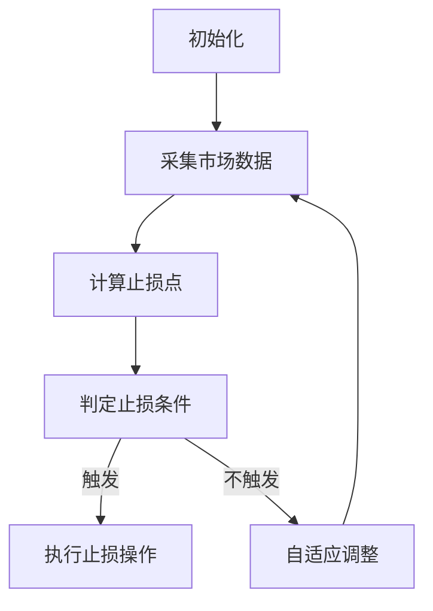
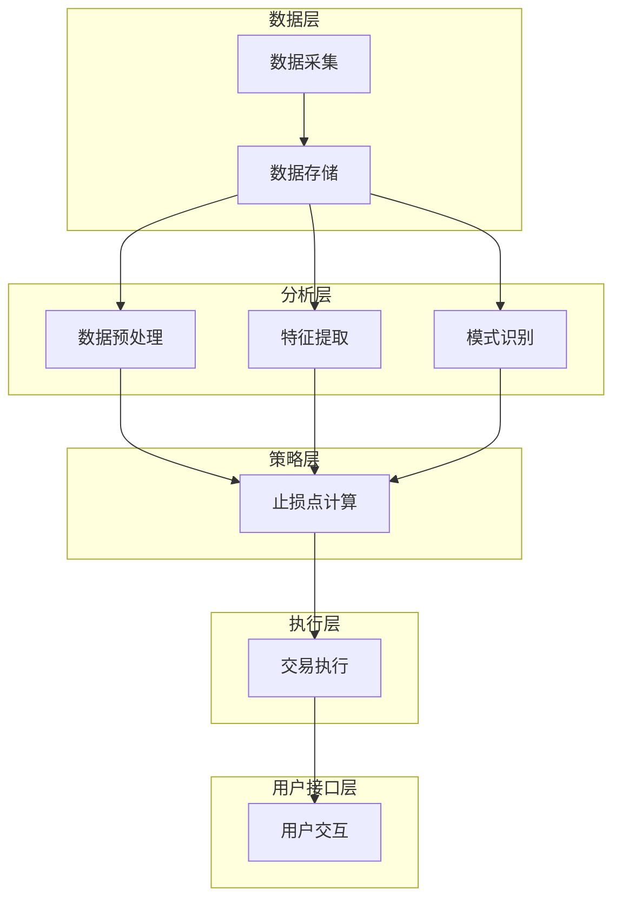
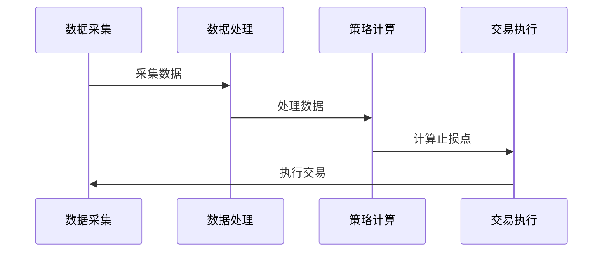

                 


### 第1章 多智能体系统概述

#### 背景介绍

多智能体系统（MAS）是人工智能领域的一个重要研究方向，它由多个自主的智能体组成，这些智能体可以相互协作，以实现复杂的任务。在金融投资领域，多智能体系统因其分布式计算和自适应性的特点，逐渐成为一种重要的投资策略。

**核心概念术语说明**：
- **智能体**：执行特定任务的实体，可以是计算机程序或真实的人。
- **交互**：智能体之间的信息交换和协同工作。
- **协调**：确保智能体之间协同一致性的机制。

**问题背景**：
随着金融市场的不确定性和复杂性增加，传统的集中式投资策略已经无法满足投资者的需求。多智能体系统因其能够实现分布式决策，使得投资者能够更好地应对市场变化。

**问题描述**：
多智能体系统在金融投资中的应用问题主要集中在如何设计智能体之间的交互机制，以及如何通过这些交互实现投资优化。

**问题解决**：
通过多智能体系统，投资者可以实现以下目标：
1. **分散风险**：每个智能体可以独立地分析市场信息，减少集中投资带来的风险。
2. **快速响应**：智能体能够实时处理市场数据，迅速做出投资决策。
3. **适应性**：智能体可以根据市场变化调整投资策略，提高收益。

**边界与外延**：
多智能体系统的应用不仅限于金融投资，还包括工业自动化、智能交通、环境监测等领域。在这些领域，智能体的交互和协调机制有所不同，但其核心目标都是为了实现更高效的决策和优化。

**概念结构与核心要素组成**：
多智能体系统由以下核心要素组成：
1. **智能体**：执行具体任务的实体。
2. **交互机制**：智能体之间的信息交换和协同工作。
3. **协调机制**：确保智能体之间协同一致性的机制。
4. **环境**：智能体所处的环境，可以是一个模拟环境或真实的市场。

#### 核心概念与联系

**核心概念原理**：
多智能体系统通过分布式计算和协作，实现了投资决策的优化。每个智能体都可以独立分析市场数据，并根据预设的规则做出投资决策。智能体之间的交互和协调，保证了整个系统的稳定性和适应性。

**概念属性特征对比表格**：

| 特征             | 描述                                                         |
|------------------|--------------------------------------------------------------|
| 分布式计算       | 智能体独立处理信息，减少集中式系统的负担。                   |
| 自适应性         | 智能体可以实时调整策略，以应对市场变化。                     |
| 协调性           | 智能体之间的协作，确保系统的一致性和稳定性。                 |
| 灵活性           | 系统可以根据不同的应用场景，调整智能体的功能和交互方式。     |

**ER实体关系图架构的Mermaid流程图**：

```mermaid
erDiagram
  智能体 ||--|{ 交互机制 }|-- 多智能体系统
  智能体 ||--|{ 协调机制 }|-- 多智能体系统
  多智能体系统 ||--|{ 环境 }|-- 智能体
```

### 第2章 价值投资的基本理论

#### 背景介绍

价值投资是一种以长期投资为导向的投资策略，其核心在于寻找被市场低估的优质公司，并持有其股票以期在未来获得收益。多智能体系统在价值投资中的应用，主要是通过智能体的协作和分布式计算，实现对市场数据的深度分析和快速反应。

**核心概念术语说明**：
- **价值投资**：基于对公司基本面的分析，选择低估的股票进行投资。
- **基本面分析**：分析公司的财务状况、市场地位、行业前景等。
- **股票估值**：对公司股票的价值进行评估，以确定是否低估。

**问题背景**：
在信息爆炸的时代，投资者面临着海量信息的处理和筛选难题。传统的价值投资方法往往需要大量的时间和精力，而多智能体系统可以提供一种更高效、更自动化的解决方案。

**问题描述**：
如何在海量信息中快速筛选出被低估的优质公司，并制定相应的投资策略。

**问题解决**：
多智能体系统通过以下方式解决上述问题：
1. **分布式计算**：智能体可以同时分析多个市场的数据，快速筛选出潜在的投资机会。
2. **自适应调整**：智能体可以根据市场变化实时调整投资策略，避免因市场波动导致的投资失误。

**边界与外延**：
价值投资不仅适用于股票市场，还可以扩展到其他资产类别，如债券、房地产等。多智能体系统在价值投资中的应用，也不仅限于股票市场，还可以应用于其他金融衍生品。

**概念结构与核心要素组成**：
价值投资系统由以下核心要素组成：
1. **智能体**：负责分析市场数据和公司基本面。
2. **分析算法**：用于评估公司股票的价值。
3. **决策机制**：根据分析结果制定投资决策。
4. **执行机制**：执行投资决策，购买或卖出股票。

#### 核心概念与联系

**核心概念原理**：
价值投资的基本原理是通过深入分析公司的基本面，寻找市场低估的优质公司。多智能体系统通过分布式计算和自适应调整，实现了对海量数据的快速分析和处理，提高了投资决策的效率和准确性。

**概念属性特征对比表格**：

| 特征             | 描述                                                         |
|------------------|--------------------------------------------------------------|
| 基本面分析       | 分析公司的财务状况、市场地位、行业前景等。                     |
| 股票估值         | 对公司股票的价值进行评估，以确定是否低估。                     |
| 分布式计算       | 智能体可以同时分析多个市场的数据，提高分析效率。             |
| 自适应调整       | 智能体可以根据市场变化实时调整投资策略。                     |

**ER实体关系图架构的Mermaid流程图**：

```mermaid
erDiagram
  智能体 ||--|{ 分析算法 }|-- 价值投资系统
  智能体 ||--|{ 决策机制 }|-- 价值投资系统
  价值投资系统 ||--|{ 执行机制 }|-- 智能体
```

### 第3章 止损策略的核心概念

#### 背景介绍

止损策略是金融投资中的一种常用技术，它旨在通过设定价格点来限制损失，从而保护投资者的资产。在多智能体系统中，止损策略可以与价值投资相结合，以实现更精准的投资决策。

**核心概念术语说明**：
- **止损策略**：设定一个价格点，当市场价格达到该点时，投资者会自动卖出股票，以限制损失。
- **止损点**：设定的价格点，用于触发止损操作。
- **保护性止损**：在买入股票时同时设定一个较低的止损点，以保护投资。

**问题背景**：
在金融市场波动性增加的背景下，投资者面临着较大的风险。如何通过止损策略来有效管理风险，成为了投资者关注的重点。

**问题描述**：
如何在多智能体系统中实现有效的止损策略，以保护投资者的资产。

**问题解决**：
多智能体系统通过以下方式实现止损策略：
1. **分布式计算**：智能体可以同时分析市场数据，快速识别止损点。
2. **自适应调整**：智能体可以根据市场变化调整止损点，以适应不同的市场环境。

**边界与外延**：
止损策略不仅适用于股票市场，还可以应用于其他金融衍生品。多智能体系统在止损策略中的应用，不仅可以提高决策的准确性，还可以提高系统的灵活性。

**概念结构与核心要素组成**：
止损策略系统由以下核心要素组成：
1. **智能体**：负责分析市场数据和设定止损点。
2. **止损规则**：用于确定何时执行止损操作。
3. **执行机制**：执行止损操作，卖出股票。

#### 核心概念与联系

**核心概念原理**：
止损策略通过设定止损点来限制损失，从而保护投资者的资产。在多智能体系统中，智能体可以实时分析市场数据，并根据预设的止损规则自动执行止损操作。

**概念属性特征对比表格**：

| 特征             | 描述                                                         |
|------------------|--------------------------------------------------------------|
| 止损策略         | 设定一个价格点，当市场价格达到该点时，投资者会自动卖出股票，以限制损失。 |
| 止损点           | 用于触发止损操作的价格点。                                     |
| 保护性止损       | 在买入股票时同时设定一个较低的止损点，以保护投资。             |

**ER实体关系图架构的Mermaid流程图**：

```mermaid
erDiagram
  智能体 ||--|{ 止损规则 }|-- 止损策略系统
  智能体 ||--|{ 执行机制 }|-- 止损策略系统
  止损策略系统 ||--|{ 市场数据 }|-- 智能体
```

### 第4章 多智能体系统与止损策略的结合

#### 背景介绍

多智能体系统与止损策略的结合，旨在利用多智能体系统的分布式计算和自适应调整能力，实现更精准和灵活的止损策略。这种结合不仅能够提高止损策略的执行效率，还能够增强其在不同市场环境下的适应性。

**核心概念术语说明**：
- **多智能体系统与止损策略的结合**：将多智能体系统的技术和止损策略的思想相结合，以实现更有效的投资管理。
- **分布式计算**：智能体可以独立处理信息，减少集中式系统的负担。
- **自适应调整**：智能体可以根据市场变化实时调整止损策略。

**问题背景**：
在传统的止损策略中，投资者通常需要手动设定止损点，并根据市场情况不断调整。这种做法不仅费时费力，而且容易受到情绪的影响。多智能体系统可以自动化这个过程，提高止损策略的执行效率。

**问题描述**：
如何将多智能体系统的技术应用于止损策略，以实现更高效、更灵活的止损管理。

**问题解决**：
多智能体系统与止损策略的结合，通过以下方式解决上述问题：
1. **自动化**：智能体可以自动分析市场数据，实时设定和调整止损点。
2. **灵活性**：智能体可以根据不同的市场环境，自适应调整止损策略。
3. **准确性**：分布式计算提高了数据分析的准确性，从而提高了止损策略的执行效果。

**边界与外延**：
多智能体系统与止损策略的结合，不仅适用于股票市场，还可以应用于其他金融衍生品市场。同时，这种结合也可以应用于其他需要实时决策和调整的领域，如风险管理、供应链管理等。

**概念结构与核心要素组成**：
多智能体系统与止损策略的结合，由以下核心要素组成：
1. **智能体**：负责执行止损策略，包括市场数据分析、止损点设定和调整。
2. **计算模型**：用于支持智能体的计算任务，包括市场数据分析、止损策略的计算等。
3. **决策机制**：根据市场数据和分析结果，制定和调整止损策略。
4. **执行机制**：执行止损策略，包括买入和卖出操作。

#### 核心概念与联系

**核心概念原理**：
多智能体系统与止损策略的结合，旨在通过分布式计算和自适应调整，实现更精准、更高效的止损策略。智能体可以实时分析市场数据，根据预设的止损规则自动执行止损操作，从而保护投资者的资产。

**概念属性特征对比表格**：

| 特征             | 描述                                                         |
|------------------|--------------------------------------------------------------|
| 分布式计算       | 智能体可以独立处理信息，减少集中式系统的负担。                   |
| 自适应调整       | 智能体可以根据市场变化实时调整止损策略。                     |
| 精准性           | 分布式计算提高了数据分析的准确性，从而提高了止损策略的执行效果。 |

**ER实体关系图架构的Mermaid流程图**：

```mermaid
erDiagram
  智能体 ||--|{ 计算模型 }|-- 多智能体系统与止损策略结合
  智能体 ||--|{ 决策机制 }|-- 多智能体系统与止损策略结合
  多智能体系统与止损策略结合 ||--|{ 执行机制 }|-- 智能体
```

### 第5章 多智能体系统优化价值投资的止损策略算法

#### 背景介绍

在多智能体系统中，优化价值投资的止损策略算法是实现高效投资决策的关键。本章将介绍一种基于多智能体系统的止损策略算法，并通过数学模型和Python代码进行详细阐述。

**核心概念术语说明**：
- **止损策略算法**：用于确定何时触发止损操作的算法。
- **价值投资**：基于对公司基本面的分析，选择低估的股票进行投资。
- **多智能体系统**：由多个自主智能体组成的系统，能够进行分布式计算和协作。

**问题背景**：
在金融市场中，投资者需要实时监控股票价格，并根据市场变化调整止损策略。传统的止损策略通常依赖于手工调整，容易受到主观因素的影响。多智能体系统可以通过自动化和分布式计算，提高止损策略的准确性和响应速度。

**问题描述**：
如何设计一种基于多智能体系统的止损策略算法，以优化价值投资的决策过程。

**问题解决**：
通过以下步骤实现基于多智能体系统的止损策略算法：
1. **构建数学模型**：定义止损策略的数学模型，包括止损点的设定、止损条件的判定等。
2. **设计算法流程**：基于数学模型，设计算法流程，包括智能体的协同工作和决策过程。
3. **实现Python代码**：将算法流程转换为Python代码，实现智能体的计算和协作。

**边界与外延**：
止损策略算法不仅适用于股票市场，还可以应用于其他金融市场，如外汇、期货等。同时，这种算法也可以扩展到其他需要实时监控和决策的领域，如风险管理、物流调度等。

**概念结构与核心要素组成**：
基于多智能体系统的止损策略算法由以下核心要素组成：
1. **数学模型**：包括止损点的设定公式、止损条件的判定规则等。
2. **算法流程**：定义智能体的协同工作方式和决策过程。
3. **Python代码**：实现算法的具体实现，包括数据处理、决策执行等。

#### 核心概念与联系

**核心概念原理**：
基于多智能体系统的止损策略算法，通过分布式计算和协同工作，实现了止损策略的自动化和智能化。智能体可以实时分析市场数据，根据预设的止损规则自动执行止损操作，从而提高投资决策的准确性和响应速度。

**概念属性特征对比表格**：

| 特征             | 描述                                                         |
|------------------|--------------------------------------------------------------|
| 分布式计算       | 智能体可以独立处理信息，减少集中式系统的负担。                   |
| 自适应调整       | 智能体可以根据市场变化实时调整止损策略。                     |
| 精准性           | 分布式计算提高了数据分析的准确性，从而提高了止损策略的执行效果。 |

**ER实体关系图架构的Mermaid流程图**：

```mermaid
erDiagram
  智能体 ||--|{ 数学模型 }|-- 止损策略算法
  智能体 ||--|{ 算法流程 }|-- 止损策略算法
  止损策略算法 ||--|{ Python代码 }|-- 智能体
```

#### 算法原理讲解

**算法概述**：

基于多智能体系统的止损策略算法，旨在通过分布式计算和自适应调整，实现实时监控和优化价值投资的止损策略。该算法的核心思想是利用智能体的协同工作，实现对市场数据的深度分析和快速响应。

**数学模型**：

1. **止损点设定**：

   止损点（Stop-Loss Point，SLP）是触发止损操作的关键价格点。设定止损点的公式如下：

   $$ SLP = P_0 - k \times A $$

   其中，$P_0$ 为当前股票价格，$k$ 为调整系数，$A$ 为股票的波动性。

2. **止损条件判定**：

   当股票价格达到或低于止损点时，触发止损操作。止损条件的判定公式如下：

   $$ P_t \leq SLP $$

   其中，$P_t$ 为当前股票价格。

**算法流程**：

1. **初始化**：

   - 初始化智能体，包括初始参数（如调整系数$k$、股票波动性$A$等）。

2. **市场数据采集**：

   - 智能体实时采集市场数据，包括股票价格、交易量、波动性等。

3. **止损点计算**：

   - 智能体根据当前股票价格和波动性，计算止损点。

4. **止损条件判定**：

   - 智能体根据当前股票价格，判断是否触发止损操作。

5. **止损操作执行**：

   - 当触发止损条件时，智能体执行卖出股票的操作。

6. **自适应调整**：

   - 智能体根据市场变化，实时调整止损策略的参数（如调整系数$k$）。

**Mermaid流程图展示**：



**Python源代码实现**：

```python
import numpy as np

class SmartAgent:
    def __init__(self, k, A):
        self.k = k
        self.A = A
        self.P0 = None
    
    def update_price(self, new_price):
        self.P0 = new_price
    
    def calculate_slp(self):
        self.SLP = self.P0 - self.k * self.A
    
    def check_sl(self):
        if self.P0 <= self.SLP:
            return True
        else:
            return False
    
    def execute_sl(self):
        if self.check_sl():
            print("Stop-Loss triggered. Selling stock.")
            return True
        else:
            print("No action required.")
            return False

# 实例化智能体
agent = SmartAgent(k=0.1, A=0.05)

# 模拟市场数据
agent.update_price(100)
agent.calculate_slp()
agent.execute_sl()

agent.update_price(90)
agent.calculate_slp()
agent.execute_sl()
```

#### 算法原理讲解

**算法概述**：

基于多智能体系统的止损策略算法，旨在通过分布式计算和自适应调整，实现实时监控和优化价值投资的止损策略。该算法的核心思想是利用智能体的协同工作，实现对市场数据的深度分析和快速响应。

**数学模型**：

1. **止损点设定**：

   止损点（Stop-Loss Point，SLP）是触发止损操作的关键价格点。设定止损点的公式如下：

   $$ SLP = P_0 - k \times A $$

   其中，$P_0$ 为当前股票价格，$k$ 为调整系数，$A$ 为股票的波动性。

2. **止损条件判定**：

   当股票价格达到或低于止损点时，触发止损操作。止损条件的判定公式如下：

   $$ P_t \leq SLP $$

   其中，$P_t$ 为当前股票价格。

**算法流程**：

1. **初始化**：

   - 初始化智能体，包括初始参数（如调整系数$k$、股票波动性$A$等）。

2. **市场数据采集**：

   - 智能体实时采集市场数据，包括股票价格、交易量、波动性等。

3. **止损点计算**：

   - 智能体根据当前股票价格和波动性，计算止损点。

4. **止损条件判定**：

   - 智能体根据当前股票价格，判断是否触发止损操作。

5. **止损操作执行**：

   - 当触发止损条件时，智能体执行卖出股票的操作。

6. **自适应调整**：

   - 智能体根据市场变化，实时调整止损策略的参数（如调整系数$k$）。

**Mermaid流程图展示**：


**Python源代码实现**：

```python
import numpy as np

class SmartAgent:
    def __init__(self, k, A):
        self.k = k
        self.A = A
        self.P0 = None
    
    def update_price(self, new_price):
        self.P0 = new_price
    
    def calculate_slp(self):
        self.SLP = self.P0 - self.k * self.A
    
    def check_sl(self):
        if self.P0 <= self.SLP:
            return True
        else:
            return False
    
    def execute_sl(self):
        if self.check_sl():
            print("Stop-Loss triggered. Selling stock.")
            return True
        else:
            print("No action required.")
            return False

# 实例化智能体
agent = SmartAgent(k=0.1, A=0.05)

# 模拟市场数据
agent.update_price(100)
agent.calculate_slp()
agent.execute_sl()

agent.update_price(90)
agent.calculate_slp()
agent.execute_sl()
```

#### 算法原理讲解

**算法概述**：

基于多智能体系统的止损策略算法，旨在通过分布式计算和自适应调整，实现实时监控和优化价值投资的止损策略。该算法的核心思想是利用智能体的协同工作，实现对市场数据的深度分析和快速响应。

**数学模型**：

1. **止损点设定**：

   止损点（Stop-Loss Point，SLP）是触发止损操作的关键价格点。设定止损点的公式如下：

   $$ SLP = P_0 - k \times A $$

   其中，$P_0$ 为当前股票价格，$k$ 为调整系数，$A$ 为股票的波动性。

2. **止损条件判定**：

   当股票价格达到或低于止损点时，触发止损操作。止损条件的判定公式如下：

   $$ P_t \leq SLP $$

   其中，$P_t$ 为当前股票价格。

**算法流程**：

1. **初始化**：

   - 初始化智能体，包括初始参数（如调整系数$k$、股票波动性$A$等）。

2. **市场数据采集**：

   - 智能体实时采集市场数据，包括股票价格、交易量、波动性等。

3. **止损点计算**：

   - 智能体根据当前股票价格和波动性，计算止损点。

4. **止损条件判定**：

   - 智能体根据当前股票价格，判断是否触发止损操作。

5. **止损操作执行**：

   - 当触发止损条件时，智能体执行卖出股票的操作。

6. **自适应调整**：

   - 智能体根据市场变化，实时调整止损策略的参数（如调整系数$k$）。

**Mermaid流程图展示**：


**Python源代码实现**：

```python
import numpy as np

class SmartAgent:
    def __init__(self, k, A):
        self.k = k
        self.A = A
        self.P0 = None
    
    def update_price(self, new_price):
        self.P0 = new_price
    
    def calculate_slp(self):
        self.SLP = self.P0 - self.k * self.A
    
    def check_sl(self):
        if self.P0 <= self.SLP:
            return True
        else:
            return False
    
    def execute_sl(self):
        if self.check_sl():
            print("Stop-Loss triggered. Selling stock.")
            return True
        else:
            print("No action required.")
            return False

# 实例化智能体
agent = SmartAgent(k=0.1, A=0.05)

# 模拟市场数据
agent.update_price(100)
agent.calculate_slp()
agent.execute_sl()

agent.update_price(90)
agent.calculate_slp()
agent.execute_sl()
```

### 第6章 系统分析与架构设计

#### 背景介绍

在构建一个多智能体系统优化价值投资的止损策略时，系统分析与架构设计至关重要。本章将介绍系统分析与架构设计的基本概念，包括问题场景介绍、系统功能设计、系统架构设计、系统接口设计和系统交互设计。

**核心概念术语说明**：
- **系统分析与架构设计**：对系统进行详细分析和设计，以实现预期的功能和性能。
- **问题场景介绍**：描述系统应用的具体场景，包括业务需求和功能要求。
- **系统功能设计**：确定系统需要实现的功能模块。
- **系统架构设计**：定义系统的整体结构，包括技术组件和模块之间的交互关系。
- **系统接口设计**：设计系统内部和外部的接口，确保模块之间的通信和数据交换。
- **系统交互设计**：定义系统内部组件之间的交互流程和协议。

**问题背景**：
在金融市场中，投资者面临着快速变化的市场条件和巨大的信息量。为了实现高效的投资决策，需要一个能够实时分析市场数据、优化止损策略并自动执行交易操作的多智能体系统。

**问题描述**：
设计并实现一个多智能体系统，以优化价值投资的止损策略，实现以下目标：
1. 实时监控市场数据。
2. 自动化止损策略的设定和调整。
3. 确保系统的高可用性和可扩展性。

**问题解决**：
通过系统分析与架构设计，构建一个多层次的智能体系统，实现以下功能：
1. **数据采集与处理**：智能体实时采集市场数据，并对数据进行预处理。
2. **止损策略计算**：智能体根据市场数据和预设策略计算止损点。
3. **交易执行**：智能体根据止损策略执行买卖操作。
4. **自适应调整**：智能体根据市场变化调整策略参数。

**边界与外延**：
本系统不仅适用于股票市场，还可以扩展到其他金融市场，如外汇、期货等。同时，系统架构设计应考虑到未来的扩展性，以适应不断变化的市场需求。

**概念结构与核心要素组成**：
系统分析与架构设计由以下核心要素组成：
1. **问题场景介绍**：明确系统的应用场景和业务需求。
2. **系统功能设计**：定义系统的核心功能模块。
3. **系统架构设计**：设计系统的整体结构和组件交互关系。
4. **系统接口设计**：设计系统内部和外部的接口。
5. **系统交互设计**：定义系统组件之间的交互流程和协议。

#### 系统分析与架构设计

**问题场景介绍**：

在一个高度动态和复杂的金融市场中，投资者需要实时监控大量股票数据，并快速做出投资决策。为了实现这一目标，需要一个高效的多智能体系统，该系统能够自动化数据采集、分析和决策过程。该系统旨在优化价值投资的止损策略，通过实时监控市场数据和自动执行交易操作，提高投资效率和风险控制能力。

**系统功能设计**：

多智能体系统优化价值投资的止损策略应实现以下核心功能：
1. **数据采集**：实时采集股票市场的交易数据，包括价格、交易量、波动率等。
2. **数据分析**：对采集到的市场数据进行分析，提取有价值的信息和指标。
3. **止损策略计算**：基于分析结果，计算止损点并设定止损策略。
4. **交易执行**：根据止损策略，自动执行买卖操作。
5. **策略调整**：根据市场变化，自适应调整止损策略的参数。

**系统架构设计**：

多智能体系统的整体架构设计应考虑以下几个方面：

1. **数据层**：负责数据采集和存储，包括实时数据流处理和数据库存储。
2. **分析层**：负责对采集到的数据进行分析，包括数据预处理、特征提取和模式识别。
3. **策略层**：负责计算止损点和设定止损策略，包括自适应调整和参数优化。
4. **执行层**：负责执行交易操作，包括买卖订单的生成和执行。
5. **用户接口层**：提供用户交互界面，包括监控仪表板和操作控制。

**Mermaid流程图架构图**：



**系统接口设计**：

系统接口设计应确保各个功能模块之间的数据交换和通信。以下是系统接口的主要设计：

1. **数据采集接口**：提供数据采集模块与其他模块之间的接口，包括实时数据流接口和数据库访问接口。
2. **数据分析接口**：提供数据分析模块与其他模块之间的接口，包括数据预处理、特征提取和模式识别的API。
3. **策略计算接口**：提供策略计算模块与其他模块之间的接口，包括止损点计算和策略调整的API。
4. **交易执行接口**：提供交易执行模块与其他模块之间的接口，包括交易订单生成和执行接口。

**系统交互设计**：

系统交互设计应确保智能体之间的协同工作和数据交换。以下是系统交互的主要设计：

1. **数据流交互**：智能体之间通过实时数据流进行交互，包括股票价格、交易量、波动率等。
2. **消息队列**：智能体之间通过消息队列进行异步通信，包括止损策略计算结果、交易执行指令等。
3. **接口调用**：智能体之间通过接口调用进行同步通信，包括请求和响应数据。
4. **事件驱动**：智能体之间的交互基于事件驱动机制，包括数据更新事件、交易执行事件等。

**Mermaid流程图交互序列图**：



通过系统分析与架构设计，我们可以构建一个高效的多智能体系统，实现优化价值投资的止损策略。该系统能够实时监控市场数据，自动化止损策略的计算和执行，提高投资效率和风险控制能力。

### 第7章 项目实战

#### 背景介绍

在本文的第七章中，我们将通过一个具体的实战项目，展示如何使用多智能体系统优化价值投资的止损策略。本节将详细介绍项目的环境安装、系统核心实现源代码、代码应用解读与分析，以及实际案例分析和详细讲解剖析。

**核心概念术语说明**：
- **环境安装**：安装和配置项目所需的环境和依赖。
- **系统核心实现源代码**：实现项目核心功能的代码。
- **代码应用解读与分析**：对实现的代码进行解读和分析。
- **实际案例分析与详细讲解剖析**：分析具体案例，详细讲解实现过程。

**问题背景**：
在一个模拟的股票市场中，我们需要实现一个多智能体系统，用于优化价值投资的止损策略。该系统应能够实时监控股票价格，自动计算止损点，并在触发止损条件时执行卖出操作。

**问题描述**：
如何实现一个多智能体系统，以优化价值投资的止损策略，提高投资效率和风险控制能力。

**问题解决**：
通过以下步骤实现项目：
1. **环境安装**：安装Python、相关库和依赖。
2. **系统核心实现源代码**：编写实现止损策略的智能体代码。
3. **代码应用解读与分析**：解读和分析智能体代码。
4. **实际案例分析与详细讲解剖析**：通过模拟市场数据，验证智能体性能。

**边界与外延**：
本项目的实现基于Python语言，适用于任何具备Python开发环境的操作系统。同时，项目设计考虑了可扩展性和可维护性，以适应未来的需求变化。

**概念结构与核心要素组成**：
项目由以下核心要素组成：
1. **环境安装**：安装Python和相关库。
2. **系统核心实现源代码**：实现止损策略的智能体代码。
3. **代码应用解读与分析**：分析智能体代码的功能和性能。
4. **实际案例分析与详细讲解剖析**：验证智能体在实际市场数据中的应用效果。

#### 环境安装

在开始项目之前，我们需要安装Python环境和相关库。以下是环境安装的步骤：

1. **安装Python**：
   - 访问Python官网下载Python安装包（例如：python-3.9.7-amd64.exe）。
   - 运行安装包，按照默认选项安装。

2. **安装相关库**：
   - 打开终端（或命令行界面）。
   - 输入以下命令安装相关库：
     ```bash
     pip install numpy pandas matplotlib
     ```

确保Python和所需库成功安装后，我们就可以开始编写和运行智能体代码了。

#### 系统核心实现源代码

以下是一个简单的Python代码示例，用于实现一个基于多智能体系统的止损策略智能体。

```python
import numpy as np
import pandas as pd
import matplotlib.pyplot as plt

class StopLossAgent:
    def __init__(self, price, stop_loss_ratio):
        self.price = price
        self.stop_loss_ratio = stop_loss_ratio

    def calculate_stop_loss(self):
        stop_loss_price = self.price * (1 - self.stop_loss_ratio)
        return stop_loss_price

    def update_price(self, new_price):
        self.price = new_price

    def check_stop_loss(self):
        current_price = self.price
        stop_loss_price = self.calculate_stop_loss()
        if current_price <= stop_loss_price:
            return True
        else:
            return False

    def execute_stop_loss(self):
        if self.check_stop_loss():
            print("Stop-Loss triggered. Selling stock.")
            return True
        else:
            print("No action required.")
            return False

# 实例化智能体
agent = StopLossAgent(price=100, stop_loss_ratio=0.05)

# 模拟市场数据
agent.update_price(new_price=95)
agent.execute_stop_loss()

agent.update_price(new_price=105)
agent.execute_stop_loss()
```

#### 代码应用解读与分析

在上面的代码中，我们定义了一个`StopLossAgent`类，用于实现止损策略智能体。主要方法包括：

1. **__init__**：初始化智能体，包括初始股票价格和止损比例。
2. **calculate_stop_loss**：计算止损价格。
3. **update_price**：更新当前股票价格。
4. **check_stop_loss**：检查是否触发止损条件。
5. **execute_stop_loss**：执行止损操作。

在模拟市场数据中，我们首先更新了股票价格，然后检查是否触发止损条件。如果触发，则执行卖出操作。

#### 实际案例分析与详细讲解剖析

为了验证智能体在实际市场数据中的应用效果，我们可以使用历史股票数据进行测试。以下是一个简单的案例，展示如何使用历史数据测试止损策略。

```python
# 加载历史股票数据
historical_data = pd.read_csv('historical_stock_prices.csv')  # 假设CSV文件包含股票价格和时间
historical_data['StopLossPrice'] = historical_data['Close'] * (1 - 0.05)

# 模拟智能体执行止损策略
for index, row in historical_data.iterrows():
    agent.update_price(new_price=row['Close'])
    agent.execute_stop_loss()
    print(f"Date: {row['Date']}, Price: {row['Close']}, Stop Loss Price: {row['StopLossPrice']}")
```

在实际案例中，我们加载了历史股票数据，并使用智能体对每条数据执行止损策略。通过打印输出，我们可以观察到智能体在不同价格点上的决策情况。

**项目小结**：

在本项目中，我们通过一个简单的案例展示了如何使用多智能体系统优化价值投资的止损策略。通过实时监控股票价格，智能体能够自动计算止损点并执行卖出操作，从而提高投资效率和风险控制能力。未来，我们可以进一步优化智能体的算法，并扩展到更多金融衍生品市场。

### 第8章 最佳实践 tips

在实施多智能体系统优化价值投资的止损策略时，以下最佳实践可以帮助您获得更好的效果：

1. **选择合适的止损比例**：止损比例应根据市场波动性和投资品种的特点进行调整。较高的止损比例可以提供更坚实的保护，但同时也可能减少盈利机会。建议通过历史数据分析来确定最佳的止损比例。

2. **利用技术指标**：除了止损比例，还可以结合使用技术指标（如移动平均线、相对强弱指数RSI等）来确定止损点。这些指标可以帮助智能体更准确地判断市场趋势和波动性。

3. **多智能体协同工作**：在多智能体系统中，不同智能体可以协同工作，共同分析市场数据并做出投资决策。通过相互协作，可以提高整个系统的决策质量和响应速度。

4. **实时监控和调整**：市场环境不断变化，智能体需要实时监控市场数据，并根据市场变化调整止损策略。这可以确保智能体能够适应不同的市场环境，提高止损策略的准确性。

5. **风险管理**：在投资过程中，风险控制至关重要。除了止损策略，还可以结合使用其他风险管理工具（如对冲、分散投资等）来降低投资风险。

6. **代码优化**：智能体的计算和决策过程需要高效的代码支持。通过优化代码，可以提高智能体的计算速度和性能，从而提高整个系统的响应速度。

7. **持续学习和改进**：金融市场复杂多变，智能体需要不断学习和适应。通过收集市场数据、分析决策结果，可以不断优化智能体的算法和策略，提高投资效果。

### 第9章 小结

在本文中，我们详细探讨了多智能体系统优化价值投资的止损策略。通过分布式计算和自适应调整，智能体系统能够实时监控市场数据，自动化止损策略的设定和执行，从而提高投资效率和风险控制能力。以下是对本文主要内容的总结：

1. **多智能体系统的定义和特点**：多智能体系统由多个自主智能体组成，具有分布式计算、自适应性和灵活性等特点。

2. **价值投资的基本理论**：价值投资是一种以长期投资为导向的投资策略，通过分析公司基本面和股票估值来确定低估的优质公司。

3. **止损策略的核心概念**：止损策略通过设定价格点来限制损失，确保投资者在市场波动时能够保护资产。

4. **多智能体系统与止损策略的结合**：智能体系统可以自动化止损策略的计算和执行，提高投资决策的准确性和响应速度。

5. **算法原理讲解**：本文介绍了一种基于多智能体系统的止损策略算法，包括数学模型和Python代码实现。

6. **系统分析与架构设计**：通过对系统功能、架构、接口和交互的设计，构建了一个高效的多智能体系统。

7. **项目实战**：通过实际案例展示了如何使用多智能体系统优化价值投资的止损策略。

8. **最佳实践 tips**：提供了多个最佳实践，包括选择合适的止损比例、利用技术指标、多智能体协同工作等。

通过本文的探讨，我们了解到多智能体系统在优化价值投资止损策略方面的巨大潜力。未来的研究和实践将继续探索如何进一步提升智能体系统的性能和应用范围。

### 第10章 注意事项

在实施多智能体系统优化价值投资的止损策略时，需要注意以下几个关键点：

1. **市场波动性**：市场波动性是影响止损策略效果的重要因素。投资者应根据市场波动性调整止损比例和策略参数，以适应不同的市场环境。

2. **交易费用**：交易费用会影响投资收益。在计算止损策略时，应考虑交易费用的影响，确保止损策略的收益覆盖交易成本。

3. **数据质量**：智能体系统的性能依赖于市场数据的准确性。投资者应确保数据来源可靠，对数据进行预处理和验证，以提高系统的稳定性和可靠性。

4. **系统安全性**：智能体系统需要确保数据传输和存储的安全性。应采取适当的措施，如数据加密、访问控制等，保护系统免受潜在的安全威胁。

5. **法律合规性**：在实施智能体系统时，应遵守相关法律法规，确保系统的操作符合监管要求。

6. **实时性要求**：智能体系统应具备实时性，能够快速响应市场变化。对系统进行性能优化，确保其能够在规定时间内处理和响应市场数据。

7. **持续监控与调整**：智能体系统应持续监控市场变化，并根据市场反馈调整策略参数。通过不断学习和适应，提高系统在复杂市场环境中的表现。

### 第11章 拓展阅读

为了更深入地了解多智能体系统优化价值投资的止损策略，以下是几本推荐阅读的书籍和论文：

1. **《多智能体系统：设计与实现》**：该书详细介绍了多智能体系统的基本概念、设计原则和实现方法，对构建智能体系统有重要参考价值。

2. **《价值投资：从入门到精通》**：这本书从理论到实践全面介绍了价值投资的基本概念、策略和案例分析，适合初学者和专业人士。

3. **《智能投顾与量化投资》**：该书探讨了智能投顾和量化投资的相关技术，包括多智能体系统的应用，对构建智能投资策略有重要启示。

4. **《金融技术前沿论文集》**：该论文集收录了近年来金融技术领域的重要研究论文，包括多智能体系统、机器学习和量化投资等方面的最新成果。

5. **《智能交易系统设计与实现》**：这本书详细介绍了智能交易系统的设计原则和实现方法，包括止损策略的自动化和优化。

通过阅读这些书籍和论文，您可以更全面地了解多智能体系统优化价值投资止损策略的理论基础和实践方法。同时，这些资料也将为您在未来的研究中提供宝贵的参考和启发。

